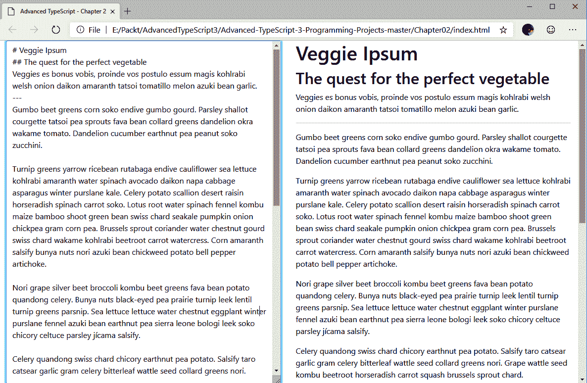

# 第二章：使用 TypeScript 创建一个 Markdown 编辑器

在互联网上处理内容时很难避免遇到 markdown。Markdown 是一种使用纯文本创建内容的简化方式，可以轻松转换为简单的 HTML。在本章中，我们将调查创建一个解析器所需的步骤，该解析器将把标记格式的子集转换为 HTML 内容。我们将自动将相关标签转换为前三个标题级别、水平规则和段落。

在本章结束时，我们将学习如何创建一个简单的 Bootstrap 网页，并引用从我们的 TypeScript 生成的 JavaScript，以及如何连接到一个简单的事件处理程序。我们还将学习如何使用简单的设计模式创建类，以及如何设计具有单一职责的类，这些技术将成为我们作为专业开发人员的有用技能。

本章将涵盖以下主题：

+   创建一个覆盖 Bootstrap 样式的 Bootstrap 页面

+   选择我们在 markdown 中要使用的标签

+   定义需求

+   将我们的 markdown 标记类型映射到 HTML 标记类型

+   将我们转换的 markdown 存储在自定义类中

+   使用访问者模式更新我们的文档

+   使用责任链模式应用标签

+   将其连接回我们的 HTML

# 技术要求

本章的代码可以从[`github.com/PacktPublishing/Advanced-TypeScript-3-Programming-Projects/tree/master/Chapter02`](https://github.com/PacktPublishing/Advanced-TypeScript-3-Programming-Projects/tree/master/Chapter02)下载。

# 了解项目概述

现在我们已经掌握了本书中将要涵盖的一些概念，我们将开始将它们付诸实践，创建一个项目，该项目在用户输入到文本区域时解析一个非常简单的 markdown 格式，并在其旁边显示生成的网页。与完整的 markdown 解析器不同，我们将集中于格式化前三个标题类型、水平规则和段落。标记受限于通过换行符分解行并查看行的开头。然后确定特定标签是否存在，如果不存在，则假定当前行是一个段落。我们选择这种实现的原因是因为它是一个可以立即掌握的简单任务。虽然简单，但它提供了足够的深度，以表明我们将处理需要我们认真考虑如何构建应用程序的主题。

**用户界面**（**UI**）使用 Bootstrap，我们将看看如何连接到更改事件处理程序以及如何获取和更新当前网页的 HTML 内容。这是我们完成后项目的样子：



现在我们有了概述，我们可以继续开始创建 HTML 项目。

# 开始一个简单的 HTML 项目

这个项目是一个简单的 HTML 和 TypeScript 文件组合。创建一个目录来保存 HTML 和 TypeScript 文件。我们的 JavaScript 将驻留在此目录下的脚本文件夹中。使用以下`tsconfig.json`文件：

```ts
{
  "compilerOptions": {
    "target": "ES2015", 
    "module": "commonjs", 
    "sourceMap": true, 
    "outDir": "./script", 
    "strict": true, 
    "strictNullChecks": true,
    "strictFunctionTypes": true,
    "noImplicitThis": true,
    "alwaysStrict": true,
    "noImplicitReturns": true,
    "noFallthroughCasesInSwitch": true,
    "esModuleInterop": true, 
    "experimentalDecorators": true,
  }
}
```

# 编写一个简单的 markdown 解析器

当我在考虑本章我们将要处理的项目时，我心中有一个明确的目标。在编写这段代码的同时，我们将尝试诸如模式和良好的**面向对象**（**OO**）实践，比如类具有单一职责。如果我们能从一开始就应用这些技术，我们很快就会养成使用它们的习惯，这将转化为有用的开发技能。

作为专业开发人员，在编写任何代码之前，我们应该收集我们将使用的要求，并确保我们对我们的应用程序将要做什么没有任何假设。我们可能认为我们知道我们想要我们的应用程序做什么，但是如果我们列出我们的要求，我们将确保我们理解我们应该交付的一切，并且我们将得到一个方便的清单，以便在完成它们时勾选功能。

所以，这是我的清单：

+   我们将创建一个解析 markdown 的应用程序

+   用户将在文本区域中输入

+   每当文本区域发生变化时，我们将重新解析整个文档

+   我们将根据用户按下*Enter*键的位置来分解文档

+   开头的字符将决定该行是否是 markdown

+   输入#后跟一个空格将被替换为 H1 标题

+   输入##后跟一个空格将被替换为 H2 标题

+   输入###后跟一个空格将被替换为 H3 标题

+   输入---将被替换为水平线

+   如果该行不以 markdown 开头，则该行将被视为段落

+   生成的 HTML 将显示在一个标签中

+   如果 markdown 文本区域中的内容为空，则标签将包含一个空段落

+   布局将在 Bootstrap 中完成，内容将拉伸到 100%的高度

考虑到这些要求，我们对我们将要交付的内容有一个很好的想法，所以我们要开始创建我们的 UI。

# 构建我们的 Bootstrap UI

在第一章中，*高级 TypeScript 功能*，我们看了使用 Bootstrap 创建 UI 的基础知识。我们将采用相同的基本页面，并通过一些小调整来调整它以满足我们的需求。我们的起点是这个页面，通过将容器设置为使用`container-fluid`，并在两侧设置`col-lg-6`，将界面分成两个相等的部分：

```ts
<div class="container-fluid">
  <div class="row">
    <div class="col-lg-6">
    </div>
    <div class="col-lg-6">
    </div>
  </div>
</div>
```

当我们将文本区域和标签组件添加到我们的表单中时，我们发现在此行中呈现它们不会自动将它们扩展到填满屏幕的高度。我们需要做一些调整。首先，我们需要手动设置`html`和`body`标签的样式以填充可用空间。为此，我们在头部添加以下内容：

```ts
<style>
  html, body { 
    height: 100%;
  }
</style>
```

有了这个，我们可以利用 Bootstrap 4 中的一个新功能，即将`h-100`应用于这些类，以填充 100%的空间。我们还将利用这个机会添加文本区域和标签，并为它们添加我们可以从我们的 TypeScript 代码中查找的 ID：

```ts
<div class="container-fluid h-100">
  <div class="row h-100">
    <div class="col-lg-6">
      <textarea class="form-control h-100" id="markdown"></textarea>
    </div>
    <div class="col-lg-6 h-100">
      <label class="h-100" id="markdown-output"></label>
    </div>
  </div>
</div>
```

在完成页面之前，我们将开始编写我们可以在应用程序中使用的 TypeScript 代码。添加一个名为`MarkdownParser.ts`的文件来保存我们的 TypeScript 代码，并将以下代码添加到其中：

```ts
class HtmlHandler {
    public TextChangeHandler(id : string, output : string) : void {
        let markdown = <HTMLTextAreaElement>document.getElementById(id);
        let markdownOutput = <HTMLLabelElement>document.getElementById(output);
        if (markdown !== null) {
            markdown.onkeyup = (e) => {
                if (markdown.value) {
                    markdownOutput.innerHTML = markdown.value;
                }
                else 
                   markdownOutput.innerHTML = "<p></p>";
            }
        }
    }
}
```

我们创建了这个类，以便我们可以根据它们的 ID 获取文本区域和标签。一旦我们有了这些，我们将连接到文本区域，按键事件，并将按键值写回标签。请注意，即使在这一点上我们不在网页上，TypeScript 也会隐式地给我们访问标准网页行为的权限。这使我们能够根据我们先前输入的 ID 检索文本区域和标签，并将它们转换为适当的类型。有了这个，我们就能够做一些事情，比如订阅事件或访问元素的`innerHTML`。

为了简单起见，我们将在本章中使用`MarkdownParser.ts`文件中的所有 TypeScript。通常情况下，我们会将类分开放在它们自己的文件中，但是这种单文件结构应该更容易在我们逐步进行代码审查时进行复习。在未来的章节中，我们将摆脱单一文件，因为那些项目要复杂得多。

一旦我们有了这些接口元素，我们就可以连接到 keyup 事件。当事件触发时，我们查看文本区域中是否有任何文本，并使用内容（如果存在）或空段落（如果不存在）设置标签的 HTML。我们编写这段代码的原因是因为我们希望使用它来确保我们正确地链接生成的 JavaScript 和网页。

我们使用 keyup 事件而不是 keydown 或 keypress 事件，因为在 keypress 事件完成之前，键不会添加到文本区域中。

现在我们可以重新访问我们的网页，并添加缺失的部分，以便在文本区域更改时更新我们的标签。在`</body>`标记之前，添加以下内容以引用 TypeScript 生成的 JavaScript 文件，以创建我们的`HtmlHandler`类的实例，并将`markdown`和`markdown-output`元素连接在一起：

```ts
<script src="script/MarkdownParser.js">
</script>
<script>
  new HtmlHandler().TextChangeHandler("markdown", "markdown-output");
</script>
```

快速回顾一下，这是目前 HTML 文件的样子：

```ts
<!doctype html>
<html lang="en">
 <head>
 <meta name="viewport" content="width=device-width, initial-scale=1, shrink-to-fit=no">
 <link rel="stylesheet" href="https://stackpath.bootstrapcdn.com/bootstrap/4.1.3/css/bootstrap.min.css" integrity="sha384-MCw98/SFnGE8fJT3GXwEOngsV7Zt27NXFoaoApmYm81iuXoPkFOJwJ8ERdknLPMO" crossorigin="anonymous">
 <style>
 html, body { 
 height: 100%; 
 }
 </style>
 <title>Advanced TypeScript - Chapter 2</title>
 </head>
 <body>
 <div class="container-fluid h-100">
 <div class="row h-100">
 <div class="col-lg-6">
 <textarea class="form-control h-100" id="markdown"></textarea>
 </div>
 <div class="col-lg-6 h-100">
 <label class="h-100" id="markdown-output"></label>
 </div>
 </div>
 </div>
 <script src="https://code.jquery.com/jquery-3.3.1.slim.min.js" integrity="sha384-q8i/X+965DzO0rT7abK41JStQIAqVgRVzpbzo5smXKp4YfRvH+8abtTE1Pi6jizo" crossorigin="anonymous"></script>
 <script src="https://cdnjs.cloudflare.com/ajax/libs/popper.js/1.14.3/umd/popper.min.js" integrity="sha384-ZMP7rVo3mIykV+2+9J3UJ46jBk0WLaUAdn689aCwoqbBJiSnjAK/l8WvCWPIPm49" crossorigin="anonymous"></script>
 <script src="https://stackpath.bootstrapcdn.com/bootstrap/4.1.3/js/bootstrap.min.js" integrity="sha384-ChfqqxuZUCnJSK3+MXmPNIyE6ZbWh2IMqE241rYiqJxyMiZ6OW/JmZQ5stwEULTy" crossorigin="anonymous"></script>

 <script src="script/MarkdownParser.js">
 </script>
 <script>
 new HtmlHandler().TextChangeHandler("markdown", "markdown-output");
 </script>
 </body>
</html>
```

如果我们在这一点运行我们的应用程序，在文本区域中输入将自动更新标签。以下屏幕截图显示了我们的应用程序在操作时的样子：


现在我们知道我们可以自动更新我们的网页，我们不需要对其进行任何更改。我们即将编写的所有代码将完全在 TypeScript 文件中完成。回到我们的需求列表，我们已经做了足够的工作来满足最后三个需求。

# 将我们的 markdown 标记类型映射到 HTML 标记类型

在我们的需求中，我们列出了我们的解析器将处理的标记的主列表。为了识别这些标记，我们将添加一个包含我们向用户提供的标记的枚举：

```ts
enum TagType {
    Paragraph,
    Header1,
    Header2,
    Header3,
    HorizontalRule
}
```

根据我们的需求，我们还知道我们需要在这些标记和它们的等效开放和关闭 HTML 标记之间进行转换。我们将要做的是将`tagType`映射到等效的 HTML 标记。为此，我们将创建一个专门负责处理此映射的类。以下代码显示了这一点：

```ts
class TagTypeToHtml {
    private readonly tagType : Map<TagType, string> = new Map<TagType, string>();
    constructor() {
        this.tagType.set(TagType.Header1, "h1");
        this.tagType.set(TagType.Header2, "h2");
        this.tagType.set(TagType.Header3, "h3");
        this.tagType.set(TagType.Paragraph, "p");
        this.tagType.set(TagType.HorizontalRule, "hr")
    }
}
```

首先，在类型上使用`readonly`可能看起来令人困惑。这个关键字的意思是，在类被实例化之后，`tagType`不能在类的其他地方重新创建。这意味着我们可以在构造函数中设置我们的映射，知道我们不会在以后调用`this.tagType = new Map<TagType, string>();`。

我们还需要一种方法来从这个类中检索开放和关闭标签。我们将首先创建一个方法来从`tagType`获取开放标签，如下所示：

```ts
public OpeningTag(tagType : TagType) : string {
    let tag = this.tagType.get(tagType);
    if (tag !== null) {
        return `<${tag}>`;
    }
    return `<p>`;
}
```

这个方法非常简单。它首先尝试从映射中获取`tagType`。根据我们目前的代码，我们将始终在映射中有一个条目，但是我们将来可能会扩展枚举并忘记将标记添加到标记列表中。这就是为什么我们要检查标记是否存在；如果存在，我们返回用`<>`括起来的标记。如果标记不存在，我们返回一个段落标记作为默认值。

现在，让我们看一下`ClosingTag`：

```ts
public ClosingTag(tagType : TagType) : string {
    let tag = this.tagType.get(tagType);
    if (tag !== null) {
        return `</${tag}>`;
    }
    return `</p>`;
}
```

看到这两种方法，我们可以看到它们几乎是相同的。当我们考虑创建 HTML 标记的问题时，我们意识到开放和关闭标记之间唯一的区别是关闭标记中有一个`/`。有了这个想法，我们可以改变代码，使用一个辅助方法，接受标记是否以`<`或`</`开头：

```ts
private GetTag(tagType : TagType, openingTagPattern : string) : string {
    let tag = this.tagType.get(tagType);
    if (tag !== null) {
        return `${openingTagPattern}${tag}>`;
    }
    return `${openingTagPattern}p>`;
}
```

我们所要做的就是添加方法来检索开放和关闭标签：

```ts
public OpeningTag(tagType : TagType) : string {
    return this.GetTag(tagType, `<`);
}

public ClosingTag(tagType : TagType) : string {
    return this.GetTag(tagType, `</`);
}
```

将所有这些内容汇总起来，我们的`TagTypeToHtml`类的代码现在看起来像这样：

```ts
class TagTypeToHtml {
    private readonly tagType : Map<TagType, string> = new Map<TagType, string>();
    constructor() {
        this.tagType.set(TagType.Header1, "h1");
        this.tagType.set(TagType.Header2, "h2");
        this.tagType.set(TagType.Header3, "h3");
        this.tagType.set(TagType.Paragraph, "p");
        this.tagType.set(TagType.HorizontalRule, "hr")
    }

    public OpeningTag(tagType : TagType) : string {
        return this.GetTag(tagType, `<`);
    }

    public ClosingTag(tagType : TagType) : string {
        return this.GetTag(tagType, `</`);
    }

    private GetTag(tagType : TagType, openingTagPattern : string) : string {
        let tag = this.tagType.get(tagType);
        if (tag !== null) {
            return `${openingTagPattern}${tag}>`;
        }
        return `${openingTagPattern}p>`;
    }
}
```

`TagTypeToHtml`类的单一责任是将`tagType`映射到 HTML 标签。在本章中，我们将一直回到的一个问题是，我们希望类具有单一责任。在面向对象理论中，这被称为**SOLID**（单一责任原则、开闭原则、里氏替换原则、接口隔离原则、依赖倒置原则）设计原则之一。这个首字母缩略词指的是一组互补的开发技术，用于创建更健壮的代码。

这个方便的首字母缩略词指导我们如何构建类和最重要的部分，在我看来，就是单一责任原则，它规定一个类应该只做一件事。虽然我肯定建议阅读这个主题（随着我们的进展，我们将涉及其他方面），但在我看来，SOLID 设计最重要的部分是类只负责一件事；其他一切都源自这个原则。只做一件事的类通常更容易测试，也更容易理解。这并不意味着它们只能有一个方法。它们可以有很多方法，只要它们都与类的目的相关。因为这一点非常重要，所以我们将在整本书中一再涉及这个主题。

# 使用 Markdown 文档表示我们转换后的 Markdown

在解析内容的同时，我们需要一种机制来实际存储在解析过程中创建的文本。我们可以直接使用全局字符串并直接更新它，但如果我们决定以后异步添加内容，那将会变得很麻烦。不使用字符串的主要原因又回到了单一责任原则。如果我们使用简单的字符串，那么每个添加到文本的代码片段最终都要以正确的方式写入字符串，这意味着它们会将读取的 Markdown 与写入 HTML 输出混合在一起。当我们这样讨论时，显然我们需要另一种方式来输出 HTML 内容。

对我们来说，这意味着我们需要编写能够接受多个字符串以形成内容的代码（这些字符串可能包括我们的 HTML 标签，因此我们不希望只接受单个字符串）。我们还需要一种在构建完成后获取文档的方法。我们将首先定义一个接口，它将作为消费代码实现的契约。特别感兴趣的是，我们将允许我们的代码在`Add`方法中接受任意数量的项目，因此我们将在这里使用 REST 参数。

```ts
interface IMarkdownDocument {
    Add(...content : string[]) : void;
    Get() : string;
}
```

有了这个接口，我们可以创建我们的`MarkdownDocument`类如下：

```ts
class MarkdownDocument implements IMarkdownDocument {
    private content : string = "";
    Add(...content: string[]): void {
        content.forEach(element => {
            this.content += element;
        });
    } 
    Get(): string {
        return this.content;
    }
}
```

这个类非常简单。对于传递给我们的`Add`方法的每个内容片段，我们都将其添加到一个名为`content`的成员变量中。由于这被声明为私有，我们的`Get`方法返回相同的变量。这就是为什么我喜欢有单一责任的类——在这种情况下，它们只是更新内容；它们往往比做很多不同事情的复杂类更清晰、更容易理解。最重要的是，我们可以随心所欲地在内部保持我们的内容更新，因为我们已经将如何维护文档的细节隐藏在了消费代码之外。

由于我们将逐行解析文档，我们将使用一个类来表示我们正在处理的当前行：

```ts
class ParseElement {
    CurrentLine : string = "";
}
```

我们的类非常简单。同样，我们决定不使用简单的字符串在我们的代码库中传递，因为这个类清晰地表明了我们的意图——我们要解析当前行。如果我们只是使用一个字符串来表示行，当我们想要使用这行时，很容易传递错误的内容。

# 使用访问者更新 Markdown 文档

在第一章中，*高级 TypeScript 特性*，我们简要涉及了模式。简而言之，软件开发过程中的模式是特定问题的一般解决方案。这意味着我们使用模式的名称来向他人传达我们正在使用特定和成熟的代码示例来解决问题。例如，如果我们告诉另一个开发人员我们正在使用中介者模式来解决问题，只要另一个开发人员了解模式，他们就会对我们将如何构建我们的代码有一个很好的想法。

当我规划这段代码时，我早早地做出了一个有意识的决定，即我们将在我们的代码中使用一种称为访问者模式的东西。在我们看看我们将要创建的代码之前，我们将看一下这种模式是什么，以及为什么我们要使用它。

# 理解访问者模式

访问者模式是所谓的**行为模式**。行为模式这个术语只是一组关于类和对象如何通信的模式的分类。访问者模式给我们的是能够将算法与算法作用的对象分离开来的能力。这听起来比实际情况复杂得多。

我们使用访问者模式的动机之一是，我们想对通用的`ParseElement`类应用不同的操作，这取决于底层的 markdown 是什么，最终导致我们构建`MarkdownDocument`类。这里的想法是，如果用户输入的内容是我们在 HTML 中表示为段落的内容，我们希望为其添加不同的标签，例如，当内容表示水平规则时。访问者模式的约定是我们有两个接口，`IVisitor`和`IVisitable`。在最基本的情况下，这些接口看起来像这样：

```ts
interface IVisitor {
    Visit(......);
}
interface IVisitable {
    Accept(IVisitor, .....);
}
```

这些接口的背后思想是对象将是可访问的，因此当它需要执行相关操作时，它接受访问者以便访问对象。

# 将访问者模式应用到我们的代码中

现在我们知道了访问者模式是什么，让我们看看我们将如何将其应用到我们的代码中：

1.  首先，我们将创建`IVisitor`和`IVisitable`接口如下：

```ts
interface IVisitor {
    Visit(token : ParseElement, markdownDocument : IMarkdownDocument) : void;
}
interface IVisitable {
    Accept(visitor : IVisitor, token : ParseElement, markdownDocument : IMarkdownDocument) : void;
}
```

1.  当我们的代码达到调用`Visit`的点时，我们将使用`TagTypeToHtml`类将相关的开放 HTML 标签、文本行，以及匹配的闭合 HTML 标签添加到我们的`MarkdownDocument`中。由于这对于我们的每种标签类型都是通用的，我们可以实现一个封装这种行为的基类，如下所示：

```ts
abstract class VisitorBase implements IVisitor {
    constructor (private readonly tagType : TagType, private readonly TagTypeToHtml : TagTypeToHtml) {}
    Visit(token: ParseElement, markdownDocument: IMarkdownDocument): void {
        markdownDocument.Add(this.TagTypeToHtml.OpeningTag(this.tagType), token.CurrentLine, 
            this.TagTypeToHtml.ClosingTag(this.tagType));
    }
}
```

1.  接下来，我们需要添加具体的访问者实现。这就像创建以下类一样简单：

```ts
class Header1Visitor extends VisitorBase {
    constructor() {
        super(TagType.Header1, new TagTypeToHtml());
    }
}
class Header2Visitor extends VisitorBase {
    constructor() {
        super(TagType.Header2, new TagTypeToHtml());
    }
}
class Header3Visitor extends VisitorBase {
    constructor() {
        super(TagType.Header3, new TagTypeToHtml());
    }
}
class ParagraphVisitor extends VisitorBase {
    constructor() {
        super(TagType.Paragraph, new TagTypeToHtml());
    }
}
class HorizontalRuleVisitor extends VisitorBase {
    constructor() {
        super(TagType.HorizontalRule, new TagTypeToHtml());
    }
}
```

起初，这段代码可能看起来有些多余，但它有其目的。例如，如果我们看`Header1Visitor`，我们有一个类，它的单一责任是获取当前行并将其添加到我们的 markdown 文档中，用 H1 标签包裹起来。我们可以在代码中散布许多负责检查行是否以#开头的类，然后在添加 H1 标签和当前行之前删除#。然而，这样会使代码更难测试，更容易出错，特别是如果我们想要改变行为。此外，我们添加的标签越多，这段代码就会变得越脆弱。

访问者模式代码的另一面是`IVisitable`的实现。对于我们当前的代码，我们知道每当调用`Accept`时，我们都希望访问相关的访问者。对我们的代码来说，这意味着我们可以有一个单一的可访问类来实现我们的`IVisitable`接口。以下是示例代码：

```ts
class Visitable implements IVisitable {
    Accept(visitor: IVisitor, token: ParseElement, markdownDocument: IMarkdownDocument): void {
        visitor.Visit(token, markdownDocument);
    }
}
```

对于这个例子，我们已经放置了最简单的访问者模式实现。访问者模式有许多变体，所以我们选择了一种尊重模式设计哲学的实现，而不是盲目地坚持它。这就是模式的美妙之处——虽然它们指导我们如何做某事，但我们不应该觉得必须盲目地遵循特定的实现，如果稍微修改它可以满足我们的需求。

# 使用责任链模式决定应用哪些标签

现在我们有了将简单行转换为 HTML 编码行的方法，我们需要一种方法来决定应该应用哪些标签。从一开始，我就知道我们将应用另一种模式，这种模式非常适合提出问题：“*我应该处理这个标签吗？*”如果不应该，那么我将把这个问题转发出去，让其他东西决定是否应该处理这个标签。

我们将使用另一种行为模式来处理这个问题——责任链模式。这种模式让我们通过创建一个接受链中下一个类的类，以及一个处理请求的方法，来将一系列类链接在一起。根据请求处理程序的内部逻辑，它可能将处理传递给链中的下一个类。

如果我们从基类开始，我们可以看到这种模式给了我们什么，以及我们将如何使用它：

```ts
abstract class Handler<T> {
    protected next : Handler<T> | null = null;
    public SetNext(next : Handler<T>) : void {
        this.next = next;
    }
    public HandleRequest(request : T) : void {
        if (!this.CanHandle(request)) {
            if (this.next !== null) {
                this.next.HandleRequest(request);
            }
            return;
        }
    }
    protected abstract CanHandle(request : T) : boolean;
}
```

我们链中的下一个类是使用`SetNext`设置的。`HandleRequest`通过调用我们的抽象`CanHandle`方法来查看当前类是否能够处理请求。如果它无法处理请求，并且`this.next`不是`null`（注意这里使用了联合类型），我们将请求转发到下一个类。这样重复进行，直到我们可以处理请求或`this.next`为`null`。

现在我们可以添加我们的`Handler`类的具体实现。首先，我们将添加我们的构造函数和成员变量，如下所示：

```ts
class ParseChainHandler extends Handler<ParseElement> {
    private readonly visitable : IVisitable = new Visitable();
    constructor(private readonly document : IMarkdownDocument, 
        private readonly tagType : string, 
        private readonly visitor : IVisitor) {
        super();
    }
}
```

我们的构造函数接受 markdown 文档的实例；表示我们的`tagType`的`string`，例如，*#;*；如果我们得到匹配的标签，相关的访问者将访问该类。在看看`CanHandle`的代码之前，我们需要稍微绕个弯，介绍一个将帮助我们解析当前行并查看标签是否出现在开头的类。

我们将创建一个纯粹用于解析字符串的类，并查看它是否以相关的 markdown 标签开头。我们的`Parse`方法的特殊之处在于我们返回了一个**元组**。我们可以将元组视为一个固定大小的数组，在数组的不同位置可以有不同类型。在我们的情况下，我们将返回一个`boolean`类型和一个`string`类型。`boolean`类型表示标签是否被找到，`string`类型将返回不带标签的文本开头；例如，如果`string`是`# Hello`，标签是`#`，我们希望返回`Hello`。检查标签的代码非常简单；它只是查看文本是否以标签开头。如果是，我们将元组的`boolean`部分设置为`true`，并使用`substr`获取我们文本的其余部分。考虑以下代码：

```ts
class LineParser {
    public Parse(value : string, tag : string) : [boolean, string] {
        let output : [boolean, string] = [false, ""];
        output[1] = value;
        if (value === "") {
            return output;
        }
        let split = value.startsWith(`${tag}`);
        if (split) {
            output[0] = true;
            output[1] = value.substr(tag.length);
        }
        return output;
    }
}
```

现在我们有了`LineParser`类，我们可以在我们的`CanHandle`方法中应用它：

```ts
protected CanHandle(request: ParseElement): boolean {
    let split = new LineParser().Parse(request.CurrentLine, this.tagType);
    if (split[0]){
        request.CurrentLine = split[1];
        this.visitable.Accept(this.visitor, request, this.document);
    }
    return split[0];
}
```

在这里，我们使用我们的解析器构建一个元组，第一个参数说明标签是否存在，第二个参数包含不带标签的文本（如果标签存在）。如果我们的字符串中存在 markdown 标签，我们调用我们的`Visitable`实现的`Accept`方法。

严格来说，我们本可以直接调用 `this.visitor.Visit(request, this.document);`，但是，这会让我们对如何访问这个类有更多的了解，而我不希望如此。通过使用“接受”方法，如果我们的访问者更复杂，我们就避免了不得不重新访问这个方法的情况。

现在我们的`ParseChainHandler`看起来是这样的：

```ts
class ParseChainHandler extends Handler<ParseElement> {
    private readonly visitable : IVisitable = new Visitable();
    protected CanHandle(request: ParseElement): boolean {
        let split = new LineParser().Parse(request.CurrentLine, this.tagType);
        if (split[0]){
            request.CurrentLine = split[1];
            this.visitable.Accept(this.visitor, request, this.document);
        }
        return split[0];
    }
    constructor(private readonly document : IMarkdownDocument, 
        private readonly tagType : string, 
        private readonly visitor : IVisitor) {
        super();
    }
}
```

我们有一个特殊情况需要处理。我们知道段落没有与之关联的标签——如果在链的其余部分没有匹配项，那么默认情况下是一个段落。这意味着我们需要一个稍微不同的处理程序来处理段落，如下所示：

```ts
class ParagraphHandler extends Handler<ParseElement> {
    private readonly visitable : IVisitable = new Visitable();
    private readonly visitor : IVisitor = new ParagraphVisitor()
    protected CanHandle(request: ParseElement): boolean {
        this.visitable.Accept(this.visitor, request, this.document);
        return true;
    }
    constructor(private readonly document : IMarkdownDocument) {
        super();
    }
}
```

有了这个基础设施，我们现在可以为适当的标签创建具体的处理程序，如下所示：

```ts
class Header1ChainHandler extends ParseChainHandler {
    constructor(document : IMarkdownDocument) {
        super(document, "# ", new Header1Visitor());
    }
}

class Header2ChainHandler extends ParseChainHandler {
    constructor(document : IMarkdownDocument) {
        super(document, "## ", new Header2Visitor());
    }
}

class Header3ChainHandler extends ParseChainHandler {
    constructor(document : IMarkdownDocument) {
        super(document, "### ", new Header3Visitor());
    }
}

class HorizontalRuleHandler extends ParseChainHandler {
    constructor(document : IMarkdownDocument) {
        super(document, "---", new HorizontalRuleVisitor());
    }
}
```

现在，我们已经从标签，例如`---`，到适当的访问者有了一条路径。我们现在将我们的责任链模式与访问者模式联系起来。我们还有最后一件事要做：设置链。为此，让我们使用一个单独的类来构建我们的链：

```ts
class ChainOfResponsibilityFactory {
    Build(document : IMarkdownDocument) : ParseChainHandler {
        let header1 : Header1ChainHandler = new Header1ChainHandler(document);
        let header2 : Header2ChainHandler = new Header2ChainHandler(document);
        let header3 : Header3ChainHandler = new Header3ChainHandler(document);
        let horizontalRule : HorizontalRuleHandler = new HorizontalRuleHandler(document);
        let paragraph : ParagraphHandler = new ParagraphHandler(document);

        header1.SetNext(header2);
        header2.SetNext(header3);
        header3.SetNext(horizontalRule);
        horizontalRule.SetNext(paragraph);

        return header1;
    }
}
```

这个看似简单的方法为我们做了很多事情。前几个语句为我们初始化了责任链处理程序；首先是标题，然后是水平线，最后是段落处理程序。记住这只是我们需要在这里做的一部分，然后我们遍历标题和水平线，并设置链中的下一个项目。标题 1 将调用转发到标题 2，标题 2 转发到标题 3，依此类推。我们之所以在段落处理程序之后不设置任何进一步的链接项，是因为那是我们想要处理的最后一种情况。如果用户没有输入`header1`、`header2`、`header3`或`horizontalRule`，那么我们将把它视为段落。

# 将所有内容整合在一起

我们要编写的最后一个类用于接收用户输入的文本并将其拆分为单独的行，并创建我们的`ParseElement`、责任链处理程序和`MarkdownDocument`实例。然后，每一行都被转发到`Header1ChainHandler`来开始处理该行。最后，我们从文档中获取文本并返回它，以便我们可以在标签中显示它：

```ts
class Markdown {
    public ToHtml(text : string) : string {
        let document : IMarkdownDocument = new MarkdownDocument();
        let header1 : Header1ChainHandler = new ChainOfResponsibilityFactory().Build(document);
        let lines : string[] = text.split(`\n`);
        for (let index = 0; index < lines.length; index++) {
            let parseElement : ParseElement = new ParseElement();
            parseElement.CurrentLine = lines[index];
            header1.HandleRequest(parseElement);
        }
        return document.Get();
    }
}
```

现在我们可以生成我们的 HTML 内容，还有一件事要做。我们将重新访问`HtmlHandler`方法，并更改它，以便调用我们的`ToHtml` markdown 方法。同时，我们还将解决原始实现中的一个问题，即刷新页面会导致我们的内容丢失，直到我们按下一个键。为了解决这个问题，我们将添加一个`window.onload`事件处理程序：

```ts
class HtmlHandler {
 private markdownChange : Markdown = new Markdown;
    public TextChangeHandler(id : string, output : string) : void {
        let markdown = <HTMLTextAreaElement>document.getElementById(id);
        let markdownOutput = <HTMLLabelElement>document.getElementById(output);

        if (markdown !== null) {
            markdown.onkeyup = (e) => {
                this.RenderHtmlContent(markdown, markdownOutput);
            }
            window.onload = (e) => {
                this.RenderHtmlContent(markdown, markdownOutput);
            }
        }
    }

    private RenderHtmlContent(markdown: HTMLTextAreaElement, markdownOutput: HTMLLabelElement) {
        if (markdown.value) {
            markdownOutput.innerHTML = this.markdownChange.ToHtml(markdown.value);
        }
        else
            markdownOutput.innerHTML = "<p></p>";
    }
}
```

现在，当我们运行我们的应用程序时，即使刷新页面，它也会显示渲染后的 HTML 内容。我们已经成功地创建了一个简单的 Markdown 编辑器，满足了我们在需求收集阶段制定的要点。

我无法再次强调需求收集阶段有多么重要。往往，糟糕的需求会导致我们不得不对应用程序的行为进行假设。这些假设可能导致交付给用户不想要的应用程序。如果你发现自己在做假设，请回去问问用户他们到底想要什么。在构建代码时，我们参考了我们的需求，以确保我们正在构建确切的东西。

关于需求的最后一点——它们会变化。在编写应用程序时，需求通常会发生变化或被删除。当它们发生变化时，我们确保更新了需求，不做任何假设，并检查已经产生的工作，以确保它符合更新后的需求。这是我们作为专业人士所做的。

# 总结

在本章中，我们构建了一个应用程序，根据用户在文本区域中输入的内容做出响应，并使用转换后的文本更新标签。这些文本的转换由各自负责的类处理。我们专注于创建只做一件事情的类的原因是为了从一开始就学习如何使用行业最佳实践，使我们的代码更清晰，更不容易出错，因为一个设计良好的只做一件事情的类比做很多不同事情的类更不容易出问题。

我们引入了访问者和责任链模式，以便看到如何将文本处理分离为决定一行是否包含 Markdown 并添加适当的 HTML 编码文本。我们开始引入模式，因为模式在许多不同的软件开发问题中都会出现。它们不仅提供了如何解决问题的清晰细节；它们还提供了一种清晰的语言，因此如果有人说一段代码需要特定的模式，其他开发人员就不会对该代码需要做什么产生歧义。

在下一章中，我们将使用 React.js 来构建我们的第一个应用程序，用于构建个人联系人管理器。

# 问题

1.  该应用程序目前只对用户使用键盘更改内容做出反应。用户也可能使用上下文菜单粘贴文本。增强`HtmlHandler`方法以处理用户粘贴文本。

1.  我们添加了对 H1 到 H3 的支持。HTML 还支持 H4、H5 和 H6。添加对这些标签的支持。

1.  在`CanHandle`代码中，我们正在调用`Visitable`代码。更改基本的`Handler`类，以便调用`Accept`方法。

# 进一步阅读

有关使用设计模式的更多信息，我建议阅读 Vilic Vane 撰写的书籍*TypeScript Design Patterns*（[`www.packtpub.com/application-development/typescript-design-patterns`](https://www.packtpub.com/application-development/typescript-design-patterns)），由 Packt 出版。
