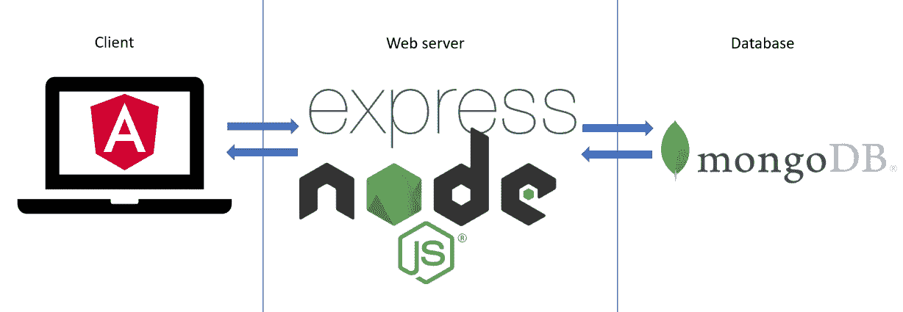
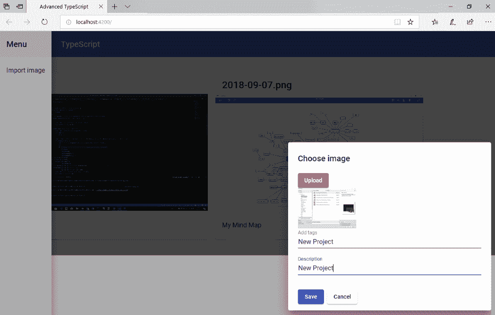
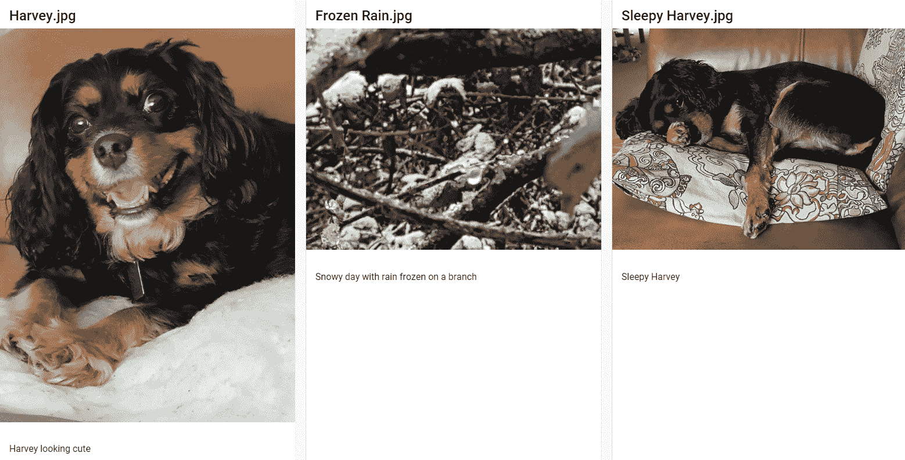

# 第四章：MEAN 堆栈 - 构建照片库

现在，几乎不可能编写 Node.js 应用程序而不听说 MEAN 堆栈。MEAN 是用来描述一组常用技术的缩写，这些技术用于客户端和服务器端构建具有持久服务器端存储的 Web 应用程序。构成**MEAN**堆栈的技术有**MongoDB**、**Express**（有时被称为**Express.js**）、**Angular**和**Node.js**。

我们准备在前几章中学到的知识的基础上构建一个使用 MEAN 堆栈的照片库应用程序。与以前的章节不同的是，在本章中我们不会使用 Bootstrap，而是更喜欢使用 Angular Material。

本章将涵盖以下主题：

+   MEAN 堆栈的组件

+   创建我们的应用程序

+   使用 Angular Material 创建 UI

+   使用 Material 添加我们的导航

+   创建文件上传组件

+   使用服务来读取文件

+   将 Express 支持引入我们的应用程序

+   提供 Express 路由支持

+   引入 MongoDB

+   显示图片

+   使用 RxJS 来观察图片

+   使用`HttpClient`传输数据

# 技术要求

完成的项目可以从[`github.com/PacktPublishing/Advanced-TypeScript-3-Programming-Projects/tree/master/Chapter04`](https://github.com/PacktPublishing/Advanced-TypeScript-3-Programming-Projects/tree/master/Chapter04)下载。

下载项目后，您将需要使用`npm install`安装软件包要求。

# MEAN 堆栈

当我们使用 MEAN 堆栈这个术语时，我们指的是一组单独的 JavaScript 技术，它们一起创建跨客户端和服务器端的 Web 应用程序。MEAN 是核心技术的缩写：

+   **MongoDB**：这是一种称为文档数据库的东西，用于以 JSON 形式存储数据。文档数据库与关系数据库不同，因此如果您来自诸如 SQL Server 或 Oracle 之类的技术，可能需要一点时间来适应文档数据库的工作方式。

+   **Express**：这是一个在 Node.js 之上的后端 Web 应用程序框架。在堆栈中使用 Express 的想法是简化 Node.js 在服务器端提供的功能。虽然 Node.js 可以做 Express 所做的一切，但编写代码来执行诸如添加 cookie 或路由 Web 请求等操作的复杂性意味着 Express 的简化可以通过减少开发时间来帮助我们。

+   **Angular**：Angular 是一个客户端框架，用于运行应用程序的客户端部分。通常，Angular 用于创建**单页应用程序**（**SPA**），在这种应用程序中，客户端的小部分会被更新，而不必在导航事件发生时重新加载整个页面。

+   **Node.js**：Node.js 是应用程序的服务器端运行环境。我们可以将其视为 Web 服务器。

以下图表显示了 MEAN 堆栈的组件在我们的应用程序架构中的位置。用户看到的应用程序部分，有时被称为前端，在这个图表中是客户端。我们应用程序的其余部分通常被称为后端，在图表中是 Web 服务器和数据库：



在使用 React 替代 Angular 时有一个等效的。它被称为 MERN 堆栈。

# 项目概述

在本章中，我们将要构建的项目将使我们了解如何编写服务器端应用程序，并向我们介绍流行的 Angular 框架。我们将构建一个图片库应用程序，用户可以上传图片并将它们保存在服务器端数据库中，以便以后再次查看。

只要你在 GitHub 存储库中与代码一起工作，这一章应该需要大约三个小时才能完成。完成的应用程序将如下所示：



本章不打算成为 MEAN 栈所有方面的全面教程。到本章结束时，我们只会开始涉及这些不同部分提供的一小部分内容。由于我们在这里介绍了许多主题，我们将更多地关注这些主题，而不是 TypeScript 的高级特性，因为这可能导致信息过载，但我们仍将涵盖通用约束和流畅代码等特性，尽管我们不会明确提到它们。在这一点上，我们应该足够熟悉它们，以便在遇到它们时能够识别它们。

# 入门

就像上一章一样，本章将使用可在 [`nodejs.org`](https://nodejs.org) 上获得的 Node.js。我们还将使用以下组件：

+   Angular **命令行界面**（**CLI**）（我使用的版本是 7.2.2）

+   `cors`（版本 2.8.5 或更高）

+   `body-parser`（版本 1.18.3 或更高）

+   `express`（版本 4.16.4 或更高）

+   `mongoose`（版本 5.4.8 或更高）

+   `@types/cors`（版本 2.8.4 或更高）

+   `@types/body-parser`（版本 1.17.0 或更高）

+   `@types/express`（版本 4.16.0 或更高）

+   `@types/mongodb`（版本 3.1.19 或更高）

+   `@types/mongoose`（版本 5.3.11 或更高）

我们还将使用 MongoDB。Community Edition 可以在 [`www.mongodb.com/download-center/community`](https://www.mongodb.com/download-center/community) 下载。

MongoDB 还配备了一个 GUI，使查看、查询和编辑 MongoDB 数据库变得更加容易。MongoDB Community Edition 可以从 [`www.mongodb.com/download-center/compass`](https://www.mongodb.com/download-center/compass) 下载。

# 使用 MEAN 栈创建 Angular 照片库

就像在之前的章节中一样，我们将从定义我们应用程序的需求开始：

+   用户必须能够选择要传输到服务器的图片

+   用户将能够为图片提供额外的元数据，如描述

+   上传的图片将与元数据一起保存在数据库中

+   用户将能够自动查看上传的图片

# 理解 Angular

Angular 是作为一个平台创建客户端应用程序的，使用 HTML 和 TypeScript 的组合。最初，Angular 是用 JavaScript 编写的（当时被称为 Angular.js），但它经历了完全的重写，使用 TypeScript，并重新命名为 Angular。Angular 本身的架构围绕着一系列模块，我们可以将其引入我们的应用程序或自己编写，其中可以包含我们可以用来构建客户端代码的服务和组件。

最初，Angular 的一个关键驱动因素是完全重新加载网页是一种浪费的做法。因此，许多网站都在提供相同的导航、标题、页脚、侧边栏等，每次用户导航到新页面时重新加载这些项目都是一种浪费，因为它们实际上并没有改变。Angular 帮助推广了一种被称为 SPAs 的架构，其中只有需要更改的页面的小部分才会实际更改。这减少了网页处理的流量量，因此，当正确完成时，客户端应用的响应性会增加。

以下截图显示了典型的 SPA 格式。页面的绝大部分是静态的，因此不需要重新发送，但中间的垃圾邮件部分将是动态的——只有那部分需要更新。这就是 SPAs 的美妙之处：


这并不意味着我们不能在 Angular 中创建多页面应用程序。这只是意味着，除非我们真正需要创建多页面应用程序，否则 Angular SPA 应用程序是我们应该编写 Angular 应用程序的方式。

现在我们已经了解了 Angular 的内容，我们可以继续使用 Angular 来编写我们的客户端。

# 创建我们的应用程序

除非您最近安装了 Angular，否则需要使用`npm`进行安装。我们要安装的部分是 Angular CLI。这为我们提供了从命令提示符中运行所需的一切，包括生成应用程序、添加组件、脚手架应用程序等等：

```ts
npm install -g @angular/cli
```

由于我们将开发客户端和服务器端代码，将代码放在一起会很有帮助；因此，我们将在一个共同的目录下创建`Client`和`Server`文件夹。任何 Angular 命令都将在`Client`文件夹中运行。在客户端和服务器端之间共享代码是相当常见的，因此这种安排是保持应用程序在一起并简化共享的简单方法。

使用`ng new`命令轻松创建一个带有 Angular 的应用程序，该命令在添加 Angular CLI 时已经添加到我们的系统中。我们将指定命令行参数来选择 SCSS 生成我们的 CSS，以及选择我们要为创建的任何组件指定的前缀：

```ts
ng new Chapter04 --style scss --prefix atp
```

我选择遵循的命名约定反映了书名，因此我们使用`atp`来反映*Advanced TypeScript Projects*。虽然在本章中我们不会大量使用 CSS，但我更倾向于使用 SCSS 作为我的 CSS 预处理器，而不是使用原始 CSS，因为它具有丰富的语法，可以使用诸如样式混合等内容，这意味着这是我默认使用的样式引擎。我们选择使用`atp`前缀的原因是为了使我们的组件选择器唯一。假设我们有一个组件想要称为 label；显然，这将与内置的 HTML label 冲突。为了避免冲突，我们的组件选择器将是`atp` label。由于 HTML 控件从不使用连字符，我们保证不会与现有的控件选择器发生*冲突*。

我们将接受安装默认值，因此在提示是否添加 Angular 路由支持时，只需按*Enter*。安装完成后，我们将启动我们的 Angular 服务器，它还会监视文件是否更改并实时重建应用程序。通常，在执行此部分之前，我会安装所有所需的组件，但是看到 Angular 给我们提供的起点以及查看实时更改的能力是非常有用的：

```ts
ng serve --open
```

与 React 不同，打开我们的应用程序的默认网址是`http://localhost:4200`。当浏览器打开时，它会显示默认的 Angular 示例页面。显然，我们将从中删除很多内容，但在短期内，我们将保持此页面不变，同时开始添加一些我们需要的基础设施。

Angular 为我们创建了许多文件，因此值得确定我们将与之最多一起使用的文件以及它们的作用。

# App.Module.ts

在开发大型 Angular 应用程序的过程中，特别是如果我们只是众多团队中开发同一整体应用程序的一部分，将它们分解为模块是很常见的。我们可以将此文件视为我们进入组合模块的入口点。对于我们的目的，我们对`@NgModule`覆盖的模块定义中的两个部分感兴趣。

第一部分是`declarations`部分，告诉 Angular 我们开发了哪些组件。对于我们的应用程序，我们将开发三个组件，它们属于这里——`AppComponent`（默认添加），`FileuploadComponent`和`PageBodyComponent`。幸运的是，当我们使用 Angular CLI 生成组件时，它们的声明会自动添加到此部分中。

我们感兴趣的另一部分是`imports`部分。这告诉我们需要导入到我们的应用程序中的外部模块。我们不能只是在我们的应用程序中引用外部模块的功能；我们实际上必须告诉 Angular 我们将使用该功能所来自的模块。这意味着当我们部署应用程序时，Angular 非常擅长最小化我们的依赖关系，因为它只会部署我们已经说过我们在使用的模块。

当我们阅读本章时，我们将在这一部分添加项目，以启用诸如 Angular Material 支持之类的功能。

# 使用 Angular Material 来构建我们的 UI

我们的应用程序的前端将使用一个叫做 Angular Material 的东西，而不是依赖于 Bootstrap。我们将研究 Material，因为它在 Angular 应用程序中被广泛使用；因此，如果你要商业化地开发 Angular，有很大的机会你会在职业生涯中的某个时候使用它。

Angular Material 是由 Angular 团队构建的，旨在将 Material Design 组件带到 Angular。它们的理念是，它们能够无缝地融入到 Angular 开发过程中，以至于使用它们感觉和使用标准 HTML 组件没有什么不同。这些设计组件远远超出了我们可以用单个标准控件做的事情，因此我们可以轻松地使用它们来构建复杂的导航布局，等等。

Material 组件将行为和视觉外观结合在一起，这样，我们可以直接使用它们来轻松创建专业外观的应用程序，而我们自己的工作量很小。在某种程度上，Material 可以被认为是一种类似于使用 Bootstrap 的体验。在本章中，我们将集中使用 Material 而不是 Bootstrap。

几段文字前，我们轻率地提到 Angular Material 将 Material Design 组件带到了 Angular。在我们了解 Material Design 是什么之前，这是一个很大程度上的循环陈述。如果我们在谷歌上搜索这个词，我们会得到很多文章告诉我们 Material Design 是谷歌的设计语言。

当然，如果我们进行 Android 开发，这个术语会经常出现，因为 Android 和 Material 基本上是相互关联的。Material 的理念是，如果我们能以一致的方式呈现界面元素，那么对我们的用户来说是最有利的。因此，如果我们采用 Material，我们的应用程序将对于习惯于诸如 Gmail 之类的应用程序的用户来说是熟悉的。

然而，“设计语言”这个术语太模糊了。对我们来说它实际上意味着什么？为什么它有自己的花哨术语？就像我们自己的语言被分解和结构化成单词和标点符号一样，我们可以将视觉元素分解成结构，比如颜色和深度。举个例子，语言告诉我们颜色的含义，所以如果我们在应用程序的一个屏幕上看到一个按钮是一个颜色，那么在应用程序的其他屏幕上它应该有相同的基本用法；我们不会在一个对话框上用绿色按钮表示“确定”，然后在另一个对话框上表示“取消”。

安装 Angular Material 是一个简单的过程。我们运行以下命令来添加对 Angular Material、**组件设计工具包**（**CDK**）、灵活的布局支持和动画支持的支持：

```ts
ng add @angular/material @angular/cdk @angular/animation @angular/flex-layout
```

在安装库的过程中，我们将被提示选择要使用的主题。主题最显著的方面是应用的颜色方案。

我们可以从以下主题中进行选择（主题的示例也已提供）：

+   靛蓝/粉色 ([`material.angular.io?theme=indigo-pink`](https://material.angular.io?theme=indigo-pink))

+   深紫色/琥珀色 ([`material.angular.io?theme=deeppurple-amber`](https://material.angular.io?theme=deeppurple-amber))

+   粉色/蓝灰色 ([`material.angular.io?theme=pink-bluegrey`](https://material.angular.io?theme=pink-bluegrey))

+   紫色/绿色 ([`material.angular.io?theme=purple-green`](https://material.angular.io?theme=purple-green))

+   自定义

对于我们的应用程序，我们将使用 Indigo/Pink 主题。

我们还被提示是否要添加 HammerJS 支持。这个库提供了手势识别，这样我们的应用程序就可以响应诸如触摸或鼠标旋转等操作。最后，我们必须选择是否要为 Angular Material 设置浏览器动画。

CDK 是一个抽象，它说明了常见 Material 功能的工作原理，但并不说明它们的外观。如果没有安装 CDK，Material 库的许多功能就无法正常工作，因此确保它与`@angular/material`一起安装非常重要。

# 使用 Material 添加导航

我们会一遍又一遍地看到，我们需要做的许多事情来为我们的应用程序添加功能，都需要从`app.module.ts`中开始。Material 也不例外，所以我们首先添加以下`import`行：

```ts
import { LayoutModule } from '@angular/cdk/layout';
import { MatToolbarModule, MatButtonModule, MatSidenavModule, MatIconModule, MatListModule } from '@angular/material';
```

现在，这些模块对我们可用，我们需要在`NgModule`的`import`部分中引用它们。在这一部分列出的任何模块都将在我们应用程序的模板中可用。例如，当我们添加侧边导航支持时，我们依赖于我们已经在这一部分中使`MatSidenavModule`可用：

```ts
imports: [
  ...
 LayoutModule,
 MatToolbarModule,
 MatButtonModule,
 MatSidenavModule,
 MatIconModule,
 MatListModule,
]
```

我们将设置我们的应用程序使用侧边导航（出现在屏幕侧边的导航条）。在结构上，我们需要添加三个元素来启用侧边导航：

+   `mat-sidenav-container` 用于承载侧边导航

+   `mat-sidenav` 用于显示侧边导航

+   `mat-sidenav-content` 以添加我们要显示的内容

首先，我们将在`app.component.html`页面中添加以下内容：

```ts
<mat-sidenav-container class="sidenav-container">
  <mat-sidenav #drawer class="sidenav" fixedInViewport="true" [opened]="false">
  </mat-sidenav>
  <mat-sidenav-content>
  </mat-sidenav-content>
</mat-sidenav-container>
```

`mat-sidenav` 行设置了我们将利用的一些行为。我们希望导航固定在视口中，并通过`#drawer`的使用给它设置了 drawer 的 ID。我们将很快使用这个 ID，当我们触发抽屉是打开还是关闭的切换时。

这一行可能最有趣的部分是`[opened]="false"`。这是我们在应用程序中遇到绑定的第一个点。这里的`[]`告诉我们，我们要绑定到一个特定的属性，这种情况下是`opened`，并将其设置为`false`。当我们在本章中逐步学习时，会发现 Angular 有丰富的绑定语法。

现在我们有了容器来容纳我们的导航，我们将添加侧边导航内容。我们将添加一个工具栏来容纳`Menu`文本和一个导航列表，允许用户导入图像。

```ts
<mat-toolbar>Menu</mat-toolbar>
<mat-nav-list>
  <a mat-list-item>Import Image</a>
</mat-nav-list>
```

在标准锚标签中使用`mat-list-item`只是告诉 Material 引擎，我们要在列表中放置锚点。实际上，这一部分是一个使用 Material 样式进行样式化的锚点无序列表。

现在，我们要添加切换导航的功能。我们这样做的方式是在导航内容区域添加一个工具栏。这个工具栏将承载一个按钮，触发侧边导航抽屉的打开。在`mat-sidenav-content`部分，添加以下内容：

```ts
<mat-toolbar color="primary">
  <button type="button" aria-label="Toggle sidenav" mat-icon-button (click)="drawer.toggle()">
    <mat-icon aria-label="Side nav toggle icon">menu</mat-icon>
  </button>
</mat-toolbar>
```

按钮在这里使用了另一个绑定的例子——在这种情况下，对`click`事件做出反应——以触发具有`drawer`ID 的`mat-sidenav`项目上的`toggle`操作。我们不再使用`[eventName]`来绑定命令，而是使用`(eventName)`。在按钮内部，我们使用`mat-icon`来表示用于切换导航的图像。与 Material 设计代表一种常见的应用程序显示方式的理念一致，Angular Material 为我们提供了许多标准图标，如`menu`。

我们使用的 Material 字体代表了某些单词，比如 home 和 menu，通过一种叫做**连字**的东西来表示特定的图像。这是一个标准的排版术语，意思是有一些众所周知的字母、数字和符号的组合可以被表示为图像。例如，如果我们有一个带有文本`home`的`mat-icon`，这将被表示为一个 home 图标。

# 创建我们的第一个组件 - FileUpload 组件

我们导航栏上的`导入图像`链接实际上必须做一些事情，所以我们将编写一个将显示在对话框中的组件。由于我们将要上传一个文件，我们将称其为`FileUpload`，创建它就像运行以下 Angular CLI 命令一样简单：

```ts
ng generate component components/fileupload
```

如果我们愿意，我们可以缩短这些标准的 Angular 命令，所以我们可以使用`ng g c`代替`ng generate component`。

这个命令为我们创建了四个文件：

+   `fileupload.component.html`：我们组件的 HTML 模板。

+   `fileupload.component.scss`：我们需要将其转换为组件的 CSS 的任何内容。

+   `fileupload.component.spec.ts`：现在，当我们想要对我们的 Angular 应用运行单元测试时，会使用`spec.ts`文件。适当地测试 Web 应用程序超出了本书的范围，因为这本书本身就是一本书。

+   `fileupload.component.ts`：组件的逻辑。

运行`ng`命令生成组件还会导致它被添加到`app.module.ts`中的`declarations`部分。

当我们打开`fileupload.component.ts`时，结构大致如下（忽略顶部的导入）：

```ts
@Component({
  selector: 'atp-fileupload',
  templateUrl: './fileupload.component.html',
  styleUrls: ['./fileupload.component.scss']
})
export class FileuploadComponent implements OnInit {
  ngOnInit() {
  }
}
```

在这里，我们可以看到 Angular 充分利用了我们已经了解的 TypeScript 特性。在这种情况下，`FileuploadComponent`有一个`Component`装饰器，告诉 Angular 当我们想在 HTML 中使用`FileuploadComponent`实例时，我们使用`atp-fileupload`。由于我们使用了单独的 HTML 模板和样式，`@Component`装饰器的其他部分标识了这些元素的位置。我们可以直接在这个类中定义样式和模板，但一般来说，最好将它们分开到它们自己的文件中。

我们可以在这里看到我们的命名约定，在创建应用程序时指定了`atp`。使用有意义的东西是个好主意。在团队中工作时，您应该了解您的团队遵循的标准是什么，如果没有标准，您应该花时间商定如何在前期命名。

对话框的一个特性是它会向我们显示用户选择的图像的预览。我们将把读取图像的逻辑从组件中分离出来，以保持关注点的清晰分离。

# 使用服务预览文件

开发 UI 应用程序的一个挑战是，逻辑往往会渗入视图中，这是不应该出现的。我们知道视图将调用它，所以把一部分逻辑放在我们的`ts`视图文件中变得很方便，但它做的事情对客户端没有任何可见的影响。

例如，我们可能想要将一些 UI 中的值写回服务器。与视图相关的部分只有数据部分；实际写入服务器是完全不同的责任。如果我们有一个简单的方法来创建外部类，我们可以在需要的地方注入它们，这对我们是有用的，这样我们就不需要担心如何实例化它们。它们只是在我们需要它们时可用。幸运的是，Angular 的作者们看到了这一点，并为我们提供了服务。

一个`service`只是一个使用`@Injectable`装饰器的类，并在模块的`declarations`部分中有一个条目。除了这些要求，没有其他需要的东西，所以如果需要的话，我们可以轻松手工制作这个类。虽然我们可以这样做，但实际上没有真正的理由，因为 Angular 帮助我们使用以下命令生成`service`：

```ts
ng generate service <<servicename>>
```

创建`service`时，实际上我们不必在名称后面添加`service`，因为这个命令会自动为我们添加。为了看到这是如何工作的，我们将创建一个`service`，它接受使用文件选择器选择的文件，然后读取它，以便可以在图像上传对话框和主屏幕上显示，或者传输到数据库中保存。我们从以下命令开始：

```ts
ng generate service Services/FilePreviewService.
```

我喜欢在`Services`子文件夹中生成我的`services`。将其放在文件名中会在`Services`文件夹中创建它。

`ng generate service`命令给我们提供了以下基本概述：

```ts
import { Injectable } from '@angular/core';
@Injectable({
 providedIn: 'root'
})
export class FilePreviewService {
}
```

读取文件可能是一个耗时的过程，所以我们知道我们希望这个操作是异步发生的。正如我们在前面的章节中讨论的，我们可以使用回调来做到这一点，但更好的方法是使用`Promise`。我们将以下方法调用添加到`service`中：

```ts
public async Preview(files: any): Promise<IPictureModel> {
}
```

因为这是我们要读取文件的时候，这是我们要创建模型的时候，我们将使用它来传递数据到我们的应用程序。我们将要使用的模型看起来像这样：

```ts
export interface IPictureModel {
 Image: string;
 Name: string;
 Description: string;
 Tags: string;
}
export class PictureModel implements IPictureModel {
 Image: string;
 Name: string;
 Description: string;
 Tags: string;
}
```

`Image`保存我们要读取的实际图像，`Name`是文件的名称。这就是为什么我们在这一点上填充这个模型；我们正在处理文件本身，所以这是我们拥有文件名的时候。`Description`和`Tags`字符串将由图像上传组件添加。虽然我们可以在那时创建一个交集类型，但对于一个简单的模型来说，有一个单一的模型来保存它们就足够了。

我们已经说过我们使用`Promise`，这意味着我们需要从我们的`Preview`方法中`retu`rn 一个适当的`Promise`：

```ts
return await new Promise((resolve, reject) => {});
```

在`Promise`内部，我们将创建我们模型的一个实例。作为良好的实践，我们将添加一些防御性代码，以确保我们有一个图像文件。如果文件不是图像文件，我们将拒绝它，这可以由调用代码优雅地处理：

```ts
if (files.length === 0) {
  return;
}
const file = files[0];
if (file.type.match(/image\/*/) === null) {
  reject(`The file is not an image file.`);
  return;
}
const imageModel: IPictureModel = new PictureModel();
```

当我们到达这一点时，我们知道我们有一个有效的文件，所以我们将使用文件名在模型中设置名称，并使用`FileReader`使用`readAsDataURL`读取图像。当读取完成时，将触发`onload`事件，允许我们将图像数据添加到我们的模型中。此时，我们可以解决我们的承诺：

```ts
const reader = new FileReader();
reader.onload = (evt) => {
  imageModel.Image = reader.result;
  resolve(imageModel);
};
reader.readAsDataURL(file);
```

# 在对话框中使用服务

现在我们有一个工作的`preview`服务，我们可以在我们的对话框中使用它。为了使用它，我们将把它传递到我们的构造函数中。由于服务是可注入的，我们可以让 Angular 负责为我们注入它，只要我们在构造函数中添加一个适当的引用。同时，我们还将在对话框本身中添加一个引用，以及一组将在相应 HTML 模板中使用的声明：

```ts
protected imageSource: IPictureModel | null;
protected message: any;
protected description: string;
protected tags: string;

constructor(
  private dialog: MatDialogRef<FileuploadComponent>,
  private preview: FilePreviewService) { }
```

允许 Angular 自动构建具有依赖关系的构造函数，而无需我们明确使用`new`实例化它们的技术称为依赖注入。这个花哨的术语简单地意味着我们告诉 Angular 我们的类需要什么，然后让 Angular 来构建那个类的对象。实际上，我们告诉 Angular 我们需要什么，而不用担心它将如何构建。构建类的行为可能导致非常复杂的内部层次结构，因为依赖注入引擎可能不得不构建我们的代码依赖的类。

有了这个参考，我们将创建一个方法来接受文件上传组件的文件选择并调用我们的`Preview`方法。`catch`用于适应我们在服务中的防御性编码，以及适应用户尝试上传非图像文件的情况。如果文件无效，对话框将显示一条消息通知用户：

```ts
public OnImageSelected(files: any): void {
  this.preview.Preview(files).then(r => {
    this.imageSource = r;
  }).catch(r => {
    this.message = r;
  });
}
```

对话框的代码部分的最后一件事是允许用户关闭对话框并将选定的值传回到调用代码。我们使用相关的本地值更新图像源描述和标签。`close`方法关闭当前对话框并将`imageSource`返回给调用代码：

```ts
public Save(): void {
  this.imageSource.Description = this.description;
  this.imageSource.Tags = this.tags;
  this.dialog.close(this.imageSource);
}
```

# 文件上传组件模板

我们组件的最后一部分工作是`fileupload.component.html`中的实际 HTML 模板。由于这将是一个 Material 对话框，我们将在这里使用许多 Material 标签。其中最简单的标签用于添加对话框标题，这是一个带有`mat-dialog-title`属性的标准标题标签。使用此属性的原因是将标题锚定在对话框顶部，以便如果有任何滚动，标题将保持固定在原位：

```ts
<h2 mat-dialog-title>Choose image</h2>
```

将标题锚定在顶部后，我们准备添加内容和操作按钮。首先，我们将使用`mat-dialog-content`标签添加内容：

```ts
<mat-dialog-content>
  ...
</mat-dialog-content>
```

我们内容中的第一个元素是如果组件代码中设置了消息，则将显示的消息。用于显示消息是否显示的测试使用另一个 Angular 绑定`*ngIf`。在这里，Angular 绑定引擎评估表达式，并在表达式为真时呈现出值。在这种情况下，它正在检查消息是否存在。也许不会让人惊讶的是，看起来有趣的`{{}}`代码也是一个绑定。这个用于写出被绑定的项目的文本，这种情况下是消息：

```ts
<h3 *ngIf="message">{{message}}</h3>
```

变化的下一部分是我最喜欢的应用程序的一部分。标准 HTML 文件组件没有 Material 版本，因此如果我们想显示一个现代外观的等效组件，我们必须将文件输入显示为隐藏组件，并欺骗它认为在用户按下 Material 按钮时已被激活。文件上传输入被赋予`fileUpload`ID，并在按钮被点击时使用`(click)="fileUpload.click()"`触发。当用户选择某物时，更改事件触发我们几分钟前编写的`OnImageSelected`代码：

```ts
  <button class="mat-raised-button mat-accent" md-button (click)="fileUpload.click()">Upload</button>
  <input hidden #fileUpload type="file" accept="image/*" (change)="OnImageSelected(fileUpload.files)" />
```

添加图像预览就像添加一个绑定到成功读取图像时创建的预览图像的`img`标签一样简单：

```ts
<div>
  
</div>
```

最后，我们需要添加用于读取标签和描述的字段。我们将这些放在`mat-form-field`部分内。`matInput`告诉模板引擎应该放置什么样式以用于文本输入。最有趣的部分是使用`[(ngModel)]="..."`部分。这为我们应用了模型绑定，告诉绑定引擎从我们的底层 TypeScript 组件代码中使用哪个字段：

```ts
<mat-form-field>
  <input type="text" matInput placeholder="Add tags" [(ngModel)]="tags" />
</mat-form-field>
<mat-form-field>
  <input matInput placeholder="Description" [(ngModel)]="description" />
</mat-form-field>
```

如果您之前使用过早期版本的 Angular（6 版之前），您可能已经遇到`formControlName`作为绑定值的一种方式。在 Angular 6+中，尝试结合`formControlName`和`ngModel`不再起作用。有关更多信息，请参见[`next.angular.io/api/forms/FormControlName#use-with-ngmodel`](https://next.angular.io/api/forms/FormControlName#use-with-ngmodel)。

`mat-form-field`需要关联一些样式。在`fileupload.component.scss`文件中，我们添加`.mat-form-field { display: block; }`来对字段进行样式设置，使其显示在新行上。如果我们忽略这一点，输入字段将并排显示。

有一个对话框我们无法关闭，或者无法将值返回给调用代码是没有意义的。我们应该遵循这样的操作约定，将我们的保存和取消按钮放在`mat-dialog-actions`部分。取消按钮标记为`mat-dialog-close`，这样它就会为我们关闭对话框，而无需我们采取任何操作。保存按钮遵循我们现在应该熟悉的模式，当检测到按钮点击时，在我们的组件代码中调用`Save`方法：

```ts
<mat-dialog-actions>
  <button class="mat-raised-button mat-primary" (click)="Save()">Save</button>
  <button class="mat-raised-button" mat-dialog-close>Cancel</button>
</mat-dialog-actions>
```

我们已经到了需要考虑用户选择的图像将存储在何处以及将从何处检索的地步。在上一章中，我们使用了客户端数据库来存储我们的数据。从现在开始，我们将开始处理服务器端代码。我们的数据将存储在一个 MongoDB 数据库中，所以现在我们需要看看如何使用 Node.js 和 Express 来连接 MongoDB 数据库。

# 引入 Express 支持到我们的应用程序

当我们使用 Node.js 开发客户端/服务器应用程序时，如果我们能够使用一个允许我们开发服务器端部分的框架，尤其是如果它带有丰富的*插件*功能生态系统，覆盖诸如连接到数据库和处理本地文件系统等功能，那将会让我们的生活变得更加轻松。这就是 Express 发挥作用的地方；它是一个中间件框架，与 Node.js 完美地配合在一起。

由于我们将完全从头开始创建我们的服务器端代码，我们应该从创建基本的`tsconfig.json`和`package.json`文件开始。为此，在`Server`文件夹中运行以下命令，这也将通过导入 Express 和 TypeScript Express 定义来添加 Express 支持：

```ts
tsc --init
npm init -y
npm install express @types/express parser @types/body-parser --save
```

在我们的`tsconfig.json`文件中有许多不必要的选项。我们只需要最基本的选项，所以我们将我们的配置设置为如下所示：

```ts
{
  "compilerOptions": {
    "target": "es2015",
    "module": "commonjs",
    "outDir": "./dist",
    "strict": true,
    "allowSyntheticDefaultImports": true,
    "esModuleInterop": true
  },
}
```

我们的服务器端代码将以一个名为`Server`的类开始。这个类将`import express`：

```ts
import express from "express";
```

为了创建一个 Express 应用程序的实例，我们将在构造函数中创建一个名为`app`的私有实例，并将其设置为`express()`。这样做的效果是为我们初始化 Express 框架。

构造函数还接受一个端口号，我们将在`Start`方法中告诉我们的应用程序监听这个端口。显然，我们需要响应 web 请求，所以当我们的应用程序从`/`接收到一个`get`请求时，我们将使用`send`来向网页发送一条消息作为响应。在我们的例子中，如果我们导航到`http://localhost:3000/`，这个方法接收到的网页 URL 是根目录，调用的函数返回`Hello from the server`给客户端。如果我们浏览的不是`/`，我们的服务器将会响应`404`：

```ts
export class Server {
  constructor(private port : number = 3000, private app : any = express()) {
  }

  public Start() : void {
    this.OnStart();
    this.app.listen(this.port, () => console.log(`Express server running on port ${this.port}`));
  }

  protected OnStart() : void {
    this.app.get(`/`, (request : any, response : any) => res.send(`Hello from the server`));
  }
}
```

要启动我们的服务器，我们必须给它要提供内容的端口，并调用`Start`：

```ts
new Server(3000).Start();
```

我们之所以从`Server`类开始，而不是遵循大多数 Node.js/Express 教程在互联网上看到的方法，是因为我们希望构建一些基础，以便在未来的章节中能够重复使用。这一章代表了这个类的起点，未来的章节将会在我们这里所做的基础上增强服务器的功能。

在当前状态下，服务器将无法处理来自 Angular 的任何传入请求。现在是时候开始增强服务器，以便它能够处理来自客户端的请求。当客户端发送其数据时，它将以 JSON 格式的请求传递过来。这意味着我们需要告诉服务器接收请求，并在我们看到的任何请求的主体中公开它。

当我们很快涵盖路由时，我们将看到一个例子，我们将完整地接收`request.Body`。我们必须意识到的一件事是，我们将从 Angular 接收大量请求；照片可能占用大量空间。默认情况下，body 解析器的限制为 100 KB，这不够大。我们将提高请求大小的限制为 100 MB，这应该足够处理我们想要放在图片库中的任何图像：

```ts
public Start(): void {
  this.app.use(bodyParser.json({ limit: `100mb` }));
  this.app.use(bodyParser.urlencoded({ limit: `100mb`, extended: true }));
  this.OnStart();
  this.app.listen(this.port, () => console.log(`Express server running on port ${this.port}`));
}
```

现在我们正在讨论从 Angular 传递过来的数据，我们需要考虑我们的应用程序是否接受这些请求。在我们讨论服务器如何根据请求执行哪些操作之前，我们需要解决一个叫做**跨域请求共享**（**CORS**）的问题。

使用 CORS，我们允许已知的外部位置访问我们站点上的受限操作。由于 Angular 是从与我们的 Web 服务器不同的站点运行的（`localhost:4200`而不是`localhost:3000`），我们需要启用 CORS 支持以进行 post；否则，当我们从 Angular 发出请求时，我们将不返回任何内容。我们必须做的第一件事是将`cors`中间件添加到我们的 Node.js 服务器中：

```ts
npm install cors @types/cors --save
```

添加 CORS 支持就像告诉应用程序使用 CORS 一样简单：

```ts
public WithCorsSupport(): Server {
    this.app.use(cors());
    return this;
}
```

CORS 支持提供了许多我们不需要利用的微调。例如，它允许我们设置允许的请求方法类型，使用`Access-Control-Allow-Methods`。

现在我们可以接受来自 Angular 的请求，我们需要建立机制将请求路由到适当的请求处理程序。

# 提供路由支持

每当请求进入我们的 Web 服务器时，我们都必须确定要发送的响应。我们正在构建的东西将响应 post 和接收请求，这类似于我们构建 REST API 的方式。将传入请求路由到响应的能力称为路由。我们的应用程序将处理三种类型的请求：

+   在 URL 中带有`add`作为 URL 的`POST`请求（换句话说，当我们看到`http://localhost:3000/add/`时）。这将向数据库添加图像和相关详细信息。

+   在 URL 中带有`get`的`GET`请求（如`http://localhost:3000/get/`）。这获取所有保存的图片的 ID，并将这些 ID 的数组返回给调用者。

+   在 URL 中带有`/id/`的`GET`请求。这在 URL 中使用了一个额外的参数来获取要发送回客户端的单个图片的 ID。

我们返回 ID 数组的原因是单个图像可能很大。如果我们尝试一次返回所有图像，我们将减慢客户端显示图像的速度，因为它们可以在加载时显示。我们还可能违反我们传回的响应的大小限制。在处理大块数据时，值得看看如何最小化每个请求传输的内容。

每个请求的目的对应于我们要执行的唯一操作。这给了我们一个提示，我们应该能够将每个路由拆分为一个什么都不做的单个类。为了强制执行单个操作，我们定义了我们希望我们的路由类使用的接口：

```ts
export interface IRouter {
  AddRoute(route: any): void;
}
```

我们将添加一个辅助类，负责实例化每个路由器实例。该类开始得足够简单，创建一个`IRouter`数组，将路由实例添加到其中：

```ts
export class RoutingEngine {
  constructor(private routing: IRouter[] = new Array<IRouter>()) {
  }
}
```

我们使用的方法让实例添加变得有趣。我们要做的是接受一个通用类型作为参数，并实例化该类型。为此，我们必须利用 TypeScript 的一个特性，允许我们接受一个通用类型，并指定当对其调用`new`时，它返回该类型的实例。

由于我们在类型上指定了通用约束，我们只接受`IRouter`实现：

```ts
public Add<T1 extends IRouter>(routing: (new () => T1), route: any) {
  const routed = new routing();
  routed.AddRoute(route);
  this.routing.push(routed);
}
```

传递给该方法的路由来自 Express。 这是我们告诉我们的应用程序使用的路由器实例。

现在我们已经在路由支持中就位，我们需要编写与我们之前确定的路由请求对应的类。 我们要查看的第一个是接受`add` post 的类：

```ts
export class AddPictureRouter implements IRouter {
  public AddRoute(route: any): void {
    route.post('/add/', (request: Request, response: Response) => {

  }
}
```

这种方法通过声明当我们收到一个`/add/` post 时，我们将接受请求，处理它，并发送响应回来来工作。 我们如何处理请求取决于我们，但无论路由何时确定我们在这里有匹配项，我们将执行此方法。 在此方法中，我们将创建图片的服务器端表示并将其保存到数据库中。

对于我们的应用程序，我们只引入了 Express 路由。 Angular 有自己的路由引擎，但就我们想要在我们的代码中放置的内容而言，我们不需要它。 在第五章中，*使用 GraphQL 和 Apollo 的 Angular ToDo 应用程序*，我们介绍了 Angular 路由。

# 介绍 MongoDB

使用 MongoDB 需要我们使用诸如流行的 Mongoose 包之类的东西。 安装 Mongoose 需要我们添加`mongoose`和`@types/mongoose`包：

```ts
npm install mongoose @types/mongoose --save-dev
```

在我们对数据库进行任何操作之前，我们需要创建一个模式来表示我们要保存到数据库中的对象。 不幸的是，这就是当我们使用 MEAN 开发应用程序时事情可能变得有点乏味的地方。 虽然模式表面上代表了我们在 Angular 端创建的模型，但它不是相同的模型，因此我们必须再次输入它。

更重要的是，这意味着如果我们更改我们的 Angular 模型，我们必须重新生成我们的 MongoDB 模式以与更改相适应。

```ts
export const PictureSchema = new Schema({
  Image: String,
  Name: String,
  Description: String,
  Tags: String,
});
```

对于我们的应用程序，我们将保留数据库中的图像—在`Image`字段中—因为这简化了我们必须放置的基础设施。 在商业级应用程序中，我们将选择将实际图像存储到数据库之外，并且`Image`字段将指向图像的物理位置。 图像的位置必须对我们的 Web 应用程序可访问，并且必须有政策确保图像得到安全备份并且可以轻松恢复。

有了模式，我们想创建一个代表它的模型。 想象一下模型和模式之间的交互的一个好方法是，模式告诉我们我们的数据应该是什么样子。 模型告诉我们我们想要如何使用数据库来操作它：

```ts
export const Picture = mongoose.model('picture', PictureSchema);
```

现在我们已经准备好模型，我们需要建立与数据库的连接。 MongoDB 数据库的连接字符串有自己的协议，因此它以`mongodb://`模式开头。 对于我们的应用程序，我们将使 MongoDB 在与我们的服务器端代码相同的服务器上运行； 对于更大的应用程序，我们确实希望将它们分开，但现在，我们将在连接字符串中使用`localhost:27017`，因为 MongoDB 正在侦听端口`27017`。

由于我们希望能够在 MongoDB 中托管许多数据库，因此告诉引擎要使用哪个数据库的机制将作为连接字符串的一部分提供数据库名称。 如果数据库不存在，它将被创建。 对于我们的应用程序，我们的数据库将被称为`packt_atp_chapter_04`：

```ts
export class Mongo {
  constructor(private url : string = "mongodb://localhost:27017/packt_atp_chapter_04") {
  }

  public Connect(): void {
    mongoose.connect(this.url, (e:any) => {
      if (e) {
        console.log(`Unable to connect ` + e);
      } else {
        console.log(`Connected to the database`);
      }
    });
  } 
}
```

只要在我们尝试在数据库内部执行任何操作之前调用`Connect`，我们的数据库应该可供我们使用。 在内部，`Connect`使用我们的连接字符串调用`mongoose.connect`。

# 回到我们的路由

有了可用的`Picture`模型，我们可以直接从我们的`add`路由内部填充它。请求体包含与我们的模式相同的参数，因此对我们来说映射是不可见的。当它被填充后，我们调用`save`方法。如果有错误，我们将把错误发送回客户端；否则，我们将把图片发送回客户端：

```ts
const picture = new Picture(request.body);
picture.save((err, picture) => {
  if (err) {
    response.send(err);
  }
  response.json(picture);
});
```

在生产应用程序中，我们实际上不希望将错误发送回客户端，因为这会暴露我们应用程序的内部工作。对于一个小型应用程序，仅用于我们自己使用，这不是一个问题，这是一种确定我们应用程序出了什么问题的有用方式，因为我们可以简单地在浏览器控制台窗口中查看错误。从专业角度来看，我建议对错误进行消毒，并发送一个标准的 HTTP 响应之一。

`get`请求的处理程序并不复杂。它以与`add`路由类似的方式开始：

```ts
export class GetPicturesRouter implements IRouter {
  public AddRoute(route: any): void {
    route.get('/get/', (request: Request, response: Response) => {

    });
  }
}
```

`Request`和`Response`类型在我们的路由中来自 Express，因此它们应该作为类中的`imports`添加。

我们试图做的是获取用户上传的图片的唯一列表。在内部，每个模式都添加了一个`_id`字段，因此我们将使用`Picture.distinct`方法来获取这些 ID 的完整列表，然后将其发送回客户端代码：

```ts
Picture.distinct("_id", (err, picture) => {
  if (err) {
    response.send(err);
  }
  response.send(pic);
});
```

我们需要放置的最后一个路由是获取单个 ID 请求并从数据库中检索相关项目。使这个类比前面的类稍微复杂的是，我们需要稍微操纵模式以在将数据传输回客户端之前排除`_id`字段。

如果我们没有删除这个字段，我们的客户端将收到的数据将无法匹配它所期望的类型，因此它将无法自动填充一个实例。这将导致我们的客户端即使收到了数据，也不会显示这些数据，除非我们在客户端手动填充它：

```ts
export class FindByIdRouter implements IRouter {
  public AddRoute(route: any): void {
    route.get('/id/:id', (request: Request, response: Response) => {
    });
  }
}
```

带有`:id`的语法告诉我们，我们将在这里接收一个名为`id`的参数。请求公开了一个`params`对象，该对象将把此参数公开为`id`。

我们知道我们收到的`id`参数是唯一的，因此我们可以使用`Picture.findOne`方法从数据库中检索匹配的条目。为了在发送回客户端的结果中排除`_id`字段，我们必须在参数中使用`-_id`来删除它：

```ts
Picture.findOne({ _id: request.params.id }, '-_id', (err, picture) => {
  if (err) {
    response.send(err);
  }
  response.json(picture);
});
```

此时，`Server`类需要额外的关注。我们已经创建了`RoutingEngine`和`Mongo`类，但在`Server`类中没有任何东西来连接它们。通过扩展构造函数来添加它们的实例，这很容易解决。我们还需要添加一个调用`Start`来`connect`到数据库。如果我们将我们的`Server`类更改为抽象类，并添加一个`AddRouting`方法，我们将阻止任何人直接实例化服务器。

我们的应用程序将需要从这个类派生，并使用`RoutingEngine`类添加他们自己的路由实现。这是将服务器分解为更小的离散单元并分离责任的第一步。`Start`方法中的一个重大变化是，一旦我们添加了我们的路由，我们告诉应用程序使用与我们的路由引擎相同的`express.Router()`，因此任何请求都会自动连接起来：

```ts
constructor(private port: number = 3000, private app: any = express(), private mongo: Mongo = new Mongo(), private routingEngine: RoutingEngine = new RoutingEngine()) {}

protected abstract AddRouting(routingEngine: RoutingEngine, router: any): void;

public Start() : void {
  ...
  this.mongo.connect();
  this.router = express.Router();
  this.AddRouting(this.routingEngine, this.router);
  this.app.use(this.router);
  this.OnStart();
  this.app.listen(this.port, () => console.log(`Express server running on port ${this.port}`));
}
```

有了这个设置，我们现在可以创建一个具体的类，该类扩展了我们的`Server`类，并添加了我们创建的路由。这是我们运行应用程序时将启动的类：

```ts
export class AdvancedTypeScriptProjectsChapter4 extends Server {
  protected AddRouting(routingEngine: RoutingEngine, router: any): void {
    routingEngine.Add(AddPictureRouter, router);
    routingEngine.Add(GetPicturesRouter, router);
    routingEngine.Add(FindByIdRouter, router);
  }
}

new AdvancedTypeScriptProjectsChapter4(3000).WithCorsSupport().Start();
```

不要忘记删除原始调用以启动`new Server(3000).Start();`服务器。

我们的服务器端代码已经完成。我们不打算为其添加更多功能，因此我们可以回到客户端代码。

# 显示图片

在我们辛苦编写了服务器端代码并让用户选择要上传的图片之后，我们需要一些东西来实际显示这些图片。我们将创建一个`PageBody`组件，将其显示并添加为主导航中的一个元素。同样，我们将让 Angular 来完成这项艰苦的工作，并为我们创建基础设施。

```ts
ng g c components/PageBody
```

创建了这个组件后，我们将按以下方式更新`app.component.html`，添加`PageBody`组件：

```ts
...
      <span>Advanced TypeScript</span>
    </mat-toolbar>
    <atp-page-body></atp-page-body>
  </mat-sidenav-content>
</mat-sidenav-container>
```

当我们安装 Material 支持时，我们添加的一个功能是 Flex 布局，它为 Angular 提供了灵活的布局支持。我们将通过在我们的应用程序中设置卡片的布局，最初以每行三个的方式布置，并在需要时换行，来利用这一点。在内部，布局引擎使用 Flexbox（一种灵活的盒子）来执行布局。

引擎可以根据需要调整宽度和高度，以充分利用屏幕空间。这种行为应该对您来说很熟悉，因为我们设置了 Bootstrap，它采用了 Flexbox。由于 Flexbox 默认尝试在一行上布置项目，因此我们将首先创建一个`div`标签，以改变其行为，使其在行之间包裹 1%的空间间隙：

```ts
<div fxLayout="row wrap" fxLayout.xs="column" fxLayoutWrap fxLayoutGap="1%" fxLayoutAlign="left">
</div>
```

布局容器就位后，我们现在需要设置卡片来容纳图片和相关细节。由于我们可能有动态数量的卡片，我们真的希望 Angular 有一种方法，允许我们有效地定义卡片作为模板，并在内部添加各个元素。使用`mat-card`添加卡片，并通过一点点的 Angular 魔法（好吧，又一点点的 Angular 绑定），我们可以对图片进行迭代：

```ts
<mat-card class="picture-card-layout" *ngFor="let picture of Pictures">
</mat-card>
```

这一部分的作用是使用`ngFor`设置我们的卡片，`ngFor`是一个 Angular 指令，它可以迭代底层数组，本例中是`Pictures`，并且对于创建我们卡片的主体中可以使用的变量非常有效。通过这个，我们将添加一个绑定到`picture.Name`的卡片标题，以及一个将源绑定到`picture.Image`的图像。最后，我们将在段落中显示`picture.Description`。

```ts
<mat-card-title fxLayout.gt-xs="row" fxLayout.xs="column">
  <span fxFlex="80%">{{picture.Name}}</span>
</mat-card-title>

<p>{{picture.Description}}</p>
```

为了完整起见，我们已经为我们的`picture-card-layout`添加了一些样式：

```ts
.picture-card-layout {
  width: 25%;
  margin-top: 2%;
  margin-bottom: 2%;
}
```

看看我们的卡片样式在实际中是什么样子：



这就是我们页面主体的 HTML，但是我们需要在其背后的 TypeScript 中放置代码，以实际开始提供我们的卡片将绑定到的一些数据。特别是，我们必须提供我们将要填充的`Pictures`数组：

```ts
export class PageBodyComponent implements OnInit {
  Pictures: Array<IPictureModel>;
  constructor(private addImage: AddImageService, private loadImage: LoadImageService, 
    private transfer: TransferDataService) {
    this.Pictures = new Array<IPictureModel>();
  }

  ngOnInit() {
  }
}
```

我们在这里有许多我们尚未遇到的服务。我们将首先看一下我们的应用程序如何知道`IPictureModel`的实例何时可用。

# 使用 RxJS 来观察图片

如果我们无法在页面主体中显示这些图片，那么通过对话框选择图片或在加载过程中从服务器获取图片的应用程序就没有意义。由于我们的应用程序具有彼此松散相关的功能，我们不希望引入事件作为控制这些功能发生的机制，因为这会在诸如页面主体组件和加载服务之间引入紧密耦合。

我们需要的是位于处理交互代码（例如加载数据）和页面主体之间的服务，并在有趣的事情发生时从一侧传递通知到另一侧。Angular 提供的执行此操作的机制称为**JavaScript 的响应式扩展**（**RxJS**）。

响应式扩展是观察者模式的一种实现（又是那个模式词）。这是一个简单的模式，你会很容易理解，并且你可能已经使用它一段时间了，可能甚至没有意识到。观察者模式的想法是，我们有一个类，其中有一个叫做`Subject`的类型。在内部，这个`Subject`类型维护一个依赖项列表，当需要时，通知这些依赖项需要做出反应，可能传递它们需要做出反应的状态。

这可能会让你模糊地想起这正是事件所做的事情，那么为什么我们要关注这个模式呢？你的理解是正确的——事件只是观察者模式的一个非常专业的形式，但它们有一些弱点，而 RxJS 等东西是设计来克服这些弱点的。假设我们有一个实时股票交易应用程序，每秒都有成千上万的股票行情到达我们的客户端。显然，我们不希望我们的客户端处理所有这些股票行情，因此我们必须编写代码在我们的事件处理程序内部开始过滤通知。这是我们必须编写的大量代码，可能会在不同的事件中重复。当我们使用事件时，类之间还必须有紧密的关系，因此一个类必须了解另一个类，以便连接到一个事件。

随着我们的应用程序变得越来越庞大和复杂，可能会有很多*距离*在带入股票行情的类和显示它的类之间。因此，我们最终会构建一个复杂的事件层次结构，其中`A 类`监听`B 类`上的事件，当`B 类`引发该事件时，它必须重新引发它，以便`C 类`可以对其做出反应。我们的代码内部分布得越多，我们就越不希望鼓励这种紧密耦合。

使用 RxJS 等库，我们通过远离事件来解决这些问题（以及更多）。使用 RxJS，我们可以制定复杂的订阅机制，例如限制我们做出反应的通知数量或仅选择订阅满足特定条件的数据和更改。随着新组件在运行时添加，它们可以查询可观察类以查看已经可用的值，以便使用已经接收到的数据预填充屏幕。这些功能超出了我们在这个应用程序中所需的，但是由于我们将在未来的章节中使用它们，因此我们需要意识到它们对我们是可用的。

我们的应用程序有两件事需要做出反应：

+   当页面加载时，图像将从服务器加载，因此我们需要对加载的每个图像做出反应。

+   当用户从对话框中选择图像后，在用户选择保存后对话框关闭，我们需要触发对数据库的保存，并在页面上显示图像

也许不会让人惊讶的是，我们将创建服务来满足这两个要求。因为它们在内部做的事情是一样的，唯一的区别是订阅者需要在做出反应后做什么。我们首先创建一个简单的基类，这些服务将从中派生：

```ts
export class ContextServiceBase {
}
```

我们在这个类中的起点是定义我们的可观察对象将使用的`Subject`。正如我们所指出的，RxJS 中有不同的`Subject`专业化。由于我们只希望我们的`Subject`通知其他类最新的值，我们将使用`BehaviorSubject`并将当前值设置为`null`：

```ts
private source = new BehaviorSubject(null);
```

我们不会将`Subject`暴露给外部类；相反，我们将使用此主题创建一个新的可观察对象。我们这样做是为了，如果我们愿意，我们可以自定义订阅逻辑——限制问题就是我们可能想这样做的一个例子：

```ts
context: this.source.asObservable();
```

我们称这种属性为`上下文`属性，因为它将携带变化的上下文。

有了这个设置，外部类现在可以访问可观察源，因此每当我们通知它们需要做出反应时，它们可以。由于我们要执行的操作基于用户添加`IPictureModel`或数据加载添加一个，我们将调用触发可观察`add`链的方法。我们的`add`方法将接收我们要发送到订阅代码的模型实例：

```ts
public add(image: IPictureModel) : void {
  this.source.next(image);
} 
```

我们确定需要两个服务来处理接收`IPictureModel`的不同方式。第一个服务称为`AddImageService`，正如我们所期望的那样，可以通过使用 Angular 为我们生成：

```ts
ng generate service services/AddImage
```

由于我们已经编写了我们的可观察逻辑，因此我们的服务看起来就像这样：

```ts
export class AddImageService extends ContextServiceBase {
}
```

我们的第二个服务称为`LoadImageService`：

```ts
ng generate service services/LoadImage
```

同样，这个类将扩展`ContextServiceBase`：

```ts
export class LoadImageService extends ContextServiceBase {
}
```

此时，你可能会想知道为什么我们有两个看起来做同样事情的服务。理论上，我们可以让它们都做完全相同的事情。我选择实现两个版本的原因是因为我们想要做的一件事是在通过`AddImageService`触发通知时显示图像并触发保存。假设我们在页面加载时也使用`AddImageService`。如果我们这样做，那么每当页面加载时，它也会触发保存，这样我们最终会复制图像。现在，我们可以引入过滤器来防止重复发生，但我选择使用两个单独的类来保持事情简单，因为这是我们第一次接触 RxJS。在接下来的章节中，我们将看到如何进行更复杂的订阅。

# 数据传输

我们已经涵盖了客户端/服务器交互的一侧。现在是时候处理另一侧了——实际调用我们服务器暴露的路由的代码。毫不奇怪，我们添加了一个负责这种通信的服务。我们从创建服务的代码开始：

```ts
ng g service services/TransferData
```

我们的服务将利用三样东西。它将依赖于的第一件事是一个`HttpClient`实例来管理`get`和`post`操作。我们还引入了我们刚刚创建的`AddImageService`和`LoadImageService`类：

```ts
export class TransferDataService {
  constructor(private client: HttpClient, private addImage: AddImageService, 
    private loadImage: LoadImageService) {
  }
}
```

我们的服务器和客户端之间的第一个接触点是当用户从对话框中选择图像时我们将要使用的代码。一旦他们点击保存，我们将引发一系列操作，导致数据保存在服务器中。我们将设置我们的 HTTP 头部以将内容类型设置为 JSON：

```ts
private SubscribeToAddImageContextChanges() {
  const httpOptions = {
    headers: new HttpHeaders({
      'Content-Type': 'application/json',
    })
  };
}
```

回想一下我们的 RxJS 类，我们知道我们有两个可用的单独订阅。我们想在这里使用的是当`AddImageService`被推送出时做出反应的那个，因此我们将把这个订阅添加到`SubscribeToAddImageContextChanges`中：

```ts
this.addImage.context.subscribe(message => {
});
```

当我们在这个订阅中收到消息时，我们将把它发送到服务器，这将最终保存数据到数据库中：

```ts
if (message === null) {
  return;
}
this.client.post<IPictureModel>('http://localhost:3000/add/', message, httpOptions)
  .subscribe(callback => { });
```

发布的格式是传递端点地址，这与我们之前编写的服务器端代码很好地联系在一起，以及消息和任何 HTTP 选项。因为我们的消息内容在语义上与在服务器端接收的模型相同，所以它将自动在那一侧被解码。由于我们可以从服务器接收内容，我们有一个订阅可以用来解码从我们的 Express 代码库返回的消息。当我们将这些代码放在一起时，我们得到了这样的结果：

```ts
private SubscribeToAddImageContextChanges() {
  const httpOptions = {
    headers: new HttpHeaders({
      'Content-Type': 'application/json',
    })
  };
  this.addImage.context.subscribe(message => {
    if (message === null) {
      return;
    }
    this.client.post<IPictureModel>('http://localhost:3000/add/', message, httpOptions)
      .subscribe(callback => {
    });
  });
}
```

我们传输服务的另一侧负责从服务器获取图像。正如你可能还记得的，我们将在两个阶段接收数据。第一阶段是我们将接收一个与我们可用的所有图片匹配的 ID 数组。为了获取这个数组，我们在`HttpClient`上调用`get`，告诉它我们将获取一个字符串数组，指向`/get/`端点：

```ts
private LoadImagesWithSubscription() {
  const httpOptions = {
    headers: new HttpHeaders({
      'Content-Type': 'application/text',
    })
  };
  this.client.get<string[]>('http://localhost:3000/get/', httpOptions).subscribe(pic => {
  });
}
```

现在我们有了字符串数组，我们需要遍历每个元素并再次调用`get`，这次添加`/id/...`来告诉服务器我们感兴趣的是哪一个。当数据返回时，我们调用`LoadImageService`上的`add`方法，传入`IPictureModel`。这与我们的页面主体有关，我们很快就会看到：

```ts
pic.forEach(img => {
  this.client.get<IPictureModel>('http://localhost:3000/id/' + img).subscribe(pic1 => {
    if (pic1 !== null) {
      this.loadImage.add(pic1);
    }
  });
});
```

最后，我们将添加一个`Initialize`方法，我们将用它来初始化服务：

```ts
public Initialize(): void {
  this.SubscribeToAddImageContextChanges();
  this.LoadImagesWithSubscription();
}
```

# 回到页面主体组件

现在我们已经编写了`LoadImageService`，`AddImageService`和`TransferDataService`，我们可以在`PageBodyComponent`的初始化代码中使用它们，在`ngOnInit`中调用，这是在组件初始化时调用的。我们需要做的第一件事是调用`TransferDataService`中的`Initialize`函数：

```ts
ngOnInit() {
  this.transfer.Initialize();

}
```

为了完成这个组件，并实际填充`Pictures`数组，我们需要连接到我们的两个 RxJS 服务的上下文：

```ts
this.addImage.context.subscribe(message => {
  if (!message) {
    return;
  }
  this.Pictures.push(message);
});
this.loadImage.context.subscribe(message => {
  if (!message) {
    return;
  }
  this.Pictures.push(message);
});
```

# 通过显示对话框来结束

到目前为止，您可能已经注意到，我们实际上还没有放置任何代码来显示对话框或在用户关闭对话框时触发`AddImageService`。为了做到这一点，我们将在`app.component.ts`中添加代码，并对相关的 HTML 进行微小调整。

添加一个接受 Material 对话框和`AddImageService`的构造函数：

```ts
constructor(private dialog: MatDialog, private addImage: AddImageService) {
}
```

我们需要添加一个公共方法，我们的 HTML 模板将绑定到它。我们将称之为`ImportImage`：

```ts
public ImportImage(): void {
}
```

与我们的 HTML 模板相关的更改是在`app.component.html`中的菜单列表项上添加对`ImportImage`的调用，通过`(click)`事件绑定对`click`事件做出响应。再次看到 Angular 绑定发挥作用：

```ts
<a mat-list-item (click)="ImportImage()">Import image</a>
```

我们将配置我们的对话框以特定的方式行为。我们不希望用户能够通过按下*Esc*键来自动关闭它。我们希望它自动聚焦并且宽度为 500 像素：

```ts
const config = new MatDialogConfig();
config.disableClose = true;
config.autoFocus = true;
config.width = '500px';
```

现在，我们可以使用这个配置来显示我们的对话框：

```ts
this.dialogRef = this.dialog.open(FileuploadComponent, config);
```

我们希望能够识别对话框何时关闭，并自动调用我们的添加图像服务——我们的`add`方法——这将通知传输数据服务必须将数据发送到客户端，并且还将通知页面主体有一个新图像要显示：

```ts
this.dialogRef.afterClosed().subscribe(r => {
  if (r) {
    this.addImage.add(r);
  }
});
```

这是我们放置的最后一段代码。我们的客户端代码现在已经整齐地分离了服务和组件，这些服务和组件与我们的 Material 对话框协作。我们的对话框在使用时看起来像这样：


我们已经将我们的对话框连接到我们的 Angular 代码中。我们有一个完全可用的应用程序，可以用来将图像保存到我们的数据库中。

# 总结

在本章中，使用 MEAN 堆栈，我们开发了一个应用程序，允许用户从其磁盘加载图像，添加有关图像的信息，并将数据从客户端传输到服务器。我们编写了创建一个服务器的代码，该服务器可以响应传入的请求，还可以将数据保存到数据库并从数据库中检索数据。我们发现了如何使用 Material Design，并使用 Angular Material 布局我们的屏幕，以及导航元素。

在下一章中，我们将扩展我们的 Angular 知识，并创建一个使用 GraphQL 来可视化其数据的 ToDo 应用程序。

# 问题

1.  当我们说我们正在使用 MEAN 堆栈开发应用程序时，堆栈的主要组件是什么？

1.  为什么在创建 Angular 客户端时我们提供了前缀？

1.  我们如何启动 Angular 应用程序？

1.  当我们说 Material 是一种设计语言时，我们是什么意思？

1.  我们如何告诉 Angular 创建一个服务？

1.  什么是 Express 路由？

1.  RxJS 实现了哪种模式？

1.  CORS 是什么，为什么我们需要它？

# 进一步阅读

+   要了解更多关于完整的 MEAN 技术栈，Packt 有以下图书可供参考：*MongoDB, Express, Angular, and Node.js Fundamentals* 作者是 Paul Oluyege ([`www.packtpub.com/web-development/mongodb-express-angular-and-nodejs-fundamentals`](https://www.packtpub.com/web-development/mongodb-express-angular-and-nodejs-fundamentals))

+   关于学习使用 JavaScript 进行响应式编程的更多信息，Packt 还有以下图书可供参考：*Mastering Reactive JavaScript* 作者是 Erich de Souza Oliveira ([`www.packtpub.com/in/web-development/mastering-reactive-javascript`](https://www.packtpub.com/in/web-development/mastering-reactive-javascript))
