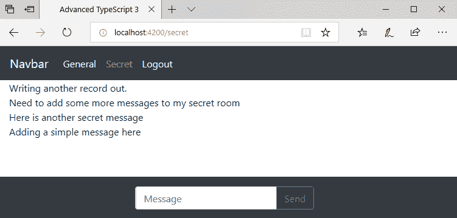
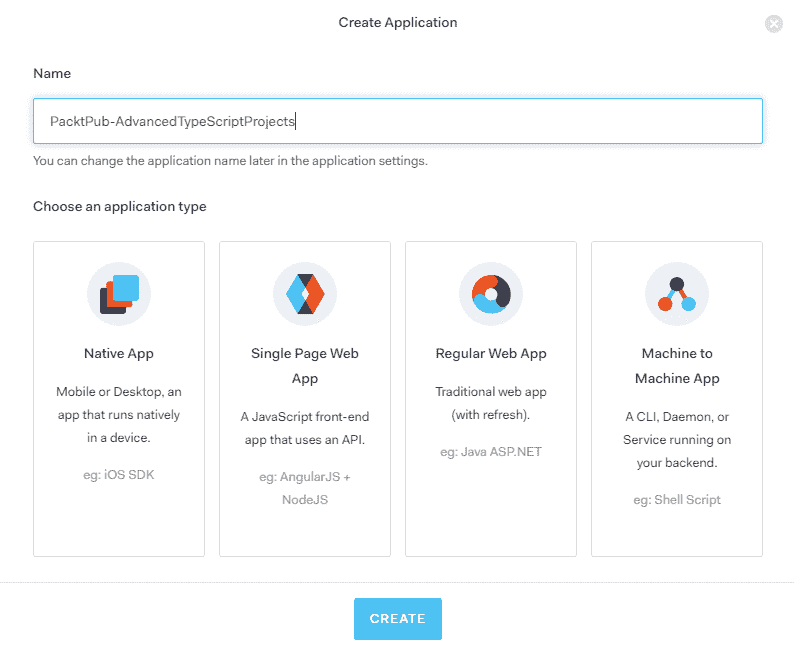
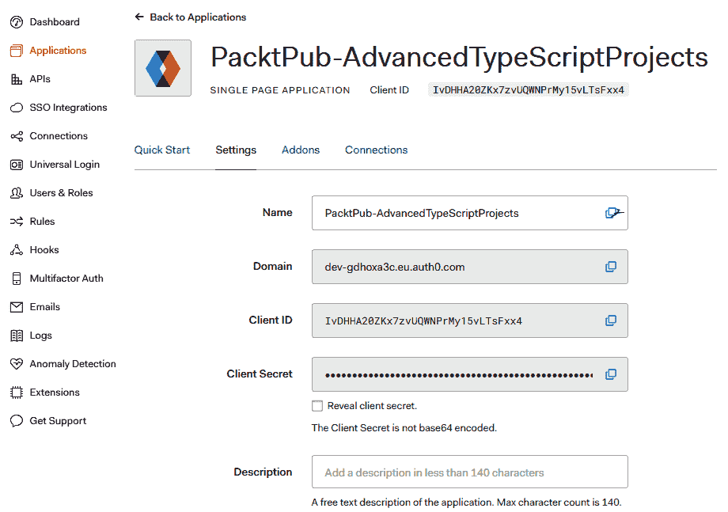

# 第六章：使用 Socket.IO 构建聊天室应用程序

在本章中，我们将介绍如何使用 Socket.IO 构建一个 Angular 聊天室应用程序，以便探索在客户端和服务器之间发送消息的能力，而无需建立 REST API 或通过使用 GraphQL 查询。我们将使用的技术涉及从客户端到服务器的建立长时间运行的连接，使通信变得像传递消息一样简单。

在本章中，我们将涵盖以下主题：

+   使用 Socket.IO 进行长时间运行的客户端/服务器通信

+   创建一个 Socket.IO 服务器

+   创建一个 Angular 客户端并添加 Socket.IO 支持

+   使用装饰器添加客户端日志记录

+   在我们的客户端使用 Bootstrap

+   添加 Bootstrap 导航

+   注册 Auth0 以对我们的客户端进行身份验证

+   为我们的客户端添加 Auth0 支持

+   添加安全的 Angular 路由

+   在我们的客户端和服务器上连接到 Socket.IO 消息

+   使用 Socket.IO 命名空间来分隔消息

+   添加房间支持

+   接收和发送消息

# 技术要求

完成的项目可以从[`github.com/PacktPublishing/Advanced-TypeScript-3-Programming-Projects/tree/master/Chapter06`](https://github.com/PacktPublishing/Advanced-TypeScript-3-Programming-Projects/tree/master/Chapter06)下载。

下载项目后，您将需要使用`npm install`命令安装软件包要求。

# 使用 Socket.IO 进行长时间运行的客户端/服务器通信

到目前为止，我们已经涵盖了各种方式在客户端和服务器之间进行来回通信，但它们都有一个共同点——它们都是对某种形式的交互做出反应，以触发数据传输。无论我们点击了链接还是按下了按钮，都有一些用户输入触发了双方之间的来回交流。

然而，有些情况下，我们希望保持客户端和服务器之间的通信线路永久打开，以便在数据可用时立即推送数据。例如，如果我们在玩在线游戏，我们不希望必须按下按钮才能更新屏幕上其他玩家的状态。我们需要的是一种能够为我们维护连接并允许我们无障碍传递消息的技术。

多年来，已经出现了许多旨在解决这一问题的技术。其中一些技术，如 Flash 套接字，因依赖专有系统而不受青睐。总称为**推送技术**，并出现了一种称为**WebSocket**的标准，并变得普遍，所有主要浏览器都支持它。值得知道的是，WebSocket 与 HTTP 并存作为一种合作协议。

这里有一个关于 WebSocket 的趣闻。虽然 HTTP 使用 HTTP 或 HTTPS 来标识协议，但 WebSocket 的规范定义了**WS**或**WSS**（WebSocket Secure 的缩写）作为协议标识符。

在 Node 世界中，Socket.IO 已成为启用 WebSocket 通信的*事实*标准。我们将使用它来构建一个保持所有连接用户聊天室应用程序。

# 项目概述

*经典*基于套接字的应用程序是创建一个聊天室。这几乎是套接字应用程序的*Hello World*。聊天室之所以如此有用，是因为它允许我们探索诸如向其他用户发送消息、对来自其他用户的消息做出反应以及使用房间来分隔消息发送位置等技术。

在过去的几章中，Material Design 在其开发中起到了很大作用，所以现在是我们返回到 Bootstrap 4 并看看如何在 Angular 应用程序中使用它来布局界面的合适时机。我们还将在客户端和服务器上使用 Socket.IO 来实现双向通信。在以前的章节中缺少的是对用户进行身份验证的能力。在本章中，我们将通过注册使用 Auth0（[`auth0.com/`](https://auth0.com/)）来引入身份验证支持。

与 GitHub 代码一起工作，完成本章大约需要两个小时。完成后，应用程序应如下所示：



现在我们知道我们想要构建什么类型的应用程序，以及我们希望它看起来像什么，我们准备开始构建我们的应用程序。在下一节中，我们将看看如何使用 Auth0 为我们的应用程序添加外部身份验证。

# 使用 Socket.IO 和 Angular 入门

大多数要求，如 Node.js 和 Mongoose，与前几章相同，因此我们不再列出额外的组件。在本章中，我们将指出我们需要的任何新组件。总是可以在 GitHub 的代码中找到我们使用的内容。

作为本章的一部分，我们将使用 Auth0（[`auth0.com`](https://auth0.com)）来对我们的用户进行身份验证。Auth0 是身份验证的最受欢迎的选择之一，因为它负责所有基础设施。我们只需要提供一个安全的登录和信息存储机制。我们使用 Auth0 的想法是利用他们的 API 来验证使用我们的应用程序的人的身份，通过使用**开放认证**（**OAuth**）框架，这使我们能够根据这种身份验证自动显示或隐藏我们应用程序的部分访问权限。使用 OAuth 及其后继者 OAuth 2，我们使用了一个标准的授权协议，允许经过身份验证的用户访问我们应用程序的功能，而无需注册我们的网站并提供登录信息。

最初，本章将使用护照提供身份验证支持，但考虑到最近来自 Facebook 等公司的备受关注的安全问题，我决定我们将使用 Auth0 来处理和管理我们的身份验证。在身份验证方面，我发现最好确保在安全性方面使用最好的技术。

在我们编写任何代码之前，我们将注册到 Auth0 并创建我们需要的单页 Web 应用程序基础设施。首先点击“注册”按钮，这将重定向您到以下 URL：[`auth0.com/signup?&signUpData=%7B%22category%22%3A%22button%22%7D`](https://auth0.com/signup?&signUpData=%7B%22category%22%3A%22button%22%7D)。我选择使用我的 GitHub 帐户注册，但您可以选择任何可用的选项。

Auth0 为我们提供了各种付费高级服务以及免费版本。我们只需要基本功能，所以免费版本非常适合我们的需求。

注册后，您需要按“创建应用程序”按钮，这将弹出“创建应用程序”对话框。给它一个名称，并选择“单页 Web 应用程序”，然后单击“创建”按钮创建 Auth0 应用程序：



如果您单击“设置”选项卡，您应该会看到类似以下内容的东西：



有回调 URL、允许的 Web 起源、注销 URL、CORS 等选项可用。

Auth0 的全部范围超出了本书的范围，但我建议阅读提供的文档，并根据您创建的任何应用程序适当地设置这些设置。

安全提示：在本书中，我提供有关客户端 ID 或类似唯一标识符的详细信息，这纯粹是为了说明代码。任何实时 ID 都将被停用以确保安全。我建议您采用类似的良好做法，不要在 GitHub 等公共位置提交实时标识符或密码。

# 使用 Socket.IO、Angular 和 Auth0 创建聊天室应用程序

在开始开发之前，我们应该弄清楚我们想要构建什么。由于聊天室是一个足够常见的应用程序，我们很容易想出一套标准的要求，这将帮助我们练习 Socket.IO 的不同方面。我们要构建的应用程序的要求如下：

+   用户将能够发送消息，让所有用户在通用聊天页面上看到

+   用户将能够登录应用程序，此时将有一个安全页面可用

+   已登录用户将能够发送消息，只有其他已登录用户才能看到

+   连接时，旧消息将被检索并显示给用户

# 创建我们的应用程序

到目前为止，创建一个节点应用程序应该是驾轻就熟的，所以我们不会再覆盖如何做了。我们将使用的`tsconfig`文件如下：

```ts
{
  "compileOnSave": true,
  "compilerOptions": {
    "incremental": true,
    "target": "es5",
    "module": "commonjs",
    "outDir": "./dist",
    "removeComments": true,
    "strict": true,
    "esModuleInterop": true,
    "inlineSourceMap": true,
    "experimentalDecorators": true,
  }
}
```

设置中的增量标志是 TypeScript 3.4 引入的一个新功能，它允许我们执行增量构建。这个功能的作用是在代码编译时构建一个称为项目图的东西。下次编译代码时，项目图将用于识别未更改的代码，这意味着它不需要重新构建。在更大的应用程序中，这可以节省大量编译时间。

我们将把消息保存到数据库中，所以毫无疑问，我们将从数据库连接代码开始。这一次，我们要做的是将数据库连接移到一个类装饰器，该装饰器接受数据库名称作为装饰器工厂的参数：

```ts
export function Mongo(connection: string) {
  return function (constructor: Function) {
    mongoose.connect(connection, { useNewUrlParser: true}, (e:unknown) => {
      if (e) {
        console.log(`Unable to connect ${e}`);
      } else {
        console.log(`Connected to the database`);
      }
    });
  }
}
```

在创建之前，不要忘记安装`mongoose`和`@types/mongoose`。

有了这个，当我们创建我们的`server`类时，我们只需要装饰它，就像这样：

```ts
@Mongo('mongodb://localhost:27017/packt_atp_chapter_06')
export class SocketServer {
}
```

就是这样。当`SocketServer`被实例化时，数据库将自动连接。我必须承认，我真的很喜欢这种简单的方法。这是一种优雅的技术，可以应用到其他应用程序中。

在上一章中，我们构建了一个`DataAccessBase`类来简化我们处理数据的方式。我们将采取这个类，并删除一些在本应用程序中不会使用的方法。同时，我们将看看如何删除硬模型约束。让我们从类定义开始：

```ts
export abstract class DataAccessBase<T extends mongoose.Document>{
  private model: Model;
  protected constructor(model: Model) {
    this.model = model;
  }
}
```

`Add`方法在上一章中也应该看起来很熟悉：

```ts
Add(item: T): Promise<boolean> {
  return new Promise<boolean>((callback, error) => {
    this.model.create(item, (err: unknown, result: T) => {
      if (err) {
        error(err);
      }
      callback(!result);
    });
  });
}
```

在上一章中，我们有一个约束，即查找记录需要有一个名为`Id`的字段。虽然那是一个可以接受的限制，但我们真的不想强制应用程序必须有`Id`作为字段。我们将提供一个更开放的实现，允许我们指定检索记录所需的任何条件以及选择要返回的字段的能力：

```ts
GetAll(conditions: unknown, fields: unknown): Promise<unknown[]> {
  return new Promise<T[]>((callback, error) => {
    this.model.find(conditions, fields, (err: unknown, result: T[]) => {
      if (err) {
        error(err);
      }
      if (result) {
        callback(result);
      }
    });
  });
}
```

就像在上一章中一样，我们将创建一个基于`mongoose.Document`的接口和一个`Schema`类型。这将形成消息合同，并将存储有关房间、消息文本和接收消息的日期的详细信息。然后，这些将被组合以创建我们需要用作数据库的物理模型。让我们看看如何做：

1.  首先，我们定义`mongoose.Document`实现：

```ts
export interface IMessageSchema extends mongoose.Document{
  room: string;
  messageText: string;
  received: Date;
}
```

1.  对应的`Schema`类型如下：

```ts
export const MessageSchema = new Schema({
  room: String,
  messageText: String,
  received: Date
});
```

1.  最后，我们创建一个`MessageModel`实例，我们将使用它来创建数据访问类，用于保存和检索数据：

```ts
export const MessageModel = mongoose.model<IMessageSchema>('message', MessageSchema, 'messages', false);
export class MessageDataAccess extends DataAccessBase<IMessageSchema> {
  constructor() {
    super(MessageModel);
  }
}
```

# 为服务器添加 Socket.IO 支持

我们现在已经到了准备将 Socket.IO 引入到我们的服务器并创建一个运行的服务器实现的阶段。运行以下命令来整合 Socket.IO 和相关的`DefinitelyTyped`定义：

```ts
npm install --save socket.io @types/socket.io
```

有了这些定义，我们将把 Socket.IO 支持引入到我们的服务器中，并开始运行它，准备接收和传输消息：

```ts
export class SocketServer {
  public Start() {
    const appSocket = socket(3000);
    this.OnConnect(appSocket);
  }

  private OnConnect(io: socket.Server) {
  }
}
new SocketServer.Start();
```

我们的`OnConnect`方法接收的参数是在 Socket.IO 中接收和响应消息的起始点。我们用这个参数来*监听*连接消息，这将表明客户端已连接。当客户端连接时，它为我们打开了一个类似套接字的东西，用于开始接收和发送消息。当我们想直接向特定客户端发送消息时，我们将使用以下代码片段中返回的`socket`可用的方法：

```ts
io.on('connection', (socket:any) => {
});
```

在这一点上，我们需要明白，尽管技术的名称是 Socket.IO，但这不是一个 WebSocket 实现。虽然它可以使用 WebSockets，但并不能保证它实际上会使用；例如，企业政策可能禁止使用套接字。那么，Socket.IO 实际上是如何工作的呢？嗯，Socket.IO 由许多不同的协作技术组成，其中之一称为 Engine.IO，它提供了底层的传输机制。它在连接时采用的第一种连接类型是 HTTP 长轮询，这是一种快速高效的传输机制。在空闲期间，Socket.IO 会尝试确定传输是否可以切换到套接字，如果可以使用套接字，它会无缝地升级传输以使用套接字。对于客户端来说，它们连接得很快，消息也是可靠的，因为 Engine.IO 部分即使存在防火墙和负载均衡器，也能建立连接。

我们想为客户端提供的一件事是以前进行的对话的历史记录。这意味着我们希望读取并保存我们的消息到数据库中。在我们的连接中，我们将读取用户当前所在房间的所有消息并将它们返回给用户。如果用户没有登录，他们只能看到房间未设置的消息：

```ts
this.messageDataAccess.GetAll({room: room}, {messageText: 1, _id: 0}).then((msgs: string[]) =>{   socket.emit('allMessages', msgs);  });
```

语法看起来有点奇怪，所以我们将一步一步地分解它。对`GetAll`的调用是从我们的`DataAccessBase`类中调用通用的`GetAll`方法。当我们创建这个实现时，我们讨论了需要使它更通用，并允许调用代码指定要过滤的字段以及要返回的字段。当我们说`{room: room}`时，我们告诉 Mongo 我们要根据房间来过滤我们的结果。我们可以将等效的 SQL 子句视为`WHERE room = roomVariable`。我们还想指示我们想要返回什么结果；在这种情况下，我们只想要`messageText`而不是`_id`字段，所以我们使用`{messageText: 1, _id: 0}`语法。当结果返回时，我们需要使用`socket.emit`将消息数组发送到客户端。这个命令将这些消息发送到打开连接的客户端，使用`allMessages`作为键。如果客户端有代码来接收`allMessages`，它将能够对这些消息做出反应。

我们选择作为消息的事件名称引出了 Socket.IO 的一个限制。有一些事件名称是我们不能用作消息的，因为它们由于对 Socket.IO 具有特殊含义而被限制。这些事件名称包括`error`、`connect`、`disconnect`、`disconnecting`、`newListener`、`removeListener`、`ping`和`pong`。

如果我们在客户端没有任何东西来接收消息，那么创建服务器并发送消息就没有太大意义。即使我们还没有准备好所有的消息，但我们已经有了足够的基础设施来开始编写我们的客户端。

# 创建我们的聊天室客户端

我们将再次使用`ng new`命令创建我们的 Angular 应用程序。我们将提供路由支持，但是当我们开始进行路由部分时，我们将看到如何确保用户无法绕过我们的身份验证：

```ts
ng new Client --style scss --prefix atp --routing true
```

由于我们的 Angular 客户端将经常使用 Socket.IO，我们将使用一个特定于 Angular 的 Socket.IO 模块为 Socket.IO 提供支持：

```ts
npm install --save ngx-socket-io
```

在`app.module.ts`中，我们将通过创建一个指向服务器 URL 的配置来创建与我们的 Socket.IO 服务器的连接：

```ts
import { SocketIoModule, SocketIoConfig } from 'ngx-socket-io';
const config: SocketIoConfig = { url: 'http://localhost:3000', options: {}}
```

当我们导入模块时，这个配置被传递到静态的`SocketIoModule.forRoot`方法中，这将为我们配置客户端 socket。一旦我们的客户端启动，它将建立一个连接，触发我们在服务器代码中描述的连接消息序列：

```ts
imports: [   BrowserModule,   AppRoutingModule,   SocketIoModule.forRoot(config),
```

# 使用装饰器添加客户端日志

我们想要在客户端代码中使用的一个功能是能够记录方法调用，以及传递给它们的参数。我们在之前创建装饰器时已经遇到过这种类型的功能。在这种情况下，我们想要创建一个`Log`装饰器：

```ts
export function Log() {
  return function(target: Object,
  propertyName: string,
  propertyDesciptor: PropertyDescriptor): PropertyDescriptor {
  const method = propertyDesciptor.value;
  propertyDesciptor.value = function(...args: unknown[]) {
  const params = args.map(arg => JSON.stringify(arg)).join();
  const result = method.apply(this, args);
  if (args && args.length > 0) {
  console.log(`Calling ${propertyName} with ${params}`);
 } else {
  console.log(`Calling ${propertyName}. No parameters present.`)
 }  return result;
 };  return propertyDesciptor;
 } } 
```

`Log`装饰器的工作方式是从`propertyDescriptor.value`中复制方法开始。然后，我们通过创建一个接收方法传递的任何参数的函数来替换这个方法。在这个内部函数中，我们使用`args.map`来创建参数和值的字符串表示形式，然后将它们连接在一起。在调用`method.apply`运行方法之后，我们将方法和参数的详细信息写到控制台上。有了前面的代码，我们现在有了一个简单的机制，只需使用`@Log`就可以自动记录方法和参数。

# 在 Angular 中设置 Bootstrap

在 Angular 中，我们可以选择使用 Bootstrap 来为我们的页面添加样式，而不是使用 Material。添加支持是一个相当简单的任务。我们首先要做的是安装相关的包。在这种情况下，我们将安装 Bootstrap：

```ts
npm install bootstrap --save
```

安装了 Bootstrap 之后，我们只需要在`angular.json`的`styles`部分中添加对 Bootstrap 的引用即可。

```ts
"styles": [   "src/styles.scss",   "node_modules/bootstrap/dist/css/bootstrap.min.css"  ],
```

有了这个配置，我们将创建一个位于页面顶部的`navigation`导航栏：

```ts
ng g c components/navigation
```

在我们添加`navigation`组件主体之前，我们应该替换我们的`app.component.html`文件的内容，以便在每个页面上提供我们的导航：

```ts
<atp-navigation></atp-navigation> <router-outlet></router-outlet> 
```

# Bootstrap 导航

Bootstrap 提供了`nav`组件，我们可以在其中添加`navigation`。在其中，我们将创建一系列链接。就像在上一章中一样，我们将使用`routerLink`来告诉 Angular 应该路由到哪里：

```ts
<nav class="navbar navbar-expand-lg navbar-dark bg-dark">
 <a class="navbar-brand" href="#">Navbar</a>
 <div class="collapse navbar-collapse" id="navbarNavAltMarkup">
 <div class="navbar-nav">
 <a class="nav-item nav-link active" routerLink="/general">General</a>
 <a class="nav-item nav-link" routerLink="/secret" *ngIf="auth.IsAuthenticated">Secret</a>
 <a class="nav-item nav-link active" (click)="auth.Login()" routerLink="#" *ngIf="!auth.IsAuthenticated">Login</a>
 <a class="nav-item nav-link active" (click)="auth.Logout()" routerLink="#" *ngIf="auth.IsAuthenticated">Logout</a>
 </div>
 </div> </nav> 
```

在路由方面变得有趣的地方涉及到使用身份验证来显示和隐藏链接。如果用户已经通过身份验证，我们希望他们能够看到秘密和注销链接。如果用户尚未通过身份验证，我们希望他们能够看到登录链接。

在导航中，我们可以看到一些 auth 引用。在幕后，这些都映射回`OauthAuthorizationService`。我们在本章开头注册 Auth0 时就提到过这个。现在，是时候为我们的用户添加连接到 Auth0 的授权服务了。

# 使用 Auth0 对用户进行授权和认证

我们的授权将由两部分组成——一个执行授权的服务，以及一个使授权工作变得简单的模型。我们将首先创建我们的`Authorization`模型，其中包含我们将从成功登录中收到的详细信息。请注意，构造函数引入了`Socket`实例：

```ts
export class Authorization {
  constructor(private socket: Socket);
  public IdToken: string;
  public AccessToken: string;
  public Expired: number;
  public Email: string; }
```

我们可以使用这个来创建一系列有用的辅助方法。我们要创建的第一个方法是在用户登录时设置公共属性。我们将一个成功的登录定义为我们收到访问令牌和 ID 令牌作为结果的登录：

```ts
@Log()  public SetFromAuthorizationResult(authResult: any): void {   if (authResult && authResult.accessToken && authResult.idToken) {   this.IdToken = authResult.idToken;   this.AccessToken = authResult.accessToken;   this.Expired = (authResult.expiresIn * 1000) + Date.now();   this.Email = authResult.idTokenPayload.email;   this.socket.emit('loggedOn', this.Email);  }  }
```

当用户登录时，我们将向服务器发送一个`loggedOn`消息，传递`Email`地址。当我们涵盖发送消息到服务器和处理返回的响应时，我们将很快回到这条消息。请注意，我们正在记录方法和属性。

当用户注销时，我们希望清除值并向服务器发送`loggedOff`消息：

```ts
@Log()  public Clear(): void {   this.socket.emit('loggedOff', this.Email);   this.IdToken = '';   this.AccessToken = '';   this.Expired = 0;   this.Email = '';  }
```

最终的帮助程序通过检查`AccessToken`字段是否存在以及票证到期的日期是否超过我们进行检查时的时间来告诉我们用户是否已经通过身份验证：

```ts
public get IsAuthenticated(): boolean {   return this.AccessToken && this.Expired > Date.now();  }
```

在创建我们的`OauthAuthorizationService`服务之前，我们需要一些与 Auth0 通信的手段，因此我们将为其提供支持：

```ts
npm install --save auth0-js
```

有了这个，我们可以将`auth0.js`作为`script`标签的引用添加进来：

```ts
<script type="text/javascript" src="node_modules/auth0-js/build/auth0.js"></script>
```

现在我们已经准备好创建我们的服务了：

```ts
ng g s services/OauthAuthorization
```

我们的服务的开始是相当简单的。当我们构建服务时，我们实例化刚刚创建的帮助类：

```ts
export class OauthAuthorizationService {
  private readonly authorization: Authorization;
  constructor(private router: Router, private socket: Socket) {
    this.authorization = new Authorization(socket);
  } }
```

我们现在准备好连接到 Auth0 了。您可能还记得，当我们注册 Auth0 时，我们得到了一系列的设置。从这些设置中，我们需要客户端 ID 和域。我们将在实例化`auth0-js`中的`WebAuth`时使用这些设置，以便唯一标识我们的应用程序。`responseType`告诉我们，我们需要用户的身份验证令牌和 ID 令牌在成功登录后返回。`scope`告诉用户我们在登录时想要访问的功能。例如，如果我们想要配置文件，我们可以将范围设置为`openid email profile`。最后，我们提供`redirectUri`告诉 Auth0 我们想在成功登录后返回到哪个页面：

```ts
auth0 = new auth0.WebAuth({   clientID: 'IvDHHA20ZKx7zvUQWNPrMy15vLTsFxx4',   domain: 'dev-gdhoxa3c.eu.auth0.com',   responseType: 'token id_token',   redirectUri: 'http://localhost:4200/callback',   scope: 'openid email'  });
```

`redirectUri`必须与 Auth0 设置部分中包含的内容完全匹配。我更喜欢将其设置为站点上不存在的页面，并手动控制重定向，因此对我来说回调是一个有用的页面，因为我可以应用条件逻辑来确定用户需要时重定向到的页面。

现在，我们可以添加我们的`Login`方法。这使用`authorize`方法加载身份验证页面：

```ts
@Log()  public Login(): void {   this.auth0.authorize();  }
```

登出就像调用`logout`，然后在我们的帮助类上调用`Clear`来重置到期点并清除其他属性一样简单：

```ts
@Log()
public Logout(): void {   this.authorization.Clear();   this.auth0.logout({   return_to: window.location.origin
  });  }
```

显然，我们需要一种方法来检查身份验证。以下方法检索 URL 哈希中的身份验证并使用`parseHash`方法解析它。如果身份验证不成功，用户将被重定向回不需要登录的一般页面。另一方面，如果用户成功通过身份验证，用户将被引导到仅对经过身份验证的用户可用的秘密页面。请注意，我们正在调用我们之前编写的`SetFromAuthorizationResult`方法来设置访问令牌、到期时间等：

```ts
@Log()  public CheckAuthentication(): void {   this.auth0.parseHash((err, authResult) => {   if (!err) {   this.authorization.SetFromAuthorizationResult(authResult);   window.location.hash = '';   this.router.navigate(['/secret']);  } else {   this.router.navigate(['/general']);   console.log(err);  }  });  }
```

当用户回到网站时，让他们再次访问而无需重新进行身份验证是一个好的做法。以下的`Renew`方法检查他们的会话，如果成功，重置他们的身份验证状态：

```ts
@Log()  public Renew(): void {   this.auth0.checkSession({}, (err, authResult) => {   if (authResult && authResult.accessToken && authResult.idToken) {   this.authorization.SetFromAuthorizationResult(authResult);  } else if (err) {   this.Logout();  }  });  }
```

这段代码都很好，但我们在哪里使用它呢？在`app.component.ts`中，我们引入我们的授权服务并检查用户身份验证：

```ts
constructor(private auth: OauthAuthorizationService) {   this.auth.CheckAuthentication();  }

ngOnInit() {
  if (this.auth.IsAuthenticated) {
    this.auth.Renew();
  }
}
```

不要忘记添加对`NavigationComponent`的引用以连接`OauthAuthorizationService`：

```ts
constructor(private auth: OauthAuthorizationService) {  }
```

# 使用安全路由

有了我们的身份验证，我们希望确保用户不能通过输入页面的 URL 来绕过它。如果用户可以轻松地绕过它，尤其是在我们费了很大的劲提供安全授权之后，我们就不会设置太多安全措施。我们要做的是放置另一个服务，路由器将使用它来确定是否可以激活路由。首先，我们创建服务，如下所示：

```ts
ng g s services/Authorization
```

服务本身将实现`CanActivate`接口，路由器将使用该接口来确定是否可以激活路由。此服务的构造函数只需接收路由器和我们的`OauthAuthorizationService`服务：

```ts
export class AuthorizationService implements CanActivate {
  constructor(private router: Router, private authorization: OauthAuthorizationService) {}
}
```

`canActivate`签名的样板代码看起来比我们的目的需要复杂得多。我们真正要做的是检查认证状态，如果用户未经过身份验证，我们将重新将用户重定向到一般页面。如果用户经过了身份验证，我们返回`true`，用户继续访问受保护的页面。

```ts
canActivate(route: ActivatedRouteSnapshot, state: RouterStateSnapshot):   Observable<boolean | UrlTree> | Promise<boolean | UrlTree> | boolean | UrlTree {   if (!this.authorization.IsAuthenticated) {   this.router.navigate(['general']);   return false;  }   return true; }
```

我们将遵循两条路线，就像我们在导航链接中看到的那样。在添加路由之前，让我们创建要显示的组件：

```ts
ng g c components/GeneralChat
ng g c components/SecretChat
```

最后，我们已经到达了连接路由的地步。正如我们在上一章中看到的，添加路由非常简单。我们要添加的秘密武器是`canActivate`。有了这个路由，用户无法绕过我们的认证：

```ts
const routes: Routes = [{
  path: '',
  redirectTo: 'general',
  pathMatch: 'full' }, {
  path: 'general',
  component: GeneralchatComponent }, {
  path: 'secret',
  component: SecretchatComponent,
  canActivate: [AuthorizationService] }]; 
```

尽管我们必须在 Auth0 配置中提供回调 URL，但我们不在路由中包含它，因为我们想要控制页面，我们要导航到我们的授权服务。

此时，我们希望从客户端向服务器发送消息并接收消息。

# 添加客户端聊天功能

当我们编写我们的认证代码时，我们大量依赖于放置服务来处理它。类似地，我们将提供一个聊天服务，该服务提供客户端套接字消息的中心点：

```ts
ng g s services/ChatMessages
```

毫不奇怪，此服务还将在构造函数中包含`Socket`：

```ts
export class ChatMessagesService {   constructor(private socket: Socket) { }
}
```

当我们从客户端向服务器发送消息时，我们使用套接字上的`emit`方法。用户要发送的文本将通过`message`键发送过来：

```ts
public SendMessage = (message: string) => {   this.socket.emit('message', message);  };
```

# 在房间里工作

在 Socket.IO 中，我们使用房间来隔离消息，以便只将它们发送给特定的用户。当客户端加入一个房间时，发送到该房间的任何消息都将可用。一个有用的想法是将房间想象成房子里的房间，门是关着的。当有人想告诉你什么事情时，他们必须和你在同一个房间里才能告诉你。

我们的一般和秘密链接都将连接到房间。一般页面将使用一个空房间名称，相当于默认的 Socket.IO 房间。秘密链接将加入一个名为*secret*的房间，这样发送到*secret*的任何消息都将自动显示给该页面上的任何用户。为了简化我们的生活，我们将提供一个辅助方法，将`emit`方法从客户端发送到服务器的`joinRoom`方法：

```ts
private JoinRoom = (room: string) => {   this.socket.emit('joinRoom', room);  };
```

当我们加入一个房间时，使用`socket.emit`发送的任何消息都会自动发送到正确的房间。我们不必做任何聪明的事情，因为 Socket.IO 会自动为我们处理这个。

# 获取消息

对于一般页面和秘密消息页面，我们将获取相同的数据。我们将使用 RxJS 创建一个可观察对象，该对象包装从服务器获取单个消息以及从服务器获取所有当前发送的消息。

根据传入的房间字符串，`GetMessages`方法加入秘密房间或一般房间。加入房间后，我们返回一个`Observable`实例，在特定事件上做出反应。在接收到单个消息时，我们调用`Observable`实例的`next`方法。客户端组件将订阅此方法，并将其写出。同样，我们还在套接字上订阅`allMessages`，以便在加入房间时接收所有先前发送的消息。同样，我们遍历消息并使用`next`将消息写出。

我最喜欢的部分是`fromEvent`。这与`userLogOn`消息的`socket.on`方法是同义的，它允许我们写出有关谁在会话期间登录的详细信息：

```ts
public GetMessages = (room: string) => {   this.JoinRoom(room);   return Observable.create((ob) => {
 this.socket.fromEvent<UserLogon>('userLogOn').subscribe((user:UserLogon) => {
      ob.next(`${user.user} logged on at ${user.time}`);
    });  this.socket.on('message', (msg:string) => {   ob.next(msg);  });   this.socket.on('allMessages', (msg:string[]) => {   msg.forEach((text:any) => ob.next(text.messageText));  });  });  }
```

到目前为止，在阅读本章时，我在使用术语“消息”和“事件”时一直比较宽松。在这种情况下，它们都指的是同一件事情。

# 完成服务器套接字

在我们添加实际组件实现之前，我们将添加其余的服务器端套接字行为。您可能还记得我们添加了读取所有历史记录并将它们发送回新连接的客户端的功能：

```ts
socket.on('joinRoom', (room: string) => {   if (lastRoom !== '') {   socket.leave(lastRoom);  }   if (room !== '') {   socket.join(room);  }   this.messageDataAccess.GetAll({room: room}, {messageText: 1, _id: 0}).then((msgs: string[]) =>{   socket.emit('allMessages', msgs);  });   lastRoom = room;  });
```

这里我们看到服务器对来自客户端的`joinRoom`做出反应。当我们收到这个事件时，如果已经设置了上一个房间，我们就离开上一个房间，然后加入来自客户端传递过来的房间；同样，只有在已经设置的情况下。这使我们能够获取所有记录，然后在当前套接字连接上`emit`它们回去。

当客户端向服务器发送`message`事件时，我们将消息写入数据库，以便以后检索：

```ts
socket.on('message', (msg: string) => {   this.WriteMessage(io, msg, lastRoom);  });
```

这种方法首先将消息保存到数据库中。如果设置了房间，我们使用`io.sockets.in`将消息发送给所有活跃在房间中的客户端。如果没有设置房间，我们希望通过`io.emit`将消息发送给通用页面上的所有客户端：

```ts
private WriteMessage(io: socket.Server, message: string, room: string) {   this.SaveToDatabase(message, room).then(() =>{   if (room !== '') {   io.sockets.in(room).emit('message', message);   return;  }   io.emit('message', message);  });  }
```

在这里，我们已经看到了`io.`和`socket.`之间的主要区别。当我们想要将消息发送给当前连接的客户端时，我们使用`socket`部分。当我们需要将消息发送给更多的客户端时，我们使用`io`部分。

保存消息就像做以下操作一样简单：

```ts
private async SaveToDatabase(message: string, room: string) {   const model: IMessageSchema = <IMessageSchema>{   messageText: message,   received: new Date(),   room: room   };   try{   await this.messageDataAccess.Add(model);  }catch (e) {   console.log(`Unable to save ${message}`);  }  }
```

你可能会问自己为什么我们在服务器端分配日期，而不是在客户端创建消息时分配日期。当我们在同一台机器上运行客户端和服务器时，我们做法并不重要，但是当我们构建分布式系统时，我们应该始终参考集中时间。使用集中的日期和时间意味着来自世界各地的事件将在同一时区协调。

在客户端上，我们对稍微复杂的登录事件做出了反应。当我们收到`loggedOn`事件时，我们创建等效的服务器端事件，将其传输给任何在秘密房间中收听的人：

```ts
socket.on('loggedOn', (msg: any) => {   io.sockets.in('secret').emit('userLogOn', { user: msg, time: new Date() });  });
```

我们现在已经有了客户端基础设施，并且服务器已经完成。我们现在需要做的就是添加服务器端组件。从功能上讲，由于`GeneralChat`和`SecretChat`组件几乎相同（唯一的区别是它们监听的房间不同），我们将集中精力只关注其中一个。

# Socket.IO 中的命名空间

想象一下，我们正在编写一个可以被任意数量的客户端应用程序使用的服务器，而这些客户端应用程序也可以使用任意数量的其他 Socket.IO 服务器。如果我们使用与来自其他 Socket.IO 服务器的消息相同的消息名称，我们可能会向客户端应用程序引入错误。为了避免这个问题，Socket.IO 使用了一个叫做**命名空间**的概念，允许我们将我们的消息隔离开来，以避免与其他应用程序冲突。

命名空间是提供唯一端点以连接的便捷方式，我们使用以下代码连接到它：

```ts
const socket = io.of('/customSocket');
socket.on('connection', function(socket) {
  ...
});
```

这段代码应该看起来很熟悉，因为除了`io.of(...)`之外，它与我们之前用来连接套接字的代码相同。也许令人惊讶的是，我们的代码已经在使用命名空间，尽管我们自己没有指定。除非我们自己指定一个命名空间，否则我们的套接字将连接到默认命名空间，这相当于`io.of('/)`.

在为命名空间想一个名称时，尽量考虑一个独特而有意义的名称。我过去见过的一个标准是利用公司名称和项目来创建命名空间。因此，如果你的公司叫做`WonderCompany`，你正在开发`Project Antelope`，你可以使用`/wonderCompany_antelope`作为命名空间。不要随意分配随机字符，因为这样很难记住，这会增加输入错误的可能性，意味着套接字无法连接。

# 用 GeneralchatComponent 完成我们的应用程序

让我们首先添加 Bootstrap 代码来显示消息。在这种情况下，我们将`row`消息包裹在 Bootstrap 容器中，或者说是`container-fluid`。在我们的组件中，我们将从通过 socket 接收的消息数组中读取消息：

```ts
<div class="container-fluid">
 <div class="row">
 <div *ngFor="let msg of messages" class="col-12">
 {{msg}}
 </div>
 </div> </div>
```

我们还将在屏幕底部的`navigation`栏中添加一个文本框。这与组件中的`CurrentMessage`字段绑定。我们使用`SendMessage()`发送消息：

```ts
<nav class="navbar navbar-dark bg-dark mt-5 fixed-bottom">
 <div class="navbar-expand m-auto navbar-text">
 <div class="input-group mb-6">
 <input type="text" class="form-control" placeholder="Message" aria-label="Message" 
        aria-describedby="basic-addon2" [(ngModel)]="CurrentMessage" />
 <div class="input-group-append">
 <button class="btn btn-outline-secondary" type="button" (click)="SendMessage()">Send</button>
 </div>
 </div>
 </div> </nav>
```

在这个 HTML 背后的组件中，我们需要连接到`ChatMessageService`。我们将使用`Subscription`实例，并将其用于不久后填充`messages`数组。

```ts
export class GeneralchatComponent implements OnInit, OnDestroy {   private subscription: Subscription;
  constructor(private chatService: ChatMessagesService) { }

  CurrentMessage: string;
  messages: string[] = []; }
```

当用户输入消息并按下发送按钮时，我们将使用聊天服务的`SendMessage`方法将其发送到服务器。我们之前做的准备工作在这里真的开始发挥作用：

```ts
SendMessage(): void {   this.chatService.SendMessage(this.CurrentMessage);   this.CurrentMessage = '';  }
```

现在，我们只剩下两个部分要添加。在我们的组件初始化中，我们将从`GetMessages`中检索`Observable`实例，并对其进行`subscribe`。当订阅中有消息时，我们将其推送到消息中，这就是 Angular 绑定的魔力所在，界面会随着最新消息的更新而更新：

```ts
ngOnInit() {   this.subscription = this.chatService.GetMessages('').subscribe((msg: string) =>{   this.messages.push(msg);  });  }
```

请注意，`GetMessages`方法是我们链接到房间的地方。在`SecretchatComponent`中，这将变成`this.chatService.GetMessages('secret')`。

我们做的一件事是引用订阅。当我们销毁当前页面时，我们将清除订阅，以防止内存泄漏：

```ts
ngOnDestroy() {   if (this.subscription) {   this.subscription.unsubscribe();  }  }
```

最后对这个实现做一个说明。当我们开始在这里编写代码时，我们必须对如何在用户按下发送时将当前屏幕填充消息做出有意识的决定。实际上，我们有两种选择。我们可以选择直接将当前消息添加到消息数组的末尾，而不是从服务器发送回客户端，或者我们可以将其发送到服务器，然后让服务器将其发送回给我们。我们可以选择任一种方法，那么为什么我选择将其发送到服务器，然后再回传给客户端呢？这个答案与顺序有关。在我使用过的大多数聊天应用程序中，每个用户看到的消息顺序都是完全相同的。做到这一点最简单的方法是让服务器为我们协调消息。

# 总结

在本章中，我们发现了如何编写代码来在客户端和服务器之间建立永久连接，使我们能够根据消息来回传递消息。我们还看到了如何注册 Auth0 并将其用作应用程序的身份验证机制。然后，我们学会了编写客户端身份验证。在过去的几章中，我们一直在研究 Angular 中的 Material，现在我们又回到了使用 Bootstrap，并看到了在 Angular 中使用它是多么简单。

在下一章中，我们将学习如何应用必应地图来创建一个自定义的基于地图的应用程序，让我们能够在基于云的数据库中选择和保存兴趣点，并使用基于位置的搜索来检索商业信息。

# 问题

1.  我们如何向所有用户发送消息？

1.  我们如何向特定房间中的用户发送消息？

1.  我们如何向除了发送原始消息的用户之外的所有用户发送消息？

1.  为什么我们不应该使用一个名为 connect 的消息？

1.  什么是 Engine.IO？

在我们的应用程序中，我们只使用了一个房间。添加其他房间，这些房间不需要用户在使用之前进行身份验证，并添加需要用户进行身份验证的房间。我们也没有存储发送消息的人的详细信息。增强应用程序以存储这些细节，并将它们作为消息的一部分双向传输。

# 进一步阅读

+   如果您想了解如何使用 Socket.IO 的特定功能，我建议阅读 Tyson Cadenhead 的《Socket.IO Cookbook》（[`www.packtpub.com/web-development/socketio-cookbook`](https://www.packtpub.com/web-development/socketio-cookbook)）。
