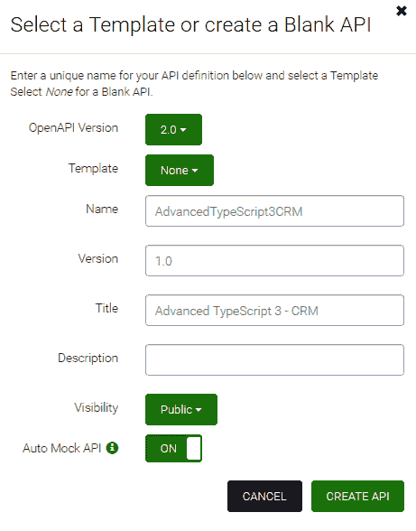
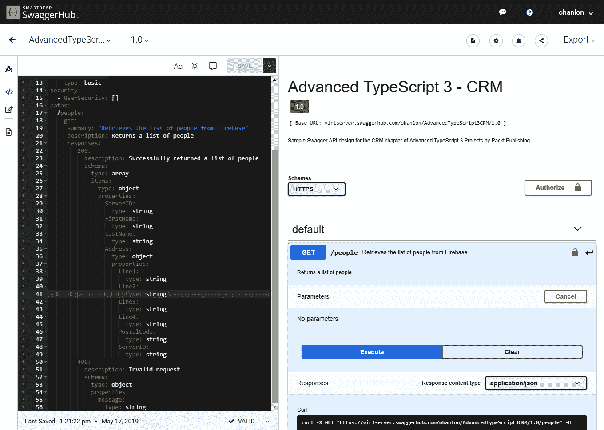
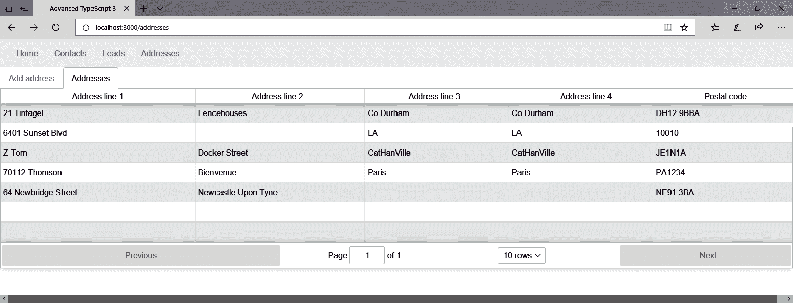
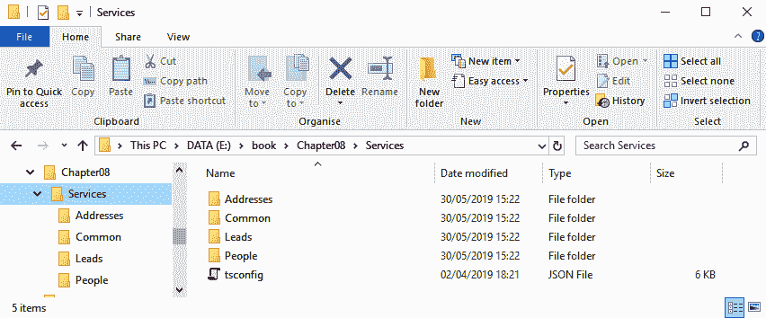

# 第八章：使用 React 和微服务构建 CRM

在我们使用 REST 服务的先前章节中，我们专注于有一个用于处理 REST 调用的单个站点。现代应用程序经常使用微服务，可能托管在基于容器的系统（如 Docker）中。

在本章中，我们将学习如何使用 Swagger 创建托管在多个 Docker 容器中的一组微服务来设计我们的 REST API。我们的 React 客户端应用程序将负责将这些微服务整合在一起，创建一个简单的客户关系管理（CRM）系统。

本章将涵盖以下主题：

+   理解 Docker 和容器

+   微服务是什么，它们的用途是什么

+   将单片架构分解为微架构

+   共享通用的服务器端功能

+   使用 Swagger 设计 API

+   在 Docker 中托管微服务

+   使用 React 连接到微服务

+   在 React 中使用路由

# 技术要求

完成的项目可以从[`github.com/PacktPublishing/Advanced-TypeScript-3-Programming-Projects/tree/master/Chapter08`](https://github.com/PacktPublishing/Advanced-TypeScript-3-Programming-Projects/tree/master/Chapter08)下载。

下载项目后，您将需要使用`npm install`命令安装软件包要求。由于服务分布在多个文件夹中，您将需要逐个安装每个服务。

# 理解 Docker 和微服务

由于我们正在构建一个使用 Docker 容器托管的微服务系统，所以我们需要事先了解一些术语和理论。

在本节中，我们将在继续了解微服务是什么、它们旨在解决什么问题以及如何将单片应用程序拆分为更模块化的服务之前，先看一下常见的 Docker 术语及其含义。

# Docker 术语

如果您是 Docker 的新手，您将遇到许多围绕它的术语。了解这些术语将有助于我们在设置服务器时，因此让我们从基础知识开始。

# 容器

如果您在互联网上看到过任何 Docker 文献，这可能是您已经遇到的术语。容器是运行实例，接收运行应用程序所需的各种软件。这是我们的起点。容器是从镜像构建的，您可以自己构建或从中央 Docker 数据库下载。容器可以向其他容器、主机操作系统甚至向更广泛的世界开放，使用端口和卷。容器的一个重要卖点是它们易于设置和创建，并且可以快速停止和启动。

# 镜像

正如我们在上一段中所介绍的，容器最初是一个镜像。已经有大量可供使用的镜像，但我们也可以创建自己的镜像。创建镜像时，创建步骤会被缓存，以便轻松重复使用。

# 端口

这对您来说可能已经很熟悉了。Docker 中的端口术语与操作系统中的端口术语完全相同。这些是对主机操作系统可见的 TCP 或 UDP 端口，或者连接到外部世界的端口。当我们的应用程序在内部使用相同的端口号但使用不同的端口号向外界公开时，本章后面将会有一些有趣的代码。

# 卷

可视化卷的最简单方法是将其视为共享文件夹。创建容器时，卷被初始化，并允许我们持久保存数据，无论容器的生命周期如何。

# 注册表

实际上，注册表可以被视为 Docker 世界的应用商店。它存储可以下载的 Docker 镜像，并且本地镜像可以以类似于将应用程序推送到应用商店的方式推送回注册表。

# Docker Hub

Docker Hub 是最初由 Docker 提供的 Docker 注册表。该注册表存储了大量的 Docker 镜像，其中一些来自 Docker，一些是由软件团队为其构建的。

在本章中，我们不打算涵盖安装 Docker，因为安装和设置 Docker 本身就是一个章节，特别是因为在 Windows 上安装 Docker 与在 macOS 或 Linux 上安装 Docker 是不同的体验。但我们将使用的命令来组合 Docker 应用程序和检查实例的状态不会改变，所以我们会在需要时进行覆盖。

# 微服务

在企业软件世界中很难不听到微服务这个术语。这是一种架构风格，将所谓的单体系统拆分为一系列服务。这种架构的特点是服务范围紧凑且可测试。服务应该松散耦合，以限制它们之间的依赖关系——将这些服务组合在一起应该由最终应用程序来完成。这种松散耦合促进了它们可以独立部署的想法，服务通常专注于业务能力。

尽管我们可能会听到来自营销大师和咨询公司的声音，他们希望销售服务，但微服务并不总是应用的合适选择。有时，保持单体应用可能更好。如果我们无法使用前面段落中概述的所有想法来拆分应用程序，那么应用程序很可能不适合作为微服务的候选。

与我们迄今为止在本书中涵盖的许多内容不同，例如模式，微服务没有官方批准的定义。你不能遵循一个清单并说，“这是一个微服务，因为它正在执行 a、b 和 c”。相反，对于构成微服务的内容的共识观点已经发展，基于看到什么有效和什么无效，演变成一系列特征。对于我们的目的，构成微服务的重要属性包括以下内容：

+   该服务可以独立部署，不依赖于其他微服务。

+   该服务基于业务流程。微服务应该是粒度细小的，因此将它们组织在单一的业务领域周围有助于从小而专注的组件创建大规模应用程序。

+   服务之间的语言和技术可以是不同的。这为我们提供了在必要时利用最佳和最合适的技术的机会。例如，我们可能有一个服务在内部托管，而另一个服务可能在 Azure 等云服务中托管。

+   服务应该规模小。这并不意味着它不应该有太多代码；相反，它意味着它只专注于一个领域。

# 使用 Swagger 设计我们的 REST API

在开发 REST 驱动的应用程序时，我发现使用 Swagger 的功能非常有用。Swagger 具有许多功能，使其成为我们想要执行诸如创建 API 文档、为 API 创建代码和测试 API 等操作时的首选工具。

我们将使用 Swagger UI 来原型化检索人员列表的能力。从这里，我们可以生成与我们的 API 一起使用的文档。虽然我们可以从中生成代码，但我们将使用可用的工具来查看我们最终 REST 调用的*形状*，然后使用我们之前创建的数据模型来实现自己的实现。我喜欢这样做的原因有两个。首先，我喜欢打造小而干净的数据模型，我发现原型可以让我可视化模型。其次，有很多生成的代码，我发现当我自己编写代码时更容易将我的数据模型与数据库联系起来。

在本章中，我们将自己编写代码，但我们将使用 Swagger 来原型设计我们想要交付的内容。

我们需要做的第一件事是登录 Swagger：

1.  从主页，点击登录。这会弹出一个对话框，询问我们要登录哪个产品，即 SwaggerHub 或 Swagger Inspector。Swagger Inspector 是一个用于测试 API 的好工具，但由于我们将开发 API，我们将登录 SwaggerHub。以下截图显示了它的外观：


1.  如果您没有 Swagger 帐户，可以通过注册或使用 GitHub 帐户从这里创建一个。为了创建一个 API，我们需要选择创建新的>创建新的 API。在模板下拉菜单中选择 None，并填写如下：



1.  在这个阶段，我们准备开始填写我们的 API。我们得到的开箱即用的是以下内容：

```ts
swagger: '2.0'
info:
  version: '1.0'
  title: 'Advanced TypeScript 3 - CRM'
  description: ''
paths: {}
# Added by API Auto Mocking Plugin
host: virtserver.swaggerhub.com
basePath: /user_id/AdvancedTypeScript3CRM/1.0
schemes:
 - https
```

让我们开始构建这个 API。首先，我们要创建 API 路径的开始。我们需要创建的任何路径都放在`paths`节点下。Swagger 编辑器在构建 API 时验证输入，所以不用担心在填写时出现验证错误。在我们的示例中，我们将创建 API 来检索我们添加到数据库中的所有人的数组。因此，我们从这里开始，我们的 API 端点，替换`paths: {}`行：

```ts
paths:
  /people:
    get:
     summary: "Retrieves the list of people from Firebase"
     description: Returns a list of people
```

因此，我们已经说过我们的 REST 调用将使用`GET`动词发出。我们的 API 将返回两种状态，`HTTP 200`和`HTTP 400`。让我们通过在`responses`节点中填充这些状态的开始来提供这一点。当我们返回`400`错误时，我们需要创建定义我们将通过网络返回的内容的模式。`schema`返回一个包含单个`message`字符串的`object`，如下所示：

```ts
     responses:
        200:
        400:
          description: Invalid request 
          schema:
            type: object
            properties: 
              message:
                type: string
```

由于我们的 API 将返回一个人的数组，我们的模式被定义为一个`array`。构成人的`items`与我们在服务器代码中讨论的模型相对应。因此，通过填写我们`200`响应的`schema`，我们得到了这个：

```ts
          description: Successfully returned a list of people 
          schema:
            type: array
            items:
              type: object
              properties:
                ServerID:
                  type: string
                FirstName:
                  type: string
                LastName:
                  type: string
                Address:
                  type: object
                  properties:
                    Line1: 
                      type: string
                    Line2: 
                      type: string
                    Line3: 
                      type: string
                    Line4: 
                      type: string
                    PostalCode: 
                      type: string
                    ServerID: 
                      type: string
```

这是编辑器中我们的`schema`的样子：



现在我们已经看到了 Swagger 如何用于原型设计我们的 API，我们可以继续定义我们想要构建的项目。

# 使用 Docker 创建微服务应用

我们要编写的项目是 CRM 系统的一个小部分，用于维护有关客户的详细信息并为这些客户添加潜在客户。应用程序的工作方式是用户创建地址；当他们添加有关联系人的详细信息时，他们将从他们已经创建的地址列表中选择地址。最后，他们可以创建使用他们已经添加的联系人的潜在客户。这个系统的想法是，以前，应用程序使用一个大数据库来存储这些信息，我们将把它分解成三个独立的服务。

与 GitHub 代码一起工作，本章应该需要大约三个小时才能完成。完成后，应用程序应如下所示：



完成这些后，我们将继续看如何为 Docker 创建应用程序，以及这如何补充我们的项目。

# 使用 Docker 创建微服务应用的入门

在本章中，我们将再次使用 React。除了使用 React，我们还将使用 Firebase 和 Docker，托管 Express 和 Node。我们的 React 应用程序与 Express 微服务之间的 REST 通信将使用 Axios 完成。

如果您在 Windows 10 上进行开发，请安装 Windows 版的 Docker Desktop，可在此处下载：[`hub.docker.com/editions/community/docker-ce-desktop-windows`](https://hub.docker.com/editions/community/docker-ce-desktop-windows)。

要在 Windows 上运行 Docker，您需要安装 Hyper-V 虚拟化。

如果您想在 macOS 上安装 Docker Desktop，请前往[`hub.docker.com/editions/community/docker-ce-desktop-mac`](https://hub.docker.com/editions/community/docker-ce-desktop-mac)。

Docker Desktop 在 Mac 上运行在 OS X Sierra 10.12 和更新的 macOS 版本上。

我们将要构建的 CRM 应用程序演示了如何将多个微服务集成到一个统一的应用程序中，最终用户不知道我们的应用程序正在使用来自多个数据源的信息。

我们应用程序的要求如下：

+   CRM 系统将提供输入地址的功能。

+   系统将允许用户输入有关一个人的详细信息。

+   当有关一个人的详细信息被输入时，用户可以选择之前输入的地址。

+   系统将允许用户输入有关潜在客户的详细信息。

+   数据将保存到云数据库中。

+   人员、潜在客户和地址信息将从单独的服务中检索。

+   这些单独的服务将由 Docker 托管。

+   我们的用户界面将作为一个 React 系统创建。

我们一直在努力实现在我们的应用程序中共享功能的能力。我们的微服务将通过尽可能共享尽可能多的公共代码，然后只添加它们需要定制的数据，来将这种方法推向更高水平。我们之所以能够这样做，是因为我们的服务在需求上是相似的，所以它们可以共享很多公共代码。

我们的微服务应用程序从单体应用程序的角度开始。该应用程序由一个系统管理所有的人员、地址和潜在客户。我们将对这个单体应用程序进行适当的处理，并将其分解成更小、离散的部分，其中每个组成部分都存在于其他部分之外。在这里，潜在客户、地址和人员都存在于自己独立的服务中。

我们将从我们的`tsconfig`文件开始。在之前的章节中，每章都有一个服务，一个`tsconfig`文件。我们将通过拥有一个根级`tsconfig.json`文件来改变这种情况。我们的服务将都使用它作为一个共同的基础：

1.  让我们从创建一个名为`Services`的文件夹开始，它将作为我们服务的基础。在此之下，我们将创建单独的`Addresses`、`Common`、`Leads`和`People`文件夹，以及我们的基础`tsconfig`文件。

1.  当我们完成这一步时，我们的`Services`文件夹应该如下所示：



1.  现在，让我们添加`tsconfig`设置。这些设置将被我们将要托管的所有服务共享：

```ts
{
  "compileOnSave": true,
  "compilerOptions": {
    "target": "es5",
    "module": "commonjs",
    "removeComments": true,
    "strict": true,
    "esModuleInterop": true,
    "inlineSourceMap": true,
    "experimentalDecorators": true,
  }
}
```

您可能已经注意到我们在这里还没有设置输出目录。我们将稍后再进行设置。在进行这一步之前，我们将开始添加将由我们的微服务共享的公共功能。我们的共享功能将被添加到`Common`文件夹中。我们将要添加的一些内容应该看起来非常熟悉，因为我们在之前的章节中构建了类似的服务器代码。

我们的服务将保存到 Firebase，因此我们将从编写我们的数据库代码开始。我们需要安装的`npm`包是`firebase`和`@types/firebase`。在添加这些的同时，我们还应该导入`guid-typescript`以及我们之前安装的基本 node`cors`和`express`包。

当每个服务将数据保存到数据库时，它将以相同的基本结构开始。我们将有一个`ServerID`，我们将使用 GUID 自己设置。我们将使用的基本模型如下所示：

```ts
export interface IDatabaseModelBase {
  ServerID: string;
}
```

我们将创建一个`abstract`基类，它将与`IDatabaseModelBase`的实例一起工作，使我们能够`Get`记录，`GetAll`记录和`Save`记录。与 Firebase 一起工作的美妙之处在于，虽然它是一个强大的系统，但我们必须编写的代码来完成这些任务非常简短。让我们从类定义开始：

```ts
export abstract class FirestoreService<T extends IDatabaseModelBase> {
  constructor(private collection: string) { }
}
```

正如你所看到的，我们的类是通用的，这告诉我们每个服务都将扩展`IDatabaseModelBase`并在其特定的数据库实现中使用它。集合是将在 Firebase 中写入的集合的名称。对于我们的目的，我们将共享一个 Firebase 实例来存储不同的集合，但我们的架构之美在于如果我们不想要，我们不需要这样做。如果需要，我们可以使用单独的 Firebase 存储；事实上，在生产环境中通常会发生这种情况。

我们添加我们的`GET`方法是没有意义的，如果我们没有保存任何数据，所以我们要做的第一件事是编写我们的`Save`方法。毫不奇怪，我们的`Save`方法将是异步的，因此它将返回一个`Promise`：

```ts
public Save(item: T): Promise<T> {
  return new Promise<T>(async (coll) => {
    item.ServerID = Guid.create().toString();
    await firebase.firestore().collection(this.collection).doc(item.ServerID).set(item);
    coll(item);
  });
}
```

可能看起来奇怪的是`async (coll)`的代码。由于我们使用了`=>`，我们创建了一个简化的函数。由于这是一个函数，我们在其中添加了`async`关键字，以指示代码可以在其中使用`await`。如果我们没有将其标记为`async`，那么我们将无法在其中使用`await`。

我们的代码在调用一系列方法设置数据之前为`ServerID`分配了一个 GUID。让我们分块处理代码，看看每个部分的作用。正如我们在第七章中讨论的那样，*使用 Firebase 进行 Angular 基于云的映射*，Firebase 提供的不仅仅是数据库服务，所以我们需要做的第一件事是访问数据库部分。如果我们在这里不遵循方法链接，我们可以将其写成如下形式：

```ts
const firestore: firebase.firestore.Firestore = firebase.firestore();
```

在 Firestore 中，我们不是将数据保存在表中，而是将其保存在命名集合中。一旦我们有了`firestore`，我们就会得到`CollectionReference`。在前面的代码片段之后，我们可以将其重写如下：

```ts
const collection: firebase.firestore.CollectionReference = firestore.collection(this.collection);
```

一旦我们有了`CollectionReference`，我们就可以使用我们在方法中之前设置的`ServerID`来访问单个文档。如果我们不提供自己的 ID，系统会为我们创建一个：

```ts
const doc: firebase.firestore.DocumentReference = collection.doc(item.ServerID);
```

现在，我们需要设置我们要写入数据库的数据：

```ts
await doc.set(item);
```

这将把数据保存到 Firestore 中适当的集合中的文档中。我不得不承认，虽然我喜欢输入可以像这样分解的代码的能力，但是如果可以使用方法链接，我很少这样做。当链中的下一步逻辑上从前一步逻辑上逻辑上跟随时，我经常将方法链接在一起，因为如果没有经过前面的步骤，就无法到达下一步，而且这样做可以让我很容易地将步骤序列可视化。

一旦项目保存到数据库中，我们将返回保存的项目，包括`ServerID`，返回到调用代码，以便可以立即使用。这就是这行代码的作用：

```ts
coll(item);
```

我们`FirestoreService`的下一步是添加`GET`方法。这个方法，像`Save`方法一样，是一个`async`方法，返回一个包装在 promise 中的`T`类型的单个实例。由于我们知道 ID，我们的 Firestore 代码的绝大部分是相同的。不同之处在于我们调用`get()`，然后用它来返回数据：

```ts
public async Get(id: string): Promise<T> {
  const qry = await firebase.firestore().collection(this.collection).doc(id).get();
  return <T>qry.data();
}
```

猜猜看？我们还有一个`async GetAll`方法要写，这次返回一个`T`数组。由于我们想要检索多个记录，而不仅仅是单个文档，我们在我们的`collection`上调用`get()`。一旦我们有了记录，我们使用一个简单的`forEach`来构建我们需要返回的数组：

```ts
public async GetAll(): Promise<T[]> {
  const qry = await firebase.firestore().collection(this.collection).get();
  const items: T[] = new Array<T>();
  qry.forEach(item => {
    items.push(<T>item.data());
  });
  return items;
}
```

我们的数据库代码已经就位，让我们看看实际情况是什么样子。我们将从`Addresses`服务开始，创建一个扩展`IDatabaseModelBase`的`IAddress`接口：

```ts
export interface IAddress extends IDatabaseModelBase {
  Line1 : string,
  Line2 : string,
  Line3 : string,
  Line4 : string,
  PostalCode : string
}
```

有了`IAddress`，我们现在可以创建将我们的服务与我们将在 Firebase 中存储的`addresses`集合联系起来的类。通过我们的努力，`AddressesService`就像这样简单：

```ts
export class AddressesService extends FirestoreService<IAddress> {
  constructor() {
    super('addresses');
  }
}
```

您可能想知道数据模型和数据库访问的代码是否与其他微服务一样简单。让我们看看我们的`People`接口和数据库服务是什么样子的：

```ts
export interface IPerson extends IDatabaseModelBase {
  FirstName: string;
  LastName: string;
  Address: IAddress;
}
export class PersonService extends FirestoreService<IPerson> {
  constructor() {
    super('people');
  }
}
```

您可能还想知道为什么我们将地址信息存储在`IPerson`内部。如果您是从关系数据库的角度来看待 NoSQL 架构，那么很容易认为我们应该只开始引用地址，而不是重复数据，特别是在关系数据库中，记录是通过外键链接在一起创建`指针`来建立关系。 *老式* SQL 数据库使用外部表来最小化记录中的冗余，以便我们不会创建跨多个记录共享的重复数据。虽然这是一个有用的功能，但它确实使查询和检索记录变得更加复杂，因为我们感兴趣的信息可能分散在几个表中。通过将地址存储在人员旁边，我们减少了我们需要查询以构建人员信息的表的数量。这是基于我们想要查询记录的频率远远超过我们想要更改记录的想法，因此，如果我们需要更改地址，我们将更改主地址，然后单独的查询将运行通过所有人员记录，寻找需要更新的地址。我们将实现这一点，因为人员记录中地址部分的`ServerID`将与主地址中的`ServerID`匹配。

我们不会涵盖`Leads`数据库代码；您可以在源代码中阅读它，它几乎与此相同。我们的做法是，我们的微服务在功能上非常相似，因此我们可以简单地利用继承。

# 添加服务器端路由支持

除了有一个与数据库共同工作的常见方式之外，我们的传入 API 请求在端点方面都将非常相似。在写这本书的时候，我试图整理一些以后可以重复使用的代码片段。其中一个片段是我们处理 Express 路由的方式。我们在第四章中组合的服务器端代码，*MEAN Stack - 构建照片库*，就是这样一个区域，特别是路由的代码。我们可以几乎完全按照当时写的方式引入这段代码。

这是代码的快速提醒。首先，我们有我们的`IRouter`接口：

```ts
export interface IRouter {
  AddRoute(route: any): void;
}
```

然后，我们有我们的路由引擎 - 这段代码我们将直接插入到我们的服务器中：

```ts
export class RoutingEngine {
  constructor(private routing: IRouter[] = new Array<IRouter>()) {
  }
  public Add<T1 extends IRouter>(routing: (new () => T1), route: any) {
    const routed = new routing();
    routed.AddRoute(route);
    this.routing.push(routed);
  }
}
```

那么，在实践中，这是什么样子呢？好吧，这是保存从客户端发送过来的地址的代码。当我们从客户端收到一个`/add/`请求时，我们从请求体中提取详细信息，并将其转换为`IAddress`，然后用于保存到地址服务中：

```ts
export class SaveAddressRouting implements IRouter {
  AddRoute(route: any): void {
    route.post('/add/', (request: Request, response: Response) => {
      const person: IAddress = <IAddress>{...request.body};
      new AddressesService().Save(person);
      response.json(person);
    });
  }
}
```

获取地址的代码非常相似。我们不打算解剖这个方法，因为现在它应该看起来非常熟悉：

```ts
export class GetAddressRouting implements IRouter {
  AddRoute(route: any): void {
    route.get('/get/', async (request: Request, response: Response) => {
      const result = await new AddressesService().GetAll();
      if (result) {
        response.json(result);
      }
      response.send('');
    });
  }
}
```

`Leads`和`People`服务的代码几乎是相同的。请阅读我们的 GitHub 存储库中的代码，以熟悉它。

# 服务器类

再次，为了尽可能地重用代码，我们将使用我们在第四章中编写的 Express `Server`类的略微修改版本，*The MEAN Stack – Building a Photo Gallery*。我们将快速浏览代码以重新熟悉它。首先，让我们放置类定义和构造函数。我们的构造函数是第四章中构造函数的简化版本，*The MEAN Stack – Building a Photo Gallery*：

```ts
export abstract class Server {
  constructor(private port: number = 3000, private app: any = express(), protected routingEngine: RoutingEngine = new RoutingEngine()) {}
  }
}
```

我们还想要添加 CORS 支持。虽然我们可以将其设为强制性，但我仍然喜欢将是否要这样做的控制权交给服务开发人员，因此我们将保持这个方法为`public`：

```ts
public WithCorsSupport(): Server {
  this.app.use(cors());
  return this;
}
```

为了使我们的实际服务器实现工作，我们需要赋予它们添加路由的能力。我们通过`AddRouting`方法来实现这一点：

```ts
protected AddRouting(router: Router): void {
}
```

现在我们有了`AddRouting`方法，我们需要编写代码来启动我们的服务器：

```ts
public Start(): void {
  this.app.use(bodyParser.json()); 
  this.app.use(bodyParser.urlencoded({extended:true}));
  const router: Router = express.Router();
  this.AddRouting(router);
  this.app.use(router);
  this.app.listen(this.port, ()=> console.log(`logged onto server at ${this.port}`));
}
```

您可能已经注意到，我们缺少一个重要的部分。我们的服务器中没有数据库支持，但我们的服务需要初始化 Firebase。在我们的服务器中，我们添加了以下内容：

```ts
public WithDatabase(): Server {
  firebase.initializeApp(Environment.fireBase);
  return this;
}
```

请注意，我没有在存储库中包含`Environment.fireBase`，因为它包含我使用的服务器和密钥的详细信息。这是一个包含 Firebase 连接信息的常量。您可以将其替换为您在云中创建 Firebase 数据库时设置的连接信息。要添加这个，您需要在`Common`文件夹中创建一个名为`Environment.ts`的文件，其中包含如下代码：

```ts
export const Environment = {
  fireBase: {
    apiKey: <<add your api key here>>,
    authDomain: "advancedtypescript3-containers.firebaseapp.com",
    databaseURL: "https://advancedtypescript3-containers.firebaseio.com",
    projectId: "advancedtypescript3-containers",
    storageBucket: "advancedtypescript3-containers.appspot.com",
    messagingSenderId: <<add your sender id here>>
  }
}
```

# 创建我们的 Addresses 服务

现在我们已经有了创建实际服务所需的一切。在这里，我们将看一下`Addresses`服务，理解其他服务将遵循相同的模式。由于我们已经有了数据模型、数据访问代码和路由，我们所要做的就是创建我们的实际`AddressesServer`类。`AddressesServer`类就是这么简单：

```ts
export class AddressesServer extends Server {
  protected AddRouting(router: Router): void {
    this.routingEngine.Add(GetAddressRouting, router);
    this.routingEngine.Add(SaveAddressRouting, router);
  }
}
```

我们这样启动服务器：

```ts
new AddressesServer()
  .WithCorsSupport()
  .WithDatabase().Start();
```

代码就是这么简单。我们尽可能地遵循一个叫做**不要重复自己**（**DRY**）的原则。这简单地表示您应该尽量少地重复输入代码。换句话说，您应该尽量避免在代码库中散布着完全相同的代码。有时候，您无法避免这种情况，有时候，为了一个或两行代码而费力地创建大量代码框架是没有意义的，但是当您有大型功能区域时，您绝对应该尽量避免将其复制粘贴到代码的多个部分中。部分原因是，如果您复制并粘贴了代码，随后发现了一个 bug，您将不得不在多个地方修复这个 bug。

# 使用 Docker 来运行我们的服务

当我们看我们的服务时，我们可以看到一个有趣的问题；即它们都使用相同的端口启动。显然，我们不能真的为每个服务使用相同的端口，那么我们是不是给自己造成了问题？这是否意味着我们不能启动多个服务，如果是这样，这是否会破坏我们的微服务架构，意味着我们应该回到单体服务？

鉴于我们刚刚讨论的潜在问题以及本章介绍了 Docker，毫不奇怪地得知 Docker 就是解决这个问题的答案。通过 Docker，我们可以启动一个容器，部署我们的代码，并使用不同的端点暴露服务。那么，我们该如何做到这一点呢？

在每个服务中，我们将添加一些常见的文件：

```ts
node_modules
npm-debug.log
```

第一个文件叫做`.dockerignore`，它选择在复制或添加文件到容器时要忽略的文件。

我们要添加的下一个文件叫做 `Dockerfile`。这个文件描述了 Docker 容器以及如何构建它。`Dockerfile` 通过构建一系列指令的层来构建容器。第一层在容器中下载并安装 Node，具体来说是 Node 版本 8：

```ts
FROM node:8
```

下一层用于设置默认工作目录。该目录用于后续命令，比如 `RUN`、`COPY`、`ENTRYPOINT`、`CMD` 和 `ADD`：

```ts
WORKDIR /usr/src/app
```

在一些在线资源中，你会看到人们创建自己的目录作为工作目录。最好使用预定义的、众所周知的位置，比如 `/usr/src/app` 作为 `WORKDIR`。

由于我们现在已经有了一个工作目录，我们可以开始设置代码了。我们想要复制必要的文件来下载和安装我们的 `npm` 包：

```ts
COPY package*.json ./
RUN npm install
```

作为一个良好的实践，我们在复制代码之前复制 `package.json` 和 `package-lock.json` 文件，因为安装会缓存安装的内容。只要我们不改变 `package.json` 文件，如果代码再次构建，我们就不需要重新下载包。

所以，我们的包已经安装好了，但是我们还没有任何代码。让我们将本地文件夹的内容复制到工作目录中：

```ts
COPY . .
```

我们想要将服务器端口暴露给外部世界，所以现在让我们添加这一层：

```ts
EXPOSE 3000
```

最后，我们想要启动服务器。为了做到这一点，我们想要触发 `npm start`：

```ts
CMD [ "npm", "start" ]
```

作为运行 `CMD["npm", "start"]` 的替代方案，我们可以完全绕过 `npm`，使用 `CMD ["node", "dist/server.js"]`（或者服务器代码叫什么）。我们考虑这样做的原因是，运行 `npm` 会启动 `npm` 进程，然后启动我们的服务器进程，所以直接使用 Node 减少了运行的服务数量。此外，`npm` 有一个擅自消耗进程退出信号的习惯，所以除非 `npm` 告诉它，Node 不知道进程已经退出。

现在，如果我们想要启动地址服务，例如，我们可以从命令行运行以下命令：

```ts
docker build -t ohanlon/addresses .
docker run -p 17171:3000 -d ohanlon/addresses
```

第一行使用 `Dockerfile` 构建容器镜像，并给它一个标签，这样我们就可以在 Docker 容器中识别它。

一旦镜像构建完成，下一个命令运行安装并将容器端口发布到主机。这个技巧是使我们的服务器代码工作的 *魔法*，它将内部端口 `3000` 暴露给外部世界作为 `17171`。请注意，我们在这两种情况下都使用 `ohanlon/addresses` 来将容器镜像与我们要运行的镜像绑定（你可以用任何你想要的名称替换这个名称）。

`-d` 标志代表分离，这意味着我们的容器在后台静默运行。这允许我们启动服务并避免占用命令行。

如果你想找到可用的镜像，可以运行 `docker ps` 命令。

# 使用 docker-compose 来组合和启动服务

我们不再使用 `docker build` 和 `docker run` 来运行我们的镜像，而是有一个叫做 `docker-compose` 的东西来组合和运行多个容器。使用 Docker 组合，我们可以从多个 docker 文件或者完全通过一个名为 `docker-compose.yml` 的文件创建我们的容器。

我们将使用 `docker-compose.yml` 和我们在上一节中创建的 Docker 文件的组合来创建一个可以轻松运行的组合。在服务器代码的根目录中，创建一个名为 `docker-compose.yml` 的空文件。我们将首先指定文件符合的组合格式。在我们的情况下，我们将把它设置为 `2.1`：

```ts
version: '2.1'
```

我们将在容器内创建三个服务，所以让我们首先定义这些服务本身：

```ts
services:
  chapter08_addresses:
  chapter08_people:
  chapter08_leads:
```

现在，每个服务由离散信息组成，其中的第一部分详细说明了我们要使用的构建信息。这些信息在一个构建节点下，并包括上下文，它映射到我们的服务所在的目录，以及 Docker 文件，它定义了我们如何构建容器。可选地，我们可以设置`NODE_ENV`参数来标识节点环境，我们将设置为`production`。我们的谜题的最后一部分映射回`docker run`命令，我们在其中设置端口映射；每个服务都可以设置自己的`ports`映射。这是放在`chapter08_addresses`下的节点的样子：

```ts
build: 
  context: ./Addresses
  dockerfile: ./Dockerfile
environment:
  NODE_ENV: production
ports: 
  - 17171:3000
```

当我们把所有这些放在一起时，我们的`docker-compose.yml`文件看起来像这样：

```ts
version: '2.1'

services:
  chapter08_addresses:
    build: 
      context: ./Addresses
      dockerfile: ./Dockerfile
    environment:
      NODE_ENV: production
    ports: 
      - 17171:3000
  chapter08_people:
    build: 
      context: ./People
      dockerfile: ./Dockerfile
    environment:
      NODE_ENV: production
    ports: 
      - 31313:3000
  chapter08_leads:
    build: 
      context: ./Leads
      dockerfile: ./Dockerfile
    environment:
      NODE_ENV: production
    ports: 
      - 65432:3000
```

在我们开始这些过程之前，我们必须编译我们的微服务。Docker 不负责构建应用程序，因此在尝试组合我们的服务之前，我们有责任先这样做。

现在，我们有多个容器可以使用一个组合文件一起启动。为了运行我们的组合文件，我们使用`docker-compose up`命令。当所有容器都启动后，我们可以使用`docker ps`命令验证它们的状态，这给我们以下输出：


我们现在已经完成了服务器端的代码。我们已经准备好了需要创建我们的微服务的一切。现在我们要做的是继续创建将与我们的服务交互的用户界面。

# 创建我们的 React 用户界面

我们花了很多时间构建 Angular 应用程序，所以回到构建 React 应用程序是公平的。就像 Angular 可以与 Express 和 Node 一起工作一样，React 也可以与它们一起工作，既然我们已经有了 Express/Node 端，现在我们要创建我们的 React 客户端。我们将从创建具有 TypeScript 支持的 React 应用程序的命令开始：

```ts
npx create-react-app crmclient --scripts-version=react-scripts-ts
```

这将创建一个标准的 React 应用程序，我们将修改以满足我们的需求。我们需要做的第一件事是引入对 Bootstrap 的支持，这次使用`react-bootstrap`包。在此期间，我们也可以安装以下依赖项——`react-table`、`@types/react-table`、`react-router-dom`、`@types/react-router-dom`和`axios`。我们将在本章中使用它们，因此现在安装它们将节省一些时间。

在本书中，我们一直在使用`npm`来安装依赖项，但这并不是我们唯一的选择。`npm`有一个优点，它是 Node 的默认包管理器（毕竟它叫 Node Package Manager），但 Facebook 在 2015 年推出了自己的包管理器，叫做 Yarn。Yarn 是为了解决当时`npm`版本存在的问题而创建的。Yarn 使用自己的一组锁文件，而不是`npm`使用的默认`package*.lock`。你使用哪一个取决于你的个人偏好和评估它们提供的功能是否是你需要的。对于我们的目的，`npm`是一个合适的包管理器，所以我们将继续使用它。

# 使用 Bootstrap 作为我们的容器

我们希望使用 Bootstrap 来渲染我们整个显示。幸运的是，这是一个微不足道的任务，围绕着对我们的`App`组件进行一些小修改。为了渲染我们的显示，我们将把内容包裹在一个容器内，就像这样：

```ts
export class App extends React.Component {
  public render() {
    return (
      <Container fluid={true}>
        <div />
      </Container>
    );
  }
}
```

现在，当我们渲染我们的内容时，它将自动渲染在一个容器内，该容器延伸到页面的整个宽度。

# 创建一个分页用户界面

在添加导航元素之前，我们将创建用户单击链接时将链接到的组件。我们将从`AddAddress.tsx`开始，我们将在其中添加代码以添加地址。我们首先添加类定义：

```ts
export class AddAddress extends React.Component<any, IAddress> {
}
```

我们组件的默认状态是一个空的`IAddress`，所以我们添加了它的定义，并将组件状态设置为我们的默认值：

```ts
private defaultState: Readonly<IAddress>;
constructor(props:any) {
  super(props);
  this.defaultState = {
    Line1: '',
    Line2: '',
    Line3: '',
    Line4: '',
    PostalCode: '',
    ServerID: '',
  };
  const address: IAddress = this.defaultState;
  this.state = address;
}
```

在我们添加代码来渲染表单之前，我们需要添加一些方法。正如您可能还记得我们上次学习 React 时，我们学到如果用户在显示中更改任何内容，我们必须显式更新状态。就像上次一样，我们将编写一个`UpdateBinding`事件处理程序，当用户更改显示中的任何值时我们将调用它。我们将在所有的`Add*xxx*`组件中看到这种模式重复出现。作为一个复习，ID 告诉我们用户正在更新哪个字段，然后我们使用它来设置状态中的适当字段与更新值。根据这些信息，我们的`event`处理程序看起来像这样：

```ts
private UpdateBinding = (event: any) => {
  switch (event.target.id) {
    case `address1`:
      this.setState({ Line1: event.target.value});
      break;
    case `address2`:
      this.setState({ Line2: event.target.value});
      break;
    case `address3`:
      this.setState({ Line3: event.target.value});
      break;
    case `address4`:
      this.setState({ Line4: event.target.value});
      break;
    case `zipcode`:
      this.setState({ PostalCode: event.target.value});
      break;
  }
}
```

我们需要添加的另一个支持方法是触发 REST 调用到我们的地址服务。我们将使用 Axios 包来传输一个`POST`请求到添加地址的端点。Axios 给我们提供了基于 promise 的 REST 调用，这样我们就可以，例如，发出调用并等待它返回再继续处理。我们将选择一个简单的代码模型，并以一种忘记即可的方式发送我们的请求，这样我们就不必等待任何结果返回。为了简单起见，我们将立即重置 UI 的状态，准备让用户添加另一个地址。

既然我们已经添加了这些方法，我们将编写我们的`render`方法。定义如下：

```ts
public render() {
  return (
    <Container>
  </Container>
  );
}
```

`Container`元素映射回我们从 Bootstrap 中习惯的好老容器类。这里缺少的是实际的输入元素。每个输入都被分组在`Form.Group`中，这样我们就可以添加`Label`和`Control`，就像这样：

```ts
<Form.Group controlId="formGridAddress1">
  <Form.Label>Address</Form.Label>
  <Form.Control placeholder="First line of address" id="address1" value={this.state.Line1} onChange={this.UpdateBinding} />
</Form.Group>
```

作为另一个提醒，绑定的当前值通过单向绑定呈现在我们的显示中，表示为`value={this.state.Line1}`，用户的任何输入都会通过`UpdateBinding`事件处理程序触发对状态的更新。

我们添加的用于保存状态的`Button`代码如下：

```ts
<Button variant="primary" type="submit" onClick={this.Save}>
  Submit
</Button>
```

把所有这些放在一起，这就是我们的`render`方法的样子：

```ts
public render() {
  return (
    <Container>
      <Form.Group controlId="formGridAddress1">
        <Form.Label>Address</Form.Label>
        <Form.Control placeholder="First line of address" id="address1" value={this.state.Line1} onChange={this.UpdateBinding} />
      </Form.Group>
      <Form.Group controlId="formGridAddress2">
        <Form.Label>Address 2</Form.Label>
        <Form.Control id="address2" value={this.state.Line2} onChange={this.UpdateBinding} />
      </Form.Group>
      <Form.Group controlId="formGridAddress2">
        <Form.Label>Address 3</Form.Label>
        <Form.Control id="address3" value={this.state.Line3} onChange={this.UpdateBinding} />
      </Form.Group>
      <Form.Group controlId="formGridAddress2">
        <Form.Label>Address 4</Form.Label>
        <Form.Control id="address4" value={this.state.Line4} onChange={this.UpdateBinding} />
      </Form.Group>
      <Form.Group controlId="formGridAddress2">
        <Form.Label>Zip Code</Form.Label>
        <Form.Control id="zipcode" value={this.state.PostalCode} onChange={this.UpdateBinding}/>
      </Form.Group>
      <Button variant="primary" type="submit" onClick={this.Save}>
        Submit
      </Button>
    </Container>
  )
}
```

那么，这段代码一切都好吗？嗯，不，`Save`代码有一个小问题。如果用户点击按钮，因为状态在`Save`方法中不可见，所以不会保存到数据库。当我们执行`onClick={this.Save}`时，我们正在为`Save`方法分配一个回调。内部发生的是`this`上下文丢失，所以我们无法使用它来获取状态。现在，我们有两种修复方法；一种是我们已经经常见到的，就是使用箭头函数`=>`来捕获上下文，以便我们的方法可以处理它。

解决这个问题的另一种方法（也是我们故意编写`Save`方法不使用箭头函数的原因，这样我们就可以看到这个方法的操作）是在构造函数中添加以下代码来绑定上下文：

```ts
this.Save = this.Save.bind(this);
```

好了，这就是我们添加地址的代码。我希望您会同意这是一个足够简单的代码；一次又一次，人们创造了不必要复杂的代码，而一般来说，简单是一个更有吸引力的选择。我非常喜欢使代码尽可能简单。行业中有一种习惯，就是试图使代码变得比必要复杂，只是为了给其他开发人员留下印象。我敦促人们避免这种诱惑，因为清晰的代码更加令人印象深刻。

我们用于管理地址的用户界面是分页的，所以我们有一个标签页负责添加地址，而另一个标签页显示一个包含我们当前添加的所有地址的网格。现在是时候添加标签页和网格代码了。我们将创建一个名为`addresses.tsx`的新组件，它为我们完成这些工作。

同样，我们首先创建我们的类。这次，我们将`state`设置为空数组。我们这样做是因为我们将稍后从我们的地址微服务中填充它：

```ts
export default class Addresses extends React.Component<any, any> {
  constructor(props:any) {
    super(props);
    this.state = {
      data: []
    }
  }
}
```

为了从我们的微服务加载数据，我们需要一个处理这个任务的方法。我们将再次使用 Axios，但这次我们将使用 promise 功能在从服务器返回时设置状态：

```ts
private Load(): void {
  axios.get("http://localhost:17171/get/").then(x =>
  {
    this.setState({data: x.data});
  });
}
```

现在的问题是，我们何时想要调用`Load`方法？我们不想在构造函数中尝试获取状态，因为那会减慢组件的构建速度，所以我们需要另一个点来检索这些数据。答案在于 React 组件的生命周期。组件在创建时经历几种方法。它们的顺序如下：

1.  `constructor();`

1.  `getDerivedStateFromProps();`

1.  `render();`

1.  `componentDidMount();`

我们要实现的效果是使用`render`显示组件，然后使用绑定更新要在表格中显示的值。这告诉我们我们想要在`componentDidMount`中加载我们的状态：

```ts
public componentWillMount(): void {
  this.Load(); 
};
```

我们确实有另一个潜在的触发更新的点。如果用户添加了一个地址，然后切换标签回到显示表格的标签，我们将希望自动检索更新后的地址列表。让我们添加一个方法来处理这个问题：

```ts
private TabSelected(): void {
  this.Load();
}
```

现在是时候添加我们的`render`方法了。为了保持简单，我们将分两个阶段添加；第一阶段是添加`Tab`和`AddAddress`组件。在第二阶段，我们将添加`Table`。

添加标签需要我们引入*Reactified* Bootstrap 标签组件。在我们的`render`方法中，添加以下代码：

```ts
return (
  <Tabs id="tabController" defaultActiveKey="show" onSelect={this.TabSelected}>
    <Tab eventKey="add" title="Add address">
      <AddAddress />
    </Tab>
    <Tab eventKey="show" title="Addresses">
      <Row>
      </Row>
    </Tab>
  </Tabs>
)
```

我们有一个`Tabs`组件，其中包含两个单独的`Tab`项。每个标签都被赋予一个`eventKey`，我们可以使用它来设置默认的活动键（在这种情况下，我们将其设置为`show`）。当选择一个标签时，我们触发数据的加载。我们将看到我们的`AddAddress`组件已经添加到`Add Address`标签中。

我们在这里要做的所有事情就是添加我们将用来显示地址列表的表格。我们将创建一个我们想要在表格中显示的列的列表。我们使用以下语法创建列列表，其中`Header`是将显示在列顶部的标题，`accessor`告诉 React 从数据行中选择哪个属性：

```ts
const columns = [{
  Header: 'Address line 1',
  accessor: 'Line1'
}, {
  Header: 'Address line 2',
  accessor: 'Line2'
}, {
  Header: 'Address line 3',
  accessor: 'Line4'
}, {
  Header: 'Address line 4',
  accessor: 'Line4'
}, {
  Header: 'Postal code',
  accessor: 'PostalCode'
}]
```

最后，我们需要在我们的`Addresses`标签中添加表格。我们将使用流行的`ReactTable`组件来显示表格。将以下代码放入`<Row></Row>`部分以添加它：

```ts
<Col>
  <ReactTable data={this.state.data} columns={columns} 
    defaultPageSize={15} pageSizeOptions = {[10, 30]} className="-striped -highlight" /></Col>
```

这里有一些有趣的参数。我们将`data`绑定到`this.state.data`，以便在状态改变时自动更新它。我们创建的列与`columns`属性绑定。我喜欢我们可以使用`defaultPageSize`控制每页显示多少行，以及让用户使用`pageSizeOptions`选择覆盖行数的功能。我们将`className`设置为`-striped -highlight`，这样显示就会在灰色和白色之间有条纹，当鼠标移动到表格上时，行高亮会显示鼠标停留在哪一行。

# 在添加一个人时使用选择控件选择地址

当用户想要添加一个人时，他们只需要输入他们的名字和姓氏。我们向用户显示一个选择框，其中填充了先前输入的地址列表。让我们看看如何使用 React 处理这样一个更复杂的场景。

我们需要做的第一件事是创建两个单独的组件。我们有一个`AddPerson`组件用于输入名字和姓氏，还有一个`AddressChoice`组件，用于检索和显示用户可以选择的完整地址列表。我们将从`AddressChoice`组件开始。

这个组件使用了一个自定义的`IAddressProperty`，它为我们提供了访问父组件的能力，这样我们就可以在这个组件改变值时触发当前选择的地址的更新：

```ts
interface IAddressProperty {
  CurrentSelection : (currentSelection:IAddress | null) => void;
}
export class AddressesChoice extends React.Component<IAddressProperty, Map<string, string>> {
}
```

我们告诉 React，我们的组件接受`IAddressProperty`作为组件的 props，并且`Map<string, string>`作为状态。当我们从服务器检索地址列表时，我们用这个地图填充地址；键用于保存`ServerID`，值保存地址的格式化版本。由于这背后的逻辑看起来有点复杂，我们将从加载地址的方法开始，然后再回到构造函数：

```ts
private LoadAddreses(): void {
  axios.get("http://localhost:17171/get/").then((result:AxiosResponse<any>) =>
  {
    result.data.forEach((person: any) => {
      this.options.set(person.ServerID, `${person.Line1} ${person.Line2} ${person.Line3} ${person.Line4} ${person.PostalCode}`);
    });
    this.addresses = { ...result.data };
    this.setState(this.options);
  });
}
```

我们首先向服务器发出请求，获取完整的地址列表。当我们收到列表后，我们将遍历地址，构建我们刚刚讨论过的格式化地图。我们用格式化地图填充状态，并将未格式化的地址复制到一个单独的地址字段中；我们这样做的原因是，虽然我们希望将格式化版本显示到显示器上，但当选择改变时，我们希望将未格式化的版本发送回给调用者。我们还可以通过其他方式实现这一点，但这是一个简单的有用的小技巧。

有了加载功能，我们现在可以添加我们的构造函数和字段：

```ts
private options: Map<string, string>;
private addresses: IAddress[] = [];
constructor(prop: IAddressProperty) {
  super(prop);
  this.options = new Map<string, string>();
  this.Changed = this.Changed.bind(this);
  this.state = this.options;
}
```

请注意，我们在这里有一个`changed`绑定，与我们在前一节讨论的`bind`代码保持一致。数据加载再次发生在`componentDidMount`中：

```ts
public componentDidMount() {
 this.LoadAddreses();
}
```

现在我们准备构建我们的渲染方法。为了简化构建选择项的条目的可视化，我们将这段代码分离成一个单独的方法。这个方法简单地遍历`this.options`列表，创建要添加到`select`控件的选项：

```ts
private RenderList(): any[] {
  const optionsTemplate: any[] = [];
  this.options.forEach((value, key) => (
    optionsTemplate.push(<option key={key} value={key}>{value}</option>)
  ));
  return optionsTemplate;
}
```

我们的渲染方法使用了一个选择`Form.Control`，它将`Select...`显示为第一个选项，然后从`RenderList`中渲染出列表：

```ts
public render() {
  return (<Form.Control as="select" onChange={this.Changed}>
    <option>Select...</option>
    {this.RenderList()}
  </Form.Control>)
}
```

细心的读者会注意到，我们已经两次引用了`Changed`方法，但实际上并没有添加它。这个方法接受选择值并使用它来查找未格式化的地址，如果找到了，就使用`props`来触发`CurrentSelection`方法：

```ts
private Changed(optionSelected: any) {
  const address = Object.values(this.addresses).find(x => x.ServerID === optionSelected.target.value);
  if (address) {
    this.props.CurrentSelection(address);
  } else {
    this.props.CurrentSelection(null);
  }
}
```

在我们的`AddPerson`代码中，`AddressesChoice`在渲染中被引用如下：

```ts
<AddressesChoice CurrentSelection={this.CurrentSelection} />
```

我们不打算覆盖`AddPerson`内部的其余内容。我建议跟随下载的代码来查看这个位置。我们也不打算覆盖其他组件；如果我们继续剖析其他组件，特别是因为它们大部分都遵循我们刚刚讨论过的控件的相同格式，这一章可能会变成一个长达一百页的怪物。

# 添加我们的导航

我们想要添加到我们客户端代码库的最后一部分代码是处理客户端导航的能力。我们在讨论 Angular 时已经看到了如何做到这一点，现在是时候看看如何根据用户选择的链接显示不同的页面。我们将使用 Bootstrap 导航和 React 路由操作的组合。我们首先创建一个包含我们导航的路由器：

```ts
const routing = (
  <Router>
    <Navbar bg="light">
      <Navbar.Collapse id="basic-navbar-nav">
        <Nav.Link href="/">Home</Nav.Link>
        <Nav.Link href="/contacts">Contacts</Nav.Link>
        <Nav.Link href="/leads">Leads</Nav.Link>
        <Nav.Link href="/addresses">Addresses</Nav.Link>
      </Navbar.Collapse>
    </Navbar>
  </Router>
)
```

我们留下了一个主页，这样我们就可以添加适当的文档和图片，如果我们想要*装饰*它，使它看起来像一个商业 CRM 系统。其他`href`元素将与路由器绑定，以显示适当的 React 组件。在`Router`内部，我们添加了将`path`映射到`component`的`Route`条目，因此，如果用户选择`Addresses`，例如，将显示`Addresses`组件：

```ts
<Route path="/" component={App} />
<Route path="/addresses" component={Addresses} />
<Route path="/contacts" component={People} />
<Route path="/leads" component={Leads} />
```

我们的`routing`代码现在看起来像这样：

```ts
const routing = (
  <Router>
    <Navbar bg="light">
      <Navbar.Collapse id="basic-navbar-nav">
        <Nav.Link href="/">Home</Nav.Link>
        <Nav.Link href="/contacts">Contacts</Nav.Link>
        <Nav.Link href="/leads">Leads</Nav.Link>
        <Nav.Link href="/addresses">Addresses</Nav.Link>
      </Navbar.Collapse>
    </Navbar>
    <Route path="/" component={App} />
    <Route path="/addresses" component={Addresses} />
    <Route path="/contacts" component={People} />
    <Route path="/leads" component={Leads} />
  </Router>
)
```

为了添加我们的导航，包括路由，我们进行了以下操作：

```ts
ReactDOM.render(
  routing,
  document.getElementById('root') as HTMLElement
);
```

就是这样。我们现在有一个客户端应用程序，可以与我们的微服务进行通信，并协调它们的结果，使它们一起工作，即使它们的实现是相互独立的。

# 总结

在这一点上，我们已经创建了一系列微服务。我们首先定义了一系列共享功能，然后以此为基础创建专业服务。这些服务都在 Node.js 中使用了相同的端口，这本应该给我们带来问题，但我们通过创建一系列 Docker 容器来解决了这个问题，启动我们的服务并将内部端口重定向到不同的外部端口。我们看到了如何创建相关的 Docker 文件和 Docker 组合文件来启动服务。

然后，我们创建了一个基于 React 的客户端应用程序，通过引入选项卡来使用更高级的布局，以将微服务的查看结果与向服务添加记录的能力分开。在这个过程中，我们还使用了 Axios 来管理我们的 REST 调用。

在进行 REST 调用时，我们看到了如何使用 Swagger 来定义我们的 REST API，并讨论了是否在我们的服务中使用 Swagger 提供的 API 代码。

在下一章中，我们将远离 React，看看如何创建一个与 TensorFlow 一起工作的 Vue 客户端，以自动执行图像分类。

# 问题

1.  什么是 Docker 容器？

1.  我们用什么来将 Docker 容器分组在一起启动它们，我们可以使用什么命令来启动它们？

1.  我们如何使用 Docker 将内部端口映射到不同的外部端口？

1.  Swagger 为我们提供了哪些功能？

1.  如果一个方法在 React 中看不到状态，我们需要做什么？

# 进一步阅读

+   如果您想了解有关 Docker 的更多信息，Earl Waud 的《Docker 快速入门指南》（[`www.packtpub.com/in/networking-and-servers/docker-quick-start-guide`](https://www.packtpub.com/in/networking-and-servers/docker-quick-start-guide)）是一个很好的起点。

+   如果您在 Windows 上运行 Docker，Elton Stoneman 的《Windows 上的 Docker-第二版》（[`www.packtpub.com/virtualization-and-cloud/docker-windows-second-edition`](https://www.packtpub.com/virtualization-and-cloud/docker-windows-second-edition)）将是一个很大的帮助。

+   在这个阶段，我希望您对微服务的兴趣已经被激起。如果是这样，Paul Osman 的《微服务开发食谱》（[`www.packtpub.com/in/application-development/microservices-development-cookbook`](https://www.packtpub.com/in/application-development/microservices-development-cookbook)）应该是您继续前进所需要的。
