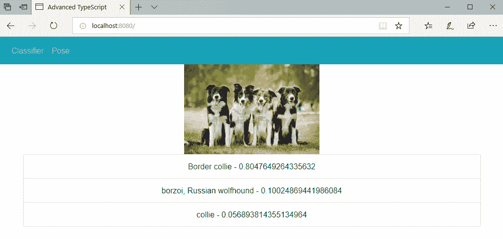
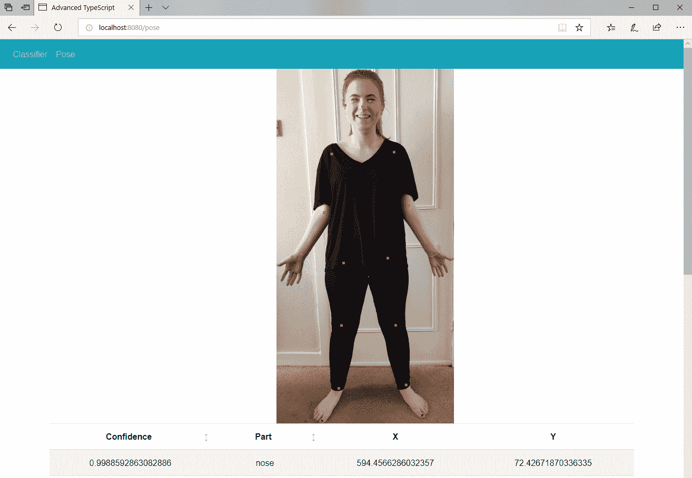
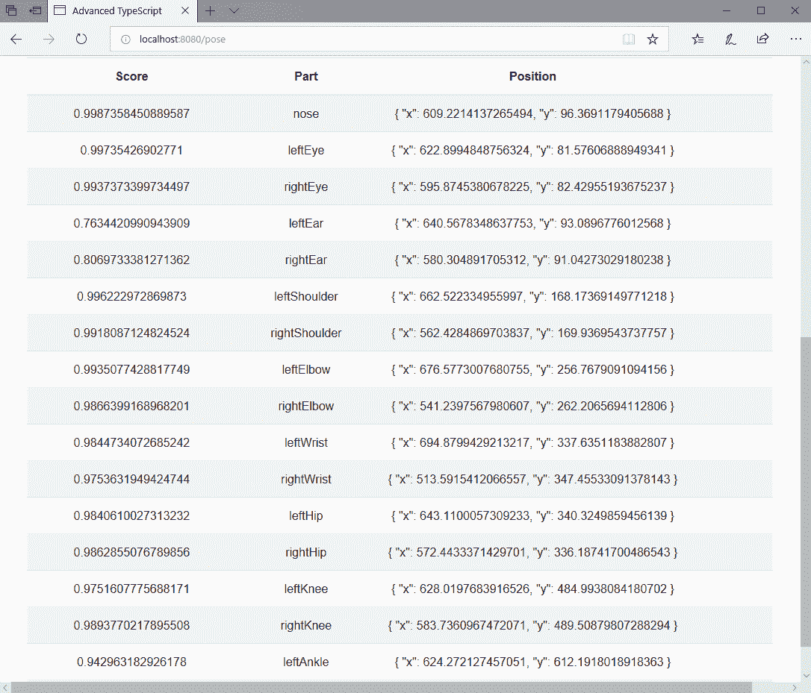
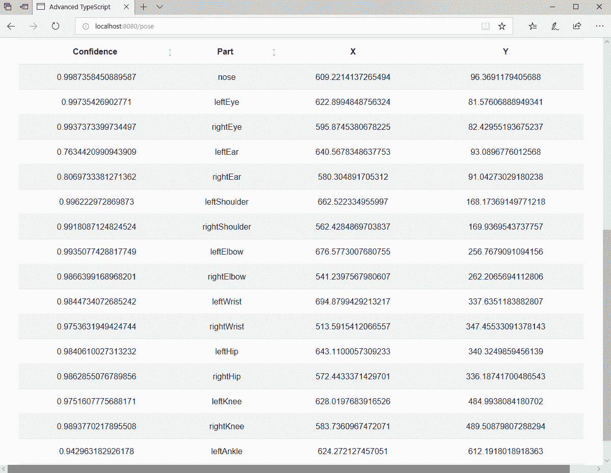

# 第九章：使用 Vue.js 和 TensorFlow.js 进行图像识别

当前计算机领域最热门的话题之一是机器学习。在本章中，我们将进入机器学习的世界，使用流行的`TensorFlow.js`包进行图像分类，以及姿势检测。作为对 Angular 和 React 的改变，我们将转向 Vue.js 来提供我们的客户端实现。

本章将涵盖以下主题：

+   机器学习是什么，以及它与人工智能的关系

+   如何安装 Vue

+   使用 Vue 创建应用程序

+   使用 Vue 模板显示主页

+   在 Vue 中使用路由

+   **卷积神经网络**（**CNNs**）是什么

+   TensorFlow 中模型的训练方式

+   使用预训练的 TensorFlow 模型构建图像分类类

+   TensorFlow 支持的图像类型，用于图像分类和姿势检测

+   使用姿势检测显示身体关节

# 技术要求

完成的项目可以从[`github.com/PacktPublishing/Advanced-TypeScript-3-Programming-Projects/tree/master/chapter09`](https://github.com/PacktPublishing/Advanced-TypeScript-3-Programming-Projects/tree/master/chapter09)下载。本项目使用 TensorFlow，因此本章将使用以下额外组件：

+   `@tensorflow-models/mobilenet`

+   `@tensorflow-models/posenet`

+   `@tensorflow/tfjs`

我们还将在 Vue 中使用 Bootstrap，因此我们需要安装以下 Bootstrap 组件：

+   `bootstrap`

+   `bootstrap-vue`

下载项目后，您将需要使用`npm install`命令安装包要求。

# 什么是机器学习，TensorFlow 如何适用？

现在很难摆脱人工智能机器的概念。人们已经习惯于使用 Siri、Alexa 和 Cortana 等工具，这些工具给人一种科技能理解我们并与我们互动的假象。这些语音激活系统使用自然语言处理来识别句子，比如“今天 Kos 的天气如何？”

这些系统背后的魔力就是机器学习。为了选择其中一个系统，我们将快速查看 Alexa 在展示之前的工作，然后再看机器学习与人工智能的关系。

当我们问 Alexa 一个问题时，*她*会认出*她*的名字，这样她就知道应该开始倾听后面的内容以开始处理。这相当于在某人的肩膀上轻拍以引起他们的注意。然后 Alexa 会记录以下句子，直到达到一个点，Alexa 可以通过互联网将录音传输到 Alexa 语音服务。这项极其复杂的服务尽其所能地解析录音（有时，重口音可能会让服务混淆）。然后服务根据解析的录音进行操作，并将结果发送回您的 Alexa 设备。

除了回答关于天气的问题，Alexa 还有大量的技能供用户使用，亚马逊鼓励开发者创建超出他们有时间想出的技能。这意味着轻松订购披萨和查看最新的赛车结果一样容易。

这个序言引导我们开始接触机器学习与 Alexa 有什么关系。Alexa 背后的软件使用机器学习不断更新自己，所以每次出错时，都会反馈回去，这样系统在下一次变得*更聪明*，并且不会在未来犯同样的错误。

正如你可以想象的那样，解释语音是一项非常复杂的任务。这是我们作为人类从小就学会的东西，与机器学习的类比令人叹为观止，因为我们也是通过重复和强化来学习语音的。因此，当一个婴儿随机说出“爸爸”时，婴儿已经学会发出这些声音，但还不知道这个声音的正确语境。通常由父母指向自己来提供的强化用于将声音与人物联系起来。当我们使用图片书时，类似的强化也会发生；当我们教婴儿“牛”的时候，我们会指向一张牛的图片。这样，婴儿就学会将这个词与图片联系起来。

由于语音解释非常复杂，它需要大量的处理能力，也需要一个庞大的预先训练的数据集。想象一下，如果我们不得不教 Alexa 一切会有多么令人沮丧。这在一定程度上解释了为什么机器学习系统现在才真正开始发挥作用。我们现在有足够的基础设施，可以将计算卸载到可靠、强大和专用的机器上。此外，我们现在有足够强大和快速的互联网来处理传输到这些机器学习系统的大量数据。如果我们仍然使用 56K 调制解调器，我们肯定无法做到现在能做到的一半。

# 什么是机器学习？

我们知道计算机擅长是或否答案，或者说 1 和 0。这意味着计算机基本上无法回答“-ish”，因此它无法对问题回答“有点是”。请稍等片刻，这很快就会变得清楚。

在其最基本的层面上，我们可以说，机器学习归结为教计算机以我们相同的方式学习。它们学会解释来自各种来源的数据，并利用这种学习对数据进行分类。机器将从成功和失败中学习，从而使其更准确和能够进行更复杂的推断。

回到计算机处理是或否答案的想法，当我们得出一个答案，相当于“嗯，这取决于”的时候，我们基本上是基于相同的输入得出多个答案——相当于通过多种途径得出是或否的答案。机器学习系统在学习方面变得越来越好，因此它们背后的算法能够利用越来越多的数据，以及越来越多的强化来建立更深层次的联系。

在幕后，机器学习应用了一系列令人难以置信的算法和统计模型，以便系统可以执行一些任务，而无需详细说明如何完成这些任务。这种推断水平远远超出了我们传统构建应用程序的方式，这是因为，鉴于正确的数学模型，计算机非常擅长发现模式。除此之外，它们同时执行大量相关任务，这意味着支持学习的数学模型可以将其计算结果作为反馈输入，以便更好地理解世界。

在这一点上，我们必须提到 AI 和机器学习并不相同。机器学习是基于自动学习的 AI 应用，而无需为处理特定任务而进行编程。机器学习的成功基于系统学习所需的足够数量的数据。可以应用一些算法类型。有些被称为无监督学习算法，而其他一些被称为监督学习算法。

无监督算法接收以前未分类或标记的数据。这些算法在这些数据集上运行，以寻找潜在或隐藏的模式，这些模式可以用来创建推断。

监督学习算法利用其先前的学习，并使用标记的示例将其应用于新数据。这些标记的示例帮助它学习正确的答案。在幕后，有一个训练数据集，学习算法用它来完善他们的知识并学习。训练数据的级别越高，算法产生正确答案的可能性就越大。

还有其他类型的算法，包括强化学习算法和半监督学习算法，但这些超出了本书的范围。

# 什么是 TensorFlow，它与机器学习有什么关系？

我们已经讨论了机器学习是什么，如果我们试图自己实现它，可能会显得非常令人生畏。幸运的是，有一些库可以帮助我们创建自己的机器学习实现。最初由 Google Brain 团队创建，TensorFlow 是这样一个旨在支持大规模机器学习和数值计算的库。最初，TensorFlow 是作为混合 Python/C++库编写的，其中 Python 提供了用于构建学习应用程序的前端 API，而 C++端执行它们。TensorFlow 汇集了许多机器学习和神经网络（有时称为**深度学习**）算法。

鉴于原始 Python 实现的成功，我们现在有了一个用 TypeScript 编写的 TensorFlow 实现（称为`TensorFlow.js`），我们可以在我们的应用程序中使用。这是我们将在本章中使用的版本。

# 项目概述

我们将在本章中编写的项目是我在为这本书写提案时最激动人心的项目。我对所有 AI 相关的事物都有长期的热爱；这个主题让我着迷。随着`TensorFlow.js`等框架的兴起（我将简称为 TensorFlow），在学术界之外进行复杂的机器学习的能力从未如此容易获得。正如我所说，这一章真的让我兴奋，所以我们不仅仅使用一个机器学习操作——我们将使用图像分类来确定图片中的内容，并使用姿势检测来绘制关键点，如人体的主要关节和主要面部标志。

与 GitHub 代码一起工作，这个主题应该需要大约一个小时才能完成，完成后应该是这样的：



现在我们知道我们要构建的项目是什么，我们准备开始实施。在下一节中，我们将开始安装 Vue。

# 在 Vue 中开始使用 TensorFlow

如果您尚未安装 Vue，则第一步是安装 Vue **命令行界面**（**CLI**）。使用以下命令使用`npm`安装：

```ts
npm install -g @vue/cli
```

# 创建基于 Vue 的应用程序

我们的 TensorFlow 应用程序将完全在客户端浏览器中运行。这意味着我们需要编写一个应用程序来托管 TensorFlow 功能。我们将使用 Vue 来提供我们的客户端，因此需要以下步骤来自动构建我们的 Vue 应用程序。

创建我们的客户端就像运行`vue create`命令一样简单，如下所示：

```ts
vue create chapter09
```

这开始了创建应用程序的过程。在进行客户端创建过程时，需要进行一些决策点，首先是选择是否接受默认设置或手动选择要添加的功能。由于我们想要添加 TypeScript 支持，我们需要选择手动选择功能预设。以下截图显示了我们将要进行的步骤，以选择我们 Vue 应用程序的功能：


我们的项目可以添加许多功能，但我们只对其中一些感兴趣，所以取消选择 Babel，选择添加 TypeScript、Router、VueX 和 Linter / Formatter。通过使用空格键来进行选择/取消选择：


当我们按下*Enter*时，将呈现出许多其他选项。按下*Enter*将为前三个选项设置默认值。当我们到达选择**linter**（缩写为**Lexical INTERpreter**）的选项时，请从列表中选择 TSLint，然后继续按*Enter*处理其他选项。linter 是一个自动解析代码的工具，寻找潜在问题。它通过查看我们的代码来检查是否违反了一组预定义的规则，这可能表明存在错误或代码样式问题。

当我们完成了整个过程，我们的客户端将被创建；这将需要一些时间来完成，因为有大量的代码需要下载和安装。


现在我们的应用程序已经创建，我们可以在客户端文件夹的根目录中运行`npm run serve`来运行它。与 Angular 和 React 不同，浏览器不会默认显示页面，所以我们需要自己打开页面，使用`http://localhost:8080`。这样做时，页面将如下所示：


当我们编写图像分类器时，我们将使生活更加轻松，因为我们将通过修改主页来展示我们的图像分类器的运行情况，从而重用 Vue CLI 为我们创建的一些现有基础设施。

# 显示带有 Vue 模板的主页

与 React 以`.jsx`/`.tsx`扩展名为我们提供将代码和网页放在一起的特殊扩展名类似，Vue 为我们提供了单文件组件，创建为`.vue`文件。这些文件允许我们将代码和网页模板混合在一起构建我们的页面。在继续创建我们的第一个 TensorFlow 组件之前，让我们打开我们的`Home.vue`页面并对其进行分析。

我们可以看到我们的`.vue`组件分为两个部分。有一个模板部分定义了将显示在屏幕上的 HTML 的布局，还有一个单独的脚本部分，我们在其中包含我们的代码。由于我们使用 TypeScript，我们的`script`部分的语言是`ts`。

脚本部分首先通过定义`import`部分开始，这与标准的`.ts`文件中看到的方式非常相似。在导入中看到`@`时，这告诉我们导入路径是相对于`src`目录的，因此`HelloWorld.vue`组件位于`src/components`文件夹中：

```ts
<script lang="ts">
import { Component, Vue } from 'vue-property-decorator';
import HelloWorld from '@/components/HelloWorld.vue';
</script>
```

接下来我们需要做的是创建一个从`Vue`类继承的类。我们使用`@Component`创建一个名为`Home`的组件注册，可以在其他地方使用：

```ts
@Component
export default class Home extends Vue {}
```

还有一件事情我们需要做。我们的模板将引用一个外部的`HelloWorld`组件。我们必须用模板将要使用的组件装饰我们的类，就像这样：

```ts
@Component({
  components: {
    HelloWorld,
  },
})
export default class Home extends Vue {}
```

模板非常简单。它由一个单一的`div`类组成，我们将在其中渲染`HelloWorld`组件：

```ts
<template>
  <div class="home">
    <HelloWorld />
  </div>
</template>
```

从前面的代码模板中，我们可以看到，与 React 不同，Vue 没有为我们提供一个明确的`render`函数来处理 HTML 和状态的渲染。相反，渲染的构建更接近于 Angular 模型，其中模板被解析为可以提供的内容。

我们提到 Angular 的原因是因为 Vue.js 最初是由 Evan You 开发的，他当时正在谷歌的 AngularJS 项目上工作；他想要创建一个性能更好的库。虽然 AngularJS 是一个很棒的框架，但它需要完全接受 Angular 生态系统才能使用（Angular 团队正在努力解决这个问题）。因此，虽然 Vue 利用了 Angular 的特性，比如模板，但它的影响力很小，你只需在现有代码中添加一个脚本标签，然后慢慢将现有代码迁移到 Angular。

Vue 从 React 中借鉴了一些概念，比如使用虚拟 DOM（我们在介绍 React 时讨论过）。Vue 也使用虚拟 DOM，但以稍微不同的方式实现，主要是 Vue 只重新渲染有变化的组件，而 React 默认情况下也会重新渲染子组件。

现在我们要修改`HelloWorld`组件，以便与 TensorFlow 一起使用。但在这之前，我们需要编写一些支持类来处理 TensorFlow 的重要工作。这些类在代码量上并不大，但非常重要。我们的`ImageClassifier`类以标准的类定义开始，如下所示：

```ts
export class ImageClassifier {
}
```

下一步是可选的，但如果应用程序在 Windows 客户端上运行，它对应用程序的稳定性有重大影响。在底层，TensorFlow 使用 WebGLTextures，但在 Windows 平台上创建 WebGLTextures 存在问题。为了解决这个问题，我们的构造函数需要修改如下：

```ts
constructor() {
  tf.ENV.set('WEBGL_PACK', false);
}
```

由于我们可以运行图像分类任意次数，我们将添加一个表示标准`MobileNet` TensorFlow 的私有变量：

```ts
private model: MobileNet | null = null;
```

# MobileNet 介绍

此时，我们需要稍微了解一下 CNN 的世界。`MobileNet`是一个 CNN 模型，因此稍微了解 CNN 是如何帮助我们理解它与我们解决的问题有关。不用担心，我们不会深入研究 CNN 背后的数学，但了解一点它们的工作原理将有助于我们欣赏它们为我们带来了什么。

CNN 分类器通过接收输入图像（可能来自视频流），处理图像，并将其分类到预定义的类别中。为了理解它们的工作原理，我们需要退后一步，从计算机的角度思考问题。假设我们有一张马的照片。对于计算机来说，那张照片只是一系列像素，所以如果我们展示一张稍微不同的马的照片，计算机无法仅通过比较像素来判断它们是否匹配。

CNN 将图像分解成片段（比如 3x3 像素的网格），并比较这些片段。简单地说，它寻找的是这些片段能够匹配的数量。匹配的数量越多，我们就越有信心有一个匹配。这是对 CNN 的一个非常简化的描述，它涉及多个步骤和滤波器，但它应该有助于理解为什么我们想要在 TensorFlow 中使用`MobileNet`这样的 CNN。

`MobileNet`是一个专门的 CNN，除其他功能外，它为我们提供了针对 ImageNet 数据库中的图像进行训练的图像分类（[`www.image-net.org/`](http://www.image-net.org/)）。当我们加载模型时，我们加载的是一个为我们创建的预训练模型。我们使用预训练网络的原因是它已经在服务器上的大型数据集上进行了训练。我们不希望在浏览器中运行图像分类训练，因为这将需要从服务器到浏览器传输太多负载以执行训练。因此，无论您的客户端 PC 有多强大，复制训练数据集都会太多。

我们提到了`MobileNetV1`和`MobileNetV2`，但没有详细介绍它们是什么以及它们是在什么数据集上训练的。基本上，`MobileNet`模型是由谷歌开发的，并在 ImageNet 数据集上进行了训练，该数据集包含了 140 万张图像，分为 1000 类图像。之所以称这些模型为`MobileNet`模型，是因为它们是针对移动设备进行训练的，因此它们被设计为在低功耗和/或低存储设备上运行。

使用预训练模型，我们可以直接使用它，或者我们可以自定义它以用于迁移学习。

# 分类方法

现在我们对 CNN 有了一点了解，我们准备将这些知识付诸实践。我们将创建一个异步分类方法。当 TensorFlow 需要检测图像时，它可以使用多种格式，因此我们将概括我们的方法，只接受适当的类型：

```ts
public async Classify(image: tf.Tensor3D | ImageData | HTMLImageElement | 
HTMLCanvasElement | HTMLVideoElement):   Promise<TensorInformation[] | null> {
}
```

这些类型中只有一个是特定于 TensorFlow 的——`Tensor3D`类型。所有其他类型都是标准的 DOM 类型，因此可以在网页中轻松消耗，而无需跳过许多环节将图像转换为适当的格式。

我们还没有介绍我们的`TensorInformation`接口。当我们从`MobileNet`接收分类时，我们会收到一个分类名称和一个分类的置信水平。这作为`Promise<Array<[string, number]>>`从分类操作返回，因此我们将其转换为对我们的消费代码更有意义的东西：

```ts
export interface TensorInformation {
  className: string;
  probability: number; }
```

现在我们知道我们将返回一个分类数组和一个概率（置信水平）。回到我们的`Classify`方法，如果以前没有加载`MobileNet`，我们需要加载它。这个操作可能需要一段时间，这就是为什么我们对它进行缓存，这样我们下次调用这个方法时就不必重新加载它了：

```ts
if (!this.model) {   this.model = await mobilenet.load();  }
```

我们已经接受了`load`操作的默认设置。如果需要，我们可以提供一些选项：

+   `version`：这设置了`MobileNet`的版本号，默认为 1。现在，可以设置两个值：`1`表示我们使用`MobileNetV1`，`2`表示我们使用`MobileNetV2`。对我们来说，版本之间的区别实际上与模型的准确性和性能有关。

+   `alpha`：这可以设置为`0.25`、`0.5`、`0.75`或`1`。令人惊讶的是，这与图像上的`alpha`通道无关。相反，它指的是将要使用的网络宽度，有效地以性能换取准确性。数字越高，准确性越高。相反，数字越高，性能越慢。`alpha`的默认值为`1`。

+   `modelUrl`：如果我们想要使用自定义模型，我们可以在这里提供。

如果模型成功加载，那么我们现在可以执行图像分类。这是对`classify`方法的直接调用，传入我们方法中传递的`image`。完成此操作后，我们返回分类结果的数组：

```ts
if (this.model) {   const result = await this.model.classify(image);   return {   ...result,  };  }
```

`model.classify`方法默认返回三个分类，但如果需要，我们可以传递参数返回不同数量的分类。如果我们想要检索前五个结果，我们将更改`model.classify`行如下：

```ts
const result = await this.model.classify(image, 5);
```

最后，如果模型加载失败，我们将返回`null`。有了这个设置，我们完成的`Classify`方法如下所示：

```ts
public async Classify(image: tf.Tensor3D | ImageData | HTMLImageElement | 
HTMLCanvasElement | HTMLVideoElement):   Promise<TensorInformation[] | null> {   if (!this.model) {   this.model = await mobilenet.load();  }   if (this.model) {   const result = await this.model.classify(image);   return {   ...result,  };  }   return null;  }
```

TensorFlow 确实可以如此简单。显然，在幕后，隐藏了大量的复杂性，但这就是设计良好的库的美妙之处。它们应该保护我们免受复杂性的影响，同时为我们留出空间，以便在需要时进行更复杂的操作和定制。

这样，我们的图像分类组件就写好了。但是我们如何在 Vue 应用程序中使用它呢？在下一节中，我们将看到如何修改`HelloWorld`组件以使用这个类。

# 修改 HelloWorld 组件以支持图像分类

当我们创建 Vue 应用程序时，CLI 会为我们创建一个`HelloWorld.vue`文件，其中包含`HelloWorld`组件。我们将利用我们已经有这个组件的事实，并将其用于对预加载图像进行分类。如果我们愿意，我们可以使用它来使用文件上传组件加载图像，并在更改时驱动分类。

现在，让我们看看我们的`HelloWorld` TypeScript 代码是什么样子的。显然，我们将从类定义开始。就像我们之前看到的那样，我们已经用`@Component`装饰器标记了这个组件：

```ts
@Component export default class HelloWorld extends Vue {
}
```

我们有两个成员变量要在我们的类中声明。我们知道我们想要使用刚刚编写的`ImageClassifier`类，所以我们会引入它。我们还想创建一个`TensorInformation`结果数组，原因是我们将不得不在操作完成时绑定到它：

```ts
private readonly classifier: ImageClassifier = new ImageClassifier();  private tensors : TensorInformation[] | null = null;
```

在我们完成编写我们的类之前，我们需要看一下我们的模板会是什么样子。我们从`template`定义开始：

```ts
<template>
 <div class="container">
 </div> </template>
```

正如我们所看到的，我们正在使用 Bootstrap，所以我们将使用一个`div`容器来布置我们的内容。我们要添加到容器中的第一件事是一个图像。我选择在这里使用一组边境牧羊犬的图像，主要是因为我是狗的粉丝。为了我们能够在 TensorFlow 中读取这个图像，我们需要将`crossorigin`设置为`anonymous`。在这一部分中特别注意`ref="dogId"`，因为我们很快会再次需要它：

```ts

```

在图像之后，我们将进一步添加 Bootstrap 支持，使用`row`和`col`类：

```ts
<div class="row">  <div class="col">  </div>  </div>
```

在这一行内，我们将创建一个 Bootstrap 列表。我们看到 Vue 有自己的 Bootstrap 支持，所以我们将使用它的版本来支持列表，即`b-list-group`：

```ts
<b-list-group>  </b-list-group>
```

现在，我们终于到了模板的实质部分。我们在类中公开张量数组的原因是为了在数组被填充时能够迭代每个结果。在下面的代码中，我们使用`v-for`动态创建了`b-list-group-item`的数量，以自动迭代每个张量项。这创建了`b-list-group-item`条目，但我们仍然需要显示单独的`className`和`probability`项。使用 Vue，我们使用`{{ <<item>> }}`来绑定文本项，比如这样：

```ts
<b-list-group-item v-for="tensor in tensors" v-bind:key="tensor.className">   {{ tensor.className }} - {{ tensor.probability }}
</b-list-group-item>
```

我们之所以在`v-for`旁边添加了`v-bind:key`，是因为 Vue 默认提供了所谓的**原地修补**。这意味着 Vue 使用这个键作为提示，以唯一地跟踪该项，以便在更改时保持值的最新状态。

就是这样；我们的模板完成了。正如我们所看到的，以下是一个简单的模板，但其中有很多内容。我们有一个 Bootstrap 容器显示一个图像，然后让 Vue 动态绑定`tensor`的细节：

```ts
<template>
 <div class="container">
 
 <div class="row">
 <div class="col">
 <b-list-group>
 <b-list-group-item v-for="tensor in tensors" 
              v-bind:key="tensor.className">
  {{ tensor.className }} - {{ tensor.probability }}
          </b-list-group-item>
 </b-list-group>
 </div>
 </div>
 </div> </template>
```

回到我们的 TypeScript 代码，我们将编写一个方法，该方法获取图像，然后使用它调用我们的`ImageClassifier.Classify`方法：

```ts
public Classify(): void {
}
```

由于我们正在将图像加载到客户端上，我们必须等待页面呈现图像，以便我们可以检索它。我们将从构造函数中调用我们的`Classify`方法，因此在页面创建时运行，我们需要使用一个小技巧来等待图像加载。具体来说，我们将使用一个名为`nextTick`的 Vue 函数。重要的是要理解 DOM 的更新是异步发生的。当值发生变化时，更改不会立即呈现。相反，Vue 请求 DOM 更新，然后由计时器触发。因此，通过使用`nextTick`，我们等待下一个 DOM 更新时刻并执行相关操作：

```ts
public Classify(): void {   this.$nextTick().then(async () => {  });  }
```

我们在`then`块内标记`async`函数的原因是，我们将在此部分执行等待，这意味着我们也必须将其作为`async`范围。

在模板中，我们使用`ref`语句定义了我们的图像，因为我们希望从类内部访问它。为此，我们在这里查询 Vue 为我们维护的`ref`语句映射，由于我们已经设置了自己的引用为`dogId`，我们现在可以访问图像。这个技巧使我们不必使用`getElementById`来检索我们的 HTML 元素。

```ts
/* tslint:disable:no-string-literal */  const dog = this.$refs['dogId'];  /* tslint:enable:no-string-literal */
```

在构建 Vue 应用程序时，CLI 会自动为我们设置 TSLint 规则。其中一个规则涉及通过字符串字面量访问元素。我们可以使用`tslint:disable:no-string-literal`临时禁用该规则。要重新启用该规则，我们使用`tslint:enable:no-string-literal`。还有一种禁用此规则的替代方法是在单行上使用`/* tslint:disable-next-line:no-string-literal */`。您采取的方法并不重要；重要的是最终结果。

一旦我们有了对狗图片的引用，我们现在可以将图像转换为`HTMLImageElement`，并在`ImageClassifier`类中的`Classify`方法调用中使用它：

```ts
if (dog !== null && !this.tensors) {   const image = dog as HTMLImageElement;   this.tensors = await this.classifier.Classify(image);  }
```

当`Classify`调用返回时，只要模型已加载并成功找到分类，它将通过绑定的力量填充我们的屏幕列表。

在我们的示例中，我尽量保持我们的代码库尽可能干净和简单。代码已分离为单独的类，以便我们可以创建小而强大的功能块。要了解为什么我喜欢这样做，这是我们的`HelloWorld`代码的样子：

```ts
@Component export default class HelloWorld extends Vue {
  private readonly classifier: ImageClassifier = new ImageClassifier();
  private tensors: TensorInformation[] | null = null;    constructor() {
  super();
  this.Classify();
 }  public Classify(): void {
  this.$nextTick().then(async () => {
  /* tslint:disable:no-string-literal */
  const dog = this.$refs['dogId'];
  /* tslint:enable:no-string-literal */
  if (dog !== null && !this.tensors) {
  const image = dog as HTMLImageElement;
  this.tensors = await this.classifier.Classify(image);
 } }); } }
```

总共，包括`tslint`格式化程序和空格，这段代码只有 20 行。我们的`ImageClassifier`类只有 22 行，这是一个可以在其他地方使用而无需修改的`ImageClassifier`类。通过保持类简单，我们减少了它们可能出错的方式，并增加了重用它们的机会。更重要的是，我们遵循了名为**保持简单，愚蠢**（**KISS**）原则，该原则指出系统在本质上尽可能简单时效果最好。

现在我们已经看到图像分类的实际操作，我们可以考虑将姿势检测添加到我们的应用程序中。在这样做之前，我们需要看一下其他一些对我们重要的 Vue 领域。

# Vue 应用程序入口点

我们还没有涉及的是 Vue 应用程序的入口点是什么。我们已经看到了`Home.vue`页面，但那只是一个在其他地方呈现的组件。我们需要退一步，看看我们的 Vue 应用程序实际上是如何处理加载自身并显示相关组件的。在这个过程中，我们还将涉及 Vue 中的路由，以便我们可以看到所有这些是如何联系在一起的。

我们的起点位于`public`文件夹内。在那里，我们有一个`index.html`文件，我们可以将其视为应用程序的主模板。这是一个相当标准的 HTML 文件-我们可能希望给它一个更合适的`title`（在这里，我们选择`Advanced TypeScript - Machine Learning`）：

```ts
<!DOCTYPE html> <html lang="en">
 <head>
 <meta charset="utf-8">
 <meta http-equiv="X-UA-Compatible" content="IE=edge">
 <meta name="viewport" content="width=device-width,
      initial-scale=1.0">
 <link rel="icon" href="<%= BASE_URL %>favicon.ico">
 <title>Advanced TypeScript - Machine Learning</title>
 </head>
 <body>
 <noscript>
 <strong>We're sorry but chapter09 doesn't work properly without 
        JavaScript enabled. Please enable it to continue.</strong>
 </noscript>
 <div id="app"></div>
  <!-- built files will be auto injected -->
  </body> </html>
```

这里的重要元素是`div`，其`id`属性设置为`app`。这是我们将要呈现组件的元素。我们控制这个的方式是从`main.ts`文件中进行的。让我们首先通过添加 Bootstrap 支持来添加 Bootstrap 支持，既通过添加 Bootstrap CSS 文件，又通过使用`Vue.use`注册`BootstrapVue`插件：

```ts
import 'bootstrap/dist/css/bootstrap.css'; import 'bootstrap-vue/dist/bootstrap-vue.css';  Vue.use(BootstrapVue); 
```

尽管我们已经有了 Bootstrap 支持，但我们没有任何东西将我们的组件连接到`app div`。我们添加此支持的原因是创建一个新的 Vue 应用程序。这接受一个路由器，一个用于包含 Vue 状态和突变等内容的 Vue 存储库，以及一个`render`函数，在呈现组件时调用。传递给我们的`render`方法的`App`组件是我们将用于呈现所有其他组件的顶级`App`组件。当 Vue 应用程序创建完成时，它被挂载到`index.html`中的`app` div 中：

```ts
new Vue({
  router,
  store,
  render: (h) => h(App), }).$mount('#app'); 
```

我们的`App.vue`模板由两个独立的区域组成。在添加这些区域之前，让我们定义`template`元素和包含的`div`标签：

```ts
<template>
 <div id="app">
  </div>
</template>
```

在这个`div`标签中，我们将添加我们的第一个逻辑部分——我们的老朋友，导航栏。由于这些来自 Vue Bootstrap 实现，它们都以`b-`为前缀，但现在不需要解剖它们，因为到这一点它们应该非常熟悉：

```ts
<b-navbar toggleable="lg" type="dark" variant="info">  <b-collapse id="nav-collapse" is-nav>  <b-navbar-nav>  <b-nav-item to="/">Classifier</b-nav-item>  <b-nav-item to="/pose">Pose</b-nav-item>  </b-navbar-nav>  </b-collapse>  </b-navbar>
```

用户导航到页面时，我们需要显示适当的组件。在幕后，显示的组件由 Vue 路由器控制，但我们需要一个地方来显示它。这是通过在我们的导航栏下方使用以下标签来实现的：

```ts
<router-view/>
```

这是我们的`App`模板完成后的样子。正如我们所看到的，如果我们想要路由到其他页面，我们需要将单独的`b-nav-item`条目添加到此列表中。如果我们愿意，我们可以使用`v-for`以类似的方式动态创建这个导航列表，就像我们在构建图像分类器视图时看到的那样：

```ts
<template>
 <div id="app">
 <b-navbar toggleable="lg" type="dark" variant="info">
 <b-collapse id="nav-collapse" is-nav>
 <b-navbar-nav>
 <b-nav-item to="/">Classifier</b-nav-item>
 <b-nav-item to="/pose">Pose</b-nav-item>
 </b-navbar-nav>
 </b-collapse>
 </b-navbar>
 <router-view/>
 </div> </template>
```

当我们开始研究路由时，可能会认为将路由添加到我们的应用程序是一件非常复杂的事情。到现在为止，你应该对路由更加熟悉了，而且不会感到惊讶，因为在 Vue 中添加路由支持是直接而简单的。我们首先通过以下命令在 Vue 中注册`Router`插件：

```ts
Vue.use(Router);
```

有了这个，我们现在准备构建路由支持。我们导出一个`Router`的实例，可以在我们的`new Vue`调用中使用：

```ts
export default new Router({ });
```

现在我们需要添加我们的路由选项。我们要设置的第一个选项是路由模式。我们将使用 HTML5 `history` API 来管理我们的链接：

```ts
mode: 'history',
```

我们可以使用 URL 哈希进行路由。这在 Vue 支持的所有浏览器中都可以工作，并且如果 HTML5 `history` API 不可用，则是一个不错的选择。或者，还有一种抽象的路由模式，可以在包括 Node 在内的所有 JavaScript 环境中工作。如果浏览器 API 不存在，无论我们将模式设置为什么，路由器都将自动强制使用这个模式。

我们想要使用`history` API 的原因是它允许我们修改 URL 而不触发整个页面的刷新。由于我们知道我们只想替换组件，而不是替换整个`index.html`页面，我们最终利用这个 API 只重新加载页面的组件部分，而不进行整个页面的重新加载。

我们还想设置应用程序的基本 URL。如果我们想要覆盖此位置以从`deploy`文件夹中提供所有内容，那么我们将其设置为`/deploy/`：

```ts
base: process.env.BASE_URL,
```

虽然设置路由模式和基本 URL 都很好，但我们错过了重要的部分——设置路由本身。每个路由至少包含一个路径和一个组件。路径与 URL 中的路径相关联，组件标识将作为该路径结果显示的组件。我们的路由看起来像这样：

```ts
routes: [  {   path: '/',   name: 'home',   component: Home,  },  {   path: '/pose',   name: 'Pose',   component: Pose,  }, {
    path: '*',
    component: Home,
  } ],
```

我们的路由中有一个特殊的路径匹配。如果用户输入一个不存在的 URL，那么我们使用`*`来捕获它，并将其重定向到特定的组件。我们必须将其放在最后一个条目，否则它将优先于精确匹配。敏锐的读者会注意到，严格来说，我们不需要第一个路径，因为我们的路由仍然会显示`Home`组件，因为我们的`*`回退。

我们在路由中添加了一个指向尚不存在的组件的引用。现在我们将通过添加`Pose`组件来解决这个问题。

# 添加姿势检测功能

在开始处理姿势检测之前，我们将添加一个组件，该组件将承载相关功能。由于这是我们第一个*从头开始*的组件，我们也将从头开始介绍它。在我们的`views`文件夹中，创建一个名为`Pose.vue`的文件。这个文件将包含三个逻辑元素，所以我们将首先添加这些元素，并设置我们的模板以使用 Bootstrap：

```ts
<template>
  <div class="container">
  </div>
</template>
<script lang="ts">
</script>
<style scoped>
</style>
```

到目前为止，我们还没有看过的是`style`部分。作用域样式允许我们应用仅适用于当前组件的样式。我们很快将应用本地样式，但首先，我们需要设置要显示的图像。

对于我们的示例代码，我选择了一张宽 1200 像素，高 675 像素的图片。这些信息很重要，因为当我们进行姿势检测时，我们将在图像上绘制这些点，这意味着我们需要进行一些样式安排，以便在图像上放置一个画布，我们可以在上面绘制与图像上的位置匹配的点。我们首先使用两个容器来容纳我们的图像：

```ts
<div class="outsideWrapper">  <div class="insideWrapper">  </div>
</div>
```

我们现在要在我们的样式作用域部分添加一些 CSS 来固定尺寸。我们首先设置外部包装器的尺寸，然后相对于外部包装器定位我们的内部包装器，并将宽度和高度设置为 100%，以便它们完全填充边界：

```ts
.outsideWrapper{   width:1200px; height:675px;  }  .insideWrapper{   width:100%; height:100%;   position:relative;  }
```

回到`insideWrapper`，我们需要在其中添加我们的图像。我选择的示例图像是一个中性姿势，显示了关键身体点。我们的图像标签的格式应该看起来很熟悉，因为我们已经用图像分类代码做过这个：

```ts

```

在相同的`insideWrapper` `div`标签中，就在我们的图像下面，我们需要添加一个画布。当我们想要绘制关键身体点时，我们将使用这个画布。关键是画布的宽度和高度与容器的尺寸完全匹配：

```ts
<canvas ref="posecanvas" id="canvas" class="coveringCanvas" width=1200 height=675></canvas>
```

在这一点上，我们的`template`看起来像这样：

```ts
<template>
 <div class="container">
 <div class="outsideWrapper">
 <div class="insideWrapper">
 
 <canvas ref="posecanvas" id="canvas" 
          class="coveringCanvas" width="1200" height="675"></canvas>
 </div>
 </div>
 </div> </template> 
```

我们已经为图像和画布添加了类，但我们还没有添加它们的定义。我们可以使用一个类来覆盖两者，但我对我们分别设置宽度和高度为 100%的类感到满意，并将它们绝对定位在容器内部：

```ts
.coveredImage{   width:100%; height:100%;   position:absolute; 
  top:0px; 
  left:0px;  }  .coveringCanvas{   width:100%; height:100%;   position:absolute; 
  top:0px; left:0px;  }
```

我们完成后，样式部分将如下所示：

```ts
<style scoped>
 .outsideWrapper{
  width:1200px; height:675px;
 } .insideWrapper{
  width:100%; height:100%;
  position:relative;
 } .coveredImage{
  width:100%; height:100%;
  position:absolute; 
 top:0px; 
 left:0px;
 } .coveringCanvas{
  width:100%; height:100%;
  position:absolute; 
 top:0px; 
 left:0px;
 } </style> 
```

在这一点上，我们需要编写一些辅助类——一个用于进行姿势检测，另一个用于在图像上绘制点。

# 在画布上绘制关键点

每当我们检测到一个姿势，我们都会得到一些关键点。每个关键点由位置（*x*和*y*坐标）、分数（或置信度）和关键点表示的实际部分组成。我们希望循环遍历这些点并在画布上绘制它们。

一如既往，让我们从我们的课程定义开始：

```ts
export class DrawPose { }
```

我们只需要获取一次画布元素，因为它不会改变。这表明我们可以将这个作为我们的画布，因为我们对画布的二维元素感兴趣，我们可以直接从画布中提取绘图上下文。有了这个上下文，我们清除画布上以前绘制的任何元素，并将`fillStyle`颜色设置为`#ff0300`，我们将用它来填充我们的姿势点：

```ts
constructor(private canvas: HTMLCanvasElement, private context = canvas.getContext('2d')) {   this.context!.clearRect(0, 0, this.canvas.offsetWidth, this.canvas.offsetHeight);   this.context!.fillStyle = '#ff0300';  }
```

为了绘制我们的关键点，我们编写一个方法，循环遍历每个`Keypoint`实例，并调用`fillRect`来绘制点。矩形从*x*和*y*坐标偏移 2.5 像素，以便绘制一个 5 像素的矩形实际上是在点的大致中心绘制一个矩形：

```ts
public Draw(keys: Keypoint[]): void {   keys.forEach((kp: Keypoint) => {   this.context!.fillRect(kp.position.x - 2.5, 
                           kp.position.y - 2.5, 5, 5);  });  }
```

完成后，我们的`DrawPose`类如下所示：

```ts
export class DrawPose {
  constructor(private canvas: HTMLCanvasElement, private context = 
    canvas.getContext('2d')) {
  this.context!.clearRect(0, 0, this.canvas.offsetWidth, 
        this.canvas.offsetHeight);
  this.context!.fillStyle = '#ff0300';
 }    public Draw(keys: Keypoint[]): void {
  keys.forEach((kp: Keypoint) => {
  this.context!.fillRect(kp.position.x - 2.5, 
                             kp.position.y - 2.5, 5, 5);
 }); } }
```

# 在图像上使用姿势检测

之前，我们创建了一个`ImageClassifier`类来执行图像分类。为了保持这个类的精神，我们现在要编写一个`PoseClassifier`类来管理物理姿势检测：

```ts
export class PoseClassifier {
}
```

我们将为我们的类设置两个私有成员。模型是一个`PoseNet`模型，在调用相关的加载方法时将被填充。`DrawPose`是我们刚刚定义的类：

```ts
private model: PoseNet | null = null;  private drawPose: DrawPose | null = null;
```

在我们进一步进行姿势检测代码之前，我们应该开始了解姿势检测是什么，它适用于什么，以及一些约束是什么。

# 关于姿势检测的简要说明

我们在这里使用术语**姿势检测**，但这也被称为**姿势估计**。如果你还没有接触过姿势估计，这简单地指的是计算机视觉操作，其中检测到人物形象，无论是从图像还是视频中。一旦人物被检测到，模型就能大致确定关键关节和身体部位（如左耳）的位置。

姿势检测的增长速度很快，它有一些明显的用途。例如，我们可以使用姿势检测来进行动作捕捉以制作动画；工作室越来越多地转向动作捕捉，以捕捉现场表演并将其转换为 3D 图像。另一个用途在体育领域；事实上，体育运动有许多潜在的动作捕捉用途。假设你是一支大联盟棒球队的投手。姿势检测可以用来确定在释放球时你的站姿是否正确；也许你倾斜得太远，或者你的肘部位置不正确。有了姿势检测，教练们更容易与球员合作纠正潜在问题。

在这一点上，值得注意的是，姿势检测并不等同于人物识别。我知道这似乎很明显，但有些人被这项技术所困惑，以为这种技术可以识别一个人是谁。那是完全不同的机器学习形式。

# PoseNet 是如何工作的？

即使使用基于摄像头的输入，执行姿势检测的过程也不会改变。我们从输入图像开始（视频的一个静止画面就足够了）。图像通过 CNN 进行第一部分处理，识别场景中人物的位置。下一步是将 CNN 的输出传递给姿势解码算法（我们稍后会回到这一点），并使用它来解码姿势。

我们之所以说*姿势解码算法*是为了掩盖我们实际上有两个解码算法的事实。我们可以检测单个姿势，或者如果有多个人，我们可以检测多个姿势。

我们选择了单姿势算法，因为它是更简单和更快的算法。如果图片中有多个人，算法有可能将不同人的关键点合并在一起；因此，遮挡等因素可能导致算法将人 2 的右肩检测为人 1 的左肘。在下面的图片中，我们可以看到右侧女孩的肘部遮挡了中间人的左肘：


遮挡是指图像的一部分遮挡了另一部分。

`PoseNet`检测到的关键点如下：

+   鼻子

+   左眼

+   右眼

+   左耳

+   右耳

+   左肩

+   右肩

+   左肘

+   右肘

+   左腕

+   右腕

+   左臀

+   右臀

+   左膝

+   右膝

+   左踝

+   右踝

我们可以看到它们在我们的应用程序中的位置。当它完成检测点时，我们会得到一组图像叠加，如下所示：



# 回到我们的姿势检测代码

回到我们的`PoseClassifier`类，我们的构造函数处理了与我们的`ImageClassifier`实现讨论过的完全相同的 WebGLTexture 问题：

```ts
constructor() {   // If running on Windows, there can be issues 
  // loading WebGL textures properly.  // Running the following command solves this.   tf.ENV.set('WEBGL_PACK', false);  }
```

我们现在要编写一个异步的`Pose`方法，它会返回一个`Keypoint`项的数组，或者如果`PoseNet`模型加载失败或找不到任何姿势，则返回`null`。除了接受图像，这个方法还将接受提供上下文的画布，我们将在上面绘制我们的点：

```ts
public async Pose(image: HTMLImageElement, canvas: HTMLCanvasElement): Promise<Keypoint[] | null> {   return null;  }
```

就像`ImageClassifier`检索`MobileNet`模型一样，我们将检索`PoseNet`模型并对其进行缓存。我们将利用这个机会来实例化`DrawPose`实例。执行这样的逻辑是为了确保这是我们只做一次的事情，无论我们调用这个方法多少次。一旦模型不为空，代码就会阻止我们尝试再次加载`PoseNet`：

```ts
if (!this.model) {   this.model = await posenet.load();   this.drawPose = new DrawPose(canvas);  }
```

当我们加载模型时，我们可以提供以下选项：

+   **Multiplier**：这是所有卷积操作的通道数（深度）的浮点乘数。可以选择 1.01、1.0、0.75 或 0.50。这里有速度和准确性的权衡，较大的值更准确。

最后，如果模型成功加载，我们将使用我们的图像调用`estimateSinglePose`来检索`Pose`预测，其中还包含我们将绘制的`keypoints`：

```ts
if (this.model) {   const result: Pose = await this.model.estimateSinglePose(image);   if (result) {   this.drawPose!.Draw(result.keypoints);   return result.keypoints;  }  }
```

再次将所有这些放在一起，以展示我们不必写大量代码来完成所有这些工作，以及将代码分离成小的、自包含的逻辑块，使我们的代码更容易理解，也更容易编写。这是完整的`PoseClassifier`类：

```ts
export class PoseClassifier {
  private model: PoseNet | null = null;
  private drawPose: DrawPose | null = null;
  constructor() {
  // If running on Windows, there can be 
    // issues loading WebGL textures properly.
 // Running the following command solves this.  tf.ENV.set('WEBGL_PACK', false);
 }    public async Pose(image: HTMLImageElement, canvas: 
    HTMLCanvasElement): Promise<Keypoint[] | null> {
  if (!this.model) {
  this.model = await posenet.load();
  this.drawPose = new DrawPose(canvas);
 }    if (this.model) {
  const result: Pose = await 
             this.model.estimateSinglePose(image);
  if (result) {
  this.drawPose!.Draw(result.keypoints);
  return result.keypoints;
 } }  return null;
 } }
```

# 完成我们的姿势检测组件

回到我们的`Pose.vue`组件，现在我们需要填写`script`部分。我们需要以下`import`语句和组件的类定义（记住我承诺过我们会从头开始构建这个类）。同样，我们可以看到使用`@Component`来给我们一个组件注册。我们在 Vue 组件中一次又一次地看到这一点：

```ts
import { Component, Vue } from 'vue-property-decorator';  import {PoseClassifier} from '@/Models/PoseClassifier';  import {Keypoint} from '@tensorflow-models/posenet';  @Component  export default class Pose extends Vue {
}
```

我们已经到了可以编写我们的`Classify`方法的地步，当图像和画布被创建时，它将检索图像和画布，并将其传递给`PoseClassifier`类。我们需要一些私有字段来保存`PoseClassifier`实例和返回的`Keypoint`数组：

```ts
private readonly classifier: PoseClassifier = new PoseClassifier();  private keypoints: Keypoint[] | null;
```

在我们的`Classify`代码中，我们将使用相同的生命周期技巧，在检索名为`poseId`的图像引用和名为`posecanvas`的画布之前等待`nextTick`：

```ts
public Classify(): void {   this.$nextTick().then(async () => {   /* tslint:disable:no-string-literal */   const pose = this.$refs['poseId'];   const poseCanvas = this.$refs['posecanvas'];   /* tslint:enable:no-string-literal */  });  }
```

一旦我们有了图像引用，我们将它们转换为适当的`HTMLImageElement`和`HTMLCanvasElement`类型，然后调用`Pose`方法，并用结果值填充我们的`keypoints`成员：

```ts
if (pose !== null) {   const image: HTMLImageElement = pose as HTMLImageElement;   const canvas: HTMLCanvasElement = poseCanvas as HTMLCanvasElement   this.keypoints = await this.classifier.Pose(image, canvas);  }
```

在这一点上，我们可以运行应用程序。看到`keypoints`结果叠加在图像上非常令人满意，但我们可以做得更多。只需稍加努力，我们就可以在 Bootstrap 表格中显示`keypoints`结果。返回到我们的模板，并添加以下`div`语句以在图像下方添加 Bootstrap 行和列：

```ts
<div class="row">  <div class="col">  </div>  </div>
```

由于我们已经暴露了`keypoints`结果，我们可以简单地使用`b-table`创建一个 Vue Bootstrap 表格。我们使用`:items`将绑定设置为我们在类中定义的`keypoints`结果。这意味着每当`keypoints`条目获得新值时，表格将更新以显示这些值。

```ts
<b-table striped hover :items="keypoints"></b-table>
```

刷新我们的应用程序会在图像下方添加表格，表格如下所示：



虽然这是一个合理的开始，但如果我们能更多地控制表格就更好了。目前，`b-table`自动捕捉并格式化字段。通过小小的改变，我们可以将`Position`实例分离为两个单独的条目，并使`Score`和`Part`字段可排序。

在我们的`Pose`类中，我们将创建一个`fields`条目。`fields`条目将分数条目映射到`Confidence`标签，并将其设置为`sortable`。`part`字段映射到`Part`的`label`值，并且也设置为`sortable`。我们将`position`分为两个单独的映射条目，分别标记为`X`和`Y`：

```ts
private fields =  {'score':  { label: 'Confidence', sortable: true},   'part':  { label: 'Part', sortable: true},   'position.x':  {label:'X'},   'position.y': {label: 'Y'}};
```

我们需要做的最后一件事是将`fields`输入连接到`b-table`。我们可以使用`:fields`属性来实现这一点，就像这样：

```ts
<b-table striped hover :items="keypoints" :fields="fields"></b-table>
```

刷新我们的应用程序会显示这些微小更改的效果。这是一个更具吸引力的屏幕，用户可以轻松地对`Confidence`（原名`score`）和`Part`字段进行排序，这显示了 Vue 的强大之处：



就是这样——我们已经介绍了 TensorFlow 和 Vue。我们避开了 CNN 背后的数学方面，因为尽管乍一看可能令人生畏，但实际上并没有那么糟糕，但典型的 CNN 有很多部分。Vue 还有很多功能可以使用；对于一个如此小的库来说，它非常强大，这种小巧和强大的组合是它变得越来越受欢迎的原因之一。

# 总结

在本章中，我们迈出了使用流行的`TensorFlow.js`库编写机器学习应用程序的第一步。除了了解机器学习是什么，我们还看到了它如何适用于人工智能领域。虽然我们编写了类来连接到`MobileNet`和姿势检测库，但我们也介绍了 CNN 是什么。

除了研究`TensorFlow.js`，我们还开始了使用 Vue.js 的旅程，这是一个正在迅速赢得人气的客户端库，与 Angular 和 React 并驾齐驱。我们看到了如何使用`.vue`文件，以及如何将 TypeScript 与 Web 模板结合使用，包括使用 Vue 的绑定语法。

在下一章中，我们将迈出一大步，看看如何将 TypeScript 与 ASP.NET Core 结合起来，构建一个将 C#与 TypeScript 结合的音乐库。

# 问题

1.  TensorFlow 最初是用哪些语言发布的？

1.  什么是监督式机器学习？

1.  什么是`MobileNet`？

1.  默认情况下，我们会返回多少个分类？

1.  我们用什么命令来创建 Vue 应用程序？

1.  我们如何在 Vue 中表示一个组件？

# 进一步阅读

Packt 有大量关于 TensorFlow 的书籍和视频，如果您想提高对 TensorFlow 的了解。这些书籍不仅限于`TensorFlow.js`，因此涵盖了与 TensorFlow 最初实现相关的各种主题。以下是我推荐的一些书籍：

+   《TensorFlow 强化学习快速入门指南》（https://www.packtpub.com/in/big-data-and-business-intelligence/tensorflow-reinforcement-learning-quick-start-guide）：使用 Python 培训和部署智能和自学习代理，作者是 Kaushik Balakrishnan：ISBN 978-1789533583。

+   《TensorFlow 机器学习项目》（https://www.packtpub.com/big-data-and-business-intelligence/tensorflow-machine-learning-projects）：使用 Python 生态系统进行高级数值计算，构建 13 个真实世界项目，作者是 Ankit Jain 和 Amita Kapoor：ISBN 978-1789132212。

+   《使用 TensorFlow 2 进行计算机视觉实践》（https://www.packtpub.com/in/application-development/hands-computer-vision-tensorflow-2）：利用深度学习和 Keras 创建强大的图像处理应用，作者是 Benjamin Planche 和 Eliot Andres：ISBN 978-1788830645。

除了 TensorFlow，我们还研究了使用 Vue，因此以下内容也将有助于进一步提高您的知识：

+   《Vue CLI 3 快速入门指南》（https://www.packtpub.com/in/web-development/vue-cli-3-quick-start-guide）作者是 Ajdin Imsirovic：ISBN 978-1789950342。
