# 第十章：构建一个 ASP.NET Core 音乐库

这一章标志着我们的方向发生了变化。在之前的章节中，我们集中使用 TypeScript 作为我们的主要开发语言。在这一章中，我们将看看如何在 Microsoft 的 ASP.NET Core 中使用 TypeScript，以学习如何混合 ASP.NET Core、C#和 TypeScript，制作一个艺术家搜索程序，我们可以搜索音乐家并检索有关他们音乐的详细信息。

本章将涵盖以下主题：

+   安装 Visual Studio

+   理解为什么我们有 ASP.NET Core MVC

+   创建一个 ASP.NET Core 应用程序

+   理解为什么我们有`Program.cs`和`Startup.cs`

+   向 ASP.NET 应用程序添加 TypeScript 支持

+   在 TypeScript 中使用`fetch` promise

# 技术要求

本章需要.NET Core Framework 版本 2.1 或更高版本。安装这个框架的最简单方法是下载并安装 Visual Studio；微软提供了一个功能齐全的社区版，你可以在[`visualstudio.microsoft.com/downloads/`](https://visualstudio.microsoft.com/downloads/)获取。

完成的项目可以从[`github.com/PacktPublishing/Advanced-TypeScript-3-Programming-Projects/tree/master/Chapter10`](https://github.com/PacktPublishing/Advanced-TypeScript-3-Programming-Projects/tree/master/Chapter10)下载。

.NET 应用程序通常不使用`npm`来下载包；相反，它们使用 NuGet 来管理.NET 包。构建源代码将自动下载包。

# 介绍 ASP.NET Core MVC

微软在 Web 框架方面有着悠久而相对坎坷的历史。我在 20 世纪 90 年代末开始开发基于服务器的应用程序，使用的是他们的**Active Server Pages**技术，现在被称为经典的**ASP**。这项技术允许开发人员根据用户请求创建动态网页，并将生成的网页发送回客户端。这项技术需要一个特殊的**Internet Information Services**（**IIS**）插件才能工作，因此它完全基于 Windows，并且是专有的 VBScript 语言和 HTML 的奇怪混合。这意味着我们经常看到这样的代码：

```ts
<%
Dim connection
Set connection = Server.CreateObject("ADODB.Connection")
Response.Write "The server connection has been created for id " & Request.QueryString("id")
%>
<H1>Hello World</H1>
```

语言非常冗长，用于将动态内容与 HTML 混合，底层类型不安全，这意味着使用 ASP 进行开发特别容易出错，调试也具有挑战性，至少可以这么说。

ASP 演变的下一步正式发布于 2002 年，被称为 ASP.NET（或 ASP.NET Web Forms）。这是基于微软的新.NET 框架，彻底改变了我们构建 Web 应用程序的方式。使用这个，我们可以使用 C#或 VB.NET 等语言构建应用程序，并在我们的网页中组合用户控件，以创建小型的独立组件，可以插入我们的网页中。这是微软的一个很大的进步，但仍然存在一些根本性的问题，人们花了很多时间来解决。最大的问题是网页本质上与逻辑混合在一起，因为实际的服务器端实现是使用代码后台处理的。还有一个严格的页面编译周期，所以默认的架构是基于客户端和服务器之间会有一个往返。同样，这可以被解决（并经常被解决），但作为默认的架构，它还有很多不足之处。此外，这项技术与 Windows 平台绑定，因此它没有达到它本应有的影响力。尽管.NET 和 C#被标准化，以便可以创建其他实现，但 Web Forms 是一项专有技术。

认识到 Web Forms 模型的局限性，微软内部的一个团队决定研究一种形式的 ASP，它将不再受限于 Web Forms 的代码后端限制。这是一个重大进步，因为它使架构对开发者更加开放，使他们能够更好地遵循面向对象的最佳实践，包括关注点分离。突然之间，微软给开发者提供了一个开发遵循 SOLID 设计原则的应用程序的机会。这个框架被称为 ASP.NET MVC，它允许我们开发遵循**模型视图控制器**（MVC）模式的应用程序。这是一个强大的模式，因为它允许我们将代码分离到单独的逻辑区域中。MVC 代表以下内容：

+   **模型**：这是代表驱动应用程序行为的逻辑的业务层

+   **视图**：这是用户看到的显示

+   **控制器**：这处理输入和交互

以下图表显示了 MVC 模式中的交互：

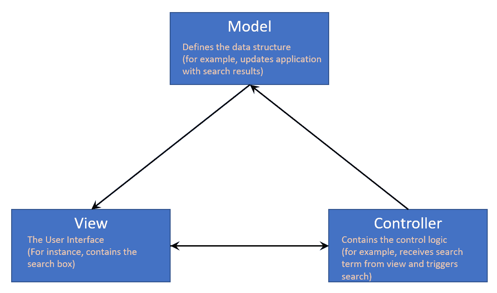

这种架构对于我们想要开发全栈 Web 应用程序又是又一个重大进步；然而，它仍然存在一个问题，即它依赖于 Windows 来托管。

间接地，从这个图表中，我们可以得出 ASP.NET 代表在客户端和服务器上都运行的代码。这意味着我们不需要运行服务器端的 Node 实例，因此我们可以利用.NET 堆栈的功能和特性来构建这个架构。

让很多人感到惊讶的是，微软开始将注意力从长期以来被视为公司摇钱树的 Windows 转向更开放的模式，应用程序运行的操作系统变得不那么重要。这反映了其核心优先事项的转变，云操作，通过其出色的 Azure 产品，已经成为了重点。如果微软继续沿着原有的 Web 架构发展，那么它将错失许多正在开放的机会；因此，它开始了一个多年的.NET Framework 重新架构，以消除对 Windows 的依赖，并使其对使用者来说是平台无关的。

这导致微软发布了 ASP.NET Core MVC，它完全消除了对 Windows 的依赖。现在，我们可以从一个代码库中同时针对 Windows 或 Linux 进行目标设置。突然之间，我们可以托管我们的代码的服务器数量激增，运行服务器的成本可能会下降。与此同时，随着微软发布的每个连续版本的 Core，他们都在调整和优化性能，以在请求服务器统计数据中提供相当大的提升。此外，我们可以免费开发这些应用程序，并且也可以针对 Linux 进行托管，这意味着这项技术对初创公司来说更加令人兴奋。我完全期待，在未来几年，随着成本障碍的降低，加入 ASP.NET Core MVC 阵营的初创公司数量将显著增加。

# 提供项目概述

本章我们正在构建的项目与我们迄今为止编写的任何项目都大不相同。这个项目让我们远离了纯 TypeScript，转而使用混合编程语言，即 C#和 TypeScript，我们将看到如何将 TypeScript 整合到 ASP.NET Core Web 应用程序中。该应用程序本身使用 Discogs 音乐 API，以便用户可以搜索艺术家并检索其唱片和艺术作品的详细信息。搜索部分使用纯 ASP.NET 和 C#完成，而艺术品检索则使用 TypeScript 完成。

只要您在 GitHub 存储库中与代码一起工作，本章应该需要大约 3 小时才能完成，当我们一起尝试代码时，这看起来不会太多！完成的应用程序将如下所示：

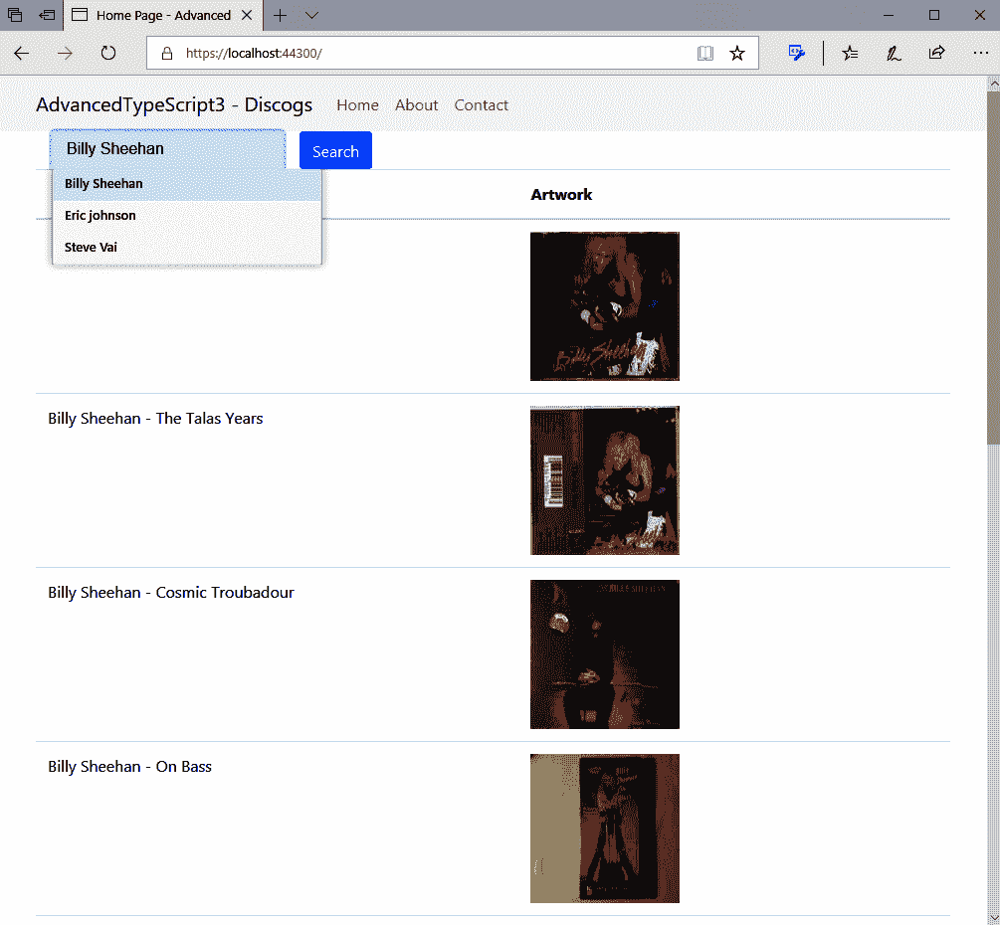

所以，让我们开始吧！

# 使用 ASP.NET Core，C#和 TypeScript 创建音乐库的入门

我是一个音乐迷。我弹吉他已经很多年了，这导致我听了很多音乐家的音乐。跟踪他们所创作的所有音乐可能是一个非常复杂的任务，所以我一直对公开可用的 API 感兴趣，让我们可以搜索所有与音乐家相关的事物。我认为提供给我们最广泛选择的查询专辑、艺术家、曲目等的公共 API 是 Discog 库。

在本章中，我们将利用这个 API，并编写一个应用程序，利用 ASP.NET Core 来展示我们如何可以协同使用 C#和 TypeScript。

为了运行这个应用程序，您需要在 Discogs 上设置一个账户，如下所示：

1.  从[`www.discogs.com/users/create`](https://www.discogs.com/users/create)开始注册一个账户。

1.  虽然我们可以创建一个 Discogs API 应用程序，特别是如果我们想要利用身份验证和访问完整 API 等功能，但我们只需要通过点击生成令牌按钮来生成个人访问令牌，如下面的截图所示：

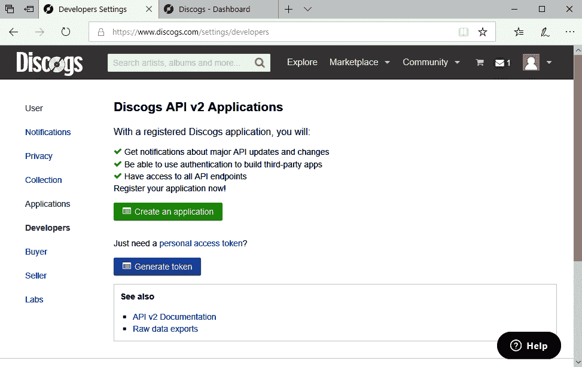

现在我们已经注册了 Discogs 并生成了我们的令牌，我们准备创建我们的 ASP.NET Core 应用程序。

# 使用 Visual Studio 创建我们的 ASP.NET Core 应用程序

在之前的章节中，我们是通过命令行创建我们的应用程序的。然而，使用 Visual Studio，通常的做法是通过可视化方式创建我们的应用程序。

让我们看看这是如何完成的：

1.  打开 Visual Studio 并选择创建新项目以开始创建新项目的向导。我们将创建一个 ASP.NET Core Web 应用程序，如下所示：

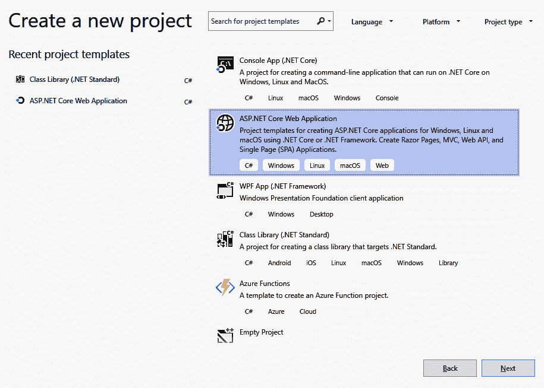

较早版本的.NET 只能在 Windows 平台上运行。虽然.NET 是一个很好的框架，C#是一种很棒的语言，但这种缺乏跨平台能力意味着.NET 只受到拥有 Windows 桌面或 Windows 服务器的公司的青睐。一段时间以前，微软决定解决这个缺陷，通过将.NET 剥离并重新架构成可以跨平台运行的东西。这极大地扩展了.NET 的影响力，被称为.NET Core。对我们来说，这意味着我们可以在一个平台上开发，并将我们的应用程序部署到另一个平台上。在内部，.NET Core 应用程序有特定于平台的代码，这些代码被隐藏在一个单一的.NET API 后面，所以，例如，我们可以进行文件访问而不必担心底层操作系统如何处理文件。

1.  我们需要选择我们将放置代码的位置。我的本地 Git 仓库位于`E:\Packt\AdvancedTypeScript3`下，所以将其作为我的位置告诉 Visual Studio 在该目录下的一个文件夹中创建必要的文件。在这种情况下，Visual Studio 将创建一个名为`Chapter10`的解决方案，其中包含我们所有的文件。点击创建以创建所有我们需要的文件：

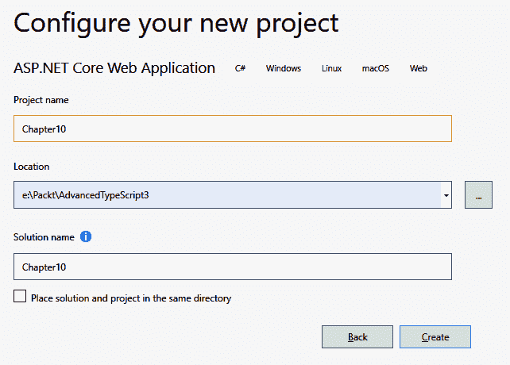

1.  一旦 Visual Studio 完成创建我们的解决方案，应该会有以下文件可用。在我们开发应用程序的过程中，我们将讨论更重要的文件，并看看我们如何使用它们：

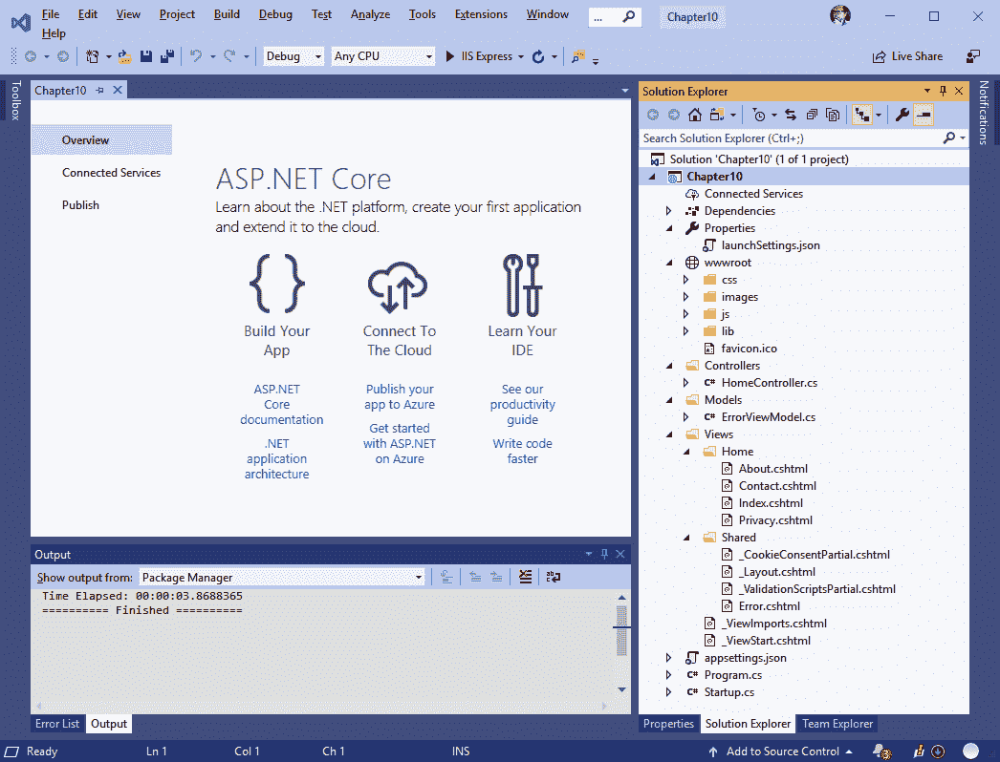

1.  我们也可以构建和运行我们的应用程序（按下*F5*即可），应用程序会像这样启动：

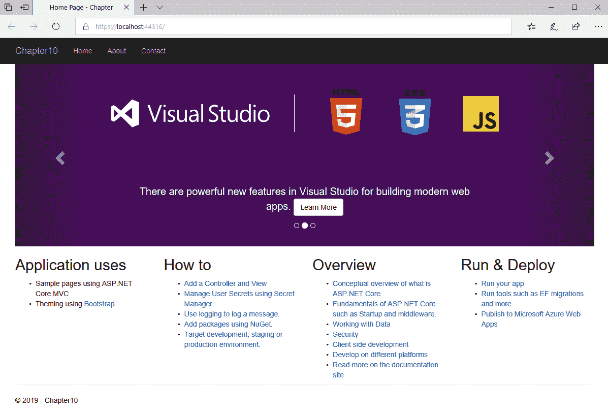

创建了我们的应用程序后，在下一节中，我们将涵盖生成的代码的重要点，首先从启动和程序文件开始，然后再开始修改它并引入我们的搜索功能。

# 了解应用程序结构

行为方面，我们应用程序的起点是`Startup`类。这个文件的目的是在启动过程中设置系统，因此我们要处理配置应用程序如何处理 cookie 以及添加 HTTP 支持等功能。虽然这个类在功能上大部分是样板代码，但我们以后会回来添加对我们即将编写的 Discogs 客户端的支持。问题是，这个功能是从哪里调用的？实际上是什么启动了我们的物理应用程序？这些问题的答案是`Program`类。如果我们快速分解这段代码，我们会看到启动功能是如何引入的，以及它如何帮助构建我们的托管应用程序。

.NET 可执行应用程序以`Main`方法开始。有时，这对开发人员是隐藏的，但总会有一个。这是可执行应用程序的标准入口点，我们的 Web 应用程序也不例外。这个静态方法简单地调用`CreateWebHostBuilder`方法，传入任何命令行参数，然后调用 Build 和 Run 来构建主机并运行它：

```ts
public static void Main(string[] args)
{
  CreateWebHostBuilder(args).Build().Run();
}
public static IWebHostBuilder CreateWebHostBuilder(string[] args) =>
  WebHost.CreateDefaultBuilder(args)
    .UseStartup<Startup>();
```

这里的`=>`的使用方式不同于使用 fat arrow。在这个特定的上下文中，它所做的是替换`return`关键字，所以如果你有一个只有一个`return`操作的方法，这可以简化。等效的代码，包括`return`语句，看起来像这样：

```ts
public static IWebHostBuilder CreateWebHostBuilder(string[] args)
{
   return WebHost.CreateDefaultBuilder(args).UseStartup<Startup>();
}
```

`CreateDefaultBuilder`用于配置我们的服务主机，设置 Kestrel web 引擎、加载配置信息和设置日志支持等选项。`UseStartup`方法告诉默认构建器，我们的`Startup`类是需要用来启动服务的。

# 启动类

那么，我们的`Startup`类实际上是什么样子的呢？嗯，在与我们使用 TypeScript 开发的方式类似的方式中，C#从类定义开始：

```ts
public class Startup
{
}
```

与 JavaScript 不同，C#没有特殊的`constructor`关键字。相反，C#使用类的名称来表示构造函数。请注意，就像 JavaScript 一样，当我们创建构造函数时，我们不给它一个返回类型（我们很快就会看到 C#如何处理返回类型）。我们的构造函数将接收一个配置条目，以允许我们读取配置。我们使用以下`get;`属性将其公开为 C#属性：

```ts
public Startup(IConfiguration configuration)
{
  Configuration = configuration;
}
public IConfiguration Configuration { get; }
```

当运行时启动我们的主机进程时，将调用`ConfigureServices`方法。这是我们需要挂接任何服务的地方；在这段代码中，我添加了一个`IDiscogsClient`/`DiscogsClient`注册，这将这个特定组合添加到 IoC 容器中，以便我们以后可以将其注入到其他类中。我们已经在这个类中看到了依赖注入的一个例子，配置被提供给构造函数。

不要担心我们还没有看到`IDiscogsClient`和`DiscogsClient`。我们很快就会在我们的代码中添加这个类和接口。在这里，我们正在将它们注册到服务集合中，以便它们可以自动注入到类中。正如你可能还记得我们在本书前面所说的，单例将只给出一个类的实例，无论它在哪里使用。这与我们在 Angular 中生成服务时非常相似，我们在那里将服务注册为单例：

```ts
public void ConfigureServices(IServiceCollection services)
{
  services.Configure<CookiePolicyOptions>(options =>
  {
    options.CheckConsentNeeded = context => true;
    options.MinimumSameSitePolicy = SameSiteMode.None;
  });

  services.AddHttpClient();
  services.AddSingleton<IDiscogsClient, DiscogsClient>();
  services.AddMvc().SetCompatibilityVersion(
    CompatibilityVersion.Version_2_1);
}
```

这里需要注意的是，设置返回类型的位置与 TypeScript 不同。就像我们在 TypeScript 中看到的那样，我们在方法声明的最后设置返回类型。在 C#中，返回类型在名称之前设置，所以我们知道`ConfigureServices`有一个`void`返回类型。

`AddSingleton`上的语法显示了 C#也支持泛型，所以这个语法对我们来说不应该是可怕的。虽然语言中有很多相似之处，但 TypeScript 在这里有一些有趣的差异，例如没有专门的`any`或`never`类型。如果我们想让我们的 C#类型做类似于`any`的事情，它将不得不使用`object`类型。

现在基础服务已经配置好，这个类的最后一步是配置 HTTP 请求管道。这只是告诉应用程序如何响应 HTTP 请求。在这段代码中，我们可以看到我们已经启用了静态文件的支持。这对我们非常重要，因为我们将依赖静态文件支持来连接我们的 TypeScript（编译后的 JavaScript 版本）以便与我们的 C#应用程序共存。我们还可以看到我们的请求已经设置了路由：

```ts
public void Configure(IApplicationBuilder app, IHostingEnvironment env)
{
  if (env.IsDevelopment())
  {
    app.UseDeveloperExceptionPage();
  }
  else
  {
    app.UseExceptionHandler("/Home/Error");
    app.UseHsts();
  }

  app.UseHttpsRedirection();
  app.UseStaticFiles();
  app.UseCookiePolicy();

  app.UseMvc(routes =>
  {
    routes.MapRoute(
              name: "default",
              template: "{controller=Home}/{action=Index}/{id?}");
  });
}
```

创建 C#基础设施来启动我们的应用程序是很好的，但如果我们没有任何东西可以显示，那么我们就是在浪费时间。现在是时候看看将要提供的基本文件了。

# 组成基本视图的文件

我们视图的入口是特殊的`_ViewStart.cshtml`文件。这个文件定义了应用程序将显示的通用布局。我们不直接向这个文件添加内容，而是将内容放在一个名为`_Layout.cshtml`的文件中，并在设置`Layout`文件时引用这个文件（去掉文件扩展名）。

```ts
@{
    Layout = "_Layout";
}
```

以`.cshtml`结尾的文件对 ASP.NET 有特殊的意义。这告诉应用程序这些文件是 C#和 HTML 的组合，底层引擎在将结果提供给浏览器之前必须编译。我们现在应该对这个概念非常熟悉了，因为我们在 React 和 Vue 中看到了类似的行为。

现在我们已经涵盖了视图入口，我们需要考虑`_Layout`本身。默认的 ASP.NET 实现目前使用的是 Bootstrap 3.4.1，因此在浏览这个文件时，我们将进行必要的更改以使用 Bootstrap 4。让我们从当前的标题开始：

```ts
<!DOCTYPE html>
<html>
<head>
    <meta charset="utf-8" />
    <meta name="viewport" content="width=device-width, 
      initial-scale=1.0" />
    <title>@ViewData["Title"] - Chapter10</title>

    <environment include="Development">
        <link rel="stylesheet" 
          href="~/lib/bootstrap/dist/css/bootstrap.css" />
        <link rel="stylesheet" href="~/css/site.css" />
    </environment>
    <environment exclude="Development">
        <link rel="stylesheet" 
          href="https://stackpath.bootstrapcdn.com/bootstrap/3.4.1/
                css/bootstrap.min.css"
          asp-fallback-href="~/lib/bootstrap/dist/
                             css/bootstrap.min.css"
          asp-fallback-test-class="sr-only" 
          asp-fallback-test-property="position" 
          asp-fallback-test-value="absolute" />
        <link rel="stylesheet" href="~/css/site.min.css" 
          asp-append-version="true" />
    </environment>
</head> 
```

这个标题看起来像一个相当正常的标题，但它有一些小小的怪癖。在标题中，我们从`@ViewData`中获取`Title`。我们使用`@ViewData`在控制器和视图之间传输数据，所以如果我们查看`index.cshtml`文件（例如），文件的顶部部分会这样说：

```ts
@{
    ViewData["Title"] = "Home Page";
}
```

这一部分与我们的布局结合起来，将我们的`title`标签设置为`Home Page - Chapter 10`。`@`符号告诉编译器 ASP.NET 的模板引擎 Razor 将对那段代码进行处理。

我们标题的下一部分根据我们是否处于开发环境来决定包含哪些样式表的逻辑。如果我们运行开发构建，我们会得到一组文件，而发布版本会得到压缩版本。

我们将通过从 CDN 提供 Bootstrap 来简化我们的标题，而不管我们是否处于开发模式，并稍微改变我们的标题：

```ts
<head>
  <meta charset="utf-8"/>
  <meta name="viewport" content="width=device-width, 
    initial-scale=1.0"/>
  <title>@ViewData["Title"] - AdvancedTypeScript 3 - Discogs</title>

  <link rel="stylesheet" href="https://maxcdn.bootstrapcdn.com/
    bootstrap/4.0.0/css/bootstrap.min.css" 
    integrity="sha384-  
      Gn5384xqQ1aoWXA+058RXPxPg6fy4IWvTNh0E263XmFcJlSAwiGgFAW/dAiS6JXm" 
        crossorigin="anonymous">
  <environment include="Development">
    <link rel="stylesheet" href="~/css/site.css"/>
  </environment>
  <environment exclude="Development">
    <link rel="stylesheet" href="~/css/site.min.css" 
      asp-append-version="true"/>
  </environment>
</head>
```

我们页面布局的下一个部分是`body`元素。我们将逐个部分地分解这个部分。从`body`元素开始，我们首先要看的是`navigation`元素：

```ts
<body>
    <nav class="navbar navbar-inverse navbar-fixed-top">
        <div class="container">
            <div class="navbar-header">
                <button type="button" class="navbar-toggle" 
                    data-toggle="collapse" 
                    data-target=".navbar-collapse">
                    <span class="sr-only">Toggle navigation</span>
                    <span class="icon-bar"></span>
                    <span class="icon-bar"></span>
                    <span class="icon-bar"></span>
                </button>
                <a asp-area="" asp-controller="Home" 
                  asp-action="Index" class="navbar-brand">Chapter10</a>
            </div>
            <div class="navbar-collapse collapse">
                <ul class="nav navbar-nav">
                    <li><a asp-area="" asp-controller="Home" 
                      asp-action="Index">Home</a></li>
                    <li><a asp-area="" asp-controller="Home" 
                      asp-action="About">About</a></li>
                    <li><a asp-area="" asp-controller="Home" 
                      asp-action="Contact">Contact</a></li>
                </ul>
            </div>
        </div>
    </nav>

</body>
```

这基本上是一个熟悉的`navigation`组件（尽管是在 Bootstrap 3 格式中）。将`navigation`组件转换为 Bootstrap 4，我们得到以下结果：

```ts
<nav class="navbar navbar-expand-lg navbar-light bg-light">
  <div class="container">
    <a class="navbar-brand" asp-area="" asp-controller="Home" 
      asp-action="Index">AdvancedTypeScript3 - Discogs</a>
    <div class="navbar-header">
      <button class="navbar-toggler" type="button" 
        data-toggle="collapse" 
        data-target="#navbarSupportedContent" 
        aria-controls="navbarSupportedContent" 
        aria-expanded="false" 
        aria-label="Toggle navigation">
        <span class="navbar-toggler-icon"></span>
      </button>
    </div>
    <div class="navbar-collapse collapse">
      <ul class="nav navbar-nav">
        <li>
          <a class="nav-link" asp-area="" asp-controller="Home" 
            asp-action="Index">Home</a>
        </li>
        <li>
          <a class="nav-link" asp-area="" asp-controller="Home" 
            asp-action="About">About</a>
        </li>
        <li>
          <a class="nav-link" asp-area="" asp-controller="Home" 
            asp-action="Contact">Contact</a>
        </li>
      </ul>
    </div>
  </div>
</nav>
```

在这里，不熟悉的地方在于`a`链接内部。`asp-controller`类将视图链接到`controller`类；按照惯例，这些类名会扩展成`<<name>>Controller`，所以`Home`变成了`HomeController`。还有一个相关的`asp-action`，它与控制器类内的方法相关联，我们将调用这个方法。点击`About`链接将调用`HomeController.cs`内的`About`方法：

```ts
public IActionResult About()
{
  ViewData["Message"] = "Your application description page.";
  return View();
}
```

这个方法设置一个消息，将被写入`About`页面，然后返回该视图。ASP.NET 足够聪明，可以使用`View()`来确定它应该返回`About.cshtml`页面，因为这是`About`操作。这是我们开始看到 MVC 中控制器部分与视图部分的连接的地方。

回到`_Layout`文件，我们感兴趣的下一部分是以下部分，在这里我们使用`@RenderBody`来渲染主体内容：

```ts
<div class="container body-content">
    @RenderBody()
    <hr />
    <footer>
        <p>&copy; 2019 - Chapter10</p>
    </footer>
</div>
```

我们选择从我们的控制器显示的视图将在声明`@RenderBody`的地方呈现，因此我们可以假设此命令的目的是充当放置相关视图的占位符。我们将稍微更改此内容，以正确使用我们的 Bootstrap 知识并添加一个更有意义的页脚。考虑以下代码：

```ts
<div class="container">
  <div class="row">
    <div class="col-lg-12">
      @RenderBody()
    </div>
  </div>
  <hr/>
  <footer>
    <p>&copy; 2019 - Advanced TypeScript3 - Discogs Artist search</p>
  </footer>
</div>
```

我们不需要覆盖此文件的其余部分，因为我们真的需要开始查看我们将要渲染的模型和视图，但请从 GitHub 阅读源代码，并在此文件中进行相关的 JavaScript 更改，以便您使用 Bootstrap 4 代替 Bootstrap 3。

现在我们准备开始编写 MVC 代码库的模型部分。我们将通过编写将请求发送到 Discogs API 并将结果转换为可以发送到客户端的内容的模型来实现这一点。

# 创建一个 Discogs 模型

您会记得我们之前添加了一个`IDiscogsClient`模型的注册。在那时我们实际上还没有添加任何代码，所以我们的应用将无法编译。现在我们将创建接口和实现。`IDiscogClient`是一个模型，所以我们将在我们的模型目录中创建它。要在 Visual Studio 中创建接口和模型，我们需要右键单击`Models`文件夹以显示上下文菜单。在菜单中，选择添加 > 类....以下截图显示了这一点：

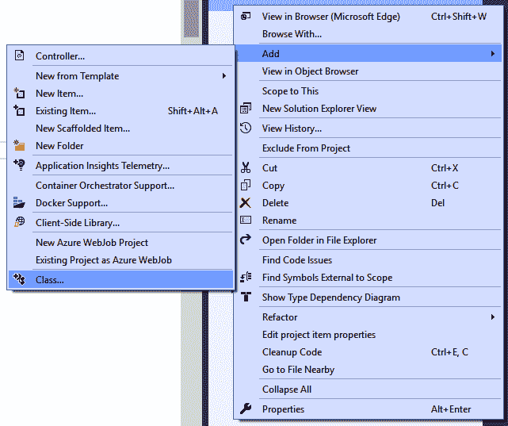

这将弹出以下对话框，我们可以在其中创建类或相关接口：


为了简洁起见，我们可以在同一个文件中创建接口和类定义。我已经在 GitHub 代码中将它们分开，但是我们在这里的类不需要这样做。首先，我们有以下接口定义：

```ts
public interface IDiscogsClient
{
  Task<Results> GetByArtist(string artist);
}
```

我们在定义中使用`Task<Results>`的用法类似于在 TypeScript 中指定返回特定类型的 promise。我们在这里所说的是，我们的方法将以异步方式运行，并且在某个时候将返回`Results`类型。

# 设置 Results 类型

我们从 Discogs 获取的数据以字段的层次结构返回。最终，我们希望有一些代码可以转换并返回结果，类似于以下内容：

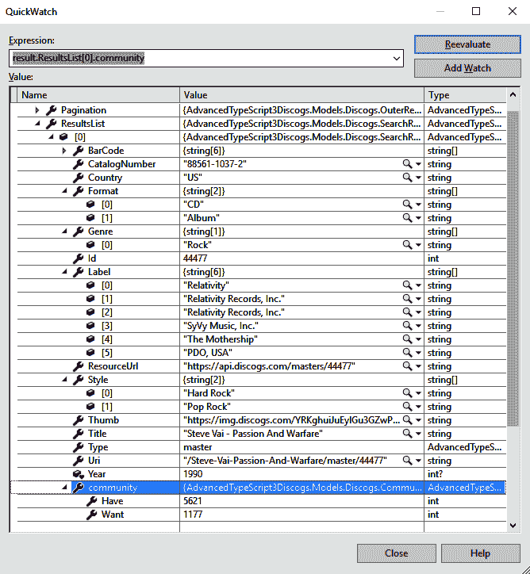

在幕后，我们将把我们的调用的 JSON 结果转换为一组类型。顶层类型是`Results`类型，我们将从我们的`GetByArtist`调用中返回它。此层次结构显示在以下图表中：

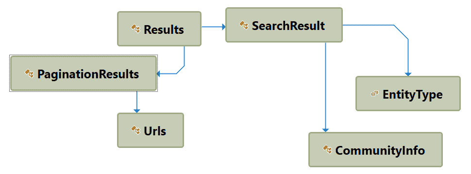

为了查看映射的样子，我们将从头开始构建`CommunityInfo`类型。这个类将在我们的`SearchResult`类中使用，以提供我们在之前的 QuickWatch 截图中选择的社区字段。创建一个名为`CommunityInfo`的类，并在文件顶部添加以下行：

```ts
using Newtonsoft.Json;
```

我们添加这一行是因为我们想要使用这里的一些功能；具体来说，我们想要使用`JsonProperty`将 C#属性的名称映射到 JSON 结果中存在的属性。我们有两个字段需要`CommunityInfo`返回——一个用于标识有多少人“想要”音乐标题，另一个用于标识有多少人“拥有”它。我们将遵循标准的 C#命名约定，并使用 Pascal 大小写来命名属性（这意味着首字母大写）。由于属性名称使用 Pascal 大小写，我们将使用`JsonProperty`属性将该名称映射到适当的 REST 属性名称，因此`Want`属性将映射到结果中的`want`：

```ts
public class CommunityInfo
{
  [JsonProperty(PropertyName = "want")]
  public int Want { get; set; }
  [JsonProperty(PropertyName = "have")]
  public int Have { get; set; }
}
```

我们不打算逐个讨论所有的类和属性。我绝对建议阅读 GitHub 代码以获取更多细节，但这肯定会有助于澄清项目结构是什么。

# 编写我们的 DiscogsClient 类

当我们编写`DiscogsClient`类时，我们已经有了它将基于的合同，以及接口定义。这告诉我们，我们的类开始如下：

```ts
public class DiscogsClient : IDiscogsClient
{
  public async Task<Results> GetByArtist(string artist)
  {
  }
}
```

我们的类的定义看起来与我们的接口略有不同，因为我们不必说明`GetByArtist`是`public`，或者该方法是`async`。当我们在方法声明中使用`async`时，我们正在设置一个编译期望，即该方法将在其中具有`await`关键字。这对我们来说应该非常熟悉，因为我们在 TypeScript 中使用了`async`/`await`。

当我们调用 Discogs API 时，它总是以`https://api.discogs.com/` URL 开头。为了在我们的代码库中使生活变得更容易，我们将在类中将其定义为常量：

```ts
private const string BasePath = "https://api.discogs.com/";
```

我们的类将与 REST 端点进行通信。这意味着我们必须能够从我们的代码中访问 HTTP。为了做到这一点，我们的构造函数将具有一个实现了`IHttpClientFactory`接口的类，该接口已经被注入其中。客户端工厂将实现一个称为工厂模式的模式，为我们构建一个适当的`HttpClient`实例，以便在需要时使用：

```ts
private readonly IHttpClientFactory _httpClientFactory;
public DiscogsClient(IHttpClientFactory httpClientFactory)
{
  _httpClientFactory = httpClientFactory ?? throw new 
     ArgumentNullException(nameof(httpClientFactory));
}
```

构造函数中的这种看起来相当奇怪的语法只是说明我们将使用传入的 HTTP 客户端工厂设置成员变量。如果客户端工厂为空，`??`表示代码将继续执行下一个语句，该语句将抛出一个声明参数为空的异常。

那么，我们的`GetByArtist`方法是什么样子的？我们首先要做的是检查我们是否已经将艺术家传递给了该方法。如果没有，那么我们将返回一个空的`Results`实例：

```ts
if (string.IsNullOrWhiteSpace(artist))
{
  return new Results();
}
```

为了创建我们的 HTTP 请求，我们需要构建我们的请求地址。在构建地址的同时，我们将使用我们定义为常量的`BasePath`字符串与`GetByArtist`的路径进行连接。假设我们想要搜索`Peter O'Hanlon`作为艺术家。我们将构建我们的搜索字符串，以便转义用户输入的文本，以防止发送危险的请求；因此，我们最终会构建一个类似于[`api.discogs.com/database/search?artist=Peter O%27Hanlon&per_page=10`](https://api.discogs.com/database/search?artist=Peter%20O%27Hanlon&per_page=10)所示的 HTTP 请求字符串。我们限制结果数量为 10，以保持在 Discogs 请求限制范围内。我们从辅助方法开始，将这两个字符串连接在一起：

```ts
private string GetMethod(string path) => $"{BasePath}{path}";
```

有了辅助程序，我们可以构建`GET`请求。正如我们之前讨论的，我们需要更改艺术家，以便对潜在危险的搜索词进行消毒。使用`Uri.EscapeDataString`，我们已经用其等效的 ASCII 值`%27`替换了我的名字中的撇号：

```ts
HttpRequestMessage request = new HttpRequestMessage(HttpMethod.Get, 
  GetMethod($"database/search?artist={Uri.EscapeDataString(artist)}&per_page=10"));
```

创建请求后，我们需要向其添加一些标头。我们需要添加一个`Authorization`令牌和一个`user-agent`，因为 Discogs 希望收到它们。`Authorization`令牌采用`Discogs token=<<token>>`的格式，其中`<<token>>`是我们在注册时创建的令牌。`user-agent`只需要是有意义的东西，所以我们将其设置为`AdvancedTypeScript3Chapter10`：

```ts
request.Headers.Add("Authorization", "Discogs token=MyJEHLsbTIydAXFpGafrrphJhxJWwVhWExCynAQh");
request.Headers.Add("user-agent", "AdvancedTypeScript3Chapter10");
```

我们谜题的最后一部分是使用工厂来创建`HttpClient`。创建后，我们调用`SendAsync`将我们的请求发送到 Discogs 服务器。当这个请求返回时，我们读取`Content`响应，然后需要使用`DeserializeObject`来转换类型：

```ts
using (HttpClient client = _httpClientFactory.CreateClient())
{
  HttpResponseMessage response = await client.SendAsync(request);
  string content = await response.Content.ReadAsStringAsync();
  return JsonConvert.DeserializeObject<Results>(content);
}
```

当我们把所有这些放在一起时，我们的类看起来是这样的：

```ts
public class DiscogsClient : IDiscogsClient
{
  private const string BasePath = "https://api.discogs.com/";
  private readonly IHttpClientFactory _httpClientFactory;
  public DiscogsClient(IHttpClientFactory httpClientFactory)
  {
    _httpClientFactory = httpClientFactory ?? throw new 
                 ArgumentNullException(nameof(httpClientFactory));
  }

  public async Task<Results> GetByArtist(string artist)
  {
    if (string.IsNullOrWhiteSpace(artist))
    {
      return new Results();
    }
    HttpRequestMessage request = new HttpRequestMessage(HttpMethod.Get, 
      GetMethod($"database/search?artist=
        {Uri.EscapeDataString(artist)}&per_page=10"));
    request.Headers.Add("Authorization", "Discogs 
      token=MyJEHLsbTIydAXFpGafrrphJhxJWwVhWExCynAQh");
    request.Headers.Add("user-agent", "AdvancedTypeScript3Chapter10");
    using (HttpClient client = _httpClientFactory.CreateClient())
    {
      HttpResponseMessage response = await client.SendAsync(request);
      string content = await response.Content.ReadAsStringAsync();
      return JsonConvert.DeserializeObject<Results>(content);
    }
  }
  private string GetMethod(string path) => $"{BasePath}{path}";
}
```

我们提到了有一个速率限制。不过，这实际上是什么意思呢？

# Discogs 速率限制

Discog 限制了可以从单个 IP 发出的请求数量。对于经过身份验证的请求，Discog 将请求速率限制为每分钟 60 次。对于未经身份验证的请求，在大多数情况下，可以发送的请求数量为每分钟 25 次。请求的数量使用移动窗口进行监控。

我们已经编写了我们的 Discogs API 模型；现在，是时候让我们来看看如何将我们的模型连接到我们的控制器。

# 连接我们的控制器

我们将利用依赖注入的强大功能来传递我们刚刚编写的 Discogs 客户端模型：

```ts
public class HomeController : Controller
{
  private readonly IDiscogsClient _discogsClient;
  public HomeController(IDiscogsClient discogsClient)
  {
    _discogsClient = discogsClient;
  }
}
```

正如您可能记得的，当我们设置导航时，我们将`asp-action`设置为`Index`。当我们执行搜索时，我们的视图将把搜索字符串传递给`Index`并调用`GetByArtist`方法。当我们得到搜索结果时，我们将使用结果列表设置`ViewBag.Result`。最后，我们提供`View`，这将是`Index`页面：

```ts
public async Task<IActionResult> Index(string searchString)
{
  if (!string.IsNullOrWhiteSpace(searchString))
  {
    Results client = await _discogsClient.GetByArtist(searchString);
    ViewBag.Result = client.ResultsList;
  }

  return View();
}
```

但我们的视图是什么样的？我们现在需要设置`Index`视图。

# 添加 Index 视图

在文件的顶部，我们将`ViewData`设置为`Title`。我们在查看`_Layout.cshtml`时看到了这样做的效果，但值得重复的是，我们在这里设置的值用于帮助构建我们主要布局页面的标题。当我们运行应用程序时，这将把标题设置为`主页 - AdvancedTypeScript 3 - Discogs`：

```ts
@{
  ViewData["Title"] = "Home Page";
}
```

用户通过搜索控件与我们的应用程序进行交互。是时候为它添加了。我们将添加一个名为`pageRoot`的`div` ID，其中将包含一个`form`元素：

```ts
<div id="pageRoot">
  <form asp-controller="Home" asp-action="Index" class="form-inline">
  </form>
</div>
```

再次，我们可以看到我们在这里充分利用了 ASP.NET 的全部功能。我们的表单是 MVC 感知的，所以我们告诉它我们正在使用`HomeController`（记住控制器的约定）通过`asp-controller`。我们将操作设置为`Index`，因此我们将调用与导航到此页面时相同的`Index`方法。我们之所以能够这样做，是因为当我们完成搜索时，我们仍然希望显示当前页面，以便用户在必要时可以搜索不同的艺术家。我们的`Index`方法足够聪明，可以知道我们是否已经传递了搜索字符串来触发搜索，因此当用户在我们的表单内触发搜索时，将提供搜索字符串，这将触发搜索本身。

在表单内，我们需要添加一个输入搜索字段和一个按钮，按下按钮时触发`submit`表单。这里的类元素只是用来将我们的`button`和`input`字段转换为 Bootstrap 版本：

```ts
<div class="form-group mx-sm-3 mb-10">
  <input type="text" name="SearchString" class="form-control" 
    placeholder="Enter artist to search for" />
</div>
<button type="submit" class="btn btn-primary">Search</button>
```

有了这个设置，我们的搜索部分看起来是这样的：

```ts
<div id="pageRoot">
  <form asp-controller="Home" asp-action="Index" class="form-inline">
    <div class="form-group mx-sm-3 mb-10">
      <input type="text" name="SearchString" class="form-control" 
        placeholder="Enter artist to search for" />
    </div>
    <button type="submit" class="btn btn-primary">Search</button>
  </form>
</div>
```

如果我们现在运行应用程序，我们会看到以下内容。如果我们输入艺术家的详细信息并按下搜索按钮，搜索将被触发，但屏幕上不会显示任何数据：


现在我们有了搜索结果返回，我们需要从`ViewBag`中获取我们添加结果的结果。很容易被`ViewBag`和`ViewData`搞混，所以值得花点时间来谈谈它们，因为它们都有同样的目的，即在控制器和视图之间双向传递数据，只是略有不同：

+   当我们添加搜索结果时，我们将其设置为`ViewBag.Result`。但是，如果我们看一下`ViewBag`的源代码，我们实际上找不到一个名为**Result**的属性。这是因为`ViewBag`是动态的；换句话说，它允许我们创建可以在控制器和视图之间共享的任意值，可以被称为任何东西。一般来说，使用`ViewBag`是一个合理的选择，但由于它是动态的，它没有编译器检测是否存在错误的好处，所以你必须确保在控制器中设置的属性与在视图中设置的属性完全相同。

+   `ViewData`，然而，依赖于使用字典（类似于 TypeScript 中的`map`），在这里我们可能有许多键/值对持有数据。在内部，值是一个对象，所以如果我们在视图中设置值并将其传递回控制器，我们必须将对象转换为适当的类型。这样做的效果是，在视图中设置`ViewBag.Counter = 1`意味着我们可以直接在控制器中将`ViewBag.Counter`视为整数，但在视图中设置`ViewData["Counter"] = 1`意味着我们必须将`ViewData["Counter"]`转换为整数，然后才能对其进行任何操作。转换看起来像这样：

```ts
int counter = (int)ViewData["Counter"];
```

对于我们的目的，我们可以使用任一种方法，因为设置结果的责任在于我们的控制器，但我很高兴使用`ViewBag`来设置我们的结果。那么，我们如何添加数据呢？我们知道我们的`Index`页面是一个`.cshtml`文件，所以我们可以混合 C#和 HTML 在一起。我们使用`@{ }`来表示 C#部分，所以为了呈现结果，我们需要检查`ViewBag.Result`中是否有值（请注意，C#使用`!=`，而不是 JavaScript 格式的`!==`，来测试结果是否为空）。我们编写的代码以这样开始呈现我们的结果：

```ts
@{ if (ViewBag.Result != null)
  {
  }
}
```

在我们的结果中，我们将创建一个 Bootstrap 表格，其中`Title`和`Artwork`作为两列。我们要构建的表的 HTML 标记从这里开始：

```ts
<table class="table">
  <thead>
    <tr>
      <th>Title</th>
      <th>Artwork</th>
    </tr>
  </thead>
  <tbody>
  </tbody>
</table>
```

在我们的表体（`tbody`）中，我们将不得不循环遍历我们结果中的每一项，并将相关值写出。我们首先要做的是创建一个名为`index`的变量。我们现在要把这个放在这里，预期到需要添加一个带有唯一名称的图像的地方（我们将在下一节中介绍）。

接下来，我们将使用`foreach`来遍历`ViewBag.Result`中的每一项。对于每个项目，我们将创建一个新的表行使用`<tr></tr>`，在行内，我们将写出两个表数据单元（`<td></td>`）包含标题和资源 URL，如下所示：

```ts
<tbody>
  @{
    int index = 0;
  }
  @foreach (var item in ViewBag.Result)
  {
    <tr>
      <td>@item.Title</td>
      <td>@item.ResourceUrl</td>
    </tr>
    index++;
  }
</tbody>
```

如果我们现在运行我们的应用程序，我们将得到结果，并且这些结果将被写入表格：

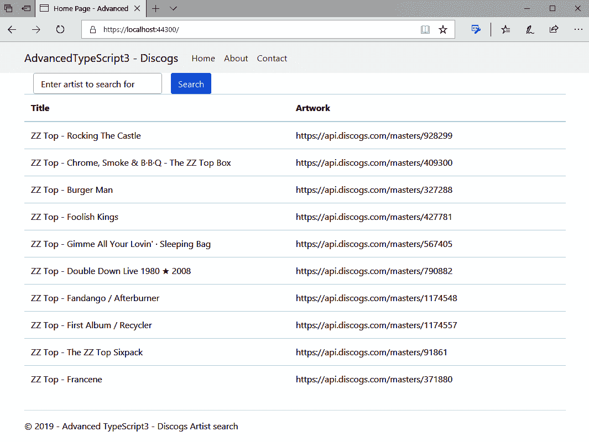

显然，艺术品元素是错误的。那不是一张图片，所以我们需要放置一些东西去检索图片本身，这需要我们的代码为每个结果进行另一个 REST 调用。我们希望这发生在结果返回后，所以当我们看到如何利用 TypeScript 为我们获取图像结果时，我们现在将转向客户端功能。

# 向我们的应用程序添加 TypeScript

我们 TypeScript 的起点——几乎总是——是我们的`tsconfig.json`文件。我们将尽可能地使其精简。我们将在这里设置特定的`outDir`，因为我们的项目创建了一些文件在`wwwroot`中。在`wwwroot/js`文件夹中，ASP.NET 已经创建了一个`site.js`文件，所以我们将把我们的脚本定位到与它并存：

```ts
{
  "compileOnSave": true,
  "compilerOptions": {
    "lib": [ "es2015", "dom" ],
    "noImplicitAny": true,
    "noEmitOnError": true,
    "removeComments": true,
    "sourceMap": true,
    "target": "es2015",
    "outDir": "wwwroot/js/"
  },
  "exclude": [
    "wwwroot"
  ]
}
```

我们将使用一个单一的方法调用 Discogs API 来检索相关的图像。我们不会依赖于从外部来源加载的任何 TypeScript 包来进行我们的 API 调用，因为 JavaScript 为我们提供了`fetch` API，允许我们在没有任何依赖关系的情况下进行 REST 调用。

我们首先添加一个名为`discogHelper.ts`的文件，其中包含我们将从 ASP.NET 应用程序中调用的函数。我们添加这个作为 TypeScript 方法的原因是，我们希望它在客户端上运行，而不是在服务器端。这样可以减少将初始结果加载到客户端屏幕上所需的时间，因为我们将让客户端为我们获取并异步加载图像。

我们的函数的签名看起来像这样：

```ts
const searchDiscog = (request: RequestInfo, imgId: string): Promise<void> => {
  return new Promise((): void => {
  }
}
```

`RequestInfo`参数将接受服务器上图像请求的 URL。这是因为 Discog 并不返回有关特定音乐标题的完整详细信息，因此在这一点上专辑封面不可用。相反，它返回了我们必须进行的 REST 调用，以检索完整详细信息，然后我们可以解析出来检索封面。例如，Steve Vai 的 Passion and Warfare 专辑信息返回了[`api.discogs.com/masters/44477`](https://api.discogs.com/masters/44477)链接的`ResourceUrl`。这成为我们传递给`request`的 URL，以检索包括封面在内的完整详细信息。

我们接受的第二个参数是`img`对象的`id`。当我们遍历初始搜索结果来构建结果表时，我们还包括一个唯一标识的图像，将其传递给我们的函数。这允许我们在完成检索有关专辑的详细信息后动态更新`src`。有时，这可能会导致客户端出现有趣的效果，因为有些专辑的检索时间比其他专辑长，所以很可能图像列表的更新顺序不一致，这意味着后面的图像比前面的图像更早地填充。这并不是什么大问题，因为我们故意这样做是为了显示我们的客户端代码确实是异步的。

如果我们真的想要担心让我们的图像按顺序显示，我们会改变我们的函数来接受一个请求和图像占位符的数组，发出我们的调用，并且只有在所有 REST 调用完成后才更新图像。

毫不奇怪，`fetch` API 使用了一个名为`fetch`的 promise 来进行我们的调用。这接受请求，以及一个`RequestInit`对象，允许我们传递自定义设置到我们的调用中，包括我们想要应用的 HTTP 动词和我们想要设置的任何标头：

```ts
fetch(request,
  {
    method: 'GET',
    headers: {
      'authorization': 'Discogs 
           token=MyJEHLsbTIydAXFpGafrrphJhxJWwVhWExCynAQh',
      'user-agent': 'AdvancedTypeScript3Chapter10'
    }
  })
```

猜猜看？我们在这里使用了与 C#代码中设置的相同的`authorization`和`user-agent`标头。

我们已经说过`fetch` API 是基于 promise 的，所以我们可以合理地期望`fetch`调用在返回结果之前等待完成。为了获取我们的图像，我们将执行一些转换。第一个转换是将响应转换为 JSON 表示：

```ts
.then(response => {
  return response.json();
})
```

转换操作是异步的，所以我们的转换的下一个阶段也可以在自己的`then`块中发生。此时，如果一切顺利，我们应该有一个响应主体。我们使用我们传递给函数的图像 ID 来检索`HTMLImageElement`。如果这是一个有效的图像，那么我们将`src`设置为我们收到的第一个`uri150`结果，这给我们了来自服务器的 150 x 150 像素图像的地址：

```ts
.then(responseBody => {
  const image = <HTMLImageElement>document.getElementById(imgId);
  if (image) {
    if (responseBody && responseBody.images && 
         responseBody.images.length > 0) {
      image.src = responseBody.images["0"].uri150;
    }
  }
})
```

将所有这些放在一起，我们的搜索函数看起来像这样：

```ts
const searchDiscog = (request: RequestInfo, imgId: string): Promise<void> => {
  return new Promise((): void => {
    fetch(request,
      {
        method: 'GET',
        headers: {
          'authorization': 'Discogs 
            token=MyJEHLsbTIydAXFpGafrrphJhxJWwVhWExCynAQh',
          'user-agent': 'AdvancedTypeScript3Chapter10'
        }
      })
      .then(response => {
        return response.json();
      })
      .then(responseBody => {
        const image = <HTMLImageElement>document.getElementById(imgId);
        if (image) {
          if (responseBody && responseBody.images && 
               responseBody.images.length > 0) {
            image.src = responseBody.images["0"].uri150;
          }
        }
      }).catch(x => {
        console.log(x);
      });
  });
}
```

Discogs 允许我们发出 JSONP 请求，这意味着我们必须传递一个回调查询字符串参数。为了发出 JSONP 请求，我们必须安装来自[`github.com/camsong/fetch-jsonp`](https://github.com/camsong/fetch-jsonp)的 Fetch JSONP 包。这需要将`fetch`调用的签名更改为`fetchJsonp`。除此之外，我们的其他函数看起来都一样。

到目前为止，我们应该已经熟悉了在承诺中使用`async`/`await`。如果我们想要一个稍微不那么冗长的函数，我们可以将代码更改为这样：

```ts
const searchDiscog = (request: RequestInfo, imgId: string): Promise<void> => {
  return new Promise(async (): void => {
    try
    {
      const response = await fetch(request,
        {
          method: 'GET',
          headers: {
            'authorization': 'Discogs 
              token=MyJEHLsbTIydAXFpGafrrphJhxJWwVhWExCynAQh',
            'user-agent': 'AdvancedTypeScript3Chapter10'
          }
        });
      const responseBody = await response.json();
      const image = <HTMLImageElement>document.getElementById(imgId);
      if (image) {
        if (responseBody && responseBody.images && 
             responseBody.images.length > 0) {
          image.src = responseBody.images["0"].uri150;
        }
      }
    }
    catch(ex) {
      console.log(ex);
    } 
  });
}
```

在下一节中，我们将讨论如何从 ASP.NET 调用我们的 TypeScript 功能。

# 从 ASP.NET 调用我们的 TypeScript 功能

回到我们的 ASP.NET 代码，我们现在可以连接`searchDiscog`函数来检索我们的图像。我们需要做的第一件事是包含对搜索脚本的引用：

```ts
<script src="~/js/discogHelper.js"></script>
```

有了这个，我们现在可以扩展我们的图像部分以包括搜索脚本：

```ts
<td>
  
  <script type="text/javascript">
      searchDiscog('@item.ResourceUrl', 'img_@index');
  </script>
</td>
```

将所有这些放在一起，我们的`Index`页面现在看起来像这样：

```ts
@{
  ViewData["Title"] = "Home Page";
}
<div id="pageRoot">
  <form asp-controller="Home" asp-action="Index" class="form-inline">
    <div class="form-group mx-sm-3 mb-10">
      <input type="text" name="SearchString" class="form-control" 
         placeholder="Enter artist to search for" />
    </div>
    <button type="submit" class="btn btn-primary">Search</button>
  </form>
</div>
@{ if (ViewBag.Result != null)
  {
    <script src="~/js/discogHelper.js"></script>
    <table class="table">
      <thead>
        <tr>
          <th>Title</th>
          <th>Artwork</th>
        </tr>
      </thead>
      <tbody>
        @{
          int index = 0;
        }
        @foreach (var item in ViewBag.Result)
        {
          <tr>
            <td>@item.Title</td>
            <td>
              
              <script type="text/javascript">
                  searchDiscog('@item.ResourceUrl', 'img_@index');
              </script>
            </td>
          </tr>
          index++;
        }
      </tbody>
    </table>
  }
}
```

现在，当我们运行应用程序时，执行搜索后将返回标题和图像。重新运行相同的搜索现在给我们这个：

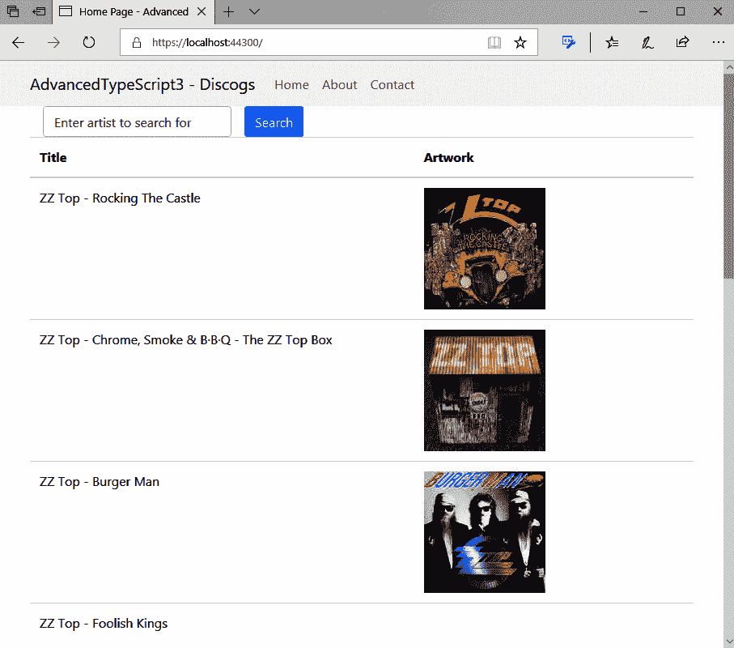

就是这样。我们有一个 ASP.NET Core MVC 应用程序，可以用来搜索艺术家并检索标题和艺术品。所有这些都是使用 ASP.NET MVC、HTML、Bootstrap、C#和 TypeScript 的组合实现的。

# 总结

在我们的最后一章中，我们转向使用 ASP.NET Core、C#和 TypeScript 开发应用程序。我们借此机会了解了在创建 ASP.NET Core Web 应用程序时，Visual Studio 为我们生成了什么。我们发现 ASP.NET Core 强调使用 MVC 模式来帮助我们分离代码的责任。为了构建这个应用程序，我们注册了 Discogs 网站并注册了一个令牌，以便我们开始使用 C#检索艺术家的详细信息。从艺术家的结果中，我们创建了一些调用同一网站检索专辑艺术品的 TypeScript 功能。

在构建应用程序时，我们介绍了如何在同一个`.cshtml`文件中混合 C#和 HTML 代码，这构成了视图。我们编写了自己的模型来执行艺术家搜索，并学习了如何更新控制器以将模型和视图联系在一起。

我希望您喜欢使用 TypeScript 的旅程，并希望我们已经增强了您的知识，以至于您想要更多地使用它。TypeScript 是一种美妙的语言，总是很愉快地使用，所以，请尽情享受它，就像我一样。我期待着看到您的作品。

# 问题

1.  为什么 TypeScript 看起来与 C#相似？

1.  什么 C#方法启动我们的程序？

1.  ASP.NET Core 与 ASP.NET 有什么不同？

1.  Discog 的速率限制是什么？

# 进一步阅读

ASP.NET Core 是一个庞大的主题，需要覆盖的时间比我们在这个简短的章节中拥有的时间要多得多。考虑到这一点，我建议您阅读以下书籍，以继续您的 ASP.NET 之旅：

+   *ASP.NET Core 2 基础* ([`www.packtpub.com/in/web-development/aspnet-core-2-fundamentals`](https://www.packtpub.com/in/web-development/aspnet-core-2-fundamentals))：Onur Gumus 和 Mugilan T. S. Ragupathi 撰写的使用这个服务器端 Web 应用程序框架构建跨平台应用程序和动态 Web 服务。ISBN：978-1789538915

+   *掌握 ASP.NET Core 2.0* ([`www.packtpub.com/in/application-development/mastering-aspnet-core`](https://www.packtpub.com/in/application-development/mastering-aspnet-core))：Ricardo Peres 撰写的 MVC 模式、配置、路由、部署等内容。ISBN：978-1787283688

+   使用.NET Core 2.0 构建微服务（[`www.packtpub.com/in/application-development/building-microservices-net-core-20-second-edition`](https://www.packtpub.com/in/application-development/building-microservices-net-core-20-second-edition)）：由 Gaurav Aroraa 编写，使用 C# 7.0 过渡单片架构，使用.NET Core 2.0 构建微服务。ISBN：978-1788393331

+   学习 ASP.NET Core 2.0（[`www.packtpub.com/application-development/learning-aspnet-core-20`](https://www.packtpub.com/application-development/learning-aspnet-core-20)）：由 Jason De Oliveira 和 Michel Bruchet 编写，使用 ASP.NET Core 2.0，MVC 和 EF Core 2 构建现代 Web 应用。ISBN：978-1788476638
