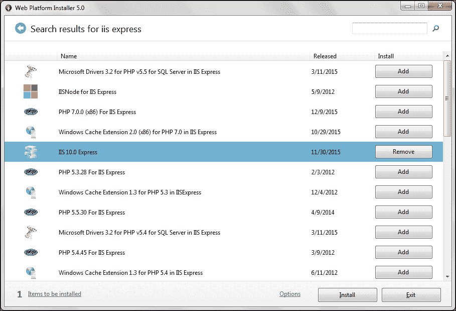
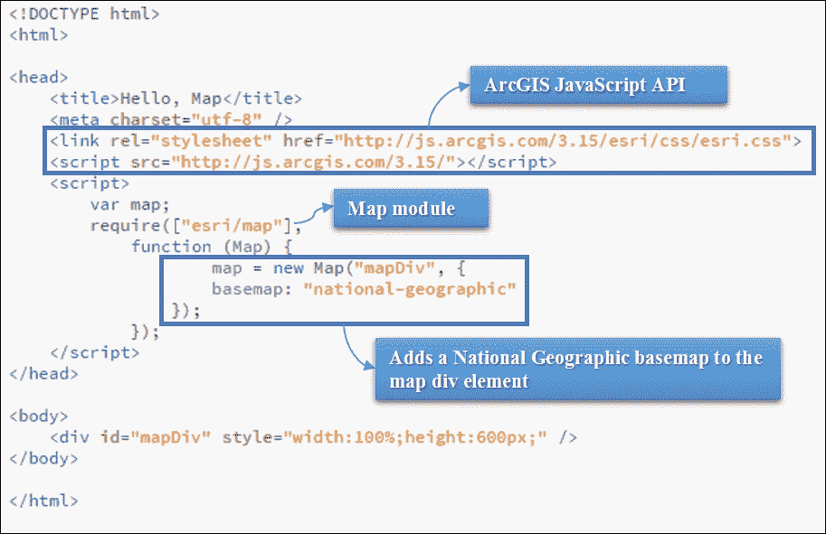
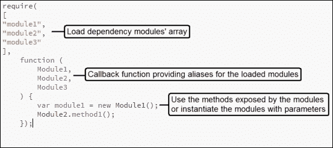
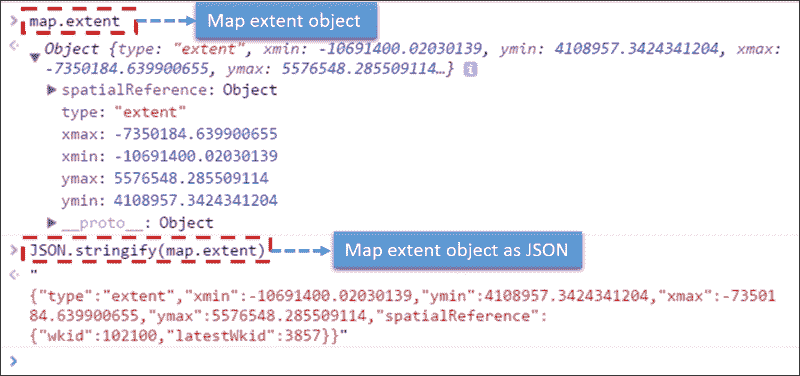
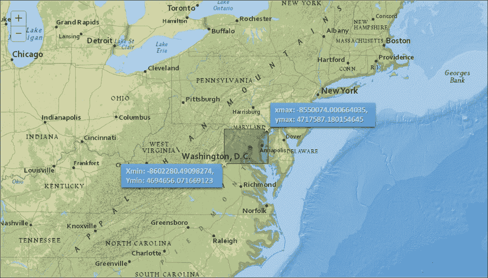
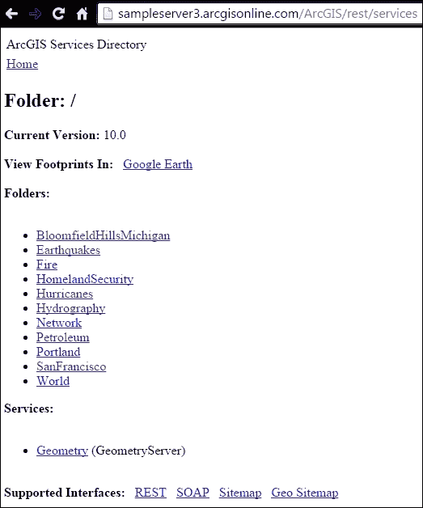
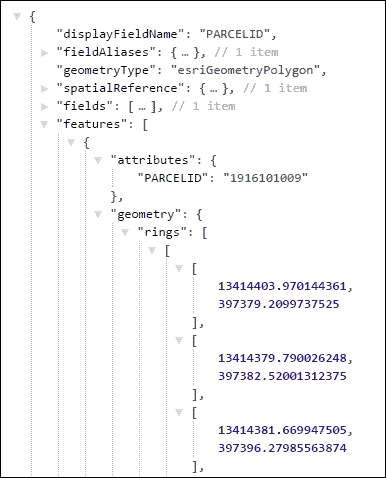

# 第一章。API 的基础

您可能正在阅读这本书，因为您想要使用 ArcGIS JavaScript API 将空间能力集成到您的 Web 应用程序中，并使其变得更加令人惊叹，或者您希望很快成为一名 Web 地图数据科学家。无论是什么，我们都与您同在。但是在着手实际项目之前，我们不认为需要一些基础工作。本章就是关于这个的——为本书后面使用的概念奠定坚实的基础。本章在内容上设计多样，涵盖了以下主题的许多内容：

+   使用 API 编写您的第一个地图应用程序

+   复习坐标几何、范围和空间参考系统。

+   介绍 dojo 和 AMD 编码模式

+   了解 ArcGIS Server 和 REST API

+   搭建开发环境

# 搭建开发环境

这本书是一本*示例*书，我们将通过开发的应用程序来解释概念。因此，在本章开始时，确保您的开发环境已经运行起来是至关重要的。以下部分提到的大多数环境只是我们的偏好，可能不是必须的，以实现本书提供的代码示例。所有的代码示例都针对运行在基于 Windows 的操作系统和名为**Brackets**的**集成开发环境**（**IDE**）。如果您有不同的操作系统和 IDE 选择，我们欢迎您在您最舒适的环境中开发。

## 浏览器、Web 服务器和 IDE

为了开发、部署和执行任何 Web 应用程序，我们需要以下组件：

+   Web 浏览器

+   Web 服务器

+   集成开发环境（IDE）

### Web 浏览器

我们在整本书中都使用了 Google Chrome，因为它提供了一些很棒的开发者工具和 HTML 检查工具。我们认为 Mozilla 也是一个很好的用于开发的浏览器。

### Web 服务器

本书中开发的应用程序是使用 IIS Express 进行托管的。IIS Express 是一个轻量级的 Web 服务器，主要用于托管.NET Web 应用程序。尽管本书中的所有项目都是使用纯 HTML、CSS 和 JavaScript 开发的，但我们将使用 Esri .NET 资源代理来访问 ArcGIS 在线安全内容，并避免跨域问题。

读者可以通过安装 Web 平台安装程序或直接从 Microsoft 下载页面安装 IIS Express，如下步骤所示：

1.  要安装 IIS Express，请访问[`www.microsoft.com/web/downloads/platform.aspx`](https://www.microsoft.com/web/downloads/platform.aspx)使用 Web 平台安装程序进行安装。

1.  下载后，在搜索文本中搜索`IIS Express`。搜索结果将显示 IIS Express 应用程序。点击 IIS Express 应用程序名称后面的**添加**按钮，然后点击页面底部的**安装**按钮，如下面的屏幕截图所示：

1.  从 Web 平台安装程序安装 IIS Express 可以确保我们可以获得 IIS Express 的最新版本，而直接下载链接可能无法提供最新版本的链接。在撰写本书时，最新的 IIS Express 直接下载链接可以在[`www.microsoft.com/en-us/download/details.aspx?id=34679`](https://www.microsoft.com/en-us/download/details.aspx?id=34679)找到。

1.  安装 IIS 后，您可以在`Program Files`文件夹内的`IIS Express`文件夹中找到可执行文件。默认位置通常是`C:\Program Files\IIS Express`。

1.  我们将在每个项目中提供一个可执行的批处理（`.bat`）文件，帮助启动 Web 服务器并将项目托管在指定的端口上。

1.  您可以在我们为本书开发的每个项目的可执行文件中找到以下代码行：

```js
"C:\Program Files\IIS Express\iisexpress.exe" /path:<app location>  /port:9098
```

1.  前面的行将在端口`9098`上托管应用程序。因此，要访问该应用程序，您只需要使用 URL-`http://localhost:9098/`。

### IDE

开发 JavaScript 代码的 IDE 选择很多，有经验的开发人员已经知道他们需要使用什么。我们在整本书中都使用了 Brackets 作为我们首选的 IDE。

## 设置 ArcGIS 开发者帐户

在本书的一些练习中，您将需要一个 ArcGIS 开发者帐户。这也是一个让您探索 ESRI 为开发人员提供的各种功能的机会。要设置开发者帐户，只需免费注册[`developers.arcgis.com/en/sign-up/`](https://developers.arcgis.com/en/sign-up/)。

## 你好，地图-快速启动代码

如果你和我们一样，你可能想立刻用编码的方式制作你的第一张地图。所以在这里。尝试将这些代码添加到 Brackets IDE 中的新 HTML 文件中。您还可以从代码存储库下载名为`B04959_01_CODE01`的 HTML 源代码，并双击 HTML 文件来运行它。



观察前面的代码行时，您可能已经注意到了这两件事：

+   我们不需要任何许可证、身份验证或密钥来运行此代码。换句话说，API 是免费的。您只需要使用 CDN 链接。

+   我们将在浏览器中看到这张美丽的制图地图，如下面的截图所示：

+   我们鼓励您缩放或平移到您想要查看地图的位置。如果您还没有弄清楚如何缩放/平移地图，我们将立即处理：

单击并拖动或按任何箭头键会导致平移，但不会改变详细级别。

*Shift* +左键拖动、鼠标滚动、双击或单击地图上的*+*或*- *按钮会导致缩放和显示的详细级别发生变化。

### 注意

还有其他方法可以实现缩放/平移功能。这里提到的方法只是为了获得初步的理解。

## 理解快速启动代码

让我们试着理解刚才看到的代码。这段代码中有三个概念我们想解释。第一个涉及 API 的引用链接或我们用来下载 ArcGIS JavaScript API（v 3.15）及其相关样式表的**内容交付网络**（**CDN**）。第二个概念试图向您介绍所采用的编码模式，即**异步模块定义**（**AMD**）模式。这是最新版本的 dojo（v1.10）所使用的。下一个概念是关于您在浏览器中运行代码时看到的内容-地图和我们提供给它的参数。

### API 参考链接

首先要做的是引用 API 来开发基于 ArcGIS JavaScript API 的应用程序。Esri 是拥有该 API 的组织，但该 API 是免费的，可供公众使用。截至 2016 年 3 月，API 的最新版本是 3.15，相应的 dojo 工具包版本是 1.10。

以下库可能是您可能需要引用的唯一库，以使用 ArcGIS JavaScript API 的功能以及许多 dojo 工具包，如`core dojo`、`dijit`、`dgrid`等：

```js
<link rel="stylesheet" href="http://js.arcgis.com/3.15/esri/css/esri.css">

<script src="http://js.arcgis.com/3.15/"></script>
```

请参阅此链接，以获取 ArcGIS JavaScript API 的完整文档-[`developers.arcgis.com/javascript/jsapi/`](https://developers.arcgis.com/javascript/jsapi/)。

当您访问上述 URL 时，您将看到一个网页，提供了 API 的完整文档，包括**API 参考**、**指南**、**示例代码**、**论坛**和**主页**等多个选项卡。

### 提示

**下载示例代码**

您可以从[`www.packtpub.com`](http://www.packtpub.com)的帐户中下载本书的示例代码文件。如果您在其他地方购买了本书，您可以访问[`www.packtpub.com/support`](http://www.packtpub.com/support)并注册，以便直接通过电子邮件接收文件。

你可以按照以下步骤下载代码文件：

+   使用你的电子邮件地址和密码登录或注册到我们的网站。

+   将鼠标指针悬停在顶部的**支持**选项卡上。

+   点击**代码下载和勘误**。

+   在**搜索**框中输入书名。

+   选择你要下载代码文件的书籍。

+   从下拉菜单中选择你购买这本书的地方。

+   点击**代码下载**。

你也可以通过点击 Packt Publishing 网站上书籍页面上的代码文件按钮来下载代码文件。可以通过在搜索框中输入书名来访问该页面。请注意，你需要登录到你的 Packt 账户。

文件下载后，请确保使用最新版本的解压缩软件解压文件夹：

+   Windows 上的 WinRAR / 7-Zip

+   Mac 上的 Zipeg / iZip / UnRarX

+   Linux 上的 7-Zip / PeaZip

API 参考列出了 API 下所有模块的详细信息、属性、方法和可用的事件。左侧窗格将大多数模块分组以便参考。例如，名为**esri/layers**的分组有多个从中继承的模块。以下截图显示了从**esri/layers**继承的不同模块的分组情况：


**指南**部分提供了重要主题的详细说明，比如**使用查询任务**，**使用 ArcGIS 在线小部件**，以及**使用符号和渲染器**。以下截图显示了设置地图范围的详细指南：


**示例代码**选项卡是另一个有用的部分，其中包含数百个示例应用程序，用于演示 API 中的不同概念。这些示例代码最好的部分是它们带有一个沙盒设施，你可以用来通过修改代码来玩耍。

**论坛**选项卡会将你重定向到以下网址—[`geonet.esri.com/community/developers/web-developers/arcgis-api-for-javascript`](https://geonet.esri.com/community/developers/web-developers/arcgis-api-for-javascript)。

GeoNet 社区论坛是一个很好的地方，可以在那里提出问题并分享解决方案，与像你一样的开发者交流。

由于它与 dojo 框架的紧密集成，需要对 dojo 工具包有一定的了解，其参考文档可以在[`dojotoolkit.org/reference-guide/1.10/`](http://dojotoolkit.org/reference-guide/1.10/)上访问。

### 编码的 AMD 模式

如果你观察了代码结构，它可能如下所示：



如果你不熟悉 JavaScript 编码的这种模式，它被称为 AMD 编码模式，ArcGIS JavaScript API 强调使用这种编码模式。在最初的章节中，我们将介绍很多关于这个的内容，以便熟悉 dojo 和 AMD。从代码结构中，你可能已经了解到代码*需要*某些模块，加载这些模块的函数要求它们按照相同的顺序。在我们的情况下，一些模块是 Esri 模块（`esri/..`）和 dojo 模块（`dojo/..`）。如果你想知道是否可以*需要*自定义定义的模块，答案绝对是肯定的，这将是我们在本书中的主要部分。

### esri/map 模块

代码中的高亮行构成了我们快速启动代码的核心：

```js
 **var map = new Map("mapDiv", {**
 **basemap: "national-geographic"**
 **});**

```

`map`模块接受两个参数。第一个参数是包含`map`对象的`div`容器。第二个参数是一个可选对象，它接受许多属性，可以用来设置地图的属性。

在我们的快速入门代码中，可选对象中的`basemap`属性设置了 Esri 提供的基础地图代码之一，名为`national-geographic`，用作背景地图显示。我们建议您尝试使用其他 Esri 提供的基础地图，例如以下内容：

+   卫星

+   深灰色

+   浅灰色

+   混合

+   拓扑

# 设置初始地图范围

有时，当应用程序打开时，您可能希望将其缩放到特定感兴趣的区域，而不是首先以世界范围显示地图，然后再缩放到您想要查看的区域。为了实现这一点，地图模块提供了一个属性来设置其初始范围，并在任何时候以编程方式更改其范围。

在此之前，让我们看看在地图的上下文中范围是什么。

### 注意

范围是包围地图上感兴趣区域的最小边界矩形。

## 刷新一些坐标几何

要了解范围，了解坐标几何将有所帮助。我们将把黄色的线段称为*折线*。蓝色线代表*多边形*（在我们的例子中是矩形）：


现在，试着观察前述图表和以下图表之间的差异。


以下是关于前述图表的一些说明：

+   点由一对坐标表示；图 1 中为（2，2），图 2 中为（-1，-1）

+   折线由一系列坐标表示

+   多边形也由一系列坐标表示，类似于折线

除了坐标和坐标轴之外，你可能已经发现两个图形的形状是相同的。这可能意味着两件事：

+   图表的*x*位置向左移动了 3 个单位，*y*位置向下移动了 3 个单位

+   或者可能意味着原点将其*x*和*y*位置移动了-3 个单位

第二种可能对我们来说更重要，因为它意味着图表的实际位置没有改变，只是原点或坐标轴改变了位置。因此，相对于坐标轴，图表形状（矩形、点和线）的坐标也发生了变化。

### 注意

相同的形状可以根据参考坐标系统的不同具有不同的坐标。在 GIS 的上下文中，这种坐标系统称为**空间参考**。

### 测验时间！

让我们测试一下我们的知识。尝试解决以下测验：

Q1\. 如果原点（矩形的左下角）是（100000，100000），点（三角形符号）的坐标将是什么？

Q2\. 由于多边形和折线都由一系列坐标表示，我们如何得出结论，给定一系列坐标，形状是多边形还是折线？

Q3\. 需要多少个坐标来表示一个矩形？

思考一下，我们很快就会给出答案。

### 空间参考系统

在数字屏幕上显示世界或世界的一部分作为地图时，我们需要使用空间参考系统来识别地图上位置的坐标，这是一个与我们的图表一样的二维表面。有许多标准的空间参考系统在使用中。我们需要知道的最基本的是，每个参考系统都有一个唯一的识别号，被 API 所识别。用于定义特定空间参考系统的完整参数（如使用的基准、原点坐标、使用的测量单位等）也可以用来识别特定的空间参考系统。

### 注意

用于识别 SRS 的唯一 ID 称为**Well-known ID**（**wkid**）。

列出用于定义空间参考系统的参数的字符串称为**Well-known Text**（**wkt**）。

正如你可能预料的那样，每个空间参考系统都与不同的测量系统相关联，如英尺、米或十进制度。

例如，`4326`是全球坐标系统**WGS 84**的 wkid。该参考系统的测量单位是十进制度。

`102100`是另一个全局坐标系统的 wkid，其测量单位为米。

以下 URL 提供了一系列 wkid 和对应的 wkt，网址为[`developers.arcgis.com/javascript/jshelp/pcs.html`](https://developers.arcgis.com/javascript/jshelp/pcs.html)和[`developers.arcgis.com/javascript/jshelp/gcs.html`](https://developers.arcgis.com/javascript/jshelp/gcs.html)。

### 测验结果

A 1\. （100002，100002）—相对于原点，该点在正 x 方向上离开 2 个单位，在正 y 方向上离开 2 个单位。

A 2\. 除非在几何对象中明确提到，否则坐标序列可以是折线或多边形。但是多边形具有一个使它与折线不同的属性——第一个和最后一个坐标必须相同。折线可以具有相同的第一个和最后一个坐标，但并非所有折线都满足这一标准。

A 3\. 如果你的答案是 4，那太棒了！但如果你的答案是 2，那你太棒了。

是的。只需要两个坐标就足以定义矩形，这要归功于它的垂直性质。这两个坐标可以是任意一对对角坐标，但为了 API 的方便起见，我们将采用左下角坐标和右上角坐标。左下角坐标在 4 个坐标值对中具有最小的*x*和*y*坐标值，而右上角坐标具有最大的*x*和*y*坐标值：


### 获取当前地图范围

将地图缩放到您想要设置为地图初始范围的范围。在快速启动代码中，地图变量是一个全局对象，因为它是在`require`函数之外声明的。

```js
<script>
    var map; //Global variable
    require([
      "esri/map"
    ],
      function (
        Map
      ) {
        map = new Map("myMap", {
          basemap: "national-geographic"
        });
});
});
</script>
```

这意味着我们可以在浏览器控制台中访问地图的属性。在缩放地图和所需的范围作为地图初始范围之后，使用*Ctrl* + *Shift* + *I*命令（在 Chrome 中）打开开发者工具。在 JavaScript 浏览器控制台中，尝试访问地图属性，`getMaxScale()`、`getMinZoom()`、`getMinScale()`、`getMaxZoom()`、`getScale()`和`extent`：


比例实际上是地图测量从现实世界测量中缩小的因素。最大比例显示地图上的最大细节，而地图的最小比例显示最少的细节。`map.getMaxScale()`的值小于`map.getMinScale()`的值，因为比例值代表倒数。因此*1/591657527 < 1/9027*（在我们的实例中分别为 1/9027.977411 和 1/591657527.59…）。

另一方面，缩放级别是地图显示的离散缩放级别。大多数涉及 Basemaps 或 Tiledmaps（将在后面的章节中讨论）的地图只能在特定的缩放级别（称为缩放级别）上显示。最小缩放级别通常为`0`，并与地图的最大比例相关联。

`map.getScale()`给出了当前的比例，`map.extent`给出了地图的当前范围。我们可以使用这个`extent`对象来使用地图的`setExtent()`方法设置地图的范围。参考`map`模块的 API 文档，并导航到地图的`setExtent`方法。`setExtent()`方法接受两个参数——`Extent`对象和一个可选的 fit 对象。当我们点击文档中提供的超链接`Extent`对象时，它会将我们重定向到`Extent`模块的 API 文档页面：


`Extent`的构造函数接受一个 JSON 对象并将其转换为范围对象。我们可以从地图范围的 JSON 字符串中获取这个 JSON 对象：



前面的图像向我们展示了地图的范围的 JSON 字符串，我们已经放大到了地图的范围。以下的截图显示了坐标与我们打算放大的地图区域的关系（用矩形标出）：



现在，我们可以复制 JSON 对象，创建一个`Extent`对象，并将其分配给地图的`setExtent`方法。但在此之前，我们需要导入`Extent`模块（`esri/geometry/Extent`）。以下截图解释了如何实现这一点。


现在当我们刷新地图时，地图将自动放大到我们设置的范围。

### 加载模块的模板生成器

在之前的代码中，我们成功设置了地图的初始范围，我们需要使用两个模块：`esri/map`和`esri/geometry/Extent`。随着应用程序的增长，我们可能需要添加更多的模块来为应用程序添加额外的功能。对于新手用户来说，从 API 中找到模块名称并将其整合到应用程序中可能会很麻烦。可以通过一个网页应用程序模板生成器来简化这个过程，该生成器可以在[`swingley.github.io/arg/`](http://swingley.github.io/arg/)找到。

以下是应用程序的截图：


我们`require`函数所需的模块可以在应用程序顶部提供的文本框中输入。有两个多选列表框：一个列出 Esri 模块，另一个列出 dojo 模块。一旦我们开始输入我们应用程序所需的模块名称，列表就会显示与我们输入的名称匹配的建议模块。一旦我们从任一列表框中选择所需的模块，它就会被添加到`require`函数的模块列表中，并且适当的别名会作为参数添加到回调函数中。一旦选择了所有所需的模块，我们就可以使用右侧生成的基本模板。要设置地图的初始范围，可以通过搜索以下名称来加载所需的模块：

+   地图（`esri/map`）

+   范围（`esri/geometry/Extent`）

# 理解 dojo 和 AMD

顾名思义，AMD 编码模式依赖于将 JavaScript 代码模块化。有很多原因你可能需要开始编写模块化代码或模块：

+   模块是为了单一目的而编写的，而且专注于此

+   因此模块是可重用的

+   模块具有更清晰的全局范围

虽然有许多编写模块化 JavaScript 的格式，比如 CommonJS 和 ES Harmony，但我们只会处理 AMD，因为最新版本的 ArcGIS JavaScript API 和基于其上的 dojo 工具包使用 AMD 风格的编码。Dojo 加载器解析依赖项并在运行应用程序时异步加载模块。

## AMD 的关键组件

在本节中，我们将看一下`define`和`require`方法，这是 AMD 的关键组件。

### 定义方法

`define`方法定义了一个模块。一个模块可以有自己的私有变量和函数，只有被`define`函数返回的变量和函数才会被导入该模块的其他函数所暴露。`define`方法的一个示例如下：


请注意我们代码示例中的以下内容：

+   `define`方法中的第一个参数是模块名称或 ID。这是可选的。`dojoGreeting`是我们模块的名称。

+   第二个参数是我们模块的依赖项数组。对于这个模块，我们不需要任何依赖项，所以我们只传递一个空数组。

+   第三个参数是一个回调函数，接受我们可能已加载的依赖项的任何别名。请注意，用作函数参数的别名应该与在依赖数组中定义的顺序相同。由于我们没有使用任何依赖项，所以我们不会将任何东西传递给这个回调函数。

+   在回调函数中，我们可以有许多私有作用域的变量和函数。我们想要从该模块中公开的任何变量或函数都应该包含在定义函数内的`return`语句中。

+   在我们的示例中，`_dojoGreeting`是一个由`define`方法返回的私有作用域变量。

### require 方法

`require`方法使用自定义定义的模块或在外部库中定义的模块。让我们使用刚刚定义的模块和`require`方法：


就是这样。请密切关注`require`方法的参数：

+   第一个参数是模块依赖项的数组。第一个模块依赖项是我们刚刚定义的自定义模块`dojoGreeting`。

+   `dojo/dom`模块让我们可以与 HTML 中的`dom`元素交互。

+   `dojo/domReady!`是一个 AMD 插件，它会等待 DOM 加载完成后再返回。请注意，该插件在末尾使用了特殊字符“`!`”。在回调函数中，我们不需要分配别名，因为它的返回值是无意义的。因此，这应该是依赖数组中使用的最后一个模块之一。

+   回调函数使用`dojoGreeting`和`dom`作为`dojoGreeting`和`dojo/dom`模块的别名。如前所述，我们不需要为`dojo/domReady!`使用别名。

+   `dom`模块的`byId()`方法通过其 ID 返回一个`dom`节点的引用。它与`document.getElementById()`非常相似，只是`dom.byId()`可以在所有浏览器中使用。

+   在我们的 register 方法中，我们假设有一个 ID 为`greeting`的`div`元素。

## 一些很棒的 dojo 模块

你已经了解了两个 dojo 模块，即`dojo/dom`和`dojo/domReady`。现在，是时候熟悉一些其他很棒的`dojo`模块了，你应该尽可能在编写 ArcGIS JS API 应用程序时使用它们。坚持使用纯 dojo 和 Esri JS 模块将在代码完整性和跨浏览器统一性方面产生巨大的回报。更重要的是，Dojo 在常用的 JavaScript 功能方面为你带来了一些惊喜，其中一些我们将很快介绍。

### Dojo dom 模块

你已经使用了`dojo/dom`模块。但是还有其他的 dojo `dom`模块，它们可以让你操作和处理`dom`节点：

+   `dojo/dom-attr`：这是与`dom`属性相关的首选模块：

+   模块中的`has()`方法检查给定节点中是否存在属性

+   `get()`方法返回请求属性的值，如果该属性没有指定或默认值，则返回 null

+   正如你可能已经猜到的，有一个`set()`方法，你可以用它来设置属性的值

+   `dojo/dom-class`：该模块提供了与`dom`节点关联的 CSS 类的大部分操作

+   `dojo/dom-construct`：`dojo/dom-construct`模块让你可以轻松构建`dom`元素

### Dojo 事件处理程序模块

`dojo/on`模块是一个由大多数浏览器支持的事件处理程序模块。`dojo/on`模块可以处理大多数类型对象的事件。

### Dojo 数组模块

你应该优先使用 dojo 的数组模块，而不是原生 JavaScript 数组函数，原因有很多。Dojo 的数组模块名为`dojo/_base/array`。

#### dojo/_base/array

正如您所期望的那样，作为数组模块的一部分，有一个称为`forEach()`的迭代器方法，以及`indexOf()`和`lastIndexOf()`方法。现在来看最好的部分。有一个`filter()`方法，它返回一个根据特定条件过滤的数组。我们认为`map()`方法是一个宝石，因为它不仅遍历数组，还允许我们修改回调函数中的项目并返回修改后的数组。您是否曾想过检查数组的每个元素或至少一个元素是否满足特定条件？请查看此模块中的`every()`和`some()`方法。

这个示例代码解释了 dojo 数组模块的两个主要方法：


上述代码将以下内容打印到浏览器的控制台窗口中：

```js
Day #1 is Monday
Day #2 is Tuesday
Day #3 is Wednesday
Day #4 is Thursday
Day #5 is Friday
Day #6 is Saturday
Day #7 is Sunday
```

# 了解 ArcGIS 服务器和 REST API

ArcGIS 服务器是 Esri 公司的产品，通过在网上共享地理空间数据来实现 WebGIS。我们的 JavaScript API 能够通过 REST API 消耗这个服务器提供的许多服务。这意味着 ArcGIS 服务器提供的所有这些服务都可以通过 URL 访问。现在，让我们看看 REST API 接口对开发人员有多么有帮助。

## 服务类型

当您运行本书中提供的第一个代码时，在网页上看到了一个地图。您在浏览器中看到的地图实际上是一组拼接在一起的图像。如果您在加载地图时观察了开发者工具中的**网络**选项卡，您会意识到这一点。这些单独的图像被称为**瓦片**。这些瓦片也是由 ArcGIS MAP 服务器提供的。以下是一个这样的瓦片的 URL：[`server.arcgisonline.com/ArcGIS/rest/services/World_Street_Map/MapServer/tile/2/1/2`](http://server.arcgisonline.com/ArcGIS/rest/services/World_Street_Map/MapServer/tile/2/1/2)。

这意味着通过 ArcGIS 服务器发布并可通过 API 访问的任何资源都是通过 URL，如下面的屏幕截图所示：


### 注意

ArcGIS 服务端点的格式将是：`<ArcGIS 服务器名称>/ArcGIS/rest/services/<文件夹名称>/<服务类型>`。

ArcGIS 服务器提供了一个用户界面来查看这些 REST 端点。这个界面通常被称为**服务目录**。

在计划使用特定的 GIS 服务之前，开发人员需要查看服务目录。服务目录支持多种格式，如 JSON 和 HTML，HTML 是默认格式。如果您无法查看服务目录，您需要联系您的 GIS 管理员，以启用您感兴趣的服务的服务浏览功能。

## 使用服务目录

让我们探索 Esri 提供的一个名为`sampleserver3.arcgisonline.com`的示例 GIS 服务器。

要查看任何 GIS 服务器的服务目录，语法是`<GIS 服务器名称>/ArcGIS/rest/services`。

因此，我们需要导航到的 URL 是：[`sampleserver3.arcgisonline.com/ArcGIS/rest/services`](http://sampleserver3.arcgisonline.com/ArcGIS/rest/services)。

您将在浏览器中看到这个屏幕：



服务目录中感兴趣的项目是**文件夹**标题标签下的链接列表和**服务**标题标签下的链接列表。我们鼓励您导航到这些链接中的每一个，并查看它们公开的服务类型。您将找到以下类型的服务：

+   **MapServer**：这个服务地理空间数据

+   **FeatureServer**：这使得编辑功能成为可能

+   **ImageServer**：这个服务图像瓦片

我们有没有提到服务目录支持多种格式，比如 JSON？我们鼓励您在 URL 的末尾添加一个查询字符串参数，比如`?f=json`。要将服务目录视为 HTML，只需从 URL 中删除查询字符串参数。

### 地图服务器

地图服务器将 GIS 数据公开为 REST 端点。

让我们更多地了解名为`Parcels`的特定地图服务器，位于`BloomfieldHillsMichigan`文件夹中。导航到此 URL：[`sampleserver3.arcgisonline.com/ArcGIS/rest/services/BloomfieldHillsMichigan/Parcels/MapServer`](http://sampleserver3.arcgisonline.com/ArcGIS/rest/services/BloomfieldHillsMichigan/Parcels/MapServer)。

以下标题标签对我们特别感兴趣：图层、表和描述。现在，让我们更深入地研究地图服务器中的一个图层。这三个图层都值得浏览。为了解释起见，让我们选择第一个图层（图层 ID：`0`），可以直接导航到此 URL：[`sampleserver3.arcgisonline.com/ArcGIS/rest/services/BloomfieldHillsMichigan/Parcels/MapServer/0`](http://sampleserver3.arcgisonline.com/ArcGIS/rest/services/BloomfieldHillsMichigan/Parcels/MapServer/0)。

此 URL 中列出的所有标题标签都值得思考。我们将讨论其中一些：

+   **Geometry Type**描述了特定图层的几何类型。在我们调查的 URL 中，它被命名为`'esriGeometryPoint'`，这意味着它是一个点要素。

+   元数据，如`'Description'`，`'Copyright Text'`。

+   关于数据的地理范围的信息在标签`'Extent'`和`'Spatial Reference'`下。

+   `Drawing Info`标签定义了数据在地图上的呈现方式。

+   `'Fields'`显示了我们图层的表模式。实际字段名与字段类型和字段的别名一起提到。别名和字段类型信息对于对数据执行查询是必要的。`'esriFieldTypeString'`和`'esriFieldTypeSmallInteger'`的字段类型表示该字段应分别被视为字符串和数字。`'esriFieldTypeOID'`是一种特殊类型的字段，它保存了图层中要素的唯一对象 ID。

#### 查询端点

页面底部将有一个名为**支持的操作**的标题标签，列出了此层公开的各个端点的链接。可能会有一个名为**查询**的链接。这个链接是我们深入研究 ArcGIS Server 和 REST 端点的原因。点击链接或使用此直接 URL 导航到它：[`sampleserver3.arcgisonline.com/ArcGIS/rest/services/BloomfieldHillsMichigan/Parcels/MapServer/0/query`](http://sampleserver3.arcgisonline.com/ArcGIS/rest/services/BloomfieldHillsMichigan/Parcels/MapServer/0/query)。


UI 提供了我们可以使用该特定图层（**建筑足迹**）进行查询的所有可能方式。查询操作似乎支持空间查询和平面表 SQL 查询。目前，让我们只讨论平面表查询。**Where**字段和**Return Fields (Comma Separated)**是处理平面表查询的字段。**Where**字段接受标准的 SQL `where`子句作为输入，**Return Fields**接受一个以逗号分隔的字段名称值，需要作为输出。但在开发的这个阶段，我们只是探索者，我们只需要看到这个接口返回的数据类型。将以下值输入到相应的文本框中：

+   **Where**: `1 = 1`

+   **Return Fields**: `*`

点击**查询（GET）**按钮并滚动到屏幕底部。

查询实际上返回了来自数据库的所有字段的所有图层数据，但 ArcGIS Server 将结果限制为 1000 个要素。请注意浏览器的 URL 已更改。以下 URL 是用于触发此查询的 REST GET 请求 URL：[`sampleserver3.arcgisonline.com/ArcGIS/rest/services/BloomfieldHillsMichigan/Parcels/MapServer/0/query?text=&geometry=&geometryType=esriGeometryPoint&inSR=&spatialRel=esriSpatialRelIntersects&relationParam=&objectIds=&where=1%3D1&time=&returnIdsOnly=false&returnGeometry=true&maxAllowableOffset=&outSR=&outFields=*&f=html`](http://sampleserver3.arcgisonline.com/ArcGIS/rest/services/BloomfieldHillsMichigan/Parcels/MapServer/0/query?text=&geometry=&geometryType=esriGeometryPoint&inSR=&spatialRel=esriSpatialRelIntersects&relationParam=&objectIds=&where=1%3D1&time=&returnIdsOnly=false&returnGeometry=true&maxAllowableOffset=&outSR=&outFields=*&f=html)。

以下 URL 从前述 URL 中删除所有可选和未定义的查询参数，也将产生相同的结果：[`sampleserver3.arcgisonline.com/ArcGIS/rest/services/BloomfieldHillsMichigan/Parcels/MapServer/0/query?where=1%3D1&outFields=*&f=html`](http://sampleserver3.arcgisonline.com/ArcGIS/rest/services/BloomfieldHillsMichigan/Parcels/MapServer/0/query?where=1%3D1&outFields=*&f=html)。

现在让我们通过缩小`Where`子句来更详细地分析结果数据。注意结果中第一个要素的**OBJECTID**字段：

1.  删除`Where`子句文本框中的值。

1.  在对象 ID 文本框中输入所注意的**OBJECTID**。我们注意到的对象 ID 是**5991**（但您也可以选择任何一个）。

1.  有一个名为格式的下拉菜单。选择名为`'json'`的下拉值

1.  点击**查询（GET）**按钮。

或者，这是实现相同操作的直接 URL：[`sampleserver3.arcgisonline.com/ArcGIS/rest/services/BloomfieldHillsMichigan/Parcels/MapServer/0/query?objectIds=5991outFields=*&f=pjson`](http://sampleserver3.arcgisonline.com/ArcGIS/rest/services/BloomfieldHillsMichigan/Parcels/MapServer/0/query?objectIds=5991outFields=*&f=pjson)。

现在，结果看起来非常详细。我们正在查看的是单个要素的数据。JSON 返回了几个特征键值对，其中包括`displayFieldName`、`fieldAliases`、`geometryType`、`spatialReference`、`fields`和`features`等键。

让我们看看`feature`键值对。`features`键的值是对象数组。每个对象都有名为`attributes`和`geometry`的键。属性保存对象的值，列出字段名称和其值的键值。在我们的案例中，`PARCELID`是字段名，`"1916101009"`是它的值：



几何对象表示具有环对象数组的多边形要素。每个环都是浮点数数组。我们之前处理多边形时只是一个坐标数组。但是 ArcGIS Server 将多边形视为环的数组。要理解环的概念，请查看以下插图：


在前面的插图中，我们处理了两个不相交的多边形，但在现实世界中被视为单个单位，比如房屋和车库。ArcGIS 用两个环表示多边形要素。第一个环由坐标组成，称为[[x1, y1], [x2, y2],…[x6,y6]]，第二个环由坐标组成，称为[[x7,y7],..[x10, y10]]。

# 总结

我们使用了 ArcGIS JS API 的 CDN 来访问 API，并尝试理解地图和 Esri 几何模块。我们试图通过复习坐标几何知识来更好地理解范围和空间参考。我们现在知道，范围只是一个可以使用两个坐标定义的最小边界矩形，空间参考系统类似于图表上的坐标轴。我们试图查看道具工具包提供的一些令人惊叹的模块，我们必须考虑在我们的代码中使用它们。ArcGIS Server 将其 GIS 数据和其他资源公开为 REST API，也就是说，它可以作为 URL 使用。您还了解到开发人员在开始通过 API 消耗任何服务之前，必须始终参考服务目录。我们在这本书中为通过项目工作制定了开发环境的偏好。下一章将涉及 API 中使用的不同类型的图层以及每种类型使用的理想上下文。我们还将介绍 Esri 提供的一些最常用的内置小部件，并在我们的应用程序中使用它们。
