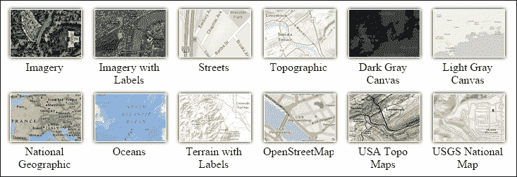
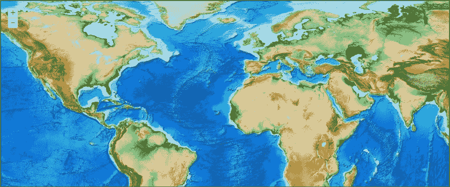
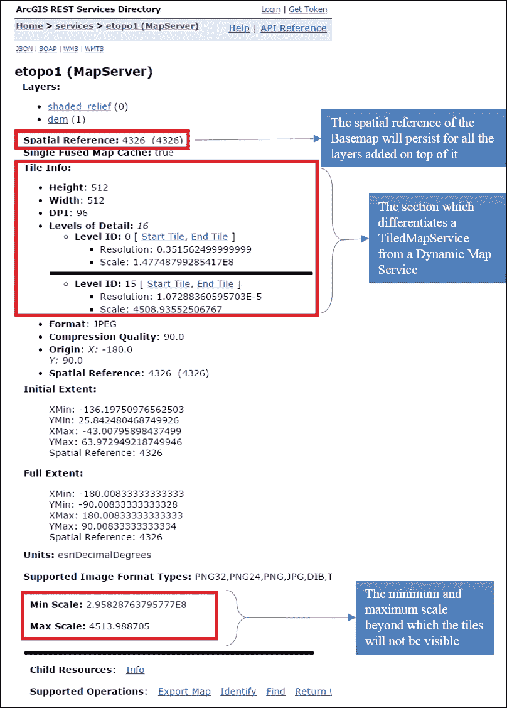
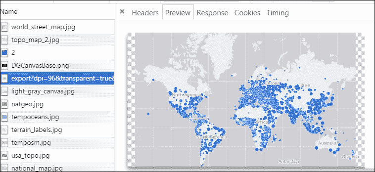
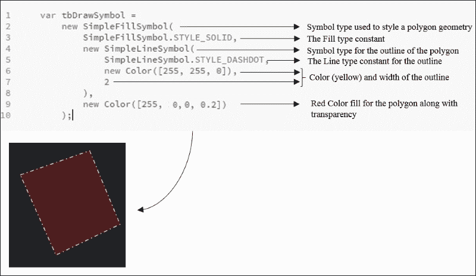

# 第二章。图层和小部件

构成我们网络地图应用程序的两个基本组件是图层和小部件。地图对象类似于一个容纳所有图层的画布，用户可以与之交互，例如平移和缩放地图。图层主要与特定数据源相关联。小部件由 JavaScript 逻辑和 HTML 模板（如果需要用户交互）组成。小部件可以与地图交互，也可以独立运行。Esri 开发了许多通用小部件，并将其捆绑到 API 中。我们将在本书中讨论如何使用这些小部件。我们还将在下一章中看到如何开发自定义小部件。本章为开发显示历史地震数据的完整网络地图应用程序奠定了起点。随着我们在本章中的进展，我们将在以下主题中获得牢固的立足点：

+   API 支持的数据源

+   在 API 的上下文中图层的概念

+   图层的功能分类

+   不同类型的图层及其属性

+   要素图层与 DynamicMapService 与图形图层

+   使用 Esri 的内置小部件

# API 支持的数据源

ArcGIS JavaScript API 是一种功能强大且灵活的客户端地图软件，它提供了对各种空间数据源的集成支持，目前正在生产中。它还支持可视化平面文件格式，如 CSV，其中包含一些纬度和经度信息。

为了充分利用 ArcGIS JavaScript API 提供的全部功能，了解它支持的数据源列表以及其公开的属性和方法是很重要的。

截至版本 3.14，ArcGIS JavaScript API 支持的数据源可以大致分为以下几类：

+   ArcGIS Server 服务

+   符合 OGC 标准的 GIS 服务

+   平面文件格式

+   自定义网络服务（最好是 REST 服务）

让我们回顾不同的数据源格式，并了解如何获取有关数据的必要信息，以在 ArcGIS JavaScript API 中使用。

## 平面文件格式

API 提供原生支持以渲染 KML 和 CSV 等平面文件格式。

### KML

**Keyhole 标记语言**（**KML**）是一种空间文件格式，最初由 Google 开发，目前由 OGC 维护。它支持点、线和多边形几何图形，甚至图像叠加。KML 是一种广为人知的 XML，以其多功能性而闻名，但它非常冗长，并且在 Google 地图中使用。KML 文件可以在任何文本编辑器中打开，如 Notepad++。

### CSV 文件

CSV 文件是一种存储以逗号分隔的字段值的表格数据的纯文本文件格式。CSV 文件包含有关纬度和经度或坐标值（如*X*和*Y*坐标）的信息。API 可以读取 CSV 文件，并将位置信息转换为 API 上的位置。

## ArcGIS Server

ArcGIS Server 可用于在 Web 上共享空间数据。在我们的情况下，如果我们有形状文件、个人地理数据库、文件地理数据库或企业地理数据库，我们可以使用 ArcGIS Server 将数据作为 REST 服务在 Web 上提供。ArcGIS JavaScript 能够消费这些服务并将其显示在地图上。在其他空间格式的情况下，例如 DWG，我们可以使用 ArcGIS 桌面或**特征操作引擎**（**FME**），这是一个用于转换为 Esri 文件格式并通过 ArcGIS Server 发布的空间 ETL 工具。

# 图层的概念

如果你曾经学过 GIS 的入门课程，你一定熟悉 GIS 图层相互叠加的经典形象。在 API 的上下文中，图层是作为 REST 端点或 JSON 对象可用的数据资源。（没错，你可以使用 JSON 字符串构建 Web 地图图层。）我们很快就会讨论这些地图图层的来源和类型，但在此之前，让我们列出任何地图图层的最重要考虑因素：

+   图层是任何数据源的容器对象

+   可以使用图层对象将数据添加到地图对象中

+   图层形成堆栈架构——添加的第一层位于底部

通常将*底图图层*放在底部

+   地图对象具有一个特殊的内置图层，用于包含所有地图图形

这被称为*图形图层*，并且始终位于顶层

+   所有其他功能图层都是在中间添加的

+   图层的可见性可以随时打开或关闭

## 向地图添加图层

在处理不同类型的图层之前，我们将讨论如何将任何图层添加到地图对象中，因为这个过程对于任何图层类型都是相同的，而且非常简单。在下图中，我们可以看到所有类型的图层：


有两种方法可以将任何图层添加到地图对象中。假设`prjMap`是定义的地图对象的名称，我们需要添加一个图层；你可以采用以下两种方法之一：

+   **方法 1**：

```js
//Method 1
prjMap.addLayer(layer1);
/*layer1 is the layer object we would like to add to the map. */
```

+   **方法 2**：

```js
//Method 2
prjMap.addLayers([layer1]);
```

就是这么简单！第二种方法是首选方法，因为某些小部件或功能必须等到地图中的所有图层加载完毕才能使用。使用第二种方法将使我们能够使用在所有图层加载完毕后触发的事件处理程序。我们将在本章末讨论这些事件处理程序。

## 图层的功能分类

从功能上讲，可以将添加到地图的不同类型的图层分类如下：

+   底图或瓦片地图图层

+   功能图层

+   图形图层

让我们分别讨论每一个。

### 底图图层

底图图层是可以用作参考背景地图的图层。通常，卫星图像、地形图（显示海拔高度的地图）或街道地图可以起到这个作用。底图通常是缓存的图像瓦片。这意味着底图是一个静态资源。由于它们是静态的，并且作为图像瓦片提供，我们无法与底图上看到的要素进行交互（例如查询或选择）。而且由于这是底图，这也是最底层的图层，也是首先添加到地图中的图层。

现在，API 提供了不同的方法来向地图添加`basemap`属性：

+   将`basemap`属性添加到地图对象中：

```js
var map = new Map("mapDiv", {basemap: "streets"});
```

+   使用 API 提供的内置`basemap`库。

这使我们能够在多个底图之间切换，例如卫星图像、街道地图、地形图、国家地理地图、OpenStreetMaps 等。

+   通过向地图对象添加瓦片地图图层来创建自己的底图（我们很快将讨论有关瓦片地图图层的内容）。

下载名为`B04959_02_CODE_01`的项目文件夹，并打开`index.html`以了解底图库小部件的使用方法：



### 功能图层

功能图层显示所有最新更改，因此在性质上是动态的，而不同于底图或缓存瓦片图层的相对静态性质。功能图层是可以与之交互的图层。API 提供了对大多数这些图层执行不同操作的选项，例如：

+   选择要素

+   检索要素的属性和几何信息

+   对数据执行查询

+   渲染要素（使用不同的符号、颜色、宽度和其他图形属性对要素应用样式）

+   允许对要素进行创建、更新和删除（CRUD）操作

功能图层将*动态重投影*，基于 Basemap 的空间参考。这意味着功能图层的空间参考系统可能与 Basemap 不同，它们仍然会与 Basemap 对齐，因为 API 将从服务器请求功能图层的重投影数据。有不同类型的功能图层，例如动态图层和要素图层，我们将很快处理。

### 图形图层

图形图层在操作方面具有最大的灵活性。在这里，您可以向属性对象添加尽可能多的数据。您可以分配或修改其几何（使用**绘图**工具栏或甚至以编程方式），添加符号，查询它（对于功能图层，查询或更新操作可能被禁用），删除它，用它来选择功能图层中的要素，或者仅将其用作标注工具。但是图形图层的寿命也是最短的，因为它在会话结束后不会持久存在-这些只是存储在客户端上。由于这些属性，将图形图层作为最顶层是有意义的，不是吗？

### 注意

处理图形图层时，开发人员需要注意输入数据源的空间参考。`esri/geometry/webMercatorUtils`是一个方便的模块，可以让我们将 Web 墨卡托坐标转换为地理坐标，反之亦然。

## 图层类型

我们对图层的功能分类有了一瞥。API 提供了一系列模块，用于从不同数据源加载图层，这些数据源通常属于我们研究过的功能分类之一。我们将回顾 API 提供的一些最重要的图层类型以及它公开的方法和属性。

### ArcGIS Tiledmap 服务图层

这是由 ArcGIS Server 提供的缓存 Tiledmap 图层：

| 名称 | 值 |
| --- | --- |
| 模块名称 | `esri/layers/ArcGISTiledMapServiceLayer` |
| 数据源类型 | `ArcGIS REST Service` |
| 图层类型 | `BaseMap /Tiled Cache Layer` |
| 响应类型 | `Cached image tiles` |
| 构造函数 | `new ArcGISTiledMapServiceLayer(url, options?)` |
| 首选别名 | `ArcGISTiledMapServiceLayer` |

### 提示

**首选别名**

API 提供的首选别名作为代码约定的一部分，并可以在[`developers.arcgis.com/javascript/jsapi/argument_aliases.html`](https://developers.arcgis.com/javascript/jsapi/argument_aliases.html)上访问。

为什么我们需要使用不同的 Basemap，当我们已经有 Esri 提供的很多选项呢？嗯，我们发现了来自 NOAA 的美学和视觉信息丰富的瓦片地图服务，显示了世界地形和海底地形（海底高程差异）的彩色阴影浮雕：



您可以考虑将其用作 Basemap，用于显示任何全球现象，如灾害或地震。我们该如何做呢？如果您查看此模块的构造函数，它会查找一个必需的`URL`参数和一个可选的`options`参数。

我们谈论的 NOAA 服务的 URL 是[`maps.ngdc.noaa.gov/arcgis/rest/services/etopo1/MapServer`](http://maps.ngdc.noaa.gov/arcgis/rest/services/etopo1/MapServer)。

现在，让我们尝试将其作为`ArcGISTiledMapLayer`来使用（代码参考：`B04959_02_CODE1.html`）：

```js
require([
"esri/map",
"esri/layers/ArcGISTiledMapServiceLayer",
"dojo/domReady!"
    ], function (
            Map, ArcGISTiledMapServiceLayer
        ) {
var map = new Map("mapDiv");
vartileMap = new ArcGISTiledMapServiceLayer("http://maps.ngdc.noaa.gov/arcgis/rest/services/etopo1/MapServer");
map.addLayer(tileMap);
        });
```

这就是您需要编写的所有代码，以在屏幕上看到美丽的地图。

Tiledmap 服务的服务目录为我们提供了许多有用的信息，开发人员在使用应用程序中的 Tiledmap 服务之前应该考虑。让我们查看先前提到的`ArcGISTiledMapServiceLayer`的服务目录。在下一节提供的服务目录截图中，开发人员可以了解有关数据源的许多信息：

+   空间参考

+   TileInfo

+   初始范围和 FullExtent

+   最小比例和最大比例

+   贡献到瓦片的图层

### 空间参考

瓦片地图服务或底图的**空间参考**是开发人员在编码的初始阶段经常忽视的重要属性之一。瓦片地图服务的**空间参考**设置为整个地图的空间参考。添加到地图中的操作图层，如动态地图服务和要素图层，符合此**空间参考**，无论它们各自的空间参考是什么。



#### TileInfo

**TileInfo**提供了有关`TiledMapService`遵循的平铺方案的信息。**详细级别**可用于设置地图的缩放范围。

#### 范围和比例信息

范围和比例信息为我们提供了有关可见瓦片范围的信息。

从项目文件夹`B04959_02_CODE_02`下载完整的代码，并查看您美丽的瓦片地图的效果。

### ArcGIS DynamicMapService 图层

这个模块，顾名思义，是来自 ArcGIS Server REST API 的动态托管资源：

| 名称 | 值 |
| --- | --- |
| 模块名称 | `esri/layers/ArcGISDynamicMapServiceLayer` |
| 数据源类型 | `ArcGIS REST 服务` |
| 图层类型 | `功能图层` |
| 响应类型 | `动态生成的图像` |
| 构造函数 | `new ArcGISDynamicMapServiceLayer(url, options?)` |

动态地图图层实际上代表了非缓存地图服务公开的所有数据。出于同样的原因，动态地图图层是一种复合图层，因为地图服务通常具有多个图层。

我们将在一会儿看到这意味着什么。我们将参考服务目录（是的，这是一个花哨的术语，用于指导我们导航到地图服务 URL 时出现的界面）。

在浏览器中打开此地图服务的 URL - [`maps.ngdc.noaa.gov/arcgis/rest/services/SampleWorldCities/MapServer`](http://maps.ngdc.noaa.gov/arcgis/rest/services/SampleWorldCities/MapServer)。

您将能够看到地图服务公开的所有数据图层。因此，当您使用此地图服务时，所有数据将作为单个 DynamicMapService 图层的一部分显示在地图上：


### 注意

如果您无法看到先前显示的任何服务的服务目录，则并不意味着该服务已离线；可能是在生产机器上关闭了服务浏览。

确保尝试通过附加名为`f`值为`json`的查询参数来尝试 URL，例如，`{{url}}?f=json`。

之前，我们讨论了如何将`ArcGISTiledMapServiceLayer`添加到地图中。以下代码在现有的瓦片图层上添加了`ArcGISDynamicMapService`图层：

```js
require(["esri/map",
"esri/layers/ArcGISTiledMapServiceLayer",
"esri/layers/ArcGISDynamicMapServiceLayer",
"dojo/domReady!"
],
function (
Map,
ArcGISTiledMapServiceLayer,
ArcGISDynamicMapServiceLayer
) {
var map = new Map("mapDiv");
varshadedTiledLayer = new ArcGISTiledMapServiceLayer('http://maps.ngdc.noaa.gov/arcgis/rest/services/web_mercator/etopo1_hillshade/MapServer');

**varworldCities = new ArcGISDynamicMapServiceLayer("http://maps.ngdc.noaa.gov/arcgis/rest/services/SampleWorldCities/MapServer");**

map.addLayers([shadedTiledLayer, worldCities]);
    });
```

现在，如果您已经注意到，`ArcGISDynamicMapServiceLayer`和`ArcGISTiledMapServiceLayer`都使用地图服务。那么，我们如何知道哪个地图服务应该用作瓦片地图服务，哪个可以用作 DynamicMapService 呢？您可能已经猜到了。服务目录就是答案。服务目录中有一个特定的标题，您必须在其中查找区分缓存瓦片地图服务和非缓存地图服务的地图服务。这就是**TileInfo**。

### 注意

区分缓存瓦片地图服务和非缓存地图服务的属性称为 Tile Info。

TileInfo 包含有关详细信息的信息。详细级别确定地图将显示的离散比例级别。这些详细级别也称为缩放级别，地图的缩放控件中的标记与这些缩放级别对应。

现在，瓦片地图服务和动态地图服务响应的提供方式是相似的。两者都是作为图像提供的。瓦片地图服务为每个范围提供多个图像瓦片，而动态地图服务仅为给定范围提供一个图像。

如果您注意到您的**网络**选项卡，将会有一个名为`export`的`GET`请求方法附加到我们声明的 DynamicMapService。这是从服务器获取动态地图图像的`GET`请求：



观察前面`GET`请求的查询字符串中的名称-值对。您会注意到以下字段名：

+   `dpi`字段名定义了每英寸点数的图像分辨率

+   `transparent`字段名定义了响应图像是透明的，因此可以查看背景 Basemap

+   `format`字段名的值为`png`，这是响应图像的格式

+   `bbox`字段名的值请求图像所请求的范围（由四个坐标—`Xmin`、`Ymin`、`Xmax`和`Ymax`组成）。

+   `bboxSR`字段名的值定义了`bbox`坐标的空间参考，`imageSR`定义了请求响应图像的空间参考

+   最后一个字段名为`f`定义了响应的格式；当然是一个`image`

### 注意

**练习**

在前面的`GET`请求中，将`f`字段名的值从`image`更改为`html`，然后查看您会得到什么。

如果您查看 API 页面，您会发现此模块提供了许多属性和方法。以下表格显示了一些最重要的方法：

| 方法名 | 描述 |
| --- | --- |
| `exportMapImage(imageParameters?, callback_function?)` | 这使用`imageParameters`对象指定的值导出地图。回调函数事件返回地图图像。 |
| `refresh()` | 这将通过向服务器发出新请求来刷新地图。 |
| `setDPI(dotsPerInch)` | 这使得可以设置导出地图的每英寸点数的图像分辨率。 |
| `setLayerDefinitions(stringArray of Layerdefintions)` | 这使我们能够过滤动态地图服务显示的数据。 |
| `setVisibleLayers(Array_of_LayerIds)` | 这只显示传递参数作为 ID 的图层。 |

现在，请确保您具备以下要求以显示 DynamicMapService：

+   仅显示`Cities`图层

+   为动态地图图像提供 0.5 的透明度

+   仅显示人口超过 100 万的城市

以下代码片段指导您如何完成此操作（代码参考：`B04959_02_CODE2.html`）：

```js
varworldCities = new ArcGISDynamicMapServiceLayer("http://maps.ngdc.noaa.gov/arcgis/rest/services/SampleWorldCities/MapServer", {
"id": "worldCities",
**"opacity": 0.5,**
"showAttribution": false
});
**worldCities.setVisibleLayers([0]);**
**worldCities.setLayerDefinitions(["POP > 1000000"]);**

```

### 注意

当任何地图对象的选项对象中的`showAttribution`属性设置为`true`时，数据源的所有归因都显示在地图的右下角。

`setLayerDefinitions(stringArray of Layerdefintions)`方法接受`where`子句的字符串数组。在传递动态地图服务的图层定义时，请记住以下几点。

定义表达式（`where`子句）的索引应与应用表达式的图层的索引相匹配。例如，如果`Cities`图层在前面的地图服务中的索引为`5`，则图层定义将如下所示：

```js
VarlayerDefintion = [];
**layerDefinition[5] = "POP > 1000000";**
worldCities.setLayerDefinitions(layerDefinition);
```

一旦满足这些条件，生成的地图将如下所示。半透明的蓝色点是人口超过一百万的世界城市：


### 要素图层

要素图层是地图服务的一个单独图层，具有几何类型。地图服务中的单独图层可以是要素图层，甚至是栅格图层；例如，[`sampleserver4.arcgisonline.com/ArcGIS/rest/services/Elevation/ESRI_Elevation_World/MapServer/1`](http://sampleserver4.arcgisonline.com/ArcGIS/rest/services/Elevation/ESRI_Elevation_World/MapServer/1)和[`maps.ngdc.noaa.gov/arcgis/rest/services/web_mercator/hazards/MapServer/0`](http://maps.ngdc.noaa.gov/arcgis/rest/services/web_mercator/hazards/MapServer/0)都是地图服务的单独图层，但前一个 URL 是栅格图层资源，后一个是要素图层资源。栅格图层在服务目录中没有几何类型属性，而要素图层具有点、多点、折线或多边形几何类型之一。

要素图层是非常灵活的实体，因为它支持高级查询、选择、渲染，有时甚至支持编辑功能。要素图层（或栅格图层）是通过它所属的地图服务中的索引来识别的：

| 名称 | 值 |
| --- | --- |
| 模块名称 | `esri/layers/FeatureLayer` |
| 数据源类型 | `ArcGIS REST 服务` |
| 图层类型 | `功能图层` |
| 响应类型 | `要素集合（要素具有几何、属性和符号）` |
| 构造函数 | `new FeatureLayer(url, options?)` |

将要素图层/图层添加到地图上与添加 DynamicMapService 图层或 Tiledmap 服务图层相同：

```js
define([
"esri/map",
"esri/layers/FeatureLayer"
],
function(
Map,
FeatureLayer
){
var map = new Map("mapDiv");
var featureLayer1 = new FeatureLayer(featureLayer1URL);
var featureLayer2 = new FeatureLayer(featureLayer2URL);
**map.addLayers([featureLayer1, featureLayer2]);**
});
```

#### 要素图层构造函数

`FeatureLayer`构造函数有两个参数——`FeatureLayer` URL 和一个可选的`options`对象。`options`对象提供了一堆选项来配置`FeatureLayer`构造函数。其中最重要的`options`属性之一被命名为`mode`。

`mode`属性定义了要素图层在地图上的渲染方式。由于要素图层流式传输要素的实际几何，不像地图服务（提供动态生成的图像）或 Tiledmap 服务（只提供预先渲染的缓存瓦片），要素图层在地图上的渲染有一些性能考虑。要素图层可以通过四种模式进行渲染。这四种模式是 API 提供的常量的数值值。如果要素图层模块的回调函数别名是要素图层，那么可以使用以下装饰来访问这四种模式：

+   `FeatureLayer.MODE_SNAPSHOT`

+   这一次性地从服务器获取所有要素并驻留在客户端上

+   这在应用额外的过滤器时进行更新

+   `FeatureLayer.MODE_ONDEMAND`

+   根据需要获取要素

+   连续的小额开销

+   默认`MODE`

+   `FeatureLayer.MODE_SELECTION`

+   只有使用`selectFeatures()`方法选择的要素才会显示

+   `FeatureLayer.MODE_AUTO`

+   在`MODE_SNAPSHOT`和`MODE_ONDEMAND`之间切换（此选择由 API 进行）

+   两全其美

我们将尝试为历史地震添加一个`FeatureLayer`构造函数到地图上。提供这些要素图层的地图服务可以在[`maps.ngdc.noaa.gov/arcgis/rest/services/web_mercator/hazards/MapServer`](http://maps.ngdc.noaa.gov/arcgis/rest/services/web_mercator/hazards/MapServer)找到。

地震图层是地图服务中的第五个图层。但你也可以尝试其他要素图层。以下是一个代码片段，让你将要素图层添加到地图对象中（代码参考：`B04959_02_CODE3.html`）：

```js
define(["esri/map",
"esri/layers/FeatureLayer",
"dojo/domReady!"],
function (Map, FeatureLayer
) {
varearthQuakeLayerURL = 'http://maps.ngdc.noaa.gov/arcgis/rest/services/web_mercator/hazards/MapServer/5';
earthQuakeLayer = new FeatureLayer(earthQuakeLayerURL, {
id: "Earthquake Layer",
outFields : ["EQ_MAGNITUDE", "INTENSITY", "COUNTRY", "LOCATION_NAME", "DAMAGE_DESCRIPTION", "DATE_STRING" ],
opacity: 0.5,
mode: FeatureLayer.MODE_ONDEMAND,
definitionExpression: "EQ_MAGNITUDE > 6",
});

map.addLayers([earthQuakeLayer]);
});
```

前面的代码可以解释如下：

+   `id`属性为要素图层分配一个 ID

+   `opacity`属性让我们为地图定义不透明度

+   `definitionExpression`属性是一个`where`子句，让我们过滤在地图上显示的要素

+   `outFields`属性让我们定义要素图层提供的字段

这是`FeatureLayer`叠加在 DynamicMapService 图层和 Tiledmap 服务图层上的屏幕截图。半透明的彩色圆圈代表曾经发生过任何地震的地点，其震级超过 6 里氏标度：


当您在地图上平移或缩放时，将获取要素并触发相应的`GET`请求，该请求将*按需*获取要素。如果在加载要素图层后立即打开开发者控制台中的**网络**选项卡，您将能够了解很多事情：

+   API 使用要素图层的`query`方法来获取要素。

+   在查询字符串中，将包含查询参数，例如`geometry`，`spatialRel`，`geometryType`和`inSR`，这些参数定义了需要获取要素的范围。查询字符串中还可以找到其他`FeatureLayer`构造函数选项，例如`outFields`和`where`子句（对应于`definitionExpression`）。

+   如果单击**预览**或**响应**选项卡，您将注意到`GET`请求获取了一系列要素。每个要素都有一个属性对象和一个几何对象。属性对象将包含`outFields`数组中提到的字段名称和特定要素的相应字段值：

我们将在下一章中讨论如何查询和选择要素图层中的要素。目前，我们最好知道以下方法对要素图层对象做了什么：

| 方法 | 描述 |
| --- | --- |
| `clear()` | 清除所有图形 |
| `clearSelection()` | 清除当前选择 |
| `getSelectedFeatures()` | 获取当前选择的要素 |
| `hide()` | 将图层的可见性设置为`false` |
| `isEditable()` | 如果`FeatureLayer`可编辑，则返回`true` |
| `setInfoTemplate(infoTemplate)` | 指定或更改图层的`info`模板 |
| `setOpacity(opacity)` | 图层的初始不透明度（其中`1`为不透明，`0`为透明） |
| `show()` | 将图层的可见性设置为`true` |

#### Infotemplates

Infotemplates 提供了一种简单的方式来提供 HTML 弹出窗口，显示有关要素的信息，当我们点击时。我们将在下一章中详细讨论 Infotemplates。


### 图形图层

我们已经讨论了一些关于图形图层的内容。我们知道地图对象默认包含一个图形图层，并且可以使用地图对象的`graphics`属性引用它。我们还可以创建自己的图形图层并将其添加到地图中。但是，地图提供的默认图形图层始终位于顶部。

让我们更多地了解图形图层和添加到图形图层的`Graphic`对象。图形图层是`Graphic`对象的容器。

`Graphic`对象具有以下值：

+   几何

+   符号

+   属性

+   Infotemplate

#### 几何

几何将具有类型（点、多点、折线、多边形和范围）、空间参考和构成几何图形的坐标。

#### 符号

符号是一个更复杂的对象，因为它与其所代表的几何图形相关联。此外，符号的样式是由用于填充符号的颜色或图片以及符号的大小来定义的。

让我们回顾一小段代码，以更好地理解这一点。这是一个为多边形构造符号的简单代码段：



#### 属性

图形的属性是一个键值对对象，用于存储有关图形的信息。

#### InfoTemplate

`InfoTemplate`是一个 HTML 模板，可以用来在我们点击时显示有关图形的相关信息。

## 地图和图层属性

图层之间有许多共同的属性，这些属性为我们提供了有关图层的相关信息。例如，`fullExtent`、`id`、`infoTemplates`、`initialExtent`、`layerInfos`、`maxRecordCount`、`maxScale`、`minScale`、`opacity`、`spatialReference`、`units`、`url`和`visibleLayers`对于动态地图图层和瓦片地图图层来说是相同的，而`dynamicLayerInfos`和`layerDefinitions`等属性则特定于 DynamicMapService 图层。那么，`tileInfo`属性是特定于瓦片地图图层的吗？

尝试通过将属性记录到控制台来探索这些属性。例如，如果您需要打印要素图层中的字段列表，请使用要素图层的`fields`属性。

以下是将有关要素图层和 DynamicMapService 图层的某些信息记录到控制台的代码片段（代码参考：`B04959_02_CODE5.html`）：

```js
on(map, "layers-add-result", function (evt) {
console.log("1.", earthQuakeLayer.id);
console.log("2.", earthQuakeLayer.fields);
console.log("3.", earthQuakeLayer.geometryType);
console.log("4.", earthQuakeLayer.maxRecordCount);

console.log("5.", worldCities.layerInfos);
});
```

以下是您将在控制台中获得的屏幕输出：

```js
**1\. Earthquake Layer**
**2\. [Object,**
**Object,**
**. . .**
**Object]**
 **3\. esriGeometryPoint**
**4\. 1000**
**5\. [Object, Object, Object]**

```

`Featurelayer.fields`返回一个字段对象数组。每个对象包含`alias`、`length`、`name`、`nullable`和`type`等属性。`DynamicLayer.layerInfos`返回一个`layerInfo`对象数组。`layerInfo`对象提供有关图层的信息：


## 地图和图层事件

改变地图的范围，向地图添加图层，向地图添加一组图层，甚至点击地图或鼠标 - API 对所有这些都有事件处理程序。在使用事件时，让我们坚持使用 dojo 的 on 模块来处理事件。找到使用 dojo 的`"dojo/on"`模块处理事件的原型：


| 目标 | 事件 | 描述 |
| --- | --- | --- |
| 地图 | `extent-change` | 地图范围发生变化时触发 |
| 地图 | `layers-add-result` | 在使用`map.addLayers()`方法后，所有添加到地图的图层加载完成时触发 |
| 地图 | `load` | 这个很明显 |
| 地图 | `basemap-change` |   |
| 要素图层 | `selection-complete` | 从要素图层中选择要素后 |

在前面的代码片段中，记录了某些图层属性，您可能已经注意到整个代码片段都包含在一个`on`语句中：

```js
**on(map, "layers-add-result", function (evt) {**
console.log("1.", earthQuakeLayer.id);
...
console.log("5.", worldCities.layerInfos);
});
```

我们需要在`on`事件中打印出所有与图层相关的属性，因为我们需要等到所有图层加载完成，否则大多数属性都将返回未定义。这个名为`layers-add-result`的特定事件仅在所有添加到地图的图层数组加载完成后触发。

# 使用 Esri 小部件 - 神灯

小部件是 dojo 的基石。小部件是可以在 dojo 中构建、配置和扩展的 UI 组件，以执行特定任务。因此，当有人为我们提供了一个完成我们需要做的任务的小部件时，我们只需稍微配置一下，然后将其提供给小部件应该驻留的容器节点引用即可实例化它。

所以，好消息是 Esri 为我们提供了内置小部件，可以完成很多事情，比如查询要素、地理编码地址（将文本地址转换为地图上的位置）、添加小部件以显示地图图例、添加小部件以搜索属性，甚至添加小部件以在多个基础地图之间切换。所有 Esri 构建的小部件都可以在 API 参考页面的目录部分中找到，位于`esri/dijits`下。

## BaseMapGallery 小部件

嗯，你一定不会惊讶这个小部件确实存在吧？在本章开头处理`TiledMapLayers`时，我们已经提醒过你了。Basemap 图层小部件为我们提供了一个小部件，我们可以从基础地图库中切换基础地图。查看以下集成基础地图到我们应用程序的原型代码（代码参考：`B04959_02_CODE6`）：

```js
require(["esri/map",
"esri/dijit/BasemapGallery"], function (Map, BasemapGallery){
varbasemapGallery = new BasemapGallery({
showArcGISBasemaps: true,
map: map
        }, "basemapGalleryDiv");
});
```

## 图例小部件

地图图例列出了地图中的图层和所有图层使用的符号。自己构建图例涉及获取`layerinfos`和`drawinginfos`，并将它们列在`div`中——这个过程听起来很麻烦。幸运的是，Esri 为我们提供了`dijit`（可能是 dojo 和 widget 的混成词）来构建图例：


我们使用以下代码来启动**图例**小部件（代码参考：`B04959_02_CODE6`）

```js
require(["esri/map",
"esri/dijit/Legend"],  function (Map, Legend){
    on(map, "layers-add-result", function (evt) {
varlegendDijit = new Legend({
map: map,
            }, "legendDiv");
legendDijit.startup();
        });
});
```

# 摘要

本章我们涵盖了很多内容。我们试图确定数据添加到地图的过程。我们确定了数据源，如 ArcGIS 服务器服务、OGC 数据、CSV、KML 等。然后，我们介绍了支持显示和进一步操作三种主要 ArcGIS REST 服务数据源的 API 提供的模块，即 ArcGIS Tiledmap 服务图层、ArcGIS DynamicMapService 图层和要素图层。您还学会了如何实例化图层以及如何浏览它们的属性和事件。我们还处理了一种特殊类型的图层，即图形图层，它是地图中最顶层的图层，并且用作地图中所有图形的容器对象。我们品尝了 Esri 提供的大量内置小部件。在下一章中，我们将深入研究编写空间查询和检索结果。您还将学习如何使用几何服务和几何引擎来处理几何操作。
