# 第三章。编写查询

|   | *"提问的艺术和科学是所有知识的源泉。"* |   |
| --- | --- | --- |
|   | --*托马斯·伯格* |

查询是通过 API 向地图提出问题的门户。它们在 API 术语中被视为*任务*，因为形成查询并获取答案的过程是一系列必须正确执行的操作。在本章中，我们将开发一个野火位置应用程序，以了解以下概念：

+   构建和执行查询任务

+   构建和执行识别任务

+   构建和执行查找任务

+   查询、查找和识别任务的承诺、延迟和结果对象

+   使用`FeatureTable dijit`

+   使用`Infotemplates`

# 开发野火应用程序

在本章中，我们将开发一个应用程序，该应用程序将显示美国的活跃野火位置，并显示任何位置的野火潜在风险的背景地图。我们还将尝试通过利用 API 提供的组件来提供搜索/查询功能。以下屏幕截图提供了我们在本章结束时将开发的最终应用程序的大致呈现：


该应用程序将具有以下组件：

+   深灰色底图

+   两个操作地图服务，一个显示美国的野火潜在风险（栅格数据），另一个显示活跃的野火位置（点数据）

+   一个图例 dijit（dojo 小部件），显示添加到地图上的图层的符号

+   一个报告小部件，显示所有活跃野火位置的记录

+   一个查询小部件，您可以根据数据中的区域范围查询活跃的野火位置（此信息在数据的一个字段中可用）

+   一个查找小部件，您可以在其中输入任何文本，所有与搜索文本匹配的州或火灾名称都将被获取

+   一个地图点击事件，将在地图点击位置标识并显着显示野火潜在风险

+   有两个操作数据源；一个是位于[`maps7.arcgisonline.com/arcgis/rest/services/USDA_USFS_2014_Wildfire_Hazard_Potential/MapServer`](http://maps7.arcgisonline.com/arcgis/rest/services/USDA_USFS_2014_Wildfire_Hazard_Potential/MapServer)的野火潜在风险地图服务，另一个是位于[`livefeeds.arcgis.com/arcgis/rest/services/LiveFeeds/Wildfire_Activity/MapServer`](http://livefeeds.arcgis.com/arcgis/rest/services/LiveFeeds/Wildfire_Activity/MapServer)的活跃野火数据

+   后一个地图服务是一个*安全*地图服务，这意味着我们需要一个 ArcGIS Online 帐户或 ArcGIS 开发者帐户来使用它。除了前述数据源，要访问 ArcGIS Online 数据的大量数据以及发布在世界生活地图集（[`doc.arcgis.com/en/living-atlas/`](http://doc.arcgis.com/en/living-atlas/)）中的数据，我们需要执行以下操作：

+   在 ArcGIS 开发者门户中注册应用程序并获取应用程序的令牌

+   在我们的应用程序中加入 ArcGIS 代理代码

## 在开发者门户中注册应用程序

使用我们的 ArcGIS 开发者凭据（我们在第一章的*设置开发环境*部分中创建的）登录到 ArcGIS 开发者门户（[`developers.arcgis.com/`](https://developers.arcgis.com/)）。

接下来，通过单击以下屏幕截图中突出显示的适当图标，导航到开发者门户的**应用程序**页面。您甚至可以通过访问[`developers.arcgis.com/applications/`](https://developers.arcgis.com/applications/)来实现。

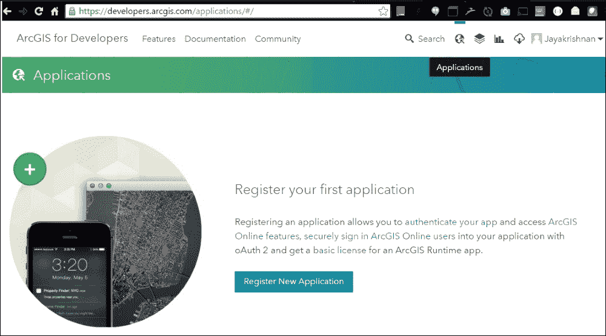

当我们点击**注册新应用程序**按钮时，我们将被提示输入关于我们的应用程序的详细信息，如下图所示。提供所需的详细信息后，如果我们再次点击**注册新应用程序**按钮，我们将被带到另一个屏幕，显示应用程序的令牌。这个短暂的令牌可以用于访问任何受 ArcGIS Online 地图服务保护的服务。例如，尝试在浏览器中访问这个—[`livefeeds.arcgis.com/arcgis/rest/services/LiveFeeds/Wildfire_Activity/MapServer`](http://livefeeds.arcgis.com/arcgis/rest/services/LiveFeeds/Wildfire_Activity/MapServer)。

您将被重定向到一个需要您输入令牌的页面。当您提供在上一个屏幕中获得的令牌时，您可以看到我们打算查看的地图服务的服务目录。以下屏幕截图解释了这个过程：


## 在应用程序中使用代理

在这个项目中，我们需要使用 Esri 资源代理来访问安全的 ArcGIS Online 数据源。资源代理是处理来自客户端到 ArcGIS Server 的请求并将来自 ArcGIS Server 的响应转发回客户端的服务器端代码。Esri 提供了一个专门适用于 ArcGIS Server 和 ArcGIS Online 的代理实现。Github 代码可以在[`github.com/Esri/resource-proxy`](https://github.com/Esri/resource-proxy)找到。

我们将只使用包含以下重要文件的资源代理的 ASP.NET 变体：

+   `proxy.ashx`

+   `proxy.config`

+   `Web.config`

`proxy.ashx`文件包含用于发出请求并将响应转发回客户端的服务器端代码逻辑。我们需要配置`proxy.config`并在其中包含我们的 ArcGIS 开发者凭据。以下是`proxy.config`页面的示例截图：

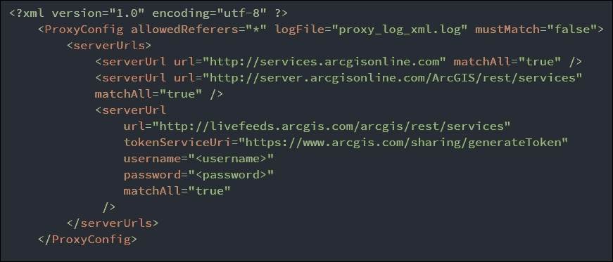

要配置`proxy.config`文件，请执行以下步骤：

1.  在`proxy.config`文件中，修改`serverUrl`标签中`url`、`username`和`password`的属性值。对于`tokenServiceUri`属性，值应始终为`https://www.arcgis.com/sharing/generateToken`。

1.  对于`url`属性，值将是 ArcGIS Server 服务的位置。指定特定的 URL（在这种情况下，您将设置`matchAll="false"`）或只是根 URL（如前面的屏幕截图所示；在这种情况下，`matchAll`值将是`"true"`）。

### 注意

有关配置`proxy.config`文件的更多详细信息，请参阅[`github.com/Esri/resource-proxy/blob/master/README.md#proxy-configuration-settings`](https://github.com/Esri/resource-proxy/blob/master/README.md#proxy-configuration-settings)。

1.  配置代理页面后，我们需要在应用程序中添加几行代码。我们需要加载`esri/config`模块，并在我们的应用程序代码中使用以下行：

```js
esriConfig.defaults.io.proxyUrl = "/proxy/proxy.ashx";
esriConfig.defaults.io.alwaysUseProxy = true;
```

在我们的应用程序中，`proxy.ashx`页面位于应用程序根目录下的`proxy`文件夹中。如果代理页面位于不同的应用程序中，我们需要更改`esriConfig.defaults.io.proxyUrl`变量的值。当我们将`esriConfig.defaults.io.alwaysUseProxy`值设置为`true`时，所有请求都将由代理处理。如果我们只需要特定的 URL 由代理处理，我们可能需要添加几行代码，如下所示：

```js
urlUtils.addProxyRule({
urlPrefix: "route.arcgis.com",
proxyUrl: "/proxy/proxy.ashx"
    });
```

`urlUtils`函数由`esri/urlUtils`模块提供。

以下图表显示了从客户端到安全 ArcGIS Server 服务的 HTTP REST 请求的流程：

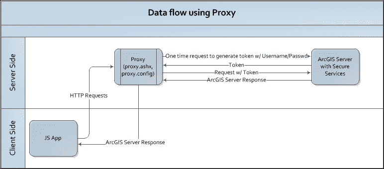

## 引导应用程序

本书中的所有应用程序都使用 Bootstrap 地图库进行样式设置和引导。这些库的源代码可以在[`github.com/Esri/bootstrap-map-js`](https://github.com/Esri/bootstrap-map-js)找到。

下载所需的库后，我们需要将以下 CSS 和 JavaScript 库添加到我们的应用程序中：

```js
<head>
<!-- Bootstrap-map-js& custom styles -->
<link href="css/lib/bootstrap.min.css" rel="stylesheet">
<link rel="stylesheet" type="text/css" href="css/lib/bootstrapmap.css">
<link rel="stylesheet" href="//netdna.bootstrapcdn.com/font-awesome/4.0.3/css/font-awesome.css">
</head>
<body>

<script src="http://code.jquery.com/jquery-1.10.1.min.js"></script>
<script src="js/lib/bootstrap.min.js"></script>
</body>
```

添加这些库后，我们需要添加另一个 JavaScript 文件作为 dojo 模块，而不是作为脚本引用。在我们的应用程序中，讨论中的 JavaScript 库位于`/js/lib/bootstrapmap.js`。

将此库作为 require 函数中的模块添加时，我们需要省略文件扩展名。以下屏幕截图说明了这一说法：

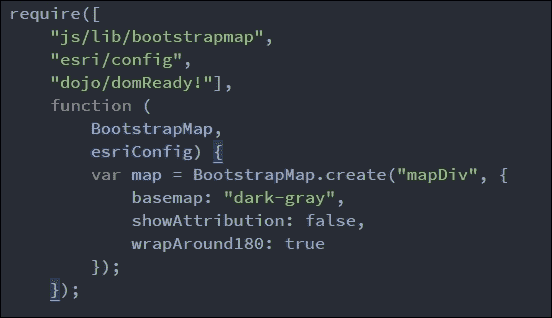

因此，我们将使用`bootstrapmap`模块而不是`esri/map`模块来创建地图。`bootstrapmap`模块接受`esri/map`提供的所有属性和方法，因为`bootstrapmap`模块只是`esri/map`模块的包装。

# 查询操作类型

在 ArcGIS Server 提供的数据上可以进行各种类型的查询操作。在本章中，我们将处理 API 提供的三种最重要的查询操作：

+   查询任务

+   查找任务

+   识别任务

## 查询任务

查询任务让我们只操作一个图层，因此查询任务的构造函数要求我们提供要素图层的 URL。查询任务让我们使用属性（字段值；例如，查询人口超过 200 万的城市）或使用位置（例如，查找所有位于地图当前范围或自定义绘制范围内的加油站）。当满足查询条件的要素数量大于服务器设置的限制（ArcGIS Server 中的`maxRecordCount`设置）时，我们可以使用名为*分页*的功能以批处理模式检索所有要素。

## 查找任务

查找任务可以在地图服务和多个字段上操作。查找任务基本上在给定地图服务中的所有图层的所有字段中搜索给定的文本。当我们不知道要搜索的字段，因此无法构造适当的 SQL`where`子句来查询数据时，这是一个理想的操作依赖。

## 识别任务

识别任务主要是基于位置的搜索操作，返回与给定几何图形（例如地图点击点）相交的给定地图服务中所有图层的所有数据。

在所有前面的任务中，我们可以限制进行搜索操作的字段或图层。以下矩阵总结了三种不同类型的查询操作可用的所有选项：

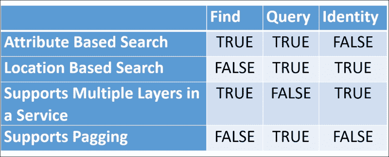

# 构建和执行查询任务

**查询任务**旨在查询`featureLayer`。因此，要实例化`querytask`，我们需要提供`featurelayer`的 URL。在 API 的 3.15 版本中，该模块被命名为`esri/tasks/QueryTask`。

## QueryTask 构造函数

`QueryTask`构造函数的语法如下：

```js
newQueryTask(url, options?)
```

`QueryTask`构造函数的示例如下：

```js
require([
"esri/tasks/QueryTask", ...
], function(QueryTask, ... ) {
varqueryTask = new QueryTask("<Feature Layer URL>")
});
```

### 构造函数参数

启用查询功能的要素图层的 URL，以验证要素图层上的查询功能是否已启用，我们必须访问地图服务的服务目录，并检查“查询”是否是我们想要查询的要素图层支持的操作之一。

例如，在我们处理的 Active Wildfire 地图服务中，我们想要查询包含有关 Active Wildfire 图层的数据的图层。地图服务中只有一个图层，因此要素图层的图层索引为`0`。

要素图层的 URL 是[`livefeeds.arcgis.com/arcgis/rest/services/LiveFeeds/Wildfire_Activity/MapServer/0`](http://livefeeds.arcgis.com/arcgis/rest/services/LiveFeeds/Wildfire_Activity/MapServer/0)。

当我们访问此链接并滚动到页面底部找到**支持的操作**部分时，我们将看到查询操作被列在那里：


使用 Query 任务执行查询涉及以下步骤：

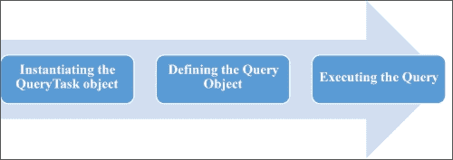

## 实例化 QueryTask 对象

查询任务基于 Active Wildfire 要素图层。因此，我们将使用要素图层的 URL 来实例化`QueryTask`对象。以下代码行解释了如何实例化`QueryTask`：

```js
var wildFireActivityURL = "http://livefeeds.arcgis.com/arcgis/rest/services/LiveFeeds/Wildfire_Activity/MapServer/0";
var queryTask = new QueryTask(wildFireActivityURL);
```

## 构建查询对象

`QueryTask`对象只是定义要查询的图层或数据，但我们需要使用`Query`对象来定义实际的查询是什么。`Query`对象由`esri/tasks/Query`模块提供。

查询对象执行以下操作：

+   它形成一个 SQL`where`子句来按属性查询。

+   它使用空间几何体执行查询。

+   它指示查询执行时的空间关系。

+   它请求从服务器获取要素字段的数组。

+   它指示查询结果是否需要返回几何信息。

查询对象有一个名为`where`的属性。该属性接受 SQL 的`where`子句，并获取满足`where`子句的数据。

`where`子句的格式如下：

```js
query.where = "<Query Expression 1><AND/OR><Query Expression 2> …<AND/OR><QueryExpression n>"
```

其中`Query Expression`是`"<FieldName><operator><value>";`。`<FieldName>`是要查询的要素中字段的名称。

`<operator>`是一种 SQL 运算符，例如`LIKE`，`=`,`>`,`<`。

以下代码片段演示了`where`子句的使用：

```js
query.where = "STATE = 'OK' OR STATE = 'WY'";
```

当我们想要从`feature`类中检索所有要素时，`where`子句需要设置为**真**表达式，例如`1=1`。真表达式是在所有情况下都评估为`true`的表达式。

您可以使用真表达式检索所有要素：

```js
query.where = "1=1";
```

### 注意

在实践中，使用此表达式返回的要素数量由服务器设置`MaxRecordCount`确定，如下截图所示。默认值为`1000`。可以在 ArcGIS 服务器设置中更改此限制。

在评估字符串时，请记住将字符串值括在单引号内：

```js
locQuery.where = "STATE_NAME = 'OK'";
```

输出要素集中所需的字段可以作为字段名称数组传递给`query`对象参数`outFields`：

```js
query.outFields = ["FIRE_NAME", "STATE ", "LATITUDE", "LONGITUDE"];
```

我们可以通过将值`true`或`false`传递给`query`对象参数`returnGeometry`来指示是否需要要素的几何信息：

```js
query.returnGeometry = true;
```

以下截图显示了如何构造一个完整的`Query`对象，该对象可以从`Query`任务对象中设置的要素图层中检索所有要素：


### 通过空间几何体查询

我们可以从具有与另一个输入几何体的空间关系的要素图层中获取要素。我们需要定义输入几何体和要检索的要素之间的空间关系。当未定义时，默认空间关系变为交集。这意味着我们正在尝试获取与输入几何体相交的要素。

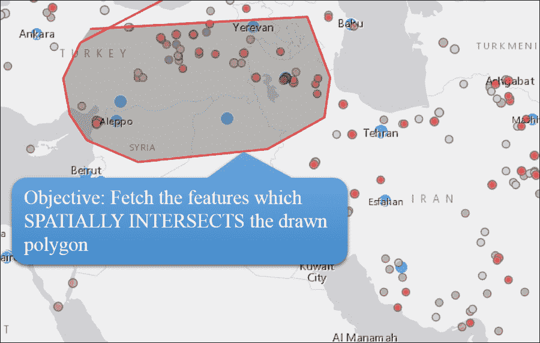

查询对象还提供了其他类型的空间关系作为常量：

+   `Query.SPATIAL_REL_CONTAINS`：这将检索完全包含在输入几何体中的所有要素

+   `Query.SPATIAL_REL_INTERSECTS`：这是默认的空间关系，获取与输入要素相交的所有要素

+   `Query.SPATIAL_REL_TOUCHES`：在这里，获取所有与输入几何体相接触的要素

通常，输入几何体可能是来自另一个要素、类或`draw`对象的几何体，或者在我们的情况下，当前地图的范围，如下面的代码片段所示：

```js
var query = new Query();
query.outFields = ["FIRE_NAME", "STATE", "LATITUDE", "LONGITUDE"];
query.returnGeometry = false;
query.where = "1=1";
query.geometry = map.extent;
query.returnGeometry = false;
```

## 执行查询

当我们需要执行查询并检索结果时，我们需要在查询任务对象中调用查询执行方法。可以执行查询任务以获取满足查询条件的实际特征。在某些情况下，我们可能只需要满足查询条件的特征数量或查询结果的空间范围。可以在查询任务对象上执行五种类型的查询操作：

+   查询特征

+   查询数量

+   查询范围

+   查询对象 ID

+   关系查询

所有操作都接受查询对象作为第一个参数，并返回一个延迟对象。让我们了解三个最重要的查询任务操作的用途：查询数量，查询范围和查询特征。

### 查询数量

当我们只想要满足查询条件的特征数量时，可以使用这个操作。以下屏幕截图显示了在一组查询特征上进行数量查询操作，给定一个查询对象（带有查询范围）。结果将是满足查询对象的特征数量：

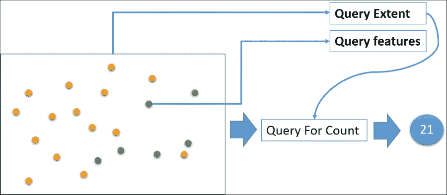

通过数量查询特征的图示

当我们使用查询任务的`executeForCount()`方法时，仍然使用查询对象作为方法参数。这可以是属性查询、空间查询或两者的组合。这个方法的主要目的是快速评估查询操作返回的特征数量。有时，这可能是您需要向用户显示的唯一信息。

让我们继续创建一个用户界面来获取满足我们查询条件的特征数量。以下屏幕截图显示了一个带有文本框输入查询文本和**获取数量**按钮的引导面板。我们还提供了另一个隐藏的`div`。`div`包含一个显示特征数量的标签。

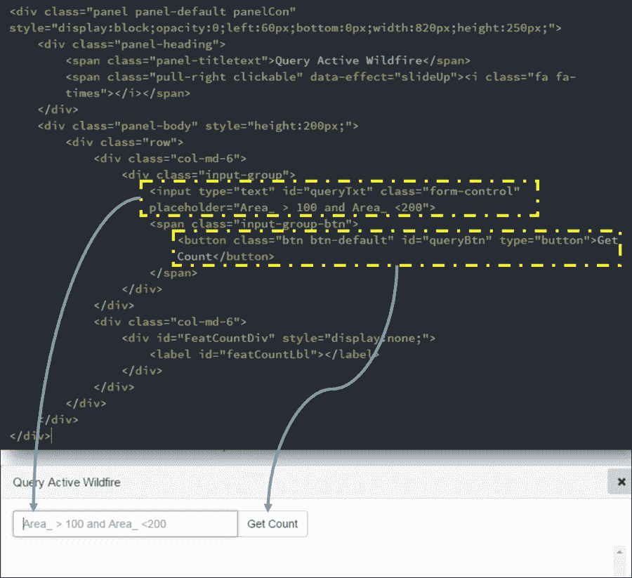

点击**获取数量**按钮时应该执行查询操作。当在查询文本框中没有提供输入时，查询将评估为真值表达式；也就是说，将返回地图范围内所有特征的数量。以下代码就是实现这一点的：

```js
on(dom.byId("queryBtn"), "click", function () {
query.outFields = ["FIRE_NAME", "STATE", "LATITUDE", "LONGITUDE"];
query.returnGeometry = false;
query.where = dom.byId("queryTxt").value || "1=1";
query.geometry = map.extent;
varqueryCountDeferred = queryTask.executeForCount(query);
queryCountDeferred.then(function (count) {
dom.byId("FeatCountDiv").style.display = "block";
dom.byId("featCountLbl").innerHTML = "Result: " + count + " Features";
}, function (err) {
console.log(err);
});
});
```

在上述代码片段中，`on`是由 dojo 提供的事件处理程序模块（`dojo/on`）。`dom`模块的`byId()`方法用于获取具有 ID—`queryBtn`的`dom`元素的引用。我们在`queryBtn`的`click`事件上执行了上述代码片段。请注意，在突出显示的代码中，我们处理了当查询文本框没有输入时的情况。`executeForCount()`方法返回一个延迟对象。当`Deferred`对象被解析时，使用`.then()`方法触发回调。在`.then`方法中，我们定义了两个函数；第一个函数在操作成功时触发，第二个函数在操作抛出错误时触发。我们还可以在`queryTask`对象上使用`execute-for-count-complete`事件来检索结果。

`result`对象只返回数量。

请参考以下 API 文档，以获取有关此方法返回的结果对象的更多信息—[`developers.arcgis.com/javascript/jsapi/querytask-amd.html#event-execute-for-count-complete`](https://developers.arcgis.com/javascript/jsapi/querytask-amd.html#event-execute-for-count-complete)。

我们在地图上的操作结果将如下屏幕截图所示：

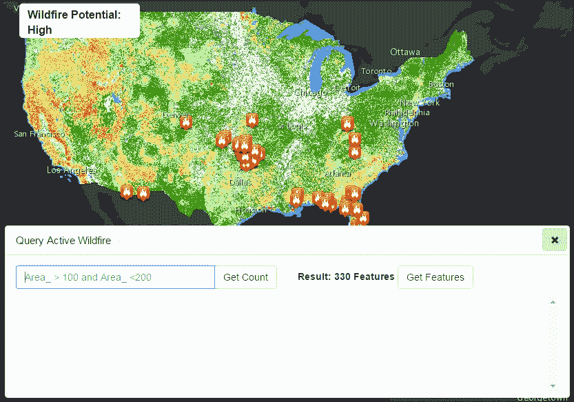

我们还在用户界面中引入了**获取特征**按钮，以检索满足查询条件的实际特征记录，并在 HTML 表格中显示它们。我们将在`queryTask`对象上执行`execute()`方法来实现这一点。

### 查询特征

这种方法提供了有关正在查询的特征的最大信息。

查询特征操作的图示如下：

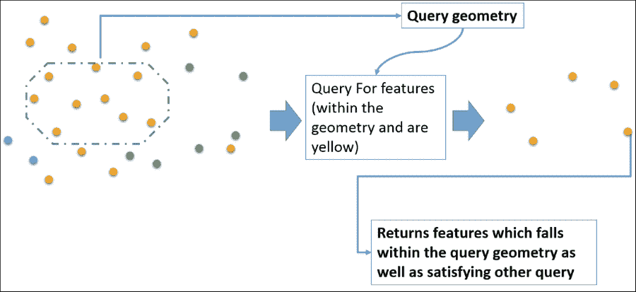

`QueryTask`对象中的`execute()`方法用于查询要素。此方法返回一个`Deferred`对象。此成功事件处理程序返回一个`Featureset`对象。`Featureset`对象返回一个包含要素数组的数组，以及有关要素的几何类型和空间参考的其他辅助信息。

要素集包含以下内容：

+   **features**：图形数组。图形数组中的每个项目都具有以下属性：

+   **attributes**：与图形关联的字段和字段值的名称值对

+   **geometry**：定义图形的几何

+   **geometryType**：要素的几何类型。

+   **spatialReference**：要素的空间参考。

在我们的应用程序中，我们将尝试在单击按钮时调用`execute`方法，并构造一个 HTML 字符串，该字符串将使用称为`FeatureSet`的结果将其显示为 HTML 表。以下屏幕截图演示了如何遍历结果要素集并创建 HTML 表字符串：

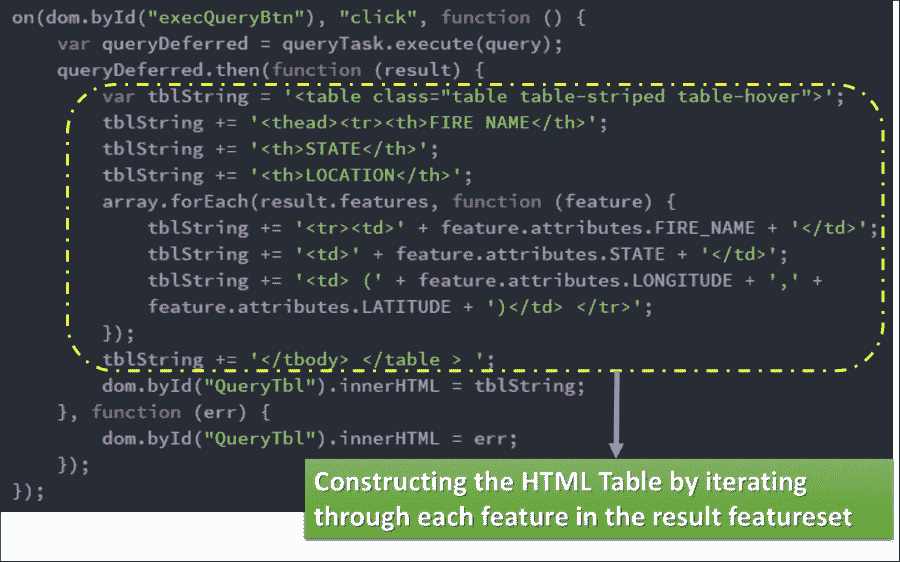

单击**获取要素**按钮时，用于获取要素计数的查询对象也用于执行此查询操作。因此，理想情况下，每次更改查询文本或地图范围时，**获取要素**按钮和 HTML 查询结果将被隐藏，我们需要在单击**获取要素**按钮之前单击**获取计数**按钮。我们编写了一个函数，隐藏显示要素计数的 div，并清除 HTML 表。代码如下所示：

```js
function clearQueryTbl() {
dom.byId("FeatCountDiv").style.display = "none";
dom.byId("QueryTbl").innerHTML = '';
}
```

以下屏幕截图展示了我们在地图上的代码运行情况：

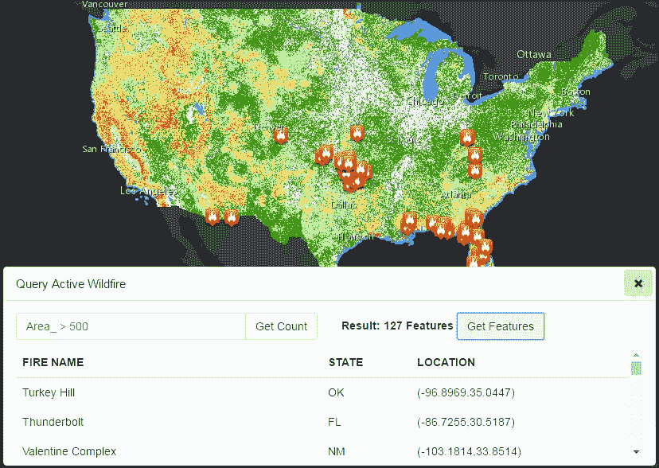

### 查询范围

当我们想要知道满足查询的要素的范围时，我们可以使用这种方法。这将在许多方面帮助我们：

+   我们可以了解现象的空间范围

+   我们可以将地图缩放到要素的范围，而无需实际接收要素

以下图表说明了“范围”操作的查询：

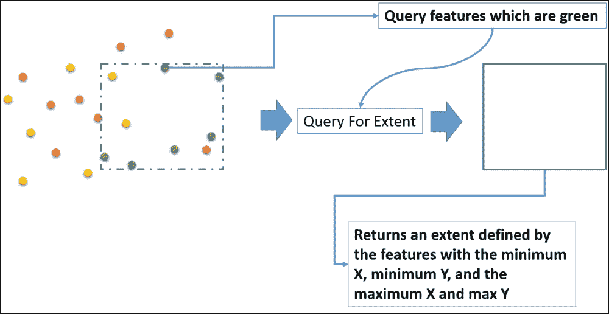

# 构建和执行 IdentifyTask

`IdentifyTask`可以在地图服务中操作多个图层，并从与给定几何图形相交的所有要素中获取信息。我们将使用 IdentifyTask 在地图上单击并获取单击位置处的潜在野火价值。要执行`IdentifyTask`，我们需要遵循三个步骤：

1.  实例化 IdentifyTask。

1.  构造 Identify 参数。

1.  执行 IdentifyTask。

## 实例化 IdentifyTask

实例化 IdentifyTask 涉及加载所需的模块并使用地图服务 URL 进行实例化。执行`IdentifyTask`所需的模块如下：

+   `esri/tasks/IdentifyTask`

+   `esri/tasks/IdentifyParameters`

我们将在野火潜力地图服务上操作 IdentifyTask。地图服务包含单个栅格图层和表示野火潜力级别的像素值。以下代码片段显示了如何实例化 IdentifyTask：

```js
varwildfirePotentialURL = "http://maps7.arcgisonline.com/arcgis/rest/services/USDA_USFS_2014_Wildfire_Hazard_Potential/MapServer";
varidentifyTask = new IdentifyTask(wildfirePotentialURL);
```

## 构造识别参数对象

Identify 参数提供了许多属性来定义正在执行的识别操作。在处理多个图层时，我们可以使用`layerIds`属性来限制可以执行识别的图层。`geometry`属性让我们设置用于选择地图服务中的要素的几何图形。在我们的应用程序中，我们使用地图`click`点作为 IdentifyParameter 的输入几何图形。当使用点几何时，我们还需要为 IdentifyParameters 中的容差属性定义值。容差值是指可以被视为输入几何的一部分的输入点几何周围的像素数。

在下面的截图中，我们构造了一个识别参数对象，该对象被地图`click`事件处理程序包裹。地图`click`事件处理程序的`mapPoint`属性为识别操作提供了输入几何对象：


## 执行 IdentifyTask

`execute()`方法可以用于执行 IdentifyTask。`execute()`方法返回`Deferred`对象，`Deferred`对象的成功回调返回`IdentifyResult`数组对象。

识别结果表示地图服务中一个图层中的单个已识别要素。该对象具有以下属性：

+   `displayFieldName`：这是图层的主要显示字段的名称

+   `feature`：`feature`对象包含一个数组对象和一个几何对象

+   `layerId`：这是包含要素的图层的唯一 ID

+   `layerName`：这是图层的名称

由于识别结果是一个数组对象，我们只显示一个值，我们将从识别结果对象中取出第一个值（`result[0]`），如下截图所示。我们需要显示的值在一个名为`CLASS_DESC`的属性字段中。由于这个值是由一个以冒号（`:`）分隔的类代码前缀和类描述组成的（例如，`5`：非常高），我们将根据冒号分隔字符串并仅使用描述部分。

以下截图显示了用于执行识别操作以及将识别结果显示为`map`点击位置的标签的代码，该位置由指针光标表示：

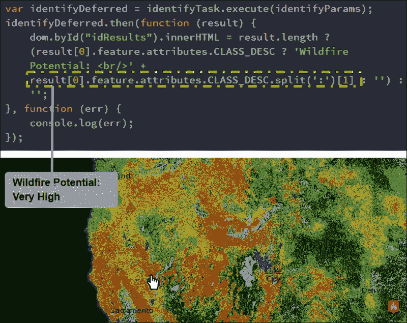

# 构建和执行查找任务

查找任务基本上是对地图服务中所有字段进行基于属性的搜索。查找任务的结果与 IdentifyTask 的结果相同，只是多了一个`foundFieldName`的值，表示搜索文本所在的字段名称。与 Query 任务和 IdentifyTask 类似，执行查找任务的三个步骤如下：

1.  实例化一个查找任务。

1.  构建查找参数。

1.  执行查找任务。

让我们逐一讨论这三个步骤。

## 实例化查找任务

要执行查找任务，需要加载以下模块：

+   `esri/tasks/FindTask`

+   `esri/tasks/FindParameters`

我们需要提供地图服务的 URL 来实例化查找任务。以下代码段显示了我们将如何在应用程序中执行此操作：

```js
var find = new FindTask("http://livefeeds.arcgis.com/arcgis/rest/services/LiveFeeds/Wildfire_Activity/MapServer");
```

## 构建查找参数

要构建查找参数，我们需要使用`esri/task/FindParameters`模块。查找参数模块具有诸如`searchText`、`layerIds`和`seachFields`之类的属性，让我们定义查找任务。`searchText`属性是需要搜索的文本，这需要来自 UI 文本框。`layerIds`让我们定义查找任务应该操作的`layerIds`。我们还可以限制进行搜索的字段。以下截图显示了我们如何构建查找任务的 UI 并构造查找参数对象：

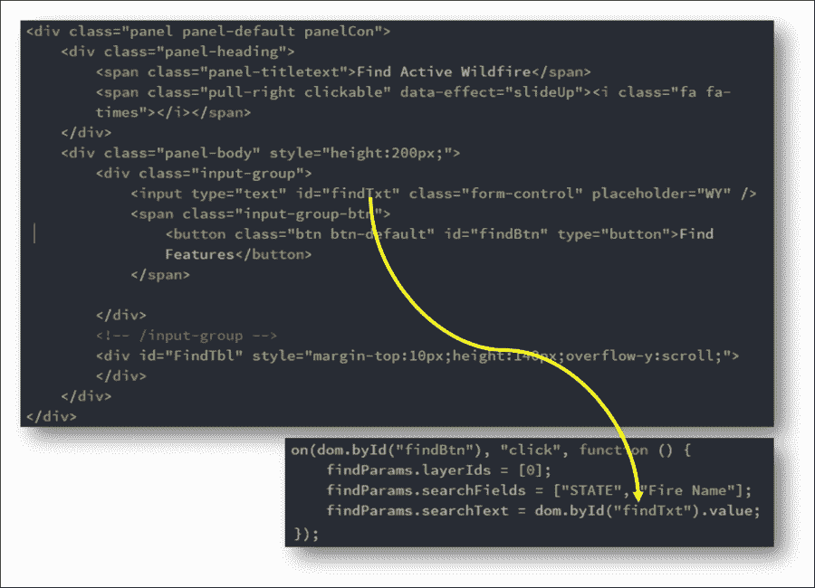

## 执行查找任务

`Find`任务的`execute()`方法可用于执行它。调用此方法将返回一个`Deferred`对象，在其成功回调函数中返回一个查找结果对象。我们将尝试构建一个 HTML 表格，就像我们为 Query 任务结果所做的那样，并在`FindTbl div`中显示它。以下代码行用于完成此操作：

```js
var findTaskDeferred = find.execute(findParams);
findTaskDeferred.then(function (result) {
  vartblString = '<table class="table table-striped table-hover">';
  tblString += '<thead><tr><th>FIRE NAME</th>';
  tblString += '<th>STATE</th>';
  tblString += '<th>LOCATION</th>';
  array.forEach(result, function (searchitem) {
    tblString += '<tr><td>' + searchitem.feature.attributes["Fire Name"] + '</td>';
    tblString += '<td>' + searchitem.feature.attributes["State"] + '</td>';
    tblString += '<td> (' + searchitem.feature.attributes["Longitude"] + ',' + searchitem.feature.attributes["Latitude"] + ')</td></tr>';
  });
  tblString += '</tbody></table >';
  dom.byId("FindTbl").innerHTML = tblString;
}, function (err) {
  console.log(err);
});
```

在下面的截图中，我们可以看到当我们插入搜索文本`W`时，搜索文本已从两个不同的字段**Fire Name**和**State**中获取：


# 构建要素表

要素表构建一个表，显示给定要素图层的所有信息，并将其放置在给定的`dom`元素中。要素表是 Esri 小部件，可以通过加载`esri/dijit/FeatureTable`模块来使用。该模块允许我们选择要显示的字段。下面的截图显示了如何构建要素表以及它在应用程序中的显示方式：

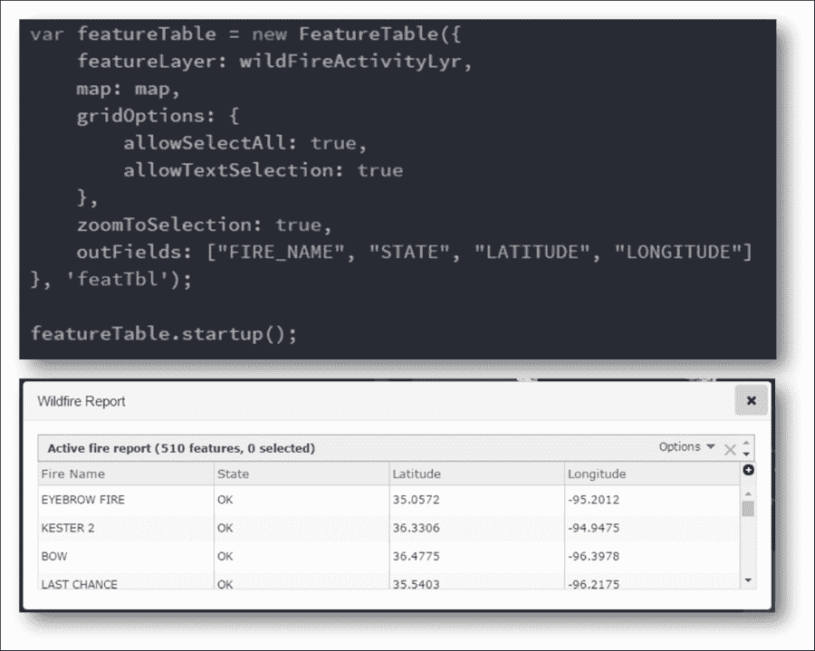

# 构建弹出窗口

当您的 Web 应用程序的用户点击感兴趣的要素时，他们应该看到有关他们点击的要素的一系列有用信息。弹出窗口是向用户显示特定上下文属性信息的媒介。弹出窗口补充了地图的空间信息。

最简单的弹出窗口只显示所有或选定的属性值。更高级和直观的弹出窗口在弹出窗口中使用图表和图像。

帮助创建弹出窗口的模块包括`esri/InfoTemplate`、`esri/dijit/PopupTemplate`、`esri/dijit/InfoWindow`和`esri/dijit/Popup`。

`esri/dijit/PopupTemplate`扩展了`esri/InfoTemplate`，而`esri/dijit/Popup`扩展了`esri/dijit/InfoWindow`。因此，让我们简要介绍一下`InfoTemplate`，然后转向`Popup`模板。

## 构建 Infotemplates

可以使用占位符创建`InfoTemplate`对象。占位符通常是属性字段名，以美元符号（`$`）开头，用大括号（`{}`）括起来，例如`${Fieldname}`。

当我们需要检索感兴趣要素提供的所有字段时，字段名可以被`*`替换，例如`${*}`。

要素图层和图形对象都有`InfoTemplate`属性。创建的`infotemplate`可以设置为这些图层。`InfoTemplate`构造函数接受两个参数，标题和内容：

| 模块 | 值 |
| --- | --- |
| 模块名称 | `esri/InfoTemplate` |
| 父对象 | 要素图层、图形对象、动态图层和地图的信息窗口 |
| 构造函数 | `new InfoTemplate (title, content)` |

下面的截图为`Active wildfire`要素图层创建了`infotemplate`，并在弹出窗口中显示了州名、火灾名称和被点击的野火要素的面积范围等字段。`Infotemplate`的标题也是由占位符创建的：

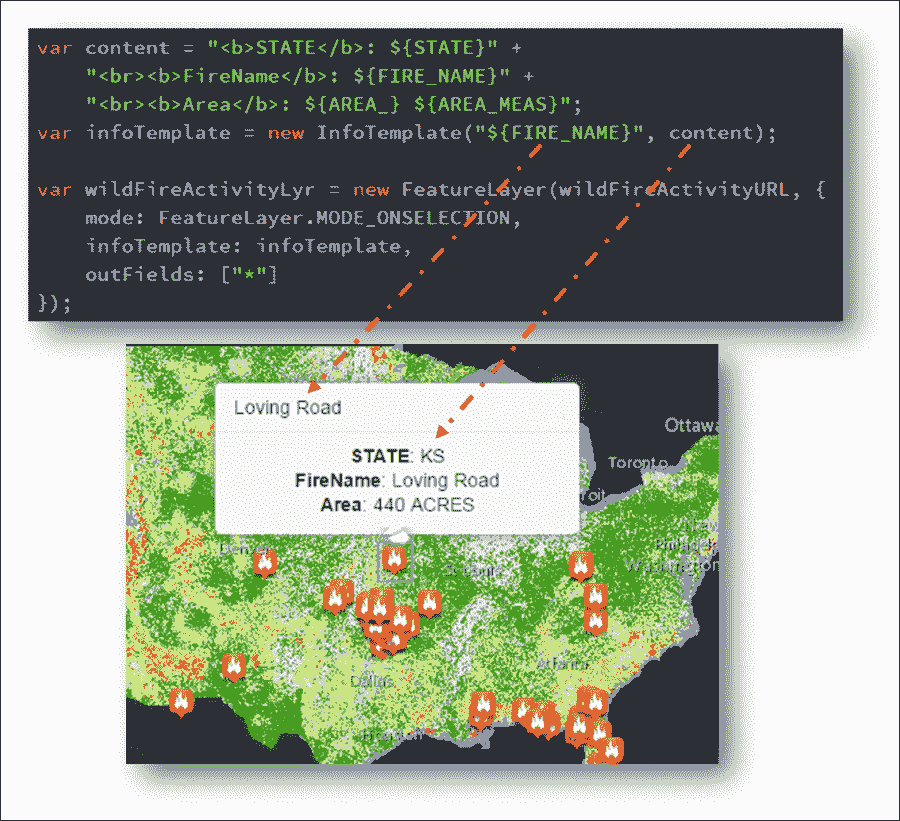

本章的代码清单可以在名为`B04959_03_CODE`的代码文件夹中找到。

# 摘要

本章解释了搜索和查询数据的不同方法。我们构建了一个应用程序，可以执行查询任务、查找任务，以及识别任务。我们还发现了名为`dijit`的要素表以及`Infotemplates`的实用性。在下一章中，我们将看到如何将所有代码组织成模块化小部件，并在应用程序中使用它。我们还将讨论涉及使用绘图工具栏的空间查询的构造，以及创建由应用程序用户定义的输入几何体。
