# 第四章。构建自定义小部件

本章的主要目标是开发一个自定义小部件，可以执行空间查询并在简单的 HTML 表格中显示结果。在构建自定义小部件的过程中，您将学习以下主题：

+   如何使用道场创建一个简单的类

+   如何全局配置道场

+   道场小部件的生命周期是什么

+   如何创建模板小部件

+   如何为国际化提供支持

+   如何组织道场代码

+   绘图工具栏的工作原理

+   如何使用本章讨论的所有功能构建自定义小部件

# 创建一个简单的类

Dojo 类提供了一种继承和扩展其他模块以使用模板并创建小部件的方法。道场中的类位于一个模块中，并且模块返回类声明。要在模块中声明类，我们需要加载一个名为`dojo/_base/declare`的模块，该模块提供了声明类的支持。

以下屏幕截图显示了一个简单的道场类声明：

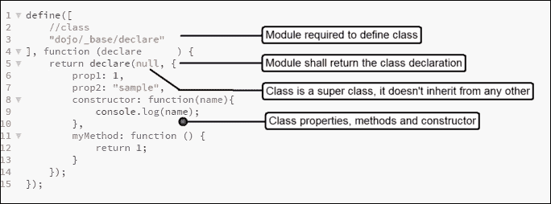

在这个屏幕截图中，`declare`是`dojo/_base/declare`模块的回调函数装饰。类声明接受三个参数：*classname*、*superclass*和*properties*。

classname 参数是可选的。当提供了一个 classname 字符串时，声明被称为**命名类**。当它被省略时，就像我们的情况一样，它被称为**匿名类**。我们将继续使用匿名类，因为命名类必须在特定条件下使用。

超类是我们想要扩展的模块或模块数组。如果超类参数为 null（如我们的片段中），这意味着我们的类声明本身就是一个超类。

类声明中的第三个参数是类属性。我们可以在这里定义类构造函数、其他类属性和类方法。

## 配置道场

Dojo 有一个名为`dojoConfig`的全局对象，其中包含所有的配置参数。我们可以修改`dojoConfig`对象来配置选项和默认行为，以适应道场工具包的各个方面。

`dojoConfig`对象让我们定义在我们的 Web 应用程序中定义的自定义模块的位置，并使用包名标记它。因此，当我们需要加载这些自定义模块时，我们可以使用包名来引用文件夹位置。

### 注意

在引用 Esri JS API 之前，必须声明`dojoConfig`对象。

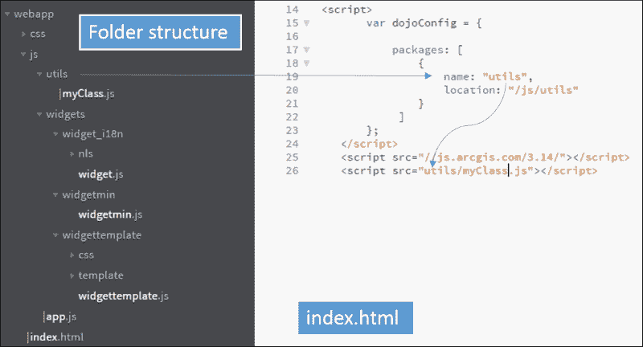

还有其他配置选项，如`async`、`parseOnLoad`、`waitSeconds`和`cacheBust`。有关`dojoConfig`主题的详细信息，请参阅道场工具包文档[`dojotoolkit.org/documentation/tutorials/1.10/dojo_config/`](https://dojotoolkit.org/documentation/tutorials/1.10/dojo_config/)。

+   `async`选项定义了道场核心是否应异步加载。推荐的值是`true`。

+   `locale`选项允许我们覆盖浏览器提供给道场的默认语言。这将帮助我们为不同的目标语言环境开发应用程序，并使用道场的`i18n`模块测试我们的小部件是否支持国际化。

+   `cacheBust`选项是一个非常有用的选项，当配置为`true`时，将时间字符串附加到模块的每个 URL，从而避免模块缓存。

让我们看看这些选项对我们有什么作用：

```js
<script>
        var dojoConfig = {
            has: {
                "dojo-debug-messages": true
            },
            parseOnLoad: false,
            locale: 'en-us',
            async: true,  
            cacheBust: true,
            packages: [
                {
                    name: "widgets",
                    location: "/js/widgets"
            },
                {
                    name: "utils", 
                    location: "/js/utils"
                }
         ]
        };
    </script>
    <script src="//js.arcgis.com/3.14/"></script>
    <script src="js/app.js"></script>
```

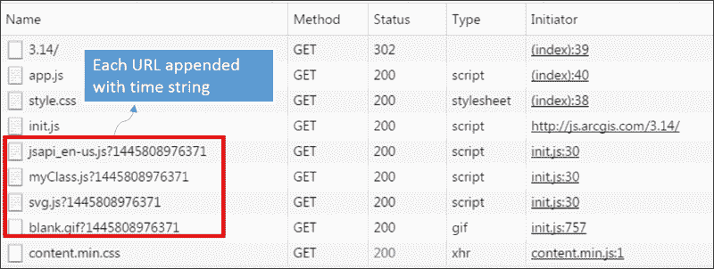

在`dojoConfig`对象中将 cacheBust 配置为 True 的效果

# 开发独立的小部件

在道场中编写类的主要目的是开发独立的小部件。道场专门为我们提供了一个支持小部件开发的模块：`dijit/_WidgetBase`。我们还需要其他辅助模块，如`dijit`模板模块、道场解析和道场国际化模块，以在 Web 应用程序中开发一个完整的小部件。

`WidgetBase`模块关联的关键方面是小部件的生命周期概念。小部件的生命周期为我们提供了在小部件的不同阶段使用的方法，即从小部件的初始化，到其`dom`节点完全加载并可被应用程序利用，直到小部件的销毁。

此模块应作为类声明中的超类数组传递。以下是一个基本小部件的片段：

```js
define([
    //class
    "dojo/_base/declare",

    //widgit class
    "dijit/_WidgetBase",

    "dojo/domReady!"
], function (
    declare,
    _WidgetBase
) {
 **return declare([_WidgetBase], {**
/*Class declaration inherits "dijit/_WidgetBase" module*/

        constructor: function () {}
    });
});
```

## dijit 生命周期

`_WidgetBase`选项提供了程序流将按特定顺序执行的几种方法。按顺序执行的一些最重要的方法如下信息图所示：


小部件生命周期信息图

上述图表可以描述如下：

+   **constructor**：这是小部件实例化时调用的第一个方法。`constructor`函数可以用作一个名为`domNode`的特殊属性。这可以包含对`domNode`的引用，小部件将放置在其中。`constructor`函数的第一个参数将是一个`options`对象，我们可以向其中发送任何我们想发送给小部件的对象值：

```js
constructor: function (options, srcRefNode) {
            this.domNode = srcRefNode;
        }
```

+   **postCreate**：此方法在小部件的所有属性执行后立即执行。所有小部件的事件处理程序将在此处定义。应在`postCreate()`方法中添加一行特定的代码，以便所有在`WidgetBase`中定义的定义都能正确继承。在下面的代码片段中，已经突出显示了特定的代码行：

```js
postCreate: function(){
            **this.inherited(arguments);**
        }
```

+   **postCreate()**：这个方法也是托管特殊`this.own()`方法的正确位置。在此方法中定义的事件处理程序将在小部件实例被销毁时释放事件处理程序。

+   **Startup**：此方法在构造完 dom 节点后触发。因此，任何对 dom 节点的修改都将在此处完成。这是通过该方法外部调用小部件执行的方法。

## 创建模板化小部件

模板化小部件允许开发人员在运行时将 HTML 文件作为模板字符串加载。所有特定于小部件的 dom 节点都应在此 HTML 模板中定义。Dojo 提供了另外两个模块，以使我们使用模板更轻松、更高效。这些模块名为`dijit/_TemplatedMixin`和`dijit/_WidgetsInTemplateMixin`。除了这两个模块，我们还需要加载一个名为`dojo/text!`的 dojo 插件，它实际上将 HTML 页面加载为模板字符串。插件的工作方式是在`dojo/text!`中的感叹号(`!`)后附加 HTML 文件路径：

```js
    "dojo/text!app_widgets/widgettemplate/template/_widget.html"
```

类属性应包括一个名为`templateString`的特定属性。此属性的值将是用于表示`dojo/text!<filename.html>`插件的回调函数装饰。

让我们看一个基本的代码片段，涵盖了之前讨论的所有主题，并尝试开发一个模板小部件：

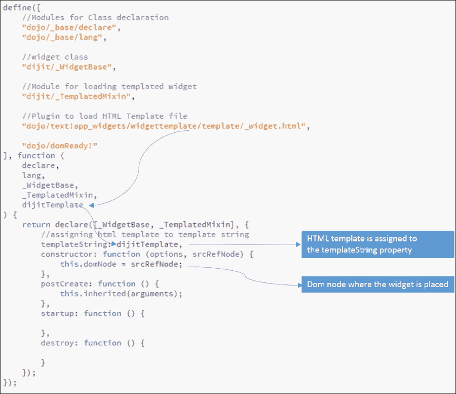

我们的模板文件非常无害，只包含一个简单的`h1`标题标签。正是`templateString`属性保存了这个 HTML 字符串。

`app_widgets/widgettemplate/template/_widget.html`文件的内容如下：

```js
<h1>This is Templated widget</h1>
```

现在，让我们看看如何实例化这个小部件。如前所述，我们需要在小部件中调用`startup`方法来执行此小部件。我们将从另一个 JavaScript 文件中调用这个方法，该文件将传递一个对 dom 节点的引用，其中我们的小部件将被放置：


/js/widgets/app.js 的内容

这个文件将从`index.html`文件中调用，该文件具有名为`templatedWidgetDiv`的`dom`元素：

```js
<!DOCTYPE html>
<html>

<head>
    <meta charset="utf-8">
    <meta http-equiv="X-UA-Compatible" content="IE=edge,chrome=1">
    <title></title>
    <meta name="description" content="">
    <meta name="viewport" content="width=device-width">
    <link rel="stylesheet" type="text/css" href="css/style.css">

</head>

<body>
    <h1>Using Dojo Classes</h1>
    <div id="templatedWidgetDiv"/>
    <script>
        /* dojo config */
        var dojoConfig = {
            has: {
                "dojo-debug-messages": true
            },
            parseOnLoad: false,
            locale: 'en-us',
            async: true,  
            cacheBust: true,
            packages: [
                {
                    name: "app_widgets",
                    location: "/js/widgets"
            },
                {
                    name: "utils", 
                    location: "/js/utils"
                }
         ]
        };
    </script>
    <!--Call the esri JS API library-->
    <script src="//js.arcgis.com/3.14/"></script>
    <!--Call the /js/utils/app.js file-->
    <script src="js/app.js"></script> 
</body>

</html>
```

# 小部件文件夹结构

现在是讨论小部件文件夹结构的时候了。在开发大型项目时，文件夹结构是项目构建过程的重要部分，我们需要在项目的初始阶段定义。我们将提供关于如何决定文件夹结构的一般指导方针。这可以根据您的偏好和项目需求进行修改。

## 创建项目文件夹的指南

创建项目文件夹的指南如下图所示：

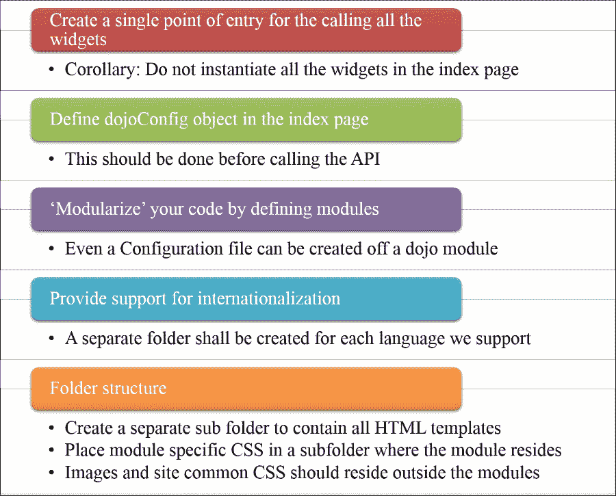

让我们详细讨论每一个。

### 创建单一入口点

我们不需要在索引页面上拥挤所有小部件的实例化。最好是我们可以定义一个模块，可以作为实例化我们需要的所有小部件的单一入口点。

我们的 HTML 页面将只包含对 JS API 和这个单一入口 JavaScript 模块的引用：

```js
    <!--Call the esri JS API library-->
    <script src="//js.arcgis.com/3.15/"></script>
    <!--Call the javaScript file which serves as the single point of entry-->
 **<script src="js/app.js"></script>**

```

作为单一入口点的文件的内容如下：

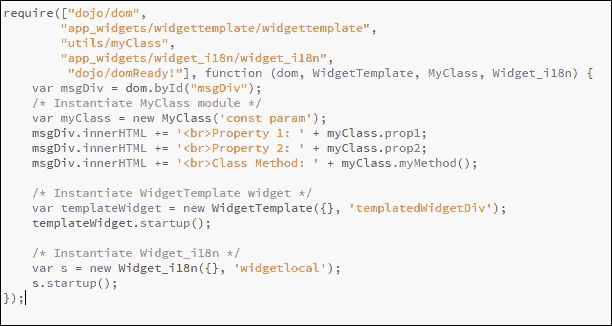

### 定义 dojoConfig

我们之前讨论过这一点。`dojoConfig` 对象将在索引页面中声明。这是一个全局对象，其值可以通过加载名为 `dojo/_base/config` 的模块在程序的任何地方访问。

### 模块化代码

这是 AMD 编码模式的核心原则。模块化的概念意味着我们应该解耦任何功能上不同的代码。正如我们所知，dojo 模块返回一个可公开访问的对象。这个对象可以是一个类声明，就像我们之前看到的那样。模块的另一个用途是可以用作应用程序的配置文件。

已经创建了一个基于 dojo 模块的示例 `config` 文件供您参考：

```js
define(function () {
    /* Private variables*/
    var baseMapUrl = "http://maps.ngdc.noaa.gov/arcgis/rest/services/web_mercator/etopo1_hillshade/MapServer";
    var NOAAMapService = "http://maps.ngdc.noaa.gov/arcgis/rest/services/web_mercator/hazards/MapServer";
    var earthquakeLayerId = 5;
    var volcanoLayerId = 6;
    /*publicly accessible object returned by the COnfig module */
    return {
        app: {
            currentVersion: "1.0.0"
        },

        // valid themes: "claro", "nihilo", "soria", "tundra", "bootstrap", "metro"
        theme: "bootstrap",

        // url to your proxy page, must be on same machine hosting you app. See proxy folder for readme.
        proxy: {
            url: "proxy/proxy.ashx",
            alwaysUseProxy: false,
            proxyRuleUrls: [NOAAMapService]
        },

        map: {

            // basemap: valid options: "streets", "satellite", "hybrid", "topo", "gray", "oceans", "national-geographic", "osm"
            defaultBasemap: "streets",
            visibleLayerId: [this.earthquakeLayerId, this.volcanoLayerId];

            earthQuakeLayerURL: this.NOAAMapService + "/" + this.earthquakeLayerId,
            volcanoLayerURL: this.NOAAMapService + "/" + this.volcanoLayerId
        }
    }
});
```

### 提供国际化支持

根据用户的区域设置自定义应用程序中显示的文本称为**国际化**。Dojo 提供了一个名为 `dojo/i18n!` 的插件来提供这种支持。当我们提到插件时，这意味着它在感叹号 (`!`) 之后期望一个文件路径作为参数。文件路径指的是一个 JavaScript 模块，其中提到了一个名为 `root` 的对象，并列出了所有支持的区域设置。

例如，`dojo/i18n!app_widgets/widget_i18n/nls/strings` 指的是在 `app_widgets/widget_i18n/nls` 文件夹中定义的 `strings` 模块（请记住 `app_widgets` 是指向 `/js/widgets` 位置的包名称）。

当前的区域设置由用户的浏览器确定。在 dojo 中，`locale` 通常是一个五个字母的字符串；前两个字符代表语言，第三个字符是连字符，最后两个字符代表国家。

例如，看一下以下内容：

+   `en-us` 值代表英语作为语言和美国作为国家

+   `ja-jp` 值代表日语作为语言和日本作为国家

+   `zh-cn` 值代表简体中文作为语言和中国作为国家

+   `zh-tw` 值代表简体中文作为语言和台湾作为国家

#### 提供国际化支持的步骤

提供国际化支持的步骤如下：

1.  在小部件所在的文件夹中创建一个名为 `nls` 的文件夹。

1.  定义一个具有名为 `root` 的对象并在 `root` 对象下列出所有支持的区域设置的模块。例如，看一下以下内容：

```js
"zh-cn" : true,
"de-at" : true
```

1.  `root` 对象将包含所有支持语言的字符串变量，例如 `widgetTitle` 和 `description`。

1.  为每个定义的区域设置创建一个文件夹，例如 `zh-cn` 和 `de-at`。

1.  在每个 `language` 文件夹中创建与 `root` 模块同名的模块。

1.  新模块将包含`root`对象的所有属性。属性的值将包含相应值的特定语言翻译。

1.  加载名为`dojo/i18n!`的模块，后面跟上根模块的路径。

1.  在`declare`构造函数中，将`i18n`模块的`callback`函数声明分配给名为`this.nls`的属性：

```js
define([
    //class
    "dojo/_base/declare",
    "dojo/_base/lang",

    //widgit class
    "dijit/_WidgetBase",

    //templated widgit
    "dijit/_TemplatedMixin",

    // localization
 **"dojo/i18n!app_widgets/widget_i18n/nls/strings",**

    //loading template file
    "dojo/text!app_widgets/widget_i18n/template/_widget.html",

    "dojo/domReady!"
], function (
    declare, lang,
    _WidgetBase,
    _TemplatedMixin,
    nls,
    dijitTemplate
) {
    return declare([_WidgetBase, _TemplatedMixin], {
        //assigning html template to template string
        templateString: dijitTemplate,
        constructor: function (options, srcRefNode) {
            console.log('constructor called');
            // widget node
            this.domNode = srcRefNode;
 **this.nls = nls;**
        },
        // start widget. called by user
        startup: function () {
            console.log('startup called');
        }
    });
});
```

### 小部件文件夹结构概述

让我们再次审查`widget`文件夹结构，以便在开始任何项目之前将其用作模板：

1.  我们需要一个主文件（比如`index.html`）。主文件应该有`dojoConfig`对象，引用应用程序中使用的所有 CSS，以及 Esri CSS。它还应该有对 API 的引用和对作为入口点的模块的引用（`app.js`）。

1.  所有小部件都放在`js`文件夹中。

1.  所有站点范围的 CSS 和图像分别放入应用程序`root`目录中的`CSS`和`image`文件夹中。

1.  所有小部件将放置在`js`文件夹内的`widgets`文件夹中。每个小部件也可以放置在`widgets`文件夹内的单独文件夹中。

1.  模板将放置在`widget`文件夹内的`template`文件夹中。

1.  将国际化所需的资源放在名为`nls`的文件夹中：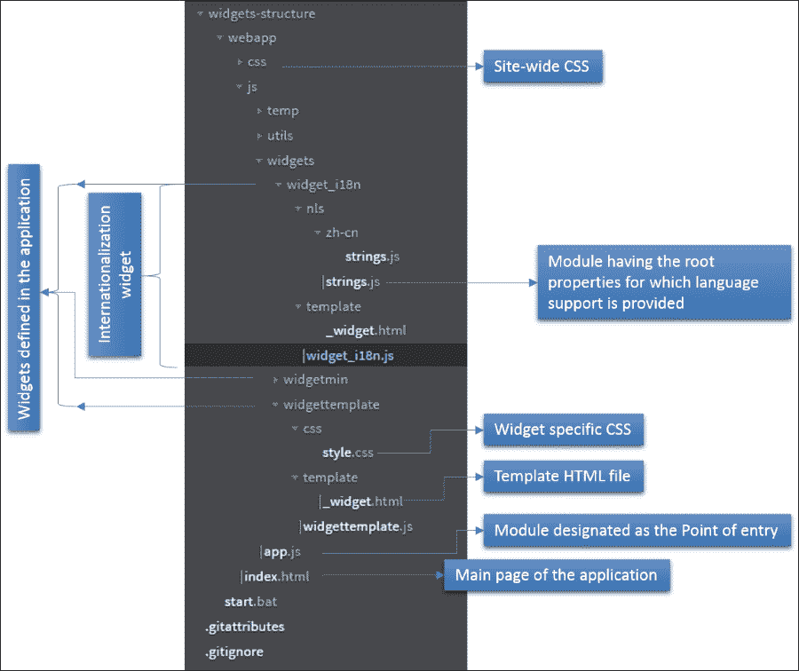

# 构建自定义小部件

我们将扩展上一章中开发的应用程序，添加高级功能和模块化的代码重构。让我们在应用程序中创建一个自定义小部件，该小部件可以执行以下操作：

+   允许用户在地图上绘制多边形。多边形将以半透明红色填充和虚线黄色轮廓进行符号化。

+   多边形应该获取多边形边界内的所有重大森林火灾事件。

+   这将显示为图形，数据应该在网格中。

+   必须提供国际化支持。

## 小部件所需的模块

让我们列出定义类及其相应预期回调函数装饰所需的模块。

### 用于类声明和 OOPS 的模块

| 模块 | 值 |
| --- | --- |
| `dojo/_base/declare` | `declare` |
| `dijit/_WidgetBase` | `_WidgetBase` |
| `dojo/_base/lang` | `lang` |

### 使用 HTML 模板的模块

| 模块 | 值 |
| --- | --- |
| `dijit/_TemplatedMixin` | `_TemplatedMixin` |
| `dojo/text!` | `dijitTemplate` |

### 用于使用事件的模块

| 模块 | 值 |
| --- | --- |
| `dojo/on` | `on` |
| `dijit/a11yclick` | `a11yclick` |

### 用于操作 dom 元素及其样式的模块

| 模块 | 值 |
| --- | --- |
| `dojo/dom-style` | `domStyle` |
| `dojo/dom-class` | `domClass` |
| `dojo/domReady!` |   |

### 用于使用绘制工具栏和显示图形的模块

| 模块 | 值 |
| --- | --- |
| `esri/toolbars/draw` | `Draw` |
| `esri/symbols/SimpleFillSymbol` | `SimpleFillSymbol` |
| `esri/symbols/SimpleLineSymbol` | `SimpleLineSymbol` |
| `esri/graphic` | `Graphic` |
| `dojo/_base/Color` | `Color` |

### 用于查询数据的模块

| 模块 | 值 |
| --- | --- |
| `esri/tasks/query` | `Query` |
| `esri/tasks/QueryTask` | `QueryTask` |

### 国际化支持的模块

| 模块 | 值 |
| --- | --- |
| `dojo/i18n!` | `nls` |

## 使用绘制工具栏

绘制工具栏使我们能够在地图上绘制图形。此工具栏与事件相关联。完成绘制操作后，它将返回在地图上绘制的对象作为几何图形。按照以下步骤使用绘制工具栏创建图形：

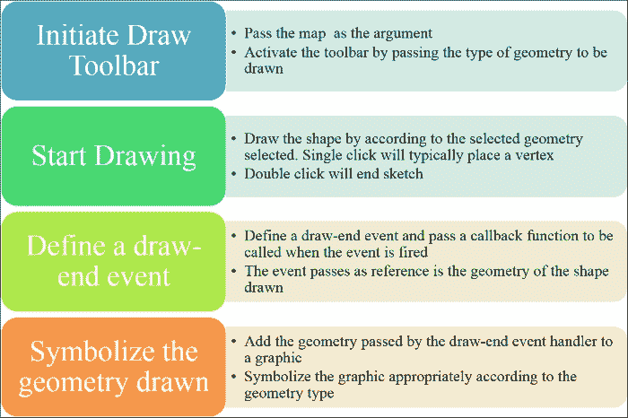

### 初始化绘制工具栏

绘图工具栏由名为`esri/toolbars/draw`的模块提供。绘图工具栏接受地图对象作为参数。在`postCreate`函数中实例化绘图工具栏。绘图工具栏还接受一个名为`options`的额外可选参数。`options`对象中的一个属性名为`showTooltips`。这可以设置为`true`，以便在绘制时看到相关的工具提示。工具提示中的文本可以自定义。否则，将显示与绘制几何图形相关的默认工具提示：

```js
return declare([_WidgetBase, _TemplatedMixin], {
    //assigning html template to template string
    templateString: dijitTemplate,
    isDrawActive: false,
    map: null,
 **tbDraw: null,**
    constructor: function (options, srcRefNode) {
      this.map = options.map;
    },
    startup: function () {},
    postCreate: function () {
      this.inherited(arguments);
 **this.tbDraw = new Draw(this.map, {showTooltips : true});**
    }
...
```

绘图工具栏可以在按钮的“单击”或“触摸”事件（在智能手机或平板电脑上）上激活，该按钮旨在指示“绘制”事件的开始。Dojo 提供了一个模块，可以处理“触摸”和“单击”事件。该模块名为`dijit/a11yclick`。

要激活绘图工具栏，我们需要提供要绘制的符号类型。绘图工具栏提供了一组常量，对应于绘制符号的类型。这些常量是`POINT`，`POLYGON`，`LINE`，`POLYLINE`，`FREEHAND_POLYGON`，`FREEHAND_POLYLINE`，`MULTI_POINT`，`RECTANGLE`，`TRIANGLE`，`CIRCLE`，`ELLIPSE`，`ARROW`，`UP_ARROW`，`DOWN_ARROW`，`LEFT_ARROW`和`RIGHT_ARROW`。

激活绘图工具栏时，必须使用这些常量来定义所需的绘图操作类型。我们的目标是在单击绘图按钮时绘制多边形。代码如下截图所示：


### 绘图操作

一旦激活绘图工具栏，绘图操作就开始了。对于点几何，绘图操作只需单击一次。对于折线和多边形，单击会向折线添加一个顶点，双击结束草图。对于自由手折线或多边形，“单击”和“拖动”操作绘制几何图形，“松开鼠标”操作结束绘制。

### 绘制结束事件处理程序

绘图操作完成后，我们需要一个事件处理程序来处理绘图工具栏绘制的形状。API 提供了一个`draw-end`事件，该事件在绘图操作完成后触发。必须将此事件处理程序连接到绘图工具栏。此事件处理程序将在小部件的`postCreate()`方法中的`this.own()`函数内定义。事件结果可以传递给命名或匿名函数：

```js
postCreate: function () {
...
 **this.tbDraw.on("draw-end", lang.hitch(this, this.querybyGeometry));**
    },
...
querybyGeometry: function (evt) {
      this.isBusy(true);
      //Get the Drawn geometry
      var geometryInput = evt.geometry;
...
}
```

### 符号化绘制的形状

在`draw-end`事件回调函数中，我们将以结果对象的形式获得绘制形状的几何图形。要将此几何图形添加回地图，我们需要对其进行符号化。符号与其所代表的几何图形相关联。此外，符号的样式由用于填充符号和其大小的颜色或图片定义。仅需对多边形进行符号化，我们需要使用`SimpleFillSymbol`和`SimpleLineSymbol`模块。我们可能还需要`esri/color`模块来定义填充颜色。

让我们回顾一小段代码，以更好地理解这一点。这是一个简单的代码片段，用于构造一个具有半透明实心红色填充和黄色虚线的多边形符号：

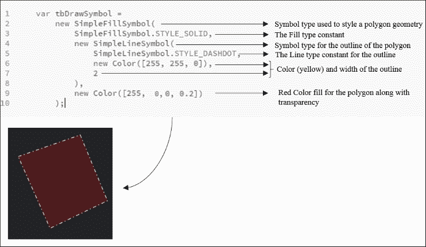

在前面的截图中，`SimpleFillSymbol.STYLE_SOLID`和`SimpleLineSymbol.STYLE_DASHDOT`是`SimpleFIllSymbol`和`SimpleLineSymbol`模块提供的常量，用于为多边形和线条设置样式。

在符号的构造中定义了两种颜色：一种用于填充多边形，另一种用于着色轮廓。颜色可以由四个组件定义。它们如下：

+   红色

+   绿色

+   蓝色

+   不透明度

红色、绿色和蓝色分量的取值范围为`0`到`255`，不透明度的取值范围为`0`到`1`。根据 RGB 颜色理论，可以使用红色、绿色和蓝色分量的组合来产生任何颜色。因此，要创建黄色，我们使用红色分量的最大值（`255`）和绿色分量的最大值（`255`）；我们不希望蓝色分量对我们的颜色产生影响，所以使用`0`。不透明度值为`0`表示 100%透明，不透明度值为`1`表示 100%不透明。我们使用`0.2`作为填充颜色。这意味着我们的多边形需要 20%的不透明度，或者 80%的透明度。该组件的默认值为`1`。

符号只是一个通用对象。这意味着任何多边形几何体都可以使用该符号来渲染自己。现在，我们需要一个容器对象在地图上显示以前定义的符号绘制的几何体。由`esri/Graphic`模块提供的图形对象充当容器对象，可以接受几何体和符号。图形对象可以添加到地图的图形图层中。

### 注意

地图对象中始终存在一个图形图层，可以通过使用地图的`graphics`属性（`this.map.graphics`）来访问。

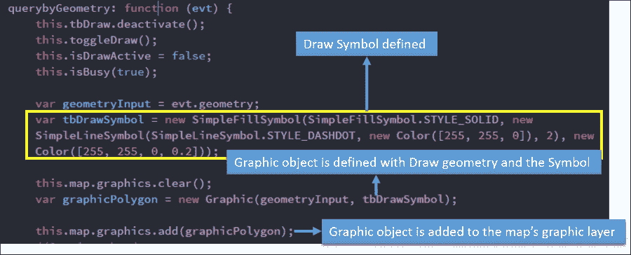

## 执行查询

小部件的主要功能是根据用户的绘制输入定义和执行查询。以下图像将为我们提供构造`querytask`和处理执行的一般方法：

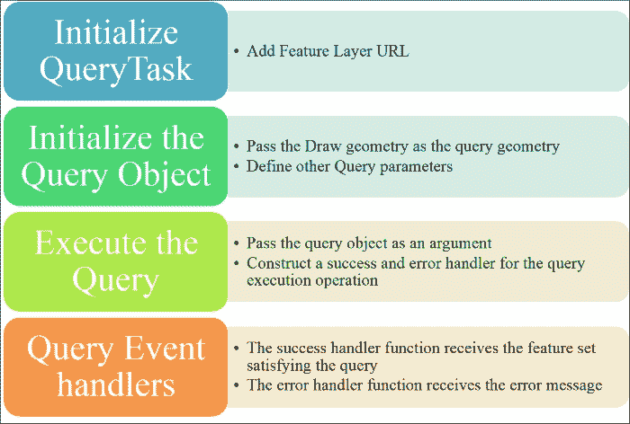

### 初始化 QueryTask 和 Query 对象

我们将使用在上一章中使用的 Active Wildfire 要素图层。在提供输入几何体时，我们将使用从`draw-end`事件中获取的几何体，而不是使用地图的当前范围几何体，就像我们在上一章中所做的那样。我们将获取绘制几何体内的所有要素，因此我们将使用真值表达式（`1=1`）作为`where`子句。以下代码解释了如何构造`query`对象以及如何执行和存储`queryTask`作为延迟变量：

```js
var queryTask = new QueryTask(this.wildFireActivityURL);
var query = new Query();
query.where = "1=1";
query.geometry = geometryInput;
query.returnGeometry = true;
query.outFields = ["FIRE_NAME", "AREA_", "AREA_MEAS"];
var queryDeferred = queryTask.execute(query);
```

### 查询事件处理程序

`QueryTask`对象上的`execute`方法返回一个延迟变量。这意味着我们应该使用`.then()`操作来引出任务执行结果。成功处理程序返回一个`featureset`。`featureset`是一组要素。要素包含图形以及一些属性。

现在，有两个操作需要执行以显示查询结果：

1.  通过适当地对查询结果进行符号化并将其添加为地图上的适当图形来突出显示查询结果。

1.  在简单的 HTML 表格中显示满足查询条件的 Active Wildfires 的详细信息。HTML 表格应该来自 HTML 模板文件。

#### 定义 HTML 模板

我们需要一个 HTML 模板来渲染小部件。该小部件将具有以下组件：

+   一个按钮的`click`事件将切换绘制事件

+   一个按钮用于清除绘制的图形，以及结果图形和 HTML 表格

+   一个`dom`元素来保存正在构建的 HTML 表格。

以下屏幕截图解释了 HTML 模板的构造方式：

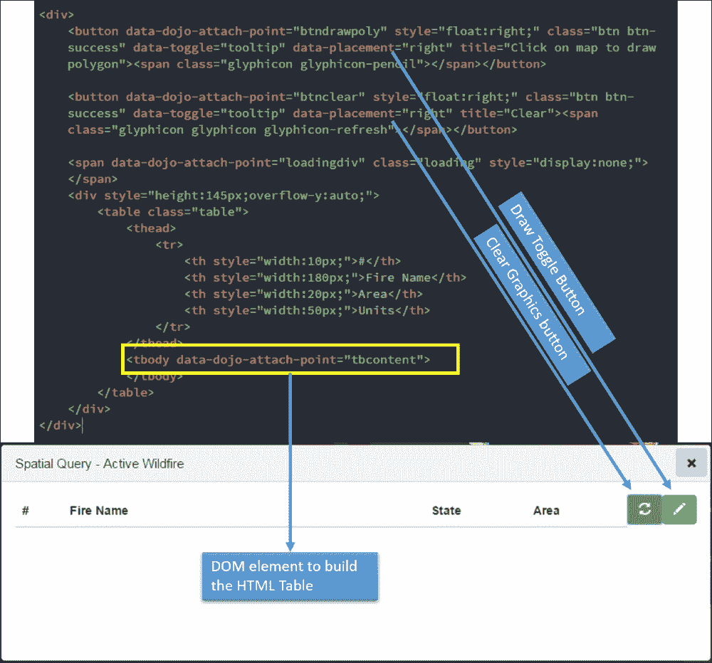

应该使用`dojo/text!`插件将此 HTML 文件作为插件加载。完成后，可以使用此符号访问代码中由`dojo-attach-point`引用的所有`dom`元素。还应该实现处理`toggleDraw`按钮和`clear`按钮的点击事件的函数。以下屏幕截图显示了这个的基本实现：


#### 对查询结果进行符号化

查询返回的要素是野火位置，所有位置都具有点几何。我们可以使用`SimpleMarkerSymbol`或`PictureMarkerSymbol`来对查询返回的要素进行符号化。`PictureMarker`符号接受以下属性：

+   `angle`

+   `xoffset`

+   `yoffset`

+   `type`

+   `url`

+   `contentType`

+   `width`

+   `height`

我们将使用应用程序的 PNG 资源来定义`PictureMarkerSymbol`：

```js
  var symbolSelected = new PictureMarkerSymbol({
  "angle": 0,
  "xoffset": 0,
  "yoffset": 0,
  "type": "esriPMS",
  "url": "images/fire_sel.png",
  "contentType": "image/png",
  "width": 24,
  "height": 24
});
```

#### 将图形添加到地图

将所有查询结果特征转换为具有我们刚刚定义的`PictureMarkerSymbol`的图形。此外，我们还将为每个图形添加一个`infotemplate`。`infotemplate`的内容将从查询结果属性中获取。可以通过迭代查询结果对象返回的要素来构建 HTML 表。以下屏幕截图清楚地说明了整个过程：

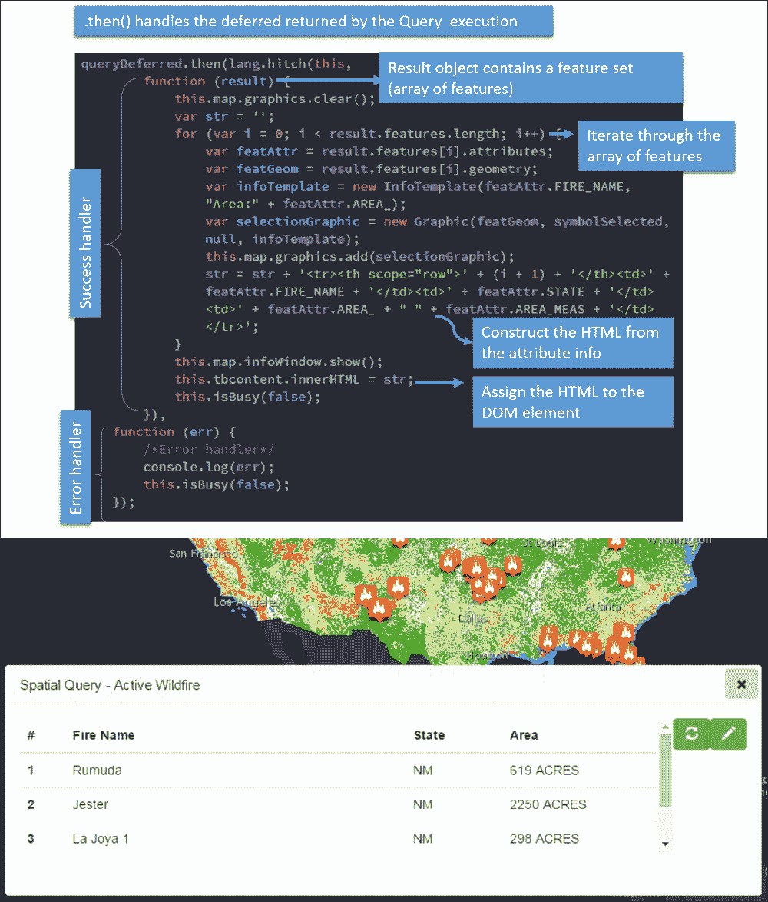

完整的代码清单可以在名为`B049549_04_CODE02`的文件夹中找到。

# 摘要

在本章中，您学习了如何在 dojo 中创建类和自定义小部件，还学习了一个 dojo 小部件的生命周期。然后，我们遵循了为任何与 dojo 相关的项目创建文件夹结构的指南。我们还看了如何使用 dojo 模块提供的国际化功能来支持不同的语言。最后，我们创建了一个自定义小部件，该小部件使用绘图工具来接受用户绘制的多边形，并将其用于查询要素图层。我们还在 HTML 表和地图上显示了结果。在接下来的章节中，我们将学习如何更好地直观地对图形进行符号化，使用一种称为渲染的技术。渲染是一种很好的可视化技术，它让我们能够根据要素中特定属性的值以不同方式对要素进行符号化。在后续章节中，我们将扩展可视化技术，以涵盖数据的非空间表示，如图表和图形。
