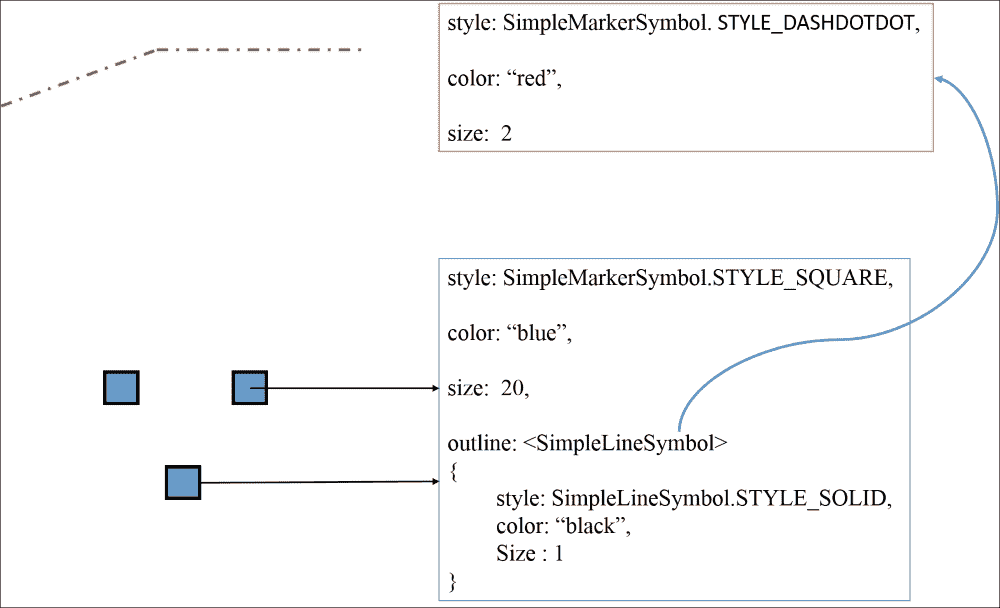
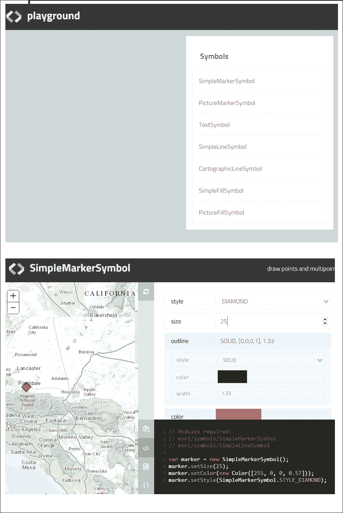
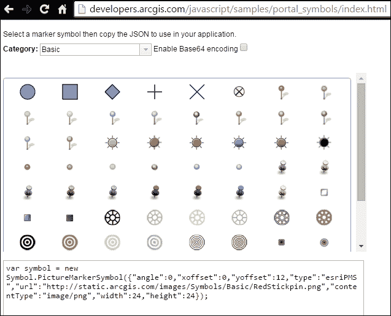
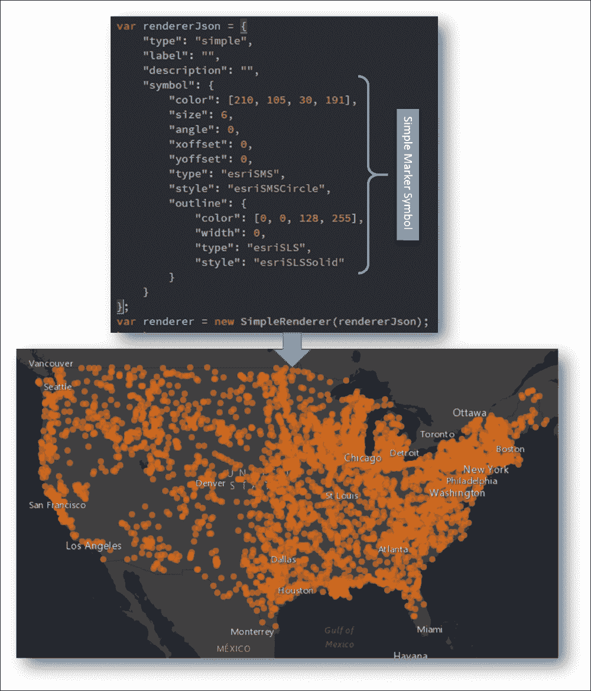
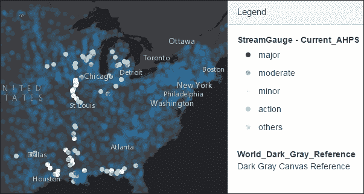
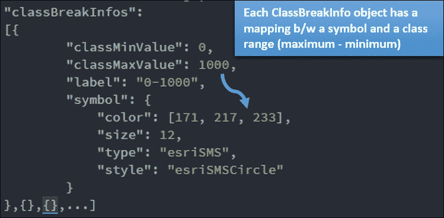
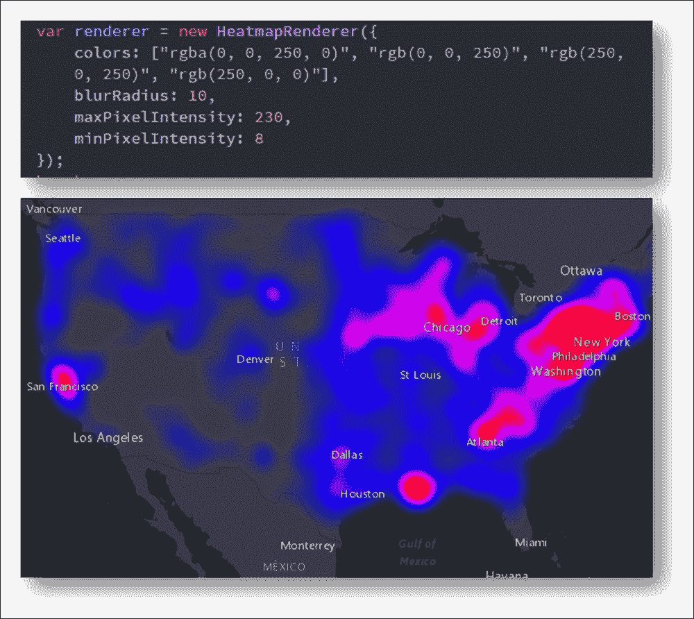
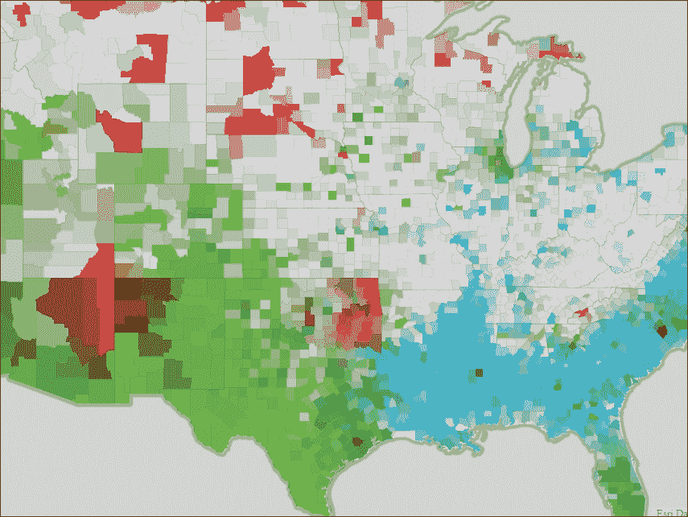

# 第五章：使用渲染器

渲染器为我们提供了一种直观地使用不同符号和颜色来可视化数据的媒介。渲染器不仅是一种数据可视化技术，而且越来越被认为是一种数据分析工具。正确使用渲染器将帮助我们看到数据中的空间模式，并显示各种现象的地理分布。对基本制图学、色彩理论甚至统计学的理解将帮助我们创建更好的渲染器，最终更好地洞察可用数据。本章将涵盖以下主题：

+   学习 API 提供的不同符号和颜色

+   学习如何创建`SimpleRenderer`方法

+   学习如何高效创建`UniqueValueRenderer`方法

+   学习何时使用`ClassBreakRenderer`和`HeatmapRenderers`

+   讨论`ScaleDependantRenderers`可以有用的情景

+   智能制图简介

# 使用颜色

处理颜色的 Esri 模块称为`esri/Color`。在处理颜色模块之前，让我们对颜色有一个基本的了解。

## RGB 颜色模型

可见光谱中的任何颜色（紫罗兰到红色之间的颜色范围）都可以用红（R）、绿（G）或蓝（B）颜色的组合来表示。这就是**RGB 颜色模型**。还有其他颜色模型，但让我们现在先使用 RGB 颜色模型。每种颜色 R、G 或 B 都可以用 0 到 255 的比例来表示。

以下图片显示了三种原色（R、G 和 B）及其叠加效果之间的关系：


当三种颜色（R、G 和 B）以相等比例混合时，产生的颜色总是位于灰度范围内的某个位置。以下几点值得注意：

+   例如，如果`R=0`，`G=0`，`B=0`，混合产生黑色。

+   如果`R=255`，`G=255`，`B=255`，混合产生白色。

+   任何其他数字值，当等量混合时，产生灰色的阴影。

例如，如果`R=125`，`G=125`，`B=125`，它将是灰色。

+   颜色模型还显示，当红色和绿色混合在一起时（`R=255`，`G=255`，`B=0`），我们得到黄色。

+   当仅混合红色和蓝色时（`R=255`，`G=0`，`B=255`），我们得到品红色。

+   当绿色和蓝色混合时，我们得到青色（`R=0`，`G=255`，`B=255`）。

## Esri 颜色模块

要使用 RGB 颜色模型定义颜色，可以使用以下格式：

```js
var r = g = b = 125;
var color = new Color([r, g, b]);
```

在上面的片段中，`color`是`esri/Color`模块的一个实例，`r`、`g`和`b`分别是红色、绿色和蓝色的值。颜色应始终按照（`r`、`g`和`b`）的顺序添加为数组对象。如预期的那样，`color`变量存储了灰色。如果我们需要向颜色添加透明度，我们可以定义透明度值，称为`alpha`，它是一个介于`0`和`1.0`之间的整数，其中`0`表示完全透明，`1.0`表示不透明。透明度值将作为数组中的第四个值添加：

```js
define(["esri/Color"], function(Color){
var r = g = b = 100;
var alpha = 0.5; // 50 % transparency
var color2 = new Color ([r, g, b, alpha]);
})
```

RGB 值可以表示为十六进制数。例如，`[255, 0, 0]`可以表示为`#FF0000`。API 还允许我们通过其英文命名字符串来表示颜色，例如`blue`：

```js
define(["esri/Color"], function(Color){
var colorString = "red";
var colorHex = "#FF0000"; 
var color1 = new Color(colorString);
var color2 = new Color(colorHex);
```

# 使用符号

符号是基于它们试图符号化的几何图形。因此，用于表示点、线和多边形的符号彼此不同。除了几何图形之外，定义符号所需的三个重要参数是以下：

+   风格

+   颜色

+   维度（或大小）

通常提供风格作为模块常量。例如，`SimpleLineSymbol.STYLE_DASHDOT`、`SimpleFillSymbol.STYLE_SOLID`和`SimpleMarkerSymbol.STYLE_CIRCLE`，其中`SimpleLineSymbol`、`SimpleFillSymbol`和`SimpleMarkerSymbol`分别用于符号化线、多边形和点要素：

+   这些符号的颜色可以由我们在前面章节中讨论的颜色模块定义。

+   基于几何类型，尺寸意味着不同的东西。例如，对于线符号，我们使用称为 `width` 的参数来指代线的厚度，而对于点，我们使用名为 `size` 的参数来定义其尺寸。

让我们先讨论基于三角形的几何符号，然后再处理非基于几何的和特殊符号。

基于几何的符号如下：

+   `SimpleLineSymbol`: 用于表示线几何

+   `SimpleMarkerSymbol`: 用于表示点几何

+   `SimpelFillSymbol`: 用于表示多边形几何

## SimpleLineSymbol

线符号构造函数是最简单的，因为它只需用样式、颜色和宽度三个参数来定义。

| 名称 | 值 |
| --- | --- |
| 模块名称 | `esri/symbols/SimpleLineSymbol` |
| 构造函数 | `new SimpleLineSymbol(style, color, and width)` |

`style` 是一个模块常量。该模块提供以下样式：

+   `STYLE_DASH` (创建由短划线组成的线)

+   `STYLE_DASHDOT` (创建由短划线点组成的线)

+   `STYLE_DOT` (创建由点组成的线)

该模块提供了其他样式常量，如 `STYLE_LONGDASH`, `STYLE_LONGDASHDOT`, `STYLE_NULL`, `STYLE_SHORTDASH`, `STYLE_SHORTDASHDOT`, `STYLE_SHORTDASHDOTDOT`, `STYLE_SHORTDOT`, 和 `STYLE_SOLID`。

`STYLE_SOLID` 是默认样式，提供了一个连续的实线。

我们可以使用 `simpleLineSymbol.setColor(color)` 方法设置线的颜色；这里，`color` 是 Esri `Color` 对象，`simpleLineSymbol` 是 `SimpleLineSymbol` 对象的一个实例。`style` 常量可以使用 `setStyle(style)` 方法设置。`SimpleLineSymbol.toJson()` 是一个重要的方法，它将 `SimpleLineSymbol` 转换为 ArcGIS 服务器 JSON 表示。

以下代码片段将创建一条红色实线：

```js
var simpleLineSymbol = new SimpleLineSymbol();
var color = new Color("red");
simpleLineSymbol.setColor(color);
simpleLineSymbol.setWidth(2);
```

## SimpleMarkerSymbol

`SimpleMarkerSymbol` 方法用于表示一个点。与表示线的复杂性相比，表示点几何有一个额外的复杂性，即它接受一个轮廓参数，该参数本身是一个 `SimpleLineSymbol` 对象。



| 名称 | 值 |
| --- | --- |
| 模块名称 | `esri/symbols/SimpleMarkerSymbol` |
| 构造函数 | `new SimpleMarkerSymbol(style, size, outline, color)` |

该模块提供了以下样式常量：

+   `STYLE_CIRCLE`

+   `STYLE_DIAMOND`

+   `STYLE_SQUARE`

`setAngle(angle)` 方法按指定角度顺时针旋转符号。`setColor(color)` 方法设置符号的颜色。`setOffset` (`x` 和 `y`) 设置屏幕单位中标记的 `x` 和 `y` 偏移量。`setOutline(outline)` 设置标记符号的轮廓。`setSize(size)` 允许我们以像素为单位设置标记的大小。`setStyle(style)` 设置标记符号样式。`toJson()` 将对象转换为其 ArcGIS 服务器 JSON 表示。

## ArcGIS 符号沙盘

如果选择合适的颜色和样式以及其他属性来表示一个符号似乎是一个困难的选择，下面的网页试图通过提供一个沙盒来生成任何类型的符号和定义类似符号所需的代码来帮助你。该网页位于 [`developers.arcgis.com/javascript/samples/playground/index.html`](http://developers.arcgis.com/javascript/samples/playground/index.html)。

导航到此 URL 将使您进入类似以下截图的页面。我们可以选择几乎任何类型的符号：



选择其中一个将导航到另一个页面，您可以在该页面上选择属性并生成符号代码。


嗯，我们很容易生成了生成半透明、红色、菱形 `SimpleMarkerSymbol`（无轮廓）所需的代码：

```js
// Modules required: 
// esri/symbols/SimpleMarkerSymbol
// esri/symbols/SimpleLineSymbol

var marker = new SimpleMarkerSymbol();
marker.setStyle(SimpleMarkerSymbol.STYLE_DIAMOND);
marker.setColor(new Color([255, 0, 0, 0.55]));
marker.setSize(25);
```

## SimpleFillSymbol

`SimpleFillSymbol`模块帮助我们为多边形生成符号。

+   模块名称：`esri/symbols/SimpleFillSymbol`

+   `new SimpleFillSymbol(style, outline, color)`

`STYLE`参数的一些模块常量如下：

+   `STYLE_BACKWARD_DIAGONAL`

+   `STYLE_CROSS`

+   `STYLE_NULL`

`SimpleFillSymbol.STYLE_SOLID`是默认样式。

## PictureMarkerSymbol

当我们需要描绘一个图标来象征一个点几何体时，我们可以使用这个模块。我们不需要将颜色信息作为参数提供，而是需要一个图像 URL 来显示一个图片作为标记符号。

| 名称 | 值 |
| --- | --- |
| 模块 | `esri/symbols/PictureMarkerSymbol` |
| 构造函数 | `new PictureMarkerSymbol(url, width, height)` |

在[`developers.arcgis.com/javascript/samples/portal_symbols/index.html`](http://developers.arcgis.com/javascript/samples/portal_symbols/index.html)找到的网页上可以帮助我们搜索适当的`PictureMarkerSymbol`。

导航到此 URL 将打开下面显示的页面。当选择图片图标时，下方会生成代码。可以重用此代码来重新创建在网页中选择的`PictureMarkerSymbology`。

生成的代码是`PictureMarkerSymbol`的 JSON 表示。JSON 对象提供以下属性：

+   `angle`

+   `xoffset`

+   `yoffset`

+   `type`

+   `url`

+   `contentType`

+   `width`

+   `height`

+   `imageData`

在这些中，`imageData`和`url`是多余的，所以如果我们可以使用 URL 属性，我们可以避免`imageData`属性。`imageData`属性只是图像的`Base64`表示。为了避免这种情况，我们可以取消网页右上角的一个框，上面写着**启用 Base64 编码**之类的字样。

此外，如果`angle`、`xoffset`和`yoffset`的值为 0，我们也可以省略这些。



使用此网页提供的图标的 URL 以及 ArcGIS Symbol Playground 将使我们能够进一步自定义`PictureMarkerSymbol`。


要自定义`PictureMakerSymbol`，请使用以下内容：

```js
// Modules required: 
// esri/symbols/PictureMarkerSymbol

var marker = new PictureMarkerSymbol();
marker.setHeight(64);
marker.setWidth(64);
marker.setUrl("http://static.arcgis.com/images/Symbols/Basic/RedStickpin.png");
```

### PictureFillSymbol

`PictureFillSymbol`进一步让我们用图像填充多边形几何体。


### TextSymbol

文本符号可以用来代替标签。文本符号缺乏几何信息，因此需要附加到几何体上。


从 ArcGIS Symbol Playground 生成的以下片段演示了生成`TextSymbol`的组件：

```js
// Modules required: 
// esri/symbols/TextSymbol
// esri/symbols/Font

var font = new Font();
font.setWeight(Font.WEIGHT_BOLD);
font.setSize(65);
var textSym = new TextSymbol();
textSym.setFont(font);
textSym.setColor(new Color([255, 0, 0, 1]));
textSym.setText("Sample Text");
```

# 使用渲染器

当应用程序使用从 Web 地图或 GIS 服务引用的图层时，Web 地图或服务本身提供了默认的绘图属性，确定图层的绘制方式。开发人员可以选择通过使用颜色、符号和渲染器来改变和增强要素的显示方式来覆盖这种行为。

您可以使用`setSymbol()`方法将符号应用于单个图形。当您想要将符号应用于动态、要素或图形图层中的所有图形时，可以使用渲染器。

渲染器使得可以快速地对许多要素进行符号化，可以使用单个符号或基于属性值使用多个符号。

ArcGIS API for JavaScript 中提供的一些渲染器如下：

+   `SimpleRenderer`：将相同的符号应用于图层中的所有图形

+   `UniqueValueRenderer`：根据每个图形的唯一属性值应用特定的符号

+   `ClassBreaksRenderer`：根据属性值的范围应用不同大小或颜色的符号

+   `DotDensityRenderer`：显示离散空间现象的空间密度变化

+   `HeatmapRenderer`：将点数据转换为显示高密度或加权区域集中度的光栅显示，使用模糊半径和强度值

+   `TemporalRenderer`：这可视化地图当前范围内的实时或历史观测，考虑相对要素老化和观测事件发生的轨迹，如飓风。

+   `ScaleDependentRenderer`：这根据地图的当前比例尺对同一图层应用不同的渲染器。

## 为场景选择渲染器

API 文档中的符号和渲染器指南提供了一个很好的指南，介绍了如何使用符号和渲染器。文档可以在[`developers.arcgis.com/javascript/jshelp/inside_renderers.html`](https://developers.arcgis.com/javascript/jshelp/inside_renderers.html)上访问。

`UniqueValueRenderer`和`ClassBreaksRenderer`是基于属性的渲染器。这意味着属性值决定了要素的符号化方式。要确定在特定情况下使用`UniqueValueRenderer`还是`ClassBreaksRenderer`，需要考虑需要进行分类的字段值的性质。

### 注意

如果要渲染的字段上的唯一值集合较小且离散，请考虑使用`UniqueValueRenderer`。

如果要渲染的字段上的唯一值集合具有广泛范围和/或是连续的，请考虑使用`ClassBreaksRenderer`。

`UniqueValueRenderer`和`ClassBreaksRenderer`具有`defaultSymbol`属性，当值或断点无法匹配时会使用。在开发过程中，您可以使用具有高对比度颜色的默认符号，快速验证是否有任何要素未能匹配渲染器的标准。

## 开发流量计应用程序

我们将开发一个流量计应用程序，以演示如何使用以下渲染器：

+   简单渲染器

+   独特值渲染器

+   类别分隔渲染器

+   热力图渲染器

### 数据源

流量计数据由 Esri 提供，作为其世界地图集的一部分。这意味着我们需要有 ArcGIS 开发者登录才能访问内容。流量计数据的地图服务的 URL 是[`livefeeds.arcgis.com/arcgis/rest/services/LiveFeeds/StreamGauge/MapServer/`](http://livefeeds.arcgis.com/arcgis/rest/services/LiveFeeds/StreamGauge/MapServer/)。

地图服务提供了美国各地的流量计读数，显示了测量区域的当前水位。我们试图开发的应用程序旨在演示不同的渲染技术在流量计数据上的应用。下一节中即将呈现的快照提供了我们在本章结束时将开发的最终应用程序的初步呈现。

如果您没有 ArcGIS 开发者帐户，请参考第三章*编写查询*，了解如何注册帐户并在应用程序代理中使用凭据的说明。

## 简单渲染器

`SimpleRenderer`由`esri/renderers/SimpleRenderer`模块提供，其构造函数接受任何适当的符号或 JSON。由于所有的流量计位置都是点位置，我们将使用`SimpleMarkerSymbol`来对其进行符号化。

由于我们已经讨论了如何从相应的模块构建`PictureMarkerSymbol`，我们将看到如何使用符号的 JSON 形式。使用符号的 JSON 表示意味着我们不再需要为每个符号和颜色单独加载模块。以下快照显示了 JSON 是如何形成并在`SimpleRenderer`构造函数中使用的：



在前面的代码中，在渲染器分配为`SimpleRenderer`之后，必须使用`setRenderer()`方法将渲染器对象设置为要素图层。此外，一旦渲染应用到要素图层上，图例应该被刷新：

```js
streamLyr.setRenderer(renderer);
streamLyr.redraw();
legend.refresh();
```

## 应用独特值渲染器

唯一值渲染器由`esri/renderers/UniqueValueRenderer`模块提供。唯一值渲染器允许我们为数据中一组唯一值定义不同的符号。最多可以提供三个属性字段来确定数据的唯一性。唯一值渲染器期望`uniqueValueInfos`对象。该对象基本上是唯一值和用于表示该值的符号之间的映射。因此，所有具有特定值的要素将由相应的映射符号渲染。我们可以为渲染器提供`defaultSymbol`对象，该对象将用于表示在`uniqueValueInfos`对象中未定义的任何值。以下是 JSON 表示唯一值渲染器对象，用于表示洪水阶段的唯一值。我们要表示的洪水阶段的唯一值如下：

+   `主要`

+   `适度`

+   `次要`

+   `行动`

```js
var rendererJson = {
  "type": "uniqueValue",
  "field1": "STAGE",
  "defaultSymbol": {},
  "uniqueValueInfos": [{
    "value": "major",
    "symbol": {
      "color": [163, 193, 163],
      "size": 6,
      "type": "esriSMS",
      "style": "esriSMSCircle"
    }
        }, {
    "value": "moderate",
    "symbol": {
      "color": [253, 237, 178],
      "size": 6,
      "type": "esriSMS",
      "style": "esriSMSCircle"
    }
        }, {
    "value": "minor",
    "symbol": {
      "color": [242, 226, 206],
      "size": 6,
      "type": "esriSMS",
      "style": "esriSMSCircle"
    }
        }, {
    "value": "action",
    "symbol": {
      "color": [210, 105, 30],
      "size": 6,
      "type": "esriSMS",
      "style": "esriSMSCircle"
    }
  }]
};
var renderer = new UniqueValueRenderer(rendererJson);
```

上述代码在应用程序中呈现如下：



以下属性可用于特征图层，根据多个视觉属性（如`颜色`、`旋转`、`大小`和`不透明度`）进行渲染：

| 渲染器方法 | 目的 |
| --- | --- |
| `setColorInfo()` | 这显示使用颜色渐变的连续值数组 |
| `setRotationInfo()` | 这会旋转一个符号以指示方向的变化（例如，行驶的车辆或飓风事件） |
| `setSizeInfo()` | 这会根据一系列数据值的范围更改符号大小或宽度 |
| `setOpacityInfo` | 这会更改用于显示图层的 alpha 值 |

## 类别分隔渲染器

当字段被分类和视觉区分时，它会分布在一系列值上，我们可以使用`ClassBreaksRenderer`。可以通过加载`esri/renderers/ClassBreaksRenderer`模块来使用`ClassBreaksRenderer`。

类别分隔渲染器与唯一值渲染器非常相似，因为类别分隔渲染器的构造函数期望一个`classBreakInfos`对象，这与`uniqueValueInfos`对象类似。

`classBreakInfos`是一个`classBreakInfo`对象数组，它将类范围和符号进行了映射。类范围由类的最小值（`classMinValue`）和类的最大值（`classMaxValue`）定义。



以下快照显示了如何使用`classBreakInfo`数组构建`ClassBreakRenderer` JSON 对象，并在地图上呈现：


## 热力图渲染器

`HeatmapRenderer`将点数据渲染成突出显示更高密度或加权值的光栅可视化。该渲染器使用正态分布曲线在垂直和水平方向上分布值。

这个平均函数被水平和垂直应用，以产生一个模糊的影响区域，而不是一个特定的单一点。

`HeatmapRenderer`模块构造函数接受一个颜色数组。第一种颜色用于表示*最小影响*的区域，数组中的最后一种颜色用于表示像素的最高影响。我们还可以为`HeatmapRenderer`构造函数定义其他参数，如`blurRadius`、最大像素强度和最小像素强度。以下代码快照用于生成`HeatmapRenderer`：



## 点密度渲染器

`DotDensityRenderer`提供了创建数据的点密度可视化的能力。点密度地图可以用来可视化离散空间现象的空间密度变化。我们可以使用多个字段以不同颜色在同一地图上可视化多个变量。例如，我们可以使用不同的颜色来显示各种族群的分布。地图上的密度随着用户的放大或缩小而变化。使用`ScaleDependentRenderer`为每个比例或缩放范围设置唯一的点密度渲染器，以便`dotValue`和`dotSize`可以在多个比例范围内变化。

## BlendRenderer

`ClassBreakRenderer`或`UniqueValueRenderer`的问题在于，您必须为任何给定值分配特定的颜色。当基于明确的边界值分配离散颜色不可取时，我们可以使用`BlendRenderer`。

`BlendRenderer`让您对数据进行模糊分类。它允许您为不同字段的值分配不同的颜色，并使用一些不透明度来表示值的大小。由于我们对每个字段使用了不透明度，最终的渲染将是这些颜色的混合。这张图显示了如何混合颜色和不透明度变量以提供渲染：


以下地图显示了美国各地主要少数民族群体的地图。这样的插图可以给出主要特征的感觉，同时不完全压制其他细节：



## 智能映射

`SmartMapping`模块提供了许多辅助方法，帮助我们选择最佳的渲染方法。以下插图显示了`SmartMapping`模块提供的方法列表：


### 注意

智能映射模块：`esri/renderers/smartMapping`

## 类别渲染器的分类方法

类别渲染器辅助方法，如`createClassedColorRenderer()`和`createClassedSizeRenderer()`，需要`classificationMethod`作为参数。如果我们需要理解每个值的重要性，选择这个值是非常重要的。

以下分类方法可用：

+   等间隔

+   自然断点

+   四分位数

+   标准差

默认方法是等间隔的。

等间隔分类将数据平均分成预定义数量的类别。这样的分类可能不一定反映数据的偏斜。例如，如果数据范围是 0-100 万，而大部分数据集中在 30 万-50 万之间，那么与其将数据分类为 0-25 万、25 万-50 万、50 万-75 万和 75 万-100 万，更好的分类方案是在 30 万-50 万之间有更多的分类范围。

自然断点、四分位数和标准差等分类方法有助于更好地分隔数据；因此，我们的数据可视化技术将在统计上更加准确。这个主题将在第七章中进行更详细的讨论，*地图分析和可视化技术*。

# 总结

本章深入探讨了颜色、符号、渲染器以及每种方法可以有效使用的情况。本章还涉及了数据可视化技术的细微差别，以及创建符号和图片标记符号的技巧和窍门。我们通过开发一个流量计应用程序来展示了三种基本渲染器的实用性：简单渲染器、唯一值渲染器和分级渲染器。在接下来的章节中，我们将探讨高级可视化技术，以在空间和时间尺度上对数据进行视觉分类。
