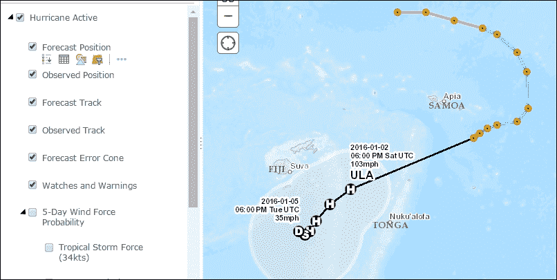
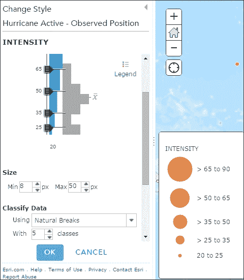
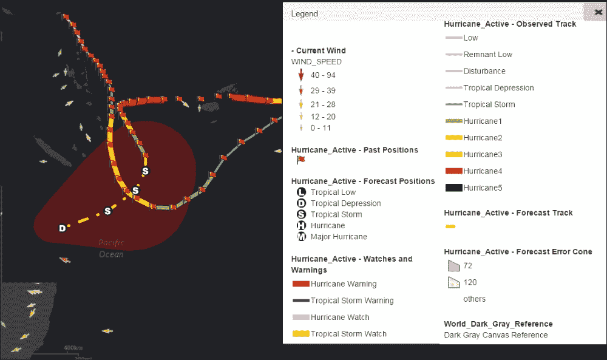

# 第六章。处理实时数据

不断更新的数据给我们在检索和渲染它们方面带来了重大挑战。在本章中，我们将通过开发一个旨在跟踪飓风的应用程序来处理实时数据的两种基本方法。在本章中，您将学习以下主题：

+   了解实时数据的性质，如飓风数据

+   使用 ArcGIS 提供的内置选项来可视化数据

+   获取最新数据的方法

+   设置图层的刷新间隔的方法

# 应用程序背景

我们将处理由国家飓风中心（NHC）提供的飓风数据。NHC 提供了描述热带飓风活动路径和预测的地图服务。NHC 提供的实时数据可以在[`livefeeds.arcgis.com/arcgis/rest/services/LiveFeeds/Hurricane_Active/MapServer`](http://livefeeds.arcgis.com/arcgis/rest/services/LiveFeeds/Hurricane_Active/MapServer)找到。

地图服务提供以下数据：

+   **预测位置**

+   **观测位置**

+   **预测路径**

+   **观测路径**

+   **不确定性锥**

+   **警报和警告**

+   **热带风暴力**

预测和观测位置代表飓风的中心，而路径代表连接的预测和观测位置，以便了解飓风的移动方向。


在**服务目录**标题下，单击**ArcGIS.com 地图**以全面了解地图服务中的数据。

# 可视化地图数据

ArcGIS Online 是可视化和使用 ArcGIS Server 上托管的数据的有效媒介。在 ArcGIS Online 中打开地图服务时，会显示默认的符号，并且我们可以了解我们在应用程序中将要使用的数据的范围。

在以下截图中，我们可以看到**预测位置**要素图层及其默认符号。使用的符号是 PictureMarkerSymbol，它可以让我们了解过去三天（72 小时）飓风的强度。


以下截图全面展示了地图服务中的所有数据，包括预测位置和路径，以及观测位置：



关闭目录中的所有图层，只打开**观测位置**图层。**观测位置**图层只是由简单的渲染器渲染的。符号不会根据任何字段值的大小而变化。它只显示过去 72 小时内测得的风暴活动的位置。


现在 ArcGIS Online 为我们提供了各种设置其符号的选项。当我们在目录中点击图层的名称时，会打开以下屏幕。它显示了基于哪些样式可以更改符号。在以下截图中，**强度**的风暴被选择为显示的字段，并且符号的大小基于**强度**值的数量：


数据可以根据各种分类技术进行分类，例如**等间隔**、**分位数**、**自然间隔**等。



最后，**观测路径**实际上显示了过去 72 小时飓风所经过的路径，并使用唯一值渲染器来渲染数据。


# 构建飓风追踪应用程序

现在我们已经通过 ArcGIS Online 服务了解了我们的数据，我们可以使用地图服务 URL 构建自己的网络地图应用程序。在我们的应用程序中，我们打算包括以下内容：

+   向地图添加显示过去和现在飓风位置的图层

+   添加全球风数据

+   添加一个仪表小部件来显示风速

+   添加一个当前天气小部件，显示用户浏览器位置的当前天气信息

+   添加一个**当前飓风列表**小部件，显示当前飓风的更新列表以及选择时每个飓风的详细信息

## 符号化活跃的飓风层

我们有多个要处理的要素层。让我们尝试构建一个图层字典。在以下代码片段中，我们将尝试创建一个对象数组，其中每个对象都具有诸如 URL 和标题之类的属性。URL 是指要素层的 URL，标题属性是指我们想要引用要素层的标题：

```js
var windDataURL = "http://livefeeds.arcgis.com/arcgis/rest/services/LiveFeeds/NOAA_METAR_current_wind_speed_direction/MapServer";

var activeHurricaneURL = "http://livefeeds.arcgis.com/arcgis/rest/services/LiveFeeds/Hurricane_Active/MapServer";

var layerDict = [
          {
            title: "Forecast Error Cone",
            URL: activeHurricaneURL + "/4"
          },
          {
            title: "Forecast Tracks",
            URL: activeHurricaneURL + "/2"
          },
          {
            title: "Observed Track",
            URL: activeHurricaneURL + "/3"
          },
          {
            title: "Watches and Warnings",
            URL: activeHurricaneURL + "/5"
          },
          {
            title: "Forecast Positions",
            URL: activeHurricaneURL + "/0"
          },
          {
            title: "Past Positions",
            URL: activeHurricaneURL + "/1"
          },
          {
            title: "Wind Data",
            URL: windDataURL + "/0"
          }
        ];
```

这有助于我们使用图层名称或标题属性检索要素层。让我们使用`dojo/_base/array`模块提供的`array.map()`方法将每个对象的相应要素层添加到`layerDict`数组中。`array.map()`方法，如果你还记得第一章, *API 的基础*，实际上是遍历数组中的元素并返回一个数组。然后，可以修改正在迭代的每个项目。在我们的情况下，我们正在尝试对每个项目执行以下操作：

1.  从每个项目的 URL 创建一个要素层。

1.  将要素层添加到地图中。

1.  在`layerDict`数组中的每个项目对象中添加一个额外的图层属性。

以下代码片段解释了这个过程：

```js
var layerDict = array.map(layerDict, function (item) {
          var featLayer = new FeatureLayer(item.URL, {
            mode: FeatureLayer.MODE_ONDEMAND,
            outFields: ["*"]
              //infoTemplate: infoTemplate
          });
          map.addLayer(featLayer);
          item.layer = featLayer;
          return item;
        });
```

现在`layerDict`数组中的每个对象都将具有一个额外的图层属性，该属性保存了由 URL 引用的要素层。

要检索要素层，我们可以使用`dojo/_base/array`模块提供的`array.filter()`方法中的图层名称。`filter`方法()遍历每个对象项，并根据我们的谓词条件返回一个过滤后的数组。

以下代码行返回标题为“预测误差锥”的要素层，并将其保存在名为`foreCastErrorConeFeatureLayer`的变量中：

```js
var foreCastErrorConeFeatureLayer = array.filter(layerDict, function (item) 
{
  return item.title == "Forecast Error Cone";
})[0].layer;
```

我们正在尝试对一些要素层中的要素进行符号化。我们将从过去的位置开始。过去的位置特征层默认情况下由一个带有中心点的圆表示。我们将尝试使用红旗来表示它。将采取以下方法来对其进行符号化：

1.  导入`esri/symbols/PictureMarkerSymbol`模块。

1.  查找代表红旗的 PNG 的 URL，并使用它创建一个`PictureMarkerSymbol`。

1.  导入`esri/renderers/SimpleRenderer`模块，并创建一个`SimpleRenderer`，为渲染器分配我们刚刚创建的`PictureMarkerSymbol`的符号。

1.  为要素层设置我们刚刚创建的简单渲染器的渲染器。

以下代码行清楚地解释了这个过程：

```js
var pastPositionLayer = array.filter(layerDict, function (item) {
    return item.title == "Past Positions";
})[0].layer;

var pastPositionSymbol = new PictureMarkerSymbol({
  "angle": 0,
  "type": "esriPMS",
  "url": http://static.arcgis.com/images/Symbols/Basic/RedFlag.png",
  "contentType": "image/png",
  "width": 18,
  "height": 18
});

var pastPositionRenderer = new SimpleRenderer(pastPositionSymbol);
pastPositionLayer.setRenderer(pastPositionRenderer);
```

现在，我们可以尝试渲染预测误差锥层。预测误差锥是代表预测预测中的不确定性的多边形要素层。每种飓风类型都有两个多边形要素。一个多边形代表 72 小时的预测误差多边形，另一个代表 120 小时的预测误差多边形。这些信息在要素层的`FCSTPRD`字段中可用。

让我们创建一个唯一值渲染器，并根据`FCSTPRD`字段名称的值以不同的方式对每种类型的多边形进行符号化。要创建唯一值渲染器，我们需要采取以下方法：

1.  导入`esri/renderers/UniqueValueRenderer`，`esri/symbols/SimpleLineSymbol`和`esri/symbols/SimpleFillSymbol`模块。

1.  为渲染器创建一个默认符号。由于我们知道对于所有我们的`预测误差`多边形，`FCSTPRD`字段值将是`72`或`120`，我们将创建一个具有空符号的`SimpleFillSymbol`，并将其轮廓设置为 null 线符号。

1.  从`esri/renderers/UniqueValueRenderer`模块创建一个`UniqueValueRenderer`对象。将其分配为我们刚刚创建的默认符号以及`FCSTPRD`作为渲染基础的字段名。

1.  使用`addValue()`方法向渲染器添加值。`addValue()`方法接受每个唯一值（`72` / `120`）及其对应的符号。

1.  将渲染器设置为`预测误差锥体要素图层`。

```js
**//Get the Forecast Error Cone feature layer**
var foreCastErrorConeFeatureLayer = array.filter(layerDict, function (item) {
  return item.title == "Forecast Error Cone";
})[0].layer;

**//Create a Null SimpleFillSymbol**
var defaultSymbol = new SimpleFillSymbol().setStyle(SimpleFillSymbol.STYLE_NULL);

**//With a null Line Symbol as its outline**
defaultSymbol.outline.setStyle(SimpleLineSymbol.STYLE_NULL);

var renderer = new UniqueValueRenderer(defaultSymbol, "FCSTPRD");

**//add symbol for each possible value**
renderer.addValue('72', new SimpleFillSymbol().setColor(new Color([255, 0, 0, 0.5])));
renderer.addValue('120', new SimpleFillSymbol().setColor(new Color([255, 255, 0, 0.5])));

**//Set Renderer**
foreCastErrorConeFeatureLayer.setRenderer(renderer);
```

我们已经尝试使用`PictureMarkerSymbol`标志化要素图层，并使用`SimpleRenderer`进行渲染。对于另一个要素图层，我们使用了唯一值渲染器，以不同的方式渲染具有特定字段不同值的要素。现在让我们尝试一种称为`CartographicLineSymbol`的特殊符号。

`CartographicLineSymbol`提供了额外的属性，如端点和连接，定义了线的端点和边缘连接的呈现方式。要了解有关这两个属性的更多信息，请访问 API 页面[`developers.arcgis.com/javascript/jsapi/cartographiclinesymbol-amd.html`](https://developers.arcgis.com/javascript/jsapi/cartographiclinesymbol-amd.html)。

我们想要使用`CartographicLineSymbol`来标志预测轨迹要素图层。以下显示了如何使用该符号并渲染特定要素图层：

1.  导入`esri/symbols/CartographicLineSymbol`模块。

1.  对于样式参数，使用`STYLE_DASHDOT`，颜色参数为黄色，像素宽度为`5`，端点类型为`CAP_ROUND`，连接类型为`JOIN_MITER`。

1.  使用`SimpleRenderer`的符号。

1.  将渲染器设置为预测轨迹要素图层。

以下代码片段对先前的方法进行了编码：

```js
var lineSymbol = new CartographicLineSymbol(
  CartographicLineSymbol.STYLE_DASHDOT,
  new Color([255, 255, 0]), 5,
  CartographicLineSymbol.CAP_ROUND,
  CartographicLineSymbol.JOIN_MITER, 5
);
var CartoLineRenderer = new SimpleRenderer(lineSymbol);

forecastTrackLayer.setRenderer(CartoLineRenderer);
```

当先前的渲染器应用于过去位置图层、**预测轨迹**和**预测误差锥体**图层时，我们的地图如下所示：



# 添加全球风数据仪表

全球风数据也是 ArcGIS 实时数据提供的地图服务，提供各个位置的全球级风数据。我们的目标是合并一个仪表部件，根据悬停的风位置改变其仪表读数。风数据已经被适当地默认标志化。

以下屏幕截图显示了基于我们的全球风数据的仪表部件。地图中的箭头是风特征位置，箭头的方向表示风的方向，箭头的颜色和大小表示风的速度。两个示例中的仪表读数表示悬停在其上的特征（由一个粗黄色圆圈突出显示）。


风数据的 URL 已在我们先前的代码片段中提供，并已添加到`layerDict`数组中：

```js
var activeHurricaneURL = "http://livefeeds.arcgis.com/arcgis/rest/services/LiveFeeds/Hurricane_Active/MapServer";
```

由于此 URL 已添加到`layerDict`数组中，我们可以继续创建一个表示来自其标题`"Wind Data"`的风数据的要素图层：

```js
var windFeatureLayer = array.filter(layerDict, function (item) {
          return item.title == "Wind Data";
        })[0].layer;
```

现在让我们添加一个仪表部件，可以利用来自该图层的数据。该仪表由 Esri 的`dijit`（dojo 部件）`esri/dijit/Gauge`提供。仪表构造函数非常简单。它接受一个`GaugeParameter`对象和容器 dom ID。

`GaugeParameter`对象需要我们构建。在创建`GaugeParameter`对象之前，请记住以下几点：

1.  `layer`属性接受表示要素图层的引用。

1.  `dataField`属性指示应使用哪个字段来获取仪表读数。

1.  `dataFormat`属性接受两个值——`value`或`percent`。当选择百分比时，仪表的最大值会自动计算，并且仪表读数显示为最大值的百分比。当`dataFormat`值选择为`value`时，悬停的要素的实际值将显示为仪表读数。

1.  `dataLabelField`属性可用于表示站点名称或关于所悬停特征的任何其他辅助属性，这些属性可以标识特征。这应该与`title`属性结合使用，它表示`dataLabelField`属性表示的内容。

1.  `color`属性让我们设置仪表读数的颜色。

1.  如果`value`被选择为`dataFormat`的值，我们还需要为`maxDataValue`属性提供一个值。

以下代码是我们用来创建你在之前截图中看到的风速计小部件的代码：

```js
var windGaugeParams = {
          caption: "Wind Speed Meter",
          dataFormat: "value",
          dataField: 'WIND_SPEED',
          dataLabelField: "STATION_NAME",
          layer: windFeatureLayer,
          color: "#F00",
          maxDataValue: 80,
          title: 'Station Name',
          unitLabel: " mph"
        };
var windGauge = new Gauge(windGaugeParams, "gauge");
windGauge.startup();
```

# 跟踪最新的活跃飓风

让我们创建一个小部件来跟踪最新的活跃飓风。我们已经有了代表活跃飓风位置的所有图层。我们的目标是获取所有活跃飓风的最新位置，并在小部件中显示出来。

以下截图显示了我们的小部件在开发后的样子：


小部件中的下拉框列出了所有流行的活跃飓风的名称。以下网格显示了所选飓风的详情。

以下思路已经纳入到了这个小部件的开发中：

1.  使用缓存破坏查询来获取风暴名称的唯一列表，并用这个列表填充下拉框。

1.  在下拉框的选择更改时，获取所选风暴的最新要素。

1.  在小部件中填充所选风暴的详情。

1.  每 30 秒获取更新的详情。

## 获取风暴的唯一列表

为了获取我们数据中的唯一值，查询对象有一个名为`returnDistinctValues`的属性，其值应为布尔值`true`。以下代码片段解释了该属性的用法：

```js
query.returnDistinctValues = true;
```

此外，查询对象的 outfield 属性应该只列出那些需要唯一值的字段。在我们的情况下，字段名是`STORMNAME`。请参考以下代码片段以了解这一点：

```js
query.outFields = ["STORMNAME"];
```

为了每次都能获得更新的结果，我们需要避免缓存的查询结果。所以我们可能需要使用一个类似于`1=1`的模式，而不是使用一个真值表达式。

```js
"random_number = random_number".
```

这将帮助我们获得非缓存的查询结果。非缓存的查询结果确保我们在一定时间内查看到的是最新数据。让我们编写一个可以创建这样的查询字符串的函数：

```js
var _bust_cache_query_string: function () {
  var num = Math.random();
  return num + "=" + num;
}
```

现在我们可以在每次需要为查询对象的`where`属性分配一个值时使用这个函数：

```js
query.where = this._bust_cache_query_string();
```

在查询对象中使用`returnDistinctValues`属性时，我们需要将`returnGeometry`属性设置为布尔值`false`。以下代码解释了如何形成查询任务和查询对象，以及如何使用查询结果来填充下拉框。在代码的结尾，我们将调用一个`_update_hutticane_details()`方法。这个方法获取所选`StormName`的最新详情：

```js
events: function () {
  //initialize query task
  var queryTask = new QueryTask("http://livefeeds.arcgis.com/arcgis/rest/services/LiveFeeds/Hurricane_Active/MapServer/1");

  //initialize query
  var query = new Query();
  query.returnGeometry = false;
  query.where = "1=1 AND " + this._bust_cache_query_string();
  query.outFields = ["STORMNAME"];
  query.returnDistinctValues = true;
  var that = this;

  queryTask.execute(query, function (result) {
    console.log(result);

    var i;
    //Remove all existing items

    for (i = that.cbxactiveHurricane.options.length - 1; i >= 0; i--) {
      that.cbxactiveHurricane.remove(i);
    }
    //Fill n the new values
    array.forEach(result.features, function (feature) {
      console.debug(feature.attributes.STORMNAME);
      that.cbxactiveHurricane.options[that.cbxactiveHurricane.options.length] = new Option(feature.attributes.STORMNAME, feature.attributes.STORMNAME);
    });
    that._update_hutticane_details();
  });

this.updateTimmer = setInterval(lang.hitch(this, this._update_hutticane_details), 30000);
}
```

在前面的代码行中，观察最后三行。我们使用一个`timer`函数，每 30 秒调用一次`_update_hutticane_details()`。这是一个获取飓风最新详情的函数。

## 获取最新数据并在网格上显示

在前面的代码片段中，当我们尝试构建查询对象时，我们使用了`returnDistinctValues`属性来根据字段名获取不同的值。现在我们将使用查询对象的`orderByFields`属性来根据字段名对要素进行排序。为了首先获取最新的要素，字段名应该代表一个时间字段。在我们的情况下，字段名是`DTG`。为了确保我们获取查询结果的最新时间作为第一个要素，我们可以在构建查询对象时使用以下代码行。`orderByField`接受一个字符串数组，每个项目都提到了要根据哪个字段名进行排序，以及排序是升序(`ASC`)还是降序(`DESC`)。默认顺序是升序：

```js
query.orderByFields = ["DTG DESC"];
```

以下代码行演示了如何构建所需的查询对象以及如何使用结果来填充小部件中关于最新风暴的信息：

```js
_update_hutticane_details: function () {
  var selected_hurricane = this.cbxactiveHurricane.value;

  var queryTask = new QueryTask("http://livefeeds.arcgis.com/arcgis/rest/services/LiveFeeds/Hurricane_Active/MapServer/1");
  var query = new Query();
  query.returnGeometry = true;
  query.where = "STORMNAME='"+ selected_hurricane +"' AND " + this._bust_cache_query_string();
  query.outFields = ["*"];
  **query.orderByFields = ["DTG DESC"];**
  var that = this;
  queryTask.execute(query, function (result) {
    console.log(result);
    if (result.features.length>0){
      that._mslp.innerHTML = result.features[0].attributes.MSLP;
      that._basin.innerHTML = result.features[0].attributes.BASIN;
      that._stormnum.innerHTML = result.features[0].attributes.STORMNUM;
      that._stormtype.innerHTML = result.features[0].attributes.STORMTYPE;
      that._intensity.innerHTML = result.features[0].attributes.INTENSITY;
      that._ss.innerHTML = result.features[0].attributes.SS;
    }
  });
}
```

请注意上一段代码中的`where`子句。我们仅选择了从下拉框中选择的`StormName`的详细信息，并使用缓存破坏函数获取最新数据：

```js
query.where = "STORMNAME='"+ selected_hurricane +"' AND " + this._bust_cache_query_string();
```

### 刷新要素图层

显示时间数据的要素图层可能需要在各种间隔时间刷新。我们可以使用要素图层来刷新间隔属性以设置此功能：

```js
featureLayer. refreshInterval = 5; // in minutes
```

这是我们之前处理的缓存破坏技术的补充。

# 创建天气小部件

我们将尝试在我们的应用程序中创建一个天气小部件，该小部件显示用户所在位置的当前天气状况。用户的位置实际上是指现代浏览器中地理位置 API 识别的浏览器位置。当浏览器无法找到用户的位置时，我们将尝试找到地图中心的天气数据。创建天气小部件为我们提供了以下机会和挑战：

+   天气数据在实时不断更新，并且是一个时空现象，意味着随着地点和时间的变化而变化

+   它为我们提供了使用外部天气 API 的机会，这是一个非 ArcGIS 基础的数据

+   它为我们提供了一个探索客户端几何操作的机会，例如缓冲区和地理和 Web 墨卡托坐标之间的转换

## 开放天气 API

我们需要找到一个数据源来获取最新的天气数据。幸运的是，开放天气 API 是获取不同格式的天气数据的简单免费选项。付费计划提供更大的使用级别。对于我们的目的，免费版本效果很好。

该 API 提供 REST 端点，可提供以下类型的数据：

+   当前天气数据

+   5 天/3 小时预报

+   5 天/3 小时预报

+   历史数据

+   紫外线指数

+   天气地图图层

+   气象站

我们将使用当前天气数据端点来获取给定位置的天气详情。

要访问 API，您需要注册 API 密钥。以下 URL 解释了如何获取`appid`并在 REST 查询中使用它：[`openweathermap.org/appid#get`](http://openweathermap.org/appid#get)。

我们将使用的基本 URL 是这个：

```js
var url = "http://api.openweathermap.org/data/2.5/weathers";
```

我们将提供纬度和经度值以发出请求到开放天气 API。我们尝试使用`esriRequest`对象进行 HTTP `GET`请求，需要导入`esri/request`模块。以下片段解释了如何构建`esriRequest`对象：

```js
var request = esriRequest({
  // Location of the data
  url: this.url + '?lat=' + this.lat + '&lon=' + this.lon + '&appid=' + this.apikey,

  handleAs: "json"
});
```

如果观察正在构建的 URL，它需要三个参数，即`lat`、`lon`和`appid`。

`appid`参数接受我们之前生成的应用程序密钥。我们将遵循两种方法来获取纬度和经度值：

1.  如果浏览器支持地理位置 API，则从浏览器位置获取纬度和经度值。

1.  如果浏览器不支持地理位置 API，则将地图范围的中心点投影到地理坐标，并用于获取该位置的天气数据。

## 使用地理位置 API

使用地理位置 API 就像调用导航器对象的`geolocation.getCurrentPosition()`方法一样简单。该方法返回一个回调对象，其中包含浏览器的位置。以下代码行显示了如何调用`geolocation`API 以获取浏览器的当前位置：

```js
getLocation: function () {
  if (navigator.geolocation) {
    navigator.geolocation.getCurrentPosition(lang.hitch(this, this.showPosition));
  } else {
    console.log("Geolocation is not supported by this browser.");
  }
}
```

在上述代码中，调用对象是一个名为`showPosition()`的函数。`showPosition()`函数将位置作为回调对象。可以使用`coords`属性访问位置的坐标。

### 在输入数据上使用几何引擎

`coords`对象具有三个属性，即：

+   `纬度`

+   `经度`

+   `准确性`

我们清楚地了解了纬度和经度，但精度是什么？精度是表示由 API 提供的坐标可能存在的误差的数值数量，单位为米。换句话说，位置在一个误差圆内是准确的。当我们提到它是一个误差圆时，能否在地图上将其可视化，这样我们就可以知道浏览器的大致位置，也许可以证实结果。我们尝试了一下；看起来相当准确。为了创建一个误差圆，我们采取了以下方法：

1.  使用纬度和经度值创建一个点几何体。

1.  使用 API 提供的`webMercatorUtils`将点从地理坐标转换为 Web 墨卡托坐标。

1.  使用 API 提供的`geometryEngine`模块，围绕投影点创建一个缓冲区，缓冲区半径等于位置的精度。

1.  使用`SimpleFillSymbol`对缓冲区几何进行符号化。

以下代码行清楚地解释了前面的过程：

```js
showPosition: function (position) {
  console.log(position);
  this.accuracy = position.coords.accuracy;
  this.lat = position.coords.latitude;
  this.lon = position.coords.longitude;

  //error circle
  var location_geom = new Point(this.lon, this.lat, new SpatialReference({ wkid: 4326 }));
  var loc_geom_proj = webMercatorUtils.geographicToWebMercator(location_geom);
  var location_buffer = geometryEngine.geodesicBuffer(loc_geom_proj, this.accuracy, "meters", false);

  console.log(location_buffer);
  var symbol = new SimpleFillSymbol().setColor(new Color([255, 0, 0, 0.5]));
  this.map.graphics.add(new Graphic(location_buffer, symbol));
  //this.map.setExtent(location_buffer.getExtent());
  this.getWeatherData();
}
```

我们将使用从`showPosition()`方法获取的纬度和经度来获取该位置的天气数据。

## 在小部件中显示天气数据

我们之前讨论了如何使用`esriRequest`模块向天气 API 发出 HTTP GET 请求，并请求获取浏览器提供的纬度和经度的当前天气数据。该请求是一个 promise，我们将使用`then`方法来解析它。

下面的代码块演示了`esriRequest` promise 是如何被解析以及如何用来显示当前天气数据的：

```js
request.then(function (data) {
  console.log("Data: ", data);
  that.weather.innerHTML = Math.round(data.main.temp - 270) + " deg C " +
  data.weather[0].main + ' (' + data.weather[0].description + ')';
  var imagePath = "http://openweathermap.org/img/w/" + data.weather[0].icon + ".png";
  // Set the image 'src' attribute
  domAttr.set(that.weatherIcon, "src", imagePath);
  that.windSpeed.innerHTML = data.wind.speed + ' kmph';
  that.cloudiness.innerHTML = data.clouds.all + ' %';
  that.pressure.innerHTML = data.main.pressure;
  that.humidity.innerHTML = data.main.humidity + ' %';
  that.pressure.innerHTML = data.main.pressure + ' Pa'
  that.sunrise.innerHTML = that._processDate(data.sys.sunrise);
  that.sunset.innerHTML = that._processDate(data.sys.sunset);
  that.coords.innerHTML = data.coord.lon + ', ' + data.coord.lat;
}
```

在之前的代码中，温度总是以开尔文返回。因此，为了将其转换为摄氏度，我们需要减去`270`。时间转换是使用名为`_processDate()`的函数应用的。由 open weather API 发布的时间是基于 UTC 的 Unix 时间。

我们编写的`_processDate()`函数如下所示：

```js
_processDate: function (dateStr) {
  if (dateStr == null) {
    return "";
  }
  var a = new Date(dateStr * 1000);
  return dateLocale.format(a, {
    selector: "date",
    datePattern: "yyyy-MM-dd HH.mm v"
  });
}
```

在前面的函数中使用的`dateLocale`对象是一个 dojo 模块（`dojo/date/locale`），它提供了处理的`date`对象的本地化时间版本。小部件如下所示。红色圆圈就是我们谈论的误差圆。我们还能够创建一个小的天气图标，总结天气状况。


如果你好奇之前小部件的 HTML 模板会是什么样子，我们有一件事要说——我们让你失望了吗？在这里：

```js
<div>
  <form role="form">
    <div class="form-group">
      <label dojoAttachPoint="weather"></label>
      
    </div>
  </form>
  <table class="table table-striped">
    <tbody>
      <tr>
        <td>Wind</td>
        <td dojoAttachPoint="windSpeed"></td>
      </tr>
      <tr>
        <td>Cloudiness</td>
        <td dojoAttachPoint="cloudiness"></td>
      </tr>
      <tr>
        <td>Pressure</td>
        <td dojoAttachPoint="pressure"></td>
      </tr>
      <tr>
        <td>Humidity</td>
        <td dojoAttachPoint="humidity"></td>
      </tr>
      <tr>
        <td>Sunrise</td>
        <td dojoAttachPoint="sunrise"></td>
      </tr>
      <tr>
        <td>Sunset</td>
        <td dojoAttachPoint="sunset"></td>
      </tr>
      <tr>
        <td>Geo coords</td>
        <td dojoAttachPoint="coords"></td>
      </tr>
    </tbody>
  </table>
</div>
```

无害的 HTML 模板是我们开发天气小部件所需的全部内容，我们用它来显示我们所在位置的当前天气数据。

# 总结

在本章中，我们详细介绍了实时数据的构成以及如何可视化和获取最新特性。我们将讨论如何处理时态图层以及如何在后续章节中可视化时空图层。因此，我们将能够构建持续刷新的有效网络应用程序。在接下来的章节中，我们将讨论使用要素图层的统计功能的高级可视化技术，并学习有关图表库的知识。
