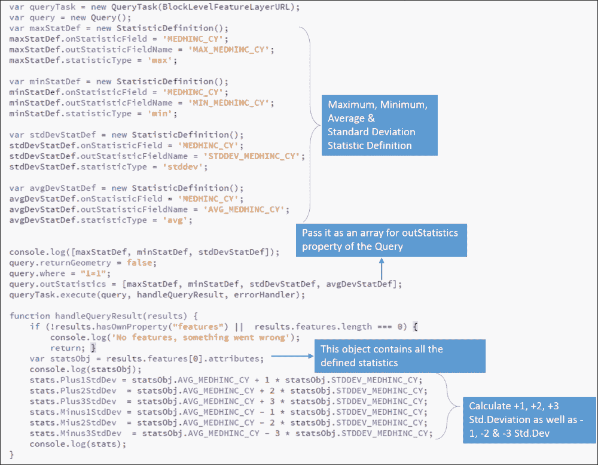
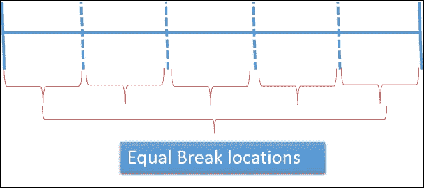
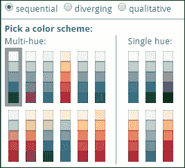
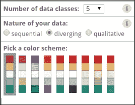
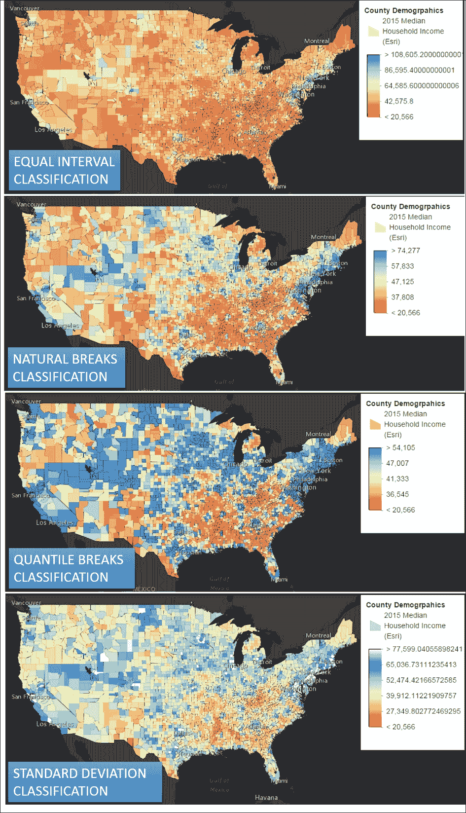
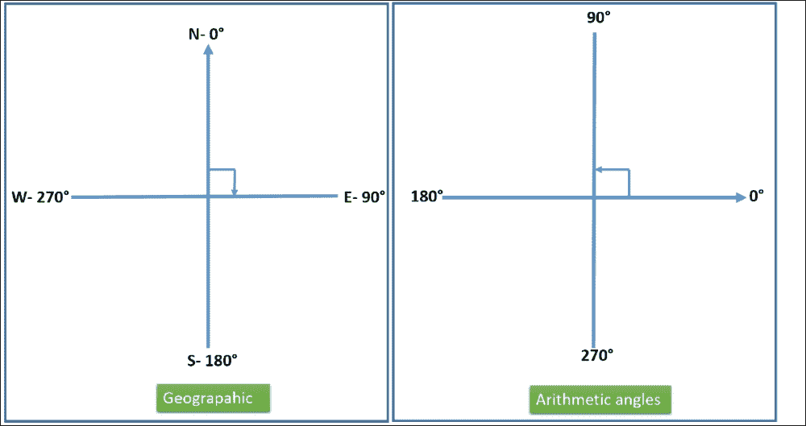
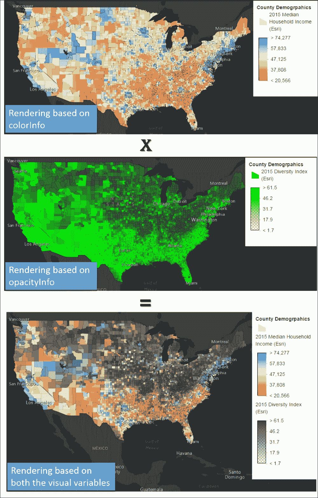

# 第七章：地图分析和可视化技术

对地图数据进行分析将揭示许多空间模式，否则这些模式将保持隐藏。 API 提供了许多方法来使用数据上的高级统计查询来获取这些信息。结合 API 提供的直观数据可视化方法，您将更接近成为地图数据科学家。在本章中，我们将首先尝试了解一些基本的统计概念，然后通过在 API 提供的分析和渲染模块的帮助下在代码中实际应用这些概念。具体来说，我们将涵盖以下主题：

+   介绍我们将要开发的人口统计分析门户

+   基本统计量介绍

+   API 提供的模块来计算要素统计信息

+   分类方法的简要介绍

+   使用代码支持的解释来开发具有视觉变量的渲染器

+   执行多变量映射

+   使用智能映射执行自动映射

# 构建人口统计分析门户

我们将构建一个人口统计分析门户，以展示 API 的高级分析功能。人口统计是指根据各种社会经济因素对居住在某一地区的人口进行分类，例如年龄、教育程度、国籍、家庭收入中位数、种族、性别等。人口统计数据主要基于人口普查数据和其他可靠来源。

人口统计数据可用于执行各种分析，并且对政府做出政策决策和企业做出营销决策同样有用。人口统计数据的力量在于执行适当的分析，以便我们可以提取有关居住在某一地区的人口与周围人口的有用信息。让我们考虑这个网址，它提供了关于街区层面的家庭收入中位数的详细统计数据 - [`demographics5.arcgis.com/arcgis/rest/services/USA_Demographics_and_Boundaries_2015/MapServer`](http://demographics5.arcgis.com/arcgis/rest/services/USA_Demographics_and_Boundaries_2015/MapServer)。

该地图服务显示了 2015 年美国最新的人口统计数据。在提供的数百个人口统计参数中，我们对 2015 年美国家庭收入中位数感兴趣。收入金额以当前美元表示，包括通货膨胀或生活成本增加的调整。中位数是将家庭收入分布为两个相等部分的值。有关此地图的更多信息，包括使用条款，请访问此网址：[`doc.arcgis.com/en/living-atlas/item/?itemId=6db428407492470b8db45edaa0de44c1&subType=demographics`](http://doc.arcgis.com/en/living-atlas/item/?itemId=6db428407492470b8db45edaa0de44c1&subType=demographics)

这些数据是 Esri 的 Living Atlas 项目的一部分。要使用这些数据，您将需要 ArcGIS Online 组织订阅或 ArcGIS 开发人员帐户。要访问此项目，您需要执行以下操作之一：

+   使用组织订阅的成员帐户登录

+   使用开发人员帐户登录

+   如果您没有帐户，可以在此链接[https://developers.arcgis.com/en/sign-up/]注册 ArcGIS 的免费试用版或免费的 ArcGIS 开发人员帐户

# 基本统计量

让我们讨论一些基本统计数据，以便我们可以充分利用 API 提供的统计功能。在进一步进行之前，我们可能需要清楚地了解五个基本统计参数：

+   最小值

+   最大值

+   平均值

+   标准差

+   标准化

## 最小值

顾名思义，这意味着数据集中的最小值。在我们的案例中，对于街区级别的家庭收入，`最小`统计数据表示具有最低家庭收入中位数的街区。

## 最大值

与`最小`类似，`最大`统计量定义了所有考虑的街区中的最大家庭收入中位数值。

## 总和

`Sum`是一个简单而有效的统计量，它给出了所有考虑的数据的总值。

## 平均值

`Average`统计定义了所有值的算术平均值。平均值是通过将`Sum`统计量除以用于计算的数据值的计数来推导的。

```js
Average = Sum / Count
```

## 标准差

标准差可能是从任何给定数据中推导出的最重要的统计量。标准差是数据的分散程度或数据偏离平均值或平均值的度量。当我们知道标准差时，通常可以观察到：

+   68%的数值在平均值加减一个标准差的范围内

+   95%的数值在平均值加减两倍标准差的范围内

+   99.7%的数值在平均值加减三倍标准差的范围内

这是基于大多数数据遵循正态分布曲线的事实。当我们对数据进行排序并绘制数值时，直方图看起来像钟形曲线。

## 标准化

了解标准差和平均值的概念后，我们可以对数据进行标准化。这个过程被称为**标准化**，从这个过程中得到的统计量被称为**标准分数**（`z-score`）。当我们有大量值的数据集时，标准化是总结数据和量化数据的有效方法。

因此，要将任何值转换为标准分数（`z-score`），我们需要首先从平均值中减去该值，然后除以标准差。

```js
z-score = (Value – Mean)/Standard_Deviation
```

# API 提供的统计功能

让我们调查 API 在这些基本统计量方面提供了什么。稍后我们将在我们的应用程序中使用这些统计量，以更好地了解数据。我们还将在我们的可视化技术中使用这些技术。

## StatisticDefinition 模块

API 提供了一个名为`StatisticalDefinition`的模块，可以与查询任务和查询模块一起使用，提取我们刚刚讨论的基本统计量。

模块名称：`esri/tasks/StatisticDefinition`

以下是用于定义统计定义对象的属性：

+   `onStatisticField`：用于定义将计算统计量的字段

+   `outStatisticFieldName`：输出字段的名称

+   `statisticType`：用于定义统计类型。接受的统计类型包括：

+   `min`：获取最小统计量

+   `max`：获取最大统计量

+   `sum`：获取总和统计量

+   `avg`：推导平均值统计量

+   `stddev`：推导标准差统计量

让我们尝试在本章开头提供的人口统计图层 URL 上使用这些并推导这些统计量。

以下截图显示了一个代码片段，并解释了如何为人口统计地图服务中的县级图层推导这些统计量：



可以使用这个简单的代码片段提取所需的统计数据。

代码执行后，控制台屏幕应该如下所示：

```js
**Object {MAX_MEDHINC_CY: 113282, MIN_MEDHINC_CY: 18549, STDDEV_MEDHINC_CY: 10960.43202775655, AVG_MEDHINC_CY: 42115.877187400576}**
**Object {Plus1StdDev: 53076.309215157125, Plus2StdDev: 64036.741242913675, Plus3StdDev: 74997.17327067023, Minus1StdDev: 31155.445159644027, Mius2StdDev: 20195.013131887477…}**

```

稍后将使用推导的统计量，如`Plus1StdDev`、`Plus2StdDev`、`Plus3StdDev`、`Minus1StdDev`、`Minus2StdDev`和`Minus3StdDev`来更好地呈现数据。

## 分类方法

当我们有大量数据时，我们使用渲染方法对其进行分类。我们需要确定一个适当的分类方法来创建类别间断点。API 支持以下分类方法：

+   等间隔

+   自然断点

+   分位数

+   标准差

让我们简要讨论使用每种分类方法的影响。

### 等间隔

这种分类方法将数据分成相等的部分。我们需要知道数据范围以使用这种分类方法。当数据分散且分布良好时，应使用此方法。



### 自然断点

自然断点是基于 Jenks 断点算法的分类方法。基本上，该算法在数据更加聚集的位置创建更多的断点。这是通过寻求最小化每个类的平均偏差来实现的，同时最大化每个类与其他组的平均值的偏差。换句话说，该方法旨在减少类内的方差，并最大化类间的方差。


### 分位数

这种方法对数据进行分类，使每个组中的数据点数量相等。

### 标准差

如前所述，标准差是数据偏离平均值的度量。使用这种分类方法，我们可以找出数据偏离平均值超出三个标准差的程度（异常值的情况），在两个和三个标准差之间的数据（较高和较低的值），以及距离平均值一个标准差内的数据。


## 归一化概念

对数据值进行归一化对于计算许多事情都很有用。考虑以下情景：

+   **Case 1**：我们需要符号化每个州的人口密度。基于人口字段的符号化会给出错误的度量或传达错误的信息。我们可能只需要将每个州的人口除以其地理面积，以得到人口密度的度量。

同样，如果我们需要传达年轻人口（年龄<35 岁）占总人口的百分比，我们需要将拥有年轻人口的字段除以显示总人口的字段。

+   **Case 2**：当尝试符号化整个世界的收入分布时，我们可能会遇到大范围的值。如果我们使用颜色或不透明度渲染器，一些国家将位于光谱的较高端，而一些国家将位于底部，中间有许多国家，但实际上并没有使用太多的颜色信息。在这种情况下，使用对数刻度来显示收入分布将更有用。

+   **Case 3**：当我们需要计算值作为总数的百分比时，例如犯罪数据或每个州参加马拉松比赛的参与者人数，我们需要将该值除以总数。

许多渲染器都有`normalizationField`和`normalizationType`属性来实现这种归一化。

`normalizationField`让我们定义用于归一化的字段。例如，对于*Case 1*，`Area`字段和`Total Population`字段是`normalizationField`。

`normalizationType`是需要对值执行的归一化类型。`normalizationType`的三个可能值是 field、log 和 percent-of-total。例如，对于*Case 1*，我们需要使用`normalizationType`作为`field`。对于*Case 2*，我们需要使用`log`，对于*Case 3*，我们需要使用`percent-of-total`作为`normalizationType`。

## 要素图层统计

在 API 的 3.13 版本中，引入了这个插件，可以方便地计算要素图层的统计信息。使用要素图层统计插件，我们可以计算以下统计信息：

+   要素图层上的基本统计信息

+   类别断点统计

+   字段中的唯一值

+   查看图层的建议比例范围

+   获取样本要素

+   计算直方图

可以使用以下代码片段将插件添加到要素图层中：

```js
var featureLayerStats = new FeatureLayerStatistics({
          layer: CountyDemogrpahicsLayer
        });
```

在前面的代码片段中，`CountyDemogrpahicsLayer`是要添加`FeatureLayerStatistics`插件的要素图层的名称。

插件中使用的方法所期望的通常参数是`field`和`classificationMethod`。`field`插件是指根据其计算统计数据的属性字段的名称。`classificationMethod`是指根据先前讨论的分类方法之一，计算统计数据的方法：

```js
var featureLayerStatsParams = {
          field: "MEDHINC_CY",
          classificationMethod : 'natural-breaks'
        };
```

插件上的方法总是返回一个 promise。以下代码片段计算了在`featureLayerStatsParams`中定义的字段上的基本统计值：

```js
featureLayerStats.getFieldStatistics(featureLayerStatsParams).then(function (result) {
          console.log("Successfully calculated %s for field %s, %o", "field statistics", featureLayerStatsParams.field, result);
        }).otherwise(function (error) {
          console.log("An error occurred while calculating %s, Error: %o", "field statistics", error);
        });
```

结果在浏览器控制台中如下所示：

```js
**Successfully calculated field statistics for field MEDHINC_CY,**
**Object {  **
 **source:"service-query",**
 **min:20566,**
 **max:130615,**
 **avg:46193.26694241171,**
 **stddev:12564.308382029049,**
 **count:3143,**
 **sum:145185438,**
 **variance:157861845.1187254**
 **}**

```

之前的结果提供了与我们之前使用的统计定义模块得到的相同或更多的信息。

以下代码片段计算了在`featureLayerStatsParams`中定义的字段上的类别分隔值：

```js
featureLayerStats.getClassBreaks(featureLayerStatsParams).then(function (result) {
          console.log("Successfully calculated %s for field %s, %o", "class breaks", featureLayerStatsParams["field"], JSON.stringify(result));
        }).otherwise(function (error) {
          console.log("An error occurred while calculating %s, Error: %o", "class breaks", error);
        });
```

美化后的结果如下：

```js
**{**
 **"minValue": 20566,**
 **"maxValue": 130615,**
 **"classBreakInfos": [**
 **{**
 **"minValue": 20566,**
 **"maxValue": 27349.802772469,**
 **"label": " < -1.5 Std. Dev.",**
 **"minStdDev": null,**
 **"maxStdDev": -1.5**
 **},**
 **{**
 **"minValue": 27349.802772469,**
 **"maxValue": 39912.112219098,**
 **"label": "-1.5 - -0.50 Std. Dev.",**
 **"minStdDev": -1.5,**
 **"maxStdDev": -0.5**
 **},**
 **{**
 **"minValue": 39912.112219098,**
 **"maxValue": 52474.421665726,**
 **"label": "-0.50 - 0.50 Std. Dev.",**
 **"minStdDev": -0.5,**
 **"maxStdDev": 0.5,**
 **"hasAvg": true**
 **},**
 **{**
 **"minValue": 52474.421665726,**
 **"maxValue": 65036.731112354,**
 **"label": "0.50 - 1.5 Std. Dev.",**
 **"minStdDev": 0.5,**
 **"maxStdDev": 1.5**
 **},**
 **{**
 **"minValue": 65036.731112354,**
 **"maxValue": 77599.040558982,**
 **"label": "1.5 - 2.5 Std. Dev.",**
 **"minStdDev": 1.5,**
 **"maxStdDev": 2.5**
 **},**
 **{**
 **"minValue": 77599.040558982,**
 **"maxValue": 130615,**
 **"label": " > 2.5 Std. Dev.",**
 **"minStdDev": 2.5,**
 **"maxStdDev": null**
 **}**
 **],**
 **"source": "service-generate-renderer"**
**}**

```

# 使用连续和分级渲染器

连续渲染器是指在连续数值范围上对要素进行符号化的渲染器，与唯一值渲染器不同。我们需要为这些渲染器定义几个`stops`或`breakpoints`。这些`stops`定义了一个类，渲染器会检查每个值属于哪个类。根据类别，数据会通过可视化变量（如颜色、大小、透明度甚至旋转）进行可视化。

利用可用的统计数据，我们可以使用 API 提供的`ClassBreaksRenderer`轻松创建分级和连续渲染器。`ClassBreaksRenderer`根据某些数值属性的值对每个图形进行符号化。

模块名称：`esri/renderers/ClassBreaksRenderer`

通过使用属性如`colorInfo`、`opacityInfo`和`sizeInfo`，可以在此模块上设置颜色、大小或透明度。`ClassBreaksRenderer`上提供了以下方法：

+   `setColorInfo`(`colorInfo`): 设置`colorInfo`属性

+   `setOpacityInfo`(`opacityInfo`): 根据 info 参数设置渲染器的透明度信息

+   `setRotationInfo`(`rotationInfo`): 修改渲染器的旋转信息

+   `setSizeInfo`(`sizeInfo`): 设置渲染器的大小信息，以根据数据值修改符号大小

让我们更详细地讨论这些。以下图表提供了一个开发渲染器的简要指南：


## ColorInfo

`ColorInfo`是一个用于定义图层颜色渐变的对象。我们只需要在`stops`处提供离散的颜色值，有时也可以在渐变中只提供颜色值：

一个简单的`ColorInfo`对象示例如下：

```js
renderer.setColorInfo({
  field: "MEDHINC_CY",
  minDataValue: featureLayerStats.min,
  maxDataValue: featureLayerStats.max,
  colors: [
    new Color([255, 255, 255]),
    new Color([127, 127, 0])
  ]
});
```

要创建一个分级颜色渲染器，我们需要定义一个`stops`对象来定义离散颜色，而不是连续颜色。一个`stops`对象将包含每个`stop`处的颜色。在定义`stops`时，我们*不*需要定义`minDataValue`或`maxDataValue`。让我们讨论一下在哪里可以获得适合我们渲染器的合适颜色方案。

### 选择颜色方案

以下网站为我们提供了一种简单的选择颜色方案的方法，可用于构建`colorInfo`对象或颜色渐变：[`colorbrewer2.org/`](http://colorbrewer2.org/)

在这个网站上，你可以做以下事情：

1.  选择数据类别的数量，默认值为`3`。API 的默认类别数为`5`。因此将下拉值更改为`5`类别。

1.  选择您数据的性质：

+   **sequential**: 用于显示递增的数量，如人口或人口密度。

+   **diverging**: 用于强调值的差异，特别是在极端端点。例如，当映射收入中位数时，收入范围的较低端可能显示为红色，较高端显示为蓝色。

+   **定性**：当我们需要使用不同颜色区分不同值或类时，使用此颜色方案。

1.  选择多色调或单色调颜色方案。

1.  基于以下约束条件限制颜色色调：

+   目的：

+   色盲友好

+   打印友好

+   复印机安全

+   背景：

+   道路

+   城市

+   边界

1.  将颜色方案导出为：

+   JavaScript 数组对象——这是最方便的函数

+   Adobe PDF


### 创建一个分级颜色渲染器

如前所述，要创建一个分级颜色渲染器，我们需要定义一个`stops`对象来定义离散颜色，而不是连续颜色。`stops`对象将包含每个停止点的颜色。`stops`对象是分配给渲染器对象的数组对象。`stops`数组对象包含具有以下属性的对象：

+   `value`

+   `color`

+   `label`

`stops`对象大多看起来像这样：

```js
**var stops =**
**[**
 **{**
 **"value": 27349.802772469,**
 **"color": {      "b": 226,      "g": 235,       "r": 254,      "a": 1    },**
 **"label": " < -1.5 Std. Dev."**
 **},**
 **{**
 **"value": 39912.112219098,**
 **"color": {      "b": 185,      "g": 180,      "r": 251,      "a": 1    },**
 **"label": "-1.5 - -0.50 Std. Dev."**
 **},**
 **{**
 **"value": 52474.421665726,**
 **"color": {      "b": 161,      "g": 104,      "r": 247,      "a": 1    },**
 **"label": "-0.50 - 0.50 Std. Dev."**
 **},**
 **{**
 **"value": 65036.731112354,**
 **"color": {      "b": 138,      "g": 27,      "r": 197,      "a": 1    },**
 **"label": "0.50 - 1.5 Std. Dev."**
 **},**
 **{**
 **"value": 77599.040558982,**
 **"color": {      "b": 119,      "g": 1,      "r": 122,      "a": 1    },**
 **"label": "1.5 - 2.5 Std. Dev."**
 **}**
**]**

```

现在让我们找到一种自动填充`stops`对象的方法。记住，我们可以从`colorbrewer2.org`网站上选择的颜色方案中获取颜色数组。`color`数组可以用来填充`stops`对象中每个对象的`color`属性。`stops`对象中每个对象的`value`属性可以从`featureLayerStatistics`计算的返回对象中派生出来。`featureLayerStatistics`计算为每个类提供`最小值`、`最大值`和`标签`值。我们可以将每个类的最大值分配给`stops`对象中每个对象的`value`属性：

```js
**//Create a params object for use getClassBreaks method in** 
**// FeatureLayerStatistics module**
**//Define the field upon which Stats is computed,**
**//The classification method which should be one among the following:**
**//standard-deviation, equal-interval, natural-breaks, quantile**
**//Number of classes the data should be classified. Default is 5**
var featureLayerStatsParams_color = {
          field: "MEDHINC_CY",
          classificationMethod: selectedClassificationMethod, 
          numClasses: 5
        };

**//Compute the Class Break Statitics. This returns a promise**

var color_stats_promise = featureLayerStats.getClassBreaks(featureLayerStatsParams_color);
color_stats_promise.then(function (color_stat_result) {

**//The classBreakInfos property of the color_stat_result has all the** 
**//class break values** 

var colorStops = [];

**//Color JavaScript array exported from colorbrewer2.org**
var colors = ['#feebe2', '#fbb4b9', '#f768a1', '#c51b8a', '#7a0177']; 

**//Loop through each Break info provided by the Feature Layer Stats**
              array.forEach(color_stat_result.classBreakInfos, function (classBreakInfo, i) {
                        colorStops.push({
**//Get value property from the Break value's maximum value**
                            value: classBreakInfo.maxValue,
**//Get color from the color Array**
                            color: new Color(colors[i]),
**//Get label value from the label value provided by the Feature Layer //Stats**
                            label: classBreakInfo.label
                        });
                    });

**//Define Default renderer symbol**
var symbol = new SimpleFillSymbol();
symbol.setColor(new Color([255, 0, 0]));
symbol.setOutline(new SimpleLineSymbol(SimpleLineSymbol.STYLE_SOLID, new Color([0, 0, 0]), 0.5));

var colorBreakRenderer = new ClassBreaksRenderer(symbol);

**//Set the color stops to the stops property to setColorInfo method of //the renderer**
colorBreakRenderer.setColorInfo({
              field:"MEDHINC_CY",
              stops: colorStops
          });
});
```



## opacityInfo

`opacityInfo`是一个定义特征不透明度如何计算的对象。`opacityInfo`对象可用于为`ClassBreaksRenderer`中的类设置不透明度级别。`opacityInfo`对象也可用于设置连续不透明度渲染器。

与`colorInfo`对象类似，您可以指定不透明度值作为数组，以及最小和最大数据值，或者您可以定义`stops`对象，在其中可以定义不透明度值。

使用`opacityInfo`创建一个连续渲染器：

```js
var minOpacity = 0.2;
var maxOpacity = 1;

var opacityInfo = {
  field: "DIVINDX_CY",
  minDataValue:  0,
  maxDataValue:  100,
  opacityValues:   [minOpacity, maxOpacity]
};
```

### 使用 opacityInfo 创建一个类别不透明度渲染器

让我们使用`opacityInfo`来渲染另一个字段，表示每个县的多样性指数。多样性指数在从`0`到`100`的范围内测量多样性。多样性指数是 Esri 专有的指数，定义为从同一地区随机选择的两个人属于不同种族或民族群体的可能性。多样性指数仅测量区域的多样性程度，而不是其种族构成。

我们的目标是以更高的不透明度值显示多样性指数较高的县，以及以较低的不透明度值显示多样性指数较低的县。可以使用以下代码段将不透明度值在最小值和最大值之间分割：

```js
var opacity = minOpacity + i * maxOpacity / (opacity_stat_result.classBreakInfos.length - 1);
```

在上一段代码中，`opacity_stat_result`是`FeatureLayerSatistics`模块的`getClassBreaks()`方法的承诺结果：

```js
var featureLayerStatsParams_opacity = {
  field: "DIVINDX_CY",
  classificationMethod: selectedClassificationMethod, //standard-deviation, equal-interval, natural-breaks, quantile and standard-deviation
  numClasses: 5
};

var opacity_stats_promise = featureLayerStats.getClassBreaks(featureLayerStatsParams_opacity);
opacity_stats_promise.then(function (opacity_stat_result) {

  var opacityStops = [];
  array.forEach(opacity_stat_result.classBreakInfos, function (classBreakInfo, i) {
    var minOpacity = 0;
    var maxOpacity = 1;
//Calculate opacity by dividing between 
    var opacity = minOpacity + i * maxOpacity / (opacity_stat_result.classBreakInfos.length - 1);
    opacityStops.push({
      value: classBreakInfo.maxValue,
      opacity: opacity
    });
  });

var symbol = new SimpleFillSymbol();
symbol.setColor(new Color([255, 0, 0]));
var opacityBreakRenderer = new ClassBreaksRenderer(symbol);
opacityBreakRenderer.setOpacityInfo({
   field:"MEDHINC_CY",
   stops: stops
});

CountyDemogrpahicsLayer.setRenderer(opacityBreakRenderer);
CountyDemogrpahicsLayer.redraw();
```


## SizeInfo

`SizeInfo`对象定义了特征大小与数据值成比例的符号大小。

API 帮助页面提到符号大小可以代表两种不同类型的数据——距离和非距离。距离数据类型指的是字段上的实际距离，非距离数据类型指的是符号的地图大小。使用`sizeInfo`根据树冠的实际直径表示树冠是距离数据类型的一个例子。根据交通密度表示道路大小，或者根据人口密度或中位收入表示州的大小，可以增强要素的地图呈现。

## RotationInfo

`RotationInfo`可用于定义标记符号的旋转方式。`RotationInfo`可用于表示风向、车辆方向等。必须存在指定旋转角度的字段来定义`RotationInfo`。允许使用两种旋转角度单位。

+   **地理**：这表示从地理北方顺时针方向的角度。风速和汽车方向通常用地理角度表示。

+   **算术**：这表示逆时针方向测量的角度。

以下图显示了地理和算术角度之间的差异：



## 多变量映射

到目前为止，我们一直在讨论使用单个字段名称或变量来渲染要素的功能。我们还讨论了可以用来渲染要素的各种视觉变量，如颜色、不透明度、大小、旋转等。如果我们能够结合这些视觉变量，并根据多个字段值来渲染要素呢？

例如，在县级别进行映射时，我们可以考虑使用颜色来表示人口密度，使用不透明度来表示家庭收入中位数，并使用大小来表示联邦教育支出占人口字段的百分比。我们选择使用的字段数量限于四个视觉变量，即：颜色、不透明度、大小和旋转。

多变量映射是由`ClassBreaksRenderer`中的`visualVariables`属性启用的。让我们尝试使用两个视觉变量，即`colorInfo`和`opacityInfo`，我们用它们来演示两个不同的人口统计参数，即家庭收入中位数和多样性指数。我们当前的目标是使用颜色来表示家庭收入中位数，并同时根据多样性指数确定要素的不透明度值：

```js
function applySelectedRenderer(selectedClassificationMethod) {
        var featureLayerStatsParams_color = {
          field: "MEDHINC_CY",
          classificationMethod: selectedClassificationMethod, //standard-deviation, equal-interval, natural-breaks, quantile and standard-deviation
          numClasses: 5
        };
        var featureLayerStatsParams_opacity = {
          field: "DIVINDX_CY",
          classificationMethod: selectedClassificationMethod, //standard-deviation, equal-interval, natural-breaks, quantile and standard-deviation
          numClasses: 5,
          //normalizationField: 'TOTPOP_CY'
        };

        var color_stats_promise = featureLayerStats.getClassBreaks(featureLayerStatsParams_color);
        var opacity_stats_promise = featureLayerStats.getClassBreaks(featureLayerStatsParams_opacity);
        all([color_stats_promise, opacity_stats_promise]).then(function (results) {
          var color_stat_result = results[0];
          var opacity_stat_result = results[1];

          var colorStops = [];
          var colors = ['#d7191c', '#fdae61', '#ffffbf', '#abd9e9', '#2c7bb6'];
          array.forEach(color_stat_result.classBreakInfos, function (classBreakInfo, i) {
            colorStops.push({
              value: classBreakInfo.maxValue,
              color: new Color(colors[i]),
              label: classBreakInfo.label
            });
          });
          var opacityStops = [];
          array.forEach(opacity_stat_result.classBreakInfos, function (classBreakInfo, i) {
            var minOpacity = 0;
            var maxOpacity = 1;
            var opacity = minOpacity + i * maxOpacity / (opacity_stat_result.classBreakInfos.length - 1);
            opacityStops.push({
              value: classBreakInfo.maxValue,
              opacity: opacity
            });
          });

          var visualVariables = [
            {
              "type": "colorInfo",
              "field": "MEDHINC_CY",
              "stops": colorStops
                            }

            ,
            {
              "type": "opacityInfo",
              "field": "DIVINDX_CY",
              "stops": opacityStops
                        }

                        ];
          console.log(JSON.stringify(visualVariables));
          var symbol = new SimpleFillSymbol();
          symbol.setColor(new Color([0, 255, 0]));
          symbol.setOutline(new SimpleLineSymbol(SimpleLineSymbol.STYLE_SOLID, new Color([0, 0, 0]), 0.5));

          var colorBreakRenderer = new ClassBreaksRenderer(symbol);
          colorBreakRenderer.setVisualVariables(visualVariables);
          CountyDemogrpahicsLayer.setRenderer(colorBreakRenderer);
          CountyDemogrpahicsLayer.redraw();
          legend.refresh();
        });
      }
```



# 智能映射

有了所有这些统计数据的知识，现在是时候使用 API 提供的智能映射模块进行智能映射了。想象一下，一个模块可以根据一些基本输入自动调用渲染器参数，例如需要生成渲染器的要素图层和分类方法。

模块名称：`esri/renderers/smartMapping`

智能映射模块提供了几种方法，每种方法都会生成一个渲染器。智能映射模块可以生成的渲染器包括：

+   基于颜色的分类渲染器

+   基于大小的分类渲染器

+   基于类型的渲染器

+   热力图渲染器

智能映射甚至可以根据底图进行渲染。例如，某些颜色或不透明度渲染器在较暗的底图（如卫星图）上效果良好，而某些渲染器在较亮的底图（如街道地图）上效果良好。

通过三个简单的步骤，您可以让 API 决定颜色方案，并为您创建类颜色渲染器：

+   从 Esri 样式`choropleth`模块（导入`esri/styles/choropleth`）构建一个方案对象

+   使用以下属性构建一个分类颜色参数对象：

+   `basemap`

+   `classificationMethod`

+   `layer`

+   `field`

+   `scheme`——从之前构建的方案对象中选择`primaryScheme`属性

+   `numClasses`

+   将一个分类颜色参数对象分配为智能映射模块的`createClassedColorRenderer()`方法的参数

+   将智能映射方法返回的渲染器属性分配给要素图层的`setRenderer()`方法作为参数

+   重绘要素图层并刷新图例对象

以下代码解释了如何使用智能映射创建一个分类颜色渲染器：

```js
**//Call this function with the classification method as input**
function applySmartRenderer(selectedClassificationMethod) {

**//Create a scheme object assigning a theme** 
var schemes = esriStylesChoropleth.getSchemes({
 **//The following options are available for theme:** 
 **// high-to-low, above-and-below, centered-on, or extremes.**
  theme: "high-to-low",
  basemap: map.getBasemap(),
  geometryType: "polygon"
});
console.log(JSON.stringify(schemes));

**//Create a classed color Render Parameter object**
var classedColorRenderParams = {
  basemap: map.getBasemap(),
  classificationMethod: selectedClassificationMethod,
  field: 'MEDHINC_CY',
  layer: CountyDemogrpahicsLayer,
  scheme: schemes.primaryScheme,
  numClasses: 5
};

SmartMapping.createClassedColorRenderer(classedColorRenderParams).then(function (result) {
  CountyDemogrpahicsLayer.setRenderer(result.renderer);
 **//Redraw the feature layer**
  CountyDemogrpahicsLayer.redraw();
 **//Update the legend**
  legend.refresh();
}).otherwise(function (error) {
  console.log("An error occurred while performing%s, Error: %o", "Smart Mapping", error);
});
```

以下屏幕截图显示了使用智能制图模块创建的分级颜色渲染器，分别为等间隔、自然断点、分位数和标准偏差四种不同的分类。用户可以自行决定根据地图数据的目的和受众群体，选择最适合的分类方法。

我们可以通过编辑`scheme`对象来手动定义颜色方案，该对象是`createClassedColorRenderer()`方法的参数对象中的一个属性。

智能制图

# 总结

我们离成为地图数据科学家又近了一步。在本章中，我们涵盖了很多内容，从简要统计概念的复习开始。然后我们看到了代码如何运行，统计定义和要素图层统计模块如何给我们提供宝贵的统计量，可以用来有意义地渲染地图数据。然后我们评估了如何有效地使用视觉变量，如`colorInfo`、`opacityInfo`、`rotationInfo`和`sizeInfo`在渲染器中。我们还尝试结合这些视觉变量进行多变量渲染。最后，我们尝试使用智能制图模块进行自动渲染。在下一章中，我们将讨论图表和其他高级可视化技术，为用户提供分析信息。
