# 第八章.高级地图可视化和图表库

在地图上渲染可能不是可视化空间数据的唯一方式。为了让数据有所侧重，我们可能需要借助于非空间分析和图表功能，这些功能由 dojo 和其他流行的库提供，以补充地图的空间可视化功能。在本章中，我们将通过图表库和其他可视化方法（如数据聚类）扩展我们在上一章开始构建的人口统计分析门户网站。本章涉及以下主要主题：

+   使用 dojo 进行图表绘制

+   使用 D3 库进行图表绘制

+   使用 Cedar 进行图表绘制

# 使用 dojo 进行图表绘制

ArcGIS API 与 dojo 的图表绘制非常好地集成在一起。图表功能由 dojo 的实验模块提供，因此称为`dojox`，其中的`x`指的是模块的实验性质。然而，这些模块足够稳定，可以集成到任何生产环境中。以下模块被认为是使用 dojo 开发图表功能的最基本模块：

+   `dojox/charting`

+   `dojox/charting/themes/<themeName>`

+   `dojox/charting/Chart2D`

+   `dojox/charting/plot2d/Pie`

## Dojo 图表主题

`dojox`图表库提供了许多主题，必须在`dojox`提供的主题列表中选择一个主题名称。可以在以下网址找到`dojox`提供的所有主题列表：[`archive.dojotoolkit.org/nightly/dojotoolkit/dojox/charting/tests/theme_preview.html`](http://archive.dojotoolkit.org/nightly/dojotoolkit/dojox/charting/tests/theme_preview.html)

dojox 图表库提供的主题如下：

| JulieThreeDChrisTomClaroPrimaryColorsElectricChargedRenkooAdobebricksAlgaeBahamationBlueDusk | DesertDistinctiveDollarGrasshopperGrasslandsGreySkiesHarmonyIndigoNationIrelandMiamiNiceMidwestMintyPurpleRain | CubanShirtsRoyalPurplesSageToLimeShroomsTufteWatersEdgeWetlandPlotKit.bluePlotKit.cyanPlotKit.greenPlotKit.orangePlotKit.purplePlotKit.red |
| --- | --- | --- |

测试这些不同图表主题的理想位置是在[`archive.dojotoolkit.org/nightly/dojotoolkit/dojox/charting/tests/test_themes.html?Julie`](http://archive.dojotoolkit.org/nightly/dojotoolkit/dojox/charting/tests/test_themes.html?Julie)。

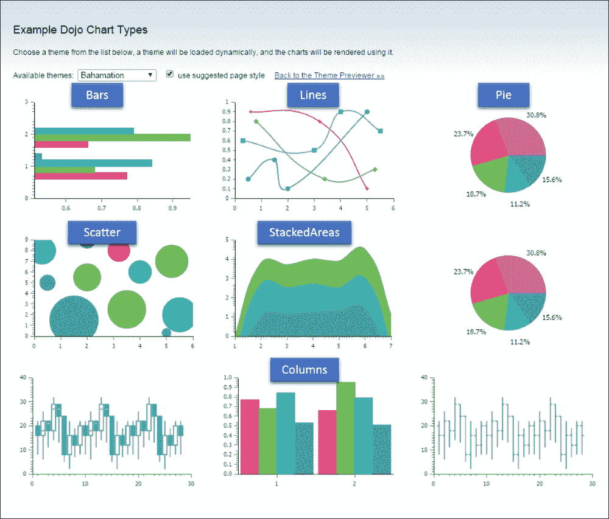

## 使用弹出模板进行图表绘制

基本的图表功能可以使用`popup`模板的`mediaInfos`属性在要素图层的弹出窗口中显示。我们将使用上一章中使用的县级人口统计要素图层来创建此图表。我们对以下字段感兴趣：

| 字段 | 描述 |
| --- | --- |
| `NAME` | 县的名称 |
| `STATE_NAME` | 州的名称 |
| `TOTPOP_CY` | 县的总人口数量 |
| `MEDHINC_CY` | 县的家庭收入中位数 |
| `DIVINDX_CY` | 计算的县的多样性指数 |
| `WHITE_CY` | 白人男性和女性的数量 |
| `BLACK_CY` | 黑人男性和女性的数量 |
| `AMERIND_CY` | 美洲印第安人（男性和女性）的数量 |
| `ASIAN_CY` | 亚洲人（男性和女性）的数量 |
| `PACIFIC_CY` | 太平洋岛民（男性和女性）的数量 |
| `OTHRACE_CY` | 其他种族（男性和女性）的数量 |

创建`mediaInfos`对象涉及构建`fieldInfos`对象，如果需要更改字段名称或在图表中为它们指定别名。`mediaInfos`对象接受一个`theme`属性。提到一个 dojo 图表主题名称或您创建的自定义主题：

```js
var template = new PopupTemplate({
  title: "USA Demograpahics",
  description: "Median household income at {NAME}, {STATE_NAME} is ${MEDHINC_CY}",
 **//define field infos so we can specify an alias in the chart**
  fieldInfos: [
    { 
      fieldName: "WHITE_CY",
      label: "White Americans"
    },
    { 
      fieldName: "BLACK_CY",
      label: "Blacks"
    },
    { 
      fieldName: "AMERIND_CY",
      label: "American Indians"
    },
    {   fieldName: "ASIAN_CY",
      label: "Asians"
    },
    { 
      fieldName: "PACIFIC_CY",
      label: "Pacific Islanders"
    },
    { 
      fieldName: "OTHRACE_CY",
      label: "Other Race Count"
    }
    ],
  mediaInfos: [{ //define the bar chart
    caption: "",
    type: "piechart", // image, piechart, barchart,columnchart,linechart
    value: 
    {
      theme: "Dollar",
      fields: ["WHITE_CY", "BLACK_CY", "AMERIND_CY", "ASIAN_CY", "PACIFIC_CY", "OTHRACE_CY"]
    }
    }]
});
```

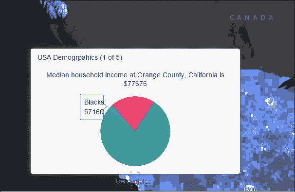

# dojox 模块提供的 2D 图表类型

我们已经看到了饼图的效果。让我们讨论一些`dojox`模块提供的更多图表类型以及一些更受欢迎的图表类型的实用性。注意柱状图和柱形图之间的差异，以及散点图和仅标记的图之间的差异。

| 图表类型 | 描述 |
| --- | --- |
| 区域 | 数据线下的区域将被填充 |
| 条形 | 指代水平条 |
| 分组条 | 具有分组数据集的水平条 |
| 分组列 | 具有分组数据集的垂直条 |
| 列 | 指代具有垂直条的图表 |
| 网格 | 用于向图表添加网格层 |
| 线条 | 基本线图 |
| 标记 | 具有标记的线图 |
| 仅标记 | 仅显示数据点 |
| 饼图 | 通过在圆形直径上表示数据来表示数据的分布 |
| 散点图 | 用于绘制数据 |
| 堆叠 | 数据集相对于先前数据集的图表 |
| 堆叠区域 | 堆叠数据集，填充图表线下的区域 |
| 堆叠条 | 具有水平条的堆叠数据集 |
| 堆叠列 | 堆叠具有垂直条的数据集 |
| 堆叠线 | 使用线堆叠数据集 |

## 道场图表方法

图表模块有四个重要的方法，将帮助我们创建图表。它们是：

+   `addPlot()`：定义图表的类型和定义图表的其他辅助属性。

+   `setTheme()`：让我们为图表设置道场主题。主题也可以自定义。

+   `addSeries()`：定义图表使用的数据。

+   `render()`：渲染图表。

### 定义您的情节

使用`addPlot()`方法可以定义您的情节。情节接受名称和参数数组：

```js
var chart1 = new Chart2D(chartDomNode);
chart1.addPlot("default", plotArguments);
```

让我们看看`plotArguments`对象包括什么。`plotArguments`的属性根据我们选择使用的图表类型而变化。如果我们选择使用线条、区域或数据点来定义数据的图表类型，则应将线条、区域或标记等属性设置为布尔值。线条选项确定是否使用线条连接数据点。如果选择区域类型，则将填充数据线下的区域。标记选项将确定是否在数据点处放置标记。

`plotArguments`可以接受以下属性：

+   `type`：要呈现的图表类型

+   `lines`：布尔值，指示图表数据是否需要被线条包围

+   `areas`：布尔值，表示数据是否被区域包围

+   `markers`：布尔值，确定是否在数据点处放置标记

对于诸如堆叠线或堆叠区域的图表类型，我们可以使用张力和阴影等属性来增强图表的可视化效果。张力平滑连接数据点的线条，阴影属性将在线条上添加阴影。`shadow`属性本身是一个接受名为`dx`、`dy`和`dw`的三个属性的对象，它定义了阴影线的*x*偏移、*y*偏移和宽度：

```js
chart1.addPlot("default", {type: "StackedLines", lines: true, markers: false, tension : 3, shadows: {dx:2, dy: 2, dw: 2}});
```

在渲染条形图时，使用`gap`属性表示条形之间的像素数：

```js
chart1.addPlot("default", {type: "Bars", gap: 3});
```

### 定义主题

使用前面提到的主题列表，我们可以使用`setTheme()`方法为我们的图表设置主题：

```js
chart.setTheme(dojoxTheme);
```

### 推送数据

我们可以使用`addSeries()`方法将数据推送到图表中：

```js
chart.addSeries("PopulationSplit", chartSeriesArray);
```

`addSeries()`方法接受两个参数。第一个参数提到数据的名称，第二个参数。第二个参数是一个包含实际数据的数组对象。它可以是一维数据，例如`[10,20,30,40,50]`，也可以是二维数据，在这种情况下，可以提到数据的`x`和`y`属性：

```js
chart.addSeries("Students",[
{x: 1, y: 200 },
{x: 2, y: 185 }
]
});
```

如果是饼图，可以省略`x`分量。

### 图表插件

有一些插件可以添加到道场的图表模块中，为图表功能增加价值。这些插件为图表数据提供交互性，大多数插件会显示有关数据项的额外信息，或者强调悬停在其上的数据项。有些插件通过可视化元素（如图例）提供对数据的整体感知。插件完成的一些功能包括：

+   向图表添加工具提示

+   移动饼图片段并放大它

+   添加图例

+   突出显示数据项

插件模块，如`dojox/charting/widget/Legend`，提供了对`Legend`小部件的支持。`dojox/charting/action2d/Tooltip`模块支持图表数据的工具提示支持。包括`dojox/charting/action2d/Magnify`模块将放大悬停在其上的图表数据，从而增强了与图表的交互性。`dojox/charting/action2d/MoveSlice`模块将图表数据视为一个切片，并移动悬停在其上的图表数据的位置。这与`Magnify`插件一起，有助于有效地给出用户与图表数据的交互感。`dojox/charting/action2d/Highlight`模块用不同的高亮颜色（如青色）突出显示悬停在其上的数据。

实施插件也非常容易。以下代码行实现了诸如`Highlight`、`Tooltip`和`MoveSlice`的插件在 dojo 图表对象上的使用：

```js
new Highlight(chart, "default");
new Tooltip(chart, "default");
new MoveSlice(chart, "default");
```

让我们在要素图层的`infotemplate`属性上的动态`div`中创建一个完整的图表。

我们也将在此演示中使用县级人口统计特征图层。我们的目标是创建一个饼图，以显示我们单击的任何县的种族分布。我们将调用一个函数来动态创建每个要素的`Infowindow`内容：

```js
var template = new InfoTemplate();
template.setTitle("<b>${STATE_NAME}</b>");

**//Get the info template content from the getWindowContent function**
template.setContent(getWindowContent);

var statesLayer = new FeatureLayer("http://demographics5.arcgis.com/arcgis/rest/services/USA_Demographics_and_Boundaries_2015/MapServer/15", {
  mode: FeatureLayer.MODE_ONDEMAND,
  infoTemplate: template,
  outFields: ["NAME", "STATE_NAME", "TOTPOP_CY", "MEDHINC_CY", "DIVINDX_CY", "WHITE_CY", "BLACK_CY", "AMERIND_CY", "ASIAN_CY", "PACIFIC_CY", "OTHRACE_CY"]
});
```

在返回`Infotemplate`内容的函数中，我们将执行以下操作：

1.  创建一个包含两个内容窗格的`Tab`容器。

1.  第一个内容将显示有关所选县和家庭收入中位数数据的详细信息。

1.  第二个内容窗格将包含 dojo 饼图。

1.  在渲染饼图之前，我们将计算每个种族组占总人口的百分比。

1.  此外，我们将为每个种族组分配一个标签。在使用图例时将使用此标签。

1.  此外，饼图数据对象接受一个工具提示属性，我们将在其中提及标签以及数据值。

1.  我们将尝试使用图表插件，如`Highlight`、`Tooltip`和`Moveslice`来突出显示所选的子数据项。

现在让我们尝试在代码中实现这些步骤。我们将编写一个函数来构建图表，并将图表内容作为`dom`元素返回。我们将使用`infotemplate`的`setContent()`方法来设置以下函数返回的`dom`元素：

```js
function getWindowContent(graphic) {
  // Make a tab container.
  var tc = new TabContainer({
    style: "width:100%;height:100%;"
  }, domConstruct.create("div"));

// Make two content panes, one showing Median household income       //details. And the second showing the pie chart

  var cp1 = new ContentPane({
    title: "Details",
    content: "<a target='_blank' href='http://en.wikipedia.org/wiki/" + graphic.attributes.NAME + "'>Wikipedia Entry</a><br/>" +  "<br/> Total Population: " + graphic.attributes.TOTPOP_CY + " <br/> Median House Income: $" + graphic.attributes.MEDHINC_CY
  });
 **// Display a dojo pie chart for the racial distribution in %**
  var cp2 = new ContentPane({
    title: "Pie Chart"
  });
  tc.addChild(cp1);
  tc.addChild(cp2);

  // Create the chart that will display in the second tab.
  var c = domConstruct.create("div", {
    id: "demoChart"
  }, domConstruct.create("div"));
  var chart = new Chart2D(c);
  domClass.add(chart, "chart");

  // Apply a color theme to the chart.
  chart.setTheme(dojoxTheme);

  chart.addPlot("default", {
    type: "Pie",
    radius: 70,
    htmlLabels: true
  });
  tc.watch("selectedChildWidget", function (name, oldVal, newVal) {
    if (newVal.title === "Pie Chart") {
      chart.resize(180, 180);
    }
  });

  // Calculate percent of each ethnic race
  //"WHITE_CY", "BLACK_CY", "AMERIND_CY", "ASIAN_CY", "PACIFIC_CY", "OTHRACE_CY"
  var total = graphic.attributes.TOTPOP_CY;
  var white = {
    value: number.round(graphic.attributes.WHITE_CY / total * 100, 2),
    label: "White Americans"
  };
  var black = {
    value: number.round(graphic.attributes.BLACK_CY / total * 100, 2),
    label: "African Americans"
  };
  var AmericanIndians = {
    value: number.round(graphic.attributes.AMERIND_CY / total * 100, 2),
    label: "American Indians"
  };
  var Asians = {
    value: number.round(graphic.attributes.ASIAN_CY / total * 100, 2),
    label: "Asians"
  }
  var Pacific = {
    value: number.round(graphic.attributes.PACIFIC_CY / total * 100, 2),
    label: "Pacific Islanders"
  };
  var OtherRace = {
    value: number.round(graphic.attributes.OTHRACE_CY / total * 100, 2), 
    label: "Other Race"
  };
  var chartFields = [white, black, AmericanIndians, Asians, Pacific, OtherRace];
  var chartSeriesArray = [];
  array.forEach(chartFields, function (chartField) {
    var chartObject = {
      y: chartField.value,
      tooltip: chartField.label + ' : ' + chartField.value + ' %',
      text: chartField.label
    }
    chartSeriesArray.push(chartObject);

  });

  chart.addSeries("PopulationSplit", chartSeriesArray);
  //highlight the chart and display tooltips when you mouse over a slice.
  new Highlight(chart, "default");
  new Tooltip(chart, "default");
  new MoveSlice(chart, "default");

  cp2.set("content", chart.node);
  return tc.domNode;
}
```

当实现此代码时，我们将在单击任何县后弹出一个弹出窗口。弹出窗口包含两个选项卡——第一个选项卡提供有关该选项卡的**总人口**和该县的**家庭收入中位数**的详细信息。整个弹出窗口的标题将提及县名和州名。第一个选项卡的内容将包含动态生成的维基百科链接到县和州。

弹出容器的第一个选项卡如下截图所示：

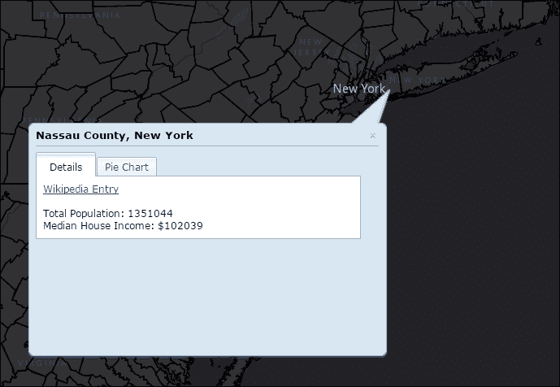

弹出窗口的第二个选项卡显示了 dojo 图表。我们的图表上有一个图例元素。当我们在饼图中悬停在任何数据上时，它会被切片，稍微放大，并突出显示。

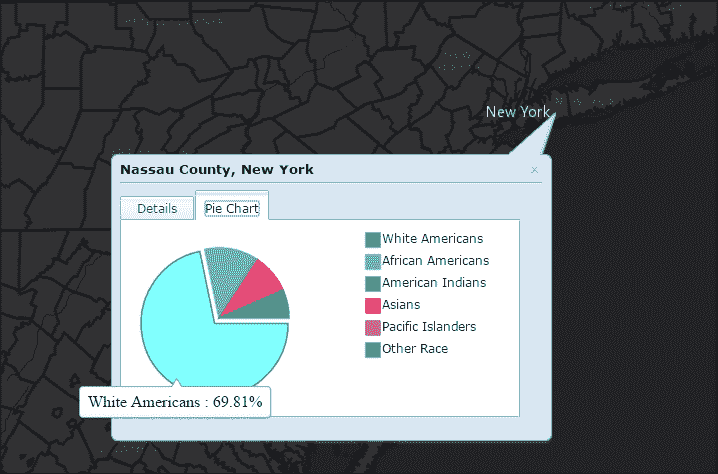

# 使用 D3.js 进行图表绘制

D3.js 是一个用于基于数据操作文档的 JavaScript 库。D3 代表数据驱动文档，该库提供了强大的可视化组件和基于数据驱动的 DOM 操作方法。

要在我们的 JavaScript 应用程序中使用 D3，我们可以从[D3 网站](http://d3js.org/)下载该库。

或者我们可以在我们的脚本标签中使用 CDN：

```js
<script src="//d3js.org/d3.v3.min.js" charset="utf-8"></script>
```

更加面向 dojo 的方法是将其作为`dojoconfig`中的一个包添加，并在`define`函数中使用它作为一个模块。

以下是将 D3 作为`dojoConfig`的包添加的片段：

```js
var dojoConfig = {
  packages: 
  [
    {
      name: "d3",
      location: "http://cdnjs.cloudflare.com/ajax/libs/d3/3.5.5",
      main: "d3.min"
    }
  ]
};
```

在`define`函数中使用`d3`库：

```js
define([
  "dojo/_base/declare",
  "d3",
  "dojo/domReady!"
  ], 
function 
(
  declare,
  d3
) 
{
  //Keep Calm and use D3 with dojo
});
```

## 使用 D3 创建柱状图

让我们使用县级人口统计数据使用 D3 创建一个柱状图。我们的目标是使用柱状图显示围绕感兴趣县的家庭收入中位数的四个度量。这四个度量是：

+   国家最小值或 5 百分位数的值（平均值-三倍标准差）

+   被点击的县的家庭收入中位数

+   国家家庭收入中位数的国家平均值

+   国家最大值或 95 百分位数的值

以下图片是我们打算构建图表的模拟：

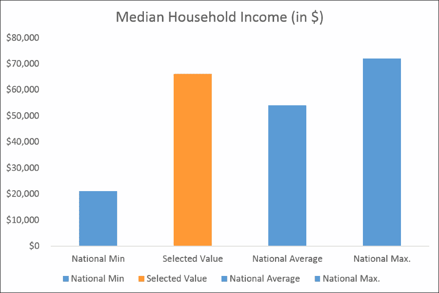

有几个原因我们选择使用 D3 来演示构建这个图表。D3 完全由数据驱动，因此灵活，特别适合数据可视化。许多可视化库都是基于 D3 构建的，了解 D3 甚至可以帮助我们构建直观的图表和数据可视化。

### D3 选择

D3 工作在选择上。D3 中的选择与 jQuery 选择非常相似。要选择`body`标签，你只需要声明：

```js
d3.select("body")
```

要选择所有具有名为`chart`的特定样式类的`div`标签，请使用以下代码片段：

```js
d3.select(".chart").selectAll("div")
```

要将`svg`（可缩放矢量图形）标签或任何其他 HTML 标签附加到`div`或`body`标签，使用`append`方法。SVG 元素用于呈现大多数图形元素：

```js
d3.select("body").append("svg")
```

与`enter()`方法一起使用，表示元素接受输入：

```js
d3.select("body").enter().append("svg")
```

### D3 数据

D3 由数据驱动，正如其名称所示。我们只需要向 D3 选择提供数据，就可以渲染一个简单的图表。数据可以简单到一个数组：

```js
var data = [45, 87, 15, 16, 23, 11];

  var d3Selection = d3.select(".chart").selectAll("div").data(data).enter().append("div");

  d3Selection.style("width", function (d) {
    return d * 3 + "px";
  }).text(function (d) {
    return d;
  });
```

在上一个代码片段中，我们所做的就是为 D3 选择的样式对象设置宽度属性。然后我们得到了这个：

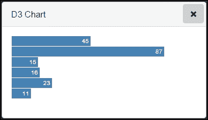

每个`div`的宽度值以像素为单位，取自数据数组中每个元素的值乘以 20，柱内的文本值再次取自各个数据的值。在得到这个美丽的图表之前，有一些事情需要做——我们需要为`div`设置 CSS 样式。这是我们使用的一个简单的 CSS 代码片段：

```js
.chart div {
    font: 10px sans-serif;
    background-color: steelblue;
    text-align: right;
    padding: 3px;
    margin: 1px;
    color: white;
}
```

### D3 缩放

在上一个代码片段中，为了显示一个简单的 D3 图表，我们使用了一个乘数值`20`，用于每个数据值获取`div`宽度的像素值。由于我们的容器`div`大约有 400 像素宽，这个乘数值是合适的。但是对于动态数据，我们应该使用什么样的乘数值呢？经验法则是我们应该使用某种缩放机制来缩放像素值，以便我们的最大数据值舒适地适应图表容器`div`中。D3 提供了一种机制来缩放我们的数据并计算缩放因子，我们可以方便地使用它来缩放我们的数据。

D3 提供了一个`scale.linear()`方法来计算缩放因子。此外，我们还需要使用另外两个方法，即`domain()`和`range()`，来实际计算缩放因子。`domain()`方法接受一个包含两个元素的数组。第一个元素应该提到最小的数据值或`0`（适当的话），第二个元素应该提到数据的最大值。我们可以使用 D3 函数`d3.max`来找到数据的最大值：

```js
d3.max(data)
```

`range`函数还接受一个包含两个元素的数组，应列出容器 div 元素的像素范围：

```js
var x = d3.scale.linear()
    .domain([0, d3.max(data)])
    .range([0, 750]);
```

一旦我们找到缩放因子`x`，我们就可以将其用作数据项值的乘数，以得出像素值：

```js
d3.select(".chart").selectAll("div").data(data)
  .enter().append("div").style("width", function (d) {
    return x(d) + "px"; 
  }).text(function (d) {
    return d;
  });
```

### 将 SVG 集成到 D3 图表中

SVG，虽然在其整体上令人生畏，但在处理数据可视化时提供了几个优势，并支持在 HTML 中呈现许多原始形状。需要注意的一点是 SVG 坐标系统从左上角开始，我们在计算元素所需位置时需要记住这一点。

附加 SVG 元素类似于将`div`附加到我们的图表类：

```js
var svg = d3.select(".chart").append("svg")
    .attr("width", 500)
    .attr("height", 500)
    .append("g")
    .attr("transform", "translate(20,20)";
```

在前面的片段中，我们实际上可以设置样式和其他属性，例如宽度和高度。`transform`是一个重要的属性，通过它我们可以移动`svg`元素的位置（记住 SVG 坐标系原点在左上角）。

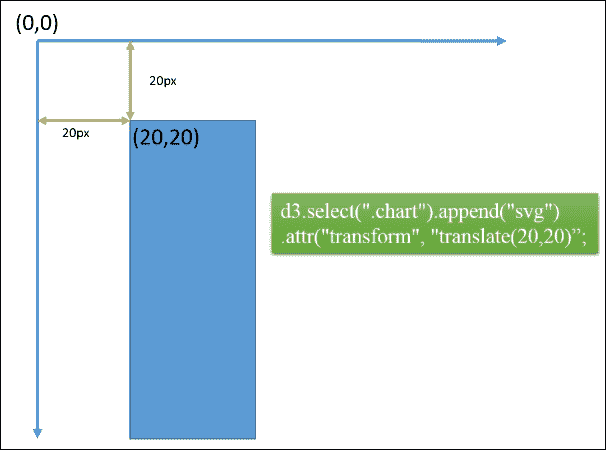

由于我们将构建一个柱状图，因此在计算 D3 线性缩放时，由`range()`方法接受的数组中的第一个元素不应是最小值，而应是像素中的最大高度值。数组中的第二个元素是最小像素值：

```js
  var y = d3.scale.linear()
    .range([700, 0]);
```

相反，`x`缩放因子应基于序数比例（意思是，我们不使用数字来计算条的宽度和间距）：

```js
var x = d3.scale.ordinal()
    .rangeRoundBands([0, width], .1);
```

从之前讨论的特征统计模块中，我们应该能够得到特征层中特定字段的平均值和标准差。

根据前面的两条信息，我们知道如何计算 2.5^(th)百分位数（底部 2.5%的收入）和 97.5^(th)百分位数（顶部 2.5%的收入水平）。我们打算将所选特征的收入中位数与这些值进行比较。计算 2.5^(th)和 97.5^(th)百分位数的公式如下所示：

| *1st percentile = mean - 2,33 * SD* | *99th percentile = mean + 2,33 * SD* |
| --- | --- |
| *2.5th percentile = mean - 1.96 * SD* | *97.5th percentile = mean + 1.96 * SD* |
| *5th percentile = mean - 1.65 * SD* | *95th percentile = mean + 1.65 * SD* |

根据以前的统计计算，我们知道以下数据：

```js
mean = $46193
SD = $12564
```

我们需要计算如下的 2.5^(th)和 97.5^(th)百分位数：

```js
2.5th percentile value = mean – 1.96 * SD
                       =   46193 – 1.96*(12564)  
                       =             21567.56  
```

而对于 97.5^(th)：

```js
97.5th percentile = mean + 1.96 * SD
                  = 46193 + 1.96*(12564)
                  = 70818.44
```

因此，这将是我们图表的数据：

```js
var data = [
  {
    "label": "Top 2.5%ile",
    "Income": 70818
  },
  {
    "label": "Bottom 2.5%ile",
    "Income": 21568
  },
  {
    "label": "National Avg",
    "Income": 46193
  },
  {
    "label": "Selected Value",
    "Income": 0
  }
];
```

`Income`值为`Selected Value`标签设置为`0`。当我们点击`feature`类中的特征时，此值将被更新。我们还将定义一个`margin`对象以及用于图表的`width`和`height`变量。我们定义的`margin`对象如下所示：

```js
 var margin = {
      top: 20,
      right: 20,
      bottom: 30,
      left: 60
    },
    width = 400 - margin.left - margin.right,
    height = 400 - margin.top - margin.bottom;
```

在构建图表时，我们将考虑以下步骤：

1.  确定*x*缩放因子和*y*缩放因子。

1.  定义*x*和*y*轴。

1.  清除`chart`类的`div`的所有现有内容。

1.  根据`margin`对象以及`width`和`height`值定义*x*和*y*域值。

1.  定义将容纳我们的图表的 SVG 元素。

1.  在 SVG 中添加轴以及作为矩形图形元素的图表数据。

我们将在一个函数中编写功能，并根据需要调用该函数：

```js
function drawChart() {

// Find X and Y scaling factor

  var x = d3.scale.ordinal()
    .rangeRoundBands([0, width], .1);

  var y = d3.scale.linear()
    .range([height, 0]);

  // Define the X & y axes

  var xAxis = d3.svg.axis()
    .scale(x)
    .orient("bottom");

  var yAxis = d3.svg.axis()
    .scale(y)
    .orient("left")
    .ticks(10);

  //clear existing 
  d3.select(".chart").selectAll("*").remove();
  var svg = d3.select(".chart").append("svg")
    .attr("width", width + margin.left + margin.right)
    .attr("height", height + margin.top + margin.bottom)
    .append("g")
    .attr("transform", "translate(" + margin.left + "," + margin.top + ")");

  // Define the X & y domains 
  x.domain(data. map(function (d) {
    return d.label;
  }));
  y.domain([0, d3.max(data, function (d) {
    return d.population;
  })]);

  svg.append("g")
    .attr("class", "x axis")
    .attr("transform", "translate(0," + height + ")")
    .call(xAxis);

  svg.append("g")
    .attr("class", "y axis")
    .call(yAxis)
    .append("text")
    .attr("transform", "translate(-60, 150) rotate(-90)")
    .attr("y", 6)
    .attr("dy", ".71em")
    .style("text-anchor", "end")
    .text("Population");

  svg.selectAll(".bar")
    .data(data)
    .enter().append("rect")
    .attr("class", "bar")
    .style("fill", function (d) {
      if (d.label == "Selected Value")
        return "yellowgreen";
    })
    .attr("x", function (d) {
      return x(d.label);
    })
    .attr("width", x.rangeBand())
    .attr("y", function (d) {
      return y(d.population);
    })
    .attr("height", function (d) {
      return height - y(d.population);
    });
}
```

我们可以在特征层的`click`事件上调用之前的函数。在我们的项目中，特征`click`事件在一个单独的文件中定义，而 D3 图表代码在另一个文件中。因此，我们可以通过 dojo 主题发送点击结果：

```js
//map.js file

define("dojo/topic",..){
on(CountyDemogrpahicsLayer, "click", function(evt){
            topic.publish("app/feature/selected", evt.graphic);
        });
}
```

可以通过主题模块下的`subscribe()`方法在任何其他文件中访问结果。在前面的片段中，可以通过引用名为`app/feature/selected`的名称来访问结果：

```js
//chart_d3.js file

topic.subscribe("app/feature/selected", function () {
    var val = arguments[0].attributes.MEDHINC_CY;
    var title = arguments[0].attributes.NAME + ', ' + arguments[0].attributes.STATE_NAME;;
    array.forEach(data, function (item) {
      if (item.label === "Selected Value") {
        item.Income = val;
      }
    });

    drawChart(title);
    console.log(JSON.stringify(data));
  });
```

以下截图是我们代码的输出的表示。D3 图表代表一个具有四个柱的典型柱状图。前三个数据值根据我们的代码是静态的，因为我们可以从特征层数据中计算出顶部和底部的 2.5^(th)百分位数以及国家平均值。最后一栏是特征层中所选特征的实际值。在下面的快照中，我们点击了纽约州的拿骚县，数据值略高于 10 万美元，远高于顶部的 2.5^(th)百分位数标记：

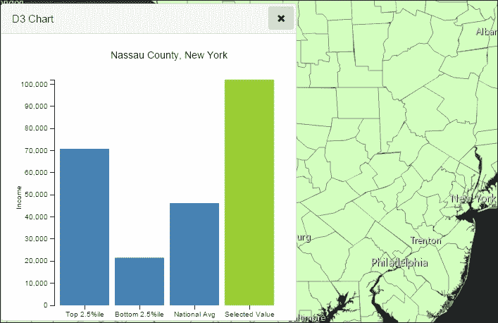

在下面的截图中，我们选择了一个收入中位数最低的县。请注意*Y*轴如何根据数据的最大值重新校准自身。

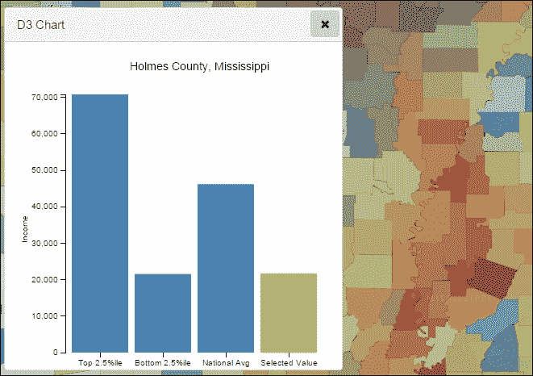

使用 D3 进行 SVG 组件的图表绘制可能会很麻烦，但对这些的基本了解在需要进行高级定制时会大有裨益。

# 使用 Cedar 进行图表绘制

Cedar 是由 Esri 提供的一个基于 ArcGIS Server 数据创建和共享数据可视化的 beta 版本库。它是建立在 D3 和 Vega 图形库之上的。Cedar 让我们可以使用简单的模板创建高效的数据可视化和图表。

## 加载 Cedar 库

我们可以使用两种方法加载 Cedar。我们可以使用脚本标签，也可以使用 AMD 模式。后一种方法更受推荐。

### 使用脚本标签加载

通过包含脚本标签加载 Cedar 及其依赖项。这将使 Cedar 全局可用于我们的应用程序：

```js
<script type="text/javascript" src="http://cdnjs.cloudflare.com/ajax/libs/d3/3.5.5/d3.min.js"></script>
<script type="text/javascript" src="http://vega.github.io/vega/vega.min.js"></script>
<script type="text/javascript" src="https://rawgit.com/Esri/cedar/master/src/cedar.js"></script>

<script>
  var chart = new Cedar({"type": "bar"});
  ...
</script>
```

### 使用 AMD 模式加载

或者，我们可以使用 ArcGIS API for JavaScript 捆绑的 dojo 加载程序，将 Cedar 及其依赖项声明为包来加载它们：

```js
var package_path = window.location.pathname.substring(0, window.location.pathname.lastIndexOf('/'));
var dojoConfig = {
packages: [{
    name: "application",
    location: package_path + '/js/lib'
  },
  {
    name: "d3",
    location: "http://cdnjs.cloudflare.com/ajax/libs/d3/3.5.5",
    main: "d3.min"
  },
  {
    name: 'vega',
    location: 'http://vega.github.io/vega/',
    main: 'vega.min'
  }, {
    name: 'cedar',
    location: package_path + '/js/cedar',
    main: 'cedar'
  }]
};
```

`dojo`包需要在`/js/cedar`位置找到一组 Cedar 库文件。我们可以从以下 github 存储库下载所需的文件：[`github.com/Esri/cedar/tree/develop/src`](https://github.com/Esri/cedar/tree/develop/src)。

我们需要在先前提到的 URL 找到的所有文件。将这些文件放在应用程序的`/js/cedar`文件夹中。

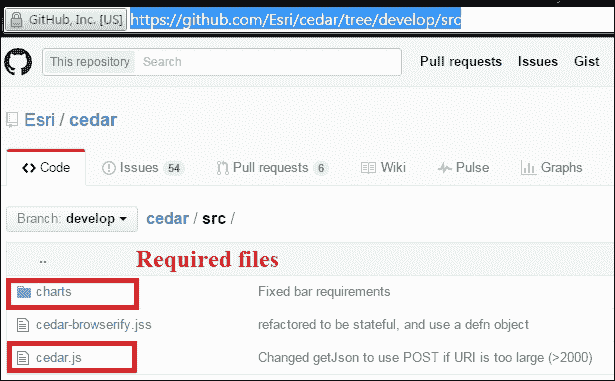

现在我们可以在我们自己的定义函数中加载 Cedar 模块，就像以下代码片段中所示的那样：

```js
define([
  "cedar",
  "dojo/domReady!"
], function (Cedar) 
{
  var chart = new Cedar({
  ...

  });

  chart.show({
    elementId: "#cedarchartdiv",
    width: 900
  });
});
```

要创建一个简单的图表，我们只需要定义两个属性：

+   `type`—定义我们试图构建的图表类型（`bar`、`bubble`、`scatter`、`pie`等）。

+   数据集—定义数据应该来自哪里；这可以是来自 URL 或值（数组）。数据集还接受查询和映射等属性。

+   数据集的映射属性定义了呈现地图所需的对象。相应类型图表的规范可以在`/js/cedar/charts/<chart_type>.js`找到。

对于条形图，映射属性需要两个对象，*x*和*y*。让我们尝试为我们的县级人口统计图创建一个总结。在这里，我们试图总结按州分组的所有县的家庭收入中位数的平均值。以下简单的代码可以做到这一切，并显示一个简单的条形图：

```js
var chart = new Cedar({
  "type": "bar",
  "dataset": {
    "url": "/proxy/proxy.ashx?http://demographics5.arcgis.com/arcgis/rest/services/USA_Demographics_and_Boundaries_2015/MapServer/15",
    "query": {
      "groupByFieldsForStatistics": "ST_ABBREV",

//Find the average value of Median Household Income
      "outStatistics": [{
        "statisticType": "avg",
        "onStatisticField": "MEDHINC_CY",
        "outStatisticFieldName": "AVG_MEDHINC_CY"
      }]
    },
    "mappings": {
      "sort": "AVG_MEDHINC_CY",
      "x": {
        "field": "ST_ABBREV",
        "label": "State"
      },
      "y": {
        "field": "AVG_MEDHINC_CY",
        "label": "Avg. Median Household Income"
      }
    }
  }
});

chart.tooltip = {
  "title": "{ST_ABBREV}",
  "content": "{AVG_MEDHINC_CY} population in {ST_ABBREV}"
}

//show the chart
chart.show({
  elementId: "#cedarchartdiv",
  width: 900
});
```

先前的代码行就是配置 Cedar 库所需的全部内容，它为我们提供了所有州的平均收入水平的出色可视化，并按升序排列。

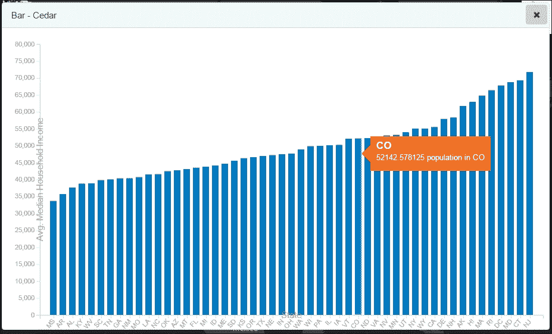

这种类型的图表给我们提供了数据的整体图片。让我们动手尝试构建一个散点图，它可以让我们映射多个变量。

我们的目标是将所有州的收入水平沿*X*轴进行映射，将多样性指数沿*Y*轴进行映射，并根据州对数据点进行不同的着色。

州级数据的人口统计 URL 是：[`demographics5.arcgis.com/arcgis/rest/services/USA_Demographics_and_Boundaries_2015/MapServer/21`](http://demographics5.arcgis.com/arcgis/rest/services/USA_Demographics_and_Boundaries_2015/MapServer/21)

映射对象应该有一个名为 color 的额外参数：

```js
//Get data from the Query Task

var query = new Query();
var queryTask = new QueryTask("http://demographics5.arcgis.com/arcgis/rest/services/USA_Demographics_and_Boundaries_2015/MapServer/21");
query.where = "1 = 1";
query.returnGeometry = false;
query.outFields = ["MEDHINC_CY", "DIVINDX_CY", "NAME", "TOTPOP_CY"];
queryTask.execute(query).then(function (data) {
  /*scatter*/
  var scatter_chart = new Cedar({
    "type": "scatter",
    "dataset": {
      "data": data,
      "mappings": {
        "x": {
          "field": "MEDHINC_CY",
          "label": "Median Houseold Income"
        },
        "y": {
          "field": "DIVINDX_CY",
          "label": "Diversity Index"
        },
        "color": {
          "field": "NAME",
          "label": "State"
        }
      }
    }
  });

  scatter_chart.tooltip = {
    "title": "{NAME}",
    "content": "Median Income:{MEDHINC_CY}<br/>Diversity:{DIVINDX_CY}"
  }

  scatter_chart.show({
    elementId: "#cedarScatterPlotDiv",
    width: 870,
    height: 600
  });
```

以下截图是先前给出的代码实现的结果。图表根据不同颜色的值生成图例。在我们的情况下，不同的州被着不同的颜色。如果被着色的值的数量较少，例如如果我们使用颜色来表示被分类为一些区域的州，如北部、东北部、南部、西南部和其他基本方向，这种着色方式会更合适。

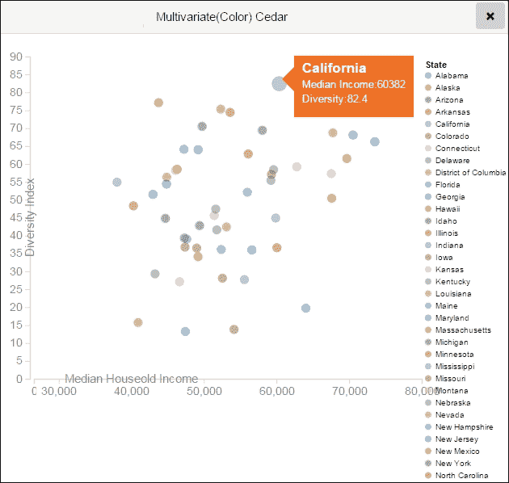

创建气泡图表会提供一个额外的处理方式——使用气泡的大小表示第三个变量：

```js
var bubble_chart = new Cedar({
      "type": "bubble",
      "dataset": {
        "data": data,
        "mappings": {
          "x": {
            "field": "MEDHINC_CY",
            "label": "Median Houseold Income"
          },
          "y": {
            "field": "DIVINDX_CY",
            "label": "Diversity Index"
          },
          "size": {
            "field": "TOTPOP_CY",
            "label": "Population"
          }
        }
      }
    });

    bubble_chart.tooltip = {
      "title": "{NAME}",
      "content": "Median Income:{MEDHINC_CY}<br/>Diversity:{DIVINDX_CY}"
    }

    bubble_chart.show({
      elementId: "#cedarBubblePlotDiv"
    });
```

以下截图显示了一个气泡图；气泡的*x*位置代表县的家庭收入中位数，气泡的*y*位置代表县的多样性指数，气泡的半径或大小代表县的总人口：

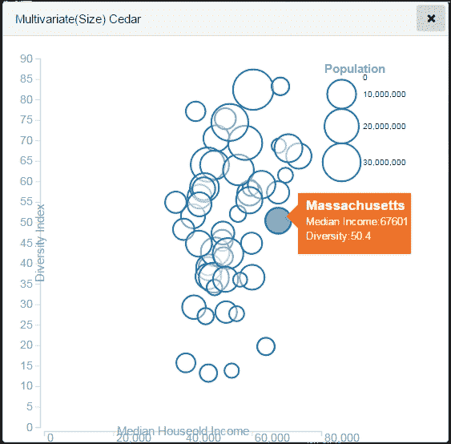

我们从在`Infotemplate`中创建一个简单的可定制图表开始，它可以可视化一个变量，到一个可以同时可视化三个变量的图表，从而增强我们对数据的理解，并增加其价值。

# 摘要

我们已经介绍了如何结合空间数据来提供对我们数据的全面洞察。虽然使用`Infotemplate`和 dojo 图表很方便，但使用 D3 提供了更大的灵活性和对图形元素的更大控制。Esri 提供的开源数据可视化库 Cedar 非常适合轻松创建全新的数据可视化。一旦我们掌握了这些技术以及统计方法，并学会从不同角度看待我们的数据，我们就可以自称为地图数据科学的旗手。我们在可视化空间数据的方式中还缺少一个组成部分。那个组成部分就是时间。在下一章中，我们将看到如何将时空数据可视化，以及在高级图表功能和 ArcGIS JavaScript API 本身所获得的知识。
