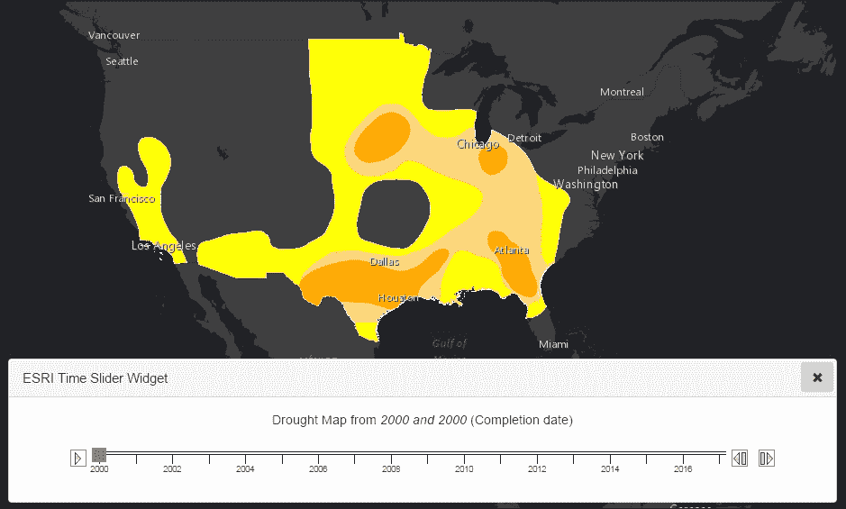
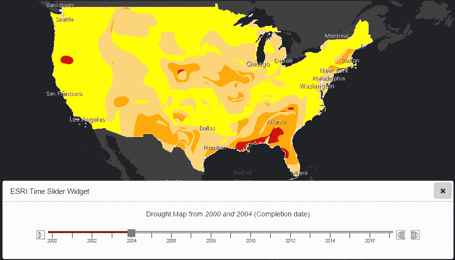
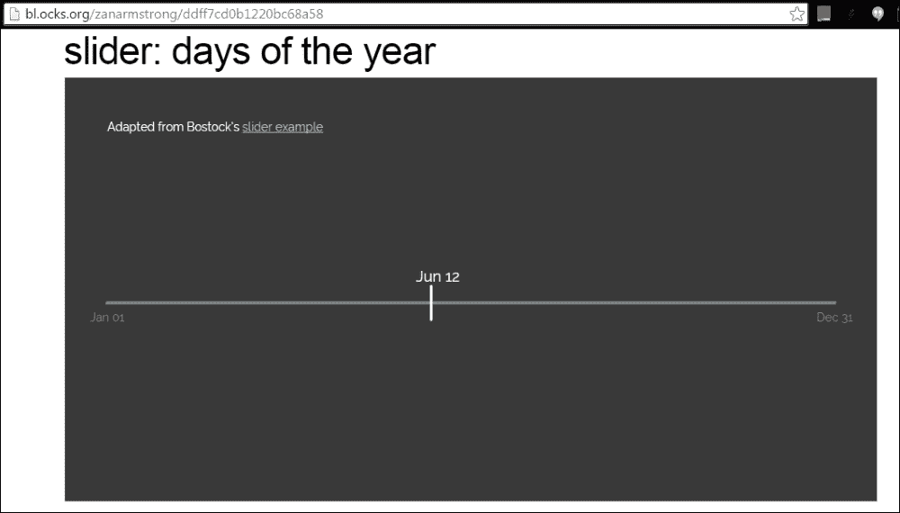
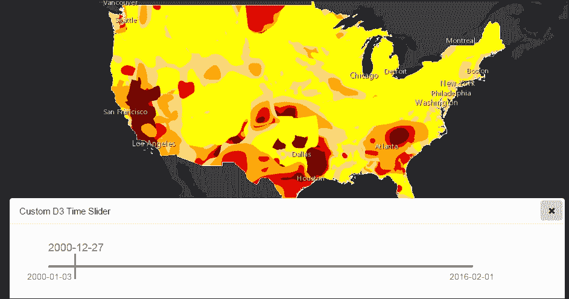
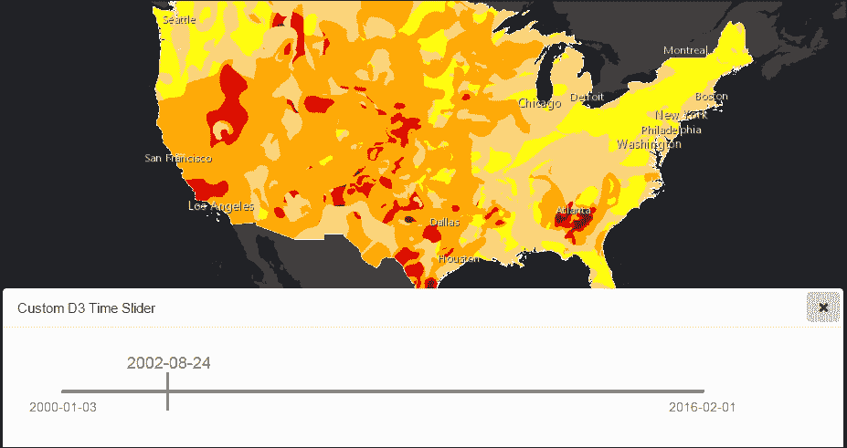
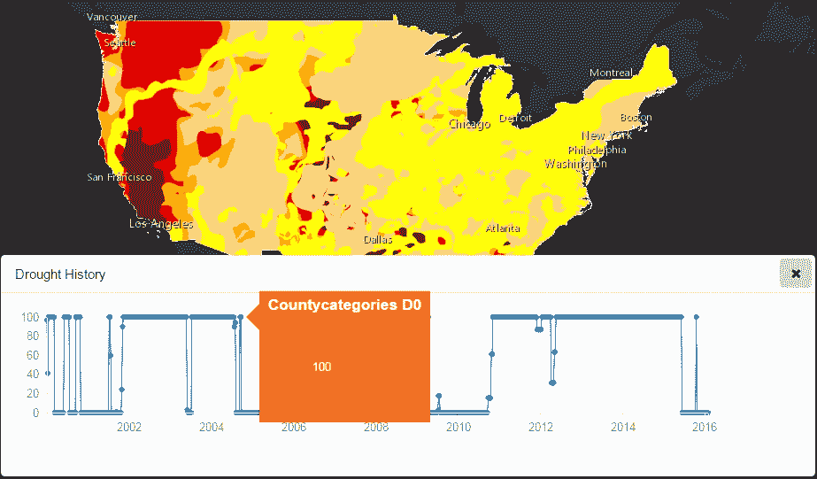

# 第九章。时间感知图层的可视化

我们在之前的章节中处理了读取和显示基于时间的数据，以及使用创新库（如 D3 和 Cedar）进行非空间图表方法。本章将讨论使用空间可视化以及其他非空间可视化辅助工具（如时间滑块和时间图表）来可视化时空数据。本章讨论以下主题：

+   时间感知图层及其需求

+   使用时间滑块构建干旱应用程序

+   使用 D3 基于时间数据进行查询

+   使用 Cedar 图表进行高级时空可视化

# 时间感知图层

ArcGIS 10 及以上版本支持时间感知图层。时间感知图层是具有`TimeInfo`属性的 DynamicMapService 或要素图层。以下屏幕截图显示了时间感知要素图层的服务目录。

查看图像中的`TimeInfo`属性：


服务目录中 TimeInfo 信息的快照

让我们讨论`TimeInfo`对象的组件，这与我们在之前的图像中看到的类似。 `TimeInfo`属性为我们提供以下信息：

+   图层中存储时间信息的字段（状态时间字段，结束时间字段）。

+   数据可用的最小和最大时间（时间范围）。

+   时间参考属性指的是存储日期时间值的时区（如果为空，则遵循 UTC 时间；这将在详细讨论）。

+   时间间隔单位是每个要素可用的时间间隔。

+   *具有实时数据*属性指的是一个布尔值，表示数据是否持续更新。

+   导出选项提供了一系列属性，如使用时间、时间数据累积和时间偏移。时间数据累积是一个布尔值，指的是检索到的特征是否随时间累积。

## 时间感知图层的需求

时间感知图层让我们在时空背景下理解数据；这意味着我们可以看到空间信息如何随时间变化。这种数据具有各种实际应用，例如：

+   了解城市中随时间变化的犯罪热点位置

+   追踪飓风并显示其当前位置

+   在短时间内区域内洪水事件的扩散

+   显示一个州内油井的扩散

+   干旱条件如何随时间影响某个地方

## 理解时间感知图层

对 ArcGIS 中时间概念的基本理解将有助于我们更好地使用时间感知图层。以下几点值得注意：

+   时间应始终参考**协调世界时**（**UTC**），这在功能上等同于**格林威治标准时间**（**GMT**）。

+   就像地图的空间范围一样，我们可以定义地图的时间范围，其中包含时间感知图层。这将仅影响具有`timeInfo`属性的地图图层。时间范围由`esri/TimeExtent`模块提供。我们可以使用以下任一属性定义`TimeExtent`对象：

+   “开始时间”

+   “结束时间”

+   “开始时间”和“结束时间”

```js
require(["esri/TimeExtent", ... ], 
function(TimeExtent, ... ){
  var timeExtent = new TimeExtent();
  timeExtent.startTime = new Date("1/15/1989 UTC");
  map.setTimeExtent(timeExtent);
});
```

+   导出选项对象中的“Time Data Cumulative”属性确定数据是否可以累积。

+   当时间感知图层中的数据无法在地图显示中累积时，我们应该在时间滑块中使用一个滑块。我们将很快讨论时间滑块。

# 构建干旱应用程序

让我们构建一个应用程序，显示美国的干旱情况，以了解 ArcGIS 中支持时间感知图层的功能。

以下网址提供了从 2000 年至今美国干旱强度的每周更新值：[`earthobs1.arcgis.com/arcgis/rest/services/US_Drought/MapServer`](http://earthobs1.arcgis.com/arcgis/rest/services/US_Drought/MapServer)

您可能需要 ArcGIS 开发人员帐户才能访问这些数据。

一个地区的干旱被定义为水供应和水需求在较长时间内的不平衡。由于干旱可能会直接和间接地对环境、经济和社会产生影响，因此监测干旱对于规划、准备和各级政府的减灾工作至关重要。

我们的应用程序试图显示整个美国当前和历史上的干旱数值。这些数据自 2000 年 1 月 4 日以来每周由美国干旱监测器制作，并且完整的时间序列被存档在这里。每个星期四发布一张新地图，以反映上一周的情况。

## 使用时间滑块

API 提供的`TimeSlider`模块能够与时间感知图层进行交互。`TimeSlider`是 API 提供的一个小部件，我们可以在我们的代码中使用它动态查询时间感知图层。它还支持动画，这样我们就可以看到空间要素随时间如何变化，或者在时间间隔内要素如何累积。

要使用`TimeSlider`，我们需要加载 Esri 的`dijit`，名为`esri/dijit/TimeSlider`。除了`TimeSlider dijit`之外，我们还可能需要加载名为`esri/TimeExtent`的模块。时间范围对于定义停止点很有用。以下图片试图展示`TimeSlider dijit`的组件以及与`TimeSlider dijit`相关的编程术语的物理表示，比如`stops`、`timeInterval`、`thumb`等等：


### 创建 TimeSlider 的步骤

以下是创建时间滑块的步骤：

1.  在 DynamicMapService 或要素图层的加载事件上，获取图层的时间范围。

1.  初始化`TimeSlider dijit`并将其分配给容器元素，比如`div`或内容面板。也将时间滑块分配给地图。

1.  设置时间滑块的其他属性，比如拇指数量，根据图层的时间范围和时间单位创建时间停止点。

1.  设置拇指的移动速率。

1.  为时间滑块创建标签。

1.  启动时间滑块动画。

时间滑块的时间范围可以直接从图层的`timeInfo`属性中获取：

```js
on(droughtcMapServiceLayer, "load", function (evt) {
var layerTimeExtent = evt.layer.timeInfo.timeExtent;
  _createEsriTimeSlider(layerTimeExtent);
});
```

以下代码片段解释了如何将时间滑块设置到地图并开始动画：

```js
//Pass the time extent to the function

function _createEsriTimeSlider(layerTimeExtent) {

/*Time Slider*/
  var timeSlider = new TimeSlider({
    style: "width: 100%;"
  }, dom.byId("timeSliderDiv"));
  map.setTimeSlider(timeSlider);

/* We just need one thumb for our time aware data */

  timeSlider.setThumbCount(1);

//Though a weekly data is available, let us Create Time stops
//for Yearly intervals
//

timeSlider.createTimeStopsByTimeInterval(layerTimeExtent, 1, "esriTimeUnitsYears");

//Waits at each stop for 2 seconds

  timeSlider.setThumbMovingRate(2000);

//Start the time slider animation

  timeSlider.startup();

  //add labels for every other time stop

  var labels = array.map(timeSlider.timeStops, function (timeStop, i) {
    if (i % 2 === 0) {
      return timeStop.getUTCFullYear();
    } else {
      return "";
    }
  });

  timeSlider.setLabels(labels);

//Wait for the map service to load at each stop

  timeSlider.on("time-extent-change", function (evt) {
    //update the text

    var currentValString = evt.endTime.getUTCFullYear();
    dom.byId("daterange").innerHTML = "<i>" + currentValString + "<\/i>";
  });

  on(droughtcMapServiceLayer, "update-start", function (evt) {

  //When updating layer, pause the time slider animation

    timeSlider.pause();
  });

  on(droughtcMapServiceLayer, "update-end", function (evt) {

//When update is done, play the time slider animation

    timeSlider.play()
  });
}
```

使用之前的代码块，我们能够开发一个带有`timeSlider`小部件的简单应用程序；在初始时间停止时可以看到应用程序的快照：



一旦点击播放按钮，拇指就开始移动。在每个停止点，拇指可能会在播放动画中暂停超出规定的时间间隔。这个暂停是地图服务在特定时间停止点获取动态地图服务所花费的时间。在下面的图像中，时间滑块动画停止了几秒钟，让我们有机会捕捉 2004 年的地图实例：



如果您观察浏览器的网络选项卡，您会注意到每次拇指沿着时间滑块移动时都会发出一个 HTTP `GET`请求。在每个停止点，都会获取一个新的动态地图图像，对应于特定时间的地图实例。让我们考虑一下这张图像，它显示了 2010 年的一个时间点的快照：


发出 HTTP `GET`请求以生成之前看到的动态图像的 URL，其中每个查询参数都用新行分隔：

```js
http://localhost:9095/proxy/proxy.ashx?
http://earthobs1.arcgis.com/arcgis/rest/services/US_Drought/MapServer/export?
dpi=96
&transparent=true
&format=png8
&time=946944000000%2C1262563200000
&bbox=-17599814.30461256%2C1159119.7738912208%2C-4234952.783009615%2C6765317.176437697
&bboxSR=102100
&imageSR=102100
&size=1366%2C573
&f=image
```

URL 提供了关于生成的图像类型的大量信息。应该注意到请求经过代理页面。时间参数表示 2010 年的刻度。

# 使用 D3 进行基于时间的查询

前面的例子是基于使用 API 提供的内置`TimeSlider dijit`查询时间感知图层。我们可以进一步利用 D3 库提供的丰富的时间数据支持来增强时间滑块的功能。

我们在本节中的目标是创建一个可以与我们的时间感知图层交互的 D3 时间滑块。

以下代码受到[`bl.ocks.org/zanarmstrong/ddff7cd0b1220bc68a58`](http://bl.ocks.org/zanarmstrong/ddff7cd0b1220bc68a58)上给出的代码清单的启发。

该网页解释了如何有效地使用 D3 对象来读取和显示时间数据在时间滑块中。



在实现代码之前，有一些重要的概念我们需要理解。

## 时间的缩放和格式化

在我们之前的章节中，我们讨论了如何使用 D3 函数来缩放数值和序数值。当涉及到时间时，我们需要处理应用于时间的缩放。下面的片段解释了如何将时间范围缩放到容器的宽度：

```js
// parameters
    var margin = {
        top: 10,
        right: 50,
        bottom: 50,
        left: 50
      },
      width = 800 - margin.left - margin.right,
      height = 150 - margin.bottom - margin.top;

// scale function
    var timeScale = d3.time.scale()
      .domain([startDate, endDate])
      .range([0, width])
      .clamp(true);
```

在前面的片段中，我们假设能够从图层的`timeInfo`属性中提供开始和结束数据值给 D3 时间缩放函数。我们还需要一个适当的日期格式来呈现我们拥有的日期值。下面的代码行为我们提供了日期的日期-月份-日期格式：

```js
var formatDate = d3.time.format("%Y-%m-%d");
```

## D3 刷子

D3 刷子相当于时间滑块`dijit`中的拇指。刷子是一个 D3 SVG 元素对象，接受时间范围。在下面的片段中，我们有一个接受 x 轴上时间刻度因子的刷子元素：

```js
    // defines brush
    var brush = d3.svg.brush()
      .x(timeScale)    
      .extent([startingValue, startingValue])
      .on("brush", brushed);
```

我们需要了解的另一个重要方面是关于刷子的事件，比如`mousedown`。当用户移动刷子（在`mousedown`后的`mousemove`）时，将通过调用`timescale.invert`重新计算范围。这将让我们设置刷子的新范围。下面的代码解释了这一方面：

```js
svg.on("mousedown", function (data) {
      var value = brush.extent()[0];

      if (d3.event.sourceEvent) { // not a programmatic event
        value = timeScale.invert(d3.mouse(this)[0]);
        brush.extent([value, value]);
      }
      console.log(formatDate(value));
    });
```

除了网页中提供的代码清单，我们还需要额外的代码来在刷子上的`mousedown`事件持续至少 500 毫秒时才触发检索时间感知数据的查询。否则，当我们沿着时间刻度移动刷子时，事件将被触发多次。下面的函数在移动刷子时触发，将发布一个名为`application/d3slider/timeChanged`的主题：

```js
function brushed() {
  var value = brush.extent()[0];

  if (d3.event.sourceEvent) { // not a programmatic event
    value = timeScale.invert(d3.mouse(this)[0]);
    brush.extent([value, value]);
  }

  handle.attr("transform", "translate(" + timeScale(value) + ",0)");
  handle.select('text').text(formatDate(value));
  var reqValue = formatDate(value);

  if (timer) {
    clearTimeout(timer);
  }
  timer = setTimeout(function () {
    //alert(reqValue);
    topic.publish("application/d3slider/timeChanged", value);
  }, 500);

}
```

订阅主题的代码将设置地图到刷子指向的时间范围：

```js
topic.subscribe("application/d3slider/timeChanged", function () {
  console.log("received:", arguments);
  var startDate = arguments[0];
  if (startDate) {
    var timeExtent = new TimeExtent();
    timeExtent.startTime = startDate;
    map.setTimeExtent(timeExtent);
  }
});
```

查找构建 D3 滑块的完整代码清单：

```js
define([
  "dojo/_base/declare",
  "d3",
  "dojo/topic",
  "dojo/_base/array",
  "dojo/domReady!"
], function (
    declare,  
    d3,  
    topic,
    array) {
    //http://bl.ocks.org/zanarmstrong/ddff7cd0b1220bc68a58

    var isInitilaized = false;

    topic.subscribe("application/d3slider/initialize", function () {
        if (!isInitilaized) {
            console.log("received:", arguments);
            var startDate = arguments[0];
            var endDate = arguments[1];

            var formatDate = d3.time.format("%Y-%m-%d");
            var timer;
            // parameters
            var margin = {
                    top: 10,
                    right: 50,
                    bottom: 50,
                    left: 50
                },
                width = 800 - margin.left - margin.right,
                height = 150 - margin.bottom - margin.top;

            // scale function
            var timeScale = d3.time.scale()
                .domain([startDate, endDate])
                .range([0, width])
                .clamp(true);

            // initial value
            var startValue = timeScale(new Date('2012-03-20'));
            startingValue = new Date('2012-03-20');

            //////////

            // defines brush
            var brush = d3.svg.brush()
                .x(timeScale)
                .extent([startingValue, startingValue])
                .on("brush", brushed);

            var svg = d3.select("#d3timeSliderDiv").append("svg")
                .attr("width", width + margin.left + margin.right)
                .attr("height", height + margin.top + margin.bottom)
                .append("g")
                // classic transform to position g
                .attr("transform", "translate(" + margin.left + "," + margin.top + ")");

            svg.on("mousedown", function (data) {
                var value = brush.extent()[0];

                if (d3.event.sourceEvent) { // not a programmatic event
                    value = timeScale.invert(d3.mouse(this)[0]);
                    brush.extent([value, value]);
                }
                console.log(formatDate(value));
            });

            svg.append("g")
                .attr("class", "x axis")
                // put in middle of screen
                .attr("transform", "translate(0," + height / 2 + ")")
                // inroduce axis
                .call(d3.svg.axis()
                    .scale(timeScale)
                    .orient("bottom")
                    .tickFormat(function (d) {
                        return formatDate(d);
                    })
                    .tickSize(0)
                    .tickPadding(12)
                    .tickValues([timeScale.domain()[0], timeScale.domain()[1]]))
                .select(".domain")
                .select(function () {
                    console.log(this);
                    return this.parentNode.appendChild(this.cloneNode(true));
                })
                .attr("class", "halo");

            var slider = svg.append("g")
                .attr("class", "slider")
                .call(brush);

            slider.selectAll(".extent,.resize")
                .remove();

            slider.select(".background")
                .attr("height", height);

            var handle = slider.append("g")
                .attr("class", "handle");

            handle.append("path")
                .attr("transform", "translate(0," + height / 2 + ")")
                .attr("d", "M 0 -20 V 20");

            handle.append('text')
                .text(startingValue)
                .attr("transform", "translate(" + (-45) + " ," + (height / 2 - 25) + ")");

            slider.call(brush.event);

            function brushed() {
                var value = brush.extent()[0];

                if (d3.event.sourceEvent) { // not a programmatic event
                    value = timeScale.invert(d3.mouse(this)[0]);
                    brush.extent([value, value]);
                }

                handle.attr("transform", "translate(" + timeScale(value) + ",0)");
                handle.select('text').text(formatDate(value));
                var reqValue = formatDate(value);

                if (timer) {
                    clearTimeout(timer);
                }
                timer = setTimeout(function () {
                    //alert(reqValue);
                    topic.publish("application/d3slider/timeChanged", value);
                }, 500);

            }
            isInitilaized = true;
        }
    });
});
```

当我们在我们的应用程序中加入前面的代码时，我们得到了这个漂亮的 D3 时间滑块，如下图所示，它让我们通过一个连续的时间谱查询，而不是每年停止一次：



在我们移动或暂时停止 D3 刷子（拇指）在时间滑块上的不同位置时，不会触发动态地图图像的查询。只有当我们让拇指停留在一个位置超过 0.5 秒时才会触发。这是性能和响应性之间的安全折衷。下面的屏幕截图显示了一个时间点（2002 年 8 月 24 日）的动态地图图像：



# 使用 Cedar 进行高级时空可视化

时间感知图层提供了有关数据的宝贵信息——每个要素在每个时间停止时的整套值。到目前为止，我们一直在使用时间滑块或 D3 中的类似方法来在不同的时区可视化整个空间数据集。我们从未能够可视化特定要素在整个时间范围内的值，或者至少在多个时间范围内的值。我们在本节中的目标就是这样——可视化所选要素在整个时间范围内的值。

我们将使用以下图层进行可视化，该图层位于[`earthobs1.arcgis.com/arcgis/rest/services/US_Drought_by_County/FeatureServer/0`](http://earthobs1.arcgis.com/arcgis/rest/services/US_Drought_by_County/FeatureServer/0)。

该图层显示了美国各县从 2000 年至今的干旱强度。数据的时间范围是 2000 年 1 月 4 日至今，每周四更新以反映上一周的情况。

我们的目标是获取所选要素的所有数据。可以按照以下步骤来实现我们的目标：

1.  选择一个要素并对其执行识别任务以获取要素 ID。

1.  使用要素 ID 查询先前的要素图层。

1.  将数据传递给`time`类型的 Cedar 图表。

以下代码片段解释了如何形成识别参数。在每次地图点击时执行识别任务：

```js
  function initIdentify () {
            map.on("click", doIdentify);

            identifyTask = new IdentifyTask("http://server.arcgisonline.com/arcgis/rest/services/Demographics/USA_1990-2000_Population_Change/MapServer");

            identifyParams = new IdentifyParameters();
            identifyParams.tolerance = 1;
            identifyParams.layerIds = [3];
            identifyParams.returnGeometry = true;
            identifyParams.layerOption = IdentifyParameters.LAYER_OPTION_ALL;
            identifyParams.width = map.width;
            identifyParams.height = map.height;
    }
```

地图点击事件调用名为`doIdentify()`的以下函数：

```js
function doIdentify (event) {
      map.graphics.clear();

//Use the map click point for the identify task

      identifyParams.geometry = event.mapPoint;
      identifyParams.mapExtent = map.extent;
      identifyTask.execute(identifyParams, function (results) {
      console.log(results[0].feature.attributes);

//Initiate a Query Task

      var queryTask = new QueryTask("http://earthobs1.arcgis.com/arcgis/rest/services/US_Drought_by_County/FeatureServer/0");
      var query = new Query();
      query.returnGeometry = true;
      query.outFields = ["*"];

//Query based on the feature id returned by the identify task

      query.where = "countycategories_admin_fips = '"+results[0].feature.attributes.ID+"'";
      query.orderByFields = ["countycategories_date"];
      queryTask.execute(query).then(function(qresult){
      console.log(qresult);

//Send the query result to the topic "some/topic"

      topic.publish("some/topic", qresult);
    });
  });
}
```

发送查询数据的主题将由构建 Cedar 图表的函数订阅。Cedar 图表类型为`time`。

`time`类型的 Cedar 图表需要在字段映射中包含以下类型的字段：

+   Esri 日期时间字段

+   任何数值

在我们的情况下，我们将映射字段，即`countycategories_date`（日期时间字段）和`countycategories_d0`（数值字段）：

```js
topic.subscribe("some/topic", function () {
            var data = arguments[0];
            var chart = new Cedar({
                "type": "time"
            });
            var dataset = {
                "data": data,
                "mappings": {
                    "time": {
                        "field": "countycategories_date",
                        "label": "Date"
                    },
                    "value": {
                        "field": "countycategories_d0",
                        "label": "Countycategories D0"
                    },
                    "sort": "countycategories_date"
                }
            };

//tool tip field
            chart.tooltip = {
                "title": "Countycategories D0",
                "content": "{countycategories_d0}"
            };

        chart.dataset = dataset;

//show the chart

chart.show({
            elementId: "#droughtHistoryMap",
            autolabels: true,
            height:150,
            width:800
        });
        chart.on('click', function(event,data){
            console.log(event,data);
            topic.publish("application/d3slider/timeChanged", new Date(data.countycategories_date));
        });
    });
```

将先前的代码合并到应用程序中，我们能够看到所选县的一段时间内干旱数值的基于时间的图表。在下面的图像中，图表表示了所选要素的干旱数值时间线：



这种表示方法以多维视角呈现了多种方式。一种是我们仍然在特定时间点看到整个国家的干旱空间分布。与此同时，我们能够使用非空间可视化辅助工具，比如时间图，来可视化特定特征在县一级的整个时间段内的干旱数值集合。

# 总结

我们已经介绍了如何使用三种方法以时空方式可视化数据，即时间滑块、D3 和 Cedar。虽然时间滑块是由`dijit`提供的内置 API，但 D3 解决方案更加广泛和灵活。使用 Cedar `time`类型图表来绘制时空数据提供了不同的时空数据视角。我们从 API 的基础开始，稳步进入构建具有小部件的完整的 dojo web 应用程序的微妙之处。我们处理了 API 提供的多功能查询功能，并在不同形式的章节中使用了它。显示查询结果是我们后来的重点。查询结果可以显示为空间图形，也可以以表格形式显示。我们后来深入研究了更直观的渲染方式，使用渲染技术在地图上显示我们的空间数据。

然后我们意识到一些统计知识不仅可以帮助我们更好地理解数据，还可以更好地可视化数据，以便用户可以从中获得新的见解。最后三章是关于通过非空间组件（如图表技术和时间维度）为我们的地图添加多个维度。本章在感知我们的地图在所有讨论的维度上达到了高潮，但这当然不是极限。相反，这是像您这样的富有进取心的地图数据科学家的起点！
