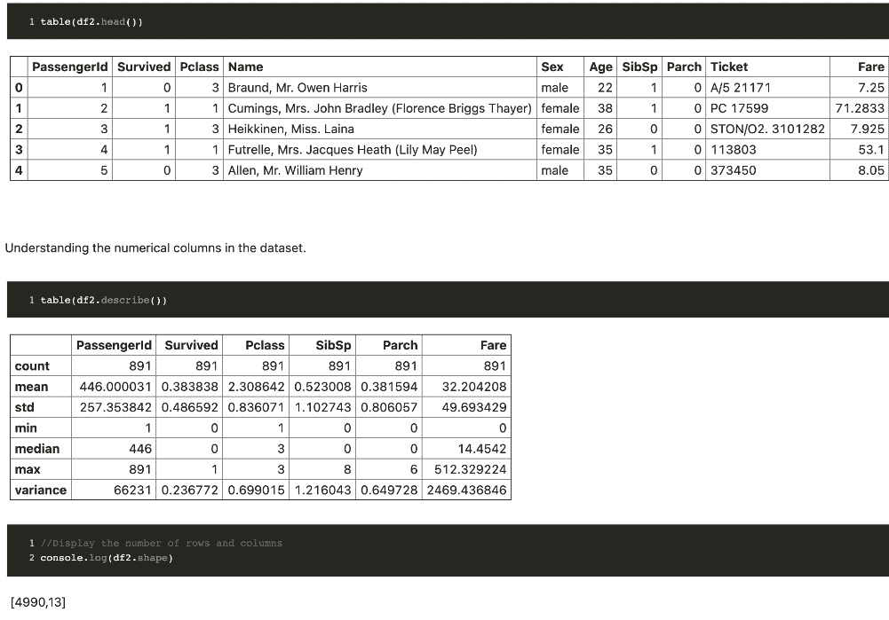
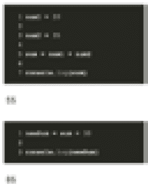
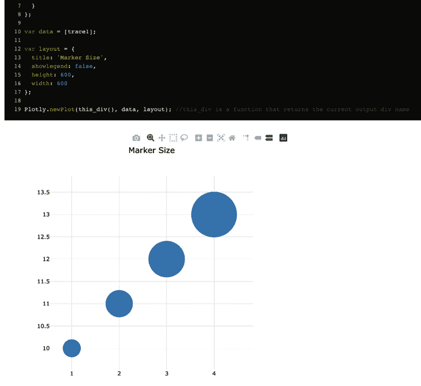
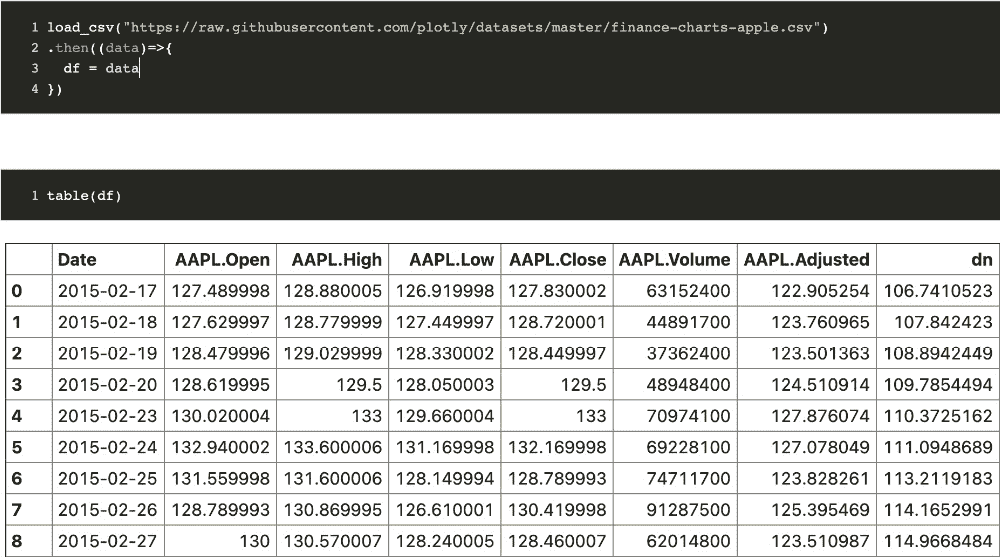
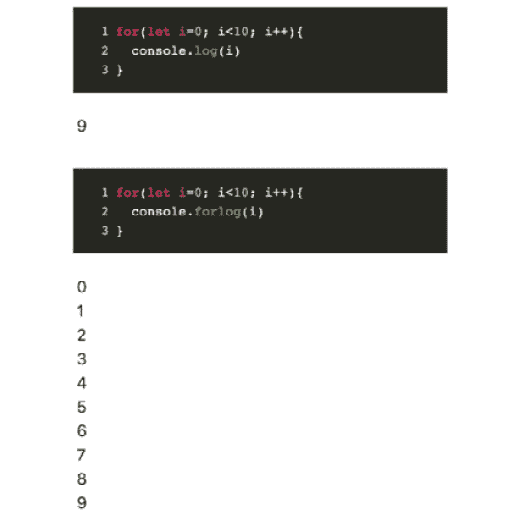
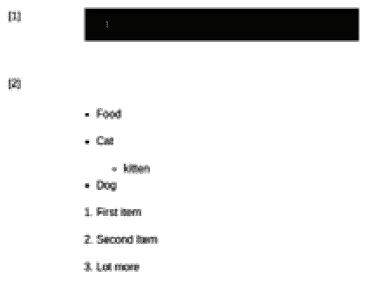

# 第三章：*第二章*：Dnotebook - 用于 JavaScript 的交互式计算环境

使我们的代码足够表达人类可读，而不仅仅是供机器消费的想法是由 Donald Knuth 开创的，他还写了一本名为《文学编程》的书([`www.amazon.com/Literate-Programming-byKnuth-Knuth/dp/B004WKFC4S`](https://www.amazon.com/Literate-Programming-byKnuth-Knuth/dp/B004WKFC4S))。诸如 Jupyter Notebook 之类的工具同样重视散文和代码，因此程序员和研究人员可以通过代码和文本（包括图像和工作流程）进行广泛表达。

在本章中，您将学习有关**Dnotebook**的知识 - 用于 JavaScript 的交互式编码环境。您还将学习如何在本地安装 Dnotebook。此外，您还将学习如何在其中编写代码和 Markdown。此外，您还将学习如何保存和导入已保存的笔记本。

本章将涵盖以下主题：

+   Dnotebook 介绍

+   Dnotebook 的设置和安装

+   Dnotebook 中交互式计算的基本概念

+   编写交互式代码

+   使用 Markdown 单元格

+   保存笔记本

# 技术要求

要成功跟随本章内容，您需要在计算机上安装**Node.js**和现代浏览器，如 Chrome、Safari、Firefox 或 Opera。

要安装 Node.js，您可以在这里按照官方指南进行：[`nodejs.org/en/`](https://nodejs.org/en/)。

本章的代码可在 GitHub 上克隆，网址为[`github.com/PacktPublishing/Building-Data-Driven-Applications-with-Danfo.js/tree/main/Chapter02`](https://github.com/PacktPublishing/Building-Data-Driven-Applications-with-Danfo.js/tree/main/Chapter02)

# Dnotebook 介绍

在过去几年的数据科学领域，诸如 Jupyter Notebook 和 JupyterLab 之类的交互式计算环境实际上已经对代码共享产生了巨大影响，这增强了想法的快速迭代。

近年来，数据科学正朝着浏览器端发展，以支持 Web 开发人员等各种用户。这意味着 Python 生态系统中许多成熟的数据科学工具需要在 JavaScript 中进行移植或提供。基于这一推理，我们本书的作者以及 Danfo.js 的创建者决定创建一个专门针对 JavaScript 生态系统的 Jupyter Notebook 的新版本。

正如我们所称呼的，Dnotebook 可以帮助您在 JavaScript 中进行快速和交互式的实验/原型设计。这意味着您可以以交互式和笔记本式的方式编写代码并立即查看结果，就像下面的屏幕截图所示：



图 2.1 - 使用 Dnotebook 进行交互式编码示例

Dnotebook 可以用于许多领域和不同的事物，例如以下内容：

+   **数据科学/分析**：它可以帮助您使用高效的 JavaScript 包（如*Danfo.js*、*Plotly.js*、*Vega*、*Imagecook*等）轻松进行交互式数据探索和分析。

+   **机器学习**：它可以帮助您使用机器学习库（如*Tensorflow.js*）轻松构建、训练和原型化机器学习模型。

+   **交互式学习 JavaScript**：它可以帮助您以交互式和可视化的方式学习或教授 JavaScript。这有助于学习和理解。

+   **纯粹的实验/原型设计**：任何可以用 JavaScript 编写的实验都可以在 Dnotebook 上运行，因此这可以帮助快速实验想法。

现在您已经了解了 Dnotebook 是什么，让我们学习如何在本地设置和使用它。

# Dnotebook 的设置和安装

要在本地安装和运行 Dnotebook，您需要确保已安装 Node.js。安装 Node.js 后，您可以通过在终端中运行以下命令轻松安装 Dnotebook：

```js
npm install –g dnotebook
```

上述命令会全局安装 Dnotebook。这是推荐的安装方式，因为它确保了 Dnotebook 服务器可以从计算机的任何位置启动。

注意

您还可以在不安装 Dnotebook 的情况下在线使用它；请查看 Dnotebook 游乐场（[`playnotebook.jsdata.org/demo`](https://playnotebook.jsdata.org/demo)）。

安装后，您可以通过在终端/命令提示符中运行以下命令来启动服务器：

```js
> dnotebook
```

此命令将在默认浏览器中打开一个选项卡，端口为 http://localhost:4400，如下截图所示：


图 2.2 – Dnotebook 主页

打开的页面是 Dnotebook 界面的默认页面，从这里您可以开始编写 JavaScript 和 Markdown。

注意

我们目前使用的是**Dnotebook 版本 0.1.1**，因此，在将来使用本书时，您可能会注意到一些细微的变化，特别是在用户界面方面。

# Dnotebook 中交互式计算的基本概念

为了在 Dnotebook 中编写交互式代码/Markdown，您需要了解一些概念，比如单元格和持久性/状态。我们从解释这些概念开始这一部分。

## 单元格

Dnotebook 中的单元格是一个可以写入代码或文本以便执行的单元块。以下是一个示例截图，显示了代码和 Markdown 单元格：


图 2.3 – Dnotebook 中的空代码和 Markdown 单元格

每个单元格都有编辑按钮，可以用于不同的目的，如下截图所示：


图 2.4 – 每个单元格中可用的操作按钮

现在，让我们了解一下这些按钮的作用：

+   **运行**：**运行**按钮可用于执行单元格以显示输出。

+   **添加代码**：添加代码按钮有两种变体（向上和向下），由箭头方向指定。它们可以用于在当前单元格上方或下方添加代码单元格。

+   **添加 Markdown**：添加 Markdown 按钮与添加代码按钮类似，有两种变体，可以在当前单元格下方或上方添加 Markdown 单元格。

+   **删除**：顾名思义，此按钮可用于删除单元格。

有两种类型的单元格，即代码单元格和 Markdown 单元格。

## 代码单元格

**代码单元格**是一个可以编写和执行任何 JavaScript 代码的单元格。新笔记本中的第一个单元格始终是代码单元格，我们可以通过经典的 hello world 示例来测试这一点。

在您打开的 Dnotebook 中，写入以下命令并单击**运行**按钮：

```js
console.log('Hello World!')
```

注意

悬停在代码单元格上会显示**运行**按钮。或者，您可以使用 Windows 中的快捷键*Ctrl* + *Enter*或 Mac 中的*Command* + *Enter*来运行代码单元格。

hello world 的代码和输出应该与下面的截图类似：


图 2.5 – Dnotebook 中的代码单元格和执行输出

接下来，让我们了解 Markdown 单元格。

## Markdown 单元格

**Markdown 单元格**与代码单元格类似，不同之处在于它们只能执行 Markdown 或文本。这意味着 Markdown 文本可以编译任何使用 Markdown 语法编写的文本。

Dnotebook 中的 Markdown 单元格通常是白色的，可以通过单击打开单元格中的**文本**按钮来打开。**文本**按钮通常适用于每个单元格，如下截图所示：


图 2.6 – 在 Dnotebook 中打开一个 Markdown 单元格

单击**文本**按钮会打开一个 Markdown 单元格，如下截图所示：


图 2.7 – 在 Markdown 单元格中编写 Markdown 文本

在这里，您可以编写任何 Markdown 格式的文本，当执行时，结果将被编译为文本并显示在 Markdown 单元格的位置上，如下所示：


图 2.8 – Markdown 单元格的输出

现在，让我们谈谈交互式编程中的另一个重要概念，称为**持久性**/**状态**。

## 持久性/状态

交互式计算中的持久性或状态是环境变量或数据在创建它的单元格之外继续存在（持续）的能力。这意味着在一个单元格中声明/创建的变量可以在另一个单元格中使用，而不管单元格的位置如何。

每个 Dnotebook 实例都运行一个持久状态，而在没有 `let` 和 `const` 声明的单元格中声明的变量可供所有单元格使用。

注意

在 Dnotebook 中工作时，我们鼓励您以两种主要方式声明变量。

选项 1 – 没有声明关键字（首选方法）：

`food_price = 100`

`clothing_price = 200`

`total = food_price + clothing_price`

选项 2 – 使用 `var` 全局关键字（这样做可以，但不建议）：

`var food_price = 100`

`var clothing_price = 200`

`var total = food_price + clothing_price`

使用 `let` 或 `const` 等关键字会使变量在新单元格中无法访问。

为了更好地理解这一点，让我们声明一些变量，并尝试在之后或之前创建的多个单元格中访问它们：

1.  在您的打开笔记本中创建一个新单元格，并添加以下代码：

```js
num1 = 20
num2 = 35
sum = num1 + num2
console.log(sum)
//output 55
```

运行此代码单元格，您将看到总和打印在单元格下方，如下面的截图所示：


图 2.9 – 简单的代码来相加两个数字

1.  接下来，通过单击代码单元格按钮，在第一个单元格后创建一个新单元格，并尝试使用 `sum` 变量，如下面的代码块所示：

```js
newSum = sum + 30
console.log(newSum)
//outputs 85
```

通过执行前面的单元格，您将得到 `85` 的输出。这意味着第一个单元格中的变量 sum 也会持续到第二个单元格以及您将创建的任何其他单元格，如下面的截图所示：



图 2.10 – 两个共享持久状态的代码单元

注意

Markdown 单元格不会保留变量，因为它们不执行 JavaScript 代码。

现在您了解了单元格和持久性是什么，您现在可以在 Dnotebook 中轻松编写交互式代码，在下一节中，我们将向您展示如何做到这一点。

# 编写交互式代码

在本节中，我们将强调在 Dnotebook 中编写交互式代码时需要了解的一些重要事项。

## 加载外部包

在编写 JavaScript 时，将外部包导入笔记本非常重要，因此 Dnotebook 具有一个名为 `load_package` 的内置函数来执行此操作。

`load_package` 方法可以帮助您通过它们的 CDN 链接轻松地将外部包/库添加到您的笔记本中。例如，要加载 `Tensorflow.js` 和 `Plotly.js`，您可以将它们的 CDN 链接传递给 `load_package` 函数，如下面的代码所示：

```js
load_package(["https://cdn.jsdelivr.net/npm/@tensorflow/tfjs@3.4.0/dist/tf.min.js","https://cdn.plot.ly/plotly-latest.min.js"])
```

这将加载包并将它们添加到笔记本状态中，以便可以从任何单元格中访问它们。在下一节中，我们将使用刚刚导入的 `Plotly` 库。

将以下代码添加到笔记本中的新单元格中：

```js
trace1 = {
  x: [1, 2, 3, 4],
  y: [10, 11, 12, 13],
  mode: 'markers',
  marker: {
    size: [40, 60, 80, 100]
  }
};

data = [trace1];
layout = {
  title: 'Marker Size',
  showlegend: false,
  height: 600,
  width: 600
};

Plotly.newPlot(this_div(), data, layout); //this_div is a built-in function that returns the current output's div name.
```

执行前面部分的代码单元格将显示一个图表，如下面的截图所示：



图 2.11 – 使用外部包制作图表

因此，通过使用 `load_package`，您可以添加任何您选择的外部 JavaScript 包，并在 Dnotebook 中进行交互操作。

## 加载 CSV 文件

将数据导入笔记本，特别是导入到数据框中，非常重要。因此，我们在这里介绍的另一个内置函数是 `load_csv`。

注意

数据框以行和列的形式表示数据。它们类似于电子表格或数据库中的行和列集合。我们将在 *第三章* 中深入介绍数据框和系列，*使用 Danfo.js 入门*。

`load_csv`函数帮助您异步将 CSV 文件加载到`Danfo.js` DataFrame 中。当读取大文件并且想要跟踪进度时，您应该使用这个函数，而不是 Danfo 的内置`read_csv`函数。这是因为`load_csv`会在导航栏上显示一个旋转器来指示进度。

让我们通过一个例子更好地理解这一点。在一个新的代码单元格中，添加以下代码：

```js
load_csv("https://raw.githubusercontent.com/plotly/datasets/master/finance-charts-apple.csv")
.then((data)=>{
  df = data
})
```

执行单元格后，如果您查看右上角，您会注意到一个旋转器，指示数据加载的进度。

执行单元格后，您可以像处理 Danfo DataFrame 一样与数据集交互。例如，您可以使用另一个内置函数`table`来轻松地以表格格式显示数据。

在一个新的单元格中，添加以下代码：

```js
table(df)
```

执行时，您应该会看到数据表，如下截图所示：



图 2.12–加载和显示 CSV 文件

接下来，我们将简要介绍另一个内置函数，它有助于在笔记本中显示图表。

## 获取绘图的 div 容器

为了显示图表，大多数绘图库都需要某种容器或 HTML `div`。这是使用 Danfo.js 和 Plotly.js 库进行绘图所必需的。为了更容易地访问输出`div`，Dnotebook 内置了`this_div`函数。

`this_div`函数将返回当前代码单元格输出的 HTML ID。例如，在以下代码中，我们将`this_div`的值传递给 DataFrame 的`plot`方法：

```js
const df = new dfd.DataFrame({col1: [1,2,3,4], col2: [2,4,6,8]})

df.plot(this_div()).line({x: "col1", y: "col2"})
```

这将当前单元格的`div` ID 传递给 DataFrame 的`plot`方法，并在执行时显示生成的图表，如下截图所示：

图 2.13–绘制 DataFrame

](img/B17076_02_13.jpg)

图 2.13–绘制 DataFrame

最后，在下一节中，我们将简要讨论在`for`循环中打印值的问题。这不会按预期工作，我们将解释原因。

## 在使用 for 循环时要注意的事项

当您编写`for`循环并尝试在 Dnotebook 代码单元格中打印每个元素时，您只会得到最后一个元素。这个问题与浏览器中控制台的工作方式有关。例如，尝试执行以下代码并观察输出：

```js
for(let i=0; i<10; i++){
  console.log(i)
}
//outputs 9
```

如果您想要在运行`for`循环时看到所有输出，特别是在 Dnotebook 中进行调试，您可以使用 Dnotebook 内置的`forlog`方法。这个方法已经附加到默认的控制台对象上，并且可以像以下代码块中所示那样使用：

```js
for(let i=0; i<10; i++){
  console.forlog(i)
}
```

执行前面的代码单元格将返回所有值，如下截图所示：



图 2.14–比较 for 和 forlog 方法

您会注意到，当使用`console.forlog`方法时，每个输出都会打印在新的一行上，就像在脚本环境中`console.log`的默认行为一样。

在本节中，我们介绍了一些在 Dnotebook 环境中编写交互式代码时会有用的重要函数和特性。在下一节中，我们将看一下如何使用 Markdown 单元格。

# 使用 Markdown 单元格

Dnotebook 支持 Markdown，这使得您可以将代码与文本和多媒体混合使用，从而使得那些可以访问笔记本的人更容易理解。

Markdown 是一种使用纯文本编辑器创建格式化文本的标记语言。它广泛用于博客、文档页面和 README 文件。如果您使用 GitHub 等工具，那么您可能已经使用过 Markdown。

与许多其他工具一样，Dnotebook 支持所有 Markdown 语法、图像导入、添加链接等。

在接下来的几节中，我们将看到在 Dnotebook 中使用 Markdown 时可以利用的一些重要功能。

## 创建一个 Markdown 单元格

为了在 Dnotebook 环境中编写 Markdown，您需要通过单击**文本**按钮（向上或向下）添加一个 Markdown 单元格。此操作会向您的笔记本添加一个新的 Markdown 单元格。以下屏幕截图显示了在 Markdown 单元格中编写的示例文本：


图 2.15–在 Markdown 单元格中编写简单文本

在 Markdown 单元格中编写 Markdown 文本后，您可以单击**运行**按钮来执行它。这将用读取模式中的转译文本替换单元格。双击文本会再次显示 Markdown 单元格以进行编辑。

## 添加图像

要将图像添加到 Markdown 单元格中，您可以使用以下代码中显示的图像语法：

```js

```

以下是输出：


图 2.16–添加图像

例如，在前面的屏幕截图中，我们添加了一个指向互联网上可用图像的链接。代码如下所示：

```js

```

提供的链接是指向狗图像的链接。需要单击**运行**按钮以查看图像的结果，如下所示：


图 2.17–Markdown 图像结果

在接下来的部分中，您将学习一些基本的 Markdown 语法，您也可以将其添加到您的笔记本中。要查看全面的指南，您可以访问网站[`www.markdownguide.org/basic-syntax/`](https://www.markdownguide.org/basic-syntax/)。

## 标题

要创建标题，您只需在单词或短语前面添加井号符号`（#）`：

```js
# First Heading
## Second Heading 
### Third Heading
```

如果我们将前面的文本粘贴到 Markdown 中并单击**运行**按钮，我们将得到以下输出：


图 2.18–添加标题文本

在结果中，您会注意到在文本前面有不同数量的井号会导致不同的大小。

## 列表

列表对于枚举对象很重要，可以通过在文本前加上星号符号（*****）来添加。我们在以下部分提供了一个示例：

```js
* Food
* Cat
    * kitten
* Dog
```

前面的示例创建了一个无序列表，其中包括**食物**、**猫**和**狗**，**小猫**作为**猫**的子列表。

为了创建一个编号列表，只需在文本前面添加数字，如下所示：

1.  **第一项**

1.  **第二项**

1.  **更多**

在 Markdown 输入字段中输入前面的文本应该输出以下内容：



图 2.19–列表

在接下来的部分中，我们将介绍 Dnotebook 的一个重要部分–保存。这对于重用和与其他人共享您的笔记本非常重要。

# 保存笔记本

Dnotebook 支持保存和导入已保存的笔记本。保存和导入笔记本可以让您/其他人重用您的笔记本。

要保存和导入笔记本，请单击**文件**菜单，然后根据您想要执行的操作选择**下载笔记本**或**上传笔记本**按钮。选项显示在以下屏幕截图中：


图 2.20–保存和导入笔记本

单击**下载笔记本**会以 JSON 格式保存笔记本，这可以很容易地共享或重新加载。

保存和导入

要测试此功能，请转到[`playnotebook.jsdata.org/demo`](https://playnotebook.jsdata.org/demo)。尝试保存演示笔记本。然后打开一个新笔记本，[`playnotebook.jsdata.org`](https://playnotebook.jsdata.org)，并导入保存的文件。

# 总结

在本章中，我们介绍了 Dnotebook，这是一个支持文本和多媒体的交互式库。首先，我们介绍了在本地安装 Dnotebook，并指出您可以免费在线运行部署版本。接下来，我们介绍了一些基本概念和在处理代码和 Markdown 时需要注意的事项，最后，我们向您展示了如何保存笔记本以供共享和重用。

在下一章中，我们将开始使用 Danfo.js，并介绍这个令人惊叹的库的一些基本概念。
