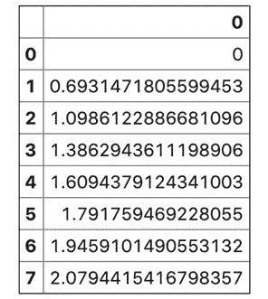
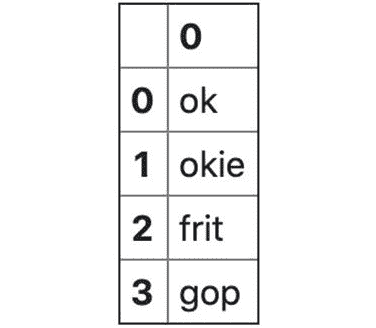
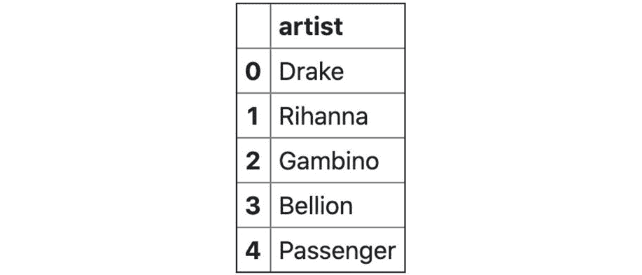
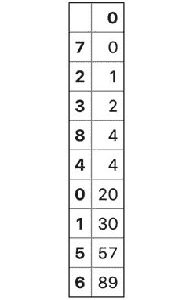
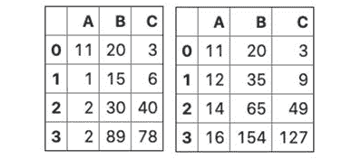
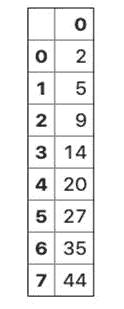

# 第三章：开始使用 Danfo.js

与其他编程语言相比，**Python**数据科学和机器学习生态系统非常成熟，但在数据呈现和客户端方面，**JavaScript**占据主导地位。从其强大的数据呈现工具到其在浏览器中的易用性，JavaScript 总是被推荐的。

在本章中，我们将向您介绍 Danfo.js 库，为您提供 JavaScript 中高效的数据分析和操作工具。我们将介绍 Danfo.js 的核心数据结构——DataFrames 和 Series。我们将向您展示如何将不同类型的文件（如 JSON、Excel 和 CSV）加载到 Danfo.js 中，最后，您将了解一些在 JavaScript 中使数据分析和预处理更容易的重要函数。

在本章中，我们将涵盖以下主题：

+   为什么你需要 Danfo.js

+   安装 Danfo.js

+   介绍 Series 和 DataFrames

+   Danfo.js 中的重要函数和方法

+   数据加载和处理不同的文件格式

# 技术要求

为了跟随本章，您应该具备以下条件：

+   现代浏览器，如 Chrome、Safari、Opera 或 Firefox

+   在您的系统上安装了 Node.js、Danfo.js 和 Dnotebook

本章的代码在这里可用：[`github.com/PacktPublishing/Building-Data-Driven-Applications-with-Danfo.js/tree/main/Chapter03`](https://github.com/PacktPublishing/Building-Data-Driven-Applications-with-Danfo.js/tree/main/Chapter03)。

注意

对于大多数代码片段，您可以使用在线提供的 Dnotebook：[`playnotebook.jsdata.org/`](https://playnotebook.jsdata.org/)。

# 为什么你需要 Danfo.js

要成功地将用 Python 编写的机器学习项目带到 Web 上，需要执行许多过程和任务，例如模型部署、使用 Flask、FastAPI 或 Django 等框架创建 API 路由，然后使用 JavaScript 向模型发送 HTTP 请求。您可以清楚地观察到该过程涉及大量 JavaScript。如果我们能够仅使用 JavaScript 执行所有这些过程，那将是非常棒的，不是吗？好消息是我们可以。

在过去的几年里，浏览器的计算能力稳步增加，并且可以支持高强度的计算，因此在处理数据密集型任务时，JavaScript 具有挑战 Python 的优势。

借助 Node.js，JavaScript 可以访问本地计算机上可用的 GPU，使我们能够使用 Node.js 进行全栈机器学习项目，并使用纯 JavaScript 进行前端开发。

使用 JavaScript 的好处之一是可以轻松地在客户端进行推断，因此数据不必离开客户端到服务器。此外，JavaScript 使我们的程序具有跨平台支持，并且借助内容传送网络（CDN），所有用于应用程序开发的 JavaScript 包都可以轻松使用，而无需安装它们。

随着 TensorFlow.js 和 Danfo.js 等工具的引入，我们看到 JavaScript 在数据科学和机器学习生态系统中得到了更多支持。

想象一下在 Web 上拥有强大的数据处理库，比如 Python pandas（[`pandas.pydata.org/`](https://pandas.pydata.org/)），并考虑将这样的工具融入 JavaScript 中流行的现代框架，如 Vue 或 React；可能性是无限的。这就是 Danfo.js 带给 Web 的力量。

JavaScript 开发人员已经做出了各种尝试，将 pandas 的数据处理能力带到 Web 上。因此，我们有诸如`pandas-js`、`dataframe-js`、`data-forge`和`jsdataframe`等库。

将 Python pandas 移植到 JavaScript 的需求主要是因为需要在浏览器中执行数据预处理和操作任务。

这是一个关于 **Stack Overflow** 的讨论串 ([`stackoverflow.com/questions/30610675/python-pandas-equivalent-in-JavaScript/43825646`](https://stackoverflow.com/questions/30610675/python-pandas-equivalent-in-JavaScript/43825646))，其中详细介绍了 JavaScript 中用于数据预处理和操作的不同工具，但大多数这些工具因为以下两个原因而失败，如串中所述：

+   缺乏将多个库合并为单个库的协作（许多库试图执行不同的任务）

+   大多数库都没有 pandas 的主要功能，如：[`github.com/pandas-dev/pandas#main-features`](https://github.com/pandas-dev/pandas#main-features)

除了这里列出的两个原因，我们在尝试大多数现有工具时观察到的另一个问题是缺乏像 Python 的 pandas 那样良好的用户体验。pandas 非常受欢迎，由于大多数使用 JavaScript 创建的工具都模仿 pandas，因此最好拥有与 pandas 相当相似的用户体验。

Danfo.js 的构建是为了弥补现有数据处理库所面临的差距和问题。API 经过精心设计，模仿了 pandas API，并且为从 Python 背景而来的人提供了类似的体验，同时也为 JavaScript 开发人员提供了简单直观的 API。

除了简单且熟悉的 API 外，由于 TensorFlow.js 的支持，Danfo.js 更快。Danfo.js 在 JavaScript 数据科学社区中备受欢迎，在不到一年的时间里在 GitHub 上获得了超过 1500 颗星，同时也得到了 Google 的 TensorFlow.js 团队的认可 ([`blog.tensorflow.org/2020/08/introducing-danfo-js-pandas-like-library-in-JavaScript.html`](https://blog.tensorflow.org/2020/08/introducing-danfo-js-pandas-like-library-in-JavaScript.html))。另外，值得一提的是 Danfo.js 得到了积极贡献者的大力维护和不断发展，他们确保其始终保持最新和稳定。

除了前述原因，我们决定撰写这本关于 Danfo.js 的书籍还有许多其他原因，以便为您提供在 JavaScript 中执行数据操作任务所需的技能和知识。在下一节中，我们将首先学习如何在浏览器中安装和导入 Danfo.js，同时也在 Node.js 环境中进行。

# 安装 Danfo.js

Danfo.js 在浏览器和 Node.js 环境中都可以轻松获取。要在浏览器中使用 Danfo.js，可以将 `script` 标签添加到 `HTML` 文件的头部，如下所示：

```js
<head>
      ...
     <script src="img/bundle.min.js"></script>
      ...
</head>
```

在撰写本文时，浏览器环境中 Danfo.js 的最新版本为 0.2.7。这很可能已经改变，但请放心，本书中使用的所有代码和片段将在未来版本中起作用。

注意

要安装或获取 Danfo.js 的最新版本，可以在官方文档的发布页面 [`danfo.jsdata.org/release-notes`](https://danfo.jsdata.org/release-notes) 中查看。

在 Node.js 环境中，可以使用 `yarn` 安装 Danfo.js，如下所示：

```js
//NPM
npm install danfojs-node
// Yarn
yarn add danfojs-node
```

安装完成后，可以使用以下任一命令导入 Danfo.js：

```js
//Common js style
const dfd = require("danfojs-node")
// ES6 style
import * as dfd from 'danfojs-node'
```

注意

为了练习，您可以始终使用 [`playnotebook.jsdata.org/`](https://playnotebook.jsdata.org/)，如前一章所述。有了这个，您可以在线访问 Dnotebook 进行快速实验。要在 Dnotebook 中使用 Danfo.js 的最新版本，您可以始终使用 `load_package` 函数。

Danfo.js 的浏览器和 Node.js 版本遵循相同的 API 设计。主要区别在于在浏览器中，Danfo.js 被添加到全局范围下的名称 `dfd`。因此，`dfd` 变量可用于所有 JavaScript 或 HTML 文件。

现在我们安装完成后，我们将继续下一节，讨论 Danfo.js 和 Series 中提供的主要数据结构和方法。

# 介绍 Series 和 DataFrames

Danfo.js 公开了两种主要数据结构，Series 和 DataFrames，可以轻松进行所有数据操作。DataFrames 和 Series 为不同类型的数据提供了通用表示，因此可以将相同的数据处理过程应用于具有不同格式的数据集。

在本节中，我们将看到创建 Series 和 DataFrames 的不同方法。我们将了解如何处理 DataFrame 和 Series 格式的数据。我们还将研究不同的 DataFrame 和 Series 方法来处理数据。

我们将从处理 Series 数据结构的数据开始本节。

## Series

Series 提供了处理一维数据的入口，例如具有相同数据类型的一系列值的单个数组。

在本节中，我们将熟悉以下 Series 方法的 Series 数据结构：

```js
 *  table() and print() method:let sdata= new dfd.Series([1,3,5,7,9,11])
table( sdata) // Displays the table in Dnotebook
```

上述代码给出了以下输出表：


图 3.1 – Series 表

在上述代码片段中，我们使用 `table()` 来打印 Series 表。这是因为我们在本章的大部分代码中都在使用 Dnotebook。要在浏览器或 Node.js 控制台中打印 DataFrames 或 Series，可以始终调用 `print()` 如下：

```js
 sdata.print() // will give us same output as table( sdata)
```

在随后的代码中，我们将始终使用 `table()` 函数，这允许我们在浏览器网页上打印 DataFrame。

+   `.index` 属性: 默认情况下，Series 表的列名始终为 0，除非另有指定。还要注意，Series 表的索引范围为数据的 `0` 到 `n – 1`，其中 `n` 是数据的长度。索引也可以通过以下方式获取：

```js
console.log(sdata.index) // [0,1,2,3,4,5]
```

+   `.dtype` 和 `astype()`: 有时传入 Series 的数据可能不是同质的，并且可能包含混合数据类型的字段，如下所示：

```js
let sdata = new dfd.Series([1,2,3, "two:","three"])
console.log(sdata.dtype)
// string
```

`dtype` 输出了 `string`，而数据是不同的数据类型，因此我们可以始终像以下代码一样更改 `dtype`：

```js
sdata.astype('int32')
```

上述代码更改了 Series 的数据类型，但实际上并没有将数据中的字符串转换为 `int32`。因此，如果对数据执行数值操作，将会引发错误。

+   `.tensor` 属性: Series 中的数据可以以两种主要格式获取 – 作为 JavaScript `series.tensor` 是一个有效的 TensorFlow.js 张量，因此可以对其执行所有支持的张量操作。例如，在以下代码中，我们对 Series `tensor` 对象调用指数函数：

```js
sdata.tensor.exp(2).arraySync()
// [3,7,20,55,148]
```

在上述代码中，我们能够打印出 Series 数据的指数，因为我们可以访问底层张量。`arraySync` 方法返回张量的数组格式。让我们来看一下 `set_index()` 方法。

+   `set_index()` 方法: 在创建 Series 数据结构时可以指定索引。我们在以下代码中演示了这一点：

```js
series = new dfd.Series([1,2,3,4,5], {index: ["one","two", "three", "four", "five"]})
table(series)
```

这将设置 Series 的索引并替换默认的数值索引，如下所示：


图 3.2 – 具有命名索引的 Series

我们可以始终更改 Series 的默认索引值，如以下代码所示：

```js
sdata = new dfd.Series(["Humans","Life","Meaning","Fact","Truth"])
new_series = sdata.set_index({ "index": ["H", "L", "M","F","T"] })
table(new_series)
```

`sdata.set_index()` 重置索引并返回一个新的 Series，如 *图 3.2* (*左*) 所示，而不会改变原始 Series。我们可以将 `set_index()` 设置为实际更新原始 Series 的索引并且不返回新的 Series，方法是将 `inplace` 键设置为 `true`：

```js
sdata.set_index({ index: ["H", "L", "M","F","T"] , inplace: true })
```

现在我们来看一下 `.apply()` 方法。

+   `.apply()` 方法: 由于 Series 是单维数组，因此可以轻松应用类似于在 JavaScript 中处理数组的操作。Series 有一个名为 `.apply` 的方法，可以在 Series 数据的每个值上应用任何函数：

```js
sdata = new dfd.Series(["Humans","Life","Meaning","Fact","Truth"])
series_new = sdata.apply((x) => {
 return x.toLocaleUpperCase()
})
table(series_new)
```

这通过在每个值上应用 `x.toLocaleUpperCase()` 将 Series 中的每个字符串转换为大写。下图显示了在应用 `x.toLocaleUpperCase` 之前和之后的表输出：


图 3.3 - 左：将索引设置为字符串。右：使用 apply 将所有字符串转换为大写

`.apply`方法也非常适用于对 Series 数据的每个值执行数值操作：

```js
sf = new dfd.Series([1, 2, 3, 4, 5, 6, 7, 8])
sf_new = sf.apply(Math.log)
table(sf_new)
```

我们使用`.apply`函数找到了 Series 中每个值的对数。对于所有其他数学运算也是一样的。

上述代码输出以下表格：



图 3.4 - 对 Series 的每个值应用数学运算（Math.log）

Series 数据结构还包含`.map`方法，类似于`.apply`。该方法将 Series 的每个值映射到另一个值：

```js
sf = new dfd.Series([1,2,3,4])
map = { 1: "ok", 2: "okie", 3: "frit", 4: "gop" }
sf_new = sf.map(map)
table(sf_new)
```

map 接受对象和函数作为参数。在上述代码中，我们创建了一个名为`map`的对象，其中包含 Series 中的值作为键，以及每个键应映射到的值。

上述代码输出以下表格：



图 3.5 - 在 Series 值上使用 map

接下来，我们将看一下`.isna()`方法。

+   `.isna()`方法：到目前为止，我们传递到 Series 中的数据似乎都没有问题，不包含缺失值或未定义值，但在处理真实数据时，我们总会有`NaN`或未定义的值。我们可以随时检查我们的 Series 中是否存在这样的值：

```js
sf_nan = new dfd.Series([1,2, NaN, 20, undefined, 100])
table(sf_nan)
```

作为测试，我们创建了一个包含`NaN`和一个未定义变量的 Series。我们得到以下输出：


图 3.6 - 包含 NaN 值的 Series 框架的表

让我们检查包含`NaN`和未定义值的行；对于这些行中的每一行，我们输出`true`，如果没有，则显示为`false`，如下面的代码所示：

```js
table(sf_nan.isna())
```

我们得到以下输出：


图 3.7 - Series 数据的 isna 表

`.add()`方法如下。

+   `.add()`方法：Series 数据结构还支持 Series 之间的逐元素操作（如加法、减法、乘法和除法），在此操作之后，索引会自动对齐：

```js
sf1  = new dfd.Series([2,20,23,10,40,5])
sf2  = new dfd.Series([30,20,40,10,2,3])
sf_add = sf1.add(sf2)
table(sf_add)
```

我们有以下输出：

图 3.8 - 添加两个 Series

](img/B17076_3_8.jpg)

图 3.8 - 添加两个 Series

上述代码片段将`sf2` Series 添加到`sf1`，并且每个值都是按元素逐行添加的。

还要注意，可以将单个值传递给`sf1.add`，这将向`sf1` Series 中的每个元素添加一个常量值：

```js
table(sf1.add(10))
```

以下是上述代码的输出：


图 3.9 - 向 Series 元素添加常量值

先前显示的操作也适用于所有其他数学运算以及 Series。

在下一小节中，我们将研究数据框的操作，如何创建数据框以及如何使用数据框操作处理数据。

## 数据框

数据框表示一组 Series，尽管与 Series 不同，它基本上是数据的二维表示（尽管它也可以表示更高的维度），包含多列和多行。

数据框基本上可以使用 JavaScript 对象构建，如下面的代码所示：

```js
data = {
  artist: ['Drake','Rihanna','Gambino', 'Bellion', 'Paasenger'],
  rating: [5, 4.5, 4.0, 5, 5],
  dolar: [ '$1m', '$2m','$0.1m', '$2.5m','$3m']
}
df = new dfd. DataFrame (data)
table(df) 
// print out the  DataFrame 
```

生成的数据框应如下所示：


图 3.10 - 数据框表

在上述代码中，创建了包含键和值的 JavaScript 对象数据。请注意 JavaScript 对象的以下内容：

+   每个键包含一个列表值，表示每列的数据。

+   每个键代表列和列名。

+   每个键必须具有相同长度的列表值。

以下是处理数据框数据结构的常见方法：

+   `head()`和`tail()`方法：有时，在处理大型数据集时，您可能需要查看数据的前几行（可能是前 5 行或前 30 行，只要您喜欢的数量），以及数据的最后几行。

由于我们的 DataFrame 包含五行，让我们打印表的前两行：

```js
table(df.head(2))
```

`head()`方法默认打印 DataFrame 的前五行，但我们可以指定`2`，因为我们的数据很小。

以下表显示了前述代码的结果：


图 3.11 - 用于 df.head(2)的表

此外，要查看 DataFrame 中的最后一组行，我们使用`tail()`方法。默认情况下，`tail`方法会打印出 DataFrame 中的最后五行：

```js
table(df.tail(2))
```

`tail`函数接受一个值，该值指定要从 DataFrame 表末尾打印的行数，如下所示：


图 3.12 - 打印最后两行

+   `data`变量包含数据，表示为数组的数组。数据数组中的每个数组按行排列的值将在 DataFrame 表中表示为`[Drake, 5, $1m]`表示 DataFrame 中的一行，而每个值（`Drake`，`5`，`$1m`）表示不同的列。`Drake`属于`artist`列，`$1m`属于`dollar`列，如下图所示：


图 3.13 - DataFrame 表

回想一下，我们说过 DataFrame 是 Series 的集合，因此可以像访问 JavaScript 对象元素的方式一样从 DataFrame 中访问这些 Series。下面是如何做到这一点的：

```js
table(df.artist)
```

请注意，`artist`是 DataFrame 中的列名，因此如果我们将 DataFrame 视为对象，则`artist`是键，键的值是 Series。前述代码应输出以下表：



图 3.14 - 列系列

`artist`列也可以通过`df['artist']`访问：

```js
table(df['dollar'])
```

此方法也输出与使用初始`df.dollar`方法相同的结果：


图 3.15 - 访问列值

除了通过类似对象的方法访问列值之外，我们还可以按以下方式更改列数据：

```js
df['dollar'] = ['$20m','$10m', '$40m', '$35m', '$10m']
```

如果我们要打印`df.dollar`，我们将获得以下输出：


图 3.16 - 更改列值

也可以通过创建一个 Series 框架，然后将其分配给 DataFrame 中的列来更改列数据，如下所示：

```js
rating = new dfd.Series([4.9,5.0, 7.0, 3.0,2.0])
df['rating'] = rating
table(df['rating'])
```

前述代码更改了列评分的值，并输出了以下表：


图 3.17 - 使用 Series 值更改列数据

在处理与时间相关的列时，使用 Series 数据来更新列数据的方法非常方便。我们可能需要提取日期列中的小时或月份，并用提取的信息（小时或月份）替换列。 

让我们向 DataFrame 添加一个日期列：

```js
date = [ "06-30-02019", "07-29-2019", "08-28-2019", "09-12-2019","12-03-2019" ]
df.addColumn({column: "date", value: date})
```

我们使用`addColumn`方法向 DataFrame 添加新列。`addColumn`方法接受一个必须包含以下键的对象参数：

a) 要添加的“列”的名称

b) 列的新“值”

前述代码应输出以下表：


图 3.18 - 添加新列

创建的新列是一个日期时间列，因此我们可以将此列转换为时间序列数据结构，然后提取列中每个数据点的月份名称：

```js
date_series = df['date']
df['date'] = date_series.dt.month_name()
```

我们提取日期列并将其分配给`date_series`变量。从`date_series`（实际上是一个 Series 数据结构）中，我们提取每个值的月份名称。Series 数据结构包含`dt`方法，它将 Series 结构转换为时间序列结构，然后使用`month_name()`方法提取月份名称。

上述代码输出了以下表格：


图 3.19 – 提取月份名称

我们将要查看的下一个方法是`.values`和`.tensor`。

+   `.values`和`.tensor`：DataFrame 的值，即每个列值，可以使用`df.values`作为一个巨大的数组获得：

```js
df.values
//output
[[Drake,4.9,$20m,Jun],[Rihanna,5,$10m,Jul],[Gambino,7,$40m,Aug],[Bellion,3,$35m,Sep],[Passenger,2,$10m,Dec]]
```

有时，我们可能希望将 DataFrame 作为张量获得用于机器学习操作，因此以下显示了如何将 DataFrame 作为张量值获得：

```js
df.tensor
//output
{"kept":false,"isDisposedInternal":false,"shape":[5,4],"dtype":"string","size":20,"strides":[4],"dataId":{},"id":28,"rankType":"2"}
```

`tensor`属性返回了一个 TensorFlow.js 张量数据结构。由于张量必须始终包含唯一的数据类型，因此我们 DataFrame 中的所有数据点都转换为`dtype`字符串。

+   `.transpose()`方法：由于我们声称 DataFrame 是数据的二维表示，因此我们应该能够对 DataFrame 进行转置：

```js
df.transpose()
```

`df.transpose()`将列列表作为索引，将索引作为列，如下表所示：


图 3.20 – 转置 DataFrame

我们可以获取 DataFrame 的索引并查看列是否现在是当前索引：

```js
df2 = df.transpose()
console.log(df2.index) 
// [artist,rating,dollar,date]
```

上述代码是转置 DataFrame 的索引。在前面的示例中，索引始终是数值，但是通过这个示例，可以看到索引也可以是字符串。

+   `.set_index()`方法：使用 DataFrame 本身，在对其进行转置之前，让我们将 DataFrame 的索引从整数更改为字符串索引：

```js
df3 = df.set_index({key:["a","b","c","d","e"]})
```

使用 DataFrame 中的`set_index`方法使用给定的键值设置索引。`set_index`还接受`inplace`键（`inplace`键是一个布尔键，它接收`true`或`false`作为值，但默认值为`false`）来指定 DataFrame 是否应该更新或返回包含更新的新 DataFrame。

以下表格显示了上述代码的结果：


图 3.21 – 设置 DataFrame 的索引

由于索引可以是任何内容，因此我们也可以将 DataFrame 的索引设置为 DataFrame 中的一列：

```js
df4 = df.set_index({key:"artist"})
```

这一次，`set_index`接受一个值而不是一个提议的索引值数组。如果将单个值作为键索引传递，`set_index`认为它应该作为 DataFrame 中的列可用。

`artist`列中的值用于替换默认索引。还要注意`inplace`的默认值为`false`，因此会创建并返回一个包含更新索引的新 DataFrame。

以下显示了创建的 DataFrame 的输出：


图 3.22 – 将索引设置为艺术家列

到目前为止，您应该已经了解如何创建 Series 和 DataFrame 以及如何利用它们各自的方法进行数据处理。

在下一节中，我们将研究一些在 Danfo.js 中常用于数据分析和处理的基本函数和方法。

# Danfo.js 中的基本函数和方法

在本节中，我们将介绍与 Series 和 DataFrames 相关的一些重要函数和方法。每个数据结构中的方法都很多，我们可以随时查看文档以获取更多方法。本节将只提到一些最常用的方法：

+   `loc`和`iloc`索引

+   排序：`sort_values`和`sort_index`方法

+   `过滤器`

+   算术运算，如`add`，`sub`，`div`，`mul`和`cumsum`

## loc 和 iloc 索引

使用`loc`和`iloc`方法更容易地访问 DataFrame 的行和列；这两种方法都允许您指定要访问的行和列。对于那些来自 Python 的 pandas 库的人来说，Danfo.js 中实现的`loc`和`iloc`格式应该是熟悉的。

使用`loc`方法访问具有非数字索引的 DataFrame，如下所示：

```js
df_index = df4.loc({rows:['Bellion','Rihanna','Drake']})
```

利用上一节中更新的 DataFrame，我们使用`loc`方法从 DataFrame 中获取特定的行索引。这个索引值在`rows`关键元素中指定：


图 3.23-访问特定的行索引值

此外，`loc`和`iloc`方法使我们能够对数组进行切片。这对于 Python 用户来说应该是熟悉的。如果你不知道它是什么，不要担心；下面的例子将展示它的含义和如何做到这一点。

为了获得一系列的索引，我们可以指定非数字索引的上限和下限：

```js
df_index = df4.loc({rows:["Rihanna:Bellion"]})
```

当 DataFrame 的列名和索引是字符串时，使用`loc`方法。对于上述代码，我们指定要提取`Rihanna`行索引和`Bellion`行索引之间的数据值。

这个冒号有助于指定范围边界。以下表格显示了上述代码的输出：


图 3.24-字符串索引

除了对行进行索引，我们还可以提取特定的列：

```js
df_index = df4.loc({rows:["Rihanna:Bellion"], columns:["rating"]})
```

将`columns`键传递到`loc`中以提取名为`rating`的列。

以下表格显示了上述代码的结果：


图 3.25-列和行索引

我们还可以指定索引列的范围，如下所示：

```js
df_loc= df4.loc({rows:["Rihanna:Bellion"], columns:["rating:date"]})
```

这应该返回一个类似于以下的表：


图 3.26-列范围

从上表中，我们可以看到范围与行索引相比是完全不同的；列索引排除了上限。

DataFrame 中的`loc`方法使用字符来索引行数据和列数据。`iloc`也是一样，但是使用整数来索引行和列。

使用如下表格中显示的初始 DataFrame，我们将使用`iloc`方法进行索引：


图 3.27-艺术家表

让我们使用`iloc`来访问*图 3.27*中显示的表的索引`2`到`4`：

```js
t_df = df.iloc({rows:['2:4']})
table(t_df)
```

`iloc`方法接受与`loc`方法相同的关键字：`rows`和`columns`关键字。数字被包装在字符串中，因为我们想执行`loc`方法。

以下表格显示了上述代码的结果：


图 3.28-使用封闭上限从 2 到 4 索引表行

切片数组（花式索引）

对于那些来自 Python 的人来说，切片数组将是熟悉的。在 Python 中，可以使用一系列值对数组进行索引，例如，`test = [1,2,3,4,5,6,7] test [2:5] => [3,4,5]`。JavaScript 没有这个属性，因此 Danfo.js 通过将范围作为字符串传递，并从字符串中提取上限和下限来实现这一点。

与在前面的例子中对行进行的相同的切片操作也可以对列进行：

```js
column_df = df.iloc({columns:['1:']})
table(column_df)
```

`df.iloc({columns:['1:']})`用于提取从索引 1（表示`rating`列）到最后一列的列。对于整数索引，当未指定上限时，它会选择最后一列作为上限。

在本节中，我们讨论了对 DataFrame 进行索引和不同的索引方法。在下一节中，我们将讨论如何按列值和行索引对 DataFrame 进行排序。

## 排序

Danfo.js 支持两种排序数据的方法 - 按索引或按列值。此外，Series 数据只能按索引排序，因为它是一个只有单列的 DataFrame 对象。DataFrame 有一个名为`sort_values`的方法，它使您能够按特定列对数据进行排序，因此通过对特定列进行排序，我们正在对其他所有列进行排序。

让我们创建一个包含数字的 DataFrame：

```js
data = {"A": [-20, 30, 47.3],
         "B": [ -4, 5, 6],
         "C": [ 2, 3, 30]}
df = new dfd. DataFrame (data)
table(df)
```

这将输出以下表格：


图 3.29 – 数字 DataFrame

现在，让我们按列`B`中的值对 DataFrame 进行排序：

```js
df.sort_values({by: "C", inplace: true, ascending: false})
table(df)
```

`sort_values`方法接受以下关键字参数：

+   `by`：用于对 DataFrame 进行排序的列的名称。

+   `inplace`：是否应更新原始 DataFrame（`true`或`false`）。

+   `ascending`：列是否应按升序排序。默认值始终为`false`。

在上面的代码片段中，我们指定按列`C`对 DataFrame 进行排序，并将`inplace`设置为`true`，因此 DataFrame 被更新，并且列也按降序排序。以下表格显示了输出：


图 3.30 – 按列值排序的 DataFrame

有时我们可能不想更新原始 DataFrame 本身。这就是`inplace`关键字的影响所在：

```js
sort_df = df.sort_values({by: "C", inplace:false, ascending: false})
table(sort_df)
```

在上面的代码中，DataFrame 按列排序。让我们尝试按其索引对相同的 DataFrame 进行排序：

```js
index_df = sort_df.sort_index({ascending:true})
table(index_df)
```

`sort_index`还接受关键字参数：`ascending`和`inplace`。我们将`ascending`关键字设置为`true`，这应该会给我们一个按升序排列的 DataFrame。

以下是获得的输出：


图 3.31 – 排序索引 DataFrame

在 Series 中进行排序需要一个非常简单的方法；通过调用`sort_values`方法来进行排序，如下所示：

```js
data1 = [20, 30, 1, 2, 4, 57, 89, 0, 4]
series = new dfd.Series(data1)
sort_series = series.sort_values()
table(sort_series)
```

`sort_values`方法还接受关键字参数`ascending`和`inplace`。默认情况下，`ascending`设置为`true`，`inplace`设置为`false`。

以下表格显示了上述代码的结果：



图 3.32 – 按值排序 Series

请注意，`sort_values`和`sort_index`方法也适用于包含字符串的列和索引。

使用我们的`artist` DataFrame，让我们尝试按以下方式对一个列进行排序：

```js
sort_df = df.sort_values({by: "artist", inplace:false, ascending: false})
table(sort_df)
```

DataFrame 使用`artist`列按降序排序。这将导致一个表，其中`Rihanna`在第一行，其后是`Passenger`，基于第一个字符：


图 3.33 – 按字符串列排序

在本节中，我们看到了如何按列值和行索引对 DataFrame 进行排序。在下一节中，我们将看到如何过滤 DataFrame 值。

## 过滤

根据列中的某些特定值过滤 DataFrame 的行在数据操作和处理过程中大多数时间都很方便。Danfo.js 有一个名为`query`的方法，用于根据列中的值过滤行。

`query`方法接受以下关键字参数：

+   `column`：列名

+   `is`：指定要使用的逻辑运算符（`>，<，>=，<=，==`）

+   `to`：用于过滤 DataFrame 的值

+   `inplace`：更新原始 DataFrame 或返回一个新的

以下是`query`方法的工作示例。

首先，我们创建一个 DataFrame：

```js
data = {"A": [30, 1, 2, 3],
        "B": [34, 4, 5, 6],
        "C": [20, 20, 30, 40]}

df = new dfd. DataFrame (data)
```

以下图显示了表格：


图 3.34 – DataFrame

让我们按列`B`中的值对 DataFrame 进行排序：

```js
query_df = df.query({ column: "B", is: ">", to: 5 })
table(query_df)
```

在这里，我们通过大于 5 的值来过滤列`B`。这将导致返回包含列`B`中大于 5 的值的行，如下所示：


图 3.35 – 按列 B 中大于 5 的值过滤

让我们通过检查列`C`中的值是否等于`20`来过滤 DataFrame：

```js
query_df = df.query({ column: "C", is: "==", to: 20})
table(query_df)
```

通过这样，我们得到了以下输出：


图 3.36 – 在 C 列值等于 20 的情况下进行过滤

在本节中，我们看到了如何通过列值过滤 DataFrame。在下一节中，我们将看到如何执行不同的算术运算。

## 算术运算

在本小节中，我们将研究不同的算术运算以及如何使用它们来预处理我们的数据。

可以在以下之间进行加法、减法、乘法和除法等算术运算：

+   一个 DataFrame 和一个 Series

+   一个 DataFrame 和一个数组

+   一个 DataFrame 和一个`标量`值

我们首先进行了 DataFrame 和`标量`值之间的算术运算：

```js
data = {"Col1": [10, 45, 56, 10], 
        "Col2": [23, 20, 10, 24]}
ar_df = new dfd. DataFrame (data)
//add a scalar variable
add_df = ar_df.add(20)
table(add_df)
```

`add`方法用于在 DataFrame 的每一行上添加一个`标量`变量 20。`add`方法接受两个参数：

+   `other`：这表示 DataFrame、Series、数组或`标量`。

+   `axis`：指定操作是按行还是按列应用的。行轴用`0`表示，列轴用`1`表示。默认为`0`。

对于`标量`操作，我们得到了以下结果：


图 3.37 – 左：原始 DataFrame。右：进行标量加法后的 DataFrame

让我们创建一个 Series 并将其传递给`add`方法：

```js
add_series = new dfd.Series([20,30])
add_df = ar_df.add(add_series, axis=1)
table(add_df)
```

创建了一个包含两行元素的 Series。这两行元素等于`ar_df` DataFrame 中的列数，这意味着`add_series`的第一行值属于`ar_df`的第一列，就像第二行值对应于`ar_df`的第二列一样。

前面段落中的解释意味着`20`将用于乘以`Col1`，`30`将用于乘以`Col2`。为了实现这一点，我们指定轴为`1`，这告诉 add 操作按列进行操作，正如我们在下表中所看到的：


图 3.38 – DataFrame 和 Series 之间的加法操作

DataFrame 和 Series 之间的加法操作与 DataFrame 和普通 JavaScript 数组之间的操作相同，因为 Series 只是具有一些扩展功能的 JavaScript 数组。

让我们看看两个 DataFrame 之间的操作：

```js
data = {"Col1": [1, 4, 5, 0], 
         "Col2": [2, 0, 1, 4]}

data2 = {"new_col1": [1, 5, 20, 10],
         "new_Col2": [20, 2, 1, 2]}
df = new dfd.DataFrame(data)
df2 = new dfd.DataFrame(data2)

df_new = df.add(df2)
```

首先，我们创建两组 DataFrame，然后将它们相加；但是我们必须确保两个 DataFrame 具有相同数量的列和行。此外，此操作是逐行进行的。

该操作实际上并不关心两个 DataFrame 是否具有相同的列名，但是结果列名是我们要添加到前一个 DataFrame 的 DataFrame 的列名。

以下表显示了前面代码中创建的 DataFrame 的结果：


图 3.39 – 从左到右：DataFrame df 和 df2 的表格以及 df 和 df2 之间的加法

使用 add 操作进行的示例与`sub()`、`mul()`、`div()`、`pow()`和`mod()`方法相同。

此外，对于 DataFrame 和 Series，还有一组称为累积的数学运算，其中包括以下方法：

+   累积求和：`cumsum()`

+   累积最小值：`cummin()`

+   累积最大值：`cummax()`

+   累积乘积：`cumprod()`

这些操作中的每一个在传递参数方面都是相同的。它们都接受操作应该在哪个轴上执行的参数：

```js
data = [[11, 20, 3], [1, 15, 6], [2, 30, 40], [2, 89, 78]]
cols = ["A", "B", "C"]
df = new dfd. DataFrame (data, { columns: cols })
new_df = df.cumsum({ axis: 0 })
```

我们通过指定其数据和列来创建一个 DataFrame，然后沿着`0`轴执行累积求和。

以下表显示了前面代码中创建的 DataFrame 的结果：



图 3.40 - 左：cumsum()之前的 DataFrame。右：cumsum()之后的 DataFrame

让我们沿着 DataFrame 的轴`1`执行`cumsum`操作：

```js
new_df = df.cumsum({ axis: 1 })
```

这给我们以下表格：


图 3.41 - 沿轴 1 的累积和

相同的累积操作也可以应用于 Series。让我们将相同的累积和应用于 Series 数据：

```js
series = new dfd.Series([2,3,4,5,6,7,8,9])
c_series = series.cumsum()
table(c_series)
```

Series 中的`cumsum`不接受任何参数。通过前面的操作，我们得到了以下表格*图 3.42*，即在应用累积 Series 之前的原始 Series。

以下表格显示了在前面代码中`series.cumsum()`操作的结果：



图 3.42 - 累积和 Series

所有其他累积操作，如`cumprod`、`cummin`和`cummax`，都与前面`cumsum`示例中所示的方式相同。

在本节中，我们研究了不同的算术操作以及如何利用这些操作来预处理数据。在下一节中，我们将深入研究逻辑操作，例如如何在 DataFrame 和 Series、数组和`标量`值之间执行逻辑操作。

## 逻辑操作

在本节中，我们将看到如何执行逻辑操作，例如比较 DataFrame 和 Series、数组和标量值之间的值。

逻辑操作的调用和使用方式与算术操作的工作方式非常相似。逻辑操作可以在以下之间进行：

+   一个 DataFrame 和一个 Series

+   一个 DataFrame 和一个数组

+   一个 DataFrame 和一个标量值

实施了以下逻辑操作：

+   等于（`==`）：`.eq()`

+   大于（`>`）：`gt()`

+   小于（`<`）：`lt()`

+   不等于（`!=`）：`ne()`

+   小于或等于（`<=`）：`le()`

+   大于或等于（`>=`）：`ge()`

所有这些方法都接受相同的参数，即`other`和`axis`。使用`lt()`方法，让我们看看它们是如何工作的：

```js
data = {"Col1": [10, 45, 56, 10],
        "Col2": [23, 20, 10, 24]}
df = new dfd. DataFrame (data)
df_rep = df.lt(20)
table(df_rep)
```

代码检查 DataFrame 中的每个值是否小于 20。结果可以在下图中看到：


图 3.43 - 左：df 的 DataFrame。右：df_rep 的 DataFrame

同样的操作也可以在 DataFrame 和 Series 之间进行，如下所示：

```js
series = new dfd.Series([45,10])
df_rep = df.lt(series, axis=1)
table(df_rep)
```

DataFrame 与 Series 的`series`操作是按列进行的。以下表格是结果：


图 3.44 - DataFrame 和 Series 之间的逻辑操作

让我们在两个 DataFrame 之间执行逻辑操作，如下所示：

```js
data = {"Col1": [10, 45, 56, 10],
         "Col2": [23, 20, 10, 24]}
data2 = {"new_col1": [10, 45, 200, 10],
         "new_Col2": [230, 200, 110, 24]}

df = new dfd.DataFrame (data)
df2 = new dfd.DataFrame (data2)

df_rep = df.lt(df2)
table(df_rep)
```

代码输出了以下结果：


图 3.45 - DataFrame 之间的逻辑操作

在本节中，我们研究了一些重要的 DataFrame 操作，例如如何按列值过滤 DataFrame。我们还看到了如何按列值和行索引对 DataFrame 进行排序。此外，本节还深入研究了使用`loc`和`iloc`对 DataFrame 进行索引，最后，我们研究了算术和逻辑操作。

在下一节中，我们将深入研究如何处理不同的数据格式，如何将这些文件解析为 Danfo.js，并将它们转换为 DataFrame 或 Series。

# 数据加载和处理不同的文件格式

在本节中，我们将看看如何处理不同的文件格式。Danfo.js 提供了一种处理三种不同文件格式的方法：CSV、Excel 和 JSON。以这些格式呈现的数据可以轻松地被读取并呈现为 DataFrame。

每种文件格式所需的方法如下：

+   `read_csv()`: 读取 CSV 文件

+   `read_json()`: 读取 JSON 文件

+   `read_excel()`: 读取以`.xslx`格式呈现的 Excel 文件

这些方法中的每一个都可以在本地和互联网上读取数据。此外，在`Node.js`环境中，这些方法只能访问本地文件。在网络上，这些方法可以读取提供的文件（CSV、JSON 和`.xslx`文件），只要这些文件在互联网上可用。

让我们看看如何在 Node.js 环境中读取本地文件：

```js
const dfd = require("Danfo.Js-node")
dfd.read_csv('titanic.csv').then(df => {
  df.head().print()
})
```

首先，我们导入 Node.js 版本的 Danfo.js，然后调用`read_csv()`来读取同一目录中可用的`titanic.csv`文件。请注意，如果要读取的文件不在同一目录中，您需要指定路径。

`df.head().print()`在 Node.js 控制台中打印 DataFrame 表的前五行；`print()`函数类似于我们在 Dnotebook 中使用的`table()`函数。我们从前面的代码中得到以下表格：


图 3.46 – 从 CSV 文件读取的 DataFrame 表

同样，可以在网络上进行相同的操作，但我们将使用`http`链接，这样相同的数据就可以在线使用：

```js
csvUrl =
      "https://storage.googleapis.com/tfjs-examples/multivariate-linear-regression/data/boston-housing-train.csv";
dfd.read_csv(csvUrl).then((df) => {
  df.print()
});
```

这与前一个代码块产生相同的结果。对所有其他文件格式方法也是一样的：

```js
const dfd = require("Danfo.Js-node")

dfd.read_excel('SampleData.xlsx', {header_index: 7}).then(df => {
  df.head().print()
})
```

`read_excel()`方法接受一个可选的配置参数，确保正确解析 Excel 文件：

+   `source`：字符串、URL 或本地文件路径，用于检索 Excel 文件。

+   `sheet_name`（可选）：要解析的工作表的名称。默认为第一个工作表。

+   `header_index`（可选）：int，表示标题列的行索引。

+   `data_index`（可选）：int，指示数据开始的行索引。

在前面的代码块中，我们将`header_index`的值指定为`7`，因为标题列位于那里，因此我们得到以下结果：


图 3.47 – 从 Excel 文件读取的 DataFrame 表

`read_json()`方法在传递参数方面与`read_csv()`非常相似；该方法只接受指向 JSON 文件的 URL 或 JSON 文件所在目录路径：

```js
const dfd = require("Danfo.Js-node")
dfd.read_json('book.json').then(df => {
  df.head().print()
})
```

这读取了同一目录中名为`book.json`的文件，并输出了以下内容：


图 3.48 – 从 JSON 文件读取的 DataFrame

此外，Danfo.js 包含一个名为`reader`的终极表格文件读取方法；该方法可以读取 CSV 和 Excel。它还可以读取其他文件，如[`frictionlessdata.io/`](https://frictionlessdata.io/)中 Frictionless 规范中指定的`Datapackage`。

`reader`方法使用名为`Frictionless.js`的包在[`github.com/frictionlessdata/frictionless-js`](https://github.com/frictionlessdata/frictionless-js)中读取本地或远程文件。

`reader`方法与`read_csv`和`read_excel`具有相同的 API 设计，只是它可以读取两种文件类型，如下面的代码所示：

```js
const dfd = require("Danfo.Js-node")
// for reading csv
dfd.read('titanic.csv').then(df => {
  df.head().print()
})
```

从前面的代码中，我们输出了与*图 3.48*中显示的相同的表格。

## 将 DataFrame 转换为另一种文件格式

经过一系列数据处理后，我们可能希望将最终的 DataFrame 转换为文件格式以便保存。Danfo.js 实现了一种将 DataFrame 转换为 CSV 格式的方法。

让我们将迄今为止创建的 DataFrame 转换为 CSV 文件。请注意，这只适用于 Node.js 环境：

```js
df.to_csv("/home/link/to/path.csv").then((csv) => {
    console.log(csv);
}).catch((err) => {
    console.log(err);
})
```

这（`df.to_csv()`）将 DataFrame 保存为 CSV 文件，保存在指定的路径目录中，并赋予给它的名称（path.csv）。

在本节中，我们研究了在 Danfo.js 中可用的不同格式的文件，如 CSV、JSON 和 Excel。我们研究了读取这些文件的不同方法，还研究了一种更通用的读取这些文件格式的方法。

我们还看到了如何将 DataFrame 转换为用户指定的文件格式。

# 总结

在本章中，我们讨论了为什么需要 Danfo.js，然后深入了解了 Series 和 DataFrames 的实际含义。我们还讨论了 Danfo.js 中一些基本功能，并在 DataFrames 和 Series 中实现了这些功能。

我们还看到了如何使用 DataFrames 和 Series 方法来处理和预处理数据。我们学会了如何根据列值筛选 DataFrame。我们还按行索引和列值对 DataFrame 进行了排序。本章使我们能够执行日常数据操作，如以不同格式读取文件、转换格式，并将预处理后的 DataFrames 保存为理想的文件格式。

在下一章中，我们将深入研究数据分析、数据整理和转换。我们将进一步讨论数据处理和预处理，并了解如何处理缺失的数字，以及如何处理字符串和时间序列数据。
