# 第五章：数据分析、整理和转换

**数据分析**、**整理**和**转换**是任何数据驱动项目的重要方面，作为数据分析师/科学家，您大部分时间将花在进行一种形式的数据处理或另一种形式上。虽然 JavaScript 是一种灵活的语言，具有良好的用于操作数据结构的功能，但编写实用程序函数来执行数据整理操作非常繁琐。因此，我们在 Danfo.js 中构建了强大的数据整理和转换功能，这可以大大减少在此阶段花费的时间。

在本章中，我们将向您展示如何在真实数据集上实际使用 Danfo.js。您将学习如何加载不同类型的数据集，并通过执行操作（如处理缺失值、计算描述性统计、执行数学运算、合并数据集和执行字符串操作）来分析它们。

在本章中，我们将涵盖以下主题：

+   转换数据

+   合并数据集

+   Series 数据访问器

+   计算统计数据

# 技术要求

要跟随本章，您应该具备以下条件：

+   现代浏览器，如 Chrome、Safari、Opera 或 Firefox

+   Node.js、Danfo.js 和 Dnotebook 已安装在您的系统上

+   稳定的互联网连接用于下载数据集

Danfo.js 的安装说明可以在*第三章*中找到，*开始使用 Danfo.js*，而 Dnotebook 的安装步骤可以在*第二章*中找到，*Dnotebook – JavaScript 的交互式计算环境*。

注意

如果您不想安装任何软件或库，可以使用 Dnotebook 的在线版本[`playnotebook.jsdata.org/`](https://playnotebook.jsdata.org/)。但是，在使用任何功能之前，请不要忘记安装最新版本的 Danfo.js！

# 转换数据

数据转换是根据定义的步骤/过程将数据从一种格式（主格式）转换为另一种格式（目标格式）的过程。数据转换可以是简单的或复杂的，取决于数据集的结构、格式、最终目标、大小或复杂性，因此重要的是要了解 Danfo.js 中用于进行这些转换的功能。

在本节中，我们将介绍 Danfo.js 中用于进行数据转换的一些功能。在每个子节下，我们将介绍一些函数，包括`fillna`、`drop_duplicates`、`map`、`addColumns`、`apply`、`query`和`sample`，以及用于编码数据的函数。

## 替换缺失值

许多数据集都存在缺失值，为了充分利用这些数据集，我们必须进行某种形式的数据填充/替换。Danfo.js 提供了`fillna`方法，当给定 DataFrame 或 Series 时，可以自动用指定的值填充任何缺失字段。

当您将数据集加载到 Danfo.js 数据结构中时，所有缺失值（可能是未定义的、空的、null、none 等）都存储为`NaN`，因此`fillna`方法可以轻松找到并替换它们。

### 替换 Series 中的值

`Series`对象的`fillna`方法的签名如下：

```js
Series.fillna({value, inplace})
```

`value`参数是您想要用于替换缺失值的新值，而`inplace`参数用于指定是直接对对象进行更改还是创建副本。让我们看一个例子。

假设我们有以下 Series：

```js
sdata = new dfd.Series([NaN, 1, 2, 33, 4, NaN, 5, 6, 7, 8])
sdata.print() //use print to show series in browser or node environment 
table(sdata) //use table to show series in Dnotebook environment
```

在您的 Dnotebook 环境中，`table(sdata)`将显示如下图所示的表格：


图 4.1 – 具有缺失值的 Series

注意

如果您在浏览器或 Node.js 环境中工作，可以在控制台中查看`print`函数的输出。

要替换缺失值（`NaN`），我们可以这样做：

```js
sdata_new = sdata.fillna({ value: -999})
table(sdata_new) 
```

打印输出给我们以下表格：


图 4.2 – 带有缺失值的 Series

你也可以原地填充缺失值，也就是说，你可以直接改变对象，而不是创建一个新的对象。这可以在以下代码中看到：

```js
sdata.fillna({ value: -999, inplace: true})
table(sdata)
```

在某些情况下，原地填充可以帮助减少内存使用，特别是在处理大型 DataFrame 或 Series 时。

### 替换 DataFrame 中的值

`fillna` 函数也可以用于填充 DataFrame 中的缺失值。DataFrame 对象的 `fillna` 方法的签名如下：

```js
DataFrame.fillna({columns, value, inplace})
```

首先，让我们了解参数：

+   `columns`: `columns` 参数是要填充的列名数组。

+   `values`: `values` 参数也是一个数组，必须与 `columns` 的大小相同，保存你想要替换的相应值。

+   `inplace`: 这指定我们是否应修改当前的 DataFrame 还是返回一个新的 DataFrame。

现在，让我们看一个例子。

假设我们有以下 DataFrame：

```js
data = {"Name":["Apples", "Mango", "Banana", undefined],
            "Count": [NaN, 5, NaN, 10], 
            "Price": [200, 300, 40, 250]}

df = new dfd.DataFrame(data)
table(df)
```

代码的输出如下图所示：

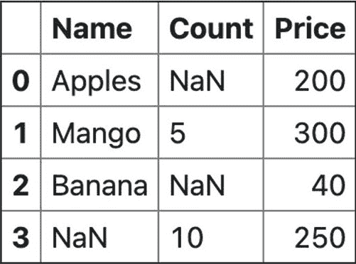

图 4.3 – 带有缺失值的 DataFrame

在填充缺失值方面，我们可以采取两种方法。首先，我们可以用单个值填充所有缺失字段，如下面的代码片段所示：

```js
df_filled = df.fillna({ values: [-99]})
table(df_filled)
```

代码输出如下图所示：

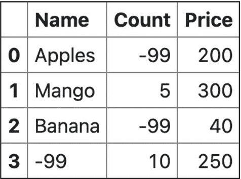

图 4.4 – 用单个值填充 DataFrame 中的所有缺失值

在处理 DataFrame 时，用同一个字段填充所有缺失值的情况并不可取，甚至没有用，因为你必须考虑到不同字段具有不同类型的值，这意味着填充策略会有所不同。

为了处理这种情况，我们可以指定要填充的列及其相应的值的列表，如下所示。

使用前面例子中使用的相同 DataFrame，我们可以指定 `Name` 和 `Count` 列，并用 `Apples` 和 `-99` 值填充它们，如下所示：

```js
data = {"Name":["Apples", "Mango", "Banana", undefined],
            "Count": [NaN, 5, NaN, 10], 
            "Price": [200, 300, 40, 250]}

df = new dfd.DataFrame(data)
df_filled = df.fillna({columns: ["Name", "Count"], values: ["Apples", -99]})
table(df_filled)
```

代码的输出如下图所示：


图 4.5 – 用特定值填充 DataFrame 中的缺失值

注意

在数据分析中，常用填充值如-9、-99 和-999 来表示缺失值。

让我们看看如何在下一节中删除重复项。

## 删除重复项

在处理 Series 或 DataFrame 中的列时，重复字段是常见的情况。例如，看一下以下代码中的 Series：

```js
data = [10, 45, 56, 10, 23, 20, 10, 10]
sf = new dfd.Series(data)
table(sf)
```

代码的输出如下图所示：


图 4.6 – 带有重复字段的 Series

在上图中，你可以看到值 `10` 出现了多次。如果有需要，你可以使用 `drop_duplicates` 函数轻松删除这些重复项。`drop_duplicates` 函数的签名如下：

```js
Series.drop_duplicates({inplace, keep)
```

`drop_duplicates` 函数只有两个参数，第一个参数（`inplace`）非常直观。第二个参数 `keep` 可以用于指定要保留哪个重复项。你可以保留 Series 中的第一个或最后一个重复项。这有助于在删除重复项后保持 Series 中的结构和值的顺序。

让我们看看这个实例。在下面的代码块中，我们正在删除所有重复的值，只保留第一次出现的值：

```js
data1 = [10, 45, 56, 10, 23, 20, 10, 10, 20, 20]
sf = new dfd.Series(data1)
sf_drop = sf.drop_duplicates({keep: "first"})
table(sf_drop)
```

代码的输出如下图所示：

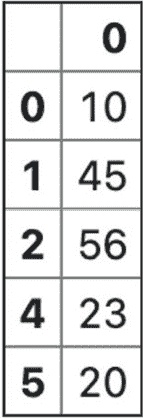

图 4.7 – 在 keep 设置为 first 的情况下删除重复项后的 Series

从前面的输出中，您可以看到保留了重复项的第一个值，而其他值被丢弃。相反，让我们将`keep`参数设置为`last`，并观察字段的顺序变化：

```js
sf_drop = sf.drop_duplicates({keep: "last"})
table(sf_drop)
```

代码的输出如下图所示：

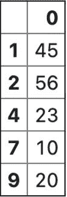

图 4.8 - 在保留最后一个重复项的情况下删除重复项后的 Series

请注意，保留了最后的`10`和`20`重复字段，并且顺序与我们将`keep`设置为`first`时不同。下图将帮助您理解在删除重复项时`keep`参数的含义：


图 4.9 - 当 keep 设置为 first 或 last 时的输出差异

从上图中，您会注意到将`keep`设置为`first`或`last`的主要区别是生成值的顺序。

在下一小节中，我们将使用`map`函数进行数据转换。

## 使用`map`函数进行数据转换

在某些情况下，您可能希望对 Series 或 DataFrame 列中的每个值应用转换。当您有一些自定义函数或映射并希望轻松应用它们到每个字段时，这通常很有用。Danfo.js 提供了一个称为`map`的简单接口，可以在这里使用。让我们看一个例子。

假设我们有一个包含物品及其对应的重量（以克为单位）的 DataFrame，如下面的代码所示：

```js
df = new dfd.DataFrame({'item': ['salt', 'sugar', 'rice', 'apple', 'corn', 'bread'],
'grams': [400, 200, 120, 300, 70.5, 250]})
table(df)
```

代码的输出如下图所示：

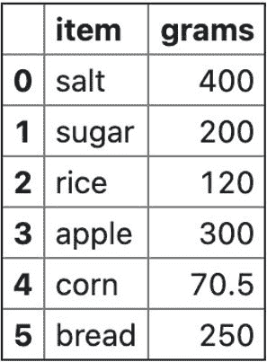

图 4.10 - DataFrame 中物品及其对应的重量（以克为单位）

我们想要创建一个名为`kilograms`的新列，其值是相应的克数，但转换为千克。在这里，我们可以这样做：

1.  创建一个名为`convertToKg`的函数，代码如下：

```js
function convertToKg(gram){
  return gram / 1000
}
```

1.  在`grams`列上调用`map`函数，如下面的代码块所示：

```js
kilograms = df['grams'].map(convertToKg)
```

1.  使用`addColumn`函数将新的`kilograms`列添加到 DataFrame 中，如下面的代码所示：

```js
df.addColumn({ "column": "kilograms", "value": kilograms  });
```

将所有这些放在一起，我们有以下代码：

```js
df = new dfd.DataFrame({'item': ['salt', 'sugar', 'rice', 'apple', 'corn', 'bread'],
'grams': [400, 200, 120, 300, 70.5, 250]})
function convertToKg(gram){
  return gram / 1000
} 
kilograms  = df['grams'].map(convertToKg)
df.addColumn({ "column": "kilograms", "value": kilograms  });
table(df)
```

代码的输出如下图所示：

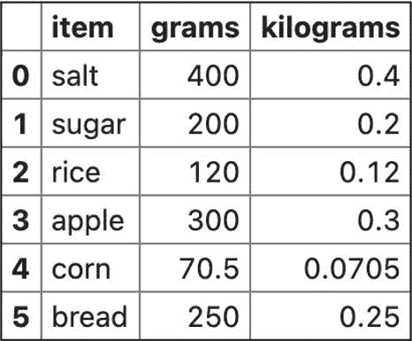

图 4.11 - DataFrame 中物品及其对应的重量（以克为单位）

当您将一个对象与键值对传递给`map`函数时，`map`函数也可以执行一对一的映射。这可用于诸如编码、快速映射等情况。让我们看一个例子。

假设我们有以下 Series：

```js
sf = new dfd.Series([1, 2, 3, 4, 4, 4])
```

在这里，我们想要将每个数字值映射到其对应的名称。我们可以指定一个`mapper`对象并将其传递给`map`函数，如下面的代码所示：

```js
mapper = { 1: "one", 2: "two", 3: "three", 4: "four" }
sf = sf.map(mapper)
table(sf)
```

代码的输出如下图所示：

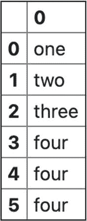

图 4.12 - 数值映射为字符串名称的 Series

`map`函数在处理 Series 时非常有用，但有时您可能希望将函数应用于特定轴（行或列）。在这种情况下，您可以使用另一个 Danfo.js 函数，称为`apply`函数。

在下一节中，我们将介绍`apply`函数。

## 使用`apply`函数进行数据转换

`apply`函数可用于将函数或转换映射到 DataFrame 中的特定轴。它比`map`函数稍微高级和强大，我们将解释原因。

首先是我们可以在指定的轴上应用张量操作的事实。让我们看一个包含以下值的 DataFrame：

```js
data = [[1, 2, 3], [4, 5, 6], [20, 30, 40], [39, 89, 78]]
cols = ["A", "B", "C"]
df = new dfd.DataFrame(data, { columns: cols })
table(df)
```

代码的输出如下图所示：


图 4.13 - 具有三列的示例 DataFrame

现在，我们可以在指定的轴上应用任何兼容的张量操作。例如，在以下代码中，我们可以对 DataFrame 中的每个元素应用`softmax`函数（[`en.wikipedia.org/wiki/Softmax_function`](https://en.wikipedia.org/wiki/Softmax_function)）：

```js
function sum_vals(x) {
    return x.softmax()
}
let df_new = df.apply({axis: 0, callable: sum_vals })
table(df_new)
```

代码的输出如下图所示：


图 4.14-在逐个元素应用 softmax 函数后的 DataFrame

注意

我们将轴设置为`0`以进行逐个元素的张量操作。这是因为一些张量操作无法逐个元素执行。您可以在[`js.tensorflow.org/api/latest/`](https://js.tensorflow.org/api/latest/)上阅读有关支持的操作的更多信息。

让我们看另一个示例，应用一个既可以在列（axis=1）上工作，也可以在行（axis=0）上工作的函数。

我们将使用 TensorFlow 的`sum`函数进行操作，如下面的代码所示。首先，让我们在行轴上应用它：

```js
data = [[1, 2, 3], [4, 5, 6], [20, 30, 40], [39, 89, 78]] 
cols = ["A", "B", "C"] 
df = new dfd.DataFrame(data, { columns: cols })
function sum_vals(x) { 
    return x.sum() 
} 
df_new = df.apply({axis: 0, callable: sum_vals }) 
table(df_new)
```

打印`df_new` DataFrame 的结果如下输出：


图 4.15-在行（0）轴上应用 sum 函数后的 DataFrame

使用与之前相同的 DataFrame，将轴更改为`1`以进行列操作，如下面的代码片段所示：

```js
df_new = df.apply({axis: 1, callable: sum_vals }) 
table(df_new)
```

打印 DataFrame 的结果如下输出：


图 4.16-在列（1）轴上应用 sum 函数后的 DataFrame

自定义 JavaScript 函数也可以与`apply`函数一起使用。这里唯一的注意事项是，您不需要指定轴，因为 JavaScript 函数是逐个元素应用的。

让我们看一个使用 JavaScript 函数的`apply`的示例。在以下代码块中，我们将`toLowerCase`字符串函数应用于 DataFrame 中的每个元素：

```js
data = [{ short_name: ["NG", "GH", "EGY", "SA"] },
             { long_name: ["Nigeria", "Ghana", "Eqypt", "South Africa"] }]
df = new dfd.DataFrame(data)
function lower(x) {
    return '${x}'.toLowerCase()
}
df_new = df.apply({ callable: lower })
table(df_new)
```

打印 DataFrame 的结果如下输出：


图 4.17-在逐个元素应用 JavaScript 函数后的 DataFrame

`apply`函数非常强大，可以用于在 DataFrame 或 Series 上应用自定义转换到列或行。在下一小节中，我们将看一下过滤和查询 DataFrame 和 Series 的不同方法。

## 过滤和查询

当我们需要获取满足特定布尔条件的数据子集时，过滤和查询非常重要。我们将在以下示例中演示如何在 DataFrame 和 Series 上使用`query`方法进行过滤和查询。

假设我们有一个包含以下列的 DataFrame：

```js
data = {"A": [30, 1, 2, 3],
         "B": [34, 4, 5, 6],
         "C": [20, 20, 30, 40]}
cols = ["A", "B", "C"]
df = new dfd.DataFrame(data, { columns: cols })
table(df)
```

打印 DataFrame 的结果如下输出：

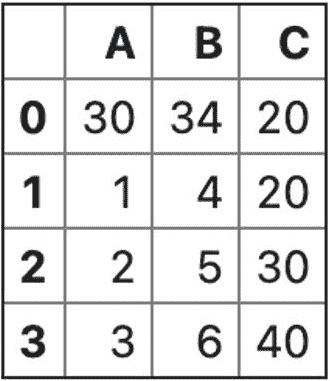

图 4.18-用于查询的示例值的 DataFrame

现在，让我们过滤 DataFrame，并仅返回`B`列的值大于`5`的行。这应该返回行`0`和`3`。我们可以使用`query`函数来实现，如下面的代码所示：

```js
df_filtered = df.query({ column: "B", is: ">", to: 5})
table(df_filtered)
```

这给我们以下输出：


图 4.19-查询后的 DataFrame

`query`方法接受所有 JavaScript 布尔运算符（`>`,`<`,`>=`,`<=`和`==`），并且也适用于字符串列，如下面的示例所示。

首先，让我们创建一个具有字符串列的 DataFrame：

```js
data = {"A": ["Ng", "Yu", "Mo", "Ng"],
            "B": [34, 4, 5, 6], 
            "C": [20, 20, 30, 40]}

df = new dfd.DataFrame(data)
table(df)
```

输出如下图所示：

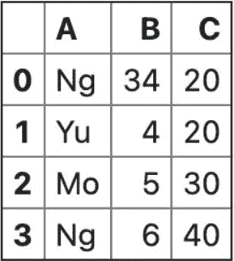

图 4.20-应用字符串查询之前的 DataFrame

接下来，我们将使用等于运算符（`"=="`）运行一个查询：

```js
query_df = df.query({ column: "A", is: "==", to: "Ng"})
table(query_df)
```

这将产生以下输出：


图 4.21 - 应用字符串查询后的数据框

在大多数情况下，您查询的数据框很大，因此可能希望执行就地查询。这可以通过将`inplace`指定为`true`来完成，如下面的代码块所示：

```js
data = {"A": [30, 1, 2, 3],
         "B": [34, 4, 5, 6],
         "C": [20, 20, 30, 40]}

cols = ["A", "B", "C"]
df = new dfd.DataFrame(data, { columns: cols })
df.query({ column: "B", is: "==", to: 5, inplace: true })
table(df)
```

打印数据框的结果如下：


图 4.22 - 执行就地查询后的数据框

`query`方法非常重要，在通过特定属性过滤数据时经常使用它。使用`query`函数的另一个好处是它允许`inplace`功能，这意味着它对于过滤大型数据集非常有用。

在下一个子节中，我们将看看另一个有用的概念，称为随机抽样。

## 随机抽样

从数据框或系列中进行**随机抽样**在需要随机重新排序行时非常有用。这在**机器学习**（**ML**）之前的预处理步骤中非常有用。

让我们看一个使用随机抽样的例子。假设我们有一个包含以下值的数据框：

```js
data = [[1, 2, 3], [4, 5, 6], [20, 30, 40], [39, 89, 78]] 
cols = ["A", "B", "C"] 
df = new dfd.DataFrame(data, { columns: cols }) 
table(df)
```

这导致以下输出：


图 4.23 - 随机抽样前的数据框

现在，让我们通过在数据框上调用`sample`函数来随机选择两行，如下面的代码所示：

```js
async function load_data() {
  let data = {
    Name: ["Apples", "Mango", "Banana", "Pear"],
    Count: [21, 5, 30, 10],
    Price: [200, 300, 40, 250],
  };

  let df = new dfd.DataFrame(data);
  let s_df = await df.sample(2);
  s_df.print();

}
load_data()
```

这导致以下输出：


图 4.24 - 随机抽取两行后的浏览器控制台中的数据框

在上述代码中，您会注意到代码被包装在一个`async`函数中。这是因为`sample`方法返回一个 promise，因此我们必须等待结果。上述代码可以在浏览器或 node.js 环境中按原样执行，但是它需要一点调整才能在 Dnotebook 中工作。

如果您想在 Dnotebook 中运行确切的代码，可以像这样调整它：

```js
var sample;
async function load_data() {
  let data = {
    Name: ["Apples", "Mango", "Banana", "Pear"],
    Count: [21, 5, 30, 10],
    Price: [200, 300, 40, 250],
  };

  let df = new dfd.DataFrame(data);
  let s_df = await df.sample(2);
  sample = s_df

}
load_data()
```

在上述代码中，您可以看到我们明确使用`var`定义了`sample`。这使得`sample`变量对所有单元格都可用。在这里改用`let`声明将使变量仅对定义它的单元格可用。

接下来，在一个新的单元格中，您可以使用`table`方法打印样本数据框，如下面的代码所示：

```js
table(sample)
```

这导致以下输出：

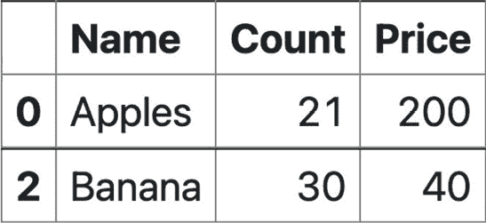

图 4.25 - 在 Dnotebook 中随机抽取两行后的数据框

在下一节中，我们将简要介绍 Danfo.js 中提供的一些编码特性。

## 编码数据框和系列

**编码**是在应用于 ML 或**统计建模**之前可以应用于数据框/系列的另一个重要转换。这是在将数据馈送到模型之前始终执行的重要数据预处理步骤。

ML 或统计模型只能使用数值，因此所有字符串/分类列必须适当地转换为数值形式。有许多类型的编码，例如**独热编码**，**标签编码**，**均值编码**等，选择编码可能会有所不同，这取决于您拥有的数据类型。

Danfo.js 目前支持两种流行的编码方案：*标签*和*独热编码器*，在接下来的部分中，我们将解释如何使用它们。

### 标签编码器

标签编码器将列中的类别映射到列中唯一类别的整数值之间的值。让我们看一个在数据框上使用这个的例子。

假设我们有以下数据框：

```js
data = { fruits: ['pear', 'mango', "pawpaw", "mango", "bean"] ,
            Count: [20, 30, 89, 12, 30],
            Country: ["NG", "NG", "GH", "RU", "RU"]}
df = new dfd.DataFrame(data)
table(df)
```

打印数据框的结果如下：


图 4.26 - 编码前的数据框

现在，让我们使用`LabelEncoder`对`fruits`列进行编码，如下面的代码块所示：

```js
encode = new dfd.LabelEncoder() 
encode.fit(df['fruits']) 
```

在前面的代码块中，您会注意到我们首先创建了一个`LabelEncoder`对象，然后在列（`fruits`）上调用了`fit`方法。`fit`方法简单地学习并存储编码器对象中的映射。稍后可以用它来转换任何列/数组，我们很快就会看到。

调用`fit`方法后，我们必须调用`transform`方法来应用标签，如下面的代码块所示：

```js
sf_enc = encode.transform(df['fruits']) 
table(sf_enc)
```

打印 DataFrame 的结果如下：


图 4.27 - 标签编码前的 DataFrame

从前面的输出中，您可以看到为每个标签分配了唯一的整数。在调用`transform`时，如果列中有一个在`fit`（学习）阶段不可用的新类别，则用值`-1`表示。让我们看一个例子，使用前面示例中的相同编码器：

```js
new_sf = encode.transform(["mango","man", "car", "bean"])
table(new_sf)
```

打印 DataFrame 的结果如下：


图 4.28 - 应用 transform 后的新类别数组的 DataFrame

在前面的示例中，您可以看到我们在一个具有新类别（`man`和`car`）的数组上调用了训练过的编码器。请注意，输出中用`-1`代替了这些新类别，正如我们之前解释的那样。

接下来，让我们谈谈独热编码。

### 独热编码

独热编码主要应用于数据集中的有序类别。在这种编码方案中，使用二进制值`0`（热）和`1`（冷）来编码唯一类别。

使用与前一节相同的 DataFrame，让我们创建一个独热编码器对象，并将其应用于`country`列，如下面的代码块所示：

```js
encode = new dfd.OneHotEncoder()  
encode.fit(df['country']) 
sf_enc = encode.transform(df['country']) 
table(sf_enc)
```

打印 DataFrame 的结果如下：

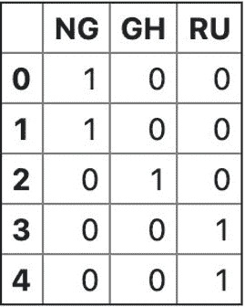

图 4.29 - 应用独热编码后的 DataFrame

从前面的输出中，您可以看到对于每个唯一类别，一系列 1 和 0 被用来替换类别，并且现在我们生成了两列额外的列。以下图表直观地展示了每个唯一类别如何映射到独热编码：


图 4.30 - 三个类别的独热编码映射

Danfo.js 中的最后一个可用编码特性是`get_dummies`函数。这个函数的工作方式与独热编码函数相同，但主要区别在于您可以在整个 DataFrame 上应用它，并且它将自动编码找到的任何分类列。

让我们看一个使用`get_dummies`函数的例子。假设我们有以下 DataFrame：

```js
data = { fruits: ['pear', 'mango', "pawpaw", "mango", "bean"] ,
            count: [20, 30, 89, 12, 30],
            country: ["NG", "NG", "GH", "RU", "RU"]}
df = new dfd.DataFrame(data)
table(df)
```

打印 DataFrame 的结果如下：


图 4.31 - 应用`get_dummies`函数前的 DataFrame

现在，我们可以通过将 DataFrame 传递给`get_dummies`函数一次性编码所有分类列（`fruits`和`country`），如下面的代码块所示：

```js
df_enc = dfd.get_dummies({data: df})
table(df_enc)
```

打印 DataFrame 的结果如下：


图 4.32 - 三个类别的独热编码映射

从前面的图中，您可以看到`get_dummies`函数自动检测到了`fruits`和`country`分类变量，并对它们进行了独热编码。列是自动生成的，它们的名称以相应的列和类别开头。

注意

您可以指定要编码的列，以及为每个编码列命名前缀。要了解更多可用选项，请参考官方 Danfo.js 文档：[`danfo.jsdata.org/`](https://danfo.jsdata.org/)。

在下一节中，我们将看看组合数据集的各种方法。

# 组合数据集

数据框和序列可以使用 Danfo.js 中的内置函数进行组合。存在诸如`danfo.merge`和`danfo.concat`之类的方法，根据配置的不同，可以帮助您使用熟悉的类似数据库的连接方式以不同形式组合数据集。

在本节中，我们将简要讨论这些连接类型，从`merge`函数开始。

## 数据框合并

`merge`操作类似于数据库中的`Join`操作，它在对象中执行列或索引的连接操作。`merge`操作的签名如下：

```js
danfo.merge({left, right, on, how}) 
```

让我们了解每个参数的含义：

+   `left`：要合并到左侧的数据框/序列。

+   `right`：要合并到右侧的数据框/序列。

+   `on`：要连接的列的名称。这些列必须在左侧和右侧的数据框中都找到。

+   `how`：`how`参数指定如何执行合并。它类似于数据库风格的连接，可以是`left`、`right`、`outer`或`inner`。

Danfo.js 的`merge`函数与 pandas 的`merge`函数非常相似，因为它执行类似于关系数据库连接的内存中连接操作。以下表格提供了 Danfo 的合并方法和 SQL 连接的比较：

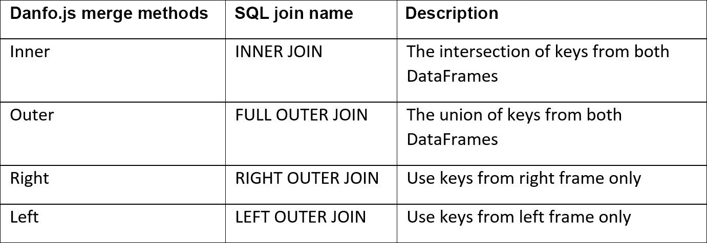

图 4.33 – 比较 Danfo.js 合并方法和 SQL 连接（来源：pandas 文档：https://pandas.pydata.org/pandas-docs/stable/user_guide/merging.html#brief-primer-on-merge-methods-relational-algebra）

在接下来的几节中，我们将提供一些示例，帮助您了解何时以及如何使用`merge`函数。

### 通过单个键进行内部合并

在单个共同键上合并数据框默认会导致内连接。内连接要求两个数据框具有匹配的列值，并返回两者的交集；也就是说，它返回一个只包含具有共同特征的行的数据框。

假设我们有两个数据框，如下所示：

```js
data = [['K0', 'k0', 'A0', 'B0'], ['k0', 'K1', 'A1', 'B1'],
            ['K1', 'K0', 'A2', 'B2'], ['K2', 'K2', 'A3', 'B3']]
data2 = [['K0', 'k0', 'C0', 'D0'], ['K1', 'K0', 'C1', 'D1'],
            ['K1', 'K0', 'C2', 'D2'], ['K2', 'K0', 'C3', 'D3']]
colum1 = ['Key1', 'Key2', 'A', 'B']
colum2 = ['Key1', 'Key2', 'A', 'D']

df1 = new dfd.DataFrame(data, { columns: colum1 })
df2 = new dfd.DataFrame(data2, { columns: colum2 })
table(df1)
```

打印第一个数据框的结果如下：

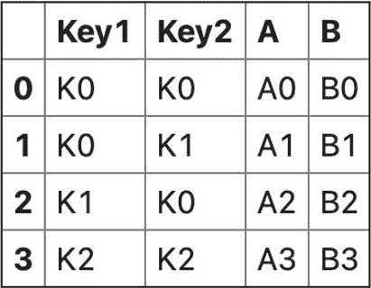

图 4.34 – 执行合并操作的第一个数据框

现在我们将打印第二个数据框，如下所示：

```js
table(df2)
```

这将导致以下输出：


图 4.35 – 执行合并操作的第二个数据框

接下来，我们将执行内连接，如下面的代码所示：

```js
merge_df = dfd.merge({left: df1, right: df2, on: ["Key1"]})
table(merge_df)
```

打印数据框的结果如下：


图 4.36 – 在单个键上对两个数据框进行内部合并

从前面的输出中，您可以看到在`Key1`上的内连接导致了一个包含来自数据框 1 和数据框 2 的所有值的数据框。这也被称为两个数据框的**笛卡尔积**。

我们可以进一步合并多个键。我们将在下一节中讨论这个问题。

### 在两个键上进行内部合并

在两个键上执行内部合并还将返回两个数据框的交集，但它只会返回在数据框的左侧和右侧都找到的键的行。

使用我们之前创建的相同数据框，我们可以在两个键上执行内部连接，如下所示：

```js
merge_mult_df = dfd.merge({left: df1, right: df2, on: ["Key1", "Key2"]})
table(merge_mult_df)
```

打印数据框的结果如下：


图 4.37 – 在两个键上进行内部合并

从前面的输出中，您可以看到在两个键上执行内部合并会导致一个只包含在数据框的左侧和右侧中都存在的键的数据框。

### 通过单个键进行外部合并

外部合并，正如我们在前面的表中所看到的，执行两个数据框的并集。也就是说，它返回在两个数据框中都存在的键的值。在单个键上执行外部连接将返回与在单个键上执行内部连接相同的结果。

使用前面的相同数据框，我们可以指定`how`参数来将合并行为从其默认的`inner`连接更改为`outer`，如下面的代码所示：

```js
merge_df = dfd.merge({ left: df1, right: df2, on: ["Key1"], how: "outer"})
table(merge_df)
```

打印数据框的结果如下：

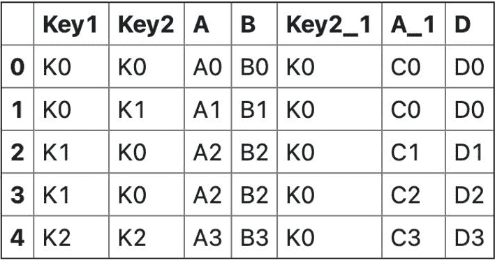

图 4.38 - 两个数据框在单个键上的外部合并

从前面的图表中，您可以看到具有键（`K0`，`K0`，`K1`，`K2`）的第一个数据框和具有键（`K0`，`K1`，`K1`，`K2`）的第二个数据框的并集是（`K0`，`K0`，`K1`，`K1`，`K2`）。然后使用这些键来对数据框进行并集操作。在这样做之后，我们收到了前面表格中显示的结果。

我们还可以在两个键上执行外部连接。这将与在两个键上执行内部连接不同，正如我们将在以下子节中看到的。

### 在两个键上的外部合并

仍然使用前面的相同数据框，我们可以添加第二个键，如下面的代码所示：

```js
merge_df = dfd.merge({ left: df1, right: df2, on: ["Key1", "Key2"], how: "outer"})
table(merge_df)
```

打印数据框的结果如下：

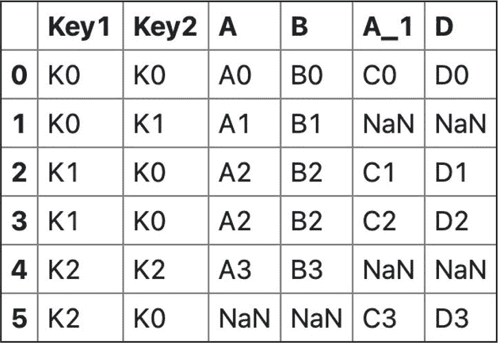

图 4.39 - 两个数据框在两个键上的外部合并

在前面的输出中，我们可以看到返回的行始终具有`Key1`和`Key2`中的键。如果第一个数据框中存在的键不在第二个数据框中，则值始终填充为`NaN`。

注意

在 Danfo.js 中进行合并不支持一次在两个以上的键上进行合并。这可能会在将来发生变化，因此，如果您需要支持这样的功能，请务必查看官方 Danfo.js GitHub 存储库的*讨论*部分（[`github.com/opensource9ja/danfojs`](https://github.com/opensource9ja/danfojs)）。

在接下来的几节中，我们将简要介绍左连接和右连接，这在执行合并时也很重要。

### 右连接和左连接

右连接和左连接非常简单；它们只返回具有指定`how`参数中存在的键的行。例如，假设我们将`how`参数指定为`right`，如下面的代码所示：

```js
merge_df = dfd.merge({ left: df1, right: df2, on: ["Key1", "Key2"], how: "right"})
table(merge_df)
```

打印数据框的结果如下：


图 4.40 - 两个数据框在两个键上的右连接

结果图表仅显示了右侧数据框中存在的键的行。这意味着在执行合并时，右侧数据框被赋予了更高的优先级。

如果我们将`how`设置为`left`，那么左侧数据框将更偏好，并且我们只会看到键存在于左侧数据框中的行。下面的代码显示了执行`left`连接的示例：

```js
merge_df = dfd.merge({ left: df1, right: df2, on: ["Key1", "Key2"], how: "left"})
table(merge_df)
```

打印数据框的结果如下：


图 4.41 - 两个数据框在两个键上的左连接

从前面的输出中，我们可以确认结果行更偏向于左侧数据框。

Danfo.js 的`merge`函数非常强大和有用，在开始使用具有重叠键的多个数据集时会派上用场。在下一节中，我们将介绍另一个有用的函数，称为**连接**，用于转换数据集。

## 数据连接

连接数据是另一种重要的数据组合技术，正如其名称所示，这基本上是沿着一个轴连接、堆叠或排列数据。

在 Danfo.js 中用于连接数据的函数被公开为`danfo.concat`，该函数的签名如下：

```js
danfo.concat({df_list, axis}) 
```

让我们了解每个参数代表什么：

+   `df_list`：`df_list`参数是要连接的 DataFrames 或 Series 的数组。

+   `axis`：`axis`参数可以接受行（0）或列（1），并指定对象将对齐的轴。

接下来，我们将介绍一些示例，这些示例将帮助您了解如何使用`concat`函数。首先，我们将学习如何沿行轴连接三个 DataFrames。

### 沿行轴（0）连接 DataFrames

首先，让我们创建三个 DataFrames，如下面的代码所示：

```js
df1 = new dfd.DataFrame( 
    { 
           "A": ["A_0", "A_1", "A_2", "A_3"], 
           "B": ["B_0", "B_1", "B_2", "B_3"], 
           "C": ["C_0", "C_1", "C_2", "C_3"] 
        },
        index=[0, 1, 2], 
  ) 
df2 = new dfd.DataFrame( 
       { 
          "A": ["A_4", "A_5", "A_6", "A_7"], 
          "B": ["B_4", "B_5", "B_6", "B_7"], 
          "C": ["C_4", "C_5", "C_6", "C_7"], 
       }, 
       index=[4, 5, 6], 
    ) 
df3 = new dfd.DataFrame( 
    { 
          "A": ["A_8", "A_9", "A_10", "A_11"], 
           "B": ["B_8", "B_9", "B_10", "B_11"], 
           "C": ["C_8", "C_9", "C_10", "C_11"]
       }, 
       index=[8, 9, 10], 
   )
table(df1)
table(df2)
table(df3)
```

使用 Node.js 和浏览器中的`print`函数或 Dnotebook 中的`table`函数打印每个 DataFrame，将给我们以下输出。

`df1` DataFrame 的输出如下：


图 4.42 - 要连接的第一个 DataFrame（df1）

`df2` DataFrame 的输出如下：


图 4.43 - 要连接的第二个 DataFrame（df2）

最后，`df3` DataFrame 的输出如下：


图 4.44 - 要连接的第三个 DataFrame（df3）

现在，让我们使用`concat`函数组合这些 DataFrames，如下面的代码所示：

```js
df_frames = [df1, df2, df3]
combined_df = dfd.concat({df_list: df_frames, axis: 0})
table(combined_df)
```

这导致以下输出：


图 4.45 - 沿行轴（0）连接三个 DataFrames 的结果

在这里，您可以看到`concat`函数简单地沿列轴组合每个 DataFrame（`df1`，`df2`，`df3`）；也就是说，它们在`df_list`中第一个 DataFrame 的下方堆叠，以创建一个巨大的组合。

此外，索引看起来不同。这是因为在内部，Danfo.js 为组合生成了新的索引。如果您需要数字索引，那么可以使用`reset_index`函数，如下面的代码所示：

```js
combined_df.reset_index(true)
table(combined_df)
```

这导致以下输出：

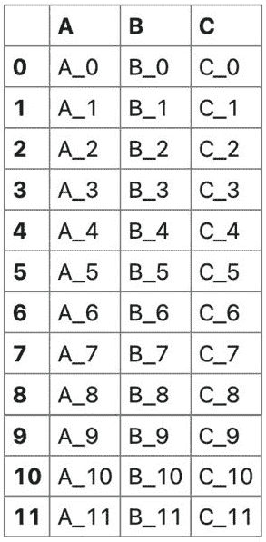

图 4.46 - 重置组合 DataFrames 的索引

现在，使用相同的 DataFrames 进行沿列轴的连接会是什么样子？我们将在下一节中尝试这个。

### 沿列轴（1）连接 DataFrames

使用我们之前创建的相同 DataFrames，只需在`concat`代码中将`axis`更改为`1`，如下面的代码所示：

```js
df_frames = [df1, df2, df3]
combined_df = dfd.concat({df_list: df_frames, axis: 1})
table(combined_df)
```

打印 DataFrame 的结果如下：


图 4.47 - 沿列轴（0）应用 concat 到三个 DataFrames 的结果

连接也适用于 Series 对象。我们将在下一节中看一个例子。

### 沿指定轴连接 Series

Series 也是 Danfo.js 数据结构，因此`concat`函数也可以在它们上面使用。这与连接 DataFrames 的方式相同，我们很快将进行演示。

使用上一节的 DataFrames，我们将创建一些 Series 对象，如下面的代码所示：

```js
series_list = [df1['A'], df2['B'], df3['D']]
```

请注意，我们正在使用 DataFrame 子集来从 DataFrames 中抓取不同的列作为 Series。现在，我们可以将这些 Series 组合成一个数组，然后将其传递给`concat`函数，如下面的代码所示：

```js
series_list = [df1['A'], df2['B'], df3['D']]
combined_series = dfd.concat({df_list: series_list, axis: 1})
table(combined_series)
```

打印 DataFrame 的结果如下：


图 4.48 - 沿行轴（0）应用 concat 到三个 Series 的结果

将轴更改为行（0）也可以工作，并返回一个有很多缺失条目的 DataFrame，如下图所示：

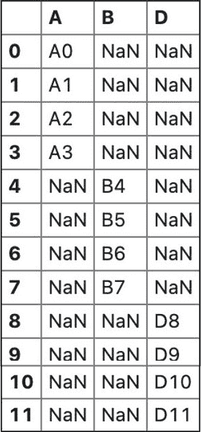

图 4.49 - 沿列轴（1）应用 concat 到三个 Series 的结果

现在，您可能想知道为什么在生成的组合中有很多缺失的字段。这是因为当对象沿指定轴组合时，有时对象的位置/长度与第一个 DataFrame 不对齐。使用`NaN`进行填充以返回一致的长度。

在本小节中，我们介绍了两个重要的函数（`merge`和`concat`），它们可以帮助您对 DataFrame 或 Series 执行复杂的组合。在下一节中，我们将讨论另一种不同但同样重要的内容，即**字符串/文本操作**。

# Series 数据访问器

Danfo.js 在各种访问器下提供了特定于数据类型的方法。**访问器**是 Series 对象内的命名空间，只能应用/调用特定数据类型。目前为字符串和日期时间 Series 提供了两个访问器，在本节中，我们将讨论每个访问器并提供一些示例以便理解。

### 字符串访问器

DataFrame 中的字符串列或具有`dtype`字符串的 Series 可以在`str`访问器下访问。在这样的对象上调用`str`访问器会暴露出许多用于操作数据的字符串函数。我们将在本节中提供一些示例。

假设我们有一个包含以下字段的 Series：

```js
data = ['lower boy', 'capitals', 'sentence', 'swApCaSe']
sf = new dfd.Series(data)
table(sf)
```

打印此 Series 的结果如下图所示：


图 4.50 - 沿列轴（1）将三个 Series 应用 concat 的结果

从前面的输出中，我们可以看到 Series（`sf`）包含文本，并且是字符串类型。您可以使用`dtype`函数来确认这一点，如下面的代码所示：

```js
console.log(sf.dtype)
```

输出如下：

```js
string
```

现在我们有了我们的 Series，它是字符串数据类型，我们可以在其上调用`str`访问器，并使用各种 JavaScript 字符串方法，如`capitalize`、`split`、`len`、`join`、`trim`、`substring`、`slice`、`replace`等，如下例所示。

以下代码将`capitalize`函数应用于 Series：

```js
mod_sf = sf.str.capitalize() 
table(mod_sf)
```

打印此 Series 的结果如下：


图 4.51 - 将 capitalize 函数应用于字符串 Series 的结果

以下代码将`substring`函数应用于 Series：

```js
mod_sf = sf.str.substring(0,3) //returns a substring by start and end index
table(mod_sf)
```

打印此 Series 的结果如下：


图 4.52 - 将 substring 函数应用于字符串 Series 的结果

以下代码将`replace`函数应用于 Series：

```js
mod_sf = sf.str.replace("lower", "002") //replaces a string with specified value
table(mod_sf)
```

打印此 Series 的结果如下：


图 4.53 - 将 replace 函数应用于字符串 Series 的结果

以下代码将`join`函数应用于 Series：

```js
mod_sf = sf.str.join("7777", "+") // joins specified value to Series
table(mod_sf)
```

打印此 Series 的结果如下图所示：


图 4.54 - 将 join 函数应用于字符串 Series 的结果

以下代码将`indexOf`函数应用于 Series：

```js
mod_sf = sf.str.indexOf("r") //Returns the index where the value is found else -1
table(mod_sf)
```

打印此 Series 的结果如下：

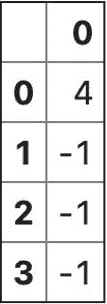

图 4.55 - 将 indexOf 函数应用于字符串 Series 的结果

注意

`str`访问器提供了许多公开的字符串方法。您可以在 Danfo.js 文档中的完整列表中查看（[`danfo.jsdata.org/api-reference/series#string-handling`](https://danfo.jsdata.org/api-reference/series#string-handling)）。

### 日期时间访问器

Danfo.js 在系列对象上公开的第二个访问器是日期时间访问器。这可以在`dt`命名空间下访问。从日期时间列中处理和提取不同的信息，如日期、月份和年份，是进行数据转换时的常见过程，因为日期时间的原始格式几乎没有用处。

如果您的数据有一个日期时间列，则可以在其上调用`dt`访问器，这将公开各种函数，可用于提取信息，如年份、月份、月份名称、星期几、小时、秒和一天中的分钟数。

让我们看一些在具有日期列的系列上使用`dt`访问器的示例。首先，我们将创建一个具有一些日期时间字段的系列：

```js
timeColumn = ['12/13/2016 15:00:20', '10/20/2019 18:30:00', '1/1/2020 12:00:00', '1/30/2020 16:20:00', '11/12/2019 22:00:30'] 
sf = new dfd.Series(timeColumn, {columns: ["times"]})
table(sf)
```

打印此系列的结果如下：

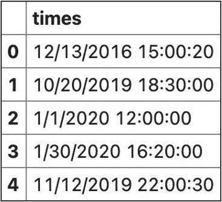

图 4.56 - 具有日期时间字段的系列

现在我们有了一个具有日期字段的系列，我们可以提取一些信息，例如一天中的小时数、年份、月份或星期几。我们需要做的第一件事是使用`dt`访问器将系列转换为 Danfo.js 的日期时间格式，如下面的代码所示：

```js
dateTime = sf['times'].dt  
```

`dateTime`变量现在公开了不同的方法来提取日期信息。利用这一点，我们可以做以下任何一项：

+   获取一天中的小时作为新系列：

```js
dateTime = sf.dt 
hours = dateTime.hour()
table(hours)
```

这给我们以下输出：


图 4.57 - 显示提取的一天中的小时的新系列

+   获取年份作为新系列：

```js
dateTime = sf.dt 
years = dateTime.year()
table(years)
```

这给我们以下输出：

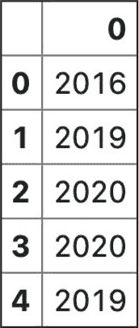

图 4.58 - 显示提取的年份的新系列

+   获取月份作为新系列：

```js
dateTime = sf.dt 
month_name = dateTime.month_name()
table(month_name)
```

这给我们以下输出：


图 4.59 - 显示提取的月份名称的新系列

+   获取星期几作为新系列：

```js
dateTime = sf.dt  
weekdays = dateTime.weekdays() 
table(weekdays)
```

这给我们以下输出：


图 4.60 - 显示提取的星期几的新系列

`dt`访问器公开的一些其他函数如下：

+   `Series.dt.month`：这将返回一个整数月份，从 1（一月）到 12（十二月）。

+   `Series.dt.day`：这将返回一周中的天数作为整数，从 0（星期一）到 6（星期日）。

+   `Series.dt.minutes`：这将返回一天中的分钟数作为整数。

+   `Series.dt.seconds`：这将返回一天中的秒数作为整数。

恭喜您完成了本节！数据转换和聚合是数据分析的非常重要的方面。有了这些知识，您可以正确地转换和整理数据集。

在下一节中，我们将向您展示如何使用 Danfo.js 对数据集进行描述性统计。

# 计算统计数据

Danfo.js 带有一些重要的统计和数学函数。这些函数可以用于生成整个数据框或单个系列的摘要或描述性统计。在数据集中，统计数据很重要，因为它们可以为我们提供更好的数据洞察。

在接下来的几节中，我们将使用流行的泰坦尼克号数据集，您可以从以下 GitHub 存储库下载：[`github.com/PacktPublishing/Building-Data-Driven-Applications-with-Danfo.js/blob/main/Chapter03/data/titanic.csv`](https://github.com/PacktPublishing/Building-Data-Driven-Applications-with-Danfo.js/blob/main/Chapter03/data/titanic.csv)。

首先，让我们使用`read_csv`函数将数据集加载到 Dnotebook 中，如下面的代码所示：

```js
var df //using var so df is available to all cells
load_csv("https://raw.githubusercontent.com/plotly/datasets/master/finance-charts-apple.csv")
.then((data)=>{
  df = data
})
```

上述代码从指定的 URL 加载泰坦尼克号数据集，并将其保留在`df`变量中。

注意

我们在这里使用`load_csv`和`var`声明，因为我们在 Dnotebook 中工作。正如我们一直提到的，你不会在浏览器或 Node.js 脚本中使用这种方法。

现在，在一个新的单元格中，我们可以打印加载数据集的头部：

```js
table(df.head())
```

打印 DataFrame 的结果如下：


图 4.61 - 泰坦尼克号数据集的前五行

我们可以对整个数据调用`describe`函数，快速获取所有列的描述统计信息，如下面的代码所示：

```js
table(df.describe())
```

打印 DataFrame 的结果如下：


图 4.62 - 在泰坦尼克号数据集上使用 describe 函数的输出

在上面的代码中，我们调用了`describe`函数，然后用`table`打印了输出。`describe`函数只适用于数值数据类型，并且默认情况下只会自动选择`float32`或`int32`类型的列。

注意

默认情况下，在进行计算之前，所有的统计和数学计算都会删除`NaN`值。

`describe`函数提供了以下内容的描述性统计信息：

+   `NaN`值。

+   **均值**：一列中的平均值。

+   **标准差**（**std**）：一组值的变化或离散程度的度量。

+   **最小值**（**min**）：一列中的最小值。

+   **中位数**：一列中的中间值。

+   **最大值**（**max**）：一列中的最大值。

+   **方差**：值从平均值的传播程度的度量。

## 按轴计算统计信息

`describe`函数虽然快速且易于应用，但在需要沿特定轴计算统计信息时并不是很有帮助。在本节中，我们将介绍一些最流行的方法，并向您展示如何根据指定的轴计算统计信息。

可以在指定轴上对 DataFrame 调用诸如均值、众数和中位数等中心趋势。这里，轴`0`代表`行`，而轴`1`代表`列`。

在下面的代码中，我们正在计算泰坦尼克号数据集中数值列的均值、众数和中位数：

```js
df_nums = df.select_dtypes(['float32', "int32"]) //select all numeric dtype columns
console.log(df_nums.columns)
[AAPL.Open,AAPL.High,AAPL.Low,AAPL.Close,AAPL.Volume,AAPL.Adjusted,dn,mavg,up]
```

在上面的代码中，我们选择了所有的数值列，以便可以应用数学运算。接下来，我们将调用`mean`函数，默认情况下返回列轴（`1`）上的均值：

```js
col_mean = df_nums.mean()
table(col_mean)
```

打印 DataFrame 的结果如下：

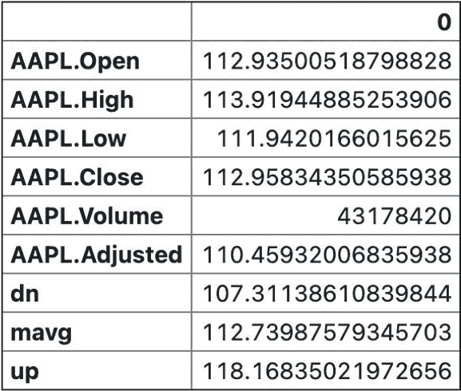

图 4.63 - 在数值列上调用均值函数

前面输出中显示的精度看起来有点太长了。我们可以将结果四舍五入到两位小数，使其更具可呈现性，如下面的代码所示：

```js
col_mean = df_nums.mean().round(2)
table(col_mean)
```

打印 DataFrame 的结果如下：


图 4.64 - 在数值列上调用均值函数并将值四舍五入到两位小数

将结果四舍五入到两位小数后，输出看起来更清晰。接下来，让我们计算沿着行轴的`mean`：

```js
row_mean = df_nums.mean(axis=0)
table(row_mean)
```

这给我们以下输出：


图 4.65 - 在行轴上调用均值函数

在上面的输出中，您可以看到返回的值具有数值标签。这是因为行轴最初具有数值标签。

使用相同的思路，我们可以计算众数、中位数、标准差、方差、累积和、累积均值、绝对值等统计信息。以下是 Danfo.js 当前可用的统计函数：

+   `abs`：返回每个元素的绝对数值的 Series/DataFrame。

+   `count`：计算每列或每行的单元格数，不包括`NaN`值。

+   `cummax`：返回 DataFrame 或 Series 的累积最大值。

+   `cummin`：返回 DataFrame 或 Series 的累积最小值。

+   `cumprod`：返回 DataFrame 或 Series 的累积乘积。

+   `cumsum`：返回 DataFrame 或 Series 的累积和。

+   `describe`：生成描述性统计。

+   `max`：返回所请求轴的最大值。

+   `mean`：返回所请求轴的平均值。

+   `median`：返回所请求轴的中位数。

+   `min`：返回所请求轴的最小值。

+   `mode`：返回沿所选轴的元素的众数。

+   `sum`：返回所请求轴的值的总和。

+   `std`：返回所请求轴的标准偏差。

+   `var`：返回所请求轴的无偏方差。

+   `nunique`：计算所请求轴上的不同元素的数量。

注意

支持的函数列表可能会发生变化，并且会添加新的函数。因此，最好通过查看[`danfo.jsdata.org/api-reference/dataframe#computations-descriptive-stats`](https://danfo.jsdata.org/api-reference/dataframe#computations-descriptive-stats)来跟踪新的函数。

描述性统计非常重要，在本节中，我们成功介绍了一些重要的函数，这些函数可以帮助您在 Danfo.js 中有效地基于指定轴计算统计数据。

# 摘要

在本章中，我们成功介绍了 Danfo.js 中可用的数据转换和整理函数。首先，我们向您介绍了用于替换值、填充缺失值和检测缺失值的各种整理函数，以及应用和映射方法，用于将自定义函数应用于数据集。掌握这些函数和技术可以确保您具有构建数据驱动产品所需的基础，以及从数据中获取见解的能力。

接下来，我们向您展示了如何在 Danfo.js 中使用各种合并和连接函数。最后，我们向您展示了如何对数据集进行描述性统计。

在下一章中，我们将进一步介绍如何使用 Danfo.js 的内置绘图功能以及集成第三方绘图库来制作美丽而惊人的图表/图形。
