# 第六章：使用 Plotly.js 进行数据可视化

绘图和可视化是数据分析中非常重要的任务，因此我们将一个完整的章节来专门讨论它们。数据分析师通常会在**探索性数据分析**（**EDA**）阶段执行绘图和数据可视化。这可以极大地帮助识别数据中隐藏的有用模式，并建立数据建模的直觉。

在本章中，您将学习如何使用**Plotly.js**创建丰富和交互式的图表，这些图表可以嵌入到任何 Web 应用程序中。

具体来说，我们将涵盖以下主题：

+   关于 Plotly.js 的简要介绍

+   Plotly.js 的基础知识

+   使用 Plotly.js 创建基本图表

+   使用 Plotly.js 创建统计图表

# 技术要求

为了跟上本章的内容，您应该具备以下条件：

+   现代浏览器，如 Chrome、Safari、Opera 或 Firefox

+   **Node.js**和可选地，安装在您系统上的**Danfo Notebook**（**Dnotebook**）

+   稳定的互联网连接以下载数据集

有关 Dnotebook 的安装说明，请参见*第二章*，*Dnotebook - 用于 JavaScript 的交互式计算环境*。

注意

如果您不想安装任何软件或库，可以在[`playnotebook.jsdata.org/`](https://playnotebook.jsdata.org/)上使用 Dnotebook 的在线版本。

**Danfo.js**带有一个用于轻松制作图表的绘图**应用程序编程接口**（**API**），在幕后，它使用 Plotly。这是我们在本章介绍 Plotly.js 的主要原因，因为在这里获得的知识将帮助您轻松定制下一章中使用 Danfo.js 创建的图表。

# 关于 Plotly.js 的简要介绍

Plotly.js ([`plotly.com/javascript/`](https://plotly.com/javascript/))，根据作者的说法，是一个建立在流行的 D3.js ([`d3js.org/`](https://d3js.org/))和 stack.gl ([`github.com/stackgl`](https://github.com/stackgl))库之上的开源、高级、声明性图表库。

它支持超过 40 种图表类型，包括以下类型：

+   基本图表，如散点图、线图、条形图和饼图

+   统计图表，如箱线图、直方图和密度图

+   科学图表，如热图、对数图和等高线图

+   金融图表，如瀑布图、蜡烛图和时间序列图

+   地图，如气泡图、区域图和 Mapbox 地图

+   **三维**（**3D**）散点图和曲面图，以及 3D 网格

要使用 Plotly.js，您需要访问浏览器的`React`和`Vue`。在下一节中，我们将看到如何安装 Plotly.js。

## 通过`script`标签使用 Plotly.js

为了在`script`标签中使用 Plotly.js。在下面的代码片段中，我们将在简单的 HTML 文件的头部添加 Plotly.js 的`script`标签：

```js
<!DOCTYPE html>
<html lang="en">
<head>
    <meta charset="UTF-8">
    <meta http-equiv="X-UA-Compatible" content="IE=edge">
    <meta name="viewport" content="width=device-width, initial-scale=1.0">
    <title>Document</title>
    <script src="img/plotly-1.2.0.min.js"></script> 
</head>
<body>

</body>
</html>
```

一旦您按照上面的代码片段添加了 Plotly.js 的`script`标签，保存 HTML 文件并在浏览器中打开它。输出将是一个空白页面，但在幕后，Plotly.js 被添加并在页面中可用。我们可以通过按照这里的步骤制作一个简单的图表来测试这一点：

1.  在 HTML 主体中创建一个`div`标签，图表将在其中绘制。我们将给这个一个`myPlot`，如下所示：

```js
<body>
 <div id="myPlot">
</body
```

1.  在您的 HTML 页面中，创建样本`x`和`y`数据，然后绘制`scatter`图，如下面的代码片段所示：

```js
...
<body>
    <div id="myPlot"></div>
    <script>
        let data = [{
            x: [1, 3, 5, 6, 8, 9, 5, 8],
            y: [2, 4, 6, 8, 0, 2, 1, 2],
            mode: 'markers',
            type: 'scatter'
        }]
        Plotly.newPlot("myPlot", data)
    </script>
</body>
...
```

在浏览器中打开 HTML 文件将给出以下输出：


图 5.1 - 使用 Plotly 制作的简单散点图

在 Dnotebook 中，我们将在本章中经常使用，您可以通过首先在顶部单元格中使用`load_package`函数加载并使用 Plotly，如下面的代码片段所示：

```js
load_package(["https://cdn.plot.ly/plotly-1.58.4.min.js"])
```

然后，在一个新的单元格中，您可以添加以下代码：

```js
let data = [{
  x: [1,3,5,6,8,9,5,8],
  y: [2,4,6,8,0,2,1,2],
  mode: 'markers',
  type: 'scatter'
}]

Plotly.newPlot(this_div(), data)
```

运行上述代码单元将给出以下输出：

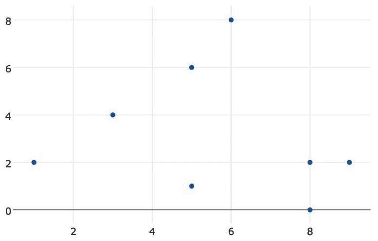

图 5.2 - 在 Dnotebook 上使用 Plotly 制作的简单散点图

您可以看到，前面部分的代码与 HTML 版本相同，只有一个细微的区别 - 将`this_div`函数传递给`Plotly.newPlot`。

`this_div`函数只是一个 Dnotebook 的辅助函数，它创建并返回代码单元块下方的`div`标签的 ID。这意味着每当您在 Dnotebook 中处理图表时，都可以使用`this_div`函数获取`div`标签。

注意

接下来，我们将使用`this_div`而不是指定`div`标签 ID。这是因为我们将主要在 Dnotebook 环境中工作。要在 HTML 或其他`this_div`中使用代码，将`this_div`指定为要使用的`div`标签的 ID。

现在您知道如何安装 Plotly，我们将继续下一节，关于创建基本图表。

# Plotly.js 的基础知识

使用 Plotly.js 的一个主要优势是它很容易上手，并且有很多配置可以指定，使您的图表更好。在本节中，我们将介绍一些重要的可用配置选项，并向您展示如何指定这些选项。

在我们继续之前，让我们了解如何将数据传递给 Plotly。

## 数据格式

要创建`x`和`y`键，如下面的代码示例所示：

```js
const trace1 = { 
  x: [20, 30, 40],
  y: [2, 4, 6]
}
```

注意

在 Plotly 中，数据点通常称为**trace**。这是因为您可以在单个图表中绘制多个数据点。这里提供了一个示例：

`var data = [trace1, trace2]`

`Plotly.newPlot("my_div", data);`

`x`和`y`数组可以包含字符串和数字数据。如果它们包含字符串数据，数据点将按原样绘制，即逐点。这是一个例子：

```js
var trace1 = {
    x:['2020-10-04', '2021-11-04', '2023-12-04'],
    y: ["cat", "goat", "pig"],
    type: 'scatter'
};
Plotly.newPlot(this_div(),  trace1);
```

运行上述代码单元将产生以下输出：

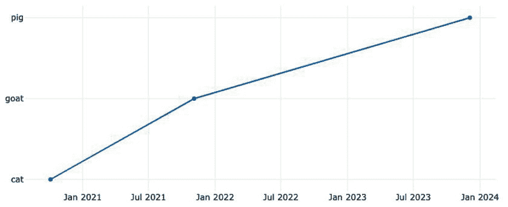

图 5.3 - 使用 Plotly 绘制日期与字符串值的图表

另一方面，如果您的数据是数字的，Plotly 将自动排序，然后选择默认比例。看下面的例子：

```js
var trace1 = {
    x: ['2020-10-04', '2021-11-04', '2023-12-04'],
    y: [90, 20, 10],
    type: 'scatter'
};
var data = [trace1];
Plotly.newPlot(this_div(), data);
```

运行上述代码单元将产生以下输出：


图 5.4 - 使用 Plotly 绘制日期与数值的图表

在我们进入配置部分之前，让我们看一个在同一图表中绘制多个轨迹的示例。首先，我们设置我们的数据，如下面的代码片段所示：

```js
var trace1 = {
    x:['2020-10-04', '2021-11-04', '2023-12-04'],
    y: [90, 20, 10],
    type: 'scatter'
};
var trace2 = {
    x: ['2020-10-04', '2021-11-04', '2023-12-04'],
    y: [25, 35, 65],
    mode: 'markers',
    marker: {
        size: [20, 20, 20],
    }
};
var data = [trace1, trace2];
Plotly.newPlot(this_div(), data);
```

运行上述代码单元将产生以下输出：


图 5.5 - 多个轨迹共享相同的 x 轴的图表

注意

在单个图表中绘制多个轨迹时，建议轨迹共享一个公共轴。这样可以使您的图表更易于阅读。

如果您想知道是否可以向数据数组添加更多轨迹，答案是肯定的 - 您可以添加任意数量的轨迹，但必须考虑可解释性，因为添加更多轨迹可能不容易解释。

现在您知道如何将数据传递到图表中，让我们了解一些基本的配置选项，您可以在制作图表时传递给 Plotly。

## 图表的配置选项

配置可以用于设置图表的交互性和模式栏等属性。配置是一个对象，通常作为`Plotly.newPlot`调用的最后一个参数传递，如下面的代码片段所示：

```js
config = { … }
Plotly.newPlot("my_div", data, layout, config)
```

在接下来的几节中，我们将介绍一些常见的配置选项，这些选项将在*第八章*中使用，*创建一个无代码数据分析/处理系统*。如果您想知道有哪些可用的配置选项，可以在这里阅读更多信息：[`plotly.com/javascript/configuration-options/`](https://plotly.com/javascript/configuration-options/)。

### 配置模式栏

**模式栏**是一个水平工具栏，提供了许多选项，可用于与图表进行交互。默认情况下，只有在悬停在图表上时，模式栏才会变为可见，尽管可以更改这一点，我们将在下一节中看到。

#### 使模式栏始终可见

要使模式栏始终可见，可以将`displayModeBar`属性设置为`true`，如下面的代码片段所示：

```js
var trace1 = {
    x: ['2020-10-04', '2021-11-04', '2023-12-04'],
    y: [90, 20, 10],
    type: 'scatter'
};
var data = [trace1];
var layout = {
    title: 'Configure modebar'
};
var config = {
  displayModeBar: true
};
Plotly.newPlot(this_div(), data, layout, config);
```

运行上述代码单元将产生以下输出：


图 5.6 - 配置模式栏始终显示

如果不需要模式栏，则将`displayModeBar`函数设置为`false`将确保即使在悬停在其上时，模式栏也会被隐藏。

#### 从模式栏中删除按钮

您可以通过将您不想要的按钮的名称传递给`modeBarButtonsToRemove` `config`属性来从模式栏中移除按钮，我们将在本节中进行演示。

使用与*使模式栏始终可见*部分相同的示踪，我们将从模式栏中移除缩放按钮。您可以在下面的截图中看到在移除之前的放大按钮：


图 5.7 - 移除缩放按钮之前

在上面的截图中，我们展示了移除缩放按钮之前的图表。接下来，我们将设置`config`选项以移除该按钮，如下面的代码片段所示：

```js
var config = {
  displayModeBar: true,
  modeBarButtonsToRemove: ['zoomIn2d']
};
Plotly.newPlot(this_div(), data, layout, config);
```

运行上述代码单元将产生以下输出：


图 5.8 - 移除缩放按钮后的图表

使用前面示例中演示的方法，您可以从您的图表中移除任何按钮。您可以在这里查看可以移除的所有模式栏按钮的名称：[`plotly.com/javascript/configuration-options/#remove-modebar-buttons`](https://plotly.com/javascript/configuration-options/#remove-modebar-buttons)。

#### 向模式栏添加自定义按钮

Plotly 提供了一种方法，可以向模式栏添加具有自定义行为的按钮。当我们想要通过自定义行为扩展我们的图表时，这将非常有用，例如，链接到您的个人网站。

在下面的示例中，我们将添加一个自定义按钮，当用户单击时显示`This` `is` `an` `example` `of` `a` `plot` `that` `answers` `a` `question` `on` `click`。

注意

在 Dnotebook 中添加自定义按钮将不起作用，因此我们将在 HTML 文件中进行操作。您可以设置一个带有 Plotly 脚本的 HTML 文件，就像我们在*通过脚本标签使用 Plotly.js*部分中演示的那样。

在您的 HTML 文件的 body 部分中，添加以下代码：

```js
<div id="mydiv"></div>
<script>
        ...
        var config = {
            displayModeBar: true,
          modeBarButtonsToAdd: [
                {
                    name: 'about',
                    icon: Plotly.Icons.question,
                    click: function (gd) {
                        alert('This is an example of a plot that answers a question on click')
                    }
                }]
        }
        Plotly.newPlot("mydiv", data, layout, config);
 </script>
```

保存并在浏览器中打开上述 HTML 文件，然后单击您刚刚创建的按钮。它应该显示一个带有您指定的文本的警报，类似于下面截图中显示的内容：

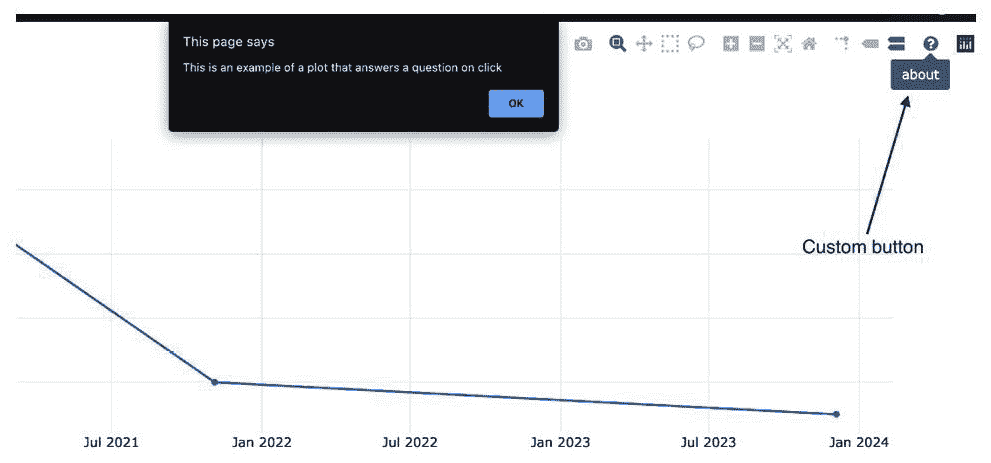

图 5.9 - 带有自定义按钮的图表

在我们之前展示的代码片段中，注意`modeBarButtonsToAdd`配置选项。这个选项是我们定义要添加的按钮以及点击它时发生的事情的地方。创建自定义按钮时可以指定的主要属性列在这里：

+   `name`：按钮的名称。

+   `icon`：显示在模式栏中的图标/图片。这可以是自定义图标或任何内置的 Plotly 图标（[`github.com/plotly/plotly.js/blob/master/src/fonts/ploticon.js`](https://github.com/plotly/plotly.js/blob/master/src/fonts/ploticon.js)）。

+   `click`：定义单击按钮时发生的情况。在这里，您可以指定任何 JavaScript 函数，甚至更改图表的行为。

接下来，让我们看看如何制作静态图表。

### 制作静态图表

默认情况下，Plotly 图表是交互式的。如果要使它们静态，可以在 `config` 对象中指定以下选项：

```js
var config = {
  staticPlot: true
}
```

当我们只想显示一个没有干扰交互的图表时，静态图表是很有用的。

接下来，我们将向您展示如何创建响应式图表。

### 制作响应式图表

要使图表响应式，使其能够自动调整大小以适应显示的窗口，可以将 `responsive` 属性设置为 `true`，就像下面的代码片段中所示：

```js
var config = {
   responsive: true
}
```

响应式图表在创建将在不同屏幕尺寸上显示的网页时非常有用。

在下一节中，我们将向您展示如何下载并设置图表的下载选项。

### 自定义下载图表选项

默认情况下，当显示模式栏时，可以将 Plotly 图表保存为**便携式网络图形**（**PNG**）文件。这可以进行自定义，您可以设置下载图像类型，以及其他属性，如文件名、高度、宽度等。

为了实现这一点，您可以在 `config` 对象中设置 `toImageButtonOptions` 属性，就像我们在下面的代码片段中演示的那样：

```js
var config = {
  toImageButtonOptions: {
    format: 'jpeg', // one of png, svg, jpeg, webp
    filename: 'my_image', // the name of the file
    height: 600,
    width: 700,
  }
}
```

最后，在下一节中，我们将演示如何将图表的区域设置更改为其他语言。

### 更改默认区域设置

在为讲其他语言的人制作图表时，区域设置是很重要的。这可以极大地提高图表的可解释性。

按照下面的步骤，我们将把默认区域设置从英语更改为法语：

1.  获取特定的区域设置，并将其添加到您的 HTML 文件中（或者在 Dnotebook 中使用 `load_scripts` 加载它），就像下面的代码片段中所示的那样：

```js
...
<head>
    <script src="img/plotly-1.58.4.min.js"></script>
    <script src="img/plotly-locale-fr-latest.js"></script>  <!-- load locale -->
</head>
...
```

在 Dnotebook 中，可以使用 `load_package` 来完成这个操作，如下所示：

```js
load_package(["https://cdn.plot.ly/plotly-1.58.4.min.js", "https://cdn.plot.ly/plotly-locale-fr-latest.js"])
```

1.  在您的 `config` 对象中，指定区域设置，就像下面的代码片段中所示的那样：

```js
var config = {
   locale: "fr"
}
```

让我们看一个完整的示例及相应的输出。将以下代码添加到 HTML 文件的主体中：

```js
<div id="mydiv"></div>
 <script>
      var trace1 = {
            x: ['2020-10-04', '2021-11-04', '2023-12-04'],
            y: [90, 20, 10],
            type: 'scatter'
        };
        var trace2 = {
            x: ['2020-10-04', '2021-11-04', '2023-12-04'],
            y: [25, 35, 65],
            mode: 'markers',
            marker: {
                size: [20, 20, 20],
            }
        };
        var data = [trace1, trace2];
        var layout = {
            title: 'Change Locale',
            showlegend: false
        };
        var config = {
            locale: "fr"
        };
        Plotly.newPlot("mydiv", data, layout, config);
    </script>
```

在浏览器中加载 HTML 页面会显示以下图表，其中 `locale` 设置为法语：


图 5.10 - 区域设置为法语的图表

现在您知道如何配置您的图表，我们将继续讨论图表配置的另一个重要方面：**布局**。

## Plotly 布局

`layout` ([`plotly.com/javascript/reference/layout/`](https://plotly.com/javascript/reference/layout/)) 是传递给 `Plotly.newPlot` 函数的第三个参数。它用于配置绘制图表的区域/布局，以及标题、文本、图例等属性。

有六个布局属性可以设置——标题、图例、边距、大小、字体和颜色。我们将演示如何使用它们，并附有示例。

### 配置图表标题

`title` 属性配置图表标题，即显示在图表顶部的文本。要添加标题，只需将文本传递给 `layout` 对象中的 `title` 属性，就像下面的代码片段中演示的那样：

```js
var layout = {
    title: 'This is an example title,
};
```

要更加明确，特别是如果需要配置标题文本的位置，可以设置 `title` 的 `text` 属性，就像下面的代码片段中所示的那样：

```js
var layout = {
  title: {text: 'This is an example title'}
};
```

使用上述格式，我们可以轻松地配置其他属性，比如使用其他属性来设置标题位置，如下所述：

+   `x`：一个介于 0 和 1 之间的数字，用于设置标题文本相对于显示它的容器的 `x` 位置。

+   `y`：也是一个介于 0 和 1 之间的数字，用于设置标题文本相对于显示它的容器的`y`位置。

+   `xanchor`：可以是`auto`，`left`，`center`或`right`对齐。它设置标题相对于其`x`位置的水平对齐。

+   `yanchor`：可以是`auto`，`top`，`middle`或`bottom`对齐。它设置标题相对于其`y`位置的垂直对齐。

让我们看一个将`title`配置为显示在图表右上角的示例，如下所示：

```js
var trace1 = {
    x:['2020-10-04', '2021-11-04', '2023-12-04'],
    y: [90, 20, 10],
    type: 'scatter'
};
var data = [trace1];
var layout = {
  title: { text: 'This is an example title',
          x: 0.8,
          y: 0.9,
          xanchor: "right"}
};
Plotly.newPlot(this_div(), data, layout, config);
```

这将产生以下输出：


图 5.11 - 标题配置为右上角的图表

您还可以设置标题的**填充**。填充可以接受以下参数：

+   `t`：设置标题的顶部填充

+   `b`：设置标题的底部填充

+   `r`：设置右填充，仅在`xanchor`属性设置为`right`时有效

+   `l`：设置左填充，仅在`xanchor`属性设置为`left`时有效

例如，要设置标题的`right`填充，您可以将`xanchor`属性设置为`right`，然后配置`pad`的`r`属性，如下面的代码片段所示：

```js
 var layout = {
  title: {text: 'This is an example title',
          xanchor: "right",
          pad: {r: 100}}
};
```

请注意，前面代码片段中填充参数为`100`表示 100px。

在下一节中，我们将看看如何配置图表的图例。

### 配置 Plotly 图例

图例描述了图表中显示的数据。当您在单个图表中显示多种形式的数据时，图例非常重要。

默认情况下，当图表中有多个数据迹时，Plotly 会显示一个图例。您也可以通过将`layout`的`showLegend`属性显式设置为`true`来显示图例，如下面的代码片段所示：

```js
var layout = {
  showLegend: true
};
```

一旦图例被激活，您可以通过设置以下属性来自定义它的显示方式：

+   `bgcolor`：设置图例的背景颜色。默认情况下，它设置为`#fff`（白色）。

+   `bordercolor`：设置图例边框的颜色。

+   `borderwidth`：设置图例边框的宽度（以 px 为单位）。

+   `font`：一个具有以下属性的对象：

a) `family`：任何支持的 HTML 字体系列。

b) `size`：图例文本的大小。

c) `color`：图例文本的颜色。

在下面的代码片段中，我们展示了使用这些属性来配置图例的示例：

```js
var trace1 = {
    x: ['2020-10-04', '2021-11-04', '2023-12-04'],
    y: [90, 20, 10],
    type: 'scatter'
};
var trace2 = {
    x: ['2020-10-04', '2021-11-04', '2023-12-04'],
    y: [25, 35, 65],
    mode: 'markers',
    marker: {
        size: [20, 20, 20],
    }
};
var data = [trace1, trace2];
var layout = {
  title: {text: 'This is an example title'},
  showLegend: true,
  legend: {bgcolor: "#fcba03",
          bordercolor: "#444",
          borderwidth: 1,
          font: {family: "Arial", size: 30, color: "#fff"}}
};
Plotly.newPlot(this_div(), data, layout, config);
```

前面的代码产生以下输出：


图 5.12 - 显示自定义配置的图例

接下来，我们将展示如何配置整体布局的边距。

### 配置布局边距

`margin`属性配置图表在屏幕上的位置。它支持所有的 margin 属性（`l`，`r`，`t`和`b`）。在下面的代码片段中，我们使用所有四个属性来演示设置布局边距：

```js
... 
var layout = {
  title: {text: 'This is an example title'},
  margin: {l: 200, r: 200, t: 230, b: 100}
};
Plotly.newPlot(this_div(), data, layout, config);
```

这将产生以下输出：


图 5.13 - 配置了边距的图表

注意前面截图中图表周围的空间？那就是设置的边距。重要的是要注意，边距也是以 px 为单位的。

接下来，我们将看看如何设置布局大小。

### 配置布局大小

有时，我们可能希望有一个更大或更小的布局，可以使用`width`，`height`或者方便的`autosize`属性进行配置，如下面的代码片段所示：

```js
...
var layout = {
  title: {text: 'This is an example title'},
  width: 1000,
  height: 500
};
Plotly.newPlot(this_div(), data, layout, config);
```

这将产生以下输出：

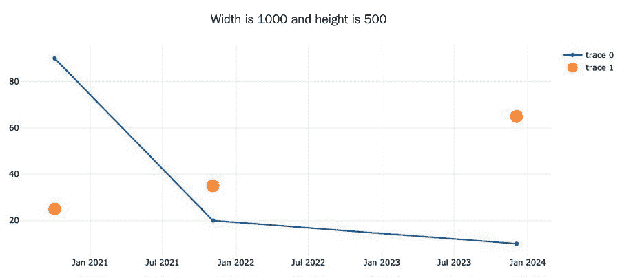

图 5.14 - 配置了大小的图表

当我们希望 Plotly 自动设置布局的大小时，`autosize`属性可以设置为`true`。

注意

要查看可以在`layout`中配置的其他属性，您可以访问 Plotly 的官方 API 参考页面：[`plotly.com/javascript/reference/layout`](https://plotly.com/javascript/reference/layout)。

在接下来的部分，我们将向您展示如何根据您想要传达的信息制作不同类型的图表。

# 使用 Plotly.js 创建基本图表

Plotly.js 支持许多基本图表，可以快速用于传达信息。Plotly 中可用的一些基本图表示例包括散点图、线图、条形图、饼图、气泡图、点图、树状图、表格等。您可以在这里找到支持的基本图表的完整列表：[`plotly.com/javascript/basic-charts/`](https://plotly.com/javascript/basic-charts/)。

在本节中，我们将介绍一些基本图表，如散点图、条形图和气泡图。

首先，我们将从散点图开始。

### 使用 Plotly.js 创建散点图

**散点图**通常用于将两个变量相互绘制。该图显示为一组点，因此称为*散点图*。以下截图显示了散点图的示例：

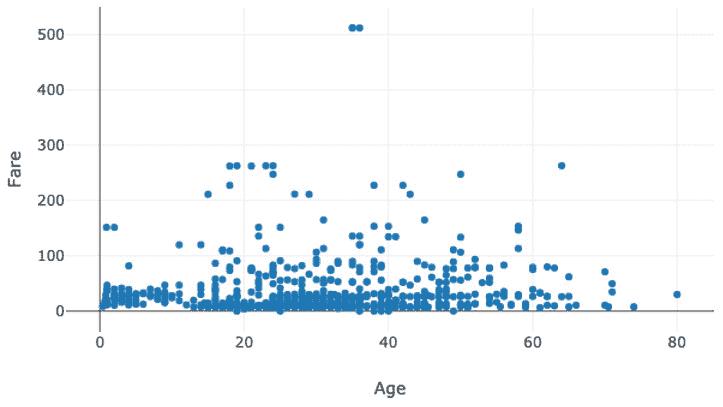

图 5.15 - 散点图示例，显示票价与年龄间的边距

要使用 Plotly 制作散点图，您只需指定图表类型，就像我们在下面的示例中所示的那样：

```js
var trace1 = {
    x: [2, 5, 7, 12, 15, 20],
    y: [90, 80, 10, 20, 30, 40],
    type: 'scatter'
};
var data = [trace1];
Plotly.newPlot(this_div(), data);
```

这给出了以下输出：

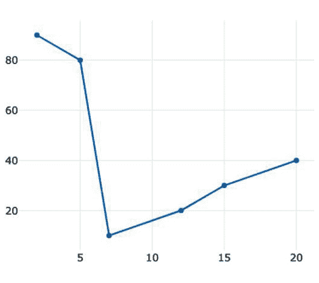

图 5.16 - 销售与边距的散点图示例

默认情况下，点是使用线连接在一起的。您可以通过设置模式类型来更改此行为。模式类型可以是以下任何一种：

+   `标记`

+   `线`

+   `文本`

+   `无`

您还可以使用多种模式，通过加号连接它们在一起，例如，`标记+文本+线`或`标记+线`。

在下面的示例中，我们将`标记`和`文本`作为我们的模式类型：

```js
var trace1 = {
    x: [2, 5, 7, 12, 15, 20],
    y: [90, 80, 10, 20, 30, 40],
    type: 'scatter',
    mode: 'markers+text'
};
var data = [trace1];
Plotly.newPlot(this_div(), data);
```

这给出了以下输出：


图 5.17 - 散点图，模式类型设置为标记+文本

如前所述，您可以在单个图表中绘制多个散点图，并且可以根据需要配置每个轨迹。在下面的示例中，我们绘制了三个散点图，并配置了不同的模式：

```js
var trace1 = {
  x: [1, 2, 3, 4, 5],
  y: [1, 6, 3, 6, 1],
  mode: 'markers',
  type: 'scatter',
  name: 'Trace 1',
};
var trace2 = {
  x: [1.5, 2.5, 3.5, 4.5, 5.5],
  y: [4, 1, 7, 1, 4],
  mode: 'lines',
  type: 'scatter',
  name: 'Trace 2',
};
var trace3 = {
  x: [1, 2, 3, 4, 5],
  y: [4, 1, 7, 1, 4],
  mode: 'markers+text',
  type: 'scatter',
  name: 'Trace 3',
};
var data = [ trace1, trace2, trace3];
var layout = {
  title:'Data Labels Hover',
  width: 1000
};
Plotly.newPlot(this_div(), data, layout);
```

运行上述代码单元会得到以下输出：

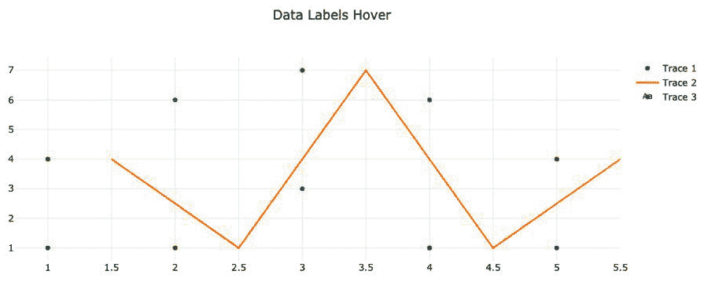

图 5.18 - 散点图，带有三个轨迹

现在您已经在本节中学习了基本图表的概念，您可以轻松地根据自定义数据点创建散点图，并使用所需的属性自定义大小。

接下来，我们将简要介绍条形图。

### 创建条形图

条形图是 Plotly.js 中提供的另一种流行类型的图表。它用于显示使用矩形条之间的高度或长度与它们代表的值成比例的数据点之间的关系。条形图主要用于绘制**分类数据**。

注意

分类数据或分类变量是具有固定或有限数量可能值的变量。英文字母就是分类数据的一个例子。

要在 Plotly.js 中制作条形图，您需要传递一个具有相应条高度/长度的分类数据点，然后将类型设置为`bar`，就像下面的示例中所示的那样：

```js
var data = [
  {
    x: ['Apple', 'Mango', 'Pear', 'Banana'],
    y: [20, 20, 15, 40],
    type: 'bar'
  }
];
Plotly.newPlot(this_div(), data);
```

运行上述代码单元会得到以下输出：


图 5.19 - 带有四个变量的简单条形图

您可以在单个布局中绘制多个条形图，方法是创建多个轨迹并将它们作为数组传递。例如，在下面的代码片段中，我们创建了两个轨迹和一个图表：

```js
var trace1 = {
    x: ['Apple', 'Mango', 'Pear', 'Banana'],
    y: [20, 20, 15, 40],
    type: 'bar'
  }
var trace2 = {
    x: ['Goat', 'Lion', 'Spider', 'Tiger'],
    y: [25, 10, 14, 36],
    type: 'bar'
  }
var data = [trace1, trace2]
Plotly.newPlot(this_div(), data);
```

运行上述代码单元会得到以下输出：


图 5.20 - 带有两个轨迹的条形图

在同一类别内绘制多个跟踪时，可以指定`barmode`属性。`barmode`属性可以是`stack`或`group`模式之一。例如，在下面的代码片段中，我们以`stack`模式制作了两个跟踪的条形图：

```js
var trace1 ={
    x: ['Apple', 'Mango', 'Pear', 'Banana'],
    y: [20, 20, 15, 40],
    type: 'bar',
    name: "Bar1"
  }
var trace2 = {
    x: ['Apple', 'Mango', 'Pear', 'Banana'],
    y: [25, 10, 14, 36],
    type: 'bar',
   name: "Bar2"
  }
var data = [trace1, trace2]
var layout = {
  barmode: 'stack'
}
Plotly.newPlot(this_div(), data, layout);
```

运行上述代码单元格会产生以下输出：


图 5.21 – 两个跟踪的堆叠模式条形图

在下面的代码片段中，我们将`barmode`属性更改为`group`（默认模式）：

```js
...
var layout = {
  barmode: 'group'
}
...
```

这将产生以下输出：


图 5.22 – 两个跟踪的组模式条形图

您可以在制作条形图时指定许多其他选项，但我们在本节中不会覆盖所有选项。您可以在官方文档中查看所有配置选项，以及创建良好条形图的清晰示例：[`plotly.com/javascript/bar-charts/`](https://plotly.com/javascript/bar-charts/)。

在下一节中，我们将简要介绍气泡图。

### 创建气泡图

气泡图是另一种非常受欢迎的图表类型，可用于覆盖信息。它基本上是散点图的扩展，指定了点的大小。让我们看下面的代码示例：

```js
var trace1 = {
  x: [1, 2, 3, 4],
  y: [10, 11, 12, 13],
  mode: 'markers',
  marker: {
    size: [40, 60, 80, 100]
  }
};
var data = [trace1]
Plotly.newPlot(this_div(), data, layout);
```

运行上述代码单元格会产生以下输出：


图 5.23 – 一个简单的气泡图

在气泡图的上一个代码片段中，您可以看到主要更改是模式和指定大小的标记。大小与点一一映射，如果要为每个气泡应用大小，必须指定大小。

您还可以通过传递颜色数组来更改单个气泡的颜色，如下面的代码片段所示：

```js
...
  marker: {
    size: [40, 60, 80, 100],
    color: ['rgb(93, 164, 214)', 'rgb(255, 144, 14)',  'rgb(44, 160, 101)', 'rgb(255, 65, 54)'],
  }
...
```

运行上述代码单元格会产生以下输出：


图 5.24 – 一个简单的气泡图，带有不同的颜色

气泡图非常有用，如果您需要了解更多信息或查看一些更高级的示例，可以在 Plotly 的文档中查看示例页面：[`plotly.com/javascript/bubble-charts/`](https://plotly.com/javascript/bubble-charts/)。

您可以在制作许多其他类型的基本图表，但遗憾的是我们无法覆盖所有。Plotly 文档中的*基本图表*页面（[`plotly.com/javascript/basic-charts/`](https://plotly.com/javascript/basic-charts/)）是学习如何制作这些出色图表的好地方，我们鼓励您去看一看。

在下一节中，我们将向您介绍一些统计图表。

# 使用 Plotly.js 创建统计图表

统计图表是统计学家或数据科学家主要使用的不同类型的图表，用于传达信息。统计图的一些示例包括直方图、箱线图、小提琴图、密度图等。在下一小节中，我们将简要介绍三种类型的统计图表-直方图、箱线图和小提琴图。

## 使用 Plotly.js 创建直方图图表

直方图用于表示数值/连续数据的分布或传播。直方图类似于条形图，有时人们可能会混淆两者。区分它们的简单方法是它们可以显示的数据类型。直方图使用连续变量而不是分类变量，并且只需要一个值作为数据。

在下面的代码片段中，我们展示了一个使用生成的随机数的直方图示例：

```js
var x = [];
for (let i = 0; i < 1000; i ++) { //generate random numbers
x[i] = Math.random();
}
var trace = {
    x: x,
    type: 'histogram',
  };
var data = [trace];
Plotly.newPlot(this_div(), data);
```

在上述代码片段中，您将观察到`trace`属性仅指定了`x`数据。这符合我们之前提到的内容-直方图只需要一个值。我们还指定绘图类型为`histogram`，运行代码单元格会产生以下输出：

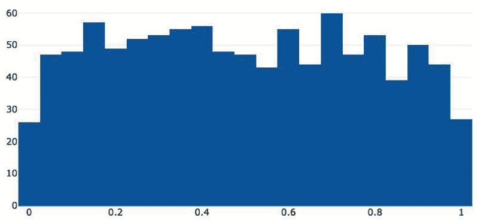

图 5.25 – 具有随机 x 值的直方图

指定`y`值而不是`x`将导致水平直方图，如下例所示：

```js
...
var trace = {
    y: y,
    type: 'histogram',
  };
...
```

运行上述代码单元格会产生以下输出：

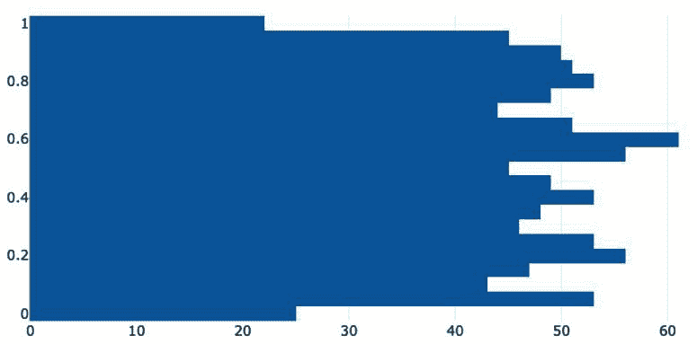

图 5.26 – 具有随机 y 值的直方图

您还可以通过创建多个踪迹并将`barmode`属性设置为`stack`来创建堆叠、叠加或分组的直方图，如下例所示：

```js
var x1 = [];
var x2 = [];
for (var i = 0; i < 1000; i ++) {
x1[i] = Math.random();
x2[i] = Math.random();
}
var trace1 = {
  x: x1,
  type: "histogram",
};
var trace2 = {
  x: x2,
  type: "histogram",
};
var data = [trace1, trace2];
var layout = {barmode: "stack"};
Plotly.newPlot(this_div(), data, layout);
```

运行上述代码单元格会产生以下输出：


图 5.27 – 堆叠模式下的直方图

通过改变`barmode`叠加，我们得到以下输出：

```js
…
var layout = {barmode: "overlay"};
…
```

运行上述代码单元格会产生以下输出：

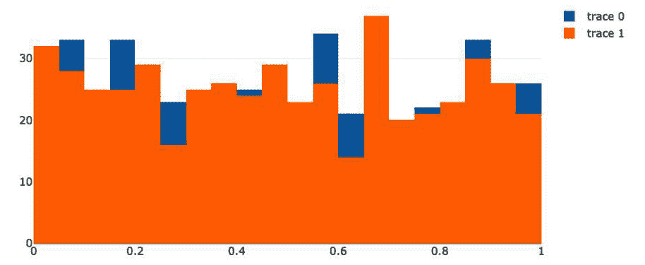

图 5.28 – 叠加模式下的直方图

要查看更多关于绘制直方图以及各种配置选项的示例，您可以在这里查看直方图文档页面：[`plotly.com/javascript/histograms/`](https://plotly.com/javascript/histograms/)。

在下一节中，我们将介绍箱线图。

## 使用 Plotly.js 创建箱线图

**箱线图**是描述性统计中非常常见的一种图表类型。它使用四分位数图形地呈现数值数据组。箱线图还有延伸在其上下的线，称为**须**。须代表上下**四分位数**之外的变异性。

提示

四分位数将指定数量的数据点分为四部分或四分之一。第一四分位数是最低的 25%数据点，第二四分位数在 25%和 50%之间（达到中位数），第三四分位数在 50%到 75%之间（高于中位数），最后，第四四分位数表示最高的 25%数字。

以下的图表可以帮助你更好地理解箱线图：

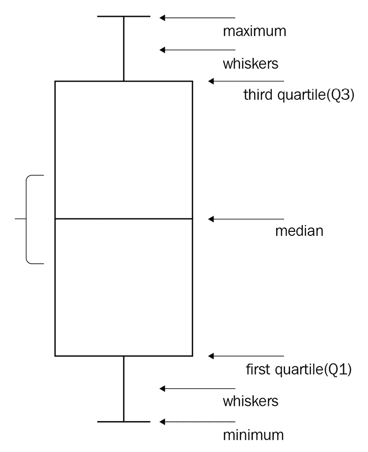

图 5.29 – 描述箱线图的图表（来源：重新绘制自 https://aiaspirant.com/box-plot/）

在 Plotly.js 中，我们通过传递数据并将`trace`类型设置为`box`来制作箱线图。我们在下面的例子中演示了这一点：

```js
var y0 = [];
var y1 = [];
for (var i = 0; i < 50; i ++) {//generate some random numbers
y0[i] = Math.random();
y1[i] = Math.random() + 1;
}
var trace1 = {
  y: y0,
  type: 'box'
};
var trace2 = {
  y: y1,
  type: 'box'
};
var data = [trace1, trace2];
Plotly.newPlot(this_div(), data);
```

运行上述代码单元格会产生以下输出：

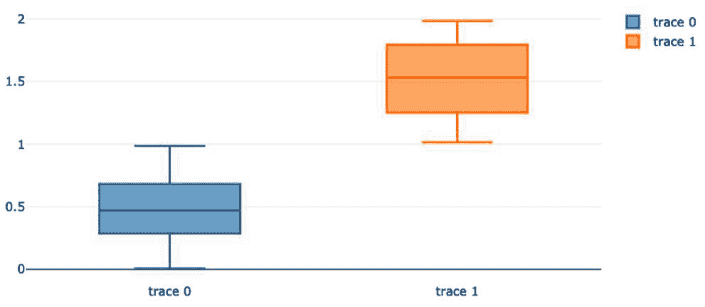

图 5.30 – 一个简单的箱线图，有两个踪迹

我们可以将箱线图的布局配置为水平格式，而不是默认的垂直格式。在下一节中，我们将演示如何做到这一点。

### 制作水平箱线图

通过在踪迹中指定`x`值而不是`y`值，您可以制作水平图。我们在下面的代码片段中演示了这一点：

```js
var x0 = [];
var x1 = [];
for (var i = 0; i < 50; i ++) {
x0[i] = Math.random();
x1[i] = Math.random() + 1;
}
var trace1 = {
  x: x0,
  type: 'box'
};
var trace2 = {
  x: x1,
  type: 'box'
};
var data = [trace1, trace2];
Plotly.newPlot(this_div(), data);
```

运行上述代码单元格会产生以下输出：


图 5.31 – 一个简单的箱线图，有两个踪迹

您还可以制作分组的箱线图，如下一节所示。

### 制作分组的箱线图

多个共享相同*x*轴的踪迹可以被分组成一个单独的箱线图，如下面的代码片段所示：

```js
var x = ['Season 1', 'Season 1', 'Season 1', 'Season 1', 'Season 1', 'Season 1',
         'Season 2', 'Season 2', 'Season 2', 'Season 2', 'Season 2', 'Season 2']
var trace1 = {
  y: [2, 2, 6, 1, 5, 4, 2, 7, 9, 1, 5, 3],
  x: x,
  name: 'Blues FC',
  marker: {color: '#3D9970'},
  type: 'box'
};
var trace2 = {
  y: [6, 7, 3, 6, 0, 5, 7, 9, 5, 8, 7, 2],
  x: x,
  name: 'Reds FC',
  marker: {color: '#FF4136'},
  type: 'box'
};
var trace3 = {
  y: [1, 3, 1, 9, 6, 6, 9, 1, 3, 6, 8, 5],
  x: x,
  name: 'Greens FC',
  marker: {color: '#FF851B'},
  type: 'box'
};
var data = [trace1, trace2, trace3];
var layout = {
  yaxis: {
    title: 'Points in two seasons',
  },
  boxmode: 'group'
};
Plotly.newPlot(this_div(), data, layout);
```

运行上述代码单元格会产生以下输出：


图 5.32 – 三个踪迹分组在一起的箱线图

您可以在制作箱线图时设置许多其他选项，但我们将让您在此处阅读更多关于它们的箱线图文档：[`plotly.com/javascript/box-plots/`](https://plotly.com/javascript/box-plots/)。

在下一节中，我们将简要介绍小提琴图。

## 使用 Plotly.js 创建小提琴图

**小提琴图**是箱线图的扩展。它也使用四分位数描述数据点，就像箱线图一样，只有一个主要区别——它还显示数据的分布。

以下图表显示了小提琴图和箱线图之间的共同特性：

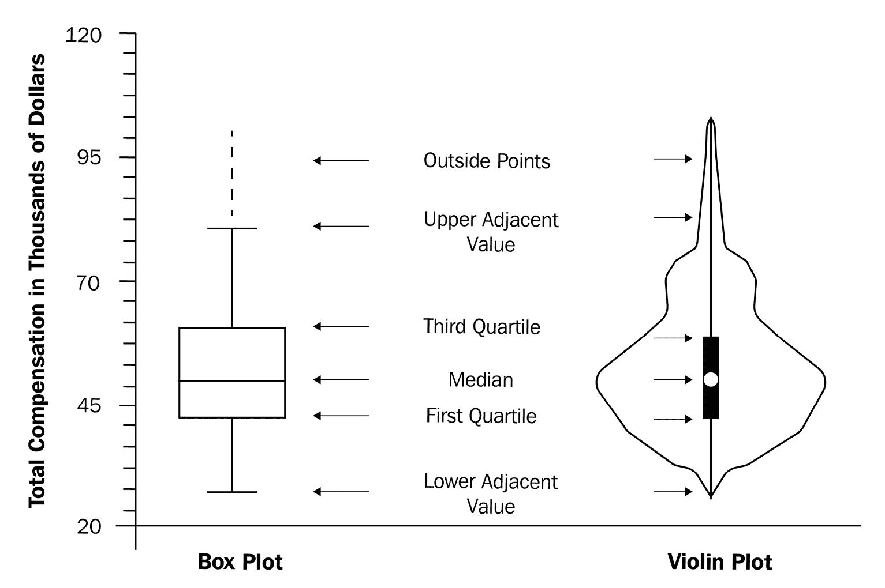

图 5.33 - 小提琴图和箱线图之间的共同特性（重新绘制自 https://towardsdatascience.com/violin-plots-explained-fb1d115e023d）

小提琴图的曲线区域显示了数据的基础分布，并传达了比箱线图更多的信息。

在 Plotly 中，您可以通过将类型更改为`violin`来轻松制作小提琴图。例如，在下面的代码片段中，我们正在重用箱线图部分的代码，只有两个主要更改：

```js
var x = ['Season 1', 'Season 1', 'Season 1', 'Season 1', 'Season 1', 'Season 1',
         'Season 2', 'Season 2', 'Season 2', 'Season 2', 'Season 2', 'Season 2']
var trace1 = {
  y: [2, 2, 6, 1, 5, 4, 2, 7, 9, 1, 5, 3],
  x: x,
  name: 'Blues FC',
  marker: {color: '#3D9970'},
  type: 'violin'
};
var trace2 = {
  y: [6, 7, 3, 6, 0, 5, 7, 9, 5, 8, 7, 2],
  x: x,
  name: 'Reds FC',
  marker: {color: '#FF4136'},
  type: 'violin'
};
var trace3 = {
  y: [1, 3, 1, 9, 6, 6, 9, 1, 3, 6, 8, 5],
  x: x,
  name: 'Greens FC',
  marker: {color: '#FF851B'},
  type: 'violin',
};
var data = [trace1, trace2, trace3];
var layout = {
  yaxis: {
    title: 'Points in two seasons',
  },
  violinmode: 'group'
}; 
Plotly.newPlot(this_div(), data, layout);
```

运行上述代码单元格将得到以下输出：


图 5.34 - 三个迹线组合在一起的小提琴图

就像其他图表类型一样，您也可以配置小提琴图的显示方式。例如，我们可以在小提琴图中显示基础箱线图，如下面的代码片段所示：

```js
var x = ['Season 1', 'Season 1', 'Season 1', 'Season 1', 'Season 1', 'Season 1',
         'Season 2', 'Season 2', 'Season 2', 'Season 2', 'Season 2', 'Season 2']
var trace = {
  y: [1, 3, 1, 9, 6, 6, 9, 1, 3, 6, 8, 5],
  x: x,
  name: 'Greens FC',
  marker: {color: '#FF851B'},
  type: 'violin',
  box: {
    visible: true
  },
};
var data = [trace];
var layout = {
  yaxis: {
    title: 'Point in two seasons',
  },
};
Plotly.newPlot(this_div(), data, layout);
```

运行上述代码单元格将得到以下输出：

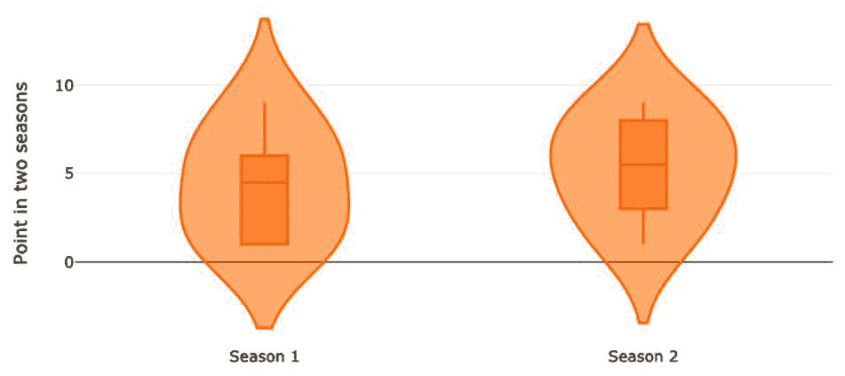

图 5.35 - 显示基础箱线图的小提琴图

要查看其他配置选项以及一些高级设置，您可以在这里查看小提琴图的文档：[`plotly.com/javascript/violin/`](https://plotly.com/javascript/violin/)。

通过这样，我们已经结束了对 Plotly.js 的介绍部分。在下一章中，我们将向您展示如何使用 Danfo.js 快速轻松地为这个特定库支持的任何类型的数据制作图表。

# 摘要

在本章中，我们介绍了使用 Plotly.js 进行绘图和可视化。首先，我们简要介绍了 Plotly.js，包括安装设置。然后，我们转向图表配置和布局定制。最后，我们向您展示了如何创建一些基本和统计图表。

您在本章中所学到的知识将帮助您轻松创建交互式图表，您可以将其嵌入到您的网站或 Web 应用程序中。

在下一章中，我们将介绍使用 Danfo.js 进行数据可视化，您将看到如何利用 Plotly.js 的知识，可以直接从您的 DataFrame 或 Series 轻松创建令人惊叹的图表。
