# 第七章：*第六章*：使用 Danfo.js 进行数据可视化

在前一章中，您学会了如何使用 Plotly.js 创建丰富和交互式的图表，可以嵌入到任何 Web 应用程序中。我们还提到了 Danfo.js 如何在内部使用 Plotly 来直接在 DataFrame 或 Series 上制作图表。在本章中，我们将向您展示如何使用 Danfo.js 绘图 API 轻松创建这些图表。具体来说，在本章中，我们将涵盖以下内容：

+   设置 Danfo.js 进行绘图

+   使用 Danfo.js 创建折线图

+   使用 Danfo.js 创建散点图

+   使用 Danfo.js 创建箱线图和小提琴图

+   使用 Danfo.js 创建直方图

+   使用 Danfo.js 创建条形图

# 技术要求

为了跟随本章的内容，您应该具备以下条件：

+   现代浏览器，如 Chrome、Safari、Opera 或 Firefox

+   Node.js、Danfo.js，以及可选的 Dnotebook 已安装在您的系统上。

+   稳定的互联网连接以下载数据集

有关 Danfo.js 的安装说明可以在*第三章*中找到，*使用 Danfo.js 入门*，而有关 Dnotebook 的安装步骤可以在*第二章*中找到，*Dnotebook-用于 JavaScript 的交互式计算环境*。

# 设置 Danfo.js 进行绘图

默认情况下，Danfo.js 提供了一些基本的图表类型。这些图表可以在任何 DataFrame 或 Series 对象上调用，如果传递了正确的参数，它将显示相应的图表。

在撰写本文时，Danfo.js 附带以下图表：

+   折线图

+   箱线图和小提琴图

+   表格

+   饼图

+   散点图

+   条形图

+   直方图

这些图表通过`plot`函数公开。也就是说，如果您有一个 DataFrame 或 Series 对象，在它们上调用`plot`函数将公开这些图表。

`plot`方法需要一个`div` ID，用于显示图表。例如，假设`df`是一个 DataFrame，我们可以按照下面的代码片段调用`plot`函数：

```js
const df = new DataFrame({...})
df.plot("my_div_id").<chart type>
```

图表类型可以是`line`、`bar`、`scatter`、`hist`、`pie`、`box`、`violin`或`table`。

每种图表类型都将接受特定于图表的参数，但它们都共享一个名为`config`的公共参数。`config`对象用于自定义图表以及布局。将`config`参数视为我们在*第五章*中使用的布局和配置属性的组合。

`config`参数是一个具有以下格式的对象：

```js
config = {
  layout: {…}, // plotly layout parameters like title, font, e.t.c.
  ... // other Plotly configuration parameters like showLegend, displayModeBar, e.t.c.
}
```

在接下来的部分中，我们将展示使用不同图表类型的一些示例，以及如何配置它们。

注意

在接下来的部分中，我们将下载并使用两个真实世界的数据集。这意味着您需要互联网连接来下载数据集。

## 将 Danfo.js 添加到您的代码中

要使用 Danfo.js 进行绘图，您需要将其添加到您的项目中。如果您正在使用我们的示例中将要使用的 Dnotebook，则可以使用`load_package`函数加载 Danfo.js 和 Plotly.js，如下面的代码片段所示：

```js
load_package(["https://cdn.plot.ly/plotly-1.58.4.min.js","https://cdn.jsdelivr.net/npm/danfojs@0.2.3/lib/bundle.min.js"])
```

上述代码将在 Dnotebook 中安装 Danfo.js 和 Plotly.js。Danfo.js 使用安装的 Plotly.js 来制作图表。除非显式加载 Plotly，否则图表将无法工作。

注意

较旧版本的 Danfo.js（0.2.3 之前）附带了 Plotly.js。在新版本中已经删除，如此处显示的发布说明中所述：[`danfo.jsdata.org/release-notes#latest-release-node-v-0-2-5-browser-0-2-4`](https://danfo.jsdata.org/release-notes#latest-release-node-v-0-2-5-browser-0-2-4)。

如果您在 HTML 文件中制作图表，请确保在头部添加`script`标签，如下面的代码片段所示：

```js
...
<head>
<script src="img/plotly-1.2.0.min.js"></script> 
<script src="img/bundle.min.js"></script>
</head>
...
```

最后，在诸如 React 或 Vue 之类的 UI 库中，确保通过 npm 或 yarn 等包管理器安装 Danfo.js 和 Plotly.js。

## 下载数据集以绘制

在本节中，我们将下载一个真实的金融数据集，这个数据集将用于我们所有的示例。在 Dnotebook 中，您可以在顶部单元格中下载数据集，并在其他单元格中使用如下：

```js
var financial_df;
dfd.read_csv("https://raw.githubusercontent.com/plotly/datasets/master/finance-charts-apple.csv")
    .then(data => {
          financial_df  = data
    })
```

注意

确保使用`var`声明`financial_df`。这样可以使`financial_df`在 Dnotebook 的每个单元格中都可用。如果在 React 或纯 HTML 中工作，则建议使用`let`或`const`。

我们可以使用`head`函数和`table`来显示`financial_df`的前五行，如下面的代码片段所示：

```js
table(financial_df.head())
```

运行上述代码会产生以下输出：


图 6.1 - 表格显示金融数据集的前五行

现在我们有了数据集，我们可以开始制作一些有趣的图表。首先，我们将从一个简单的折线图开始。

# 使用 Danfo.js 创建折线图

折线图是简单的图表类型，主要用于 Series 数据或单列。它们可以显示数据点的趋势。要在单列上制作折线图 - 比如，在`financial_df`中的`AAPL.Open`，我们可以这样做：

```js
var layout = {
    yaxis: {
      title: 'AAPL open points',
    }
}
var config = {
  displayModeBar: false,
  layout
}
financial_df ['AAPL.Open'].plot(this_div()).line(config)
```

运行上述代码会产生以下输出：

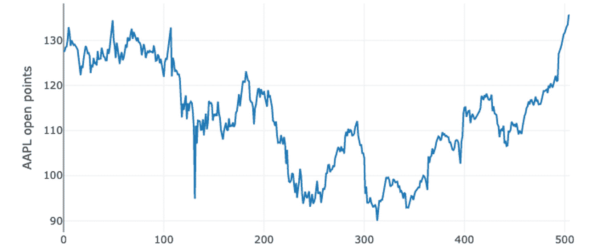

图 6.2 - 金融数据集的前五行

请注意，我们使用 DataFrame 子集（`financial_df["column name"]`）来获取单个列 - `AAPl.Open` - 作为一个 Series。然后，我们调用`.line`图表类型并传入一个`config`对象。`config`对象接受`layout`属性以及 Danfo.js 和 Plotly 使用的其他参数。

如果要绘制特定列，可以将列名数组传递给`config`参数，如下面的代码片段所示：

```js
var layout = {
    yaxis: {
      title: 'AAPL open points',
    }
}
var config = {
  columns: ["AAPL.Open", "AAPL.Close"],
  displayModeBar: true,
  layout
}
financial_df.plot(this_div()).line(config)
```

运行上述代码会产生以下输出：

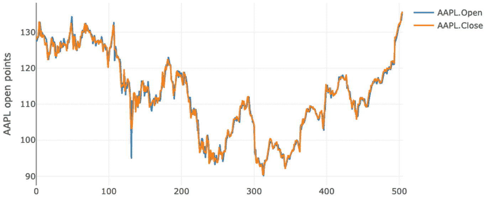

图 6.3 - 将两列绘制为折线图

默认情况下，图表的*x*轴是 DataFrame 或 Series 的索引。对于`financial_df` DataFrame，当我们使用`read_csv`函数下载数据集时，索引是自动生成的。如果要更改索引，可以使用`set_index`函数，如下面的代码片段所示：

```js
var new_df = financial_df.set_index({key: "Date"})
table(new_df.head())
```

输出如下：


图 6.4 - 表格显示前五行，索引设置为日期

如果我们制作与之前相同的图表，我们会发现*x*轴会自动格式化为日期：


图 6.5 - 两列（AAPL.open，AAPL.close）针对日期索引的图表

您可以通过将它们传递到`layout`属性或`config`对象的主体中来指定其他 Plotly 配置选项，例如宽度、字体等。例如，要配置字体、文本大小、布局宽度，甚至添加自定义按钮到您的图表，您可以这样做：

```js
var layout = {

  ...  legend: {bgcolor: "#fcba03", 
          bordercolor: "#444", 
          borderwidth: 1, 
          font: {family: "Arial", size: 10, color: "#fff"}
  },
  ...}
var config = {
  columns: ["AAPL.Open", "AAPL.Close"],
  displayModeBar: true,
  modeBarButtonsToAdd: [{ 
      name: 'about', 
      icon: Plotly.Icons.question, 
      click: function (gd) { 
        alert('An example of configuring Danfo.Js Plots') 
      } 
    }] ,
  layout
}
new_df.plot(this_div()).line(config)
```

运行上述代码单元格会产生以下输出：


图 6.6 - 具有各种配置以及指定布局属性的折线图

有了上述信息，您就可以开始从数据集中制作漂亮的折线图了。在下一节中，我们将介绍 Danfo.js 中可用的另一种类型的图表 - 散点图。

# 使用 Danfo.js 创建散点图

我们可以通过将绘图类型指定为`scatter`来轻松制作散点图。例如，使用前一节中的代码，*使用 Danfo.js 创建折线图*，我们只需将绘图类型从`line`更改为`scatter`，就可以得到所选列的散点图，如下面的代码块所示：

```js
var layout = {
  title: "Time series plot of AAPL open and close points",
  width: 1000,
  yaxis: {
    title: 'AAPL open points',
  },
  xaxis: {
    title: 'Date',
  }
}
var config = {
  columns: ["AAPL.Open", "AAPL.Close"],
  layout
}
new_df.plot(this_div()).scatter(config)
```

运行上述代码单元格会产生以下输出：

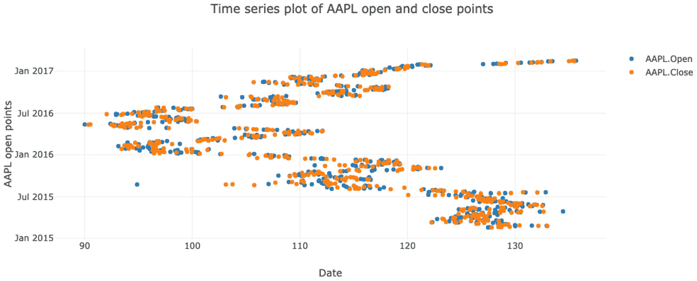

图 6.7 - 两列的散点图

如果您需要在 DataFrame 中指定两个特定列之间的散点图，可以在`config`对象中指定`x`和`y`值，如下面的代码所示：

```js
var layout = {
  title: "Time series plot of AAPL open and close points",
  width: 1000,
  yaxis: {
    title: 'AAPL open points',
  },
  xaxis: {
    title: 'Date',
  }
}
var config = {
  x: "AAPL.Low",
  y: "AAPL.High",
  layout
}
new_df.plot(this_div()).scatter(config)
```

运行上述代码单元格会产生以下输出：

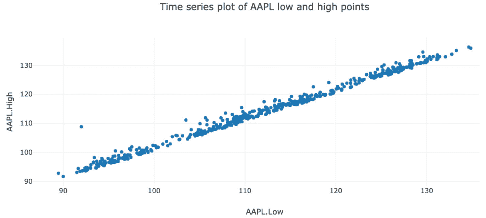

图 6.8 - 明确指定 x 和 y 列的散点图

要自定义布局或设置`config`，您可以将相应的选项传递给`config`对象，就像我们在*使用 Danfo.js 创建折线图*部分中所做的那样。

在下一节中，我们将简要介绍两种类似的图表类型 - 箱线图和小提琴图。

# 使用 Danfo.js 创建箱线图和小提琴图

箱线图和小提琴图非常相似，通常会使用相同的参数。因此，我们将在本节中同时介绍它们。

在以下示例中，我们将首先制作一个箱线图，然后仅通过更改绘图类型选项将其更改为小提琴图。

## 为系列创建箱线图和小提琴图

要为系列或 DataFrame 中的单个列创建箱线图，首先，我们要对其进行子集化以获取系列，然后我们将在其上调用绘图类型，如下面的代码片段所示：

```js
var layout = {
  title: "Box plot on a Series",
}
var config = {
  layout
}
new_df["AAPL.Open"].plot(this_div()).box(config)
```

运行上述代码单元格会产生以下输出：

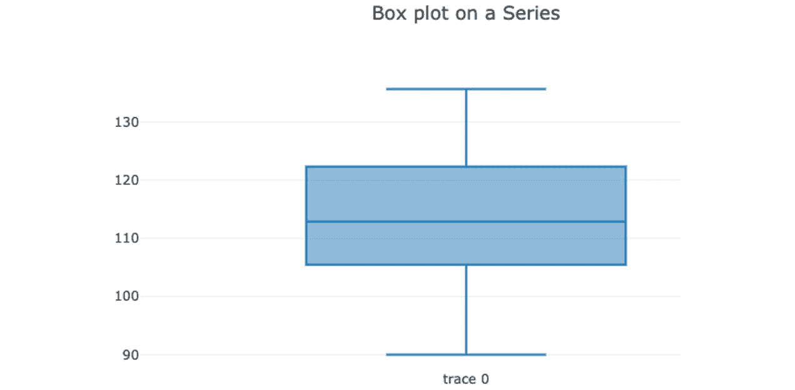

图 6.9 - 系列的箱线图

现在，为了将前述图更改为小提琴图，您只需将绘图类型更改为`violin`，如下面的代码片段所示：

```js
...
new_df["AAPL.Open"].plot(this_div()).violin(config)
…
```

运行上述代码单元格会产生以下输出：

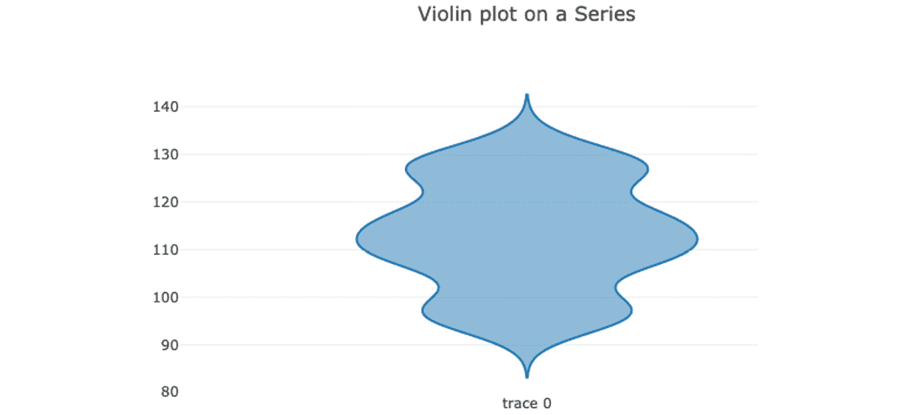

图 6.10 - 系列的小提琴图

当我们需要一次为多个列制作箱线图时会发生什么？好吧，在下一节中，我们将向您展示。

## 多列的箱线图和小提琴图

为了在 DataFrame 中为多个列创建箱线图/小提琴图，您可以将列名数组传递给绘图，就像我们在下面的代码片段中演示的那样：

```js
var layout = {
  title: "Box plot on multiple columns",
}
var config = {
  columns: ["AAPL.Open", "AAPL.Close", "AAPL.Low", "AAPL.High"],
  layout
}
new_df.plot(this_div()).box(config)
```

运行上述代码单元格会产生以下输出：

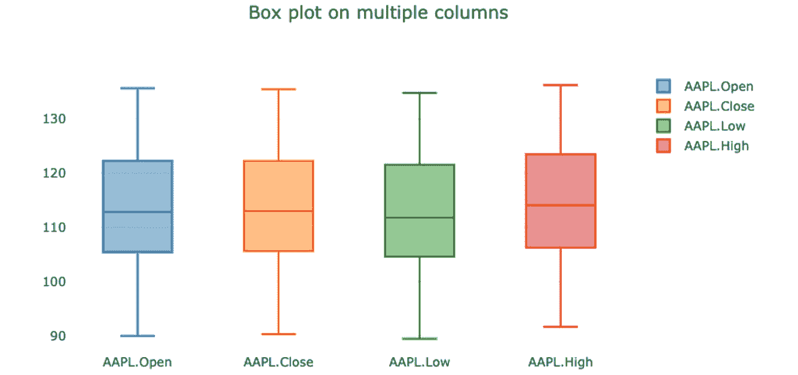

图 6.11 - 一次绘制多列的箱线图

通过重用先前的代码，我们可以通过更改绘图类型轻松将箱线图更改为小提琴图，如下所示：

```js
…
new_df.plot(this_div()).violin(config)
...
```

我们得到以下输出：

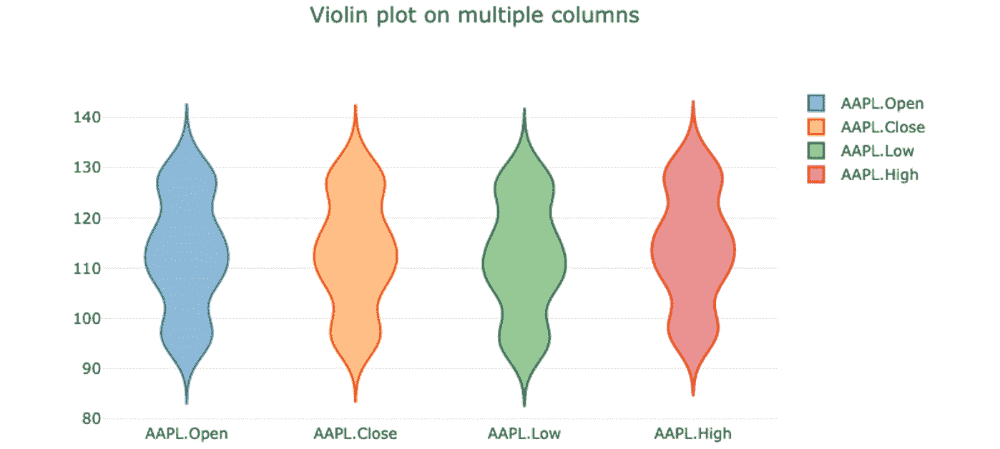

图 6.12 - 一次绘制多列的小提琴图

最后，如果我们想要指定`x`和`y`值会发生什么？我们将在下一节中展示这一点。

## 具体的 x 和 y 值的箱线图和小提琴图

我们可以使用特定的`x`和`y`值制作箱线图和小提琴图。`x`和`y`值是必须在 DataFrame 中存在的列名。

注意

建议箱线图的`x`值是分类的，即具有固定数量的类别。这样可以确保可解释性。

在以下示例中，我们将向您展示如何明确指定`x`和`y`值到一个图中：

```js
var layout = {
  title: "Box plot on x and y values",
}
var config = {
  x: "direction",
  y: "AAPL.Open",
  layout
}
new_df.plot(this_div()).box(config)
```

运行上述代码单元格会产生以下输出：

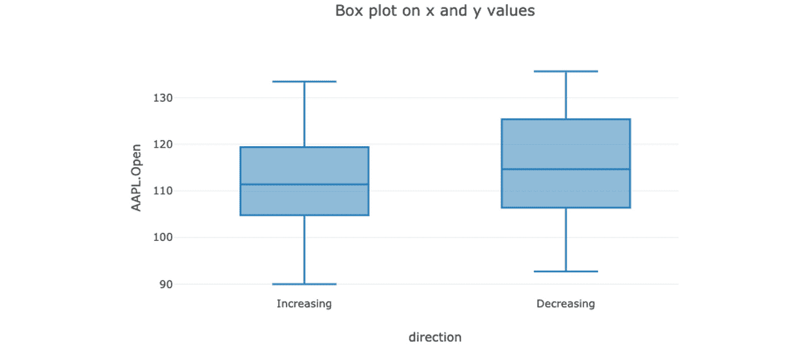

图 6.13 - 从特定 x 和 y 值绘制箱线图

请注意，`x`值是一个名为`direction`的分类变量。该列有两个固定的类别 - `Increasing`和`Decreasing`。

和往常一样，我们可以通过更改类型获得相应的小提琴图：

```js
...
new_df.plot(this_div()).violin(config)
…
```

运行上述代码单元格会产生以下输出：

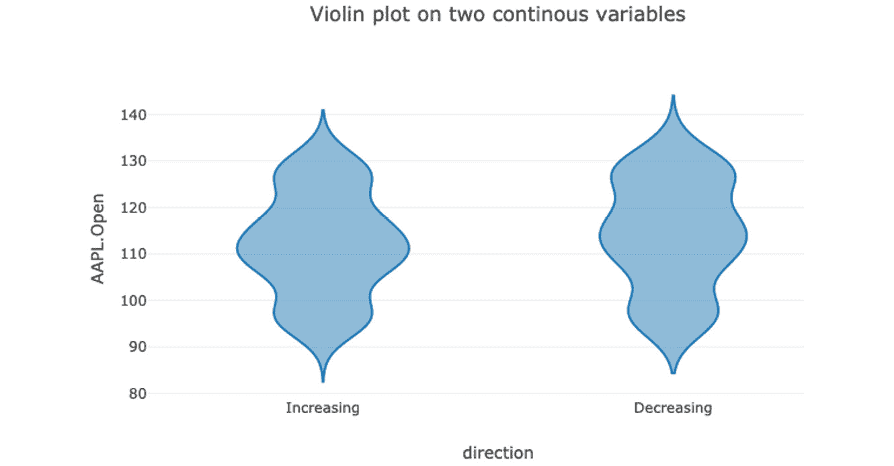

图 6.14 - 从特定 x 和 y 值绘制小提琴图

现在，如果我们为`x`和`y`同时指定了连续值会发生什么？好吧，在以下示例中让我们找出来：

```js
var layout = {
  title: "Box plot on two continuous variables",
}
var config = {
  x: "AAPL.Low",
  y: "AAPL.Open",
  layout
}
new_df.plot(this_div()).box(config)
```

运行上述代码单元格会产生以下输出：

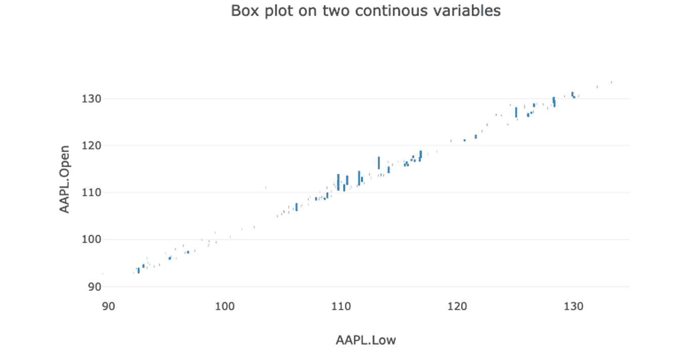

图 6.15 - 两个连续变量的箱线图

从上述输出可以看出，图表变得几乎无法解释，并且无法实现使用箱线图/小提琴图的目标。因此，建议对于分类`x`值使用箱线图/小提琴图。

在下一节中，我们将介绍用于制作直方图的`hist`绘图类型。

# 使用 Danfo.js 创建直方图

正如我们之前解释的，直方图是数据分布的表示。绘图命名空间提供的`hist`函数可以用于从 DataFrame 或 Series 制作直方图，我们将在下一节中进行演示。

## 从 Series 创建直方图

要从 Series 创建直方图，可以在 Series 上调用`hist`函数，或者如果在 DataFrame 上绘图，可以使用列名对 DataFrame 进行子集化，如下面的示例所示：

```js
var layout = {
   title: "Histogram on a Series data",
}
var config = { 
  layout 
} 
new_df["AAPL.Open"].plot(this_div()).hist(config)
```

运行上述代码单元格会得到以下输出：

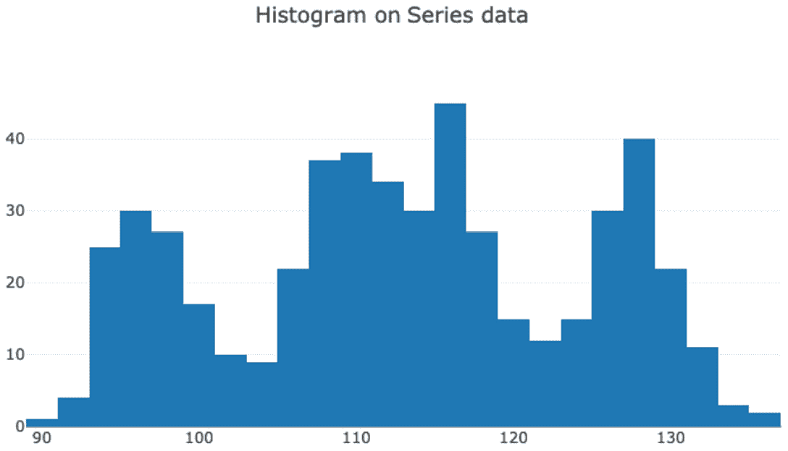

图 6.16 - Series 数据的直方图

接下来，我们将一次为 DataFrame 中的多个列制作直方图。

## 从多列创建直方图

如果要为 DataFrame 中的多个列制作直方图，可以将列名作为列名数组传递，如下面的代码片段所示：

```js
var layout = {
  title: "Histogram of two columns",
}
var config = { 
  columns: ["dn", "AAPL.Adjusted"],
  layout 
} 
new_df.plot(this_div()).hist(config)
```

运行上述代码单元格会得到以下输出：

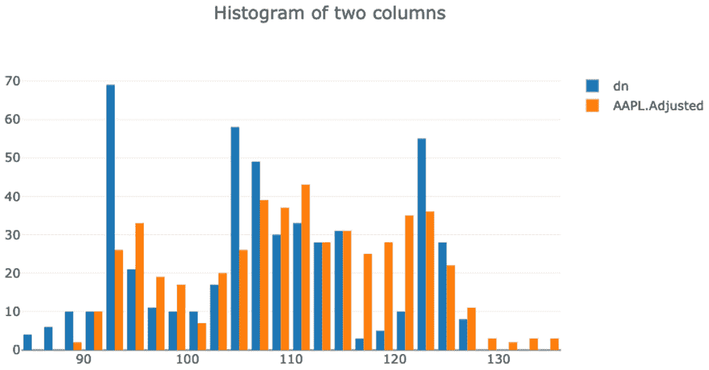

图 6.17 - 两列的直方图

如果需要指定单个值`x`或`y`来生成直方图，可以将`x`或`y`值传递给`config`对象。

注意

一次只能指定`x`或`y`中的一个。这是因为直方图是一种单变量图表。因此，如果指定了`x`值，直方图将是垂直的，如果指定了`y`，它将是水平的。

在下面的示例中，通过指定`y`值制作了水平直方图：

```js
var layout = {
  title: "A horizontal histogram",
}
var config = { 
  y: "dn",
  layout 
} 
new_df.plot(this_div()).hist(config)
```

运行上述代码单元格会得到以下输出：


图 6.18 - 水平直方图

默认情况下，直方图是垂直的，相当于设置了`x`参数。

在下一节中，我们将介绍条形图。

# 使用 Danfo.js 创建条形图

条形图以矩形条形呈现分类数据，其长度与它们代表的值成比例。

`bar`函数也可以在`plot`命名空间上调用，并且还可以应用各种配置选项。在接下来的几节中，我们将演示如何从 Series 以及具有多个列的 DataFrame 创建条形图。

## 从 Series 创建条形图

要从 Series 制作简单的条形图，可以执行以下操作：

```js
var layout = { 
   title: "A simple bar chart on a series",
} 
var config = {  
  layout  
}  
new_df["AAPL.Volume"].plot(this_div()).bar(config)
```

运行上述代码单元格会得到以下输出：

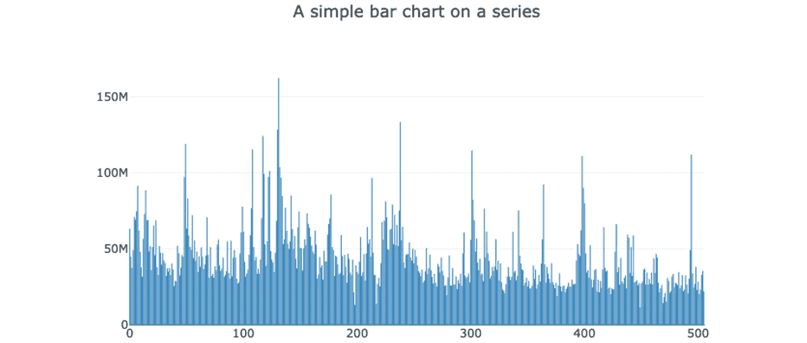

图 6.19 - Series 上的条形图

从上图可以看出，我们有大量的条形。这是因为`AAPL.Volume`列是一个连续变量，每个点都创建了一个条形。

为了避免这种无法解释的图表，建议对具有固定数量的数值类别的变量使用条形图。我们可以通过创建一个简单的 Series 来演示这一点，如下面的代码所示：

```js
custom_sf = new dfd.Series([1, 3, 2, 6, 10, 34, 40, 51, 90, 75])
custom_sf.plot(this_div()).bar(config)
```

运行上述代码单元格会得到以下输出：

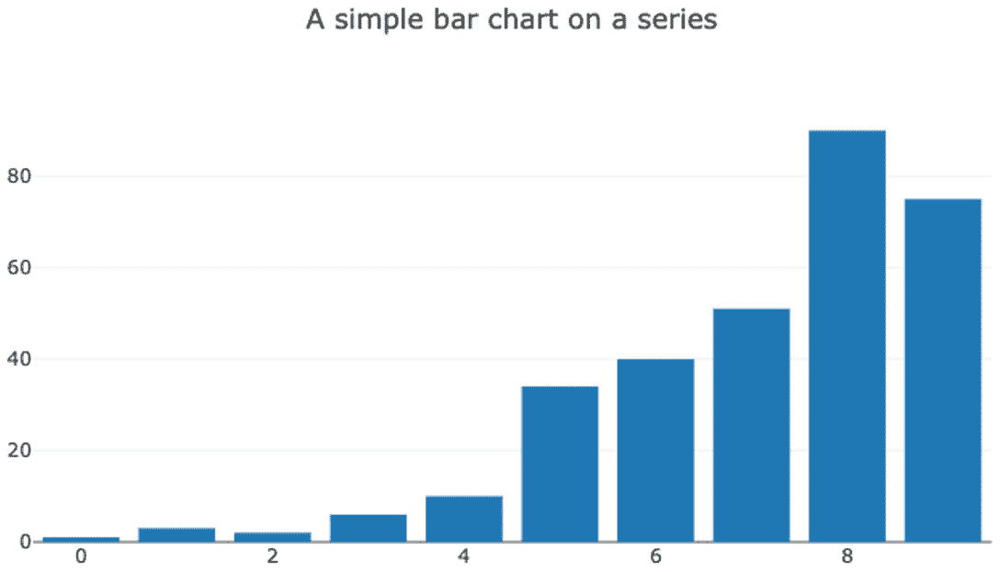

图 6.20 - 具有固定值的 Series 上的条形图

在下一节中，我们将向您展示如何从指定的列名列表中制作分组条形图。

## 从多列创建条形图

要从列名列表创建分组条形图，可以将列名传递给`config`对象，如下面的示例所示：

```js
var layout = { 
  title: "A bar chart on two columns", 
} 
var config = {  
  columns: ["price", "cost"],
  layout  
}   
var df = new dfd.DataFrame({'price': [20, 18, 489, 675, 1776],
                           'cost': [40, 22, 21, 60, 19],
                           'count': [4, 25, 281, 600, 1900]},
                        {index: [1990, 1997, 2003, 2009, 2014]})
df.plot(this_div()).bar(config)
```

运行上述代码单元格会得到以下输出：


图 6.21 - 两列的条形图

请注意，在前面的示例中，我们创建了一个新的 DataFrame。这是因为金融数据集不包含条形图所需的数据类型，正如我们之前所说的。

这就是本章的结束。恭喜您走到了这一步！我们相信您已经学到了很多，并且可以在个人项目中应用在这里获得的知识。

# 总结

在本章中，我们介绍了使用 Danfo.js 进行绘图和可视化。首先，我们向您展示了如何在新项目中设置 Danfo.js 和 Plotly，然后继续下载数据集，将其加载到 DataFrame 中。接下来，我们向您展示了如何创建基本图表，如折线图、条形图和散点图，然后是统计图表，如直方图以及箱线图和小提琴图。最后，我们向您展示了如何配置使用 Danfo.js 创建的图表。

在本章和第五章《使用 Plotly.js 进行数据可视化》中所获得的知识将在创建数据驱动的应用程序以及自定义仪表板时发挥实际作用。

在下一章中，您将学习有关数据聚合和分组操作，从而了解如何执行数据转换，如合并、连接和串联。
