# 第八章：*第七章*：数据聚合和分组操作

对分组数据进行`groupby`操作（聚合或转换）以生成一组新值。然后将结果值组合成单个数据组。

这种方法通常被称为**split-apply-combine**。这个术语实际上是由 Hadley Wickham 创造的，他是许多流行的**R**包的作者，用来描述分组操作。*图 7.1*以图形方式描述了 split-apply-combine 的概念：

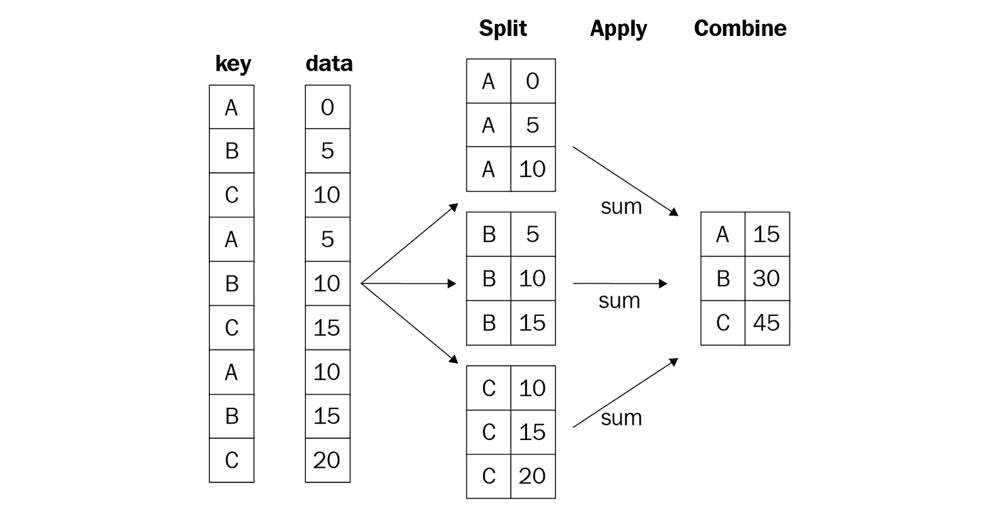

图 7.1 – groupby 说明

在本章中，我们将探讨执行分组操作的方法：如何按列键对数据进行分组，并在分组数据上联合或独立地执行数据聚合。

本章还将展示如何通过键访问分组数据。它还提供了如何为您的数据创建自定义聚合函数的见解。

本章将涵盖以下主题：

+   数据分组

+   遍历分组数据

+   使用`.apply`方法

+   分组数据的数据聚合

# 技术要求

为了跟随本章，您应该具有以下内容：

+   像 Chrome、Safari、Opera 或 Firefox 这样的现代浏览器

+   **Node.js**、**Danfo.js**和**Dnotebook**已安装在您的系统上

本章的代码在此处可用：[`github.com/PacktPublishing/Building-Data-Driven-Applications-with-Danfo.js/tree/main/Chapter07`](https://github.com/PacktPublishing/Building-Data-Driven-Applications-with-Danfo.js/tree/main/Chapter07)。

# 数据分组

Danfo.js 只提供了通过特定列中的值对数据进行分组的能力。对于当前版本的 Danfo.js，分组的指定列数只能是一列或两列。

在本节中，我们将展示如何按单个列和双列进行分组。

## 单列分组

首先，让我们通过创建一个 DataFrame 然后按单个列对其进行分组来开始：

```js
let data = { 'A': [ 'foo', 'bar', 'foo', 'bar',
                    'foo', 'bar', 'foo', 'foo' ],
                     'C': [ 1, 3, 2, 4, 5, 2, 6, 7 ],
            'D': [ 3, 2, 4, 1, 5, 6, 7, 8 ] };
let df = new dfd.DataFrame(data);
let group_df = df.groupby([ "A"]);
```

上述代码涉及以下步骤：

1.  首先，我们使用`object`方法创建一个 DataFrame。

1.  然后我们调用`groupby`方法。

1.  然后，我们指定 DataFrame 应该按列`A`进行分组。

`df.groupby(['A'])`返回一个`groupby`数据结构，其中包含对数据进行分组所需的所有必要方法。

我们可以决定对由`A`分组的所有列执行数据操作，或者指定任何其他列。

上述代码输出以下表：


图 7.2 – DataFrame

在下面的代码中，我们将看到如何对分组数据执行一些常见的`groupby`操作：

```js
group_df.mean().print()
```

使用上述代码片段中创建的`groupby_df`操作，我们调用`groupby`的`mean`方法。该方法计算每个组的平均值，如下图所示：


图 7.3 – groupby DataFrame

下图以图形方式显示了上述代码的操作以及如何生成上述表的输出：

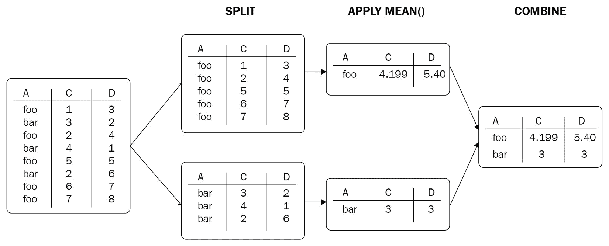

图 7.4 – groupby 方法的图形描述

根据本章开头讨论的 split-apply-combine 方法，`df.groupby(['A'])`将 DataFrame 分成两个键-`foo`和`bar`。

将 DataFrame 分组为`foo`和`bar`键后，其他列（`C`和`D`）中的值分别根据它们的行对齐分配给每个键。为了强调这一点，如果我们选择`bar`键，从*图 7.2*中，我们可以看到列`C`在`bar`行中有三个数据点（`3`、`4`、`2`）。

因此，如果我们要执行数据聚合操作，比如计算分配给`bar`键的数据的平均值，分配给`bar`键的列`C`的数据点将具有平均值`3`，这对应于*图 7.3*中的表。

注意

与前面段落中描述的相同操作发生在`foo`键上，所有其他数据点都被分配

如我之前所说，这次对分组均值方法的调用适用于所有按`A`分组的列。让我们选择一个特定应用组操作的列，如下所示：

```js
let col_c = group_df.col(['C'])
col_c.sum().print()
```

首先，我们调用`groupby`中的`col`方法。该方法接受一个列名的数组。上述代码的主要目的是获取每个分组键（`foo`和`bar`）的列`C`的总和，这给出以下表格输出：


图 7.5 – 列 C 的分组操作

同样的操作可以应用于分组数据中的任何其他列，如下所示：

```js
let col_d = group_df.col(['D'])
col_d.count().print()
```

这段代码片段遵循与上述代码相同的方法，只是将`count` `groupby`操作应用于列`D`，这给出了以下输出：


图 7.6 – 列 D 的 groupby“count”操作

DataFrame 也可以按两列进行分组；单列分组所示的操作也适用于双列分组，我们将在下一小节中看到。

## 双列分组

首先，让我们创建一个 DataFrame 并添加一个额外的列，如下所示：

```js
let data = { 'A': [ 'foo', 'bar', 'foo', 'bar',
                    'foo', 'bar', 'foo', 'foo' ],
              ' B': [ 'one', 'one', 'two', 'three',
                  'two', 'two', 'one', 'three' ],
               'C': [ 1, 3, 2, 4, 5, 2, 6, 7 ],
               'D': [ 3, 2, 4, 1, 5, 6, 7, 8 ] };
let df = new dfd.DataFrame(data);
let group_df = df.groupby([ "A", "B"]);
```

我们添加了一个额外的列`B`，其中包含分类数据 - `one`，`two`和`three`。DataFrame 按列`A`和`B`进行分组，如下表所示：

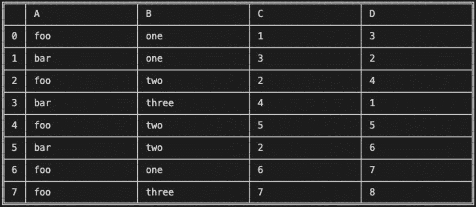

图 7.7 – 包含列 B 的 DataFrame

我们也可以像单列分组一样计算平均值，如下所示：

```js
group_df.mean().print()
```

这将根据列`A`和`B`的分组键对列`C`和`D`应用平均值。例如，在*图 7.7*中，我们可以看到我们有一个来自列`A`和`B`的分组键，名为（`foo`，`one`）。这个键在数据中出现了两次。

上述代码输出以下表格：


图 7.8 – 按 A 和 B 分组的 groupby 均值 DataFrame

在*图 7.7*中，列`C`的值为`1`和`6`，属于（`foo`，`one`）键。同样，`D`的值为`3`和`7`，属于相同的键。如果我们计算平均值，我们会发现它对应于*图 7.8*中的第一列。

我们还可以继续按列`A`和`B`对分组的一列进行求和。让我们选择列`C`：

```js
let col_c = group_df.col(['C']);
col_c.sum().print();
```

我们从分组数据中获取了列`C`，然后计算了每个分组键的总和，如下表所示：

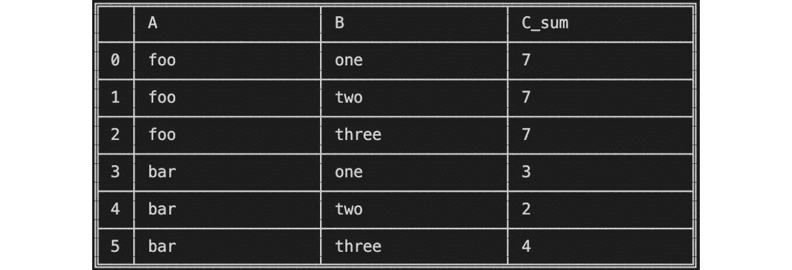

图 7.9 – 每组列 C 的总和

在本节中，我们看到了如何按单列或双列分组数据。我们还研究了执行数据聚合和访问分组 DataFrame 的列数据。在下一节中，我们将看看如何访问按分组键分组的数据。

# 遍历分组数据

在本节中，我们将看到如何根据分组键访问分组数据，循环遍历这些分组数据，并对其执行数据聚合操作。

## 通过单列和双列分组数据进行迭代

在本节中，我们将看到 Danfo.js 如何提供迭代通过`groupby`操作创建的每个组的方法。这些数据是按`groupby`列中包含的键进行分组的。

键存储为一个名为`data_tensors`的类属性中的字典或对象。该对象包含分组键作为其键，并将与键关联的 DataFrame 数据存储为对象值。

使用上一个 DataFrame，让我们按列`A`进行分组，然后遍历`data_tensors`：

```js
let group_df = df.groupby([ "A"]);
console.log(group_df.data_tensors)
```

我们按列`A`对 DataFrame 进行分组，然后打印出`data_tensors`，如下截图所示：


图 7.10 – data_tensors 输出

*图 7.10*包含了关于`data_tensors`属性包含的更详细信息，但整个内容可以总结为以下结构：

```js
{
  foo: DataFrame,
  bar: DataFrame
}
```

键是列`A`的值，键的值是与这些键关联的 DataFrame。

我们可以迭代`data_tensors`并打印出`DataFrame`表格，以查看它们包含的内容，如下面的代码所示：

```js
let grouped_data = group_df.data_tensors;
for (let key in grouped_data) {
  grouped_data[key].print();
}
```

首先，我们访问`data_tensors`，这是一个`groupby`类属性，并将其赋值给一个名为`grouped_data`的变量。然后我们循环遍历`grouped_data`，访问每个键，并将它们对应的 DataFrame 打印为表格，如下面的截图所示：

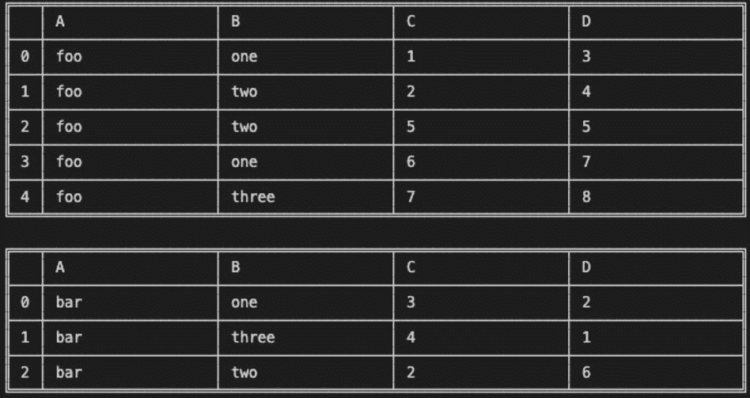

图 7.11 – groupby 键和它们的 DataFrame

此外，我们可以将与前面代码相同的方法应用到由两列分组的数据上，如下所示：

```js
let group_df = df.groupby([ "A", "B"]); 
let grouped_data = group_df.data_tensors;
for (let key in grouped_data) {
  let key_data = grouped_data[key];
  for (let key2 in key_data) {
    grouped_data[key][key2].print();
  }
}
```

以下是我们在前面的代码片段中遵循的步骤：

1.  首先，`df` DataFrame 按两列（`A`和`B`）进行分组。

1.  我们将`data_tensors`赋值给一个名为`grouped_data`的变量。

1.  我们循环遍历`grouped_data`以获取键。

1.  我们循环遍历`grouped_data`对象，也循环遍历其内部对象（`key_data`）每个键，由于为`grouped_data`生成的对象数据格式，如下所示：

```js
{
  foo : {
    one: DataFrame,
    two: DataFrame,
    three: DataFrame
  },
  bar: {
    one: DataFrame,
    two: DataFrame,
    three: DataFrame
  }
}
```

代码片段给我们提供了以下输出：

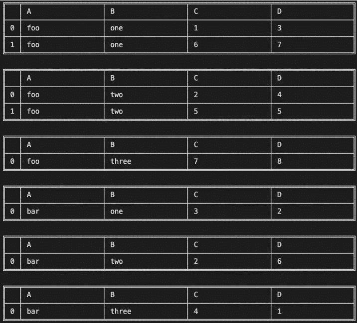

图 7.12 – DataFrame 的两列分组输出

在本节中，我们学习了如何迭代分组数据。我们看到了`data_tensor`的对象格式如何根据数据的分组方式而变化，无论是单列还是双列。

我们看到了如何迭代`data_tensor`以获取键和它们关联的数据。在下一小节中，我们将看到如何在不手动循环`data_tensor`的情况下获取与每个键关联的数据。

### 使用`get_groups`方法

Danfo.js 提供了一个名为`get_groups()`的方法，可以轻松访问每个键值 DataFrame，而无需循环遍历`data_tensors`对象。每当我们需要访问属于一组键组合的特定数据时，这将非常方便。

让我们从单列分组开始，如下所示：

```js
let group_df = df.groupby([ "A"]);
group_df.get_groups(["foo"]).print()
```

我们按列`A`进行分组，然后调用`get_groups`方法。`get_groups`方法接受一个键组合作为数组。

对于单列分组，我们只有一个键组合。因此，我们传入名为`foo`的其中一个键，然后打印出相应的分组数据，如下面的截图所示：


图 7.13 – foo 键的 get_groups

同样的方法也可以应用于所有其他键，如下所示：

```js
group_df.get_groups(["bar"]).print()
```

前面的代码给我们提供了以下输出：


图 7.14 – bar 键的 get_groups

与单列`groupby`相同的方法也适用于两列分组：

```js
let group_df = df.groupby([ "A", "B"]);
group_df.get_groups(["foo","one"]).print()
```

请记住，`get_groups`方法接受键的组合作为数组。因此，对于两列分组，我们传入要使用的列`A`和`B`的键组合。因此，我们获得以下输出：


图 7.15 – 获取 foo 键和一个组合的 DataFrame

可以对任何其他键组合做同样的操作。让我们尝试`bar`和`two`键，如下所示：

```js
group_df.get_groups(["bar","two"]).print()
```

我们获得以下输出：


图 7.16 – bar 和 two 键的 DataFrame

在本节中，我们介绍了如何迭代分组数据，数据可以按单列或双列进行分组。我们还看到了内部的`data_tensor`数据对象是如何根据数据的分组方式进行格式化的。我们还看到了如何在不循环的情况下访问与每个分组键相关联的数据。

在下一节中，我们还将研究如何使用.apply 方法创建自定义数据聚合函数。

# 使用.apply 方法

在本节中，我们将使用`.apply`方法创建自定义数据聚合函数，可以应用于我们的分组数据。

`.apply`方法使得可以将自定义函数应用于分组数据。这是本章前面讨论的分割-应用-合并方法的主要函数。

Danfo.js 中实现的`groupby`方法只包含了一小部分用于组数据的数据聚合方法，因此`.apply`方法使用户能够从分组数据中构建特殊的数据聚合方法。

使用前面的数据，我们将创建一个新的 DataFrame，不包括前一个 DataFrame 中的列`B`，然后创建一个将应用于分组数据的自定义函数：

```js
let group_df = df.groupby([ "A"]);
const add = (x) => {
  return x.add(2);
};
group_df.apply(add).print();
```

在前面的代码中，我们按列`A`对 DataFrame 进行分组，然后创建一个名为`add`的自定义函数，将值`2`添加到分组数据中的所有数据点。

注意

要传递到这个函数的参数`add`和类似的函数，如`sub`、`mul`和`div`，可以是 DataFrame、Series、数组或整数值。 

前面的代码生成了以下输出：

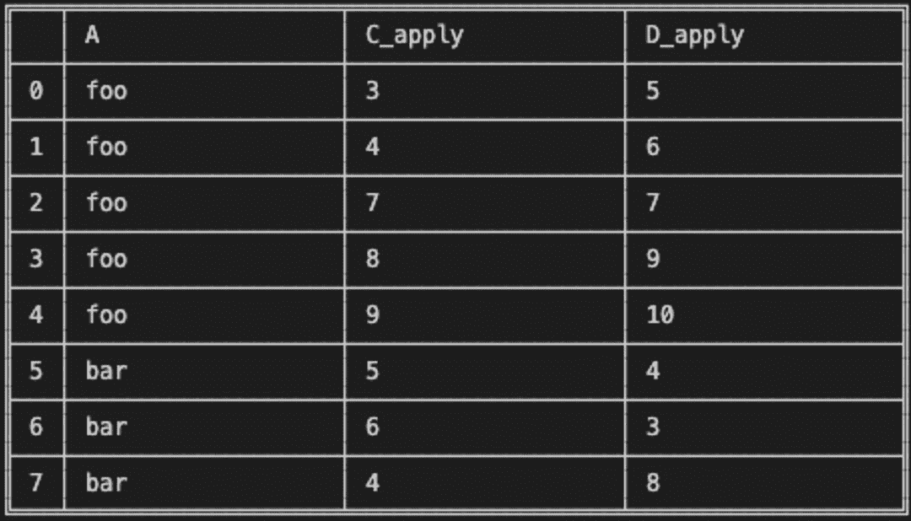

图 7.17 - 将自定义函数应用于组数据

让我们创建另一个自定义函数，从每个分组数据中减去最小值：

```js
let data = { 'A': [ 'foo', 'bar', 'foo', 'bar',
                    'foo', 'bar', 'foo', 'foo' ],
            'B': [ 'one', 'one', 'two', 'three',
                  'two', 'two', 'one', 'three' ],
            'C': [ 1, 3, 2, 4, 5, 2, 6, 7 ],
            'D': [ 3, 2, 4, 1, 5, 6, 7, 8 ] };
let df = new DataFrame(data);
let group_df = df.groupby([ "A", "B"]);

const subMin = (x) => {
  return x.sub(x.min());
};

group_df.apply(subMin).print();
```

首先，我们创建了一个包含列`A`、`B`、`C`和`D`的 DataFrame。然后，我们按列`A`和`C`对 DataFrame 进行分组。

创建一个名为`subMin`的自定义函数，用于获取分组数据的最小值，并从分组数据中的每个数据点中减去最小值。

然后，通过.apply 方法将这个自定义函数应用于`group_df`分组数据，因此我们得到了以下输出表：


图 7.18 - subMin 自定义应用函数

如果我们看一下前面图中的表，我们可以看到一些组数据只出现一次，比如属于`bar`和`two`、`bar`和`one`、`bar`和`three`以及`foo`和`three`键的组数据。

前一个键的组数据只有一个项目，因此最小值也是组中包含的单个值；因此，`C_apply`和`D_apply`列的值为`0`。

我们可以调整`subMin`自定义函数，只有在键对有多行时才从每个值中减去最小值，如下所示：

```js
const subMin = (x) => {
  if (x.values.length > 1) {
    return x.sub(x.min());
  } else {
    return x;
  }
};

group_df.apply(subMin).print();
```

自定义函数给出了以下输出表：

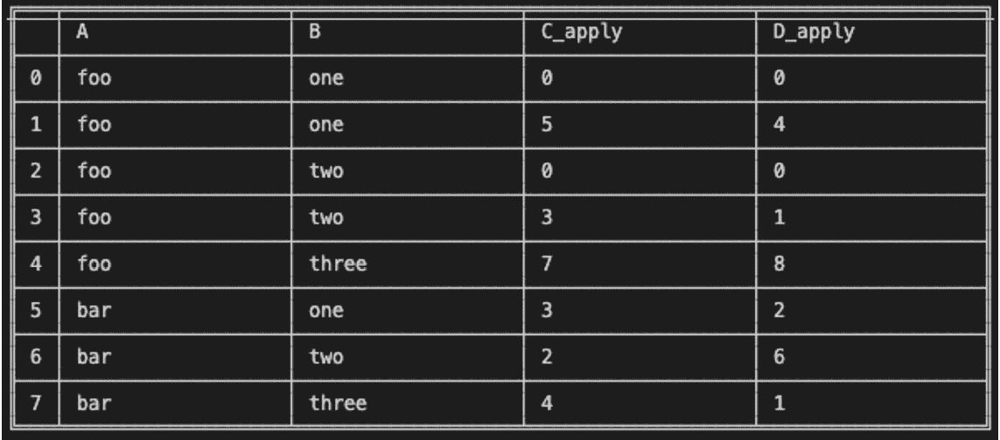

图 7.19 - 自定义 apply 函数

下图显示了前面代码的图形表示：

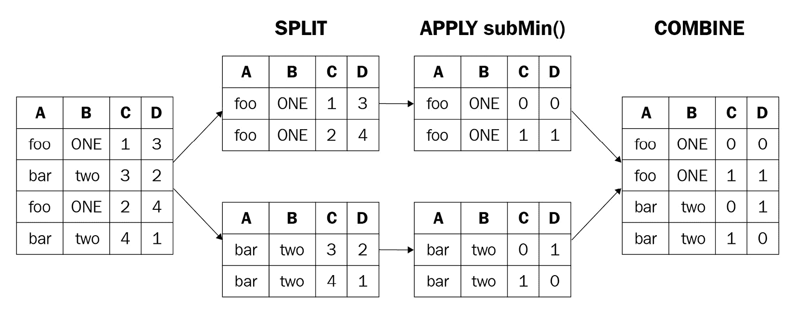

图 7.20 - groupby 和 subMin apply 方法示例

`.apply`方法还使我们能够对数据进行分组后的数据归一化处理。

在机器学习中，我们有所谓的**标准化**，它涉及将数据重新缩放到范围-1 和 1 之间。标准化的过程涉及从数据中减去数据的平均值，然后除以标准差。

使用前面的 DataFrame，让我们创建一个自定义函数，对数据进行标准化处理：

```js
let data = { 'A': [ 'foo', 'bar', 'foo', 'bar',
                    'foo', 'bar', 'foo', 'foo' ],
            'C': [ 1, 3, 2, 4, 5, 2, 6, 7 ],
            'D': [ 3, 2, 4, 1, 5, 6, 7, 8 ] };
let df = new DataFrame(data);
let group_df = df.groupby([ "A"]);

// (x - x.mean()) / x.std()
const norm = (x) => {
  return x.sub(x.mean()).div(x.std());
};

group_df.apply(norm).print();
```

在前面的代码中，我们首先按列`A`对数据进行分组。然后，我们创建了一个名为`norm`的自定义函数，其中包含正在应用于数据的标准化过程，以产生以下输出：

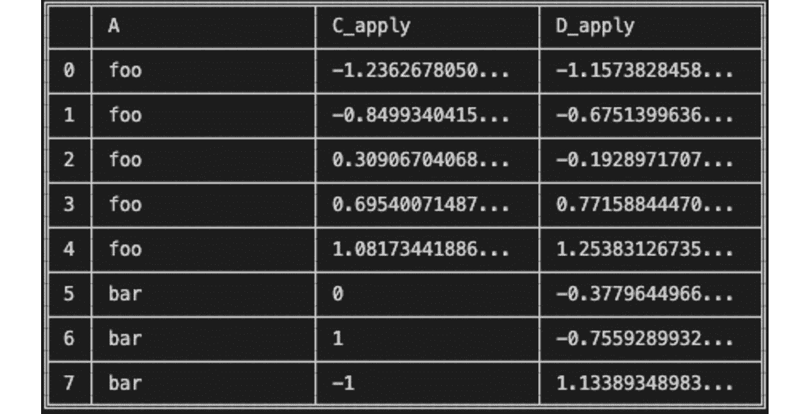

图 7.21 - 对分组数据进行标准化

我们已经看到了如何使用`.apply`方法为`groupby`操作创建自定义函数。因此，我们可以根据所需的操作类型创建自定义函数。

在下一节中，我们将研究数据聚合以及如何将不同的数据聚合操作分配给分组数据的不同列。

# 对分组数据进行数据聚合

数据聚合涉及收集数据并以摘要形式呈现，例如显示其统计数据。聚合本身是为统计目的收集数据并将其呈现为数字的过程。在本节中，我们将看看如何在 Danfo.js 中执行数据聚合

以下是所有可用的聚合方法列表：

+   `mean()`: 计算分组数据的平均值

+   `std()`: 计算标准差

+   `sum()`: 获取组中值的总和

+   `count()`: 计算每组的总值数

+   `min()`: 获取每组的最小值

+   `max()`: 获取每组的最大值

在本章的开头，我们看到了如何在组数据上调用先前列出的一些聚合方法。`groupby`类还包含一个名为`.agg`的方法，它允许我们同时对不同列应用不同的聚合操作。

## 对单列分组进行数据聚合

我们将创建一个 DataFrame，并按列对 DataFrame 进行分组，然后在不同列上应用两种不同的聚合方法：

```js
let data = { 'A': [ 'foo', 'bar', 'foo', 'bar',
      'foo', 'bar', 'foo', 'foo' ],
    'C': [ 1, 3, 2, 4, 5, 2, 6, 7 ],
    'D': [ 3, 2, 4, 1, 5, 6, 7, 8 ] };
let df = new DataFrame(data);
let group_df = df.groupby([ "A"]);

group_df.agg({ C:"mean", D: "count" }).print();
```

我们创建了一个 DataFrame，然后按列`A`对 DataFrame 进行分组。然后通过调用`.agg`方法对分组数据进行聚合。

`.agg`方法接受一个对象，其键是 DataFrame 中列的名称，值是我们要应用于每个列的聚合方法。在前面的代码块中，我们指定了键为`C`和`D`，值为`mean`和`count`：


图 7.22 - 对组数据进行聚合方法

我们已经看到了如何在单列分组上进行数据聚合。现在让我们看看如何在由双列分组的 DataFrame 上执行相同的操作。

## 对双列分组进行数据聚合

对于双列分组，让我们应用相同的聚合方法：

```js
let data = { 'A': [ 'foo', 'bar', 'foo', 'bar',
      'foo', 'bar', 'foo', 'foo' ],
    'B': [ 'one', 'one', 'two', 'three',
      'two', 'two', 'one', 'three' ],
    'C': [ 1, 3, 2, 4, 5, 2, 6, 7 ],
    'D': [ 3, 2, 4, 1, 5, 6, 7, 8 ] };
let df = new DataFrame(data);
let group_df = df.groupby([ "A", "B"]);

group_df.agg({ C:"mean", D: "count" }).print();
```

前面的代码给出了以下输出：

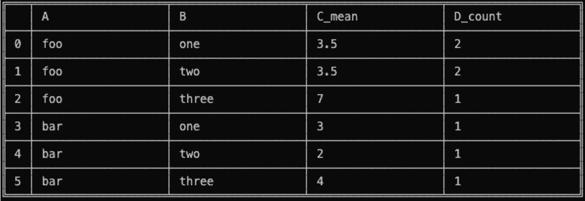

图 7.23 - 对两列分组数据进行聚合方法

在本节中，我们已经看到了如何使用`.apply`方法为分组数据创建自定义函数，以及如何对分组数据的每一列执行联合数据聚合。这里显示的示例可以扩展到任何特定数据，并且可以根据需要创建自定义函数。

## 在真实数据上应用 groupby 的简单示例

我们已经看到了如何在虚拟数据上使用`groupby`方法。在本节中，我们将看到如何使用`groupby`来分析数据。

我们将使用此处提供的流行的`titanic`数据集：[`web.stanford.edu/class/archive/cs/cs109/cs109.1166/stuff/titanic.csv`](https://web.stanford.edu/class/archive/cs/cs109/cs109.1166/stuff/titanic.csv)。我们将看看如何根据性别和阶级估计幸存泰坦尼克号事故的平均人数。

让我们将`titanic`数据集读入 DataFrame 并输出其中的一些行：

```js
const dfd = require('danfojs-node')
async function analysis(){
  const df = dfd.read_csv("titanic.csv")
  df.head().print()
}
analysis()
```

前面的代码应该输出以下表格：


图 7.24 - DataFrame 表

从数据集中，我们想要估计根据性别（`Sex`列）和他们的旅行等级（`Pclass`列）生存的人数。

以下代码显示了如何估计先前描述的平均生存率：

```js
const dfd = require('danfojs-node')
async function analysis(){
  const df = dfd.read_csv("titanic.csv")
  df.head().print()

  //groupby Sex column
  const sex_df = df.groupby(["Sex"]).col(["Survived"]).mean()
  sex_df.head().print()

  //groupby Pclass column
  const pclass_df = df.groupby(["Pclass"]).col(["Survived"]).mean()
  pclass_df.head().print()
}
analysis()
```

以下表格显示了每个性别的平均生存率：


图 7.25 - 基于性别的平均生存率

以下表格显示了每个等级的平均生存率：


图 7.26 - 基于 Pclass 的平均生存率

在本节中，我们简要介绍了如何使用`groupby`操作来分析现实生活中的数据。

# 总结

在本章中，我们广泛讨论了在 Danfo.js 中实现的`groupby`操作。我们讨论了对数据进行分组，并提到目前，Danfo.js 仅支持按单列和双列进行分组；计划在未来的版本中使其更加灵活。我们还展示了如何遍历分组数据并访问组键及其关联的分组数据。我们看了如何在不循环的情况下获得与组键相关的分组数据。

我们还看到了`.apply`方法如何为我们提供了创建自定义数据聚合函数的能力，最后，我们演示了如何同时对分组数据的不同列执行不同的聚合函数。

本章使我们具备了对数据进行分组的知识，更重要的是，它向我们介绍了 Danfo.js 的内部工作原理。有了这个，我们可以将`groupby`方法重塑成我们想要的味道，并且有能力为 Danfo.js 做出贡献。

在下一章中，我们将继续介绍更多应用基础知识，包括如何使用 Danfo.js 构建数据分析 Web 应用程序，一个无代码环境。我们还将看到如何将 Danfo.js 方法转换为 React 组件。
