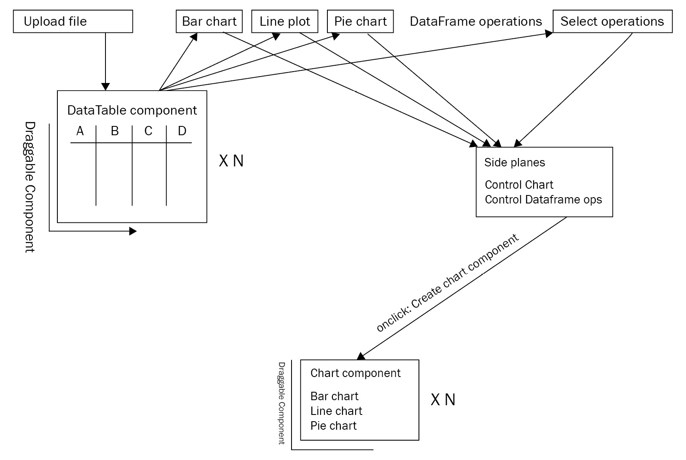
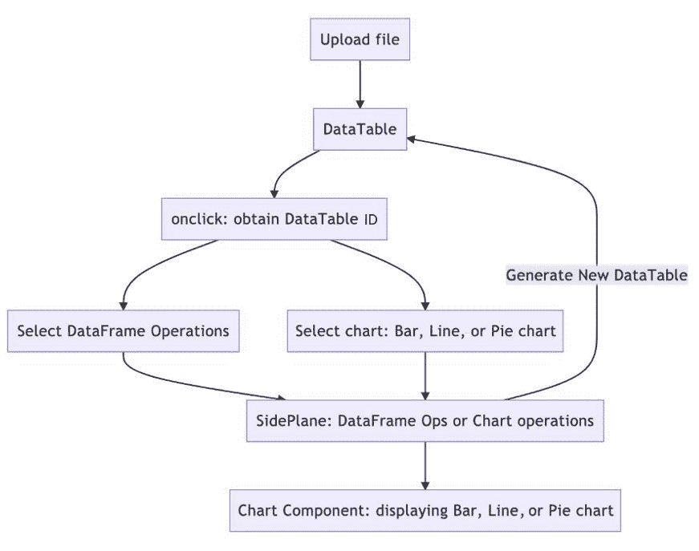
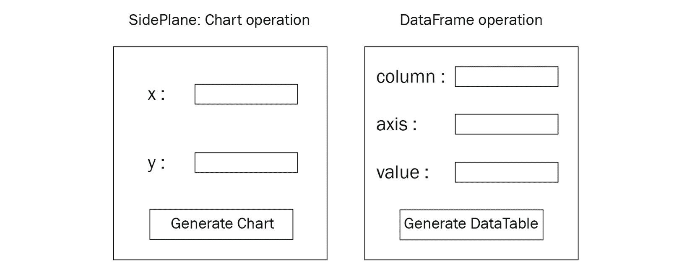
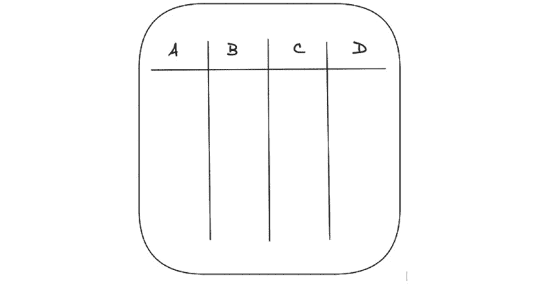
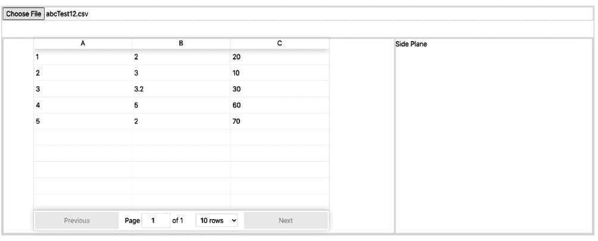
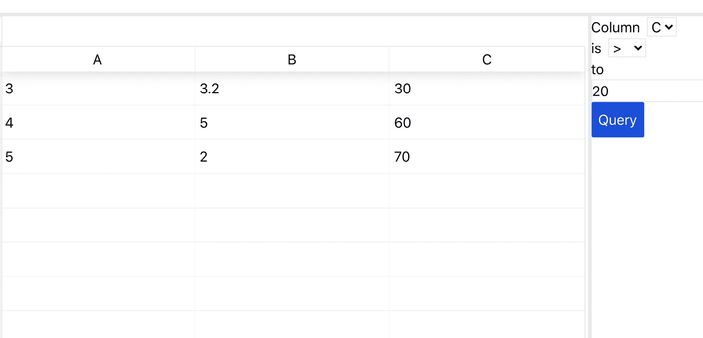
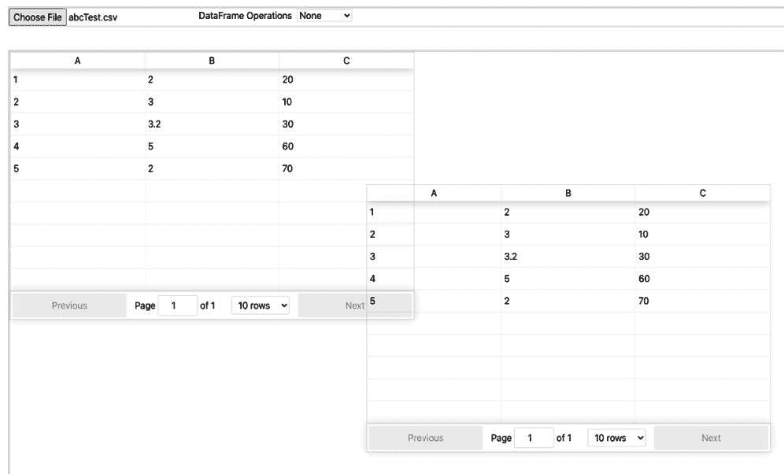
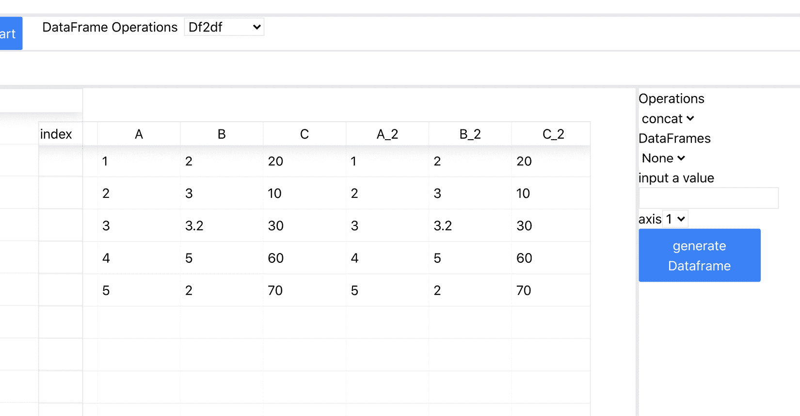
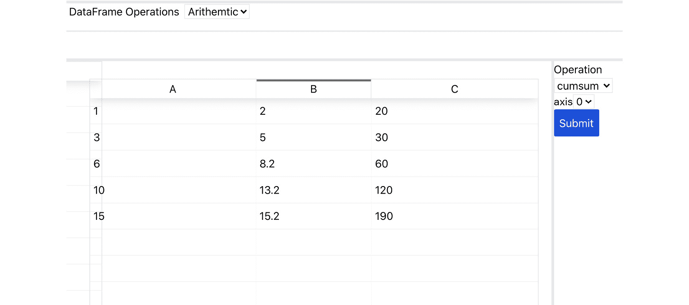
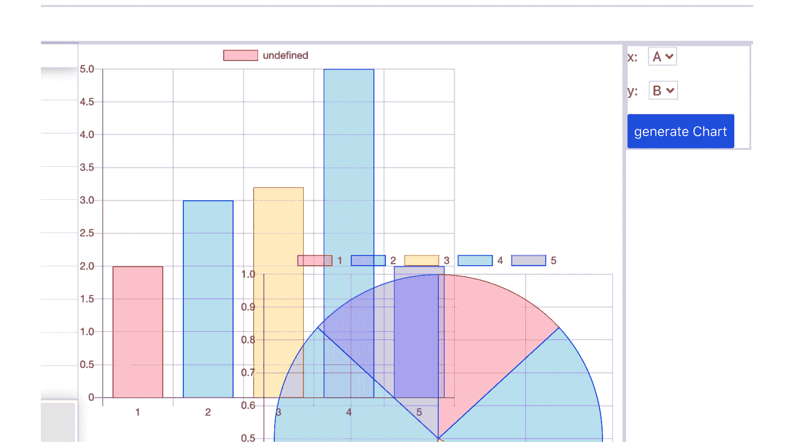

# 第九章：创建无代码数据分析/处理系统

创建**Danfo.js**的主要目的之一是在浏览器中轻松启用数据处理。这使得能够将数据分析和处理数据无缝地集成到 Web 应用程序中。除了能够将数据处理添加到 Web 应用程序中，我们还有工具可以使数据处理和分析看起来更像设计师在使用**Photoshop**和**Figma**时所做的事情；他们如何在画布上混合刷子笔触，只需点击一下，或者如何通过拖放和一些按钮点击在画布上叠加画布来操纵图像。

使用 Danfo.js，我们可以轻松地启用这样的环境（使用**React.js**和**Vue.js**等工具），在这样的环境中，数据科学家可以像艺术家一样通过几次点击按钮来操纵数据，并在不实际编写任何代码的情况下获得所需的输出。

许多具有这些功能的工具通常存在，但 Danfo.js 的很酷的地方是使用 JavaScript 构建整个应用程序的工具。事实上，在浏览器中执行所有操作而不调用服务器是非常惊人的。

本章的目标是展示如何使用 Danfo.js 和 React.js 构建这样的环境。还要注意，这里使用的工具（除了 Danfo.js 之外）不是构建应用程序的必需工具；这些只是我非常熟悉的工具。

本章将涵盖以下主题：

+   设置项目环境

+   构建和设计应用程序

+   应用程序布局和`DataTable`组件

+   创建不同的`DataFrame`操作组件

+   实现`Chart`组件

# 技术要求

本章的基本环境和知识要求如下：

+   现代 Web 浏览器，如**Chrome**

+   适合的代码编辑器，如**VScode**

+   已安装**Node.js**

+   对`tailwindcss`和`React-chart-js`有一些了解

+   需要了解 React.js 的基础知识。要了解 React.js，请访问官方网站[`reactjs.org/docs/hello-world.html`](https://reactjs.org/docs/hello-world.html)

+   本章的代码可在 GitHub 上克隆，网址为[`github.com/PacktPublishing/Building-Data-Driven-Applications-with-Danfo.js/tree/main/Chapter08`](https://github.com/PacktPublishing/Building-Data-Driven-Applications-with-Danfo.js/tree/main/Chapter08)

# 设置项目环境

项目使用 React.js，并且为了设置 React 应用程序，我们将使用`create-react-app`包自动生成前端构建流水线。但首先，请确保您已安装 Node.js 和`npx`，这是随*npm 5.2+*一起提供的包运行工具。

在我们开始设置环境之前，这里是本章中需要的工具，并将在其中安装：

+   **React.js**：用于构建 UI 的 JavaScript 框架

+   **Draggable**：使 HTML 元素可以拖放的拖放库

+   `图表`组件

+   **React-table-v6**：用于显示表格的 React 库

以下是前述工具的一些替代方案：

+   **Vue.js**：用于构建 UI 的 JavaScript 库

+   **rechart.js**：基于 React.js 构建的可组合图表库

+   **Material-table**：基于**material-UI**的 React 数据表

要创建 React 应用程序流水线，我们使用`npx`调用`create-react-app`，然后指定我们的项目名称如下：

```js
$ npx create-react-app data-art
```

此命令将在启动命令的父目录中创建一个名为`data-art`的目录。`data-art`目录中预先填充了 React.js 模板和所有所需的包。

这是`data-art`文件夹的结构：


图 8.1 – React.js 目录结构

安装完成后，我们可以使用以下命令始终启动应用程序（假设您不在终端中的`data-art`目录中）：

```js
$ cd data-art
$ yarn start
```

以下命令将启动应用程序服务器，并在终端中输出应用程序运行的服务器端口：


图 8.2 – yarn start 输出

如*图 8.1*所示，应用程序在`http://localhost:3000`上提供。如果一切正常，那么一旦服务器启动，它将自动打开 Web 浏览器以显示 React 应用程序。

在应用程序的开发中，我们不会花费更多时间在样式上，但我们将使将来集成样式变得更容易，并且还可以实现快速原型设计；我们将使用`tailwindcss`。

为了使 Tailwind 与 React.js 应用程序一起工作，我们需要进行一些额外的配置。

让我们按照`tailwindcss`文档中所示通过`npm`安装 Tailwind 及其对等依赖项：[`tailwindcss.com/docs/guides/create-react-app`](https://tailwindcss.com/docs/guides/create-react-app)：

```js
npm install -D tailwindcss@npm:@tailwindcss/postcss7-compat postcss@⁷ autoprefixer@⁹
```

安装完成后，我们将继续安装`craco`模块，它允许我们覆盖`postcss`配置如下：

```js
npm install @craco/craco
```

安装完`craco`后，我们可以继续配置如何构建、启动和测试 React 应用程序。这将通过更改`package.json`中`"start"`、`"build"`和`"test"`的命令来完成，如下所示：

```js
{
  "start": "craco start",
  "build": "craco build",
  "test": "craco test",
}
```

通过之前所做的更改，让我们创建一个配置文件，使`craco`在构建 React 应用程序时始终注入`tailwindcss`和`autoprefixer`，如下所示：

```js
// craco.config.js
module.exports = {
  style: {
    postcss: {
      plugins: [
        require('tailwindcss'),
        require('autoprefixer'),
      ],
    },
  },
}
```

让我们配置`tailwindcss`本身。通过这个配置，我们可以告诉`tailwindcss`在生产中删除未使用的样式，我们可以添加自定义主题，还可以添加`tailwindcss`包中未包含的自定义颜色、字体、宽度和高度，如下所示：

```js
//tailwind.config.js
module.exports = {
  purge: ["./src/**/*.{js,jsx,ts,tsx}", "./public/index.html"],
  darkMode: false, // or 'media' or 'class'
  theme: {
    extend: {},
  },
  variants: {
    extend: {},
  },
  plugins: [],
};
```

在配置 Tailwind 之后，我们将编辑`src`目录中的`css`文件`index.css`。我们将向文件中添加以下内容：

```js
/* ./src/index.css */
@tailwind base;
@tailwind components;
@tailwind utilities;
```

我们已经完成了配置；现在我们可以在`index.js`中导入`index.css`：

```js
//index.js
. . . . . .
import "./index.css
. . . . . .
```

请注意，在`App.js`中，我们仍然有`create-react-app`包中提供的默认代码；让我们编辑代码。这是初始代码：

```js
function App() {
  return (
    <div className="App">
      <header className="App-header">
        
        <p>
          Edit <code>src/App.js</code> and save to reload.
        </p>
        <a
          className="App-link"
          href="https://reactjs.org"
          target="_blank"
          rel="noopener noreferrer"
        >
          Learn React
        </a>
      </header>
    </div>
  );
}
```

我们通过编辑 HTML 代码在`App`注释中编辑 HTML，并用应用程序的名称替换它：

```js
function App() {
  return (
    <div className="">
      Data-Art
    </div>
  );
}
```

通过更新`App.js`并保存前面的代码，您应该直接在浏览器中看到所做的更改，如下截图所示：


图 8.3 – React 应用程序

让我们测试我们的`tailwindcss`配置，以确保它设置正确。我们将通过向前面的代码添加一些样式来做到这一点，如下所示：

```js
function App() {
  return (
    <div className="max-w-2xl border mx-auto text-3xl mt-60 text-center">
      Data-Art
    </div>
  );
}
```

`css`样式是在名为`className`的`div`属性中声明的。首先，我们设置最大宽度和边框，然后在*x*轴上创建一个边距（左右边距为`auto`），声明字体大小为`text-3xl`，将顶部边距设置为`60`，然后在`div`实例中居中文本。

根据样式，我们应该看到以下输出：


图 8.4 – 居中 div 和文本

代码库已经设置好，我们准备实现无代码环境。

在本节中，我们看到了如何为我们的应用程序设置 React 环境。我们还看到了如何为我们的应用程序配置`tailwindcss`。在下一节中，我们将学习如何构建和设计应用程序。

# 构建和设计应用程序

React.js 有一些关于应用程序设计的核心理念，主要是将 UI 分解为组件层次结构，另一个理念是确定状态应该存在的位置。

在本节中，我们将看到如何使用 React.js 设计无代码应用程序的结构，并考虑 React 应用程序设计的理念。根据这个原则，我们将发现在 React 中实现基本 UI 很容易。

首先，让我们了解什么是无代码环境，以及我们希望通过它实现什么。无代码环境用于通过点击几下按钮使数据处理和分析变得更加容易。

我们将创建一个平台，用户可以上传其数据，进行分析，并进行代码操作，例如以下操作：

+   DataFrame 到 DataFrame 操作，例如`concat`

+   诸如`cummax`和`cumsum`之类的算术操作

+   通过查询按列值筛选出 DataFrame

+   描述 DataFrame

我们希望能够在不编写代码的情况下完成所有这些操作，并且所有操作都将在浏览器中完成。我们还希望通过数据可视化（使用柱状图、折线图和饼图）获得数据洞察。以下图显示了应用程序设计的草图：



图 8.5 - 应用程序结构和设计草图

*图 8.5*显示了应用程序的结构和设计。应用程序分为三个主要组件，如下所示：

+   “导航栏”组件，包含文件上传、柱状图、折线图和`DataFrame`操作选择字段

+   包含“数据表”组件和“图表”组件的主体

+   “侧边栏”，包含图表和`DataFrame`操作的侧面板

应用程序工作流程如下所述：

1.  首先，上传了一个数据文件（csv）。

1.  通过上传文件，创建了第一个“数据表”。这是一个包含 DataFrame 显示的组件。

1.  要执行任何操作，例如 DataFrame 操作或图表操作，必须选择数据表，以便我们可以识别要执行操作的正确表。

1.  对于图表操作，单击柱状图、折线图或饼图。此单击事件将激活图表操作的“侧面板”。

1.  如果选择了`DataFrame`操作，则“侧面板”将被激活以进行`DataFrame`操作。

1.  当您在“侧面板”中填写必要的字段时，将创建新的图表组件和“数据表”组件。

以下图描述了整个工作流程：



图 8.6 - 应用程序工作流程

工作流程显示了每个组件如何相互响应。例如，没有上传文件，主体和“侧面板”将不可见。即使上传了文件，“侧面板”仍然隐藏，只有在要对特定数据表执行 DataFrame 或图表操作时才会出现。

由此可见，我们需要创建一个状态来管理在上传文件时激活主体的状态，还需要创建一个状态来管理在对数据表进行操作时激活“侧面板”的状态。还要注意，“侧面板”包含两种操作，我们必须根据所选操作的类型显示这些操作的字段。

如果选择了图表操作，则“侧面板”需要显示所选绘图图表（柱状图、折线图或饼图）所需的字段，如果选择了`DataFrame`操作，则“侧面板”需要显示如下图所示的 DataFrame 操作字段：



图 8.7 - 侧面板操作字段

从*图 8.7*中，我们可以看到数据表和“图表”组件具有“数据表”组件和“图表”组件。每个组件都有一个状态，这样就可以根据需要创建、更新和删除组件。

如应用程序工作流程所述，“侧面板”操作需要可视化和 DataFrame 操作的数据，这些数据是通过单击我们想要处理的所需“数据表”来获取的。每个“数据表”都存储着自己的 DataFrame 对象（在实施步骤时我们将深入研究这一点）。因此，每当单击数据表时，都会获取其在数据表状态中的索引，并将其传递到侧面板中，同时传递指示要处理哪个数据表的数据表状态。

此外，为了让侧面板知道所需的图表类型（柱状图、折线图或饼图）是什么，或者要执行什么类型的`DataFrame`操作，我们创建一个状态来管理当前选定的图表或`DataFrame`类型。

总之，所需的状态集描述如下：

+   管理`DataTable`列表的状态

+   管理图表列表的状态

+   管理`SidePlane`可见性的状态

+   管理当前`DataTable`索引的状态

+   管理所选图表类型的状态

+   管理当前选定的`DataFrame`操作的状态

这里创建的状态并不是很优化。可以管理创建的状态的数量；例如，管理`Side Plane`可见性的相同状态也可以用于管理所选图表类型。

由于我们将使用超过一个或两个状态，并且其中一些状态会与另一个状态交互，我们可以使用`useReducer`（一个 React Hook）来管理状态交互，但我们希望简化这个过程，而不是增加额外的知识负担。

在本节中，我们讨论了应用程序的设计和结构。我们还设计了应用程序的工作流程，并讨论了为应用程序创建的不同状态。在下一节中，我们将讨论应用程序的布局和`DataTable`组件。我们将看到如何创建数据表组件以及如何管理状态。我们还将研究如何在浏览器中使用 Danfo.js 上传文件。

# 应用程序布局和 DataTable 组件

在本节中，我们将看到如何根据前一节讨论的设计和工作流程来布置应用程序。此外，我们将实现`DataTable`组件，负责显示`DataFrame`表格。我们还将实现`DataTables`组件，负责显示不同的`DataTable`组件。

我们已经看到了应用程序的草图，也看到了应用程序的基本工作流程。我们将开始实施这些步骤，首先构建应用程序的基本布局，然后实现数据表组件。

使用`tailwindcss`，布置应用程序非常容易。让我们创建一个名为`App.js`的文件，并输入以下代码：

```js
function App() {
  return (
    <div className="max-w-full mx-auto border-2 mt-10">
      <div className="flex flex-col">
        <div className="border-2 mb-10 flex flex-row">
          Nav
        </div>
        <div className="flex flex-row justify-between border-2">
          <div className="border-2 w-full">
            <div>
              Main Body
            </div>

          </div>
          <div className="border-2 w-1/3">
            Side Plane
          </div>
        </div>
      </div>

    </div>
  );
}
```

前面的代码片段创建了一个带有`flex`框的应用程序布局。这个布局显示了应用程序的基本组件，即`Nav`、`Main Body`和`Side Plane`。

注意

本教程中使用的`css`实例不会被解释。我们的主要重点是构建应用程序的功能。

如果一切顺利，我们应该得到以下输出：


图 8.8 - 应用程序布局

我们已经布置好了应用程序。让我们继续实现`DataTable`组件，以显示所有`DataFrame`操作的结果。

## 实现 DataTable 组件

`DataTable`组件负责显示数据表。对于每个 DataFrame 操作，我们生成一个新的数据表，显示操作的结果，如下图所示：



图 8.9 - 数据表

为了显示表格，我们将使用一个名为`react-table-v6`的 React 包，由于我们希望`DataTable`组件可以在页面上拖动，所以有一个名为`react-draggable`的包，它可以更容易地实现这个功能。

注意

`DataTable`的代码可以从这里获取：[`github.com/PacktPublishing/Building-Data-Driven-Applications-with-Danfo.js/blob/main/Chapter08/src/components/DataTable.js`](https://github.com/PacktPublishing/Building-Data-Driven-Applications-with-Danfo.js/blob/main/Chapter08/src/components/DataTable.js)。

我们需要使用`yarn`将这些包添加到我们的代码库中：

```js
yarn add react-table-v6 react-draggable
```

安装完包之后，在`src/component/DataTable.js`文件中创建一个`DataTable`组件，具体步骤如下：

1.  我们导入必要的包：

```js
import React from "react";
import ReactTable from 'react-table-v6'
import Draggable from 'react-draggable';
import 'react-table-v6/react-table.css'
```

1.  我们创建`DataTable`组件：

```js
export default function DataTable({ columns, values, setCompIndex, index }) {
  // DataTable component code here
}
```

`DataTable`组件接受以下`props`值：

+   `columns`：数据表列名。

+   `values`：每列的数据表值。

+   `setCompIndex`：这是一个状态函数，用于管理当前选择的数据表。

+   `index`：这是当前表格的索引。

1.  对于`react-table`组件，我们需要重塑列和值，以适应`react-table`组件所需的输入。

让我们重塑要传递给`react-table`的列值：

```js
const dataColumns = columns.map((val, index) => {
    return { Header: val, 
      accessor: val,
      Cell: (props) => (
        <div className={val || ''}>
          <span>{props.value}</span>
        </div>
      ),
      width:
        index === 0 && (1280 * 0.8333 - 30) / columns.length < 130
          ? 130
          : undefined,
    }
  });
```

使用上述代码，表格的列名（即表格的`Header`）被转换为以下形式：

```js
[{
  Header: "A",
  accessor: "A"
},{
  Header: "B",
  accessor: "B"
},{
  Header: "C",
  accessor: "C"
}]
```

`Header`键是要在表格中显示的列名，`accessor`是数据中的键。

1.  我们需要将数据表值转换为`react-table`所需的格式。以下代码用于转换数据表值：

```js
const data = values.map(val =>{
    let rows_data = {}
    val.forEach((val2, index) => {
      let col = columns[index];
      rows_data[col] = val2;
    })
    return rows_data;
  })
```

如前所示，我们将把数据表值转换为以下数据形式：

```js
[{
  A: 2,
  B: 3,
  C: 5
},{
  A: 1,
  B: 20,
  C: 50
},{
  A: 23,
  B: 43,
  C: 55
}]
```

最初，`values`是一个数组的数组，正在转换为上述数据格式，然后赋给`data`变量。

在上述列格式中声明的访问器指向字典中每个键的值。有时，我们可能会有以下格式的嵌套数据：

```js
[{
  dummy: {
    A: 1.0,
    B: 3.0
  },
  dummy2: {
    J: "big",
    k: "small"
  }
}, . . . . ]
```

对于这种数据格式，我们可以声明`data`列的格式如下：

```js
[{
  Header: "A",
  accessor: "dummy.A"
},
{
  Header: "B",
  accessor: "dummy.B"
},
{
  Header: "J",
  accessor: "dummy2.J"
},
{
  Header: "K",
  accessor: "dummy2.K"
}]
```

对于这个项目，我们不会使用这种嵌套数据格式，所以不需要深入研究，但如果你感兴趣，可以查看`react-table-v6`文档。

包括`Header`在内的列名和表格数据现在已经处于正确的格式，并准备传递给`react`表格。`DataTable`组件现在已更新，包含以下代码：

```js
function DataTable({ columns, values, setCompIndex, index }) {
 . . . . . . . . . . . . . . . . . . . .
const handleSidePlane = ()=>{
    setCompIndex(index)
  }
  return (
    <Draggable >
        <div className="w-1/2" onClick={()=> handleSidePlane()}>
        <ReactTable
          data={data}
          columns={dataColumns}
          getTheadThProps={() => {
            return { style: { wordWrap: 'break-word', whiteSpace: 'initial' } }
          }}
          showPageJump={true}
          showPagination={true}
          defaultPageSize={10}
          showPageSizeOptions={true}
          minRows={10}
        />
    </div>
    </Draggable>
  )  
}
```

`ReactTable`组件被包装在`Draggable`组件中，以使`DataTable`组件可拖动。在`ReactTable`组件中，我们设置了一些分页字段，例如将默认页设置为`10`。

回想一下，当设计应用程序的工作流程时，我们提到了跟踪单击的`Data Table`的 ID。`handleSide Plane`函数用于调用`setCompIndex`。`setCompIndex`用于更新存储所选`Data Table`的索引的`compIndex`状态。

注意

`DataTables`的代码在这里：[`github.com/PacktPublishing/Building-Data-Driven-Applications-with-Danfo.js/blob/main/Chapter08/src/components/DataTables.js`](https://github.com/PacktPublishing/Building-Data-Driven-Applications-with-Danfo.js/blob/main/Chapter08/src/components/DataTables.js)。

每个操作将生成多个数据表，因此我们需要管理这些`Data Table`的显示。我们将创建一个组件来管理生成的所有`Data Table`的显示；因此，我们将在组件目录中创建一个名为`Data Tables`的文件，并包含以下代码：

```js
import React from 'react'
import DataTable from './DataTable'
export default function DataTables({datacomp, setCompIndex,}) {
  return (
    <div>
      {datacomp.map((val,index) => {
        return( 
                <>
                <DataTable 
                  key={index} 
                  columns={val.columns} 
                  values={val.values} 
                  setCompIndex={setCompIndex}
                  index={index}                />
                </>
                )
      })}
    </div>
  )
}
```

该组件循环遍历`datacomp`状态，并将每个属性传递给`DataTable`组件。

在下一个子部分中，我们将继续初始化不同的状态，并展示如何上传 CSV 并获取我们的数据。

## 文件上传和状态管理

从应用程序设计中，我们可以看到任何操作都需要先上传文件。通过上传文件，我们创建了将被`DataTable`和`chart`组件使用的`DataFrame`。

注意

本章中，`App.js` 中的代码会根据新组件的实现逐渐更新。但是`App.js` 的最终代码可以在这里找到：[`github.com/PacktPublishing/Building-Data-Driven-Applications-with-Danfo.js/blob/main/Chapter08/src/App.js`](https://github.com/PacktPublishing/Building-Data-Driven-Applications-with-Danfo.js/blob/main/Chapter08/src/App.js)。

我们将更新`App.js`中的代码，包括`Data`组件状态、文件上传和状态更新：

1.  我们导入`React`和一个名为`useState`的 React hook：

```js
import React, { useState } from 'react';
```

1.  我们导入`read_csv`方法，该方法将用于读取上传的 CSV 文件：

```js
import { read_csv } from 'danfojs/src/io/reader' // step 2
```

1.  我们创建一个状态来存储每个生成的`DataTable`组件的数据列表：

```js
const [dataComp, setDataComp] = useState([])
```

1.  然后我们创建一个函数来管理文件上传并将上传的文件读入`DataFrame`中： 

```js
const changeHandler = function (event) {
    const content = event.target.files[0]
    const url = URL.createObjectURL(content)

    read_csv(url).then(df => { 
      const columns = df.columns
      const values = df.values
      setDataComp(prev => {
        let new_data = prev.slice()
        let key = new_data.length + 1
        let dict = {
          columns: columns,
          values: values,
          df: df,
          keys: "df" + key
        }
        new_data.push(dict)
        return new_data
      })

    }).catch((error) => {
      console.log(error)
    })
  }
```

在上述代码中，我们使用`URL.createObjectURL`从上传的文件生成一个 blob URL。这是因为`Danfo.js`中的`read_csv`代码只接受 CSV 文件的本地路径、CSV 文件的 HTTP URL 和 CSV 文件的 blob URL。

然后将生成的 URL 传递给`read_csv`函数。由于`read_csv`是一个异步函数，我们需要等待承诺被解决，然后通过`then`方法收集承诺的返回值。解决承诺的返回值是一个`DataFrame`。

使用`read_csv`，CSV 数据被转换为`DataFrame`，然后更新`DataComponent`状态。使用`setDataComp`状态函数，我们创建了一个包含以下键的对象：

a) `columns`: 存储 CSV 文件的标题（列名）

b) `values`: 存储 CSV 数据点，即`DataFrame`的值

c) `df`: 存储生成的`DataFrame`

d) `keys`: 为每个数据组件`data`生成一个键

需要做出一个决定，是在每个组件的状态数据中实际保存 DataFrame 本身。由于我们已经存储了列名和`DataFrame`值，这看起来是多余的。

但我们最终选择存储它的原因是，每次需要执行`DataFrame`操作时，总是从列和值中创建`DataFrame`将会非常昂贵。

此外，`columns`和`values`被存储以便在我们想要从`react-table`组件生成表格时轻松访问。但仍然感觉冗余，作为个人练习（在本节末尾列出的待办事项清单中），您可以继续清理它。

1.  一旦状态更新，我们就在浏览器控制台中打印出`dataComp`状态的输出：

```js
if (dataComp.length) { //step 8
    console.log("dataComp column", dataComp[0].columns)
    console.log("dataComp values", dataComp[0].values)
    console.log("dataComp dataFame", dataComp[0].df)
  }
```

以下截图显示了应用程序的更新 UI：


图 8.10 - 文件上传的更新 UI

一旦上传文件，我们应该在浏览器控制台中看到以下输出：


图 8.11 - dataComp 状态输出

我们已经设置了文件上传和每个`DataTable`组件的状态管理。让我们将创建的`DataTables`组件集成到应用程序中。

### 将 DataTable 组件集成到 App.js 中

`App.js`将按以下步骤进行更新：

1.  我们导入`DataTables`组件并创建一个`compIndex`状态，它使我们能够存储我们想要处理的`DataTable`组件的索引：

```js
. . . . . . . . . . . . 
import DataTables from './components/DataTables';
function App() {
   . . . . . . . . . . 
  const [compIndex, setCompIndex] = useState()
  . . . . . . . . . .
}
```

1.  然后将`DataTables`组件添加到`App`组件中：

```js
<div>
    {(dataComp.length > 0) &&
        <DataTables
            datacomp={dataComp}
            setCompIndex={setCompIndex}
        />
     }
</div>
```

为了使`DataTable`组件可见，我们检查`dataComp`状态是否为空。在上传文件之前，如果`dataComp`状态为空，`DataTable`组件将不可见。一旦文件更新，`DataTable`组件就变得可见，因为`dataComp`状态不再为空。

一旦上传文件，上述代码应该给我们以下输出：



图 8.12 - 文件上传时显示的 DataTable 组件

在本节中，我们讨论了文件上传和`DataTable`的创建和管理，并看到了如何管理状态。在下一节中，我们将实现不同的`DataFrame`操作组件，并为`DataFrame`操作实现`Side Plane`。

# 创建不同的 DataFrame 操作组件

在这一部分，我们将创建不同的`DataFrame`操作组件，并为`DataFrame`操作组件实现`Side Plane`。Danfo.js 包含许多`DataFrame`操作。如果我们为每个操作设计一个组件，那将会非常紧张和冗余。

为了防止为每个`DataFrame`方法创建一个组件，我们根据它们的（关键字）参数对`DataFrame`操作进行分组，也就是根据传递给它们的变量进行分组。例如，有一些`DataFrame`方法只接受操作的轴，因此我们可以将这些类型的方法分组在一起。

以下是要创建的`DataFrame`操作组件列表和它们下面的`DataFrame`方法：

+   `DataFrame`方法的参数只是操作的轴，可以是`1`或`0`。用于在`DataFrame`上执行算术操作的方法包括`min`、`max`、`sum`、`std`、`var`、`sum`、`cumsum`、`cummax`和`cummin`。

+   `DataFrame`组件，例如`DataFrame`和系列之间的逻辑操作，值或`DataFrame`之间的逻辑操作。用于执行这些操作的方法包括`concat`、`lt`、`gte`、`lte`、`gt`和`neq`。

+   `DataFrame`查询。

+   `DataFrame`统计。

我们将从最不复杂的组件开始查看这些组件的实现，顺序为：`Describe`、`query`、`Df2df`和`Arithmetic`。

## 实现 Describe 组件

在这一部分，我们将实现`Describe`组件，并集成`Side Plane`组件。

在`src/Components/`目录中，让我们创建另一个名为`Side Planes`的文件夹。这个文件夹将包含所有用于`DataFrame`操作的组件。

在`Side Planes/`文件夹中，让我们创建一个名为`Describe.js`的`".js"`文件，并按照以下步骤进行更新：

1.  我们创建`Describe`函数组件，接受`dataComp`状态和`setDataComp`状态函数，以使用生成的`DataFrame`更新`dataComp`状态：

```js
export default function Describe({ dataComp, setDataComp}) {
}
```

1.  我们创建一个名为`Describe`的按钮：

```js
return (
    <div>
      <button onClick={()=> describe()} className="bg-blue-700 text-white rounded-sm p-2">Describe</button>
    </div>
)
```

`Describe`组件具有按钮接口，因为它不接受任何参数。按钮具有`onClick`事件，每当点击按钮时都会触发`Describe`函数。

1.  然后我们实现`describe()`函数，它会在点击`describe`按钮时触发：

```js
const describe = ()=> {
    const df = dataComp.df.describe()
    let column = df.columns.slice()
    column.splice(0,0, "index")
    const values = df.values 
    const indexes = df.index

    const new_values = values.map((val, index)=> {
      let new_val = val.slice()
      new_val.splice(0,0, indexes[index]) 
       return new_val
    })
 . . . . . . . . 
}
```

我们从`dataComp`状态中获取包含`DataFrame`的`df`键，然后调用`describe`方法。

从`describe`操作生成的`DataFrame`中，我们获取列并将索引添加到列名列表中。索引添加在列表的开头；这是因为需要捕获数据中每一行的索引，这是从`describe`方法生成的。

接下来，我们获取`DataFrame`值，循环遍历它，并将索引值添加到获取的`DataFrame`值中。

1.  我们使用新生成的列、值和`DataFrame`更新`dataComp`状态：

```js
setDataComp(prev => { // step 7
    let new_data = prev.slice()
    let dict = {
      columns: column,
      values: new_values,
      df: df
    }
    new_data.push(dict)
    return new_data
})
```

要查看此组件的操作，我们需要实现`DataFrame`操作选择字段，如*图 8.5*中的`App`设计草图所示。这个`DataFrame`操作选择字段使我们能够选择在`Side Plane`中显示哪个`DataFrame`操作组件。

为此，我们需要在`Navbar`组件中添加`DataFrame`操作的`select`字段，以及文件上传的输入字段。此外，我们需要为`Side Plane`中显示的每个`DataFrame`操作组件实现条件渲染。

### 为 Describe 组件设置 SidePlane

在`Side Planes/`文件夹中，让我们创建一个名为`Side Plane.js`的文件，并输入以下代码：

```js
import React from 'react'
import Describe from './Describe'
export default function SidePlanes({dataComp, 
  dataComps,
  setDataComp,
  df_index,
  dfOpsType}) {

    if(dfOpsType === "Arithemtic") {
      return <div> Arithmetic </div>
    }
    else if(dfOpsType === "Describe") {
      return <Describe 
          dataComp={dataComp}
          setDataComp={setDataComp}
      />
    }
    else if(dfOpsType === "Df2df") {
      return <div> Df2df </div>
    } 
    else if(dfOpsType === "Query") {
      return <div> Query </div>
    }
  return (
    <div>
      No Plane
    </div>
  )
}
```

在上述代码中，我们创建了一个`Side Plane`组件。这个组件根据所选的数据操作类型进行条件渲染。所选的`DataFrame`操作由`dfOpsType`状态管理。

`Side Plane`接受`dataComp`状态，它可以是`dataComps`状态中存储的任何数据。一些`DataFrame`操作将需要所选的`dataComp`状态以及整个状态，即`dataComps`状态，进行操作。

在`Side Plane`组件中，我们将检查`dfOpsType`以找出传递的操作类型和在侧面板中渲染的接口。

在将`Side Plane`集成到`App.js`之前，让我们在`Side Planes/`文件夹中创建一个`index.js`文件。通过这样做，我们可以定义要导入的组件。由于我们正在使用`Side Plane`组件的条件渲染，我们只需要在`index.js`实例中导出`Side Plane`组件，如下面的代码所示：

```js
import SidePlane from './SidePlane'
export { SidePlane }
```

上述代码使我们能够在`App.js`中导入`Side Plane`。

### 将 SidePlane 集成到 App.js 中

创建了`Side Plane`。让我们将其集成到`App.js`中，并在`App.js`中为`DataFrame`操作添加 HTML`select`字段，如下面的代码所示：

1.  导入`SidePlane`组件：

```js
import { SidePlane } from './components/SidePlanes' 
```

1.  我们使用以下代码更新`App`组件功能：

```js
function App() {
  . . . . . . . . 
  const [dfOpsType, setDfOpsType] = useState() // step 2
  const [showSidePlane, setSidePlane] = useState(false) //step 3
  . . . . . . . . . 
  const dataFrameOps = ["Arithemtic", "Describe", "Df2df", "Query"] // step 4
  const handleDfops = (e) => { //step 6
    const value = e.target.value
    setDfOpsType(value)
    setSidePlane("datatable")
  }
 . . . . . . . . . . . . . . 
}
```

在上述代码中，我们创建了`dfOpsType`状态来存储当前选择的`DataFrame`操作的类型。

还创建了`showSidePlane`来管理`SidePlane`的可见性。还创建了一个`DataFrame`操作的数组。然后创建一个函数来处理点击`DataFrame`操作时更新`dfOpsType`和`showSidePlane`状态。

1.  然后添加`SidePlane`组件：

```js
<div className="border-2 w-1/3">
     {showSidePlane
          &&
          (
           showSidePlane === "datatable" ?
              <div className="border-2 w-1/3">
                <SidePlane
                  dataComp={dataComp[compIndex]}
                  dataComps={dataComp}
                  df_index={compIndex}
                  setDataComp={setDataComp}
                  dfOpsType={dfOpsType}
                 />
              </div> :
              <div className="border-2 w-1/3">
                    Chart Plane
              </div>
         )
    }
</div>
```

在上述代码中，我们首先检查`SidePlane`状态不是*false*，然后检查`SidePlane`的类型来显示`SidePlane`。由于我们只实现了`DataFrame`操作列表中的`Describe`组件，让我们上传一个文件然后执行`DataFrame`操作。以下截图显示了在`DataTable`上执行`Describe`操作的结果：


图 8.13 - 在 DataTable 上执行 Describe 操作

在上述截图中，当上传文件时，左上角的数据表生成，右下角的`DataFrame`是`Describe`操作的结果。

在本节中，我们看到了如何实现`Describe`组件以及如何管理`Side Plane`的可见性。在下一节中，我们将为`DataFrame`的`Query`方法实现`Query`组件。

## 实现 Query 组件

在本节中，我们将为`DataFrame`查询方法创建一个组件。该组件将帮助按`Data Table`的列值对`DataFrame`进行过滤。

注意

`Query`组件的代码在这里可用：[`github.com/PacktPublishing/Building-Data-Driven-Applications-with-Danfo.js/blob/main/Chapter08/src/components/SidePlanes/Query.js`](https://github.com/PacktPublishing/Building-Data-Driven-Applications-with-Danfo.js/blob/main/Chapter08/src/components/SidePlanes/Query.js)。

让我们在`components/Side Planes/`文件夹中创建一个名为`Query.js`的文件，并按以下步骤更新它：

1.  创建`Query`组件：

```js
import React, { useRef } from 'react'

export default function Query({ dataComp, setDataComp}) {
  // step 1
  const columnRef = useRef()
  const logicRef = useRef()
  const valuesRef = useRef()
 . . . . . . . . . . . . 
}
```

我们创建了一个`useRef` hook 变量，它使我们能够获取以下输入字段的当前值：列字段（输入要查询的列的名称）、逻辑字段（输入要用于查询的逻辑值）和值字段（输入要用于查询所选列的值）。

1.  然后使用以下代码更新`Query`组件：

```js
  const columns = dataComp.columns
  const logics = [">", "<", "<=", ">=", "==", "!="]
```

在上述代码中，我们获取当前`Data Table`的`DataFrame`中可用的列名。这个列名将用于填充选择字段，用户可以选择要查询的列。

我们还创建了一系列符号来表示我们要执行的逻辑操作的类型。这些符号也将用于填充选择字段，用户可以选择用于查询的逻辑操作。

1.  创建一个`query`函数。每当点击**查询**按钮时，将触发此函数执行查询操作：

```js
const query = ()=>{
    const qColumn = columnRef.current.value
    const qLogic = logicRef.current.value
    const qValue = valuesRef.current.value

    const  df = dataComp.df.query({column: qColumn, is: qLogic, to: qValue})
    setDataComp(prev => {
      let new_data = prev.slice()
      let dict = {
        columns: df.columns,
        values: df.values,
        df: df
      }
      new_data.push(dict)
      return new_data
    })
  }
```

每当触发`query`函数时，我们获取每个输入字段（选择字段）的值。例如，要获取列字段的值，我们使用`columnRef.current.value`。同样的方法也适用于获取另一个字段的值。

我们还调用当前`dataComp`状态所属的`DataFrame`的查询方法。从每个输入字段获得的值传递到查询方法中执行操作。

使用`setDataComp`状态函数更新`dataComps`状态。通过更新`dataComps`状态，创建一个包含`query`方法结果的新`DataComp`状态。

### 实现查询组件接口

我们已经看到了`Query`组件的后端，现在让我们为其构建一个接口。让我们在`Query.js`中更新上述代码，采取以下步骤：

1.  对于查询 UI，我们创建一个包含三个不同输入字段的表单。首先，我们创建列字段的输入字段：

```js
<div>
  <span className="mr-2">Column</span>
    <select ref={columnRef} className="border">
      {
         columns.map((column, index)=> {
          return <option value={column}>{column}</option>
         })
      }
    </select>
</div>
```

对于列字段，我们循环遍历列数组，为`DataFrame`中的列列表创建 HTML 选择字段选项。我们还包括`columnRef`来跟踪所选的列名。

1.  然后我们创建逻辑输入字段：

```js
<div>
  <span className="mr-2">is</span>
  <select ref={logicRef} className="border">
     {
       logics.map((logic, index)=> {
         return <option value={logic}>{logic}</option>
       })
     }
  </select>
</div>
```

我们循环遍历`logic`数组，并用逻辑运算符填充 HTML 选择字段。同时，将`logicRef`添加到 HTML 选择字段中以获取所选的逻辑运算符。

1.  然后我们创建查询值的`input`字段：

```js
<div>
  <span className="mr-2">to</span>
    <input ref={valuesRef} placeholder="value" className="border"/>
</div>
```

1.  我们创建一个`button`类名来调用`query`函数：

```js
<button onClick={()=>query()} className="btn btn-default dq-btn-add">Query</button>
```

为了在主应用程序中可视化`query`组件，让我们更新`SidePlane.js`中的`SidePlane`组件：

```js
Previous code:
 . . . . . . . .
else if(dfOpsType === "Query") {
      return <div> Query </div>
    }
Updated code:
else if(dfOpsType === "Query") {
      return <Query 
            dataComp={dataComp}
            setDataComp={setDataComp}
      />
    }
```

上述代码更新了`Side Plane`以包含`Query`组件。如果我们对上传的文件执行查询操作，我们应该得到以下结果：



图 8.14 - 在列 C 上运行的查询操作，检查其值是否大于 20

在本节中，我们创建了一个`query`组件。在下一节中，我们将研究创建一个涉及`DataFrame`-to-`DataFrame`操作、series 和 scalar 值的组件。

## 实现 Df2df 组件

在本节中，我们将实现一个组件，用于在`DataFrame`和另一个`DataFrame`、`Series`和`Scalar`值之间执行操作。

注意

`Df2df`组件的代码在这里可用：[`github.com/PacktPublishing/Building-Data-Driven-Applications-with-Danfo.js/blob/main/Chapter08/src/components/SidePlanes/Df2df.js`](https://github.com/PacktPublishing/Building-Data-Driven-Applications-with-Danfo.js/blob/main/Chapter08/src/components/SidePlanes/Df2df.js)。

Danfo.js 中有不同的组件，用于在`DataFrame`和`Series`之间以及`DataFrame`和`Scalar`值之间执行操作。为了避免为每个方法创建一个组件，我们可以将它们组合在一起形成一个单一的组件。

我们计划将一组`DataFrame`方法列在一起的列表如下：

+   小于（`df.lt`）

+   大于（`df.gt`）

+   不等于（`df.ne`）

+   等于（`df.eq`）

+   大于或等于（`df.ge`）

+   加法（`df.add`）

+   减法（`df.sub`）

+   乘法（`df.mul`）

+   除法（`df.div`）

+   幂（`df.pow`）

在上述方法列表中的一个共同属性是它们都接受相同类型的参数，即值（可以是`DataFrame`、`Series`或`scalar`值）和要执行操作的轴。

如果我们看一下`DataFrame` `concat`方法，它也接受与上述列表中的方法类似的模式的参数。唯一的区别是对于`concat`方法，`df_list`参数是一个`DataFrames`数组。

让我们在`Side Planes/`文件夹中创建一个名为`Df2df.js`的文件。在这个文件中，我们将按照以下步骤实现`Df2df`组件：

1.  首先，我们从 Danfo.js 中导入`concat`，然后创建`Df2df`组件：

```js
import React, { useRef } from 'react'
import { concat } from 'danfojs/src/core/concat'

export default function Df2df({dataComp, dataComps,df_index, setDataComp}) {
  const dfRef = useRef()
  const inpRef = useRef()
  const axisRef = useRef()
  const opsRef = useRef()

  const allOps = [
    "lt", "ge", "ne",
    "eq", "gt", "add",
    "sub", "mul", "div",
    "pow", "concat"
  ]
 . . . . . . . . .  . . . . 
}
```

我们为每个输入字段创建了一个引用变量。对于`Df2df`操作，我们有四个输入字段（`DataFrame`选择字段，`scalar`值输入字段，`axis`字段和`operation`类型字段）。

`operation`类型字段包含`Df2df`组件中所有可用操作的列表。这将是一个选择字段，因此用户可以选择要使用的任何操作。

我们还创建了`allOps`列表，其中包含`Df2df`组件提供的所有操作。

1.  我们还需要创建一个函数，以便在单击`submit`按钮时执行`Df2df`操作：

```js
const df2df = () => {
    // step 4
    let dfIndex = dfRef.current.value
    let inp = parseInt(inpRef.current.value)
    let axis = parseInt(axisRef.current.value)
    let ops = opsRef.current.value
 . . . . . . . . . . . . . .
}
```

我们从属于每个输入字段的所有引用变量中获取值。

1.  我们使用以下代码更新了`df2df`函数：

```js
  if( ops != "concat") {
      let value = dfIndex === "None" ? inp : dataComps[dfIndex].df
      let df = dataComp.df

      let rslt = eval('df.${ops}(value, axis=${axis})') // step 6

      setDataComp(prev => {
        let new_data = prev.slice()
        let key = new_data.length +1
        let dict = {
          columns: rslt.columns,
          values: rslt.values,
          df: rslt,
          keys: "df" + key
        }
        new_data.push(dict)
        return new_data
      })
    }
```

我们检查所选的操作是否不是`concat`操作。这是因为`concat`操作接受的是一个`DataFrames`列表，而不仅仅是一个`DataFrame`或`Series`。

我们使用`eval`函数来防止编写多个`if`条件来检查要调用哪个`DataFrame`操作。

1.  我们实现了`concat`操作的条件。我们还在`DataFrame`中调用了`concat`方法：

```js
. . . . . . . . .
else { // step 7
      let df2 = dataComps[dfIndex].df
      let df1 = dataComp.df
      let rslt = concat({ df_list: [df1, df2], axis: axis })

      let column = rslt.columns.slice()
      column.splice(0,0,"index")
      let rsltValues = rslt.values.map((val, index) => {
        let newVal = val.slice()
        newVal.splice(0,0, rslt.index[index])
        return newVal
      })
     . . . . . . . . . . . 
}
```

前面的步骤展示了`Df2df`组件的后端实现。

### 实现 Df2df 组件接口

让我们按照以下步骤更新 UI 的代码：

1.  对于 UI，我们需要创建一个包含四个输入字段的表单。首先，我们创建一个输入字段来选择我们想要执行的`DataFrame`操作的类型：

```js
<div>
  <span className="mr-2"> Operations</span>
   <select ref={opsRef}>
    {
      allOps.map((val,index) => {
       return <option value={val} key={index}>{val}</option>
       })
     }
   </select>
</div>
```

我们循环遍历`allops`数组，创建一个`input`字段来选择不同类型的`DataFrame`操作。

1.  然后，我们创建一个`input`字段来选择要在其上执行所选操作的`DataFrame`：

```js
<div>
  <span className="mr-2"> DataFrames</span>
   <select ref={dfRef}>
      <option key={-1}>None</option>
        {
          dataComps.map((val,index) => {
            if( df_index != index) {
              return <option value={index} key={index}>{'df${index}'}</option>
            } 
         })
        }
   </select>
</div>
```

我们还循环遍历`dataComps`状态，以获取其中除了我们正在执行操作的`dataComp`状态之外的所有`dataComp`状态。

1.  然后，我们创建一个`input`字段来输入我们的值；在这种情况下，我们正在执行`DataFrame`和`Scalar`值之间的操作：

```js
<div>
  <span>input a value</span>
  <input ref={inpRef} className="border" />
</div>
```

1.  我们创建一个`input`字段来选择操作的轴：

```js
<div>
  <span>axis</span>
  <select ref={axisRef} className="border">
    {
      [0,1].map((val, index) => {
        return <option value={val} key={index}>{val}</option>
       })
    }
 </select>
</div>
```

1.  然后，我们创建一个按钮，触发`df2df`函数根据输入字段执行 Df2df 操作：

```js
<button onClick={()=>df2df()} className="bg-blue-500 p-2 text-white rounded-sm">generate Dataframe</button>
```

在前面的步骤中，我们为组件创建了 UI。

让我们更新`SidePlane`组件，以包含 Df2df 组件：

```js
import Df2df from './Df2df'
export default function SidePlanes({dataComp, 
  dataComps,
  setDataComp,
  df_index,
  dfOpsType}) {
    . . . . . . . . 
    else if(dfOpsType === "Df2df") {
      return <Df2df 
          dataComp={dataComp}
          dataComps={dataComps}
          df_index={df_index}
          setDataComp={setDataComp}
      />
    } 
   . . . . . . . . .

   }
```

前面的代码将`Df2df`组件添加到`SidePlane`组件中，并在`Df2df`组件中传递所需的 props。以下截图显示了上传具有相同内容的两个 CSV 文件：



图 8.15 - 上传具有相同内容的 CSV 文件

以下显示了在所选“数据表”上执行`Df2df`操作（具体是`concat`操作）的输出：



图 8.16 - 在数据表上执行 concat 操作

在本节中，我们创建了`Df2df`组件，用于在两个`DataFrames`之间以及在`DataFrame`和`Series`/`Scalar`值之间执行操作。

在下一节中，我们将实现最后一个`DataFrame`组件，即`arithmetic`组件，用于`DataFrame`算术运算。

## 实现算术组件

我们将实现`arithmetic`组件，以执行`Danfo.js`中提供的一些算术运算。

注意

`Arithmetic`组件的代码在这里可用：[`github.com/PacktPublishing/Building-Data-Driven-Applications-with-Danfo.js/blob/main/Chapter08/src/components/SidePlanes/Arithemtic.js`](https://github.com/PacktPublishing/Building-Data-Driven-Applications-with-Danfo.js/blob/main/Chapter08/src/components/SidePlanes/Arithemtic.js)。

让我们在`Side Planes/`文件夹中创建一个名为`Arithmetic.js`的文件。以下步骤将用于创建`Arithmetic`组件：

1.  我们创建一个`Arithmetic`组件：

```js
import React, { useRef } from 'react'
export default function Arithmetic({ dataComp, setDataComp}) {

  const seriesOps = ["median", "min", "max", "std", "var", "count", "sum"]
  const dfOps = ["cumsum", "cummax", "cumprod", "cummin"]
  const all = ["median", "min", "max", "std", "var", "count", "sum",
               "cumsum", "cummax", "cumprod", "cummin"]

  const axisRef = useRef()
  const opsRef = useRef()
 . . . . . . . . . . . .
}
```

我们创建不同的数组来存储不同的操作，比如`seriesOps`用于 Series 操作，`dfOps`用于 DataFrame 操作。我们还创建一个`all`数组，将所有这些操作（`Series`和`DataFrame`）存储在一起。

1.  我们创建一个名为`arithmetic`的函数。这个函数用于执行算术操作：

```js
const arithemtic = () => {

    let sOps = opsRef.current.value
    let axis = axisRef.current.value
    if( seriesOps.includes(sOps)) {
      let df_comp = dataComp.df
      let df = eval('df_comp.${sOps}(axis=${axis})')

      let columns = Array.isArray(df.columns) ? df.columns.slice() : [df.columns]
      columns.splice(0,0, "index")
      let values = df.values.map((val,index) => {

        return [df.index[index], val]
      })
. . . . . . . . . . . 
}
```

我们从输入字段`opsRef.current.value`和`axisRef.current.value`中获取值。我们还检查所选的操作是否属于`seriesOps`。如果是，我们执行所选的操作。

1.  如果操作不属于`seriesOps`，我们执行`DataFrame`操作：

```js
else {

      let df_comp2 = dataComp.df
      let df = eval('df_comp2.${sOps}({axis:${axis}})')

      setDataComp(prev => {
        let new_data = prev.slice()
        let dict = {
          columns: df.columns,
          values: df.values,
          df: df
        }
        new_data.push(dict)
        return new_data
      })
    }
```

上述步骤用于创建`Arithmetic`组件。`Arithmetic`的 UI 与其他创建的`DataFrame`操作组件相同。

让我们将`arithmetic`组件添加到`SidePlane`组件中：

```js
import Arithmetic from './Arithmetic'
export default function SidePlanes({dataComp, 
  dataComps,
  setDataComp,
  df_index,
  dfOpsType}) {
    . . . . . . . . 
    if(dfOpsType === "Arithmetic") {
      return <Arithmetic 
            dataComp={dataComp}
            setDataComp={setDataComp}
      />
    }
   . . . . . . . . .

   }
```

上述代码导入了`Arithmetic`组件，并检查`dfOpsType`组件是否为`Arithmetic`。

以下截图显示了在`Data Table`上执行算术操作的示例：



图 8.17 – 算术操作

在本节中，我们讨论并实现了不同的`DataFrame`操作作为 React 组件。我们能够将一些方法组织到单个组件中，以防止为每个操作创建组件。

在下一节中，我们将为不同的可视化实现一个`chart`组件。

# 实现图表组件

在本节中，我们将创建`chart`组件来显示常见和简单的图表，如条形图、折线图和饼图。然后我们将实现图表`Side Plane`以启用设置图表组件变量。

注意

已实现的`Chart`和`ChartPlane`组件的代码在此处可用：[`github.com/PacktPublishing/Building-Data-Driven-Applications-with-Danfo.js/blob/main/Chapter08/src/components/ChartPlane.js`](https://github.com/PacktPublishing/Building-Data-Driven-Applications-with-Danfo.js/blob/main/Chapter08/src/components/ChartPlane.js)。

在`src/components/`目录中，让我们创建一个名为`Chart.js`的文件，`Chart`组件将通过以下步骤实现：

1.  我们从`react-chartjs-2`中导入我们想要的绘图组件，然后创建`Chart`组件：

```js
import { Bar as BarChart } from 'react-chartjs-2';
import { Line as LineChart } from "react-chartjs-2";
import { Pie as PieChart} from "react-chartjs-2";
import Draggable from 'react-draggable';

export default function Chart({labels, dataset,type}) {
  let data = {
    labels: labels,
    datasets: [{
      backgroundColor: [
      . . . . . . . .  
      ],
      borderColor: [
      . . . . . . . .  
      ],
      borderWidth:1,
      data: dataset,
    }]
  };
```

在上述代码中，`Chart`组件接受以下 props：`labels`，`dataset`和`type`。`labels`表示列名，`dataset`表示`dataComp`的值，`type`表示我们想要绘制的图表类型。

在`Chart`组件中，我们创建一个名为`data`的变量，这是一个按照`react-chartjs-2`所需的格式化的对象，用于绘制我们想要的图表。

1.  我们在这里创建一组条件渲染，因为我们希望根据传递到`Chart`组件的`prop`类型来渲染特定类型的图表：

```js
if(type==="BarChart"){
    return(
      <Draggable>
        <div className="max-w-md">
         <BarChart data={data} options={options} width="100" height="100" />
      </div>
      </Draggable> 
    )
  }
. . . . . . .
```

我们检查要渲染的图表类型。如果是条形图，我们调用`react-chartjs-2`中的`BarChart`组件，并传入必要的 props。`BarChart`组件包装在`Draggable`组件中，使得渲染的`chart`组件可以被拖动。上述代码适用于渲染所有其他`Chart`组件，如`react-chartjs-2`中的`LineChart`和`PieChart`。

要深入了解`react-chartjs-2`，您可以在此处查看文档：[`github.com/reactchartjs/react-chartjs-2`](https://github.com/reactchartjs/react-chartjs-2)。

## 实现 ChartPlane 组件

我们已经创建了`chart`组件，现在让我们创建图表`Side Plane`。在`components/`文件夹中，让我们创建一个名为`ChartPlane.js`的文件，具体步骤如下：

1.  我们创建一个`ChartPlane`组件：

```js
export default function ChartPlane({setChartComp, dataComp, chartType}) {
  const df = dataComp.df
  const compCols = dataComp.columns
  let x;
  let y;
  if( compCols[0] === "index") {
    x = compCols
    y = dataComp.values[0].map((val, index)=> {
        if(typeof val != "string") {
          return compCols[index]
        }
    })
  } else {
    x = df.columns
    const dtypes = df.dtypes
    y = dtypes.map((val, i)=>{
        if(val != "string") {
          return x[i]
        }
    })
  }
```

在上述代码中，我们创建了一个接受以下 props 的`ChartPlane`组件：

a) `SetChartComp`: 更新`chartComp`状态的函数

b) `dataComp`：当前的`DataTable`组件，用于生成图表

c) `chartType`：我们想要生成的图表类型

首先，在组件中，我们获取可能的*x*轴变量列表，并将它们存储在`x`变量中。这些*x*轴变量可以是带有`String`或数字`dtypes`的列名。

由于我们正在绘制*y*轴相对于*x*轴，我们的*y*轴（`y`变量）必须是整数。因此，我们检查`DataFrame`的列是否不是字符串，如果不是，我们将该列添加到*y*轴变量的列表中。

注意

这是灵活的。有时图表可以翻转，使*y*轴实际上是标签，而*x*轴包含数据。

1.  我们创建`ChartPlane`组件的 UI。根据我们为其他组件设计 UI 的方式，`x`和`y`变量用于创建一个输入字段，用户可以用它来选择*x*轴标签和*y*轴标签：

```js
<select ref={xRef} className="border">
  {
     x.map((val, index)=> {
      return <option value={val} key={index} >{val}</option>
     })
   }
</select>
<select ref={yRef} className="border">
  {
    y.map((val, index) => {
      return <option value={val} key={index}>{val}</option>
    })
  }
 </select>
```

这个 UI 还包含一个按钮，触发名为`handleChart`的函数，该函数更新`chart`组件：

```js
<button onClick={()=>handleChart()} className="bg-blue-500 p-2 text-white rounded-sm">generate Chart</button>
```

1.  我们创建一个名为`handleChart`的函数，该函数获取*x*轴和*y*轴输入字段的值，并使用它们来创建相应的图表：

```js
const handleChart = () => {
  const xVal = xRef.current.value
  const yVal = yRef.current.value
  const labels = xVal === "index" ? df.index : df[xVal].values
  const data = yVal === "index" ? df.index : df[yVal].values
    setChartComp((prev) => {
      const newChart = prev.slice()
      const key = newChart.length + 1
      const dict = {
        labels: labels,
        data: data,
        key: "chart" + key,
        type: chartType
      }
      newChart.push(dict)
      return newChart
    })
  }
```

`xVal`和`yVal`是*x*轴和*y*轴输入字段的值。创建`labels`和`data`变量，以包含从`xVal`和`yVal`的相应列中获取的值。然后使用标签和数据来更新`chartComp`状态。

## 实现 ChartViz 组件

前面的步骤用于创建图表`Side Plane`，但目前我们无法看到更新的`chartComp`组件。为了查看图表，让我们创建一个组件来管理所有要显示的图表组件。

注意

要实现的`ChartViz`的代码在这里：[`github.com/PacktPublishing/Building-Data-Driven-Applications-with-Danfo.js/blob/main/Chapter08/src/components/ChartsViz.js`](https://github.com/PacktPublishing/Building-Data-Driven-Applications-with-Danfo.js/blob/main/Chapter08/src/components/ChartsViz.js)。

让我们在`components/`文件夹中创建一个名为`ChartViz.js`的文件。将以下代码添加到文件中：

```js
import React from 'react'
import Chart from './Chart'

export default function ChartsViz({chartComp,setChartComp}) {
  return (
    <div>
      {
        chartComp.map((chart)=> {
          return(
            <>
            <Chart 
              labels={chart.labels}
              dataset={chart.data}
              type={chart.type}
          />
          </>
          )
        })
      }
    </div>
  )
}
```

在前面的代码中，我们导入我们的`chart`组件，然后创建一个包含以下`chartComp`和`setChartComp` props 的`ChartViz`组件。我们循环遍历`chartComp`状态，并将每个状态值作为 props 传递给`chart`组件。

## 将 ChartViz 和 ChartPlane 集成到 App.js 中

现在我们已经完成了`chart`组件的所有必要部分。让我们更新我们的`App.js`组件，根据以下步骤激活`chart`组件：

1.  我们将`ChartViz`和`ChartPlane`导入到`App.js`中：

```js
import ChartsViz from './components/ChartsViz'
import ChartPlane from './components/ChartPlane'
```

1.  我们需要创建一些状态来管理我们想要的图表类型和`chart`组件：

```js
const [chartType, setChartType] = useState()
const [chartComp, setChartComp] = useState([])
const charts = ["BarChart", "LineChart", "PieChart"]
```

在前面的代码中，我们还创建一个数组变量来存储我们想要在`Navbar`中显示的图表列表。

1.  我们创建一个函数来更新`chartType`组件和`Side Plane`组件，每当创建一个图表时：

```js
const handleChart = (e) => { // step 4
    const value = e.target.innerHTML
    setChartType(value)
    setSidePlane("chart")
  }
```

在`handleChart`函数中，我们获取目标值，即用户选择的图表类型。使用此值来更新`chartType`组件，并且我们通过使用`chart`字符串更新`showSidePlane`状态，通知`Side Plane`显示图表。

1.  我们循环`nav`字段中的`charts`变量，并将它们显示为按钮：

```js
 . . . . . .
{ 
  charts.map((chart, i) => {
    return <button disabled={dataComp.length > 0 ? false : true}
    className={classes}
    onClick={handleChart}
   >
      {chart}
   </button>
 })
}
. . . . . . 
```

在前面的代码中，我们循环遍历`charts`数组，并为数组中的每个值创建一个按钮。通过检查`dataComp`状态是否为空来禁用按钮，也就是说，是否没有上传文件。

1.  我们调用`ChartViz`组件并传入必要的 props：

```js
{(chartComp.length > 0) &&
    <ChartsViz
     chartComp={chartComp}
     setChartComp={setChartComp}
    />
}
```

我们检查`chartComp`状态是否为空。如果不是，我们调用`ChartViz`组件，然后显示创建的图表。

1.  然后添加`ChartPlane`组件：

```js
<div className="border-2 w-1/3">
    <ChartPlane
       dataComp={dataComp[compIndex]}
       setChartComp={setChartComp}
       chartType={chartType}
    />
</div>
```

如果`showSide Plane`图表是一个值图表，那么`ChartPlane`组件将显示在`Side``Plane`中。

以下屏幕截图显示了通过在可用的“数据表”上绘制条形图、折线图和饼图来更新图表：



图 8.18 - 显示的图表组件

在本节中，我们实现了`ChartComponent`和`ChartPlane`。我们利用了`React-chart-js`来简化每个图表组件的开发。

# 摘要

在本章中，我们看到了如何创建一个无代码环境，您可以在其中上传数据，然后立即开始处理和进行数据分析。我们还看到了如何将 Danfo.js 中的每个`DataFrame`方法转换为 React 组件。这使得能够将所有 Danfo.js 方法转换为 React 组件，从而为 Danfo.js 创建一个 React 组件库。

此外，我们还看到了如何设计应用程序的流程以及如何在 React 中管理状态。即使创建的一些状态是多余的，这也是您贡献和更新应用程序以使其更加健壮的机会。如果您可以更新应用程序以使其能够删除、更新和保存正在进行的每个操作，这将使应用程序更加健壮，甚至可以投入生产。

在下一章中，我们将介绍机器学习。本章将以尽可能简单的形式介绍机器学习背后的基本思想。
