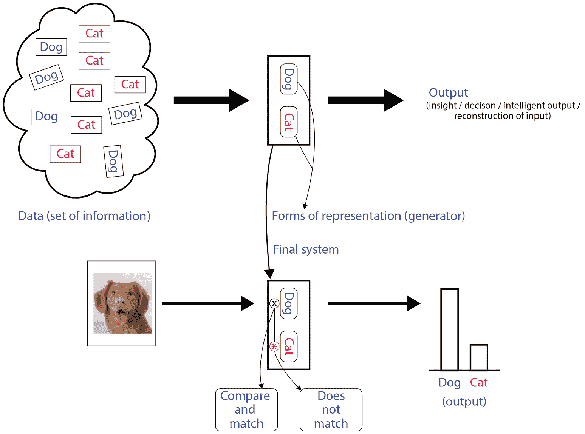
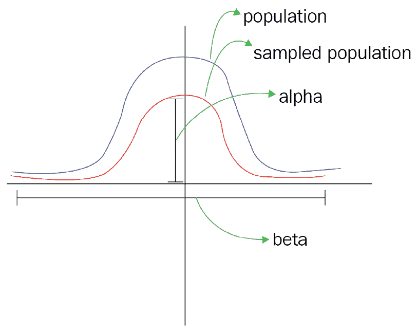
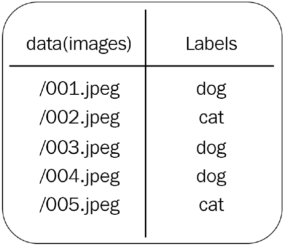
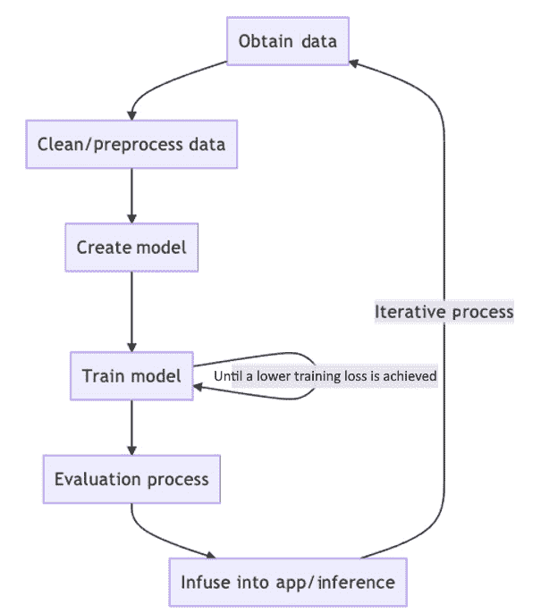
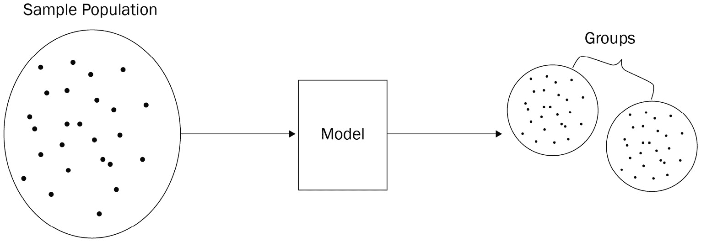

# 第十章：*第九章*：机器学习基础

**机器学习**（**ML**）领域每天都在不断发展，进行大量研究，并利用机器学习算法构建各种智能应用。这个领域越来越受到关注，越来越多的人对它的工作原理和如何利用它感到着迷。

在本章中，我们将尝试基本了解机器学习的原理和工作方式，以及看到它在现实生活中的各种应用形式。

在本章中，我们将研究以下主题，以了解机器学习的基础知识：

+   机器学习简介

+   机器学习为什么有效

+   机器学习问题/任务

+   JavaScript 中的机器学习

+   机器学习应用

+   深入理解机器学习的资源

# 技术要求

本章以简单形式介绍了机器学习，因此不需要先前的知识。

# 机器学习简介

在本节中，我们将使用一个简单的类比来介绍机器学习，这可能作为建立我们解释的共同基础。我们还将看到机器学习为什么以及如何工作。

我们将通过使用信息传输系统作为机器学习的简单类比来开始本节。

## 机器学习系统的简单类比

我记得有一次我参加了一个关于机器学习和其他一些很酷的话题的*Twitter* Space 讨论。有人让我给那些感兴趣但没有完全理解要点的人简要介绍一下机器学习。

在这个 Twitter Space 中，大多数人是没有数学、统计学或与机器学习相关的任何知识的软件工程师，我遇到了一些人由于增加了一些技术术语而无法理解该主题的术语的情况。

本节旨在通过避免使用太多技术术语，并通过可以解释机器学习的共同基础来解释机器学习。

使用信息传输系统，比如电话，信息从源头获取，然后编码成数字信号，通过传输通道传输到接收器，接收器将信号解码成源输入，可以是声音、图像等等。

以下图示显示了信息传输的完整概念：

图 9.1 – 信息传输

前面的定义是指一个发送者和接收者位于不同端点的信息传输系统，但对于像扩音器这样的系统，输入声音被编码成数字信号，然后在输出端解码和放大。

以下是一个扩音器的图示：

图 9.2 – 简单信息传输系统

使用前面的段落，我们可以建立对机器学习的概述。在前面的段落中，我们提到了一些特定的关键词，这些关键词被编码和解码。

在信息传输系统中，大量的信息（声音或图像）被编码或压缩成数字信号，然后在输出端被解码回源信息。

前面段落中描述的事情也适用于机器学习系统——大量信息被编码或压缩成*表示形式*（注意高亮显示的词），然后解码为概念性、智能或决策性输出。

请注意前两个段落中的术语*数字信号*和*表示形式*。在信息传输系统中，有一些信息理论负责将任何形式的输入（任何类型的图像、任何类型的声音/语音）转换成数字信号。

但在机器学习中，我们有一些理论和算法。这些算法不仅仅是处理输入信息并给出输出。首先，获取一部分信息样本。这些信息被处理并用来构建一种总结整个信息并将其映射到决策输出的表示形式。

这种表示形式被用来构建最终的机器学习系统，该系统接受一个输入源，将其与表示形式进行比较，并输出一个匹配源输入和表示形式之间比较的解码决策（智能输出）。

下图显示了前两段的概念图示：

图 9.3 – 机器学习的概念图示

从前面的段落中，有一些关于机器学习的关键事项需要注意，如下：

+   首先，我们从大量信息中生成一种表示形式。另外，需要注意的是，从一组信息中生成一种表示形式的过程被称为**训练**。

+   然后生成的表示形式被用来创建最终的机器学习系统，这个过程被称为**推理**。

在下一小节中，我们将看到如何生成这种形式的表示，从大量信息中生成一种表示形式的整个想法，然后使用这种表示形式来构建最终的机器学习系统。

# 为什么机器学习有效

在我们训练机器学习模型的说明中，我们谈到了生成一种表示形式来构建我们的机器学习系统。需要注意的一点是，用于生成表示形式的这些信息或数据是我们未来信息源的数据表示。我们为什么需要未来信息源的数据表示？在这一小节中，我们将探讨这一点，并看看它如何帮助创建机器学习模型。

假设我们被要求对特定社区的产品兴趣进行研究。想象一下，这个社区有大量的人，而我们只能接触到其中的一部分人——比如说社区人口的 50%。

这个想法是，从我们获得的 50%人口的信息中，我们应该能够推广到剩下的 50%人口。我们之所以这样假设，是因为来自同一社区或人口的一组人被假定具有相当多的相同属性和信念。因此，如果我们使用从该人口 50%个体获得的信息来训练我们的模型，我们的模型应该能够区分来自同一人口的任何个体的信息。

在最坏的情况下，人群中可能会有一些离群值——那些与其他人不持相同信念的人，或者我们从 50%的人群中获得的个人信息可能无法捕捉到另外 50%人群的属性。在这种情况下，如果将这些信息传递到模型中，模型将会失败。

前面的段落说明了为什么在机器学习中，默认情况下，数据量越大，机器学习模型就越好。下图显示了一个样本分布（我们获得的 50%个人信息）和人群本身：

图 9.4 – 人口分布

从*图 9.3*中，当我们说我们在机器学习中进行训练时，我们的意思是机器学习算法正在学习控制和推广我们抽样人口的参数（在这种情况下，这个参数就是表示形式）。我们有两个参数，beta 和 alpha，我们训练的目标是让模型从这些控制人口的参数中获得最佳值。

让我们看一个更具体的例子：我们想要创建一个只将特定产品分配给狗的应用。但是你知道，我们有不同品种的狗，狗也有一些与猫相似的面部特征。

为了创建这个应用的机器学习模型，我们抽样了一些狗的图像，但这个样本并没有捕捉到所有品种的狗。机器学习模型的目标是从给定的数据中捕捉到独特的狗的属性/参数（这些独特的属性/参数是表示形式）。

如果模型很好，它应该能够判断输入图像是否是狗。那么我们如何衡量模型的好坏？以下方法用于实现这一点：

+   **客观函数**

+   **评估指标**

在接下来的子章节中，我们将看到这些方法是如何工作的。

## 客观函数

我们已经看到如何从大量人口中抽样数据，并用它来训练我们的模型，并希望模型能很好地泛化。在训练过程中，我们想要衡量我们的模型与我们的目标有多接近，为此我们创建了一个客观函数。有些人称这个函数为不同的名称，比如损失函数或错误率。这个函数返回的分数越低，我们的模型就越好。

为了分类图像是否是狗，我们有包含狗和猫图像的数据集，例如。这个数据集也包含标签。数据集中的每个图像都有一个标签，告诉我们数据集中的图像是狗图像还是猫图像。

以下是数据集的示例：

图 9.5 - 数据集样本

在训练过程中，数据中的每个图像，如*图 9.5*所示，都被输入到模型中，并且模型预测标签。模型预测的标签与*图 9.4*中显示的标签通过客观函数进行比较。我们持续训练模型，直到模型预测数据集中每个图像的真实标签。

模型可能能够根据客观函数正确分类数据集中的所有图像，但这并不意味着模型泛化良好，也就是说，模型可能能够在训练期间正确分类一些狗图像，但当给出数据集中没有的图像时，如*图 9.4*所示，模型会错误分类图像。这引出了第二种方法。

## 评估指标

我们已经训练了我们的模型，并且它给出了一个非常低的损失分数，这是好的，但我们需要确定模型是否已经捕捉到了整个人口的属性，还是只是对用于训练的数据集的抽样人口。我在说什么？模型在训练时可能表现良好，但如果我们要在包含狗和猫的其他图像上进行测试，实际上可能是糟糕的。

为了检查模型是否良好并且是否捕捉到了独特于狗和猫每个人口的属性，我们在一组数据集上测试模型，这组数据集也是从用于训练的相同人口中抽样得到的。如果模型能够给出更好的分数，那么模型是好的；如果分数与客观函数的相比较差，那么模型是不好的。这个过程称为评估过程，我们使用不同的指标来衡量模型的性能。这些指标称为**评估指标**。

以下图表显示了机器学习模型的流程：

图 9.6 - 机器学习流程

在这一部分，我们讨论了基于机器学习的信息传递。我们看到了机器学习模型的工作原理以及机器学习模型的基本工作流程。在下一节中，我们将讨论将机器学习任务分组到不同类别中。

# 机器学习问题/任务

基于模型学习方式的不同，诸如分类问题的机器学习问题或任务可以被归类到不同的组别中。

在这一部分，我们将研究机器学习问题中最流行的两个类别：

+   **监督学习**

+   **无监督学习**

首先，我们将研究监督学习。

## 监督学习

在这个类别中，模型在监督下学习。通过监督，我们指的是模型知道根据提供的标签自己的表现如何。在训练时，我们提供了一个包含一组标签的数据集，这些标签用于纠正和改进模型。有了这个，我们就可以衡量模型的表现如何。

以下机器学习问题/任务属于这个类别：

+   **分类问题**：在这种类型的问题中，模型被制作成将输入分类到一组离散的类别，比如分类图像是狗还是猫。

+   **回归问题**：这涉及模型将输入映射到一组连续值。例如，创建一个模型来预测房屋的价格，给定房屋的一些特征。

以下图表显示了分类的示例：

图 9.7 – 分类问题

以下图表显示了回归问题的示例：

图 9.8 – 回归问题

总之，监督学习算法用于数据集中提供了标签的问题，其中标签用于衡量模型的性能。有时我们有数据，但没有一个可以衡量模型表现的标签。这就引出了无监督学习。

## 无监督学习

当我们没有标签，但有数据时，我们可以做什么？最好的办法是从数据中获取见解。

还记得本节开头的人口例子吗？假设我们从人口中抽取了一些实体，但对他们的行为没有先验知识。最好的办法是研究一段时间，这样我们就可以了解他们的喜好和厌恶，并找出使他们独特的因素。

通过这种观察，我们可以根据他们的信仰、职业、食物口味等将人口分成不同的类别。

以下机器学习问题属于无监督学习类别：

+   **聚类问题**：聚类问题涉及在数据集（我们抽样的人口）中揭示一些隐藏的属性，然后根据这些属性将人口中的每个实体分组。

+   **关联问题**：这涉及在人口中发现关联规则。它涉及知道参与一项活动的人是否也参与另一项活动。

这主要是因为我们希望从数据集中获得隐藏的见解，如下图所示：

图 9.9 – 无监督学习（聚类示例）

在这一部分，我们研究了一些机器学习问题的类别，我们还看到了每个机器学习问题类别都很重要的场景，以及它们用于的任务类型。

在下一节中，我们将讨论如何使机器学习更易于访问。

# JavaScript 中的机器学习

网络是最可访问的平台，JavaScript 是网络上使用的语言，因此 JavaScript 中的机器学习给了我们更多的控制和可访问性。在*第三章*的*为什么需要 Danfo.js*部分，*开始使用 Danfo.js*，我们谈到了将机器学习带到网络的重要性。我们还谈到了浏览器的计算能力正在增加，这对 JavaScript 来说是一个好处。

在本节中，我将列出一些用于浏览器中机器学习任务的开源工具：

+   **TensorFlow.js** (**tfjs**) ([`github.com/tensorflow/tfjs`](https://github.com/tensorflow/tfjs))：用于训练和部署机器学习模型的 WebGL 加速 JavaScript 库。

+   **datacook** ([`github.com/imgcook/datacook`](https://github.com/imgcook/datacook))：用于数据集特征工程的 JavaScript 框架。

+   **Nlp.js**（[`github.com/axa-group/nlp.js`](https://github.com/axa-group/nlp.js)）：用于 NLP 任务的 JavaScript 框架，如情感分析、自动语言识别、实体提取等。

+   **Natural**（[`github.com/NaturalNode/natural`](https://github.com/NaturalNode/natural)）：另外，NLP，它涵盖了几乎所有 NLP 任务所需的算法。

+   **Pipcook**（[`github.com/alibaba/pipcook`](https://github.com/alibaba/pipcook)）：面向 Web 开发人员的机器学习平台。

+   **Jimp**（[`github.com/oliver-moran/jimp`](https://github.com/oliver-moran/jimp)）：一个完全用 JavaScript 编写的图像处理库。

+   **Brain.js**（[`github.com/BrainJS/brain.js`](https://github.com/BrainJS/brain.js)）：用于浏览器和 Node.js 的 GPU 加速神经网络。

上述工具是最受欢迎的，并且有最新的更新。通过使用这些工具，您可以将 ML 集成到您的下一个 Web 应用程序中。

在下一节中，我们将探讨 ML 在现实世界中的一些应用。

# 机器学习的应用

ML 正在改变软件开发，并且也使事物更加*自动*、*自动驾驶*和*自动操作*。在本节中，我们将探讨一些 ML 应用的例子。

以下是机器学习应用的例子：

+   **机器翻译**：ML 使我们能够构建轻松将一种语言翻译成另一种语言的软件。

+   **游戏**：借助一些先进的 ML 算法，一些软件正在变得更擅长玩更复杂的游戏，比如围棋，并在他们最擅长的领域击败世界冠军。例如，这是一个关于**AlphaGo**的视频：[`www.youtube.com/watch?v=WXuK6gekU1Y`](https://www.youtube.com/watch?v=WXuK6gekU1Y)。

+   **视觉**：机器正在变得更擅长看和为他们所看到的提供意义。

a) **自动驾驶汽车**：ML 正在帮助创建完全自动驾驶汽车。

b) **特斯拉展示自动驾驶汽车**：[`www.youtube.com/watch?v=VG68SKoG7vE`](https://www.youtube.com/watch?v=VG68SKoG7vE)

+   **推荐引擎**：ML 算法正在改进推荐引擎并吸引顾客。

*Netflix*如何使用 ML 进行个性化推荐：[`netflixtechblog.com/artwork-personalization-c589f074ad76`](https://netflixtechblog.com/artwork-personalization-c589f074ad76)

+   **艺术**：ML 被用来生成艺术作品、新故事、新绘画和新图像。

a) 这是一个生成从未存在的人的图像的网站：[`thispersondoesnotexist.com/`](https://thispersondoesnotexist.com/)。

b) 生成的艺术画廊：[`www.artaigallery.com/`](https://www.artaigallery.com/)。

c) 使用 ML 的建筑设计：[`span-arch.org/`](https://span-arch.org/)

在本节中，我们看到了 ML 如何被用于不同的目的的一些例子。在下一节中，我们将提供一些材料来更好地理解 ML。

# 深入了解机器学习的资源

在本节中，我们将提供资源，以更深入地了解 ML，并更好地创建利用 ML 算法的软件。

以下是可以用来理解 ML 的资源：

+   **fastai**（[`www.fast.ai/`](https://www.fast.ai/)）：这个社区为 ML 从业者提供课程、框架和书籍。

+   Cs231n（[`cs231n.stanford.edu/`](http://cs231n.stanford.edu/)）：这门课程介绍了**深度学习**的基础知识，并向您介绍了计算机视觉。

+   **Hugging Face**：Hugging Face 提供了最好的**自然语言处理**框架和不同的变压器模型。它还有一个课程（[`huggingface.co/course/chapter1`](https://huggingface.co/course/chapter1)），提供了变压器模型和部署的详细信息。

+   **Andrew Ng 课程**：YouTube 上的一个 ML 课程，也提供了完整的 ML 细节。

有大量的在线学习机器学习的材料可供学习。只需沿着一条路径走到底，避免跳来跳去。

# 总结

在本章中，我们通过信息传递的概念来研究机器学习。然后我们探讨了它是如何以及为什么起作用的。我们还谈到了从人口中进行抽样以了解人口的概念。

我们讨论了不同类别的机器学习问题，还讨论了在网络平台上进行机器学习所需的一些工具，并展示了一些机器学习在现实世界中的应用示例。

本章的目的是在个人学习过程中帮助理解机器学习的整体概念。

在下一章中，我们将介绍**TensorFlow.js**。TensorFlow.js 在将机器学习集成到您的 Web 应用程序中非常有用。
