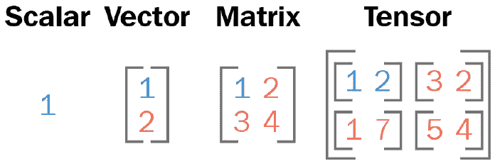
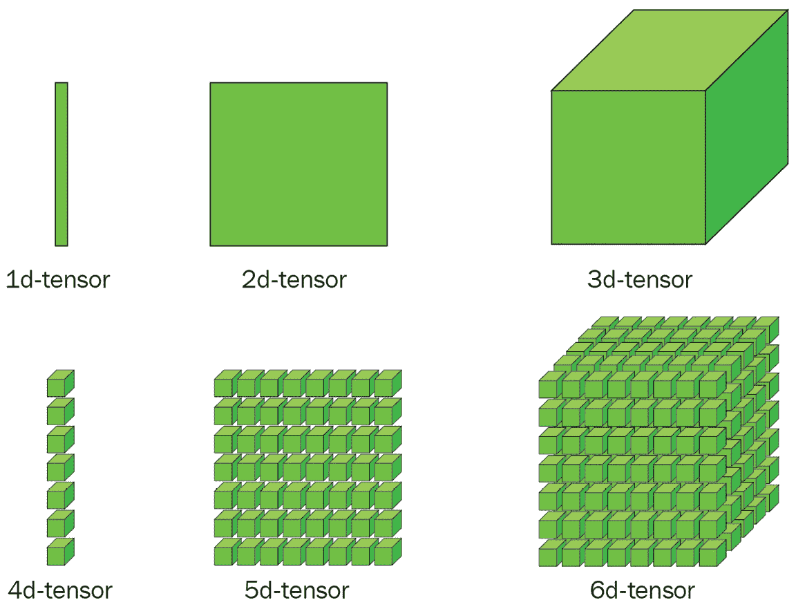
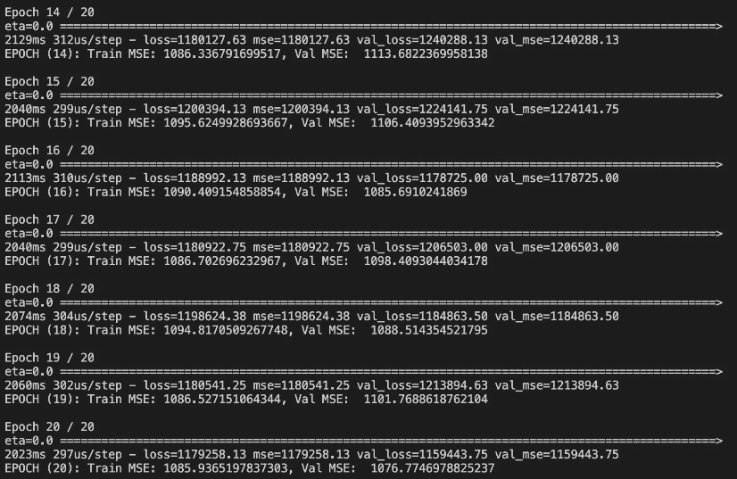

# 第十一章：：TensorFlow.js 简介

在上一章中，你已经了解了**机器学习**（**ML**）的基础知识，并学习了一些理论基础，这些基础是构建和使用 ML 模型所必需的。

在本章中，我们将向你介绍 JavaScript 中一个高效且流行的 ML 库 TensorFlow.js。在本章结束时，你将知道如何安装和使用 TensorFlow.js，如何创建张量，如何使用 Core **应用程序编程接口**（**API**）对张量进行操作，以及如何使用 TensorFlow.js 的 Layer API 构建回归模型。

在本章中，我们将涵盖以下主题：

+   什么是 TensorFlow.js？

+   安装和使用 TensorFlow.js

+   张量和张量的基本操作

+   使用 TensorFlow.js 构建简单的回归模型

# 技术要求

在本章中，你应该具备以下工具或资源：

+   现代浏览器，如 Chrome、Safari、Opera 或 Firefox。

+   在你的系统上安装了 Node.js

+   稳定的互联网连接，用于下载软件包和数据集

+   本章的代码可在 GitHub 上克隆并获取，网址为[`github.com/PacktPublishing/Building-Data-Driven-Applications-with-Danfo.js/tree/main/Chapter10`](https://github.com/PacktPublishing/Building-Data-Driven-Applications-with-Danfo.js/tree/main/Chapter10)

# 什么是 TensorFlow.js？

**TensorFlow.js**（**tfjs**）是一个 JavaScript 库，用于在浏览器或 Node.js 中创建、训练和部署 ML 模型。它是由 Google 的 Nikhil Thorat 和 Daniel Smilkov 创建的，最初被称为 Deeplearn.js，在 2018 年并入 TensorFlow 团队并更名为 TensorFlow.js。

TensorFlow.js 提供了两个主要层，如下所述：

+   **CoreAPI**：这是直接处理张量的低级 API——TensorFlow.js 的核心数据结构。

+   **LayerAPI**：这是建立在 CoreAPI 层之上的高级层，用于轻松构建 ML 模型。

在后面的章节中，*张量和张量的基本操作*和*使用 TensorFlow.js 构建简单的回归模型*，你将学到更多关于 CoreAPI 和 LayerAPI 层的细节。

使用 TensorFlow.js，你可以做到以下几点：

+   执行硬件加速的数学运算

+   为浏览器或 Node.js 开发 ML 模型

+   使用**迁移学习**（**TL**）重新训练现有的 ML 模型

+   重用使用 Python 训练的现有 ML 模型

在本章中，我们将介绍执行硬件加速的数学运算以及使用 TensorFlow.js 开发 ML 模型。如果你想了解最后两种用例——重新训练和重用 ML 模型——那么官方的 TensorFlow.js 文档([`www.tensorflow.org/js/guide`](https://www.tensorflow.org/js/guide))是一个很好的起点。

现在我们已经介绍完了，接下来的章节中，我们将向你展示如何在浏览器和 Node.js 环境中安装和使用 TensorFlow.js。

# 安装和使用 TensorFlow.js

正如我们之前提到的，TensorFlow.js 可以在浏览器和 Node.js 环境中安装和运行。在接下来的段落中，我们将向你展示如何实现这一点，从浏览器开始。

## 在浏览器中设置 TensorFlow.js

在浏览器中安装 TensorFlow.js 有两种方式。这里进行了概述：

+   通过脚本标签

+   使用诸如**Node Package Manager**（**npm**）或**Yarn**之类的包管理器

### 通过脚本标签安装

通过`script`标签安装 TensorFlow.js 很容易。只需将`script`标签放在你的**超文本标记语言**（**HTML**）文件的头文件中，如下面的代码片段所示：

```js
<script src="img/tf.min.js"></script>
```

要确认 TensorFlow.js 已安装，打开浏览器中的 HTML 文件，并检查网络标签。你应该看到名称为`tf.min.js`和状态码为`200`，如下截图所示：


图 10.1 - 网络标签显示了 tfjs 成功安装

您可以在 HTML 文件的 body 中添加一个简单的脚本来确认成功安装`tfjs`。在 HTML 文件的`script`部分中，添加以下代码：

```js
...
<script>
         tf.ready().then(()=>{
            console.log("Tensorflow.js loaded successfully!");
        })
 </script>
...
```

上面的代码片段将在浏览器控制台中记录文本`Tensorflow.js loaded` `successfully!`，一旦 TensorFlow.js 加载并准备好在页面上使用。要查看输出，请在浏览器中打开 HTML 文件并检查控制台输出。您应该会看到一个输出结果，如下面的屏幕截图所示：


图 10.2 - add 操作的张量输出

接下来，让我们看看如何通过软件包管理器安装`tfjs`。

### 通过软件包管理器安装

您可以通过`npm`或`yarn`等软件包管理器安装`tfjs`。当您需要在客户端项目（如 React 和 Vue 项目）中使用`tfjs`时，这是非常有用的。

要使用`npm`安装，请在**命令行界面**（**CLI**）中运行以下命令：

```js
npm install @tensorflow/tfjs
```

要使用`yarn`安装，也可以在 CLI 中运行以下命令：

```js
yarn add @tensorflow/tfjs
```

注意

在通过 CLI 成功安装软件包之前，您必须在系统中安装`npm`或`yarn`之一，最好是全局安装。如果您已经安装了 Node.js，那么您已经有了`npm`。要安装`yarn`，您可以按照这里的步骤进行操作：[`classic.yarnpkg.com/en/docs/install/#mac-stable`](https://classic.yarnpkg.com/en/docs/install/#mac-stable)。

安装成功后，您可以导入并使用`tfjs`，如下面的代码片段所示：

```js
import * as tf from '@tensorflow/tfjs';
const x = tf.tensor2d([1, 2, 3, 4], [2, 2]);
const y = tf.tensor2d([1, 3, 5, 7], [2, 2]);
const sum = x.add(y)
 sum.print()
```

运行上面的代码片段将在控制台中产生以下输出：


图 10.3 - 使用软件包管理器安装 tfjs 的输出

通过按照上面的代码块中的步骤，您应该能够在浏览器或客户端框架中安装和使用`tfjs`。在下一节中，我们将向您展示如何在 Node.js 环境中安装`tfjs`。

## 在 Node.js 中安装 TensorFlow.js

在 Node.js 中安装`tfjs`非常简单，但首先确保您的系统上已安装了 Node.js、`npm`或`yarn`。

Node.js 中的 TensorFlow.js 有三个选项，安装的选择将取决于您的系统规格。在接下来的子章节中，我们将向您展示这三个选项。

### 使用本机 C++绑定安装 TensorFlow.js

`@tensorflow/tfjs-node`（`www.npmjs.com/package/@tensorflow/tfjs-node`）版本的`tfjs`直接连接到 TensorFlow 的本机 C++绑定。这使它快速，并且使其与 TensorFlow 的 Python 版本具有接近的性能。这意味着`tfjs-node`和`tf.keras`在内部使用相同的 C++绑定。 

要安装`tfjs-node`，只需通过 CLI 运行以下命令：

```js
npm install @tensorflow/tfjs-node
```

或者，如果使用`yarn`，也可以通过 CLI 运行以下命令：

```js
yarn add @tensorflow/tfjs-node
```

### 安装支持 GPU 的 TensorFlow.js

`@tensorflow/tfjs-node-gpu`版本的`tfjs`支持在`tfjs-node-gpu`上运行操作，通常比`tfjs-node`快，因为操作可以很容易地进行矢量化。

要安装`tfjs-node-gpu`，只需通过 CLI 运行以下命令：

```js
npm install @tensorflow/tfjs-node-gpu
```

或者，如果您使用`yarn`，也可以通过 CLI 运行以下命令：

```js
yarn add @tensorflow/tfjs-node-gpu
```

### 安装普通的 TensorFlow.js

`@tensorflow/tfjs`版本是`tfjs`的纯 JavaScript 版本。在性能方面它是最慢的，应该很少使用。

要安装此版本，只需通过 CLI 运行以下命令：

```js
npm install @tensorflow/tfjs
```

或者，如果您使用`yarn`，也可以通过 CLI 运行以下命令：

```js
yarn add @tensorflow/tfjs
```

如果您按照上述步骤操作，那么您应该至少安装了`tfjs`的一个版本。您可以使用以下代码示例测试安装是否成功：

```js
const tf = require('@tensorflow/tfjs-node')
// const tf = require('@tensorflow/tfjs-node-gpu') GPU version
// const tf = require('@tensorflow/tfjs') Pure JS version
const xs = tf.randomNormal([100, 10])
const ys = tf.randomNormal([100, 1])
const sum = xs.add(ys)
const xsSum = xs.sum()
const xsMean = xs.mean()

console.log("Sum of xs and ys")
sum.print()
console.log("Sum of xs")
xsSum.print()
console.log("Mean of xs")
xsMean.print()
```

注意

当我们想要查看底层数据时，我们在张量上调用`print()`函数。如果我们使用默认的`console.log`，我们将得到`Tensor`对象。

运行前面的代码应该在控制台中输出以下内容：


图 10.4 - 在 Node.js 中测试 tfjs 的输出

现在您已经成功在项目中安装了`tfjs`，在下一节中，我们将向您介绍`tfjs`的核心数据结构——张量。

# 张量和张量的基本操作

张量是`tfjs`中的基本数据结构。您可以将张量视为向量、矩阵或高维数组的泛化。我们在*什么是 TensorFlow.js？*部分介绍的**CoreAPI**公开了不同的函数，用于创建和处理张量。

以下屏幕截图显示了标量、向量和矩阵与张量之间的简单比较：



图 10.5 - 简单的 n 维数组与张量的比较

提示

矩阵是一个`m x n`数字的网格，其中`m`表示行数，`n`表示列数。矩阵可以是一维或多维的，形状相同的矩阵支持彼此的直接数学运算。

另一方面，向量是一个一维矩阵，形状为（1，1）；也就是说，它有一行和一列，例如，[2, 3]，[3, 1, 4]。

我们之前提到过，张量更像是一个广义的矩阵，它扩展了矩阵的概念。张量可以通过它们的秩来描述。秩类似于形状的概念，但是用一个数字表示，而不是形状。在下面的列表中，我们看到了不同类型的张量秩及其示例：

+   秩为 0 的张量是标量，例如，1、20 或 100。

+   秩为 1 的张量是向量，例如，[1, 20]或[20, 100, 23.6]。

+   秩为 2 的张量是矩阵，例如，[[1, 3, 6], [2.3, 5, 7]]。

请注意，我们可以有秩为 4 或更高的张量，这些被称为更高维度的张量，可能难以可视化。请参见下面的屏幕截图，以更好地理解张量：



图 10.6 - 不同秩的张量比较

除了秩，张量还具有其他属性，如`dtype`、`data`、`axis`和`shape`。这些在这里更详细地描述：

+   `dtype`属性（数据类型）是张量持有的数据类型，例如，秩为 1 的张量具有以下数据[2.5, 3.8]，其 dtype 为`float32`。默认情况下，数值张量的 dtype 为`float32`，但可以在创建过程中更改。TensorFlow.js 支持`float32`、`int32`、`bool`、`complex64`和`string`数据类型。

+   `data`属性是张量的内容。这通常存储为数组。

+   `axis`属性是张量的特定维度，例如，*m x n*张量具有*m*或*n*的轴。轴可用于指定在哪个维度上执行操作。

+   `shape`属性是张量的维度。将形状视为张量每个轴上的元素数量。

现在您对张量是什么有了基本的了解，在下一小节中，我们将向您展示如何创建张量并对其进行一些基本操作。

## 创建张量

张量可以使用`tf.tensor()`方法创建，如下面的代码片段所示：

```js
const tf = require('@tensorflow/tfjs-node')

const tvector = tf.tensor([1, 2, 3, 4]);
console.log(tvector)
//output
Tensor {
  kept: false,
  isDisposedInternal: false,
  shape: [ 4 ],
  dtype: 'float32',
  size: 4,
  strides: [],
  dataId: {},
  id: 0,
  rankType: '1'
}
```

在前面的代码片段中，我们将一个平坦数组（向量）传递给`tf.tensor()`方法，以创建一个`tfjs`张量。创建后，我们现在可以访问不同的属性和函数，用于操作或转换张量。

其中一个属性是`shape`属性，我们可以按照下面的代码片段中所示进行调用：

```js
console.log('shape:', tvector.shape);
//outputs: shape: [ 4 ]
```

请注意，当您使用`console.log`记录张量时，您会得到一个张量对象。如果您需要查看底层张量数组，可以在张量上调用`print()`函数，如下面的代码片段所示：

```js
tvector.print();
//outputs
Tensor
    [1, 2, 3, 4]
```

如果您需要访问张量的基础数据，可以调用`array()`或`arraySync()`方法。两者之间的区别在于，`array()`是异步运行的，并返回一个解析为基础数组的 promise，而`arraySync()`是同步运行的。您可以在这里看到一个示例：

```js
const tvectorArray = tvector.array()
const tvectorArraySync = tvector.arraySync()
console.log(tvectorArray)
console.log(tvectorArraySync)
//outputs
Promise { <pending> }
[ 1, 2, 3, 4 ]
```

您还可以通过指定`shape`参数来创建张量。例如，在下面的代码片段中，我们从一个平坦数组创建一个 2 x 2（**二维**（**2D**））张量：

```js
const ts = tf.tensor([1, 2, 3, 4], [2, 2]);
console.log('shape:', ts.shape);
ts.print();
//outputs
shape: [ 2, 2 ]
Tensor
    [[1, 2],
     [3, 4]]
```

或者，我们可以创建一个 1 x 4（**一维**（**1D**））张量，如下面的代码片段所示：

```js
const ts = tf.tensor([1, 2, 3, 4], [1, 4]);
console.log('shape:', ts.shape);
ts.print();
//outputs
shape: [ 1, 4 ]
Tensor
     [[1, 2, 3, 4],]
```

但请注意，形状必须匹配元素的数量，例如，您不能从具有四个元素的平坦数组创建一个`2 x 5`维的张量。以下代码将引发形状错误：

```js
const ts = tf.tensor([1, 2, 3, 4], [2, 5]);
```

输出如下所示：


图 10.7 – 形状不匹配引发的错误

`Tfjs`明确提供了用于创建 1D、2D、`shape`参数的函数。您可以在官方`tfjs` API 中阅读更多关于创建张量的信息：[`js.tensorflow.org/api/latest/#Tensors-Creation`](https://js.tensorflow.org/api/latest/#Tensors-Creation)。

默认情况下，张量具有`float32`的`dtype`属性，因此您创建的每个张量都将具有`float32`的`dtype`。如果这不是所需的`dtype`，您可以在张量创建时指定类型，就像我们在以下代码片段中演示的那样：

```js
const tsInt = tf.tensor([1, 2, 3, 4], [1, 4], 'int32');
console.log('dtype:', tsInt.dtype);
//outputs
dtype: int32
```

现在您知道如何创建张量，我们将继续对张量进行操作。

## 对张量进行操作

正如我们之前所说，张量以网格形式存储数据，并允许进行许多操作来操作或转换这些数据。`tfjs`提供了许多用于线性代数和机器学习的运算符。

`tfjs`中的操作被分成不同的部分。以下是一些常见操作的解释：

+   `add()`用于张量的加法，`sub()`用于张量的减法，`mul()`用于张量的乘法，`div()`用于张量的除法。在这里可以看到带有示例的完整列表：[`js.tensorflow.org/api/3.7.0/#Operations-Arithmetic`](https://js.tensorflow.org/api/3.7.0/#Operations-Arithmetic)。

+   `cos()`用于计算张量的余弦，`sin()`用于计算张量的正弦，`exp()`用于计算张量的指数，`log()`用于计算张量的自然对数。在这里可以看到带有示例的完整列表：[`js.tensorflow.org/api/3.7.0/#Operations-Basic%20math`](https://js.tensorflow.org/api/3.7.0/#Operations-Basic%20math)。

+   **矩阵**：这些运算符用于矩阵运算，如点积、范数或转置。您可以在这里看到支持的运算符的完整列表：[`js.tensorflow.org/api/3.7.0/#Operations-Matrices`](https://js.tensorflow.org/api/3.7.0/#Operations-Matrices)。

+   `conv1d`，用于计算输入`x`的 1D 卷积，以及`maxpool3D`，用于计算 3D 最大池化操作。在这里可以看到完整列表：[`js.tensorflow.org/api/3.7.0/#Operations-Convolution`](https://js.tensorflow.org/api/3.7.0/#Operations-Convolution)。

+   `min`、`max`、`sum`、`mean`、`argMax`和`argMin`。您可以在这里看到带有示例的完整列表：[`js.tensorflow.org/api/3.7.0/#Operations-Reduction`](https://js.tensorflow.org/api/3.7.0/#Operations-Reduction)。

+   `equal`、`greater`、`greaterEqual`和`less`。您可以在这里看到带有示例的完整列表：[`js.tensorflow.org/api/3.7.0/#Operations-Logical`](https://js.tensorflow.org/api/3.7.0/#Operations-Logical)。

您可以在官方 API 中看到支持的操作的完整列表：[`js.tensorflow.org/api/3.7.0/#Operations`](https://js.tensorflow.org/api/3.7.0/#Operations)。

现在您对可用的张量运算符有了基本的了解，我们将展示一些代码示例。

### 对张量应用算术运算

我们可以通过直接在第一个张量上调用`add()`方法并将第二个张量作为参数传递来添加两个张量，如下面的代码片段所示：

```js
const tf = require('@tensorflow/tfjs-node')
const a = tf.tensor1d([1, 2, 3, 4]);
const b = tf.tensor1d([10, 20, 30, 40]);
a.add(b).print();
//outputs
Tensor
    [11, 22, 33, 44]
```

请注意，您还可以通过在`tf`对象上调用运算符来直接添加或应用任何运算符，如下面的代码片段所示：

```js
const tf = require('@tensorflow/tfjs-node')
const a = tf.tensor1d([1, 2, 3, 4]);
const b = tf.tensor1d([10, 20, 30, 40]);
const sum = tf.add(a, b)
sum.print()
//outputs
Tensor
    [11, 22, 33, 44]
```

使用这些知识，您可以执行其他算术运算，如减法、乘法、除法和幂运算，如下面的代码片段所示：

```js
const a = tf.tensor1d([1, 2, 3, 4]);
const b = tf.tensor1d([10, 20, 30, 40]);

const tfsum = tf.add(a, b)
const tfsub = tf.sub(b, a)
const tfdiv = tf.div(b, a)
const tfpow = tf.pow(b, a)
const tfmax = tf.maximum(a, b)

tfsum.print()
tfsub.print()
tfdiv.print()
tfpow.print()
tfmax.print()
//outputs
Tensor
    [11, 22, 33, 44]
Tensor
    [9, 18, 27, 36]
Tensor
    [10, 10, 10, 10]
Tensor
    [10, 400, 27000, 2560000]
Tensor
    [10, 20, 30, 40]
```

值得一提的是，传递给运算符的张量的顺序很重要，因为顺序的改变会导致结果不同。例如，如果我们将前面的`div`操作的顺序从`const tfsub = tf.sub(b, a)`改为`const tfsub = tf.sub(a, b)`，那么我们会得到一个负结果，如下面的输出所示：

```js
Tensor
    [-9, -18, -27, -36]
```

请注意，涉及两个张量的所有操作只有在两个张量具有相同形状时才能工作。例如，以下操作将引发无效形状错误：

```js
const a = tf.tensor1d([1, 2, 3, 4]);
const b = tf.tensor1d([10, 20, 30, 40, 50]);
const tfsum = tf.add(a, b)
```


图 10.8–在具有不同形状的张量上执行操作时出现无效形状错误

在下一小节中，我们将看一些关于张量的基本数学运算的例子。

### 在张量上应用基本数学运算

根据前一小节的示例格式，*在张量上应用算术运算*，我们给出了一些在张量上计算数学运算的示例，如下所示：

```js
const tf = require('@tensorflow/tfjs-node')

const x = tf.tensor1d([-1, 2, -3, 4]);
x.abs().print();  // Computes the absolute values of the tensor
x.cos().print(); // Computes the cosine of the tensor
x.exp().print(); // Computes the exponential of the tensor
x.log().print(); // Computes the natural logarithm  of the tensor
x.square().print(); // Computes the sqaure of the tensor
```

输出如下所示：

```js
Tensor
    [1, 2, 3, 4]
Tensor
    [0.5403023, -0.4161468, -0.9899925, -0.6536436]
Tensor
    [0.3678795, 7.3890562, 0.0497871, 54.5981522]
Tensor
    [NaN, 0.6931472, NaN, 1.3862944]
Tensor
    [1, 4, 9, 16]
```

正如我们之前提到的，您可以直接从`tf`对象调用运算符，例如，`x.cos()`变成了`tf.cos(x)`。

### 在张量上应用减少操作

我们还可以对张量应用诸如`mean`、`min`、`max`、`argMin`和`argMax`之类的减少操作。以下是一些`mean`、`min`、`max`、`argMin`和`argMax`的例子：

```js
const x = tf.tensor1d([1, 2, 3]);
x.mean().print();  // or tf.mean(x)  Returns the mean value of the tensor
x.min().print();  // or tf.min(x) Returns the smallest value in the tensor
x.max().print();  // or tf.max(x) Returns the largest value in the tensor
x.argMax().print();  // or tf.argMax(x) Returns the index of the largest value
x.argMin().print();  // or tf.argMin(x) Returns the index of the smallest value
```

输出如下所示：

```js
Tensor 2
Tensor 1
Tensor 3
Tensor 2
Tensor 0
```

掌握了 ML、张量和可以在张量上执行的操作的基本知识，现在您已经准备好构建一个简单的 ML 模型了。在本章的下一节中，我们将总结您在本节中学到的所有内容。

# 使用 TensorFlow.js 构建一个简单的回归模型

在上一章[*第九章*]（B17076_09_ePub_RK.xhtml#_idTextAnchor166），*机器学习基础*中，您已经了解了 ML 的基础知识，特别是回归和分类模型的理论方面。在本节中，我们将向您展示如何使用`tfjs` **LayerAPI**创建和训练回归模型。具体来说，在本节结束时，您将拥有一个可以从超市数据中预测销售价格的回归模型。

## 在本地设置您的环境

在构建回归模型之前，您必须在本地设置您的环境。在本节中，我们将在 Node.js 环境中工作。这意味着我们将使用 TensorFlow.js 和 Danfo.js 的`node`版本。

按照这里的步骤设置您的环境：

1.  在新的工作目录中，为您的项目创建一个文件夹。我们将创建一个名为`sales_predictor`的文件夹，如下面的代码片段所示：

```js
mkdir sales_predictor
cd sales_predictor
```

1.  接下来，在文件夹目录中打开终端，并通过运行以下命令初始化一个新的`npm`项目：

```js
npm init
```

1.  接下来，按照以下步骤安装`Danfo.js`节点包：

```js
yarn add danfojs-node
or if using npm
npm install danfojs-node
```

1.  还可以从终端创建一个`src`文件夹，并添加`train.js`，`model.js`和`data` `_proc.js`文件。您可以通过代码编辑器手动创建这些文件夹/文件，也可以通过在终端中运行以下命令来创建：

```js
data_proc.js, and model.js) in the src folder. These files will contain code for processing data, creating a tfjs model, and model training, respectively.
```

现在您已经设置好了项目和文件，我们将在下一节中继续进行数据检索和处理步骤。

## 检索和处理训练数据集

我们将用于模型训练的数据集称为*BigMart 销售数据集*（[`www.kaggle.com/devashish0507/big-mart-sales-prediction`](https://www.kaggle.com/devashish0507/big-mart-sales-prediction)）。它作为一个公共数据集在 Kaggle 上可用，这是一个流行的数据科学竞赛平台。

您可以直接从本章的代码库中下载数据集：[`github.com/PacktPublishing/Building-Data-Driven-Applications-with-Danfo.js-/blob/main/Chapter10/sales_predictor/src/dataset/Train.csv`](https://github.com/PacktPublishing/Building-Data-Driven-Applications-with-Danfo.js-/blob/main/Chapter10/sales_predictor/src/dataset/Train.csv)。成功下载后，在您的项目目录中创建一个名为`dataset`的文件夹，并将数据集复制到其中。

为了确认一切都正常，您的项目`src`文件夹应该具有以下文件结构：

```js
|-data-proc.js
|-dataset
|   └── Train.csv
|-model.js
|-train.js
```

与所有数据科学问题一样，通常会提供一个通用的问题陈述，以指导您解决的问题。就 BigMart 销售数据集而言，问题陈述如下：

*BigMart 已经收集了 2013 年在不同城市的 10 家商店中 1,559 种产品的销售数据。此外，每种产品和商店的某些属性已经被定义。目标是建立一个预测模型，找出每种产品在特定商店的销售情况。*

从前面的问题陈述中，您将注意到构建此模型的目的是帮助 BigMart 有效预测每种产品在特定商店的销售情况。现在，这里的销售价格意味着一个连续的值，因此，我们有一个回归问题。

现在您已经可以访问数据并理解了问题陈述，您将使用`Danfo.js`加载数据集并进行一些数据处理和清理。

注意

我们在代码库中提供了一个单独的**Danfo Notebook**（**Dnotebook**）文件：[`github.com/PacktPublishing/Building-Data-Driven-Applications-with-Danfo.js-/blob/main/Chapter10/sales_predictor/src/bigmart%20sales%20notebook.json`](https://github.com/PacktPublishing/Building-Data-Driven-Applications-with-Danfo.js-/blob/main/Chapter10/sales_predictor/src/bigmart%20sales%20notebook.json)。在笔记本中，我们对销售数据集进行了一些数据探索和分析，其中大部分将帮助我们进行以下处理步骤。

在您的代码编辑器中打开`data_proc.js`文件，按照这里给出的步骤处理 BigMart 销售数据集：

1.  首先，我们将导入`danfojs-node`，如下所示：

```js
const dfd = require("danfojs-node")
```

1.  然后，我们创建一个名为`processData`的函数，该函数接受数据集路径，如下所示：

```js
async function processData(trainDataPath) {
    //… process code goes here
}
```

1.  接下来，在`processData`函数的主体中，我们使用`read_csv`函数加载数据集并打印标题，如下所示：

```js
const salesDf = await dfd.read_csv(trainDataPath)
salesDf.head().print()
```

1.  为了确保数据加载正常工作，您可以将数据集的路径传递给`processData`函数，如下面的代码片段所示：

```js
processData("./dataset/train.csv")
```

1.  在您的终端中，使用以下命令运行`data_proc.js`文件：

```js
node data_proc.js
```

这将输出以下内容：


图 10.9 - 显示 BigMart 销售数据集的头部值

1.  从 Dnotebook 文件的分析中，我们注意到`Item_Weight`和`Outlet_Sales`两列存在缺失值。在下面的代码片段中，我们将使用均值和众数分别填充这些缺失值：

```js
...   
 salesDf.fillna({
        columns: ["Item_Weight", "Outlet_Size"],
        values: [salesDf['Item_Weight'].mean(), "Medium"],
        inplace: true
    })
...
```

1.  正如我们注意到的，数据集是混合的分类（字符串）列和数值（`float32`和`int32`）列。这意味着我们必须在将它们传递给我们的模型之前，将所有分类列转换为数值形式。在下面的代码片段中，我们使用 Danfo.js 的`LabelEncoder`将每个分类列编码为数值列：

```js
...
     let encoder = new dfd.LabelEncoder()
     let catCols = salesDf.select_dtypes(includes = ['string']).column_names // get all categorical column names
     catCols.forEach(col => {
        encoder.fit(salesDf[col])
        enc_val = encoder.transform(salesDf[col])
        salesDf.addColumn({ column: col, value: enc_val })
     })
     ...
```

1.  接下来，我们将从训练数据集中分离出目标。目标，正如我们从问题陈述中注意到的那样，是销售价格。这对应于最后一列`Item_Outlet_Sales`。在下面的代码片段中，我们将使用`iloc`函数拆分数据集：

```js
...
      let Xtrain, ytrain;
      Xtrain = salesDf.iloc({ columns:         [`1:${salesDf.columns.length - 1}`] })
      ytrain = salesDf['Item_Outlet_Sales']
      console.log(`Training Dataset Shape: ${Xtrain.shape}`)
...
```

1.  接下来，我们将标准化我们的数据集。标准化数据集会强制使每一列都在同一比例上，从而提高模型训练。在下面的代码片段中，我们使用 Danfo.js 的`StandardScaler`来标准化数据集：

```js
      ... 
 let scaler = new dfd.MinMaxScaler()
      scaler.fit(Xtrain)
      Xtrain = scaler.transform(Xtrain)
...
```

1.  最后，为了完成`processData`函数，我们将返回原始张量，如下面的代码片段所示：

```js
...
       return [Xtrain.tensor, ytrain.tensor]
...
```

注意

您可以在此处的代码存储库中查看完整的代码：[`github.com/PacktPublishing/Building-Data-Driven-Applications-with-Danfo.js/blob/main/Chapter10/sales_predictor/src/data-proc.js`](https://github.com/PacktPublishing/Building-Data-Driven-Applications-with-Danfo.js/blob/main/Chapter10/sales_predictor/src/data-proc.js)。

执行并打印最终的`data_proc.js`文件中的张量应该会给您类似于以下截图中显示的张量：


图 10.10 - 处理后的 Final BigMart 数据张量

现在您有一个可以处理原始数据集并返回张量的函数，让我们继续使用`tfjs`创建模型。

## 使用 TensorFlow.js 创建模型

正如我们之前提到的，`tfjs`提供了一个 Layers API，可用于定义和创建 ML 模型。Layers API 类似于流行的 Keras API，因此已经熟悉 Keras 的 Python 开发人员可以轻松地将其代码移植到`tfjs`。

Layers API 提供了创建模型的两种方式 - 顺序和模型格式。我们将在以下子部分中简要解释并举例说明这两种方式。

### 创建模型的顺序方式

这是创建模型的最简单和最常见的方式。它只是一个多个模型层的堆叠，其中堆栈中的第一层定义了输入，最后一层定义了输出，而中间层可以有很多。

以下代码片段显示了一个两层顺序模型的示例：

```js
const model = tf.sequential();
// First layer must have an input shape defined.
model.add(tf.layers.dense({units: 32, inputShape: [50]}));
model.add(tf.layers.dense({units: 24})); 
model.add(tf.layers.dense({units: 1}));
```

您会注意到前面的代码片段中，序列中的第一层提供了`inputShape`参数。这意味着模型期望输入有`50`列。

您还可以通过传递层列表来创建顺序层，如下面的代码片段所示：

```js
const model = tf.sequential({
   layers: [tf.layers.dense({units: 32, inputShape: [50]}),
           tf.layers.dense({units: 24}),
           tf.layers.dense({units: 1})]
});
```

接下来，让我们看看模型格式。

### 创建模型的模型方式

使用模型格式创建模型在创建模型时提供了更大的灵活性。与仅接受线性层堆叠的模型不同，使用模型层定义的模型可以是非线性的、循环的，可以像您想要的那样高级或连接。

例如，在以下代码片段中，我们使用模型格式创建了一个两层网络：

```js
const input = tf.input({ shape: [5] });
const denseLayer1 = tf.layers.dense({ units: 16, activation: 'relu' });
const denseLayer2 = tf.layers.dense({ units: 8, activation: 'relu' });
const denseLayer3 = tf.layers.dense({ units: 1 })
const output = denseLayer3.apply(denseLayer2.apply(denseLayer1.apply(input)))
const model = tf.model({ inputs: input, outputs: output });
```

从前面的示例代码中，您可以看到我们明确调用了`apply`函数，并将要连接的层作为参数传递。这样，我们可以构建具有类似图形连接的混合和高度复杂的模型。

您可以在官方`tfjs`文档中了解有关 Layers API 的更多信息：[`js.tensorflow.org/api/latest/#Models`](https://js.tensorflow.org/api/latest/#Models)。

现在您知道如何使用 Layer API 创建模型，我们将在下一节中创建一个简单的三层回归模型。

## 创建一个简单的三层回归模型

回归模型，正如我们在上一章*第九章*，*机器学习基础*中所解释的，是具有连续输出的模型。要使用`tfjs`创建回归模型，我们定义层的堆栈，并在最后一层将`units`的数量设置为`1`。例如，打开代码存储库中的`model.js`文件。在*第 7-11 行*，您应该看到以下顺序模型定义：

```js
...
const model = tf.sequential();
model.add(tf.layers.dense({ inputShape: [11], units: 128, kernelInitializer: 'leCunNormal' }));
model.add(tf.layers.dense({units: 64, activation: 'relu' }));
model.add(tf.layers.dense({units: 32, activation: 'relu' }));
model.add(tf.layers.dense({units: 1}))
...
```

请注意，在第一层中，我们将`inputShape`参数设置为`11`。这是因为我们的 BigMart 数据集中有`11`个训练列。您可以通过打印处理后的张量的形状来确认这一点。在最后一层，我们将`units`属性设置为`1`，因为我们想要预测一个单一的连续值。

中间的层可以有很多，单位可以取任意数量。因此，在本质上，增加中间层会给我们一个更深的模型，增加单位会给我们一个更宽的模型。选择要使用的层不仅取决于问题，还取决于执行多次实验和训练。

有了这几行代码，您已经成功地在`tfjs`中创建了一个三层回归模型。

创建模型后，您通常要做的下一件事是编译模型。那么，编译是什么？编译是为训练和评估准备模型的过程。这意味着在编译阶段，我们必须设置模型的优化器、损失和/或训练指标。

在开始训练之前，`tfjs`模型必须先进行编译。那么，在`tfjs`中如何编译模型呢？这可以通过在已定义的模型上调用`compile`函数，并设置您想要计算的优化器和指标来完成。

在`model.js`文件的*13-17 行*中，我们通过将优化器设置为`Adam`，将`loss`和`metrics`属性设置为`meanSquaredError`来编译了我们的回归模型。请查看以下代码片段：

```js
...
    model.compile({
        optimizer: tf.train.adam(LEARNING_RATE),
        loss: tf.losses.meanSquaredError,
        metrics: ['mse']
    });
...
```

值得一提的是，有不同类型的优化器可供选择；请在[`js.tensorflow.org/api/latest/#Training-Optimizers`](https://js.tensorflow.org/api/latest/#Training-Optimizers)上查看完整列表。选择使用哪种优化器将取决于您的经验，以及多次实验。

在损失方面，问题将告诉您使用哪种损失函数。在我们的情况下，由于这是一个回归问题，我们可以使用**均方误差**（**MSE**）函数。要查看可用损失函数的完整列表，请访问[`js.tensorflow.org/api/latest/#Training-Losses`](https://js.tensorflow.org/api/latest/#Training-Losses)。

最后，在模型训练期间计算和显示的指标方面，我们可以指定多个选项，就像损失一样，指定的指标将取决于您要解决的问题。在我们的情况下，我们也可以计算 MSE。要查看支持的指标的完整列表，请访问[`js.tensorflow.org/api/latest/#Metrics`](https://js.tensorflow.org/api/latest/#Metrics)。

现在您已经定义并编译了模型，我们将继续进行本章的下一个也是最后一个部分，即模型训练。

## 使用处理过的数据集训练模型

`train.js`文件包含了对处理过的数据集进行三层回归模型训练的代码。在接下来的步骤中，我们将带您完成整个模型训练的过程：

1.  首先，让我们使用`processData`函数加载和处理数据集，如下所示：

```js
…
const data = await processData("./dataset/train.csv")
const Xtrain = data[0]
const ytrain = data[1]
…
```

1.  接下来，我们使用`getModel`函数加载模型，如下所示：

```js
…
const model = getModel()
…
```

1.  接下来，非常重要的是，我们在模型上调用`fit`函数，传递训练数据、目标和一些参数，如`epoch`、`batchSize`和`validationSplits`参数，以及一个名为`onEpochEnd`的回调函数，如下所示：

```js
…
    await model.fit(Xtrain, ytrain, {
        batchSize: 24,
        epochs: 20,
        validationSplit: 0.2,
        callbacks: {
            onEpochEnd: async (epoch, logs) => {
                const progressUpdate = `EPOCH (${epoch + 1}): Train MSE: ${Math.sqrt(logs.mse)}, Val MSE:  ${Math.sqrt(logs.val_mse)}\n`
                console.log(progressUpdate);
            }
        }
    });
...
```

让我们了解一下我们传递给`fit`函数的参数的作用，如下所示：

+   `Xtrain`：训练数据。

+   `ytrain`：目标数据。

+   `epoch`：epoch 大小是迭代训练数据的次数。

+   `batchSize`：批量大小是用于计算一个梯度更新的数据点或样本的数量。

+   `validationSplit`：验证分割是一个方便的参数，告诉`tfjs`保留指定百分比的数据用于验证。当我们不想手动将数据集分割成训练集和测试集时，可以使用这个参数。

+   `callbacks`：回调函数，顾名思义，接受在模型训练的不同生命周期中调用的函数列表。回调函数在监控模型训练中非常重要。在这里可以看到完整的回调函数列表：[`js.tensorflow.org/api/latest/#tf.Sequential.fitDataset`](https://js.tensorflow.org/api/latest/#tf.Sequential.fitDataset)。

1.  最后，我们保存模型，以便在进行新预测时使用：

```js
      ...
      await model.save("file://./sales_pred_model")
 ...
```

运行`train.js`文件将加载和处理数据集，加载模型，并对指定数量的 epochs 运行模型训练。我们指定的回调函数(`onEpochEnd`)将在每个 epoch 结束后打印出损失和均方根误差，如下面的截图所示：



图 10.11 – 显示损失和均方根误差的模型训练日志

就是这样！您已经成功地创建、训练和保存了一个可以使用 TensorFlow.js 预测销售价格的回归模型。在本章的下一个和最后一节中，我们将向您展示如何加载您保存的模型并用它进行预测。

## 使用训练好的模型进行预测

为了进行预测，我们必须加载保存的模型，并在其上调用`predict`函数。TensorFlow.js 提供了一个`loadLayersModel`函数，用于从文件系统加载保存的模型。在以下步骤中，我们将向您展示如何实现这一点：

1.  创建一个名为`predict.js`的新文件。

1.  在`predict.js`文件中，添加以下代码：

```js
const dfd = require("danfojs-node")
const tf = dfd.tf
async function loadModel() {
    const model = await tf.loadLayersModel('file://./sales_pred_model/model.json');
    model.summary()
    return model
}
loadModel()
```

前面的代码从文件路径加载了保存的模型并打印了摘要。摘要的输出应该与下面的截图类似：


图 10.12 – 保存模型的模型摘要

1.  现在，创建一个名为`predict`的新函数，该函数使用保存的模型进行预测，如下面的代码片段所示：

```js
...
async function predict() {
    //You'll probably have to do some data pre-processing as we did before training
    const data = [0.1, 0.21, 0.25, 0.058, 0.0, 0.0720, 0.111, 1, 0, 0.5, 0.33] //sample processed test data
    const model = await loadModel()
    const value = model.predict(tf.tensor(data, [1, 11])) //cast data to required shape
    console.log(value.arraySync());

}
predict()
```

输出如下：

```js
[ [ 738.65380859375 ] ]
...
```

在前面的函数中，我们在模型上调用`predict`函数，并传递一个具有正确形状（批次，11）的张量，这是我们的模型所期望的。这将返回一个预测的张量，从这个张量中，我们可以得到基础值。从这个值，我们可以得知具有这些特定值的产品大约会售价**美元**（**USD**）$739。

注意

在实际应用中，您通常会从另一个**逗号分隔值**（**CSV**）文件中加载测试数据集，并应用与训练过程中相同的数据处理步骤。本示例使用内联数据点，只是为了演示如何使用保存的模型进行预测。

这就是本章的结束了！恭喜您走到了这一步。我相信您已经学到了很多。在下一章中，我们将通过构建一个更实用的应用程序——一个推荐系统来深入探讨！

# 总结

在这一章中，我们向您介绍了 TensorFlow.js 的基础知识。具体来说，您学习了如何在浏览器和 Node.js 环境中安装 TensorFlow.js，学习了张量和`tfjs`的核心数据结构，学习了核心和层 API，最后，您学会了如何构建、训练和保存回归模型。

在下一章中，我们将深入探讨一个更实用和动手的项目，这里所学到的知识将帮助您使用 TensorFlow.js 和 Danfo.js 构建出色的产品。
