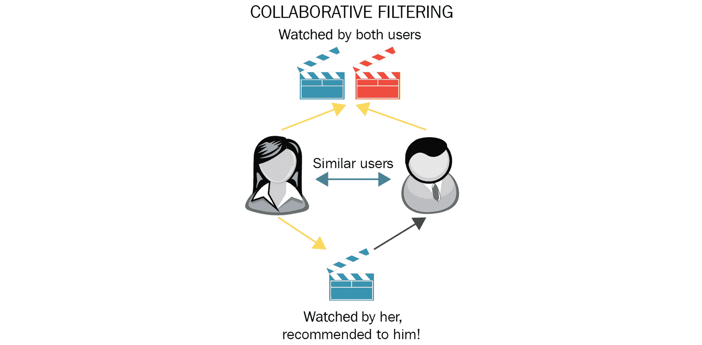
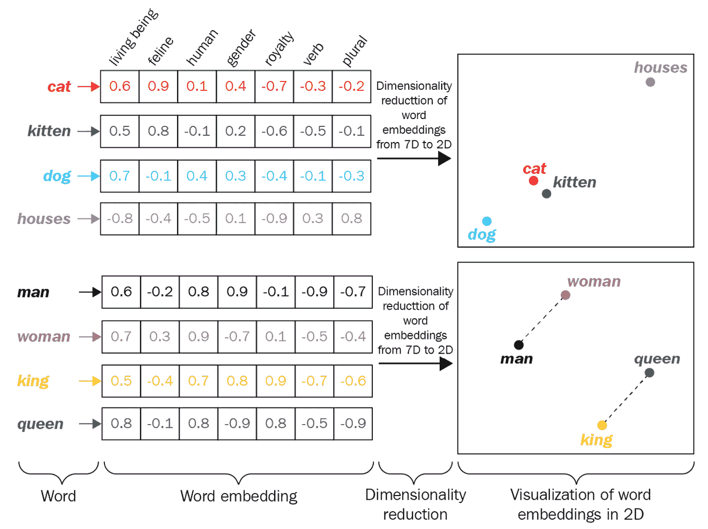
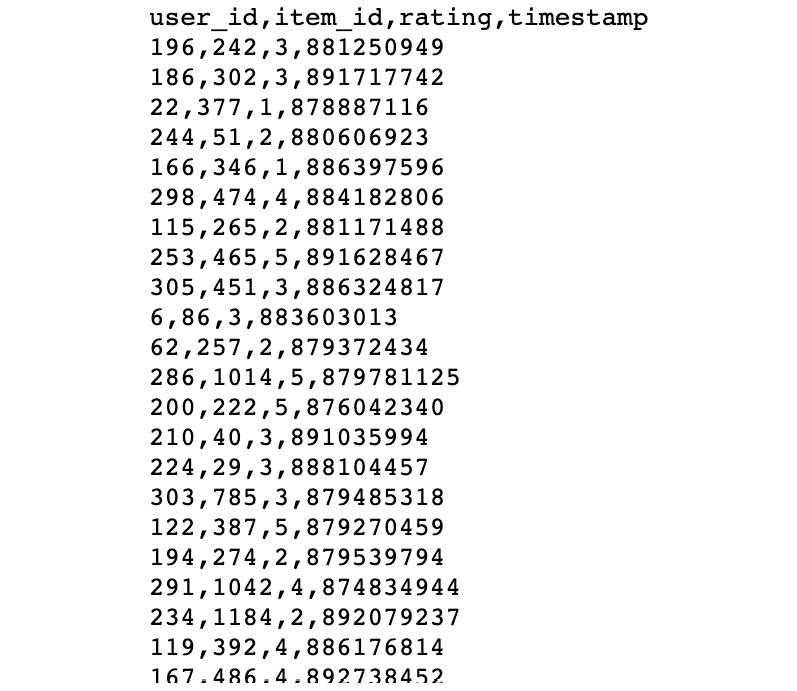
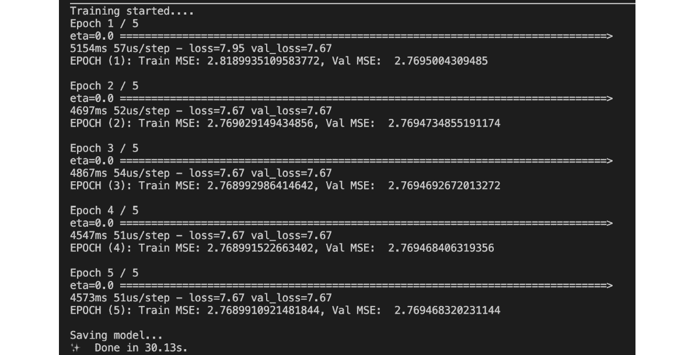

# 第十二章：*第十一章*：使用 Danfo.js 和 TensorFlow.js 构建推荐系统

在前一章中，我们向您介绍了 TensorFlow.js，并向您展示了如何创建一个简单的回归模型来预测销售价格。在本章中，我们将进一步创建一个推荐系统，可以根据用户的偏好向不同用户推荐电影。通过本章的学习，您将了解推荐系统的工作原理，以及如何使用 JavaScript 构建一个推荐系统。

具体来说，我们将涵盖以下主题：

+   推荐系统是什么？

+   创建推荐系统的神经网络方法

+   构建电影推荐系统

# 技术要求

要在本章中跟进，您将需要以下内容：

+   现代浏览器，如 Chrome、Safari、Opera 或 Firefox

+   **Node.js**、**Danfo.js**、TensorFlow.js 和（可选）**Dnotebook**已安装在您的系统上

+   稳定的互联网连接用于下载数据集

+   本章的代码可在 GitHub 上找到并克隆：[`github.com/PacktPublishing/Building-Data-Driven-Applications-with-Danfo.js/tree/main/Chapter11`](https://github.com/PacktPublishing/Building-Data-Driven-Applications-with-Danfo.js/tree/main/Chapter11)

Danfo.js、TensorFlow.js 和 Dnotebook 的安装说明可以在*第三章**，使用 Danfo.js 入门*，*第十章**，TensorFlow.js 简介*和*第二章**，Dnotebook - JavaScript 交互计算环境*中找到。

# 什么是推荐系统？

**推荐系统**是任何可以预测用户对物品的偏好或有用性评分的系统。利用这个偏好评分，它可以向用户推荐物品。

这里的物品可以是数字产品，如电影、音乐、书籍，甚至衣服。每个推荐系统的目标是能够推荐用户会喜欢的物品。

推荐系统非常受欢迎，几乎无处不在；例如：

+   诸如*Netflix*、*Amazon Prime*、*Hulu*和*Disney+*等电影流媒体平台使用推荐系统向您推荐电影。

+   诸如*Facebook*、*Twitter*和*Instagram*等社交媒体网站使用推荐系统向用户推荐朋友。

+   诸如*Amazon*和*AliExpress*等电子商务网站使用推荐系统向用户推荐衣服、书籍和电子产品等产品。

推荐系统主要是使用用户-物品互动的数据构建的。因此，在构建推荐系统时，通常遵循三种主要方法。这些方法是**协同过滤**、**基于内容的过滤**和**混合方法**。我们将在以下子章节中简要解释这些方法。

## 协同过滤方法

在协同过滤方法中，推荐系统是基于用户的过去行为或历史建模的。也就是说，这种方法利用现有的用户互动，如对物品的评分、喜欢或评论，来建模用户的偏好，从而了解用户喜欢什么。下图显示了协同过滤方法如何帮助构建推荐系统：



图 11.1 - 基于协同过滤的推荐系统构建方法

在上图中，您可以看到两个观看了相同电影，可能评分相同的用户被分为相似用户，因为左边的人看过的电影被推荐给了右边的人。在基于内容的过滤方法中，推荐系统是基于**物品特征**建模的。也就是说，物品可能预先标记有某些特征，比如类别、价格、流派、大小和收到的评分，利用这些特征，推荐系统可以推荐相似的物品。

下图显示了基于内容的过滤方法构建推荐系统的工作原理：


图 11.2 - 基于内容的过滤方法构建推荐系统

在上图中，您可以观察到相互相似的电影会被推荐给用户。

## 混合过滤方法

混合方法，顾名思义，是协同和基于内容的过滤方法的结合。也就是说，它结合了两种方法的优点，创建了一个更好的推荐系统。大多数现实世界的推荐系统今天都使用这种方法来减轻各种方法的缺点。

下图显示了将基于内容的过滤方法与协同过滤方法相结合，创建混合推荐系统的一种方式：


图 11.3 - 构建推荐系统的混合方法

在上图中，您可以看到我们有两个输入输入混合系统。这些输入进入协同(**CF**)和基于内容的系统，然后这些系统的输出被结合起来。这种组合可以定制，甚至可以作为其他高级系统的输入，比如神经网络。总体目标是通过结合多个推荐系统来创建一个强大的混合系统。

值得一提的是，任何用于创建推荐系统的方法都需要某种形式的数据。例如，在协同过滤方法中，您将需要*用户-物品交互*历史记录，而在基于内容的方法中，您将需要*物品元数据*。

如果您有足够的数据来训练一个推荐系统，您可以利用众多的机器学习和非机器学习技术来对数据进行建模，然后再进行推荐。您可以使用一些流行的算法，比如**K 最近邻**([`en.wikipedia.org/wiki/K-nearest_neighbors_algorithm`](https://en.wikipedia.org/wiki/K-nearest_neighbors_algorithm))、**聚类算法**([`en.wikipedia.org/wiki/Cluster_analysis`](https://en.wikipedia.org/wiki/Cluster_analysis))、**决策树**([`en.wikipedia.org/wiki/Decision_trees`](https://en.wikipedia.org/wiki/Decision_trees))、**贝叶斯分类器**([`en.wikipedia.org/wiki/Naive_Bayes_classifier`](https://en.wikipedia.org/wiki/Naive_Bayes_classifier))，甚至**人工神经网络**([`en.wikipedia.org/wiki/Artificial_neural_networks`](https://en.wikipedia.org/wiki/Artificial_neural_networks))。

在本章中，我们将使用**神经网络**方法来构建推荐系统。我们将在下一节中详细解释这一点。

# 创建推荐系统的神经网络方法

近年来，神经网络在解决机器学习（ML）领域的许多问题时已成为瑞士军刀。这在 ML 突破领域明显，如图像分类/分割和自然语言处理。随着数据的可用性，神经网络已成功用于构建大规模推荐系统，如 Netflix（https://research.netflix.com/research-area/machine-learning）和 YouTube（https://research.google/pubs/pub45530/）使用的系统。

尽管有不同的方法来使用神经网络构建推荐系统，但它们都依赖于一个主要事实：它们需要一种有效的方法来学习项目或用户之间的相似性。在本章中，我们将利用一种称为嵌入的概念来有效地学习这些相似性，以便轻松地为我们的推荐系统提供动力。

但首先，嵌入是什么，为什么我们在使用它们？在下一小节中，我们将简要回答这些问题。

### 什么是嵌入？

嵌入是将离散变量映射到连续或实值变量的映射。也就是说，给定一组变量，例如[好，坏]，嵌入可以将每个离散项映射到*n*维的连续向量 - 例如，好可以表示为[0.1, 0.6, 0.1, 0.8]，坏可以表示为[0.8, 0.2, 0.6, 0.1]，如下图所示：


图 11.4 - 用实值变量表示离散类别

如果您熟悉诸如独热编码（https://en.wikipedia.org/wiki/One-hot）或标签编码（https://machinelearningmastery.com/one-hot-encoding-for-categorical-data/）等编码方案，那么您可能想知道嵌入与它们有何不同。

嗯，嵌入有两个主要的区别，技术上来说，是优势： 

+   嵌入表示可以是小的或大的，具体取决于指定的维度。这与独热编码等编码方案不同，其中表示的维度随着离散类的数量增加而增加。

例如，下图显示了一个独热编码表示中使用的维度随着唯一国家数量的增加而增加：


图 11.5 - 嵌入和独热编码之间的大小比较

+   嵌入可以与神经网络中的权重一起学习。这是与其他编码方案相比的主要优势，因为具有此属性，学习的嵌入成为离散类的相似性集群，这意味着您可以轻松找到相似的项目或用户。例如，查看以下证明，您可以看到我们有两组学习的单词嵌入：



图 11.6 - 嵌入单词并在嵌入空间中显示相似性（重新绘制自：https://medium.com/@hari4om/word-embedding-d816f643140）

在前面的图中，您可以看到代表男人，女人，国王和皇后的组被传递到嵌入中，结果输出是一个嵌入空间，其中意义相近的单词被分组。这是通过学习的单词嵌入实现的。

那么，我们如何利用嵌入来创建推荐系统呢？嗯，正如我们之前提到的，嵌入可以有效地表示数据，这意味着我们可以使用它们来学习或表示用户-项目的交互。因此，我们可以轻松地使用学习到的嵌入来找到相似的项目进行推荐。我们甚至可以进一步将嵌入与监督机器学习任务相结合。

将学习到的嵌入表示与监督机器学习任务相结合的这种方法，将是我们在下一节中创建电影推荐系统的做法。

# 构建电影推荐系统

要构建一个电影推荐系统，我们需要某种用户-电影交互数据集。幸运的是，我们可以使用由**Grouplens**提供的`MovieLens 100k`数据集（[`grouplens.org/datasets/movielens/100k/`](https://grouplens.org/datasets/movielens/100k/)）。这个数据包含了 1,000 个用户对 1,700 部电影的 100,000 个电影评分。

以下截图显示了数据集的前几行：



图 11.7 - MovieLens 数据集的前几行

从前面的截图中，您可以看到我们有`user_id`，`item_id`（电影）以及用户给予项目（电影）的评分。仅凭这种交互和使用嵌入，我们就可以有效地建模用户的行为，并因此了解他们喜欢什么类型的电影。

要了解我们将如何构建和学习嵌入与神经网络的交互，请参考以下架构图：


图 11.8 - 我们推荐系统的高层架构

从前面的图表中，您可以看到我们有两个嵌入层，一个用于用户，另一个用于项目（电影）。这两个嵌入层然后在传递到一个密集层之前被合并。

因此，实质上，我们将嵌入与监督学习任务相结合，其中来自嵌入的输出被传递到一个密集层，以预测用户将给出的项目（电影）的评分。

您可能会想，如果我们正在学习预测用户将给出的产品的评分，那么这如何帮助我们进行推荐呢？嗯，诀窍在于，如果我们能有效地预测用户将给一部电影的评分，那么，使用学习到的相似性嵌入，我们就可以预测用户将给所有电影的评分。然后，有了这个信息，我们就可以向用户推荐预测评分最高的电影。

那么，我们如何在 JavaScript 中构建这个看似复杂的推荐系统呢？嗯，在下一个小节中，我们将向您展示如何轻松地使用 TensorFlow.js，结合 Danfo.js，来实现这一点。

## 设置项目目录

您需要成功跟进本章的代码和数据集，这些都可以在本章的代码存储库中找到（[`github.com/PacktPublishing/Building-Data-Driven-Applications-with-Danfo.js/tree/main/Chapter11`](https://github.com/PacktPublishing/Building-Data-Driven-Applications-with-Danfo.js/tree/main/Chapter11)）。

您可以下载整个项目到您的计算机上以便轻松跟进。如果您已经下载了项目代码，那么请导航到您的根目录，其中`src`文件夹可见。

在`src`文件夹中，您有以下文件夹/脚本：

+   `book_recommendation_model`：这是保存训练模型的文件夹。

+   `data`：这个文件夹包含我们的训练数据。

+   `data_proc.js`：这个脚本包含了我们所有的数据处理代码。

+   `model.js`：这个脚本定义并编译了推荐模型。

+   `recommend.js`：这个脚本包含制作推荐的代码。

+   `train.js`：这个脚本包含训练推荐模型的代码。

要快速测试预训练的推荐模型，首先使用`yarn`（推荐）或`NPM`安装所有必要的包，然后运行以下命令：

```js
 yarn recommend
```

这将为用户 ID 为`196`、`880`和`13`的用户推荐`10`、`5`和`20`部电影。如果成功，你应该看到类似以下的输出：


图 11.9 - 训练推荐系统提供的推荐电影

你也可以通过运行以下命令重新训练模型：

```js
 yarn retrain
```

默认情况下，上述命令将使用批量大小为`128`、时代大小为`5`来重新训练模型，并在完成时将训练好的模型保存到`book_recommender_model`文件夹中。

现在你已经在本地设置了项目，我们将逐步解释每个部分，并解释如何从头开始构建推荐系统。

## 检索和处理训练数据集

我们使用的数据集是从 Grouplens 网站检索的。默认情况下，电影数据（`https://files.grouplens.org/datasets/movielens/ml-100k.zip`）是一个包含制表符分隔文件的 ZIP 文件。为了简单起见，我已经下载并将你在这个项目中需要的两个文件转换成了`CSV`格式。你可以从这个项目的代码库的`data`文件夹中获取这些文件（[`github.com/PacktPublishing/Building-Data-Driven-Applications-with-Danfo.js/tree/main/Chapter11/src/data`](https://github.com/PacktPublishing/Building-Data-Driven-Applications-with-Danfo.js/tree/main/Chapter11/src/data)）。

主要有两个文件：

+   `movieinfo.csv`：这个文件包含了关于每部电影的元数据，比如标题、描述和链接。

+   `movielens.csv`：这是用户评分数据集。

要使用`movielens`数据集，我们必须用 Danfo.js 读取数据集，处理数据，然后将其转换为我们可以传递给神经网络的张量。

在项目的代码中，打开`data_proc.js`脚本。这个脚本导出了一个名为`processData`的主要函数，代码如下：

```js
...
    const nItem = (moviesDF["item_id"]).max()
    const nUser = (moviesDF["user_id"]).max()
    const moviesIdTrainTensor = (moviesDF["item_id"]).tensor
    const userIdTrainTensor = (moviesDF["user_id"]).tensor
    const targetData = (moviesDF["rating"]).tensor
    return {
        trainingData: [moviesIdTrainTensor, userIdTrainTensor],
        targetData,
        nItem,
        nUser
    }
...
```

那么，在上述代码中我们在做什么呢？幸运的是，我们不需要进行太多的数据预处理，因为`user_id`、`item_id`和`ratings`列已经是数字形式。所以，我们只是做了两件事：

+   检索物品和用户列的最大 ID。这个数字，称为**词汇量大小**，将在创建我们的模型时传递给嵌入层。

+   检索和返回用户、物品和评分列的基础张量。用户和物品张量将作为我们的训练输入，而评分张量将成为我们的监督学习目标。

现在你知道如何处理数据了，让我们开始使用 TensorFlow.js 构建神经网络。

## 构建推荐模型

我们的推荐模型的完整代码可以在`model.js`文件中找到。这个模型使用了混合方法，就像我们在高级架构图中看到的那样（见*图 11.8*）。

注意

我们正在使用我们在*第十章**TensorFlow.js 简介*中介绍的 Model API 来创建网络。这是因为我们正在创建一个复杂的架构，我们需要更多的控制输入和输出。

在接下来的步骤中，我们将解释模型并展示创建它的相应代码：

1.  `user`和另一个来自物品：

```js
...
const itemInput = tf.layers.input({ name: "itemInput", shape: [1] })
const userInput = tf.layers.input({ name: "userInput", shape: [1] })
...
```

注意，输入的形状参数设置为`1`。这是因为我们的输入张量是具有`1`维的向量。

1.  `InputDim`：这是嵌入向量的词汇量大小。最大整数索引为`+ 1`。

b) `OutputDim`：这是用户指定的输出维度。也就是说，它用于配置嵌入向量的大小。

接下来，我们将合并这些嵌入层。

1.  `dot`乘积，将输出扁平化，并将输出传递给一个密集层：

```js
...
const mergedOutput = tf.layers.dot({ axes: 0}).apply([itemEmbedding, userEmbedding])
const flatten = tf.layers.flatten().apply(mergedOutput)
const denseOut = tf.layers.dense({ units: 1, activation: "sigmoid", kernelInitializer: "leCunUniform" }).apply(flatten)
...
```

通过上述输出，我们现在可以使用 Models API 定义我们的模型。

1.  最后，我们将定义并编译模型，如下面的代码片段所示：

```js
...
const model = tf.model({ inputs: [itemInput, userInput],  outputs: denseOut })
      model.compile({
        optimizer: tf.train.adam(LEARNING_RATE),
        loss: tf.losses.meanSquaredError
      });
...
```

上述代码使用 Models API 来定义输入和输出，然后调用 compile 方法，该方法接受训练优化器（Adam 优化器）和损失函数（均方误差）。您可以在`model.js`文件中查看完整的模型代码。

有了模型架构定义，我们就可以开始训练模型。

## 训练和保存推荐模型

模型的训练代码可以在`train.js`文件中找到。此代码有两个主要部分。我们将在这里看到两者。

第一部分，如下面的代码块所示，使用批量大小为`128`，时代大小为`5`，并且将`10`%的数据用于模型验证的验证分割来训练模型，这部分数据是为了模型验证而保留的：

```js
...
await model.fit(trainingData, targetData, {
        batchSize: 128,
        epochs: 5,
        validationSplit: 0.1,
        callbacks: {
            onEpochEnd: async (epoch, logs) => {
                const progressUpdate = `EPOCH (${epoch + 1}): Train MSE: ${Math.sqrt(logs.loss)}, Val MSE:  ${Math.sqrt(logs.val_loss)}\n`
                console.log(progressUpdate);
            }
        }
    });
...
```

在上述训练代码中，我们在每个训练时代之后打印了损失。这有助于我们跟踪训练进度。

下面的代码块将训练好的模型保存到提供的文件路径。在我们的情况下，我们将其保存到`movie_recommendation_model`文件夹中：

```js
...
await model.save(`file://${path.join(__dirname, "movie_recommendation_model")}`)
...
```

请注意此文件夹的名称，因为我们将在下一小节中使用它进行推荐。

要训练模型，您可以在`src`文件夹中运行以下命令：

```js
yarn train 
```

或者，您也可以直接使用`node`运行`train.js`：

```js
node train.js
```

这将开始指定数量的时代模型训练，并且一旦完成，将模型保存到指定的文件夹。训练完成后，您应该有类似以下的输出：



图 11.10 - 推荐模型的训练日志

一旦您有了训练好并保存的模型，您就可以开始进行电影推荐。

## 使用保存的模型进行电影推荐

`recommend.js`文件包含了进行推荐的代码。我们还包括了一个名为`getMovieDetails`的实用函数。此函数将电影 ID 映射到电影元数据，以便我们可以显示有用的信息，例如电影的名称。

但是我们如何进行推荐呢？由于我们已经训练了模型来预测用户对一组电影的评分，我们可以简单地将用户 ID 和所有电影传递给模型来进行评分预测。

有了所有电影的评分预测，我们可以简单地按降序对它们进行排序，然后返回前几部电影作为推荐。

要做到这一点，请按照以下步骤进行：

1.  首先，我们必须获取所有唯一的电影 ID 进行预测：

```js
...
const moviesDF = await dfd.read_csv(moviesDataPath)
const uniqueMoviesId = moviesDF["item_id"].unique().values
const uniqueMoviesIdTensor = tf.tensor(uniqueMoviesId)
...
```

1.  接下来，我们必须构建一个与电影 ID 张量长度相同的用户张量。该张量将在所有条目中具有相同的用户 ID，因为对于每部电影，我们都在预测同一用户将给出的评分：

```js
...
const userToRecommendForTensor = tf.fill([uniqueMoviesIdTensor.shape[0]], userId)
...
```

1.  接下来，我们必须加载模型并通过传递电影和用户张量作为输入来调用`predict`函数：

```js
...
const model = await loadModel()
      const ratings = model.predict([uniqueMoviesIdTensor,
   userToRecommendForTensor])
...
```

这将返回一个张量，其中包含用户将给每部电影的预测评分。

1.  接下来，我们必须构建一个包含名为`movie_id`（唯一电影 ID）和`ratings`（用户对每部电影的预测评分）的两列的 DataFrame：

```js
...
const recommendationDf = new dfd.DataFrame({
        item_id: uniqueMoviesId,
        ratings: ratings.arraySync()
     })
... 
```

1.  将预测评分和相应的电影 ID 存储在 DataFrame 中有助于我们轻松地对评分进行排序，如下面的代码所示：

```js
...
    const topRecommendationsDF = recommendationDf
        .sort_values({
            by: "ratings",
            ascending: false
        })
        .head(top) //return only the top rows
...
```

1.  最后，我们必须将排序后的电影 ID 数组传递给`getMovieDetails`实用函数。此函数将每个电影 ID 映射到相应的元数据，并返回一个包含两列（电影标题和电影发行日期）的 DataFrame，如下面的代码所示：

```js
...
const movieDetailsDF = await getMovieDetails(topRecommendationsDF["movie_id"].values)
...
```

`recommend.js`文件在`src`文件夹中包含了完整的推荐代码，包括将电影 ID 映射到其元数据的实用函数。

要测试推荐，您需要调用`recommend`函数并传递电影 ID 和您想要的推荐数量，如下面的示例所示：

```js
recommend(196, 10) // Recommend 10 movies for user with id 196
```

上述代码在控制台中给出了以下输出：

```js
[
  'Remains of the Day, The (1993)',
  'Star Trek: First Contact (1996)',
  'Kolya (1996)',
  'Men in Black (1997)',
  'Hunt for Red October, The (1990)',
  'Sabrina (1995)',
  'L.A. Confidential (1997)',
  'Jackie Brown (1997)',
  'Grease (1978)',
  'Dr. Strangelove or: How I Learned to Stop Worrying and Love the Bomb (1963)'
]
```

就是这样！您已成功使用神经网络嵌入创建了一个推荐系统，可以高效地向不同用户推荐电影。利用本章学到的概念，您可以轻松地创建不同的推荐系统，可以推荐不同的产品，如音乐、书籍和视频。

# 总结

在本章中，我们成功地构建了一个推荐系统，可以根据用户的偏好向他们推荐电影。首先，我们定义了推荐模型是什么，然后简要讨论了设计推荐系统的三种方法。接着，我们谈到了神经网络嵌入以及为什么决定使用它们来创建我们的推荐模型。最后，我们通过构建一个电影推荐模型，将学到的所有概念整合起来，可以向用户推荐指定数量的电影。

通过本章学到的知识，您可以轻松地创建一个可以嵌入到 JavaScript 应用程序中的推荐系统。

在下一章，您将使用 Danfo.js 和 Twitter API 构建另一个实际应用程序。
