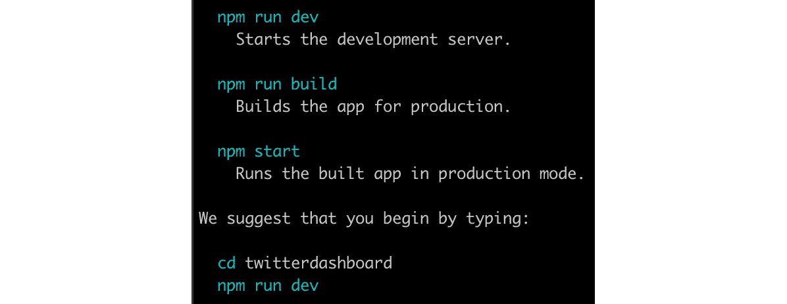
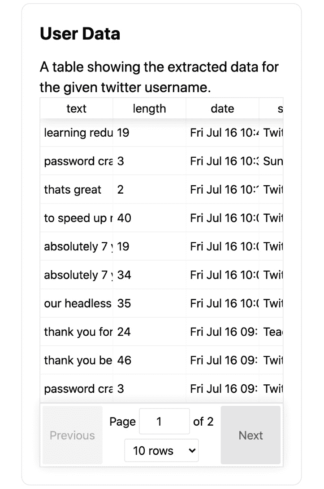

# 第十三章：*第十二章*：构建 Twitter 分析仪表板

本章的主要目标是展示如何使用 Danfo.js 在后端和前端构建全栈 Web 分析平台。

为了演示这一点，我们将构建一个小型的单页面 Web 应用程序，在这个应用程序中，您可以搜索 Twitter 用户，获取他们在特定日期被提及的所有推文，并进行一些简单的分析，比如情感分析，从数据中得出一些见解。

在本章中，我们将研究构建 Web 应用程序的以下主题：

+   设置项目环境

+   构建后端

+   构建前端

# 技术要求

本章需要以下内容：

+   React.js 的知识

+   本章的代码在这里可用：[`github.com/PacktPublishing/Building-Data-Driven-Applications-with-Danfo.js/tree/main/Chapter12`](https://github.com/PacktPublishing/Building-Data-Driven-Applications-with-Danfo.js/tree/main/Chapter12)

# 设置项目环境

对于这个项目，我们将构建一个既有后端又有前端的单个网页。我们将使用 Next.js 框架来构建应用程序。Next.js 使您能够快速轻松地构建后端和前端。我们还将使用`tailwindcss`，就像我们之前为一些项目所做的那样，比如无代码环境项目。

设置我们的项目环境与 Next.js 包含默认的`tailwindcss`配置，我们只需要运行以下命令：

```js
$ npx create-next-app -e with-tailwindcss twitterdashboard
```

`npx`命令运行`create-next-app`，它在`twitterdashboard`目录中创建了 Next.js 样板代码，包括`tailwindcss`配置。请注意，`twitterdashboard`目录（也称为*项目名称*）可以根据您的选择命名。如果一切安装成功，您应该会得到以下截图中显示的输出：



图 12.1 – 代码环境设置

现在我们已经完成了安装，如果一切正常工作，您应该在项目中有以下文件：


图 12.2 – 目录结构

最后，为了测试项目是否安装成功并准备就绪，让我们运行以下命令：

```js
$ npm run dev
```

这个命令应该自动启动应用程序并打开浏览器，显示以下界面：


图 12.3 – Next.js UI

对于这个项目，我们将修改*图 12.3*中显示的界面以适应我们的口味。

现在代码环境已经设置好了，让我们继续创建我们的应用程序。

# 构建后端

在本节中，我们将学习如何为我们的应用程序创建以下 API：

+   `/api/tweet`：这个 API 负责获取 Twitter 用户并获取他们的数据。

+   `/api/nlp`：这个 API 负责对获取的用户数据进行情感分析。

这些 API 将被前端组件所使用，并将用于创建不同的可视化和分析。让我们从创建用于获取 Twitter 用户数据的 API 开始。

## 构建 Twitter API

在本节中，我们将构建一个 API，使得轻松获取 Twitter 用户被提及的推文。从每条推文中，我们将获取它们的元数据，比如文本、发送者的姓名、喜欢和转发的次数、用于发推的设备以及推文创建的时间。

为了构建用于获取 Twitter 用户数据的 Twitter API，并将其结构化为我们喜欢的形式，以便在前端轻松使用，我们需要安装一个工具，使其更容易与主要的 Twitter 开发者 API 进行交互。在以下命令中，我们将安装`twit.js`以便轻松访问和处理 Twitter API：

```js
$ npm i twit
```

一旦安装了`twit`，我们需要对其进行配置。为了使用`twit`，我们需要各种 Twitter 开发者密钥，比如以下内容：

```js
consumer_key='....',
consumer_secret='....',
access_token='.....',
access_token_secret='.....'
```

如果您没有这些密钥，您将需要创建一个 Twitter 开发者账户，然后申请通过[`developer.twitter.com/`](https://developer.twitter.com/)获得 API 访问权限。如果获得使用 Twitter API 的权限，您可以访问[`developer.twitter.com/en/apps`](https://developer.twitter.com/en/apps)创建一个应用程序并设置您的凭证密钥。

注意

获取 Twitter API 可能需要几天的时间，这取决于您描述用例的方式。要获得关于设置 Twitter API 和获取必要密钥的逐步指南以及视觉辅助，请按照这里的步骤：[`realpython.com/twitter-bot-python-tweepy/#creating-twitter-api-authentication-credentials`](https://realpython.com/twitter-bot-python-tweepy/#creating-twitter-api-authentication-credentials)。

在获得项目所需的 Twitter 开发者密钥之后，我们将在我们的代码中使用它们。为了防止将密钥暴露给公众，让我们创建一个名为`.env.local`的文件，并在这个文件中添加我们的 API 密钥，如下面的代码块所示：

```js
CONSUMER_KEY='Put in your CONSUMER_KEY',
CONSUMER_SECRET='Your CONSUMER_SECRET',
ACCESS_TOKEN ='Your ACCESS_TOKEN',
ACCESS_TOKEN_SECRET='Your ACCESS_TOKEN_SECRET'
```

在 Next.js 中，所有 API 都是在`/pages/api`文件夹中创建的。Next.js 使用`pages/`文件夹中的文件结构来创建 URL 路由。例如，如果您在`pages/`文件夹中有一个名为`login.js`的文件，那么`login.js`中的内容将在`http://localhost:3000/login`中呈现。

前面的段落展示了基于文件名和结构在 Next.js 中为网页创建路由的方法。同样的方法也适用于在 Next.js 中创建 API。

假设我们在`pages/api`中创建了一个用于注册的 API，名为`signup.js`。这个 API 将自动在`http://localhost:3000/api/signup`中可用，如果我们要在应用程序内部使用这个 API，我们可以这样调用它：`/api/signup`。

对于我们的`/api/tweet` API，让我们在`pages/api/`中创建一个名为`tweet.js`的文件，并按照以下步骤更新文件：

1.  首先，我们导入`twit.js`，然后创建一个函数来清理每个推文：

```js
const Twit = require('twit')
function clean_tweet(tweet) {
  tweet = tweet.normalize("NFD") //normalize text
  tweet = tweet.replace(/(RT\s(@\w+))/g, '') //remove Rt tag followed by an @ tag
  tweet = tweet.replace(/(@[A-Za-z0-9]+)(\S+)/g, '') // remove user name e.g @name
  tweet = tweet.replace(/((http|https):(\S+))/g, '') //remove url
  tweet = tweet.replace(/[!#?:*%$]/g, '') //remove # tags
  tweet = tweet.replace(/[^\s\w+]/g, '') //remove punctuations
  tweet = tweet.replace(/[\n]/g, '') //remove newline
  tweet = tweet.toLowerCase().trim() //trim text
  return tweet
}
```

`clean_tweet`函数接受推文文本，规范化文本，移除标签字符，用户名称，URL 链接和换行符，然后修剪文本。

1.  然后我们创建一个名为`twitterApi`的函数，用于创建我们的 API：

```js
export default function twitterAPI(req, res) {
  // api code here
}
```

`twitterApi`函数接受两个参数，`req`和`res`，分别是服务器请求和响应的参数。

1.  我们现在将使用必要的代码更新`twitterApi`：

```js
if (req.method === "POST") {
    const { username } = req.body

    const T = new Twit({
      consumer_key: process.env.CONSUMER_KEY,
      consumer_secret: process.env.CONSUMER_SECRET,
      access_token: process.env.ACCESS_TOKEN,
      access_token_secret: process.env.ACCESS_TOKEN_SECRET,
      timeout_ms: 60 * 1000,  // optional HTTP request timeout to apply to all requests.
      strictSSL: true,     // optional - requires SSL certificates to be valid.
    })
}
```

首先，我们检查`req.method`请求方法是否为`POST`方法，然后我们从通过搜索框发送的请求体中获取用户名。

`Twit`类被实例化，并且我们的 Twitter API 密钥被传入。由于我们的 Twitter 开发者 API 密钥存储为`.env.local`中的环境密钥，我们可以使用`process.env`轻松访问每个密钥。

1.  我们已经使用我们的 API 密钥配置了`twit.js`。现在让我们搜索提到用户的所有推文：

```js
T.get('search/tweets', { q: `@${username}`, tweet_mode: 'extended' }, function (err, data, response) {
  let dfData = {
    text: data.statuses.map(tweet => clean_tweet(tweet.full_text)),
    length: data.statuses.map(tweet => clean_tweet(tweet.full_text).split(" ").length),
    date: data.statuses.map(tweet => tweet.created_at),
    source: data.statuses.map(tweet => tweet.source.replace(/<(?:.|\n)*?>/gm, '')),
    likes: data.statuses.map(tweet => tweet.favorite_count),
    retweet: data.statuses.map(tweet => tweet.retweet_count),
    users: data.statuses.map(tweet => tweet.user.screen_name)
  }
  res.status(200).json(dfData)
})
```

我们使用`T.get`方法中的`search/tweets` API 搜索所有推文。然后我们传入包含我们想要搜索的用户的用户名的`param`对象。

创建一个`dfData`对象来根据我们希望的 API 输出响应的方式对数据进行结构化。`dfData`包含以下键，这些键是我们想要从推文中提取的元数据：

+   `text`：推文中的文本

+   `length`：推文的长度

+   `date`：推文发布日期

+   `source`：用于创建推文的设备

+   `likes`：推文的点赞数

+   `retweet`：推文的转发数

+   `users`：创建推文的用户

前面列表中的元数据是从前面代码中的`T.get()`方法返回的`search/tweets`中提取的 JSON 数据中提取的。从这个 JSON 数据中提取的所有元数据都包含在一个名为`statuses`的对象数组中，以下是 JSON 数据的结构：

```js
{
  statuses:[{
    ......
  },
    ......
  ]
}
```

Twitter API 已经创建并准备好使用。让我们继续创建情感分析 API。

## 构建文本情感 API

从`/api/tweet` API 中，我们将获取结构化的 JSON 数据，然后进行情感分析。

数据的情感分析将通过`/api/nlp`路由获取。因此，在本节中，我们将看到如何为我们的 Twitter 数据创建情感分析 API。

让我们在`/pages/api/`文件夹中创建一个名为`nlp.js`的文件，并按以下步骤更新它：

1.  我们将使用`nlp-node.js`包进行情感分析。我们还将使用`danfojs-node`进行数据预处理，因此让我们安装这两个包：

```js
$ npm i node-nlp danfojs-node
```

1.  我们从`nlp-node`和`danfojs-node`中导入`SentimentAnalyzer`和`DataFrame`：

```js
const { SentimentAnalyzer } = require('node-nlp')
const { DataFrame } = require("danfojs-node")
```

1.  接下来，我们将创建一个默认的`SentimentApi`导出函数，其中将包含我们的 API 代码：

```js
export default async function SentimentApi(req, res) {

}
```

1.  然后，我们将检查请求方法是否为`POST`请求，然后对从请求体获取的数据进行一些数据预处理：

```js
if (req.method === "POST") {
    const sentiment = new SentimentAnalyzer({ language: 'en' })
    const { dfData, username } = req.body
  //check if searched user is in the data
    const df = new DataFrame(dfData)
    let removeUserRow = df.query({
      column: "users",
      is: "!=",
      to: username
    })
    //filter rows with tweet length <=1
    let filterByLength = removeUserRow.query({
      column: "length",
      is: ">",
      to: 1
    })
. . . . .
}
```

在上述代码中，我们首先实例化了`SentimentAnalyzer`，然后将其语言配置设置为英语（`en`）。然后我们从请求体中获取了`dfData`和`username`。

为了分析和从数据中创建见解，我们只想考虑用户与他人的互动，而不是他们自己；也就是说，我们不想考虑用户回复自己的推文。因此，我们从从`dfData`生成的 DataFrame 中过滤出用户的回复。

有时，一条推文可能只包含一个标签或使用`@`符号引用用户。但是，在我们之前的清理过程中，我们删除了标签和`@`符号，这将导致一些推文最终不包含任何文本。因此，我们将创建一个新的`filterBylength` DataFrame，其中将包含非空文本：

1.  我们将继续创建一个对象，该对象将包含用户数据的整体情感计数，并在我们调用 API 时发送到前端：

```js
let data = {
  positive: 0,
  negative: 0,
  neutral: 0
}
let sent = filterByLength["text"].values
for (let i in sent) {
  const getSent = await sentiment.getSentiment(sent[i])
  if (getSent.vote === "negative") {
    data.negative += 1
  } else if (getSent.vote === "positive") {
    data.positive += 1
  } else {
    data.neutral += 1
  }
}
res.status(200).json(data)
```

在上述代码中，我们创建数据对象来存储整体情感分析。由于情感分析只会在`filterByLength` DataFrame 中的文本数据上执行，我们提取文本列值。

1.  然后，我们循环遍历提取的文本列值，并将它们传递给`sentiment.getSentiment`。对于传递给`sentiment.getSentiment`的每个文本，将返回以下类型的对象：

```js
{
  score: 2.593,
  numWords: 36,
  numHits: 8,
  average: 0.07202777777777777,
  type: 'senticon',
  locale: 'en',
  vote: 'positive'
}
```

对于我们的用例，我们只需要`vote`的键值。因此，我们检查文本的`vote`值是`negative`、`positive`还是`neutral`，然后递增数据对象中每个键的计数。

因此，每当调用`/api/nlp`时，我们应该收到以下响应，例如：

```js
{
  positive: 20,
  negative: 12,
  neutral: 40
}
```

在本节中，我们看到了如何在 Next.js 中创建 API，更重要的是，我们看到了在后端使用 Danfo.js 是多么方便。在下一节中，我们将实现应用程序的前端部分。

# 构建前端

对于我们的前端设计，我们将使用 Next.js 默认的 UI，如*图 12.3*所示。我们将为我们的前端实现以下一组组件：

+   `Search`组件：创建一个搜索框来搜索 Twitter 用户。

+   `ValueCount`组件：获取唯一值的计数并使用条形图或饼图绘制它。

+   `Plot`组件：此组件用于以条形图的形式绘制我们的情感分析。

+   `Table`组件：用于以表格形式显示获取的用户数据。

在接下来的几节中，我们将实现上述组件列表。让我们开始实现`Search`组件。

## 创建搜索组件

`Search`组件是设置应用程序运行的主要组件。它提供了输入字段，可以在其中输入 Twitter 用户的名称，然后进行搜索。`search`组件使我们能够调用创建的两个 API：`/api/tweet`和`/api/nlp`。

在我们的`twitterdashboard`项目目录中，让我们创建一个名为`Search.js`的目录，并在该目录中创建一个名为`Search.js`的 JavaScript 文件。

在`Search.js`中，让我们输入以下代码：

```js
import React from 'react'
export default function Search({ inputRef, handleKeyEvent, handleSubmit }) {
  return (
    <div className='border-2 flex justify-between p-2 rounded-md  md:p-4'>
      <input id='searchInput' 
        type='text' 
        placeholder='Search twitter user' 
        className='focus:outline-none'
        ref={inputRef} 
        onKeyPress={handleKeyEvent}
      />
      <button className='focus:outline-none' 
            onClick={() => { handleSubmit() }}>
            
     </button>
    </div>
  )
}
```

在上述代码中，我们创建了一个带有以下一组 props 的`Search`函数：

+   `inputRef`：此 prop 是从`useRef` React Hook 获取的。它将用于跟踪搜索输入字段的当前值。

+   `handleKeyEvent`：这是一个事件函数，将被传递给搜索输入字段，以便通过按*Enter*键进行搜索。

+   `handleSubmit`：这是一个函数，每次单击搜索按钮时都会激活。`handleSubmit`函数负责调用我们的 API。

让我们继续前往`/pages/index.js`，通过导入`Search`组件并根据以下步骤创建所需的 props 列表来更新文件：

1.  首先，我们将导入 React、React Hooks 和`Search`组件：

```js
import React, { useRef, useState } from 'react'
import Search from '../components/Search'
```

1.  然后，我们将创建一些状态集：

```js
let [data, setData] = useState() // store tweet data from /api/tweet
let [user, setUser] = useState() // store twitter usersname 
let [dataNlp, setDataNlp] = useState() // store data from /api/nlp
let inputRef = useRef() // monitor the current value of search input field
```

1.  然后，我们将创建`handleSubmit`函数来调用我们的 API 并更新状态数据：

```js
const handleSubmit = async () => {
    const res = await fetch(
      '/api/tweet',
      {
        body: JSON.stringify({
        username: inputRef.current.value
        }),
        headers: {
        'Content-Type': 'application/json'
        },
        method: 'POST'
        }
    )
    const result = await res.json()
. . . . . . .
}
```

首先，在`handleSubmit`中，我们调用`/api/tweet` API 来获取用户的数据。在`fetch`函数中，我们获取`inputRef.current.value`搜索字段的当前值，并将其转换为 JSON 对象，然后传递到请求体中。然后使用变量 result 来从 API 获取 JSON 数据。

1.  我们进一步更新`handleSubmit`函数以从`/api/nlp`获取数据：

```js
const resSentiment = await fetch(
      '/api/nlp',
      {
        body: JSON.stringify({
        username: inputRef.current.value,
        dfData: result
        }),
        headers: {
        'Content-Type': 'application/json'
        },
        method: 'POST'
    },
    )
const sentData = await resSentiment.json()
```

上述代码与*步骤 3*中的代码相同。唯一的区别是我们调用`/api/nlp` API，然后将*步骤 3*中的结果数据和从搜索输入字段获取的用户名传递到请求体中。

1.  然后我们在`handleSubmit`中更新以下状态：

```js
setDataNlp(sentData)
setUser(inputRef.current.value)
setData(result)
```

1.  接下来，我们将创建`handleKeyEvent`函数以通过按*Enter*键进行搜索：

```js
const handleKeyEvent = async (event) => {
    if (event.key === 'Enter') {
      await handleSubmit()
    }
  }
```

在上述代码中，我们检查按键是否为*Enter*键，如果是，则调用`handleSubmit`函数。

1.  最后，我们调用我们的`Search`组件：

```js
<Search inputRef={inputRef} handleKeyEvent={handleKeyEvent} handleSubmit={handleSubmit} />
```

记住，我们说过我们将使用 Next.js 的默认 UI。因此，在`index.js`中，让我们将`Welcome to Next.js`转换为`Welcome to Twitter Dashboard`。

更新`index.js`后，您可以在`http://localhost:3000/`检查浏览器的更新。您将看到以下更改：


图 12.4 - index.js 更新为搜索组件

`Search`组件已经实现并融入到主应用程序中，所有必需的状态数据都可以轻松地由`Search`组件更新。让我们继续实现`ValueCounts`组件。

## 创建 ValueCounts 组件

我们将为从`/api/tweet`获取的数据创建一个简单的分析。这个分析涉及检查列中唯一值存在的次数。我们将获得`source`列和`users`列的值计数。

`source`列的值计数告诉我们其他 Twitter 用户用于与我们搜索的用户进行交互的设备。`users`列的值计数告诉我们与我们搜索的用户互动最多的用户。

注意

这里使用的代码是从*第八章*的*实现图表组件*部分中复制的，*创建无代码数据分析/处理系统*。此部分的代码可以在此处获取：[`github.com/PacktPublishing/Building-Data-Driven-Applications-with-Danfo.js-/blob/main/Chapter12/components/ValueCounts.js`](https://github.com/PacktPublishing/Building-Data-Driven-Applications-with-Danfo.js-/blob/main/Chapter12/components/ValueCounts.js)。这里大部分代码不会在这里详细解释。

让我们转到`components/`目录并创建一个名为`ValueCounts.js`的文件，然后按以下步骤更新它：

1.  首先，我们导入必要的模块：

```js
import React from "react"
import { DataFrame } from 'danfojs/src/core/frame'
import { Pie as PieChart } from "react-chartjs-2";
import { Bar as BarChart } from 'react-chartjs-2';
```

1.  然后，我们创建一个名为`ValueCounts`的函数：

```js
export default function ValueCounts({ data, column, username, type }) {

}
```

该函数接受以下 props：

a) `data`：这是来自`/api/tweet`的数据。

b) `column`：我们要获取值计数的列的名称。

c) `username`：来自搜索字段的输入用户名。

d) `type`：我们要绘制的图表类型。

1.  接下来，我们更新`ValueCounts`函数：

```js
const df = new DataFrame(data)
const removeUserData = df.query({
  column: "users",
  is: "!=",
  to: username
})
const countsSeries = removeUserData[column].value_counts()
const labels = countsSeries.index
const values = countsSeries.values
```

在上述代码中，我们首先从数据创建一个 DataFrame，然后过滤掉包含搜索用户的行，因为我们不希望用户与自己交互的推文。然后，我们从传入的列中提取`value_counts`值。从创建的`countSeries`变量中，我们生成标签和值，这将用于绘制我们的图表。

1.  然后，我们创建一个名为`dataChart`的图表数据变量，它将符合`chart`组件所接受的格式：

```js
const dataChart = {
    labels: labels,
    datasets: [{
      . . . . 
      data: values,
    }]
  };
```

`dataChart`对象包含在*步骤 3*中创建的标签和值。

1.  我们创建一个条件渲染来检查要绘制的图表类型：

```js
if (type === "BarChart") {
   return (
     <div className="max-w-md">
     <BarChart data={dataChart} options={options} width="100" height="100" />
     </div>
)
} else {
  return (<div className="max-w-md">
        <PieChart data={dataChart} options={options} width="100" height="100" />
    </div>)
}
```

`ValueCounts`组件已设置。

现在，我们可以使用以下步骤将`ValueCounts`组件导入`index.js`：

1.  我们导入`ValueCounts`：

```js
import dynamic from 'next/dynamic'
const DynamicValueCounts = dynamic(
  () => import('../components/ValueCounts'),
  { ssr: false }
)
```

我们导入`ValueCounts`的方式与导入`Search`组件的方式不同。这是因为在`ValueCounts`中，我们使用了 TensorFlow.js 中的一些核心浏览器特定工具，这是 Danfo.js 所需的。因此，我们需要防止 Next.js 从服务器渲染组件，以防止出现错误。

为了防止 Next.js 从服务器渲染组件，我们使用`next/dynamic`，然后将要导入的组件包装在`dynamic`函数中，并将`ssr`键设置为`false`。

注意

要了解有关`next/dynamic`的更多信息，请访问[`nextjs.org/docs/advanced-features/dynamic-import`](https://nextjs.org/docs/advanced-features/dynamic-import)。

1.  我们调用`ValueCounts`组件，现在命名为`DynamicValueCounts`：

```js
{typeof data != "undefined" && <DynamicValueCounts data={data} column={"source"} type={"PieChart"} />}
```

我们检查状态数据是否未定义，并且用户数据是否已从`/api/tweet`获取。如果是这样，我们就为`source`列呈现`ValueCounts`组件。

1.  让我们还为`users`列添加`ValueCounts`：

```js
{typeof data != "undefined" && <DynamicValueCounts data={data} column={"users"} username={user} type={"BarChart"} />}
```

我们为用户的`ValueCounts`图表指定`BarChart`，并为`ValueCounts`源指定`PieChart`。

以下显示了每当搜索用户时，`ValueCounts`显示源和用户交互的显示：


图 12.5 – 源和用户列的 ValueCounts 图表结果

值计数已完成并且工作正常。让我们继续从`/api/nlp`获取的情感分析数据创建一个图表。

## 创建情感分析的图表组件

当用户使用搜索字段搜索用户时，`sentiData`状态将更新为包含来自`/api/nlp`的情感数据。在本节中，我们将为数据创建一个`Plot`组件。

让我们在`components/`目录中创建一个`Plot.js`文件，并按照以下步骤进行更新：

1.  首先，我们导入所需的模块：

```js
import React from "react"
import { Bar as BarChart } from 'react-chartjs-2';
```

1.  然后，我们创建一个名为`Plot`的函数来绘制情感数据的图表：

```js
export default function Plot({ data }) {
  const dataChart = {
    labels: Object.keys(data),
    datasets: [{
    . . . . . . . .
    data: Object.values(data),
    }]
  };
  return (
    <div className="max-w-md">
      <BarChart data={dataChart} options={options} width="100" height="100" />
    </div>
  )
}
```

该函数接受一个`data`属性。然后我们创建一个包含`chart`组件格式的`dataChart`对象。我们通过获取`data`属性中的键来指定图表标签，并通过获取`data`属性的值来指定`dataChart`中键数据的值。`dataChart`对象传递到`BarChart`组件中。`Plot`组件现在用于情感分析图表。

1.  下一步是在`index.js`中导入`Plot`组件并调用它：

```js
import Plot from '../components/Plot'
. . . . . . 

{typeof dataNlp != "undefined" && <Plot data={dataNlp} />}
```

通过在`index.js`中进行上述更新，每当搜索用户时，我们应该看到情感分析的以下图表：


图 12.6 – 情感分析图表

情感分析已经完成并完全集成到`index.js`中。让我们继续创建`Table`组件来显示我们的用户数据。

## 创建 Table 组件

我们将实现一个`Table`组件来显示获取的数据。

注意

表格实现与*第八章*中创建的 DataTable 实现相同，*创建无代码数据分析/处理系统*。有关代码的更好解释，请查看*第八章*，*创建无代码数据分析/处理系统*。

让我们在`components/`目录中创建一个`Table.js`文件，并按以下步骤更新文件：

1.  我们导入了必要的模块：

```js
import React from "react";
import ReactTable from 'react-table-v6'
import { DataFrame } from 'danfojs/src/core/frame'
import 'react-table-v6/react-table.css'
```

1.  我们创建了一个名为`Table`的函数：

```js
export default function DataTable({ dfData, username }) {

}
```

该函数接受`dfData`（来自`/api/nlp`的情感数据）和`username`（来自搜索字段）作为 props。

1.  我们使用以下代码更新函数：

```js
const df = new DataFrame(dfData)
const removeUserData = df.query({
  column: "users",
  is: "!=",
  to: username
})
const columns = removeUserData.columns
const values = removeUserData.values
```

我们从`dfData`创建一个 DataFrame，过滤掉包含用户推文的行，然后提取 DataFrame 的列名和值。

1.  然后我们将此列格式化为`ReactTable`接受的格式：

```js
const dataColumns = columns.map((val, index) => {
    return {
      Header: val,
      accessor: val,
      Cell: (props) => (
        <div className={val || ''}>
        <span>{props.value}</span>
        </div>
      ),
      . . . . . .
    }
  });
```

1.  我们还将值格式化为`ReactTable`接受的格式：

```js
const data = values.map(val => {
    let rows_data = {}
    val.forEach((val2, index) => {
      let col = columns[index];
      rows_data[col] = val2;
    })
    return rows_data;
  })
```

再次，*步骤 4*、*5*和*6*中的代码在*第八章*中有详细解释，*创建无代码数据分析/处理系统*。

1.  然后我们调用`ReactTable`组件并传入`dataColumns`和`data`：

```js
<ReactTable
  data={data}
  columns={dataColumns}
  getTheadThProps={() => {
    return { style: { wordWrap: 'break-word', whiteSpace: 'initial' } }
  }}
  showPageJump={true}
  showPagination={true}
  defaultPageSize={10}
  showPageSizeOptions={true}
  minRows={10}
/>
```

`table`组件已完成；下一步是在 Next.js 中导入组件，然后调用该组件。

请注意，由于我们使用的是 Danfo.js 的 Web 版本，我们需要使用`next/dynamic`加载此组件，以防止应用程序崩溃：

```js
const Table = dynamic(
  () => import('../components/Table'),
  { ssr: false }
)
. . . . . . .
{typeof data != "undefined" && <Table dfData={data} username={user} />}
```

在上述代码中，我们动态导入了`Table`组件，并在内部实例化了`Table`组件，并传入了`dfData`和`username`的 prop 值。

如果您切换到浏览器并转到项目的`localhost`端口，您应该看到完整更新的应用程序，如下面的屏幕截图所示：



图 12.7 - 提取的用户数据

应用程序的最终结果应如下所示：


图 12.8 - Twitter 用户仪表板

在本节中，我们为前端实现构建了不同的组件。我们看到了如何在 Next.js 中使用 Danfo.js，还了解了如何使用`next/dynamic`加载组件。

# 总结

在本章中，我们看到了如何使用 Next.js 构建快速全栈应用程序。我们看到了如何在后端使用 Danfo.js 节点，还使用了 JavaScript 包，如 twit.js 和`nlp-node`来获取 Twitter 数据并进行情感分析。

我们还看到了如何轻松地将 Danfo.js 与 Next.js 结合使用，以及如何通过使用`next/dynamic`加载组件来防止错误。

本章的目标是让您看到如何轻松使用 Danfo.js 构建全栈（后端和前端）数据驱动应用程序，我相信本章在这方面取得了很好的成就。

我相信我们在本书中涵盖了很多内容，从介绍 Danfo.js 到使用 Danfo.js 构建无代码环境，再到构建推荐系统和 Twitter 分析仪表板。通过在各种 JavaScript 框架中使用 Danfo.js 的各种用例，我们能够构建分析平台和机器学习驱动的 Web 应用程序。

我们已经完成了本书的学习，我相信我们现在已经具备了在下一个 Web 应用程序中包含数据分析和机器学习的技能，并且可以为 Danfo.js 做出贡献。
