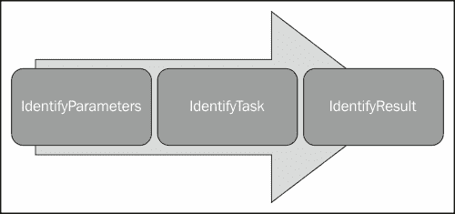
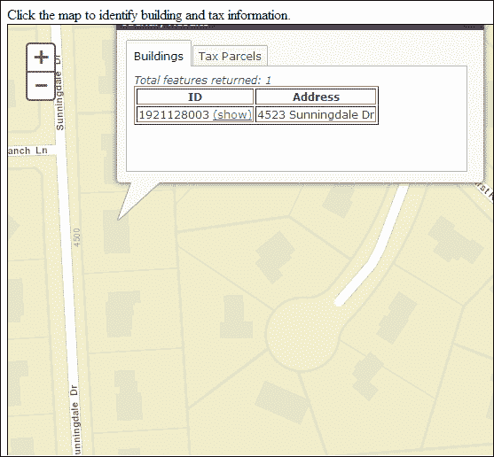

# 第七章：识别和查找要素

在本章中，我们将介绍与返回要素属性相关的两个 ArcGIS Server 任务：IdentifyTask 和 FindTask。识别要素是 GIS 应用程序中的另一个常见操作。此任务返回在地图上单击的要素的属性。属性信息通常显示在弹出窗口中。通过 ArcGIS API for JavaScript 的 IdentifyTask 类实现此功能。与我们所见的其他任务过程一样，IdentifyTask 对象使用输入参数对象，本例中称为 IdentifyParameters。IdentifyParameters 对象包含各种参数，用于控制识别操作的结果。这些参数使您能够对单个图层、服务中的最顶层图层、服务中的所有可见图层或服务中的所有图层以及搜索容差执行识别。IdentifyResult 的实例用于保存任务的结果。

您可以使用 ArcGIS API for JavaScript 执行一些在 ArcGIS Desktop 中最常用的功能的任务。FindTask 就是这样一个工具。与 ArcGIS 桌面版本一样，此任务可用于在图层中查找与字符串值匹配的要素。在使用 FindTask 对象执行查找操作之前，您需要在 FindParameters 的实例中设置操作的各种参数。FindParameters 使您能够设置各种选项，包括搜索文本、要搜索的字段等。使用 FindParameters 对象，FindTask 然后针对一个或多个图层和字段执行其任务，然后返回包含与搜索字符串匹配的 layerID、layerName 和要素的 FindResult 对象。

在本章中，我们将涉及以下主题：

+   使用 IdentifyTask 获取要素属性

+   使用 FindTask 获取要素属性

# 使用 IdentifyTask 获取要素属性

使用 IdentifyTask 可以返回图层中字段的属性到您的应用程序。在本节中，您将学习如何使用与 IdentifyTask 相关的各种对象来返回此信息。

## 介绍 IdentifyTask

与 ArcGIS Server 中的其他任务一样，IdentifyTask 功能在 API 中分为三个不同的类，包括 IdentifyParameters，IdentifyTask 和 IdentifyResult。这三个类如下图所示：



## IdentifyParameters 对象

IdentifyTask 的输入参数对象是 IdentifyParameters。使用 IdentifyParameters 类可以为您的识别操作设置多个属性。参数包括用于选择要素的几何（IdentifyParameters.geometry）、要执行识别的图层 ID（IdentifyParameters.layerIds）以及在其中执行识别的指定几何的容差（IdentifyParameters.tolerance）。

在您可以使用 ArcGIS Server 提供的识别功能之前，您需要导入如下所示的识别资源。

```js
require(["esri/tasks/IdentifyTask", ... ], function(IdentifyTask,... ){ ... });
```

在 IdentifyParameters 对象上设置各种参数之前，您需要首先创建此对象的实例。可以使用如下所示的代码完成此操作。此构造函数的代码不接受任何参数：

```js
var identifyParams = new IdentifyParameters();
```

现在您已经创建了 IdentifyParameters 的新实例，可以设置如下所示的各种属性：

```js
identifyParams.geometry = evt.MapPoint;identifyParams.layerIds[0,1,2]; 
identifyParams.returnGeometry = true;identifyParams.tolerance = 3; 
```

在大多数情况下，使用用户在地图上单击的点执行识别操作。您可以使用从地图单击事件返回的点来获取这一点，就像在前面的代码示例中所看到的那样。应该搜索的图层可以使用图层 ID 数组来定义，这些 ID 被传递到`IdentifyParameters.layerIds`属性中。数组应包含引用要搜索的图层的数值。您可以通过查看服务目录来获取图层索引号。容差属性尤为重要。它设置了几何图形周围的像素距离。请记住，大多数情况下几何图形将是一个点，因此您可以将其视为在您设置的任何容差值周围放置的圆。该值将以屏幕像素为单位。执行`IdentifyTask`属性时，将返回任何在或与圆内的要识别的图层中的要素。

您可能需要尝试不同的容差值，以获得最适合您的应用程序的值。如果值设置得太低，您可能面临识别操作未识别任何要素的风险，反之，如果值设置得太高，您可能会得到太多的要素返回。找到合适的平衡可能很困难，对一个应用程序有效的容差值可能对另一个应用程序无效。

## `IdentifyTask`属性

`IdentifyTask`使用`IdentifyParameters`中指定的参数在一个或多个图层上执行识别操作。与我们已经检查过的其他任务一样，`IdentifyTask`需要一个指向标识要在识别操作中使用的地图服务的 URL 的指针。

`IdentifyTask`的新实例可以使用以下代码示例创建。该任务的构造函数简单地接受一个指向包含可以执行识别操作的图层的地图服务的 URL。

```js
var identify =new IdentifyTask("http://sampleserver1.arcgisonline.com/ArcGIS/rest/services/Specialty/ESRI_StatesCitiesRivers_USA/MapServer");
```

一旦创建了`IdentifyTask`对象的新实例，您可以通过`IdentifyTask.execute()`方法启动执行此任务，该方法接受一个`IdentifyParameters`对象以及可选的`success`回调和`error`回调函数。在以下代码示例中，调用了`IdentifyTask.execute()`方法。将`IdentifyParameters`的实例作为参数传递到该方法中，并引用一个`addToMap()`方法，该方法将处理返回给该方法的结果。

```js
identifyParams = new IdentifyParameters();
identifyParams.tolerance = 3;
identifyParams.returnGeometry = true;
identifyParams.layerIds = [0,2];
identifyParams.geometry = evt.mapPoint;

**identifyTask.execute(identifyParams, function(idResults) { addToMap(idResults, evt); });**

**function addToMap(idResults, evt) {**
 **//add the results to the map**
**}**

```

使用`IdentifyTask`执行的识别操作的结果存储在`IdentifyResult`的实例中。我们将在下一节中检查这个结果对象。

### IdentifyResult

`IdentifyTask`操作返回的结果是`IdentifyResult`对象的数组。每个`IdentifyResult`对象包含从识别操作返回的要素，以及找到该要素的图层 ID 和图层名称。以下代码说明了如何通过回调函数处理`IdentifyResult`对象数组：

```js
function addToMap(**idResults**, evt) {
  bldgResults = {displayFieldName:null,features:[]};
  parcelResults = {displayFieldName:null,features:[]};
  for (vari=0, **i<idResults.length**; i++) {
 **var idResult = idResults[i];**
    if (**idResult.layerId === 0**) {
      if (!bldgResults.displayFieldName) 
        {bldgResults.displayFieldName = idResult.displayFieldName};
        bldgResults.features.push(**idResult.feature**);
      }
    else if (**idResult.layerId === 2**) {
        if (!parcelResults.displayFieldName)
         {parcelResults.displayFieldName = idResult.displayFieldName};
         parcelResults.features.push(**idResult.feature**);
       }
    }
dijit.byId("bldgTab").setContent(layerTabContent(bldgResults,"bldgResults"));
dijit.byId("parcelTab").setContent(layerTabContent(parcelResults,"parcelResults"));
map.infoWindow.show(evt.screenPoint,
map.getInfoWindowAnchor(evt.screenPoint));
}
```

## 练习时间-实现标识功能

在这个练习中，您将学习如何在应用程序中实现标识功能。您将创建一个简单的应用程序，当用户单击地图时，它将在信息窗口中显示建筑物和土地包裹的属性信息。我们已经为您预先编写了一些代码，这样您就可以专注于与要素识别直接相关的功能。在我们开始之前，我会让您将预先编写的代码复制并粘贴到沙箱中。

执行以下步骤完成练习：

1.  在[`developers.arcgis.com/en/javascript/sandbox/sandbox.html`](http://developers.arcgis.com/en/javascript/sandbox/sandbox.html)打开 JavaScript 沙箱。

1.  从我在以下代码片段中突出显示的`<script>`标签中删除 JavaScript 内容：

```js
<script>
**dojo.require("esri.map");**

**function init(){**
**var map = new esri.Map("mapDiv", {**
**center: [-56.049, 38.485],**
**zoom: 3,**
**basemap: "streets"**
 **});**
 **}**
**dojo.ready(init);**
</script>
```

1.  创建您将在应用程序中使用的变量：

```js
<script>
**var map;**
**var identifyTask, identifyParams;**
</script>
```

1.  创建`require()`函数，定义您将在此应用程序中使用的资源：

```js
<script>
  var map;
var identifyTask, identifyParams;
**require([**
 **"esri/map",  "esri/dijit/Popup","esri/layers/ArcGISDynamicMapServiceLayer","esri/tasks/IdentifyTask",** 
 **"esri/tasks/IdentifyResult","esri/tasks/IdentifyParameters","esri/dijit/InfoWindow","esri/symbols/SimpleFillSymbol",** 
 **"esri/symbols/SimpleLineSymbol","esri/InfoTemplate", "dojo/_base/Color" ,"dojo/on",**
 **"dojo/domReady!"**
 **], function(Map, Popup, ArcGISDynamicMapServiceLayer,IdentifyTask, IdentifyResult, IdentifyParameters,InfoWindow,** 
 **SimpleFillSymbol, SimpleLineSymbol, InfoTemplate,Color, on) {**

 **});**
</script>
```

1.  创建`Map`对象的新实例：

```js
<script>
  var map;
var identifyTask, identifyParams;
require([
    "esri/map",  "esri/dijit/Popup","esri/layers/ArcGISDynamicMapServiceLayer","esri/tasks/IdentifyTask", 
    "esri/tasks/IdentifyResult","esri/tasks/IdentifyParameters","esri/dijit/InfoWindow","esri/symbols/SimpleFillSymbol", 
    "esri/symbols/SimpleLineSymbol", "esri/InfoTemplate", "dojo/_base/Color" ,"dojo/on",
      "dojo/domReady!"
      ], function(Map, Popup, ArcGISDynamicMapServiceLayer,IdentifyTask, IdentifyResult, IdentifyParameters,InfoWindow, 
  SimpleFillSymbol, SimpleLineSymbol, InfoTemplate, Color,on) {
    //setup the popup window 
var popup = new Popup({
fillSymbol: new SimpleFillSymbol(SimpleFillSymbol.STYLE_SOLID,new SimpleLineSymbol(SimpleLineSymbol.STYLE_SOLID,new Color([255,0,0]), 2), new Color([255,255,0,0.25]))
        }, dojo.create("div"));

**map = new Map("map", {**
 **basemap: "streets",**
 **center: [-83.275, 42.573],**
 **zoom: 18,**
 **infoWindow: popup**
**});**

    });
</script>
```

1.  创建一个新的动态地图服务图层并将其添加到地图中：

```js
map = new Map("map", {
  basemap: "streets",
  center: [-83.275, 42.573],
  zoom: 18,
  infoWindow: popup
});

var landBaseLayer = new ArcGISDynamicMapServiceLayer("http://sampleserver3.arcgisonline.com/ArcGIS/rest/services/BloomfieldHillsMichigan/Parcels/MapServer",{opacity:.55});
map.addLayer(landBaseLayer);
```

1.  添加一个`Map.click`事件，将触发执行一个函数，当地图被点击时将会响应：

```js
map = new Map("map", {
  basemap: "streets",
  center: [-83.275, 42.573],
  zoom: 18,
  infoWindow: popup
});

varlandBaseLayer = new ArcGISDynamicMapServiceLayer("http://sampleserver3.arcgisonline.com/ArcGIS/rest/services/BloomfieldHillsMichigan/Parcels/MapServer",{opacity:.55});
map.addLayer(landBaseLayer);

**map.on("click", executeIdentifyTask);**

```

1.  创建一个`IdentifyTask`对象：

```js
  identifyTask = newIdentifyTask("http://sampleserver3.arcgisonline.com/ArcGIS/rest/services/BloomfieldHillsMichigan/Parcels/MapServer");
```

1.  创建一个`IdentifyParameters`对象并设置各种属性：

```js
identifyTask = newIdentifyTask("http://sampleserver3.arcgisonline.com/ArcGIS/rest/services/BloomfieldHillsMichigan/Parcels/MapServer");

**identifyParams = new IdentifyParameters();**
**identifyParams.tolerance = 3;**
**identifyParams.returnGeometry = true;**
**identifyParams.layerIds = [0,2];**
**identifyParams.layerOption = IdentifyParameters.LAYER_OPTION_ALL;**
**identifyParams.width  = map.width;**
**identifyParams.height = map.height;**

```

1.  创建`executeIdentifyTask()`函数，该函数是响应`Map.click`事件的函数。在之前的步骤中，您已经为`Map.click`事件设置了事件处理程序。`executeIdentifyTask()`函数被指定为处理此事件发生时的 JavaScript 函数。在此步骤中，您将通过添加以下代码来创建此函数。`executeIdentifyTask()`函数接受一个参数，即`Event`对象的实例。每个事件都会生成一个`Event`对象，该对象具有各种属性。在`Map.click`事件的情况下，此`Event`对象具有包含被点击的点的属性。这可以通过`Event.mapPoint`属性检索，并在设置`IdentifyParameters.geometry`属性时使用。`IdentifyTask.execute()`方法还返回一个`Deferred`对象。然后，您将一个回调函数添加到此`Deferred`对象中，该函数解析结果。添加以下代码以创建`executeIdentifyTask()`函数。此函数应该在`require()`函数之外创建：

```js
function executeIdentifyTask(evt) {
        identifyParams.geometry = evt.mapPoint;
        identifyParams.mapExtent = map.extent;

        var deferred = identifyTask.execute(identifyParams);

        deferred.addCallback(function(response) {     
          // response is an array of identify result objects    
          // Let's return an array of features.
          return dojo.map(response, function(result) {
            var feature = result.feature;
            feature.attributes.layerName = result.layerName;
            if(result.layerName === 'Tax Parcels'){
              console.log(feature.attributes.PARCELID);
              var template = new esri.InfoTemplate("", "${PostalAddress} <br/> Owner of record: ${First OwnerName}");
              feature.setInfoTemplate(template);
            }
            else if (result.layerName === 'Building Footprints'){
              var template = new esri.InfoTemplate("", "Parcel ID:${PARCELID}");
              feature.setInfoTemplate(template);
            }
            return feature;
          });
        });

// InfoWindow expects an array of features from each deferred
// object that you pass. If the response from the task execution 
// above is not an array of features, then you need to add acallback
// like the one above to post-process the response and return an
        // array of features.
        map.infoWindow.setFeatures([ deferred ]);
        map.infoWindow.show(evt.mapPoint);
      }
```

1.  您可能希望查看您的`ArcGISJavaScriptAPI`文件夹中的解决方案文件（`identify.html`），以验证您的代码是否已正确编写。

1.  通过单击**Run**按钮执行代码，如果一切编码正确，您应该看到以下输出：

# 使用`FindTask`获取要素属性

您可以使用`FindTask`根据字符串值搜索由 ArcGIS Server REST API 公开的地图服务。搜索可以在单个图层的单个字段上进行，也可以在图层的多个字段上进行，或者在多个图层的多个字段上进行。与我们已经检查过的其他任务一样，查找操作由三个互补的对象组成，包括`FindParameters`、`FindTask`和`FindResult`。`FindParameters`对象充当输入参数对象，由`FindTask`用于完成其工作，而`FindResult`包含任务返回的结果。看一下以下图：


## FindParameters

`FindParameters`对象用于指定查找操作的搜索条件，并包括一个`searchText`属性，其中包括将要搜索的文本，以及指定要搜索的字段和图层的属性。除此之外，将`returnGeometry`属性设置为`true`表示您希望返回与查找操作匹配的要素的几何，并可用于突出显示结果。

以下代码示例显示了如何创建`FindParameters`的新实例并分配各种属性。在使用与查找操作相关的任何对象之前，您需要导入`esri/tasks/find resource`。`searchText`属性定义了将在字段之间搜索的字符串值，该字段在`searchFields`属性中定义。将要搜索的图层通过分配给`layerIds`属性的索引号数组来定义。索引号对应于地图服务中的图层。`geometry`属性定义了是否应在结果中返回要素的几何定义。有时您可能不需要要素的几何，例如当属性只需在表内填充时。在这种情况下，您将把`geometry`属性设置为`false`。

```js
var findParams = new FindParameters();
findParams.searchText = dom.byId("ownerName").value;
findParams.searchFields = ["LEGALDESC","ADDRESS"]; //fields to search
findParams.returnGeometry = true;
findParams.layerIds = [0]; //layers to use in the find
findParams.outSpatialReference = map.spatialReference;
```

您可以使用`contains`属性来确定是否要查找搜索文本的精确匹配。如果设置为`true`，它将搜索包含`searchText`属性的值。这是一个不区分大小写的搜索。如果设置为`false`，它将搜索`searchText`字符串的精确匹配。精确匹配是区分大小写的。

## FindTask

`FindTask`在上图中执行了对`FindParameters`中指定的图层和字段进行查找操作，并返回一个`FindResult`对象，其中包含找到的记录。看一下以下代码片段：

```js
findTask = new FindTask("http://sampleserver1.arcgisonline.com/ArcGIS/rest/services/TaxParcel/TaxParcelQuery/MapServer/");
findTask.execute(findParams,showResults);

function showResults(results) {
    //This function processes the results
}
```

就像`QueryTask`一样，您必须指定一个指向将在查找操作中使用的地图服务的 URL 指针，但您不需要包括指定要使用的确切数据图层的整数值。这是不必要的，因为在`FindParameters`对象中定义了要在查找操作中使用的图层和字段。创建后，您可以调用`FindTask.execute()`方法来启动查找操作。`FindParameters`对象作为第一个参数传递到此方法中，您还可以定义可选的`success`和`error`回调函数。这在上面的代码示例中显示。`success`回调函数传递了一个`FindResults`的实例，其中包含了查找操作的结果。

## FindResult

`FindResult`包含`FindTask`操作的结果，还包含可以表示为图形的要素，找到要素的图层 ID 和名称，以及包含搜索字符串的字段名称。看一下以下代码片段：

```js
function showResults(results) {
//This function works with an array of FindResult that the taskreturns
  map.graphics.clear();
  var symbol = new SimpleFillSymbol(SimpleFillSymbol.STYLE_SOLID, 
  new SimpleLineSymbol(SimpleLineSymbol.STYLE_SOLID,
  new Color([98,194,204]), 2), new Color([98,194,204,0.5]));
  //create array of attributes
  var items = array.map(results,function(result){
    var graphic = result.feature;
    graphic.setSymbol(symbol);
    map.graphics.add(graphic);
    return result.feature.attributes;
  });
  //Create data object to be used in store
  var data = {
    identifier: "PARCELID", //This field needs to have unique values
    label: "PARCELID", //Name field for display. Not pertinent toagrid but may be used elsewhere.
    items: items
  };
  //Create data store and bind to grid.
  store = new ItemFileReadStore({ data:data });
  var grid = dijit.byId('grid');
  grid.setStore(store);
  //Zoom back to the initial map extent
  map.centerAndZoom(center, zoom);
}
```

# 摘要

与要素相关的属性的返回是 GIS 中最常见的操作之一。ArcGIS Server 有两个可以返回属性的任务：`IdentifyTask`和`FindTask`。`IdentifyTask`属性用于返回在地图上单击的要素的属性。`FindTask`也返回要素的属性，但使用简单的属性查询来返回属性。在本章中，您学习了如何使用 ArcGIS API for JavaScript 来使用这两个任务。在下一章中，您将学习如何使用`Locator`任务执行地理编码和反向地理编码。
