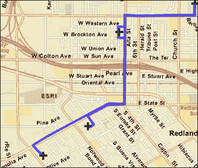
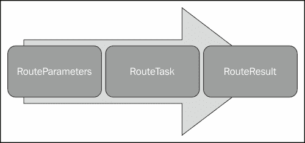
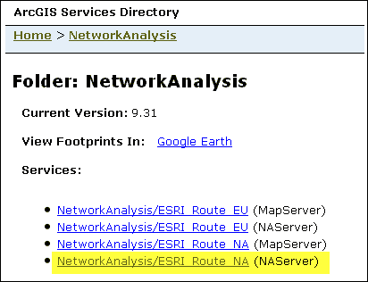
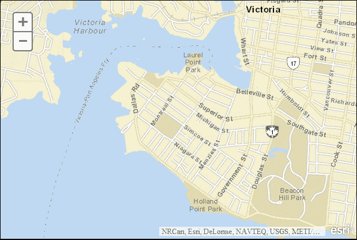
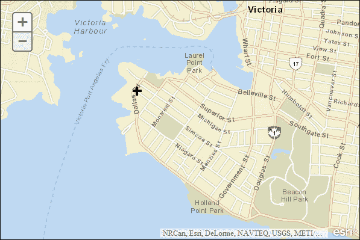
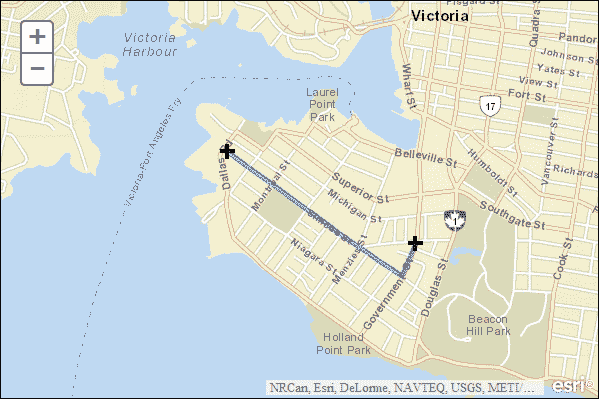
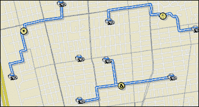
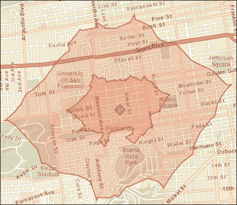
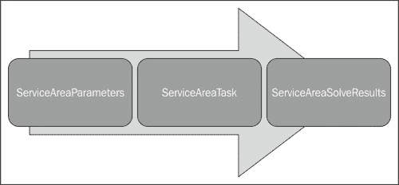

# 第九章：网络分析任务

网络分析服务允许您在街道网络上执行分析，例如从一个地址到另一个地址找到最佳路线，找到最近的学校，确定位置周围的服务区域，或者使用一组服务车辆响应一组订单。可以使用它们的 REST 端点访问这些服务。可以执行服务的三种类型的分析：路由、最近设施和服务区域。我们将在本章中检查每种服务类型。所有网络分析服务都要求您在 ArcGIS Server 上安装网络分析插件。

在本章中，我们将涵盖以下主题：

+   RouteTask

+   练习路由的时间

+   最近设施任务

+   服务区域任务

# RouteTask

在 JavaScript API 中进行路由允许您使用`RouteTask`对象在两个或多个位置之间找到路线，并可选择获取驾驶方向。`RouteTask`对象使用网络分析服务计算路线，可以包括简单和复杂的路线，如多个停靠点、障碍和时间窗口。

`RouteTask`对象在网络中的多个位置之间使用最小成本路径。网络上的阻抗可以包括时间和距离变量。以下截图显示了`RouteTask`实现的输出：



与我们在本课程中研究的其他任务一样，路由是通过一系列对象完成的，包括`RouteParameters`、`RouteTask`和`RouteResult`。以下图示说明了这三个路由对象：



`RouteParameters`对象提供了输入参数给`RouteTask`，`RouteTask`使用输入参数向 ArcGIS Server 提交路由请求。结果以`RouteResult`对象的形式从 ArcGIS Server 返回。

`RouteParameters`对象作为`RouteTask`对象的输入，并可以包括停靠和障碍位置、阻抗、是否返回驾驶方向和路线等。您可以在 JavaScript API 的[`developers.arcgis.com/en/javascript/jsapi/routeparameters-amd.html`](https://developers.arcgis.com/en/javascript/jsapi/routeparameters-amd.html)获取所有参数的完整列表。还提供了一个简短的代码示例，显示如何创建`RouteParameters`的实例，添加停靠点并定义输出空间参考：

```js
routeParams = new RouteParameters();
routeParams.stops = new FeatureSet();
routeParams.outSpatialReference = {wkid:4326};
routeParams.stops.features.push(stop1);
routeParams.stops.features.push(stop2);
```

`RouteTask`对象使用`RouteParameters`提供的输入参数执行路由操作。`RouteTask`的构造函数接受一个指向标识要用于分析的网络服务的 URL 的指针。调用`RouteTask`上的`solve()`方法执行路由任务，使用提供的输入参数对网络分析服务执行路由任务：

```js
routeParams = new RouteParameters();
routeParams.stops = new FeatureSet();
routeParams.outSpatialReference = {wkid:4326};
routeParams.stops.features.push(stop1);
routeParams.stops.features.push(stop2);
**routeTask.solve(routeParams);**

```

`RouteResult`对象从网络分析服务返回给`RouteTask`提供的回调函数。然后回调函数通过向用户显示数据来处理数据。返回的数据在很大程度上取决于提供给`RouteParameters`对象的输入。`RouteParameters`上最重要的属性之一是`stops`属性。这些是要包括在点之间最佳路线分析中的点。停靠点被定义为`DataLayer`或`FeatureSet`的实例，并且是要包括在分析中的一组停靠点。

障碍的概念在路由操作中也很重要。障碍在规划路线时限制移动。障碍可以包括车祸、街道段上的施工工作或其他延误，如铁路道口。障碍被定义为`FeatureSet`或`DataLayer`，并通过`RouteParameters.barriers`属性指定。以下代码显示了如何在您的代码中创建障碍的示例：

```js
var routeParameters = new RouteParameters();
//Add barriers as a FeatureSet
routeParameters.barriers = new FeatureSet();
routeParameters.barriers.features.push(map.graphics.add(new Graphic(evt.mapPoint, barrierSymbol)));
```

只有当`RouteParameters.returnDirections`设置为`true`时，才会返回方向。当你选择返回方向时，你还可以使用各种属性来控制返回的方向。你可以控制方向的语言（`RouteParameters.directionsLanguage`）、长度单位（`RouteParameters.directionsLengthUnits`）、输出类型（`RouteParameters.directionsOutputType`）、样式名称（`RouteParameters.StyleName`）和时间属性（`RouteParameters.directionsTimeAttribute`）。除了方向之外返回的数据还包括点之间的路线、路线名称和停靠点数组。

还可以指定如果其中一个停靠点无法到达，则任务应该失败。这是通过`RouteParameters.ignoreInvalidLocations`属性来实现的。这个属性可以设置为`true`或`false`。你还可以通过诸如`RouteParameters.startTime`（指定路线开始的时间）和`RouteParameters.useTimeWindows`（定义分析中应该使用时间范围）等属性将时间引入到分析中。

# 练习路由

在这个练习中，你将学习如何在你的应用程序中实现路由。你将创建一个`RouteParameters`的实例，通过允许用户在地图上点击点来添加停靠点，并解决路线。返回的路线将显示为地图上的线符号。按照以下指示创建一个包括路由的应用程序：

1.  在[`developers.arcgis.com/en/javascript/sandbox/sandbox.html`](http://developers.arcgis.com/en/javascript/sandbox/sandbox.html)打开 JavaScript 沙盒。

1.  从我在下面的代码片段中突出显示的`<script>`标签中删除 JavaScript 内容：

```js
  <script>
 **dojo.require("esri.map");**

 **function init(){**
 **var map = new esri.Map("mapDiv", {**
 **center: [-56.049, 38.485],**
 **zoom: 3,**
 **basemap: "streets"**
 **});**
 **}**
 **dojo.ready(init);**
  </script>
```

1.  为我们在这个练习中将要使用的对象添加以下引用：

```js
  <script>
    require([
        "esri/map",
        "esri/tasks/RouteParameters",
        "esri/tasks/RouteTask",

        "esri/tasks/FeatureSet",
        "esri/symbols/SimpleMarkerSymbol",
        "esri/symbols/SimpleLineSymbol",
        "esri/graphic",
        "dojo/_base/Color"
      ],
      function(Map, RouteParameters, RouteTask, FeatureSet, SimpleMarkerSymbol, SimpleLineSymbol, Graphic, Color ){

    });
  </script>
```

1.  在`require()`函数内，创建`Map`对象，如下面的代码片段所示，并定义变量来保存用于显示目的的路线对象和符号：

```js
  <script>
    require([
        "esri/map",
        "esri/tasks/RouteParameters",
        "esri/tasks/RouteTask",
        "esri/tasks/RouteResult",
        "esri/tasks/FeatureSet",
        "esri/symbols/SimpleMarkerSymbol",
        "esri/symbols/SimpleLineSymbol",
        "esri/graphic",
        "dojo/_base/Color"
      ],
      function(Map, RouteParameters, RouteTask, RouteResult, FeatureSet, SimpleMarkerSymbol, SimpleLineSymbol, Graphic, Color ){
 **var map, routeTask, routeParams;**
 **var stopSymbol, routeSymbol, lastStop;**

 **map = new Map("mapDiv", {** 
 **basemap: "streets",**
 **center:[-123.379, 48.418], //long, lat**
 **zoom: 14**
 **});**
      });
    </script>
```

1.  在创建`Map`对象的代码块的下方，为`Map.click()`事件添加事件处理程序。这个操作应该触发`addStop()`函数：

```js
map = new Map("mapDiv", { 
    basemap: "streets",
    center:[-123.379, 48.418], //long, lat
    zoom: 14
});
**map.on("click", addStop);**

```

1.  创建`RouteTask`和`RouteParameters`对象。将`RouteParameters.stops`属性设置为一个新的`FeatureSet`对象。同时，设置`RouteParameters.outSpatialReference`属性：

```js
map = new Map("mapDiv", { 
    basemap: "streets",
    center:[-123.379, 48.418], //long, lat
    zoom: 14
});
map.on("click", addStop);
**routeTask = new RouteTask("http://tasks.arcgisonline.com/ArcGIS/rest/services/NetworkAnalysis/ESRI_Route_NA/NAServer/Route");**
**routeParams = new RouteParameters();**
**routeParams.stops = new FeatureSet();**
**routeParams.outSpatialReference = {"wkid":4326};**

```

以下是包含这个网络分析服务的服务目录的屏幕截图：



1.  为`RouteTask.solve-complete()`事件的完成和`RouteTask.error()`事件添加事件处理程序。路由任务成功完成应该触发`showRoute()`函数的执行。任何错误应该触发`errorHandler()`函数的执行：

```js
       routeParams = new RouteParameters();
       routeParams.stops = new FeatureSet();
       routeParams.outSpatialReference = {"wkid":4326};

       **routeTask.on("solve-complete", showRoute);**
 **routeTask.on("error", errorHandler);**

```

1.  为路线的起点和终点创建符号对象，以及定义这些点之间路线的线。以下代码应该添加在你在上一步中添加的两行代码的下方：

```js
stopSymbol = new SimpleMarkerSymbol().setStyle(SimpleMarkerSymbol.STYLE_CROSS).setSize(15);
stopSymbol.outline.setWidth(4);
routeSymbol = new SimpleLineSymbol().setColor(new Color([0,0,255,0.5])).setWidth(5);
```

1.  创建`addStop()`函数，当用户在地图上点击时将被触发。这个函数将接受一个`Event`对象作为它唯一的参数。可以从这个对象中提取在地图上点击的点。这个函数将在地图上添加一个点图形，并将图形添加到`RouteParameters.stops`属性；在第二次地图点击时，它将调用`RouteTask.solve()`方法，传入一个`RouteParameters`的实例：

```js
function addStop(evt) {
     var stop = map.graphics.add(new Graphic(evt.mapPoint, stopSymbol));
     routeParams.stops.features.push(stop);

     if (routeParams.stops.features.length >= 2) {
       routeTask.solve(routeParams);
       lastStop = routeParams.stops.features.splice(0, 1)[0];
     }
  }
```

1.  创建`showRoute()`函数，接受一个`RouteResult`的实例。在这个函数中，你需要做的唯一的事情就是将路线作为线添加到`GraphicsLayer`中：

```js
**function showRoute(solveResult) {**
 **map.graphics.add(solveResult.result.routeResults[0].route.setSymbol(routeSymbol));**
 **}**

```

1.  最后，添加错误回调函数，以防路由出现问题。这个函数应该向用户显示错误消息，并删除任何剩余的图形：

```js
function errorHandler(err) {
  alert("An error occurred\n" + err.message + "\n" + err.details.join("\n"));

  routeParams.stops.features.splice(0, 0, lastStop);
  map.graphics.remove(routeParams.stops.features.splice(1,   1)[0]);
}
```

1.  你可能想要在`ArcGISJavaScriptAPI`文件夹中查看解决方案文件（`routing.html`），以验证你的代码是否已经正确编写。

1.  单击**运行**按钮。您应该看到地图如下截图所示。如果没有，您可能需要重新检查代码的准确性。

1.  在地图上的某个地方单击。您应该看到一个点标记，如下截图所示：

1.  在地图上的其他地方单击。这应该显示第二个标记以及两点之间的最佳路线，如下截图所示：

# 最近设施任务

`ClosestFacility`任务测量了事件和设施之间的旅行成本，并确定彼此之间最近的事件和设施。在寻找最近的设施时，您可以指定要找到多少个以及旅行方向是朝向还是远离它们。最近设施求解器显示事件和设施之间的最佳路线，报告它们的旅行成本，并返回驾驶方向。



解决最近设施操作涉及的类包括`ClosestFacilityParameters`、`ClosestFacilityTask`和`ClosestFacilitySolveResults`，如下所示：


`ClosestFacilityParameters`类包括默认截止、是否返回事件、路线和方向等输入参数。这些参数用作`ClosestFacilityTask`类的输入，该类包含一个`solve()`方法。最后，结果以`ClosestFacilitySolveResults`对象的形式从 ArcGIS 服务器传递回客户端。

`ClosestFacilityParameters`对象用作`ClosestFacilityTask`的输入。现在将讨论此对象上一些常用的属性。`incidents`和`facilities`属性用于设置分析的位置。任务返回的数据可以通过`returnIncidents`、`returnRoutes`和`returnDirections`属性进行控制，这些属性只是`true`或`false`值，指示是否应在结果中返回信息。`travelDirection`参数指定是否应该到设施或从设施出发旅行，`defaultCutoff`是分析将停止遍历的截止值。以下代码示例显示了如何创建`ClosestFacilityParameters`的实例并应用各种属性：

```js
params = new ClosestFacilityParameters();
params.defaultCutoff = 3.0;
params.returnIncidents = false;
params.returnRoutes = true;
params.returnDirections = true;
```

当您创建一个新的`ClosestFacilityTask`实例时，您需要指向代表网络分析服务的 REST 资源。创建后，`ClosestFacilityTask`类接受`ClosestFacilityParameters`提供的输入参数，并使用`solve()`方法将它们提交给网络分析服务。

这是通过以下代码示例来说明的。`solve()`方法还接受回调和错误回调函数：

```js
**cfTask = new ClosestFacilityTask("http://<domain>/arcgis/rest/services/network/ClosestFacility");**
params = new ClosestFacilityParameters();
params.defaultCutoff = 3.0;
params.returnIncidents = false;
params.returnRoutes = true;
params.returnDirections = true;
**cfTask.solve(params, processResults);**

```

从`ClosestFacilityTask`操作返回的结果是一个`ClosestFacilitySolveResult`对象。此对象可以包含各种属性，包括`DirectionsFeatureSet`对象，这是一个方向数组。这个`DirectionsFeatureSet`对象包含路线的逐步方向文本和几何信息。每个要素的属性提供与相应路段相关的信息。返回的属性包括方向文本、路段长度、沿路段行驶的时间以及到达路段的预计到达时间。`ClosestFacilitySolveResults`中包含的其他属性包括包含设施和事件的数组，表示返回的路线的折线数组，返回的任何消息以及包含障碍的数组。

# 服务区任务

新的 ServiceArea 任务在下面的截图中进行了说明，计算了输入位置周围的服务区域。该服务区域以分钟为单位定义，是一个包含在该时间范围内所有可访问街道的区域。



涉及服务区域操作的类包括 ServiceAreaParameters、ServiceAreaTask 和 ServiceAreaSolveResults。这些对象在下图中进行了说明：



ServiceAreaParameters 类包括诸如默认中断、涉及的设施、障碍和限制、行进方向等输入参数。这些参数用作 ServiceAreaTask 类的输入，该类调用 solve()。在 ServiceAreaParameters 中定义的参数传递给 ServiceAreaTask。最后，结果以 ServiceAreaSolveResults 对象的形式从 ArcGIS Server 传递回客户端。ServiceAreaParameters 对象用作 ServiceAreaTask 的输入。本章的这一部分讨论了该对象上一些常用的属性。defaultBreaks 属性是定义服务区域的数字数组。例如，在以下代码示例中，提供了一个值为 2 的单个值，表示我们希望返回设施周围的 2 分钟服务区域。returnFacilities 属性设置为 true 时，表示设施应与结果一起返回。还可以通过 barriers 属性设置各种点、折线和多边形障碍。分析的行进方向可以是到设施或从设施，通过 travelDirection 属性进行设置。ServiceAreaParameters 上还可以设置许多其他属性。以下提供了一个代码示例：

```js
params = new ServiceAreaParameters();
params.defaultBreaks = [2];
params.outSpatialReference = map.spatialReference;
params.returnFacilities = false;
```

ServiceAreaTask 类使用街道网络在位置周围找到服务区域。ServiceAreaTask 的构造函数应该指向代表网络分析服务的 REST 资源。要提交解决服务区域任务的请求，您需要在 ServiceAreaTask 上调用 solve()方法。

ServiceAreaTask 操作返回的结果是一个 ServiceAreaSolveResult 对象。该对象可以包含各种属性，包括 ServiceAreaPolygons 属性，这是从分析中返回的服务区域多边形数组。此外，其他属性包括设施、消息和障碍。

# 总结

路由使您能够向应用程序添加在两个或多个位置之间找到路径并生成驾驶路线的功能。此功能是通过执行网络分析的 RouteTask 对象来实现的。这种功能以及其他网络分析服务需要使用 ArcGIS Server 的网络分析插件。其他网络分析任务包括最近设施任务，它允许您测量事件和设施之间的旅行成本，并确定彼此之间最近的设施，以及服务区域任务，它计算了输入位置周围的服务区域。在下一章中，您将学习如何从应用程序执行地理处理任务。
