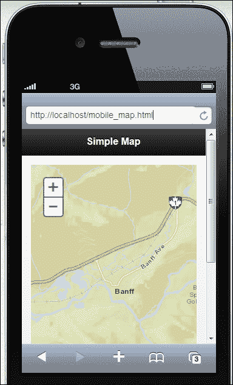
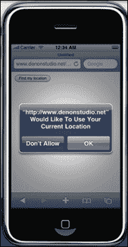

# 第十二章：创建移动应用程序

JavaScript 的 ArcGIS Server API 提供对移动平台的支持。目前支持 iOS、Android 和 BlackBerry 操作系统。API 与`dojox/mobile`集成。在本章中，您将了解使 Web 映射应用程序通过 WebKit 浏览器以及内置手势支持成为可能的 API 的紧凑版。请记住，这与 ArcGIS API for iOS 或 Android 不同，后者用于构建可以通过应用商店提供的本机应用程序。JavaScript API 应用程序通过移动设备的 WebKit 浏览器呈现。

我们还将介绍地理位置 API 以及如何将其集成到您的 ArcGIS Server 应用程序中。地理位置 API 是 HTML5 的一部分，用于获取移动设备的位置。大多数移动浏览器都支持地理位置 API 规范，该规范提供了与托管设备关联的地理位置信息的脚本访问。

在本章中，我们将涵盖以下主题：

+   JavaScript 的 ArcGIS API – 紧凑版

+   设置视口比例

+   练习紧凑版的时间

+   集成地理位置 API

+   练习地理位置 API 的时间

# JavaScript 的 ArcGIS API – 紧凑版

JavaScript 的 ArcGIS API 有一个紧凑版，可用于限制 API 的占用空间，从而使移动设备的下载速度更快。这种较小的占用空间对于移动应用程序（包括 iPhone 和 iPad）是一个很好的选择。API 标准版和紧凑版之间有两个主要区别：

+   第一个区别是紧凑版仅加载应用程序所需的对象。例如，如果您不需要`Calendar`小部件，则不会加载它。

+   第二个区别是紧凑版仅加载 32 个代码模块，而标准版加载 80 个模块。如果您需要使用紧凑版未下载的代码模块，则可以使用`require()`函数加载您使用的特定模块。

引用紧凑版就像在对 API 的引用末尾添加单词`compact`一样简单。稍后您将看到一个例子。在移动应用程序中使用 API 与您学习创建 Web 应用程序的技术没有任何不同。但是，您需要学习一些新的技术来创建移动应用程序的用户界面。有许多用于完成此任务的良好 JavaScript 移动框架，包括 Dojox Mobile 和 jQuery Mobile。移动框架会对 Web 内容进行样式处理，使其看起来像移动应用程序。Safari 浏览器看起来像 iPhone 应用程序，而 Android 浏览器看起来像 Android 应用程序。创建移动用户界面超出了本文的范围，但印刷和在线都有许多良好的资源可用。在以下代码示例中，您将看到如何添加对 JavaScript 的 ArcGIS API 紧凑版的引用。请注意在 API 末尾包含紧凑关键字。

```js
<script src="http://js.arcgis.com/3.7compact/"></script>
```

## 设置视口比例

您将希望使用`viewport <meta>`标签为应用程序设置一些初始显示特性。`<meta>`标签应包含在网页的`<head>`部分中。建议初始比例为`1.0`，将填充整个屏幕的视口。值可以在`0`和`1.0`之间设置。如果不设置宽度，则在纵向模式下，移动浏览器将使用`device-width`。如果不设置高度，则在横向模式下，浏览器将使用`device-height`：

```js
<meta name="viewport" content="width=device-width, initial-scale=1" maximum-scale=1.0 user-scalable=0>
```

## 练习紧凑版的时间

在这个练习中，您将构建可能的最基本的移动地图应用程序。我们只是简单地使用 ArcGIS Server API for JavaScript 的紧凑版本来创建一个以加拿大艾伯塔省班夫镇为中心的地图应用程序。该应用程序除了缩放和平移之外将无法执行任何其他操作。除了地图之外，不会有任何用户界面。目标只是为了说明使用 API for JavaScript 构建的移动应用程序的基本结构。

这个练习将与您在之前章节中进行的练习有些不同。您将不会使用 ArcGIS API for JavaScript 沙盒。相反，您将在文本编辑器中编写代码（我推荐 Notepad++），并使用移动模拟器进行测试。

1.  在开始这个练习之前，您需要确保您可以访问一个 Web 服务器。如果您没有访问 Web 服务器，或者您的计算机上尚未安装 Web 服务器，您可以下载并安装开源 Web 服务器 Apache（[`httpd.apache.org/download.cgi`](http://httpd.apache.org/download.cgi)）。Microsoft IIS 是另一个常用的 Web 服务器，还有许多其他可以使用的 Web 服务器。在本练习中，我将假设您正在使用 Apache Web 服务器。

1.  在您的本地计算机上安装的 Web 服务器将通过 URL `http://localhost`进行引用，用于访问 Web 服务器。如果您在 Windows 平台上安装了 Apache，则此 URL 指向`C:\Program Files\Apache Software Foundation\Apache2.2`下的`htdocs`文件夹。

1.  在您的`ArcGISJavaScriptAPI`文件夹中，您会找到一个名为`mobile_map.html`的文件。我已经预先编写了一些您将在此步骤中使用的代码，这样您就可以专注于添加对紧凑版本的引用以及与移动开发相关的其他项目。将此文件用作起点，并将其复制到您的 Web 服务器的根目录下（如果您在 Windows 上使用 Apache，则为`C:\Program Files\Apache Software Foundation\Apache2.2\htdocs`）。

1.  在您喜欢的文本编辑器中打开`mobile_map.html`。我推荐 Notepad++，但您可以使用任何文本编辑器。

1.  添加对 API 的紧凑版本以及 Esri 样式表的引用。将以下突出显示的代码行添加到您的应用程序中：

```js
<head>  

  <meta http-equiv="Content-Type" content="text/html; charset-utf-8">
  <meta http-equiv="X-UA-Compatible" content="IE=7,IE=9, IE=10" />

  <title>Simple Map</title>

  **<link rel="stylesheet" href="http://js.arcgis.com/3.7/js/esri/css/esri.css">**
  <link rel="stylesheet" href="http://code.jquery.com/mobile/1.1.0-rc.1/jquery.mobile-1.1.0-rc.1.min.css" />
  <script src="http://code.jquery.com/jquery-1.7.1.min.js"></script>
  <script src="http://code.jquery.com/mobile/1.1.0-rc.1/jquery.mobile-1.1.0-rc.1.min.js"></script>
  **<script src="http://js.arcgis.com/3.7compact/"></script>**

```

1.  您将需要使用`viewport <meta>`标签属性来为您的应用程序设置一些初始的显示特性。建议初始缩放值为`1.0`，将填充整个屏幕的视口。值可以在`0`和`1.0`之间设置。如果您不设置宽度，移动浏览器在纵向模式下将使用`device-width`，如果您不设置高度，它们在横向模式下将使用`device-height`。在代码开头的`<head>`标签下添加以下代码行：

```js
<meta name="viewport" content="width=device-width, initial-scale=1">
```

1.  在`<script>`标签中，添加在以下代码片段中突出显示的`require()`函数以及我们将在本练习中使用的引用：

```js
<script>
   **require([**
 **"esri/map",**
 **"dojo/domReady!"**
 **], function(Map) {** 
 **});**
 </script>
```

1.  与使用 API for JavaScript 构建的传统 Web 地图应用程序一样，您将创建一个`<div>`标签来容纳移动应用程序的地图。对于移动应用程序，您将希望样式化地图，使其占据移动应用程序的整个视口。通过分别将宽度和高度设置为`100%`来实现这一点。将`<div>`地图容器添加到您的应用程序中。确保将宽度和高度的样式设置为`100%`：

```js
<div data-role="page">
  <div data-role="header">
    <h1>Simple Map</h1>
  </div><!-- /header -->
  <div data-role="content">
       **<div id="mapDiv" style="width:100%; height:100%;"></div>**
  </div><!-- /content -->

  <div data-role="footer">
    <h4>Page Footer</h4>
  </div><!-- /footer -->
</div><!-- /page -->
```

1.  移动设备可以通过旋转设备简单地在标准模式或横向模式下显示其视口。您的应用程序将需要在发生这些事件时处理这些事件。在`<body>`标签中添加`onorientationchange()`事件。`onorientationchange()`事件引用了一个名为`orientationChanged()`的 JavaScript 函数，我们还没有定义。我们将在下一步中进行定义：

```js
<body **onorientationchange="orientationChanged();"**>
```

1.  创建一个新的`Map`对象，设置底图，并将地图居中以及缩放比例级别：

```js
<script type="text/javascript">
  require([
      "esri/map",
      "dojo/domReady!"
      ], function(Map) {
        **map = new Map("mapDiv", {**
 **basemap: "streets",**
 **center:[-115.570, 51.178], //long, lat**
 **zoom: 12**
 **});**
});
</script>
```

1.  创建`orientationChanged()`JavaScript 函数，如下面的代码所示。此函数可以添加到`<script>`标记的任何位置：

```js
<script type="text/javascript">
      require([
        "esri/map",
        "dojo/domReady!"
      ], function(Map) {

        map = new Map("mapDiv", { 
          basemap: "streets",
          center:[-115.570, 51.178], //long, lat
          zoom: 12
        });

    **function orientationChanged() {**
 **if(map) {**
 **map.reposition();**
 **map.resize();**
 **}**
 **}**
      });
    </script>
```

1.  保存文件。

1.  打开 Web 浏览器并加载模拟器。我推荐[iphone4simulator.com](http://iphone4simulator.com)，但还有许多其他可以使用的。这些网站模拟网站或应用程序的外观和行为。

### 注意

如果您愿意，也可以将这些练习文件上传到防火墙外的 Web 服务器上，以便在实际移动设备而不是模拟器上查看它们。

1.  如果您使用 Apache，那么您很可能已将文件保存在 Web 服务器的根位置，即`C:\Program Files\Apache Software Foundation\Apache2.2\htdocs`。然后可以通过 URL`http://localhost/mobile_map.html`在 Web 浏览器中访问该文件。在模拟器地址栏中输入`http://localhost/mobile_map.html`，如下面的屏幕截图所示。您应该会看到地图出现。

JavaScript API 的紧凑版本创建了缩放比例滑块的*压缩*版本。这是一个简单的地图应用程序，但希望它能说明构建移动地图应用程序的基本特征。

1.  您可以使用缩放滑块放大和缩小，并记住 ArcGIS Server JavaScript API 还支持手势，因此您也可以使用捏合手势放大和缩小。但是，请记住这在模拟器中不起作用。使用应用程序界面上的放大和缩小按钮进行放大和缩小，如下面的屏幕截图所示：

1.  您可能需要查看解决方案文件（`mobile_map_solution.html`）在您的`ArcGISJavaScriptAPI`文件夹中，以验证您的代码是否已正确编写。

# 集成地理位置 API

地理位置 API 可以与您的 ArcGIS Server 应用程序集成，以获取移动设备的位置。它也可以用于从基于 Web 的应用程序获取位置，但这并不像使用 IP 地址而不是 GPS 或基站三角测量那样准确。

此 API 具有内置安全性，需要在应用程序中使用此功能之前从最终用户获得明确许可。移动和 Web 应用程序都将显示一个提示，请求权限获取设备的当前位置。此提示将类似于以下屏幕截图所示：



大多数浏览器都支持地理位置 API 规范，该规范提供了与托管设备关联的地理位置信息的脚本访问。地理位置 API 的主要目的是识别移动设备的位置。移动设备可以通过多种方式定位，包括基站三角测量、IP 地址和 GPS 位置。`Geolocation.getCurrentPosition()`方法返回移动设备的当前位置。您可以轻松使用此 API 在地图应用程序上放置与当前用户位置对应的点。`Geolocation.watchPosition()`方法可用于跟踪位置随着位置变化而变化，每次位置变化时都会触发回调方法。因此，如果您的应用程序需要能够随时间跟踪设备的位置，则应使用`watchPosition()`而不是`getCurrentPosition()`，后者仅在单个时间点获取位置。

以下代码片段包含了一个简单的示例，详细说明了 Geolocation API 的基本用法。我们首先要做的是检查浏览器是否支持 Geolocation API。这是通过 `navigator.geolocation` 属性完成的，它返回一个值为 `true` 或 `false`。通常，这将提示用户允许应用程序收集当前位置，并确保浏览器支持 Geolocation。

### 注意

要查看你的浏览器是否支持 Geolocation 或任何其他 HTML5 功能，请转到 [`caniuse.com/`](http://caniuse.com/)。

如果浏览器支持 Geolocation API 并且最终用户允许其收集位置，那么我们就调用 `geolocation.getCurrentPosition()` 方法。传递给该方法的第一个参数表示成功的回调函数，如果设备成功定位，则将执行该函数。类似地，也可以提供一个错误的回调函数（`locationError`）。`Position` 对象将传递给成功的回调函数。然后可以检查这个 `Position` 对象以获取位置的纬度/经度坐标。这就是我们在 `zoomToLocation()` 函数中所做的，它接受 `Position` 对象作为唯一参数。然后该函数获取纬度/经度坐标并在地图上绘制点：

```js
if (navigator.geolocation){  
  navigator.geolocation.getCurrentPosition(zoomToLocation, locationError);
}

function zoomToLocation(location) {
  var symbol = new SimpleMarkerSymbol();

  symbol.setStyle(SimpleMarkerSymbol.STYLE_SQUARE);
  symbol.setColor(new Color([153,0,51,0.75]));

  var pt = esri.geometry.geographicToWebMercator(new   Point(location.coords.longitude, location.coords.latitude));
  var graphic = new Graphic(pt, symbol);
  map.graphics.add(graphic);
  map.centerAndZoom(pt, 16);
}

function locationError(error) {
  switch (error.code) {
    case error.PERMISSION_DENIED:
      alert("Location not provided");
      break;
    case error.POSITION_UNAVAILABLE:
      alert("Current location not available");
      break;
    case error.TIMEOUT:
      alert("Timeout");
      break;
    default:
      alert("unknown error");
      break;
    }
}
```

## 练习使用 Geolocation API 的时间

在这个练习中，你将学习如何将 Geolocation API 集成到 ArcGIS Server API for JavaScript 应用程序中。

1.  在 [`developers.ArcGIS.com/en/javascript/sandbox/sandbox.html`](http://developers.ArcGIS.com/en/javascript/sandbox/sandbox.html) 打开 JavaScript 沙盒。

1.  从我在以下代码片段中突出显示的 `<script>` 标签中删除 JavaScript 内容：

```js
  <script>
    **dojo.require("esri.map");**

 **function init(){**
 **var map = new esri.Map("mapDiv", {**
 **center: [-56.049, 38.485],**
 **zoom: 3,**
 **basemap: "streets"**
 **});**
 **}**
 **dojo.ready(init);**
  </script>
```

1.  添加我们将在本练习中使用的对象的以下引用：

```js
<script>
  **require([**
 **"dojo/dom",**
 **"esri/map",** 
 **"esri/geometry/Point",**
 **"esri/symbols/SimpleMarkerSymbol",**
 **"esri/graphic",**
 **"esri/geometry/webMercatorUtils",**
 **"dojo/_base/Color",**
 **"dojo/domReady!"**
 **], function(dom, Map, Point, SimpleMarkerSymbol, Graphic, webMercatorUtils, Color) {** 
 **});**
</script>
```

1.  创建一个以加利福尼亚州圣迭戈为中心的新 `Map` 对象，带有街道作为底图图层。如果你正在使用的浏览器不支持 Geolocation API，或者没有提供访问当前设备位置的权限，这将作为默认地图和缩放范围。

```js
<script>
 require([
      "dojo/dom",
      "esri/map", 
      "esri/geometry/Point",
      "esri/symbols/SimpleMarkerSymbol",
      "esri/graphic",
      "esri/geometry/webMercatorUtils",
      "dojo/_base/Color",
      "dojo/domReady!"
    ], function(dom, Map, Point, SimpleMarkerSymbol, Graphic, webMercatorUtils, Color) {

 **map = new Map("mapDiv", {**
 **basemap: "streets",**
 **center:[-117.148, 32.706], //long, lat**
 **zoom: 12**
 **});** 
  });
</script>
```

1.  创建一个 `if` 语句，检查浏览器是否支持 Geolocation API 并获得访问当前设备位置的权限。`Navigator.geolocation` 属性将返回一个 `true` 或 `false` 的值。如果浏览器支持 Geolocation API 并且最终用户给予了权限，那么这个属性将包含一个 `true` 的值：

```js
map = new Map("mapDiv", { 
  basemap: "streets",
  center:[-117.148, 32.706], //long, lat
  zoom: 12
});
**if (navigator.geolocation){** 
 **navigator.geolocation.getCurrentPosition(zoomToLocation,** 
**locationError);**
}
```

1.  从你在上一步中添加的代码中可以看出，`Geolocation.getCurrentPosition()` 函数定义了两个回调函数——一个用于成功（`zoomToLocation`），一个用于失败（`locationError`）。在这一步中，你将通过添加以下代码块来创建成功的回调函数。成功的回调函数名为 `zoomToLocation`，将会缩放到移动设备的位置：

```js
if (navigator.geolocation){  
  navigator.geolocation.getCurrentPosition(zoomToLocation, locationError);
        }

 **function zoomToLocation(location) {**
 **var symbol = new SimpleMarkerSymbol();**

 **symbol.setStyle(SimpleMarkerSymbol.STYLE_SQUARE);**
 **symbol.setColor(new dojo.Color([153,0,51,0.75]));**

 **var pt = webMercatorUtils.geographicToWebMercator(new Point(location.coords.longitude, location.coords.latitude));**
 **var graphic = new Graphic(pt, symbol);**
 **map.graphics.add(graphic);**
 **map.centerAndZoom(pt, 16);**
 **}**

```

1.  现在，让我们添加名为 `locationError()` 的错误回调函数。这个函数将测试与无法找到设备当前位置相关的各种类型的错误。在你在上一步中创建的成功回调函数的下面添加以下函数：

```js
function locationError(error) {
  switch (error.code) {
    case error.PERMISSION_DENIED:
      alert("Location not provided");
      break;
    case error.POSITION_UNAVAILABLE:
      alert("Current location not available");
      break;
    case error.TIMEOUT:
      alert("Timeout");
      break;
    default:
      alert("unknown error");
      break;
    }
}
```

1.  你可能想要查看解决方案文件（`geolocation.html`）在你的 `ArcGISJavaScriptAPI` 文件夹中，以验证你的代码是否已经正确编写。

1.  点击 **Run** 按钮。最初，你应该会看到类似于以下截图中显示的消息：

1.  点击 **Share Location**，如果你正在使用的浏览器支持 Geolocation API，那么一个新的地图应该会显示你当前的位置，用一个符号表示。你的位置显然会与我的不同。

# 摘要

移动 GIS 应用程序变得非常流行，ArcGIS Server API for JavaScript 可以用于快速开发在 Web 和移动应用程序中都受支持的应用程序。该 API 具有内置的手势支持，并支持 iOS、Android 和 BlackBerry 平台。API 的紧凑版本提供了较小的占地面积，在移动平台上可以快速下载。此外，您可以将地理位置 API 结合到您的应用程序中，以便定位设备并更新地图以显示当前位置。在下一章中，您将学习用于设计和创建应用程序布局的基本技术。
