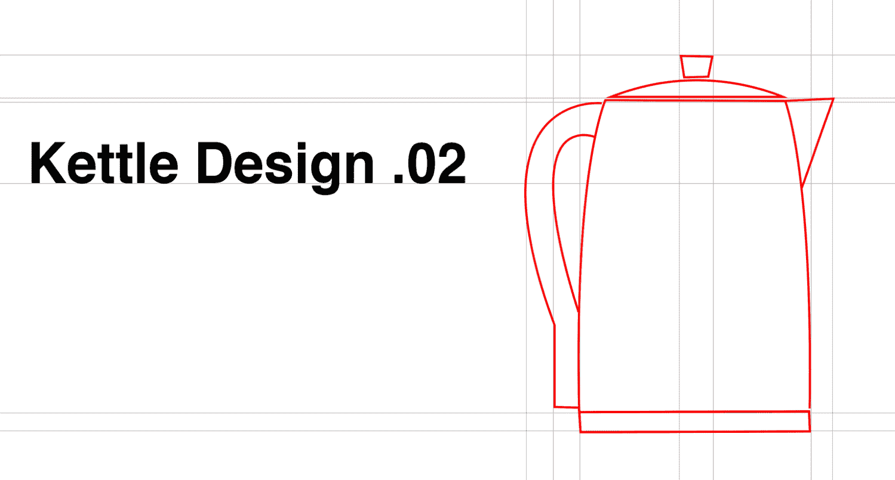

# 第一章：设定场景

JavaScript 是由 Brendan Eich 于 1995 年创建的，旨在成为一种“粘合语言”。它旨在帮助网页设计师和业余爱好者轻松地操纵和从他们的 HTML 中派生行为。JavaScript 能够通过 DOM API 实现这一点，DOM API 是浏览器提供的一组接口，可以访问 HTML 的解析表示。不久之后，**DHTML**成为流行术语，指的是 JavaScript 实现的更动态的用户界面：从动画按钮状态到客户端表单验证等各种功能。最终出现了 Ajax，它实现了*客户端*和*服务器*之间的通信。这为潜在应用程序开辟了一个巨大的可能性。以前纯粹是文档领域的网络，现在正在成为一个处理器和内存密集型应用程序的强大平台：


1995 年，没有人能预测 JavaScript 有一天会被用来构建复杂的 Web 应用程序，编程机器人，查询数据库，为照片处理软件编写插件，并成为现存最受欢迎的服务器运行时之一，Node.js 的背后。

1997 年，JavaScript 在创立后不久由 Ecma International 标准化，以 ECMAScript 的名字，它仍在 TC39 委员会的频繁变更中。语言的最新版本根据发布年份命名，比如 ECMAScript 2020（ES2020）。

由于其不断增长的功能，JavaScript 吸引了一个充满激情的社区，推动了它的增长和普及。由于它的相当受欢迎，现在有无数种不同的方法可以在 JavaScript 中完成相同的事情。有成千上万的流行框架、库和实用程序。语言本身也在不断变化，以应对其应用程序日益增长的需求。这带来了一个巨大的挑战：在所有这些变化中，当被推拉到不同的方向时，我们如何知道如何编写最佳的代码？我们应该使用哪些框架？我们应该采用什么约定？我们应该如何测试我们的代码？我们应该如何构建明智的抽象？

为了回答这些问题，我们需要简要回顾基础知识。这就是本章的目的。我们将讨论以下内容：

+   代码的真正目的是什么

+   我们的用户是谁，他们有什么问题

+   为人类编写代码意味着什么

# 我们为什么写代码

简单来说，我们知道编程是关于指导计算机，但我们在指导它们做什么？以及为了什么目的？代码还有什么其他用途？

我们可以广泛地说，代码是解决问题的一种方式。通过编写代码，我们表达了一个复杂的任务或一系列操作，将它们浓缩成一个可以被用户轻松利用的单一过程。因此，我们可以说代码是问题领域的表达。我们甚至可以说它是一种沟通方式，一种传达信息和意图的方式。了解代码是一个具有许多互补目的的复杂事物，比如解决问题和沟通，将使我们能够充分发挥其潜力。让我们深入探讨一下这种复杂性，探索我们所说的代码作为传达意图的方法是什么意思。

# 代码的意图

我们经常认为代码只是计算机执行的一系列指令。但在很多方面，这忽略了我们写代码时所做的真正魔力。当我们传达指令时，我们在向世界表达我们的意图；我们在说“这些是我想发生的事情”。

人类一直以来都在传达指令。一个简单的烹饪食谱就是一个例子：

切大约 300 克黄油（小方块！）

取 185 克黑巧克力

在平底锅上用黄油融化

打破半打鸡蛋，最好是大个的

将它们与几杯糖混合在一起

像这样的指令对人类来说很容易理解，但您会注意到它们没有严格的规范。计量单位不一致，标点和措辞也不一致。一些指令非常模棱两可，因此对于以前没有做过饭的人来说，容易产生误解：

+   什么构成一个大鸡蛋？

+   何时应该考虑黄油完全融化？

+   深色巧克力应该有多深？

+   *小方块*黄油有多小？

+   *在锅上*是什么意思？

人类通常可以通过他们的主动性和经验来应对这种模棱两可，但机器并不那么擅长。机器必须被指示具有足够的具体性来执行每一步。我们希望向机器传达的是我们的意图，也就是*请做这件事*，但由于机器的性质，我们必须非常具体。值得庆幸的是，我们选择如何编写这些指令取决于我们；有许多编程语言和方法，几乎所有这些方法都是为了让人类以更轻松的方式传达他们的意图而创建的。

人类能力和计算能力之间的距离迅速缩小。机器学习、自然语言处理和高度专业化的程序的出现意味着机器在能够执行的指令类型上更加灵活。然而，代码将继续有用一段时间，因为它使我们能够以一种高度具体和标准化的方式进行沟通。通过这种高度的具体性和一致性，我们可以更有信心地相信我们的指令每次都会按照预期执行。

# 谁是用户？

在考虑用户时，没有关于编程的有意义的对话。用户，无论他们是其他程序员还是 UI 的最终用户，都是我们所做的核心。

让我们想象一下，我们的任务是验证网站上用户输入的送货地址。这个特定的网站向世界各地的医院销售药物。我们有点匆忙，宁愿使用别人已经实施的东西。我们找到了一个名为`shipping_address_validator`的公开可用的包，并决定使用它。

如果我们花时间检查包中的代码，在其邮政编码验证文件中，我们会看到这样：

```js
function validatePostalCode(code) {
  return /^[0-9]{5}(?:-[0-9]{4})?$/.test(code);
}
```

这个`validatePostalCode`函数碰巧使用了正则表达式（也称为**RegExp**和 regex），用斜杠分隔，以定义要与字符串匹配的字符模式。您可以在第六章中阅读更多关于这些构造的内容，*原始和内置类型*。

不幸的是，由于我们的匆忙，我们没有质疑`shipping_address_validator`包的功能。我们假设它做了*罐头上说的那样*。发布代码到生产环境后一周，我们收到了一个错误报告，说一些用户无法输入他们的地址信息。我们查看代码后，惊恐地意识到它只验证美国的邮政编码，而不是所有国家的邮政编码（例如，它无法在英国邮政编码上运行，比如 GR82 5JY）。

通过这一系列不幸的事件，这段代码现在负责阻止成千上万的全球客户的重要药物发货。幸运的是，修复它并不需要太长时间。

暂且不论谁对这一失误负责，我想提出以下问题：这段代码的用户是谁？

+   我们，程序员，决定使用`shipping_address_validator`包？

+   那些试图输入他们地址的无意的客户？

+   在医院等待他们药物的患者？

这个问题没有明确的答案。当代码中出现错误时，我们可以看到可能会产生巨大的不幸的下游影响。原始程序包的程序员是否应该关心所有这些下游依赖关系？当聘请一名管子工来修理水槽上的水龙头时，他们只应该考虑水龙头本身的功能，还是倾倒进入其中的水槽？

当我们编写代码时，我们正在定义一个隐含的规范。这个规范通过它的名称、配置选项、输入和输出来传达。使用我们代码的任何人都有权期望它按照规范工作，所以我们越明确越好。如果我们正在编写只验证美国邮政编码的代码，那么我们应该相应地命名它。当人们在我们的代码之上创建软件时，我们无法控制他们如何使用它。但我们可以明确地传达关于它的信息，确保其功能清晰且符合预期。

重要的是要考虑我们代码的所有用例，想象它可能被使用的方式以及人类对它的期望，包括程序员和最终用户。我们对什么负责或负有责任是值得讨论的，这既是一个法律问题，也是一个技术问题。但我们的用户是谁的问题完全取决于我们。根据我的经验，更好的程序员会考虑到所有用户，意识到他们编写的软件并不是在真空中存在的。

# 问题是什么？

我们已经谈到了用户在编程中的重要性，以及如果我们希望有帮助他们的希望，我们必须首先了解他们希望做什么。

只有通过了解问题，我们才能开始组装我们的代码必须满足的要求。在探索问题时，有必要问自己以下问题：

+   用户遇到了什么问题？

+   他们目前是如何执行这项任务的？

+   有哪些现有解决方案，它们是如何工作的？

当我们完全了解了问题后，我们就可以开始构思、规划和编写代码来解决它。在每一步，我们通常在不知不觉中会以对我们有意义的方式对问题进行建模。我们思考问题的方式将对我们最终创建的解决方案产生重大影响。我们创建的问题模型将决定我们最终编写的代码。

**问题的模型是什么？** 模型或*概念模型*是描述事物运作方式的图表或表示。我们在不知不觉中一直在创建和调整模型。随着时间的推移，随着您对问题领域的了解增加，您的模型将得到改进，以更好地符合现实。

让我们想象一下，我们负责为学生设计一个笔记应用，并且被要求为用户表达的以下问题创建一个解决方案：

“我有很多学习笔记，所以发现很难对它们进行组织。具体来说，当试图找到有关某个主题的笔记时，我会尝试使用搜索功能，但很少能找到我要找的内容，因为我并不总是能回忆起我写的具体文字。”

我们已经决定这需要对软件进行更改，因为我们已经从其他用户那里听到了类似的事情。因此，我们坐下来尝试想出各种想法，看看我们如何改进笔记的组织。我们可以探索一些选项：

+   **分类**：将为分类创建一个分层文件夹结构。有关*长颈鹿*的笔记可能存在于学习/动物学下。分类可以通过手动或搜索轻松导航。

+   **标签**：将能够使用一个或多个单词或短语对笔记进行*标记*。有关*长颈鹿*的笔记可能会被标记为*哺乳动物*和*长颈*。标签可以通过手动或搜索轻松导航。

+   **链接**：引入一个*链接*功能，使笔记可以链接到其他相关的笔记。例如，关于*长颈鹿*的笔记可能会被链接到另一篇笔记，比如*长颈动物*。

每个解决方案都有其利弊，也有可能实现它们的组合。显而易见的一点是，这些解决方案将极大地影响用户最终使用应用程序的方式。我们可以想象，用户接触到这些解决方案后，会在他们的脑海中形成“记笔记”的模型：

+   **类别**：我写的笔记在我的分类层次结构中有它们的位置

+   **标签**：我写的笔记涉及许多不同的事情

+   **链接**：我写的笔记与我写的其他笔记相关

在这个例子中，我们正在开发一个 UI，因此我们与应用程序的最终用户非常接近。然而，问题建模适用于我们所做的所有工作。如果我们为笔记保存创建一个纯粹的 REST API，那么将需要做出完全相同的考虑。Web 程序员在决定其他人最终采用的模型方面起着关键作用。我们不应该轻视这一责任。

# 真正理解问题领域

典型的失败点通常是对问题的误解。如果我们不了解用户真正想要实现什么，也没有收到所有的需求，那么我们将不可避免地保留问题的错误模型，从而实施错误的解决方案。

想象一下，在水壶发明之前的某个时刻发生了这种情况：

+   **苏珊娜（工程师）**：马特，我们被要求设计一个用户可以煮水的容器

+   **马修（工程师）**：明白了；我会创建一个完全符合要求的容器

马修没有提出任何问题，立即开始工作，对能够将自己的创造力发挥出来感到兴奋。一天后，他想出了以下装置：


很明显，马修忘记了一个关键组成部分。在匆忙中，他没有停下来向苏珊娜询问有关用户或问题的更多信息，因此没有考虑到用户可能需要以某种方式拿起热气腾腾的容器。在收到反馈后，他自然而然地为水壶设计并引入了一个手柄：



然而，这完全没有必要发生。想象一下，将这种水壶情景推广到跨越多个月的大型软件项目的复杂性和长度。想象一下在这样的误解中涉及的头痛和不必要的痛苦。解决问题的关键在于首先正确和完整地理解问题。如果没有这一点，我们甚至在开始之前就会失败。这在设计大型项目中很重要，但也在实现最小的 JavaScript 实用程序和组件中很重要。事实上，在我们编写的每一行代码中，如果我们不首先了解问题领域，我们都将完全有可能失败。

问题领域不仅包括用户遇到的问题，还包括通过我们可用的技术来满足他们需求的问题。因此，例如，在浏览器中编写 JavaScript 的问题领域包括 HTTP 的复杂性，浏览器对象模型，DOM，CSS 以及其他一系列细节。一个优秀的 JavaScript 程序员不仅必须精通这些技术，还必须理解用户遇到的新问题领域。

# 为人类编写代码

整本书都致力于教你如何在 JavaScript 中编写干净的代码。在接下来的章节中，我们将详细讨论几乎语言中的每个构造。首先，我们需要确定几个重要的观点，在我们考虑为人类编写干净代码意味着什么时，这些观点将非常重要。

# 沟通意图

我们可以说，为人类编写代码在广义上是关于意图的清晰度。而为机器编写代码在广义上是关于功能性。当然，这些需求会交叉，但是区分这种差异是至关重要的。如果我们只为机器编写代码，只关注功能，忘记了人类的受众，我们就能看到这种区别。这里有一个例子：

```js
function chb(d,m,y) {
  return new Date(y,m-1,d)-new Date / 6e4 * 70;
}
```

你明白这段代码在做什么吗？你可能能够解释这段代码在做什么，但它的意图——它的真正含义——几乎不可能被理解。

如果我们清楚地表达我们的意图，那么前面的代码看起来会像这样：

```js
const AVG_HEART_RATE_PER_MILLISECOND = 70 / 60000;

function calculateHeartBeatsSinceBirth(birthDay, birthMonth, birthYear) {

 const birthMonthIndex = birthMonth - 1;
 const birthDate = new Date(birthYear, birthMonthIndex, birthDay);
 const currentDate = new Date();

 return (currentDate - birthDate) / AVG_HEART_RATE_PER_MILLISECOND;

}
```

从前面的代码中，我们可以看出这个函数的意图是计算自出生以来心脏跳动的次数。这两段代码之间在功能上没有区别。然而，后一段代码更好地传达了程序员的意图，因此更容易理解和维护。

我们编写的代码主要是为了人类。你可能正在构建一个宣传网站，编写一个 Web 应用程序，或者为框架制作一个复杂的实用函数。所有这些都是为人类而做的：那些作为我们代码驱动的 GUI 的最终用户，或者那些使用我们抽象和接口的程序员。程序员的业务是帮助这些人。

即使你只是为自己编写代码，没有任何可能被其他人以任何方式使用，如果你写出清晰的代码，你未来的自己会感谢你。

# 可读性

当我们编写代码时，考虑人类大脑如何消化它是至关重要的。其他程序员会扫视你的代码，阅读相关部分，试图对其内部运作有一个运行的理解。可读性是他们必须克服的第一个障碍。如果他们无法阅读和认知地导航你写的代码，那么他们将更难使用它。这将严重限制你的代码的效用和价值。

根据我的经验，程序员不太喜欢以审美设计的方式思考代码，但是最好的程序员会欣赏到这些概念是内在联系的。我们代码的设计在呈现或视觉意义上与其架构设计一样重要。设计最终是关于以最佳方式为用户提供目的的创造。对于我们的同行程序员，这个目的是理解。因此，我们必须*设计*我们的代码来实现这个目的。

机器纯粹关心规范，并会轻松地将有效的代码解析成其部分。然而，人类更加复杂。我们在机器擅长的领域能力较弱，这也是它们存在的原因，但我们在机器可能失败的领域也很有技巧。我们高度进化的大脑，在其众多才能中，已经变得非常擅长发现模式和不一致之处。我们依赖差异或对比来集中我们的注意力。如果一个模式没有被遵循，那么对我们的大脑来说就会产生更多的工作。举个不一致的例子，看看这段代码：

```js
var TheName='James' ;
 var City     =   'London'
var    hobby = 'Photography',job='Programming'
```

你可能不喜欢看这段代码。它的混乱让人分心，似乎没有遵循任何特定的模式。命名和间距是不一致的。我们的大脑在这方面很吃力，因此阅读代码，对其有一个完整的理解，变得更加认知昂贵。

我们可以重构前面的代码，使其更加一致，如下所示：

```js
var name = 'James';
var city = 'London';
var hobby = 'Photography';
var job = 'Programming';
```

在这里，我们使用了单一的命名模式，并在每个语句中采用了一致的语法和间距。

或者，也许我们想在单个`var`声明中声明所有变量，并对齐赋值（`=`）运算符，使所有值沿着相同的垂直轴开始：

```js
var name  = 'James',
    city  = 'London',
    hobby = 'Photography',
    job   = 'Programming';
```

你会注意到这些不同的风格非常主观。有些人喜欢一种方式，其他人喜欢另一种方式。这都没问题。我并没有说哪种方法更优越。相反，我指出，如果我们关心为人类编写代码，那么我们应该首先关心其可读性和表现，而一致性是其中的关键部分。

# 有意义的抽象

当我们编写代码时，我们不断使用和创建抽象。抽象是当我们将复杂性简化后提供对该复杂性的访问时发生的。通过这样做，我们使人们能够利用这种复杂性，而无需完全理解它。这个想法支撑着大多数现代技术：


JavaScript，像许多其他高级语言一样，提供了一种抽象，使我们不必担心计算机的运行细节。例如，我们可以忽略内存分配的问题。即使我们必须对硬件的限制敏感，特别是在移动设备上，我们很少会考虑它。语言不要求我们这样做。

浏览器也是一个著名的抽象。它提供了一个图形用户界面，抽象掉了 HTTP 通信和 HTML 渲染等许多细节。用户可以轻松地浏览互联网，而无需担心这些机制。

在本书的后续章节中，我们将学习更多关于如何打造良好抽象的知识。目前，可以说：在你写的每一行代码中，你都在使用、创建和传达抽象。

# 抽象的塔

抽象的塔是一种看待技术复杂性的方式。在基础层，我们有计算中依赖的硬件机制，如 CPU 中的晶体管和 RAM 中的存储单元。在上面，我们有集成电路。再上面，有机器码、汇编语言和操作系统。再上面，有几层，有浏览器和其 JavaScript 运行时。每一层都将复杂性抽象化，以便上面的层可以在不费太多力气的情况下利用这种复杂性：


当我们为浏览器编写 JavaScript 时，我们已经在一个非常高的抽象塔上操作。这座塔越高，操作起来就越不稳定。我们依赖于每个部分都按预期工作。这是一个脆弱的系统。

当我们考虑我们的用户时，抽象的塔是一个有用的比喻。当我们编写代码时，我们正在为这座塔增添东西，一层又一层地建造。我们的用户总是位于这座塔的上方，利用我们精心打造的机制来实现他们自己的目标。这些用户可能是利用我们的代码的其他程序员，为系统增加更多的抽象层。或者，我们的用户可能是软件的最终用户，通常坐在塔顶，通过简化的图形用户界面利用其庞大的复杂性。

# 干净代码的层次

在本书的下一部分中，我们将以本章讨论的基本概念为基础，并用我们自己的抽象来构建；这些抽象是我们在软件行业中用来谈论编写干净代码意味着什么的抽象。

如果我们说我们的软件是可靠的或可用的，那么我们正在运用抽象概念。这些概念必须被深入挖掘。在后面的章节中，我们还将剖析 JavaScript 的内部，看看处理支撑我们程序的语法的各个部分意味着什么。到本书结束时，我们应该能够说我们对从单独可读的代码行到设计良好且可靠的架构的多个层次的干净代码有完整的了解。

# 摘要

在这一章中，我们已经为自己打下了良好的基础，探索了支撑我们所有编写的代码的基本原理。我们已经讨论了我们的代码如何表达意图，以及为了构建这种意图，我们必须对用户需求和我们所涉及的问题领域有深刻的理解。我们还探讨了如何编写对人类清晰易读的代码，以及如何创建清晰的抽象，为用户提供利用复杂性的能力。

在下一章中，我们将以清晰代码的具体原则：可靠性、效率、可维护性和可用性，来进一步构建这一基础。这些原则将为我们提供重要的视角，因为我们将继续研究 JavaScript 的许多方面，以及我们如何运用它来服务于清晰的代码。
