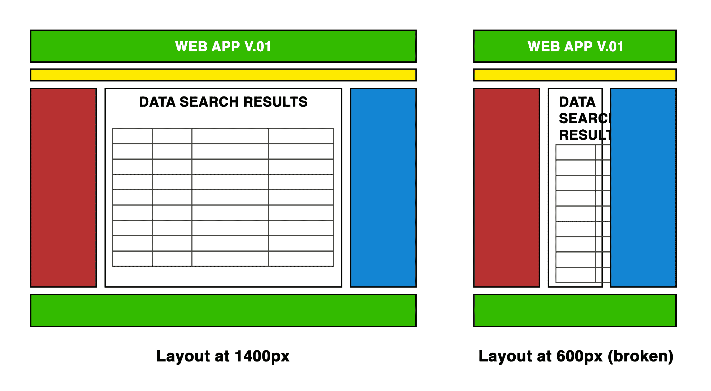

# 第二章：清洁代码的原则

在上一章中，我们讨论了代码开头的目的：为用户解决问题。我们讨论了迎合机器和人的困难。我们提醒自己，写代码的核心是传达意图。

在本章中，我们将从这些基础中得出四个核心原则，这些原则在创建软件时是必要考虑的。这些原则是可靠性、效率、可维护性和可用性。一个好的软件可以说具有所有这些品质。一个糟糕的软件可以说没有一个。然而，这些原则并不是规则。相反，将它们视为您可以查看代码的透镜是有用的。对于每个原则，我们将通过类比和 JavaScript 示例的混合来发现它的重要性。您应该能够从本章中学会将这些原则应用到您的代码中。

具体来说，我们将涵盖以下原则：

+   可靠性

+   效率

+   可维护性

+   可用性

# 可靠性

可靠性是一个良好软件系统的核心支柱。没有可靠性，技术的实用性很快就会消失，使我们陷入一种可能更好不使用它的境地。技术的整个目的可能会被不可靠性所破坏。

然而，可靠性不仅仅是大型和复杂软件系统的特征。每一行代码都可以构建成不可靠或可靠的。但是这是什么意思呢？可靠性这个词指的是可靠的质量。编写可以让人们依赖的代码是什么意思呢？通过定义三个不同的特质来帮助定义可靠性：*可靠性是正确、稳定和有弹性的质量*。

# 正确性

正确的代码是符合一组期望和要求的代码。如果我编写一个函数来验证电子邮件地址，那么期望是该函数可以使用各种类型的电子邮件地址进行调用，并正确地确定它们的有效性或无效性，如下所示：

```js
isValidEmail('someone@example.org');     // => true
isValidEmail('foo+bar_baz@example.org'); // => true
isValidEmail('john@thecompany.$$$');     // => false
isValidEmail('this is not an email');    // => false
```

要编写正确的代码，我们必须首先了解要求是什么。要求是我们对代码行为的正式期望。对于先前的电子邮件验证函数的情况，我们可能有以下要求：

+   当传递有效的电子邮件地址作为第一个参数时，该函数将返回`true`

+   否则，该函数将返回`false`

然而，第一个要求是模棱两可的。我们需要弄清楚电子邮件地址甚至是什么意思才能有效。电子邮件地址看起来是一个简单的格式；然而，实际上有许多边缘情况和奇怪的有效表现。例如，根据 RFC 5322 规范，以下电子邮件地址在技术上是有效的：

+   `admin@mailserver1`

+   `example@s.example`

+   `john..doe@example.org`

要知道我们的函数是否应该完全符合 RFC 规范，我们首先需要了解它的真正用例。它是电子邮件客户端软件的实用程序，还是可能在社交媒体网站的用户注册中使用？在后一种情况下，我们可能希望将更奇特的电子邮件地址视为无效，类似于之前列出的那些。我们甚至可能希望 ping 一下域名的邮件服务器来确认其存在。关键是要弄清楚确切的要求将为我们提供*正确*的含义。

顺便说一句，自己编写电子邮件验证函数是非常不明智的，因为有许多边缘情况需要考虑。这突显了我们追求可靠性时需要考虑的一个重要问题；通常，我们可以通过使用现有的*经过验证的*开源库和实用程序来实现最高级别的可靠性。在第十七章中，*其他人的代码*，我们将详细讨论选择第三方代码的过程以及需要注意的事项。

我们编码的要求应该始终直接源自我们的代码将如何使用。从用户及其问题开始非常重要；从那里，我们可以建立一组清晰的要求，可以进行独立测试。测试我们的代码是必要的，这样我们就可以确认，对自己和利益相关者来说，我们的代码是否满足所有不同的要求。

通过以前的电子邮件地址验证示例，一组良好的测试将包括许多电子邮件地址的变化，确保所有边缘情况都得到充分考虑。在第十三章中，*测试的景观*，我们将更详细地讨论测试。然而，现在，简单地反思正确性的重要性以及我们可以建立和确认的方式就足够了：

+   了解正在解决的问题以及用户的需求

+   将您的要求细化，直到清楚明确需要什么

+   测试您的代码以验证其正确性

# 稳定性

稳定性是我们在所有技术中都希望具备的特征。没有稳定性，事情就会变得不稳定；我们会不确定事情是否会在任何时刻发生故障。稳定性最好由现实世界技术的一个常见例子来说明。比较这两座桥：


[来自 Unsplash 的照片/由 Zach Lezniewicz/由 Jacalyn Beales]

它们在技术上都是正确的桥梁。然而，其中一座之前曾遭受损坏，并且已经用一块简单的木板修复。你会相信哪座桥安全地运送一百人？可能是右边的那座。它牢固地固定在那里，有护栏，而且关键的是，没有可以掉下去的缝隙。

在代码中，我们可以说稳定性是关于*在不同有效输入和情况下持续正确的行为*。浏览器中的 JavaScript 特别容易出现这种失败。它必须在多种条件下运行，包括不同的硬件、操作系统、屏幕尺寸，而且通常在具有不同功能的浏览器中。

如果我们编写的代码严重依赖于某些条件，那么当这些条件不存在时，它可能会变得笨拙和不可靠。例如，如果我们设计和实现网络应用程序的布局，可能会忘记考虑并适应小于 1,024 像素宽的屏幕尺寸，导致以下混乱：



这是一个不稳定的例子。当某个环境因素不同时，无法依赖网络应用程序提供其正确的行为。在移动设备使用不断增加的世界中，屏幕尺寸小于 1,024 像素的情况是完全可能和合理的；这是我们网络应用程序的绝对有效用例，而未能适应它会对用户依赖它的能力产生负面影响。

稳定性是通过充分了解代码可能暴露的所有不同有效输入和情况来获得的。与正确性类似，稳定性最好通过一组测试来确认，这些测试将代码暴露给各种输入和情况。

# 弹性

弹性是关于避免失败的。稳定性主要关注预期输入，而弹性关注的是当您的代码暴露于意外或非例行输入时会发生什么。软件系统中的弹性也被称为**容错**，有时会以*冗余*或*应急措施*的形式讨论。从根本上讲，所有这些都是为了实现同样的目标——最小化失败的影响。

对于关键系统，生命取决于持续功能的情况，通常会在系统中建立各种应急措施。如果出现故障或故障，系统可以利用其应急措施隔离和容忍该故障。

在为航天飞机建造飞行控制系统时，美国国家航空航天局（NASA）通过使用一组同步冗余的机器来为系统构建了弹性。如果一个机器由于意外情况或错误而失败，那么另一个机器将接管。回到地球上，我们在医院中建立了备用发电机，如果电力网断电，备用发电机将立即启动。同样，一些城市交通网络在火车不运行的情况下会受益于*替代*公交车服务的应急措施。

这些庞大而复杂的系统似乎与 JavaScript 的世界相去甚远。但通常情况下，我们也在不知不觉中经常考虑并在我们的代码库中实现弹性。我们实现这一点的一种方式是通过优雅降级。当我们为浏览器环境编写 JavaScript 时，我们有一些关键的期望：

+   JavaScript 将通过 HTTP 正确传递

+   JavaScript 的版本得到浏览器支持

+   JavaScript 没有被广告拦截器或其他附加组件阻止

+   浏览器通常没有禁用 JavaScript

如果这些条件中的任何一个不成立，用户可能面临完全无法使用的网站或 Web 应用程序。缓解这些问题的方法是考虑优雅降级。优雅降级涉及应用程序的一些方面*降级*到仍然可以使用的状态，即使在面对意外故障时仍然对用户有用。

优雅降级通常以一个简单的扶梯来说明：


[照片来自 Unsplash，由 Teemu Laukkarinen 拍摄]

当扶梯正常运行时，它会通过一组由强大的齿轮系统和电动机驱动的移动金属台阶传送人们。如果系统由于任何原因失败，那么扶梯将保持静止，就像一般的楼梯一样。因此，可以说扶梯具有弹性，因为即使发生意外故障，它们仍然可用。用户仍然可以通过扶梯上下移动，尽管可能需要更长的时间。

在编写 JavaScript 时，我们可以通过检测我们依赖的功能并仅在可用时使用它们来为我们的代码构建弹性。例如，我可能希望向用户播放 MP3 音频。为了实现这一点，我将使用 HTML5 音频元素。然而，在这之前，我将检测浏览器是否支持 MP3 音频。如果不支持，我可以通知用户并指引他们阅读音频的转录：

```js
function detectAudioMP3Support() {
 const audio = document.createElement('audio');
 const canPlayMP3 = audio.canPlayType &&
 audio.canPlayType('audio/mpeg; codecs="mp3"')
 return canPlayMP3 === 'probably';
}

function playAudio() {
 if (detectAudioMP3Support()) {
 // Code to play the audio
 // ...
 } else {
 // Code to display link to transcript
 // ...
 }
}
```

上述代码使用 HTMLMediaElement 的`canPlayType`方法来识别支持。我们将这一点抽象成一个`detectAudioMP3Support`函数，然后调用它来决定我们是否继续播放音频，或者显示音频的转录。显示音频的转录是一种优雅降级，因为它仍然允许用户在无法播放音频的情况下获得一些效用。

重要的是要注意，仅仅进行功能检测本身并不是优雅降级。如果我检测到 MP3 支持，但如果不可用则默默失败，那就不会有太大作用。然而，为我们的用户激活替代路径——在这种情况下，启用音频的转录阅读——是优雅降级和对故障的弹性的完美例子。

将弹性构建到软件中有一些奇怪之处。通过考虑和适应潜在的意外故障状态，我们实际上是在使这些故障状态变得可预期。这使我们的软件更加稳定和更加可用。随着时间的推移，我们曾经需要对其进行弹性处理的问题现在将成为软件稳定性的日常部分。

韧性是编写清晰、可靠代码的重要组成部分。从根本上说，我们编写代码是为了解决用户的问题。如果我们的代码能够容忍和适应边缘情况、意想不到的情况和意外的输入，那么它将更有效地实现这一目的。

# 效率

我们生活在一个资源有限的世界中。为了编写最佳的代码，我们需要考虑到这种稀缺性。因此，在设计和实现我们的想法时，我们应该着眼于效率。

在本节中，我们将通过示例探讨效率的不同方面，并将它们与 JavaScript 的世界联系起来。希望您能对效率不仅仅是快速的概念有所了解，而是包含许多间接影响，从经济到生态的方方面面。

# 时间

时间是我们一直关注的一个关键稀缺资源。时间是一种重要的资源，我们应该只在经过考虑后才使用。在编程世界中，我们应该寻求优化在任何给定任务上花费的时间或 CPU 周期的数量。这是为了迎合我们的最终用户，因为他们自己的时间有限，但也是为了谨慎使用有限且昂贵的硬件。

在 JavaScript 中，几乎任何函数都有更高效和更低效的编写方式。例如，这个函数，它删除数组中的重复字符串：

```js
function removeDuplicateStrings(array) {

  const outputArray = [];

  array.forEach((arrayItem, index) => {

    // Check if the same item exists ahead of where we are.
    // If it does, then don't add it to the output.
    if (array.indexOf(arrayItem, index + 1) === -1) {
      outputArray.push(arrayItem);
    }

  });

  return outputArray;
}
```

这段代码是可靠的，满足要求，并且在大多数情况下都是完全可以的。但它做了不必要的工作。在数组的每次迭代中，它都会重新遍历整个数组，从当前索引开始发现是否存在重复值。这种方法可能看起来有点直观，但是很浪费。

我们可以不再检查整个输入数组，而是只需检查现有的输出数组是否包含特定值。如果输出数组已经包含该值，那么我们就知道不需要再添加它。这是我们稍微优化过的`if`条件：

```js
// Check if the same item exists already in the output array.
// If it doesn't, then we can add it:
if (outputArray.indexOf(arrayItem) === -1) {
  outputArray.push(arrayItem);
}
```

还有其他优化的方法，取决于有多少个唯一值，以及输入数组的大小。例如，我们可以将找到的值存储为对象中的键（*HashMap*方法），这在某些情况下可以减少查找时间。

要谨慎对代码进行微观优化。它们可能并不总是值得成本。相反，首先衡量代码的性能，然后解决真正存在的性能瓶颈。

花费太长时间在一个任务上可能会对用户执行任务的能力产生重大影响。在本章的后面，我们将讨论可用性的原则，但现在重要的是要注意，时间效率不仅在原则上很重要；它之所以重要是因为在规模上，这些通常微小的效率努力可能对可用性产生巨大的积极影响。

# 空间

空间是一种稀缺资源，与事物的大小有关。数据在网络和机器之间穿梭，在 RAM 中临时存储，可能以硬盘或固态驱动器（HDD、SSD）的形式保存到永久存储中。作为效率的倡导者，我们只对完成给定任务所需的空间感兴趣，其中一部分是以最有效的方式使用可用空间，并且只在有必要时移动数据。

由于 JavaScript 语言的高级特性和通常构建的应用程序，我们很少需要考虑临时 RAM 使用或永久存储。然而，JavaScript 在性能敏感的环境中已经取得了显著进展，例如数据库基础设施和 HTTP 中间件，因此这些问题现在更加相关。

此外，客户端应用程序的需求在浏览器和本地环境中都大大增加。这些应用程序的复杂性意味着我们必须时刻保持警惕，考虑如何优化服务器、用户设备和日益复杂的网络上的内存和带宽使用。我们在 Web 应用程序中吸收的带宽将直接影响用户等待应用程序可用的时间。

首次渲染时间是我们在开发 Web 应用程序前端时感兴趣的常见指标。通过谨慎使用大型资源并不阻塞初始加载时间来优化这一点。

*时间*和*空间*效率是紧密相连的，两者直接影响彼此。效率的总体主题是只做必要的事情，避免浪费，并节约可用资源。

# 效率的影响

时间和空间效率在软件本身和更广泛的世界中负责许多其他效应，两者都直接影响另一个。没有优化是孤立存在的。在一个领域节省的资源将总是在其他领域产生连锁效应。同样，任何不必要的成本通常会在后续产生瓶颈和问题。

有太多这些效应可以列举，但在软件世界中一些最明显的效应包括以下内容：

+   电力消耗的生态效应（例如气候变化）

+   使用慢软件所带来的认知负担（例如分散注意力和烦恼）

+   用户设备的电池寿命，因此他们选择优先考虑的任务

我们在做出选择时，始终要考虑我们所做选择的连锁效应，无论是为了效率还是其他要求。我们所创造的一切都不是孤立存在的。

# 可维护性

可维护性是指可以对您的代码进行适当更改的容易程度。与机动车不同，代码通常不需要例行维护来避免生锈等问题，但它仍然需要不时修复。对其功能的更改也经常是必要的，特别是在积极开发时。我们所工作的大部分代码也正在被其他人积极开发。这种共享所有权在很大程度上依赖于可维护性的原则。

使代码易于维护不应该成为一个次要的优先事项。这与代码满足的任何其他要求一样重要。在第一章中，我们谈到了考虑用户是多么重要。如果我们不考虑维护和更改我们的代码的人也是我们的用户，那就是虚伪的。他们希望使用我们创建的东西来实现某种目的；因此，他们是我们的用户。因此，我们需要考虑如何最好地满足他们的需求。

在接下来的部分中，我们将探讨可维护性的两个方面：适应性和熟悉度。

# 适应性

可以说，最好的维护是不需要发生的维护。适应性是指您的代码适应和适应不同需求和环境的能力。代码不能无限适应。代码的本质是为特定目的而制定的；解决用户的特定问题。我们可以并且应该在我们的代码中提供一定程度的配置，以满足不同的需求，但我们无法预见所有可能性。最终，可能需要有新需求的人来进行更改底层代码。

如果我们创建一个显示图片轮播（幻灯片放映）的 JavaScript 组件，很明显可以想象用户会想要配置显示的特定图片。例如，我们还可以有一个配置选项来启用或禁用轮播的*淡入*或*淡出*行为。我们的完整配置选项可能如下所示：

+   **(数组) images**：您希望在轮播中显示的图像 URL

+   **(布尔值) fadeEffectEnabled**：是否在图像之间进行淡入淡出

+   **(数字) imageTimeout**：单个图像显示的毫秒数

+   **(布尔值) cycleEnabled**：是否保持幻灯片重复播放

这些配置选项定义了我们的组件的适应程度。通过使用这些选项，可以以多种不同的方式使用它。如果用户希望它以这些选项无法实现的方式行为，那么他们可能希望通过修改底层代码来改变其行为。

当需要对底层代码进行更改时，重要的是能够尽可能轻松地进行更改。可能会导致麻烦的两个有害特征是脆弱性和僵化：

+   **脆弱性**是在尝试更改时变得脆弱的特征。如果更改代码的某个区域以进行错误修复或添加功能，并且它影响了代码库中另一个部分中的几个看似无关的事物，那么我们可以说代码是*脆弱的*。

+   **僵化**是指难以轻松适应变化的特征。如果需要更改某个行为，理想情况下，我们应该只需要在一个地方进行更改。但如果我们不得不到处重写代码才能实现那个变化，那么我们可以说代码是*僵化的*。

脆弱性和僵化通常是较大代码库的症状，其中模块之间存在许多相互依赖。这就是为什么我们说模块化如此重要。模块化是指将关注点分离到代码的不同区域，以减少交织的代码路径。

有各种原则和设计模式可以用来实现模块化。这些在第四章中讨论，*SOLID 和其他原则*，并且在第十一章中有更多的代码示例，*设计模式*。即使在这个早期阶段，问问自己：我可以以什么方式实现模块化？

努力避免脆弱性和僵化是一个很好的目标，将使我们的代码更容易适应变化，但对于维护者来说，代码库最关键的方面是可理解性。也就是说，它可以被理解的程度。如果维护者不理解，甚至无法开始进行更改。事实上，在晦涩和令人困惑的代码库中，有时甚至无法确定是否需要进行更改。这就是为什么我们现在将探讨熟悉度作为可维护性的一个方面。通过使用熟悉的约定和直观的模式，我们可以帮助确保我们的维护者之间有高水平的理解。

# 熟悉度

熟悉是一种美好的感觉。这是一种让你感到舒适的感觉，因为你知道发生了什么，因为你以前见过。这是我们应该希望在所有可能遇到我们代码的维护者身上产生的感觉。

想象一下，你是一个技术娴熟的技师。你打开一辆旧车的引擎盖。你期望各种组件都能以各自的位置可见。你擅长识别特定的组件，即使不用移动东西，你也能看到组件是如何连接在一起的。

进行了一些小的修改；也许车主之前安装了涡轮增压发动机或修改了齿轮比，但总的来说，你会发现一切都基本在应该的位置上。对于你这个技师来说，进行改变将会非常简单：


[Unsplash image (Public Domain) by Hosea Georgeson]

在这个例子中，所有的东西都在预期的指定位置。即使汽车在许多方面有所不同，它们的基本功能是相同的，因此布局和设计对于技师来说是熟悉的。

当我们考虑软件时，它并不那么不同。我们最终创建的大多数软件在许多方面都类似于其他软件。例如，大多数网络应用程序都会有用户注册、登录和更改名称的方式。大多数软件，无论问题领域如何，都会有**创建、读取、更新和删除**（CRUD）的概念。这构成了持久存储的著名动词。大多数软件可以被认为是坐落在持久存储之上的花哨中间件。因此，即使我们可能认为所有软件应用都非常不同，它们的基本原理通常是非常相似的。因此，我们应该不难编写满足*打开引擎盖的技工*的代码。

为了使技工的工作尽可能简单，我们需要首先关注我们的代码的熟悉度。这并不简单，因为不同的东西对不同的人来说是熟悉的，但总的来说，我们可以从以下指南中获得启示：

+   不要偏离常见的设计模式

+   在语法和表现上保持一致

+   为陌生的问题领域提供清晰度

最后一点提到了*陌生的问题领域*。这是你作为程序员在每个你工作的代码库中都需要考虑的事情。要分辨某物是否可以被视为陌生的，你可以问自己：*另一个行业的程序员是否能够在很少的介绍下理解这个？*

# 可用性

尽管可维护性主要是关于迎合其他程序员，但可用性是关于迎合*所有*用户，无论他们是谁。我们可以说有两大类用户参与我们的服务：

+   希望通过接口（GUI、API 等）运用我们代码的人。

+   希望对我们的代码进行更改以完成新任务或修复错误的人

可用性是关于使我们的代码以及它所启用的函数和交互对于所有用户尽可能有用和易于使用。所有的代码都是至少针对一个用例编写的，因此根据它实现这一目的的程度来评判代码是公平的。然而，可用性不仅仅是关于满足用户需求；它是关于创造能够让用户以最小的麻烦、时间和认知努力实现他们目标的体验。

无论是在网络上创建用户界面还是深度嵌入的服务器基础设施，可用性都是至关重要的，即使它们很少见光。在这两种情况下，我们都在为用户提供服务，因此我们必须关心可用性。

看一下这个函数的签名，试着分辨你会如何使用它：

```js
function checkIsNewYear(
  configuration,
  filter,
  formatter,
  MDY,
  SMH
) {...}
```

这个函数是我曾经工作过的一个代码库中的真实函数签名。它没有文档，其中的代码是混乱的。它被用来计算给定时间是否可以被视为*新年*，并决定何时向用户显示*新年快乐*的消息。然而，它的使用方式或工作原理非常不清楚。发现这个函数时我可能会有一些开放性问题，如下：

+   *配置*是什么，这样一个简单的函数中可以配置什么？

+   据推测，SMH 是*秒、分钟和小时*，但它预期是什么样的值？一个对象吗？

+   据推测，MDY 是*月、日和年*，但它预期是什么样的值？一个对象吗？

+   这个函数比较传递的日期是哪一年，以判断它是否是*新年*？

+   假设在表面上的*新年*中任何日期都可以工作，还是只有比如说 1 月 1 日？

+   为什么有*过滤器*和*格式化程序*参数，它们是什么作用？它们是可选的吗？

+   这个函数返回什么？一个布尔值吗？*格式化程序*参数似乎不是这样。

+   为什么我不能只传递一个日期对象而不是单独的日期组件？

该函数可能会按要求执行，但是，正如你所看到的，它并不是非常易用。要弄清楚它的工作原理需要花费大量时间和认知努力。要完全弄清楚它，我们必须研究其在代码其他部分的用法，并尝试解密其中的混乱。作为这个函数的*用户*，我个人会觉得整个过程非常痛苦。

如果说有什么，易用性就是要避免这种痛苦和负担。作为程序员，我们参与创建抽象来简化复杂的任务，但前面的所有代码所实现的只是对一个简单问题的进一步复杂化。

# 用户故事

易用性是指某物在特定目的下易于使用的程度。其目的由对问题的一个清晰的模型和一组明确的要求定义。表达这些目的的一个有用的技术是通过*用户故事*，这是 Scrum 和敏捷方法论所著名的。用户故事通常采用以下形式：

作为{角色}，我想要{愿望}，以便{目的}...

以下是一些用户故事的示例，如果我们设计一个*联系人*应用程序，你会期望看到这些类型的用户故事：

+   作为**用户**，我想要**添加一个新的联系人**，以便**我以后可以从我的联系人列表中回忆起该联系人**。

+   作为**用户**，我想要**删除一个联系人**，以便**我将不再在我的联系人列表中看到该联系人**。

+   作为**用户**，我想要**通过他们的姓氏轻松找到一个联系人**，以便**我可以联系他们**。

用户故事有助于定义你所满足的目的，并有助于集中精力关注用户的视角。无论你是创建一个五行函数还是一个一万行的系统，规划你的用户故事总是值得的。

# 直观设计

直观地设计某物意味着设计它，使用户不必花费认知努力来弄清楚它的工作原理。直观设计的核心理念是*它只是工作*。

当我们编写代码时，我们参与了它的设计，它的大体架构，它的功能和逐行语法。所有这些都是设计的重要部分。使用直观的设计模式对于编写可用的代码至关重要。所有用户都熟悉一组在他们的抽象层次上使用的模式。以下是一些例子：

+   **在 GUI 中**：使用*X*按钮表示退出程序或进程

+   **在代码中**：以*is*开头的函数或方法表示布尔返回值

+   **在 GUI 中**：使用绿色表示肯定操作，红色表示否定操作

+   **在代码中**：大写常量，例如，`VARIABLE_NAME`

+   **在 GUI 中**：使用软盘图标表示保存的概念

这些是许多用户在使用软件时携带的假设和期望。利用这些假设意味着你的代码和它所促成的交互可以更容易使用。

# 无障碍

无障碍是易用性中的一个关键原则，它强调满足所有用户的重要性，而不考虑他们的能力和环境。易用性往往关注用户，好像他们是一个单一的实体。我们通常对用户做出具体的假设，赋予他们一组特征和能力，这些特征和能力可能并不反映现实。然而，无障碍是关于真正将要使用你所创建的任何东西的用户。这些真正的用户是一个多样化的个体群体，可能有各种不同。当我们谈论软件的无障碍时，我们通常关注直接影响一个人使用该软件能力的差异。这些可能包括以下内容：

+   学习障碍或不同，如阅读障碍。

+   身体残疾。例如，手部活动能力受限或失明。

+   自闭症和 ADHD 等发育障碍。

+   移动性、经济或基础设施的限制导致技术的获取减少。

除此之外，还有许多其他差异涵盖了人类存在的方方面面，因此我们应该随时准备根据我们的用户遇到的新需求和差异进行学习和适应。

我们致力于在服务器和浏览器上创建 Web 应用程序。作为 JavaScript 程序员，我们与为最终用户提供的界面非常接近。因此，我们必须对 Web 上的可访问性有很好的把握。这包括对 W3C 发布的《Web 内容可访问性指南》（WCAG 2.0）的了解，其中包括以下规定：

+   为任何非文本内容提供文本替代方案（指南 1.1）

+   从键盘上使所有功能可用（指南 2.1）

+   使文本内容可读和可理解（指南 3.1）

可访问性不仅仅是关于非程序员最终用户。正如前面提到的，我们应该将其他程序员也视为我们的*用户*，就像 GUI 或其他 Web 界面的*最终用户*一样。重要的是我们要迎合其他程序员。一些程序员是盲人或部分视障。一些程序员有学习或认知困难。并非所有程序员都在最新和最快的硬件上工作。也并非所有程序员都理解你可能认为理所当然的所有事情。在我们编写的代码中考虑所有这些事情是很重要的。

现在完成了这一章，你可能会感到被原则、原则和指南的数量所压倒。事情可能看起来很复杂，但如果我们遵循一个简单的规则——**始终关注用户**，那么就不会复杂。还要记住，可能会在你的代码上工作的其他程序员*也是*你的用户。

作为程序员，我们处于一个位置，拥有前所未有的力量，可以帮助定义人们在执行各种任务时的行为。最初在 Twitter、Google 或 Microsoft 工作的程序员可能没有预料到他们的代码会运行多少次。他们可能最初无法想象他们的代码会影响多少人。我们应该始终对这种力量保持谦卑，并努力对我们服务的所有用户和他们试图执行的各种任务负责。如果你从本章中得到一件事，我希望就是：在你写的每一行代码中，都谦卑地考虑用户。

# 总结

在本章中，我们探讨了可靠性、效率、可维护性和可用性的重要原则。通过这些原则作为我们审视代码库的透镜，可以确保我们更有可能编写更干净的代码。在本章中学到的最重要的一点是，始终考虑代码中的人。用户可能是坐在 GUI 另一侧的人，也可能是使用我们的 API 的其他程序员。无论如何，始终意识到这个人是至关重要的。

在下一章中，我们将继续研究干净代码的基本特征，例如要注意的敌人，如模仿式编程和自我。
