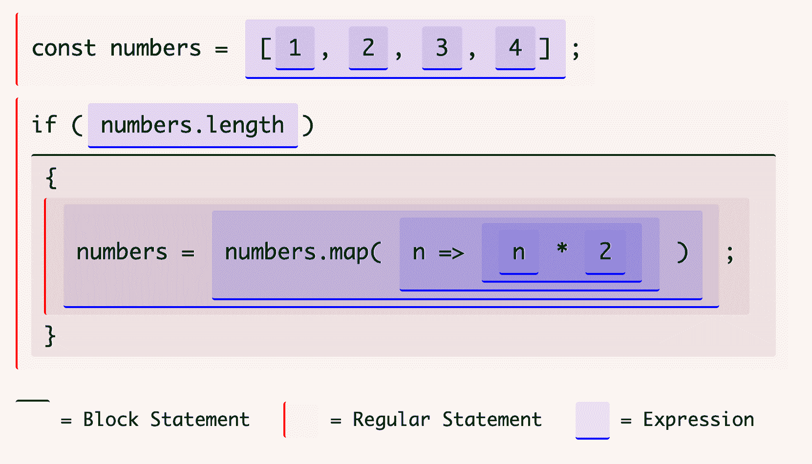

# 第九章：语法和范围的部分

在本章中，我们将继续探索 JavaScript 的语法和结构。我们将深入研究表达式、语句、块、作用域和闭包的基础知识。这些是语言中不太显眼的部分。大多数程序员认为他们已经很好地掌握了诸如表达式和作用域等工作原理，但正如我们所见，我们对事物应该如何工作的直觉可能并不总是与它们真正工作的方式一致。我们将在本章学习的构造是我们程序的重要大型构建块，因此在我们探索控制流和设计模式等更抽象的概念之前，充分理解它们是非常重要的。

为什么我们现在学习这个？我们现在已经对 JavaScript 中可用的类型以及如何通过运算符操纵它们有了牢固的掌握。下一个逻辑步骤是学习*句法脚手架*组件，我们可以在其中放置这些类型和操作，以及这些脚手架组件的行为。这里的最终目标是对 JavaScript 有高水平的流利度，这样我们就能更好地编写清晰的代码。

在本章中，我们将涵盖以下主题：

+   表达式、语句和块

+   作用域和声明

# 表达式、语句和块

在 JavaScript 中存在三种广义的句法**容器**：表达式、语句和块。它们都是容器，因为它们都包含其他句法片段，并且都有值得区分的不同行为。

还有其他可以称为容器的构造，比如函数或模块，但目前我们只对你在其中找到的句法类型感兴趣。随着我们继续探索语言，我们正在从粒度运算符和表达式逐渐*放大*到更大更复杂的函数和程序中。

最好将程序的单个句法部分可视化为一个层次结构：



在这里，我们可以看到单个**表达式**（下边界）被包裹在**语句**中，可以是**常规**或**块**类型。始终将语言的这种层次结构视图放在我们的脑海中是有用的，因为这是我们的代码将被解析和理解的方式。当然，我们不需要像解析器那样看待我们的代码，但了解我们的代码将如何被解析是无可争议的有用的。

这种语言的分层视图也将帮助我们编写能够很好地传达意图给其他程序员的程序。层次结构不仅是一个句法问题，也是一个人类问题。当我们编写程序时，我们通常会在不同的抽象层面上建模问题：程序的每个部分都包含在另一个部分中，从所有这些单独的部分中，我们可以构建一个包含许多不同复杂层次的程序。

当我们探索 JavaScript 的句法部分时，值得记住程序的句法元素，它的表达式和语句，将与问题域的个别元素和层次具有自然的对称性。

# 表达式

表达式是最粒度的句法容器类型。我们已经在很多表达式中工作过了。甚至表达一个文字值，比如数字`1`，都会产生一个表达式：

```js
1 // <= An expression containing the literal value 1
```

使用运算符也形成一个表达式：

```js
'hi ' + 'there'
```

实际上，我们可以将运算符视为应用于表达式的东西。因此，加法运算符的语法可以这样理解：

```js
EXPRESSION + EXPRESSION
```

表达式可以是一个简单的文字值或变量引用，但也可以是复杂的。以下表达式包含一系列操作，并分布在几行中：

```js
(
  'this is part of' +
  ' ' +
  ['a', 'very', 'long', 'expression'].join(' ')
)
```

表达式不仅限于原始类型或简单的文字值。类定义、函数表达式、数组文字和对象文字都是可以出现在表达式上下文中的东西。知道某物是否是表达式的简单方法是问它是否可以在不引起`SyntaxError`的情况下放在一个**group**运算符（即括号）中：

```js
(class Foo {});   // Legal Expression
(function() {});  // Legal Expression
([1, 2, 3]);      // Legal Expression
({ a: 1, b: 2 }); // Legal Expression

(if (a) {});      // ! SyntaxError (Not an Expression!)
(while (x) {});   // ! SyntaxError (Not an Expression!)
```

任何程序的语法构建块都涉及各种不同层次的语法结构。我们有单个值和引用：如果我们稍微放大一点，我们有表达式，如果我们放大得更远，我们有语句，现在我们将探讨这些。

# 语句

**语句**包含一个表达式，因此是另一种语法容器。了解 JavaScript 如何将表达式视为与语句不同的东西对于避免语言的各种陷阱和特殊之处非常有帮助。

语句在各种情况下形成。这些情况包括：

+   当您用分号终止一个表达式（`1 + 2;`）

+   当您使用任何`for`、`while`、`switch`、`do..while`或`if`构造

+   当您通过**function declaration**（`function Something() {}`）创建函数

+   它们是由语言的自然**自动分号插入**（**ASI**）自动形成的

**function declaration**的语法（`function name() {}`）将始终形成一个语句，除非它出现在表达式的上下文中，在这种情况下，它自然会成为**命名函数表达式**。有关这些之间微妙差异，请重新阅读第六章，*原始类型和内置类型*。

# 用分号形成语句

当我们将一个表达式放在另一个表达式后面时，我们倾向于用分号终止每个单独的表达式。通过这样做，我们形成了一个语句。显式终止语句可以确保 JavaScript 解析器不必自动执行此操作。如果您不使用分号，那么解析器将通过称为**ASI**的过程猜测在何处插入它们。此过程依赖于我们换行的位置（即`\n`）。

由于**ASI**是自动的，它不会总是提供您期望的结果。例如，考虑以下情况，其中有一个**function expression**后面跟着一个意图作为**group**（即由括号括起来的表达式）的语法：

```js
(function() {})
(
 [1, 2, 3]
).join(' ')
```

这将导致一个神秘的`TypeError`，显示：`Cannot read property join of undefined`。这是因为，从解析器的角度来看，我们正在做以下事情：

```js
(function() {})([1, 2, 3]).join(' ')
```

在这里，我们创建了一个内联的匿名函数，然后立即调用它，将`[1, 2, 3]`数组作为我们唯一的参数传递，然后我们尝试在返回的内容上调用`join`方法。但是由于我们的函数返回`undefined`，所以那里没有`join`方法，因此我们会收到一个错误。这是一个罕见的情况，但是这个问题的变体偶尔会出现。避免它们的最佳方法是**一致地**使用分号终止作为语句意图的行，如下面的代码所示：

```js
(function() {});
(
 [1, 2, 3]
).join(' ');
```

**ASI**也可能以其他方式影响您。一个常见的例子是当您尝试在函数内部使用`return`语句，并且其预期的返回值在下一行时。在这种情况下，您会得到一个令人讨厌的惊喜：

```js
function sum(a, b) {
  return
    a + b;
}
sum(a, b); // => undefined (odd!)
```

JavaScript 的**ASI**机制将假定如果同一行上没有其他内容，`return`语句已经终止，因此在运行代码时，JavaScript 引擎将看到以下内容更接近：

```js
function sum(a, b) {
  return;
  a + b;
}
```

要解决这个问题，我们可以将`a + b`放在与我们的`return`语句相同的行上，或者我们可以使用**group**运算符来包含我们缩进的表达式：

```js
function sum(a, b) {
  return (
    a + b
  );
}
```

不需要了解每个 ASI 规则，但知道它的存在非常有用。与其依赖于晦涩的 ASI 规则，不如尽可能避免使用它。如果您明确地终止您的语句，那么您就不需要依赖于这些规则，也不需要依赖于您的同事知道这些规则。

# 块

如果我们将语句视为表达式的容器，那么我们可以将块视为语句的容器。在其他语言中，它们有时被称为**复合语句**，因为它们允许多个语句一起存在。

严格来说，块是语句。从语言设计的角度来看，这是一件有用的事情，因为它允许构成其他结构的语句可以表达为单行语句或包含多个语句的整个块，例如在`if(...)`或`for(...)`结构之后。

块由用大括号界定的零个或多个语句组成：

```js
{
  // I am inside a block
  let foo = 123;
}
```

块很少被用作完全孤立的代码单元（这样做的好处非常有限）。通常会在`if`、`while`、`for`和`switch`语句中找到它们，如下所示：

```js
while (somethingIsTrue()) {
  // This is a block
  doSomething();
}
```

这里`while`循环的`{...}`部分是一个块。它不是`while`语法的固有部分。如果愿意，我们可以完全排除该块，而是用一个常规的单行语句代替：

```js
while (somethingIsTrue()) doSomething();
```

这将与使用块的版本相同，但显然如果我们打算添加更多的迭代逻辑，这将是有限制的。因此，在这种情况下通常最好预先使用块。这样做的额外好处是合法化缩进和迭代逻辑的包含。

块不仅仅是语法容器。它们还通过提供自己的作用域影响我们代码的运行时，这意味着我们可以通过`const`和`let`语句在其中声明变量。请注意这里我们如何在`if`块内声明一个变量以及它在该块外部不可用的情况：

```js
if (true) {
  let me = 'here';
  me; // => "here"
}

me; // ! ReferenceError 
```

作用域是一个我们不应该轻视的话题。它可能很难理解，因此接下来的部分将探讨其性质和细微差别。

# 作用域和声明

给定变量的作用域可以被认为是程序中可以访问该变量的区域。

当我们在模块的开头（所有函数之外）声明一个变量时，我们认为这个变量应该可以被模块内的所有函数访问：

```js
var hello = 'hi';

function a() {
  hello; // a() can "see" the hello variable
}

function b() {
  hello; // b() can "see" the hello variable
}
```

如果我们在函数内定义一个变量，那么我们期望所有内部函数都能访问它：

```js
var value = 'I exist';

function doSomething() {
  value; // => "I exist"
}
```

我们可以在这里的`doSomething`函数中访问`value`是由于它的作用域。给定变量的作用域将取决于它是如何声明的。当您通过`var`声明变量时，它的潜在作用域将与通过`let`声明的变量不同。我们将很快介绍这些差异，但首先，了解作用域内部运作的清晰概念是很有用的。

在内部，当您声明变量时，JavaScript 将在词法环境中创建和存储该变量，该环境包含标识符到值的映射。一个典型的 JavaScript 程序可以被认为有四种类型的词法环境，如下列表所示：

+   **全局环境**：只有一个，它被认为是所有其他作用域的外部作用域。它是所有其他环境（即作用域）存在的全局上下文。全局环境反映了一个全局对象，可以在浏览器中通过`window`或`self`引用，在 Node.js 中通过`global`引用。

+   **模块环境**：为每个作为单个 Node.js 进程的一部分运行的不同 JavaScript 模块或浏览器中的每个`<script type="module">`创建此环境。

+   函数环境：这个环境将对每个运行的函数产生影响，无论它是如何声明或调用的。

+   块环境：这个环境将对程序中的每个块（`{...}`）产生影响，无论是在另一个语言构造之后，比如`if(...)`或`while(...)`，还是独立地放置。

如你所知，函数和块都可以存在于其他函数和块中。考虑以下代码片段，它表达了各种环境（作用域）：

```js
function setupApp(config) {

  return {
    setupUserProfileMenu() {

      if (config.isUserProfileEnabled) {

        const onDoneRendering = () => {
          console.log('Done Rendering!');
        };

        // (Do some rendering here...)
        onDoneRendering();

      }

    }
  };

}

setupApp({ isUserProfileEnabled: true }).setupUserProfileMenu();
```

在记录`Done Rendering!`的时候，我们可能期望环境的层次结构看起来像这样：

```js
Browser Global Environment
\--> Function Environment (setupApp)
     \--> Block Environment (if block)
          \--> Function Environment (onDoneRendering)
```

这种环境的层次结构将在给定程序的运行时发生变化。如果一个函数运行完成，并且它的内部作用域不再被任何暴露的内部函数（称为闭包）使用，那么词法环境将被销毁。基本上，当一个作用域不再需要时，JavaScript 就可以摆脱它。

# 变量声明

通过`var`关键字后跟一个有效的标识符或形式为`a = b`的赋值来进行变量声明：

```js
var foo;
var baz = 123;
```

我们称通过`var`关键字声明的事物为变量声明，但重要的是要注意，在流行的术语中，由`let`和`const`声明的声明也被认为是变量。

通过`var`声明的变量的作用域限制在最近的函数、模块或全局环境中，也就是说，它们不是块作用域的。在解析时，给定作用域内的变量声明将被收集，然后在执行时，这些声明的变量将被提升到它们的执行上下文的顶部，并用`undefined`值进行初始化。这意味着，在给定作用域内，你可以在其赋值之前访问一个变量，但它将是`undefined`：

```js
foo; // => undefined
var foo = 123;
foo; // => 123
```

**执行上下文**是指调用堆栈的顶部，也就是当前运行的函数、脚本或模块。这个概念只在代码运行时才能看到，并且随着程序的进行而改变。你通常可以简单地将其视为当前运行的函数（或外部模块或`<script>`）。`var`声明总是被提升到它们的执行上下文的顶部，并初始化为`undefined`。

与通过`let`和`const`声明的变量相比，`var`的提升行为是相反的，如果你在它们声明之前尝试访问它们，将会产生`ReferenceError`：

```js
thing; // ! ReferenceError: Cannot access 'thing' before initialization
let thing = 123; 
```

如果你不小心，var 的提升行为可能会导致一些意想不到的结果。例如，可能会出现这样的情况，你试图引用外部作用域中存在的变量，但由于当前作用域中的变量声明被提升，你无法这样做：

```js
var config = {};

function setupUI() {
  config; // => undefined
  var config;
}

setupUI();
```

在这里，内部作用域变量`config`的声明将被提升到其作用域的顶部，这意味着从`setupUI`的第一行开始，`config`是`undefined`。

由于变量声明被提升到它们的执行上下文的顶部，即使在块中，它们也会被提升，就好像它们是在块外部首先初始化的一样：

```js
// This:
// (VariableDeclaration inside a Block)
if (true) {
  var value = 123;
} 

// ... Is equivalent to:
// (VariableDeclaration preceding a Block)
var value;
if (true) {
  value = 123
};
```

总之，变量声明创建了一个作用域限制在最近的函数、模块或全局环境中的变量。在浏览器中，没有模块环境，所以它将被作用域限制在其函数或全局作用域。变量声明将在执行之前被提升到其相应执行上下文的顶部。这可能是函数、模块（在 Node.js 中）或`<script>`（在浏览器中）。由于最近引入的`const`和`let`声明都是块作用域的，并且没有任何奇怪的提升行为，因此变量声明已经不再受欢迎。

# Let 声明

Let 声明比 var 声明简单得多。它们将被作用域限制在它们最近的环境中（无论是块、函数、模块还是全局环境），并且没有复杂的提升行为。

它们能够作用域限定到一个块，这意味着块内部的 let 声明不会影响`outer`函数作用域。在下面的代码中，我们可以看到三个不同的环境（作用域），每个环境中都有一个相应的`place`变量：

```js
let place = 'outer';

function foo() {
  let place = 'function';

  {
    let place = 'block';
    place; // => "block"
  }

  place; // => "function"
}

foo();
place; // => "outer"
```

这向我们展示了两件事：

+   通过`let`声明不会覆盖或改变`outer`作用域中同名的变量

+   通过`let`声明将允许每个作用域拥有自己的变量，对`outer`作用域不可见

当你在`for(;;)`、`for...in`或`for...of`结构中使用`let`，即使在后面的块之外，那么该`let`声明将被作用域限定为在块内部。这在直觉上是有意义的：当我们用 let 声明初始化一个 for 循环时，我们自然期望它们的作用域限定在 for 循环本身而不是外部。

```js
for (let i = 0; i < 5; i++) {
  console.log(i); // Logs: 0, 1, 2, 3, 4
}
console.log(i); // ! ReferenceError: i is not defined
```

如果我们预期变量在以后的某个时间点会被重新赋值，那么我们应该使用`let`。如果不会发生新的赋值，那么我们应该优先使用`const`，因为它可以给我们一点额外的安心。

# Const 声明

`const`声明具有与`let`相同的特性，除了一个关键的区别：通过`const`声明的变量是不可变的，这意味着变量不能被重新分配为不同的值：

```js
const pluto = 'a planet';
pluto = 'a dwarf planet'; // ! TypeError: Assignment to constant variable.
```

重要的是要注意，这并不影响值本身的可变性。因此，如果值是任何类型的对象，那么它的所有属性将保持它们的可变性：

```js
const pluto = { designation: 'a planet' };

// Assignment to a property:
pluto.designation = 'a dwarf planet';

// It worked! (I.e. the object is mutable)
pluto.designation; // => "a dwarf planet"
```

尽管`const`不能保护值免受所有可变性的影响，但它可以保护我们免受一些常见错误和不良实践的影响，比如重复使用一个变量来引用几个不同的概念，或者因为拼写错误而意外地重新赋值一个变量。`const`代码短语通常比`let`更安全，并且现在被认为是声明所有变量的最佳实践，除非你明确需要在声明后重新分配变量。

在`for...of`和`for...in`迭代结构中声明变量时，也可以自由使用`const`，例如在以下情况下：

```js
for (const n of [4, 5, 6]) console.log(n);
// Logs 4, 5, 6
```

人们经常错误地选择在这里使用`let`，因为他们认为循环结构将有效地重新分配变量，使`const`不合适。但事实上，在`for(...)`中的声明将与每次迭代中的新块作用域相关联，因此`const`变量将在每次迭代中在这个新作用域内重新初始化。

# 函数声明

在作用域方面，函数声明的行为与变量声明（即`var`）类似。它们将作用域限定在它们最近的函数、模块或全局环境中，并且将被提升到它们各自的执行上下文的顶部。

然而，函数声明与变量声明不同，它将导致`Function`的实际赋值与其标识符一起被提升，这意味着在声明之前`Function`实际上是可用的。

```js
myFunction(); // => "This works!"
function myFunction() { return 'This works!' }
```

这种行为相当隐晦，因此不建议使用，除非在调用时很明显可以确定`myFunction`的定义来自哪里。程序员通常期望函数的定义存在于调用它的地方之上（或者在之前的某个时间点作为依赖导入），因此可能会令人困惑。

如果我们考虑条件激活的块中可能存在函数声明的情况，那么情况会更加复杂（**警告：不要这样做！**）：

```js
giveMeTheBestNumber; // => (Varies depending on implementation!)
if (something) {
  function giveMeTheBestNumber() { return 76; }
} else {
  function giveMeTheBestNumber() { return 42; }
}
```

不幸的是，以前的 ECMAScript 版本没有规定块内的函数声明的行为。这导致各种浏览器实现选择了自己独特的处理方式。随着时间的推移，实现已经开始对齐。2015 年的 ECMAScript 规范明智地禁止了`giveMeTheBestNumber`函数中的任何一个值被提升。然而，声明本身仍然可以被提升，这意味着在其声明之前的行中，`giveMeTheBestNumber`将是`undefined`（类似于`var`），如前所述。这是在撰写本文时大多数（但不是全部）实现的普遍行为。

由于实现之间的模糊和剩余的不一致性，强烈建议您*不要在块内使用函数声明*。最好不要依赖它们的变量提升行为（通过引用函数声明），除非您确信这样做不会被阅读您代码的人误解。

有关由函数声明产生的函数与其他创建函数的方式（例如，函数表达式或箭头函数）有何不同的更多信息，请重新查看*第六章*中的*函数*部分。

# 闭包

正如我们所见，内部作用域可以访问外部作用域的变量：

```js
function outer() {
  let thing = 123;
  function inner() {
    // I can access `thing` within here!
    thing; // => 123
  }
  inner();
}
outer();
```

从这里自然而然地引申出了闭包的概念。闭包是 JavaScript 如何使您能够继续访问`inner`函数的作用域的方式，无论何时何地调用它。

将闭包简单地视为保留的作用域是最简单的。闭包是一个随函数一起传递的包装或封闭作用域，它在调用函数时隐式地提供了对其作用域的访问。

考虑以下函数（`fn`），它返回另一个函数。它有自己的作用域，在其中我们声明了`coolNumber`变量：

```js
function fn() {
  let coolNumber = 1;
  return function() {
    console.log(`
      I have access to ${coolNumber} 
      wherever and whenever I am called
    `);
  };
}
```

我们返回的内部函数可以访问`coolNumber`变量，这是我们所期望的。当我们调用`fn()`时，它的作用域被有效地保持，因此当我们最终调用`inner`函数时，它仍然能够访问`coolNumber`。

以下是另一个例子，我们利用保留作用域（即闭包）继续访问本地变量，并在调用内部函数时重新分配和返回：

```js
function valueIncrementer() {
  let currentValue = 0;
  return function() {
    return currentValue++;
  };
}

const increment = valueIncrementer();
increment(); // => 0
increment(); // => 1
increment(); // => 2
```

闭包的概念经常被过度复杂化，因此冒着这样做的风险，我会简单地陈述一下。闭包并不是什么奇怪的东西：它是我们应该期望作用域工作的自然延伸。所有函数都可以访问给定的作用域，因此在我们传递这些函数的初始定义之后，它们将继续访问相同的作用域，并且可以自由访问或修改该作用域内的变量。函数始终锚定在最初定义的位置，因此无论是立即调用还是在一千分钟后调用，它都将访问相同的作用域（即相同的词法环境集）。

# 总结

在本章中，我们继续探索 JavaScript 语言，从之前的章节放大，考虑更大的语法片段，如表达式、语句和块。这些是程序化的支撑组件，我们可以在其中放置我们之前学到的类型和操作。我们还涵盖了作用域、变量提升和闭包的复杂机制。理解这些概念如何共同工作对于理解其他人的 JavaScript 程序并构建自己的程序至关重要。

在下一章中，我们将探讨如何在 JavaScript 中控制流程。这将使我们能够以一种清晰的方式将表达式和语句编织在一起，形成更大的逻辑体。然后，我们将通过学习设计模式来探索抽象设计的艺术。虽然单独学习这些主题的过程可能看起来很艰难，但在本书结束时，您将对 JavaScript 有深入而强大的理解，这将使您能够更少地关注语言的怪异之处，更多地关注代码的清晰度。
