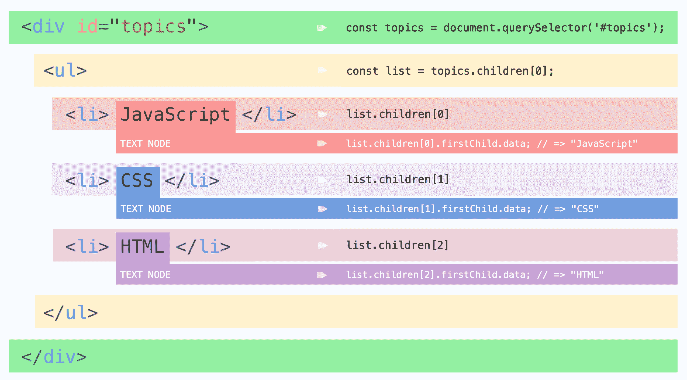
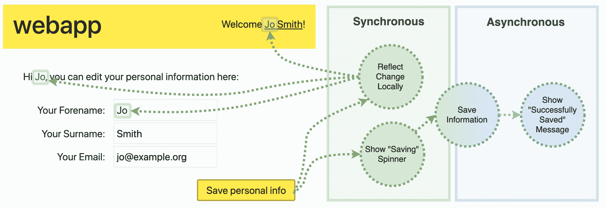
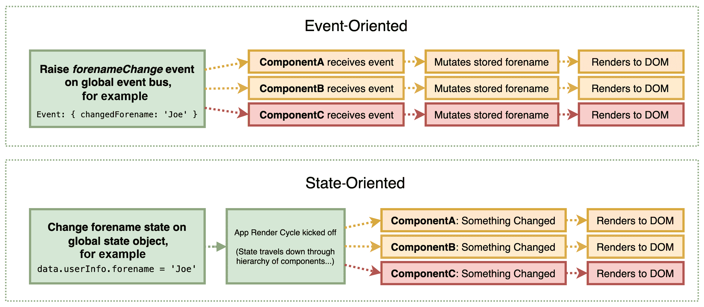

# 第十二章：现实世界的挑战

JavaScript 程序员面临的许多挑战可能不在于语言本身，而在于他们的代码必须存在并与之交互的生态系统。JavaScript 通常用于 Web 的上下文中，无论是在浏览器还是服务器上，因此遇到的问题领域通常以 HTTP 和 DOM 等主题为特征。我们经常不得不应对有时似乎笨拙、不直观和复杂的框架、API 和机制。在本章中，我们将熟悉一些最常见的挑战以及我们可以使用的方法和抽象来克服它们。

我们将首先探讨 DOM 和在 JavaScript 中构建雄心勃勃的单页应用程序（SPA）时固有的挑战。然后，我们将探讨依赖管理和安全性等主题，因为这些在当今的环境中变得越来越重要。本章并不旨在详尽覆盖所有主题，而是快速深入探讨，您可能会发现这些对于在当今的 Web 平台上编写干净的 JavaScript 的重要任务是相关的。

在本章中，我们将涵盖以下主题：

+   DOM 和单页应用程序

+   依赖管理

+   安全性（XSS、CSRF 等）

# DOM 和单页应用程序

文档对象模型（DOM）API 是浏览器提供的，允许开发人员读取和动态改变 Web 文档。在 1997 年首次引入时，它的范围非常有限，但在过去的 20 年里已经大大扩展，使我们现在可以以编程方式访问各种浏览器功能。

DOM 本身向我们展示了从给定页面的解析 HTML 中派生出的元素的层次结构。通过 API，JavaScript 可以访问这个层次结构。这个 API 允许我们选择元素，遍历元素树，并检查元素的属性和特征。以下是一个 DOM 树的示例，以及用于访问它的相应 JavaScript：



多年来，我们访问特定 DOM 节点的方式已经发生了变化，但其基本的树状结构仍然保持不变。通过访问这个结构，我们可以从元素中读取、改变它们，或者确实向元素树中添加内容。

除了 DOM API 之外，还有一系列其他由浏览器原生提供的 API，使得可以进行诸如读取 cookie、改变本地存储、设置后台任务（*workers*）以及操作 CSS 对象模型（CSSOM）等操作。

就在 2012 年，Web 开发人员通常只使用 JavaScript 来增强已经在页面标记中体现的体验。例如，他们可能只是为按钮添加了一个鼠标悬停状态，或者为表单字段添加了验证。这些增强被认为是一种*渐进增强*的类型，用户可以选择在没有 JavaScript 的情况下体验网站，但启用 JavaScript 会在某种程度上增强他们的体验。

渐进增强是一个主张功能对环境约束具有弹性的原则。它告诉我们，我们应该尽量为所有用户提供尽可能多的功能，以适应他们的环境。它通常与优雅降级的概念相配对，即软件在其依赖未满足或部分满足时仍能保持有限的功能（例如，即使在没有 JavaScript 支持的浏览器上，客户端验证的<form>也可以提交，这被称为*优雅降级*）。

然而，如今，前端部分几乎完全由 JavaScript 构建，并在单个*页面*中表达。这些通常被称为 SPA。与让用户自然地在网站上导航，每次操作都在浏览器中加载新页面不同，SPA 将重写当前页面的内容和当前浏览器地址。因此，SPA 依赖于用户的浏览器支持 JavaScript，可能还有其他 API。SPA 通常不会优雅地退化，尽管最佳做法（和明智之举！）是提供一系列备用方案，以便整个受众都能接收功能。

SPA 的普及可以归因于开发者体验和用户体验的提升：

+   **架构（DX）**：前端客户端和后端 API 层之间有更好的*关注点分离*。这可以导致更清晰的架构，有助于将*业务逻辑*与 UI 区分开来。拥有一个统一的代码库来管理渲染和动态增强可以大大简化事情。

+   **状态持久性（UX）**：用户可以在 Web 应用程序中导航和执行操作，而无需丢失页面状态，例如填充的输入字段或滚动位置。此外，UX 可以包括多个不同的窗格、模态框或部分，这些部分可以独立填充并且可以在采取其他操作时保持不变。

+   **性能（UX）**：大部分 HTTP 资源可以在用户的浏览器中加载一次，提高应用程序内进一步操作或导航的性能。也就是说，在应用程序初始加载后，任何进一步的请求都可以优化为简单的 JSON REST 响应，没有不必要的样板标记，因此浏览器花费更少的时间重新解析或重新渲染样板 HTML、CSS 和 JavaScript。

对 Web 应用程序的不断增长的需求和 SPA 的普及意味着程序员更多地依赖浏览器 API，特别是 DOM，来创建丰富和动态的体验。然而，痛苦的事实是，DOM 从未打算满足创建丰富类似桌面的体验。因此，在使 DOM 符合当前需求方面存在许多成长的痛苦。此外，还存在一个缓慢和迭代的过程，即创建能够在最初未设计用于它们的平台上实现丰富体验的框架。

当尝试*将 DOM 绑定到数据*时，DOM（以及浏览器 API 一般）无法满足 SPA 当前的需求，这是最明显的方式。我们现在将更深入地探讨这个话题。

# DOM 绑定和协调

多个框架多年来尝试解决的一个具体挑战是将 DOM 与数据*绑定*起来。我们将在接下来更深入地探讨这个话题。

通过 DOM，我们可以动态创建特定元素并根据需要放置它们。然后用户可以通过与这些元素进行交互来对应用程序施加他们的意图，通常是通过输入字段和按钮。这些用户操作，我们通过 DOM 事件进行绑定，然后可能会影响底层数据的变化。这种变化需要在 DOM 中反映出来。这种*来回*通常被称为*双向绑定*。从历史上看，为了实现这一点，我们通常会手动创建 DOM 树，在元素上设置事件监听器，然后在任何底层数据（或*状态*）发生变化时手动改变这些 DOM 元素。

**提醒**：*状态*是程序的当前*情况*：用户看到的一切以及支持他们所看到的一切。给定应用程序的*状态*可以在多个位置表示，并且这些表示可能变得不同步。我们可以想象这样一种情况，即相同的数据显示在两个地方，但不一致。

我们手动操作 DOM 的挑战在于，没有某种抽象，它就无法很好地扩展。很容易从数据中获取 DOM 树，但是将 DOM 树与数据内部的更改联系起来，并且将数据与用户导出的 DOM 更改联系起来（例如，单击按钮）是相当繁琐的事情。

# DOM 协调

为了说明这一挑战，考虑一个简单的购物清单，由字符串组成的数组形式：

```js
const shoppingList = ['Bananas', 'Apples', 'Chocolate'];
```

从这些数据中派生 DOM 树非常简单：

```js
const ul = document.createElement('ul');
shoppingList.forEach(item => {
  const li = ul.appendChild(document.createElement('li'));
  li.textContent = item;
});
document.body.appendChild(ul);
```

这段代码将生成以下 DOM 树（并将其附加到`<body>`）：

```js
<ul>
  <li>Bananas</li>
  <li>Apples</li>
  <li>Chocolate</li>
</ul>
```

但是如果我们的数据发生了变化会发生什么呢？如果有`<input>`，用户可以通过它添加新项目会发生什么？为了适应这些情况，我们需要实现一个抽象来保存我们的数据，并在数据更改时引发事件（或调用回调）。此外，我们需要一种将每个单独的数据项与 DOM 节点联系起来的方法。如果第一项“香蕉”更改为“甜瓜”，那么我们应该只对 DOM 进行最小的变化以反映这种变化。在这种情况下，我们希望替换第一个`<li>`元素的内部文本节点的`data`属性（换句话说，文本节点中包含的实际文本）：

```js
shoppingList[0] = 'Melons';
ul.children[0].firstChild.data = shoppingList[0];
```

在抽象术语中，这种类型的更改被称为*DOM 协调*，涉及反映在 DOM 中对数据所做的任何更改。协调主要有三种类型：

+   **更新**：如果更新现有的数据项，则应更新相应的 DOM 节点以反映更改

+   **删除**：如果删除现有的数据项，则相应的 DOM 节点也应该被删除

+   **创建**：如果添加了新的数据项，则应创建一个新的 DOM 节点，将其附加到实时 DOM 树的正确位置，然后将其链接为该数据项的相应 DOM 节点

DOM 协调是一个相对简单的过程。我们可以很容易地自己创建`ShoppingListComponent`，并具有更新/添加/删除项目的功能，但它将与数据和 DOM 的结构高度耦合。仅涉及单个更新的逻辑可能涉及，正如我们所见，特定文本节点内容的具体变化。如果我们想稍微更改 DOM 树或数据结构，那么我们必须显着重构我们的`ShoppingListComponent`。

# React 的方法

许多现代库和框架试图通过在声明性接口的背后抽象 DOM 协调过程来减轻这一过程的负担。React 就是一个很好的例子，它允许您使用其 JSX 语法在 JavaScript 中声明 DOM 树。JSX 看起来像常规的 HTML，其中添加了插值分隔符（`{...}`），可以在其中编写常规 JavaScript 来表示数据。

在这里，我们正在创建一个组件，它生成一个简单的带有大写`name`的`<h1>`问候语：

```js
function LoudGreeting({ name }) {
  return <h1>HELLO { name.toUpperCase() } </h1>;
}
```

`LoudGreeting`组件可以这样渲染到`<body>`中：

```js
ReactDOM.render(
  <LoudGreeting name="Samantha" />,
  document.body
);
```

然后会得到以下结果：

```js
<body>
  <h1>HELLO SAMANTHA</h1>
</body>
```

我们可以以以下方式实现`ShoppingList`组件：

```js
function ShoppingList({items}) {
  return (
    <ul>
    {
      items.map((item, index) => {
        return <li key={index}>{item}</li>
      })
    }
    </ul>
  );
}
```

然后我们可以以以下方式渲染它，通过在组件的调用中传递我们特定的购物清单项目：

```js
ReactDOM.render(
  <ShoppingList items={["Bananas", "Apples", "Chocolate"]} />,
  document.body
);
```

这只是一个简单的例子，但它让我们了解了 React 的工作原理。React 真正的魔力在于它有能力根据数据的更改有选择性地重新渲染 DOM。我们可以通过在用户操作时更改数据来探索这一点。

React 和大多数其他框架为我们提供了一个直接的事件监听机制，这样我们就可以以与传统方式相同的方式监听用户事件。通过 React 的 JSX，我们可以做到以下几点：

```js
<button
  onClick={() => {
    console.log('I am clicked!')
  }}
>Click me!</button>
```

在我们的购物清单问题领域中，我们想要创建一个`<input />`，它可以接收用户的新项目。为了实现这一点，我们可以创建一个名为`ShoppingListAdder`的单独组件：

```js
function ShoppingListAdder({ onAdd }) {
  const inputRef = React.useRef();
  return (
    <form onSubmit={e => {
      e.preventDefault();
      onAdd(inputRef.current.value);
      inputRef.current.value = '';
    }}>
      <input ref={inputRef} />
      <button>Add</button>
    </form>
  );
}
```

在这里，我们使用了一个 React Hook（称为`useRef`）来给我们一个持久的引用，我们可以在组件渲染之间重复使用来引用我们的`<input />`。

**React Hooks**（通常命名为`use[Something]`）是 React 的一个相对较新的添加。它们简化了在组件渲染中保持持久状态的过程。每当我们调用`ShoppingListAdder`函数时，都会发生重新渲染。但是`useRef()`将在`ShoppingListAdder`中的每次调用中返回相同的引用。一个单一的 React Hook 可以被认为是 MVC 中的*模型*。

对于我们的`ShoppingListAdder`组件，我们传递了一个`onAdd`回调，我们可以看到每当用户添加了一个新项目（换句话说，当`<form>`提交时）时，它就会被调用。为了使用一个新组件，我们想把它放在`ShoppingList`中，然后在调用`onAdd`时做出响应，向我们的食品列表中添加一个新项目：

```js
function ShoppingList({items: initialItems}) {

  const [items, setItems] = React.useState(initialItems);

  return (
    <div>
      <ShoppingListAdder
        onAdd={newItem => setItems(items.concat(newItem))}
      />
      <ul> 
        {items.map((item, index) => {
          return <li key={index}>{item}</li>
        })}
      </ul>
    </div>
  );
}
```

正如你所看到的，我们使用了另一种称为`useState`的 React Hook 来持久存储我们的项目。`initialItems`可以被传递到我们的组件中（作为参数），但我们可以从中派生一组持久项目，可以在我们的组件重新渲染时自由地改变。这就是我们的`onAdd`回调所做的事情：它将一个新项目（由用户输入）添加到当前项目列表中：


调用`setItems`将在幕后调用我们的组件的重新渲染，导致`<li>Coffee</li>`被附加到实时 DOM 上。创建、更新和删除都是类似处理的。像 React 这样的抽象的美妙之处在于，你不需要把这些变化看作是 DOM 逻辑的不同部分。我们所需要做的就是从我们的一组数据中派生一个组件/DOM 树，React 将找出协调 DOM 所需的精确变化。

为了确保我们理解发生了什么，当通过 Hook 改变了一段数据（*状态*）时（例如，`setItems(...)`），React 会执行以下操作：

1.  React 重新调用组件（重新渲染）

1.  React 将从重新渲染返回的树与先前的树进行比较

1.  React 对所有更改进行了必要的细粒度变化，以反映在实时 DOM 中

其他现代框架也借鉴了这种方法。这些抽象中内置的 DOM 协调机制的一个好处是，通过它们的声明性语法，我们可以从任何给定的数据中得出一个确定性的组件树。这与命令式方法形成鲜明对比，在命令式方法中，我们必须手动选择和改变特定的 DOM 节点。声明性方法给我们带来了功能纯度，使我们能够产生确定性和幂等性的输出。

正如你可能还记得的第四章，*SOLID 和其他原则*，**功能纯度**和**幂等性**给了我们可预测的输入和输出的独立可测试单元。它们使我们能够说*X 输入将始终导致 Y 输出*。这种透明度在我们代码的可靠性和可理解性方面都有很大帮助。

构建大型 Web 应用程序，即使协调问题已经解决，仍然是一个挑战。给定页面中的每个组件或视图都需要填充其正确的数据并传播更改。我们将在下一步探讨这个挑战。

# 消息传递和数据传播

构建 Web 应用程序时，您很快就会遇到一个挑战，即让页面内的不同*部分*或*组件*相互通信。在任何单一时间，您的应用程序应该表示完全相同的数据集。如果发生变化，无论是通过用户操作还是其他机制，都需要在所有适当的位置反映这种变化。

这个问题出现在不同的规模上。您可能有一个*聊天*应用程序，其中输入的消息需要尽快传播给所有参与者。或者您可能有一条数据需要在同一应用程序视图中表示多次，因此所有这些表示都需要保持同步。例如，如果用户在*配置文件设置*窗格中更改他们的名字，那么这应该合理地更新出现他们名字的应用程序中的其他位置。



在传统的非 SPA 中，保存个人信息的按钮将简单地提交一个`<form>`，然后页面将完全重新加载，并且从服务器发送下来的更新状态的全新标记块。在 SPA 中，情况稍微复杂。我们需要将数据提交到服务器，然后以某种方式仅更新页面的相关部分以显示新数据。

为了解决这个问题，我们必须仔细考虑应用程序中数据或*状态*的流动。挑战在于尽快在所有需要表示的地方反映相关数据的*真相来源*。为了实现这一点，我们需要一种让代码库中的不同部分相互通信的方法。在这里，我们可以使用几种范式：

+   基于事件的范式：这意味着具有可以发出和侦听的特定全局事件（例如`userProfileNameChange`）。页面内的任何组件或视图都可以绑定到此事件，并通过更新其内容做出相应反应。因此，*状态*同时存在于许多不同的区域（在各种组件或视图之间）。

+   基于状态的范式：这意味着具有包含用户名字的单一*真相来源*的全局状态对象。这个状态对象，或其中的部分，可以通过组件树递归传递，这意味着在任何更改时，整个组件树都会被新状态*喂养*。因此，*状态*是集中的，但在更改发生时传播。

如果我们考虑用户通过`<input />`更改他们的名字，我们可以设想以下不同的数据流路径，以便所有依赖于名字数据的组件都能得到更新：



从根本上讲，这些方法实现了相同的目标：它们将数据呈现到 DOM 中。不同的关键在于如何在应用程序中传达变化，例如名字的变化，并且数据在任何时候都驻留在哪里：

+   基于事件的范式使数据同时存在于多个位置。因此，如果由于某种原因，其中一个位置未能绑定到该事件的变化，那么您可能会得到不同步的数据表示。

+   基于状态的范式只有一个数据的规范表示，并有效地将其传送到相关的视图或组件，以便它们始终使用最新版本。

面向状态的范式是越来越普遍的方法，因为它使我们能够更清晰地思考我们的数据及其表示方式。我们可以说我们有数据的单一表示，并且我们从该数据派生组件（或 UI）。这是一种功能纯净的方法，因为组件实际上只是数据对给定 UI 的确定性*映射*。由于任何给定组件只关心其输入数据，它不需要对其所在的上下文做太多假设。例如，我们可能有一个`UserInfo`组件，其预期输入为四个值：

```js
{
  forename: 'Leah',
  surname: 'Brown',
  hobby: 'Kites',
  location: 'Edinburgh'
}
```

由于这个组件不依赖于任何全局事件或其他上下文假设，它可以很容易地被隔离。这不仅有助于理解和可维护性，还使我们能够编写更简单的测试。`UserInfo`组件可以被单独提取和测试，而不会与最终所在的应用程序产生相互依赖。

React 是一个流行的框架，用于表达这种面向状态的范式，但许多其他框架也在效仿。在 React 中，结合 JSX，我们可以这样表达我们的`UserInfo`组件：

```js
function UserInfo({ forename, surname, hobby, location }) {
  return (
    <div>
      <h1>User Info</h1>
      <dl>
        <dt>Forename:</dt> <dd>{forename}</dd>
        <dt>Surname:</dt>  <dd>{surname}</dd>
        <dt>Hobby:</dt>    <dd>{hobby}</dd>
        <dt>Location:</dt> <dd>{location}</dd>
      </dl>
    </div>
  );
}
```

在这里，我们可以看到这个组件的输出只是其输入的映射。这样简单的 I/O 案例可以很容易地进行测试和推理。这种美丽的事情可以追溯到**迪米特法则**（**LoD**），我们在[第四章](https://cdp.packtpub.com/clean_code_in_javascript/wp-admin/post.php?post=356&action=edit#post_139)中介绍过，*SOLID 和其他原则*，它告诉我们`UserInfo`组件不需要知道其数据来自何处或者它被使用在哪里；它只需要履行其单一责任：从其四个输入中，它只需要为我们提供一个 DOM 层次结构-干净而美丽。

在现实生活中的 Web 应用程序中，可能存在更多的复杂性，我们无法用我们的名字示例来描绘出来。然而，如果我们记住分离关注点的基础知识，并构建良好隔离和功能纯净的视图或组件，那么我们几乎没有解决不了的挑战。

# 前端路由

在构建 Web 应用程序时，我们可能需要突变用户在浏览器中看到的地址，以反映当前正在访问的资源。这是浏览器和 HTTP 工作的核心原则。HTTP 地址应该代表一个资源。因此，当用户希望更改他们正在查看的资源时，地址应相应地更改。

在浏览器中突变当前 URL 的唯一方法是用户通过`<a href>`或类似的方式导航到不同的页面。然而，当单页应用程序开始变得流行时，JavaScript 程序员需要变得有创造力。在早期，一个流行的*hack*是突变 URL 的哈希部分（`example.org/path/#hash`），这将给用户带来在传统网站上遍历的体验，其中每个导航或操作都会导致新的地址和浏览器历史记录中的新条目，从而使浏览器的后退和前进按钮可用。

谷歌的 Gmail 应用程序在 2004 年推出时，采用了突变 URL 的`#hash`的方法，以便浏览器的地址栏准确地表达您当前正在查看的电子邮件或视图。许多其他单页应用程序也效仿此举。

几年后，幸运的是，历史 API 进入了浏览器，并且现在是在单页应用程序中响应导航或操作时突变地址的标准。具体来说，这个 API 允许我们通过推送新的*状态*或替换当前状态来操纵浏览器会话历史。例如，当用户希望切换到虚构单页应用程序中的`关于我们`视图时，我们可以将其表达为推送到他们历史记录中的新状态，如下所示：

```js
window.history.pushState({ view: 'About' }, 'About Us', '/about');
```

这将立即在浏览器中将地址更改为`'/about'`*.* 通常，调用代码还会引发相关视图的渲染。路由是指呈现新 DOM 和改变浏览器历史记录的这些组合过程的名称。具体而言，路由器负责以下内容：

+   呈现与当前地址对应的视图、组件或页面

+   向其他代码公开接口，以便引发导航

+   监听用户更改的地址（`popstate`事件）

为了说明这些职责，我们可以为一个应用程序创建一个简单的路由器，该应用程序非常简单地在 URL 路径中显示`Hello {color}!`，并在该颜色的背景上方显示该颜色。因此，`/red`将呈现红色背景，并显示文本`Hello red!`。而`/magenta`将呈现品红色背景，并显示文本`Hello magenta!`：


这是我们的`colorRouter`的实现：

```js
const colorRouter = new class {
  constructor() {
    this.bindToUserNavigation();

    if (!window.history.state) {
      const color = window.location.pathname.replace(/^\//, '');
      window.history.replaceState({ color }, color, '/' + color);
    }

    this.render(window.history.state.color);
  }
  bindToUserNavigation() {
    window.addEventListener('popstate', event => {
      this.render(event.state.color);
    });
  }
  go(color) {
    window.history.pushState({ color }, color, '/' + color);
    this.render(color);
  }
  render(color) {
    document.title = color + '!';
    document.body.innerHTML = '';
    document.body.appendChild(
      document.createElement('h1')
    ).textContent = 'Hello ${color}!';
    document.body.style.backgroundColor = color;
  }
};
```

请注意，我们在这里使用了 C*lass Singleton 模式*（如上一章介绍的）。我们的`colorRouter`抽象非常适合这种模式，因为我们需要特定的构造逻辑，并且希望呈现一个单一的接口。我们也可以使用**Revealing Module**模式。

有了这个路由器，我们可以调用`colorRouter.go()`并传入颜色，它会改变地址并按预期渲染：

```js
colorRouter.go('red');
// Navigates to `/red` and renders "Hello red!"
```

即使在这种简单的情况下，我们的路由器也存在一些复杂性。例如，当用户通过传统浏览方式最初登陆页面时，可能通过在地址栏中输入`example.org/red`来实现，历史对象的状态将为空，因为我们尚未通知浏览器会话`/red`与状态`{ color: "red" }`相关联。

为了填充这个初始状态，我们需要获取当前的`location.pathname`（`/red`），然后通过删除初始斜杠来从中提取颜色。您可以在`colorRouter`的构造函数中看到这种逻辑：

```js
if (!window.history.state) {
  const color = window.location.pathname.replace(/^\//, '');
  window.history.replaceState({ color }, color, '/' + color);
}
```

对于更复杂的路径，这种逻辑可能会变得相当复杂。在典型的路由器中，许多不同模式的路径都需要被容纳。因此，通常会使用 URL 解析库来正确提取 URL 的每个部分，并允许路由器正确路由该地址。

在生产路由器中使用一个正确构建的 URL 解析库非常重要。这样的库往往可以适应 URL 中隐含的所有边缘情况，并且最好符合 URI 规范（*RFC 3986*）。一个例子是`URI.js`（在 npm 上可用作`uri-js`）。

多年来，出现了各种不同的路由库和大型框架中的路由抽象。它们在向程序员呈现的接口上略有不同。例如，React Router 允许您通过 JSX 语法将独立路由声明为一系列 React 组件：

```js
function MyApplication() {
  return (
    <Router>
        <Route exact path="/" component={Home} />
        <Route path="/about/:employee" component={AboutEmployee} />
    </Router>
  );
}
```

Vue.js，一个不同的框架，提供了自己独特的路由抽象：

```js
const router = new VueRouter({
  routes: [
    { path: '/', component: Home }
    { path: '/about/:employee', component: AboutEmployee }
  ]
})
```

您可能注意到，在这两个示例中，都指定了 URL 路径为`/about/:employee`。冒号后面跟着给定的标记或单词是指定路径的特定部分是动态的常见方式。通常需要动态响应包含有关特定资源的标识信息的 URL 是合理的。所有以下页面应该产生不同的内容：

+   `/about/john`

+   `/about/mary`

+   `/about/nika`

将这些都指定为单独的路由将是非常繁重的（对于大型数据集几乎不可能），因此路由器总是有一种方式来表达这些动态部分。URL 的分层性质通常也在路由器提供的声明性 API 中得到反映，并且通常允许我们指定要呈现响应这些分层 URL 的组件或视图的层次结构。以下是一个可以传递给 Angular 的 Router 服务的`routes`指定的示例（另一个流行的框架！）：

```js
const routes = [
  { path: "", redirectTo: "home", pathMatch: "full" },
  { path: "home", component: HomeComponent },
  {
    path: "about/:employee",
    component: AboutEmployeeComponent,
    children: [
      { path: "hobbies", component: EmployeeHobbyListComponent },
      { path: "hobbies/:hobby", component: EmployeeHobbyComponent }
    ]
  }
];
```

在这里，我们可以看到`AboutEmployeeComponent`附加到`about/:employee`路径，并且具有每个附加到`hobbies`和`hobbies/:hobby`子路径的子组件。例如`/about/john/hobbies/kayaking`这样的地址直观地呈现`AboutEmployeeComponent`，并在其中呈现`EmployeeHobbyComponent`。

您可能会观察到路由器与呈现是多么交织在一起。确实可能有独立的路由库，但更典型的是框架提供路由抽象。这使我们能够在视图、组件或小部件等框架提供的呈现 DOM 的抽象旁边指定路由。基本上，尽管在表面上不同，所有这些前端路由抽象都将实现相同的结果。

许多 JavaScript 程序员将面临的另一个现实挑战，无论他们主要是在客户端还是服务器端工作，就是依赖管理。我们将在下一节开始探讨这个问题。

# 依赖管理

在单个网页的上下文中加载 JavaScript 曾经很简单。我们可以简单地在文档源代码的某个地方放置一对`<script>`标签，然后就可以了。

多年来，我们的 JavaScript 的复杂性与用户的需求一样大幅增长。随着这一点，我们的代码库也在增长。有一段时间，自然而然地只是不断添加更多的`<script>`标签。然而，在某一点上，这种方法会失败。除了在每个页面加载时进行多个 HTTP 请求的负担外，这种方法还使程序员难以处理他们的依赖关系。在那些日子里，JavaScript 通常要花费时间仔细地安排`<script>`的位置，以便对于任何特定的脚本，它的依赖关系在它自己加载之前就已经准备好了。

以前经常看到这样的 HTML 标记：

```js
<!-- Library Dependencies -->
<script src="/js/libs/jquery.js"></script>
<script src="/js/libs/modernizr.js"></script>

<!-- Util Dependencies -->
<script src="/js/utils/data.js"></script>
<script src="/js/utils/timer.js"></script>
<script src="/js/utils/logger.js"></script>

<!-- App Widget Dependencies -->
<script src="/js/app/widgets/Nav.js"></script>
<script src="/js/app/widgets/Tile.js"></script>
<script src="/js/app/widgets/PicTile.js"></script>
<script src="/js/app/widgets/PicTileImage.js"></script>
<script src="/js/app/widgets/SocialButtons.js"></script>

<!-- App Initialization -->
<script src="/js/app/init.js"></script>
```

从性能的角度来看，这种方法是昂贵的，因为浏览器必须在继续解析和呈现剩余文档之前获取每个资源。因此，HTML 文档的`<head>`中的大量内联脚本被认为是一种反模式，因为它们会阻止用户在相当长的时间内使用网站。即使将脚本移动到`<body>`的底部也不理想，因为浏览器仍然必须按顺序加载和执行它们。

可预见的是，我们日益复杂的应用程序开始超越这种方法。开发人员需要更高的性能和对脚本加载的更精细控制。幸运的是，多年来，在我们管理依赖关系、打包它们以及然后将我们的代码库提供给浏览器方面已经进行了各种改进。

在本节中，我们将探讨多年来发生的改进，并试图了解当前的最佳实践。

# 模块定义-过去和现在

在 2010 年之前（*大约*），在浏览器中加载大型和复杂的 JavaScript 代码库的方法很少达成一致。然而，开发人员很快创建了**异步模块定义**（**AMD**）格式。这是对在 JavaScript 中定义模块的标准的第一次尝试。它包括声明每个模块的依赖关系的能力和异步加载机制。这是对多个内联`<script>`标签的缓慢和阻塞性质的巨大改进。

RequireJS 是一个支持这种格式的流行库。要使用它，您只需要在文档中放置一个单一的入口点`<script>`：

```js
<script data-main="scripts/main" src="scripts/require.js"></script>
```

这里的`data-main`属性将指定我们代码库的入口点，然后加载初始依赖项并初始化应用程序，如下所示：

```js
requirejs([
  "navigationComponent",
  "chatComponent"
], function(navigationComponent, chatComponent) {
    // Initialize:
    navigationComponent.render();
    chatComponent.render();
});
```

然后每个依赖项将`define`自己和自己的依赖项，如下所示：

```js
// The Navigation Component AMD Module
define(
  // Name of the module
  'navigationComponent',

  // Dependencies of the module
  ['utilA', 'utilB'],

  // Definition of the module returned from function
  function (utilA, utilB) {
    return /* Definition of navigationComponent */;
  }
);
```

这在精神上类似于 ECMAScript 规范中现在指定的模块，但 AMD 与任何特定的语言语法无关。这完全是一个由社区驱动的努力，旨在将类似模块的东西带到 JavaScript 中。

AMD 规定每个模块都在回调函数中定义，可以在其中传递依赖项，这意味着加载工具（如 RequireJS）可以异步加载所有依赖项，然后在完成后调用回调函数。这对前端 JavaScript 来说是一个重大提升，因为这意味着我们可以相当轻松地以一种减轻了编写代码过程（减少依赖项处理）并且使代码以非阻塞和更高性能方式加载到浏览器中的方式加载大量依赖图。

与 AMD 类似的时间，一个名为**CommonJS**的新的标准驱动的努力开始出现。这试图使`require(...)`语法成为各种非浏览器环境中的标准，并希望最终该语法也能在前端得到支持。以下是一个 CommonJS 模块的示例（如果您习惯于在 Node.js 中编程，这可能会很熟悉）：

```js
const navigationComponent = require('components/navigation');
const chatComponent = require('components/chat');

module.exports = function() { /* exported functionality */ };
```

这成为了各种非浏览器环境的标准，如 Node.js、SproutCore 和 CouchDB。还可以使用 CommonJS 编译器将您的 CommonJS 模块编译成类似 AMD 的浏览器可消耗的脚本。在此之后，大约在 2017 年，**ES 模块**出现了。这为我们提供了对`import`和`export`语句的语言支持，有效地解决了 JavaScript 中*如何定义模块*的历史挑战。

```js
// ES Modules

import navigationComponent from 'components/navigation';
import chatComponent from 'components/chat';

export default function() { /* do stuff */ };
```

在 Node.js 中，这些模块的文件名后缀必须是`.mjs`而不是`.js`，这样引擎就知道要期望`import`和`export`而不是传统的 CommonJS 模块定义语法。在浏览器中，可以使用`<script type="module">`加载这些模块。然而，即使浏览器支持 ES 模块，在构建和捆绑 JavaScript 成传统的非模块化脚本标签仍然可能更可取。这是由于性能和跨浏览器的兼容性因素。不过不用担心：我们仍然可以在编写代码时使用 ES 模块！诸如 Babel 之类的工具可以用来将最新的 JavaScript 语法编译和捆绑成兼容多个环境的 JavaScript。通常在构建和开发过程中设置 Babel 这样的工具是很典型的。

# npm 和 package.json

过去，JavaScript 社区没有可用的包管理器。相反，个人和组织通常会自行发布代码，使开发人员可以手动下载最新版本。随着 Node.js 和 npm 的引入，一切都发生了变化。最终，有一个中央的包存储库可供轻松地引入我们的项目。这不仅对于服务器端的 Node.js 项目有用，对于完全的前端项目也是如此。npm 的出现很可能是导致 JavaScript 生态系统成熟的最重要事件之一。

现在，几乎每个涉及 JavaScript 的项目都会在顶层`package.json`文件中设置其清单，通常至少指定名称、描述、版本和一个版本化的依赖项列表：

```js
{
  "name": "the-fruit-lister",
  "description": "An application that lists types of fruits",
  "version": "1.0",
  "dependencies": {
    "express": "4.17.1"
  },
  "main": "app/init.js"
}
```

`package.json`中有许多可用字段，因此值得探索 npm 文档以了解所有这些字段。以下是最常见字段的概述：

+   `name`: 包的名称可能是最重要的事情。如果您计划将包发布到 npm，则此名称需要是唯一的。

+   `description`: 这是您的模块的简要描述，以帮助开发人员了解其目的。更详细的信息通常放在`README`或`README.md`文件中。

+   `version`: 这是一个**语义化版本**（**SemVer**）兼容的版本（形式为`[Major].[Minor].[Patch]`，例如`5.11.23`）。

+   `dependencies`: 这是一个将每个依赖包名称映射到版本范围的对象。版本范围是一个字符串，其中包含一个或多个以空格分隔的描述符。依赖项也可以指定为 tarball/Git URL。

+   `devDependencies`: 这在功能上与`dependencies`相同，只是它仅用于开发过程中需要的依赖项，例如代码质量分析器和测试库。

+   `main`: 这可以是指向程序的主要入口点的模块 ID。例如，如果您的包名为`super-utils`，有人安装了它，然后执行了`require("super-utils")`，那么您的`main`模块的导出对象将被返回。

npm 假定您的包和您依赖的任何包都遵循 SemVer 的规则，该规则使用模式`[Major].[Minor].[Patch]`（例如`1.0.2`）。SemVer 规定任何重大更改必须导致*主要*部分增加，而向后兼容的功能添加应该只导致*次要*部分增加，向后兼容的错误修复应该只导致*补丁*部分增加。完整的详细信息可以在[`semver.org/`](https://semver.org/)找到。

在`package.json`所在的目录中运行`npm install`将导致 npm 下载您指定的依赖项的版本。在声明依赖项时，默认情况下，npm 会附加一个插入符(`^`)，这意味着 npm 将选择符合指定主要版本的最新可用版本。因此，如果您指定`¹.2.3`，那么任何`1.99.99`（依此类推）之前的版本都可以被有效安装。

有几个模糊的*版本范围*可以使用：

+   `version`: 必须与`version`完全匹配

+   `>version`: 必须大于`version`

+   `>=version`: 必须大于或等于`version`

+   `<version`: 必须小于`version`

+   `<=version`: 必须小于或等于`version`

+   `~version`: 大约等同于`version`（仅增加`patch`部分）

+   `^version`: 兼容`version`（仅增加`minor/patch`部分）

+   `1.2.x`: `1.2.0`，`1.2.1`等，但不包括`1.3.0`（`x`在这里表示任何内容）

npm 的最大问题可能是未经检查地引入新包及其功能的细粒度导致了具有非常庞大和难以控制的依赖图的项目。并不罕见的是，有些单独的包只导出一个狭窄的实用功能。例如，除了一个通用的*字符串实用程序*包，你可能还会发现一个特定的字符串函数作为一个独立的包，比如*大写*。这些包本身并不是问题，很多包都有有用的用途，但是拥有一个难以控制的依赖图可能会导致自身的问题。任何受到影响或者没有严格遵循 SemVer 规范的流行包都可能导致 JavaScript 生态系统中问题的传播，最终影响到你的项目。

为了防止错误和安全问题，强烈建议使用固定版本来指定你的依赖，并且只有在检查了各自的变更日志后才手动更新依赖。现在，一些工具可以帮助你保持依赖的最新状态，而不会牺牲安全性（例如，由 GitHub 拥有的*dependabot*）。

建议使用一个依赖管理系统，通过加密哈希（一个检查恶意更改的校验和）来确保下载的包的完整性，以确保你最终执行的包确实是你打算安装的包，并且在传输过程中没有被破坏或损坏。Yarn 就是这样一个系统的例子（参见[`yarnpkg.com`](https://yarnpkg.com)）。它实际上是在 npm 之上更安全和高效的抽象。除了更安全之外，Yarn 还有一个额外的好处，就是避免不一致的包解析，这是指给定代码库的两次安装可能会导致一组不同的下载依赖（因为 npm 版本声明的可能模糊性）。这种不一致可能导致同一代码库在两个实例中表现不同（一个巨大的头痛和错误的预兆！）。Yarn 将当前的*锁定*依赖图和相应的版本和校验和存储在一个`yarn.lock`文件中，看起来像这样：

```js
# THIS IS AN AUTOGENERATED FILE. DO NOT EDIT THIS FILE DIRECTLY.
# yarn lockfile v1

array-flatten@1.1.1:
  version "1.1.1"
  resolved "https://registry.yarnpkg.com/array-flatten/-/array-flatten-1.1.1.tgz#9a5f699051b1e7073328f2a008968b64ea2955d2"
  integrity sha1-ml9pkFGx5wczKPKgCJaLZOopVdI=

...
```

在这里，我们只看到一个依赖，但通常会有数百甚至数千个，因为它不仅包括你的直接依赖，还包括这些依赖的依赖。

依赖管理是一个已经有很多文章写过的话题，所以如果你上网搜索，就会发现各种意见和解决方案。从根本上讲，因为我们关心的是清晰的代码，我们应该回到我们的原则。首先，我们在我们的依赖系统和依赖本身中应该寻求的是可靠性、效率、可维护性和可用性。在依赖的上下文中，当涉及到可维护性时，我们对我们能够维护依赖的代码以及依赖的维护者能够保持依赖最新和无 bug 的能力都感兴趣。

# 捆绑和服务

在 JavaScript 的世界中，大约在 AMD 和 CommonJS 开始出现的同时，命令行打包工具和构建工具也开始兴起。这使我们能够将大量的依赖图捆绑成单个文件，可以通过单个`<script>`加载。构建工具的大量出现，比如 GruntJS 和 gulp.js，意味着我们编写的 JavaScript 可以慢慢地朝着清晰和易懂的方向发展，而不是浏览器加载的怪癖。我们还可以开始利用分支语言和子集，比如 CoffeeScript、TypeScript 和 JSX。这样的 JavaScript 适应可以很容易地编译，然后捆绑成完全可操作的 JavaScript 发送到浏览器。

我们现在所处的世界是构建和捆绑工具非常普遍的世界。有一些特定的构建工具，如 Grunt、gulp.js、webpack 和 Browserify。此外，开发人员可以轻松地使用 npm 的`scripts`指令来创建常见命令行指令的快捷方式。

通常，构建涉及对开发代码库进行的任何准备工作，使其能够投入生产使用。这可能包括从清理你的 CSS 到捆绑你的 JavaScript 等任何事情。特别是捆绑，涉及将大型依赖图（JavaScript 文件）编译和整合成单个 JavaScript 文件。这是必要的，这样我们才能以最高效和兼容的方式将 JavaScript 代码库提供给浏览器。捆绑工具通常会输出一个带有文件内容哈希的文件作为文件名的一部分，例如`main-f522dccf1ff37b.js`。然后可以将这个文件名动态或静态地插入到 HTML 中的`<script>`标签中，以便提供给浏览器：

```js
<script src="/main-f522dccf1ff37b.js"></script>
```

在文件名中包含文件内容的哈希值可以确保浏览器始终加载更新的文件，而不依赖于先前缓存的版本。这些文件通常也会被*压缩*。*压缩*涉及解析你的 JavaScript 并生成一个在功能上相同但更小的表示形式，其中已经采取了尽可能少的措施，比如缩短变量名和删除空格和换行符。这与 HTTP 压缩技术（如`.gzip`）结合使用，以确保从服务器到客户端的 HTTP 传输尽可能小和快。通常，你会有不同的*开发*和*生产*构建，因为一些构建步骤，比如压缩，会使开发（和调试！）更加困难。

向浏览器提供捆绑的 JavaScript 通常是通过一个单独的`<script>`标签引用捆绑的 JavaScript 文件名来完成的，放置在你提供给浏览器的 HTML 中的某个位置。在选择方法时有几个重要的性能考虑。最重要的指标是用户从初始请求开始使用应用程序的时间。当加载 superWebApp.example.com 时，用户可能会遇到以下可能的延迟：

+   **获取资源**：每个资源获取可能涉及 DNS 查找、SSL 握手和 HTTP 请求和响应周期的完成。响应通常是流式传输的，这意味着浏览器可能在完成之前开始解析响应。浏览器通常会同时发出适量的请求。

+   **解析 HTML**：这涉及浏览器解析每个标记名称，并逐步构建 HTML 的 DOM 表示。遇到的一些标记会导致一个新的可获取资源被排队，比如``、`<script src>`或`<link type="stylesheet" href>`。

+   **解析 CSS**：这涉及浏览器解析获取的每个 CSS 中的每个规则集。引用的资源，如背景图片，只有在页面上找到相应的元素时才会被获取。

+   **解析/编译 JavaScript**：在获取每个 JavaScript 资源之后，其内容将被解析和编译，准备执行。

+   **应用 CSS 渲染 HTML**：这将理想地只发生一次，当所有 CSS 都已加载时。如果有异步加载的 CSS 或其他美观资源（如字体或图像），那么在页面被认为完全渲染之前可能会有几次重绘/重新渲染。

+   **执行 JavaScript**：根据相应的`<script>`的位置，一段 JavaScript 将执行，然后可能改变 DOM 或执行自己的获取。这可能会阻止其他的获取/解析/渲染发生。

通常情况下，最好在浏览器完成其他所有工作后再执行 JavaScript。然而，这并不总是理想的。一些 JavaScript 可能需要加载重要资源，因此应尽早执行，以便这些 HTTP 获取可以与浏览器的其他准备工作同时进行。

放置主要捆绑的`<script>`（您的`main`代码库）对于确定 JavaScript 何时获取、何时执行以及执行时 DOM 的状态至关重要。

以下是最流行的`<script>`放置位置及其各自的优势：

+   `<head>`中的`<script src>`：遇到`<script>`标签时，此脚本将被获取。获取和执行将按顺序进行，并且会阻止其他解析的进行。这被认为是一种不好的做法，因为它无端地阻止了文档的继续解析（因此从用户的角度增加了页面加载的延迟）。

+   `<body>`末尾的`<script src>`：遇到`<script>`标签时，此脚本将被获取。获取和执行将按顺序进行，并且会阻止其他解析的进行。通常，当`<script>`是`<body>`中的最后一件事时，解析可以被认为是基本完成的。

+   `<head>`中的`<script src defer>`：遇到`<script>`标签时，此脚本将被排队获取，并且此获取将与 HTML 解析同时进行，并且在浏览器方便的时间并发进行。脚本只有在整个文档解析完成后才会执行。

+   `<head>`中的`<script src async>`：遇到`<script>`标签时，此脚本将被排队获取，并且此获取将与 HTML 解析同时进行，并且在浏览器方便的时间并发进行。脚本的执行将在获取后立即进行，并且会阻止继续解析。

通常情况下，在`<head>`中使用`<script defer>`是可取的，因为它可以尽快获取，不会阻止解析，并且只有在解析完成后才会执行。这往往会给用户提供最快的体验，如果您提供了一个单一的捆绑脚本，并且给您的 JavaScript 一个完全解析的 DOM，它可以立即操作和渲染。

向浏览器提供 JavaScript 是一件简单的事情，事实上。只有我们需要网页应用程序快速执行以造福用户的需求才会变得复杂。日益复杂的 JavaScript 代码库会产生越来越大的捆绑包，因此加载这些捆绑包需要时间。因此，JavaScript 的加载性能很可能是您需要认真对待并花时间调查的事情。性能是一件容易被忘记但非常重要的事情。

JavaScript 生态系统中同样容易被忘记的一个话题是安全性，这就是我们现在要探讨的。

# 安全性

安全性是可靠代码库的重要组成部分。用户有一个内在的假设，即任何给定的软件都会按照其功能期望的方式行事，并且不会导致其数据或设备的妥协。*干净的代码*将安全性视为其他功能期望一样重要的要求，应该仔细履行并经过彻底测试。

由于 JavaScript 主要用于网络环境，无论是在服务器端还是客户端，它都存在安全漏洞的可能性。而浏览器实际上是沙盒化的*远程代码执行*工具，这意味着我们的最终用户和我们一样容易受到风险。为了保护自己和用户，我们需要对存在的各种漏洞类型以及如何对抗它们有多方面的了解。关于安全漏洞的信息非常庞大且令人生畏。我们无法希望在本书中涵盖所有内容，但希望如果我们探讨一些常见的漏洞，那么我们将更加谨慎和警觉，并且可以开始理解我们应该采取的措施类型。

# 跨站脚本攻击

**跨站脚本攻击**（**XSS**）是一种漏洞，使攻击者能够将自己的可执行代码（通常是 JavaScript）注入到 Web 应用程序的前端，以便浏览器将其执行为受信任的代码。XSS 可以以许多方式表现，但都可以归结为两种核心类型：

+   **存储型 XSS**：这涉及攻击者以某种方式将可执行代码保存在看似无害的数据中，然后将其持久化到 Web 应用程序中，然后再呈现给 Web 应用程序的其他用户。一个简单的例子是一个社交媒体网站，允许我将我的名字指定为 HTML（例如，`<em>James!</em>`），但没有阻止包含潜在危险的可执行 HTML，允许我指定一个名字，例如`<script>alert('XSS!')...`。

+   **反射型 XSS**：这涉及攻击者向受害者发送 URL 的同时，将可执行有效负载发送到请求中，无论是在 URL、HTTP 标头还是请求正文中。当用户登陆页面时，将执行此可执行有效负载。一个例子是反射查询回到用户的搜索页面（任何搜索页面的常见特征），但以未能转义 HTML 的方式进行，这意味着攻击者只需将其受害者发送到`/search?q=<script>alert('XSS!')...`。

存储或反射的有效负载在页面中的呈现方式至关重要。传统上，XSS 向量仅限于未经转义的用户输入 HTML 的服务器端呈现。因此，如果 Bob 将他的社交媒体账户名称设置为`<script>alert("Bob's XSS")...`，那么当服务器请求 Bob 的页面时，返回的标记将包括该`<script>`，准备由浏览器解析和执行。然而，现在，单页应用程序和涉及客户端呈现的网站更加普遍，这意味着服务器不再因允许未经转义的 HTML 进入文档标记而受到责备，而是客户端（JavaScript 代码库）因将危险内容直接呈现到 DOM 而受到责备。因此，依赖于客户端呈现的 XSS 攻击通常被称为**基于 DOM 的 XSS**。

XSS 有效负载可以采用各种形式。很少是一个简单的`<script>`标签。攻击者使用各种复杂的编码、古老的 HTML，甚至 CSS 来嵌入他们邪恶的 JavaScript。因此，从字符串中清除 XSS 并不是微不足道的，而是建议**绝对不要信任**用户输入的内容。

我们可以想象这样一个场景，我们的 JavaScript 代码库有一个`UserProfile`组件，用于呈现任何用户的名称和个人资料信息。在初始化时，该组件从一个看起来像`/profile/{id}.json`的 REST 端点请求其数据，返回以下 JSON：

```js
{
  "name": "<script>alert(\"XSS...\");</script>",
  "hobby": "...",
  "profielImage": "..."
}
```

然后，该组件通过`innerHTML`将接收到的名称呈现到 DOM 中，而不转义或清理其内容：

```js
class UserProfile extends Component {
  // ...
  render() {
    this.containerElement.innerHTML = `<h1>${this.data.name}</h1>`;
    this.containerElement.innerHTML += `<p>Other profile content...</p>`;
  }
}
```

所有呈现`UserProfile`组件的用户都有可能执行任意（可能有害的）HTML。无论任意 HTML 来自反射还是存储的来源，这都将是一个问题。

常见的 JavaScript 框架的普及使得攻击者只需在库或框架中找到漏洞，就可以攻击成千上万个不同的网站。大多数框架默认情况下都有插值机制，强制插入的数据被呈现为文本而不是 HTML。例如，React 将始终为通过 JSX 的插值定界符（花括号）插入的任何数据生成文本节点。我们可以在这里看到这种效果：

```js
function Stuff({ msg }) {
  return <div>{msg}</div>
}

const msg = '<script>alert("Oh no!");</script>';
ReactDOM.render(<Stuff msg={msg} />, document.body);
```

这导致包含`<script>`的数据被文字直接呈现，因此`<body>`元素的`innerHTML`结果是这样的：

```js
<div>
  <script>alert("Oh no!");</script>
</div>
```

因为潜在危险的 HTML 被呈现为文本，所以不会发生执行，XSS 攻击被阻止了。然而，这并不是 XSS 攻击发生的唯一方式。客户端框架通常有依赖于内联`<script>`标签的模板解决方案，如下所示：

```js
<script type="text/x-template">
  <!-- VueJS Example -->
  <div class="tile" @click="check">
    <div :class="{ tile: true, active: active }"></div>
    <div class="title">{{ title }}</div>
  </div>
</script>
```

这是一种方便的声明模板，用于以后渲染特定组件，但这种模板通常与服务器端渲染和插值结合使用，如果攻击者可以强制服务器将危险字符串插值到模板中，则可能会导致 XSS，如下所示：

```js
<!-- ERB (Rails) Template -->
<script type="text/x-template">
  <!-- VueJS Template -->
  <h1>Welcome <%= user.data.name %></h1>
</script>
```

如果`user.data.name`包含恶意 HTML，则我们的 JavaScript 在客户端无法阻止攻击。当我们渲染我们的代码时，甚至可能已经太迟了。

在现代 Web 应用程序中，我们必须警惕存储或反射的 XSS，在服务器和客户端上都会渲染。这是可能矢量的令人费解的组合，因此至关重要的是确保您使用一系列对策：

+   永远不要相信用户输入的数据。最好不要允许用户输入任何 HTML。如果他们可以，那么使用 HTML 解析库并列出您信任的特定标签和属性。

+   永远不要在 HTML 注释、`<script>`元素、`<style>`元素或应该出现 HTML 标签或属性名称的地方（例如`<HERE ...>`或`<div HERE=...>`）中放置不受信任的数据。如果必须这样做，请将其放在 HTML 元素中，并确保它已完全转义（例如`&` → `&amp;`和`"` → `&quot;`）。

+   如果将不受信任的数据插入常规（非 JavaScript）HTML 属性，则使用`&#xHH;`格式转义所有小于`256`的 ASCII 值。如果插入到常规 HTML 元素的内容中，则转义以下字符就足够了：`&`、`<`、`>`、`"`、`'`和`/`。

+   避免将不受信任的数据插入 JavaScript 执行的区域，例如`<script>x = 'HERE'</script>`或``，但如果您绝对必须这样做，请确保数据已转义，以便它无法打破其引号或包含的 HTML。

+   不要在`<script>`中嵌入 JavaScript 可读数据，而是使用 JSON 将数据传输到客户端，可以通过请求或将其嵌入到`<div>`（确保已完全 HTML 转义！），然后自行提取和反序列化。

+   使用适当限制的**内容安全策略**（**CSP**）（我们将在下一节中解释）。

这些对策并不详尽，因此建议您仔细阅读**开放 Web 应用程序安全项目**（**OWASP**）跨站脚本攻击预防备忘单：[`cheatsheetseries.owasp.org/cheatsheets/Cross_Site_Scripting_Prevention_Cheat_Sheet.html`](https://cheatsheetseries.owasp.org/cheatsheets/Cross_Site_Scripting_Prevention_Cheat_Sheet.html)。

# 内容安全策略

作为额外的安全措施，配置适当的 CSP 也很重要。

CSP 是一个相对较新的 HTTP 标头，在所有现代浏览器上都可用。它 *不* 是普遍支持或受尊重的，因此不应该依赖它作为我们对抗 XSS 的唯一防御。尽管如此，如果正确配置，它可以防止大多数 XSS 漏洞。不支持 CSP 的浏览器将退回到它们的同源策略的默认行为，这本身提供了一定级别的关键安全性。

同源策略是所有浏览器采用的一种重要的安全机制，它限制了文档或脚本在访问其他来源的一些资源时的能力（当它们共享相同的协议、端口和主机时，来源匹配）。这一政策意味着，例如，`leah.example.org` 中的 JavaScript 不能获取 `alice.example.org/data.json`。然而，随着 CSP 的出现，`alice.example.org` 可以通过禁用同源策略来表达对 `leah.example.org` 的信任并提供这样的访问。

`Content-Security-Policy` 标头允许您指定不同类型的资源允许从哪里加载。它本质上是一个浏览器将根据其验证所有传出请求的来源白名单。

它可以被指定为常规的 HTTP 标头：

```js
Content-Security-Policy: default-src 'self'
```

或者可以指定为 `meta` 标签：

```js
<meta http-equiv="Content-Security-Policy" content="default-src 'self'">
```

值的格式是一个或多个策略指令，用分号分隔，每个策略指令以 `fetch` 指令开头。这些指定资源类型（例如 `img-src`、`media-src` 和 `font-src`）或默认（`default-src`），如果它们没有单独指定，所有指令都将回退到默认。fetch 指令后面是一个或多个以空格分隔的来源，其中每个来源指定该资源类型的资源可以从哪里加载。可能的来源包括 URL、协议、`'self'`（指文档自己的来源）等。

以下是一些 CSP 值的示例，以及每个值的解释：

+   `default-src 'self'`：这是最大限度的限制指令，声明只有来自文档本身相同来源的资源才能在文档内加载（无论是来自 ``、`<script>`、XHR 还是其他任何地方）。不允许其他来源。

+   `default-src 'self'; img-src cdn.example.com`：这个指令声明只有来自文档本身相同来源的资源才能被加载，除了图片（例如 `` 和 CSS 声明的图片）可以从 `cdn.example.com` 来加载。

+   `default-src 'self' *.trusted.example.com`：这声明只有来自相同来源的资源 *或* 来自 `*.trusted.example.com` 的资源是有效的。

+   `default-src https://bank.example.com`：这声明只有来自 SSL 安全来源 `https://bank.example.com` 的资源才能被加载。

+   `default-src *; script-src https:`：这声明资源可以从任何有效的 URL 加载，除了 `<script src>` 必须从 HTTPS URL 加载其资源的情况。

适当限制的 CSP 完全取决于您的特定 Web 应用程序、您可能正在处理的用户生成的内容的类型以及您处理的数据的敏感性。适当的 CSP 不仅可以保护您免受创建潜在的 XSS 向量（通过从潜在受损的来源加载）的威胁，还可以帮助抵消执行 XSS 漏洞。CSP 以以下特定方式防御 XSS：

+   CSP 禁用了 `eval()` 和其他类似的技术。这些是 XSS 的常见向量，特别是在旧版浏览器中，这些方法已被用于解析 JSON。如果您愿意，可以通过 `'unsafe-eval'` 源来显式启用 `eval`。

+   CSP 禁用了内联的`<script>`和`<style>`标签，JavaScript 协议以及内联事件处理程序（例如``）。这些都是常见的 XSS 向量。您可以通过为相关的获取指令指定`unsafe-inline`作为源来显式启用这些功能，但建议您从外部来源加载您的脚本和样式，以便浏览器可以根据 CSP 白名单对其来源进行验证。

+   作为最后的努力，如果 CSP 配置良好，它可以防止当前执行的 XSS 加载自己的恶意资源或者使用被破坏的数据进行调用，从而限制其造成的损害。

# 子资源完整性

**子资源完整性**（**SRI**）是浏览器内的一项安全功能，允许我们验证它们获取的资源是否在传递过程中没有受到任何意外的篡改或损害。这种篡改可能发生在资源提供的地方（例如，您的 CDN 被黑客攻击）或者在网络传输过程中（例如，中间人攻击）。

要验证您的脚本，您必须提供一个包含哈希算法名称（例如`sha256`、`sha384`或`sha512`）和哈希本身的完整性属性。以下是一个例子：

```js
<script src="//cdn.example.com/foo.js" integrity="sha384-367drQif3oVsd8RI/DR8RsFbY1fJei9PN6tBnqnVMpUFw626Dlb86YfAPCk2O8ce"></script>
```

要生成该哈希，您可以使用 OpenSSL 的 CLI 如下：

```js
cat FILENAME.js | openssl dgst -sha384 -binary | openssl base64 -A
```

除了在`<script>`上使用完整性属性外，您还可以在`<link>`上使用它来验证 CSS 样式表。要强制执行 SRI，您可以使用有用的 CSP 头部：

```js
Content-Security-Policy: require-sri-for script; require-sri-for style;
```

这样做将确保任何没有完整性哈希的脚本或样式表都无法加载。一旦获取，如果提供的完整性哈希与接收到的文件的哈希不匹配，那么它将被忽略（就好像没有被获取）。使用 SRI 和 CSP 一起可以有效防御 XSS。

# 跨站点请求伪造

**跨站点请求伪造**（**CSRF**）是指命令以 HTTP GET 或 POST 请求的形式从用户端传输，而用户并没有意识到，这是由恶意代码造成的。一个原始的例子是，如果`bank.example.com`的银行网站有一个 API 端点，允许已登录的用户将一定金额转账到指定的账户号码。端点可能如下所示：

```js
POST bank.example.com/transfer?amount=5000&account=12345678
```

即使用户通过`bank.example.com`域上的会话 cookie 进行了身份验证，恶意网站仍然可以轻松地嵌入并提交`<form>`，将转账指向他们自己的账户，如下所示：

```js
<form
  method="post"
  action="//bank.example.com/transfer?amount=5000&account=12345678">
</form>
<script>
  document.forms[0].submit();
</script>
```

无论端点使用何种 HTTP 方法，或者接受何种请求体或参数，除非确保请求来自自己的网站，否则它都容易受到 CSRF 攻击。浏览器内置的同源策略部分解决了这个问题，阻止了某些类型的请求（例如通过 XHR 进行的 JSON POST 请求或 PUT/DELETE 请求），但浏览器内部没有任何机制来防止用户无意中点击链接或提交伪造恶意 POST 请求的表单。毕竟，这些行为正是浏览器的整个目的。

由于 Web 没有内在的机制来防止 CSRF，开发人员已经提出了自己的防御机制。防止 CSRF 的一种常见机制是 CSRF 令牌（实际上应该被称为**反 CSRF 令牌**）。这是一个生成的密钥（随机、长且不可能被猜到），它会随着每个常规请求一起发送到客户端，同时也存储在服务器上作为用户会话数据的一部分。然后服务器将要求浏览器在任何后续的 HTTP 请求中发送该密钥，以验证每个请求的来源。因此，我们的`/transfer`端点现在将有第三个参数，即令牌。

```js
POST bank.example.com/transfer?
  amount=5000&
  account=12345678&
  token=d55lv90s88x9mk...
```

服务器可以验证提供的令牌是否存在于用户的会话数据中。有许多库和框架可以简化此过程。还有许多基本令牌机制的适应和配置。其中一些仅会为特定时间或特定请求周期生成令牌，而其他一些则会为用户整个会话提供一个唯一的令牌。还有许多方法可以将令牌发送到客户端。最常见的方法是在响应有效负载中作为文档标记的一部分，通常以`<meta>`元素的形式出现在`<head>`中：

```js
<head>
  <!-- ... -->
  <meta name="anti-csrf-token" content="JWhpLxPSQSoTLDXm..." />
</head>
```

然后，JavaScript 可以获取这些令牌，并在 JavaScript 动态生成的任何后续 GET 或 POST 请求中发送。或者在没有客户端渲染的传统网站的情况下，CSRF 令牌可以直接嵌入到`<form>`标记中作为隐藏的`<input>`，这自然地成为表单最终提交到服务器的一部分：

```js
<form>
  <input
    type="hidden"
    name="anti-csrf-token"
    value="JWhpLxPSQSoTLDXm..." />

  <!-- Regular input fields here -->

  <input type="submit" value="Submit" />
</form>
```

如果您的 Web 应用程序容易受到 XSS 攻击，那么它也会天然地容易受到 CSRF 攻击，因为攻击者通常会有访问 CSRF 令牌的权限，因此能够伪装成合法请求，而服务器无法区分。因此，强大的反 CSRF 措施本身是不够的：您还必须对其他潜在漏洞采取对策。

无论您使用何种反 CSRF 措施，关键的需要是对每个对用户数据进行变异或执行命令的请求进行验证，以确保其来自 Web 应用程序本身的合法页面，而不是一些恶意构造的外部来源。为了更全面地了解 CSRF 和可用的对策，我建议阅读并充分消化**OWASP 的 CSRF 预防备忘单**：[`cheatsheetseries.owasp.org/cheatsheets/Cross-Site_Request_Forgery_Prevention_Cheat_Sheet.html`](https://cheatsheetseries.owasp.org/cheatsheets/Cross-Site_Request_Forgery_Prevention_Cheat_Sheet.html)。

# 其他安全漏洞

XSS 和 CSRF 只触及了我们应该做好准备的攻击类型的表面。防御所有可能的漏洞是非常具有挑战性的，通常是不现实的，但如果我们不编写能够抵御最普遍漏洞的代码，那就是愚蠢的。对存在的漏洞类型有一个良好的一般了解可以帮助我们在编写代码时保持一般的谨慎。

正如前面所探讨的，XSS 是一种非常多样化的漏洞，有许多可能的攻击向量。但我们可以通过一种一般的方式来防御它，即通过始终正确地区分受信任和不受信任的数据。我们可以通过将不受信任的数据放置在非常特定的位置、正确转义它，并确保我们有适当限制的 CSP 来限制不受信任数据造成破坏的可能性。同样，对于 CSRF，攻击者可以以无数种方式执行它，但拥有一个坚固的反 CSRF 令牌机制将使您免受大部分攻击。在安全领域，鉴于我们有限的资源，我们所能期望的就是能够对抗大多数流行的攻击。

以下是一些其他值得注意的流行漏洞：

+   **SQL 或 NoSQL 注入**：任何用户提交的数据，如果未正确转义，都可能使攻击者访问您的数据并能够读取、修改或销毁数据。这类似于 XSS，因为两者都是*注入攻击*的形式，所以我们对其的防御又一次归结为识别不受信任的数据，然后正确转义它。

+   **身份验证/密码攻击**：攻击者可以通过猜测密码、暴力破解组合或使用彩虹表（常见密码哈希的数据库）来未经授权地访问用户的帐户。一般来说，最好不要创建自己的身份验证机制，而是依赖于可信的库和框架。您应该始终确保使用安全的哈希算法（如*bcrypt*）。一个很好的资源是 OWASP 的**密码存储备忘单**（[`cheatsheetseries.owasp.org/cheatsheets/Password_Storage_Cheat_Sheet.html`](https://cheatsheetseries.owasp.org/cheatsheets/Password_Storage_Cheat_Sheet.html)）。

+   **依赖劫持**：攻击者可以通过劫持您的依赖之一来获得对您的服务器端或前端代码库的访问权限。他们可能会获得对您依赖图中存在的 npm 包的访问权限（在网上搜索*left-pad 事件*），或者损害您用于存储 JavaScript 资产的 CMS 或 CDN。为了对抗这些类型的漏洞，确保您使用安全的包管理系统，如 Yarn，尝试在`package.json`中使用固定版本模式，始终检查更改日志，并在前端使用适当限制的 CSP，以防止任何恶意代码调用主页。

总是存在被攻击的可能性，因此我们需要将这种风险纳入我们的系统设计中。我们不能指望对这些漏洞免疫，但当它们发生时，我们可以确保我们能够快速修复它们，与受影响的用户透明沟通，并确保我们仔细考虑如何防止这些漏洞再次发生。

无论我们是为开发人员创建框架还是为非技术用户创建 UI，我们的代码使用者总是期望它能够安全地运行。这种期望越来越多地被编码到法律中（例如，在欧盟法律中的《通用数据保护条例》（GDPR）），因此认真对待并花费大量时间学习和预防是至关重要的。安全实践是另一个例子，说明干净的代码不仅仅关乎我们的语法和设计模式，还关乎我们的代码如何显著地影响我们的用户和他们的日常生活。

# 总结

在本章中，我们探讨了各种现实世界的挑战——任何 JavaScript 程序员在浏览器和服务器上都可能面临的话题。在 JavaScript 中编写干净的代码不仅仅是关于语言本身，还涉及到它存在的网络生态和这带来的需求。通过我们对 DOM、路由、依赖管理和安全性的探索，我们希望能够深入了解 JavaScript 经常处理的问题领域的技术细节，并对存在的许多框架、库和标准驱动的 API 有所了解，以帮助我们解决这些问题。

在下一章中，我们将深入探讨编写干净测试的艺术，这是一项至关重要的任务，不仅因为它让我们对自己的代码充满信心，还因为它确保了用户对我们软件的合理期望的可靠性。
