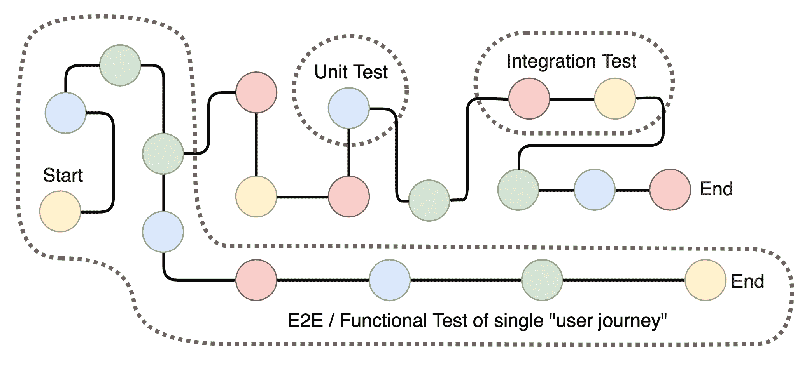

# 第十三章：测试的景观

在本书的开头，我们阐明了清晰代码的主要原则。其中之一是可靠性。确认可靠性的最佳方法莫过于让您的代码库持续和多样化地接受使用。这意味着真正的用户坐在您的软件前并使用它。只有通过这种类型的暴露，我们才能了解我们的代码是否真正实现了它的目的。然而，经常进行这种现实生活测试通常是不合理的，甚至可能是危险的。如果代码发生变化，用户依赖的某个功能可能出现故障或退化。为了防止这种情况，并且通常确认我们的期望是否得到满足，我们编写测试。如果没有一套好的测试，我们就 passively and arrogantly closing our eyes and hoping that nothing goes wrong。

在本章中，我们将涵盖以下主题：

+   什么是测试？

+   测试类型

+   **测试驱动开发**（**TDD**）

# 什么是测试？

软件测试是一个自动化的程序，它对一段代码进行断言，然后将这些断言的成功报告给您。测试可以对任何东西进行断言，从一个单独的函数到整个功能的行为。

测试，就像我们的其他代码一样，涉及抽象和细节的层次。如果我们要抽象地测试一辆汽车，我们可能只是寻求断言以下属性：

+   它有四个轮子

+   它有一个方向盘

+   它能开车

+   它有一个工作的喇叭

显然，这对汽车工程师来说并不是一个非常有用的断言集，因为这些属性要么非常明显，要么描述不足。断言“它能开车”很重要，但如果没有额外的细节，它所表达的只是一个通用的业务目标。这类似于项目经理要求软件工程师确保用户登录门户，例如，可以让用户成功登录。工程师的工作不仅是实现用户登录门户，还要得出成功调查断言用户可以成功登录的工作测试。从通用陈述中得出好的测试并不总是容易的。

要正确地设计一个测试，我们必须将通用和抽象的要求提炼到它们的细节和非抽象的细节。例如，当我们断言我们的汽车“有一个工作的喇叭”时，我们可以这样提炼：

当驾驶员至少举起一只手并指示手按下方向盘中心 1 秒钟，汽车将发出大约 107 分贝的固定频率为 400 赫兹的响亮声音 1 秒钟。

当我们开始为我们的断言添加关键细节时，它们对我们变得有用。我们可以将它们用作实施的指南和功能的确认。即使有了这些额外的细节，我们的陈述仍然只是一个断言或*要求*。这些要求是软件设计中的一个有用步骤。事实上，我们应该非常不愿意在具体性达到这种程度之前开始实施软件。

例如，如果客户要求您实施一个付款表单，收集确切的要求是明智的：它应接受哪些类型的付款？还需要收集哪些其他客户信息？我们在存储这些数据时受到什么法规或约束？这些扩展的要求随后成为我们和客户将衡量完整性的标准。因此，我们可以将这些要求作为单独的测试来实施，以确认它们在软件中的存在。

一个良好的测试方法将涉及对代码库所有不同部分的测试，并将提供以下好处：

+   **证明实现**：测试使我们能够向自己和利益相关者证明期望和要求得到满足。

+   **拥有** **信心**：测试使我们和我们的同事对我们的代码库有信心，既能正确运行，又能容纳变化而不会出现我们不知道的故障。

+   **分享** **知识**：测试允许我们分享关于代码部分如何运作的重要知识。在某种意义上，它们是一种文档形式。

良好的测试方法还有许多二阶效应。同事对代码库的增加信心将意味着您可以更快地进行更大的变更，从而在长远来看削减成本和痛苦。知识的共享可以使您的同事和用户更快地执行操作，更加理解，减少时间和费用的开销。证明实现目标的能力使团队和个人能够更好地向利益相关者、管理者和用户传达他们工作的价值。

现在我们已经讨论了测试的明显好处，我们可以讨论如何编写测试。每个测试的核心都是一组断言，所以我们现在将探讨我们所说的断言以及如何使用断言来编码我们的期望。

# 简单的断言

测试有许多工具、术语和测试范式。这么多复杂性的存在可能看起来令人生畏，但重要的是要记住，从本质上讲，测试实际上只是关于对某些东西的工作方式进行断言。

可以通过表达特定结果来以编程方式进行断言，如下例所示，要么是`SUCCESS`，要么是`FAILURE`：

```js
if (sum(100, 200) !== 300) {
  console.log('SUCCESS! :) sum() is not behaving correctly');
} else {
  console.log('FAILURE! :( sum() is behaving correctly');
}
```

在这里，如果我们的`sum`函数没有给出预期的输出，我们将收到`FAILURE!`的日志。我们可以通过实现一个`assert`函数来抽象这种成功和失败的模式，如下所示：

```js
function assert(assertion, description) {
  if (assertion) {
    console.log('SUCCESS! ', description);
  } else {
    console.log('FAILURE! ', description);
  }
}
```

然后可以使用这个日志进行一系列的断言并添加描述：

```js
assert(sum(1, 2) === 3, 'sum of 1 and 2 should be 3');
assert(sum(5, 60) === 65, 'sum of 60 and 5 should be 65');
assert(isNaN(sum(0, null)), 'sum of null and any number should be NaN');
```

这是任何测试框架或库的基本核心。它们都有一种机制来进行断言，并报告这些断言的成功和失败。测试库通常也提供一种机制来包装或包含相关的断言，并一起称之为*测试*或*测试用例*。我们可以通过提供一个测试函数来做类似的事情，允许您传递描述和函数（包含断言）：

```js
function test(description, assertionsFn) {
  console.log(`Test: ${description}`);
  assertionsFn();
}
```

然后我们可以这样使用它：

```js
test('sum() small numbers', () => {
  assert(sum(1, 2) === 3, 'sum of 1 and 2 should be 3');
  assert(sum(0, 0) === 0, 'sum of 0 and 0 should be 0');
  assert(sum(1, 8) === 9, 'sum of 1 and 8 should be 9');
});

test('sum() large numbers', () => {
  assert(
    sum(1e6, 1e10) === 10001000000,
    'sum of 1e6 and 1e10 should be 10001e6'
  );
});
```

运行后生成的测试日志如下：

```js
> Test: sum() small numbers
> SUCCESS! sum of 1 and 2 should be 3
> SUCCESS! sum of 0 and 0 should be 0
> SUCCESS! sum of 1 and 8 should be 9
> Test: sum() large numbers
> SUCCESS! sum of 1e6 and 1e10 should be 10001e6
```

从技术角度来看，编写断言和简单测试并不太具有挑战性。为单个函数编写测试很少会很困难。然而，要编写完整的测试套件并彻底测试代码库的所有部分，我们必须利用更复杂的测试机制和方法来帮助我们。

# 许多移动部件

回想汽车类比，让我们想象我们面前有一辆汽车，我们希望测试它的喇叭。喇叭不是一个独立的机械部件。它嵌入在汽车内部，并且依赖于一个与其本身分离的电源。事实上，我们可能会发现，在喇叭工作之前，我们必须先通过点火启动汽车。而点火的成功本身取决于其他几个组件，包括工作的点火开关、油箱中的燃料、工作的燃油过滤器和未耗尽的电池。因此，喇叭的功能取决于许多移动部件。因此，我们对喇叭的测试不仅仅是对喇叭本身的测试，而实际上是对几乎整个汽车的测试！这并不理想。

为了解决这个问题，我们可以将喇叭连接到一个单独的电源供应上，只用于测试目的。通过这样做，我们隔离了喇叭，使测试只反映喇叭本身的功能。在测试世界中，我们使用的这个**替身**电源供应可能被称为**存根**或**模拟**。

在软件世界中，*存根*和*模拟*都是一种代替*真实*抽象的类型，它提供适当的输出，而不执行被替换抽象的真实工作。一个例子是`makeCreditCardPayment`存根，它返回`SUCCESS`，而不创建真实的支付。这可能在测试电子商务功能的上下文中使用。

我们隔离喇叭电源的方法不幸地存在缺陷。即使我们的测试成功了，喇叭能够工作，我们也没有保证喇叭连接到汽车真正的电源时仍然能够工作。对喇叭的隔离测试仍然有用，因为它告诉我们喇叭特定电路和机制内的任何故障，但它本身是不够的。我们需要测试喇叭在实际情况下的工作情况，即依赖其他组件。在软件中，我们称这样的实际测试为**集成测试**或**端到端测试**，而隔离测试通常称为**单元测试**。有效的测试方法将始终包括这两种类型：


在测试时隔离各个部分存在风险，可能会创建一个不真实的场景，最终你实际上并没有测试代码库的真实功能，而是测试了你的模拟的有效性。在这里，以我们的汽车类比为例，通过提供一个*模拟*电源来隔离喇叭，使我们能够纯粹地测试喇叭的电路和发声机制，并为我们提供了一条明确的调试路径，如果测试失败的话。但我们需要通过几个集成测试来补充这个测试，以便我们可以确信整个系统正常工作。即使我们对系统的所有部分进行了一千次单元测试，也不能保证没有测试所有这些部分的集成的工作系统。

# 测试类型

为了确保代码库经过了彻底的测试，我们必须进行不同类型的测试。正如前面提到的，*单元*测试使我们能够测试隔离的部分，而各种部分的组合可以通过**集成**、**功能**或**端到端**测试进行测试。首先了解我们谈论*部分*或*单元*时的含义是很有用的。

当我们谈论代码的一个单元时，概念上有一些模糊。通常，它将是系统内具有单一职责的代码片段。当用户希望通过我们的软件执行操作时，实际上他们将激活我们代码的一系列部分，所有这些部分一起工作以给用户提供他们所需的输出。考虑一个用户可以创建和分享图像的应用程序。典型的用户体验（流程或旅程）可能涉及几个不同的步骤，所有这些步骤都涉及代码库的不同部分。用户执行的每个操作，通常在他们不知情的情况下，都将包含一系列代码操作：

1.  （用户）通过上传存储在桌面上的照片创建新图像：

1.  （代码）通过`<form>`上传照片

1.  （代码）将照片保存到 CDN

1.  （代码）在`<canvas>`中显示位图，以便应用滤镜

1.  （用户）对图像应用滤镜：

1.  （代码）通过`<canvas>`像素操作应用滤镜

1.  （代码）更新存储在 CDN 上的图像

1.  （代码）重新下载保存的图像

1.  （用户）与朋友分享图像：

1.  （代码）在数据库中查找用户的*朋友*

1.  （代码）将图像添加到每个朋友的动态中

1.  （代码）向所有朋友发送*推送通知*

所有这些步骤，再加上用户可能采取的所有其他步骤，可以被视为一个系统。一个经过充分测试的系统可能涉及对每个单独步骤进行**单元**测试，对每对步骤进行**集成**测试，以及对形成*用户流*或*用户旅程*的每个步骤组合进行**功能**或**端到端**（**E2E**）测试。我们可以将可能需要作为系统一部分存在的测试类型可视化如下：



在这里，我们可以看到一个**开始**点和两个**结束**点，表示两个不同的*用户旅程*。每个点可以被视为一个单独的责任区域或*单元*，作为这些旅程的一部分被激活。正如您所看到的，单元测试只关注一个单一的责任区域。集成测试关注两个（或更多）相邻的整合区域。而 E2E 或功能测试关注涉及单一用户旅程的所有区域。在我们图像分享应用的前面例子中，我们可以想象我们可能有特定的单元测试，例如将照片上传到 CDN 或发送推送通知的操作，一个测试朋友数据库整合的集成测试，以及一个测试从创建到分享新图像的整个流程的 E2E 测试。这些测试方法对确保一个真正经过充分测试的系统至关重要，每种方法都有其独特的好处以及需要克服的缺点和挑战。

# 单元测试

正如我们在汽车类比中所描述的，单元测试是处理孤立的代码*单元*的测试。这通常是一个单一的函数或模块，将对代码的操作进行一个或多个简单的断言。

以下是一些单一单元测试场景的示例：

+   您有一个`Button`组件，应该包含值`Submit My Data`，并且应该有一个`btn_success`类。您可以通过简单的单元测试来断言这些特征，检查生成的 DOM 元素的属性。

+   您有一个任务调度实用程序，它将在请求的时间执行给定的操作。您可以通过给它一个在特定时间执行的任务，然后检查该任务的成功执行来断言它是否这样做。

+   您有一个 REST API 端点`/todo/list/item/{ID}`，它从数据库中检索特定的项目。您可以通过模拟数据库抽象（提供虚假数据），然后断言请求 URL 是否正确返回您的数据来断言该路由是否正常工作。

逐个测试代码单元的几个好处：

+   **完整性：** 给定的单元通常会有一小部分明确定义的要求。因此，很容易确保您正在测试单元功能的全部范围。所有输入变化都可以很容易地进行测试。还可以测试每个单元的极限，包括通常复杂的操作细节。

+   **可报告性：** 当给定的单元测试失败时，您可以很容易地辨别失败的确切性质和情况，这意味着更快地调试和修复潜在问题。这与我们将发现的集成测试形成对比，后者可能具有更通用的报告，无法指示代码中失败的确切点。

+   **理解：** 单元测试是给定模块或函数的有用且独立的文档形式。单元测试的狭窄性和特定性帮助我们充分理解某些东西的工作原理，从而便于维护。当其他地方没有最新的文档时，这是特别有用的。

*完整性*在这里类似于流行的*测试覆盖率*概念。关键的区别在于，虽然覆盖率是关于最大化测试代码库中的代码量，完整性是关于最大化每个单元的覆盖率，以便表达单元的整个输入空间。作为一个度量标准，测试覆盖率只告诉我们是否进行了测试，而不告诉我们是否测试得很好。

然而，单元测试也存在挑战：

+   **正确模拟**：创建正确隔离的单元测试有时意味着我们必须构建其他单元的模拟或存根，就像我们之前讨论的汽车类比一样。创建逼真的模拟并确保你没有引入新的复杂性和潜在故障有时是具有挑战性的。

+   **测试真实输入**：编写提供各种真实输入的单元测试是关键，尽管这可能是具有挑战性的。很容易陷入编写看似给予信心但实际上不测试代码在生产中可能出现的情况的测试的陷阱。

+   **测试真正的单元而不是组合**：如果不小心构建，单元测试可能会变得臃肿并变成集成测试。有时，一个测试在表面上看起来非常简单，但实际上取决于表面下一系列的集成。举个例子，如果我们试图在隔离其电路之前进行简单的单元测试来断言汽车喇叭的声音，那么我们将不知不觉地创建一个端到端测试。

作为最细粒度的测试类型，单元测试对于任何代码库都是至关重要的。最容易将其视为一种复式记账系统。当你进行更改时，你必须通过断言来反映这种变化。这种实现-测试循环最好是在接近的时间内进行——一个接一个地进行——可能通过 TDD，这将在后面讨论。单元测试是你确认自己真正写了你打算写的代码的方式。它提供了一定程度的确定性和可靠性，你的团队和利益相关者会非常感激。

# 集成测试

集成测试，顾名思义，涉及到代码的不同*单元*的集成。与简单的单元测试相比，集成测试将为您提供有关您的软件在生产中的运行方式的更有用的信号。在我们的汽车类比中，集成测试可能会根据它与汽车自己的电源供应的操作方式来断言喇叭的功能，而不是提供模拟电源供应。然而，它可能仍然是一个部分隔离的测试，确保它不涉及汽车内的所有组件。

以下是可能的集成测试的一些例子：

+   你有一个`Button`组件，当点击时应该向列表中添加一个项目。一个可能的集成测试是在真实 DOM 中渲染组件，并检查模拟的`click`事件是否正确地将项目添加到列表中。这测试了`Button`组件、DOM 和确定何时向列表中添加项目的逻辑之间的集成。

+   你有一个 REST API 路由`/users/get/{ID}`，它应该从数据库中返回用户配置文件数据。一个可能的集成测试是创建一个 ID 为`456`的真实数据库条目，然后通过`/users/get/456`请求数据。这测试了 HTTP 路由抽象和数据库层之间的集成。

集成模块和测试它们的行为一起有很多优势：

+   **获得更好的覆盖率**：集成测试将一个或多个集成模块作为测试对象，因此通过这样的测试，我们可以增加代码库中的“测试覆盖率”，这意味着我们正在增加代码的测试覆盖范围，从而增加我们捕捉故障的可能性。

+   **清晰地看到故障**：在一定程度上模拟我们在生产中可能看到的模块集成，使我们能够看到实际发生的集成故障和失败。对这些故障的清晰视图使我们能够快速进行修复并保持可靠的系统。

+   **暴露错误的期望**：集成测试使我们能够挑战在构建单个代码单元时可能做出的假设。

因此，虽然单元测试给我们提供了对特定模块和函数的输入和输出的狭窄和详细的视图，但集成测试使我们能够看到所有这些模块如何一起工作，并通过这样做，为我们提供了对集成潜在问题的视图。这是非常有用的，但编写集成测试也存在陷阱和挑战：

+   **隔离集成**（避免大爆炸测试）：在实施集成测试时，有时更容易避免隔离单个集成，而是只测试系统的一个大部分，所有集成都完整。这更类似于端到端测试，当然很有用，但同样重要的是也要有隔离的集成，以便您可以更精确地了解潜在的失败。

+   **真实的集成**（例如，数据库服务器和客户端）：在选择和隔离要测试的集成时，有时很难创建真实的情况。例如，测试您的 REST API 如何与数据库服务器集成，但是在测试目的上没有单独的数据库服务器，只有一个本地数据库服务器。这仍然是一个有见地的测试，但因为它没有模拟数据库服务器的远程性（在生产中存在），您可能会产生错误的信心。可能会有潜在的失败潜伏，未被发现。

集成测试在决定代码库的所有单独部分如何作为一个系统一起工作的关键接口和 I/O 的关键点提供了重要的洞察。集成测试通常提供了关于系统潜在故障的最明显的信号，因为它们通常运行速度快，并且在失败时非常透明（不像潜在笨重的端到端测试）。当然，集成测试只能告诉您它们封装的集成点的信息。为了更完全地对系统功能的信心，始终使用端到端测试是一个好主意。

# 端到端和功能测试

端到端测试是集成测试的一种更极端的形式，它不是测试模块之间的单个集成，而是测试整个系统，通常通过执行一系列在现实中会发生的操作来产生给定的结果。这些测试有时也被称为**功能测试**，因为它们致力于从用户的角度测试功能区域。构建良好的端到端测试使我们确信整个系统正常工作，但当与更粒度的单元和集成测试结合使用时，可以更快速和准确地识别故障。

以下是编写端到端测试的好处的简要概述：

+   **正确性和健康**：端到端测试为您提供了对系统整体健康状况的清晰洞察。由于许多单独的部分将通过典型的端到端测试进行有效测试，其成功可以给您一个良好的指示，表明在生产中一切都正常。粒度单元或集成测试虽然在其自身的方式上非常有用，但无法给您这种系统洞察力。

+   **真实的效果**：通过端到端测试，我们可以尝试更真实的情况，模拟我们的代码在野外运行的方式。通过模拟典型用户的流程，端到端测试可以突出显示更粒度的单元或集成测试可能无法揭示的潜在问题。例如，当存在竞争条件或其他时间问题时，只有当代码库作为一个整体系统运行时才能揭示这些问题。

+   **更全面的视角**：E2E 测试为开发人员提供了系统的视角，使他们能够更准确地推断出不同模块如何共同产生工作的用户流程。当试图建立对系统操作方式的全面理解时，这是非常有价值的。与单元测试和集成测试一样，E2E 测试也可以作为一种文档形式。

然而，制作 E2E 测试也存在挑战：

+   **性能和时间成本**：E2E 测试涉及激活许多个别代码片段并置身于真实环境中，因此在时间和硬件资源方面可能会非常昂贵。E2E 测试运行所需的时间可能会妨碍开发，因此团队为了避免开发周期变慢，避免 E2E 测试并不罕见。

+   **真实的步骤**：在 E2E 测试中准确模拟真实生活中的情况可能是一种挑战。使用虚假或捏造的情况和数据仍然可以提供足够真实的测试，但也可能给你一种虚假的信心。由于 E2E 测试是脚本化的，不仅依赖于虚假数据是相当常见的，而且还可能以一种不真实的快速或直接的方式进行操作，错过了通过创建更人性化情况获得的可能的见解（重复：*永远考虑用户*）。

+   **复杂的工具**：E2E 测试的目的是真实地模拟用户在实际环境中的流程。为了实现这一点，我们需要良好的工具，使我们能够建立真实的环境（例如，无头浏览器和可编写脚本的浏览器实例）。这样的工具可能存在 bug 或者使用起来很复杂，并且可能会引入另一个变量到测试过程中，导致不真实的失败（工具可能会给出关于事物是否真正工作的错误信号）。

尽管 E2E 测试很难做到完美，但它可以提供一种洞察和信心，这是仅仅通过单元测试和集成测试很难获得的。在自动化测试程序方面，E2E 测试是我们可以合理获得软件真实用户反馈的最接近方式。这是最不精细、最系统化的方式来判断我们的软件是否按照用户的期望工作，这毕竟是我们最感兴趣的。

# 测试驱动开发

TDD 是一种在实现之前编写测试的范式。通过这样做，我们的测试最终会影响我们实现的设计和接口。通过这样做，我们开始将测试视为不仅是一种文档形式，而且是一种规范形式。通过我们的测试，我们可以指定我们希望某些功能的工作方式，编写断言，就好像功能已经存在一样，然后我们可以逐步构建实现，使我们所有的测试最终都通过。

为了说明 TDD，让我们想象一下我们希望实现一个单词计数功能。在实现之前，我们可以开始写一些关于它如何工作的断言：

```js
assert(
  wordCount('Lemonade and chocolate') === 3,
  '"Lemonade and chocolate" contains 3 words'
);

assert(
  wordCount('Never-ending long-term') === 2,
  'Hyphenated words count as singular words'
);

assert(
  wordCount('This,is...a(story)') === 4,
  'Punctuation is treated as word boundaries'
);
```

这是一个非常简单的函数，所以我们只用了三个断言来表达它的大部分功能。当然还有其他边缘情况，但我们已经拼凑出了足够的期望，可以开始实现这个函数了。这是我们的第一次尝试：

```js
function wordCount(string) {
  return string.match(/[\w]+/g).length;
}
```

立即通过我们的小测试套件运行这个实现，我们收到了以下结果：

```js
SUCCESS! "Lemonade and chocolate" contains 3 words
FAILURE! Hyphenated words count as singular words
SUCCESS! Punctuation is treated as word boundaries
```

`连字符单词`测试失败了。TDD 的本质是期望通过迭代的失败和重构来使实现与测试套件保持一致。鉴于这个特定的失败，我们可以简单地在正则表达式的字符类中添加一个连字符（在`[...]`分隔符之间）：

```js
function wordCount(string) {
  return string.match(/[\w-]+/g).length;
}
```

这产生了以下的测试日志：

```js
SUCCESS! "Lemonade and chocolate" contains 3 words
SUCCESS! Hyphenated words count as singular words
SUCCESS! Punctuation is treated as word boundaries
```

成功！通过逐步迭代，尽管为了说明简化，我们已经通过 TDD 实现了一些东西。

正如你可能已经观察到的，TDD 并不是一种特定类型或风格的测试，而是一种关于*何时*、*如何*和*为什么*进行测试的范式。传统观点认为测试是事后的想法，这种观点是有限的，通常会迫使我们处于这样一种境地：我们根本没有时间编写一个好的测试套件。然而，TDD 迫使我们以一个完整的测试套件为先导，给我们带来了一些显著的好处：

+   它指导实施

+   它优先考虑用户

+   它强制进行完整的测试覆盖

+   它强制单一责任

+   它能够快速发现问题领域

+   它给予你即时反馈

TDD 在开始测试时是一种特别有用的范式，因为它会迫使你在实施之前退后一步，真正考虑你想要做什么。这个规划阶段对于确保我们的代码与用户期望完全一致非常有帮助。

# 总结

在本章中，我们介绍了测试的概念以及它与软件的关系。虽然简短和入门级，但这些基础概念对于我们以可靠性和可维护性为目标进行测试是至关重要的。测试，就像软件世界中的许多其他问题一样，可能会容易地变成一种迷信，因此保持对我们编写的测试背后的基本原理和理论的视角至关重要。测试，本质上是关于证明期望和防范故障的。我们已经讨论了单元测试、集成测试和端到端测试之间的区别，讨论了每种测试中固有的优势和挑战。

在下一章中，我们将探讨如何将这些知识应用于制定干净的测试和实际示例。具体来说，我们将介绍我们可以使用哪些措施和指导原则来确保我们的测试和其中的断言是可靠的、直观的和最大程度有用的。
