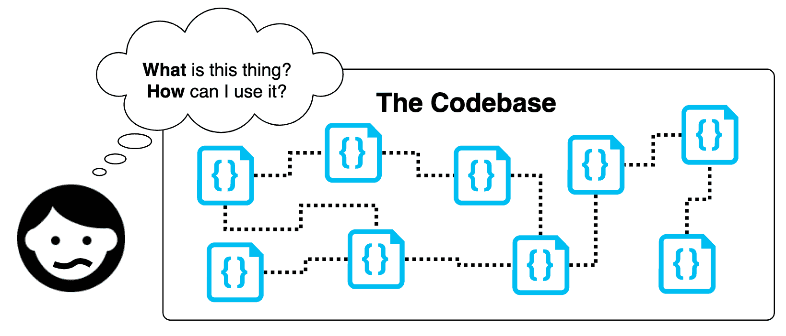
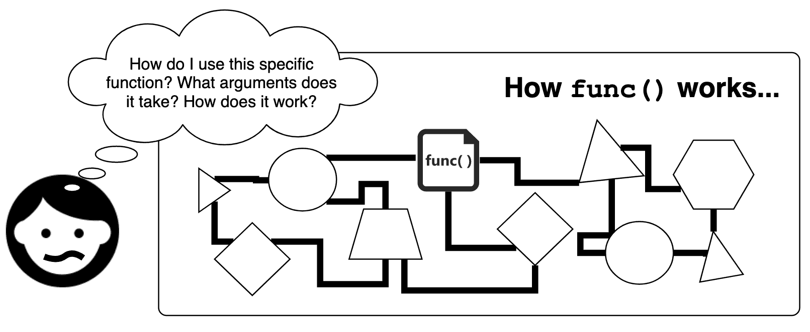
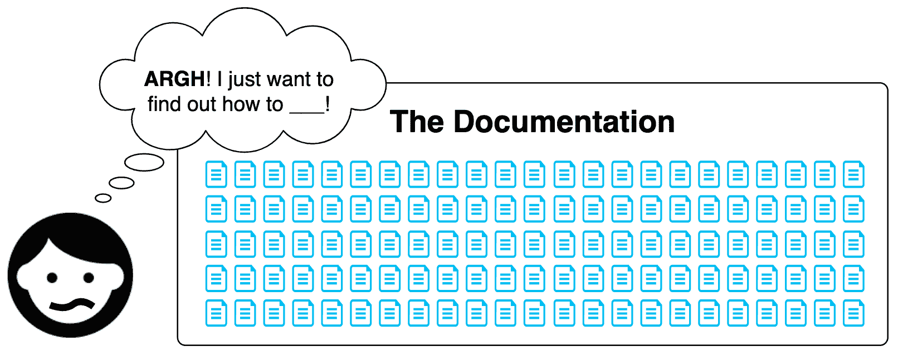

# 第十六章：记录您的代码

文档有一个不好的名声。很难找到动力来写它，维护它是一种麻烦，多年来我们对它的接触使我们相信它是最枯燥的知识传递方法之一。然而，它不必这样！

如果我们选择完全关注用户，那么我们的文档可以简单而愉快。为此，我们必须首先考虑我们文档的用户是谁。他们想要什么？每个用户，无论是 GUI 最终用户还是其他程序员，都以某项任务为目标开始使用我们的软件。在软件和文档中，我们的责任是使他们能够尽可能少地感到痛苦和困惑地完成任务。考虑到这一点，在本章中，我们将探讨为我们构建无痛文档可能意味着什么。我们将具体涵盖以下内容：

+   清晰文档的方面

+   文档无处不在

+   为非技术受众编写

# 清晰文档的方面

文档的目的是传达**软件的功能**和**如何使用它**。我们可以将清晰文档的特点分为四个方面：清晰的文档传达了软件的**概念**，提供了其行为的**规范**，并包含了执行特定操作的**说明**。而且它所有这些都是以**可用性**为重点。通过本节的学习，我们希望能够理解在构建*清晰*文档时*用户*的重要性。

文档是大多数人不太关心的东西。它通常是一个事后想法。我在本章的任务是说服您，它可以是，也应该是，远不止如此。当我们进入这些*方面*时，忘记您对文档的了解-从一张白纸开始，看看您是否能得出自己的启示。

# 概念

清晰的文档将传达软件的基本*概念*。它将通过解释软件的目的的方式来做到这一点，以便潜在用户可以看到他们如何使用它。这可以被认为是文档的教育部分：阐明术语和范例，使读者能够轻松理解文档的其他部分和所描述的软件。

为了正确表达软件的概念，有必要站在用户的角度，从他们的角度看事情，并用他们的术语与他们交流：

+   **确定您的受众**：他们是谁，他们的技术熟练程度如何？

+   **确定他们对问题领域的理解**：他们对这个特定软件项目、API 或代码库已经了解多少？

+   **确定正确的抽象级别和最佳类比**：如何以一种对他们有意义并与他们当前的知识融合良好的方式进行交流？

良好的文档编写是一个考虑用户然后为他们精心打造适当抽象的过程。您会希望注意到这与编写清晰代码的过程非常相似。实际上，两者之间几乎没有什么区别。在构建文档时，我们正在打造一个用户可以用来完成一组特定任务的工具。我们有责任以一种用户可以轻松完成最终目标而不会被软件的庞大和复杂所压倒的方式来打造它：



考虑一个花了几周时间完成的项目。这是一个名为`SuperCoolTypeAnimator`的**JavaScript**（**JS**）库，其他程序员可以使用它来创建字体转换。它允许他们向用户显示一块从一种字体动画到另一种字体（例如从 Helvetica 到 Times New Roman）的文本。这是一个相当复杂的代码库，可以手动计算这些转换。其复杂性的深度意味着您作为程序员已经发现了远远超出您所能想象的关于连字、衬线和路径插值的知识。在数月的沉浸在这个日益深入的问题领域之后，您很可能难以理解没有您这种程度接触的用户的观点。因此，您的文档的第一稿可能会以以下方式开始：

*SuperCoolTypeAnimator 是一种 SVG 字形动画实用程序，允许创建和逐帧操纵源字形和其相应目标字形之间的过渡，并在飞行中计算适当的过渡锚点。*

让我们将其与以下替代介绍进行比较：

*SuperCoolTypeAnimator 是一个 JS 库，可以让您轻松地将文本的小部分从一种字体动画到另一种字体。*

作为介绍，后者更广泛地可理解，并且即使是非专家用户也能立即理解库的功能。前者的介绍虽然信息丰富，但可能会导致当前和潜在用户感到困惑或疏远。我们构建的软件的整个目的是为了将复杂性抽象化，以简洁和简化的方式呈现出来。给用户带来复杂性应该是一种令人遗憾和考虑的行为：这通常是*最后*的选择。

我们在文档中试图传达的*概念*，首先是关于我们的软件如何*帮助*用户。为了让他们理解它如何帮助他们，我们需要以符合他们当前理解的方式来描述它。

两种介绍突出的另一个因素是它们对特殊术语的使用（如*字形*和*锚点*）。使用这种领域特定的术语是一种平衡行为。如果您的用户对*字体*问题领域有很好的理解，那么*字形*和*字体*等术语可能是合适的。可以说，对您的库感兴趣的用户很可能也了解这些概念。但是，使用*过渡锚点*等更微妙的术语可能有点过头。这可能是您在抽象中使用的术语，用来描述高度复杂的实现领域。这对您来说是一个有用的术语，也许对于希望对库进行更改的任何人来说也是有用的，但对库的用户来说可能不那么有用。因此，在我们的文档介绍中最好避免使用它。

# 规范

好的文档除了为软件提供概念外，还将提供*规范*，详细说明软件提供的接口的特定特征和行为。文档的这一部分详细说明了用户或程序员在使用软件时可以期望的合同。

*规范*理想情况下应该是撰写文档中最简单的部分，原因如下：

+   **它就在代码中**：行为规范包含在代码及其测试中，通常很容易手动将此信息编写为文档。但是，如果编写起来很困难，那就表明您的代码及其接口中存在基本复杂性，可能应该作为优先事项进行修复。

+   **它可以自动生成**：存在许多文档生成器，它们要么依赖于静态类型注释，要么依赖于注释注释（例如*JSDoc*）。这些允许您通过 CLI 或构建工具为整个接口生成文档。

+   **它遵循固定格式**：规范将遵循一个简单易写的直接格式。它通常包含各个端点或方法签名的标题，以及解释每个参数的句子。

提供规范的最主要目的是回答用户可能对您的代码操作有的具体问题。



以下是一个名为`removeWords`的函数规范示例。

```js
removeWords( subjectString, wordsToRemove ); 
```

此函数将从指定的主题字符串中删除指定的单词，并将一个新字符串返回给您。这里的单词被定义为由单词边界（`\b`）限定的字符串。例如，对于`"I like apple juice"`主题字符串和`["app", "juice"]`的`wordsToRemove`，只会删除`"juice"`，因为`"app"`存在于主题中，但没有被单词边界限定。以下是参数：

+   `subjectString` (`String`): 这是指定单词将从中移除的字符串。如果您没有传递`String`类型，那么您传递的值将被转换为`String`。

+   `wordsToRemove` (`Array`): 这是一个包含您希望移除的单词的数组。空数组或 null 将导致没有单词被移除。

希望您能看出，这个规范纯粹是对函数行为的技术解释。它准确告诉用户他们必须提供什么参数以及他们将收到什么输出。在撰写文档规范部分时，最重要的品质是清晰和正确。要注意以下陷阱：

+   **没有足够的信息允许使用**：提供关于您的实现的足够信息非常重要，这样另一个程序员，即使对您的软件一无所知，也可以开始使用它。仅仅指定参数类型是不够的。如果知识领域特别晦涩，还需要提供额外的信息。

+   **不正确或过时的信息**：文档很容易过时或不正确。这就是为什么从带注释的代码自动生成文档非常常见的原因。这样，信息不正确或过时的几率会大大降低。

+   **缺乏示例**：通常只列出模块、方法和参数签名，而没有提供任何示例。如果这样做，混乱和困难的几率会更高，因此提供合理的示例或将读者链接到更像教程的文档总是值得的。

规范可以说是文档中最重要的部分，因为它清晰地解释了软件相关 API 的每个部分的行为。确保在撰写文档时像编写代码一样仔细和勤奋。

# 指令

除了*概念*和*规范*，一份干净的文档还将*指导*用户如何完成常见任务。这些通常被称为*步骤*、*教程*、*操作指南*或*食谱*。

主要是用户，无论是程序员还是最终用户，都关心如何从现在所在的位置到达他们想要的位置。他们想知道应该采取哪些步骤。如果没有常见用例的说明，他们将绝望地从直觉或其他文档片段中拼凑出对您的软件的了解。想象一本只详细说明了食材及其烹饪方式的烹饪书，但没有包含任何将食材按特定顺序组合的具体食谱。这将是一本难以使用的烹饪书。虽然它可能提供了高度详细的烹饪信息，但它并没有帮助用户回答他们实际的问题：


在撰写说明时，无论是视频教程还是书面步骤说明，都要考虑对用户来说最常见或最具挑战性的使用情况。与生活中的许多事情一样，您只能合理地满足大多数用户的需求，而不是所有用户。为每种可能的使用情况创建教程是不合理的。同样，从用户的角度来看，仅为最常见的使用情况提供单一教程也是不合理的。明智的做法是取得折衷，拥有一小部分教程，每个教程都表达：

+   **提前期望和先决条件**：一组说明应该指明作者对读者的硬件、软件环境和能力有什么期望。它还应该说明读者在开始以下步骤之前是否需要做好任何准备。

+   **读者可以模仿的具体步骤**：说明应该包括一些具体步骤，用户可以按照这些步骤达到他们期望的目标。用户在遵循这些步骤时不应该需要太多（或任何）主动性；这些步骤应该清楚而详尽地概述用户需要做什么，如果可能的话，附上代码示例。用户应该明显地知道他们已成功完成每个步骤（例如，“您现在应该收到 X 输出”）。

+   **可实现和可观察的目标**：说明应该朝着用户可以观察到的目标努力。如果教程的最后一步说“由于 X 或 Y 的原因，目前无法正常工作，但通常您会期望看到 Z”，这将令人沮丧。确保您的软件以这样的方式运行，以便教程可以完成到最后，用户可以更接近他们的总体目标。

**不要只告诉用户该做什么**。告诉他们在每个阶段都完成了什么，以及为什么重要。也就是说，不要只告诉我在菜里放盐，告诉我为什么需要盐！

文档的教学部分可能是最具挑战性的。它要求我们扮演老师的角色，从另一个人的相对无知的位置看问题。保持专注于我们正在教授的人，也就是用户，是绝对至关重要的。这非常好地契合了我们清晰文档的最后一个方面：可用性。

# 可用性

可用性是清晰文档的最后一个组成部分。就像我们的软件一样，我们的文档必须关注用户及其特定需求。前面三个方面（*概念*、*规范*、*说明*）都关注内容，而*可用性*纯粹关乎我们表达内容的方式。当用户了解您的软件时，不要使其感到不知所措或困惑是非常重要的：



有许多方式可以使人困惑和不知所措。其中包括以下几种：

+   **内容过多**：这可能会使只想执行某个具体而狭窄任务的用户感到不知所措。他们可能不明白为了实现简单任务而必须翻阅大量文档的意义。

+   **内容过少**：如果用户希望做的事情没有得到充分的记录，那么他们的选择就很少。他们要么希望有社区驱动的文档，要么希望界面足够易懂，可以在没有帮助的情况下解释清楚。

+   **内部不一致**：当文档的不同部分在不同时间更新时，这种情况很常见。用户会疑惑哪个文档或示例是正确的和最新的。

+   **缺乏结构**：没有结构，用户无法轻松地浏览或获得对整个软件的概念理解。他们只能在细节中摸索，无法获得清晰的*整体图景*。在软件中，层次结构很重要，因此在我们的文档中反映这一点很重要。

+   **内容难以导航**：没有良好的 UX/UI 考虑，文档可能非常难以导航。如果它不是集中的、可搜索的和可访问的，那么导航就会受到影响，用户会陷入困惑和痛苦之中。

+   **呈现不足**：除了导航之外，文档中另一个至关重要的 UX 组件是其美学和排版布局。一个布局良好的文档易于阅读和学习。设计文档是完全合理的。它不应该是无尽散文的枯燥*倾倒场所*，而是一个美丽的教育体验！

在第二章《清洁代码的原则》中，我们详细讨论了*可用性*的含义。我们讨论了它不仅仅是直观设计和可访问性，还涉及对*用户故事*的考虑——用户希望执行的具体任务以及如何满足这些任务。文档与我们提供的任何其他界面并无二致；它必须解决用户的问题。考虑如何设计文档以满足这些示例用户故事：

+   作为用户，我希望了解这个框架的功能以及如何将其应用到我的项目中

+   作为用户，我希望找出如何将这个框架安装到我的 Node.js 项目中

+   作为用户，我希望了解在使用这个框架时的最佳实践

+   作为用户，我希望了解如何使用这个框架构建一个简单的示例应用程序

每个用户都是不同的。一些用户更喜欢阅读长篇技术文档，而另一些用户更喜欢简短的独立教程。考虑人们的不同学习风格（视觉、听觉、社交、独立等）。有些人通过长时间学习来学习；其他人通过*实践*来学习。

我们可以考虑为用户寻求的不同类型信息构建不同风格的文档。更加具体的信息（例如，*这个特定框架的功能如何工作？*）可能更适合传统的长篇文档格式，而更加指导性的信息（例如，*如何使用这个框架构建一个应用程序？*）可能更适合丰富的媒体（例如，视频教程）。

由于用户可能寻求的信息类型众多，以及我们正在为不同的个体用户提供服务，因此值得花费大量时间来规划、设计和执行清晰的文档。它不应该是事后的想法。

现在我们已经探讨了清晰文档的四个方面，让我们探索一下我们可以使用的各种媒介来表达我们的文档。我们不必只使用单一的沉闷、可滚动的文档：我们还有数十种其他方式可以向用户和同事提供信息和教育。

# 文档无处不在

如果我们慷慨地将文档定义为*了解软件的一种方式*，我们可以观察到存在数十种不同的文档媒介。其中许多是隐性或偶然的；其他更多是有意识地制作的，无论是软件的创建者还是围绕它聚集的专家社区：

+   书面文档（API 规范、概念解释）

+   解释性图片和图表（例如流程图）

+   书面教程（步骤、食谱、如何做 X）

+   丰富的媒体介绍和教程（视频、播客、屏幕录像）

+   公共问答或问题（例如解释如何修复某些问题的 GitHub 问题）

+   社区驱动的问答（例如 StackOverflow）

+   程序员之间的独立沟通（线上或线下）

+   聚会、会议和研讨会（所有者或社区驱动）

+   官方支持（付费支持电话、邮件、线下会议）

+   教育课程（例如线下或在线的 Coursera）

+   测试（解释概念、流程和期望）

+   良好的抽象（有助于解释概念）

+   可读且熟悉的代码（*易于理解*）

+   结构和界定（*目录结构，项目名称*等）

+   直观设计的界面（*通过良好设计教育使用方式*）

+   错误流和消息（例如* X 不起作用？尝试 Z 代替*）。

考虑所有这些媒介是如何被照顾的是值得的。当官方文档无法帮助解决用户的问题时，他们在放弃你的软件之前会探索哪些其他途径？我们如何能够尽快和流畅地将用户的困难或问题引导到解决方案？如果用户不太可能阅读整个规范文档，那么我们可以为他们创建哪些其他媒介？

# 为非技术受众撰写

正如我们所见，撰写文档时，有必要将所用语言适应于受众。为此，我们必须清楚地了解受众是谁，他们目前的知识水平是什么，以及他们试图实现什么。对程序员来说，与不太技术化或非技术人员沟通是一个臭名昭著的挑战。这是作为软件创作者的一个非常常见且至关重要的部分。无论是在 UX 的特定点与最终用户沟通，还是与非技术利益相关者合作，都需要根据受众调整我们的沟通方式。为此，我们应该做到以下几点：

+   选择正确的抽象层次：找到受众完全理解的抽象层次至关重要。使用他们的角色和能力来指导你用来解释事物的类比。例如，如果你在向患者谈论一款医疗软件，你可能更愿意说*请添加您的医疗信息*，而不是*请填写医疗档案字段*。

+   避免过于技术化的术语：避免对听众毫无意义的词语。使用普通语言解释详细概念。例如，你可以谈论*视觉增强*，而不是*CSS 修改*。

+   不断获得反馈：确保通过与听众核对来确保自己被理解。不要假设人们理解你，只是因为他们没有明确表示不理解。在你的文档或软件中考虑面向用户的提示（例如，“这条消息有帮助吗？[是] [否]”）

与非技术人员沟通可能看起来是一个独特的挑战，但与任何其他人沟通并无二致。正如我们应该一直做的那样，我们只需要*以他们的理解水平为准*，并根据他们对问题领域的当前理解进行沟通。

# 总结

在本章中，我们探讨了撰写清晰文档的艰难之处，将其分解为清晰文档的四个关键方面：*概念*，*规范*，*指导*和*可用性*。我们讨论了正确识别受众的挑战以及如何制定我们的沟通以适应他们。这种知识不仅在撰写正式文档时有用，也在我们与利益相关者以及软件与用户进行沟通时有用。

在下一章中，我们将迅速转向处理他人代码的独特挑战。当我们作为接收端需要高效工作时，如果文档可能不佳或代码不直观，会发生什么？我们将找出答案。
