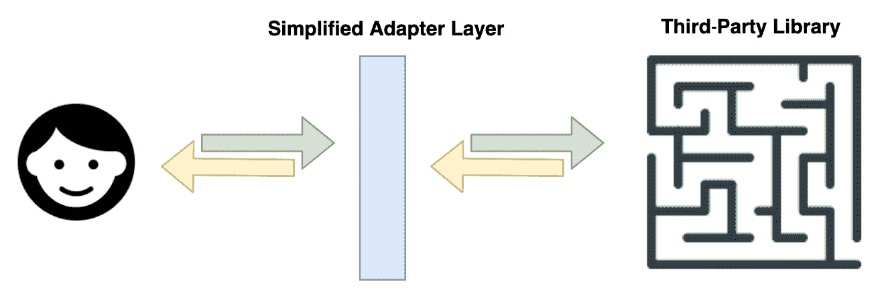

# 第十七章：其他人的代码

人类是复杂而善变的，创造出复杂而善变的东西。然而，处理其他人和他们的代码是作为程序员不可避免的一部分。无论是处理他人构建的库和框架，还是继承整个遗留代码库，挑战都是相似的。第一步应该始终是寻求对代码及其范例的理解。当我们完全理解代码时，我们可以开始以清晰的方式与之交互，使我们能够在现有工作的基础上创建新功能或进行改进。在本章中，我们将更详细地探讨这个主题，并通过清晰的代码视角考虑我们可以采取的行动，使其他人的代码处理起来不那么痛苦。

在本章中，我们将涵盖以下主题：

+   继承代码

+   处理第三方代码

# 继承代码

当我们加入一个新团队或接手一个新项目时，通常会继承大量代码。我们在这些继承的代码库中的生产力取决于我们对它们的理解。因此，在我们寻求进行第一次更改之前，我们需要在脑海中建立一个关于事物如何运作的概念模型。它不需要是详尽和完整的，但它必须使我们至少能够进行更改并准确理解这些更改可能对代码库的所有组成部分产生的影响。

# 探索和理解

完全理解代码基础并不是必须的，也不是必须的，但如果我们对所有相互关联部分的复杂性没有足够的理解，那么我们就会陷入陷阱。当我们相信自己已经很好地理解时，开始进行更改时，陷阱就会出现。如果不理解我们行为的全部影响，我们最终会浪费时间，实现不完善的东西，并产生意外的错误。因此，我们必须充分了解情况。为了做到这一点，我们必须首先评估我们对系统或代码基础复杂性的*视图*是完整还是不完整。


通常，我们看不见的事情对我们来说是完全未知的，因此我们不知道自己根本没有任何理解。这就是常见表达式*我们不知道自己不知道什么*所概括的。因此，在探索新的代码库时，积极主动地努力去发现和突出我们的无知领域是有帮助的。我们可以通过以下三个步骤来做到这一点：

+   **收集可用信息**：与知情的同事交谈，阅读文档，使用软件，内化概念结构和层次结构，阅读源代码。

+   **做出知情的假设**：用知情的假设填补你不确定的地方。如果有人告诉你应用程序有注册页面，你可以直观地假设这意味着用户注册涉及典型的个人数据字段，如姓名、电子邮件、密码等。

+   **证明或否定假设**：寻求通过直接查询系统（例如编写和执行测试）或询问有经验的人（例如对代码库有经验的同事）来证明或否定你的假设。

在创建和扩展对新代码库的理解时，有一些特定的方法值得采用。这些方法包括制作流程图，内化变更的时间线，使用调试器逐步执行代码，并通过测试确认你的假设。我们将逐个探讨这些方法。

# 制作流程图

当我们遇到一个新的代码库时，我们几乎可以立即采用的一个有用的方法是填充一个心智图或流程图，突出显示我们知道的事情以及我们尚不确定的事情。以下是我曾经在一款医疗软件上使用的这种图表的简化示例：


正如你所看到的，我已经尝试概述了我对用户流程的*当前*理解，并在*云*注释中添加了我个人在其中遇到的困惑或问题。随着我的理解的增长，我可以补充这个流程图。

人们以各种方式学习。这种视觉辅助可能对某些人更有用，但对其他人可能不那么有用。还有无数种组成这样的流程图的方式。为了达到个人理解的目的，最好*使用任何对你有效的方法*。

# 寻找结构和观察历史

想象一下，你面对一个包含几种专门类型的*视图*或*组件*的大型 JavaScript 应用程序代码库。我们的任务是在应用程序中的一个付款表单中添加一个新的下拉菜单。我们快速搜索代码库，并确定了许多不同的下拉菜单相关组件：

+   `GenericDropdownComponent`

+   `DropdownDataWidget`

+   `EnhancedDropdownDataWidget`

+   `TextDropdown`

+   `ImageDropdown`

它们的命名令人困惑，因此在进行更改或使用它们之前，我们希望更好地了解它们。为了做到这一点，我们可以打开每个组件的源代码，以确定它可能与其他组件有何关联（或者没有关联）。

最终我们发现，例如`TextDropdown`和`ImageDropdown`都似乎继承自`GenericDropdownComponent`：

```js
// TextDropdown.js
class TextDropdown extends GenericDropdownComponent {
  //...
}

// ImageDropdown.js
class ImageDropdown extends GenericDropdownComponent {

}
```

我们还观察到`DropdownDataWidget`和`EnhancedDropdownDataWidget`都是`TextDropdown`的子类。*增强*下拉小部件的命名可能会让我们困惑，这可能是我们在不久的将来想要更改的内容，但是，目前，我们需要屏住呼吸，只需专注于完成我们被分配的工作。

在完成遗留或不熟悉的代码库中的任务时，避免走神。许多事情可能看起来奇怪或错误，但你的任务必须始终是最重要的事情。在早期，你可能没有足够的接触代码库的经验来做出明智的更改。

通过逐个查看每个与下拉菜单相关的源文件，我们可以在不进行任何更改的情况下建立对它们的深入理解。如果代码库使用源代码控制，那么我们还可以*责备*每个文件，以发现最初是谁编写的以及何时编写的。这可以告诉我们事物是如何随时间变化的。在我们的情况下，我们发现了以下变更时间线：


这对我们非常有帮助。最初只有一个类（名为`DropdownComponent`），后来改为`GenericDropdownComponent`，有两个子类`TextDropdownComponent`和`ImageDropdownComponent`。每个都改名为`TextDropdown`和`ImageDropdown`。随着时间的推移，这些各种变化阐明了现在事物的原因。

当查看代码库时，我们经常会假设它是一次性创建的，并且有完整的远见；然而，正如我们的时间线所示，事实要复杂得多。代码库随着时间的推移而变化，以应对新的需求。参与代码库工作的人员也在变化，每个人都不可避免地有自己解决问题的方式。我们接受每个代码库缓慢演变的本质，将有助于我们接受它的不完美之处。

# 逐步查看代码

在大型应用程序中建立对单个代码片段的理解时，我们可以使用工具来调试和研究其功能。在 JavaScript 中，我们可以简单地放置一个`debugger;`语句，然后执行我们知道会激活特定代码的应用程序部分。然后，我们可以逐行查看代码，以回答以下问题：

+   **这段代码被调用在哪里？**对于一个抽象如何被激活的明确期望可以帮助我们在脑海中建立应用程序的*流*或*顺序*的模型，使我们能够更准确地判断如何修复或更改某些东西。

+   **这段代码接收了什么？**抽象接收的输入示例可以帮助我们建立一个清晰的概念，了解它的功能，以及它期望如何被接口化。这可以直接指导我们使用这个抽象。

+   **这段代码输出了什么？**观察一个抽象的输出，以及它的输入，可以让我们对它的计算方式有一个非常明确的概念，并且可以帮助我们判断我们可能希望如何使用它。

+   **这里存在什么级别的误导或复杂性？**观察复杂和高的堆栈跟踪（意味着*被函数调用的函数被函数调用，无限循环...*）可以表明我们在某个区域内导航和理解控制和信息流的困难。这将告诉我们，我们可能需要通过额外的文档或与知情的同事沟通来增加我们的理解。

以下是在浏览器环境中这样做的一个例子（使用 Chrome Inspector）：


即使在 Node.js 中实现服务器端 JavaScript，您也可以使用 Chrome 的调试器。要做到这一点，在执行 JavaScript 时使用`--inspect`标志，例如，`node --inspect index.js`。

像这样使用调试器可以为我们呈现*调用堆栈*或*堆栈跟踪*，告诉我们通过代码库采取了哪条路径到达我们的`debugger;`语句。如果我们试图了解陌生类或模块如何适应代码库的整体情况，这将非常有帮助。

# 验证您的假设

扩展我们对陌生代码的了解的最佳方法之一是编写测试来确认代码的行为方式。想象一下，我们被要求维护这段晦涩的代码：

```js
class IssuerOOIDExtractor {
  static makeExtractor(issuerInfoInterface) {
    return raw => {
      const infos = [];
      const cleansed = raw
        .replace(/[_\-%*]/g, '')
        .replace(/\bo(\d+?)\b/g, ($0, id) => {
          if (issuerInfoInterface) {
            infos.push(issuerInfoInterface.get(id));
          }
          return `[[ ${id} ]]`;
        })
        .replace(/^[\s\S]*?(\[\[.+\]\])[\s\S]*$/, '$1');
      return { raw, cleansed, data: infos };
    };
  }
}
```

这段代码只在几个地方使用，但各种输入是在应用程序的难以调试的区域动态生成的。此外，没有文档，绝对没有测试。这段代码到底做了什么还不太清楚，但是，当我们逐行研究代码时，我们可以开始做一些基本的假设，并将这些假设编码为断言。例如，我们可以清楚地看到`makeExtractor`静态函数本身返回一个函数。我们可以将这个事实规定为一个测试：

```js
describe('IssuerOOIDExtractor.makeExtractor', () => {
  it('Creates a function (the extractor)', () => {
    expect(typeof IssuerOOIDExtractor.makeExtractor()).toBe('function');
  });
});
```

我们还可以看到某种正则表达式替换发生；它似乎在寻找字母`o`后面跟着一串数字的模式（`\bo(\d+?)\b`）。我们可以通过编写一个简单的断言来开始探索这个提取功能，其中我们给提取器一个匹配该模式的字符串：

```js
const extractor = IssuerOOIDExtractor.makeExtractor();

it('Extracts a single OOID of the form oNNNN', () => {
  expect(extractor('o1234')).toEqual({
    raw: 'o1234',
    cleansed: '[[ 1234 ]]',
    data: []
  });
});
```

随着我们慢慢发现代码的功能，我们可以添加额外的断言。我们可能永远无法达到 100%的理解，但这没关系。在这里，我们断言提取器能够正确提取单个字符串中存在的多个 OOID：

```js
it('Extracts multiple OOIDs of the form oNNNN', () => {
  expect(extractor('o0012 o0034 o0056 o0078')).toEqual({
    raw: 'o0012 o0034 o0056 o0078',
    cleansed: '[[ 0012 ]] [[ 0034 ]] [[ 0056 ]] [[ 0078 ]]',
    data: []
  });
});
```

运行这些测试时，我们观察到以下成功的结果：

```js
 PASS ./IssuerOOIDExtractor.test.js
  IssuerOOIDExtractor.makeExtracator
    ✓ Creates a function (the extractor) (3ms)
    The extractor
      ✓ Extracts a single OOID of the form oNNNN (1ms)
      ✓ Extracts multiple OOIDs of the form oNNNN (1ms)
```

请注意，我们仍然不完全确定原始代码的作用。我们只是触及了表面，但这样做，我们正在建立一个有价值的理解基础，这将使我们将来更容易地与这段代码进行交互或更改。随着每个新的成功断言，我们离完整和准确地理解代码的目标更近。如果我们将这些断言作为新的测试提交，那么我们也正在提高代码库的测试覆盖率，并为将来可能同样被这段代码困惑的同事提供帮助。

现在我们已经牢固掌握了如何探索和理解继承的代码，我们现在可以研究如何对该代码进行*更改*。

# 进行更改

一旦我们对代码库的某个区域有了很好的理解水平，我们就可以开始进行更改。然而，即使在这个阶段，我们也应该谨慎。我们对代码库和相关系统仍然相对较新，所以我们可能仍然不了解其中许多部分。任何更改都可能造成意想不到的影响。因此，为了继续前进，我们必须慢慢和谨慎地进行，确保我们的代码设计良好并经过充分测试。在这里，我们应该注意两种具体的方法：

+   在陌生环境中进行孤立更改的精细*手术*过程

+   通过测试确认更改

让我们逐一探讨这些。

# 最小侵入手术

当需要在旧的或陌生的代码库中进行更改时，可以想象自己在进行一种*最小侵入手术*。这样做的目的是最大化更改的积极影响，同时最小化更改本身的影响范围，确保不会对代码库的其他部分造成损害或影响过大。这样做的希望是，我们将能够产生必要的更改（*优势*），而不会过多地暴露自己于破坏或错误的可能性（*劣势*）。当我们不确定更改是否完全必要时，这也是有用的，因此我们最初只想在其上花费最少的精力。

假设我们继承了一个负责呈现单个图像的`GalleryImage`组件。在我们的 Web 应用程序中有许多地方使用它。任务是在资产的 URL 指示其为视频时，添加呈现视频的能力。两种 CDN URL 的类型如下：

+   `https://cdn.example.org/VIDEO/{ID}`

+   `https://cdn.example.org/IMAGE/{ID}`

正如您所看到的，图像和视频 URL 之间存在明显的区别。这为我们提供了一种在页面上呈现这些媒体的简单方法。理想情况下，我们应该实现一个名为`GalleryVideo`的新组件来处理这种新类型的媒体。这样的新组件将能够独特地满足视频的*问题域*，这显然与图像的问题域不同。至少，视频必须通过`<VIDEO>`元素呈现，而图像必须通过``呈现。

我们发现`GalleryImage`的许多用法都没有经过充分测试，有些依赖于隐晦的内部实现细节，这些细节如果要大规模辨别将会很困难（例如，如果我们想要更改所有`GalleryImage`的用法，进行查找和替换将会很困难）。

我们的可用选项如下：

1.  创建一个*容器*`GalleryAsset`组件，它本身根据 CDN URL 决定是否呈现`GalleryImage`或`GalleryVideo`。这将涉及替换每个当前使用`GalleryImage`的情况：

+   时间估计：**1-2 周**

+   代码库中的影响：**显著**

+   可能出现意想不到的破坏：**显著**

+   架构*清洁度*：**高**

1.  在`GalleryImage`中添加一个条件，根据 CDN URL 可选择呈现`<video>`而不是``标签：

+   时间估计：**1-2 天**

+   代码库中的影响：**最小**

+   可能出现意想不到的破坏：**最小**

+   架构*清洁度*：**中等**

在理想情况下，如果考虑代码库的长期架构，很明显创建一个新的`GalleryAsset`组件是最好的选择。它为我们提供了一个清晰定义的抽象，直观地满足了图片和视频的两种情况，并为我们提供了在将来添加不同资产类型（例如*音频*）的可能性。然而，它需要更长的时间来实现，并且带有相当大的风险。

第二个选项要简单得多。实际上，它可能只涉及以下四行更改集：

```js
@@ -17,6 +17,10 @@ class GalleryImage {
  render() {

+   if (/\/VIDEO\//.test(this.props.url)) {
+     return <video src={this.props.url} />;
+   }
+
    return 

  }
```

这不一定是一个好的长期选择，但它给了我们一些可以立即交付给用户的东西，满足他们的需求和我们利益相关者的需求。一旦交付，我们可以计划未来的时间来完成更大的必要更改。

重申一下，*最小侵入性*更改的价值在于它减少了代码库在实施时间和潜在破坏方面的立即不利因素（*风险*）。显然，确保我们在短期利益和长期利益之间取得平衡是至关重要的。利益相关者通常会向程序员施加压力，要求他们快速实施更改，但如果没有*技术* *债务*或协调过程，那么所有这些*最小侵入性*的更改可能会积聚成一个相当可怕的怪物。

为了确保我们更改的代码不太脆弱或容易出现未来的回归，最好是在更改的同时编写测试，编码我们的期望。

# 将更改编码为测试

我们已经探讨了如何编写测试来发现和指定当前功能，而且在之前的章节中，我们讨论了遵循**测试驱动开发**（**TDD**）方法的明显好处。因此，当在一个陌生的代码库中操作时，我们应该始终通过清晰编写的测试来确认我们的更改。

在没有现有测试的情况下，与您的更改一起编写测试绝对是必要的。在代码区域编写第一个测试可能会很繁重，因为需要设置库和必要的模拟，但这绝对是值得的。

在我们之前介绍的向`GalleryImage`引入渲染视频功能的示例中，明智的做法是添加一个简单的测试来确认当 URL 包含`"/VIDEO/"`子字符串时，`<VIDEO>`被正确渲染。这可以防止未来的回归，并给我们带来了强大的信心，表明它按预期工作：

```js
import { mount } from 'enzyme';
import GalleryImage from './GalleryImage';

describe('GalleryImage', () => {
  it('Renders a <VIDEO> when URL contains "/VIDEO/"', () => {
    const rendered = mount(
      <GalleryImage url="https://cdn.example.org/VIDEO/1234" />
    );
    expect(rendered.find('video')).to.have.lengthOf(1);
  });
  it('Renders a  when URL contains "/IMAGE/"', () => {
    const rendered = mount(
      <GalleryImage url="https://cdn.example.org/IMAGE/1234" />
    );
    expect(rendered.find('img')).to.have.lengthOf(1);
  });
});
```

这是一个相当简单的测试；然而，它完全编码了我们在进行更改后的期望。在进行小型和自包含的更改或更大的系统性更改时，通过这样的测试验证和传达我们的意图是非常有价值的。除了防止回归，它们还在立即的代码审查方面帮助我们的同事，以及在文档和整体可靠性方面帮助整个团队。因此，拥有一个团队强制执行或政策，即*如果没有测试，就不能提交更改*是相当正常和可取的。长期执行这一政策将使代码库产生更可靠的功能，对用户更加友好，对其他程序员更加愉快。

我们现在已经完成了关于*继承代码*的部分，所以你应该对如何处理这种情况有了良好的基础知识。在处理*其他人的代码*时，另一个挑战是选择和集成第三方代码，即库和框架。我们现在将探讨这个问题。

# 处理第三方代码

JavaScript 的领域充斥着各种框架和库，可以减轻实现各种功能的负担。在第十二章中，*真实挑战*，我们看到了在 JavaScript 项目中包含外部依赖项所涉及的困难。现代 JavaScript 生态系统在这里提供了丰富的解决方案，因此处理第三方代码的负担要比以前少得多。尽管如此，与这些代码进行接口的本质并没有真正改变。我们仍然必须希望我们选择的第三方库或框架提供直观和良好文档的接口，以及满足我们需求的功能。

在处理第三方代码时，有两个关键的过程将决定我们所获得的持续风险或收益。第一个是*选择*过程，我们在这个过程中选择要使用的库，第二个是我们将库集成和适应到我们的代码库中。现在我们将详细讨论这两点。

# 选择和理解

选择一个库或框架可能是一个冒险的决定。选择错误的库可能最终会驱动系统的大部分架构。框架尤其以此闻名，因为它们的本质决定了架构的结构和概念基础。选择错误的库然后试图更改它可能是一个相当大的工作量；这需要对应用程序中几乎每一行代码的更改。因此，认真考虑和选择第三方代码的技能至关重要：


在选择过程中，我们可以考虑一些有用的考虑因素：

+   **功能性**：库或框架必须满足一组固定的功能期望。重要的是以足够详细的方式指定这些功能，以便可以量化比较不同的选项。

+   兼容性：库或框架必须与当前代码库的工作方式大部分兼容，并且必须能够以技术简单易懂的方式集成，以便同事们能够理解。

+   **可用性**：库或框架必须易于使用和理解。它应该有良好的文档和一定程度的直观性，可以在没有痛苦或困惑的情况下立即提高生产力。对于使用相关问题或疑问的考虑也属于可用性范畴。

+   **维护和安全性**：库或框架应该得到维护，并且有一个清晰可信的流程来报告和解决错误，特别是那些可能具有安全影响的错误。变更日志应该是详尽的。

这里的四个标准也可以通过启发式来指导，比如*项目由谁支持？*，*有多少人在使用该项目？*，或者*我是否熟悉构建它的团队？*。但请注意，这些只是启发式，因此并不是衡量*第三方代码*适用性的完美方式。

然而，即使使用这四个标准，我们可能会陷入陷阱。如果你还记得，在第三章中，*清洁代码的敌人*，我们讨论了最显著的*自我*（或*自负*）和*物质崇拜*。在选择第三方代码时，这些也是相关的。请特别注意以下内容：

+   **强烈的观点**: 尽可能地与决策过程分开，并非常谨慎地对待我们的无知和偏见。程序员以他们的固执著称。在这些时刻，重要的是要从自己身上退后一步，用纯粹的逻辑来推理出我们认为最好的是什么。给每个人一个发言的机会同样很重要，根据他们自身的价值观和轶事来权衡人们的意见，而不是根据他们的资历（或其他个人特征）。

+   **流行文化**: 不要被流行所左右。由于其社区的规模和狂热，很容易被流行的抽象所吸引，但再次，重要的是要退一步，考虑框架本身的优点。当然，流行可能表明易于集成和更丰富的学习资源，所以在这方面，谈论它是合理的，但要小心使用流行作为优越性的唯一指标。

+   **分析瘫痪**: 有很多选择，所以有可能陷入一种似乎无法做出选择的情况，因为害怕做出错误选择。大多数情况下，这些决定是可逆的，所以做出不太理想的选择并不是世界末日。很容易陷入这样一种情况，花费大量时间来决定选择哪个框架或库，而更有效的方法是只是选择*任何东西*，然后根据以后的需求进行迭代或转变。

在做关于第三方库的决定时，关键是要充分意识到它们对代码库的最终影响。我们花在做决定上的时间应该与它们的潜在影响成比例。决定客户端框架用于组件渲染可能是一个相当重要的选择，因为它可能规定了代码库的一个重要部分，而例如一个小的 URL 解析实用程序并没有很大的影响，并且可以在将来轻松替换。

接下来，我们可以讨论如何集成和封装第三方代码，遵循一个知情的选择过程。

# 封装和适应第三方代码

选择第三方抽象，特别是框架的缺点是，你最终可能会改变你的代码库以适应抽象的作者的任意约定和设计决策。通常情况下，我们被迫*说同样的语言*，而不是让它们*说我们的语言*。确实，在许多情况下，可能是抽象的约定和设计吸引了我们，所以我们更愿意让它驱动我们的代码库的设计和性质。但在其他情况下，我们可能希望更多地受到我们选择的抽象的保护。我们可能希望在将来轻松地将它们替换为其他抽象，或者我们可能已经有一套我们更愿意使用的约定。

在这种情况下，封装这些第三方抽象并纯粹通过我们自己的抽象层来处理它们可能是有用的。这样的层通常被称为*适配器*：



非常简单地说，*适配器*将提供一个我们设计的接口，然后委托给第三方抽象来完成其任务。想象一下，如果我们希望使用一个名为`YOORL`的 URL 解析实用程序。我们已经决定它完全符合我们的需求，并且完全符合 RFC 3986（URI 标准）。唯一的问题是它的 API 相当繁琐和冗长。

```js
import YOORL from 'yoorl';
YOORL.parse(
  new YOORL.URL.String('http://foo.com/abc/?x=123'),
  { parseSearch: true }
).parts();
```

这将返回以下*对象*：

```js
{
  protocol: 'http',
  hostname: 'foo.com',
  pathname: '/abc',
  search: { x: 123 }
}
```

我们希望 API 更简单。我们认为当前 API 的长度和复杂性会使我们的代码库面临不必要的复杂性和风险（例如错误调用）。使用*适配器*可以让我们将这个不理想的接口封装成我们自己设计的接口。

```js
// URLUtils.js
import YOORL from 'yoorl';
export default {
  parse(url) {
    return YOORL.parse(
      new YOORL.URL.String(url)
    ).parts();
  }
};
```

这意味着我们代码库中的任何模块现在都可以与这个简化的*适配器*进行接口，使它们与 YOORL 的不理想 API 隔离开来。

```js
import URLUtils from './URLUtils';

URLUtils.parse('http://foo.com/abc/?x=123'); // Easy!
```

适配器可以被视为*翻译媒介*，使我们的代码库能够*使用其选择的语言*，而不必受到第三方库的任意和不一致的设计决策的拖累。这不仅有助于代码库的可用性和直观性，还使我们能够非常轻松地对基础第三方库进行更改，而无需改变太多代码。

# 总结

在本章中，我们探讨了*其他人的代码*这个棘手的话题。我们考虑了如何处理我们继承的遗留代码；我们如何建立对它的理解，如何进行调试和进行改变而不困难，以及如何通过良好的测试方法确认我们的改变。我们还涵盖了处理第三方代码的困难，包括如何选择它以及如何通过*适配器*模式以风险规避的方式与其进行接口。在本章中我们还可以谈论许多其他事情，但希望我们能够探讨的主题和原则已经让您充分了解如何以干净的代码库为目标来处理其他人的代码。

在下一章中，我们将涵盖沟通的主题。这可能看起来不相关，但对于程序员来说，沟通在我们的工作场所内部和向用户之间都是一项绝对重要的技能，没有它，干净的代码几乎不可能存在。我们将具体探讨如何规划和设定要求，如何与同事合作和沟通，以及如何在我们的项目和工作场所内推动变革。
