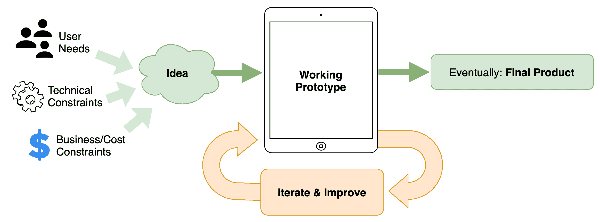

# 第十八章：沟通和倡导

我们不是孤立地编写代码。我们生活在一个高度混乱的社会世界中，必须不断与其他人沟通。我们的软件本身将通过其接口成为这种沟通的一部分。此外，如果我们在团队、工作场所或社区中工作，我们将面临有效沟通的挑战。

沟通对我们的代码库产生最重要影响的方式是设定要求、提出问题和反馈。软件开发本质上是一个非常长期的反馈过程，每一次变更都是由一次沟通引发的：

在这一章中，我们将学习如何有效地与他人合作和沟通，如何规划和设定要求，一些常见的合作陷阱及其解决方案。我们还将学习如何识别和提出阻碍我们编写清晰 JavaScript 的更大问题。在整个本章中，我们希望开始意识到我们在软件开发反馈周期中的重要角色。

在本章中，我们将看到以下主题：

+   规划和设定要求

+   沟通策略

+   识别问题并推动变革

# 规划和设定要求

最常见的沟通困难之一在于决定到底要构建什么。程序员通常会花费大量时间与经理、设计师和其他利益相关者会面，将真正的用户需求转化为可行的解决方案。理想情况下，这个过程应该很简单：*用户有[问题]；我们创建[解决方案]。故事结束！*不幸的是，实际情况可能要复杂得多。

即使在看似简单的项目中，也会有许多技术约束和沟通偏见，使得项目变得异常艰难。这对 JavaScript 程序员和其他程序员同样重要，因为我们现在操作的系统复杂性水平以前只有企业程序员才能使用 Java、C#或 C++。形势已经改变，因此谦卑的 JavaScript 程序员现在必须准备学习新技能，并就他们构建的系统提出新问题。

# 理解用户需求

确立用户需求至关重要，但往往被视为理所当然。程序员和其他项目成员通常会假设他们了解某个用户需求，而实际上并没有深入了解细节，因此有一个备用的流程是很有用的。对于每一个表面上的*需求*或*问题*，我们应该确保理解以下方面：

+   **我们的用户是谁？**：他们有什么特点？他们使用什么设备？

+   **他们试图做什么？**：他们试图执行什么行动？他们的最终目标是什么？

+   **他们目前是如何做的？**：他们目前采取了哪些步骤来实现他们的目标？目前的方法是否存在明显问题？

+   **他们以这种方式遇到了什么问题？**：需要很长时间吗？认知成本高吗？使用起来困难吗？

在书的开头，我们问自己为什么要编写代码，并探讨了真正理解问题领域本质的含义。理想情况下，我们应该能够站在用户的角度，亲身体验问题领域，然后从第一手经验中制定可行的解决方案。

不幸的是，我们并不总能直接与用户交谈或亲身体验。相反，我们可能依赖项目经理和设计师等中间人。因此，我们依赖他们的沟通效果，以便将用户需求传达给我们，从而使我们能够构建正确的解决方案。

在这里，我们看到了我们用户的需求，结合技术和业务约束，流入一个构建成解决方案并进行迭代的想法。将**用户需求**转化为**想法**至关重要，反馈过程使我们能够对解决方案进行迭代和改进：

由于用户需求对开发过程至关重要，我们必须仔细考虑如何平衡这些需求和其他约束。通常不可能构建出完美的解决方案，能够很好地满足每个用户的需求。几乎每个软件，无论是作为 GUI 还是 API 呈现，都是一种折衷，平均用户得到很好的满足，不可避免地意味着边缘情况的用户只能得到部分满足。重要的是要考虑如何尽可能充分地满足尽可能多的用户需求，巧妙地平衡时间、金钱和技术能力等约束。

在了解用户需求之后，我们可以开始设计和实现系统可能运行的原型和模型。接下来我们将简要讨论这个过程。

# 快速原型和 PoC

软件，尤其是 Web 平台，为我们提供了快速的构建周期的好处。我们可以在很短的时间内从概念到 UI。这意味着在头脑风暴的过程中，想法可以几乎实时地变为现实。然后我们可以将这些原型放在真实用户面前，获得真实反馈，然后快速迭代，朝着最佳解决方案迈进。事实上，Web 平台的优势——HTML、CSS 和 JavaScript 的三位一体——在于它允许快速而粗糙的解决方案，并且可以轻松进行迭代，并且可以在多个平台和设备上运行：

很容易被 JavaScript 框架和库的多样性和复杂性所压倒；它们的沉重负担会迫使我们进展缓慢。这就是为什么在原型设计时，最好坚持使用你已经很了解的更简单的技术栈。如果你习惯于某个框架，或者你准备花时间学习，那么值得利用现有的骨架模板作为起点。以下是一些例子：

+   React boilerplate ([github.com/react-boilerplate/react-boilerplate](http://github.com/react-boilerplate/react-boilerplate))

+   Angular bootstrap boilerplate ([github.com/mdbootstrap/Angular-Bootstrap-Boilerplate](http://github.com/mdbootstrap/Angular-Bootstrap-Boilerplate))

+   Ember boilerplate ([github.com/mirego/ember-boilerplate](http://github.com/mirego/ember-boilerplate))

+   Svelte template ([github.com/sveltejs/template](http://github.com/sveltejs/template))

每个模板都提供了一个相对简单的项目模板，可以让你非常快速地设置一个新的原型。尽管每个模板中使用了多个构建工具和框架选项，但设置成本很低，因此开始解决项目的真正问题领域所需的时间非常短。当然，你也可以找到类似的骨架模板和示例应用程序，适用于服务器端 Node.js 项目、同构 Web 应用程序，甚至是机器人或硬件项目。

现在我们已经探讨了规划和需求设置的技术过程，我们可以继续探讨一些重要的沟通策略，这些策略将帮助我们在我们的代码库上与他人合作。

# 沟通策略

我们直觉地知道沟通对于一个有效的项目和清晰的代码库是至关重要的，然而，很常见的情况是我们发现自己处于以下情况：

+   我们觉得自己没有被倾听到

+   我们觉得自己没有表达清楚

+   我们对某个主题或计划感到困惑

+   我们感到不在圈内或被忽视

这些困难是由于文化和不良沟通习惯造成的。这不仅影响了我们工作中的士气和整体满足感，还可能对我们构建的代码库的整洁性和技术的可靠性造成巨大问题。为了培养一个干净的代码库，我们必须专注于我们采用的基础沟通实践。一套良好的沟通策略和实践对确保一个干净的代码库非常有用，特别是帮助我们做到以下几点：

+   确保与同事良好的反馈

+   接收正确的错误报告

+   执行改进和修复

+   接收用户需求和愿望

+   宣布变化或问题

+   就约定和标准达成一致

+   对库和框架做出决策

但我们如何实际实现良好的沟通呢？我们在本质上偏向于我们自己社会化的沟通实践，所以改变或甚至看到我们的沟通存在问题可能是困难的。因此，识别一套沟通策略和陷阱，可以让我们重新偏向更好和更高信号的沟通，这是非常有用的。

**高信号**沟通是指在最小噪音的情况下压缩大量高价值或富有洞察力的信息的任何沟通。用简洁和高度客观的段落表达错误报告可能是高信号的一个例子，而用三部分的散文和夹杂着观点的表达则是低信号的一个例子。

# 倾听并回应

无论是在线还是线下对话，很容易陷入一个陷阱，我们最终是在互相交谈而不是互相交流。一个良好而有用的对话是参与者真正倾听彼此，而不仅仅是等待自己说话的轮到。

考虑以下**人员#1**和**人员#2**之间的对话：

+   **人员#1**：*我们应该使用 React 框架，它有着良好的记录。*

+   **人员#2**：*我同意它的记录。我们是否应该探讨其他选项，权衡它们的利弊呢？*

+   **人员#1**：*React 非常快速，文档完善，API 非常易用。我喜欢它。*

这里**人员#1**没有注意**人员#2**在说什么。相反，他们只是继续他们现有的思路，重申他们对 React 框架的偏好。如果**人员#1**努力倾听**人员#2**的观点，然后具体回应他们，这将更有利于团队合作和项目的健康。将上述对话与以下对话进行比较：

+   **人员#1**：*我们应该使用 React 框架，它有着良好的记录。*

+   **人员#2**：*我同意它的记录。我们是否应该探讨其他选项，权衡它们的利弊呢？*

+   **人员#1**：*那是个好主意，你认为我们应该考虑哪些其他框架呢？*

在这里，**人员#1**是接受的，而不仅仅是在**人员#2**上面说话。这显示了一种非常需要的敏感性和对话关注。这可能看起来很明显，甚至无聊，但你可能会惊讶地发现我们经常互相打断对方，这给我们带来了什么代价。考虑在下次会议中扮演一个观察者的角色，观察人们未能正确地关注、倾听或回应的情况。你可能会对它的普遍性感到惊讶。

# 从用户的角度解释

在关于代码库的几乎每一次在线或离线沟通中，用户应该是最重要的事情。我们的工作目的是满足用户的期望，并为他们提供直观和功能性的用户体验。这一点很重要，无论我们的最终产品是消费者软件还是开发者 API。用户始终是我们的首要任务。然而，我们经常发现自己处于需要做出决定而不知道如何做出决定的情况；我们最终依赖直觉或自己的偏见。请考虑以下内容：

+   当然用户应该满足我们的密码强度要求

+   当然我们的 API 应该严格检查类型

+   当然，我们应该为国家选择使用下拉组件

这些可能看起来是相当无可非议的声明，但我们应该始终从用户的角度来限定它们。如果我们做不到这一点，那么决定很可能站不住脚，应该受到质疑。

对于上述每一条声明，我们可以如下辩护我们的推理：

+   **当然用户应该满足我们的密码强度要求**：拥有更强密码的用户将更安全地抵御暴力破解密码攻击。虽然我们作为服务方需要确保密码的安全存储，但确保密码强度是用户的责任，也符合他们的利益。

+   **当然我们的 API 应该严格检查类型**：严格检查类型的 API 将确保用户获得更多关于不正确使用的警告，从而更快地达到他们的目标。

+   **当然我们应该为国家选择使用下拉组件**：下拉是用户已经习惯的传统。我们也可以随时增加自动完成功能。

注意我们如何通过与用户相关的推理来扩展我们的“当然”的声明。我们很容易在周围断言事物应该如何，而实际上并没有用强有力的推理支持我们的主张。这样做可能导致毫无意义且论据不足的反对。最好始终从用户的角度推理我们的决定，这样，如果有争论，我们就是基于对用户最有利的事情进行争论，而不仅仅是最受欢迎或最坚定的观点。始终从用户的角度解释也有助于灌输一种文化，即我们和同事们始终在思考用户，无论我们是在编写深度专业的 API 还是开发通用的 GUI。

# 进行简短而专注的沟通

与我们编码时使用的“单一责任原则”类似，我们的沟通理想上应该一次只涉及一件事。这将极大地提高参与者之间的理解，并确保所做出的任何决定都与手头的问题有关。此外，保持会议或沟通的简短确保人们能够在整个持续时间内保持注意力。长时间的会议，就像长篇的电子邮件一样，最终会引起厌倦和烦躁。随着每个话题或话题的增加，每个问题被单独解决的机会也会大大减少。在提出问题和错误时记住这一点很重要。保持简单。

# 提出愚蠢的问题，提出大胆的想法

在专业环境中，有一种倾向，即假装有很高的信心和理解。这可能对知识传递有害。如果每个人都假装自己是熟练的，那么没有人会采取学习所需的谦卑立场。在我们的质疑中诚实（甚至愚蠢）是非常有价值的。如果我们是团队的新成员或者对代码库的某个区域感到困惑，重要的是提出我们真正有的问题，这样我们才能建立必要的理解，以便在我们的任务中成为高效和可靠的人。没有这种理解，我们将挣扎不已，可能会引起错误和其他问题。如果团队中的每个人都采取了假装自信的立场，团队很快就会变得无效，没有人能够解决他们的问题或困惑：

我们想要朝着的这种质疑可以称为**开放性质疑**；*一个过程，在这个过程中，我们尽可能地揭示我们的无知，以便在给定领域获得尽可能多的理解。类似于这样的开放性质疑，我们也可以说还有**开放性构思**，在这种构思中，我们尽可能地探索和揭示我们所拥有的任何想法，希望其中的一些子集是有用的。

有时，未说出口的想法是最有效的。通常，如果你觉得一个想法或问题太愚蠢或太疯狂，不值得说出来，通常最好说出来。最坏的情况（下行）是它是一个不适用或显而易见的问题或想法。但最好的情况（上行）是你要么获得了理解，要么问了很多人心中的问题（从而帮助了他们的理解），要么提出了一个极大地改变了团队效率或代码质量的想法。开放性的好处绝对值得坏处。

# 配对编程和 1:1s

程序员的大部分时间都被孤立地写代码所占据。对许多程序员来说，这是他们理想的情况；他们能够屏蔽掉世界的其他部分，找到流畅的生产力，以速度和流畅度编写逻辑。然而，这种孤立的风险是，代码库或系统的重要知识可能会积累在少数人的头脑中。如果不进行分发，代码库将变得越来越专业化和复杂，限制新人和同事轻松地导航。因此，有效地在程序员之间传递知识是至关重要的。

正如在书中之前讨论的，我们已经有了许多正式的方法来传递关于一段代码的知识：

+   通过文档，以各种形式

+   通过代码本身，包括注释

+   通过测试，包括单元测试和端到端测试

即使这些媒介，如果构建正确，可以有效地传递知识，似乎总是需要其他东西。临时沟通的基本人类约定是一种经受时间考验的方法，仍然是最有效的方法之一。

了解新代码库的最佳方法之一是通过**配对编程**，这是一种活动，在这种活动中，你坐在一个经验更丰富的程序员旁边，一起合作修复错误或实现功能。对于不熟悉的程序员来说，这是特别有用的，因为他们能够从他们的编程伙伴的现有知识和经验中受益。当需要解决一个特别复杂的问题时，配对编程也是有用的。有两个或更多的大脑来解决问题可以极大地增加解决问题的能力，并限制错误的可能性。

即使不是在配对编程的情况下，通常进行问答或师生动态可能非常有用。抽出时间与拥有你所需知识的个人交谈，并向他们提出有针对性但探索性的问题通常会产生很多理解。不要低估与拥有你所需知识的人进行专注对话的力量。

# 识别问题和推动变革

作为程序员的重要部分是识别问题并解决它们。作为我们工作的一部分，我们使用许多不同的移动部件，其中许多将由其他团队或个人维护，因此，我们需要有效地识别和提出对我们没有完全理解的代码和系统的问题。就像我们作为程序员所做的任何事情一样，我们表达这些问题的方式必须考虑到目标受众（用户）。当我们开始将这些沟通片段视为用户体验时，我们将开始成为真正有效的沟通者。

# 提出错误报告

提出错误是一种技能。它可以做得很差或有效。为了说明这一点，让我们考虑 GitHub 上的两个问题。它们中的每一个都提出了相同的问题，但方式大不相同。这是第一个变体：

这是第二种变体：

作为这个代码库的维护者，你更希望收到哪个错误报告？显然是第二个。然而我们看到，一次又一次，成千上万的错误报告和对开源项目提出的问题不仅未能准确传达问题，而且用词急躁，不尊重项目所有者的时间和努力。

通常，在提出错误时，最好至少包括以下信息：

+   问题总结：你应该简要总结正常散文中遇到的问题，以便可以快速理解和分级（可能是由不擅长诊断或修复确切问题的人）。

+   **已采取的步骤**：您应该展示可以用来重现您收到的实际行为的确切代码。您的错误的读者应该能够使用您共享的代码或输入参数来重现行为。

+   预期行为：您应该演示在给定输入的情况下您期望的行为或输出。

+   实际行为：您应该演示您观察到的不正确的输出或行为。

以下是一个虚构的`sum()`函数的错误报告的示例：

+   问题总结：`sum()`在给定空输入时表现不直观

+   **已采取的步骤**：调用`sum(null, null)`

+   预期行为：`sum(null, null)`应返回`NaN`

+   实际行为：`sum(null, null)`返回`0`

还可以包括有关代码运行环境的信息，包括硬件和软件（例如，*MacBook 2013 Retina，Chrome 版本 43.01*）。提出错误的整个目的是以准确和详细的方式传达意外或不正确的行为，以便能够迅速解决。如果我们限制提供的信息量，或者直接无礼，我们大大降低了问题被解决的可能性。

除了提出问题时应采取的具体步骤外，还有一个更广泛的问题，即我们应该如何在软件或文化中推动和激发系统性变革。我们将在接下来探讨这个问题。

# 推动系统性变革

通常情况下，bug 被认为是一个与硬件或软件的特定技术问题。然而，我们每天面临的更大或更系统性的问题可以用文化的术语或我们在整个系统中采用的日常惯例和模式来表达。以下是一些典型 IT 咨询公司内部问题的虚构例子：

+   我们在设计中经常使用不可访问的字体

+   我们有一百种不同的标准来编写良好的 JavaScript

+   我们似乎总是忘记更新第三方依赖

+   我们没有回馈到开源社区

这些问题稍微过于宽泛或主观，无法表达为明确的*bug*，因此我们需要探索其他方法来展现它们并解决它们。将这样的系统性问题视为成长的机会而不是*bug*可能会对人们对你提出的变化有多大影响。

总的来说，创建系统性变革涉及的步骤如下：

1.  **资格：用具体例子阐明问题**：找到能够展示你试图描述的问题的例子。确保这些例子清楚地显示问题，不要太复杂。以一种即使对于完全沉浸在*问题领域*之外的人也能理解的方式描述问题。

1.  **反馈：从他人那里收集反馈**：从他人那里收集想法和建议。向他们提出开放式问题，比如*你对[...]有什么看法？*。接受可能不存在问题，或者你遇到的问题最好以其他方式看待。

1.  **构思：共同探讨可能的解决方案**：从多个人那里收集关于可能解决方案的想法。不要试图重复造轮子。有时候最简单的解决方案也是最好的。很可能系统性问题不能仅通过技术手段解决。你可能需要考虑社会和沟通方面的解决方案。

1.  **提出：提出问题以及可能的解决方案**：根据问题的性质，将其提出给适当的人。这可以通过团队会议、一对一交流或在线沟通来进行。确保以一种非对抗的方式提出问题，并专注于改进和成长。

1.  **实施：共同选择解决方案并开始工作**：假设你仍然认为这个问题值得追求，你可以开始实施最优选的解决方案，可能是以一种孤立的*概念验证*的方式。例如，如果正在解决的问题是*我们有一百种不同的标准来编写良好的 JavaScript*，那么你可以开始协作实施一套标准，使用一个代码检查工具或格式化工具，一路上寻求反馈，然后慢慢更新旧代码以符合这些标准。

1.  **衡量：经常检查解决方案的成功**：从他人那里获得反馈，并寻求可量化的数据来判断所选解决方案是否按预期运行。如果不是，那么考虑重新审视并探索其他解决方案。

创建系统性变革的一个陷阱是等待太久或者在解决问题时过于谨慎。从他人那里获得反馈是非常有价值的，但不必完全依赖他们的验证。有时候，人们很难超越自己的视角看到某些问题，特别是如果他们非常习惯目前的做法。与其等待他们接受你的观点，也许最好的办法是继续推进你提出的解决方案的孤立版本，并后来向他们证明其有效性。

当人们对当前的做法做出反应性的辩护时，他们通常表达的是**现状偏见**，这是一种情感偏见，偏好当前的事态。面对这样的反应，人们对变化往往会不太欢迎。因此，要谨慎对待他人对你提出的变化的负面反馈。

我们每天希望在我们使用的技术和系统中改变的许多事情并不容易解决。它们可能是复杂的、难以控制的，通常是多学科的问题。这些类型的问题的例子很容易在讨论论坛和围绕标准迭代的社区反馈中找到，比如 ECMAScript 语言规范。很少有一种语言的添加或更改是简单完成的。耐心、考虑和沟通都是解决这些问题并推动我们自己和我们的技术前进所需要的。

# 总结

在本章中，我们试图探讨技术背景下有效沟通的挑战，并广泛讨论了将问题从构思阶段转化为原型阶段所涉及的沟通过程。我们还涵盖了沟通和倡导技术变革的任务，无论是以错误报告的形式还是提出关于系统性问题的更广泛问题。程序员不仅仅是代码的作者；他们作为正在构建的系统的一部分，是迭代反馈周期中至关重要的代理人，这些反馈周期最终会产生干净的软件。了解我们在这些系统和反馈周期中扮演的重要角色是非常有力量的，并开始触及成为一名干净的 JavaScript 程序员意味着什么的核心。

在下一章中，我们将汇集迄今为止在本书中学到的一切，通过一个案例研究探索一个新的问题领域。这将结束我们对 JavaScript 中干净代码的探索。
