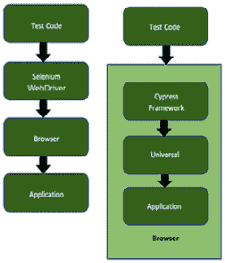

# 第二章：：Selenium WebDriver 和 Cypress 之间的差异

Cypress 和 Selenium WebDriver 都是支持端到端测试的测试自动化框架，当有人提到 Cypress 时，很快就需要比较或找出哪个比另一个更好。在我们开始了解 Selenium WebDriver 和 Cypress 之间的差异之前，我们首先需要了解两个测试框架开发的不同动机以及它们的预期用户是谁。

了解 Cypress 和 Selenium WebDriver 在架构上为何不同将在帮助您了解 Selenium WebDriver 和 Cypress 框架的不同和相似方面起到重要作用。在本节中，我们将评估 WebDriver 和 Cypress 在不同方面的独特之处、不同之处和相似之处。

我们将探讨 Selenium WebDriver 和 Cypress 的不同用例，并检查每个用例适用的目的。我们还将清楚地确定每个测试框架的受众，以及您可以从两者或每个测试框架中获得什么。我们将描述为什么应该选择 Cypress 作为测试自动化框架，以及为什么它是端到端测试自动化的完美候选者。

在了解了 Cypress 和 WebDriver 之间的差异和相似之处后，我们将总结列出使其在端到端网页测试自动化方面脱颖而出并领先于其他测试框架的因素和工具。以下是本章将涵盖的关键主题：

+   为什么选择 Cypress？

+   比较 Cypress 和 Selenium WebDriver

+   使用 Cypress 进行前端测试

通过本章的学习，您将能够了解 Cypress 与 Selenium WebDriver 之间的差异和相似之处，以及它在前端 Web 自动化测试中的优势。

# 为什么选择 Cypress？

Cypress 是一个端到端测试框架，由开发人员为开发人员和质量保证（QA）工程师编写。Cypress 专注于测试 Web 应用程序，由于自动化 Web 的唯一方法是使用 JavaScript，因此 Cypress 仅支持使用 JavaScript 编写其测试。

Cypress 专门为利用 JavaScript 开发其产品的前端团队编写，以及需要快速开始编写单元、集成和端到端测试的团队，而无需正确设置测试框架的复杂细节。

Cypress 不仅适合初学者，而且确保开发人员或 QA 工程师需要开始测试的一切都已经打包在从 Cypress 网站下载和安装的捆绑包中。Cypress 捆绑了自己的浏览器、测试运行器和 chai 作为断言框架。

拥有一个包含一切所需的捆绑包，可以让任何人开始测试的过程，而无需了解断言框架、测试运行器的设置过程，甚至不需要添加浏览器驱动程序，就像使用 Selenium WebDriver 的情况一样。

Cypress 使用 JavaScript，这使得 JavaScript 开发人员更容易上手并快速掌握 Cypress 的概念。上手的简便性还确保开发人员和 QA 工程师可以快速掌握使用 Cypress 编写测试的技能。由于 Cypress 是用 JavaScript 开发的，使用 JavaScript 的开发人员和 QA 团队发现它更容易调试，也更容易理解错误，因为它们与 JavaScript 应用程序中的错误类似。

Cypress 使用的通用驱动程序目前与 Firefox、Edge、Chrome 和 Chromium 系列浏览器兼容。与 Selenium 不同，Selenium 使用 WebDriver 并通过 HTTP 网络请求与**文档对象模型**（**DOM**）进行交互，而 Cypress 驱动程序直接在浏览器中工作，无需进行网络请求。在浏览器中运行测试的能力确保了 Cypress 能够有效地解释命令，而不会在命令从测试传递到驱动程序，然后到浏览器中运行的应用程序时引入超时。

使用通用驱动程序还确保了 Cypress 在所有浏览器中使用的方法的一致性，以及测试的标准格式，无论测试将在哪个浏览器中运行。采用这种方法，QA 团队或个人开发人员可以扩展他们的跨浏览器测试，因为唯一需要做的就是在新支持的浏览器上运行他们现有的测试套件。

Cypress 框架在浏览器上运行，因此在架构上与 Selenium WebDriver 等其他测试自动化工具不同。Cypress 在浏览器上运行的能力使其比其他自动化工具具有竞争优势，因为它自带了自动等待序列，否则需要在测试中定义。因此，Cypress 知道何时等待事件，例如网络请求，否则需要在 Selenium 驱动的测试中指定为显式或隐式等待。

像 JavaScript 框架这样的软件开发技术变化比测试技术和可用框架快得多。Cypress 提供了一个独特的机会，开发人员和 QA 工程师可以快速开始编写测试，而无需担心测试设置的问题。消除对底层测试基础设施的担忧不仅加快了测试过程，还确保团队可以快速开始软件开发生命周期中重要的任务。

## 总结-为什么选择 Cypress？

在这一部分，我们了解了为什么 Cypress 在网页开发测试方面是首选，以及它与其他测试框架（包括 Selenium WebDriver）的区别和优势。在下一部分，我们将直接比较 Cypress 和 Selenium WebDriver 之间的差异和相似之处。

# 比较 Cypress 和 Selenium WebDriver

很容易陷入这样的陷阱，认为 Cypress 可以取代 Selenium WebDriver，其使用可能会使 Selenium WebDriver 在测试自动化领域完全过时。虽然直接假设 Cypress 要么更好，要么优于 Selenium，或者反过来，这种想法是错误的，在大多数情况下都是不正确的。

在这一部分，我们将介绍 Cypress 的独特之处，以及它的目的如何更多地是作为 Selenium WebDriver 的补充而不是附加。接下来的部分将概述 Selenium WebDriver 和 Cypress 之间的一些差异。

## 浏览器驱动程序

Cypress 使用一个通用驱动程序来支持所有浏览器，而另一方面，Selenium WebDriver 使用不同的驱动程序来支持每个不同的浏览器。使用通用驱动程序可以在安装时在所有 Cypress 支持的浏览器上运行测试，而无需安装外部驱动程序。另一方面，Selenium 需要为每个浏览器安装驱动程序才能在不同浏览器中运行测试。通用驱动程序还使 Cypress 具有竞争优势，因为开发团队能够解决 WebDriver 中常见的问题，并将功能扩展到不同的浏览器。

## 重试和等待

Cypress 内置了显式重试来搜索**DOM**中的元素，并在测试被视为失败之前显式等待事件发生。Cypress 配备了确定请求是否需要等待的事件，然后浏览器决定它们是失败还是通过。Cypress 能够处理等待和重试，因为它与测试一起在浏览器上运行，并能够了解任何给定时间测试的状态。

另一方面，Selenium 利用 HTTP 请求到 WebDriver，因此在测试运行时很难确定是否需要显式或隐式等待。为了解决这个问题，Selenium 用户必须在测试需要等待请求完成后再执行下一步时自己编写等待。在测试运行时，Selenium 也不自带自动重试的功能，而 Cypress 却具备这一功能。

## 目标使用

Cypress 是为 JavaScript 开发人员和 QA 工程师设计的，他们希望快速建立自动化框架并开始测试端到端的 Web 应用程序，而不需要花费太多带宽来设置测试框架或理解构建测试框架背后的技术。使用 Cypress，开发人员可以轻松地从编写单元测试转向编写集成测试，甚至是接受测试，包括存根外部依赖项的功能，并测试他们的应用程序的行为。Cypress 目前也更偏向于与 Chromium 系列浏览器兼容的开发人员和 QA 实践，包括 Edge，还有目前处于测试阶段的 Firefox。

另一方面，Selenium WebDriver 是用来测试在网络上运行的任何东西。Selenium 专注于想要测试其 Web 应用程序的每个方面的 QA 团队，并不受浏览器兼容性或单一测试运行器等因素的限制，而这在 Cypress 中是存在的。Selenium WebDriver 为用户提供了使用不同浏览器和插件扩展它的选项，还支持不同的语言，如 Java、Python、Ruby、C＃、JavaScript、Perl 和 PHP。很难明确地说 Selenium 是 Cypress 的直接竞争对手，因为我们可以清楚地看到，虽然它们的用例非常相似，但它们的受众和目标用户完全不同。虽然 Selenium 针对所有主要开发语言的用户，甚至支持在诸如 Appium 之类的工具中进行移动自动化，但 Cypress 只专注于为理解 JavaScript 语言的 Web 开发人员和 QA 工程师提供更好的测试。

## 架构

Cypress 在浏览器上运行，这使其比 Selenium WebDriver 等工具更具优势。在浏览器上运行意味着 Cypress 速度更快，可以在运行时更快地解释命令，因为没有第三方服务代表其解释命令或向浏览器驱动程序发送 HTTP 请求。虽然所有 Cypress 命令都在浏览器内运行，但 Cypress 可以了解浏览器外发生的事情，因为它可以访问应用程序的所有内容，包括窗口对象、DOM、文档对象或任何其他进程和方法。只要您的应用程序有访问权限，Cypress 测试就会有访问权限。以下图表显示了 Cypress 与 Selenium WebDriver 架构的对比。在 Cypress 中，执行在浏览器中进行，而在 Selenium 中，执行在浏览器外进行：



图 2.1– Selenium 与 Cypress 测试执行架构的对比

## 跨浏览器兼容性

Cypress 目前不支持像 Selenium WebDriver 那样支持所有主要浏览器。Cypress 目前支持使用 Chromium 开源项目构建的浏览器，Firefox，Edge 和 Electron（Cypress 中的默认浏览器）。另一方面，Selenium 支持所有主要浏览器，这使得它在能够在多个平台上测试应用程序的能力方面具有优势。虽然可以争论跨三个以上浏览器的跨浏览器功能会增加架构复杂性，对测试过程的价值很小，但支持多个浏览器可能会导致识别出优先级较高的错误，即使错误的严重性可能很低。

## Cypress 的权衡

如前所述，Cypress 是一个专注于浏览器端到端测试自动化的测试工具。能够在浏览器上运行意味着 Cypress 可以与浏览器上的元素进行更好的交互，但这也意味着 Cypress 具有永久的权衡，由于其架构无法更改。这些权衡在以下子节中描述。

### 范围限制

Cypress 在作为 QA 工程师和编写测试的开发人员的自动化工具时效果最佳。Cypress 不支持手动自动化工具，并且没有计划在框架中集成手动测试工具。

Cypress 也不适用于诸如 Web 索引和性能测试之类的活动，进行这些活动可能会降低框架的性能能力。

### 环境限制

Cypress 在浏览器上运行，这意味着它始终支持的语言将是 JavaScript，因为测试代码将始终在浏览器中进行评估。能够在浏览器中运行意味着要连接到数据库或服务器，我们只能使用 Cypress 命令`cy.exec()`，`cy.request()`或`cy.task()`，这提供了一种公开数据库或服务器的方法，这可能比明确定义它们的配置并让 Cypress 理解它们更费力。在浏览器中运行测试为运行测试提供了很好的体验，但是要插入需要在浏览器外部运行的功能有点麻烦。

### 多个浏览器和多个标签-限制

Cypress 框架不支持测试在运行时控制多个浏览器的能力。这是一个永久的权衡，因为在一个浏览器中运行测试时无法控制多个浏览器。

Cypress 框架不支持与多个浏览器标签交互的能力，因为这种功能在浏览器内部不可用。但是，Cypress 提供了集成其他工具（如 Selenium 或 Puppeteer）以在需要时操作和驱动多个浏览器标签的能力。

### 控制来源的限制

Cypress 只支持在同一个测试中访问来自相同来源的 URL。控制来源的限制意味着对于任何特定的测试，您无法访问不属于相同来源的不同 URL。例如，尝试在同一个测试中发送请求到[`github.com`](https://github.com)和[`gitlab.com`](https://gitlab.com)将导致错误。以下示例说明了编写 Cypress 测试时利用跨域的不正确和正确的方式。

#### 正确地利用跨域来运行测试

在以下测试中，用户提示 Cypress 首先导航到[`github.com`](https://github.com) GitHub 网站，然后导航到[`docs.github.com/en`](https://docs.github.com/en)（文档链接）以获取 GitHub 资源。这两个链接都属于相同的来源`github.com`，因此 Cypress 执行请求时不会出现问题。

```js
It('can navigate to code repository hosting service', () => {
    cy.visit('https://github.com');
    cy.visit('https://docs.github.com');  });
```

#### 不正确地利用跨域来运行测试

在这个测试中，用户首先提示 Cypress 导航到[`github.com`](https://github.com)，然后再导航到 https://gitlab.com，这是与第一个 URL 不同源的网站。当运行测试时，这将导致错误被抛出：

```js
It('can navigate to code repository hosting service', () => {
    cy.visit('https://github.com');
    cy.visit('https://gitlab.com');  })
```

### Cypress 和 Selenium 互补的行动

在某些罕见但仍可实现的情况下，我们可以同时利用 Cypress 和 Selenium 编写测试。虽然 Cypress 有不能控制多个浏览器标签的限制，但可以配置 Cypress 使用 Selenium 来运行多个标签。我们还可以利用 Cypress 进行端到端测试，而使用 Selenium 进行诸如负载测试之类的活动。Selenium 能够执行 Cypress 不支持的负载测试等测试，并且在这种情况下，两个测试框架可以一起使用。

## 总结差异

Cypress 是为网络而构建的，并且经过优化以在浏览器上运行。Cypress 的架构允许它有效地运行测试，同时克服了 WebDriver 的挑战。虽然 Cypress 能够在浏览器上运行，但 WebDriver 使用 HTTP 协议与浏览器交互，因此在运行测试时会导致延迟和未知的等待事件。Cypress 还针对寻求编写测试而不必担心基础架构和断言库和编程语言限制的质量保证工程师和开发人员。Cypress 还承诺未来，计划支持 Safari 和 Internet Explorer，这将确保开发人员和测试人员可以在他们选择的浏览器上尝试 Cypress。

Cypress 捆绑了所有的优势，但也伴随着一些临时和永久的权衡。一些临时的权衡是支持所有主要浏览器或执行某些功能，比如悬停在一个元素上。另一方面，永久的权衡意味着 Cypress 的架构甚至在未来也无法支持它们。它们包括控制多个打开的浏览器和/或在浏览器中操作多个标签，能够连接到外部数据库和服务器，并调用不同的跨源。所有永久的权衡都有解决方法，用户可以随时实施解决方法。然而，Cypress 建议在不应该使用解决方法的情况下不要使用解决方法，因为这可能会导致测试自动化复杂性，从而降低 Cypress 作为自动化工具的效果。

## 总结-比较 Cypress 和 Selenium WebDriver

在这一部分，我们了解了使用 Cypress 的优势，并将其与使用 Selenium 编写测试进行了比较。我们还确定了为什么 Selenium 在架构上与 Cypress 不同，以及为什么两者更多地是互补而不是补充。我们探讨了 Cypress 存在的权衡以及在 Cypress 自动化框架中克服永久权衡的一些解决方案。在下一节中，我们将深入探讨使 Cypress 成为端到端网页测试自动化的最佳选择的工具。

# Cypress 用于前端应用程序

Cypress 是为网络而构建的，这意味着它装载了一些其他框架可能没有的工具和功能。这提高了前端 Web 开发人员和质量保证工程师的测试体验。在这一部分，我们将探讨 Cypress 装载的不同元素，这些元素使其用户可以方便地开始并快速上手。以下是一些使 Cypress 脱颖而出的元素，这些元素使其与其他前端应用程序的测试自动化框架不同。

## 测试运行器

当 Cypress 安装在用户的计算机上时，默认情况下会附带 Cypress 测试运行器。这是一个交互式用户界面，允许 Cypress 框架的用户查看测试中运行的命令，以及与之交互的应用程序。测试运行器具有显示测试失败次数、测试通过次数、跳过的测试、命令日志以及测试运行时浏览器的视口的能力。

## 设置过程

如前一章所述，Cypress 的设置过程不仅清晰简单，而且确保 QA 工程师和前端开发人员只需运行一个命令即可安装 Cypress。这消除了配置外部依赖项来开始编写测试的需要。Cypress 文档也非常互动和清晰，这使得开发人员和 QA 工程师可以快速上手并使用 Cypress 的功能。

## 实施和调试

Cypress 测试运行器带有内置的命令日志，这意味着在调试模式下，用户可以实时检查已通过的命令和断言，以及未通过的命令。突出显示失败的命令并检查未能调用的元素或失败的功能的能力使 Cypress 脱颖而出，因为调试前端应用程序不仅变得轻而易举，而且还节省了用于调查失败原因的时间。命令日志还为 Cypress 用户提供了即时反馈，他们可以通过检查测试运行器上运行的命令来判断测试是否已经正确编写。

## 全面的测试能力

Cypress 结合了编写功能测试和检查前端发出的 API 调用的响应的能力。它还具有可视化回归功能，可以识别应用程序是否有意进行了更改。

在编写功能测试时，Cypress 框架会检查前端功能是否符合需求文档中规定的要求，这可能涉及点击按钮或注册用户等过程。

API 验证测试另一方面检查返回的 XHR（XMLHttpRequest）请求是否成功，并在请求返回时收到正确的响应。XHR 请求为 API 测试提供了额外的验证层，因为我们可以确认预期数据的结构与前端应用程序中收到的数据类似。

重要说明

XHR 作为 API 工作，但以对象的形式表示，其主要目的是在给定的 Web 服务器和 Web 浏览器之间传输数据。

可视化回归测试通过比较基线的页面快照和最新测试运行的页面快照来检查页面元素的一致性。如果发现差异，那么正在运行的测试将失败。失败时，将创建一个显示预期图像和生成图像之间差异的快照，以显示生成的快照与基线图像之间的差异。测试运行后，QA 工程师或开发人员可以接受或拒绝对前端应用程序所做的更改。

## 回顾-用于前端应用程序的 Cypress

在本节中，我们了解了为什么 Cypress 在测试前端应用程序时是最合适的。我们了解了使其成为首选测试框架的不同因素，以及如何利用其优势来编写更好、更全面的测试。

# 总结

毫无疑问，Cypress 是一个强大的工具，可以被前端团队和质量保证工程师利用，快速开始编写测试，而不必担心从头开始构建测试自动化工具所带来的额外开销。在本章中，我们了解了为什么 Cypress 是用于测试的最佳 Web 自动化框架，我们通过比较 Cypress 和现有测试自动化工具之间的不同工具来做到这一点。我们还介绍了 Cypress 和 Selenium 之间的区别，以及两者之间的特定架构相似性和差异性。最后，我们探讨了如何利用这些工具。在下一章中，我们将学习如何使用命令行工具来运行、测试和调试 Cypress 测试。
