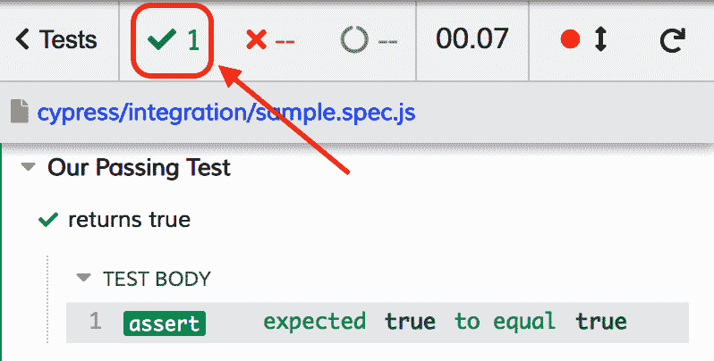
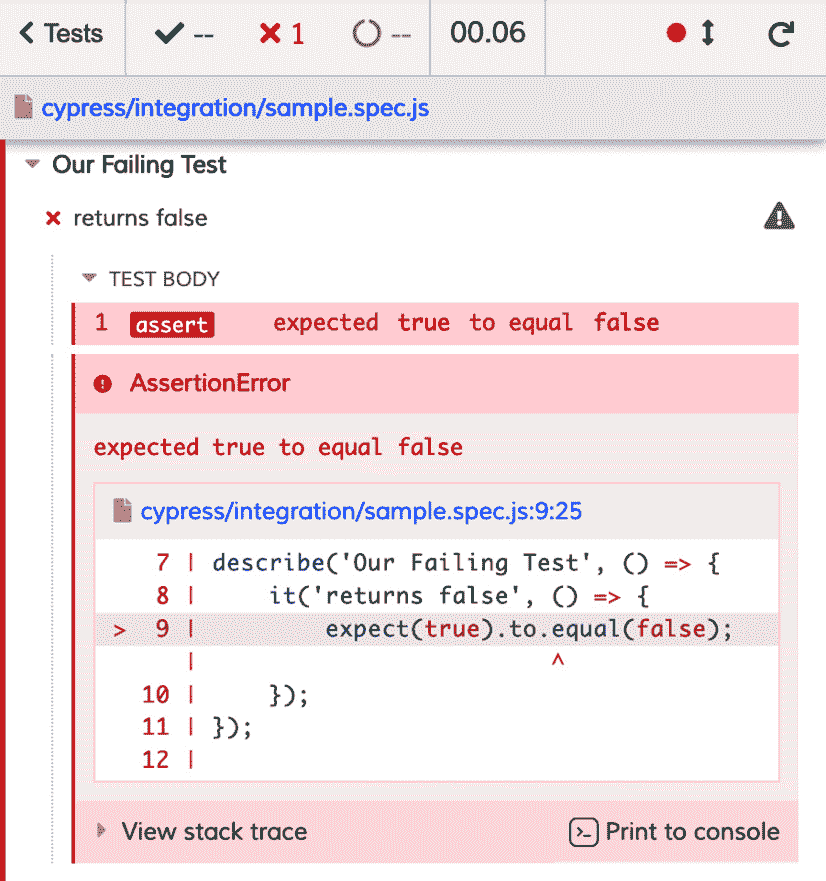
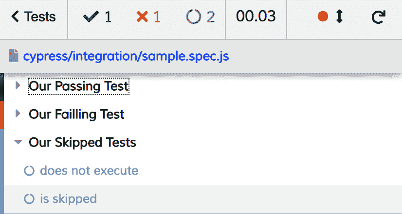
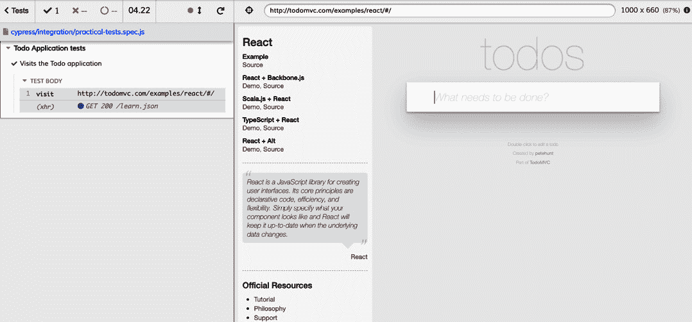
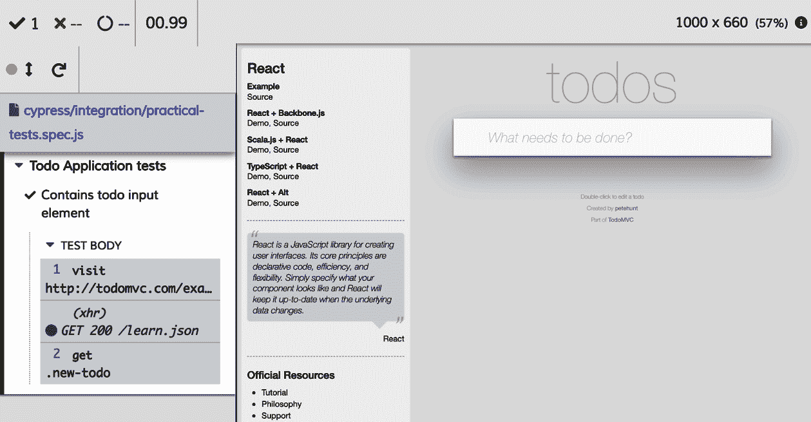

# 第四章：编写您的第一个测试

在开始本章之前，您需要了解 Cypress 测试的运行方式，不同的 Cypress 命令，如何设置 Cypress，在命令行上运行 Cypress 以及如何使用测试运行器打开 Cypress 测试。这些信息在前三章中已经涵盖，将帮助您更好地理解我们在本章中编写第一个测试时所要建立的基础知识。

在本章中，我们将介绍创建测试文件和编写基本测试的基础知识，然后我们将继续编写更复杂的测试，并使用 Cypress 断言各种元素。

我们将在本章中涵盖以下主题：

+   创建测试文件

+   编写您的第一个测试

+   编写实用测试

+   Cypress 的自动重新加载功能

+   Cypress 断言

通过完成本章，您将准备好学习如何使用测试运行器调试运行中的测试。

# 技术要求

本章的 GitHub 存储库可以在以下链接找到：

[`github.com/PacktPublishing/End-to-End-Web-Testing-with-Cypress`](https://github.com/PacktPublishing/End-to-End-Web-Testing-with-Cypress)

本章的源代码可以在`chapter-04`目录中找到。

# 创建测试文件

Cypress 中的所有测试必须在测试文件中才能运行。要使测试被认为是有用的，它必须验证我们在测试中定义的所有条件，并返回一个响应，说明条件是否已满足。Cypress 测试也不例外，所有在测试文件中编写的测试都必须有一组要验证的条件。

在本节中，我们将介绍编写测试文件的过程，从 Cypress 中测试文件应该位于的位置开始，Cypress 支持的不同扩展名，以及 Cypress 中编写的测试文件应该遵循的文件结构。

## 测试文件位置

Cypress 在初始化时默认在`cypress/integration/examples`目录中创建测试文件。但是，这些文件可以被删除，因为它们旨在展示利用不同的 Cypress 测试类型和断言的正确格式。Cypress 允许您在定位不同模块和文件夹结构时具有灵活性。

建议在您第一次项目中工作时，使用前面段落中提到的位置来编写您的 Cypress 测试。要重新配置 Cypress 文件夹结构，您可以更改 Cypress 默认配置并将新配置传递到`cypress.json`文件中。更改默认 Cypress 配置的一个很好的例子是将我们的测试目录从`cypress/integration/examples`更改为`cypress/tests/todo-app`或其他位置。要更改默认目录，我们只需要更改我们的`cypress.json`配置，如下所示：

```js
{
"integrationFolder": "cypress/tests"
}
```

前面的代码块显示了`integrationFolder`设置，它改变了 Cypress `tests`字典的配置方式。

## 测试文件扩展名

Cypress 接受不同的文件扩展名，这使我们能够编写超出正常 JavaScript 默认格式的测试。以下文件扩展名在 Cypress 测试中是可接受的：

+   `.js`

+   `.jsx`

+   `.coffee`

+   `.cjsx`

除此之外，Cypress 还原生支持 ES2015 和 CommonJS 模块，这使我们可以在没有任何额外配置的情况下使用**import**和**require**等关键字。

## 测试文件结构

Cypress 中的测试文件结构与大多数其他用于编写测试或甚至普通 JavaScript 代码的结构类似。Cypress 测试的结构考虑了模块导入和声明，以及包含测试的测试主体。这可以在以下示例测试文件中看到：

```js
 // Module declarations
import {module} from 'module-package';
 // test body
describe('Test Body', () => {
   it('runs sample test', () => {
      expect(2).to.eq(2);
   })
})
```

正如您所看到的，每个测试文件都需要在测试文件的最顶部进行声明。通过这样做，测试可以嵌套在`describe`块中，这些块指定了将要运行的测试的范围和类型。

## 创建我们的测试文件

使用*技术要求*部分中的 GitHub 链接，打开`chapter-04`文件夹。按照以下步骤创建您的第一个测试文件：

1.  导航到 Cypress 目录内的`integration`文件夹目录。

1.  创建一个名为`sample.spec.js`的空测试文件。

1.  为了演示目的，我们已经在`chapter-04`根目录中为您创建了一个`package.json`文件。您现在只需要运行命令，不用担心它们的工作原理。

1.  使用`npm run cypress:run`命令启动 Cypress 测试运行器。

1.  检查测试运行器预览，并确认我们添加的测试文件是否可见。

现在是快速回顾的时候了。

## 总结-创建测试文件

在本节中，我们学习了如何创建测试文件，Cypress 如何接受不同的测试文件格式，以及如何更改 Cypress 测试的默认目录。我们还学习了测试的结构，以及 Cypress 如何借鉴诸如 JavaScript 等语言的测试格式。在下一节中，您将专注于编写您的第一个测试。

# 编写您的第一个测试

Cypress 测试与任何其他测试没有区别。与所有其他测试一样，当预期结果与被测试应用程序的预期一致时，Cypress 测试应该通过；当预期结果与应用程序应该执行的操作不一致时，测试应该失败。在本节中，我们将探讨不同类型的测试、测试的结构以及 Cypress 如何理解测试文件中的更改并重新运行测试。本节还将介绍如何编写实用测试。

## 示例测试

在本节中，我们将看一下 Cypress 测试的基本结构。这在本章的大部分测试中保持标准。以下测试检查我们期望的结果和返回的结果是否等于`true`。当我们运行它时，它应该通过：

```js
describe('Our Sample Test', () => {
  it('returns true', () => {
    expect(true).to.equal(true);
  });
});
```

在这里，我们可以看到测试中有`describe()`和`it()`钩子。Cypress 测试中包含的钩子默认来自**Chai**断言库，Cypress 将其用作默认断言库。这些钩子用于帮助您理解测试的不同阶段。`describe`钩子帮助将不同的测试封装到一个块中，而`it`钩子帮助我们在测试块中识别特定的测试。

重要提示

Chai 断言库作为一个包包含在 Cypress 框架中。这是 Cypress 用来验证测试成功或失败的默认断言库。

考虑到我们在本节中看到的测试，我们现在将探讨 Cypress 中不同类型的测试分类。

## 测试分类

测试可以根据运行后产生的结果进行分类。Cypress 测试也可以根据它们的状态进行分类。测试可以处于以下任何状态：

+   通过

+   失败

+   跳过

在接下来的几节中，我们将详细了解这三个类别。

### 通过测试

通过测试是正确验证输入是否与预期输出匹配的测试。在 Cypress 中，通过测试会被清晰地标记为通过，并且这在命令日志和 Cypress 测试运行器上是可见的。使用我们之前创建的`sample.spec.js`文件，我们可以创建我们的第一个通过测试，如下面的代码块所示：

```js
describe('Our Passing Test', () => {
  it('returns true', () => {
    expect(true).to.equal(true);
  });
});
```

要在使用`chapter-04`目录作为参考时运行测试，我们可以在命令行界面上运行以下命令：

```js
npm run cypress:open 
```

在这个测试中，我们正在验证给定的输入`true`是否与我们期望的测试输出`true`相似。这个测试可能并不是非常有用，但它的目的是展示一个通过的测试。以下截图显示了一个通过的测试：



图 4.1 – 通过的测试

前面的截图显示了在命令日志中通过测试的结果。我们可以通过查看左上角的绿色复选标记进一步验证测试是否通过了所有其他条件。

### 失败的测试

与通过的测试一样，失败的测试也验证测试输入与测试期望，并将其与结果进行比较。如果预期结果和测试输入不相等，则测试失败。Cypress 在显示失败的测试并描述测试失败方面做得很好。使用我们之前创建的`sample.spec.js`文件，创建一个失败的测试，如下面的代码块所示：

```js
describe('Our Failing Test', () => {
  it('returns false, () => {
    expect(true).to.equal(false);
  });
});
```

要运行测试，我们将使用`chapter-04`目录作为参考，然后在终端中运行以下命令：

```js
npm run cypress:open
```

在这个失败的测试中，我们将一个`true`的测试输入与一个`false`的测试期望进行比较，这导致了一个设置为`true`的失败测试，它不等于`false`。由于它未通过确定我们的测试是否通过的验证，测试自动失败。以下截图显示了我们失败测试的结果在命令日志中：



图 4.2 – 失败的测试

查看命令日志，我们可以看到我们有两个测试：一个通过，一个失败。在失败的测试中，Cypress 命令日志显示了未满足我们期望的断言。另一方面，测试运行器继续显示一个失败的测试，作为我们测试运行的摘要。当测试失败时，Cypress 允许我们阅读发生的确切异常。在这种情况下，我们可以清楚地看到测试在断言级别失败，原因是断言不正确。

### 跳过的测试

Cypress 中的跳过测试不会被执行。跳过测试用于省略那些要么失败要么不需要在执行其他测试时运行的测试。跳过测试在其测试钩子后缀为`.skip`关键字。我们可以通过使用`describe.skip`跳过整个代码块中的测试，或者通过使用`it.skip`跳过单个测试。以下代码块显示了两个测试，其中主`describe`块被跳过，另一个测试在`describe`块内被跳过。以下代码说明了跳过 Cypress 测试的不同方法：

```js
describe.skip('Our Skipped Tests', () => {
    it('does not execute', () => {
        expect(true).to.equal(true);
    });
    it.skip('is skipped', () => {
        expect(true).to.equal(false);
    });
});
```

在这里，我们可以看到当我们在`it`或`describe`钩子中添加`.skip`时，我们可以跳过整个代码块或特定测试。以下截图显示了一个跳过的测试：



图 4.3 – 跳过测试

跳过的测试在命令日志和测试运行器中只显示为跳过；对于已跳过的测试块或单个测试，不会发生任何活动。前面的截图显示了我们在`sample.spec.js`文件中定义的跳过测试的状态，该文件可以在我们的`chapter-04`GitHub 存储库目录中找到。现在我们知道如何编写不同类型的测试，我们可以开始编写实际的测试。但首先，让我们测试一下我们的知识。

## 测试分类练习

使用您在本章节阅读中获得的知识，编写符合以下标准的测试：

+   一个通过的测试，断言一个变量是`string`类型

+   一个失败的测试，断言一个有效的变量等于`undefined`

+   一个跳过的测试，检查布尔变量是否为`true`

现在，让我们回顾一下本节我们所涵盖的内容。

## 总结 – 编写您的第一个测试

在本节中，我们学习了如何识别不同类型的测试，并了解了 Cypress 框架如何处理它们。我们学习了通过测试、失败测试和跳过测试。我们还学习了 Cypress 测试运行器如何显示已通过、失败或已跳过的测试状态。最后，我们进行了一项练习，以测试我们对测试分类的知识。现在，让我们继续撰写一个实际的测试。

# 撰写实际测试

在上一节中，我们学习了 Cypress 中不同测试分类的基础知识以及分类结果。在本节中，我们将专注于编写超越断言布尔值是否等于另一个布尔值的测试。

对于任何测试都需要有价值，它需要有三个基本阶段：

1.  设置应用程序的期望状态

1.  执行要测试的操作

1.  在执行操作后断言应用程序的状态

在我们的实际测试中，我们将使用我们的**Todo**应用程序来编写与编写有意义的测试所需的三个基本阶段相对应的测试。为此，我们将完成以下步骤：

1.  访问 Todo 应用程序页面。

1.  搜索元素。

1.  与元素交互。

1.  对应用程序状态进行断言。

这些步骤将指导我们即将撰写的实际测试，并将帮助我们全面了解 Cypress 测试。

## 访问 Todo 应用程序页面

这一步涉及访问 Todo 应用程序页面，这是我们将运行测试的地方。Cypress 提供了一个内置的`cy.visit()`命令用于导航到网页。以下代码块显示了我们需要遵循的步骤来访问我们的 Todo 页面。这个代码块可以在本书的 GitHub 存储库的`chapter-04`文件夹中的`practical-tests.spec.js`文件中找到：

```js
describe('Todo Application tests', () => {
  it('Visits the Todo application', () => {
    cy.visit('http://todomvc.com/examples/react/#/')
  })
})
```

当此测试运行时，在观察命令日志时，我们将看到`visit`命令，以及我们刚刚访问的应用程序在右侧的 Cypress 应用程序预览中，如下图所示：



图 4.4 - 访问 Todo 应用程序

即使我们的应用程序没有任何断言，我们的测试仍然通过，因为没有导致 Cypress 抛出异常从而导致测试失败的错误。Cypress 命令默认会在遇到错误时失败，这增加了我们在编写测试时的信心。

## 搜索元素

为了确保 Cypress 在我们的应用程序中执行某些操作，我们需要执行一个会导致应用程序状态改变的操作。在这里，我们将搜索一个 Todo 应用程序输入元素，该元素用于*添加一个 Todo*项目到我们的应用程序中。以下代码块将搜索负责添加新 Todo 项目的元素，并验证它是否存在于我们刚刚导航到的 URL 中：

```js
it('Contains todo input element', () => {
  cy.visit('http://todomvc.com/examples/react/#/')
  cy.get('.new-todo')
});
```

当 Cypress 的`cy.get()`命令找不到输入元素时，将抛出错误；否则，Cypress 将通过测试。要获取输入元素，我们不需要验证元素是否存在，因为 Cypress 已经使用大多数 Cypress 命令中链接的**默认断言**来处理这个问题。

重要提示

Cypress 中的默认断言是内置机制，将导致命令失败，而无需用户声明显式断言。通过这些命令，Cypress 会处理异常的行为，如果在执行该命令时遇到异常。

以下屏幕截图显示了 Cypress 搜索负责向我们的 Todo 列表添加 Todo 项目的 Todo 输入元素：



图 4.5 - 搜索 Todo 输入元素

在这里，我们可以验证 Cypress 访问了 Todo 应用程序的 URL，然后检查添加 Todo 项目的输入元素是否存在。

## 与待办事项输入元素交互

现在我们已经确认我们的待办事项应用程序中有一个输入元素，是时候与应用程序进行交互并改变其状态了。为了改变待办事项应用程序的状态，我们将使用我们验证存在的输入元素添加一个待办事项。Cypress 将命令链接在一起。为了与我们的元素交互，我们将使用 Cypress 的`.type()`命令向元素发送一个字符串，并将待办事项添加到应用程序状态中。以下的代码块将使用待办事项输入元素添加一个新的待办事项：

```js
it('Adds a New Todo', () => {
  cy.visit('http://todomvc.com/examples/react/#/')
  cy.get('.new-todo').type('New Todo {enter}')
});
```

上面的代码块建立在之前的代码基础上，使用了 Cypress 的`type()`函数来添加一个新的待办事项。在这里，我们还调用了 Cypress `type`方法的`{enter}`参数来模拟*Enter*键的功能，因为待办事项应用程序没有提交按钮供我们点击来添加新的待办事项。以下的截图显示了添加的待办事项。通过这个项目，我们可以验证我们的测试成功地添加了一个新的待办事项。这个项目在待办事项列表上是可见的：


图 4.6 – 与待办事项输入元素交互

我们的测试运行器显示已创建了一个新的待办事项。再次，我们的测试通过了，即使没有断言，因为已运行的命令已经通过了默认的 Cypress 断言。现在，我们需要断言应用程序状态已经改变。

## 断言应用程序状态

现在我们已经添加了我们的待办事项，我们需要断言我们的新待办事项已经被添加，并且应用程序状态已经因为添加待办事项而改变。为了做到这一点，我们需要在添加待办事项后添加一个断言。在下面的代码块中，我们将断言我们对应用程序状态的更改。在这里，我们添加了一个断言来检查`.Todo-list`类，它包含了列表项，是否等于`2`：

```js
it('asserts change in application state', () => {
      cy.visit('http://todomvc.com/examples/react/#/')

      cy.get('.new-todo').type('New Todo {enter}')
      cy.get('.new-todo').type(Another Todo {enter}')
      cy.get(".todo-list").find('li').should('have.length', 2)
   });
```

为了进一步验证我们的状态更改，我们可以添加更多的待办事项来验证随着我们添加待办事项，待办事项的数量是否增加。

在 Cypress 中，我们可以使用断言函数，比如`.should()`和`expect()`，它们都包含在构成 Cypress 的工具中。默认情况下，Cypress 扩展了 Chai 库中的所有函数，这是默认的 Cypress 断言库。下面的截图显示了两个已添加的待办事项和 Cypress 预览中的确认说明，说明这两个已添加的待办事项存在于待办事项列表中：


图 4.7 – 断言应用程序状态

在这个测试中，我们可以验证所有添加的待办事项是否在 Cypress 应用程序的预览页面上可见，并且我们的断言通过了。现在我们可以添加更多的断言，特别是检查第一个待办事项的名称是否为`New Todo`，而另一个添加的待办事项是否叫做`Another Todo`。为了做到这一点，我们将在我们的测试中添加更多的断言，并检查我们的待办事项的具体细节。在下面的代码块中，我们将验证 Cypress 是否能够检查已添加的待办事项的名称；即*New Todo*和*Another Todo*：

```js
  it('asserts inserted todo items are present', () => {
     cy.visit('http://todomvc.com/examples/react/#/')

     cy.get('.new-todo').type('New Todo {enter}')
     cy.get('.new-todo').type('Another Todo {enter}')
     cy.get(".todo-list").find('li').should('have.length', 2)
     cy.get('li:nth-child(1)>div>label').should(         'have.text', 'New Todo')
     cy.get('li:nth-child(2)>div>label').should(         'have.text', 'Another Todo')
    });
```

在这些断言中，我们使用了 Cypress 的`cy.get()`方法通过它们的 CSS 类来查找元素，然后通过它们的文本标识了第一个和最后一个添加的待办事项。

## 实际测试练习

使用*技术要求*部分提到的 GitHub 存储库链接，编写一个测试，导航到待办事项应用程序并向其添加三个新的待办事项。编写测试来检查已添加的待办事项是否存在，通过验证它们的值和数量。

## 总结 – 编写实际测试

在本节中，我们编写了我们的第一个实际测试。在这里，我们访问了一个页面，检查页面是否有一个输入元素，与该元素进行交互，并断言应用程序状态是否发生了变化。在了解了 Cypress 中测试的流程之后，我们现在可以继续并了解 Cypress 中使测试编写变得有趣的功能，比如自动重新加载。

# Cypress 的自动重新加载功能

默认情况下，Cypress 会监视文件更改，并在检测到文件更改时立即重新加载测试。这仅在 Cypress 运行时发生。Cypress 的自动重新加载功能非常方便，因为您无需在对测试文件进行更改后重新运行测试。

通过自动重新加载功能，可以立即获得反馈，并了解他们的更改是否成功，或者他们的测试是否失败。因此，这个功能可以节省本来用于调试测试或检查所做更改是否修复问题的时间。

虽然 Cypress 的自动重新加载功能默认启用，但您可以选择关闭它，并在进行更改后手动重新运行测试。Cypress 允许您停止监视文件更改。这可以通过配置`cypress.json`文件或使用 Cypress 的命令行配置选项来完成。在使用`cypress.json`配置文件时，您必须使用以下设置来禁用监视文件更改：

```js
{
 "watchForFileChanges": "false"
}
```

此设置将持续并永久禁用文件更改，只要 Cypress 正在运行，除非配置被更改为`true`。在禁用 Cypress 监视文件更改方面的另一个选项是使用此处显示的命令行配置选项：

```js
cypress open --config watchForFileChanges=false
```

使用这个命令，Cypress 将暂时停止监视文件更改，并且只有在我们在终端窗口停止 Cypress 执行时才会改变这种行为。然后 Cypress 将继续监视文件更改，并在对测试文件进行更改时自动重新加载。

## 总结 - Cypress 的自动重新加载功能

在本节中，我们学习了 Cypress 如何利用自动重新加载功能来监视文件更改，并在测试文件发生任何更改时立即重新加载和重新运行。我们还学习了如何通过永久禁用它使用`cypress.json`文件或在运行测试时通过命令行配置传递命令来轻松关闭 Cypress 的自动重新加载功能。接下来，我们将看看 Cypress 断言。

# Cypress 断言

正如我们在上一节中学到的，当编写我们的第一个测试时，断言存在是为了描述应用程序的期望状态。Cypress 中的断言就像是测试的守卫，它们验证期望状态和当前状态是否相同。Cypress 断言是独特的，因为它们在 Cypress 命令运行时会重试，直到超时或找到元素为止。

Cypress 断言源自**chai**、**chai-jquery**和**sinon-chai**模块，这些模块与 Cypress 安装捆绑在一起。Cypress 还允许您使用 Chai 插件编写自定义断言。但是，在本节中，我们将重点放在 Cypress 捆绑的默认断言上，而不是可以扩展为插件的自定义断言。

我们可以以两种方式编写 Cypress 断言：要么显式定义主题，要么隐式定义主题。Cypress 建议在断言中隐式定义主题，因为它们与 Cypress 命令正在处理的元素直接相关。以下是 Cypress 框架中断言的分类方式：

+   隐式主题：`.should()`或`.and()`

+   显式主题：`expect()`

让我们详细看看每一个。

## 隐式主题

`should`或`and`命令是 Cypress 命令，这意味着它们可以直接作用于 Cypress 立即产生的主题。这些命令也可以与其他 Cypress 命令链接，这使它们易于使用，同时在调用它们时保证立即响应。以下代码块演示了如何测试隐式主题。在这里，我们将使用`cy.get`命令的输出来对我们的测试进行断言：

```js
describe('Cypress Assertions', () => {
    it('Using Implicit subjects - should', () => {
        cy.visit('http://todomvc.com/examples/react/#/')
        // Check if todo input element has expected 
        // placeholder value
        cy.get(".new-todo").should('have.attr', 'placeholder',
        'What needs to be done?')
    });
});
```

在这里，我们使用`should()`命令来断言 Todo 项目的输入元素是否具有占位符值。`should`命令是从`cy.get()`命令链接的。这不仅使其易于使用，而且还减少了断言占位符是什么的代码量。在以下代码块中，我们正在组合`cy.get`命令返回的隐式主题的不同断言：

```js
it('Using Implicit subjects - and()', () => {
        cy.visit('http://todomvc.com/examples/react/#/')
        // Check if todo input element has expected   
        // placeholder value
        cy.get(".new-todo")
         .should('have.attr', 'placeholder',
          'What needs to be done?')
        .and('have.class', 'new-todo')
    });
```

在这里，我们使用了`.and()`Cypress 命令来进一步验证刚刚产生的元素既有一个占位符，又有一个名为`new-todo`的 CSS 类。通过这些隐式断言，我们可以验证通过隐式主题，我们可以从 Cypress 的相同产生的响应中链接多个命令，并且还可以断言不同的项目。以下代码块显示了使用显式主题进行的代码断言，其中我们必须声明我们正在断言的每个主题：

```js
it('Using Explicit subjects', () => {
        cy.visit('http://todomvc.com/examples/react/#/')
        cy.get(".new-todo").should( ($elem) => {
        expect($elem).to.have.class('new-todo')
        expect($elem).to.have.attr('placeholder','What needs 
        to be done?')
        })
    });
```

正如您所看到的，当使用隐式主题时，我们可以进行更清晰的断言，并减少我们编写的代码量。在这个代码块中，每个断言都必须在同一行上并且单独执行。

## 显式主题

当我们想要断言在运行测试时定义的特定主题时，我们使用`expect()`。显式主题在**单元测试**中很常见，在需要在执行断言之前执行一些逻辑或者对同一主题进行多个断言时非常有用。以下代码块显示了使用`expect`方法进行显式主题断言：

```js
it('can assert explicit subjects', () => {
  const eqString = 'foo';  
  expect(eqString).to.eq('foo');
  expect(eqString).to.have.lengthOF(3);
  expect(eqString).to.be.a('string');
})
```

这个代码块显示了对实例化的`string`与我们的期望进行显式比较。声明的`string`是一个显式主题，这意味着它可以被断言多次，并且在执行断言之前也可以被操作。

对于复杂的断言，我们可以使用`.should()`方法来断言显式主题。这允许传递一个回调函数作为第一个参数，该回调函数具有作为第一个参数产生的主题。我们可以在`should`函数内添加断言，如下所示：

```js
it('Using Should with Explicit subjects', () => {
        cy.visit('http://todomvc.com/examples/react/#/')
        cy.get(".new-todo").should( ($elem) => {
        expect($elem).to.have.class('new-todo')
        })
 });
```

在这里，我们访问了 URL，然后使用从`cy.get('new-todo')`产生的元素来断言名为`new-todo`的 CSS 类是否存在。这个测试允许我们查询一个元素，并且根据需要为主题编写不同的断言。

## 练习-隐式和显式主题

使用您从本节中获得的知识，并使用*技术要求*部分提到的 GitHub 存储库链接作为参考点，完成以下练习。

转到 Todo 应用程序 URL（[`todomvc.com/examples/react/#/`](http://todomvc.com/examples/react/#/)）并添加一个 Todo：

+   使用隐式主题断言编写一个测试，以断言 Todo 已添加，并且输入的名称与 Todo 项目列表上显示的名称相同。

+   在 Todo 应用程序 URL 上，将一个 Todo 标记为已完成。然后，使用显式主题的断言，编写一个测试来验证已完成的 Todo 是否已标记为已完成。

## 总结- Cypress 断言

在本节中，我们学习了如何断言显式和隐式主题，并看了它们之间的不同和相似之处。我们还了解到不同的断言类型可以用于不同的主题。然后我们有机会进行练习，以练习我们断言隐式和显式主题的技能。

# Summary

在本章中，我们学习了如何通过理解 Cypress 中的通过、失败和跳过测试的含义以及 Cypress 在测试运行器和命令日志中查看和表示测试来对测试进行分类。我们还了解了测试文件的结构以及 Cypress 测试的可接受文件扩展名。然后，我们编写了我们的第一个实际测试，测试了一个待办事项应用程序能够添加、删除和标记待办事项为已完成。本章的重点是学习 Cypress 如何监视文件更改以及我们如何在 Cypress 中进行断言，无论是通过显式断言我们的测试对象还是隐式断言它们。通过完成本章，您将了解如何通过使用元素并理解可用的断言来在 Cypress 中编写基本测试。在下一章中，我们将学习如何在 Cypress 中调试运行测试以及我们可以用于此目的的工具。
