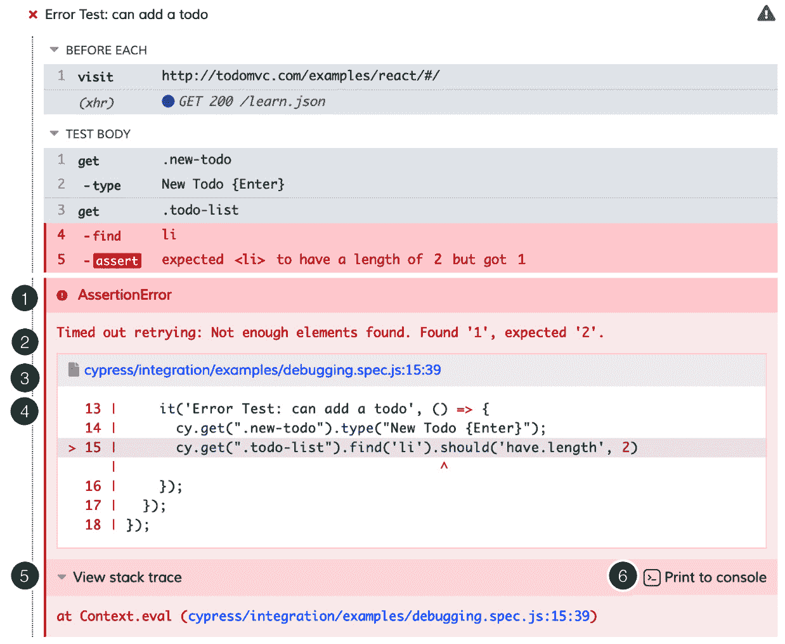
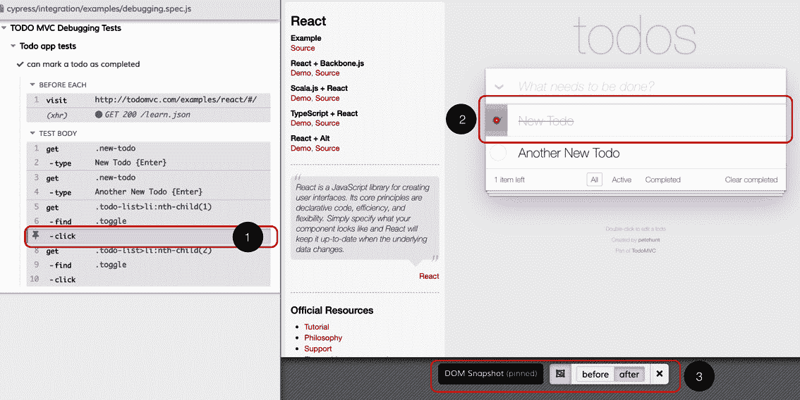
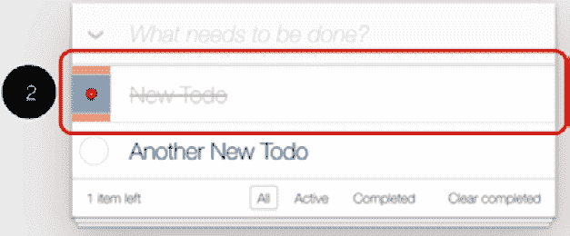
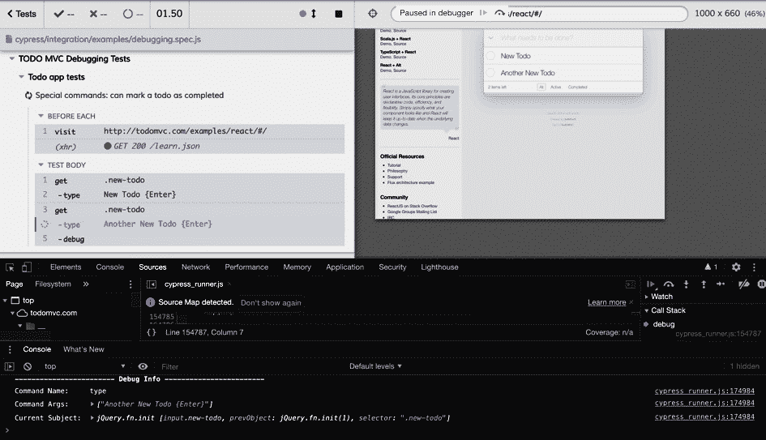
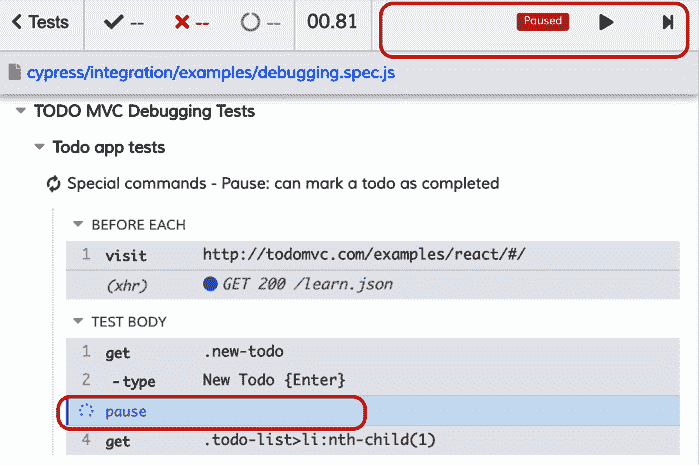

# 第五章：调试 Cypress 测试

调试是识别和消除软件应用程序中的错误的能力。了解 Cypress 中的调试并学习如何解释 Cypress 的调试输出对于使用 Cypress 框架至关重要。Cypress 以其能够立即提供关于测试是否通过或失败的反馈而自豪。为了让 Cypress 实现即时反馈机制，它必须在调试消息的结构上有效，以便为用户提供解释的便利性。

要在本章取得成功，您需要阅读前几章，因为它们将帮助您了解测试的运行方式，Cypress 的工作原理以及我们可以运行 Cypress 测试的不同方式。在本章中，我们将专注于在测试运行器中运行 Cypress 测试时调试 Cypress 测试。

虽然本章将探讨使用测试运行器调试 Cypress，但 Cypress 捆绑了其他调试工具，我们可能不会在本章中涵盖，因为它们要么已经在前几章中涵盖过，要么超出了本书的范围。在本章中，我们将学习 Cypress 调试在测试运行器中的工作原理。为此，我们将涵盖以下主题：

+   理解页面事件

+   理解测试运行器上的错误

+   理解执行测试的时间旅行

+   理解测试快照

+   理解控制台调试输出

+   特殊调试命令

一旦您完成了这些主题中的每一个，您就准备好开始本书的第二部分，其中涉及使用**测试驱动开发**（**TDD**）方法编写 Cypress 测试。

# 技术要求

本章的 GitHub 存储库可以在[`github.com/PacktPublishing/End-to-End-Web-Testing-with-Cypress`](https://github.com/PacktPublishing/End-to-End-Web-Testing-with-Cypress)找到。

本章的源代码可以在`chapter-05`目录中找到。

# 理解页面事件

Cypress 记录测试运行时发生的每个主要事件。它可以检测到 URL 的更改，按钮的点击，甚至断言的执行。页面事件捕获了测试运行时 DOM 经历的重要事件。

为了演示页面事件的工作原理，我们将使用我们的待办事项应用程序，就像在上一章中一样。在我们的 GitHub 存储库中的`chapter-05`目录中，我们将在 Cypress 集成子目录中创建我们的测试文件，并将其命名为`debugging.spec.js`。然后，我们将在新创建的规范文件中创建我们的测试，该测试将导航到待办事项应用程序，添加一个待办事项，并检查在我们的 Cypress 测试运行器中弹出的页面事件。以下代码块将处理将待办事项添加到我们的应用程序中：

```js
it('can add a todo', () => {
      cy.get(".new-todo").type("New Todo {Enter}");
      cy.get(".todo-list").find('li').should('have.length', 
      1)
 });
```

在这个测试中，我们正在添加一个待办事项，并检查我们添加的项目是否可以从待办事项列表中查看。以下屏幕截图显示了一个 XHR 页面事件：


图 5.1 - XHR 页面事件

上述屏幕截图显示了前一个测试的命令日志的一部分。名为`xhr`的突出显示部分是在 Cypress 中加载新页面的页面事件。页面事件由 Cypress 机制自动检测到，并自动记录 - 不是作为需要执行的命令，而是作为触发应用程序状态变化的事件。

Cypress 记录以下页面事件：

+   提交表单

+   加载新页面

+   用于网络调用的 XHR 请求

+   测试 URL 的哈希更改

要识别 Cypress 页面事件，我们需要查找 Cypress 命令日志中灰色且没有任何编号的日志，例如在执行 Cypress 测试中的命令。

## 总结 - 理解页面事件

在本节中，我们介绍了页面事件是什么，它们何时以及如何被记录，以及如何在 Cypress 中识别它们。我们还了解到页面事件在追踪测试执行时发生的主要事件方面是有用的。在下一节中，我们将看看当测试抛出错误时如何获得进一步的调试信息。我们将通过理解可能抛出的错误消息来做到这一点。

# 了解测试运行器上的错误

在本节中，我们将解析测试运行器上的 Cypress 错误，从而解开 Cypress 抛出的错误的内容以及如何解释它们。我们将涵盖 Cypress 错误中存在的不同类型的信息，包括错误名称、错误消息、代码框架文件、堆栈跟踪、打印到控制台选项和了解更多。了解 Cypress 中的错误不仅有助于我们编写更好的测试，还将在测试失败时指导我们进行调试过程。

Cypress 在测试失败事件中记录异常方面做得非常出色。Cypress 不仅记录了哪些测试失败，而且还深入挖掘了遇到的错误的具体信息。例如，Cypress 命令日志上可见成功的测试执行以及提供了可能导致遇到错误的描述性信息。有时，Cypress 甚至会在命令日志上打印出解决错误所需的建议。

在本节中，我们将在`debugging.spec.js`中添加一个测试，当在 Cypress 中运行时会抛出一个错误。在接下来的测试中，我们将探索 Cypress 在遇到错误时提供的信息，并尝试理解为什么这些信息与调试过程相关。

```js
it('Error Test: can add a todo', () => {
      cy.get(".new-todo").type("New Todo {Enter}");
      cy.get(".todo-list").find('li').should('have.length', 
      2)
 });
```

这个测试应该故意抛出一个错误，因为我们期望待办事项的数量等于`2`，尽管我们只添加了一个名为`New Todo`的待办事项。

Cypress 抛出的每个错误都包含以下信息。这些信息将帮助您确定问题的根源以及导致 Cypress 抛出错误的原因：

+   错误名称

+   错误消息

+   代码框架文件

+   代码框架

+   堆栈跟踪

+   打印到控制台选项

+   了解更多（可选）

让我们详细看看每一个。

## 错误名称

Cypress 会抛出不同类型的错误，这取决于它遇到的错误。Cypress 中的错误通过它们的类型进行识别，它们可以按照 Cypress 错误和断言错误等类型进行分类。Cypress 抛出的错误类型有助于调试。这是因为我们可以充分了解测试是从正在运行的测试失败还是 Cypress 内部遇到的错误。这个错误显示在*图 5.2*中，被引用为*1*，带有错误名称。

## 错误消息

每个错误都伴随着一条消息。这条消息详细解释了测试运行时出了什么问题。错误消息因测试而异。虽然有些消息可能很直接地告诉您出了什么问题，但其他消息会更进一步，甚至详细说明您可以采取哪些步骤来修复错误。一些错误消息包含一个**了解更多**部分，它将引导您查阅与遇到的错误相关的 Cypress 文档。这个错误消息显示在*图 5.2*中，被引用为*2*。

## 代码框架文件

这是包含 Cypress 遇到的错误的文件。该文件显示为堆栈跟踪的最顶部项目。代码框文件显示了在 Cypress 错误框中突出显示的行号和列号。当单击堆栈跟踪中的代码框文件时，它将在首选编辑器中打开，并突出显示发生错误的行和列，如果用于打开文件的编辑器支持代码突出显示的话。我们可以在图 5.2 中看到代码框文件，它被引用为数字*3*。

## 代码框

这是 Cypress 标记为错误原因的代码片段。它可以在先前提到的代码框文件中找到。Cypress 在代码框片段中突出显示了导致测试执行问题的特定行，以及列。我们可以通过检查图 5.2 中标有*4*的代码片段来确定导致失败的代码框。

## 堆栈跟踪

堆栈跟踪显示了在错误发生时正在执行的不同方法，导致了异常。在 Cypress 错误中，您可以切换堆栈跟踪，它可以在错误的代码框下方找到。这应该向您显示测试在遇到错误并失败时正在执行的函数。图 5.2 中的数字*5*显示了堆栈跟踪区域。

## 打印到控制台

Cypress 错误还为您提供了将遇到的错误打印到 DevTools 控制台的选项。将遇到的错误打印到命令提示符的选项使我们能够选择堆栈跟踪中的一行并将其打印到控制台。我们可以在图 5.2 中看到这一点，标有*6*。

## 了解更多

正如我们之前提到的，一些测试失败会打印出一个**了解更多**的链接，单击该链接将为我们提供有关发生的错误的相关 Cypress 文档的指引。当错误可能需要调整断言或正在测试的期望之外的更多时，Cypress 失败会提供**了解更多**的链接：



图 5.2 - 测试错误时显示的信息

前面的截图显示了测试抛出异常时显示的错误信息的时间结构。正如我们所看到的，测试只向待办事项列表添加了一个项目，但期望找到两个。错误发生在测试断言上，因为 Cypress 期望找到两个项目，但只找到了一个，导致了错误。

失败测试提供的信息对于调试过程至关重要。这是因为不仅易于确定测试失败的原因，而且还帮助我们了解需要进行哪些更改才能将测试从失败状态恢复到通过状态。

## 总结 - 了解测试运行器上的错误

在本节中，我们了解了 Cypress 错误的信息量有多大。我们得以调查嵌入在 Cypress 错误消息中的不同信息片段以及它们在调试过程中的作用。了解 Cypress 在发生错误时如何呈现其错误使我们能够知道如何处理 Cypress 错误以及了解这些错误来自何处。在接下来的部分，我们将看一下 Cypress 的时间旅行功能。

# 了解执行测试的时间旅行

时间旅行，就像科幻电影中的情节一样，但现在是在测试的背景下，它是指能够回到测试执行时的状态。当 Cypress 测试执行时，它们会创建 DOM 快照，我们可以利用这些快照来回溯时间，检查测试在不同时间和不同操作发生时的状态。通过时间旅行，我们可以检查预期的操作是否发生以及它是如何发生的。时间旅行还允许我们调查和审计测试运行时采取了哪些操作以及为什么会出现错误。

为了研究 Cypress 测试中的时间旅行，我们将导航到本书的 GitHub 存储库中的`chapter-05`文件夹，并在`debugging.spec.js`文件中创建一个新的测试，这是我们之前创建的。以下代码块是一个测试，将标记添加的待办事项为已完成。通过时间旅行，我们可以识别应用程序的不同状态，当我们添加待办事项时，然后将它们标记为已完成：

```js
it('can mark a todo as completed', () => {
      cy.get(".new-todo").type("New Todo {Enter}");
      cy.get(".new-todo").type("Another New Todo {Enter}");
      cy.get('.todo-list>li:nth-
      child(1)').find('.toggle').click();
      cy.get('.todo-list>li:nth-
      child(2)').find('.toggle').click();
    });
```

上面的代码块向待办事项列表中添加了两个待办事项，然后将待办事项标记为已完成。使用 Cypress 的时间旅行功能，我们可以参考 Cypress 来检查我们添加第一个待办事项时的状态，甚至是添加第二个待办事项时的状态。通过使用时间旅行功能，如下截图所示，我们可以进一步验证在将它们标记为已完成之前，这两个项目在正确的状态下，并且在执行过程中进行了适当的导航：



图 5.3-测试中的时间旅行和 DOM 快照

在上面的截图中，我们可以看到测试已经完成运行并且已经通过了。我们还可以看到我们可以倒退时间并调查当待办事项列表中的第一个待办事项被点击时发生了什么。由于 Cypress 可以倒退时间并在特定时间点向我们显示 DOM，我们实际上可以验证达到测试的最终结果的步骤——无论是测试通过还是测试失败。所示的数字显示了 Cypress 时间旅行机制的主要部分和事件发生的顺序。

时间旅行的第一步是等待测试运行完成，然后选择要倒退时间的步骤。Cypress 不仅显示测试步骤，还允许您将步骤的 DOM 快照固定到 Cypress 预览窗口。

选择时间旅行步骤后，我们选择的感兴趣的步骤被固定为 DOM 快照。我们可以查看步骤在当时的状态以及在操作发生后转变为的新状态。这可以在上面截图的预览窗口中看到。

时间旅行检查过程的第三步是在**之后**和**之前**之间选择 DOM 快照。在**之后**和**之前**之间切换显示 DOM 快照中的更改。这种切换帮助我们了解我们正在检查的 Cypress 步骤的操作如何改变了那个特定阶段的 DOM。当我们完成检查时，我们可以继续到下一个执行步骤并固定测试在那个特定执行步骤的状态。

重要提示

Cypress 时间旅行在测试仍在执行并且尚未通过或失败时不起作用。为了获得正确的结果，您必须等待执行完成，然后才能看到所有相关步骤的最终结果。

## 总结-了解执行测试的时间旅行

在本节中，我们了解了 Cypress 如何为我们提供时间旅行功能，以便我们可以返回到 Cypress 执行测试的不同步骤。在 Cypress 中进行时间旅行允许我们检查 Cypress 执行测试的步骤，无论是将其声明为失败还是通过。我们还有机会看到时间旅行功能如何与快照功能配合使用，我们将在下一节中介绍。

# 了解测试快照

当我们解释 Cypress 中的时间旅行过程时，我们简要介绍了快照的概念。然而，这并不意味着我们已经充分利用了快照功能的优势。

快照非常强大，因为它们让我们一睹测试的执行过程以及所采取的步骤，这些步骤要么导致测试失败，要么导致测试成功。当我们固定 DOM 快照时，Cypress 会冻结测试并突出显示所有已执行的操作。固定的快照允许我们检查 DOM 的状态，同时查看在该特定步骤中发生的所有事件。例如，在前面的屏幕截图中，在*步骤 2*中，有一个显示第一个待办事项被点击的**事件点击框**。以下屏幕截图显示了 Cypress 在测试运行时如何解释发生的事件：



图 5.4 - 一个切换的待办事项的事件点击框

在前面的屏幕截图中显示了事件点击框的作用。在这里，我们可以看到发生了一个点击事件，影响了待办事项应用程序的状态。

重要提示

事件点击框是在固定的 Cypress 快照上弹出的突出显示，以显示测试与元素的交互。事件点击框可以由 Cypress 事件触发，例如`.click()`方法。

**快照**菜单允许我们在快照的状态之间切换。如果发生了改变 DOM 的事件，我们可以切换以查看改变发生前的状态，然后切换以查看改变发生后的状态。**之前**快照切换将显示所选测试步骤触发的任何事件之前的状态。另一方面，**之后**切换将显示所选步骤触发事件后应用程序的状态。以下屏幕截图显示了固定的 DOM 快照的切换，显示了事件发生前快照的样子以及事件发生后快照的样子：


图 5.5 - 一个 DOM 快照菜单

在前面的屏幕截图中，我们可以看到**快照**菜单项。第一个类似窗口的图标将隐藏或显示固定的 DOM 快照上的**事件点击框**，而**之前**和**之后**菜单用于显示所选步骤的 DOM 的转换。**快照**菜单的**关闭**图标在点击时会取消固定 DOM 快照，并将其恢复到没有固定 DOM 快照的测试完成步骤。

重要提示

快照菜单项的**之前**和**之后**事件的显示取决于发生的事件。在改变 DOM 状态的事件中，之前和之后的快照将是不同的。当执行的操作不直接改变 DOM 时：可能会在测试步骤的之前和之后状态中有相似的快照。

## 总结 - 理解测试快照

在本节中，我们学习了 Cypress 在每次测试运行后如何将重要的调试信息存储在 DOM 快照中。我们还学习了如何利用 Cypress 快照来检查测试步骤的前后状态，然后在调试的调查过程中使用这些信息。在接下来的部分中，我们将学习如何利用控制台的调试输出来获取信息。

# 理解控制台调试输出

在本节中，我们将了解如何利用 Cypress 的控制台调试输出来理解应用程序状态的变化。我们将在浏览器的控制台中打开并与控制台输出进行交互。理解浏览器控制台中的输出将使我们能够更好地调试测试，因为我们可以调查 Cypress 抛出的错误并快速解决问题。

Cypress 非常擅长提供调试信息。由于快照提供的所有信息可能不足够，Cypress 提供了额外的步骤，以便您可以查看特定步骤的信息及其对元素的影响。要查看控制台调试输出，我们需要打开 DevTools。要打开 Cypress 测试浏览器的 DevTools 控制台，我们需要按照一定的步骤进行操作，所有这些步骤将在以下各节中讨论。

## macOS

要在 macOS 上打开 Cypress 测试浏览器的**DevTools**控制台，请按照以下步骤操作：

1.  在 Cypress 测试浏览器预览时，用两根手指按住触控板。

1.  从弹出菜单中选择**Inspect**选项。

1.  从**DevTools**控制台中选择**Console**选项卡。

您还可以使用*Option* + *J*快捷键在 Mac 上打开**DevTools**菜单。

## Windows/Linux 操作系统

要在 Windows 和 Linux 操作系统上打开 Cypress 测试浏览器的**DevTools**控制台，请按照以下步骤操作：

1.  在 Cypress 测试预览时，右键单击 Cypress 测试浏览器。

1.  从浏览器弹出菜单中选择**Inspect**选项。

1.  从**DevTools**控制台中选择**Console**选项卡。

您还可以使用*Shift* + *Ctrl* + *J*快捷键在 Windows 操作系统或 Linux 上打开**DevTools**控制台。

一旦您可以看到控制台输出，请选择一个测试步骤，如下面的屏幕截图所示：


图 5.6-浏览器控制台上的调试输出

上述屏幕截图显示了在命令提示符上选择的 Cypress 命令的输出。正如我们所看到的，当单击特定命令步骤时，DOM 快照会固定到 Cypress 浏览器的预览屏幕上。固定 DOM 快照使我们能够在固定快照上无间断地与元素交互。

在上述屏幕截图中，我们选择了`get`方法和第一个待办事项，可以通过`.todo-list>li:nth-child(1)`CSS 选择器进行识别。我们还可以看到 Cypress `get`方法找到了第一个待办事项的 CSS 选择器，并将其切换为已完成状态。通过查看控制台调试信息，我们可以看到 Cypress 在控制台上打印的与操作步骤相关的附加信息，现在已固定到 DOM 上。

在**Console**区域，我们可以看到以下内容：

+   **Command**：这是我们发出的命令。在我们的情况下，它是一个`cy.get()`命令。

+   **Yielded**：这会打印由调用的命令返回的语句。在我们的情况下，它将打印与输入相同的内容。这是因为我们没有改变元素的状态。

+   **Elements**：这会打印从我们的`get`命令返回的元素。在我们的情况下，我们只有一个元素是通过 CSS 选择器找到的。但是，如果我们有多个元素，我们将能够看到找到的元素。

+   **Selector**：这是指我们用来在 DOM 中识别待办事项的 CSS 选择器。

重要提示

由于发出和检查的不同命令，控制台上显示的信息可能会发生变化。这并不是所有在控制台日志上检查的 Cypress 命令的标准。

使用这些调试信息，并将其与我们之前介绍的方法的调试信息相结合，将使您了解 Cypress 测试失败的原因。在大多数情况下，您只需要学习如何阅读常见的 Cypress 错误，以了解错误是如何抛出的以及为什么会出现这些错误。

## 总结-了解控制台调试输出

在本节中，我们学习了如何利用 Cypress 中的控制台调试输出来了解应用程序状态的变化。我们还学习了如何打开和访问控制台信息并与其交互。在下一节中，我们将学习如何利用 Cypress 的特殊调试命令。

# 特殊调试命令

如果跳转命令不是您的菜，或者您发现难以理解如何通过时间倒流来显示测试执行顺序，Cypress 会帮助您。Cypress 包括对调试有帮助的命令，甚至为您提供了在使用普通代码调试器时会有的选项。我们将在本节中探讨的两个命令如下：

+   `cy.debug()`

+   `cy.pause()`

使用这些 Cypress 调试命令，我们可以了解如何从测试本身调试 Cypress。这两个特殊的调试命令将允许我们在执行测试时直接控制调试过程。在测试本身中停止执行的能力使我们能够只调试在 Cypress 中抛出错误的特定部分。

## cy.debug

`cy.debug()`命令是 Cypress 默认提供的调试命令。该命令将记录到控制台，并记录其链式调用的命令的输出。要使用`cy.debug()`命令，您需要从任何`cy`命令进行链式调用，或者将其用作独立的 Cypress 命令。在我们的上下文中，我们将通过从`cy.get()`命令进行链式调用来使用该命令。

该命令在调用时暂停测试的执行，并显示系统地从命令向前步进并暂停调试器的选项。实际上，调试器允许我们以所需的速度执行测试，同时检查执行步骤时发生了什么。除了调试器界面外，该 Cypress 命令还会在控制台输出中显示详细信息，例如命令名称、命令类型，甚至是我们从中链式调用调试器的主题。

现在我们已经添加了我们的两个待办事项，并检查了控制台日志和 Cypress 测试运行器预览窗格，我们可以添加调试器。以下代码块显示了一个将待办事项标记为已完成的测试。但是，我们将在添加第二个待办事项后打开调试器，而不是执行整个测试：

```js
it('Special commands-debug : can mark a todo as completed', () => {
      cy.get(".new-todo").type("New Todo {Enter}");
      cy.get(".new-todo").type("Another New Todo 
      {Enter}").debug();
      cy.get('.todo-list>li:nth-
      child(1)').find('.toggle').click();
      cy.get('.todo-list>li:nth-
      child(2)').find('.toggle').click();
    });
```

在上述代码块中，我们希望在添加第二个待办事项后检查我们的应用程序状态。以下屏幕截图显示了在添加第二个待办事项后打开的调试器：



图 5.7 - 运行测试的调试器

正如我们所看到的，调试器在添加第二个待办事项后暂停了我们的运行测试。在这里，我们可以观察到，一旦调试器暂停了我们的运行测试，我们就可以以自己的步调与应用程序进行交互和检查元素。有了调试器，我们可以看到应用程序状态的变化，以及在控制台输出中显示的其他调试信息。完成检查状态后，我们可以删除`.debug()`命令，或者将其放在我们希望检查的另一行中。

## cy.pause

Cypress 的`pause`命令与`cy.debug()`命令非常相似，但它不是链式调用其他命令，而是可以独立使用，就像调试器一样。当使用`pause`命令时，Cypress 会减慢执行速度，并且只有在单击前进按钮时才执行下一步。与调试器一样，Cypress 的`pause`命令将控制权交给执行测试的人，并允许他们调查每个测试步骤。以下代码块显示了一个将待办事项标记为已完成的测试。但是，在执行完成之前，我们在添加第一个待办事项后暂停测试：

```js
it('Special commands - Pause: can mark a todo as completed', () => {
      cy.get(".new-todo").type("New Todo {Enter}");
      cy.pause();
      cy.get('.todo-list>li:nth-
      child(1)').find('.toggle').click();
 });
```

在这里，我们添加了一个待办事项，然后在标记为已完成之前暂停了执行：



图 5.8 - 运行测试的暂停菜单

正如我们所看到的，添加待办事项后，执行会暂停，直到我们在**暂停**菜单的顶部部分按下**步进**按钮。当所有步骤都执行完毕后，测试将退出，并根据执行的步骤的输出结果，要么通过要么失败。在我们的案例中，我们有一个通过的测试 - 万岁！

重要提示

Cypress 特殊调试命令只应在我们调查运行中的测试状态或进行调试时使用。它们不应该在**持续集成**（**CI**）中运行的测试中使用，因为这可能会导致超时，随后导致测试失败。

## 回顾 - 特殊调试命令

在本节中，我们了解了 Cypress 特殊命令，这些命令可用于提供额外的调试信息。我们了解到，当我们想要减慢测试的执行速度时，Cypress 的`debug`和`pause`命令都非常有用。我们还了解到调试命令可以作为补充工具，用于 Cypress 测试运行器提供的工具，例如 DOM 快照。

# 总结

在本章中，我们探讨了调试在执行测试时的作用。我们确定了 Cypress 框架的一些方面，这些方面使得 Cypress 中的调试过程对于任何编写测试和实施 Cypress 框架的人都非常有用。我们还了解到，Cypress 捆绑了不同的工具，可以用于实现不同的目的或相同的目的。最重要的是，无论遇到什么错误，Cypress 都会为您找到一种方法来识别和解决它。

通过完成本章，您已经了解了 Cypress 中的页面事件是什么，如何解释 Cypress 测试运行器的错误，执行测试中时间旅行的工作原理，以及如何解释测试快照。您还学会了如何解释来自 Cypress 的控制台输出信息，以及如何使用可用的两个特殊调试命令。

现在我们了解了调试及其对我们测试的影响，我们可以舒适地深入本书的第二部分，这将涉及使用 Cypress 进行**测试驱动开发**（**TDD**）方法。在下一章中，我们将通过测试优先的方法开发应用程序，我们将在开始开发应用程序之前编写测试。稍后我们将使用这些测试来指导我们完成应用程序开发的过程。
