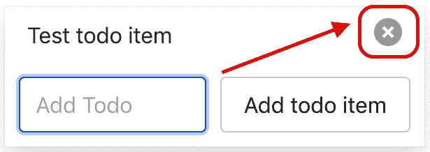

# 第六章：：使用 TDD 方法编写 Cypress 测试

现在我们已经完成了本书的*第一部分* - 也就是*作为前端应用的端到端测试解决方案的 Cypress* - 是时候转向本书的*第二部分*了，它将专注于*使用 TDD 方法进行自动化测试*。

在我们开始使用**TDD**（测试驱动开发）方法编写 Cypress 测试之前，我们需要了解如何正确地编写 Cypress 测试。这在本书的前几章中已经涵盖过。要在这个主题上取得成功，您需要了解 Cypress 测试的工作原理，测试的结构以及 Cypress 测试可以用来进行断言的不同方式。这些背景信息将帮助您了解如何在 Cypress 中使用 TDD 以及在软件开发生命周期中使用它所带来的优势。在本章中，我们将利用测试驱动的方法编写测试，这将极大地增加我们对应用程序和软件解决方案的信任和信心。

本章我们的重点将放在如何利用 Cypress 来帮助我们在开始开发之前全面思考一个应用的使用上。我们将应用测试我们的应用在开始开发之前。在这样做的过程中，我们将利用 Cypress 框架作为我们测试的核心。

本章将涵盖以下关键主题：

+   理解 TDD

+   在 Cypress 中编写 TDD 测试

+   修改 TDD 测试

一旦你完成了这些主题，你就准备好学习 Cypress 中的元素交互了。

## 技术要求

要开始，我们建议您克隆本书的 GitHub 存储库，其中包含我们将在本章中构建的应用程序和所有我们将编写的测试。

本章的 GitHub 存储库可以在以下链接找到

[`github.com/PacktPublishing/End-to-End-Web-Testing-with-Cypress`](https://github.com/PacktPublishing/End-to-End-Web-Testing-with-Cypress)

本章的源代码可以在`chapter-06`目录中找到。

我们将使用 ReactJS 库来开发我们的应用。

你可以通过运行以下命令来运行 ReactJS 应用程序：

+   `cd chapter-6/tdd-todo-app`

+   `npm install`（安装所有必需的依赖项）

+   `npm run start`（启动 React 应用程序进行测试）

以下链接：

# 理解 TDD

TDD 是一个依赖于将需求转化为非常具体测试用例的软件开发过程。编写这些测试用例后，代码被编写并根据其他测试用例进行检查。TDD 过程的最后一步是迭代和改进代码，以确保它符合所需的最佳实践，并且测试用例通过。TDD 方法的循环包括以下步骤：

1.  定义需要实现的功能

1.  编写新的测试

1.  运行测试以检查测试是否失败

1.  编写测试用例的代码

1.  运行测试以确保测试通过

1.  重构代码

1.  重复这个过程

TDD 的目的是在开发开始之前可视化最终结果。这样，就可以预见在开发过程中可能出现的问题或障碍。能够使用 TDD 方法开发功能有助于对解决方案进行批判性思考，并且有助于在应用程序开发过程中需要测试的场景。

假设我们正在创建一个登录功能；从测试的角度来看，我们需要为登录功能想出所有不同的场景。思考这些测试场景将使我们清楚地了解在开发阶段需要发生什么，使得在开发这个应用功能时需求更加清晰。

TDD 有助于减少范围蔓延的可能性，因为从一开始，我们就可以理解项目的目标。有了测试用例，我们可以确定功能并将范围限制在已编写的测试用例之内。了解此功能涉及的内容使开发人员能够制定代码的实现方式。从长远来看，这可能会导致减少开发时间。

重要提示

范围蔓延是指软件开发项目在项目开始后不受控制地增长或范围扩大。

接下来，让我们来看看 TDD 方法的优势。

## TDD 的优势

在本节中，我们将更详细地了解在软件开发生命周期中实施 TDD 方法所带来的好处。

### 更好的项目设计

在使用 TDD 方法进行开发时，开发人员需要考虑代码片段的目标。因此，开发人员将始终以最终目标为出发点。以特定目标开发功能的能力确保开发人员只编写所需和必要的代码，从而导致应用程序具有清晰的结构。

使用 TDD 还可以确保更高的代码质量，因为 TDD 强调使用“不要重复自己”（DRY）原则，这种原则在编写代码时会阻止重复。因此，通过使用 TDD，可以保持函数简单而简洁，代码库易于理解。清洁和简单的代码库易于维护和测试，这对开发人员和代码库维护者是一个额外的优势。

重要提示

DRY 原则是应用开发原则，强调软件模式的不重复和使用抽象来避免或减少冗余。

### 详细文档

TDD 强制执行引用正在开发的功能的严格文档；开发人员需要提出这样的规范，其中可能包括用户的操作。理解这些操作并将步骤分解为用户故事有助于开发人员实施功能，因此开发的功能非常接近定义的目标。

在编写测试的阶段开发适当的文档也减轻了其他参与方理解特性以重现文档的角色，因为这已经是软件开发过程的一部分。

### 减少开发时间

可以假设 TDD 在开发应用程序时需要更多时间，在大多数情况下，这是事实。根据这一说法，我们可以假设 TDD 很可能会延迟项目交付日期，但事实并非如此。

采用 TDD 方法，可以覆盖在开发中如果不使用 TDD 方法可能会出现错误的情况。虽然 TDD 可能最初比非 TDD 方法消耗更多时间，但它显著减少了开发人员维护项目和测试产品及其特性所需的工作量。

由于 TDD 强调清晰的代码，可以毫不夸张地说，即使发现了错误，也比在不使用 TDD 的项目中更容易修复。TDD 项目对高质量代码标准和持续反馈的关注使 TDD 项目的代码库易于维护，而非 TDD 项目则不然。

### 节约成本

在任何项目中，发现并修复错误在开发阶段比错误已经进入生产阶段时更便宜。TDD 专注于在开发过程中消除错误，大大减少了缺陷通过特性的开发和测试阶段的机会。这强化了代码重构原则和错误预防。TDD 方法大大节省了公司在与在生产中发现的错误和缺陷直接相关的行动上的支出。

作为缺陷直接结果而产生的成本可能包括直接收入损失、额外的时间和成本来修复发现的缺陷，甚至可能会失去公司利益相关者（如客户）的信任。了解 TDD 降低这些成本的能力使得公司的节约是值得的，因为开发软件需要花钱，而修复相同的软件则需要花费更多的钱。

### 可靠的解决方案

TDD 解决方案是可靠的，因为它们在开发开始之前经过了审查。TDD 确保了开发的概念就是实现的内容。这是通过在功能仍然是一个想法的时候编写的测试场景来实现的，并且以需求的形式存在。

没有使用 TDD，开发人员无法在不考虑程序的不同部分如何与新功能交互的情况下构建强大的解决方案。然而，使用 TDD，这些测试用例帮助开发人员了解新功能和现有功能如何集成，因此了解应用程序在新功能构建后的行为。这种方法使开发人员在开始开发之前就对解决方案有信心。

## TDD 的缺点

尽管 TDD 的大部分结果都是积极的，可以提高生产力和良好的开发流程，但对于结构不适合使用 TDD 的团队来说，TDD 也可能会带来负面影响。在本节中，我们将重点介绍使用 TDD 的缺点以及为什么它可能不适合某些团队。

### 组织准备工作

TDD 要求组织在实施过程中参与其中。TDD 要求在实施之前为组织定义需求，以确保成功，组织需要以适当的方式定位 TDD 适用于他们。在某些情况下，组织可能没有耐心等待所有需求在实施开始之前，也可能不愿意牺牲额外的时间来仔细审查需求。

TDD 是结构化的，需要管理层和开发团队一致同意承担与事先规划相关的成本，以便后期在维护上花费更少。并非所有团队都愿意采取等待 TDD 好处的方法，这意味着组织可能不愿意为目前看不到的成本付费。

### 理解问题

TDD 侧重于在实施开始之前构建测试。这种方法有助于团队更好地理解问题并提出坚实的实施解决方案。编写测试的最大挑战在于它们无法解决已经在实施代码中引入的逻辑错误。测试只能识别它们所测试的内容，可能无法测试代码中未明确定义的内容。

使用 TDD 可能会因为对问题的理解而导致错误；测试可能无法捕捉到设计解决方案的人员对需求理解不正确的情况。

## 总结 - 理解 TDD

在本节中，我们了解了 TDD，为什么我们需要它以及它如何在软件开发生命周期中使用。我们还了解了使用 TDD 的优势，以及它如何可以防止在后期开发和测试阶段发现的错误和缺陷带来的成本。我们还了解了利用 TDD 的缺点，其中一些可能源于测试的好坏取决于编写测试时的推理。因此，了解正在开发的问题对于为手头的问题制定测试是至关重要的。在接下来的部分中，我们将专注于在 Cypress 中编写 TDD 测试，以及这个过程如何帮助提出功能代码的坚实解决方案和实施。

# 在 Cypress 中编写 TDD 测试

在本节中，我们将专注于使用 Cypress 编写 TDD 测试。在本节中，我们将构建一个待办事项应用程序，并应用 TDD 原则。首先，我们需要有一个设计，这样我们才能编写适当的测试，并且还要对我们应用程序的功能进行批判性思考。本章的目标将是创建一个应用程序，可以添加待办事项，删除待办事项，显示已添加的待办事项，并显示已添加的待办事项的数量。下面的截图显示了最终应用程序的模拟。我们遵循的每一步都将帮助我们实现我们想要的模拟：


图 6.1 - 待办事项应用程序模拟

上面的截图显示了我们将要构建的待办事项应用程序的模拟。我们将使用 Cypress 中编写的 TDD 方法。该应用程序将具有以下功能：

+   添加新的待办事项

+   删除待办事项

+   查看已添加的待办事项

+   查看已添加的待办事项数量

这些功能构成了我们待办事项应用程序的要求。在本章中，我们将在开发测试和实现应用程序时将这些功能称为要求。

# 设置应用程序

为了避免在本节中增加任何进一步的复杂性，我们不会关注如何构建应用程序，而是关注在构建应用程序时如何实现测试。在背景上下文中，我们将构建的应用程序将使用 ReactJS 库，该库是用 JavaScript 编写的。

了解了我们的应用程序的外观之后，我们将采取逐步的方法来编写我们的测试，然后再开始开发我们的应用程序的过程。正如我们之前提到的，我们已经编写了我们将要构建的应用程序功能。我们将首先编写 TDD 测试，以便我们可以添加新的待办事项。

## 添加新的待办事项

我们将专注于的第一个 TDD 测试是负责检查新的待办事项是否已添加到我们的待办事项列表中的测试。要按照这些步骤进行，请使用以下命令导航到您从 GitHub 克隆的`tests`目录：

```js
 cd chapter-6/tdd-todo-app/integration/todo-v1.spec.js
```

上面的命令将引导您进入我们将在本章中使用的 TDD`tests`目录。该文件中的测试是我们在 TDD 过程中编写的测试的第一个版本。稍后，我们将修改它们，使其适应我们将添加的最终应用程序功能。

重要提示

在为我们的待办事项应用程序编写 TDD 测试时，请注意 Cypress 目录位于测试应用程序内部。这确保我们跟踪和识别属于正在开发的应用程序的 Cypress 测试。

以下代码片段是一个测试，检查我们是否可以向我们的应用程序添加新的待办事项，这是我们应用程序的要求之一：

```js
it('can create and display new todo', () => {
      cy.get('[data-testid="todo-item-input"]')
        .type('New todo');
      cy.get('[data-testid="add-todo-button"]')
        .click();
      cy.contains('New Todo');
});
```

在上面的代码片段中，我们编写了一个 TDD 测试，以检查在功能完成后，我们可以添加我们的待办事项并检查已添加的项目是否存在。请注意，在这个阶段，添加待办事项的功能尚未构建。如果我们在 Cypress 中运行这段代码片段，它应该会自动失败。为了验证这一点，我们可以运行以下命令来运行 Cypress 测试：

```js
npm run cypress:open 
```

以下截图显示了一个失败的 TDD 测试，用于创建和显示一个新的待办事项：


图 6.2 - 在 Cypress 上运行 TDD 测试

在前面的屏幕截图中，我们正在执行测试，以检查它是否失败以及 Cypress 是否能够执行它。在这个测试中，Cypress 尝试执行针对运行在端口`3000`上的本地运行的待办应用程序的测试。测试失败，因为 Cypress 找不到负责将待办事项添加到待办事项列表中的输入元素。从前面的屏幕截图中，我们可以验证应用程序成功导航到运行在本地主机上的应用程序。为了继续构建这个功能并确保测试通过，稍后，我们将添加添加待办事项的功能，并重新运行我们的测试。

## 删除待办事项

我们的待办应用程序要求说明，我们应该有能力删除已添加的待办事项。已删除的待办事项的要求之一是，一旦删除，它就不应再出现在待办事项列表上。为了编写我们的 TDD 测试，我们需要确保我们实际上已删除了待办事项，方法是验证一旦从待办事项列表中删除后，待办事项不再存在。我们将使用以下代码片段来实现删除功能测试要求：

```js
it(can delete added todo item', () => {
      cy.get('[data-testid="todo-item-input"]')
        .type('New todo');
      cy.get('[data-testid="add-todo-button"]')
        .click();
      cy.get('[data-testid="delete-todo-1-button"]')
        .click();
      expect('[data-testid="todolist"]'
      ).not.to.contain('New Todo')
   });
```

在上述代码块中，我们添加了一个待办事项，然后将其删除。后来，我们验证了已删除的待办事项不再存在，并通过使用 Cypress 断言方法来断言。这个测试片段不仅检查了待办事项的正确删除，还检查了删除后，待办事项将不再存在于 DOM 中。如前面的屏幕截图所示，使用 Cypress 运行此测试失败，因为我们的应用程序尚未构建。

查看已添加的待办事项

根据我们的应用程序要求，当添加待办事项时，它们应该在待办事项列表中可见。添加的待办事项应该与待办事项列表中的待办事项相同。为了进行适当的测试，我们需要确保我们的测试覆盖了确保添加的待办事项在待办事项列表上可见的情况。我们还需要验证已添加到待办应用程序的项目是否与待办事项列表上可见的项目相同。我们将再次策划一个 TDD 测试，旨在覆盖能够显示我们的待办事项的情况。以下代码块是用于显示已添加的待办事项的 TDD 测试：

```js
it(can view added todo item', () => {
      cy.get('[data-testid="todo-item-input"]')
        .type('New todo');
      cy.get('[data-testid="add-todo-button"]')
        .click();
      expect('[data-testid="todolist"]').to.contain(
      'New Todo')
 });
```

在这个代码块中，TDD 测试将使用应用程序的输入元素添加一个新的待办事项，然后验证添加的元素是否存在于待办事项列表中。有了这个测试，就可以排除待办事项被添加但在待办事项列表上不可见的可能性。

## 查看已添加的待办事项的数量

根据我们应用的要求，我们需要确保能够查看添加的待办事项的数量。根据我们的模拟，也可以在`chapter-06/mockups/todo-mockup.png`目录中找到，待办事项的数量应该对应于待办事项列表中的项目。根据我们的待办事项应用程序的要求，我们的 TDD 测试应该测试诸如添加多个待办事项并检查待办事项的数量增加或减少的情况，具体取决于它们是添加还是从待办事项列表中删除。

重要提示

在编写测试之前，了解 Cypress 如何理解要与之交互的元素，要单击哪个按钮，或者在输入字段上输入。Cypress 使用元素标识符，这些标识符唯一标识 Cypress 要与之交互的元素。网页上元素的唯一元素标识符可能包括唯一元素 ID CSS 选择器、XPath 定位器，甚至是我们选择的自定义元素标识符，格式为`[data-testid="our-unique-identifier"]`。

与添加、删除或查看待办事项的测试场景不同，这个测试将包含多个步骤和多个断言。以下代码块显示了一个查看已添加到待办事项列表中的待办事项数量的 TDD 测试：

```js
it('can view number of added todo items', () => {
      cy.get('[data-testid="todo-item-input"]')
        .type('New todo');
      cy.get('[data-testid="add-todo-button"]')
        .click();
      cy.get('[data-testid="todo-item-input"]')
        .type('Another todo');
      cy.get('[data-testid="add-todo-button"]')
        .click();
      expect('[data-testid="todo-item-number"]').to.eq('2')
      cy.get('[data-testid="delete-todo-1-button"]')
      .click();
      expect('[data-testid="todo-item-number"]').to.eq('1')
    });
```

这段代码片段将作为最终测试的模板，用于检查待办事项的数量随着待办事项的添加和删除而增加和减少。在这里，我们可以看到我们添加了两个待办事项，然后验证两个待办事项都存在。在验证待办事项列表中存在两个项目后，我们删除了一个待办事项，并检查待办事项的计数随着项目数量的减少而减少。

重要提示

在编写 TDD 测试时，我们并不太关心测试中可能存在的语法错误，而是关注场景和测试覆盖率。当我们在构建功能后开始修改测试时，我们将在再次运行测试时修复错误，这次针对添加的功能。

现在，是时候进行快速回顾了。

# 回顾-设置应用程序

在本节中，我们学习了如何编写 TDD 测试以及它们如何帮助塑造我们的思维，因为我们开发解决方案。我们涵盖了编写 TDD 测试的过程，用于添加待办事项、查看待办事项、删除待办事项以及查看待办事项列表中的总数。我们还了解到 TDD 测试帮助我们理解开发过程，并且这些测试不是在功能完成时我们将拥有的最终测试。在下一节中，我们将看看在应用程序的功能完成后如何修改 TDD 测试。

# 修改 TDD 测试

在前一节中，我们看了 TDD 测试的结构以及它们是如何根据正在开发的应用程序进行开发的原理。正如我们之前提到的，我们不会详细介绍如何开发应用程序，而是专注于如何将测试集成到正在开发的应用程序中。这里提到的应用程序可以在本书的 GitHub 存储库中找到（[`github.com/PacktPublishing/End-to-End-Web-Testing-with-Cypress/tree/master/chapter-06/`](https://github.com/PacktPublishing/End-to-End-Web-Testing-with-Cypress/tree/master/chapter-6/)）。

在本节中，我们将使用在上一节中创建的 TDD 测试。我们将要构建的 TDD 测试负责测试应用程序的定义要求，这些要求如下：

+   添加新的待办事项

+   删除待办事项

+   查看已添加的待办事项

+   查看已添加的待办事项数量

现在我们已经编写了测试，我们将在修改它们时向应用程序添加功能。首先，我们将运行第一个测试，因为我们已经构建了添加待办事项的功能。为了将 TDD 测试和应用程序中的最终测试分开，我们将创建一个名为`todo-v2.spec.js`的新测试文件，我们将在其中添加我们的最终测试。测试文件位于`chapter-06/tdd-todo-app/integration/todo-v2.spec.js`目录中。

## 添加新的待办事项

在这里，我们想要验证我们之前编写的用于验证添加新待办事项的测试是否有效。为了运行这个测试，我们将确保我们的应用程序（使用 ReactJS 构建）在本地运行。我们将针对本地托管的应用程序运行我们的测试。一旦添加新的待办事项功能完成，我们的应用程序将如下所示：


图 6.3-添加新的待办事项功能

在前面的截图中，我们可以验证我们的**添加待办事项**功能是否正常工作，因为我们已经添加了待办事项。现在我们的代码似乎工作正常，是时候检查我们的测试在运行时是否实际通过了。为此，我们将使用`todo-v2.spec.js`测试文件，这是`todo-v1.spec.js`的修改版本。

我们修改了位于`todo-v1.spec.js`的版本 1 测试文件的测试，并且还修改了测试，使其适应我们在应用程序中创建的待办事项添加功能。新测试应如下所示：

```js
it('can create and displays new todo', () => {
      cy.visit('http://localhost:3000/')
      cy.get('[data-testid="todo-input-element"]')
        .type('New todo');
      cy.get('[data-testid="add-todo-button"]')
        .click();
      cy.get('[data-testid="todolist"]'
        .contains('New todo');
    });
```

就像在我们的初始测试中一样，要测试的初始场景并没有改变。我们首先导航到本地运行的应用程序的默认 URL。然后，我们使用 Cypress 添加一个待办事项，然后验证添加的待办事项是否与我们最初添加到输入元素中的内容相同。我们可以清楚地查看以下截图中发生的操作，该截图显示了成功的测试：


图 6.4 – 通过测试添加待办事项

在上述截图中，我们可以看到 Cypress 导航到本地托管的应用程序并添加了一个待办事项，然后检查添加的待办事项是否出现在待办事项列表中。

重要提示

我们为我们的应用程序添加了以`data-testid=*`为前缀的元素标识符，以唯一标识元素。元素标识符在选择 Web 应用程序中的元素时非常方便。通过添加唯一标识符并且不使用应用程序的默认 CSS 选择器，即使应用程序的选择器发生变化，我们的测试也不会受到影响，仍将正常运行。

通过这样，我们成功完成了 TDD 中的第一个任务。在本节中，我们实现了以下目标：

+   确定了我们想要开发并创建原型的应用程序

+   在开发开始之前编写了 TDD 测试

+   开发了向我们的应用程序添加待办事项的功能

+   修改了 TDD 测试以使其符合我们开发的功能

以下截图显示了添加新待办事项的 TDD 版本和最终功能版本的测试的并排比较：


图 6.5 – TDD 测试与最终功能测试的比较

正如您所看到的，测试的第二个版本显示，尽管测试结构或目标没有改变，但我们不得不修改测试，以使其适应已开发的待办事项添加功能。识别需求、开发功能，然后修改测试以针对该功能运行是 TDD 的主要目标，我们成功实现了这一点。

## 删除待办事项

现在，我们将学习如何删除已添加的待办事项。根据我们的需求，删除的待办事项将从待办事项列表中移除，并且一旦单击待办事项的删除按钮，它将不再可见。再次强调，我们不会关注开发该功能的过程，而是关注该功能的测试。在以下截图中，我们可以看到为每个新添加的待办事项显示的删除按钮：



图 6.6 – 删除待办事项功能

突出显示为红色的图标是出现在每个待办事项上的删除图标。如果单击删除按钮，添加的待办事项将从我们的待办事项列表中消失，就像我们的需求描述的那样。为了验证该功能是否按照我们设想的那样工作，我们现在将修改我们的 TDD 测试以针对删除功能运行测试。以下代码块是一个测试，用于删除已添加到待办事项列表中的待办事项：

```js
it('can delete an added todo item', () => {
      cy.visit('http://localhost:3000/')      
      cy.get('[data-testid="todo-input-element"]')
        .type('New todo');
      cy.get('[data-testid="add-todo-button"]')
        .click();
      cy.get('[data-testid="delete-todo-0-button"]')
        .click();
      expect('[data-testid="todolist"]'
        .not.to.contain('New todo')
});
```

这段代码显示了修改后的 TDD 测试，以确认一旦删除了待办事项，它将不再出现在待办事项列表中。我们还必须对我们最初编写的 TDD 测试进行一些微小修改，以使所有选择器和操作与已开发的功能匹配。从以下 Cypress 截图中可以看到，我们的测试通过了，添加的待办事项已被删除，正如我们预期的那样：


图 6.7 – 删除已添加的待办事项

在这里，Cypress 快照功能帮助我们可视化了 Cypress 点击新添加的待办事项的删除按钮的过程。我们还编写了一个断言来验证一旦删除后，已删除的待办事项在待办事项列表中不存在。我们的测试通过了，这意味着我们已经使用 TDD 向待办事项列表中添加了一个待办事项，并且还删除了这个待办事项并测试了它在待办事项列表中不存在。在我们的下一个测试中，我们将专注于查看已添加的待办事项。

## 查看已添加的待办事项

我们应用程序的要求之一是查看待办事项列表中已添加的待办事项。在添加待办事项时，我们已经能够看到这个功能在运行，但还没有进行测试。为了验证这个功能，我们将添加一个新的待办事项，并检查创建的待办事项是否出现在待办事项列表中。以下代码块是一个检查已添加的待办事项是否在我们创建的应用程序中可见的测试：

```js
it('can view added todo items', () => {
      cy.visit('http://localhost:3000/')      
      cy.get('[data-testid="todo-input-element"]')
      .type('New todo, {enter}')
      cy.get('[data-testid="todo-input-element"]')
      .type('Another todo, {enter}')
      cy.get('[data-testid="todolist"]').contains(
      'New todo');
      cy.get('[data-testid="todolist"]'
      .contains('Another todo');
    });
```

在这里，我们修改了我们的 TDD 测试。不仅仅是检查我们是否可以查看单个待办事项，我们添加了两个项目，并添加了一个断言来检查这两个项目是否存在于待办事项列表中。我们将在 Cypress 中运行我们的测试，并使用应用程序预览来验证这两个待办事项是否存在，如下截图所示：


图 6.8 – 查看已添加的待办事项

万岁！我们的测试通过了！

这个截图显示了我们正确构建了一个添加待办事项的功能的需求，并且我们对查看待办事项在待办事项列表中的测试需求也得到了满足。在这里，我们已经实现了查看我们的待办事项功能的目标。我们还使用了 TDD 来检查在查看我们的待办事项时需要测试的场景。

## 查看已添加的待办事项数

现在我们已经修改了用于添加待办事项、删除待办事项和查看待办事项的 TDD 测试，我们还想添加一个功能，用于检查已添加的待办事项的数量。查看我们已添加的待办事项数的功能如下截图所示：


图 6.9 – 查看已添加的待办事项数

这个功能显示了当前在我们的待办事项列表中可用的待办事项数量。随着添加更多的待办事项，待办事项的数量将增加，并且当从列表中删除待办事项时，数量将减少。在这里，我们将使用我们为此功能编写的 TDD 测试，并修改它以便我们的应用程序可以使用。在我们的测试中，我们将专注于添加和删除待办事项，并验证在添加和删除时，待办事项的数量会相应地改变。以下代码块显示了不同的断言，检查该功能是否按照我们的要求正常工作：

```js
it('can view number of added todo items', () => {
      cy.visit('http://localhost:3000/')      
      cy.get('[data-testid="todo-input-element"]')
      .type('New todo, {enter}')
      cy.get('[data-testid="todo-input-element"]')
      .type('Another todo, {enter}')
      cy.get('[data-testid="todo-item-number"]')
      .should(($header) => {
        expect($header.get(0).innerText).to.contain('2')
      })
      cy.get('[data-testid="delete-todo-1-button"]')
      .click();
      cy.get('[data-testid="todo-item-number"]')
 	.should(($header) => {
        expect($header.get(0).innerText).to.contain('1')
      })
    });
```

上面的代码片段向我们展示了添加新的待办事项，验证列表中的项目是否被删除，以及计数在应用程序不同状态变化中保持一致。在这里，我们修改了我们最初的 TDD 测试，并且能够使用它们来测试我们是否实际上可以增加或减少可用的待办事项的数量。通过在 Cypress 上运行相同的测试，我们可以验证 Cypress 是正常的，并且我们有一个未被删除的待办事项，如下截图所示：


图 6.10 – 测试待办事项数

从前面的截图中，我们可以验证，随着应用程序状态的改变，比如添加和删除待办事项，数量会相应地增加或减少。

## 总结 – 修改 TDD 测试

在本节中，我们学会了如何修改 TDD 测试，一旦功能已经开发完成，使其符合我们应用程序的构建方式。我们还学会了 Cypress 在测试运行时如何独特地识别要与之交互的元素。最后，我们学会了如何将已经编写的 TDD 测试转换为已为我们的应用程序开发的测试功能。

# 总结

在本章中，我们了解了 TDD 工作的过程以及在任何团队中拥抱 TDD 的重要性，并探讨了 TDD 的优缺点。我们还探讨了如何将 TDD 应用于实际应用程序。通过这样做，我们为一个尚未构建的 Todo 应用程序创建了需求。在开发应用程序之前，我们为我们认为重要的功能编写了 TDD 测试，然后使用这些需求和 TDD 测试来开发我们的功能。在开发完功能后，我们修改了我们的第一个 TDD 版本的测试，使其适用于我们开发的功能，从而完成了展示如何在实际应用程序中利用 TDD 的过程。

现在，您应该了解什么是 TDD，如何编写 TDD 测试，以及如何修改和使用 TDD 测试在实际应用程序中，使其符合已开发的应用程序。

既然我们已经了解了 TDD 以及如何在项目中实施它，接下来我们将专注于如何与 Cypress DOM 的不同元素进行交互。
