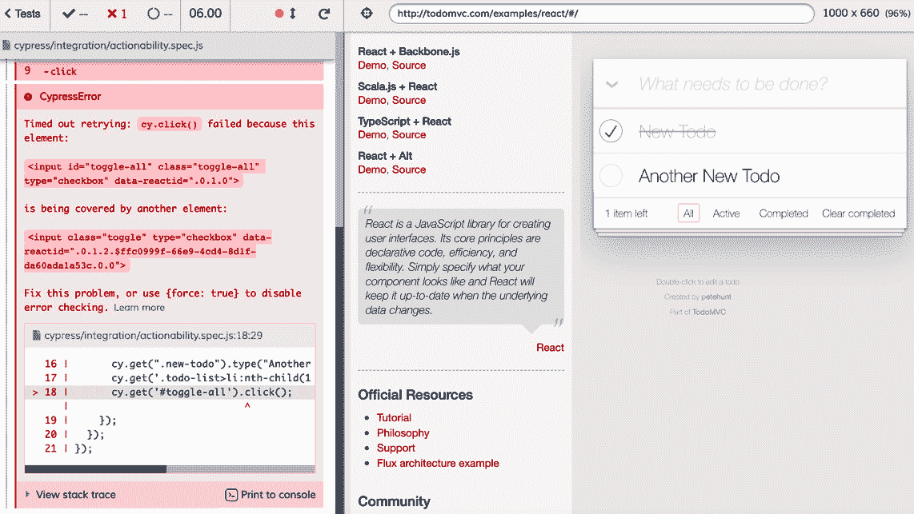
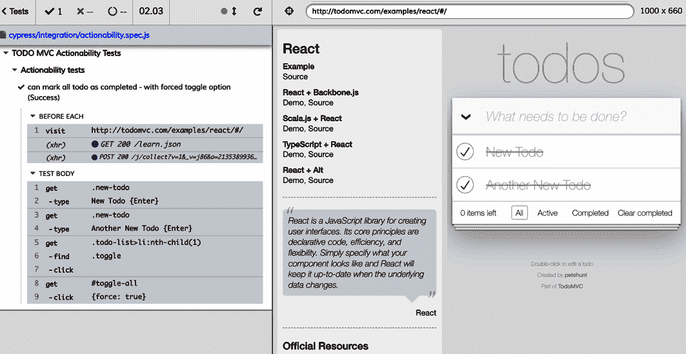

# 第七章：：理解 Cypress 中的元素交互

在开始运行测试时，了解 Cypress 与元素交互的方式之前，最好先对构成 Cypress 的原则，它的工作原理，不同的 Cypress 命令，甚至 Cypress 的使用实际示例有一个坚实的理解。要完全理解本章，您需要已经学习了前几章，这将使您在学习过程中取得成功。

在本章中，我们将介绍 Cypress 如何与元素交互以及它如何响应交互过程中元素的不同状态。我们还将介绍 Cypress 如何通过 Cypress 命令中的内置机制确定元素是否准备好进行交互。

我们将在本章中涵盖以下关键主题：

+   理解可操作性

+   强制可操作性

一旦您完成了这些主题中的每一个，您将具有理解 Cypress 如何解释测试的知识，以及它在执行测试时如何解释发生的错误所需的知识。

## 技术要求

要开始，请克隆包含源代码和我们将在本章中编写的所有测试的存储库从 GitHub。

本章的 GitHub 存储库可以在以下网站找到：

[`github.com/PacktPublishing/End-to-End-Web-Testing-with-Cypress`](https://github.com/PacktPublishing/End-to-End-Web-Testing-with-Cypress)

本章的源代码可以在`chapter-07`目录中找到。

# 理解可操作性

现在我们知道了 Cypress 命令是什么，以及何时何地使用它们，我们需要了解 Cypress 在执行测试时的思考和操作过程。在本节中，我们将介绍 Cypress 如何与命令交互，如何确保元素可见和可操作，甚至如何处理元素中的动画。我们还将介绍 Cypress 在完成任何命令之前如何确定**可操作性**。

可操作性是 Cypress 在**文档对象模型**（**DOM**）中执行操作的能力。Cypress 具有命令，其唯一目的是与 DOM 元素交互。这些命令像“用户”一样行事，并模拟与应用程序用户界面的交互。Cypress 事件负责命令的行为，因为它将事件发送到浏览器，使其看起来像是在应用程序的用户界面上与用户进行交互。

以下是 Cypress 中直接与 DOM 交互的一些命令；要完成操作，DOM 元素必须是可操作的。这些命令带有内置的 Cypress 机制，用于检查它们交互的元素的可操作性。这些命令包括以下内容：

+   `cy.type()`: 在 DOM 元素中输入

+   `cy.clear()`: 清除文本区域或输入框的值

+   `cy.click()`: 在 DOM 元素上执行单击操作

+   `cy.dbclick()`: 在 DOM 元素上执行双击操作

+   `cy.rightclick()`: 在 DOM 元素上执行右键单击操作

+   `cy.select()`: 从`<select>`下拉菜单中选择一个`<option>`选项

+   `cy.trigger()`: 在 DOM 元素上执行触发事件

+   `cy.check()`: 检查 DOM 上的单选按钮和复选框

+   `cy.uncheck()`: 取消 DOM 上的单选按钮和复选框

重要说明

`cy.rightclick()`命令不会打开浏览器菜单，而是会检查您的元素与浏览器的**上下文菜单**的行为。

在运行任何上述命令之前，Cypress 会采取行动来确保 DOM 准备好接收操作。为了执行任何命令，Cypress 会执行自己的检查，以验证条件是否适合在 DOM 元素上执行命令。

所有这些检查都在指定的时间内进行，可以通过**defaultCommandTimeout**配置选项进行配置，该选项可以在`cypress.json`文件中进行修改。以下是 Cypress 执行的检查 DOM 元素准备就绪的操作：

+   **可见性**：滚动元素以查看

+   **残疾**：确保元素未隐藏

+   **分离**：检查元素是否已从 DOM 中移除

+   **只读**：检查元素是否处于只读状态

+   **动画**：检查动画是否已完成

+   **覆盖**：检查元素是否未被父元素覆盖

+   **滚动**：检查被固定位置元素覆盖的元素的滚动

+   **坐标**：检查事件是否在所需坐标处触发

为了更好地理解 Cypress 如何解释 DOM 的响应以及如何确定可操作性，我们将逐个讨论这些列出的操作，并描述 Cypress 在执行可操作命令时如何通过每个动作检查状态。

## 可见性

Cypress 使用不同的因素来确定元素是否可见。Cypress 确定元素的可见性的默认方式是通过检查该元素的**层叠样式表**（**CSS**）属性。任何元素的 CSS 属性定义了元素的行为，如果默认情况下 CSS 属性以一种意味着元素被隐藏的方式定义，Cypress 将自动知道该元素由于其属性而不可见。

如果满足以下任一条件，Cypress 认为元素是隐藏的：

+   元素的 CSS`width`和`height`为`0`。

+   元素或其祖先具有`visibility: hidden`的 CSS 属性。

+   元素或其祖先具有`display: none`的 CSS 属性。

+   元素具有`position: fixed`的 CSS 属性，并且被遮盖或在屏幕上不存在。

此外，Cypress 使用`hidden overflow` CSS 属性来确定在测试执行期间元素是否隐藏。以下是 Cypress 用于确定元素是否隐藏的一些其他实例：

+   祖先元素具有隐藏的溢出和`width`或`height`值为`0`，并且在祖先元素和具有`position: absolute`的元素之间有一个元素。

+   祖先元素具有隐藏的溢出，并且该元素具有`position: relative`的 CSS 属性，并且位于祖先元素的边界之外。

重要提示

隐藏的溢出意味着 CSS 属性可以是以下任何一种溢出：`hidden`，`overflow: auto`，`overflow: scroll`，`overflow-x: hidden`或`overflow-y: hidden`。

所有这些转换和平移的计算都由 Cypress 处理，如果 Cypress 偶然发现元素不可见，则测试将失败，并显示错误，指出 Cypress 试图与之交互的元素的可见性被隐藏。

## 残疾

在检查可操作性时，Cypress 还会检查元素是否已禁用。当元素具有`disabled: true`的 CSS 属性时，Cypress 无法与其交互，因为在 DOM 上禁用元素时无法对元素执行任何操作。当 Cypress 遇到禁用的元素并需要对其执行操作时，它将返回一个错误，描述禁用元素的状态以及为什么无法通过 Cypress 可操作命令与元素交互。

## 分离

分离的元素是已从 DOM 中移除但由于 JavaScript 的原因仍然存在于内存中的元素。大多数应用程序通过从 DOM 中移除元素并在 DOM 中插入其他元素来工作，因此不断地分离和附加元素在 DOM 中。在评估元素是否可操作时，Cypress 会在对元素运行任何可操作的命令之前检查元素是否未分离。如果 Cypress 遇到分离的元素，它会在测试中执行可操作的命令之前抛出错误。

重要的是要注意，Cypress 只会在 DOM 中搜索元素，不会检查分离的元素是否存在于内存中。

## 只读

只读元素是仅用于查看的，不能接受新内容或编辑的。Cypress 在`.type()`命令中检查`readonly` CSS 属性；如果遇到`readonly` CSS 属性，测试将以错误失败。

## 动画

Cypress 具有内置机制，用于确定元素中是否存在动画。在评估元素是否可操作时，Cypress 会等待动画完成，然后才开始与元素交互。

为了确定测试中的元素是否正在进行动画，Cypress 必须使用元素的最后坐标的样本，然后应用其算法来计算斜率。

重要提示

斜率是通过选择两个不同的点并记录它们的坐标来计算的。然后记录 y 坐标和 x 坐标之间的差异。然后进行 y 坐标和 x 坐标之间的差异的除法，以确定元素的斜率。

通过检查元素的当前和上一个位置来确定元素的动画和斜率。Cypress 带有内置的动画阈值，用于检查元素必须超过的像素距离以被认为是正在进行动画。您可以在`cypress.json`文件中配置此项，并按以下代码块中所示更改默认值：

```js
{
"animationDistanceThreshold": 10
}
```

当这个值被改变时，无论是增加还是减少，Cypress 都会改变其灵敏度和确定元素是否正在进行动画的行为。较高的动画阈值意味着 Cypress 在检测像素变化的距离时会降低其灵敏度，而较低的动画阈值意味着 Cypress 在检测正在进行动画的元素时会更加敏感。

在运行测试时也可以关闭动画。为了做到这一点，我们需要配置`cypress.json`配置文件来忽略动画并继续执行我们的命令。以下配置可以通过以下代码块实现：

```js
{
"waitForAnimations": false
}
```

当我们指定我们的测试不应等待动画时，如此处所示，我们的测试将忽略动画，并且将执行，就好像动画不存在一样。但是，可以将此配置更改回`true`值，以继续执行我们的测试，同时等待元素中的动画执行。

## 覆盖

Cypress 在发出命令之前，会检查元素是否被父元素覆盖，作为验证可操作性的一部分。有许多情况下，元素可能在 DOM 中可见，但只是被父元素覆盖，比如模态框、弹出窗口或对话框。如果有一个父元素覆盖了元素，Cypress 将不允许执行命令。

在父元素覆盖 Cypress 应该执行操作的元素的情况下，Cypress 会抛出错误，因为即使在现实生活中，用户也无法与被覆盖的元素进行交互。

重要提示

如果子元素覆盖了元素，Cypress 将继续向子元素发出事件，并且执行会在没有任何问题的情况下继续进行。

在下面的代码块中，我们有一个`button`元素，它部分或完全被`span`元素覆盖，而不是直接点击`button`元素本身：

```js
<button>
  <span> Submit </span>
</button>
```

在这个代码块中，尽管`span`元素覆盖了`button`元素，Cypress 将向子`span`元素发出命令，这将触发对我们的`button`元素的点击事件，而不会遇到错误。

## 滚动

Cypress 在元素上执行滚动，并且在本节开头指定的可操作命令中默认启用了此行为。默认情况下，在与元素交互之前，Cypress 会滚动到该元素的位置，并确保它在视图中。

提示

诸如`cy.get()`或`cy.find()`之类的命令在其中没有内置 Cypress 滚动到视图的机制，就像 Cypress 中的可操作命令一样。

Cypress 中的滚动是通过算法启用的，该算法首先尝试确定元素是否在 DOM 上可见。然后，它使用坐标从当前元素到 Cypress 操作的元素的期望位置计算坐标，以导航到实际元素。

Cypress 滚动算法会不断滚动，直到元素变得可见，或者直到元素不再被其他元素遮挡。该算法非常好地确保了 DOM 上的大多数元素在视图中可以滚动并进行交互。

## 坐标

在 Cypress 完成了检查元素是否可操作的验证过程之后，默认情况下，它会向元素的中心触发事件。Cypress 提供了一种机制来覆盖触发事件的默认位置，并且大多数命令的行为都可以自定义。

以下代码块显示了更改按钮上点击事件的触发行为：

```js
it('can mark a todo as completed - with changed hitbox position', () => {
cy.visit('http://todomvc.com/examples/react/#/')
      cy.get(".new-todo").type("New Todo {Enter}");
      cy.get(".new-todo").type("Another New Todo {Enter}");
      cy.get('.todo-list>li:nth-child(1)').find(
      '.toggle').click({ position: 'topLeft' });
    });
```

在这个代码块中，我们导航到我们的 Todo 应用程序并添加了两个待办事项，然后标记其中一个待办事项为已完成。当标记我们的第一个待办事项为完成时，我们改变了点击的位置，并指示 Cypress 点击`topLeft`位置，而不是默认的`center`位置。以下截图显示了`click`命令在被点击的待办事项动作的**事件点击框**的顶部左侧部分：


图 7.1 – 更改 Cypress 点击位置的坐标

重要提示

事件点击框是在固定的 Cypress 快照上弹出的高亮显示，以显示测试与元素的交互。事件点击框可以由 Cypress 事件触发，例如`.click()`方法。

正如*图 7.1*所示，Cypress 有能力计算元素的坐标，并确定在哪里点击元素。此外，当触发行为的坐标发生变化时，Cypress 会将它们记录在 Cypress 测试运行器的命令日志中。我们可以进一步检查控制台，查看 Cypress 在执行元素的顶部左侧点击后打印的坐标。以下图显示了第一个已完成待办事项的`click`事件的打印坐标：


图 7.2 – 新的点击位置坐标

截图中显示的坐标是我们指示 Cypress 使用的新的`.click()`命令坐标，而不是带有可操作命令的默认命令。

## 总结-理解可操作性

在本节中，我们了解了 Cypress 如何确定元素的可操作性以及如何评估不同元素的条件，例如可见性、禁用、分离模式、动画、滚动属性、坐标，甚至`readonly`属性。我们还学习了 Cypress 如何计算元素中的动画以及如何增加动画阈值以减少 Cypress 检测动画的敏感度。

在下一节中，我们将学习如何强制 Cypress 在元素的可操作性检查失败时继续执行操作，并在可以安全执行强制操作的元素上执行强制操作。

# 强制可操作性

理解了可操作性是什么，以及 Cypress 需要进行的检查来确定元素是否可操作，也很重要了解我们如何覆盖 Cypress 设置的机制来检查可操作性。在本节中，我们将专注于执行操作和命令，即使元素未通过 Cypress 为可操作命令执行的可操作性检查。我们还将学习如何安全地实现一些元素和测试的覆盖机制。

## 覆盖 Cypress 可操作性检查

在 Cypress 测试中，可操作性非常有用，因为它帮助我们找到用户可能无法与应用程序元素交互的情况。但有时，可操作性检查可能会妨碍正确的测试，这就引出了我们的下一个任务：覆盖安全检查。

在某些测试中，“像用户一样操作”可能并不值得，因为归根结底，目标是编写可以以自动化方式防止错误和缺陷的有意义的测试。诸如嵌套导航结构和界面之类的情况可能导致复杂的测试，可以通过消除嵌套导航结构，而是直接与我们想要的元素进行交互来实现。

为了覆盖 Cypress 的可操作性检查，我们可以向 Cypress 可操作命令传递`{force: true}`参数选项。该选项将指示 Cypress 覆盖所有检查，以检查可操作性，并继续执行默认操作。以下代码块是一个测试，使用我们的 Todo 应用程序中的`toggle-all`按钮将所有待办事项标记为已完成：

```js
it('can mark all todo as completed - with no forced toggle option (Failure)', () => {
      cy.get(".new-todo").type("New Todo {Enter}");
      cy.get(".new-todo").type("Another New Todo {Enter}");
      cy.get('.todo-list>li:nth-child(1)').find(
      '.toggle').click();
      cy.get('#toggle-all').click();
    });
```

当此测试运行时，它将失败，因为尝试切换第一个元素并标记为完成将导致测试失败和错误，因为它已经标记为完成。以下截图显示了 Cypress 可操作性的运行情况，测试失败，因为待办事项由于被另一个元素覆盖而无法标记为完成：



图 7.3 - 未通过 Cypress 可操作性检查的测试

进一步调查*图 7.3*，我们可以验证第一个项目无法标记为已完成，因为它已经完成，这导致了失败。我们可以通过告诉 Cypress 在切换所有待办事项完成之前忽略可操作性检查来覆盖此测试行为，如下面的代码块所示：

```js
it('can mark all todo as completed - with forced toggle option (Success)', () => {
      cy.get(".new-todo").type("New Todo {Enter}");
      cy.get(".new-todo").type("Another New Todo {Enter}");
      cy.get('.todo-list>li:nth-child(1)').find(
      '.toggle').click();
      cy.get('#toggle-all').click({force: true});
    });
```

在运行代码块中显示的测试时，它会通过，因为我们已经阻止了 Cypress 检查我们需要点击的元素是否被另一个元素覆盖。以下截图显示了代码运行情况，并成功测试了通过点击 toggle-all 下拉按钮标记两个待办事项为已完成：



图 7.4 - 覆盖 Cypress 可操作性检查的通过测试

在*图 7.4*中，Cypress 忽略了与项目可操作性相关的检查，而是继续执行默认操作，我们的情况下是切换两个待办事项并标记为已完成。我们通过向 toggle 按钮的`click`命令传递`{force: true}`选项来实现覆盖。

当使用强制选项强制发生 Cypress 事件时，Cypress 会执行以下操作：

+   继续执行所有默认操作

+   强制在元素上触发事件

然而，Cypress 不会执行以下操作：

+   确保元素可见

+   滚动元素以查看

+   确保元素未被禁用

+   确保元素未被分离

+   确保元素未处于动画状态

+   确保元素没有被覆盖

+   确保元素不是只读的

+   在后代元素上触发事件

重要提示

强制可操作性在某些情况下非常有用，特别是当你不需要花费时间自动化不值得自动化的步骤时；然而，有时强制可操作性并不是解决问题的最佳方案。当我们强制可操作性时，大多数问题都可以通过编写更好的应用程序代码和确保项目的正确对齐来解决，以确保没有元素阻挡其他元素。我们还可以利用 Cypress 来克服诸如动画之类的情况，等待动画停止运行，然后在确保页面动画已完成后执行我们的测试。

当在命令上强制可操作性时，Cypress 放弃了确保在对元素执行任何操作之前满足正确条件的角色，而是直接在测试中执行发出的条件。

## 总结 - 强制可操作性

在本节中，我们学习了可以在元素上强制可操作性，并且可以通过在发出的可操作命令上传递`{force: true}`参数来实现。我们还看到了当我们强制执行 Cypress 命令时的显著差异，例如在测试中切换我们的待办事项为完成状态。在本节中，我们还了解了何时重写 Cypress 的可操作性是重要的，以及它如何潜在地减少测试的复杂性。

# 摘要

在本章中，我们学习了 Cypress 如何通过确保元素处于正确状态来强制元素的可操作性，然后才对元素执行命令。我们了解到 Cypress 在执行任何元素操作之前会检查可见性、禁用状态、DOM 分离、`readonly`模式、动画、覆盖、滚动和元素坐标。我们还了解了 Cypress 如何计算元素的动画，甚至在对元素执行操作时如何改变坐标。我们还学习到可以通过在测试中强制可操作性来覆盖 Cypress 设置的默认检查。

完成了本章后，我相信你已经掌握了理解 Cypress 如何确定元素的可操作性以及如何在测试中覆盖可操作性的技能，以减少复杂性。在下一章中，我们将学习使用变量和别名，并深入研究如何多次重用我们在测试中定义的变量和别名。
