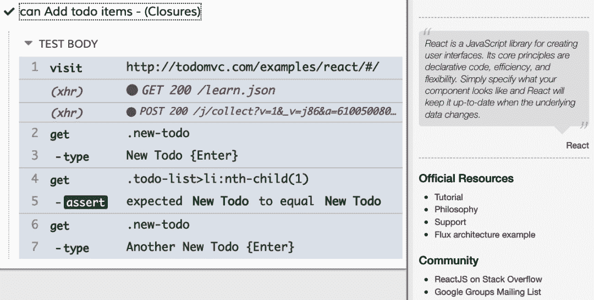
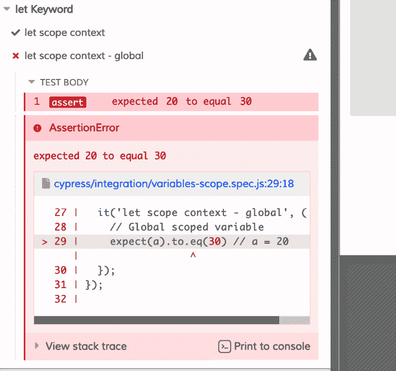
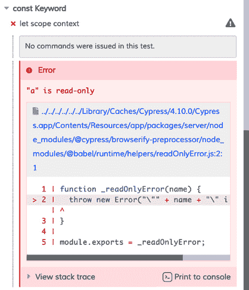
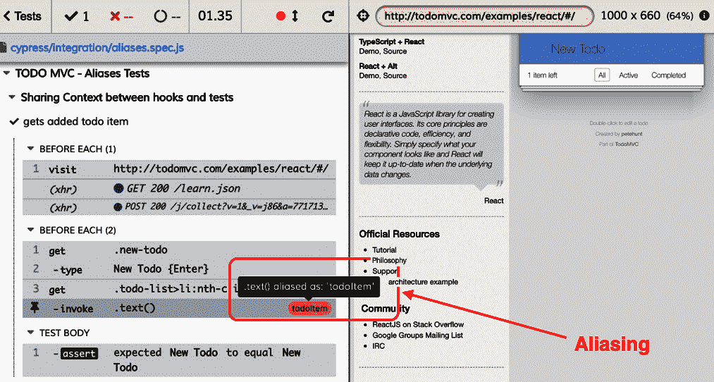
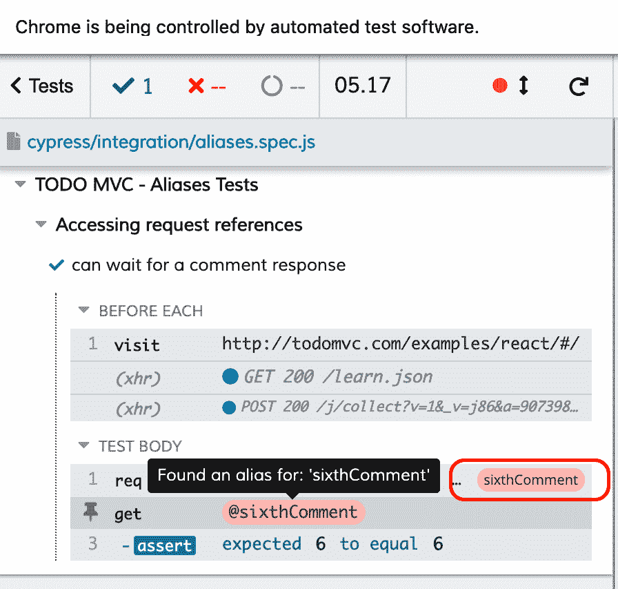

# 第八章：理解 Cypress 中的变量和别名

在我们开始讨论 Cypress 中变量和别名的工作原理之前，重要的是要了解我们在前几章中涵盖了什么，如何在 Cypress 中编写测试，如何配置测试，甚至如何使用 Cypress 按照测试驱动开发的方式编写应用程序。本书前几章提供的背景信息将为我们提供一个良好的基础，让我们深入了解变量和别名的工作原理。通过探索变量和别名，我们将了解如何在 Cypress 中创建引用，这将简化我们的测试编写过程和测试的复杂性。了解如何使用变量和别名不仅可以让您编写更好的测试，还可以编写易于阅读和维护的测试。

在本章中，我们将专注于编写异步命令，以利用 Cypress 捆绑的变量和别名。我们还将了解如何通过使用别名简化我们的测试，以及如何在测试的不同区域利用我们创建的别名和变量，例如元素的引用、路由和请求。

本章将涵盖以下关键主题：

+   理解 Cypress 变量

+   理解 Cypress 别名

一旦您了解了这些主题，您将完全了解如何在 Cypress 测试中使用别名和变量。

## 技术要求

要开始，请克隆包含本章中将编写的所有源代码和测试的存储库从 GitHub 中获取。

本章的 GitHub 存储库可以在[`github.com/PacktPublishing/End-to-End-Web-Testing-with-Cypress`](https://github.com/PacktPublishing/End-to-End-Web-Testing-with-Cypress)找到。

本章的源代码可以在`chapter-08`目录中找到。

# 理解 Cypress 变量

本节将重点介绍 Cypress 中的变量是什么，它们在测试中如何使用以及它们在测试中的作用，特别是在减少测试复杂性方面。我们还将探讨可以在哪些不同区域使用 Cypress 变量来增加测试的可读性。通过本节的学习，您将能够使用变量编写测试，并了解在编写测试时应该在哪里使用变量。

为了更好地理解 Cypress 中变量的工作原理，重要的是要了解 Cypress 如何执行其命令。以下代码块是一个测试，首先选择一个按钮，然后选择一个输入元素，然后点击按钮：

```js
it('carries out asynchronous events', () => {
   const button = cy.get('#submit-button');
   const username = cy.get('#username-input');
   button.click()
});
```

上述代码块说明了一个测试，应该首先识别一个按钮，然后识别一个用户名输入，最后点击按钮。然而，测试和执行不会按照我们通常的假设方式进行。在我们的假设中，我们可能会认为第一个命令将在第二个命令运行之前执行并返回结果，然后第三个命令将是最后执行的。Cypress 利用 JavaScript 的**异步 API**来控制 Cypress 测试中命令的执行方式。

重要提示

异步 API 被实现为它们在收到命令或请求时提供响应，并不一定等待某个特定请求获得响应后再处理其他请求。相反，API 会返回收到的第一个响应，并继续执行尚未收到响应的响应。请求和接收响应的非阻塞机制确保可以同时进行不同的请求，因此使我们的应用程序看起来是多线程的，而实际上，它的本质是单线程的。

在前面的代码块中，Cypress 以异步顺序执行命令，响应不一定按照测试中发出请求的顺序返回。然而，我们可以强制 Cypress 按照我们的期望执行测试，我们将在下一节中介绍闭包时进行讨论。

## 闭包

当 Cypress 捆绑测试函数和对函数周围状态的引用时，就会创建闭包。闭包是 Cypress 大量借鉴的 JavaScript 概念。因此，Cypress 中的测试闭包将能够访问测试的外部范围，并且还将能够访问由测试函数创建的内部范围。我们将测试的局部功能范围称为**词法环境**，就像 JavaScript 函数中的情况一样。在下面的代码块中，我们可以看到 Cypress 中的闭包是什么，以及变量在闭包中如何被利用：

```js
describe('Closures', () => {
    it('creates a closure', () => {
       // { This is the external environment for the test }
      cy.get('#submit-button').then(($submitBtn) => {
       // $submitBtn is the Object of the yielded cy.get()
       // response
       // { This is the lexical environment for the test }
      })
	 // Code written here will not execute until .then()  
      //finishes execution
    })
  });
```

`$submitBtn`变量用于访问从`cy.get('#submit-button')`命令获取的响应。使用我们在测试中刚刚创建的变量，我们可以访问返回的值并与之交互，就像在普通函数中一样。在这个测试中，我们使用了`$submitBtn`变量创建了一个测试闭包函数。`.then()`函数创建了一个**回调函数**，使我们能够在代码块中嵌套其他命令。闭包的优势在于我们可以控制测试执行命令的方式。在我们的测试中，我们可以等待`.then()`方法内部的所有嵌套命令执行完毕，然后再运行测试中的其他命令。测试代码中的注释进一步描述了执行行为。

重要提示

回调函数是作为参数传递到其他函数中的函数，并在外部函数中被调用以完成一个动作。当我们的`.then()`函数内部的命令完成运行时，函数外部的其他命令将继续执行它们的执行例程。

在下面的代码块中，我们将探讨如何使用变量编写测试，并确保在闭包内部的代码执行之前，任何其他代码在闭包之外和闭包开始执行之后都不会执行。该测试将添加两个待办事项，但在添加第二个待办事项之前，我们将使用闭包来验证闭包内部的代码是否首先执行：

```js
it('can Add todo item - (Closures)', () => {
      cy.visit('http://todomvc.com/examples/react/#/')
      cy.get(".new-todo").type("New Todo {Enter}");
      cy.get('.todo-list>li:nth-child(1)').then(($todoItem) => {
        // Storing our todo item Name 
        const txt = $todoItem.text()
        expect(txt).to.eq('New Todo')
      });
      // This command will run after all the above commands  
      // have finished their execution.  
      cy.get(".new-todo").type("Another New Todo {Enter}");
    });
```

在前面的代码块中，我们已经向待办事项列表中添加了一个待办事项，但在添加第二个项目之前，我们验证添加的待办事项确实是我们创建的。为了实现这一点，我们使用了闭包和一个需要在执行下一个命令之前返回`true`的回调函数。以下截图显示了我们运行测试的执行步骤：



图 8.1 - Cypress 中的闭包

在*图 8.1*中，我们可以看到 Cypress 执行了获取添加的待办事项的命令，并断言添加的待办事项是我们在列表中拥有的，然后执行最后一个命令将新的待办事项添加到我们的待办事项列表中。

Cypress 中的闭包不能存在于变量之外。要使用闭包，我们需要利用变量将从我们的命令中接收的值传递给闭包函数，而利用变量是唯一的方法。在这个代码块中，我们使用了`$todoItem`变量将`cy.get()`命令的值传递给了断言找到的待办事项是我们创建的确切项目的闭包。

Cypress 像 JavaScript 一样利用变量作用域。在 Cypress 中，用户可以使用`const`、`var`和`let`标识符来指定变量声明的范围。在接下来的部分中，我们将看到可以在测试中使用的不同范围。

### Var

`var`关键字用于声明函数或全局作用域变量。为了初始化目的，为变量提供值是可选的。使用`var`关键字声明的变量在遇到测试函数时会在任何其他代码执行之前执行。可以使用`var`关键字在全局范围内声明变量，并在测试函数内的功能范围内覆盖它。以下代码块显示了使用`var`关键字声明的全局作用域变量的简单覆盖：

```js
describe('Cypress Variables', () => {
  var a = 20;
  it('var scope context', () => {
    a = 30; // overriding global scope
    expect(a).to.eq(30) // a = 30
  });
 it('var scope context - changed context', () => {
    // Variable scope remains the same as the change affects 
    // the global scope     expect(a).to.eq(30) //a = 30
  });
});
```

在这段代码中，我们在测试的全局上下文中声明了一个`a`变量，然后在测试中改变了全局变量。新更改的变量将成为我们的全局`a`变量的新值，除非它被明确更改，就像我们在测试中所做的那样。因此，`var`关键字改变了变量的全局上下文，因为它在全局重新分配了全局变量的值。

### Let

`let`变量声明的工作方式与使用`var`声明的变量相同，唯一的区别是定义的变量只能在声明它们的范围内使用。是的，我知道这听起来很混乱！在下面的代码块中，两个测试展示了在使用`let`关键字时的范围声明的差异：

```js
describe('Cypress Variables', () => {
  // Variable declaration
  let a = 20;
  it('let scope context', () => {
    let a = 30;
    // Local scoped variable
    expect(a).to.eq(30) // a = 30
  });
  it('let scope context - global', () => {
    // Global scoped variable
    expect(a).to.eq(30) // a = 20
  });

```

在这第二个测试中，由于`let`关键字只会使更改后的`a`变量对更改它的特定测试可用，而不会对整个测试套件的全局范围可用，因此我们有一个测试失败，就像使用`var`变量声明一样。在下面的截图中，我们可以看到测试失败，因为它只选择了在`describe`块中声明的变量，而没有选择前面测试中的变量：



图 8.2 – let 关键字

如*图 8.2*所示，在编写测试时，可以在不影响声明变量的范围的情况下在不同的测试中对同一变量进行声明，因为每个变量都将属于并拥有自己的上下文，不会影响全局上下文。

### Const

`const`关键字用于声明只读的对象和变量，一旦声明后就不能被改变或重新赋值。使用`const`关键字分配的变量是“最终的”，只能在其当前状态下使用，其值不能被改变或改变。在下面的代码块中，我们试图重新分配使用`const`关键字声明的变量，这将导致失败：

```js
describe('const Keyword', () => {
    const a = 20;
    it('let scope context', () => {
      a = 30;
      // Fails as We cannot reassign
      // a variable declared with a const keyword
      expect(a).to.eq(30) // a = 20
    });
});
```

从这段代码中，考虑到`a`变量是用`const`声明的，它是不可变的，因此 Cypress 会因为错误而失败，如下面的截图所示：



图 8.3 – const 关键字

就像在 JavaScript 中一样，Cypress 不能重新分配使用`const`关键字声明的变量。使用`const`声明的变量是在程序执行期间不需要在全局或局部范围内改变的变量。

## 总结 – 理解 Cypress 变量

在本节中，我们了解了 Cypress 中变量的利用。我们看了一下变量在闭包中的使用方式，以及它们如何在不同的范围和上下文中声明。在这里，我们还了解了变量范围的含义以及它们在测试中的使用方式。现在我们知道了变量是什么以及它们代表什么，我们将在下一节中深入了解 Cypress 测试中别名的使用。

# 理解 Cypress 别名

别名是一种避免在我们的测试中使用`.then()`回调函数的方法。我们使用别名来创建引用或某种“内存”，Cypress 可以引用，从而减少我们需要重新声明项目的需求。别名的常见用途是避免在我们的`before`和`beforeEach`测试钩子中使用回调函数。别名提供了一种“清晰”的方式来访问变量的全局状态，而无需在每个单独的测试中调用或初始化变量。在本节中，我们将学习如何正确地在我们的测试执行中利用别名，并介绍使用别名的不同场景。

在某些情况下，别名非常方便，其中一个变量被测试套件中的多个测试所使用。以下代码块显示了一个测试，我们希望验证在将待办事项添加到待办事项列表后，我们的待办事项确实存在：

```js
context('TODO MVC - Aliases Tests', () => {
  let text;
  beforeEach(() => {
    cy.visit('http://todomvc.com/examples/react/#/')
    cy.get(".new-todo").type("New Todo {Enter}");
    cy.get('.todo-list>li:nth-child(1)').then(($todoItem) => {
      text = $todoItem.text()
    });
  });
  it('gets added todo item', () => {
    // todo item text is available for use
    expect(text).to.eq('New Todo')
  });
});
```

要在`beforeEach`或`before`钩子中外部使用声明的变量，我们在代码块中使用回调函数来访问变量，然后断言由我们的`beforeEach`方法创建的变量的文本与我们期望的待办事项相同。

重要提示

代码结构仅用于演示目的，不建议在编写测试时使用。

虽然前面的测试肯定会通过，但这是 Cypress 别名存在的反模式。Cypress 别名存在的目的是为了在 Cypress 测试中提供以下目的：

+   在钩子和测试之间共享对象上下文

+   访问 DOM 中的元素引用

+   访问路由引用

+   访问请求引用

我们将研究别名的每个用途，并看看它们在覆盖的用途中如何使用的示例。

## 在测试钩子和测试之间共享上下文

别名可以提供一种“清晰”的方式来定义变量，并使它们在测试中可访问，而无需在测试钩子中使用回调函数，就像在前一个代码块中所示的那样。要创建别名，我们只需将`.as()`命令添加到我们要共享的内容，然后可以使用`this.*`命令从 Mocha 的上下文对象中访问共享的元素。每个测试的上下文在测试运行后都会被清除，因此我们的测试在不同的测试钩子中创建的属性也会被清除。以下代码块显示了与前一个相同的测试，以检查待办事项是否存在，但这次利用了别名：

```js
describe('Sharing Context between hooks and tests', () => {
    beforeEach(() => {
      cy.visit('http://todomvc.com/examples/react/#/');
      cy.get(".new-todo").type("New Todo {Enter}");
      cy.get('.todo-list>li:nth-
        child(1)').invoke('text').as('todoItem');
    });
    it('gets added todo item', function () {
      // todo item text is available for use
      expect(this.todoItem).to.eq('New Todo');
    });
  });
```

在上述代码块中，我们可以验证 Mocha 在其上下文中具有`this.todoItem`并成功运行，从而验证确实创建了待办事项。测试的进一步验证可以如下截图所示，突出显示了在使用别名引用我们待办事项列表中创建的待办事项后，Cypress 测试的通过状态：



图 8.4 – 上下文共享

在*图 8.4*中，我们看到 Cypress 突出显示了别名文本，并显示了它在我们的测试中是如何被调用的。Cypress 打印出了已使用的别名元素和命令，这样在失败时很容易识别和调试，并跟踪导致别名元素失败的原因。

重要提示

在您的 Cypress 测试中，无法使用箭头函数与`this.*`，因为`this.*`将指向箭头函数的**词法上下文**，而不是 Mocha 的上下文。对于任何使用`this`关键字的地方，您需要将 Cypress 测试切换为使用常规的`function () {}`语法，而不是`() => {}`。

别名在共享上下文方面的另一个很好的用途是与 Cypress fixtures 一起使用。Fixtures 是 Cypress 用于提供用于测试的模拟数据的功能。Fixtures 在文件中创建，并可以在测试中访问。

重要提示

固定提供测试数据，我们利用固定提供与应用程序期望的输入或在执行操作时生成的输出一致的数据。固定是我们为测试提供数据输入的简单方法，而无需在测试中硬编码数据或在测试运行时自动生成数据。使用固定，我们还可以为不同的测试利用相同的测试数据集。

假设我们有一个包含所有已创建待办事项列表的 `todos fixture`，我们可以编写类似以下代码块的测试：

```js
describe('Todo fixtures', () => {
    beforeEach(() => {
      // alias the todos fixtures
      cy.get(".new-todo").type("New Todo {Enter}");
      cy.get('.todo-list>li:nth-
        child(1)').invoke('text').as('todoItem')
      cy.fixture('todos.json').as('todos')
    })

    it('todo fixtures have name', function () {
      // access the todos property
      const todos = this.todos[0]

      // make sure the first todo item contains the first
      // todo item name
      expect(this.todoItem).to.contain(todos.name)
    })
  })
```

在前面的代码块中，我们为创建的待办事项和包含已创建待办事项的 `todos.json` 固定文件都创建了别名。我们可以在所有测试中利用待办事项的固定，因为我们在测试的 `beforeEach` 钩子中加载了固定。在这个测试中，我们使用 `this.todo[0]` 来访问我们的第一个固定值，它是我们待办事项数组中的第一个对象。要进一步了解如何使用固定和我们正在使用的确切文件，请查看我们在本章开头克隆的 GitHub 存储库，位于 `cypress/fixtures` 目录下。

重要提示

Cypress 仍然使用异步命令工作，尝试在 `beforeEach` 钩子之外访问 `this.todos` 将导致测试失败，因为测试首先需要加载固定才能使用它们。

在共享上下文时，Cypress 命令还可以使用特殊的 `'@'` 命令，这消除了在引用已声明别名的上下文时使用 `this.*` 的需要。以下代码块显示了在引用 Cypress 别名时使用 `'@'` 语法的用法：

```js
it('todo fixtures have name', () => {
      // access the todos property
      cy.get('@todos').then((todos) => {
        const todo = todos[0]
      // make sure the first todo item contains the first
      // todo item name
      expect(this.todoItem).to.contain(todo.name)
      });
    });
```

在前面的代码块中，我们使用了 `cy.get()` 命令来消除在访问我们的固定文件时使用 `this.*` 语法，以及使用旧式函数声明方法的需要。当我们使用 `this.todos` 时，我们是同步访问 `todos` 对象，而当我们引入 `cy.get('@todos')` 时，我们是异步访问 `todos` 对象。

如前所述，当 Cypress 以同步方式运行代码时，命令按照调用顺序执行。另一方面，当我们以异步方式运行 Cypress 测试时，由于命令的执行不是按照调用顺序进行的，所以执行的命令的响应也不会按照调用顺序返回。在我们的情况下，`this.todo`将作为同步命令执行，它将按照执行顺序返回 `todo` 对象结果，而 `cy.get('@todos')` 将像异步命令一样行为，并在可用时返回 `todo` 对象响应。

## 访问元素引用

别名还可以用于访问 DOM 元素以便重用。引用元素可以确保我们在引用别名后不需要重新声明 DOM 元素。在下面的代码块中，我们将为添加新待办事项的输入元素创建一个别名，并在创建待办事项时稍后引用它：

```js
it('can add a todo - DOM element access reference', () => {
      cy.get(".new-todo").as('todoInput');
      // Aliased todo input element
      cy.get('@todoInput').type("New Todo {Enter}");
      cy.get('@todoInput').type("Another New Todo {Enter}");
      cy.get(".todo-list").find('li').should('have.length', 2)
  });
```

这个测试展示了使用别名来访问已存储为引用的 DOM 元素。在测试中，Cypress 查找我们保存的 `'todoInput'` 引用并使用它，而不是运行另一个查询来查找我们的输入项。

## 访问路由引用

我们可以使用别名来引用测试应用程序的路由。路由管理网络请求的行为，通过使用别名，我们可以确保在进行请求时进行正确的请求，发送服务器请求，并在进行请求时创建正确的 XHR 对象断言。以下代码块显示了在处理路由时使用别名的用法：

```js
it('can wait for a todo response', () => {
      cy.server()
      cy.intercept('POST', '/todos', { id: 123 }).as('todoItem')
      cy.get('form').submit()
      cy.wait('@todoItem').its('requestBody')
        .should('have.property', 'name', 'New Todo')
      cy.contains('Successfully created item: New Todo')
    });
```

在这个代码块中，我们将我们的`todoItem`请求引用为别名。路由请求将检查我们提交的表单是否已成功提交并返回响应。在路由中使用别名时，我们不必保持引用或调用路由，因为 Cypress 已经从我们之前创建的别名中存储了路由的响应。

## 访问请求引用

就像访问路由引用时使用别名一样，我们可以使用 Cypress 访问 Cypress 请求并在以后使用请求的属性。在下面的代码块中，我们标识了一个特定评论的请求，并使用别名检查评论的属性：

```js
it('can wait for a comment response', () => {
      cy.request('https://jsonplaceholder.cypress.io/comments/6')
    .as('sixthComment');
      cy.get('@sixthComment').should((response) => {
        expect(response.body.id).to.eq(6)
    });
 });
```

测试对特定评论进行断言，并检查断言是否与评论的 ID 匹配。我们使用别名引用请求 URL，这样当运行我们的测试时，我们只需要引用我们已经别名的 URL，而不必完整输入它。运行测试的下面的屏幕截图显示了 Cypress 如何创建别名，并在运行测试时引用它：



图 8.5 - 请求引用

在上面的屏幕截图中，第一个`sixthComment`命令是 Cypress 创建别名的命令，第二个是运行测试识别别名并对从别名 URL 获取的响应进行断言的命令。

## 总结 - 了解 Cypress 别名

在本节中，我们学习了别名及其如何用于编写测试的“干净”代码，通过提供一种方式让我们可以访问和引用我们在测试中可能需要的请求、元素、路由和命令。我们还学习了 Cypress 别名的访问方式：通过异步方法，该方法在别名之前使用`@`符号，或者直接使用`this`关键字访问别名对象的同步方法。最后，我们学习了如何在测试中利用别名引用元素，使我们能够在测试中使用别名路由和请求。

# 总结

在本章中，我们学习了别名和变量以及如何在 Cypress 中利用它们。我们介绍了 Cypress 测试中的变量是什么，不同类型的变量及其作用域，以及如何利用它们。我们还介绍了 Cypress 中变量如何帮助创建闭包，以及如何创建只能被变量访问的环境，除了测试可访问的全局上下文。最后，我们看了如何使用别名以及别名的不同上下文。我们学习了如何在测试中引用别名，如何与元素、路由和请求一起使用它们，甚至用于测试钩子和测试本身之间的上下文共享。

通过本章，您已经掌握了了解别名和变量如何工作，别名如何在异步和同步场景中使用，以及何时以及如何创建和实现测试中变量的作用域的技能。

现在您完全了解了别名和变量的工作原理，我们已经准备好进行下一章，我们将了解测试运行器的工作原理。我们将深入研究测试运行器的不同方面以及如何解释测试运行器上发生的事件。
