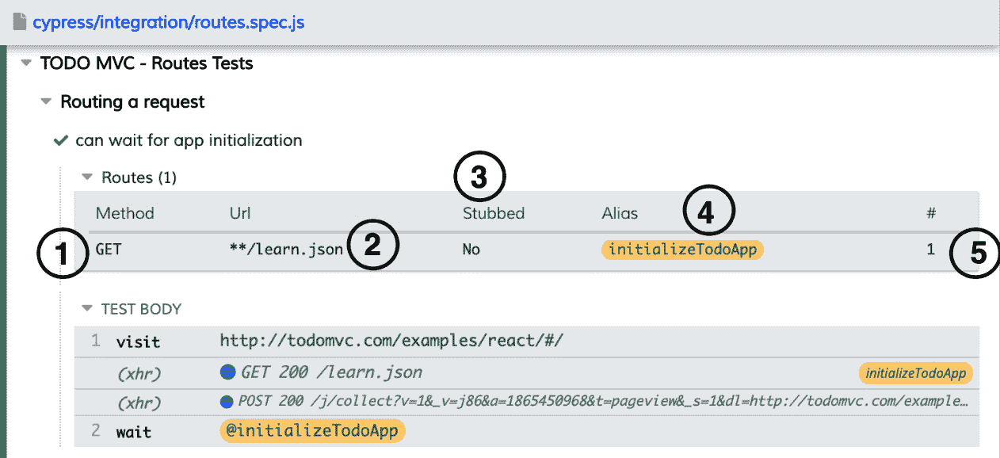
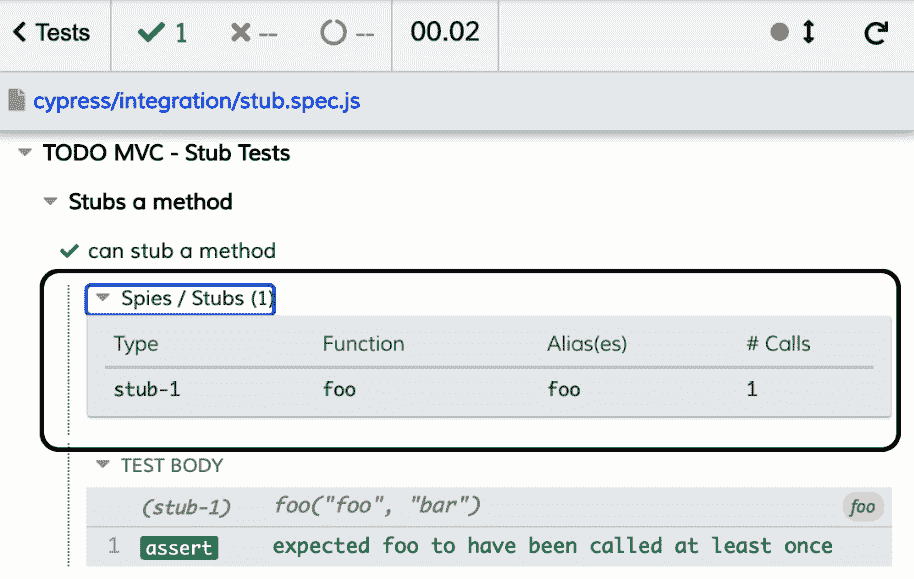
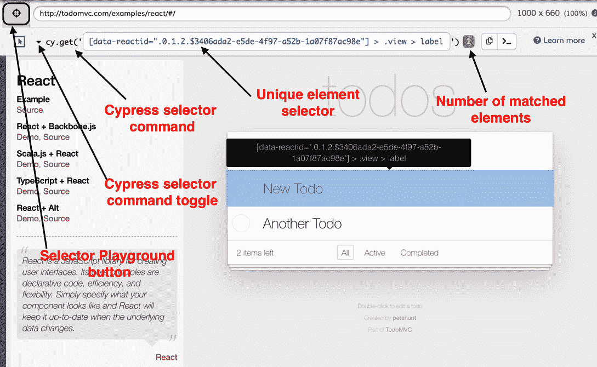
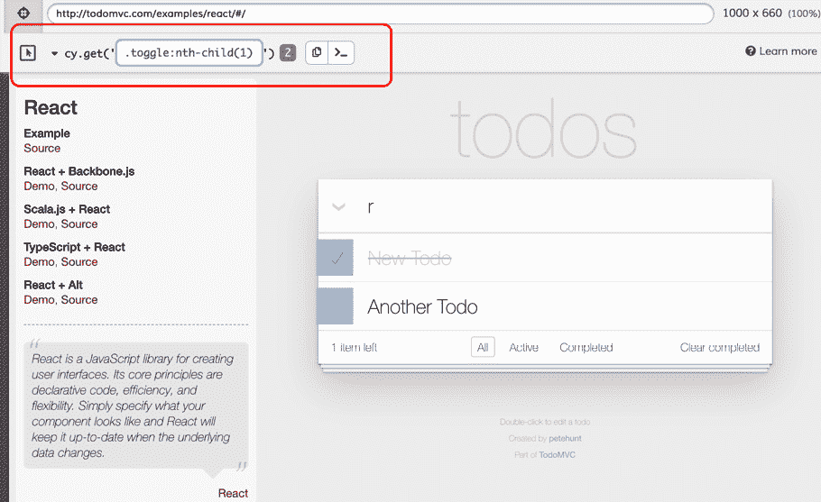

# 第九章：Cypress 测试运行器的高级用法

在我们开始讨论测试运行器的高级用法之前，您必须了解 Cypress 的工作原理、测试运行器的作用以及测试在测试运行器中的执行方式是至关重要的。本章是在您在前八章中所学到的 Cypress 知识的基础上构建的，并将重点放在帮助您理解测试运行器的高级功能上，这些功能在本书中尚未探讨过。

在本章中，我们将利用测试运行器，并通过利用测试运行器的内置功能来学习如何编写更好的测试。通过学习如何使用测试运行器，我们将更深入地了解测试的运行方式，当测试失败时会发生什么，以及如何改进它们。本章将涵盖以下关键主题：

+   理解仪表板

+   理解选择器游乐场

+   测试运行器键盘快捷键

一旦您学习了这些主题，您将完全了解测试运行器，以及如何充分利用它来编写您的测试。

## 技术要求

要开始，我们建议您从 GitHub 克隆包含本章中将编写的所有源代码和测试的存储库。

重要说明

我们已经在*第五章* *调试 Cypress 测试*中介绍了如何阅读和解释测试运行器中的 Cypress 错误。在该章节中，我们还介绍了如何与测试运行器中的 DOM 快照进行交互，其中我们涵盖了元素和命令日志之间的交互。在本章中，我们可能会参考*第五章* *调试 Cypress 测试*，或者进一步阐述该章节提供的信息。

本章的 GitHub 存储库可以在[`github.com/PacktPublishing/End-to-End-Web-Testing-with-Cypress`](https://github.com/PacktPublishing/End-to-End-Web-Testing-with-Cypress)找到。

本章的源代码可以在`chapter-09`目录中找到。

# 理解仪表板

仪表板是 Cypress 测试运行器中的一个特殊面板，只有当 Cypress 为您提供有关测试的其他信息时才可见。仪表板的出现是由特定命令触发的，这些命令提供了有关测试的更多信息。触发仪表板的命令包括`cy.stub()`、`cy.intercept()`和`cy.spy()`。在本节中，我们将探讨如何使用仪表板来显示有关测试的其他信息。

为了实现我们理解仪表板工作原理的目标，我们将不得不了解**拦截**、**存根**和**间谍**的工作原理，以及在 Cypress 测试中调用存根、路由和间谍时仪表板显示的具体信息。

## 拦截

Cypress 使用`cy.intercept()`命令来管理测试的网络层中的 HTTP 请求的行为。要理解拦截，我们首先需要了解 Cypress 中网络请求是如何进行的。Cypress 会在测试运行器上自动指示当运行测试时发出**XHR**（**XMLHttpRequest**）请求。Cypress 还会在请求被调用和响应被接收时创建 DOM 快照，这让我们了解了请求之前和之后 DOM 的情况。以下代码块是一个示例，用于从我们的 Todo 应用程序获取对 XHR 请求的响应：

```js
describe(Routing a request', () => {
    it('can wait for a app initialization, () => {
 	cy.intercept('POST','**/j/** 
     ').as('initializeTodoApp');
      cy.visit('http://todomvc.com/examples/react/#/');
      cy.wait('@initializeTodoApp'); // wait for intercept
      response
    })
  });
```

上述代码块显示了 Cypress 的`cy.intercept()`命令监听对初始化应用程序时 Cypress 预期进行的 XHR 响应。在测试中，我们正在验证确实已经向应用程序发出了请求，因为我们正在等待路由响应在我们的测试执行完成之前被调用。

Cypress 有能力解释请求，这使得框架可以轻松地通过监听测试发出的 HTTP 请求并知道请求调用返回的响应来管理 HTTP 请求。

在 Cypress 中，使用`cy.intercept()`命令进行拦截提供了覆盖 Cypress 测试执行期间由请求发出的 XHR 响应的能力。覆盖我们应用程序发出的 XHR 响应就是我们所谓的**存根**，我们将在本章后面讨论这个概念。

Cypress 在仪表板上记录了所有拦截的信息，通过查看面板，我们可以知道在我们的测试中匹配的路由数量，是否有任何与我们的路由匹配的响应，以及它们是否被存根。以下截图说明了使用仪表板来详细说明 Cypress 记录的有关路由的信息：



图 9.1 – Cypress 仪表板

*图 9.1*显示了仪表板上标有**路由**的区域，其中包含了不同类型的信息列，当测试完成运行时，路由响应的信息就会显示在这里。路由仪表板中的不同列具有不同的目的，并且对于运行测试和仪表板都是重要的。以下是不同的列，每个列都有其在 Cypress 路由中的用途和重要性的描述：

+   **方法**（**1**）：**方法**列代表`cy.intercept()`命令期望的请求，根据预期的请求，它可以是**GET**、**POST**、**PUT**、**PATCH**甚至**DELETE**。

+   **URL**（**2**）：**URL**列将显示运行 Cypress 测试时`cy.intercept()`命令期望的 URL。在这种情况下，我们告诉 Cypress 查找任何以`learn.json`结尾的路由，如果遇到它，那么我们的测试应该通过。

+   **存根**（**3**）：**存根**列将显示我们的路由是否已被存根。当路由被存根时，Cypress 不会返回接收到的响应，而是返回我们传递给路由的响应。

+   **别名**（**4**）：**别名**列显示了我们在 Cypress 中给予路由的别名。在*第八章*中，*了解 Cypress 中的变量和别名*，我们学习了别名以及当我们需要访问元素、路由或请求的信息时它们可以是有用的。**别名**列中提供的别名是我们用来调用我们的路由的，我们将在别名前加上`@`前缀来做到这一点。

+   **#**（**5**）：这个匹配列将显示与我们的路由匹配的响应的计数。在我们的情况下，对我们的 URL 的请求只被发出了一次，因此我们的路由在我们的测试中只被调用了一次。

路由的仪表板信息足以让您了解在我们的测试中是否有任何 XHR 请求发送到已在我们的测试中声明的路由，并且方法和请求次数是否与应用程序中预期的一致。

## 存根

Cypress 中的存根用于替换函数，控制其行为或记录其使用情况。存根可用于用我们自己编写的合成响应替换实际方法。在下面的代码块中，我们将验证我们在测试运行时可以存根名为`foo`的方法：

```js
it('can stub a method', () => {
      let obj = {
        foo () {},
      }
      const stub = cy.stub(obj, 'foo').as('foo')
      obj.foo('foo', 'bar')
      expect(stub).to.be.called
    })
```

在前面的代码块中显示的`foo()`方法说明了存根的实际操作，从代码中我们可以看到我们期望 Cypress 知道我们的存根在测试中被调用了。以下截图显示了测试执行和通过测试的详细信息，包括存根类型、存根名称以及存根被调用的次数：



图 9.2 – Cypress 存根

在*图 9.2*中，Cypress 显示了我们在仪表板中创建的存根，并显示了在执行测试过程中调用存根的次数。存根非常方便，因为我们可以存根化我们不想在范围内进行测试的依赖项或函数。

## 间谍

间谍的行为与存根完全相同，不同之处在于它们包装了间谍方法中的方法，以记录对函数的调用和参数。间谍仅用于验证 Cypress 中工作元素或方法。在测试中最常见的用法是验证测试中是否进行了某些调用，而不一定是为了改变对调用的期望，就像存根的情况一样。以下屏幕截图显示了我们验证`foo`方法是否在我们的`cy.spy()`方法中被调用的间谍：


图 9.3-Cypress 间谍

在*图 9.3*中，仪表板在显示调用我们的`spy`函数时发挥了关键作用，函数的名称，分配给我们的间谍方法的别名以及我们的测试方法的类型。

## 总结-理解仪表板

在本节中，我们学习了如何利用仪表板来理解 Cypress 中的拦截、间谍和存根。我们还学习了拦截、间谍和存根实际上是如何工作的，以及仪表板上的信息对于理解我们的实现是否正确是有用的。在下一节中，我们将深入了解 Cypress 中的选择器游乐场以及它的工作原理。

# 理解选择器游乐场

选择器游乐场是 Cypress 测试运行器的一个交互式功能。选择器游乐场使您能够确定唯一选择器，检查与特定选择器匹配的元素，并检查与 Cypress 应用程序中特定文本匹配的元素。在本节中，我们将看看 Cypress 用于选择元素的不同策略，以及从测试运行器中如何识别我们可以在测试中使用的选择器。在本节结束时，您将学会如何使用 Cypress 使用选择器游乐场来唯一选择元素，以及如何使用 Cypress 使用的选择器策略来运行测试。

## 选择唯一元素

选择器游乐场可能是 Cypress 测试运行器中最未充分利用的功能之一，但对于想要编写具有有意义选择器的测试的人来说，它也是最有用的。选择器游乐场使我们能够识别测试应用程序中元素的有效选择器和唯一选择器。

在选择器游乐场中，Cypress 计算了目标元素的唯一选择器，并通过评估测试框架中默认启用的内置选择器策略来确定选择器。以下显示了两个添加的待办事项和一个打开的 Cypress 选择器游乐场，显示了我们如何唯一选择任何待办事项：



图 9.4-Cypress 选择器游乐场

第一步是点击选择器游乐场按钮，一旦点击它，选择器游乐场菜单就会出现，如*图 9.4*所示。在选择器游乐场菜单中，您可以选择将选择器的类型更改为使用`cy.get()`选择其选择器的元素，或者使用元素文本，这可以通过将选择器切换为`cy.contains()`来找到。在`cy.get()`命令或`cy.contains()`命令中，是我们想要从应用程序预览中获取的特定元素或文本。为了确保任何元素或文本有资格成为唯一的元素选择器，匹配元素的数量，由选择器游乐场上的灰色表示，应为**1**，以确保我们没有元素或文本的重复。匹配元素标签旁边的按钮代表将选择器复制到剪贴板的复制命令，而下一个按钮是一个打印按钮，将我们选择或选择的命令打印到浏览器的控制台日志中。

当点击选择器游乐场下方的鼠标按钮时，Cypress 会自动显示一个弹出窗口，当用户悬停在元素上时，会自动选择一个可以用于在我们的测试中识别元素的唯一选择器。在*图 9.4*中，我们可以看到一旦悬停在**New Todo**项目上，Cypress 会将唯一选择器显示为工具提示，并且在单击元素时还会填充`cy.get()`命令。当在选择器游乐场菜单上选择元素时，Cypress 将在选择器游乐场上返回唯一的选择器。

### 选择器的确定

为了确定选择器游乐场中的唯一选择器，Cypress 使用了一种偏好策略，选择的选择器基于 Cypress 已知的一系列策略。Cypress 在选择和分配唯一选择器给元素时，偏好以下策略：

+   `data-cy`

+   `data-test`

+   `data-testid`

+   `id`

+   `class`

+   `tag`

+   `attributes`

+   `nth-child`

重要提示

选择器游乐场更喜欢以`data-*`开头的选择器策略作为它们的识别格式。在大多数情况下，选择器策略是自定义的，因此消除了由于应用程序中使用动态 ID、类名或 CSS 更改而导致测试不稳定的可能性。使用自定义的`data-*`标签，选择器标识符不会改变，并且可以在应用程序的整个生命周期中持续存在。

当元素可以通过任何这些选择器策略进行识别时，Cypress 将显示元素的唯一选择器。虽然这些策略是 Cypress 偏好的策略，但可以通过更改配置来使 Cypress 识别您的选择器策略，并将其添加到可识别的选择器策略列表中。

## 编辑选择器元素

选择器游乐场使用户能够编辑所选元素的选择器。编辑选择器元素的能力很重要，因为可以生成更有针对性的选择和更精细的选择器标记，这是 Cypress 本身可能无法做到的。Cypress 会自动识别对选择器游乐场所做的更改，并且当编辑的选择器元素有匹配时，将选择器游乐场突出显示为蓝色，如果在应用程序预览的选择器游乐场中对编辑的选择器标识符没有匹配时，则突出显示为红色。*图 9.5*和*图 9.6*显示了使用正确的元素选择器编辑选择器游乐场以及使用不正确的元素选择器：


图 9.5 - 游乐场中的有效元素选择器

在*图 9.5*中，使用无效的元素选择器编辑选择器游乐场会显示错误，并用红色突出显示选择器游乐场，以向我们显示使用我们提供的选择器元素未找到任何元素。另一方面，*图 9.6*显示编辑选择器游乐场元素选择器是成功的：



图 9.6-游乐场中的无效元素选择器

如*图 9.6*所示，我们能够使用在选择器游乐场中编辑的选择器选择我们的两个待办事项。蓝色显示了 Cypress 找到了我们正在搜索的元素，并通过在选择器游乐场中的元素选择器输入右侧显示元素数量来实现这一点。

## 总结-理解选择器游乐场

在这一部分，我们学习了选择器游乐场是什么，以及在使用测试运行器运行测试时它有多重要。我们学习了如何使用选择器游乐场来选择元素，修改元素，甚至从 Cypress 测试运行器的应用程序预览中选择和复制唯一元素。我们还学习了 Cypress 如何识别元素以及在选择元素时首选的选择器策略。最后，我们学习了如何在选择器游乐场中编辑定位器，以及如何确定我们的选择器是否有效。在下一节中，我们将看看测试运行器上的键盘快捷键是如何工作的。

# 测试运行器键盘快捷键

键盘快捷键在我们不想在浏览器上执行一系列步骤的情况下特别方便。在本节中，我们将学习如何使用三个键盘快捷键来控制 Cypress 测试运行器并有效地运行我们的测试。通过测试运行器，我们将比使用浏览器操作显式触发操作更快地执行常见操作。

以下是不同键盘键的映射及其关联的操作：

+   *R* - 重新运行规范文件的测试

+   *S* - 停止运行测试

+   *F* - 查看规范窗口中的所有测试

这些键盘键将根据用户的按键触发测试运行器上的不同操作。

## 总结-测试运行器键盘快捷键

在本节中，我们学习了如何使用 Cypress 键盘快捷键来控制测试运行器的常见操作，只需键盘上的三个键。我们还了解到，使用键盘执行操作比使用浏览器操作触发相同操作时更快。

# 总结

在本章中，我们学习了仪表板、选择器游乐场和 Cypress 测试运行器中的键盘快捷键。我们探讨了仪表板如何与存根、间谍和路由一起工作，并探讨了路由、存根和间谍的工作原理，以及仪表板中显示的信息。我们还看了选择器游乐场在 Cypress 中的应用以及我们如何利用它来识别应用程序测试中的元素，以及优化 Cypress 用于唯一选择元素的选择器。最后，我们学习了 Cypress 键盘快捷键的作用以及哪些键与使用浏览器功能可用的操作相对应。

现在我们知道并理解了 Cypress 中不同元素是如何联系在一起的，我们可以进一步通过练习来测试我们所学到的知识。在下一章中，我们将测试我们对导航、网络请求和测试的导航配置选项的了解。
