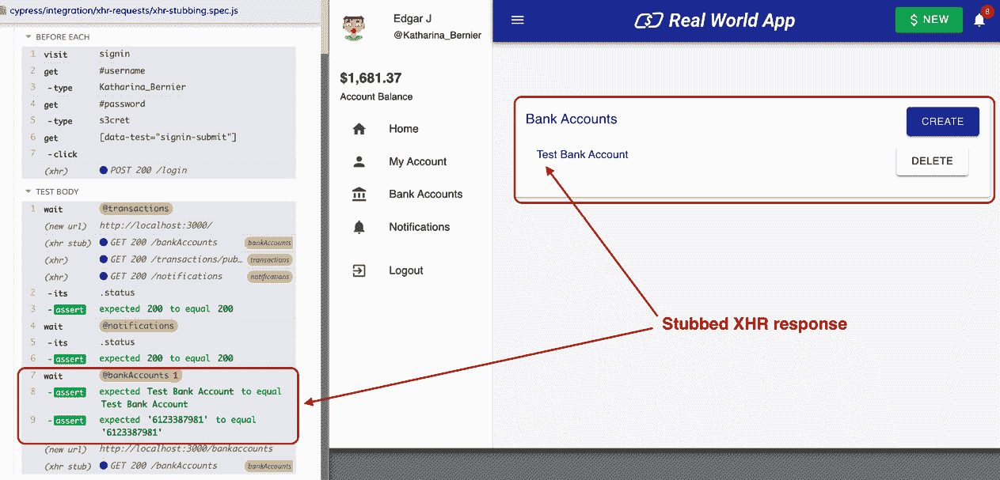
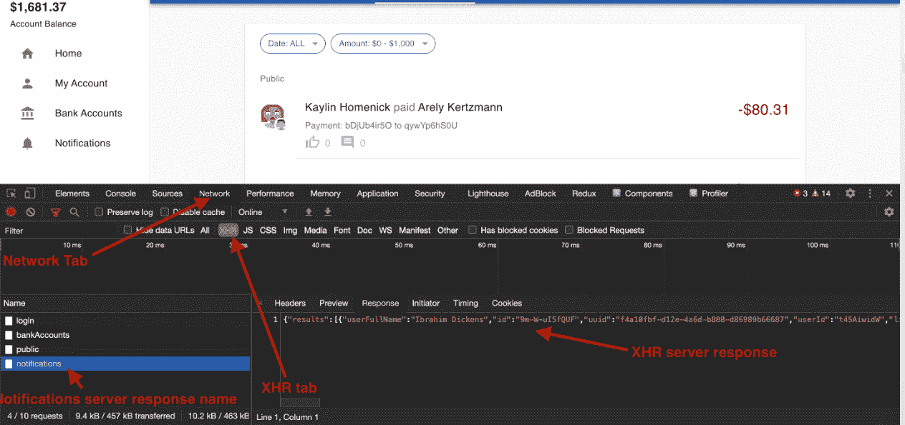
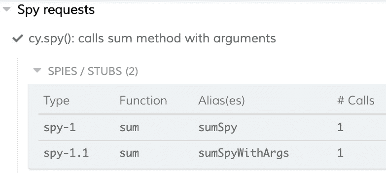

# 第十一章：：练习-存根和监视 XHR 请求

在开始本章之前，您需要了解为什么需要存根或监视请求和方法，为此，您需要了解 Cypress 请求以及如何测试单个方法。之前的章节已经介绍了如何轻松开始使用 Cypress，并且我们已经涵盖了与网络请求和功能测试相关的概念。在本章中，我们将在之前章节中获得的概念基础上进行构建，重点是通过示例和练习的实践方法。

在本章中，我们将涵盖以下关键主题：

+   理解 XHR 请求

+   理解如何存根请求

+   理解如何在测试中监视方法

完成每个主题后，您将准备好开始使用 Cypress 进行视觉测试。

## 技术要求

为了开始，我们建议您从 GitHub 克隆包含源代码、所有测试、练习和解决方案的存储库，这些内容将在本章中编写。

本章的 GitHub 存储库可以在[`github.com/PacktPublishing/End-to-End-Web-Testing-with-Cypress`](https://github.com/PacktPublishing/End-to-End-Web-Testing-with-Cypress)找到。本章的源代码可以在`chapter-11`目录中找到。

在我们的 GitHub 存储库中，我们有一个财务测试应用程序，我们将在本章的不同示例和练习中使用。

重要提示：在 Windows 中运行命令

注意：默认的 Windows 命令提示符和 PowerShell 无法正确解析目录位置。

请遵循进一步列出的适用于 Windows 操作系统的 Windows 命令，并在末尾加上`*windows`。

为了确保测试应用程序在您的计算机上运行，请在终端中从应用程序的根文件夹目录运行以下命令：

```js
$ cd cypress/chapter-11;
$ npm install -g yarn or sudo npm install -g yarn
$ npm run cypress-init; (for Linux or Mac OS)
$ npm run cypress-init-windows; (for Windows OS)
// run this command if it's the first time running the application
or
$ npm run cypress-app (for Linux or Mac OS)
$ npm run cypress-app-windows; (for Windows OS)
// run this command if you had already run the application previously
Optionally
$ npm run cypress-app-reset; (for Linux or Mac OS)
$ npm run cypress-app-reset-windows; (for Windows OS)
// run this command to reset the application state after running your tests
```

重要提示

我们的测试位于`chapter-11`目录中，测试应用程序位于存储库的根目录中。为了正确运行我们的测试，我们必须同时运行我们的应用程序和 Cypress 测试，因为测试是在我们本地计算机上运行的实时应用程序上运行的。还要注意，应用程序将需要使用端口`3000`用于前端应用程序和端口`3001`用于服务器应用程序。

第一个命令将导航到我们的应用程序所在的`cypress-realworld-app`目录。然后，`npm run cypress-init`命令将安装应用程序运行所需的依赖项，`npm run cypress-app`命令将启动应用程序。可选地，您可以使用`npm run cypress-app-reset`命令重置应用程序状态。重置应用程序会删除任何不属于应用程序的已添加数据，将应用程序状态恢复到克隆存储库时的状态。

# 理解 XHR 请求

**XMLHttpRequest**（**XHR**）是现代浏览器中存在的 API，它以对象的形式存在，其方法用于在 Web 浏览器发送请求和 Web 服务器提供响应之间传输数据。XHR API 是独特的，因为我们可以使用它在不重新加载页面的情况下更新浏览器页面，请求和接收页面加载后的服务器数据，甚至将数据作为后台任务发送到服务器。在本节中，我们将介绍 XHR 请求的基础知识以及在编写 Cypress 测试过程中的重要性。

## 在测试中利用 XHR 请求

XHR 请求是开发人员的梦想，因为它们允许您*悄悄地*发送和接收来自服务器的数据，而不必担心诸如错误或等待时间等问题，当客户端应用程序需要重新加载以执行操作时。虽然 XHR 对开发人员来说是一个梦想，但对测试人员来说却是一场噩梦，因为它引入了诸如无法知道请求何时完成处理，甚至无法知道数据何时从服务器返回等不确定性。

为了解决 XHR 不确定性的问题，Cypress 引入了`cy.intercept()`命令，我们在*第九章*和*第十章*中深入研究了这个命令，分别是*高级 Cypress 测试运行*和*练习-导航和网络请求*中的网络请求部分。`cy.intercept()`命令监听 XHR 响应，并知道 Cypress 何时返回特定 XHR 请求的响应。使用`cy.intercept()`命令，我们可以指示 Cypress 等待直到接收到特定请求的响应，这使得我们在编写等待来自服务器的响应的测试时更加确定。

`xhr-requests/xhr.spec.js`文件中的以下代码块显示了将用户登录到我们的财务测试应用程序的代码。当用户登录时，应用程序会向服务器发送请求，以加载应用程序所需的通知、银行账户和交易明细。这些详细信息作为 XHR 响应从 API 服务器返回：

```js
describe('XHR Requests', () => {
    it('logs in a user', () => {
        cy.intercept('bankAccounts').as('bankAccounts');
        cy.intercept('transactions/public').
        as('transactions');
        cy.intercept('notifications').as('notifications');
        cy.visit('signin'); 
        cy.get('#username').type('Katharina_Bernier');
        cy.get('#password').type('s3cret');
        cy.get('[data-test="signin-submit"]').click()
        cy.wait('@bankAccounts').its('response.statusCode'
        ).should('eq', 200);
        cy.wait('@transactions').its('response.statusCode
        ').should('eq', 304);
        cy.wait('@notifications').its('response.statusCode
        ').should('eq', 304);
    });
});
```

在上述代码块中，我们正在登录用户，并等待 Cypress 返回我们从服务器发送的交易、通知和银行账户请求的 XHR 响应。只有在成功的用户登录尝试时才会发送响应。我们可以通过以下截图来可视化 Cypress 如何在测试中处理 XHR 请求：


图 11.1-XHR 请求和来自服务器的响应

这个截图显示了应用程序向我们的服务器发送`/bankAccounts`、`/transactions`和`/notifications`的 XHR 请求。为了使我们的测试具有确定性，并且为了等待指定的时间以确保成功登录，我们使用`cy.intercept()`命令来检查 XHR 请求的响应何时被服务器发送回来，以及它们是否以正确的状态码发送回来。

在测试中等待 XHR 响应给我们带来了明显的优势，这些优势超过了没有处理等待的*失败机制*或者具有显式时间等待的测试。等待 XHR 响应的替代方法是显式等待特定的时间量，这只是一个估计值，并不是 Cypress 等待特定响应的确切时间。在运行我们的测试时等待路由响应的一些优势如下：

+   能够断言从路由返回的 XHR 响应对象

+   创建健壮的测试，从而减少不稳定性

+   具有精确性的失败消息

+   能够存根响应和“伪造”服务器响应

通过突出这些优势，使用 XHR 请求帮助我们确定地知道何时收到响应，以及 Cypress 何时可以继续执行我们的命令，已经收到了应用程序所需的所有响应。

## 总结-在测试中利用 XHR 请求

在本节中，我们了解了 XHR 请求，它们是什么，以及 Cypress 如何利用它们向应用程序服务器发送和获取请求。我们还学习了如何等待 XHR 响应以减少不稳定的测试，通过确定性地等待来自我们服务器响应的响应。我们还学习了 XHR 如何帮助我们，我们如何拥有精确的失败消息，甚至如何断言来自我们服务器响应的响应。最后，我们将通过使用`cy.intercept()`命令与 XHR 响应以及能够通过减少测试不确定性来控制测试执行的潜在好处。在下一节中，我们将看看如何使用存根来控制来自服务器的 XHR 响应。

# 了解如何存根请求

现在我们知道了什么是 XHR 请求，重要的是要知道我们如何帮助 Cypress 测试 XHR 请求，更重要的是，我们如何避免来自服务器的实际响应，而是创建我们自己的“假”响应，我们的应用程序将解释为来自服务器发送的实际响应。在本节中，我们将看看如何存根 XHR 请求到服务器，何时存根请求以及存根服务器请求对我们的测试的影响。

## 存根 XHR 请求

Cypress 灵活地允许用户要么使他们的请求到达服务器，要么在应用程序发出对服务器端点的请求时，使用存根响应。有了 Cypress 的灵活性，我们甚至可以允许一些请求通过到服务器，同时拒绝其他请求并代替它们进行存根。存根 XHR 响应为我们的测试增加了一层控制。通过存根，我们可以控制返回给客户端的数据，并且可以访问更改**body**、**status**和**headers**的响应，甚至在需要模拟服务器响应中的网络延迟时引入延迟。

### 存根请求的优势

存根请求使我们对返回给测试的响应以及由应用程序向服务器发出请求时将收到的数据具有更多控制。以下是存根请求的优势：

+   对响应的 body、headers 和 status 具有控制权。

+   响应的快速响应时间。

+   服务器不需要进行任何代码更改。

+   可以向请求添加网络延迟模拟。

接下来，让我们也看看一些缺点。

### 存根请求的缺点

虽然存根是处理 Cypress 客户端应用程序测试中的 XHR 响应的一种好方法，但它也有一些缺点，如下所示：

+   无法对某些服务器端点进行测试覆盖。

+   无法保证响应数据和存根数据匹配

建议在大多数测试中存根 XHR 响应，以减少执行测试所需的时间，并且还要在存根和实际 API 响应之间有一个健康的混合。在 Cypress 中，XHR 存根也最适合与 JSON API 一起使用。

在`xhr-requests/xhr-stubbing.spec.js`文件的以下代码块中，我们将对`bankAccounts`端点进行存根，并在运行应用程序时避免实际请求到服务器：

```js
describe('XHR Stubbed Requests', () => {    
    it('Stubs bank Account XHR server response', () => {
        cy.intercept('GET', 'bankAccounts',
        {results: [{id :"RskoB7r4Bic", userId :"t45AiwidW",
        bankName: "Test Bank Account", accountNumber 
        :"6123387981", routingNumber :"851823229", 
        isDeleted: false}]})
        .as('bankAccounts');
        cy.intercept('GET', 'transactions/public').
        as('transactions');
        cy.intercept('notifications').as('notifications');
        cy.wait('@transactions').its('
        response.statusCode').should('eq', 304);
        cy.wait('@notifications').its('
        response.statusCode').should('eq', 304);
        cy.wait('@bankAccounts').then((xhr) => {
            expect(xhr.response.body.results[0].
            bankName).to.eq('Test Bank Account')
            expect(xhr.response.body.results[0].
            accountNumber).to.eq('6123387981')  
        });
    });
});
```

在上述代码块中，我们对`/bankaccounts`服务器响应进行了存根，并且我们提供了一个几乎与服务器将要发送的响应几乎相同的响应，而不是等待响应。以下截图显示了成功的存根响应以及我们使用存根响应向客户端提供的“假”存根银行账户信息：



图 11.2 - 客户端应用程序中的存根 XHR 响应

在*图 11.2*中，我们可以看到几乎不可能判断我们的响应是存根化的还是从服务器接收的。使用 Cypress，客户端应用程序无法识别响应是真正从服务器发送的还是存根化的，这使得 Cypress 成为拦截请求并发送响应的有效工具，否则这些响应将需要很长时间才能从服务器发送。我们将在以下练习中了解更多关于存根化 XHR 响应的知识。

## 练习 1

使用 GitHub 存储库中提供的金融应用程序，位于`cypress-realworld-app`目录中，进行以下练习，以测试您对存根化 XHR 响应的了解。练习的解决方案可以在`chapter-11/integration/xhr-requests-exercises`目录中找到：

1.  存根化应用程序的登录 POST 请求，而不是在仪表板中返回测试用户的名称，而是更改为反映您的名称和用户名。

断言返回的响应确实包含您的用户名和名称信息，这些信息已经被存根化。以下屏幕截图显示了应更改的页面信息：


图 11.3 - 通过存根化登录响应来更改名称和用户名

重要提示

要正确地存根化响应，您需要了解服务器在路由未存根化时发送的响应。为此，请在浏览器上打开浏览器控制台，单击**网络**选项卡，然后选择**XHR 过滤器**选项。现在您可以看到所有发送到服务器并由客户端接收的响应和请求。要获取特定请求以进行存根化，您应单击确切的请求并从浏览器控制台的**网络**窗口的**响应**选项卡中复制响应。确切的响应（或结构类似的响应）是我们应该用来存根化我们的服务器响应，以确保对客户端的响应一致性。从**网络**窗口，我们还可以获取有关与请求一起发送和接收的标头以及用于将请求发送到服务器的实际 URL 的信息。

以下屏幕截图显示了服务器返回的**通知**XHR 响应的示例：



图 11.4 - Chrome 浏览器控制台上通知端点的服务器 XHR 响应

1.  成功登录后，从`Everyone Dashboard`选项卡中选择一个随机交易，并将交易金额修改为$100。

通过这个练习，您不仅学会了如何存根化 XHR 响应，还学会了客户端如何处理从服务器接收到的数据。通过了解 XHR 响应存根化的好处，您现在已经准备好处理涉及存根化响应的复杂 Cypress 测试了。

## 总结 - 了解如何存根请求

在本节中，我们学习了如何使用 XHR 服务器请求来接收请求，还学习了如何通过存根来拦截发送的请求。我们还学习了如何使用存根来控制我们发送回客户端应用程序的响应的性质，以及如何断言我们的存根化响应看起来与我们从服务器接收到的客户端响应类似。最后，我们学习了如何使用浏览器来识别哪些响应需要存根，并使用我们正在存根的响应的内容。在下一节中，我们将看看间谍工作的原理以及如何在我们的 Cypress 方法中利用它。

# 了解如何在测试中对方法进行间谍

间谍和存根密切相关，不同之处在于，与可以用于修改方法或请求的数据的存根不同，间谍仅获取方法或请求的状态，并且无法修改方法或请求。它们就像现实生活中的间谍一样，只跟踪和报告。间谍帮助我们了解测试的执行情况，哪些元素已被调用，以及已执行了什么。在本节中，我们将学习 Cypress 中间谍的概念，监视方法的优点以及如何利用监视编写更好的 Cypress 测试。

## 为什么要监视？

我们在 Cypress 中使用间谍来记录方法的调用以及方法的参数。通过使用间谍，我们可以断言特定方法被调用了特定次数，并且使用了正确的参数进行了调用。我们甚至可以知道方法的返回值，或者在调用时方法的执行上下文。间谍主要用于单元测试环境，但也适用于集成环境，例如测试两个函数是否正确集成，并且在一起执行时能够和谐工作。执行`cy.spy()`命令时返回一个值，而不是像几乎所有其他 Cypress 命令一样返回一个 promise。`cy.spy()`命令没有超时，并且不能进一步与其他 Cypress 命令链接。

### 间谍的优点

以下是在测试中使用间谍的一些优点：

+   间谍不会修改调用的请求或方法。

+   间谍使您能够快速验证方法是否已被调用。

+   它们提供了一种测试功能集成的简单方法。

监视是一个有趣的概念，因为它引入了一种在不必对结果采取行动的情况下监视方法的方式。在下面的代码块中，我们有一个测试，其中包含一个简单的函数来求两个数字的和：

```js
  it('cy.spy(): calls sum method with arguments', () => {
        const obj = {
            sum(a, b) {
                return a + b
            }
        }
        const spyRequest = cy.spy(obj, 'sum').as('sumSpy');
        const spyRequestWithArgs = spyRequest.withArgs(1, 
        2).as('sumSpyWithArgs')
        obj.sum(1, 2); //spy trigger 
        expect(spyRequest).to.be.called;
        expect(spyRequestWithArgs).to.be.called;
        expect(spyRequest.returnValues[0]).to.eq(3);
    });
```

在上述方法中，我们设置了`cy.spy()`来监视我们的`sum`方法，并在调用方法或使用参数调用方法时触发间谍。每当方法被调用时，我们的间谍将记录它被调用的次数，我们还可以继续检查我们的方法是否被调用了任何参数。`sum`函数位于 JavaScript 对象中，触发间谍方法的是`obj.sum(1, 2)` sum 函数调用，在我们的测试中的断言执行之前被调用。以下屏幕截图显示了间谍、调用次数和测试的别名：



图 11.5 - 监视 sum 方法

查看使用`cy.spy()`方法在`sum()`函数上的方法，我们可以看到`sum`方法的间谍和使用参数调用的`sum`方法在`sum`方法开始执行时都被触发了一次。

在下一个示例中，我们将探索一个更复杂的场景，我们将尝试监视一个从服务器返回我们 JSON 数据库中所有交易的方法。以下代码块显示了将获取所有交易的方法的间谍：

```js
it('cy.spy(): fetches all transactions from our JSON database', () => {
        const obj = {
          fetch(url, method) {
                return cy.request({
                    url,
                    method
                }).then((response) => response);
            }
        }
        const spyRequest = cy.spy(obj, 
        'fetch').as('reqSpy');
        obj.fetch('http://localhost:3001/transactions', 
        'GET');
        expect(spyRequest).to.be.called;
        expect(spyRequest.args[0][0]).to.eq
        ('http://localhost:3001/transactions')
        expect(spyRequest.args[0][1]).to.eq('GET');
    });
```

在这个测试中，我们正在验证从数据库获取交易的请求是否发生。通过这个测试，我们可以监视我们的方法，并检查在调用方法时是否传递了正确的参数。

很明显，使用间谍，我们能够确定调用了哪些方法，它们被调用了多少次，以及在调用方法时使用了什么参数。我们将在下一个练习中了解更多关于间谍的知识。

## 练习 2

使用 GitHub 存储库中提供的金融应用程序，位于`cypress-realworld-app`目录中，进行以下练习，以测试您对存根 XHR 响应的了解。练习的解决方案可以在`chapter-11/integration/spies-exercise`目录中找到：

1.  创建一个名为`Area`的方法来计算三角形的面积，对`area`方法进行间谍活动，并调用该方法来断言确实使用了`cy.spy()`对`area`方法进行了间谍活动。断言该方法也是使用`base`和`height`参数进行调用的。

1.  使用我们的应用程序，以用户身份登录并对 API 请求方法进行间谍活动，以获取该已登录用户的所有银行账户。断言已调用该方法向服务器发出 API 请求，并且参数作为方法的参数传递。

这个练习将帮助你了解间谍在 Cypress 中是如何工作的，以及可以使用`cy.spy()`的不同方法来查找被监视的方法的内容。通过监视方法，我们还能够判断方法参数是否被调用以及它们是如何被调用的，还有返回值。

## 总结-了解如何在测试中对方法进行间谍活动

在这一部分，我们学习了关于间谍活动的重要性以及它与存根活动的不同之处，因为我们不被允许改变被监视方法或请求的值。我们还学会了如何使用存根活动来识别方法的参数、方法被调用的次数、执行上下文，以及被监视方法的返回值。通过例子和练习，我们还学会了如何与`cy.spy()`命令进行交互，这帮助我们了解了该命令以及它在方法上下文中的工作方式。

# 总结

这一章的重点主要是 XHR 请求和响应以及它们如何与客户端和服务器进行交互。我们首先了解了 XHR 请求和响应是什么，以及当我们想要从客户端发送请求并从服务器接收请求时它们是多么重要。在这一章中，我们还看到了如何通过使用内置在`cy.intercept()`命令中的 Cypress 存根功能来存根 XHR 响应来“伪造”服务器响应。最后，我们探讨了 Cypress `cy.spy()`命令，这进一步让我们了解了如何在 Cypress 中监视方法，并获得找出方法被执行的次数、它们是如何被执行的、它们的参数，甚至它们的返回值的能力。在最后一节中，我们学会了知道通过间谍，我们只能“观察”执行的过程，而不一定有能力改变被测试的请求或方法的执行过程。

我相信通过这一章，你已经掌握了 XHR 请求是什么，它们是如何工作的，如何对它们进行存根，以及如何在 Cypress 中进行间谍活动的技能。在下一章中，我们将看看 Cypress 中的视觉测试。
