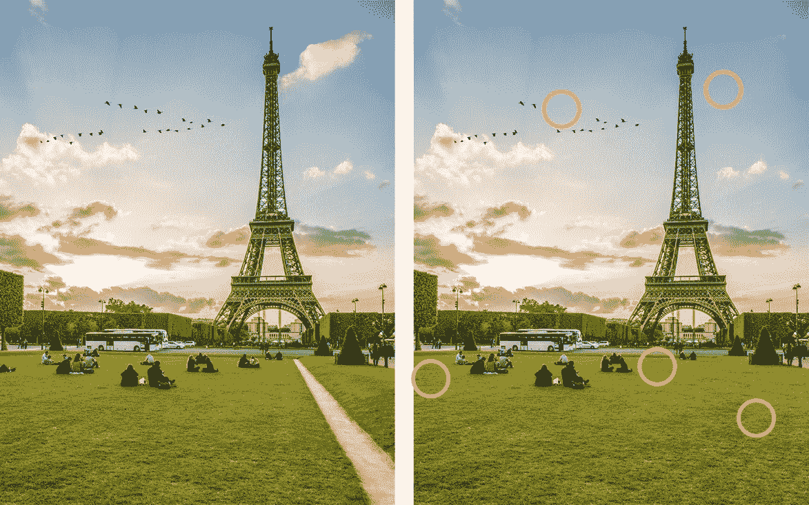
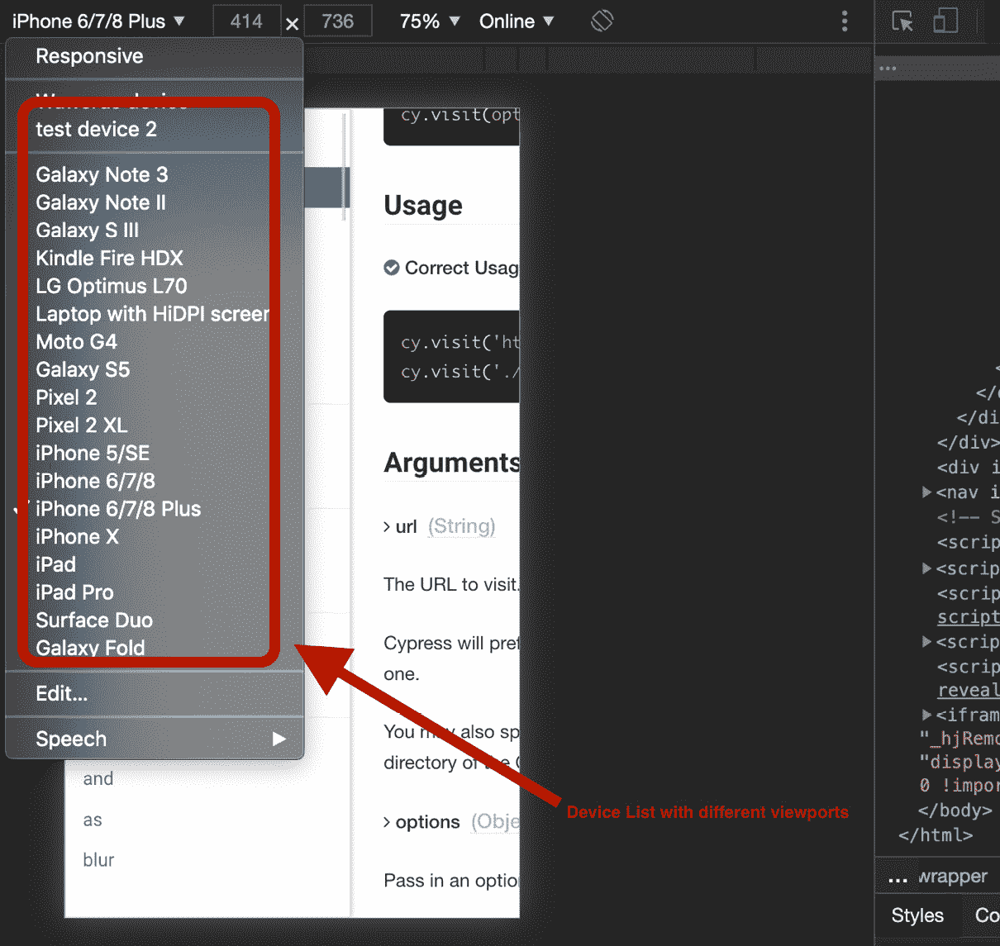
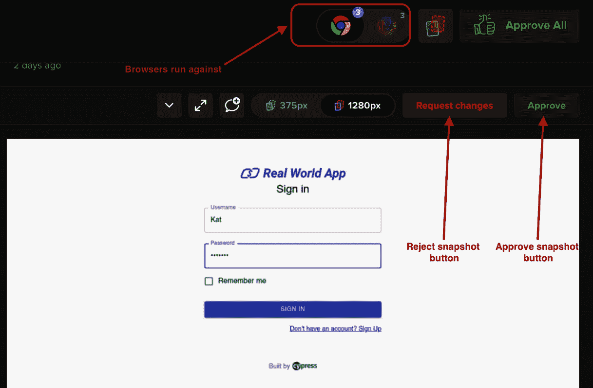
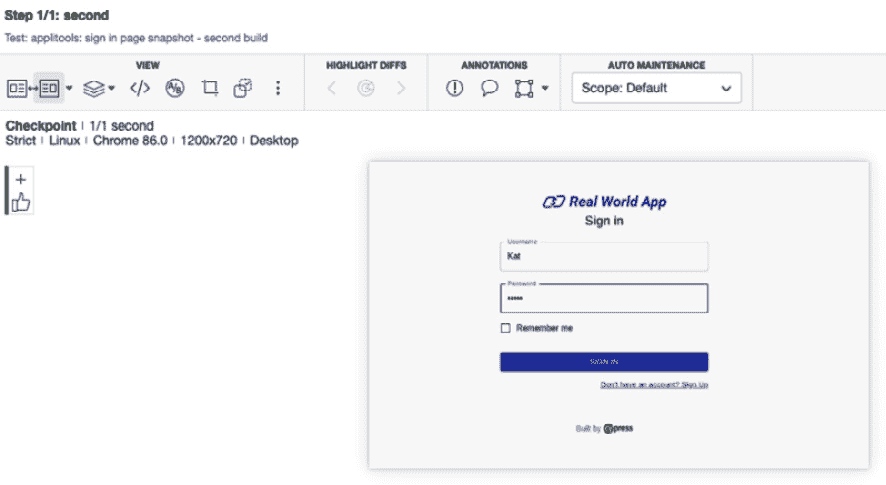
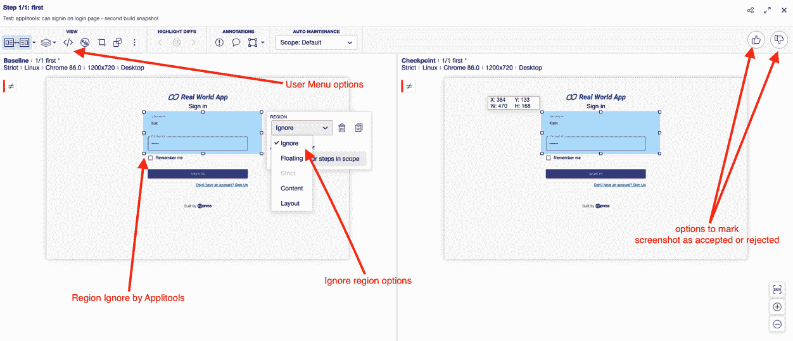
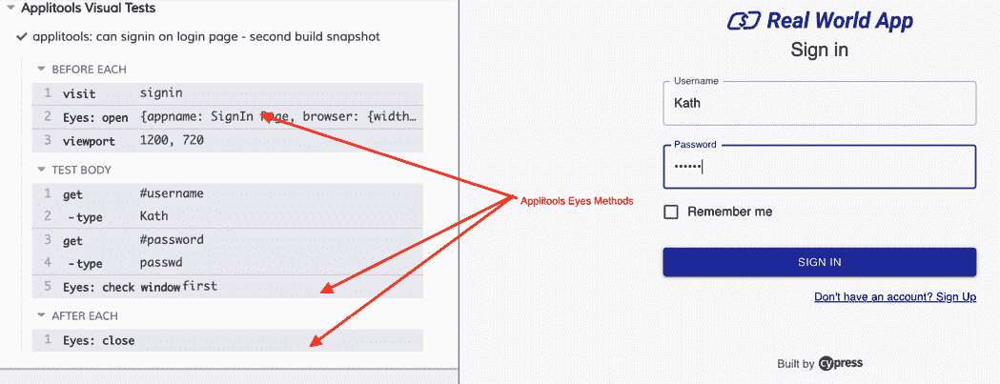

# 第十二章：*第十二章*：Cypress 中的视觉测试

在开始进行视觉测试之前，您应该了解其他形式的测试以及我们如何使用 Cypress 来完成这些测试。本书的前几章介绍了如何轻松入门 Cypress，如何配置 Cypress，以及如何优化您使用 Cypress 来为测试编写过程开发更有创意的工作流程。前几章的背景信息将为您提供解决本章所需的上下文。本书的最后一章将重点介绍使用 Cypress 进行视觉测试。

在本章中，我们将介绍视觉测试的基础知识，并了解为什么我们需要它。我们还将学习一些工具，可以用来进行视觉测试。本章的主题将帮助你作为工程师或测试人员理解为什么视觉测试对于 Web 应用程序很重要，以及我们如何利用它来编写更好的测试。

我们将在本章中涵盖以下关键主题：

+   视觉测试

+   理解视口

+   Cypress 测试中的视觉测试工具

一旦您完成了每个主题，您将准备好开始使用 Cypress 作为您的选择工具进入自动化测试世界的旅程。

## 技术要求

要开始，请克隆本书的 GitHub 存储库，其中包含本章中将编写的所有源代码、测试、练习和解决方案。

本章的 GitHub 存储库可以在[`github.com/PacktPublishing/End-to-End-Web-Testing-with-Cypress`](https://github.com/PacktPublishing/End-to-End-Web-Testing-with-Cypress)找到。

本章的源代码可以在`chapter-12`目录中找到。

在我们的 GitHub 存储库中，我们有一个金融测试应用程序，我们将在本章的不同示例和练习中使用它。

重要提示：在 Windows 中运行命令

注：默认的 Windows 命令提示符和 PowerShell 无法正确解析目录位置。

请遵循以下列出的 Windows 命令，这些命令仅适用于 Windows 操作系统，并以`*windows`结尾。

为了确保测试应用程序在您的计算机上运行，请从存储库的根文件夹目录中在您计算机的终端上运行以下命令：

```js
$ cd cypress/chapter-12;
$ npm install -g yarn or sudo npm install -g yarn
$ npm run cypress-init; (for Linux or Mac OS)
$ npm run cypress-init-windows; (for Windows OS)
// run this command if it's the first time running the
application
or
$ npm run cypress-app (for Linux or Mac OS)
$ npm run cypress-app-windows; (for Windows OS)
// run this command if you had already run the application
previously
Optionally
$ npm run cypress-app-reset; (for Linux or Mac OS)
$ npm run cypress-app-reset-windows; (for Windows OS)
// run this command to reset the application state after
running your tests
```

重要提示

我们的测试位于`chapter-12`目录中，测试应用程序位于存储库的根目录中。为了正确运行我们的测试，我们必须同时运行我们的应用程序和 Cypress 测试，因为测试是在实时应用程序上运行的，而这个应用程序必须在我们的计算机上本地运行。重要的是要注意，测试应用程序将需要使用端口`3000`用于前端应用程序和端口`3001`用于服务器应用程序。

第一个命令将导航到`cypress-realworld-app`目录，这是我们的应用程序所在的位置。`npm run cypress-init`命令将安装应用程序运行所需的依赖项，而`npm run cypress-app`命令将启动应用程序。可选地，您可以使用`npm run cypress-app-reset`命令重置应用程序状态。重置应用程序会删除任何不属于应用程序的已添加数据，从而将应用程序状态恢复到克隆存储库时的状态。

# 视觉测试

无论您是 Web 开发人员还是测试人员，都需要确保正在开发的应用程序保留了项目概念时预期的外观和感觉。作为开发人员，您可能希望验证应用程序在发布之间没有发生视觉方面的变化。作为测试人员，您可能希望验证应用程序的用户界面在发布之间保持一致，并且与设计一致。

**功能测试**可以用来检查视觉方面，比如验证按钮或输入框是否存在。然而，这可能需要编写大量代码，并且大多数情况下，它不会允许您测试应用程序的每个方面，比如在验证用户界面元素时使用 CSS 更改。视觉测试是验证应用程序用户界面的视觉方面，并确保它们与预期一致的能力。

在本节中，我们将学习什么是视觉测试，视觉测试的不同类型是什么，手动和自动视觉测试之间的区别，以及何时使用不同类型的视觉测试方法。

## 为什么要进行视觉测试？

视觉测试采取了实际的方法，因为您必须直接映射页面的视觉方面，并将这些方面与预期的设计进行比较。我们可能会忽略视觉测试的想法，因为我们认为我们的眼睛对于验证目的足够准确，这是一个错误的假设。虽然肉眼可以注意到可见的页面变化，但对于眼睛来说，检测微小的细节，比如改变 CSS 属性导致输入元素移动了几个像素或者像素变化很小，可能会更加困难。

视觉测试的存在是为了让开发人员和测试人员确信网页的用户界面没有被任何开发人员的更改破坏。例如，通过视觉测试，如果部署到生产环境的应用程序版本缺少注册按钮，而以前的应用程序版本有该按钮，就不需要担心。

有两种类型的视觉测试，如下所示：

+   手动视觉测试

+   自动化视觉测试

这两种类型的视觉测试将向我们展示视觉测试的重要性，以及我们如何利用这两种测试方法来编写更好的测试。

### 手动视觉测试

手动视觉测试涉及使用肉眼验证开发团队所做的更改是否破坏了任何可见的用户界面功能。手动视觉测试要么由测试人员，要么由开发团队进行，他们会对开发的用户界面进行视觉测试，并将其与最初创建的设计进行比较。通过视觉测试应用程序的过程确认了行为、外观和用户界面的变化是否符合预期。手动视觉测试适用于用户界面的小改变，但这可能不是一种非常准确的验证应用程序的方式，特别是对于具有许多页面和视觉元素或不同视口的应用程序。为了识别手动视觉测试的局限性，以下图片由*Atlantide Phototravel*显示了埃菲尔铁塔的并排比较。它们非常相似，但第二帧中省略了微小的细节。花几秒钟比较这些图像，试图找出视觉上的差异，而不看第二张图像中的圆形区域：



图 12.1 - 发现埃菲尔铁塔图像中的差异

即使对于训练有素的眼睛来说，也有一些细节，比如鸟的图案、缺少的人和甚至缺少的云，这几乎让人无法通过视觉来判断两张照片之间是否真的有差异。通过应用手动视觉测试的相同想法，很可能会忽略细节，无法找到它们之间的任何差异，即使一些元素在测试应用程序中丢失或添加了。

### 自动化视觉测试

自动化视觉测试涉及测试页面的视觉元素。与手动方法不同，使用自动化流程来检查应用程序页面的一致性。要正确运行自动化视觉测试，我们必须将所需的用户界面保存和定义为基线。然后我们可以在测试中使用这个基线来检查是否需要更新基线或修改应用程序所做的更改。

自动化视觉测试源于功能测试。自动化视觉测试采用了检查整个页面的方法，而不是断言页面中的每个元素并检查元素的属性。

自动化视觉测试有两种类型：

+   快照测试

+   视觉 AI 测试

让我们详细看看每一种。

#### 快照测试

快照测试是一种自动化视觉测试，当测试运行时，记录特定屏幕的光栅图形或位图。然后检查记录的位图与先前记录的基线位图（基线）是否一致。快照测试工具中的算法仅通过比较十六进制颜色代码来检查位图中是否存在像素差异。如果识别出任何颜色代码差异，则报告快照错误或生成显示视觉差异的图像。

与手动测试相比，快照测试是识别用户界面中的错误的一种更快的方法。如果应用程序在某种程度上是静态的，并且用户界面中没有太多的动态内容更改，那么快照测试是测试 Web 应用程序的首选方式。快照测试无法正确处理动态内容，因为算法将内容中的任何更改都视为视觉差异，由于像素更改。由于所有视觉变化都被识别为视觉差异或潜在的错误，因此在包含动态数据的页面上拥有一致的快照图像将是不可能的。

#### 视觉 AI 测试

视觉 AI 测试是自动化视觉测试的新一代，利用了人工智能（AI）。视觉 AI 测试的主要目标是改进快照测试的缺点，例如在测试应用程序时处理动态内容。通过使用计算机视觉，视觉 AI 算法可以识别图像和测试可以运行的区域，甚至在动态内容的情况下，它们可以识别内容允许动态的区域和应保持不变的区域。

视觉 AI 测试还使开发人员和测试人员更容易进行跨浏览器测试。对于跨浏览器应用程序，用户可以编写单个测试，然后在应用程序支持的不同视口中运行该测试。视口测试是一个方便的工具，因为它消除了开发人员或测试人员为每个设备编写快照测试的负担，以验证是否存在视觉变化。

## 回顾-视觉测试

在本节中，我们了解了什么是视觉测试，不同类型的视觉测试以及何时使用每种类型的视觉测试。我们了解了自动化视觉测试和手动视觉测试之间的区别，还了解了不同类型的自动化视觉测试。然后我们了解了为什么视觉测试是手动测试的首选方法，以及为什么有一种新一代的视觉测试工具改进了第一代视觉测试工具存在的缺点。现在我们已经了解了关于视觉测试的一切，在下一节中，我们将通过了解视口是什么以及如何测试它们来探索更多需要视觉测试的领域。

# 理解视口

视口是用户网页的可见区域。因此，视口这个术语用于测量用户设备上的矩形查看区域。当计算机首次发明时，只有少数可用的视口，但由于创建了更多的设备，这种情况已经显著增加。在撰写本文时，由折叠手机或翻转屏幕以及具有不同尺寸的智能电视等设备创建了新的视口，因此开发人员需要确保他们的应用与用户的设备兼容。使用不同的视口，会出现新的挑战，使应用与这些视口兼容，这对测试人员来说是一个更大的噩梦，因为几乎不可能通过每个可用的视口测试应用。

在这一部分，我们将探讨视口的重要性，如何在不同的视口中进行测试以及视口在视觉测试中的作用。

## 视口和测试

视口在测试网页应用程序时起着重要作用，因为它们显示了实际用户将如何查看正在测试的网页应用程序。在撰写本文时，移动视口是最常用的视口。这是因为手机已经发展成为最强大的便携式技术设备。为了为用户提供良好的体验，视口测试应该是首要任务。通过视口测试，我们可以检查网页应用对不同屏幕尺寸的响应性等特性。

开发响应式网页应用程序比非响应式网页应用程序具有优势，因为与独立的 iOS 或 Android 移动应用程序相比，它们需要更少的时间和资源来开发，并且执行相同的功能。

所有现代浏览器都允许我们在构建应用时检查和测试响应性。下面的截图显示了在 Chrome 浏览器上呈现的 iPhone 6 视口，显示了 Cypress 文档页面在手机上的呈现方式：


图 12.2- iPhone 6 移动视口

我们可以在浏览器上使用**切换设备工具栏**在正常网页视图和移动设备视图之间切换。这使我们能够看到不同的网页应用在不同视口上的呈现方式。在网页应用响应的情况下，测试不同视口不会有问题，因为应用会自动适应不同的视口。然而，对于不响应的网页应用来说情况就不同了。在下面的截图中，您可以看到当前视口的选项，以及添加浏览器未定义的自定义视口的能力：



图 12.3-浏览器视口选择

如前面的截图所示，可以添加 Chrome 浏览器设备列表中不存在的新测试视口。

在选择视口时，Chrome 网页区域会自动调整浏览器上可见的内容。作为开发人员或测试人员，很容易找出应用是否需要进行更改。

## 视口和自动化视觉测试

考虑到前面截图中显示的视口数量，手动测试每个单独的视口并验证是否有破坏应用用户界面或引入不必要的未预期变化的变化是很繁琐的。为了确保视口被测试，我们可以使用自动化视觉测试来检查应用在不同视口下的一致性。通过视觉测试，我们可以验证我们的应用在测试中配置的不同视口中是否发生了意外变化。

## 回顾-视口

视口是视觉测试的关键方面，特别是因为大多数关于 Web 应用响应性的主要问题都是由于视口错误造成的。在本节中，我们了解了不同类型的视口以及如何使用浏览器的切换选项来检查我们的 Web 应用的响应性，该选项可以在不同设备视口和正常计算机视口之间切换。我们还了解到，通过使用自动化视觉测试，我们可以为不同的视口自动化不同的测试用例，并自动知道应用程序是否发生了意外更改。在下一节中，我们将探讨如何使用 Cypress 编写自动化视觉测试，使用自动化视觉 AI 工具和 Percy，后者利用快照记录视觉测试。

# 自动化视觉测试工具

视觉测试是 Cypress 的重要组成部分，因为它是从我们熟悉的功能测试转变而来的。通过视觉测试，Cypress 为我们提供了一个新的机会，可以在不必为了断言页面上的单个元素而编写数百行功能代码的情况下测试用户界面。

在本节中，我们将深入研究如何通过将它们与 Cypress 集成来使用两个自动化视觉测试工具，然后学习如何使用它们来实现我们的视觉测试应用程序的目标。其中一个工具使用快照记录一个**基线位图**，并逐个比较位图图像像素，检查十六进制颜色是否存在任何差异。另一个工具使用 AI 算法来比较来自我们 Web 应用程序的快照。

到本节结束时，我们将了解使用什么工具，在什么时候以及 Cypress 如何在创建测试工具和测试本身的简单集成中发挥作用。我们将研究的两个工具是 Applitools Eyes SDK 和 Percy。

## Percy

Percy 是一个与测试工具集成的视觉测试和审查平台。这使开发人员和质量保证工程师能够识别视觉错误，否则这些错误将很难识别和报告。Percy 使视觉测试变得轻而易举 - 您只需要下载 Percy npm 模块，配置**BrowserStack**，并将 Percy 添加到您的测试中。完成所有必要的配置后，您可以复制 Percy 提供的**TOKEN**，该 TOKEN 将作为环境变量在您的机器上使用，如果您希望上传您的测试快照到 Browserstack 云以审查和识别可能存在的视觉差异。

重要提示

Browserstack 是一个视觉测试和审查工具，拥有**Percy**工具。要配置 Percy，您需要配置 Browserstack；所有配置将在两个平台之间同步。

Percy 主要依赖于 Firefox 和 Chrome 浏览器。为了测试应用程序，Percy 会在各种视口中运行一组浏览器，并记录各种视口的任何更改。当第一张图像被记录并保存时，Percy 会将图像作为您的测试**基线**，并在后续测试运行中使用该图像来检查类似图像的任何更改，然后突出显示可能发生的任何视觉差异。

### 设置 Percy

设置 Percy 并不复杂，涉及以下步骤：

1.  使用 BrowserStack 创建一个帐户（[`www.browserstack.com/`](https://www.browserstack.com/)）。

1.  验证您的 BrowserStack 电子邮件地址。

1.  在 Browserstack 仪表板中创建一个组织。

1.  使用您的 BrowserStack 帐户登录 Percy 仪表板。

1.  在 Percy 仪表板上创建一个项目。

1.  使用 Percy 网站上的说明在本地项目上配置 Percy（[`docs.percy.io/docs/cypress`](https://docs.percy.io/docs/cypress)）。

1.  将 Percy TOKEN 添加到您的本地机器作为环境变量。

1.  哇！您现在已经准备好编写您的测试了！

完成*步骤 1-4*后，Percy 会提供一个令牌，您必须在执行测试之前将其添加到机器环境变量中。您可以访问 Percy 文档（[`docs.percy.io/docs/cypress`](https://docs.percy.io/docs/cypress)）了解如何使用 Cypress 设置 Percy 的更多信息。

一切都设置好后，我们可以运行第一个测试，这将涉及检查当内容更改时我们的登录页面是否有视觉差异。如下截图所示，我们在登录页面上输入用户名和密码运行了我们的测试：



图 12.4 – Percy – 新快照

在这里，我们可以看到上传到 Percy 仪表板的快照图像。上传的快照是我们的登录页面。在上传快照后，Percy 让我们可以切换 Chrome 和 Firebox 浏览器，以便我们可以检查快照的一致性。在主 Percy 仪表板上，我们可以批准所有快照，拒绝和接受单个快照，甚至在桌面视口和移动视口之间切换。

重要提示

只有当测试执行结束并关闭运行测试的终端时，Percy 才会将快照上传到仪表板。这与 Applitools 工具不同，后者在测试执行结束后立即连续上传测试快照。

正如我们之前提到的，我们可以使用 Percy 来比较我们记录的基准图像和新生成的位图图像。然后涉及的算法逐像素检查差异，当基准图像与在测试应用程序的第二次运行中生成的新图像不相似时，这些差异被记录为视觉差异。以下截图显示了我们在 Percy 仪表板上测试的第二次构建。在这里，我们省略了用户名和密码字段中的一些字符，并且我们想检查 Percy 是否识别出这些差异：


图 12.5 – Percy 像素差异

如前面的截图所示，当我们运行第二个构建时，我们省略了用户名和密码字段中的一些字符。当快照上传到 Percy 时，程序通过检查不同图像的像素来识别视觉差异，并为我们提供识别出像素差异的区域。在我们的第二次运行中，当我们*批准*这些更改时，Percy 采用我们的第二个图像作为**基准**。如果我们在图像上*请求更改*，Percy 将保留我们的第一个图像作为此特定快照的基准。

仔细检查后，我们发现第一个快照的登录用户名是*Kathe*，而在第二个快照中，登录用户名是*Kat*。密码中的一些字符和用户名中的一些字符的省略是触发 Percy 显示这些视觉差异的原因。这使我们可以选择接受更改并更改我们的基准，或者如果更改与我们的期望不一致，则向开发人员请求更改。

提醒

要成功运行测试并将快照上传到 Percy 仪表板，您需要在 BrowserStack 上创建一个帐户，在 BrowserStack 中创建一个组织，在 Percy 仪表板上使用 Browserstack 登录，创建一个 Percy 项目，并将 Percy 项目仪表板上提供的令牌添加到机器的环境变量中。

Percy 在本地机器上和测试中都很容易设置。要调用 Percy，只需要在测试中添加一行代码。以下代码块显示了生成第一和第二快照，以及传递给`cy.percySnapshot()`命令的参数来命名快照：

```js
describe('Percy Login Snapshots', () => {
    it('percy: signin page snapshot - first build ', () => 
      {
        cy.visit('signin'); 
        cy.get('#username').type('Kathe');
        cy.get('#password').type('passwor');
        cy.percySnapshot('first');
    });
    it('percy: signin page snapshot - second build, () => {
        cy.visit('signin'); 
        cy.get('#username').type('Kat');
        cy.get('#password').type('passd');
        cy.percySnapshot('second');
    });  
});
```

在第一个构建中运行了前面代码块中的第一个测试，而第二个测试是在第二个构建中运行的，同时修改了用户名和密码详细信息，以提供我们登录页面中的像素差异。要自行运行这些测试，您只需要按照之前提到的 Percy 设置过程获取 Percy 令牌，并将您的 Percy 项目令牌添加为计算机的环境变量。这些测试的完整源代码可以从本书的 GitHub 存储库中的`chapter-12`目录中获取。

### 练习 1

在这个练习中，我们将练习之前学到的知识：学习如何使用 Percy 进行视觉测试，然后与 Percy 配置和仪表板进行交互。按照以下步骤：

1.  使用 Percy 和 Cypress，登录到我们的测试应用程序并导航到仪表板。然后，使用`Percy`命令，对公共交易页面进行快照。

1.  通过单击应用程序上的**新交易**按钮并添加交易详细信息来添加新交易。

1.  拍摄另一个快照，并使用 Percy 比较添加另一个交易时的交易页面差异。

重要提示

在运行测试之前，记得将您的 Percy **TOKEN**变量添加到本地计算机，以便 Percy 拍摄的快照可以成功上传到 Percy 仪表板。

此练习的解决方案可以在`chapter-12/cypress/integration/percy/percy-excercise.spec.js`目录中找到。

通过完成这个练习并能够在 Cypress 中正确设置 Percy，我相信你现在了解了如何使用 Percy 来识别测试中的视觉差异，以及在应用程序用户界面发生变化时快速识别差异。你可以通过对我们应用程序的位图图像进行逐像素比较来实现这一点。

## Applitools

Applitools 是一种利用人工智能来进行视觉测试和监控应用程序的工具。就像 Percy 一样，使用 Cypress 设置 Applitools 很容易，并专注于改进 Percy 等工具的不足之处。Percy 通过比较单个像素来识别视觉差异，而 Applitools 通过使用其 AI 算法来检查变化是否是预期的变化或错误来识别视觉差异。使用 Applitools，更容易测试动态变化，因为我们可以省略我们不希望 Applitools 检查视觉差异的区域。

通过指定应该检查的区域和应该忽略的区域来识别错误的能力，使 Applitools 成为测试涉及动态内容的应用程序时更好的工具。

### 设置 Applitools

就像 Percy 一样，使用 Cypress 设置 Applitools Eyes SDK 相对容易。可以通过以下步骤实现：

1.  使用 Applitools 创建一个帐户（[`auth.applitools.com/users/register`](https://auth.applitools.com/users/register)）。

1.  验证您的 Applitools 电子邮件地址。

1.  导航到 Applitools 仪表板以获取 API 密钥。

1.  在本地项目上配置 Applitools。

1.  将 Applitools 的**APPLITOOLS_API_KEY**添加到您的本地计算机作为环境变量。

1.  派对！

一旦*步骤 1*和*步骤 2*完成，Applitools 会为您提供一个**APPLITOOLS_API_KEY**，类似于 Percy 的**TOKEN**，您必须在执行测试之前将其添加为计算机的环境变量。您可以访问 Applitools 和 Cypress 文档（[`applitools.com/tutorials/cypress.html`](https://applitools.com/tutorials/cypress.html)）了解有关如何使用 Cypress 设置 Applitools Eyes SDK 的更多信息。

一切都设置好后，我们现在可以使用 Cypress 和 Applitools Eyes SDK 运行我们的第一个测试。Applitools 是一个非常丰富的工具，所以我们无法涵盖它捆绑的所有功能。相反，我们将专注于 Applitools 作为视觉测试工具的优势。在下面的屏幕截图中，我们有相同的登录测试，我们在 Percy 示例中运行了该测试，但修改为 Applitools Eyes 测试：



图 12.6 – Applitools 登录页面快照

在这里，我们可以看到代表 Applitools Eyes SDK 拍摄并上传到 Applitools 仪表板的第一个登录页面快照的快照。Applitools 使用三个命令来控制 Cypress 测试。第一个命令`cy.eyesOpen()`用于初始化和启动测试，第二个命令`cy.eyesCheckWindow()`负责拍摄屏幕截图，就像前面的情况一样，第三个命令`eyesClose()`完成 Applitools Eyes 会话并将屏幕截图上传到仪表板。

我们的登录测试可以以以下格式编写。这会打开 Applitools Eyes SDK，拍摄屏幕截图，并在上传屏幕截图到 Applitools 仪表板之前关闭 SDK，以便 Applitools AI 算法可以通过视觉比较进行比较。以下代码块显示了前面屏幕截图中提供的第二个构建：

```js
it('applitools: can signin on login page - second build snapshot', () => {
    cy.eyesOpen({
      appName: 'SignIn Page',
      browser: { width: 1200, height: 720 },
    });
    cy.get('#username').type('Kat');
    cy.get('#password').type('passd');
    cy.eyesCheckWindow('loginPage');

    cy.eyesClose();
  });
```

在这里，我们可以观察到，为了运行测试，我们需要初始化 Applitools Eyes SDK，然后在关闭测试之前拍摄屏幕截图。Eyes SDK 使用的所有三种方法都可以具有配置参数，这些参数可以根据您的需求进行更改。例如，在我们的代码块中，我们已配置`cy.eyesOpen()`命令，以便我们有测试批次名称和浏览器窗口可见的配置。

在报告错误方面，Applitools 更进一步。在 Percy 中，我们发现由于其逐像素比较，用户界面的任何更改都被检测为视觉差异，可能是用户界面错误。在下面的屏幕截图中，我们可以看到，在使用不同用户界面渲染运行类似测试后，我们可以告诉 Applitools 忽略屏幕中的某些区域，并将我们的测试标记为通过：



图 12.7 – Applitools 忽略区域选项

在这里，我们可以看到 Applitools 提供的不同选项。即使不同区域有不同的视觉元素，如果它们不是视觉错误，或者它们是从动态内容生成的，也可以忽略这些区域。在忽略具有视觉差异的区域后，我们继续将屏幕截图标记为已接受。

重要提示

请记住在运行测试之前将**APPLITOOLS_API_KEY**变量添加到本地机器作为环境变量，该变量是从 Applitools 仪表板获取的。此令牌确保 Applitools Eyes SDK 拍摄的快照成功上传到 Applitools 仪表板。

下面的屏幕截图显示了 Cypress 重新运行测试并在本地通过测试。这是因为我们已指示 Applitools Eyes SDK 接受与我们基准快照相比存在的视觉变化：



图 12.8 – 在 Applitools 仪表板中忽略测试区域后通过测试

哇，我们的测试通过了！对 Applitools 测试仪表板所做的任何更改都会反映在本地测试运行中。这是通过在运行 Applitools 视觉测试之前必须添加到环境变量中的 API 密钥实现的。您可以阅读更多关于 Applitools Eyes 的信息（[`applitools.com/tutorials/cypress.html`](https://applitools.com/tutorials/cypress.html)）以了解如何使用 Applitools 在动态现代网页上测试用户界面。

### 练习 2

在这个练习中，我们将测试我们对 Applitools Eyes SDK 工具的了解以及如何使用它进行视觉测试。这个练习将帮助我们实际实施本章的理论部分，并找出如何使用 Cypress 和 Applitools 编写视觉测试。执行以下步骤：

1.  使用 Applitools 和 Cypress，登录到我们的测试应用程序并导航到仪表板。然后，使用`Applitools Eyes SDK`的快照命令，对公共交易页面进行快照。

1.  通过单击应用程序上的新交易按钮并添加交易详细信息来添加另一个新交易。

1.  再次拍摄快照，并使用 Applitools 比较交易页面的差异，从新交易创建时起。

1.  忽略 Applitools 仪表板中新交易创建的区域，并使用忽略区域重新运行测试。

前面练习的解决方案可以在`chapter-12/cypress/integration/applitools/applitools-excercise.spec.js`目录中找到。

通过这样，我相信您已经学会了如何使用 Applitools 的自动化视觉测试，并且这个练习已经帮助您掌握了使用 Cypress 进行自动化视觉测试的技能和知识。通过这样，我们已经到达了本书的结尾，我宣布您是一名合格的“bug 猎手”！

## 总结-自动化视觉测试工具

在本节中，我们了解了两种自动化视觉测试工具，Percy 和 Applitools，以及它们如何与 Cypress 测试集成。然后，我们了解了 Percy 和 Applitools 之间的区别，以及 Percy 使用快照测试方式与 Applitools 使用 AI 分析测试中的视觉差异的不同之处。最后，我们了解了我们可以如何利用诸如 Applitools 之类的工具进行测试。我们通过了解浏览器上的内容随时间变化以及更多动态网站需要能够“适应”现代网页上动态内容的工具来实现这一点。

# 总结

在本章中，我们着手了解如何进行视觉测试及其重要性，以及我们可以使用的视口和工具来进行自动化视觉测试。在本章中，我们学习了如何正确进行视觉测试。这涉及理解如何创建视口，如何在不同的视口上进行测试，以及为什么我们需要在多个视口上运行自动化视觉测试。然后，我们探讨了两种测试工具，Percy 和 Applitools Eyes SDK，并广泛涵盖了它们的用例、设置过程以及如何使用它们编写 Cypress 测试。最后，我们进行了一些练习，以提高我们对这些工具的熟悉度和互动性。

通过这样，我们已经到达了本书的结尾。如果您一直在阅读本书的所有章节，我相信您现在对 Cypress 的了解比起开始时更加深入。我希望这本书挑战了您的思维方式，让您对 Cypress 作为测试工具产生了热爱，并且在成为更好的测试人员或开发人员方面也有所改变。
