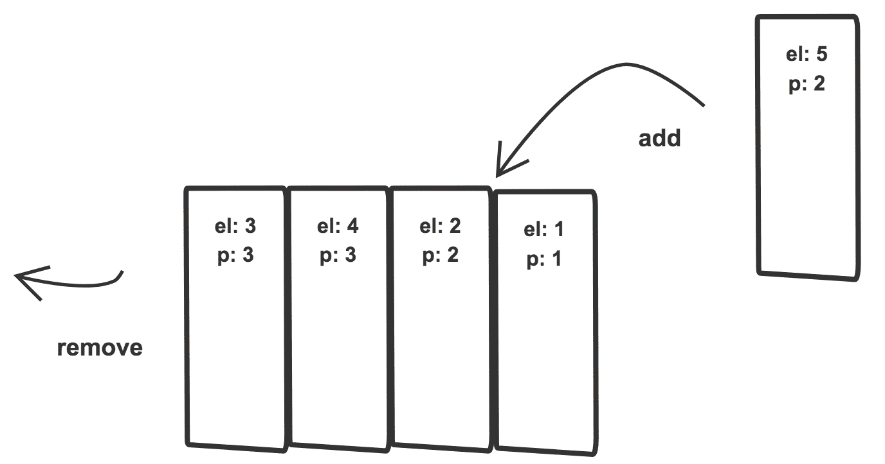
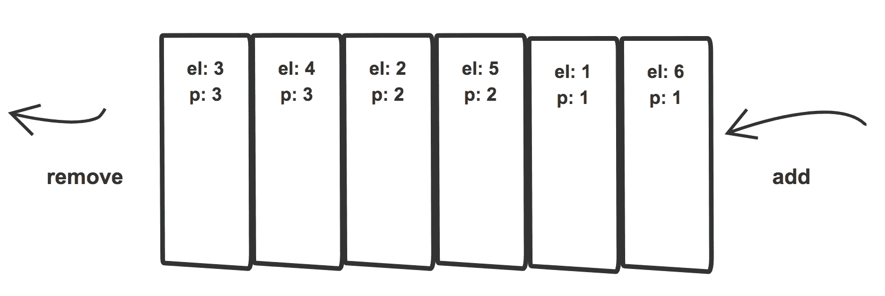
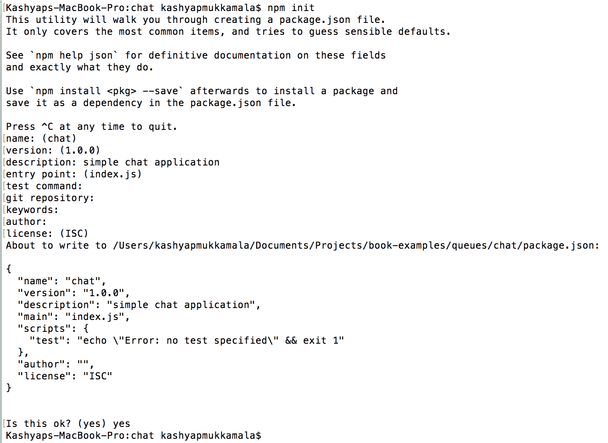
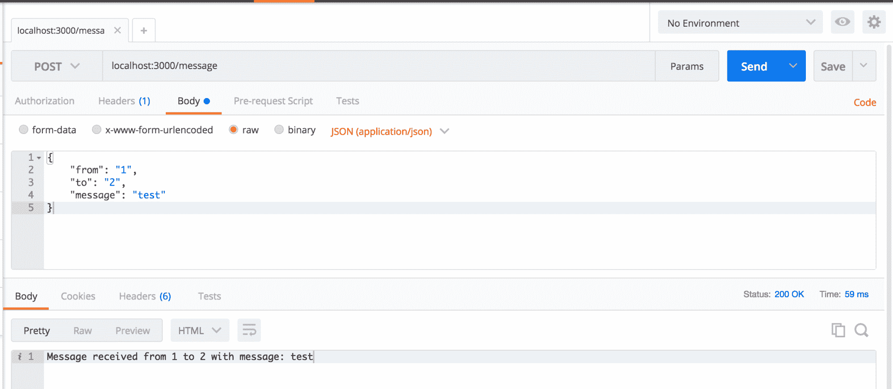
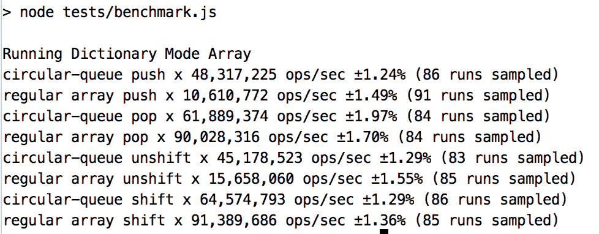

# 第二章：为顺序执行创建队列

队列是一个编程构造，与现实世界的队列（例如电影院、ATM 或银行的队列）有很大的相似之处。与堆栈相反，队列是**先进先出**（**FIFO**），因此无论什么先进去，也会先出来。当您希望保持数据以流入的相同顺序时，这是特别有帮助的。

队列的更多计算机/科学定义如下：

<q>一个抽象数据集合，其中元素可以被添加到后端称为 enqueue，并从前端称为 dequeue 中移除，这使其成为 FIFO 数据结构。</q>

当然，只有*enqueue*和*dequeue*操作可能足够覆盖大多数情况，以涵盖我们可能遇到的更广泛的问题；然而，我们可以扩展 API 并使我们的队列具有未来的可扩展性。

在本章中，我们将讨论以下主题：

+   队列的类型

+   不同类型的队列实现

+   显示队列的有用性的用例

+   与其他本地数据结构相比的队列性能

# 队列的类型

在我们开始理解队列之前，让我们快速看一下我们可能想在应用程序中使用的队列类型：

+   **简单队列**：在简单的 FIFO 队列中，顺序被保留，数据以进入的顺序离开

+   **优先队列**：队列中的元素被赋予预定义的优先级

+   **循环队列**：类似于简单队列，只是队列的后端跟随队列的前端

+   **双端队列**（**Dequeue**）：类似于简单队列，但可以从队列的前端或后端添加或移除元素

# 实现 API

实现 API 从来不像看起来那么容易，正如之前讨论的那样。在创建通用类时，我们无法预测我们的队列将在何种情况下使用。考虑到这一点，让我们为我们的队列创建一个非常通用的 API，并根据需要在将来扩展它。我们可以添加到队列的一些最常见的操作如下：

+   `add()`: 将项目推送到队列的后端

+   `remove()`: 从队列的开头移除一个项目

+   `peek()`: 显示添加到队列的最后一个项目

+   `front()`: 返回队列前端的项目

+   `clear()`: 清空队列

+   `size()`: 获取队列的当前大小

# 创建队列

在我们之前讨论过的四种类型的队列中，首先，我们将实现一个简单的队列，然后继续修改每种类型的后续队列。

# 一个简单的队列

与堆栈类似，我们将使用以下步骤创建一个队列：

1.  定义一个`constructor()`：

```js
class Queue {
    constructor() {

    }
}
```

1.  我们将使用`WeakMap()`来进行内存数据存储，就像我们为堆栈所做的那样：

```js
 const qKey = {};
 const items = new WeakMap();

 class Queue {
 constructor() {

        }
    }
```

1.  实现先前在 API 中描述的方法：

```js
var Queue = (() => {
 const qKey = {};
 const items = new WeakMap();

 class Queue {

 constructor() {
 items.set(qKey, []);
        }

 add(element) {
 let queue = items.get(qKey);
 queue.push(element);
        }

 remove() {
 let queue = items.get(qKey);
 return queue.shift();
        }

 peek() {
 let queue = items.get(qKey);
 return queue[queue.length - 1];
        }

 front() {
 let queue = items.get(qKey);
 return queue[0];
        }

 clear() {
 items.set(qKey, []);
        }

 size() {
 return items.get(qKey).length;
        }
    }

 return Queue;
})();
```

我们再次将整个类包装在 IIFE 中，因为我们不希望从外部访问`Queue`项：


# 测试队列

要测试这个队列，您可以简单地实例化它并向队列中添加/移除一些项目：

```js
var simpleQueue = new Queue();
simpleQueue.add(10);
simpleQueue.add(20);

console.log(simpleQueue.items); // prints undefined   console.log(simpleQueue.size()); // prints 2   console.log(simpleQueue.remove()); // prints 10   console.log(simpleQueue.size()); // prints 1   simpleQueue.clear();

console.log(simpleQueue.size()); // prints 0
```

正如您可以从前面的代码中注意到的那样，所有元素都被同等对待。无论它们包含的数据是什么，元素始终以 FIFO 的方式对待。尽管这是一个很好的方法，但有时我们可能需要更多：即优先处理进入和离开队列的元素，正如我们可以在接下来的部分中注意到的那样。

# 优先队列

优先队列在操作上类似于简单队列，即它们支持相同的 API，但它们所持有的数据还有一个小小的附加项。除了元素（您的数据）之外，它们还可以保持一个优先级，这只是一个表示队列中元素优先级的数值。

从队列中添加或移除这些元素是基于优先级的。您可以拥有最小优先级队列或最大优先级队列，以帮助确定您是基于增加优先级还是减少优先级来添加元素。我们将看一下`add()`方法如何替代我们之前定义的简单队列的`add()`方法：

```js
add(newEl) {
 let queue = items.get(pqkey);
 let newElPosition = queue.length;

 if(!queue.length) {
 queue.push(newEl);
 return;
    }

 for (let [i,v] of queue.entries()) {
 if(newEl.priority > v.priority) {
 newElPosition = i;
 break;
        }
    }

 queue.splice(newElPosition, 0, newEl);
}
```

由于我们在插入堆栈时考虑了元素的优先级，所以我们在从队列中移除元素时不必关注优先级，因此`remove()`方法对于简单队列和优先队列是相同的。其他实用方法，如`front()`、`clear()`、`peek()`和`size()`，与保存在队列中的数据类型无关，因此它们也保持不变。

创建优先队列时的一个聪明举措是优化您的代码，并决定您是否想要在添加或移除时确定优先级。这样，您就不会在每一步都过度计算或分析数据集。

# 测试优先队列

让我们首先设置用于测试队列的数据：

```js
var priorityQueue = new PriorityQueue();

priorityQueue.add({ el : 1, priority: 1});

// state of Queue
// [1]
//  ^

priorityQueue.add({ el : 2, priority: 2});

// state of Queue
// [2, 1]
//  ^

priorityQueue.add({ el : 3, priority: 3});

// state of Queue
// [3, 2, 1]
//  ^

priorityQueue.add({ el : 4, priority: 3});

// state of Queue
// [3, 4, 2, 1]
//     ^

priorityQueue.add({ el : 5, priority: 2});

// state of Queue
// [3, 4, 2, 5, 1]
//           ^
```

从视觉上看，前面的步骤将生成一个如下所示的队列：



从前面的图中，我们可以注意到当我们添加一个优先级为 2 的元素时，它会排在所有优先级为 1 的元素之前：

```js
priorityQueue.add({ el : 6, priority: 1});

// state of Queue
// [3, 4, 2, 5, 1, 6]
//                 ^  
```

当我们添加一个优先级为 1（最低）的元素时，它会被添加到队列的末尾：



我们在这里添加的最后一个元素恰好也是优先级最低的元素，这使它成为队列的最后一个元素，从而根据优先级保持所有元素的顺序。

现在，让我们从队列中移除元素：

```js
console.log(priorityQueue.remove());

// prints { el: 3, priority: 3}

// state of Queue
// [4, 2, 5, 1, 6]

console.log(priorityQueue.remove());

// prints { el: 4, priority: 3 }

// state of Queue
// [2, 5, 1, 6]

console.log(priorityQueue.remove());

// prints { el: 2, priority: 2 }

// state of Queue
// [5, 1, 6]

priorityQueue.print();

// prints { el: 5, priority: 2 } { el: 1, priority: 1 } { el: 6, priority: 1 }
```

这就是：使用`WeakMap()`在 JavaScript 中创建简单和优先队列。现在让我们来看一下这些队列的一些实际应用。

# 队列的用例

在开始使用案例之前，我们需要一个基本的起点，即一个 Node.js 应用程序。要创建一个，请确保您已安装了最新的 Node.js：

```js
node -v
```

这应该显示您当前安装的 Node.js 版本；如果没有，那么请从[`nodejs.org/en`](https://nodejs.org/en/)下载并安装最新版本的 Node.js。

# 创建一个 Node.js 应用程序

要开始一个示例 Node.js 项目，首先创建一个项目文件夹，然后从该文件夹运行以下命令：

```js
npm init
```

运行此命令时，Node 将提示您一系列问题，您可以选择填写或留空：



创建空应用程序后，您将看到一个名为`package.json`的文件。现在，您可以添加创建 Node.js 应用程序所需的依赖项：

```js
npm install body-parser express --save
```

`body-parser`模块有助于解析 POST 请求体，而`express`模块有助于创建 Node.js 服务器。

# 启动 Node.js 服务器

一旦我们创建了应用程序外壳，创建一个名为`index.js`的文件，这将是您的应用程序的主文件；您可以随意命名，但请确保您相应地更新`package.json`中的`main`属性。

现在，让我们在`index.js`文件中添加一些代码来启动一个 express 服务器：

```js
var express = require('express');
var app = express();

app.listen(3000, function () {
 console.log('Chat Application listening on port 3000!')
});
```

就是这样！服务器现在在`3000`端口上运行。要测试它，只需添加一个空路由来告诉您应用程序是否正常运行：

```js
app.get('/', function (req, res) {
    res.status(200).send('OK!')
});
```

您可以打开浏览器并导航到`localhost:3000`，这应该会显示服务器状态为`OK！`，或者如果服务器宕机，则会给出错误。

# 创建一个聊天端点

现在我们的服务器已经运行起来了，我们可以创建一个内存中的聊天端点，它将接受来自两个用户的消息，并使用队列将其转发给其预期的接收者，同时保留顺序。

在添加逻辑之前，我们需要进行一些基础工作，以模块化地设置应用程序。首先，让我们包含`body-parser`并在 express 中间件中使用它，以便我们可以轻松访问请求的`body`。因此，更新后的`index.js`文件如下所示：

```js
var express = require('express');
var app = express();
var bodyParser = require('body-parser');

app.use(bodyParser.json());
app.use(bodyParser.urlencoded({ extended: true }));

app.get('/', function (req, res) {
    res.status(200).send('OK!')
});

app.listen(3000, function () {
 console.log('Chat Application listening on port 3000!')
});
```

现在，要为消息添加端点，我们可以在`routes`文件夹下创建一个名为`messages.js`的新文件，然后在其中添加基本的`post`请求：

```js
var express = require('express');
var router = express.Router();

router.route('/')
   .post(function(req, res) {

         res.send(`Message received from: ${req.body.from} to ${req.body.to} with message ${req.body.message}`);

});

module.exports = router;
```

然后，我们可以将其注入到我们的`index.js`中，并使其成为我们应用程序的一部分：

```js
var message = require('./routes/messages');

...
...
...

app.use('/message', message);
```

现在，为了测试这个，我们可以启动服务器并使用 Postman 向`localhost:3000/message`发送一条消息；然后我们可以看到以下响应：

图：示例发布消息

现在，我们可以继续开始添加逻辑，以便在两个用户之间发送消息。我们将抽象、模拟和简化应用程序的聊天部分，并更专注于在这种复杂应用程序中使用队列应用。

工作流本身相对简单：用户 A 向用户 B 发送消息，我们的服务器尝试将其转发给用户 B。如果没有任何问题，一切顺利，消息将被传递给用户 B；但如果失败，我们将调用我们的`FailureProtocol()`，它会重试发送上一次失败的对话消息。为简单起见，我们现在假设只有一个通道，即用户 A 和用户 B 之间的通道*。

生产环境中的对应部分将能够同时处理多个通道，当通道上的消息发送失败时，会为特定通道创建一个新的`FailureProtocol()`处理程序，并具有将作业推迟到多个线程的灵活性。

现在，让我们在一个名为`messaging-utils.js`的文件中模拟`sendMessage()`和`getUniqueFailureQueue()`方法，这将是我们的包装器，以便我们可以将它们移动到自己的模块中，因为它们在这种情况下对于理解队列并不重要：

```js
var PriorityQueue = require('./priority-queue');

var Utils = (()=> {
 class Utils {

 constructor() {

        }

 getUniqueFailureQueue(from, to) {
 // use from and to here to determine 
            // if a failure queue already 
            // exists or create a new one return new PriorityQueue();
        }

 sendMessage(message) {
 return new Promise(function(resolve, reject) {
 // randomize successes and failure of message being
                   sent  if(Math.random() < 0.1) {

                    resolve(message)

                } else {

                    reject(message);

                }

            });
        }

    }

 return Utils;
})();

module.exports = Utils;
```

现在，当我们收到新消息时，我们会尝试将其发送给预期的最终用户：

```js
var express = require('express');
var router = express.Router();
var Utils = require('../utils/messaging-utils');
const msgUtils = new Utils();

router.route('/')
    .post(function(req, res) {
 const message = req.body.message;
 let failedMessageQueue;

 // try to send the message msgUtils.sendMessage(req.body)
            .then(function() {

                res.send(`Message received from: ${req.body.from} to ${req.body.to} with message ${req.body.message}`);

            }, function() {

 failedMessageQueue = 
 msgUtils.getUniqueFailureQueue(req.body.from,
                   req.body.to);

 failedMessageQueue.add(message);

 // trigger failure protocol triggerFailureProtocol();

         });
```

如果消息发送成功，我们需要立即确认并发送成功消息；否则，我们将在两个用户之间得到一个唯一的`failedMessageQueue`，然后将消息添加到其中，随后触发失败协议。

失败协议对不同的应用程序可能意味着不同的事情。虽然一些应用程序选择只显示失败消息，像我们这样的应用程序会重试发送消息，直到成功发送为止：

```js
function triggerFailureProtocol() {

 var msg = failedMessageQueue.front();

 msgUtils.sendMessage(msg)
        .then(function() {

 failedMessageQueue.remove();

             res.send('OK!');

         }, function(msg) {

 //retry failure protocol triggerFailureProtocol();

         });
}
```

我们可以使用我们的`Queue`中可用的方法来选择顶部消息，然后尝试发送它。如果成功，然后删除它；否则，重试。正如你所看到的，使用队列极大地简化和抽象了实际失败消息排队的逻辑，更好的是，你可以随时升级和增强队列，而不必考虑其他组件会受到这种变化的影响。

现在我们已经准备好解析传入请求、发送给预期接收者并触发我们自定义的失败协议的 API 调用。当我们将所有这些逻辑结合在一起时，我们有以下内容：

```js
var express = require('express');
var router = express.Router();
var Utils = require('../utils/messaging-utils');
const msgUtils = new Utils();

router.route('/')
    .post(function(req, res) {
 const message = req.body.message;
 let failedMessageQueue;

 // try to send the message msgUtils.sendMessage(req.body)
            .then(function() {

 console.log("Sent Successfully : " + message);

 res.send(`Message received from: ${req.body.from} to ${req.body.to} with message ${req.body.message}`);

            }, function(msg) {

 console.log('Failed to send: ' + message);

 failedMessageQueue = 
 msgUtils.getUniqueFailureQueue(req.body.from,
                     req.body.to);

 failedMessageQueue.add(message);

 // trigger failure protocol triggerFailureProtocol();
            });

 function triggerFailureProtocol() {

 var msg = failedMessageQueue.front();

 msgUtils.sendMessage(msg)
                .then(function() {

 failedMessageQueue.remove();

 res.send('OK!');

                 }, function(msg) {

 //retry failure protocol triggerFailureProtocol();

                 });
        }
});

module.exports = router;
```

# 使用优先队列实现日志记录

端点失败是不可避免的。虽然我们可以尝试重新发送失败的消息，但我们需要意识到在某个时候我们的端出现了问题，并停止向服务器发送请求以转发消息。这就是优先队列可以派上用场的地方。

我们将替换现有逻辑，使用优先队列来检测何时停止尝试重新发送消息，并通知支持团队。

最大的变化在`triggerFailureProtocol()`方法中，我们检查消息是否失败的次数超过了预设的`retryThreshold`；如果是，那么我们将消息添加到具有关键优先级的队列中，稍后我们将使用它来防止服务器的后续轰炸，直到支持团队解决问题。这个解决方案虽然相当天真，但在保留服务器资源方面非常有效。

因此，带有优先队列的更新代码如下：

```js
function triggerFailureProtocol() {

 console.log('trigger failure protocol');

 // get front message from queue var frontMsgNode = failedMessageQueue.front();

 // low priority and hasnt hit retry threshold if (frontMsgNode.priority === 0 
        && failureTriggerCount <= failureTriggerCountThreshold) {

 // try to send message msgUtils.sendMessage(frontMsgNode.message)
            .then(function() {

 console.log('resend success');
 // success, so remove from queue failedMessageQueue.remove();

 // inform user                res.send('OK!');

             }, function() {

 console.log('resend failure');

 // increment counter failureTriggerCount++;

 //retry failure protocol triggerFailureProtocol();

             });

    } else {

 console.log('resend failed too many times');

 // replace top message with higher priority message let prevMsgNode = failedMessageQueue.remove();

 prevMsgNode.priority = 1;

 // gets added to front failedMessageQueue.add(prevMsgNode);

        res.status(500).send('Critical Server Error! Failed to send
        message');

    }
}
```

在上面的代码中，我们将相同的登录包装在`if-else`块中，以便能够重试发送消息或创建关键错误并停止我们的重试努力。

因此，下次该频道收到新消息时，您可以验证是否已经存在关键错误，并直接拒绝请求，而不必经历尝试发送消息并失败的麻烦，这会不断膨胀失败队列。

这当然是解决这个问题的一种方法，但更合适的方法是在用户尝试访问频道时通知用户任何关键错误，而不是在用户向其发布消息时这样做，这超出了本示例的范围。

以下是包括优先队列的完整代码：

```js
var express = require('express');
var router = express.Router();
var Utils = require('../utils/messaging-utils');
const msgUtils = new Utils();

router.route('/')
    .post(function(req, res) {
 const message = req.body.message;
 let failedMessageQueue;
 let failureTriggerCount = 0;
 let failureTriggerCountThreshold = 3;
 let newMsgNode = {
 message: message,
 priority: 0
        };

 // try to send the message msgUtils.sendMessage(req.body)
            .then(function() {

 console.log('send success');

 // success                res.send(`Message received from: ${req.body.from} to ${req.body.to} with message ${req.body.message}`);

         }, function() {

 console.log('send failed');

 // get unique queue failedMessageQueue = 
 msgUtils.getUniqueFailureQueue(req.body.from,
                    req.body.to);

 // get front message in queue var frontMsgNode = failedMessageQueue.front();
 // already has a critical failure if (frontMsgNode && frontMsgNode.priority === 1) {

 // notify support   // notify user                   res.status(500)
                      .send('Critical Server Error! Failed to send
                      message');

               } else {

 // add more failedMessageQueue.add(newMsgNode);

 // increment count failureTriggerCount++;

 // trigger failure protocol triggerFailureProtocol();

               }
        });

 function triggerFailureProtocol() {

 console.log('trigger failure protocol');

 // get front message from queue var frontMsgNode = failedMessageQueue.front();

 // low priority and hasnt hit retry threshold if (frontMsgNode.priority === 0 
               && failureTriggerCount <= failureTriggerCountThreshold) {

 // try to send message msgUtils.sendMessage(frontMsgNode.message)
                   .then(function() {

 console.log('resend success');
 // success, so remove from queue failedMessageQueue.remove();

 // inform user                       res.send('OK!');

                    }, function() {

 console.log('resend failure');

 // increment counter failureTriggerCount++;

 //retry failure protocol triggerFailureProtocol();

                     });

            } else {

 console.log('resend failed too many times');

 // replace top message with higher priority message let prevMsgNode = failedMessageQueue.remove();

 prevMsgNode.priority = 1;

 // gets added to front failedMessageQueue.add(prevMsgNode);

                res.status(500)
                   .send('Critical Server Error! Failed to send 
                   message');

           }
        }
});

module.exports = router;
```

# 性能比较

之前，我们看到了如何简单地将简单队列替换为优先队列，而不必担心它可能引起的功能性变化；同样，我们可以将优先队列替换为性能更高的变体：循环双端队列。

在我们开始进行比较之前，我们需要讨论循环队列以及为什么我们需要它们。

循环队列和简单队列之间的区别在于队列的尾部紧随队列的前部。也就是说，它们在功能上没有区别。它们仍然执行相同的操作，并产生相同的结果；您可能想知道它们究竟在哪里不同，如果最终结果是相同的，那有什么意义。

在 JavaScript 数组中，内存位置是连续的。因此，当创建队列并执行`remove()`等操作时，我们需要担心将剩余元素移动到更新的*front*而不是*null*，从而增加操作的数量；这也是一个内存开销，除非您的队列有无限/动态数量的插槽。

现在，想象一个循环队列——由于它的循环性质，这个队列有固定数量的内存位置，当元素被移除或添加时，您可以重用内存位置并减少执行的操作数量，这使得它比常规队列更快。

在我们对比这个队列与 JavaScript 中的原生数组的性能之前，让我们来看看 Chrome 的 JavaScript 引擎 V8 的内部工作，并检查它是否真的在我们的情况下很重要。我们考虑这个的原因是因为 JavaScript 中经常被忽视的稀疏数组和密集数组的概念，尽管这是一个底层实现，可能会不断变化。大多数情况下，JavaScript 数组是密集的，如果处理不当很容易变得稀疏。测试这一点的一个简单方法是创建一个数组，如下所示：

+   考虑示例 1：

```js
const a = [undefined, undefined, 10];
```

当你记录它时，你会看到相同的结果：

```js
[undefined, undefined, 10];
```

现在，创建一个这样的数组：

+   考虑示例 2：

```js
const b = [];
b[3] = 10; // hole as we missed out index 0,1,2
```

当你记录它时，你会得到相同的结果：

```js
[undefined x 3, 10];
```

这很有趣，因为它展示了 JavaScript 数组的密集（示例 1）和稀疏（示例 2）行为之间的差异。当您创建这些密集数组时，数组的元素被认为是特定值，并且这些值在初始化时是已知的，这使得 JavaScript 有可能将这些值保存在连续的内存中。

JavaScript 数组实现的 V8 代码有以下注释，这使得我们可以观察到另一个有趣的现象，与我们之前讨论的内容一致。

```js
// The JSArray describes JavaScript Arrays // Such an array can be in one of two modes: //           - fast, backing storage is a FixedArray and length <= elements.length(); //           Please note: push and pop can be used to grow and shrink the array. //         - slow, backing storage is a HashTable with numbers as keys. class JSArray: public JSObject {
```

因此，数组在内部根据正在保存在数组中的数据的类型和大小而有所不同。作为一个经验法则，总是使用数组文字创建一个空数组，并从 0 索引开始逐步为元素分配值，同时不在数组中留下空隙或空洞。这样可以使数组保持快速，并且除非数据的规模要求，否则不会进入字典模式。

双端循环队列，也称为循环双端队列，与简单队列类似，只是`add()`和`remove()`可以从队列的前面或后面进行。

这基本上是与您的数组相同的 API，我们可以构建一个提供此功能的类的示例，但让我们更进一步，看看如何使用循环队列实现我们之前讨论的一切，并使其尽可能高效：


首先，我们假设这个队列有一个有限的大小；它可以随后扩展为动态的性质，但现在不是一个问题。到目前为止，`WeakMap()`已被用作内存中的数据存储，我们在其中保存了队列所需的数据，但是在性能方面，它只是为我们的数据结构添加了另一层检索，因此在这种情况下，我们将转移到标准数组，因为这是我们将在基准测试中进行比较的。将这些转化为一些代码，我们可以得到我们的`CircularDequeue`，如下所示：

```js
var CircularDequeue = (()=> {
 class CircularDequeue {
 constructor() {
 // pseudo realistic 2^x value this._size = 1024;
 this._length = 0;
 this._front = 0;
 this._data = [];
        }

 push (item) {
 // get the length of the array var length = this._length;

 // calculate the end var i = (this._front + length) & (this._size - 1);

 // assign value to the current end of the data this._data[i] = item;

 // increment length for quick look up this._length = length + 1;

 // return new length return this._length;
        }

 pop () {
 // get the length of the array var length = this._length;

 // calculate the end var i = (this._front + length - 1) & (this._size - 1);

 // copy the value to return var ret = this._data[i];

 // remove the value from data this._data[i] = undefined;

 // reduce length for look up  this._length = length - 1;

 // return value  return ret;
       }

 shift () {
 // get the current front of queue var front = this._front;

 // capture return value var ret = this._data[front];

 // reset value in the data this._data[front] = undefined;

 // calculate the new front of the queue this._front = (front + 1) & (this._size - 1);

 // reduce the size this._length = this._length - 1;

 // return the value return ret;

        }

 unshift (item) {
 // get the size var size = this._size;

 // calculate the new front var i = (((( this._front - 1 ) & ( size - 1) ) ^ size ) -
            size );

 // add the item this._data[i] = item;

 // increment the length this._length = this._length + 1;

 // update the new front this._front = i;

 // return the acknowledgement of the addition of the new
            item return this._length;
        }
    }

 return CircularDequeue;
})();

module.exports = CircularDequeue;
```

当然，这只是实现循环双端队列的一种方式；您可以通过将属性添加到类的构造函数本身而不是将它们包装在 IIFE 中（即避免作用域链查找），并且如果您使用 TypeScript，还可以进一步简化代码，这允许私有类成员，就像我们在讨论堆栈时所讨论的那样。

# 运行基准测试

在运行基准测试之前，重要的是要理解我们比较队列与本机数组的意图。我们并不试图证明队列比数组更快，这就是为什么我们应该使用它们。同时，我们也不想使用一些非常慢的东西。这些测试的目标是帮助我们了解队列在本机数据结构方面的位置，以及我们是否可以依赖它们提供高性能的自定义数据结构（如果需要）。

现在，让我们运行一些基准测试来比较循环双端队列和数组。我们将使用`benchmark.js`来设置和运行我们的基准测试。

要开始测试，让我们首先在项目中包含基准测试节点模块。要安装它，请在项目根目录的终端上运行以下命令：

```js
npm install benchmark --save-dev
```

安装完成后，我们准备创建我们的测试套件。创建一个`tests`文件夹，并在其中添加一个名为`benchmark.js`的文件。为了创建一个测试套件，我们首先设置数据。如前所述，我们将比较我们的`CircularDequeue`和一个数组：

```js
var Benchmark = require("benchmark");
var suite = new Benchmark.Suite();
var CircularDequeue = require("../utils/circular-dequeue.js");

var cdQueue = new CircularDequeue();
var array = [];

for(var i=0; i < 10; i++) {
 cdQueue.push(i);
 array.push(i);
}
```

在这里，我们首先使用循环双端队列和数组中的小数据集。这将使数组变得密集，从而使 V8 引擎以快速模式运行并应用内部优化。

现在，我们可以继续并向我们的测试套件添加测试：

```js
suite
   .add("circular-queue push", function(){
 cdQueue.push(cdQueue.shift());
   })
   .add("regular array push", function(){
 array.push(array.shift());
   })
   .add("circular-queue pop", function(){
 cdQueue.pop();
   })
   .add("regular array pop", function(){
 array.pop();
   })
   .add("circular-queue unshift", function(){
 cdQueue.unshift(cdQueue.shift());
   })
   .add("regular array unshift", function(){
 array.unshift( array.shift());
   })
   .add("circular-queue shift", function(){
 cdQueue.shift();
   })
   .add("regular array shift", function(){
 array.shift();
   })
   .on("cycle", function(e) {
 console.log("" + e.target);
   })
   .run();
```

在先前的测试中需要注意的一点是，我们总是将两个操作耦合在一起，如下所示：

```js
.add("regular array push", function(){
 array.push(array.shift());
});
```

如果我们在执行`push()`方法之前不执行`shift()`方法并推送一个数字，例如`1`或`2`，那么我们将很快遇到`内存不足`错误，因为测试的迭代次数对于数组来说太大了；另一方面，循环队列将没有问题，因为它们的循环性质：它们只会覆盖先前的值。

现在，将测试添加到您的`package.json`脚本中以便更轻松地访问：

```js
"scripts": {
 "start": "node index.js",
 "test": "node tests/benchmark.js" },
```

要运行基准测试套件，请运行以下命令：

```js
npm run test
```

结果将如下：


正如您可以从前面的截图中看到的，循环队列的 push 和 unshift 比本机的 push 和 unshift 操作快得多，而 pop 和 shift 操作几乎慢了 30%。

现在，让我们使数组稀疏，以便强制 V8 以字典模式运行数组方法（这对某些情况可能是真实用例，有时在处理混合数据类型的数组时也可能是可能的）：

```js
var i = 1000;

while(i--){
 cdQueue.push(i);
 array.push(i);
}
```

当我们使用稀疏数组运行类似的测试时，结果如下：



您可以看到，性能与`push()`操作的快速模式大不相同，而其他操作基本保持不变。这是了解采用特定编码实践后果的好方法。您需要了解应用程序的要求，并相应地选择合适的工具来完成工作。

例如，当内存是优先考虑因素时，我们将使用简单队列，它可以与`WeakMap()`一起使用，而不是常规数组。我们可以创建两个新的测试，可以分开运行以跟踪它们各自的内存使用情况：

```js
suite
  .add("regular array push", function(){
 array.push(array.shift());
   })
   .on("cycle", function(e) {
 console.log("" + e.target);
 console.log(process.memoryUsage());
   })
   .run();
```

它产生了以下结果：


我们可以从前面的截图中看到，它记录了我们测试运行的结果，即 ops/sec，并记录了该周期的总内存使用情况。

类似地，我们可以对简单队列进行`remove`操作的基准测试，这与我们对 shift 操作所做的非常相似：

```js
suite
  .add("simple queue push", function(){
 simpleQueue.add(simpleQueue.remove());
   })
   .on("cycle", function(e) {
 console.log("" + e.target);
 console.log(process.memoryUsage());
   })
   .run();
```

这产生了以下结果：


您可以看到，简单队列显然比数组慢了 4 倍，但这里重要的是要注意两种情况下的`heapUsed`。这是另一个让您决定何时以及如何选择特定类型数据结构的因素。

# 总结

至此，我们结束了关于队列的章节。我们学习了简单队列、优先级队列、循环队列以及双端队列的变体。我们还学习了何时根据使用情况应用它们，并且通过示例看到了如何利用基准测试任何算法或数据结构的能力。在下一章中，我们将对集合、映射和哈希进行深入研究，以了解它们的内部工作原理，并看看它们在哪些情况下可以发挥作用。
