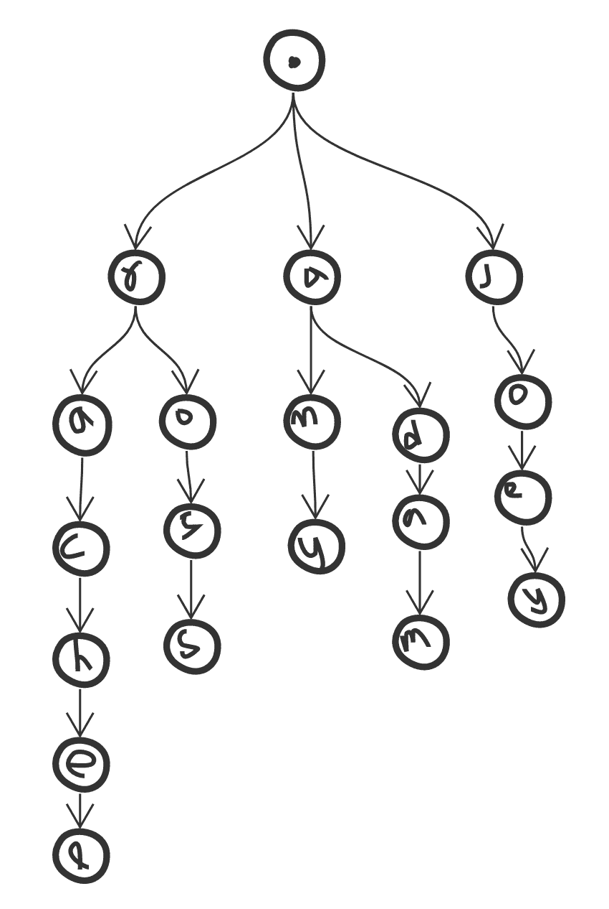
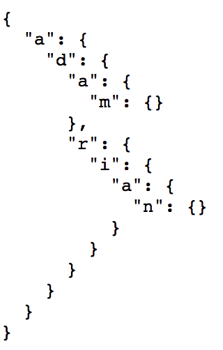
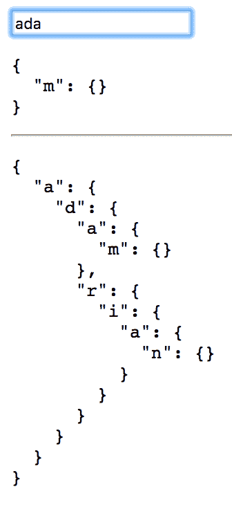
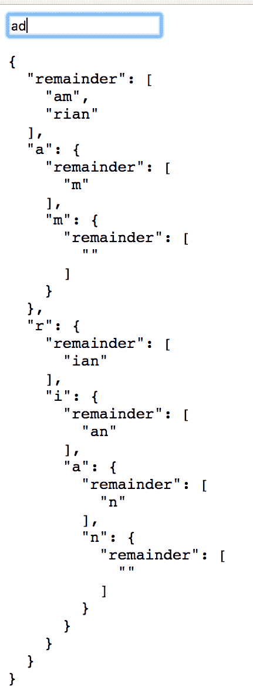
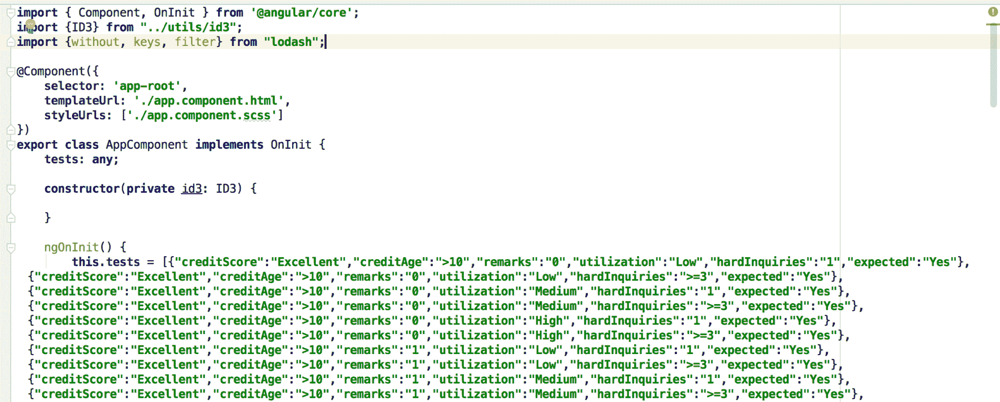
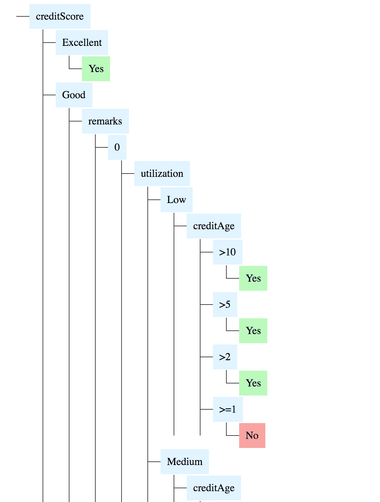
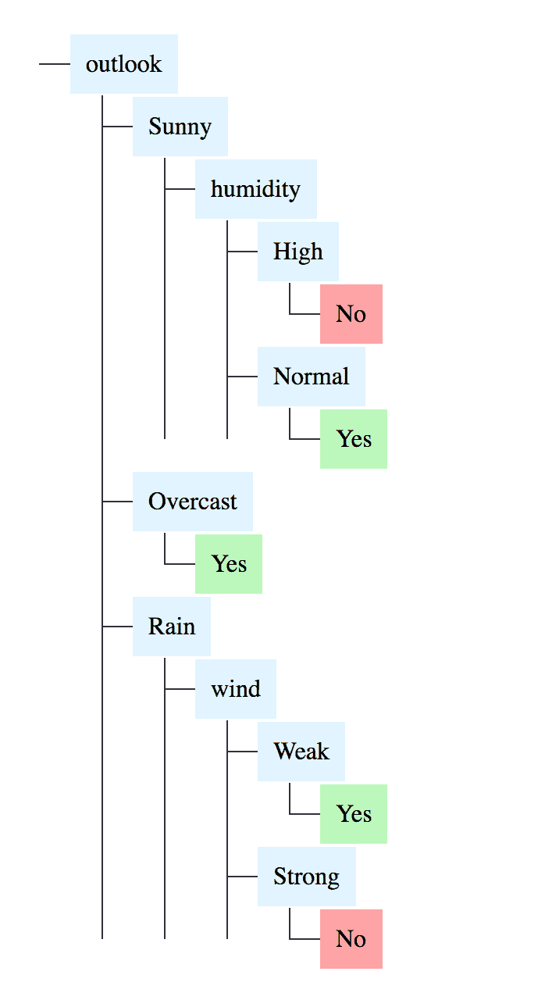
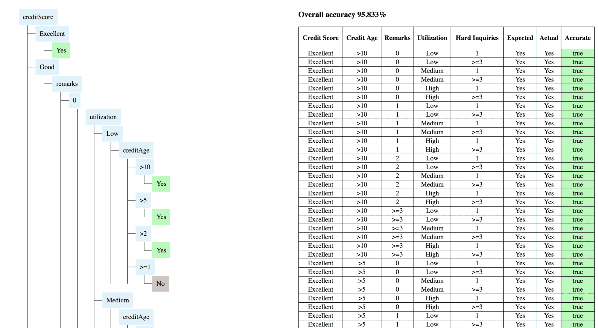
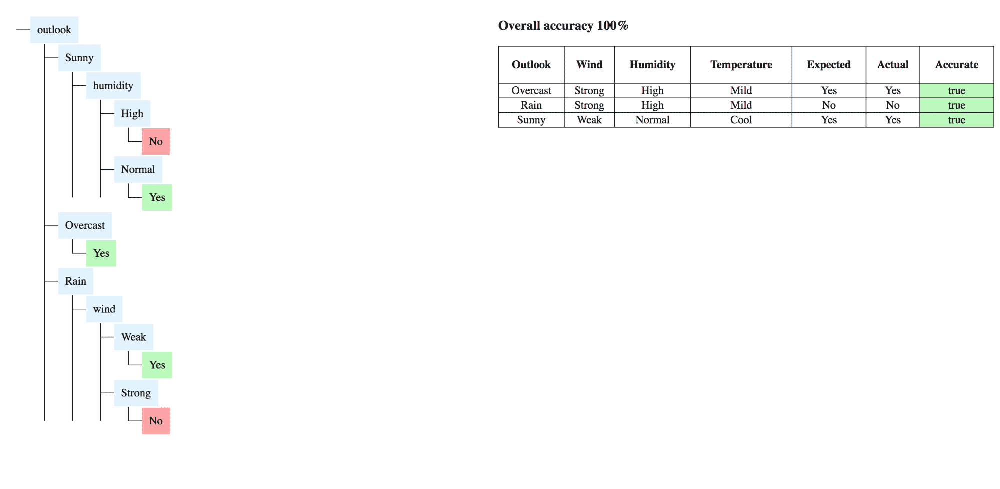

# 第四章：使用树进行更快的查找和修改

树是最先进和复杂的数据结构之一。它为图论打开了大门，用于表示对象之间的关系。对象可以是任何类型，只要它们有一个确定的关系，就可以以树的形式表示。

尽管有成千上万种树，但在本章中不可能涵盖所有树，因此我们将采取不同的方法，在示例中以更实际的方式学习树，而不是像在之前的章节中那样提前学习。

在本章中，我们将探讨以下主题：

+   创建一个基本的 Angular 应用程序，

+   使用**trie 树**创建一个自动完成查找组件

+   使用 ID3 算法创建信用卡批准预测器。

所以，让我们深入研究一下。

# 创建一个 Angular 应用程序

在我们实现任何树之前，让我们建立一个基本应用程序，我们可以在随后的示例中使用。

就像我们在之前的章节中所做的那样，我们将使用 Angular CLI 创建一个 Angular 应用程序，具体步骤如下：

1.  使用以下命令安装 Angular CLI（如果尚未完成）：

```js
npm install -g @angular/cli
```

1.  通过运行以下命令在您选择的文件夹中创建新项目：

```js
ng new <project-name>
```

完成这两个步骤后，您应该能够看到新创建的项目以及所有相应的节点模块已安装并准备就绪。

1.  要运行您的应用程序，请从终端运行以下命令：

```js
ng serve
```

# 创建一个自动完成查找

想象一下，你有一个用户注册表格，你的用户必须填写他们的信息，包括他们的国家。幸运的是，只有固定数量的国家，所以围绕填充和选择的用户体验可以变得非常有趣和简单，而不是让他们浏览数百个选项。

在这个例子中，我们将创建一个 trie 树，并预先填充它与所有国家的列表。然后用户可以输入他们国家的名称，我们的组件将作为自动完成，并向用户显示可用的选项。

现在让我们讨论为什么我们需要 trie 树。根据维基百科的定义，简单 trie 树的定义如下：

在计算机科学中，trie，也称为数字树，有时称为基数树或前缀树（因为它们可以通过前缀搜索），是一种搜索树——一种用于存储动态集合或关联数组的有序树数据结构，其中键通常是字符串

换句话说，trie 树是一种优化的搜索树，其中键是字符串。让我们用一个简单的例子来说明这一点：

假设我们有一个字符串数组：

```js
var friends = [ 'ross', 'rachel', 'adam', 'amy', 'joey'];
```

这个，当转换成`trie`树时，会看起来像这样：



从上图中，我们可以注意到树从根开始，然后根据输入字符串构建树。在将字符串插入到`trie`树中时，单词被分解为单个字符，然后重复的节点不会被重新插入，而是被重用来构建树的其余部分。

# 创建一个 trie 树

现在让我们创建`trie`树，在我们的应用程序中使用。在我们的应用程序中，让我们首先在`src`文件夹下创建一个名为`utils`的目录，在其中添加我们的`trie.ts`文件。

我们树的 API 将非常简洁，只有两种方法：

+   `add()`：向`trie`树添加元素

+   `search()`：接受一个输入字符串并返回与查询字符串匹配的子树：

```js
import {Injectable} from "@angular/core";

@Injectable()
export class Trie {
    tree: any = {};

    constructor() {}

}
```

创建完毕后，让我们将其注入到我们主模块中的提供者列表中，列在`app.module.ts`中，以便我们的组件可以访问树，如下所示：

```js
import { BrowserModule } from '@angular/platform-browser';
import { NgModule } from '@angular/core';
import { FormsModule } from '@angular/forms';

import { AppComponent } from './app.component';
import {Trie} from "./utils/trie";

@NgModule({
  declarations: [
    AppComponent
  ],
  imports: [
    BrowserModule,
    FormsModule
  ],
  providers: [
      Trie
  ],
  bootstrap: [AppComponent]
})
export class AppModule { }
```

# 实现`add()`方法

现在，我们的树已经准备好实现其第一个方法了。我们的树一开始是空的（即一个空对象）。您可以使用任何数据结构来实现，但为了简单起见，我们将使用对象作为我们的数据存储：

```js
add(input) {
    // set to root of tree
  var currentNode = this.tree;

    // init next value
  var nextNode = null;

    // take 1st char and trim input
    // adam for ex becomes a and dam
  var curChar = input.slice(0,1);
    input = input.slice(1);

    // find first new character, until then keep trimming input
  while(currentNode[curChar] && curChar){
        currentNode = currentNode[curChar];

        // trim input
  curChar = input.slice(0,1);
        input = input.slice(1);
    }

    // while next character is available keep adding new branches and 
    // prune till end
  while(curChar) {
        // new reference in each loop   nextNode = {};

        // assign to current tree node
  currentNode[curChar] = nextNode;

        // hold reference for next loop
  currentNode = nextNode;

        // prepare for next iteration
  curChar = input.slice(0,1);
        input = input.slice(1);
    }
}
```

正如您在前面的代码中所看到的，这种方法由以下两个步骤组成：

1.  确定树已经建到哪一级并忽略这些字符。

1.  将余数作为新的子树添加并继续直到结束。

# 朋友的例子

让我们在一个示例中运用我们的知识，其中我们的用户想要向这棵树添加两个元素**Adam**和**Adrian**。首先，我们将**Adam**添加到树中，所以我们有节点**a**，**d**，**a**和**m**。然后，当添加**Adrian**时，我们检查已经添加的内容——在这种情况下是**a**和**d**，因此单词的其余部分**rian**被添加为新的子树。

当记录时，我们看到以下内容：



正如您从前面的截图中所看到的，**a**和**d**对于两个单词都是相同的，然后其余部分是我们添加的每个字符串的两个子树。

# 实现`search()`方法

`search()`方法更简单，效率更高，复杂度为 O(n)，其中 n 是搜索输入的长度。大 O 符号将在后面的章节中详细介绍：

```js
search(input) {
    // get the whole tree
    var currentNode = this.tree;
    var curChar = input.slice(0,1);

    // take first character
    input = input.slice(1);

   // keep extracting the sub-tree based on the current character
    while(currentNode[curChar] && curChar){
        currentNode = currentNode[curChar];
        curChar = input.slice(0,1);
        input = input.slice(1);
    }

    // reached the end and no sub-tree found
    // e.g. no data found
    if (curChar && !currentNode[curChar]) {
        return {};
    }

    // return the node found
    return currentNode;
}
```

让我们以前面代码中描述的朋友示例为例。例如，如果用户输入 a，我们使用刚刚实现的`search()`方法提取子树。我们得到了 a*下面的子树。

用户提供的输入字符越多，响应对象就越精细：

  

从前面的截图中可以看出，随着用户输入更多内容，我们的`search()`方法会持续返回与之匹配的节点的子树，而整个树可以在其下面看到。为了在屏幕上呈现它，我们使用以下代码。

在我们的`app.component.ts`文件中，我们添加以下内容，查询`Trie`类上的`search()`方法：

```js
import { Component } from '@angular/core';
import {Trie} from "../utils/trie";

@Component({
    selector: 'app-root',
    templateUrl: './app.component.html',
    styleUrls: ['./app.component.css']
})
export class AppComponent {
    countries = ["Afghanistan","Albania","Algeria",...,"Yemen","Zambia","Zimbabwe"];
    searchResp = [];

    constructor(private trie : Trie) {
        this.countries.forEach((c) => {
            this.trie.add(c); 
        });
    }

    search(key) {
        this.searchResp = this.trie.search(key).remainder;
    }
}
```

然后，使用简单的`pre`标记将此搜索结果绑定到模板：

```js
<pre>{{searchResp}}</pre>
```

# 节点保留余数

我们之前实现的`search()`方法效果很好；然而，作为开发人员，您现在需要循环遍历返回的子树，并构建出其中的单词余数，以便在 UI 上显示。这有点麻烦，不是吗？如果我们可以简化它，使树能够返回子树以及它们形成的单词余数，那会怎么样？实际上，实现这一点相当容易。

我们需要对算法进行小的修改，并在每个节点处添加余数集合；这样，每当识别到一个节点时，我们可以将余数添加到该集合中，并在创建新节点时将新元素推入该集合。让我们看看这如何修改我们的代码：

```js
add(input) {
    // set to root of tree
  var currentNode = this.tree;

    // init value
  var nextNode = null;

    // take 1st char and trim input
  var curChar = input.slice(0,1);
    input = input.slice(1);

    // find first new character, until then keep triming input
  while(currentNode[curChar] && curChar){
        currentNode = currentNode[curChar];

        // update remainder array, this will exist as we added the node
        earlier
  currentNode.remainder.push(input);

        // trim input
  curChar = input.slice(0,1);
        input = input.slice(1);
    }

    // while next character is available keep adding new branches and
    prune till end
  while(curChar) {
        // new reference in each loop
 // create remainder array starting with current input // so when adding the node `a` we add to the remainder `dam`
        and so on  nextNode = {
            remainder: [input]
        };

        // assign to current tree node
  currentNode[curChar] = nextNode;

        // hold reference for next loop
  currentNode = nextNode;

        // prepare for next iteration
  curChar = input.slice(0,1);
        input = input.slice(1);
    }
}
```

正如您在前面的代码中所看到的，添加两行使我们的工作比以前更容易了。不再需要在子树对象上进行不必要的循环，我们在子树的每个节点上都返回了单词的余数：



这也意味着我们必须更新我们的`search()`方法的失败条件，以返回一个带有`remainder`设置的空对象，而不是一个空对象，与以前不同：

```js
search(input) {
    var currentNode = this.tree;
    var curChar = input.slice(0,1);

    input = input.slice(1);

    while(currentNode[curChar] && curChar){
        currentNode = currentNode[curChar];
        curChar = input.slice(0,1);
        input = input.slice(1);
    }

    if (curChar && !currentNode[curChar]) {
        return {
            remainder: [] 
        };
    }

    return currentNode;
}
```

# 最终形式

将所有这些放在一起，并对我们的 UI 进行简单的更改，我们最终可以以非常快速和高效的方式搜索列表并显示结果。

经过前面的更改，我们的`app.component.ts`已经准备好最终形式：

```js
import { Component } from '@angular/core';
import {Trie} from "../utils/trie";

@Component({
    selector: 'app-root',
    templateUrl: './app.component.html',
    styleUrls: ['./app.component.css']
})
export class AppComponent {
    countries = ["Afghanistan","Albania","Algeria","Andorra","Angola","Anguilla","Antigua & Barbuda","Argentina","Armenia","Aruba","Australia","Austria","Azerbaijan","Bahamas","Bahrain","Bangladesh","Barbados","Belarus","Belgium","Belize","Benin","Bermuda","Bhutan","Bolivia","Bosnia & Herzegovina","Botswana","Brazil","British Virgin Islands","Brunei","Bulgaria","Burkina Faso","Burundi","Cambodia","Cameroon","Cape Verde","Cayman Islands","Chad","Chile","China","Colombia","Congo","Cook Islands","Costa Rica","Cote D Ivoire","Croatia","Cruise Ship","Cuba","Cyprus","Czech Republic","Denmark","Djibouti","Dominica","Dominican Republic","Ecuador","Egypt","El Salvador","Equatorial Guinea","Estonia","Ethiopia","Falkland Islands","Faroe Islands","Fiji","Finland","France","French Polynesia","French West Indies","Gabon","Gambia","Georgia","Germany","Ghana","Gibraltar","Greece","Greenland","Grenada","Guam","Guatemala","Guernsey","Guinea","Guinea Bissau","Guyana","Haiti","Honduras","Hong Kong","Hungary","Iceland","India","Indonesia","Iran","Iraq","Ireland","Isle of Man","Israel","Italy","Jamaica","Japan","Jersey","Jordan","Kazakhstan","Kenya","Kuwait","Kyrgyz Republic","Laos","Latvia","Lebanon","Lesotho","Liberia","Libya","Liechtenstein","Lithuania","Luxembourg","Macau","Macedonia","Madagascar","Malawi","Malaysia","Maldives","Mali","Malta","Mauritania","Mauritius","Mexico","Moldova","Monaco","Mongolia","Montenegro","Montserrat","Morocco","Mozambique","Namibia","Nepal","Netherlands","Netherlands Antilles","New Caledonia","New Zealand","Nicaragua","Niger","Nigeria","Norway","Oman","Pakistan","Palestine","Panama","Papua New Guinea","Paraguay","Peru","Philippines","Poland","Portugal","Puerto Rico","Qatar","Reunion","Romania","Russia","Rwanda","Saint Pierre & Miquelon","Samoa","San Marino","Satellite","Saudi Arabia","Senegal","Serbia","Seychelles","Sierra Leone","Singapore","Slovakia","Slovenia","South Africa","South Korea","Spain","Sri Lanka","St Kitts & Nevis","St Lucia","St Vincent","St. Lucia","Sudan","Suriname","Swaziland","Sweden","Switzerland","Syria","Taiwan","Tajikistan","Tanzania","Thailand","Timor L'Este","Togo","Tonga","Trinidad & Tobago","Tunisia","Turkey","Turkmenistan","Turks & Caicos","Uganda","Ukraine","United Arab Emirates","United Kingdom","Uruguay","Uzbekistan","Venezuela","Vietnam","Virgin Islands (US)","Yemen","Zambia","Zimbabwe"];
    searchResp = [];

    constructor(private trie : Trie) {
        this.countries.forEach((c) => {
            this.trie.add(c); 
        });
    }

    search(key) {
        this.searchResp = this.trie.search(key).remainder;
    }
}
```

类似地，更新`app.component.html`模板以显示搜索结果：

```js

<input type="text" placeholder="search countries" #searchInp (keyup)="search(searchInp.value)" />

<div *ngFor="let resp of searchResp">
    <strong>{{searchInp.value}}</strong>{{resp}}
</div>

<div *ngIf="searchInp.value && !searchResp.length">
    No results found for {{searchInp.value}}
</div>
```

结果如下：


# 创建信用卡批准预测器

树是无处不在的。无论您使用什么应用程序，都有可能在内部使用树。话虽如此，并非所有树都是数据结构。在这个例子中，我们将探索一些不同的东西，这是一种非常流行但不是典型的数据结构，即决策树。

在某个阶段，您可能已经遇到某种自动预测系统。无论是预测游戏赢家的体育网站，还是告诉您应该申请哪张信用卡以获得快速批准的信用评分网站。在这个例子中，我们将使用信用卡批准预测器，但这可以轻松转移到您选择的任何应用程序。

在大多数情况下，我们有一个复杂的机器学习模型在后台运行，以生成准确的预测，但是，因为我们知道影响批准或拒绝的因素数量是有限的，我们可以使用决策树来确定基于过去展示的模式的批准机会。以下是我们在这个例子中需要完成的任务列表：

1.  通过实现**迭代二分器 3**（**ID3**）算法创建决策树以对未来样本进行分类。

1.  创建训练数据集。

1.  运行新输入通过算法并验证响应。

# ID3 算法

到目前为止，我们所见过的算法并不是非常复杂；它们相当琐碎，我们大部分的关注点都在实现特定数据结构的 API 上。在这个例子中，没有数据结构需要实现；算法本身生成了我们将用于应用程序的决策树。

首先，让我们看看如何将历史数据表转换为决策树。主要形成的树由**决策节点**（表示决策）和**叶节点**（表示最终响应，如是或否）组成。决策节点可以有两个或更多的子节点，取决于数据集。然而，树必须从某个地方开始，对吧？根节点是什么，我们如何得到它？

为了确定根节点，我们首先需要在这里了解一些信息理论的基础知识：

+   **熵**：熵是一系列输入的不确定性度量——输入消息越不确定，就需要更多的输入来确定消息是什么；例如，如果我们的输入系列总是发送相同的消息，那么就没有不确定性，因此熵为零。这样的输入系列也被称为纯的。然而，如果相同的系列以相同的概率发送*n*种不同类型的输入，那么熵就会变高，接收者需要询问 log[2]n 个布尔问题来确定消息。需要识别消息的平均位数是发送者熵的度量。

+   **信息增益**：为了确定根节点，首先我们需要根据提供的属性拆分数据集，然后确定每个属性的熵，每个属性的熵与目标的差异确定了每个属性的信息增益或损失。

具有最高信息增益的属性成为根属性。然后，我们为每个子树重复该过程，直到没有熵为止。让我们通过一个例子来看看这个，然后开始编码。

对于以下示例，我们将采用简单的输入和流行的数据集，根据天气条件决定是否要玩游戏：

| **外观** | **温度** | **湿度** | **风** | **踢足球** |
| --- | --- | --- | --- | --- |
| 晴朗 | 炎热 | 高 | 弱 | 否 |
| 晴朗 | 炎热 | 高 | 强 | 否 |
| 阴天 | 炎热 | 高 | 弱 | 是 |
| 雨 | 温和 | 高 | 弱 | 是 |
| 雨 | 凉爽 | 正常 | 弱 | 是 |
| 晴朗 | 凉爽 | 正常 | 弱 | 是 |
| 雨 | 温和 | 正常 | 弱 | 是 |
| 晴朗 | 温和 | 正常 | 强 | 是 |
| 阴天 | 温和 | 高 | 强 | 是 |
| Overcast | Hot | Normal | Weak | Yes |
| Rain | Cool | Normal | Strong | No |
| Overcast | Cool | Normal | Strong | Yes |
| Sunny | Mild | High | Weak | No |

在上面的例子中，目标是*Play Soccer*属性。假设我们的输入源有发送*n*条消息的能力，每条消息发送的概率是 P[n]，那么源的熵是概率*p[i] * log2*的*n*的总和。

# 计算目标熵

由于*Play Soccer*（目标）属性有两种可能的输出，我们将使用目标属性的频率表（指示接收到特定值的次数）来计算熵：

接收 yes 的概率是接收到的总次数除以接收到的消息总数，依此类推。

| **Play Soccer** |
| --- |
| Yes | No |
| 9 | 4 |

因此，目标的熵如下：

```js
targetEntropy =  -( (9/13) log2 (9/13) ) - ( (4/13) log2 (4/13) );
targetEntropy = 0.89049164021;
```

# 计算分支熵

现在，让我们进一步分解数据集，并根据每个分支计算熵。我们这里有以下四个主要分支：

+   Outlook

+   Temperature

+   Humidity

+   Wind

让我们首先从 Outlook 分支开始：

|  |  | Play |  |  |
| --- | --- | --- | --- | --- |
|  |  | Yes | No | Total |
| Outlook | Sunny | 2 | 3 | 5 |
|  | Overcast | 4 | 0 | 4 |
|  | Rain | 3 | 1 | 4 |
|  |  |  |  | 13 |

为了计算分支的熵，我们将首先计算每个子分支的概率，然后将其与该分支的熵相乘。然后，我们将每个子分支的结果熵相加，以获得分支的总熵；然后，我们可以计算分支的信息增益：

*P(Play, Outlook) = P(Outcast) * E(4,0) + P(Sunny) * E(2,3)  + P(Rain) * E(3,1) *

*= (4/13) * 0 + (5/13) *  0.970 + (4/13) * 0.811*

*= 0.62261538461*

因此，*Outlook 分支的总信息增益=目标熵-分支熵*

*= 0.89049164021 - 0.62261538461*

*= 0.2678762556 或**0.27***

# 每个分支的最终信息增益

现在，我们可以使用其余列的两个属性的频率表来计算所有分支的熵，类似于我们为 Outlook 所做的操作，并得到以下结果：

对于 Humidity 分支，有两个可能的子分支，其结果分解如下：

|  |  | yes | no | total |
| --- | --- | --- | --- | --- |
| Humidity | high | 3 | 3 | 6 |
|  | normal | 6 | 1 | 7 |
|  |  |  |  | 13 |

同样，对于 Wind，分解如下：

|  |  | yes | no | total |
| --- | --- | --- | --- | --- |
| Wind | weak | 6 | 2 | 8 |
|  | strong | 3 | 2 | 5 |
|  |  |  |  | 13 |

对于 Temperature，情况如下：

|  |  | yes | no | total |
| --- | --- | --- | --- | --- |
| Temperature | Hot | 2 | 2 | 4 |
|  | Mild | 4 | 1 | 5 |
|  | Cool | 3 | 1 | 4 |
|  |  |  |  | 13 |

我们计算每个分支的*branchEntropy*和*Information gain*，以下是结果，步骤与我们为 Outlook 分支所做的类似：

|  | Outlook | Temperature | Humidity | Wind |
| --- | --- | --- | --- | --- |
| Gain | 0.27 | 0.055510642 | 0.110360144 | 0.017801027 |

由于 Outlook 具有最高的信息增益，我们可以将其作为根决策节点，并根据其分支拆分树，然后递归继续该过程，直到获得所有叶节点，例如熵为 0。

选择根节点后，我们的输入数据从左到右如下所示：

|  | Overcast | Hot | High | Weak | Yes |
| --- | --- | --- | --- | --- | --- |
|  | Overcast | Mild | High | Strong | Yes |
|  | Overcast | Hot | Normal | Weak | Yes |
|  | Overcast | Cool | Normal | Strong | Yes |
|  |  |  |  |  |  |
|  | Sunny | Hot | High | Weak | No |
| Outlook | Sunny | Hot | High | Strong | No |
|  | Sunny | Cool | Normal | Weak | Yes |
|  | Sunny | Mild | Normal | Strong | Yes |
|  | Sunny | Mild | High | Weak | No |
|  |  |  |  |  |  |
|  | Rain | Mild | High | Weak | Yes |
|  | Rain | Cool | Normal | Weak | Yes |
|  | Rain | Mild | Normal | Weak | Yes |
|  | Rain | Cool | Normal | Strong | No |

现在，我们可以看到分支 Overcast 总是产生*Yes*的响应（最右边的列），所以我们可以将该分支排除在外，因为熵总是 0，也就是说，节点 Overcast 是一个叶节点。

现在，在分支 Outlook -> Sunny，我们将需要通过重复我们类似于根节点的过程来确定下一个决策节点。基本上，我们之前做过的步骤将继续递归进行，直到确定所有叶节点。让我们将这个转化为代码，用我们的信用卡示例来看看它的运行情况。

# 编写 ID3 算法的代码

首先，我们需要一个应用程序；让我们继续创建一个 Angular 应用程序，如前所示。

从前面的示例中，我们已经看到，我们首先需要列出我们的训练数据，这些数据将被输入到我们的算法中。在这种情况下，我们首先需要确定影响我们目标属性（approved）的不同属性。不深入讨论，以下是我们将作为影响您批准机会的主要因素（及其可能的值）的示例：

+   信用评分：您的信用总体评分（优秀、良好、一般、差）

+   信用年龄：您的信用历史年限（>10、>5、>2、>=1）

+   贬损性言论：如果您的账户上有任何言论（0、1、2、>=3）

+   利用率：您使用的批准信用额度的比例（高、中、低）

+   困难的问题：您最近开了多少个新账户（0、1、2、>=3）

由于前面列表的组合数量是固定的，理论上我们可以生成一个包含所有场景的数据集，然后我们可以使用该数据集预测 100%的准确性，但这样做有什么乐趣呢。相反，我们将只取生成数据集的一半，并用它来预测另一半的结果。

# 生成训练数据集

虽然可以手动生成训练数据集，但这并不有趣。所以，让我们编写一个小脚本，来帮助我们创建数据集：

```js
// input attributes and the target values

var _ = require('lodash');

var creditScore = ['Excellent', 'Good', 'Average', 'Poor'];
var creditAge = ['>10', '>5', '>2', '>=1'];
var remarks = ['0', '1', '2', '>=3'];
var utilization = ['Low', 'Medium', 'High'];
var hardInquiries = ['0', '1', '2', '>=3'];

// expected output structure
/* {
 "creditScore": "",
 "creditAge": "",
 "remarks": "",
 "utilization": "",
 "hardInquiries": "",
 "approval": ""
 } */

var all = [];
var even = [];
var odd = [];

// does not have to be optimal, this is a one time script
_.forEach(creditScore, function(credit) {

  // generate new object on each loop at top

  var resp = {};

  resp.creditScore = credit;

  _.forEach(creditAge, function(age) {

    resp.creditAge = age;

    _.forEach(remarks, function(remark) {

      resp.remarks = remark;

      _.forEach(utilization, function(util) {

        resp.utilization = util;

        _.forEach(hardInquiries, function(inq) {

          resp.hardInquiries = inq;

          // looping is by reference so persist a copy

          all.push(_.cloneDeep(resp));

        });
      });
    });
  });
});

for (var i = 0; i < all.length; i++) {

  // index is even
  if (i % 2 === 0) {

    // training data set
    even.push(all[i]);

  } else {

    // prediction data set (input)
    odd.push(all[i])

  }
}

// apply our fake algorithm to detect which application is approved
var trainingDataWithApprovals = applyApprovals(even);

// apply approval logic so that we know what to expect
var predictionDataWithApprovals = applyApprovals(odd);

function applyApprovals(data) {
  return _.map(data, function(d) {

    // Excellent credit score is approved, no questions asked

    if (d.creditScore === 'Excellent') {
      d.approved = 'Yes';
      return d;
    }

    // if credit score is good, then account should have a decent age
    // not very high utilization, less remarks and less inquiries

    if (d.creditScore === 'Good' &&
      (d.creditAge != '>=1') &&
      (d.remarks == '1' || d.remarks == '0') &&
      d.utilization !== 'High' &&
      (d.hardInquiries != '>=3')) {
      d.approved = 'Yes';
      return d;
    }

    // if score is average, then age should be high, no remarks, not
    very high
    // utilization and little to no inquiries.

    if (d.creditScore === 'Average' &&
      (d.creditAge == '>5' || d.creditAge == '>10') &&
      d.remarks == '0' &&
      d.utilization !== 'High' &&
      (d.hardInquiries == '1' || d.hardInquiries == '0')) {
      d.approved = 'Yes';
      return d;
    }

    // reject all others including all Poor credit scores
    d.approved = 'No';
    return d;

  });
}

console.log(trainingDataWithApprovals);
console.log(predictionDataWithApprovals);
```

要运行上述脚本，让我们在 credit-card 项目中创建一个小的 Node.js 项目。在项目的根目录中，从终端运行以下命令来创建项目：

```js
// create folder for containing data
mkdir training-data

// move into the new folder
cd training-data

// create a new node project (answer the questions and hit return)
npm init

// install lodash to use helper methods
npm install lodash --save

// create the js file to generate data and copy paste the code above
// into this file
touch data.js

// run the script
node data.js
```

运行上面的脚本会记录`trainingDataWithApprovals`和`predictionDataWithApprovals`。

接下来，将`trainingDataWithApprovals`复制到以下路径的文件中：`src/utils/training-data/credit-card.ts`。从前面的代码中记录的数据，可以在以下截图中看到一个示例：


现在，我们可以将`predictionDataWithApprovals`移到`app.component.ts`文件中，并将`approved`属性重命名为`expected`，因为这是我们期望的输出。稍后我们将把实际输出与此进行比较：



现在我们已经准备好训练数据并导入到项目中，让我们创建算法的其余部分来完成树。

# 生成决策树

为了将代码复杂性降到最低，我们将提取所有我们将递归调用的辅助方法，就像前面的示例中所看到的那样。我们可以从`train()`方法开始，因为这将首先被调用以确定根决策节点。

在我们这样做之前，让我们在`utils`文件夹中为我们的 ID3 算法创建一个可注入的服务，我们将在希望使用它的地方进行注入。这个逻辑可以存在于您希望的任何地方，服务器端或客户端。需要注意的一点是，这种情况下的数据集相对较小，所以在客户端进行训练数据集和预测结果是可以接受的。对于需要更长时间进行训练的更大数据集，建议在服务器端进行。

```js
import {Injectable} from "@angular/core";

@Injectable()
export class ID3 {

    constructor() {

    }

}
```

在算法的每一步，我们将大量依赖辅助方法来保持实现细节清晰；其中大部分将由`lodash`提供，所以让我们安装并导入它，以便我们可以实现`train()`方法：

```js
npm install lodash --save
```

安装了`lodash`后，我们可以开始使用`train()`方法，它接受三个参数：训练数据集、目标属性和从训练数据集中提取的所有属性列表，除了目标属性：

```js
import {Injectable} from "@angular/core";
import { } from "lodash";

@Injectable()
export class ID3 {

    constructor() {

    }

    public train(trainingData, target, attributes) {

    }

}
```

要使用这个服务，在主模块中将其标记为`provider`，然后在`app.component`中注入它：

```js
...
import { ID3 } from '../utils/id3';
...

@NgModule({
   ...
    providers: [
        ID3
    ],
    ...
})
export class AppModule { }
```

然后，为了在主组件中使用它，我们只需导入我们刚刚创建的 ID3 服务，然后在服务实例上调用`train()`方法：

```js
import { Component, OnInit } from '@angular/core';
import {ID3} from "../utils/id3";
import {without, keys, filter} from "lodash";
import {CreditCard} from "../utils/training-data/credit-card";

@Component({
    selector: 'app-root',
    templateUrl: './app.component.html',
    styleUrls: ['./app.component.scss']
})
export class AppComponent implements OnInit {
    tree;
    tests: any;

    constructor(private id3: ID3) {
        this.tree = this.id3.train(
                         CreditCard.data,
                         'approved', 
                         without(keys(CreditCard.data[0]),
                         'approved'));
    }

    ngOnInit() {
        this.tests = ... // testing data
    }

}
```

让我们也给我们的页面添加一些样式，使其看起来更漂亮，所以更新`app.component.scss`文件：

```js
.split {
    width: 50%;
    float: left }

table, td, th {
  text-align: center;
  border: 1px solid black;
}

table {
  border-collapse: collapse;
  width: 100%;
}

th {
  height: 50px;
}

.true {
  background: #bcf9bc;
}

.false {
  background: #ffa2a7;
}
```

如前面的算法所讨论的，我们应用程序中的第一件事是确定根决策节点，例如，具有最高信息增益的属性：

```js
import {Injectable} from "@angular/core";
import { maxBy, uniq, map, filter, without, keys, size, chain, find, countBy } from "lodash";

@Injectable()
export class ID3 {

    constructor() {

    }

    public train(trainingData, target, attributes) {

        // calculate root node from current list of attributes
  var currentRootNode = this.getCurrentRootNode(
                                    trainingData, target, attributes);

    }

    private getCurrentRootNode(trainingData, target, attributes) {

        // get max extropy attribute
  return maxBy(attributes, (attr) => {

            // calculate information gain at each attribute
 // e.g. 'creditScore', 'creditAge' etc  return this.gain(trainingData, target, attr);
        });
    }

    private gain(trainingData, target, attr) {
        // calculate target branches entropy e.g. approved
  var targetEntropy = this.entropy(map(trainingData, target));

        // calculate the summation of all branches entropy
  var sumOfBranchEntropies =
            chain(trainingData)

                // extract branches for the given attribute
 // e.g creditScore has the branches Excellent, Good, // Average, Poor  .map(attr)

                // make the values unique
  .uniq()

                // for each unique branch calculate the branch entropy
 // e.g. calculate entropy of Excellent, Good, Average,
                Poor  .map((branch) => {

                    // extract only the subset training data
 // which belongs to current branch  var branchTrainingData = filter(trainingData, 
                    [attr, branch]);

                    // return (probability of branch) * entropy of
                    branch
  return (branchTrainingData.length /
                    trainingData.length)
                        * this.entropy(map(branchTrainingData,
                        target));
                })

                // add all branch entropies
 // e.g. add entropy of Excellent, Good, Average, Poor  .reduce(this.genericReducer, 0)

                // return the final value
  .valueOf();

        // return information gain
        return targetEntropy - sumOfBranchEntropies;
    }

    private entropy(vals) {

        // take all values
  return chain(vals)

            // make them unique
 // e.g. an array of Yes and No  .uniq()

            // calculate probability of each
  .map((x) => this.probability(x, vals))

            // calculate entropy
  .map((p) => -p * Math.log2(p))

            // reduce the value
  .reduce(this.genericReducer, 0)

            // return value
  .valueOf();
    }

    private probability(val, vals){

        // calculate total number of instances
 // e.g. Yes is 100 out of the 300 values  var instances = filter(vals, (x) => x === val).length;

        // total values passed e.g. 300
  var total = vals.length;

        // return 1/3
  return instances/total;
    }

    private genericReducer(a, b) {

        // add and return
  return a + b;
    }
```

从前面的代码中，您可以看到我们首先计算树的根决策节点，通过计算每个属性的分支熵并确定最大信息增益。

现在我们有了根节点，我们可以递归地重复这个过程，对节点的每个分支进行操作，然后继续查找决策节点，直到熵为 0，也就是叶节点。

这将修改我们的`train()`方法如下：

```js
public train(trainingData, target, attributes) {
    // extract all targets from data set e.g.
 // Yes or No  var allTargets = uniq(map(trainingData, target));

    // only Yes or No is remaining e.g. leaf node found
  if (allTargets.length == 1){
        return { leaf: true, value: allTargets[0] };
    }

    // calculate root node from current list of attributes
  var currentRootNode = this.getCurrentRootNode(
                                trainingData, target, attributes);

    // form node for current root
  var node: any = { name: currentRootNode, leaf: false };

    // remove currentRootNode from list of all attributes
 // e.g. remove creditScore or whatever the root node was // from the entire list of attributes  var remainingAttributes = without(attributes, currentRootNode);

    // get unique branch names for currentRootNode
 // e.g creditScore has the branches Excellent, Good, // Average, Poor  var branches = uniq(map(trainingData, currentRootNode));

    // recursively repeat the process for each branch
  node.branches = map(branches, (branch) => {

        // take each branch training data
        // e.g. training data where creditScore is Excellent
  var branchTrainingData = filter(trainingData, [currentRootNode,
        branch]);

        // create node for each branch
  var branch: any = { name: branch, leaf: false };

        // initialize branches for node
  branch.branches = [];

        // train and push data to subbranch
  branch.branches.push(this.train(
 branchTrainingData, target, remainingAttributes));

        // return branch as a child of parent node
  return branch;
    });

    return node;
}
```

有了这个，`train()`方法：

1.  接受输入的训练数据、目标属性和属性列表。

1.  通过计算每个属性的分支的最大信息增益来获取当前根属性，并创建树的根节点。

1.  将递归生成的子树推入根节点的分支中。

# 预测样本输入的结果

现在我们的树已经准备好并返回，我们可以在`app.component`中使用它，使用`predict()`方法来确定预测是否与预期结果匹配：

```js
public predict(tree, input) {
    var node = tree;

    // loop over the entire tree
  while(!node[0].leaf){

        // take node name e.g. creditScore
  var name = node[0].name;

        // take value from input sample
  var inputValue = input[name];

        // check if branches for given input exist
  var childNode = filter(node[0].branches, ['name', inputValue]);

        // if branches exist return branches or default to No
  node = childNode.length ?
            childNode[0].branches : [{ leaf: true, value: 'No'}];
    }

    // return final leaf value
  return node[0].value;
}
```

然后，在`app.component`中，我们调用`predict()`方法：

```js
...

    accuracyPct: any;

 ngOnInit() {     this.tests = // test data set;

        this.tests.forEach((test) => {
            test.actual = this.id3.predict([this.tree], test);
            test.accurate = test.expected === test.actual;
        });

        this.accuracyPct =  (filter(this.tests, { accurate: true }).length / 
 this.tests.length)*100;
    }

}
```

# 树的可视化和输出

尽管我们已经生成了树和基于训练集的输入数据的预期/实际结果，但现在很难可视化这些数据。因此，为了做到这一点，让我们创建一个小组件，接受树并在 UI 上呈现树的嵌套格式。这非常简单，只是为了理解我们的数据以决策树的形式。

在`utils`文件夹下，让我们首先创建一个名为`treeview`的文件夹，用于包含我们的组件。当我们创建组件并将其注入到主模块中时，让我们称之为`treeview`。

对于`treeview`，让我们首先创建`treeview.ts`文件：

```js
import {Component, Input} from '@angular/core';

@Component ({
    selector: 'tree-view',
    templateUrl:'./treeview.html',
    styleUrls: ['./treeview.scss']
})
export class TreeView {
    @Input() data;
}
```

然后，我们将创建与组件配套的模板，并将其添加为`treeview.html`：

```js
<ul *ngFor="let node of data">
    <li *ngIf="node.name">

 <!-- show name when available -->  <span class="name">{{node.name}}</span>
    </li>
```

```js
 <!-- is not root node, render branches recursively -->  <tree-view *ngIf="!node.leaf" [data]="node.branches"></tree-view>

    <!-- if leaf node render node value -->
  <li *ngIf="node.leaf">
        <span class="leaf {{node.value}}">{{node.value}}</span>
    </li>
</ul>
```

让我们为`treeview`添加样式，使其更易读，`treeview.scss`：

```js
ul {
  list-style: none;
  line-height: 40px;
  position: relative;

  &::before{
    content: "";
    height: calc(100% - 60px);
    display: block;
    top: 40px;
    left: 60px;
    border-left: 1px solid #333;
    position: absolute;
  }
}

li {
  position: relative;

  &::before{
    content: "";
    width: 20px;
    display: block;
    top: 50%;
    left: -20px;
    border-bottom: 1px solid #333;
    position: absolute;
    transform: translateY(-50%);
  }
}

.name {
  padding: 10px;
  background: #e1f4ff;
}

.leaf {
  padding: 10px;
  position: relative;

  &.Yes {
    background: #bcf9bc;
  }

  &.No {
    background: #ffa2a7;
  }
}
```

现在，为了使用`treeview`组件，让我们在`app.module.ts`的 declarations 中添加它：

```js
...
import {TreeView} from "../utils/treeview/treeview";

@NgModule({
    declarations: [
        ...
        TreeView
    ],
   ...
})
export class AppModule { }
```

要使用这个，我们只需要将我们在`app.component`中生成的树绑定到`tree-view`组件：

添加了`treeview`后，`app.component.html`将更新如下：

```js
<div *ngIf="tree">
    <tree-view [data]="[tree]"></tree-view>
</div>
```

这将如预期地在 UI 上呈现树：



然而，这只是生成的大树的一部分，很难阅读和可视化。让我们尝试使用相同的方法来处理足球示例，通过将训练和测试数据与足球数据进行交换，这是我们在前几节中看到的：



让我们渲染我们传入的输入数据，以测试我们的决策树。为此，我们可以修改我们的`app.component.html`来同时显示表格和可视化：

```js
<div class="split">
    <div *ngIf="tree">
        <tree-view [data]="[tree]"></tree-view>
    </div>
</div>
<div class="split">
    <h3>Overall accuracy {{accuracyPct | number}}%</h3>

    <table>
        <thead>
            <th>Credit Score</th>
            <th>Credit Age</th>
            <th>Remarks</th>
            <th>Utilization</th>
            <th>Hard Inquiries</th>
            <th>Expected</th>
            <th>Actual</th>
            <th>Accurate</th>
        </thead>
        <tbody>
            <tr *ngFor="let test of tests">
                <td>{{test.creditScore}}</td>
                <td>{{test.creditAge}}</td>
                <td>{{test.remarks}}</td>
                <td>{{test.utilization}}</td>
                <td>{{test.hardInquiries}}</td>
                <td>{{test.expected}}</td>
                <td>{{test.actual}}</td>
                <td [class]="test.accurate">{{test.accurate}}</td>
            </tr>
        </tbody>
    </table>
</div>
```

为了给表格添加样式，我们可以在我们的`app.component.scss`文件中添加以下内容：

```js
.split {
    width: 50%;
    float: left }

table, td, th {
  text-align: center;
  border: 1px solid black;
}

table {
  border-collapse: collapse;
  width: 100%;
}

th {
  height: 50px;
}

.true {
  background: #bcf9bc;
}

.false {
  background: #ffa2a7;
}
```

预期输出如下：



对于足球示例：



# 摘要

在本章中，我们采取了一种相当正统的方法来理解树作为数据结构，我们偏离了学习树和实现其方法的标准流程。相反，我们采用了一些真实世界的例子，并根据手头的用例实现了树。这将是一个情况，你会被提供数据，并被挑战以一种通用的方式来扩展用例。在下一章中，我们将扩展这种方法，并将其推进一步，我们将注意到它如何扩展到图论中。
