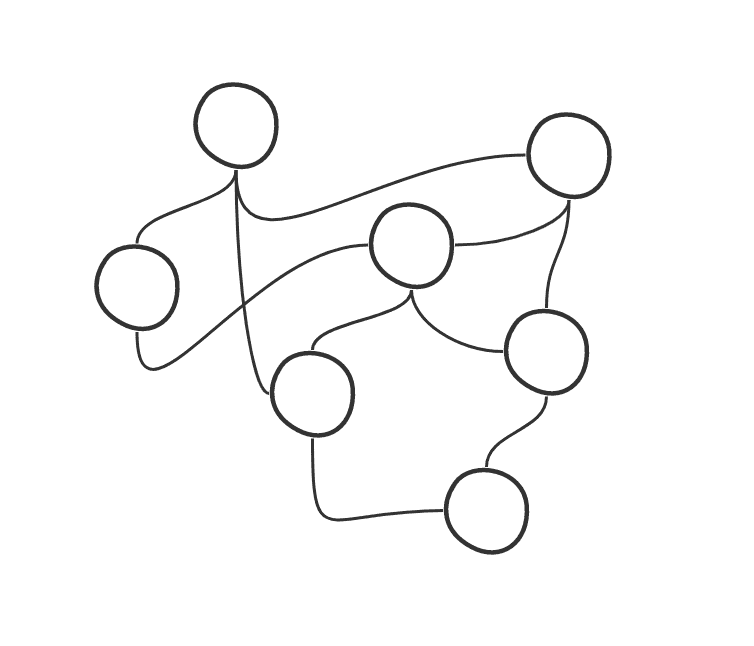
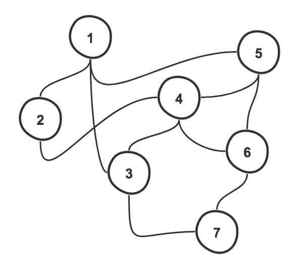
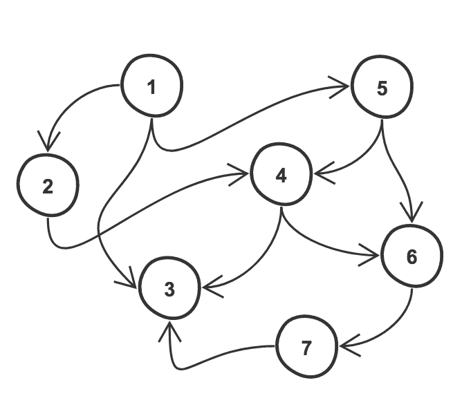
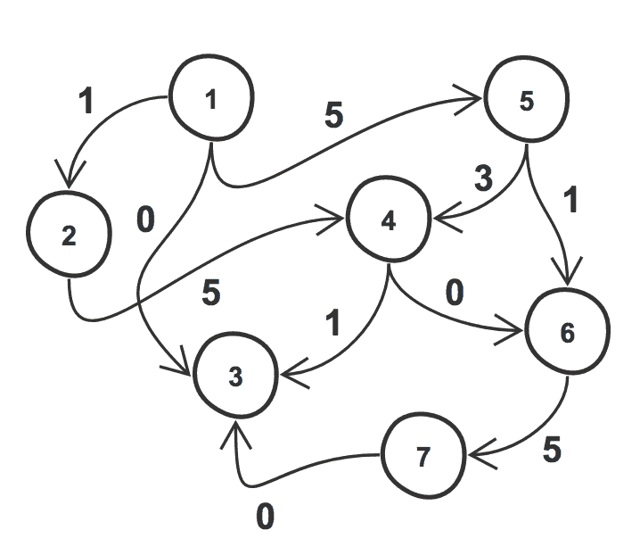
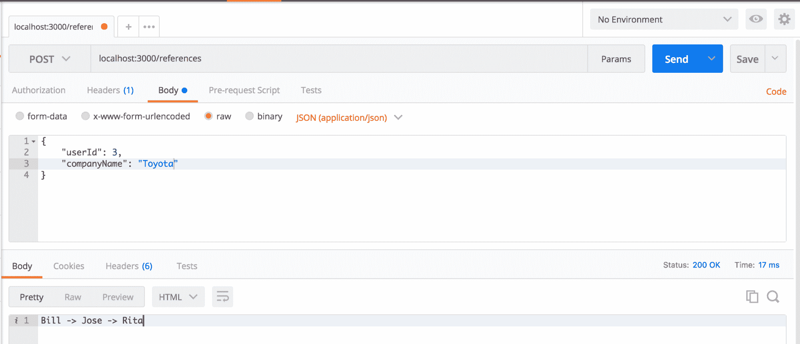
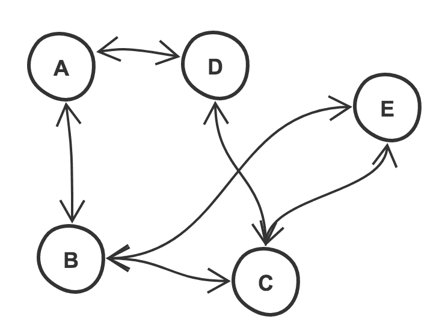
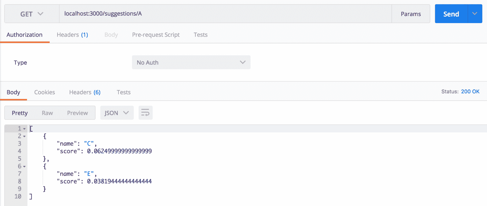
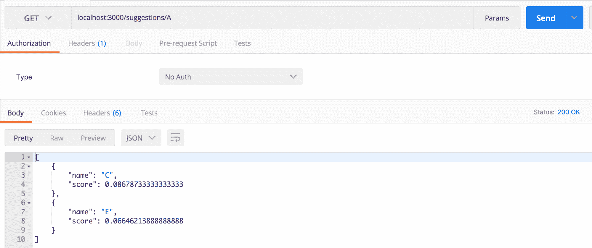

# 第五章：使用图简化复杂应用程序

定义图的最简单方法是任何由边连接的节点集合。图是计算机科学中使用的最流行的数学概念之一。图的常见实现示例是任何社交媒体网站。Facebook 使用*朋友*作为节点，*友谊*作为边；而 Twitter 则将*追随者*定义为节点，*关注*作为边，依此类推。看一下下面的图像：



在上述图像中，你可以看到一个典型的图，有*节点*和*边*。正如你所注意到的，我们的边没有列出方向，节点也没有详细信息。这是因为有不同类型的图，节点和边在这些不同类型的图之间略有不同，我们将在接下来的部分中看到。

在本章中，我们将首先讨论以下主题：

1.  图的类型

1.  为求职门户网站创建一个参考生成器

1.  创建一个朋友推荐系统

# 图的类型

根据前面的描述，我们可以推测出图的类型。有太多类型要在本章甚至本书中涵盖。然而，让我们来看一些最重要和最流行的图，我们将在本章中通过示例来探索：

+   **简单图**：简单图是一个无向、无权重的图，不包含循环或多边（即两个节点之间的多条边，也称为平行边）节点：


+   **无向图**：这是一个图，其中边的定义是可互换的。例如，在下面的图像中，节点**1**和**2**之间的边可以表示为(1,2)或(2,1)。因此，节点之间通过一条没有箭头指向任何节点的线连接：



+   **有向图**：这是一个图，其中边根据功能或逻辑条件给定预定义方向。边用箭头绘制，表示流动的方向，例如 Twitter 上的一个用户关注另一个用户。看一下下面的图像：


+   **循环图**：这是一个图，其中边形成节点之间的循环连接，即起始和结束节点相同。例如，在下面的图像中，我们可以注意到节点**1** >> **5** >> **6** >> **7** >> **3** >> **1**形成了图中的循环：


+   **有向无环图**：这是一个没有循环的有向图。这是最常见的图的类型。在下面的例子中，节点是**1**、**2**、**3**、**4**、**5**、**6**、**7**，边是{(1, 2), (1, 3), (1, 5), (2, 4), (4, 3), (4, 6), (5, 4), (5, 6), (6, 7), (7, 3)}：



+   **加权图**：这是一个图，其中边根据穿越该边的成本或便宜程度被分配数值权重。每条边的权重的使用可以根据用例而变化。在下面的例子中，你可以注意到图之间的边被分配了权重(**0**、**1**、**3**或**5**)：



幸运的是，或不幸的是，我们在日常挑战中面临的问题并没有直接告诉我们是否可以用图解决它们，如果可以，它需要什么样的图或者我们需要使用什么样的解析算法。这是我们会根据具体情况来处理的事情，这也是我们将在下面的用例中所做的。

# 用例

实现图与树的方式类似；没有固定的创建方式。然而，根据您的用例，您可以根据需要将图结构化为有向、循环或其他形式，如前面所述。这样做可以使它们的遍历更容易，从而使数据检索更容易、更快。

让我们先看一些示例，我们首先需要一个基础应用程序。

# 创建一个 Node.js Web 服务器

首先，让我们使用 Node.js 创建一个 Web 服务器，稍后我们将使用它来创建端点以访问我们基于图的应用程序：

1.  第一步是创建应用程序的项目文件夹；要做到这一点，从终端运行以下命令：

```js
 mkdir <project-name>
```

1.  然后，要初始化一个 Node.js 项目，在项目的根目录运行`init`命令。这将提示一系列问题以生成`package.json`文件。您可以填写您想要的答案，或者只需点击`return`接受提示的默认值：

```js
 cd <project-name>
 npm init
```

1.  接下来，因为我们想要创建一个 Web 服务器，我们将使用`express`，这是一个非常强大和流行的 Node.js 框架。我们还将使用另一个名为`body-parser`的库，它可以帮助我们轻松解析传入的 JSON 请求体。最后，我们还将使用`lodash`来帮助处理一些复杂的数据操作。要安装`lodash`，`express`和`body-parser`，运行以下命令：

```js
 npm install express body-parser lodash --save
```

1.  一旦我们完成了应用程序的设置，我们将需要使用 express 启动应用程序服务器，并包含我们的`body-parser`中间件。因此，我们现在可以在根目录下创建一个`server.js`文件，然后添加以下代码：

```js
 var express = require('express');
 var app = express();
 var bodyParser = require('body-parser');

 // middleware to parse the body of input requests app.use(bodyParser.json());

 // test url app.get('/', function (req, res) {
           res.status(200).send('OK!')
        });

 // start server app.listen(3000, function () {
           console.log('Application listening on port 3000!')
        });
```

1.  现在，应用程序已经准备好启动了。在您的`package.json`文件的`scripts`标签下，添加以下内容，然后从终端运行`npm start`来启动服务器：

```js
 {

        ...

        "scripts": {
          "start": "node server.js",
          "test": "echo \"Error: no test specified\" && exit 1"        },

        ...

        }
```

# 为求职门户创建一个参考生成器

在这个例子中，我们将为一个求职门户创建一个参考生成器。例如，我们有一些彼此为朋友的用户，我们将为每个用户创建节点，并将每个节点与数据关联，例如他们的姓名和他们工作的公司。

一旦我们创建了所有这些节点，我们将根据节点之间的一些预定义关系将它们连接起来。然后，我们将使用这些预定义关系来确定一个用户需要与谁交谈，以便获得推荐去他们选择的公司的工作面试。例如，A 在 X 公司工作，B 在 Y 公司工作并且是朋友，B 和 C 在 Z 公司工作并且是朋友。因此，如果 A 想要被推荐到 Z 公司，那么 A 与 B 交谈，B 可以介绍他们给 C，以获得去 Z 公司的推荐。

在大多数生产级应用程序中，您不会以这种方式创建图。您可以简单地使用图数据库，它可以直接执行许多功能。

回到我们的例子，更加技术性地说，我们有一个无向图（将用户视为节点，友谊视为它们之间的边），我们想要确定从一个节点到另一个节点的最短路径。

为了实现我们到目前为止所描述的内容，我们将使用一种称为**广度优先搜索**（**BFS**）的技术。BFS 是一种图遍历机制，首先检查或评估相邻节点，然后再移动到下一级。这有助于确保在结果链中找到的链接数量始终是最小的，因此我们总是得到从节点 A 到节点 B 的最短可能路径。

尽管还有其他算法，比如**Dijkstra**，可以实现类似的结果，但我们将选择 BFS，因为 Dijkstra 是一种更复杂的算法，适用于每个边都有相关成本的情况。例如，在我们的情况下，如果我们的用户友谊有与之相关的权重，比如*熟人*、*朋友*和*密友*，那么我们将选择 Dijkstra，这将帮助我们为每条路径关联权重。

考虑使用 Dijkstra 的一个很好的用例是地图应用程序，它会根据两点之间的交通情况（即每条边的权重或成本）为你提供从 A 点到 B 点的方向。

# 创建一个双向图

我们可以通过在`utils/graph.js`下创建一个新文件来为我们的图形创建逻辑，该文件将保存边缘，然后提供一个简单的`shortestPath`方法来访问图形，并在生成的图形上应用 BFS 算法，如下面的代码所示：

```js
var _ = require('lodash');

class Graph {

   constructor(users) {
      // initialize edges
  this.edges = {};

      // save users for later access
  this.users = users;

      // add users and edges of each
  _.forEach(users, (user) => {
         this.edges[user.id] = user.friends;
      });
   }
}

module.exports = Graph;
```

一旦我们将边添加到我们的图形中，它就有了节点（用户 ID），边被定义为每个用户 ID 和`friends`数组中的朋友之间的关系。由于我们的数据结构的方式，形成图形是一项容易的任务。在我们的示例数据集中，每个用户都有一个朋友列表，如下面的代码所示：

```js
[
   {
      id: 1,
      name: 'Adam',
      company: 'Facebook',
      friends: [2, 3, 4, 5, 7]
   },
   {
      id: 2,
      name: 'John',
      company: 'Google',
      friends: [1, 6, 8]
   },
   {
      id: 3,
      name: 'Bill',
      company: 'Twitter',
      friends: [1, 4, 5, 8]
   },
   {
      id: 4,
      name: 'Jose',
      company: 'Apple',
      friends: [1, 3, 6, 8]
   },
   {
      id: 5,
      name: 'Jack',
      company: 'Samsung',
      friends: [1, 3, 7]
   },
   {
      id: 6,
      name: 'Rita',
      company: 'Toyota',
      friends: [2, 4, 7, 8]
   },
   {
      id: 7,
      name: 'Smith',
      company: 'Matlab',
      friends: [1, 5, 6, 8]
   },
   {
      id: 8,
      name: 'Jane',
      company: 'Ford',
      friends: [2, 3, 4, 6, 7]
   }
]
```

正如你在前面的代码中所看到的，我们在这里并不需要专门建立双向边，因为如果用户`1`是用户`2`的朋友，那么用户`2`也是用户`1`的朋友。

# 生成最短路径的伪代码

在实施之前，让我们快速记录一下我们将要做的事情，这样实际的实施就会变得更容易：

```js
INITIALIZE tail to 0 for subsequent iterations

MARK source node as visited

WHILE result not found

    GET neighbors of latest visited node (extracted using tail)

    FOR each of the node

        IF node already visited

            RETURN

        Mark node as visited

        IF node is our expected result

            INITIALIZE result with current neighbor node

            WHILE not source node

               BACKTRACK steps by popping users 
               from previously visited path until
               the source user

            ADD source user to the result

            CREATE and format result variable

        IF result found return control

        NO result found, add user to previously visited path

        ADD friend to queue for BFS in next iteration

    INCREMENT tail for next loop

RETURN NO_RESULT
```

# 实现最短路径生成

现在让我们创建我们定制的 BFS 算法来解析图并生成用户被推荐到 A 公司的最短路径：

```js
var _ = require('lodash');

class Graph {

   constructor(users) {
      // initialize edges
  this.edges = {};

      // save users for later access
  this.users = users;

      // add users and edges of each
  _.forEach(users, (user) => {
         this.edges[user.id] = user.friends;
      });
   }

   shortestPath(sourceUser, targetCompany) {
      // final shortestPath
  var shortestPath;

      // for iterating along the breadth
  var tail = 0;

      // queue of users being visited
  var queue = [ sourceUser ];

      // mark visited users
  var visitedNodes = [];

      // previous path to backtrack steps when shortestPath is found
  var prevPath = {};

      // request is same as response
  if (_.isEqual(sourceUser.company, targetCompany)) {
         return;
      }

      // mark source user as visited so
 // next time we skip the processing  visitedNodes.push(sourceUser.id);

      // loop queue until match is found
 // OR until the end of queue i.e no match  while (!shortestPath && tail < queue.length) {

         // take user breadth first
  var user = queue[tail];

         // take nodes forming edges with user
  var friendsIds = this.edges[user.id];

         // loop over each node
  _.forEach(friendsIds, (friendId) => {
            // result found in previous iteration, so we can stop
            if (shortestPath) return;

            // get all details of node
  var friend = _.find(this.users, ['id', friendId]);

            // if visited already,
 // nothing to recheck so return  if (_.includes(visitedNodes, friendId)) {
               return;
            }

            // mark as visited
  visitedNodes.push(friendId);

            // if company matched
  if (_.isEqual(friend.company, targetCompany)) {

               // create result path with the matched node
  var path = [ friend ];

               // keep backtracking until source user and add to path
  while (user.id !== sourceUser.id) {

                  // add user to shortest path
  path.unshift(user);

                  // prepare for next iteration
  user = prevPath[user.id];
               }

               // add source user to the path
  path.unshift(user);

               // format and return shortestPath
  shortestPath = _.map(path, 'name').join(' -> ');
            }

            // break loop if shortestPath found
  if (shortestPath) return;

            // no match found at current user,
 // add it to previous path to help backtracking later  prevPath[friend.id] = user;

            // add to queue in the order of visit
 // i.e. breadth wise for next iteration  queue.push(friend);
         });

         // increment counter
  tail++;
      }

      return shortestPath ||
            `No path between ${sourceUser.name} & ${targetCompany}`;
   }

}

module.exports = Graph;
```

代码的最重要部分是当找到匹配时，如前面代码块所示：

```js
// if company matched if (_.isEqual(friend.company, targetCompany)) {

   // create result path with the matched node
  var path = [ friend ];

   // keep backtracking until source user and add to path
  while (user.id !== sourceUser.id) {

      // add user to shortest path
  path.unshift(user);

      // prepare for next iteration
  user = prevPath[user.id];
   }

   // add source user to the path
  path.unshift(user);

   // format and return shortestPath
  shortestPath = _.map(path, 'name').join(' -> ');
}
```

在这里，我们使用了一种称为回溯的技术，当找到结果时，它可以帮助我们重新追溯我们的步骤。这里的想法是，每当找不到结果时，我们将迭代的当前状态添加到一个映射中——键作为当前正在访问的节点，值作为我们正在访问的节点。

因此，例如，如果我们从节点 3 访问节点 1，那么直到我们从其他节点访问节点 1，地图中将包含{1:3}，当发生这种情况时，我们的地图将更新为指向我们从中得到节点 1 的新节点，例如{1:newNode}。一旦我们设置了这些先前的路径，我们可以通过查看这个地图轻松地追溯我们的步骤。通过添加一些日志语句（仅在 GitHub 代码中可用，以避免混淆），我们可以轻松地查看数据的长但简单的流程。让我们以我们之前定义的数据集为例，当 Bill 试图寻找可以推荐他给丰田的朋友时，我们看到以下日志语句：

```js
starting the shortest path determination added 3 to the queue marked 3 as visited
 shortest path not found, moving on to next node in queue: 3 extracting neighbor nodes of node 3 (1,4,5,8) accessing neighbor 1 mark 1 as visited result not found, mark our path from 3 to 1 result not found, add 1 to queue for next iteration current queue content : 3,1 accessing neighbor 4 mark 4 as visited result not found, mark our path from 3 to 4 result not found, add 4 to queue for next iteration current queue content : 3,1,4 accessing neighbor 5 mark 5 as visited result not found, mark our path from 3 to 5 result not found, add 5 to queue for next iteration current queue content : 3,1,4,5 accessing neighbor 8 mark 8 as visited result not found, mark our path from 3 to 8 result not found, add 8 to queue for next iteration current queue content : 3,1,4,5,8 increment tail to 1 shortest path not found, moving on to next node in queue: 1 extracting neighbor nodes of node 1 (2,3,4,5,7) accessing neighbor 2 mark 2 as visited result not found, mark our path from 1 to 2 result not found, add 2 to queue for next iteration current queue content : 3,1,4,5,8,2 accessing neighbor 3 neighbor 3 already visited, return control to top accessing neighbor 4 neighbor 4 already visited, return control to top accessing neighbor 5 neighbor 5 already visited, return control to top accessing neighbor 7 mark 7 as visited result not found, mark our path from 1 to 7 result not found, add 7 to queue for next iteration current queue content : 3,1,4,5,8,2,7 increment tail to 2 shortest path not found, moving on to next node in queue: 4 extracting neighbor nodes of node 4 (1,3,6,8) accessing neighbor 1 neighbor 1 already visited, return control to top accessing neighbor 3 neighbor 3 already visited, return control to top accessing neighbor 6 mark 6 as visited result found at 6, add it to result path ([6]) backtracking steps to 3 we got to 6 from 4 update path accordingly: ([4,6]) add source user 3 to result form result [3,4,6] return result increment tail to 3 return result Bill -> Jose -> Rita
```

我们基本上在这里使用 BFS 进行迭代过程，以遍历树并回溯结果。这构成了我们功能的核心。

# 创建一个 Web 服务器

我们现在可以添加一个路由来访问这个图形及其相应的`shortestPath`方法。让我们首先在`routes/references`下创建路由，并将其添加为 Web 服务器的中间件：

```js
var express = require('express');
var app = express();
var bodyParser = require('body-parser');

// register endpoints var references = require('./routes/references');

// middleware to parse the body of input requests app.use(bodyParser.json());

// route middleware app.use('/references', references);

// start server app.listen(3000, function () {
   console.log('Application listening on port 3000!');
});
```

然后，创建如下代码所示的路由：

```js
var express = require('express');
var router = express.Router();
var Graph = require('../utils/graph');
var _ = require('lodash');
var userGraph;

// sample set of users with friends 
// same as list shown earlier var users = [...];

// middleware to create the users graph router.use(function(req) {
   // form graph
  userGraph = new Graph(users);

   // continue to next step
  req.next();
});

// create the route for generating reference path // this can also be a get request with params based // on developer preference router.route('/')
   .post(function(req, res) {

      // take user Id
  const userId = req.body.userId;

      // target company name
  const companyName = req.body.companyName;

      // extract current user info
  const user = _.find(users, ['id', userId]);

      // get shortest path
  const path = userGraph.shortestPath(user, companyName);

      // return
  res.send(path);
   });

module.exports = router;
```

# 运行参考生成器

要测试这个，只需从项目的根目录运行`npm start`命令启动 Web 服务器，如前面所示。

一旦服务器启动运行，你可以使用任何你希望的工具将请求发送到你的 Web 服务器，如下面的截图所示：



正如你在前面的截图中所看到的，我们得到了预期的响应。当然，这可以以一种方式进行更改，以返回所有用户对象而不仅仅是名称。这可能是一个有趣的扩展示例，你可以自己尝试一下。

# 为社交媒体创建一个好友推荐系统

你不能简单地否认社交网络网站都是关于数据的事实。这就是为什么这些网站中构建的大多数功能都依赖于你提供给它们的数据。这些中的一个例子就是*你可能认识的人*或*推荐关注*组件，你可以在许多网站上找到。

从前面的例子中，我们知道数据可以分组为“节点”和“边”，其中节点是人，边是您想要在节点之间建立的关系。

我们可以简单地形成一个双向图，然后应用 BFS 算法来确定第 n 度的连接节点，然后我们可以去重以显示朋友或节点推荐。然而，考虑到我们在前面的例子中已经这样做了，而且在生产应用程序中，每个用户和这些用户的朋友的实际列表都非常庞大，我们将采取不同的方法。我们将假设我们的数据集存储在图数据库中，比如**neo4j**，然后我们将使用一种称为**Personalized PageRank**的算法，这是一种 BFS 和 PageRank 的组合，我们将在下一节中探讨。

# 理解 PageRank 算法

在我们的生活中的某个时刻，我们一定遇到过这个术语，PageRank。PageRank 是 Google 对网页进行搜索和索引排名的众多方式之一。一个简单的谷歌搜索（完全是故意的双关语）将返回结果，告诉您它基本上涉及从中我们可以随机走向的一组节点。然而，这到底意味着什么呢？

假设控制权被放置在图中的任何节点上，我们说控制权可以以`alpha`的概率不偏向地跳转到图上的任何节点，当它确实落在任何节点上时，它会在以`(1-alpha)`的概率随机地沿着这些节点的边之一遍历之前，与所有连接的节点平均分享其排名的一部分。

这有什么意义和原因呢？这只是从一个节点跳到另一个节点，然后随机地遍历到其他连接的节点，对吧？

如果您这样做足够长的时间，您会落在所有节点上，有些节点会比其他节点多次。您明白我要说什么吗？这最终会告诉您哪些节点比其他节点更频繁地访问，这可能是由于以下两个原因：

+   我们碰巧多次跳转到同一个节点

+   该节点连接到多个节点

第一种情况可能发生，但是，由于我们知道我们的跳跃是不偏向的，大数定律规定，这将在足够长的时间内产生归一化的值，我们可以安全地排除它。

另一方面，第二种情况不仅可能，而且对 PageRank 非常重要。一旦您落在其中一个节点上，这时我们根据 alpha 和从前一个节点继承的排名来计算该节点的 PageRank。

我们在抽象的节点和边的术语中进行了讨论；然而，让我们暂时看一下 Sergey Brin 和 Lawrence Page 在 PageRank 的第一篇发表文章中所说的一句话([`infolab.stanford.edu/~backrub/google.html`](http://infolab.stanford.edu/~backrub/google.html))：

我们假设页面 A 有指向它的页面 T1...Tn（即引用）。参数 d 是一个阻尼因子，可以设置在 0 和 1 之间。我们通常将 d 设置为 0.85。关于 d 的更多细节将在下一节中介绍。此外，C(A)被定义为从页面 A 指向外部的链接数。页面 A 的 PageRank 如下所示：

PR(A) = (1-d) + d (PR(T1)/C(T1) + ... + PR(Tn)/C(Tn))

请注意，PageRanks 形成了网页的概率分布，因此所有网页的 PageRanks 之和将为 1。

从前面的陈述中，我们可以看到给定页面/节点的 PageRank *(PR*)是从其引用(*T1...Tn*)的*PR*派生出来的，但是我们如何知道从哪里开始，因为我们需要知道它的引用来计算*T1*的 PR。简单的答案是，实际上我们不需要知道*PR(T1)*的值或者事实上任何其他引用的值。相反，我们可以简单地猜测*PR(T1)*的值，并递归地应用从前一步骤派生出的值。

然而，你为什么会这样问呢？答案很简单，记得大数定律吗？如果你重复一个动作足够长的时间，该动作的结果将收敛到中位数值。然后，还有关于如何在数百万和数十亿的网页上进行有效操作的问题？有方法和手段，这超出了本章和本书的范围；然而，对于那些感兴趣的人，这本解释 Google Page Rank 的书是一本很好的读物，可在[`press.princeton.edu/titles/8216.html`](https://press.princeton.edu/titles/8216.html)上获得。我希望这本书能为基本原则提供一些启发。

# 理解个性化 PageRank（PPR）算法

现在我们对 PageRank 有了简要的了解，那么个性化 PageRank 是什么？实际上很简单，每次不是跳转到随机节点，而是跳转到预定义的节点，然后递归地累积每个节点的命中概率，使用 BFS 进行遍历。

假设我们有一些朋友，他们的结构如下图所示：



这很简单；节点之间有双向边，表示它们之间有友谊关系。在这个问题中，我们可以假设我们想向用户**A**推荐新的朋友。

最简单的部分也是我们在转到 PPR 的代码之前需要讨论的重要事情。我们将始终从我们的目标节点开始，也就是说，跳转不再是随机开始的。我们从我们的目标节点开始，假设控制以相等的方式遍历所有边，然后回到父节点。然后，我们递归地重复这个过程，同时通过一条边扩展度，直到满足目标度。

此外，每次我们从目标节点增加一度搜索时，我们都会与邻居分享节点的概率，但如果我们全部分享，节点就会变为 0，所以我们要做的是应用一个阻尼因子（alpha）。

例如，假设我们在节点*X*，它的概率为 1（即，它是目标节点），并且这个节点*X*有两个邻居*Y*和*Z*。我们设置的 alpha（例如，0.5）将在这里应用，因此在第一次迭代之后，*X*的概率将为 0.5，然后*Y*和*Z*将有相等的概率 0.25。然后，这个过程将递归地重复到下一个度，使用我们刚刚创建的新概率映射。

# 个性化 PageRank 的伪代码

让我们将之前部分讨论的内容转换为伪代码，以便更容易实现：

```js
START at root node

    assign it a probability of 1 in the probabilityMap

    trigger CALC_PPR with current node, probabilityMap and iterations count

FUNCTION CALC_PPR

    IF number of iteration left is 0

        remove target and its neighbors from probabilityMap

        return rest of probabilityMap

    ELSE

        determine an ALPHA

        extract all nodes at the current degree

        FOR each nodes at current degree

            extract neighbors

            calculate the probability to propagate to neighbor

            IF neighbor already has a probability

                add to existing probability

            ELSE

               assign new probability

        CALC_PPR with decreased iteration count                 
```

现在这并不可怕，是吗？现在实现 PPR 算法将会很容易。

# 创建一个 Web 服务器

在我们为个性化 PageRank 编写任何代码之前，让我们首先创建一个 Node.js 应用程序，就像之前解释的那样。

一旦应用程序准备就绪，让我们创建一个路由，用于为我们提供用户建议。类似于之前的示例，我们可以快速拼凑出以下路由，放在`routes/suggestions.js`下：

```js
const express = require('express');
const router = express.Router();
const _ = require('lodash');

// sample set of users with friends extracted from some grapgh db const users = {
   A: { neighbors: [ 'B', 'D' ] },
   B: { neighbors: [ 'A', 'C', 'E' ] },
   C: { neighbors: [ 'B', 'D', 'E' ] },
   D: { neighbors: [ 'A', 'C' ] },
   E: { neighbors: [ 'B', 'C' ] }
};

// middleware router.use(function(req) {
   // intercept, modify and then continue to next step
  req.next();
});

// route router.route('/:userId')
   .get(function(req, res) {
      var suggestions;

      // take user Id
  const userId = req.params.userId;

      // generate suggestions   // return suggestions  res.send(userId);
   });

module.exports = router;
```

我们还可以快速拼凑出我们的 express 服务器：

```js
var express = require('express');
var app = express();
var bodyParser = require('body-parser');

// suggestion endpoints var suggestions = require('./routes/suggestions');

// middleware to parse the body of input requests app.use(bodyParser.json());

// route middleware app.use('/suggestions', suggestions);

// start server app.listen(3000, function () {
   console.log('Application listening on port 3000!');
});
```

# 实现个性化 PageRank

现在，让我们转到创建我们的**个性化 PageRank**（**PPR**）算法。我们将创建一个`ES6`类，它将处理提供图形和目标节点后生成建议的所有逻辑。请注意，在上面的代码中，我已经向您展示了图形的样子：

```js
const users = {
   A: { neighbors: [ 'B', 'D' ] },
   B: { neighbors: [ 'A', 'C', 'E' ] },
   C: { neighbors: [ 'B', 'D', 'E' ] },
   D: { neighbors: [ 'A', 'C' ] },
   E: { neighbors: [ 'B', 'C' ] }
};
```

我们通过指定两个节点为彼此的邻居建立了双向关系。现在，我们可以开始编写 PPR 的代码：

```js
const _ = require('lodash');

class PPR {

   constructor(data) {
      this.data = data;
   }

   getSuggestions(nodeId) {
      return this.personalizedPageRankGenerator(nodeId);
   };
}

module.exports = PPR;
```

我们首先将图形作为输入接受到我们的`constructor`中。接下来，我们将定义我们的`getSuggestions`方法，它将接受输入的`nodeId`，然后将其传递给计算 PPR。这也是我们之前伪代码的第一步，如下所示：

```js
personalizedPageRankGenerator(nodeId) {
   // Set Probability of the starting node as 1
 // because we will start from that node  var initProbabilityMap = {};

   initProbabilityMap[nodeId] = 1;

   // call helper to iterate thrice
  return this.pprHelper(nodeId, initProbabilityMap, 3);
};
```

由于我们的控制被定义为从一个固定节点开始，我们将其概率设置为`1`。我们将进行三次迭代，只是因为我们只想走出三个级别来获取建议。第 1 级是目标节点，第 2 级是目标节点的邻居（即当前的朋友），然后第 3 级是邻居的邻居（即朋友的朋友）。

现在，我们来到了有趣的部分。我们将递归地计算我们跳到每个相邻节点的概率，从目标节点开始：

```js
pprHelper(nodeId, currentProbabilitiesMap, iterationCount) {
   // iterations done
  if (iterationCount === 0) {

      // get root nodes neighbors
  var currentNeighbors = this.getNeighbors(nodeId);

      // omit neighbors and self node from calculated probabilities
  currentProbabilitiesMap = _.omit(currentProbabilitiesMap,
      currentNeighbors.concat(nodeId));

      // format data and sort by probability of final suggestions
  return _.chain(currentProbabilitiesMap)
         .map((val, key) => ({ name: key, score: val }))
         .orderBy('score', 'desc')
         .valueOf();

   } else {
      // Holds the updated set of probabilities for the next iteration
  var nextIterProbabilityMap = {};

      // set alpha
  var alpha = 0.5;

      // With probability alpha, we teleport to the start node again
  nextIterProbabilityMap[nodeId] = alpha;

      // extract nodes within current loop
  var parsedNodes = _.keys(currentProbabilitiesMap);

      // go to next degree nodes of each of the currently parsed nodes
  _.forEach(parsedNodes, (parsedId) => {

         // get current probability of each node
  var prob = currentProbabilitiesMap[parsedId];

         // get connected nodes
  var neighbors = this.getNeighbors(parsedId);

         // With probability 1 - alpha, we move to a connected node...
 // And at each node we distribute its current probability
         equally to // its neighbors    var probToPropagate = (1 - alpha) * prob / neighbors.length;

         // spreading the probability equally to neighbors   _.forEach(neighbors, (neighborId) => {
            nextIterProbabilityMap[neighborId] =
         (nextIterProbabilityMap[neighborId] || 0) + probToPropagate;
         });
      });

      // next iteration
  return this.pprHelper(nodeId, nextIterProbabilityMap, iterationCount - 1);
   }
}

getNeighbors(nodeId) {
   return _.get(this.data, [nodeId, 'neighbors'], []);
}
```

这并不像你想象的那样糟糕，对吧？一旦我们准备好 PPR 算法，我们现在可以将这个类导入到我们的`suggestions`路由中，并可以用它来为任何输入用户生成推荐，如下面的代码片段所示：

```js
const express = require('express');
const router = express.Router();
const _ = require('lodash');
const PPR = require('../utils/ppr');

// sample set of users with friends extracted from some grapgh db const users = .... // from previous example

....

// route router.route('/:userId')
   .get(function(req, res) {
      var suggestions;

      // take user Id
  const userId = req.params.userId;

----> // generate suggestions ----> suggestions = new PPR(users).getSuggestions(userId);

      // return suggestions
  res.send(suggestions);
   });

module.exports = router;
```

# 结果和分析

现在，为了测试这个，让我们通过从根文件夹运行`npm start`命令来启动我们的 Web 服务器。一旦您的应用程序启动，您将在终端上看到以下消息：

```js
Application listening on port 3000!
```

一旦消息出现，您可以打开 Postman 或您选择的其他任何东西来进行 API 调用以获取建议：



我们可以看到用户`C`比用户`E`得分更高。这是因为我们可以从输入数据集中看到用户`A`和`C`比用户`A`和`E`有更多的共同朋友。这就是为什么，根据我们之前的推断，我们的控制落在节点`C`上的机会比节点`E`上的机会更高。

另外，需要注意的有趣的事情是，这里实际分数的值并不重要。您只需要看分数的比较来确定哪一个更有可能发生。您可以根据需要更改 alpha 来决定每个节点之间将分配多少概率，这最终会改变每个结果节点的分数，例如，我们将 alpha 值更改为 0.5 的结果，显示了名称和分数，我们将现在将其更改为`0.33`，即父节点保留三分之一，其余与邻居分配：



在每个递归调用之前添加了一些日志语句，以便更清晰地理解：

```js
.....

console.log(`End of Iteration ${ 4 - iterationCount} : ${JSON.stringify(nextIterProbabilityMap)}`);
 // next iteration return this.pprHelper(nodeId, nextIterProbabilityMap, iterationCount - 1);
```

前面的日志语句产生了以下结果：


从前面的截图中，您可以注意到在第一次迭代结束时，我们分配给目标节点`A`的总概率为 1，在我们的逻辑确定的 BFS 遍历后，被分成了三部分，即节点`A`的邻居`B`和`D`。现在，这成为了第 2 次迭代的输入，我们重复这个过程，直到最后一次迭代结束，在最后一次迭代结束时，我们移除了当前目标节点`A`及其直接邻居节点`B`和`D`（因为它们已经是朋友），并返回剩下的节点`C`和`E`。

# 摘要

在本章中，我们直面了一些现实世界的挑战，并根据手头的问题创建了一些定制解决方案。这是本章最重要的收获之一。很少会有一个理想的解决方案是 readily available。我们采用了图论算法之一，称为 BFS，并利用它来为我们的职位门户和用户建议生成推荐。我们还简要讨论了 PageRank 算法，任何开发人员都应该熟悉。这引出了为什么以及何时使用一种算法而不是另一种算法的问题。选择算法的利弊是什么？这将是我们下一章的主题，我们将分析不同类型的算法以及它们可以应用的地方。
