# 第九章：微优化和内存管理

在本章中，我们将介绍 HTML、CSS、JavaScript 和我们期望所有这些内容在其中运行的浏览器的一些基本概念。我们一直以来都以某种风格编码，这是自然的。然而，我们是如何形成这种风格的？它是好的还是可以变得更好？我们如何决定我们应该和不应该要求其他人遵循什么？这些是我们将在本章中尝试回答的一些问题。

在本章中，我们将讨论以下内容：

+   最佳实践的重要性，以及一些示例。

+   探索不同类型的 HTML、CSS 和 JavaScript 优化

+   深入了解 Chrome 一些功能的内部工作。

# 最佳实践

出于明显的原因，最佳实践是一个相对的术语。什么被认为是最佳的，更多取决于你所在的团队以及你使用的 JavaScript 版本。在本节中，我们将尝试广泛涵盖一些最佳实践，并了解一些实践看起来是什么样子，以便我们也可以适应并使用它们。

# HTML 的最佳实践

让我们从上到下来处理 HTML 文件中每个部分的最佳实践。

# 声明正确的 DOCTYPE

你是否曾经想过为什么我们在页面顶部有`<!DOCTYPE html>`？我们显然可以不写它，页面似乎仍然可以工作。那么，我们为什么需要这个？答案是**避免向后兼容性**——如果我们不指定 DOCTYPE，解释和呈现我们的 HTML 的浏览器将进入怪癖模式，这是一种支持使用过时版本和标记的 HTML、CSS 和 JS 构建的非常旧的网站的技术。怪癖模式模拟了旧版本浏览器中存在的许多错误，我们不想处理这些错误。

# 向页面添加正确的元信息

任何网页在呈现时都需要一些元信息。虽然这些信息不会在页面上呈现，但对于正确呈现页面至关重要。以下是一些添加元信息的良好实践：

+   在`html`标签中添加正确的`lang`属性，以符合 w3c 的国际化标准：

```js
<html lang="en-US">
```

+   声明正确的`charset`以支持网页上的特殊字符：

```js
<meta charset="UTF-8">
```

+   添加正确的`title`和`description`标签以支持搜索引擎优化：

```js
<title>This is the page title</title>

<meta name="description" content="This is an example description.">
```

+   添加适当的`base` URL 以避免在各处提供绝对 URL：

```js
<base href="http://www.mywebsite.com" />
...
...
 // relative to base 
```

# 删除不必要的属性

这可能看起来很明显，但仍然被广泛使用。当我们添加一个`link`标签来下载样式表时，我们的浏览器已经知道它是一个样式表。没有理由指定该链接的类型：

```js
<link rel="stylesheet" href="somestyles.css" type="text/css" />
```

# 使您的应用程序适用于移动设备

你是否曾经见过那些在桌面和移动设备上看起来完全相同的网站，并想知道为什么他们要这样构建？在新时代的网页开发中，为什么有人不利用最新的 HTML 和 CSS 版本提供的响应性？这可能发生在任何人身上；我们已经定义了所有正确的断点，并且按预期使用媒体查询，但什么都没有发生。这通常是因为我们忘记了包括`viewport`，`meta`标签；包括`viewport`的`meta`标签可以解决我们所有的问题：

```js
<meta name="viewport" content="width=device-width, initial-scale=1">
```

“视口”基本上是用户可见区域的总和，在移动设备上较小，在桌面上较大；`meta`标签定义了浏览器根据“视口”的大小来呈现网站的方式。

# 在<head>中加载样式表

这是一个偏好和选择的问题。我们可以在页面加载的末尾加载样式表吗？当然可以，但我们希望避免这样做，以便我们的用户在捕捉到正确的样式之前不会看到未经样式化的页面闪烁。当浏览器提供 CSS 和 HTML 时，它们创建一个**CSS 对象模型**（**CSSOM**）和**文档对象模型**（**DOM**）。在构建 DOM 时，浏览器查找 CSSOM，以检查是否有任何与 DOM 节点对应的样式。因此，我们希望确保 CSSOM 已经构建并准备好供 DOM 渲染。

一个替代方法是首先在页面的头部标签中只加载基本样式，其余的样式可以在 body 的末尾请求。这意味着我们的页面可以渲染得更快一些，但值得注意的是，这有时可能不值得，这取决于您的应用程序大小和用例。

# 避免内联样式

通过在 HTML 文件中直接提供内联样式来使用它们是不好的，原因有很多：

+   我们无法重用应用于一个元素的样式

+   我们的 HTML 充斥着 CSS，变得非常嘈杂

+   我们无法利用伪元素，比如`before`和`after`

# 使用语义标记

有了 HTML5，我们不再需要担心为所有内容使用`<div>`标签。我们得到了一组更强大的语义标签，这些标签帮助我们以更有意义的方式构建我们的模板：

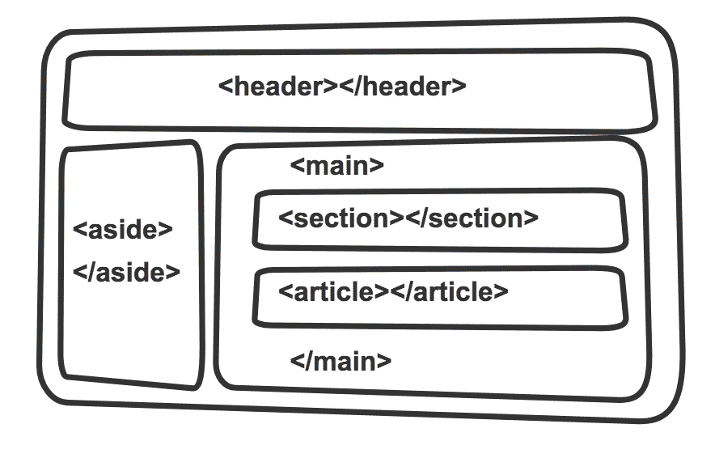值得注意的是，这些新标签只为我们的模板提供了含义，而没有样式。如果我们希望它看起来某种方式，我们需要根据我们希望它们看起来的样子来设计元素。此外，新的 HTML5 标签在 IE9 之前的浏览器中不可用，因此我们需要准备一些备用方案，如 HTML5shiv。

# 使用可访问的丰富互联网应用程序（ARIA）属性

每当我们开发一个网络应用程序时，我们都需要确保我们的应用程序与屏幕阅读器兼容，以支持残障用户：

```js
<div id="elem" aria-live="assertive" role="alert" aria-hidden="false"> An error occurred </div>
```

这些信息不会与屏幕上的任何现有信息发生冲突，并且使屏幕阅读器能够捕捉和处理这些信息。当然，只有在 HTML 渲染器支持 ARIA 时，所有这些才是可能的，这在所有最新的浏览器中都是可用的。

# 在末尾加载脚本

任何应用程序的核心都存在于开发人员定义的 JavaScript 文件中。因此，当我们尝试加载和执行这些文件时，我们需要格外注意，因为它们的大小可能比它们的 HTML 和 CSS 文件的大小要大得多。当我们尝试使用脚本标签加载外部 JS 文件时，浏览器首先下载然后执行它们（在解析和编译之后）。我们需要确保我们的应用程序在正确的时间加载和执行。对我们来说，这意味着如果我们的应用逻辑依赖于 DOM，我们需要确保 DOM 在脚本执行之前被渲染。这就是为什么我们需要在应用程序的 body 标签末尾加载脚本的一个很好的理由。

即使我们的 JavaScript 不依赖于 DOM，我们仍然希望在末尾加载我们的脚本，因为脚本标签默认是渲染阻塞的，也就是说，如果您的浏览器在头部（例如）遇到您的脚本标签，它开始下载和执行 JS 文件，并且在执行完成之前不渲染页面的其余部分。此外，如果我们有太多的 JS 文件，那么页面似乎已经挂起，并且在所有 JS 文件都已成功下载和执行之前，不会完全渲染 UI 给我们的最终用户。

如果您仍然希望添加脚本标签以及链接标签以下载样式表，则有一个解决方法。您可以向脚本标签添加`defer`或`async`属性。`Defer`允许您在 DOM 渲染时并行下载文件，并在渲染完成后执行脚本。`async`在 DOM 渲染时并行下载文件，并在执行时暂停渲染，然后在执行后恢复。明智地使用它们。

# CSS 最佳实践

CSS 最佳实践的列表不像 HTML 那么长。此外，通过使用预处理语言，如**Sassy CSS**（**SCSS**），许多潜在问题可以得到显著缓解。假设由于某种原因您不能使用 SCSS，并讨论纯粹的 CSS 的优缺点。

# 避免内联样式

这足够重要，以至于成为 HTML 和 CSS 最佳实践的一部分。不要应用内联样式。

# 不要使用!important

说起来容易，做起来难。使用`!important`是使样式应用于元素的最简单的解决方法之一。然而，这也有其代价。CSS 或层叠样式表依赖于样式根据应用程序的优先级（ID、类和元素标签）或它们出现的顺序进行级联。使用`!important`会破坏这一点，如果您有多个 CSS 文件，那么纠正它将变得非常混乱。最好避免这样的做法，从一开始就用正确的方法做。

# 在类中按字母顺序排列样式

这听起来不像什么大不了的事，对吧？如果您只有一个带有几个类的 CSS 文件，那也许还可以。但是，当您有一个包含复杂层次结构的大文件时，您最不希望的是犯一个小错误，这会花费您大量的时间。看看以下示例：

```js
.my-class {
    background-image: url('some-image.jpg');
 background-position: 0 100px;
 background-repeat: no-repeat;
    height: 500px;
    width: 500px;
    ...
    ...
    margin: 20px;
    padding: 10px;
 background: red;
}
```

请注意，在上述代码中，我们为元素的背景属性添加了冲突的样式，现在在渲染时，它全部是红色的。这本来很容易被发现，但由于类内属性的顺序，它被忽略了。

# 按升序定义媒体查询

定义媒体查询是另一个随着应用程序规模增长而变得混乱的领域。在定义媒体查询时，始终按递增顺序定义它们，以便您可以隔离您的样式并留下一个开放的上限，如下所示：

```js
...

Mobile specific styles

...  // if screen size is greater than a small mobile phone
@media only screen and (min-width : 320px)  { // overrides which apply }   // if screen size is greater than a small mobile phone in portrait mode // or if screen size is that of a tablet @media only screen and (min-width : 480px)  { // overrides that apply }  // if screen size is greater than a tablet  @media only screen and (min-width : 768px)  { 
    // overrides that apply }   // large screens @media only screen and (min-width : 992px)  { ... }   // extra large screens and everything above it @media only screen and (min-width : 1200px)  { ... }
```

请注意，在上述代码中，我们将最后一个媒体查询留给了适用于所有屏幕尺寸为`1200px`及以上的情况，这将涵盖显示器、电视等。如果我们按照屏幕尺寸的最大宽度设置样式，那么这样做就不会奏效。如果我们在投影仪上打开它会发生什么？它肯定不会像您希望的那样工作。

# JavaScript 最佳实践

这个话题没有开始和结束。关于 JavaScript 应该如何完成任务，有很多不同的观点，结果是大多数都是正确的（取决于您的背景、经验和用例）。让我们来看看一些关于 JavaScript（ES5）最常讨论的最佳实践。

# 避免污染全局范围

不要向全局范围添加属性或方法。这将使您的窗口对象膨胀，并使您的页面变得缓慢和不稳定。相反，总是在方法内创建一个变量，在方法被销毁时会被处理。

# 使用'use strict'

这是一个一行的改变，当涉及捕捉代码异味和任何代码不规则性时，可以走很长的路，比如删除一个变量。`use strict`子句在运行时执行非法操作时会抛出错误，因此它并不一定防止我们的应用程序崩溃，但我们可以在部署之前捕捉并修复问题。

# 严格检查（== vs ===）

当涉及到类型转换时，JavaScript 可能是一门相当棘手的语言。没有数据类型使得这一过程变得更加复杂。使用==会强制进行隐式类型转换，而===则不会。因此，建议始终使用===，除非你想让 12== 12 成立。

要了解它为什么会这样工作的更多细节，请参考抽象相等比较算法，网址为[`www.ecma-international.org/ecma-262/5.1/#sec-11.9.3`](https://www.ecma-international.org/ecma-262/5.1/#sec-11.9.3)。

# 使用三元运算符和布尔||或&&

建议始终保持代码可读，但在必要时，使用三元运算符使代码简洁易读：

```js
if(cond1) {
    var1 = val1;
} else {
    var1 = val2
}

if(cond2) {
    var2 = val3;
} else {
    var2 = val4
}
```

例如，上述代码可以简化如下：

```js
var1 = cond1 ? val1 : val2;
var2 = cond2 ? val3 : val4;
```

设置默认值也可以轻松实现如下：

```js
var1 = ifThisVarIsFalsy || setThisValue;
var2 = ifThisVarIsTruthy && setThisValue;
```

# 代码的模块化

当我们创建一个脚本时，很明显我们希望它能做多种事情，例如，如果我们有一个登录页面，登录页面的脚本应该处理登录（显然），重置密码和注册。所有这些操作都需要电子邮件验证。将验证作为每个操作的一部分放入自己的方法中被称为模块化。它帮助我们保持方法小，可读，并且使单元测试变得更容易。

# 避免金字塔式的厄运

金字塔式的厄运是一个经典场景，我们有大量的嵌套或分支。这使得代码过于复杂，单元测试变得非常复杂：

```js
promise1()
    .then((resp) => {
        promise2(resp)
            .then((resp2) => {
                promise3(resp2)
                    .then((resp3) => {
                        if(resp3.something) {
                            // do something
                        } else {
                            // do something else
                        }
                    });
            });
    });
```

而不是，做以下事情：

```js
promise1()
    .then((resp) => {
        return promise2(resp);
    })
   .then((resp2) => {
        return promise3(resp2);
    })                
    .then((resp3) => {
        if(resp3.something) {
            // do something
        } else {
            // do something else
        }
    })

```

# 尽量减少 DOM 访问

DOM 访问是一个昂贵的操作，我们需要尽量减少它，以避免页面崩溃。尝试在访问 DOM 元素后将它们缓存到一些本地变量中，或者利用虚拟 DOM，它更有效，因为它批处理所有 DOM 更改并一起分派它们。

# 验证所有数据

注册新用户？确保所有输入的字段在 UI 和后端都经过验证。在两个地方都这样做会使它变得两倍好，UI 上的验证帮助用户更快地获得错误消息，而不是服务器端验证。

# 不要重复造轮子

当涉及到开源软件和项目时，JavaScript 社区非常慷慨。利用它们；不要重写已经在其他地方可用的东西。重写一些经过社区测试的免费可用软件不值得时间和精力。如果一个软件只满足你需求的 90%，考虑为开源项目贡献剩下的 10%功能。

# HTML 优化

作为网页开发者，我们对创建模板非常熟悉。在这一部分，我们将探讨如何尽可能地提高这个过程的效率。

# DOM 结构

显而易见的是，DOM 结构在渲染 UI 时会产生很大的差异。要使 HTML 模板成为 DOM，需要经历一系列步骤：

1.  **模板解析**：解析器读取 HTML 文件

1.  **标记化**：解析器识别标记，比如`html`和`body`

1.  **词法分析**：解析器将标记转换为标签，比如`<html>`和`<body>`

1.  **DOM 构建**：这是最后一步，浏览器将标记转换为树，同时应用适用的样式和规则给元素

考虑到这一点，重要的是我们不要不必要地嵌套我们的元素。尽量对元素应用样式，而不是将它们嵌套在其他元素中。话虽如此，人们可能会想，这到底有多重要？浏览器在这方面做得相当不错，所以如果我的 DOM 中有一个额外的元素，真的会有多大关系吗？事实上，不会，如果你的 DOM 中有一个额外的元素并不会有关系。然而，想想所有不同的浏览器。还有，你添加这个额外元素的地方有多少；考虑这样一个做法会设定什么样的先例。随着时间的推移，你的开销会开始变得重要起来。

# 预取和预加载资源

`<link>`标签的一些较少为人知的属性是`rel=prefetch`和`rel=preload`选项。它们允许浏览器预加载一些在随后或者有时甚至是当前页面中需要的内容。

# <link rel=prefetch >

让我们讨论一个非常简单的例子来理解预取：加载图像。加载图像是网页执行的最常见操作之一。我们决定加载哪个图像，可以使用 HTML 模板中的`img`标签或 CSS 中的`background-image`属性。

无论如何，直到元素被解析，图像都不会被加载。另外，假设你的图像非常大，需要很长时间才能下载，那么你将不得不依赖于一堆备用方案，比如提供图像尺寸，以便页面不会闪烁，或者在下载失败时使用`alt`属性。

一种可能的解决方案是预取将来需要的资源。这样，你可以避免在用户登陆到该页面之前下载资源。一个简单的例子如下：

```js
<!DOCTYPE html>
<html lang="en">
<head>
    <!-- a very large image -->
  <link rel="prefetch" href="http://gfsnt.no/oen/foto/Haegefjell_Jan_2013_Large.jpg">
</head>

<body>
    <script>
        window.onload = function() {
            setTimeout(function() {
                var x = document.createElement("IMG");
                x.setAttribute("src",
             "http://gfsnt.no/oen/foto/Haegefjell_Jan_2013_Large.jpg");
                document.body.appendChild(x);
            }, 5000);
        }
    </script>
</body>
</html>
```

我们有意延迟了`img`标签的加载，直到预取完成。理想情况下，你会预取下一页所需的资源，但这样也能达到同样的效果。

一旦我们运行这个页面，我们可以看到对图像的请求如下：


这听起来太好了，对吧？是的，尽管这个功能很有用，但在处理跨多个浏览器的预取时会遇到问题。Firefox 只在空闲时预取；一些浏览器可以在用户触发其他操作后暂停下载，然后在浏览器再次空闲时重新下载剩余的图像，但这取决于服务器如何提供可缓存内容（即服务器需要支持提供多部分文件）。然后，有些浏览器可以且会放弃预取，因为网络太慢。

# <link rel=preload >

预加载与预取非常相似，不同之处在于一旦资源下载被触发，浏览器就没有放弃下载的选择。

语法也非常相似，只是我们定义了我们试图预加载的资源的类型：

```js
<link rel="preload" href="http://gfsnt.no/oen/foto/Haegefjell_Jan_2013_Large.jpg" as="image">
```

预取和预加载在下载字体和字体系列时也是一个非常常见的选择，因为加载字体的请求直到 CSSOM 和 DOM 都准备好才会被触发。

# HTML 的布局和分层

为 UI 渲染元素设计 HTML 模板是作为 Web 开发人员最简单的任务之一。在本节中，我们将讨论 Chrome 如何处理模板并将其渲染到 UI 上。HTML 模板有两个关键部分，布局和层，我们将看一些例子，以及它们如何影响页面性能。

# HTML 布局

让我们从一个非常简单的网页开始，看看 Chrome 如何处理渲染这个页面：

```js
<!DOCTYPE html>
<html>
    <head></head>

    <body>
        <div>test</div>
    </body>
</html>
```

一旦我们加载页面，我们将使用 Chrome**开发者工具**（**DevTools**）生成这个模板加载的性能快照。要这样做，导航到 Chrome 浏览器上的 CDT（设置->更多工具->开发者工具）。

一旦我们到达那里，让我们通过点击打开面板左上角的记录按钮来记录一个新的快照。一旦你的页面加载完成，停止录制，让快照在面板中加载。结果如下：

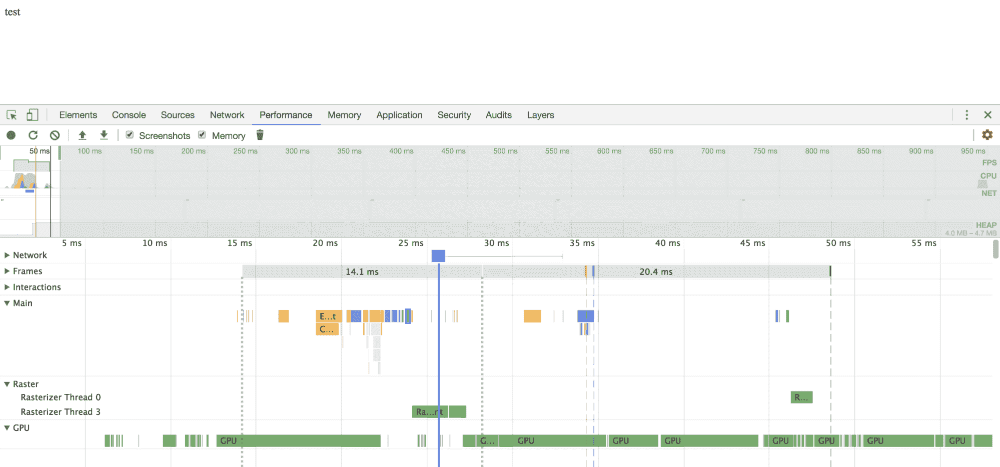

难以理解，对吧？好吧，让我们把它分解成我们可以理解的小块。我们的主要关注点将是`main`部分（在截图中展开）。让我们放大一下，看看从左到右的事件是什么。

首先，我们将看到 beforeunload 事件：

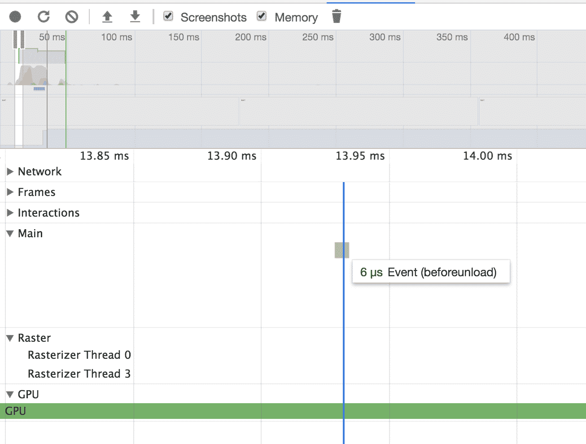

接下来，我们将看到更新图层树（我们稍后会讨论）：


现在我们注意到一个 Minor GC，这是一个特定于浏览器的事件（我们将在后面的部分讨论这个）：


然后，我们将注意`DOMContentLoaded`事件，然后是`Recalculate Style`事件，这是当我们的页面准备好进行交互时发生的事件：

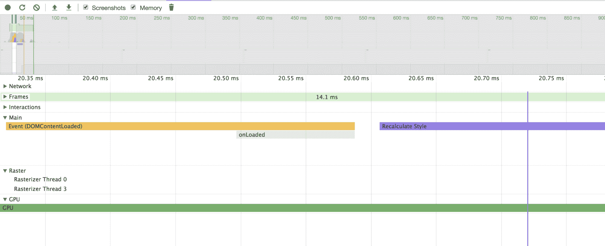

很酷，对吧？这与我们之前听说的浏览器完全一致。它们加载页面，然后在一切准备就绪时触发`DOMContentLoaded`。然而，请注意，还有另一个被触发的事件叫做 Minor GC。我们可以忽略这个，因为它是由浏览器内部处理的，与我们的代码结构几乎没有关系。

一旦 DOM 加载完成，我们注意到另一个被触发的事件叫做`Recalculate Style`，这正是它听起来的样子。DOM 已经准备好了，浏览器会检查并应用需要应用到这个元素的所有样式。然而，你可能会想，我们没有向我们的模板添加任何样式，对吧？那么，我们在谈论什么样式呢？默认情况下，所有浏览器都会向它们渲染的所有元素应用样式，这些被称为用户代理样式表。浏览器仍然需要将用户代理样式表样式添加到 CSSOM 中。

除了它是浏览器将安排元素的几何结构之外，我们还没有真正讨论`Layout`是什么，包括但不限于它们在页面上的大小、形状和位置。`Layout`也是一个事件，将被 CDT 记录下来，以显示浏览器在尝试重新排列布局时花费了多长时间。我们尽量将布局事件保持在最小范围内非常重要。为什么？因为`Layout`不是一个孤立的事件。它是由一系列其他事件（例如更新图层树和绘制 UI）链接在一起的，这些事件需要完成 UI 上元素的排列。

另一个重要的事情要考虑的是，`Layout`事件会为页面上受影响的所有元素触发，也就是说，即使一个深度嵌套的元素被改变，你的整个元素（或者根据改变而改变的周围元素）都会被重新布局。让我们看一个例子：

```js
<!DOCTYPE html>
<html>
    <head>

        <style>
            .parent {
                border: 1px solid black;
                padding: 10px;
            }

            .child {
                height: 20px;
                border: 1px solid red;
                padding: 5px;
            }
        </style>

    </head>

    <body>
        <div class="parent">
            <div class="child">
                child 1
            </div>
            <div class="child">
                child 2
            </div>
            <div class="child">
                child 3
            </div>
            <div class="child">
                child 4
            </div>
        </div>

        <button onclick="updateHeight();">update height</button>

        <script>
            function updateHeight() {
                var allEl = document.getElementsByTagName('div');
                var allElemLength = allEl.length;

                for(var i = 0; i < allElemLength; i++) {
                    allEl[i].style.height = '100px';
                }

            }
        </script>
    </body>
</html>
```

这很简单；我们有一个包含四个子元素的非常小的父元素的页面。我们有一个按钮，它将所有元素的高度设置为`100px`。现在让我们运行这个页面，并跟踪当我们点击按钮`update height`来改变元素的高度时的性能，我们在 UI 上看到以下内容：

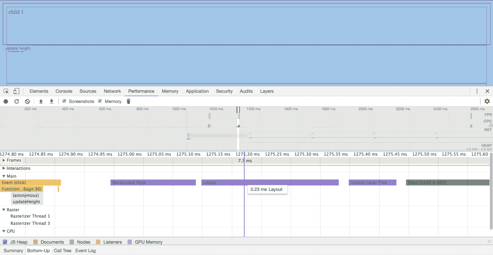

我们可以从前面的截图中看到，一旦点击事件开始，它触发了我们的函数，然后触发了一系列事件，包括`Layout`，用时 0.23 毫秒。然而，你可能会想，为什么在`Function`和`Layout`之间有一个`Recalculate Style`事件？还记得我们的老朋友用户代理样式表吗？它在按钮激活时设置了一些样式，这触发了`Recalculate Style`事件。

如果您想要删除元素的所有样式（例如在前面描述的按钮中），您可以通过将`all:unset`属性应用于您选择的元素来这样做。这将完全取消元素的样式。但是，它将减少`Recalculate Style`事件的时间，使其成为应用用户代理样式的一小部分。

现在让我们将 JavaScript 函数更改为仅更改页面上的第一个子元素的样式，而不是所有元素，并看看这如何影响我们的情况下`Layout`事件的执行：

```js
function updateHeight() {
 var allEl = document.getElementsByTagName('div');    
 allEl[1].style.height = '100px';  }
```

现在，当我们运行页面并分析点击方法的执行时，我们将在分析器中看到以下内容：

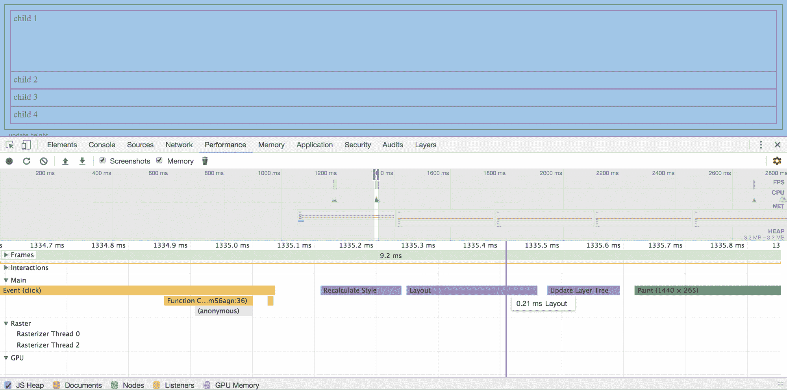

正如您在前面的屏幕截图中看到的，整个页面的布局仍然需要 0.21 毫秒，这与我们先前的值并没有太大不同。在我们先前的示例中，我们有五个更多的元素。但是，在生产应用程序中，这可能会扩展到数千个元素，并且为了平稳过渡，我们希望保持我们的`Layout`事件在 16 毫秒以下（60fps）。

很可能，您可能永远不会遇到这个问题，但如果您遇到了，处理它的最简单方法是首先检查您的浏览器是否支持最新的布局模型。在大多数浏览器中，它将是 flexbox 或 grid，因此最好选择它而不是浮动、百分比或定位。

# HTML 图层

正如我们在前面的示例中所看到的，一旦元素重新布局，我们就会`Paint`元素，也就是说，用颜色填充像素，这应该是元素在给定位置的一部分（由`Layout`确定）。

一旦`Paint`事件完成，浏览器就会执行`Composition`，基本上是我们的浏览器将页面的所有部分放在一起。部分越少，页面加载速度就越快。此外，如果`Composition`的某个部分花费太长时间，那么整个页面加载就会延迟。

我们如何处理这些花费太长时间的操作？我们可以通过将它们提升到它们自己的图层来处理。有一些 CSS 操作，我们可以对元素执行，这将使它们提升到它们自己的图层。这对我们意味着什么？这些提升的元素现在将被延迟并在 GPU 上作为纹理执行。我们不再需要担心我们的浏触发这些提升元素的`Layout`或`Paint`事件，我们只关心元素的`Composition`。

从前面的示例中，到目前为止，我们已经确定了任何更改流程的前四个步骤如下：

1.  JavaScript 文件被执行

1.  样式重新计算

1.  `Layout`事件

1.  `Paint`事件

现在，我们可以将以下步骤添加到列表中，以完全在 UI 上呈现元素：

5. `Composition`

6. 多线程光栅化

*步骤 6*仅仅是将我们的像素渲染到 UI 上，可以批处理并在并行线程上运行。让我们创建一个简单的 HTML 并看看它如何渲染到 UI 上的单个图层：

```js
<!DOCTYPE html>
<html>
<head>

</head>

<body>
    <div>
        Default Layer
    </div>
</body>
</html>
```

我们可以通过导航到“设置”选项，然后选择“更多工具”和“图层”来从 DevTool 中访问图层。在加载先前显示的页面时，我们将在图层中看到以下内容：

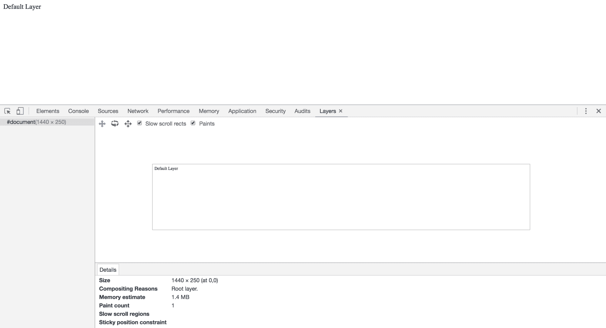

当我们对前面的页面进行分析时，我们可以看到，如预期的那样，页面在`Main`线程上加载和呈现 UI：

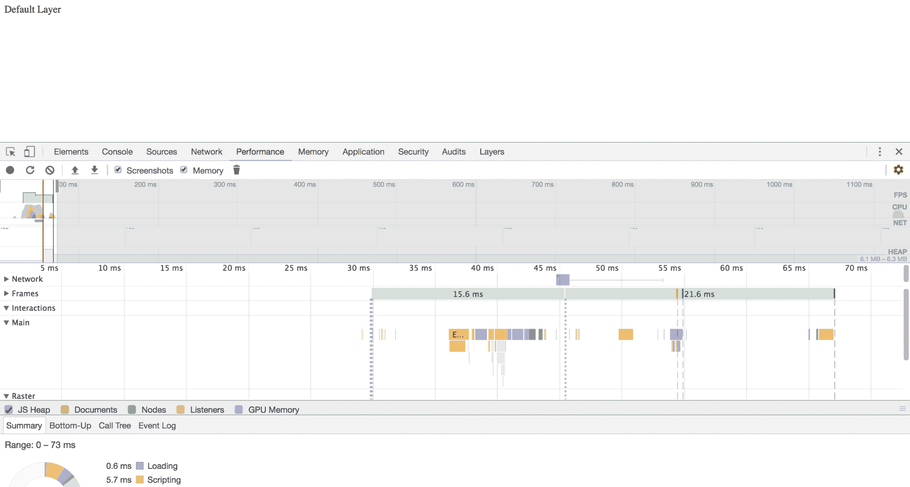

现在让我们将此示例更改为加载到自己的图层上，以便我们可以完全跳过`Layout`和`Paint`部分。要将元素加载到自己的图层上，我们只需要给它一个 CSS 变换或将`will-change`属性设置为 transform:

```js
.class-name {
    will-change: transform:
    // OR
    transform: translateZ(0); <- does nothing except loading to a new Layer
}
```

以下是一个更新后的示例模板，它使用 CSS3`transform`属性：

```js
<!DOCTYPE html>
<html>
<head>
    <style>
        div {
            width: 100px;
            height: 100px;
            margin: 200px;
            border: 1px solid black;
            animation: spin 1s infinite;
            transition: all 0.35s ease;
        }

        @keyframes spin {
            from {
                transform: rotate(0deg);
            }

            to {
                transform: rotate(360deg);
            }
        }
    </style>
</head>

<body>
    <div></div>
</body>
</html>
```

在前面的代码中，我们添加了一个非常小的动画，它将无限旋转元素。当我们重新加载页面时，我们可以看到它已被添加到自己的图层中：


不仅如此，当我们记录修改模板的性能时，我们会看到一些非常有趣的东西：

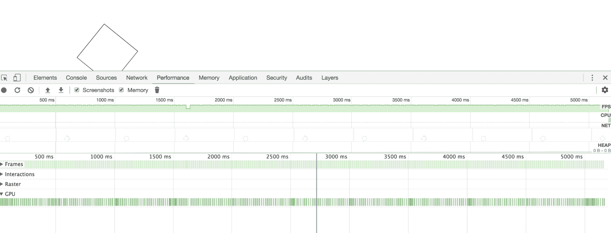

正如我们在前面的截图中看到的，浏览器完全将“层”推迟到 GPU 作为新的纹理，从那时起，GPU 处理元素的渲染/更新，而不是浏览器。

好吧，这是否意味着我们将每个元素加载到自己的“层”上，然后让 GPU 接管？当然不是，因为每个“层”在内部都需要内存，并且将成千上万的元素加载到每个“层”上将是适得其反的。例如，我们有意将元素提升到自己的“层”的唯一时间是当元素在“合成”期间花费太长时间，并且正在阻碍操作，例如滚动或滑动时。另一个用例可能是当您有一个单一元素执行多个更改时，例如动画高度、宽度和背景颜色。这将不断调用渲染过程的所有步骤（从“布局”到光栅化），如果我们知道它仅限于这些少量更改，那么我们实际上不需要做所有这些。我们可以简单地将此元素提升到自己的层并完成。

# CSS 优化

如果您有使用任何预处理器框架（如 SCSS/LESS）的开发经验，那么 CSS 优化非常容易并且显而易见。当我们讨论 CSS 优化时，我们实际上在谈论两个不同但又相关的事情：

+   加载样式表

+   渲染和应用样式

# 编码实践

有许多编码实践可以适应和学习，以使我们的应用程序表现更好。其中大多数可能看起来微不足道，但当扩展到大型应用程序时确实很重要。我们将用示例讨论其中一些技术。

# 对常见的 ENUM 使用较小的值

由于我们正在讨论减少页面加载时间，因此一种快速的方法是通过删除 CSS 文件本身中的冗余来实现：

+   使用`#FFFFFF`？改用`#FFF`，这是相同的 RGB 值，用简短表示。

+   如果值为`0`，则不要在属性值后添加`px`。

+   如果尚未使用，请使用缩小。这会将所有正在使用的 CSS 文件连接起来，并删除所有空格和换行符。

+   在通过网络传输时使用 GZip 压缩已经被缩小的文件。这很容易，浏览器非常擅长高效地解压文件。

+   注意手头的特定于浏览器的优化。例如，在 Chrome 的情况下，我们不必以`rgba(x,y,z,a)`格式应用样式。我们可以在开发过程中应用它为`rgba`，并使用 DevTool 提取相应的 HEX 值。简单地检查相关元素，同时按下*Shift*点击小矩形：

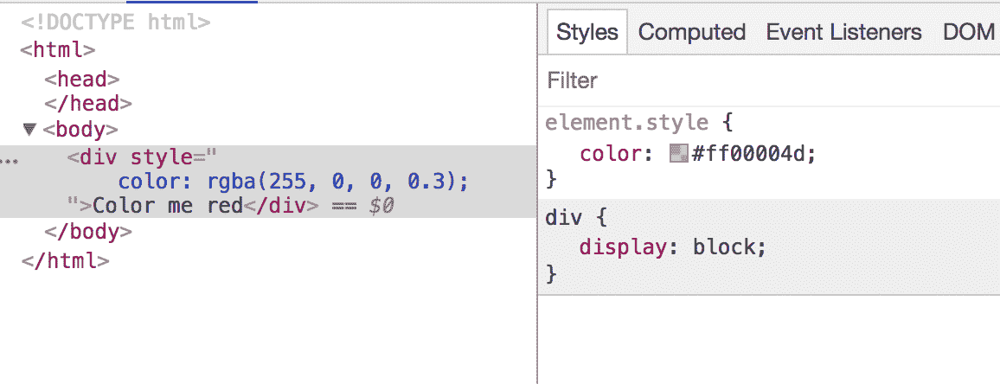

# 使用简写属性

使用简写属性是加快页面加载速度的一种方法。尽管听起来很明显，但有时候当我们在舒适的笔记本电脑上工作时，我们会认为浏览器和网络是理所当然的，而忘记考虑那些使用 3G 设备的用户。因此，下次您想要为元素设置背景或边框样式时，请确保它们都被折叠并使用简写方式编写。

有时，您可能会遇到这样的情况，您只想覆盖某个元素样式的一个属性。例如，如果您想在元素的三个边上应用边框，请使用以下方法：

```js
.okay {
    border-left: 1px solid black;
    border-right: 1px solid black;
    border-bottom: 1px solid black;
} // 114 characters including spaces

.better {
    border: 1px solid black;
    border-top: 0;
} // 59 characters including spaces
```

# 避免复杂的 CSS 选择器

每当您创建 CSS 样式时，都必须了解将这些样式应用于任何元素对浏览器都有成本。我们可以像分析 JavaScript 一样分析我们的 CSS 选择器，并得出我们应用的每种样式的最佳和最坏情况运行时性能。

例如，考虑我们有以下样式：

```js
.my-class > div > ul.other-class .item:nth-child(3) {
```

这种复杂性要比简单地创建一个类并直接分配给元素本身要高得多：

```js
.my-class-child {
```

我们的浏览器不再需要检查每个元素是否完全符合先前定义的样式层次结构。基于这个概念发展出的一种技术称为**块-元素-修饰符**（**BEM**），这是非常容易理解的。给您的元素一个单一的类名，并尽量不要嵌套它们：

因此，假设您的模板如下所示：

```js
<div class="nav">
 <a href="#" class="nav__trigger">hamburger_icon</a>   <ul class="nav__items"> <li class="nav__item"> <a href="#" class="nav__link">About</a> </li>   <li class="nav__item"> <a href="#" class="nav__link">Blog</a> </li>   <li class="nav__item"> <a href="#" class="nav__link">Contact</a> </li> </ul> </div>
```

您可以使用 BEM 应用样式，如下所示：

```js
.nav {
    /* styles */ }

.nav__items {
    /* styles */ }

.nav__item {
    /* styles */ }

.nav__link {
    /* styles */ }

.nav__link--active {
    /* styles */ }
```

如果您需要为元素添加自定义样式，可以创建一个新类并直接应用，或者可以将嵌套与当前级别结合起来：

```js
.nav__item--last-child--active {
    /* styles */ }
```

# 理解浏览器

与 HTML 渲染类似，CSS 解析和渲染也是复杂的过程，浏览器非常轻松地隐藏了这些过程。了解我们可以避免什么总是有好处的。让我们以与 HTML 相同的示例为例，讨论 Chrome 如何处理这些问题。

# 避免重绘和回流

让我们首先简要讨论一下重绘和回流是什么：

**重绘**：浏览器在元素的非几何属性发生变化时执行的操作，例如背景颜色、文本颜色等。

**回流**：浏览器执行的操作，因为元素（或其父元素）的几何变化，直接或通过计算属性。这个过程与之前讨论的`Layout`相同。

虽然我们无法完全防止重绘和回流事件，但我们肯定可以在最小化触发这些操作的更改中发挥作用。几乎所有 DOM `read`操作（例如`offsetWidth`和`getClientRects`）都会触发`Layout`事件，因为这些读操作的值是按需进行的，浏览器在明确请求之前不关心它们的值。此外，每当我们修改 DOM 时，`Layout`都会失效，如果我们需要下次读取 DOM 元素属性，它将不得不重新计算。

# 关键渲染路径（CRP）

到目前为止，我们已经看到了如何优化页面加载（减少负载、大小等），然后我们谈到了渲染后需要考虑的事情。关键渲染路径是优化页面加载的技术，即在折叠线之上（即在任何滚动之前显示的页面顶部部分）的初始加载。这也被称为**交互时间**（**TTI**）或**首字节时间**（**TTFB**），我们希望减少以保持页面加载速度。

从技术上讲，CRP 包括以下步骤：

1.  接收并开始解析 HTML。

1.  下载并构建 CSSOM。

1.  下载并执行 JS。

1.  完成构建 DOM。

1.  创建渲染树。

因此，如果我们希望我们的 TTI 低，很明显，我们需要尽快构建我们的 DOM 和 CSSOM，而不需要任何阻塞渲染的 CSS 或阻塞解析器的 JS 文件。我们的 TTI 低的一个指标是我们的`DOMContentLoaded`事件快速触发，因为 DCL 仅在 DOM 和 CSSOM 准备就绪时触发。让我们看下面的示例模板：

```js
<html>
<head>
    <title>CRP Blank</title>
</head>
<body>
    <div>Blank</div>
</body>
</html>
```

我们可以看到它非常简洁，甚至没有加载任何外部样式或脚本。这对于网页来说非常不寻常，但它作为一个很好的例子。当我们运行这个页面并打开网络选项卡时，我们可以看到以下内容：

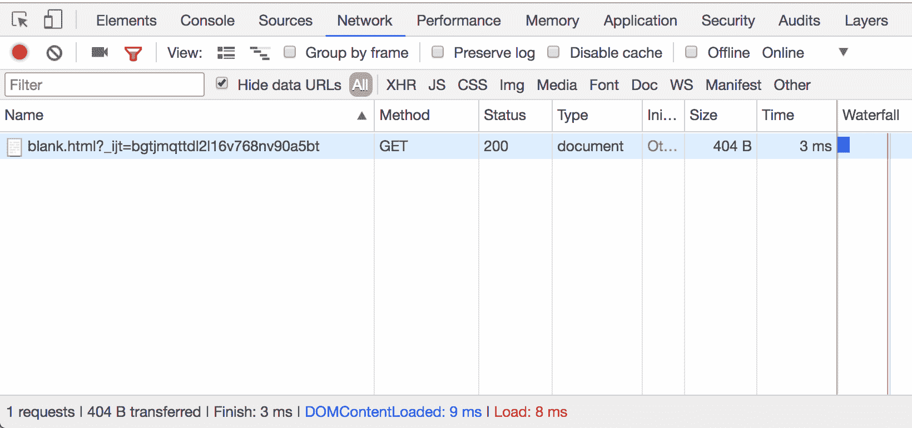

然而，我们提到的 HTML 是非常不寻常的。很可能，我们将加载多个外部 CSS 和 JS 文件到我们的页面中。在这种情况下，我们的 DCL 事件会被延迟。让我们在`blank.html`文件中添加空白的 CSS 和 JS 文件以加载：

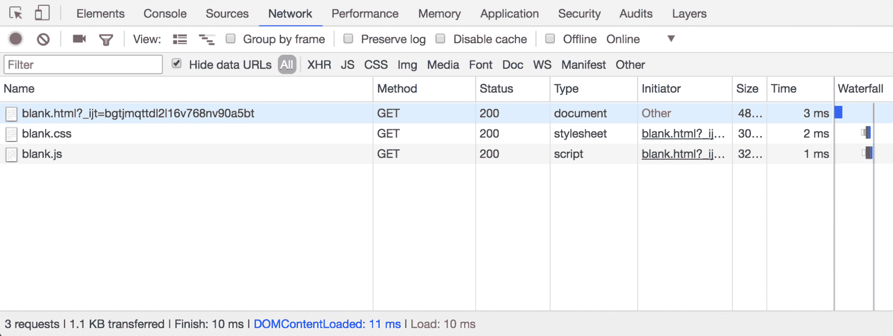

在这里，我们可以看到，即使没有太多要加载，DCL 事件也被推迟，直到浏览器下载并运行 JS 文件，因为 JS 文件的获取和执行是渲染阻塞操作。我们的目标现在更加明确：我们需要将 DCL 减少到最低限度，并且从目前我们已经看到的情况来看，我们需要尽快加载 HTML，而其他所有内容可以在初始页面被渲染后（或者至少正在被渲染时）加载。之前我们已经看到，我们可以使用 `async` 关键字和脚本标签一起使 JavaScript 异步加载和执行。现在让我们使用相同的方法来使我们的页面加载更快：

```js
<html>
<head>
    <title>CRP Blank</title>
    <link rel="stylesheet" href="blank.css">
</head>
<body>
    <div>Blank</div>

    <script async src="blank.js"></script>
</body>
</html>
```

现在，当我们打开网络选项卡运行这个页面时，我们会看到以下内容：

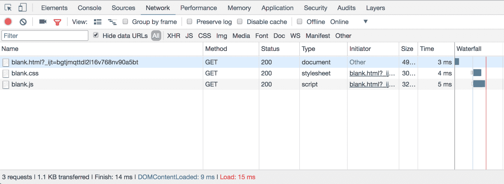

我们可以看到 DCL（在 *瀑布* 选项卡下表示为蓝色垂直线）发生在 CSS 和 JS 文件被下载和执行之前。使用 `async` 属性的另一个优势是，`async` 属性表示 JavaScript 不依赖于 CSSOM，因此不需要被 CSSOM 构建阻塞。

# JavaScript 优化

有大量的在线资源可以讨论可以应用于 JavaScript 的各种优化。在本节中，我们将看一些这些微优化，并确定我们如何采取小步骤使我们的 JavaScript 更高效。

# 真值/假值比较

我们都曾经在某个时候编写过 if 条件或者依赖于 JavaScript 变量的真值或假值来分配默认值。尽管大多数时候这很有帮助，但我们需要考虑这样一个操作对我们的应用程序会造成什么影响。然而，在我们深入细节之前，让我们讨论一下在 JavaScript 中如何评估任何条件，特别是在这种情况下的 if 条件。作为开发者，我们倾向于做以下事情：

```js
if(objOrNumber) {
    // do something
}
```

这对大多数情况都适用，除非数字是 0，这种情况下会被评估为 false。这是一个非常常见的边缘情况，我们大多数人都会注意到。然而，JavaScript 引擎为了评估这个条件需要做些什么呢？它如何知道 objOrNumber 评估为 true 还是 false？让我们回到我们的 ECMA262 规范并提取 IF 条件规范 ([`www.ecma-international.org/ecma-262/5.1/#sec-12.5`](https://www.ecma-international.org/ecma-262/5.1/#sec-12.5))。以下是同样的摘录：

语义

The production IfStatement : If (Expression) Statement else Statement

Statement 的评估如下：

1.  让 exprRef 成为评估 Expression 的结果。

1.  如果 ToBoolean(GetValue(exprRef)) 是 true，那么

+   返回评估第一个 Statement 的结果。

1.  否则，

+   返回评估第二个 Statement 的结果。

现在，我们注意到我们传递的任何表达式都经历以下三个步骤：

1.  从 `Expression` 获取 `exprRef`。

1.  `GetValue` 在 `exprRef` 上调用。

1.  `ToBoolean` 被作为 *步骤 2* 的结果调用。

*步骤 1* 在这个阶段并不关心我们太多；可以这样想——一个表达式可以是像 `a == b` 这样的东西，也可以是像 `shouldIEvaluateTheIFCondition()` 方法调用这样的东西，也就是说，它是用来评估你的条件的东西。

*步骤 2* 提取了 `exprRef` 的值，也就是 10、true、undefined。在这一步中，我们根据 `exprRef` 的类型区分了值是如何提取的。你可以参考 [`www.ecma-international.org/ecma-262/5.1/#sec-8.7.1`](https://www.ecma-international.org/ecma-262/5.1/#sec-8.7.1) 中 `GetValue` 的详细信息。

*步骤 3* 然后根据以下表格（取自 [`www.ecma-international.org/ecma-262/5.1/#sec-9.2`](https://www.ecma-international.org/ecma-262/5.1/#sec-9.2)）将从 *步骤 2* 中提取的值转换为布尔值：

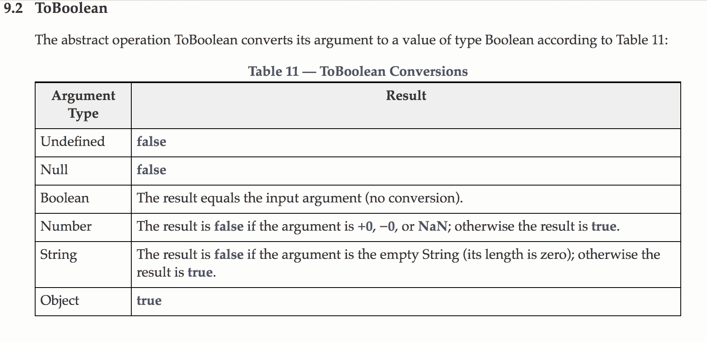

在每一步，您可以看到，如果我们能够提供直接的布尔值而不是真值或假值，那么总是有益的。

# 循环优化

我们可以深入研究 for 循环，类似于我们之前对 if 条件所做的（[`www.ecma-international.org/ecma-262/5.1/#sec-12.6.3`](https://www.ecma-international.org/ecma-262/5.1/#sec-12.6.3)），但是在循环方面可以应用更简单和更明显的优化。简单的更改可以极大地影响代码的质量和性能；例如：

```js
for(var i = 0; i < arr.length; i++) {
    // logic
}
```

前面的代码可以更改如下：

```js
var len = arr.length;

for(var i = 0; i < len; i++) {
    // logic
}
```

更好的是以相反的方式运行循环，这比我们之前看到的更快：

```js
var len = arr.length;

for(var i = len; i >= 0; i--) {
    // logic
}
```

# 条件函数调用

我们应用程序中的一些功能是有条件的。例如，日志记录或分析属于这一类。一些应用程序可能会在某段时间内关闭日志记录，然后重新打开。实现这一点最明显的方法是将日志记录方法包装在 if 条件中。但是，由于该方法可能被触发多次，我们可以以另一种方式进行优化：

```js
function someUserAction() {

    // logic

    if (analyticsEnabled) {
        trackUserAnalytics();
    }

}

// in some other class

function trackUserAnalytics() {

    // save analytics

}
```

不是前面的方法，我们可以尝试做一些稍微不同的事情，这样 V8 引擎可以优化代码的执行方式：

```js
function someUserAction() {

    // logic

   trackUserAnalytics();
}

// in some other class

function toggleUserAnalytics() {

    if(enabled) {
        trackUserAnalytics =  userAnalyticsMethod;
    } else {
        trackUserAnalytics = noOp;
    }
}

function userAnalyticsMethod() {

    // save analytics

}

// empty function
function noOp  {}
```

现在，前面的实现是一把双刃剑。原因很简单。JavaScript 引擎采用一种称为**内联缓存**（**IC**）的技术，这意味着 JS 引擎对某个方法的任何先前查找都将被缓存并在下次触发时重用；例如，如果我们有一个具有嵌套方法的对象 a.b.c，方法 a.b.c 只会被查找一次并存储在缓存中（IC）；如果下次调用 a.b.c，它将从 IC 中获取，并且 JS 引擎不会再次解析整个链。如果 a.b.c 链有任何更改，那么 IC 将被使无效，并且下次将执行新的动态查找，而不是从 IC 中检索。

因此，从我们之前的例子中，当我们将`noOp`分配给`trackUserAnalytics()`方法时，该方法路径被跟踪并保存在 IC 中，但它在内部删除了这个函数调用，因为它是对一个空方法的调用。但是，当它应用于具有一些逻辑的实际函数时，IC 直接指向这个新方法。因此，如果我们多次调用我们的`toggleUserAnalytics()`方法，它将不断使我们的 IC 失效，并且我们的动态方法查找必须每次发生，直到应用程序状态稳定下来（也就是说，不再调用`toggleUserAnalytics()`）。

# 图像和字体优化

在图像和字体优化方面，我们可以进行各种类型和规模的优化。但是，我们需要牢记我们的目标受众，并根据手头的问题调整我们的方法。

对于图像和字体，首要重要的是我们不要过度提供，也就是说，我们只请求和发送应用程序运行设备的尺寸所需的数据。

最简单的方法是为设备大小添加一个 cookie，并将其与每个请求一起发送到服务器。一旦服务器收到图像的请求，它可以根据发送到 cookie 的图像尺寸检索图像。大多数时候，这些图像是用户头像或评论某篇帖子的人员列表之类的东西。我们可以同意缩略图图像不需要与个人资料页面的大小相同，我们可以在传输基于图像的较小图像时节省一些带宽。

由于现在的屏幕具有非常高的**每英寸点数**（**DPI**），我们为屏幕提供的媒体需要值得。否则，应用程序看起来很糟糕，图像看起来都是像素化的。这可以通过使用矢量图像或`SVGs`来避免，这些图像可以通过网络进行 GZip 压缩，从而减小负载大小。

另一个不那么明显的优化是更改图像压缩类型。您是否曾经加载过一个页面，其中图像从顶部到底部以小的增量矩形加载？默认情况下，图像使用基线技术进行压缩，这是一种自上而下压缩图像的默认方法。我们可以使用诸如`imagemin`之类的库将其更改为渐进式压缩。这将首先以模糊的方式加载整个图像，然后是半模糊，依此类推，直到整个图像未经压缩地显示在屏幕上。解压渐进式 JPEG 可能需要比基线更长的时间，因此在进行此类优化之前进行测量非常重要。

基于这一概念的另一个扩展是一种仅适用于 Chrome 的图像格式，称为`WebP`。这是一种非常有效的图像服务方式，在生产中为许多公司节省了近 30%的带宽。使用`WebP`几乎和之前讨论的渐进式压缩一样简单。我们可以使用`imagemin-webp`节点模块，它可以将 JPEG 图像转换为`webp`图像，从而大大减小图像大小。

Web 字体与图像有些不同。图像会按需下载并呈现到 UI 上，也就是说，当浏览器从 HTML 或 CSS 文件中遇到图像时。然而，字体则有些不同。字体文件只有在渲染树完全构建时才会被请求。这意味着在发出字体请求时，CSSOM 和 DOM 必须准备就绪。此外，如果字体文件是从服务器而不是本地提供的，那么我们可能会看到未应用字体的文本（或根本没有文本），然后我们看到应用了字体，这可能会导致文本的闪烁效果。

有多种简单的技术可以避免这个问题：

+   在本地下载、提供和预加载字体文件：

```js
<link rel="preload" href="fonts/my-font.woff2" as="font">
```

+   在字体中指定 unicode 范围，以便浏览器可以根据实际期望的字符集和字形进行适应和改进：

```js
@font-face(
    ...
    unicode-range: U+000-5FF; // latin
    ...
)
```

+   到目前为止，我们已经看到我们可以将未经样式化的文本加载到 UI 上，并且按照我们期望的方式进行样式化；这可以通过使用字体加载 API 来改变，该 API 允许我们使用 JavaScript 加载和呈现字体：

```js
var font = new FontFace("myFont", "url(/my-fonts/my-font.woff2)", {
    unicodeRange: 'U+000-5FF'  });

// initiate a fetch without Render Tree font.load().then(function() {
   // apply the font 
  document.fonts.add(font);

   document.body.style.fontFamily = "myFont";  });
```

# JavaScript 中的垃圾回收

让我们快速看一下**垃圾回收**（**GC**）是什么，以及我们如何在 JavaScript 中处理它。许多低级语言为开发人员提供了在其代码中分配和释放内存的显式能力。然而，与这些语言不同，JavaScript 自动处理内存管理，这既是好事也是坏事。好处是我们不再需要担心需要分配多少内存，何时需要这样做，以及如何释放分配的内存。整个过程的坏处是，对于一个不了解的开发人员来说，这可能是一场灾难，他们可能最终得到一个可能会挂起和崩溃的应用程序。

幸运的是，理解 GC 的过程非常容易，并且可以很容易地融入到我们的编码风格中，以确保在内存管理方面编写最佳代码。内存管理有三个非常明显的步骤：

1.  将内存分配给变量：

```js
var a = 10; // we assign a number to a memory location referenced by variable a
```

1.  使用变量从内存中读取或写入：

```js
a += 3; // we read the memory location referenced by a and write a new value to it
```

1.  当不再需要时，释放内存。

现在，这是不明显的部分。浏览器如何知道我们何时完成变量`a`并且它已准备好进行垃圾回收？在我们继续讨论之前，让我们将其包装在一个函数中：

```js
function test() {
    var a = 10;
    a += 3;
    return a;
}
```

我们有一个非常简单的函数，它只是将我们的变量`a`相加并返回结果，然后执行结束。然而，实际上还有一步，这将在这个方法执行后发生，称为**标记和清除**（不是立即发生，有时也会在主线程上完成一批操作后发生）。当浏览器执行标记和清除时，它取决于应用程序消耗的总内存和内存消耗的速度。

# 标记和清除算法

由于没有准确的方法来确定特定内存位置的数据将来是否会被使用，我们将需要依赖于可以帮助我们做出这个决定的替代方法。在 JavaScript 中，我们使用**引用**的概念来确定变量是否仍在使用，如果不是，它可以被垃圾回收。

标记和清除的概念非常简单：从所有已知的活动内存位置到达哪些内存位置？如果有些地方无法到达，就收集它，也就是释放内存。就是这样，但是已知的活动内存位置是什么？它仍然需要一个起点，对吧？在大多数浏览器中，GC 算法会保留一个`roots`列表，从这些`roots`开始标记和清除过程。所有`roots`及其子代都被标记为活动，可以从这些`roots`到达的任何变量也被标记为活动。任何无法到达的东西都可以标记为不可到达，因此可以被收集。在大多数情况下，`roots`包括 window 对象。

所以，我们将回到之前的例子：

```js
function test() {
    var a = 10;
    a += 3;
    return a;
}
```

我们的变量 a 是局部的`test()`方法。一旦方法执行，就无法再访问该变量，也就是说，没有人持有该变量的引用，这时它可以被标记为垃圾回收，这样下次 GC 运行时，`var a`将被清除，分配给它的内存可以被释放。

# 垃圾回收和 V8

在 V8 中，垃圾回收的过程非常复杂（应该是这样）。因此，让我们简要讨论一下 V8 是如何处理的。

在 V8 中，内存（堆）分为两个主要代，即**新生代**和**老生代**。新生代和老生代都分配了一些内存（在*1MB*和*20MB*之间）。大多数程序和它们的变量在创建时都分配在新生代中。每当我们创建一个新变量或执行一个消耗内存的操作时，默认情况下会从新生代分配内存，这对内存分配进行了优化。一旦分配给新生代的总内存几乎被完全消耗，浏览器就会触发一个**Minor GC**，它基本上会删除不再被引用的变量，并标记仍然被引用且暂时不能被删除的变量。一旦一个变量经历了两次或更多次**Minor GC**，那么它就成为了老生代的候选对象，老生代的 GC 周期不像新生代那样频繁。当老生代达到一定大小时，会触发一个 Major GC，所有这些都由应用程序的启发式驱动，这对整个过程非常重要。因此，编写良好的程序会将更少的对象移动到老生代，从而触发更少的 Major GC 事件。

毋庸置疑，这只是对 V8 垃圾回收的一个非常高层次的概述，由于这个过程随着时间的推移不断变化，我们将转变方向，继续下一个主题。

# 避免内存泄漏

现在我们已经大致了解了 JavaScript 中垃圾回收的工作原理，让我们来看一些常见的陷阱，这些陷阱会阻止浏览器标记我们的变量进行垃圾回收。

# 将变量分配给全局范围

现在这应该是显而易见的了；我们讨论了 GC 机制如何确定根（即 window 对象）并将根及其子对象视为活动对象，永远不会标记它们进行垃圾回收。

所以，下次当你忘记在变量声明中添加`var`时，请记住你创建的全局变量将永远存在，永远不会被垃圾回收：

```js
function test() {
    a = 10; // created on window object
    a += 3;
    return a;
}
```

# 删除 DOM 元素和引用

非常重要的是，我们要尽量减少对 DOM 的引用，因此我们喜欢执行的一个众所周知的步骤是在我们的 JavaScript 中缓存 DOM 元素，这样我们就不必一遍又一遍地查询任何 DOM 元素。然而，一旦 DOM 元素被移除，我们需要确保这些方法也从我们的缓存中移除，否则它们永远不会被 GC 回收：

```js
var cache = {row: document.getElementById('row') };

function removeTable() {
 document.body.removeChild(document.getElementById('row'));
}
```

先前显示的代码从 DOM 中删除了`row`，但变量 cache 仍然引用 DOM 元素，因此阻止它被垃圾回收。这里还有一件有趣的事情需要注意，即使我们删除了包含`row`的表，整个表仍将保留在内存中，并且不会被 GC 回收，因为在内部引用表的 cache 中的`row`仍然指向表。

# 闭包边缘情况

闭包很棒；它们帮助我们处理很多棘手的情况，还为我们提供了模拟私有变量概念的方法。好吧，这一切都很好，但有时我们倾向于忽视与闭包相关的潜在缺点。这就是我们所知道和使用的。

```js
function myGoodFunc() {
 var a = new Array(10000000).join('*'); 
    // something big enough to cause a spike in memory usage   function myGoodClosure() {
        return a + ' added from closure';
    }

 myGoodClosure();
}

setInterval(myGoodFunc, 1000);
```

当我们在浏览器中运行这个脚本，然后对其进行分析，我们会看到预期的结果，即该方法消耗了恒定的内存量，然后被 GC 回收，并恢复到脚本消耗的基线内存：

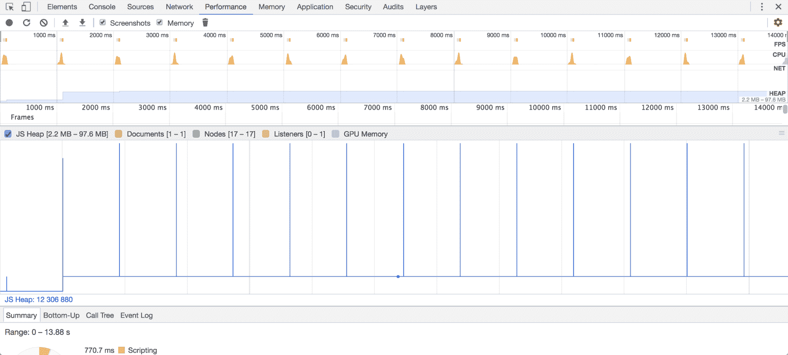

现在，让我们放大到其中一个峰值，并查看调用树，以确定在峰值时触发了哪些事件：

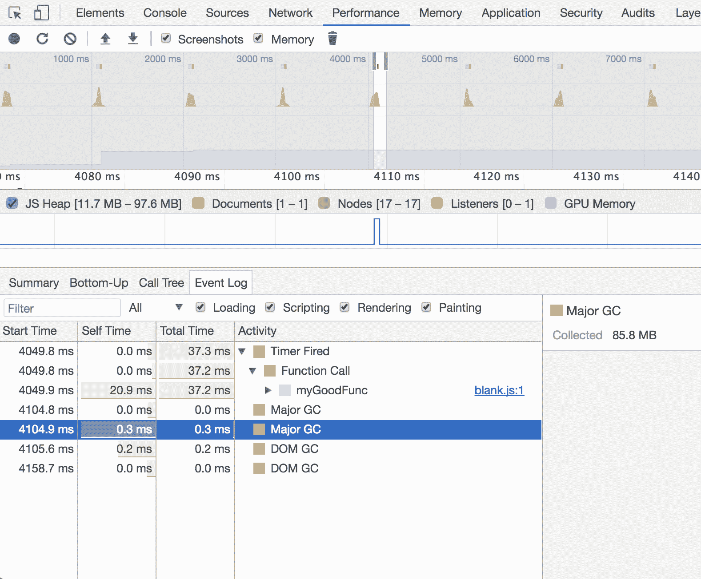

我们可以看到一切都按照我们的预期发生；首先，我们的`setInterval()`被触发，调用`myGoodFunc()`，一旦执行完成，就会有一个 GC，它收集数据，因此会有一个峰值，正如我们从前面的截图中所看到的。

现在，这是处理闭包时预期的流程或正常路径。然而，有时我们的代码并不那么简单，我们最终会在一个闭包中执行多个操作，有时甚至会嵌套闭包：

```js
function myComplexFunc() {
   var a = new Array(1000000).join('*');
   // something big enough to cause a spike in memory usage    function closure1() {
      return a + ' added from closure';
   }

   closure1();

   function closure2() {
      console.log('closure2 called')
   }

   setInterval(closure2, 100);
}

setInterval(myComplexFunc, 1000);
```

我们可以注意到在前面的代码中，我们扩展了我们的方法以包含两个闭包：`closure1`和`closure2`。尽管`closure1`仍然执行与以前相同的操作，但`closure2`将永远运行，因为我们将其运行频率设置为父函数的 1/10。此外，由于两个闭包方法共享父闭包作用域，在这种情况下变量 a，它永远不会被 GC 回收，从而导致巨大的内存泄漏，可以从以下的分析中看到：


仔细观察，我们可以看到 GC 正在被触发，但由于方法被调用的频率，内存正在慢慢泄漏（收集的内存少于创建的内存）：

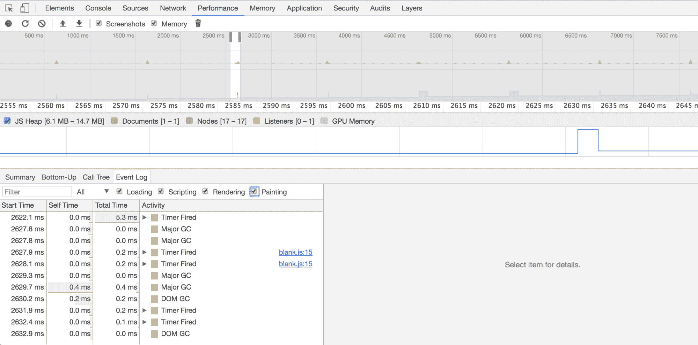

好吧，这是一个极端的边缘情况，对吧？这比实际更理论化——为什么会有人有两个嵌套的`setInterval()`方法和闭包。让我们看看另一个例子，其中我们不再嵌套多个`setInterval()`，但它是由相同的逻辑驱动的。

假设我们有一个创建闭包的方法：

```js
var something = null;

function replaceValue () {
   var previousValue = something;

   // `unused` method loads the `previousValue` into closure scope
  function </span>unused() {
      if (previousValue)
         console.log("hi");
   }

   // update something    something = {
      str: new Array(1000000).join('*'),

      // all closures within replaceValue share the same
 // closure scope hence someMethod would have access // to previousValue which is nothing but its parent // object (`something`)     // since `someMethod` has access to its parent // object, even when it is replaced by a new (identical) // object in the next setInterval iteration, the previous // value does not get garbage collected because the someMethod // on previous value still maintains reference to previousValue // and so on.    someMethod: function () {}
   };
}

setInterval(replaceValue, 1000);
```

解决这个问题的一个简单方法是显而易见的，因为我们自己已经说过，对象 `something` 的先前值不会被垃圾回收，因为它引用了上一次迭代的 `previousValue`。因此，解决这个问题的方法是在每次迭代结束时清除 `previousValue` 的值，这样在卸载时 `something` 就没有任何东西可引用，因此可以看到内存分析的变化：

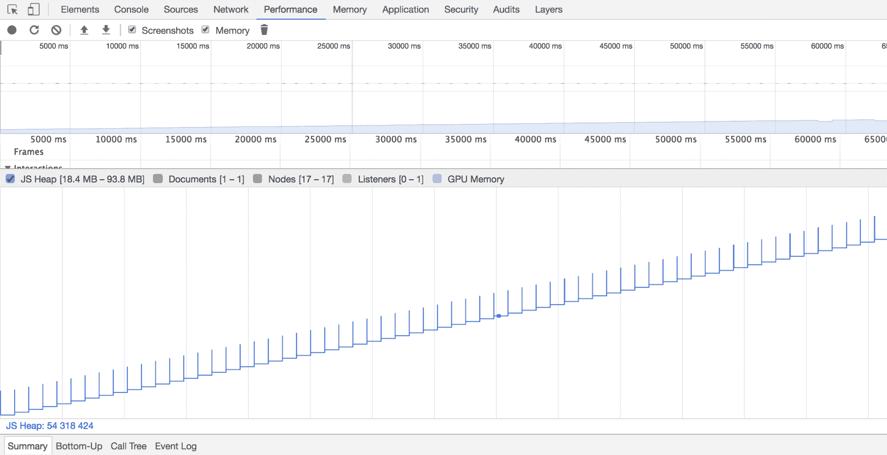

前面的图片变化如下：

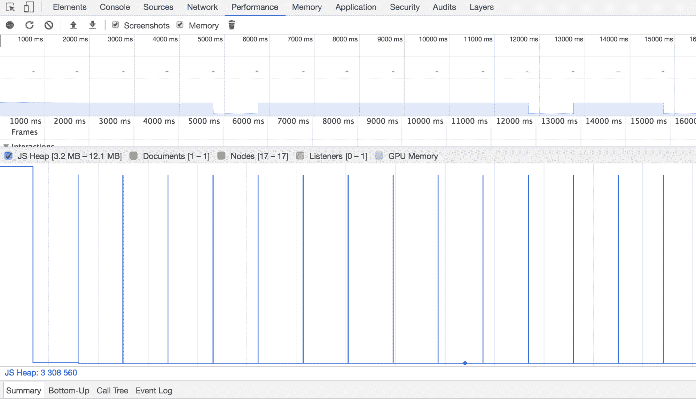

# 总结

在本章中，我们探讨了通过对我们为应用程序编写的 HTML、CSS 和 JavaScript 进行优化来改善代码性能的方法。非常重要的是要理解，这些优化可能对你有益，也可能没有，这取决于你尝试构建的应用程序。本章的主要收获应该是能够打开浏览器的内部，并且不害怕解剖和查看浏览器如何处理我们的代码。此外，要注意 ECMA 规范指南不断变化，但浏览器需要时间来跟上这些变化。最后但同样重要的是，不要过度优化或过早优化。如果遇到问题，首先进行测量，然后再决定瓶颈在哪里，然后再制定优化计划。

# 接下来是什么？

随着这一点，我们结束了这本书。我们希望你有一个很棒的学习经验，并且能够从这些技术中受益。JavaScript，就像它现在的样子，一直在不断发展。事情正在以快速的速度发生变化，跟上这些变化变得很困难。以下是一些建议，你可以尝试并修改：

1.  确定你感兴趣的领域。到现在为止，你已经知道 JavaScript 存在（并且在浏览器之外的很多东西中都很棒）。你更喜欢用户界面吗？你喜欢 API 和可扩展的微服务吗？你喜欢构建传感器来计算你每天消耗了多少咖啡吗？找到你的热情所在，并将你新学到的 JavaScript 概念应用到那里。概念是相同的，应用是不同的。

1.  订阅来自你感兴趣领域的新闻简报和邮件列表。你会惊讶于每封邮件每天或每周都能获取到的信息量。这有助于你保持警惕，你可以及时了解最新的技术。

1.  写一篇博客（甚至是 StackOverflow 的回答）来分享你所知道和学到的东西。当你把学到的东西写下来时，总是会有帮助的。有一天，你甚至可以用它来作为自己的参考。
